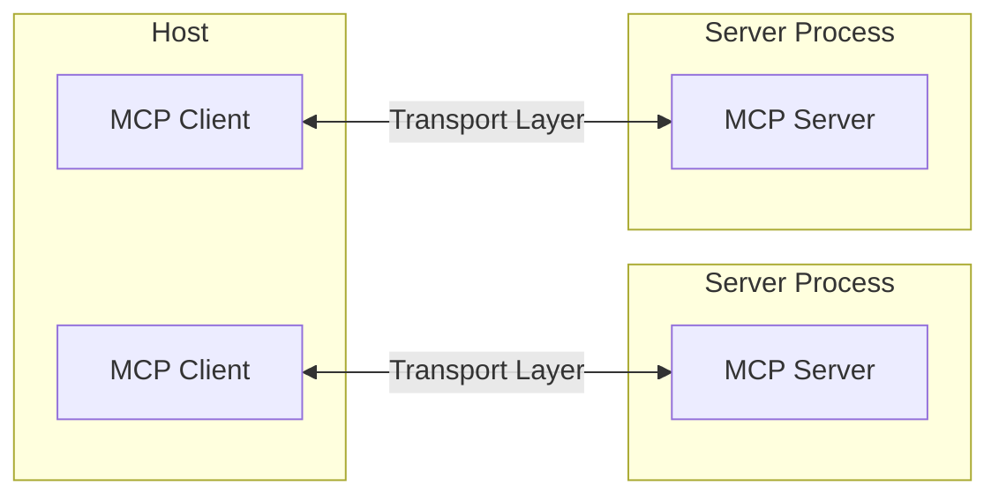
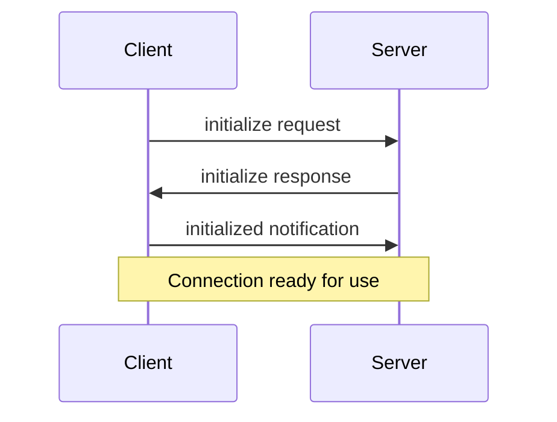
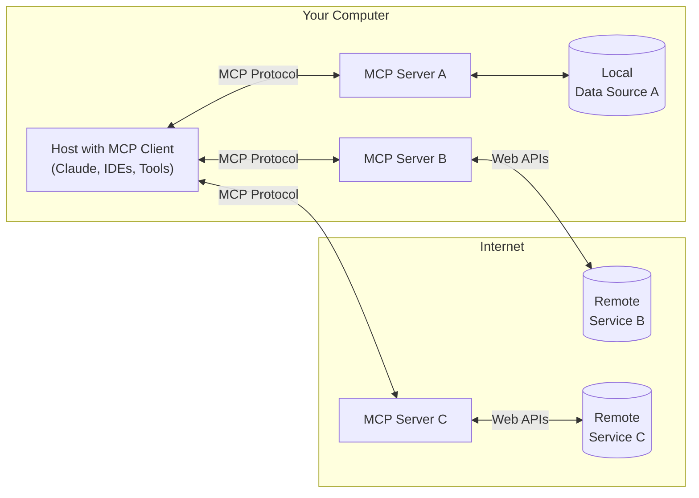
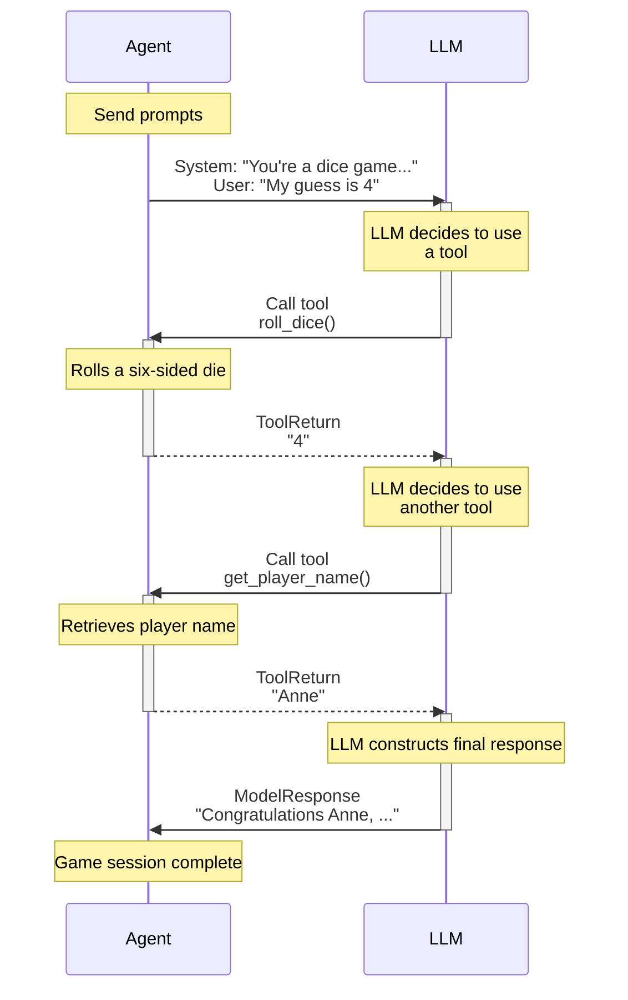

# **/*.py | **/*.md | **/*.toml | **/*.json | **/*.yml | **/*.yaml

[collect-files]

**Search:** ['**/*.py', '**/*.md', '**/*.toml', '**/*.json', '**/*.yml', '**/*.yaml']
**Exclude:** ['.venv', 'node_modules', '*.lock', '.git', '__pycache__', '*.pyc', '*.ruff_cache', 'logs', 'output']
**Include:** ['README.md', 'pyproject.toml', 'requirements.txt', '.env.example']
**Date:** 8/13/2025, 6:55:28 PM
**Files:** 24

=== File: README.md ===
# Scribe MCP Server

A general-purpose MCP (Model Context Protocol) server for document format conversion, with special optimizations for meeting transcripts.

## Features

- **Document Conversion**: Convert DOCX, PDF, PPTX, Excel, images, and audio files to Markdown
- **Transcript Optimization**: Special processing for meeting transcripts with speaker detection and formatting
- **Batch Processing**: Convert multiple documents at once
- **Recipe Integration**: Seamless integration with recipe-tool workflows
- **Security**: Path validation and safe file handling

## Installation

### Using uvx (Recommended)

```bash
# Run directly from GitHub
uvx --from git+https://github.com/robotdad/scribe.git scribe

# Or install locally for development
git clone https://github.com/robotdad/scribe.git
cd scribe
make install
```

### Using uv

```bash
# Install from the current directory
uv pip install -e .

# Or install dependencies manually
uv pip install mcp "markitdown[all]" pydantic
```

## Usage

### As MCP Server

```bash
# Start the server (if installed locally)
scribe

# Or run directly from GitHub
uvx --from git+https://github.com/robotdad/scribe.git scribe

# Or run from local installation
python -m scribe
```

### With Recipe Tool

```json
{
  "type": "mcp",
  "config": {
    "server": {
      "command": "uvx",
      "args": ["--from", "git+https://github.com/robotdad/scribe.git", "scribe"]
    },
    "tool_name": "convert_document",
    "arguments": {
      "file_path": "meeting_notes.docx",
      "optimize_transcript": true
    },
    "result_key": "converted_doc"
  }
}
```

## Tools

### `convert_document`

Convert a single document with standardized output format.

**Arguments:**
- `file_path` (str): Path to the input document
- `output_format` (str): Output format (default: "markdown")
- `optimize_transcript` (bool): Apply transcript optimizations (default: false)
- `extract_metadata` (bool): Extract additional metadata (default: false)
- `strip_images` (bool): Remove all image references from output. By default, images are converted to markdown syntax like ``. When true, all image references are completely removed (default: false)

**Returns:**

The server provides results in two formats for maximum compatibility:

1. **Structured Content** (Recommended): Access via `result.structuredContent`
   ```python
   # Direct access to structured data (no JSON parsing needed)
   content = result.structuredContent.content[0]
   meta = result.structuredContent.meta
   text = content.text
   filename = content.filename
   total_files = meta.total_files
   ```

2. **JSON String** (Legacy): Access via `result.content[0].text`
   ```python
   # Requires JSON parsing
   import json
   data = json.loads(result.content[0].text)
   text = data['content'][0]['text']
   ```

Both formats contain the same data structure:
```json
{
  "content": [
    {
      "type": "document",
      "source": "/path/to/file.docx",
      "filename": "file.docx", 
      "text": "converted document text...",
      "status": "success"
    }
  ],
  "meta": {
    "total_files": 1,
    "successful": 1,
    "failed": 0
  }
}
```

### `batch_convert`

Convert multiple documents in a directory.

**Arguments:**
- `directory` (str): Directory containing documents
- `pattern` (str): File pattern to match (default: "*")
- `output_format` (str): Output format (default: "markdown")
- `optimize_transcript` (bool): Apply transcript optimizations (default: false)
- `extract_metadata` (bool): Extract additional metadata (default: false)
- `recursive` (bool): Search subdirectories (default: false)

**Returns:**

Same dual format as `convert_document`:
- **Structured Content** (Recommended): `result.structuredContent` 
- **JSON String** (Legacy): `result.content[0].text`

Example data structure:
```json
{
  "content": [
    {
      "type": "document",
      "source": "/path/to/file1.docx",
      "filename": "file1.docx",
      "text": "converted document text...",
      "status": "success"
    },
    {
      "type": "document", 
      "source": "/path/to/file2.docx",
      "filename": "file2.docx",
      "text": "converted document text...",
      "status": "success"
    }
  ],
  "meta": {
    "total_files": 2,
    "successful": 2,
    "failed": 0
  }
}
```

### `get_document_info`

Get metadata about a document without converting it.

**Arguments:**
- `file_path` (str): Path to the document

**Returns:**
- File metadata including size, type, and modification date

## Supported Formats

- **Documents**: DOCX, PDF, PPTX, HTML, TXT, MD
- **Spreadsheets**: XLSX, XLS, CSV
- **Images**: JPG, PNG, GIF, BMP
- **Audio**: MP3, WAV, M4A
- **Other**: ZIP archives, JSON, XML

*Note: Actual format support depends on markitdown's capabilities and optional dependencies.*

## Image Handling

Images within documents are converted to markdown reference syntax (e.g., ``). The image files themselves are not embedded or copied - only references to the original file paths are preserved. Use the `strip_images` parameter to completely remove all image references from the output if desired.

## Development

```bash
# Install development dependencies
make install

# Run tests
make test

# Format code
make format

# Lint code
make lint

# Check project health
make doctor

# Build AI context files
make ai-context-files
```

## Architecture

Built with:
- **FastMCP**: Modern MCP server implementation
- **markitdown**: Microsoft's document conversion library
- **Pydantic**: Data validation and settings management

## License

MIT

=== File: ai_context/DEV_GUIDE_FOR_PYTHON.md ===
# Dev Guide for Python

When contributing to the Python codebase, please follow these guidelines to ensure consistency and maintainability.

- Place import statements at the top of the file, however, where appropriate, perform imports inside functions to avoid circular dependencies.
- All optional parameters should be typed as `Optional[Type]` and default to `None` unless otherwise specified.
- Set types for all variables, including `self` variables in classes.
- Use `List`, `Dict`, and other type hints from the `typing` module for type annotations, include the type of the list or dictionary.
- Initialize any variables that will be used outside of a block prior to the block, including `if`, `for`, `while`, `try`, etc. to avoid issues with variables that are possibly unbound on some code paths.
- If a variable could be `None`, verify that it is not `None` before using it.
- Assume that all dependencies mentioned in the component spec or docs are installed, do not write guards for them.
- Do not create main functions for components that do not have a main function listed in the spec.
- Use full names for variables, classes, and functions. For example, use `get_workspace` instead of `gw`.
- When creating an instance of a class based on `BaseModel` from a dictionary, use `<ClassName>.model_validate(<dict>)` instead of `<ClassName>(**<dict>)` to ensure that the model is validated.
- For `__init__.py` files, use `__all__` to define the public API of the module.


=== File: ai_context/IMPLEMENTATION_PHILOSOPHY.md ===
# Implementation Philosophy

This document outlines the core implementation philosophy and guidelines for software development projects. It serves as a central reference for decision-making and development approach throughout the project.

## Core Philosophy

Embodies a Zen-like minimalism that values simplicity and clarity above all. This approach reflects:

- **Wabi-sabi philosophy**: Embracing simplicity and the essential. Each line serves a clear purpose without unnecessary embellishment.
- **Occam's Razor thinking**: The solution should be as simple as possible, but no simpler.
- **Trust in emergence**: Complex systems work best when built from simple, well-defined components that do one thing well.
- **Present-moment focus**: The code handles what's needed now rather than anticipating every possible future scenario.
- **Pragmatic trust**: The developer trusts external systems enough to interact with them directly, handling failures as they occur rather than assuming they'll happen.

This development philosophy values clear documentation, readable code, and belief that good architecture emerges from simplicity rather than being imposed through complexity.

## Core Design Principles

### 1. Ruthless Simplicity

- **KISS principle taken to heart**: Keep everything as simple as possible, but no simpler
- **Minimize abstractions**: Every layer of abstraction must justify its existence
- **Start minimal, grow as needed**: Begin with the simplest implementation that meets current needs
- **Avoid future-proofing**: Don't build for hypothetical future requirements
- **Question everything**: Regularly challenge complexity in the codebase

### 2. Architectural Integrity with Minimal Implementation

- **Preserve key architectural patterns**: MCP for service communication, SSE for events, separate I/O channels, etc.
- **Simplify implementations**: Maintain pattern benefits with dramatically simpler code
- **Scrappy but structured**: Lightweight implementations of solid architectural foundations
- **End-to-end thinking**: Focus on complete flows rather than perfect components

### 3. Library Usage Philosophy

- **Use libraries as intended**: Minimal wrappers around external libraries
- **Direct integration**: Avoid unnecessary adapter layers
- **Selective dependency**: Add dependencies only when they provide substantial value
- **Understand what you import**: No black-box dependencies

## Technical Implementation Guidelines

### API Layer

- Implement only essential endpoints
- Minimal middleware with focused validation
- Clear error responses with useful messages
- Consistent patterns across endpoints

### Database & Storage

- Simple schema focused on current needs
- Use TEXT/JSON fields to avoid excessive normalization early
- Add indexes only when needed for performance
- Delay complex database features until required

### MCP Implementation

- Streamlined MCP client with minimal error handling
- Utilize FastMCP when possible, falling back to lower-level only when necessary
- Focus on core functionality without elaborate state management
- Simplified connection lifecycle with basic error recovery
- Implement only essential health checks

### SSE & Real-time Updates

- Basic SSE connection management
- Simple resource-based subscriptions
- Direct event delivery without complex routing
- Minimal state tracking for connections

### Event System

- Simple topic-based publisher/subscriber
- Direct event delivery without complex pattern matching
- Clear, minimal event payloads
- Basic error handling for subscribers

### LLM Integration

- Direct integration with PydanticAI
- Minimal transformation of responses
- Handle common error cases only
- Skip elaborate caching initially

### Message Routing

- Simplified queue-based processing
- Direct, focused routing logic
- Basic routing decisions without excessive action types
- Simple integration with other components

## Development Approach

### Vertical Slices

- Implement complete end-to-end functionality slices
- Start with core user journeys
- Get data flowing through all layers early
- Add features horizontally only after core flows work

### Iterative Implementation

- 80/20 principle: Focus on high-value, low-effort features first
- One working feature > multiple partial features
- Validate with real usage before enhancing
- Be willing to refactor early work as patterns emerge

### Testing Strategy

- Emphasis on integration and end-to-end tests
- Manual testability as a design goal
- Focus on critical path testing initially
- Add unit tests for complex logic and edge cases
- Testing pyramid: 60% unit, 30% integration, 10% end-to-end

### Error Handling

- Handle common errors robustly
- Log detailed information for debugging
- Provide clear error messages to users
- Fail fast and visibly during development

## Decision-Making Framework

When faced with implementation decisions, ask these questions:

1. **Necessity**: "Do we actually need this right now?"
2. **Simplicity**: "What's the simplest way to solve this problem?"
3. **Directness**: "Can we solve this more directly?"
4. **Value**: "Does the complexity add proportional value?"
5. **Maintenance**: "How easy will this be to understand and change later?"

## Areas to Embrace Complexity

Some areas justify additional complexity:

1. **Security**: Never compromise on security fundamentals
2. **Data integrity**: Ensure data consistency and reliability
3. **Core user experience**: Make the primary user flows smooth and reliable
4. **Error visibility**: Make problems obvious and diagnosable

## Areas to Aggressively Simplify

Push for extreme simplicity in these areas:

1. **Internal abstractions**: Minimize layers between components
2. **Generic "future-proof" code**: Resist solving non-existent problems
3. **Edge case handling**: Handle the common cases well first
4. **Framework usage**: Use only what you need from frameworks
5. **State management**: Keep state simple and explicit

## Practical Examples

### Good Example: Direct SSE Implementation

```python
# Simple, focused SSE manager that does exactly what's needed
class SseManager:
    def __init__(self):
        self.connections = {}  # Simple dictionary tracking

    async def add_connection(self, resource_id, user_id):
        """Add a new SSE connection"""
        connection_id = str(uuid.uuid4())
        queue = asyncio.Queue()
        self.connections[connection_id] = {
            "resource_id": resource_id,
            "user_id": user_id,
            "queue": queue
        }
        return queue, connection_id

    async def send_event(self, resource_id, event_type, data):
        """Send an event to all connections for a resource"""
        # Direct delivery to relevant connections only
        for conn_id, conn in self.connections.items():
            if conn["resource_id"] == resource_id:
                await conn["queue"].put({
                    "event": event_type,
                    "data": data
                })
```

### Bad Example: Over-engineered SSE Implementation

```python
# Overly complex with unnecessary abstractions and state tracking
class ConnectionRegistry:
    def __init__(self, metrics_collector, cleanup_interval=60):
        self.connections_by_id = {}
        self.connections_by_resource = defaultdict(list)
        self.connections_by_user = defaultdict(list)
        self.metrics_collector = metrics_collector
        self.cleanup_task = asyncio.create_task(self._cleanup_loop(cleanup_interval))

    # [50+ more lines of complex indexing and state management]
```

### Good Example: Simple MCP Client

```python
# Focused MCP client with clean error handling
class McpClient:
    def __init__(self, endpoint: str, service_name: str):
        self.endpoint = endpoint
        self.service_name = service_name
        self.client = None

    async def connect(self):
        """Connect to MCP server"""
        if self.client is not None:
            return  # Already connected

        try:
            # Create SSE client context
            async with sse_client(self.endpoint) as (read_stream, write_stream):
                # Create client session
                self.client = ClientSession(read_stream, write_stream)
                # Initialize the client
                await self.client.initialize()
        except Exception as e:
            self.client = None
            raise RuntimeError(f"Failed to connect to {self.service_name}: {str(e)}")

    async def call_tool(self, name: str, arguments: dict):
        """Call a tool on the MCP server"""
        if not self.client:
            await self.connect()

        return await self.client.call_tool(name=name, arguments=arguments)
```

### Bad Example: Over-engineered MCP Client

```python
# Complex MCP client with excessive state management and error handling
class EnhancedMcpClient:
    def __init__(self, endpoint, service_name, retry_strategy, health_check_interval):
        self.endpoint = endpoint
        self.service_name = service_name
        self.state = ConnectionState.DISCONNECTED
        self.retry_strategy = retry_strategy
        self.connection_attempts = 0
        self.last_error = None
        self.health_check_interval = health_check_interval
        self.health_check_task = None
        # [50+ more lines of complex state tracking and retry logic]
```

## Remember

- It's easier to add complexity later than to remove it
- Code you don't write has no bugs
- Favor clarity over cleverness
- The best code is often the simplest

This philosophy document serves as the foundational guide for all implementation decisions in the project.


=== File: ai_context/MODULAR_DESIGN_PHILOSOPHY.md ===
# Building Software with AI: A Modular Block Approach

_By Brian Krabach_\
_3/28/2025_

Imagine you're about to build a complex construction brick spaceship. You dump out thousands of tiny bricks and open the blueprint. Step by step, the blueprint tells you which pieces to use and how to connect them. You don't need to worry about the details of each brick or whether it will fit --- the instructions guarantee that every piece snaps together correctly. **Now imagine those interlocking bricks could assemble themselves** whenever you gave them the right instructions. This is the essence of our new AI-driven software development approach: **we provide the blueprint, and AI builds the product, one modular piece at a time.**

Like a brick model, our software is built from small, clear modules. Each module is a self-contained "brick" of functionality with defined connectors (interfaces) to the rest of the system. Because these connection points are standard and stable, we can generate or regenerate any single module independently without breaking the whole. Need to improve the user login component? We can have the AI rebuild just that piece according to its spec, then snap it back into place --- all while the rest of the system continues to work seamlessly. And if we ever need to make a broad, cross-cutting change that touches many pieces, we simply hand the AI a bigger blueprint (for a larger assembly or even the entire codebase) and let it rebuild that chunk in one go. **Crucially, the external system contracts --- the equivalent of brick studs and sockets where pieces connect --- remain unchanged.** This means even a regenerated system still fits perfectly into its environment, although inside it might be built differently, with fresh optimizations and improvements.

When using LLM-powered tools today, even what looks like a tiny edit is actually the LLM generating new code based on the specifications we provide. We embrace this reality and don't treat code as something to tweak line-by-line; **we treat it as something to describe and then let the AI generate to create or assemble.** By keeping each task *small and self-contained* --- akin to one page of a blueprint --- we ensure the AI has all the context it needs to generate that piece correctly from start to finish. This makes the code generation more predictable and reliable. The system essentially always prefers regeneration of a module (or a set of modules) within a bounded context, rather than more challenging edits at the code level. The result is code that's consistently in sync with its specification, built in a clean sweep every time.

# The Human Role: From Code Mechanics to Architects

In this approach, humans step back from being code mechanics and instead take on the role of architects and quality inspectors. Much like a master builder, a human defines the vision and specifications up front --- the blueprint for what needs to be built. But once the spec (the blueprint) is handed off, the human doesn't hover over every brick placement. In fact, they don't need to read the code (just as you don't examine each brick's material for flaws). Instead, they focus on whether the assembled product meets the vision. They work at the specification level or higher: designing requirements, clarifying the intended behavior, and then evaluating the finished module or system by testing its behavior in action. If the login module is rebuilt, for example, the human reviews it by seeing if users can log in smoothly and securely --- not by poring over the source code. This elevates human involvement to where it's most valuable, letting AI handle the heavy lifting of code construction and assembly.

# Building in Parallel

The biggest leap is that we don't have to build just one solution at a time. Because our AI "builders" work so quickly and handle modular instructions so well, we can spawn multiple versions of the software in parallel --- like having several brick sets assembled simultaneously. Imagine generating and testing multiple variants of a feature at once --- the AI could try several different recommendation algorithms for a product in parallel to see which performs best. It could even build the same application for multiple platforms simultaneously (web, mobile, etc.) by following platform-specific instructions. We could have all these versions built and tested side by side in a fraction of the time it would take a traditional team to do one. Each variant teaches us something: we learn what works best, which design is most efficient, which user experience is superior. Armed with those insights, we can refine our high-level specifications and then regenerate the entire system or any module again for another iteration. This cycle of parallel experimentation and rapid regeneration means we can innovate faster and more fearlessly. It's a development playground on a scale previously unimaginable --- all enabled by trusting our AI co-builders to handle the intricate assembly while we guide the vision.

In short, this brick-inspired, AI-driven approach flips the script of software development. We break the work into well-defined pieces, let AI assemble and reassemble those pieces as needed, and keep humans focused on guiding the vision and validating results. The outcome is a process that's more flexible, faster, and surprisingly liberating: we can reshape our software as easily as snapping together (or rebuilding) a model, and even build multiple versions of it in parallel. For our stakeholders, this means delivering the right solution faster, adapting to change without fear, and continually exploring new ideas --- brick by brick, at a pace and scale that set a new standard for innovation.


=== File: ai_context/SOFTWARE_DESIGN_PRINCIPLES.md ===
# Important Software Design Principles

Taken from "A Philosophy of Software Design" by John Ousterhout.

## Summary of Design Principles

Most important software design principles:

1. Complexity is incremental: you have to sweat the small stuff.
2. Working code isn’t enough.
3. Make continual small investments to improve system design.
4. Modules should be deep.
5. Interfaces should be designed to make the most common usage as simple as possible.
6. It’s more important for a module to have a simple interface than a simple implementation.
7. General-purpose modules are deeper.
8. Separate general-purpose and special-purpose code.
9. Different layers should have different abstractions.
10. Pull complexity downward.
11. Define errors out of existence.
12. Design it twice.
13. Comments should describe things that are not obvious from the code.
14. Software should be designed for ease of reading, not ease of writing.
15. The increments of software development should be abstractions, not features.
16. Separate what matters from what doesn’t matter and emphasize the things that matter.

## Summary of Red Flags

A few of of the most important red flags. The presence of any of these symptoms in a system suggests that there is a problem with the system’s design:

- Shallow Module: the interface for a class or method isn’t much simpler than its implementation.
- Information Leakage: a design decision is reflected in multiple modules.
- Temporal Decomposition: the code structure is based on the order in which operations are executed, not on information hiding.
- Overexposure: An API forces callers to be aware of rarely used features in order to use commonly used features.
- Pass-Through Method: a method does almost nothing except pass its arguments to another method with a similar signature.
- Repetition: a nontrivial piece of code is repeated over and over.
- Special-General Mixture: special-purpose code is not cleanly separated from general purpose code.
- Conjoined Methods: two methods have so many dependencies that its hard to understand the implementation of one without understanding the implementation of the other.
- Comment Repeats Code: all of the information in a comment is immediately obvious from the code next to the comment.
- Implementation Documentation Contaminates Interface: an interface comment describes implementation details not needed by users of the thing being documented.
- Vague Name: the name of a variable or method is so imprecise that it doesn’t convey much useful information.
- Hard to Pick Name: it is difficult to come up with a precise and intuitive name for an entity.
- Hard to Describe: in order to be complete, the documentation for a variable or method must be long.
- Nonobvious Code: the behavior or meaning of a piece of code cannot be understood easily.


=== File: ai_context/generated/PROJECT_FILES.md ===
# **/*.py | **/*.md | **/*.toml | **/*.json | **/*.yml | **/*.yaml

[collect-files]

**Search:** ['**/*.py', '**/*.md', '**/*.toml', '**/*.json', '**/*.yml', '**/*.yaml']
**Exclude:** ['.venv', 'node_modules', '*.lock', '.git', '__pycache__', '*.pyc', '*.ruff_cache', 'logs', 'output']
**Include:** ['README.md', 'pyproject.toml', 'requirements.txt', '.env.example']
**Date:** 8/13/2025, 6:54:47 PM
**Files:** 24

=== File: README.md ===
# Scribe MCP Server

A general-purpose MCP (Model Context Protocol) server for document format conversion, with special optimizations for meeting transcripts.

## Features

- **Document Conversion**: Convert DOCX, PDF, PPTX, Excel, images, and audio files to Markdown
- **Transcript Optimization**: Special processing for meeting transcripts with speaker detection and formatting
- **Batch Processing**: Convert multiple documents at once
- **Recipe Integration**: Seamless integration with recipe-tool workflows
- **Security**: Path validation and safe file handling

## Installation

### Using uvx (Recommended)

```bash
# Run directly from GitHub
uvx --from git+https://github.com/robotdad/scribe.git scribe

# Or install locally for development
git clone https://github.com/robotdad/scribe.git
cd scribe
make install
```

### Using uv

```bash
# Install from the current directory
uv pip install -e .

# Or install dependencies manually
uv pip install mcp "markitdown[all]" pydantic
```

## Usage

### As MCP Server

```bash
# Start the server (if installed locally)
scribe

# Or run directly from GitHub
uvx --from git+https://github.com/robotdad/scribe.git scribe

# Or run from local installation
python -m scribe
```

### With Recipe Tool

```json
{
  "type": "mcp",
  "config": {
    "server": {
      "command": "uvx",
      "args": ["--from", "git+https://github.com/robotdad/scribe.git", "scribe"]
    },
    "tool_name": "convert_document",
    "arguments": {
      "file_path": "meeting_notes.docx",
      "optimize_transcript": true
    },
    "result_key": "converted_doc"
  }
}
```

## Tools

### `convert_document`

Convert a single document with standardized output format.

**Arguments:**
- `file_path` (str): Path to the input document
- `output_format` (str): Output format (default: "markdown")
- `optimize_transcript` (bool): Apply transcript optimizations (default: false)
- `extract_metadata` (bool): Extract additional metadata (default: false)
- `strip_images` (bool): Remove all image references from output. By default, images are converted to markdown syntax like ``. When true, all image references are completely removed (default: false)

**Returns:**

The server provides results in two formats for maximum compatibility:

1. **Structured Content** (Recommended): Access via `result.structuredContent`
   ```python
   # Direct access to structured data (no JSON parsing needed)
   content = result.structuredContent.content[0]
   meta = result.structuredContent.meta
   text = content.text
   filename = content.filename
   total_files = meta.total_files
   ```

2. **JSON String** (Legacy): Access via `result.content[0].text`
   ```python
   # Requires JSON parsing
   import json
   data = json.loads(result.content[0].text)
   text = data['content'][0]['text']
   ```

Both formats contain the same data structure:
```json
{
  "content": [
    {
      "type": "document",
      "source": "/path/to/file.docx",
      "filename": "file.docx", 
      "text": "converted document text...",
      "status": "success"
    }
  ],
  "meta": {
    "total_files": 1,
    "successful": 1,
    "failed": 0
  }
}
```

### `batch_convert`

Convert multiple documents in a directory.

**Arguments:**
- `directory` (str): Directory containing documents
- `pattern` (str): File pattern to match (default: "*")
- `output_format` (str): Output format (default: "markdown")
- `optimize_transcript` (bool): Apply transcript optimizations (default: false)
- `extract_metadata` (bool): Extract additional metadata (default: false)
- `recursive` (bool): Search subdirectories (default: false)

**Returns:**

Same dual format as `convert_document`:
- **Structured Content** (Recommended): `result.structuredContent` 
- **JSON String** (Legacy): `result.content[0].text`

Example data structure:
```json
{
  "content": [
    {
      "type": "document",
      "source": "/path/to/file1.docx",
      "filename": "file1.docx",
      "text": "converted document text...",
      "status": "success"
    },
    {
      "type": "document", 
      "source": "/path/to/file2.docx",
      "filename": "file2.docx",
      "text": "converted document text...",
      "status": "success"
    }
  ],
  "meta": {
    "total_files": 2,
    "successful": 2,
    "failed": 0
  }
}
```

### `get_document_info`

Get metadata about a document without converting it.

**Arguments:**
- `file_path` (str): Path to the document

**Returns:**
- File metadata including size, type, and modification date

## Supported Formats

- **Documents**: DOCX, PDF, PPTX, HTML, TXT, MD
- **Spreadsheets**: XLSX, XLS, CSV
- **Images**: JPG, PNG, GIF, BMP
- **Audio**: MP3, WAV, M4A
- **Other**: ZIP archives, JSON, XML

*Note: Actual format support depends on markitdown's capabilities and optional dependencies.*

## Image Handling

Images within documents are converted to markdown reference syntax (e.g., ``). The image files themselves are not embedded or copied - only references to the original file paths are preserved. Use the `strip_images` parameter to completely remove all image references from the output if desired.

## Development

```bash
# Install development dependencies
make install

# Run tests
make test

# Format code
make format

# Lint code
make lint

# Check project health
make doctor

# Build AI context files
make ai-context-files
```

## Architecture

Built with:
- **FastMCP**: Modern MCP server implementation
- **markitdown**: Microsoft's document conversion library
- **Pydantic**: Data validation and settings management

## License

MIT

=== File: ai_context/DEV_GUIDE_FOR_PYTHON.md ===
# Dev Guide for Python

When contributing to the Python codebase, please follow these guidelines to ensure consistency and maintainability.

- Place import statements at the top of the file, however, where appropriate, perform imports inside functions to avoid circular dependencies.
- All optional parameters should be typed as `Optional[Type]` and default to `None` unless otherwise specified.
- Set types for all variables, including `self` variables in classes.
- Use `List`, `Dict`, and other type hints from the `typing` module for type annotations, include the type of the list or dictionary.
- Initialize any variables that will be used outside of a block prior to the block, including `if`, `for`, `while`, `try`, etc. to avoid issues with variables that are possibly unbound on some code paths.
- If a variable could be `None`, verify that it is not `None` before using it.
- Assume that all dependencies mentioned in the component spec or docs are installed, do not write guards for them.
- Do not create main functions for components that do not have a main function listed in the spec.
- Use full names for variables, classes, and functions. For example, use `get_workspace` instead of `gw`.
- When creating an instance of a class based on `BaseModel` from a dictionary, use `<ClassName>.model_validate(<dict>)` instead of `<ClassName>(**<dict>)` to ensure that the model is validated.
- For `__init__.py` files, use `__all__` to define the public API of the module.


=== File: ai_context/IMPLEMENTATION_PHILOSOPHY.md ===
# Implementation Philosophy

This document outlines the core implementation philosophy and guidelines for software development projects. It serves as a central reference for decision-making and development approach throughout the project.

## Core Philosophy

Embodies a Zen-like minimalism that values simplicity and clarity above all. This approach reflects:

- **Wabi-sabi philosophy**: Embracing simplicity and the essential. Each line serves a clear purpose without unnecessary embellishment.
- **Occam's Razor thinking**: The solution should be as simple as possible, but no simpler.
- **Trust in emergence**: Complex systems work best when built from simple, well-defined components that do one thing well.
- **Present-moment focus**: The code handles what's needed now rather than anticipating every possible future scenario.
- **Pragmatic trust**: The developer trusts external systems enough to interact with them directly, handling failures as they occur rather than assuming they'll happen.

This development philosophy values clear documentation, readable code, and belief that good architecture emerges from simplicity rather than being imposed through complexity.

## Core Design Principles

### 1. Ruthless Simplicity

- **KISS principle taken to heart**: Keep everything as simple as possible, but no simpler
- **Minimize abstractions**: Every layer of abstraction must justify its existence
- **Start minimal, grow as needed**: Begin with the simplest implementation that meets current needs
- **Avoid future-proofing**: Don't build for hypothetical future requirements
- **Question everything**: Regularly challenge complexity in the codebase

### 2. Architectural Integrity with Minimal Implementation

- **Preserve key architectural patterns**: MCP for service communication, SSE for events, separate I/O channels, etc.
- **Simplify implementations**: Maintain pattern benefits with dramatically simpler code
- **Scrappy but structured**: Lightweight implementations of solid architectural foundations
- **End-to-end thinking**: Focus on complete flows rather than perfect components

### 3. Library Usage Philosophy

- **Use libraries as intended**: Minimal wrappers around external libraries
- **Direct integration**: Avoid unnecessary adapter layers
- **Selective dependency**: Add dependencies only when they provide substantial value
- **Understand what you import**: No black-box dependencies

## Technical Implementation Guidelines

### API Layer

- Implement only essential endpoints
- Minimal middleware with focused validation
- Clear error responses with useful messages
- Consistent patterns across endpoints

### Database & Storage

- Simple schema focused on current needs
- Use TEXT/JSON fields to avoid excessive normalization early
- Add indexes only when needed for performance
- Delay complex database features until required

### MCP Implementation

- Streamlined MCP client with minimal error handling
- Utilize FastMCP when possible, falling back to lower-level only when necessary
- Focus on core functionality without elaborate state management
- Simplified connection lifecycle with basic error recovery
- Implement only essential health checks

### SSE & Real-time Updates

- Basic SSE connection management
- Simple resource-based subscriptions
- Direct event delivery without complex routing
- Minimal state tracking for connections

### Event System

- Simple topic-based publisher/subscriber
- Direct event delivery without complex pattern matching
- Clear, minimal event payloads
- Basic error handling for subscribers

### LLM Integration

- Direct integration with PydanticAI
- Minimal transformation of responses
- Handle common error cases only
- Skip elaborate caching initially

### Message Routing

- Simplified queue-based processing
- Direct, focused routing logic
- Basic routing decisions without excessive action types
- Simple integration with other components

## Development Approach

### Vertical Slices

- Implement complete end-to-end functionality slices
- Start with core user journeys
- Get data flowing through all layers early
- Add features horizontally only after core flows work

### Iterative Implementation

- 80/20 principle: Focus on high-value, low-effort features first
- One working feature > multiple partial features
- Validate with real usage before enhancing
- Be willing to refactor early work as patterns emerge

### Testing Strategy

- Emphasis on integration and end-to-end tests
- Manual testability as a design goal
- Focus on critical path testing initially
- Add unit tests for complex logic and edge cases
- Testing pyramid: 60% unit, 30% integration, 10% end-to-end

### Error Handling

- Handle common errors robustly
- Log detailed information for debugging
- Provide clear error messages to users
- Fail fast and visibly during development

## Decision-Making Framework

When faced with implementation decisions, ask these questions:

1. **Necessity**: "Do we actually need this right now?"
2. **Simplicity**: "What's the simplest way to solve this problem?"
3. **Directness**: "Can we solve this more directly?"
4. **Value**: "Does the complexity add proportional value?"
5. **Maintenance**: "How easy will this be to understand and change later?"

## Areas to Embrace Complexity

Some areas justify additional complexity:

1. **Security**: Never compromise on security fundamentals
2. **Data integrity**: Ensure data consistency and reliability
3. **Core user experience**: Make the primary user flows smooth and reliable
4. **Error visibility**: Make problems obvious and diagnosable

## Areas to Aggressively Simplify

Push for extreme simplicity in these areas:

1. **Internal abstractions**: Minimize layers between components
2. **Generic "future-proof" code**: Resist solving non-existent problems
3. **Edge case handling**: Handle the common cases well first
4. **Framework usage**: Use only what you need from frameworks
5. **State management**: Keep state simple and explicit

## Practical Examples

### Good Example: Direct SSE Implementation

```python
# Simple, focused SSE manager that does exactly what's needed
class SseManager:
    def __init__(self):
        self.connections = {}  # Simple dictionary tracking

    async def add_connection(self, resource_id, user_id):
        """Add a new SSE connection"""
        connection_id = str(uuid.uuid4())
        queue = asyncio.Queue()
        self.connections[connection_id] = {
            "resource_id": resource_id,
            "user_id": user_id,
            "queue": queue
        }
        return queue, connection_id

    async def send_event(self, resource_id, event_type, data):
        """Send an event to all connections for a resource"""
        # Direct delivery to relevant connections only
        for conn_id, conn in self.connections.items():
            if conn["resource_id"] == resource_id:
                await conn["queue"].put({
                    "event": event_type,
                    "data": data
                })
```

### Bad Example: Over-engineered SSE Implementation

```python
# Overly complex with unnecessary abstractions and state tracking
class ConnectionRegistry:
    def __init__(self, metrics_collector, cleanup_interval=60):
        self.connections_by_id = {}
        self.connections_by_resource = defaultdict(list)
        self.connections_by_user = defaultdict(list)
        self.metrics_collector = metrics_collector
        self.cleanup_task = asyncio.create_task(self._cleanup_loop(cleanup_interval))

    # [50+ more lines of complex indexing and state management]
```

### Good Example: Simple MCP Client

```python
# Focused MCP client with clean error handling
class McpClient:
    def __init__(self, endpoint: str, service_name: str):
        self.endpoint = endpoint
        self.service_name = service_name
        self.client = None

    async def connect(self):
        """Connect to MCP server"""
        if self.client is not None:
            return  # Already connected

        try:
            # Create SSE client context
            async with sse_client(self.endpoint) as (read_stream, write_stream):
                # Create client session
                self.client = ClientSession(read_stream, write_stream)
                # Initialize the client
                await self.client.initialize()
        except Exception as e:
            self.client = None
            raise RuntimeError(f"Failed to connect to {self.service_name}: {str(e)}")

    async def call_tool(self, name: str, arguments: dict):
        """Call a tool on the MCP server"""
        if not self.client:
            await self.connect()

        return await self.client.call_tool(name=name, arguments=arguments)
```

### Bad Example: Over-engineered MCP Client

```python
# Complex MCP client with excessive state management and error handling
class EnhancedMcpClient:
    def __init__(self, endpoint, service_name, retry_strategy, health_check_interval):
        self.endpoint = endpoint
        self.service_name = service_name
        self.state = ConnectionState.DISCONNECTED
        self.retry_strategy = retry_strategy
        self.connection_attempts = 0
        self.last_error = None
        self.health_check_interval = health_check_interval
        self.health_check_task = None
        # [50+ more lines of complex state tracking and retry logic]
```

## Remember

- It's easier to add complexity later than to remove it
- Code you don't write has no bugs
- Favor clarity over cleverness
- The best code is often the simplest

This philosophy document serves as the foundational guide for all implementation decisions in the project.


=== File: ai_context/MODULAR_DESIGN_PHILOSOPHY.md ===
# Building Software with AI: A Modular Block Approach

_By Brian Krabach_\
_3/28/2025_

Imagine you're about to build a complex construction brick spaceship. You dump out thousands of tiny bricks and open the blueprint. Step by step, the blueprint tells you which pieces to use and how to connect them. You don't need to worry about the details of each brick or whether it will fit --- the instructions guarantee that every piece snaps together correctly. **Now imagine those interlocking bricks could assemble themselves** whenever you gave them the right instructions. This is the essence of our new AI-driven software development approach: **we provide the blueprint, and AI builds the product, one modular piece at a time.**

Like a brick model, our software is built from small, clear modules. Each module is a self-contained "brick" of functionality with defined connectors (interfaces) to the rest of the system. Because these connection points are standard and stable, we can generate or regenerate any single module independently without breaking the whole. Need to improve the user login component? We can have the AI rebuild just that piece according to its spec, then snap it back into place --- all while the rest of the system continues to work seamlessly. And if we ever need to make a broad, cross-cutting change that touches many pieces, we simply hand the AI a bigger blueprint (for a larger assembly or even the entire codebase) and let it rebuild that chunk in one go. **Crucially, the external system contracts --- the equivalent of brick studs and sockets where pieces connect --- remain unchanged.** This means even a regenerated system still fits perfectly into its environment, although inside it might be built differently, with fresh optimizations and improvements.

When using LLM-powered tools today, even what looks like a tiny edit is actually the LLM generating new code based on the specifications we provide. We embrace this reality and don't treat code as something to tweak line-by-line; **we treat it as something to describe and then let the AI generate to create or assemble.** By keeping each task *small and self-contained* --- akin to one page of a blueprint --- we ensure the AI has all the context it needs to generate that piece correctly from start to finish. This makes the code generation more predictable and reliable. The system essentially always prefers regeneration of a module (or a set of modules) within a bounded context, rather than more challenging edits at the code level. The result is code that's consistently in sync with its specification, built in a clean sweep every time.

# The Human Role: From Code Mechanics to Architects

In this approach, humans step back from being code mechanics and instead take on the role of architects and quality inspectors. Much like a master builder, a human defines the vision and specifications up front --- the blueprint for what needs to be built. But once the spec (the blueprint) is handed off, the human doesn't hover over every brick placement. In fact, they don't need to read the code (just as you don't examine each brick's material for flaws). Instead, they focus on whether the assembled product meets the vision. They work at the specification level or higher: designing requirements, clarifying the intended behavior, and then evaluating the finished module or system by testing its behavior in action. If the login module is rebuilt, for example, the human reviews it by seeing if users can log in smoothly and securely --- not by poring over the source code. This elevates human involvement to where it's most valuable, letting AI handle the heavy lifting of code construction and assembly.

# Building in Parallel

The biggest leap is that we don't have to build just one solution at a time. Because our AI "builders" work so quickly and handle modular instructions so well, we can spawn multiple versions of the software in parallel --- like having several brick sets assembled simultaneously. Imagine generating and testing multiple variants of a feature at once --- the AI could try several different recommendation algorithms for a product in parallel to see which performs best. It could even build the same application for multiple platforms simultaneously (web, mobile, etc.) by following platform-specific instructions. We could have all these versions built and tested side by side in a fraction of the time it would take a traditional team to do one. Each variant teaches us something: we learn what works best, which design is most efficient, which user experience is superior. Armed with those insights, we can refine our high-level specifications and then regenerate the entire system or any module again for another iteration. This cycle of parallel experimentation and rapid regeneration means we can innovate faster and more fearlessly. It's a development playground on a scale previously unimaginable --- all enabled by trusting our AI co-builders to handle the intricate assembly while we guide the vision.

In short, this brick-inspired, AI-driven approach flips the script of software development. We break the work into well-defined pieces, let AI assemble and reassemble those pieces as needed, and keep humans focused on guiding the vision and validating results. The outcome is a process that's more flexible, faster, and surprisingly liberating: we can reshape our software as easily as snapping together (or rebuilding) a model, and even build multiple versions of it in parallel. For our stakeholders, this means delivering the right solution faster, adapting to change without fear, and continually exploring new ideas --- brick by brick, at a pace and scale that set a new standard for innovation.


=== File: ai_context/SOFTWARE_DESIGN_PRINCIPLES.md ===
# Important Software Design Principles

Taken from "A Philosophy of Software Design" by John Ousterhout.

## Summary of Design Principles

Most important software design principles:

1. Complexity is incremental: you have to sweat the small stuff.
2. Working code isn’t enough.
3. Make continual small investments to improve system design.
4. Modules should be deep.
5. Interfaces should be designed to make the most common usage as simple as possible.
6. It’s more important for a module to have a simple interface than a simple implementation.
7. General-purpose modules are deeper.
8. Separate general-purpose and special-purpose code.
9. Different layers should have different abstractions.
10. Pull complexity downward.
11. Define errors out of existence.
12. Design it twice.
13. Comments should describe things that are not obvious from the code.
14. Software should be designed for ease of reading, not ease of writing.
15. The increments of software development should be abstractions, not features.
16. Separate what matters from what doesn’t matter and emphasize the things that matter.

## Summary of Red Flags

A few of of the most important red flags. The presence of any of these symptoms in a system suggests that there is a problem with the system’s design:

- Shallow Module: the interface for a class or method isn’t much simpler than its implementation.
- Information Leakage: a design decision is reflected in multiple modules.
- Temporal Decomposition: the code structure is based on the order in which operations are executed, not on information hiding.
- Overexposure: An API forces callers to be aware of rarely used features in order to use commonly used features.
- Pass-Through Method: a method does almost nothing except pass its arguments to another method with a similar signature.
- Repetition: a nontrivial piece of code is repeated over and over.
- Special-General Mixture: special-purpose code is not cleanly separated from general purpose code.
- Conjoined Methods: two methods have so many dependencies that its hard to understand the implementation of one without understanding the implementation of the other.
- Comment Repeats Code: all of the information in a comment is immediately obvious from the code next to the comment.
- Implementation Documentation Contaminates Interface: an interface comment describes implementation details not needed by users of the thing being documented.
- Vague Name: the name of a variable or method is so imprecise that it doesn’t convey much useful information.
- Hard to Pick Name: it is difficult to come up with a precise and intuitive name for an entity.
- Hard to Describe: in order to be complete, the documentation for a variable or method must be long.
- Nonobvious Code: the behavior or meaning of a piece of code cannot be understood easily.


=== File: ai_context/generated/PROJECT_FILES.md ===
# **/*.py | **/*.md | **/*.toml | **/*.json | **/*.yml | **/*.yaml

[collect-files]

**Search:** ['**/*.py', '**/*.md', '**/*.toml', '**/*.json', '**/*.yml', '**/*.yaml']
**Exclude:** ['.venv', 'node_modules', '*.lock', '.git', '__pycache__', '*.pyc', '*.ruff_cache', 'logs', 'output']
**Include:** ['README.md', 'pyproject.toml', 'requirements.txt', '.env.example']
**Date:** 8/13/2025, 6:19:13 PM
**Files:** 24

=== File: README.md ===
# Scribe MCP Server

A general-purpose MCP (Model Context Protocol) server for document format conversion, with special optimizations for meeting transcripts.

## Features

- **Document Conversion**: Convert DOCX, PDF, PPTX, Excel, images, and audio files to Markdown
- **Transcript Optimization**: Special processing for meeting transcripts with speaker detection and formatting
- **Batch Processing**: Convert multiple documents at once
- **Recipe Integration**: Seamless integration with recipe-tool workflows
- **Security**: Path validation and safe file handling

## Installation

### Using uvx (Recommended)

```bash
# Run directly from GitHub
uvx --from git+https://github.com/robotdad/scribe.git scribe

# Or install locally for development
git clone https://github.com/robotdad/scribe.git
cd scribe
make install
```

### Using uv

```bash
# Install from the current directory
uv pip install -e .

# Or install dependencies manually
uv pip install mcp "markitdown[all]" pydantic
```

## Usage

### As MCP Server

```bash
# Start the server (if installed locally)
scribe

# Or run directly from GitHub
uvx --from git+https://github.com/robotdad/scribe.git scribe

# Or run from local installation
python -m scribe
```

### With Recipe Tool

```json
{
  "type": "mcp",
  "config": {
    "server": {
      "command": "uvx",
      "args": ["--from", "git+https://github.com/robotdad/scribe.git", "scribe"]
    },
    "tool_name": "convert_document",
    "arguments": {
      "file_path": "meeting_notes.docx",
      "optimize_transcript": true
    },
    "result_key": "converted_doc"
  }
}
```

## Tools

### `convert_document`

Convert a single document with standardized output format.

**Arguments:**
- `file_path` (str): Path to the input document
- `output_format` (str): Output format (default: "markdown")
- `optimize_transcript` (bool): Apply transcript optimizations (default: false)
- `extract_metadata` (bool): Extract additional metadata (default: false)
- `strip_images` (bool): Remove all image references from output. By default, images are converted to markdown syntax like ``. When true, all image references are completely removed (default: false)

**Returns:**
```json
{
  "content": [
    {
      "type": "document",
      "source": "/path/to/file.docx",
      "filename": "file.docx", 
      "text": "converted document text...",
      "status": "success"
    }
  ],
  "meta": {
    "total_files": 1,
    "successful": 1,
    "failed": 0
  }
}
```

### `batch_convert`

Convert multiple documents in a directory.

**Arguments:**
- `directory` (str): Directory containing documents
- `pattern` (str): File pattern to match (default: "*")
- `output_format` (str): Output format (default: "markdown")
- `optimize_transcript` (bool): Apply transcript optimizations (default: false)
- `extract_metadata` (bool): Extract additional metadata (default: false)
- `recursive` (bool): Search subdirectories (default: false)

**Returns:**
```json
{
  "content": [
    {
      "type": "document",
      "source": "/path/to/file1.docx",
      "filename": "file1.docx",
      "text": "converted document text...",
      "status": "success"
    },
    {
      "type": "document", 
      "source": "/path/to/file2.docx",
      "filename": "file2.docx",
      "text": "converted document text...",
      "status": "success"
    }
  ],
  "meta": {
    "total_files": 2,
    "successful": 2,
    "failed": 0
  }
}
```

### `get_document_info`

Get metadata about a document without converting it.

**Arguments:**
- `file_path` (str): Path to the document

**Returns:**
- File metadata including size, type, and modification date

## Supported Formats

- **Documents**: DOCX, PDF, PPTX, HTML, TXT, MD
- **Spreadsheets**: XLSX, XLS, CSV
- **Images**: JPG, PNG, GIF, BMP
- **Audio**: MP3, WAV, M4A
- **Other**: ZIP archives, JSON, XML

*Note: Actual format support depends on markitdown's capabilities and optional dependencies.*

## Image Handling

Images within documents are converted to markdown reference syntax (e.g., ``). The image files themselves are not embedded or copied - only references to the original file paths are preserved. Use the `strip_images` parameter to completely remove all image references from the output if desired.

## Development

```bash
# Install development dependencies
make install

# Run tests
make test

# Format code
make format

# Lint code
make lint

# Check project health
make doctor

# Build AI context files
make ai-context-files
```

## Architecture

Built with:
- **FastMCP**: Modern MCP server implementation
- **markitdown**: Microsoft's document conversion library
- **Pydantic**: Data validation and settings management

## License

MIT

=== File: ai_context/DEV_GUIDE_FOR_PYTHON.md ===
# Dev Guide for Python

When contributing to the Python codebase, please follow these guidelines to ensure consistency and maintainability.

- Place import statements at the top of the file, however, where appropriate, perform imports inside functions to avoid circular dependencies.
- All optional parameters should be typed as `Optional[Type]` and default to `None` unless otherwise specified.
- Set types for all variables, including `self` variables in classes.
- Use `List`, `Dict`, and other type hints from the `typing` module for type annotations, include the type of the list or dictionary.
- Initialize any variables that will be used outside of a block prior to the block, including `if`, `for`, `while`, `try`, etc. to avoid issues with variables that are possibly unbound on some code paths.
- If a variable could be `None`, verify that it is not `None` before using it.
- Assume that all dependencies mentioned in the component spec or docs are installed, do not write guards for them.
- Do not create main functions for components that do not have a main function listed in the spec.
- Use full names for variables, classes, and functions. For example, use `get_workspace` instead of `gw`.
- When creating an instance of a class based on `BaseModel` from a dictionary, use `<ClassName>.model_validate(<dict>)` instead of `<ClassName>(**<dict>)` to ensure that the model is validated.
- For `__init__.py` files, use `__all__` to define the public API of the module.


=== File: ai_context/IMPLEMENTATION_PHILOSOPHY.md ===
# Implementation Philosophy

This document outlines the core implementation philosophy and guidelines for software development projects. It serves as a central reference for decision-making and development approach throughout the project.

## Core Philosophy

Embodies a Zen-like minimalism that values simplicity and clarity above all. This approach reflects:

- **Wabi-sabi philosophy**: Embracing simplicity and the essential. Each line serves a clear purpose without unnecessary embellishment.
- **Occam's Razor thinking**: The solution should be as simple as possible, but no simpler.
- **Trust in emergence**: Complex systems work best when built from simple, well-defined components that do one thing well.
- **Present-moment focus**: The code handles what's needed now rather than anticipating every possible future scenario.
- **Pragmatic trust**: The developer trusts external systems enough to interact with them directly, handling failures as they occur rather than assuming they'll happen.

This development philosophy values clear documentation, readable code, and belief that good architecture emerges from simplicity rather than being imposed through complexity.

## Core Design Principles

### 1. Ruthless Simplicity

- **KISS principle taken to heart**: Keep everything as simple as possible, but no simpler
- **Minimize abstractions**: Every layer of abstraction must justify its existence
- **Start minimal, grow as needed**: Begin with the simplest implementation that meets current needs
- **Avoid future-proofing**: Don't build for hypothetical future requirements
- **Question everything**: Regularly challenge complexity in the codebase

### 2. Architectural Integrity with Minimal Implementation

- **Preserve key architectural patterns**: MCP for service communication, SSE for events, separate I/O channels, etc.
- **Simplify implementations**: Maintain pattern benefits with dramatically simpler code
- **Scrappy but structured**: Lightweight implementations of solid architectural foundations
- **End-to-end thinking**: Focus on complete flows rather than perfect components

### 3. Library Usage Philosophy

- **Use libraries as intended**: Minimal wrappers around external libraries
- **Direct integration**: Avoid unnecessary adapter layers
- **Selective dependency**: Add dependencies only when they provide substantial value
- **Understand what you import**: No black-box dependencies

## Technical Implementation Guidelines

### API Layer

- Implement only essential endpoints
- Minimal middleware with focused validation
- Clear error responses with useful messages
- Consistent patterns across endpoints

### Database & Storage

- Simple schema focused on current needs
- Use TEXT/JSON fields to avoid excessive normalization early
- Add indexes only when needed for performance
- Delay complex database features until required

### MCP Implementation

- Streamlined MCP client with minimal error handling
- Utilize FastMCP when possible, falling back to lower-level only when necessary
- Focus on core functionality without elaborate state management
- Simplified connection lifecycle with basic error recovery
- Implement only essential health checks

### SSE & Real-time Updates

- Basic SSE connection management
- Simple resource-based subscriptions
- Direct event delivery without complex routing
- Minimal state tracking for connections

### Event System

- Simple topic-based publisher/subscriber
- Direct event delivery without complex pattern matching
- Clear, minimal event payloads
- Basic error handling for subscribers

### LLM Integration

- Direct integration with PydanticAI
- Minimal transformation of responses
- Handle common error cases only
- Skip elaborate caching initially

### Message Routing

- Simplified queue-based processing
- Direct, focused routing logic
- Basic routing decisions without excessive action types
- Simple integration with other components

## Development Approach

### Vertical Slices

- Implement complete end-to-end functionality slices
- Start with core user journeys
- Get data flowing through all layers early
- Add features horizontally only after core flows work

### Iterative Implementation

- 80/20 principle: Focus on high-value, low-effort features first
- One working feature > multiple partial features
- Validate with real usage before enhancing
- Be willing to refactor early work as patterns emerge

### Testing Strategy

- Emphasis on integration and end-to-end tests
- Manual testability as a design goal
- Focus on critical path testing initially
- Add unit tests for complex logic and edge cases
- Testing pyramid: 60% unit, 30% integration, 10% end-to-end

### Error Handling

- Handle common errors robustly
- Log detailed information for debugging
- Provide clear error messages to users
- Fail fast and visibly during development

## Decision-Making Framework

When faced with implementation decisions, ask these questions:

1. **Necessity**: "Do we actually need this right now?"
2. **Simplicity**: "What's the simplest way to solve this problem?"
3. **Directness**: "Can we solve this more directly?"
4. **Value**: "Does the complexity add proportional value?"
5. **Maintenance**: "How easy will this be to understand and change later?"

## Areas to Embrace Complexity

Some areas justify additional complexity:

1. **Security**: Never compromise on security fundamentals
2. **Data integrity**: Ensure data consistency and reliability
3. **Core user experience**: Make the primary user flows smooth and reliable
4. **Error visibility**: Make problems obvious and diagnosable

## Areas to Aggressively Simplify

Push for extreme simplicity in these areas:

1. **Internal abstractions**: Minimize layers between components
2. **Generic "future-proof" code**: Resist solving non-existent problems
3. **Edge case handling**: Handle the common cases well first
4. **Framework usage**: Use only what you need from frameworks
5. **State management**: Keep state simple and explicit

## Practical Examples

### Good Example: Direct SSE Implementation

```python
# Simple, focused SSE manager that does exactly what's needed
class SseManager:
    def __init__(self):
        self.connections = {}  # Simple dictionary tracking

    async def add_connection(self, resource_id, user_id):
        """Add a new SSE connection"""
        connection_id = str(uuid.uuid4())
        queue = asyncio.Queue()
        self.connections[connection_id] = {
            "resource_id": resource_id,
            "user_id": user_id,
            "queue": queue
        }
        return queue, connection_id

    async def send_event(self, resource_id, event_type, data):
        """Send an event to all connections for a resource"""
        # Direct delivery to relevant connections only
        for conn_id, conn in self.connections.items():
            if conn["resource_id"] == resource_id:
                await conn["queue"].put({
                    "event": event_type,
                    "data": data
                })
```

### Bad Example: Over-engineered SSE Implementation

```python
# Overly complex with unnecessary abstractions and state tracking
class ConnectionRegistry:
    def __init__(self, metrics_collector, cleanup_interval=60):
        self.connections_by_id = {}
        self.connections_by_resource = defaultdict(list)
        self.connections_by_user = defaultdict(list)
        self.metrics_collector = metrics_collector
        self.cleanup_task = asyncio.create_task(self._cleanup_loop(cleanup_interval))

    # [50+ more lines of complex indexing and state management]
```

### Good Example: Simple MCP Client

```python
# Focused MCP client with clean error handling
class McpClient:
    def __init__(self, endpoint: str, service_name: str):
        self.endpoint = endpoint
        self.service_name = service_name
        self.client = None

    async def connect(self):
        """Connect to MCP server"""
        if self.client is not None:
            return  # Already connected

        try:
            # Create SSE client context
            async with sse_client(self.endpoint) as (read_stream, write_stream):
                # Create client session
                self.client = ClientSession(read_stream, write_stream)
                # Initialize the client
                await self.client.initialize()
        except Exception as e:
            self.client = None
            raise RuntimeError(f"Failed to connect to {self.service_name}: {str(e)}")

    async def call_tool(self, name: str, arguments: dict):
        """Call a tool on the MCP server"""
        if not self.client:
            await self.connect()

        return await self.client.call_tool(name=name, arguments=arguments)
```

### Bad Example: Over-engineered MCP Client

```python
# Complex MCP client with excessive state management and error handling
class EnhancedMcpClient:
    def __init__(self, endpoint, service_name, retry_strategy, health_check_interval):
        self.endpoint = endpoint
        self.service_name = service_name
        self.state = ConnectionState.DISCONNECTED
        self.retry_strategy = retry_strategy
        self.connection_attempts = 0
        self.last_error = None
        self.health_check_interval = health_check_interval
        self.health_check_task = None
        # [50+ more lines of complex state tracking and retry logic]
```

## Remember

- It's easier to add complexity later than to remove it
- Code you don't write has no bugs
- Favor clarity over cleverness
- The best code is often the simplest

This philosophy document serves as the foundational guide for all implementation decisions in the project.


=== File: ai_context/MODULAR_DESIGN_PHILOSOPHY.md ===
# Building Software with AI: A Modular Block Approach

_By Brian Krabach_\
_3/28/2025_

Imagine you're about to build a complex construction brick spaceship. You dump out thousands of tiny bricks and open the blueprint. Step by step, the blueprint tells you which pieces to use and how to connect them. You don't need to worry about the details of each brick or whether it will fit --- the instructions guarantee that every piece snaps together correctly. **Now imagine those interlocking bricks could assemble themselves** whenever you gave them the right instructions. This is the essence of our new AI-driven software development approach: **we provide the blueprint, and AI builds the product, one modular piece at a time.**

Like a brick model, our software is built from small, clear modules. Each module is a self-contained "brick" of functionality with defined connectors (interfaces) to the rest of the system. Because these connection points are standard and stable, we can generate or regenerate any single module independently without breaking the whole. Need to improve the user login component? We can have the AI rebuild just that piece according to its spec, then snap it back into place --- all while the rest of the system continues to work seamlessly. And if we ever need to make a broad, cross-cutting change that touches many pieces, we simply hand the AI a bigger blueprint (for a larger assembly or even the entire codebase) and let it rebuild that chunk in one go. **Crucially, the external system contracts --- the equivalent of brick studs and sockets where pieces connect --- remain unchanged.** This means even a regenerated system still fits perfectly into its environment, although inside it might be built differently, with fresh optimizations and improvements.

When using LLM-powered tools today, even what looks like a tiny edit is actually the LLM generating new code based on the specifications we provide. We embrace this reality and don't treat code as something to tweak line-by-line; **we treat it as something to describe and then let the AI generate to create or assemble.** By keeping each task *small and self-contained* --- akin to one page of a blueprint --- we ensure the AI has all the context it needs to generate that piece correctly from start to finish. This makes the code generation more predictable and reliable. The system essentially always prefers regeneration of a module (or a set of modules) within a bounded context, rather than more challenging edits at the code level. The result is code that's consistently in sync with its specification, built in a clean sweep every time.

# The Human Role: From Code Mechanics to Architects

In this approach, humans step back from being code mechanics and instead take on the role of architects and quality inspectors. Much like a master builder, a human defines the vision and specifications up front --- the blueprint for what needs to be built. But once the spec (the blueprint) is handed off, the human doesn't hover over every brick placement. In fact, they don't need to read the code (just as you don't examine each brick's material for flaws). Instead, they focus on whether the assembled product meets the vision. They work at the specification level or higher: designing requirements, clarifying the intended behavior, and then evaluating the finished module or system by testing its behavior in action. If the login module is rebuilt, for example, the human reviews it by seeing if users can log in smoothly and securely --- not by poring over the source code. This elevates human involvement to where it's most valuable, letting AI handle the heavy lifting of code construction and assembly.

# Building in Parallel

The biggest leap is that we don't have to build just one solution at a time. Because our AI "builders" work so quickly and handle modular instructions so well, we can spawn multiple versions of the software in parallel --- like having several brick sets assembled simultaneously. Imagine generating and testing multiple variants of a feature at once --- the AI could try several different recommendation algorithms for a product in parallel to see which performs best. It could even build the same application for multiple platforms simultaneously (web, mobile, etc.) by following platform-specific instructions. We could have all these versions built and tested side by side in a fraction of the time it would take a traditional team to do one. Each variant teaches us something: we learn what works best, which design is most efficient, which user experience is superior. Armed with those insights, we can refine our high-level specifications and then regenerate the entire system or any module again for another iteration. This cycle of parallel experimentation and rapid regeneration means we can innovate faster and more fearlessly. It's a development playground on a scale previously unimaginable --- all enabled by trusting our AI co-builders to handle the intricate assembly while we guide the vision.

In short, this brick-inspired, AI-driven approach flips the script of software development. We break the work into well-defined pieces, let AI assemble and reassemble those pieces as needed, and keep humans focused on guiding the vision and validating results. The outcome is a process that's more flexible, faster, and surprisingly liberating: we can reshape our software as easily as snapping together (or rebuilding) a model, and even build multiple versions of it in parallel. For our stakeholders, this means delivering the right solution faster, adapting to change without fear, and continually exploring new ideas --- brick by brick, at a pace and scale that set a new standard for innovation.


=== File: ai_context/SOFTWARE_DESIGN_PRINCIPLES.md ===
# Important Software Design Principles

Taken from "A Philosophy of Software Design" by John Ousterhout.

## Summary of Design Principles

Most important software design principles:

1. Complexity is incremental: you have to sweat the small stuff.
2. Working code isn’t enough.
3. Make continual small investments to improve system design.
4. Modules should be deep.
5. Interfaces should be designed to make the most common usage as simple as possible.
6. It’s more important for a module to have a simple interface than a simple implementation.
7. General-purpose modules are deeper.
8. Separate general-purpose and special-purpose code.
9. Different layers should have different abstractions.
10. Pull complexity downward.
11. Define errors out of existence.
12. Design it twice.
13. Comments should describe things that are not obvious from the code.
14. Software should be designed for ease of reading, not ease of writing.
15. The increments of software development should be abstractions, not features.
16. Separate what matters from what doesn’t matter and emphasize the things that matter.

## Summary of Red Flags

A few of of the most important red flags. The presence of any of these symptoms in a system suggests that there is a problem with the system’s design:

- Shallow Module: the interface for a class or method isn’t much simpler than its implementation.
- Information Leakage: a design decision is reflected in multiple modules.
- Temporal Decomposition: the code structure is based on the order in which operations are executed, not on information hiding.
- Overexposure: An API forces callers to be aware of rarely used features in order to use commonly used features.
- Pass-Through Method: a method does almost nothing except pass its arguments to another method with a similar signature.
- Repetition: a nontrivial piece of code is repeated over and over.
- Special-General Mixture: special-purpose code is not cleanly separated from general purpose code.
- Conjoined Methods: two methods have so many dependencies that its hard to understand the implementation of one without understanding the implementation of the other.
- Comment Repeats Code: all of the information in a comment is immediately obvious from the code next to the comment.
- Implementation Documentation Contaminates Interface: an interface comment describes implementation details not needed by users of the thing being documented.
- Vague Name: the name of a variable or method is so imprecise that it doesn’t convey much useful information.
- Hard to Pick Name: it is difficult to come up with a precise and intuitive name for an entity.
- Hard to Describe: in order to be complete, the documentation for a variable or method must be long.
- Nonobvious Code: the behavior or meaning of a piece of code cannot be understood easily.


=== File: ai_context/generated/PROJECT_FILES.md ===
# **/*.py | **/*.md | **/*.toml | **/*.json | **/*.yml | **/*.yaml

[collect-files]

**Search:** ['**/*.py', '**/*.md', '**/*.toml', '**/*.json', '**/*.yml', '**/*.yaml']
**Exclude:** ['.venv', 'node_modules', '*.lock', '.git', '__pycache__', '*.pyc', '*.ruff_cache', 'logs', 'output']
**Include:** ['README.md', 'pyproject.toml', 'requirements.txt', '.env.example']
**Date:** 8/13/2025, 6:08:14 PM
**Files:** 24

=== File: README.md ===
# Scribe MCP Server

A general-purpose MCP (Model Context Protocol) server for document format conversion, with special optimizations for meeting transcripts.

## Features

- **Document Conversion**: Convert DOCX, PDF, PPTX, Excel, images, and audio files to Markdown
- **Transcript Optimization**: Special processing for meeting transcripts with speaker detection and formatting
- **Batch Processing**: Convert multiple documents at once
- **Recipe Integration**: Seamless integration with recipe-tool workflows
- **Security**: Path validation and safe file handling

## Installation

### Using uvx (Recommended)

```bash
# Run directly from GitHub
uvx --from git+https://github.com/robotdad/scribe.git scribe

# Or install locally for development
git clone https://github.com/robotdad/scribe.git
cd scribe
make install
```

### Using uv

```bash
# Install from the current directory
uv pip install -e .

# Or install dependencies manually
uv pip install mcp "markitdown[all]" pydantic
```

## Usage

### As MCP Server

```bash
# Start the server (if installed locally)
scribe

# Or run directly from GitHub
uvx --from git+https://github.com/robotdad/scribe.git scribe

# Or run from local installation
python -m scribe
```

### With Recipe Tool

```json
{
  "type": "mcp",
  "config": {
    "server": {
      "command": "uvx",
      "args": ["--from", "git+https://github.com/robotdad/scribe.git", "scribe"]
    },
    "tool_name": "convert_document",
    "arguments": {
      "file_path": "meeting_notes.docx",
      "optimize_transcript": true
    },
    "result_key": "converted_doc"
  }
}
```

## Tools

### `convert_document`

Convert a single document with standardized output format.

**Arguments:**
- `file_path` (str): Path to the input document
- `output_format` (str): Output format (default: "markdown")
- `optimize_transcript` (bool): Apply transcript optimizations (default: false)
- `extract_metadata` (bool): Extract additional metadata (default: false)
- `strip_images` (bool): Remove all image references from output. By default, images are converted to markdown syntax like ``. When true, all image references are completely removed (default: false)

**Returns:**
```json
{
  "content": [
    {
      "type": "document",
      "source": "/path/to/file.docx",
      "filename": "file.docx", 
      "text": "converted document text...",
      "status": "success"
    }
  ],
  "meta": {
    "total_files": 1,
    "successful": 1,
    "failed": 0
  }
}
```

### `batch_convert`

Convert multiple documents in a directory.

**Arguments:**
- `directory` (str): Directory containing documents
- `pattern` (str): File pattern to match (default: "*")
- `output_format` (str): Output format (default: "markdown")
- `optimize_transcript` (bool): Apply transcript optimizations (default: false)
- `extract_metadata` (bool): Extract additional metadata (default: false)
- `recursive` (bool): Search subdirectories (default: false)

**Returns:**
```json
{
  "content": [
    {
      "type": "document",
      "source": "/path/to/file1.docx",
      "filename": "file1.docx",
      "text": "converted document text...",
      "status": "success"
    },
    {
      "type": "document", 
      "source": "/path/to/file2.docx",
      "filename": "file2.docx",
      "text": "converted document text...",
      "status": "success"
    }
  ],
  "meta": {
    "total_files": 2,
    "successful": 2,
    "failed": 0
  }
}
```

### `get_document_info`

Get metadata about a document without converting it.

**Arguments:**
- `file_path` (str): Path to the document

**Returns:**
- File metadata including size, type, and modification date

## Supported Formats

- **Documents**: DOCX, PDF, PPTX, HTML, TXT, MD
- **Spreadsheets**: XLSX, XLS, CSV
- **Images**: JPG, PNG, GIF, BMP
- **Audio**: MP3, WAV, M4A
- **Other**: ZIP archives, JSON, XML

*Note: Actual format support depends on markitdown's capabilities and optional dependencies.*

## Image Handling

Images within documents are converted to markdown reference syntax (e.g., ``). The image files themselves are not embedded or copied - only references to the original file paths are preserved. Use the `strip_images` parameter to completely remove all image references from the output if desired.

## Development

```bash
# Install development dependencies
make install

# Run tests
make test

# Format code
make format

# Lint code
make lint

# Check project health
make doctor

# Build AI context files
make ai-context-files
```

## Architecture

Built with:
- **FastMCP**: Modern MCP server implementation
- **markitdown**: Microsoft's document conversion library
- **Pydantic**: Data validation and settings management

## License

MIT

=== File: ai_context/DEV_GUIDE_FOR_PYTHON.md ===
# Dev Guide for Python

When contributing to the Python codebase, please follow these guidelines to ensure consistency and maintainability.

- Place import statements at the top of the file, however, where appropriate, perform imports inside functions to avoid circular dependencies.
- All optional parameters should be typed as `Optional[Type]` and default to `None` unless otherwise specified.
- Set types for all variables, including `self` variables in classes.
- Use `List`, `Dict`, and other type hints from the `typing` module for type annotations, include the type of the list or dictionary.
- Initialize any variables that will be used outside of a block prior to the block, including `if`, `for`, `while`, `try`, etc. to avoid issues with variables that are possibly unbound on some code paths.
- If a variable could be `None`, verify that it is not `None` before using it.
- Assume that all dependencies mentioned in the component spec or docs are installed, do not write guards for them.
- Do not create main functions for components that do not have a main function listed in the spec.
- Use full names for variables, classes, and functions. For example, use `get_workspace` instead of `gw`.
- When creating an instance of a class based on `BaseModel` from a dictionary, use `<ClassName>.model_validate(<dict>)` instead of `<ClassName>(**<dict>)` to ensure that the model is validated.
- For `__init__.py` files, use `__all__` to define the public API of the module.


=== File: ai_context/IMPLEMENTATION_PHILOSOPHY.md ===
# Implementation Philosophy

This document outlines the core implementation philosophy and guidelines for software development projects. It serves as a central reference for decision-making and development approach throughout the project.

## Core Philosophy

Embodies a Zen-like minimalism that values simplicity and clarity above all. This approach reflects:

- **Wabi-sabi philosophy**: Embracing simplicity and the essential. Each line serves a clear purpose without unnecessary embellishment.
- **Occam's Razor thinking**: The solution should be as simple as possible, but no simpler.
- **Trust in emergence**: Complex systems work best when built from simple, well-defined components that do one thing well.
- **Present-moment focus**: The code handles what's needed now rather than anticipating every possible future scenario.
- **Pragmatic trust**: The developer trusts external systems enough to interact with them directly, handling failures as they occur rather than assuming they'll happen.

This development philosophy values clear documentation, readable code, and belief that good architecture emerges from simplicity rather than being imposed through complexity.

## Core Design Principles

### 1. Ruthless Simplicity

- **KISS principle taken to heart**: Keep everything as simple as possible, but no simpler
- **Minimize abstractions**: Every layer of abstraction must justify its existence
- **Start minimal, grow as needed**: Begin with the simplest implementation that meets current needs
- **Avoid future-proofing**: Don't build for hypothetical future requirements
- **Question everything**: Regularly challenge complexity in the codebase

### 2. Architectural Integrity with Minimal Implementation

- **Preserve key architectural patterns**: MCP for service communication, SSE for events, separate I/O channels, etc.
- **Simplify implementations**: Maintain pattern benefits with dramatically simpler code
- **Scrappy but structured**: Lightweight implementations of solid architectural foundations
- **End-to-end thinking**: Focus on complete flows rather than perfect components

### 3. Library Usage Philosophy

- **Use libraries as intended**: Minimal wrappers around external libraries
- **Direct integration**: Avoid unnecessary adapter layers
- **Selective dependency**: Add dependencies only when they provide substantial value
- **Understand what you import**: No black-box dependencies

## Technical Implementation Guidelines

### API Layer

- Implement only essential endpoints
- Minimal middleware with focused validation
- Clear error responses with useful messages
- Consistent patterns across endpoints

### Database & Storage

- Simple schema focused on current needs
- Use TEXT/JSON fields to avoid excessive normalization early
- Add indexes only when needed for performance
- Delay complex database features until required

### MCP Implementation

- Streamlined MCP client with minimal error handling
- Utilize FastMCP when possible, falling back to lower-level only when necessary
- Focus on core functionality without elaborate state management
- Simplified connection lifecycle with basic error recovery
- Implement only essential health checks

### SSE & Real-time Updates

- Basic SSE connection management
- Simple resource-based subscriptions
- Direct event delivery without complex routing
- Minimal state tracking for connections

### Event System

- Simple topic-based publisher/subscriber
- Direct event delivery without complex pattern matching
- Clear, minimal event payloads
- Basic error handling for subscribers

### LLM Integration

- Direct integration with PydanticAI
- Minimal transformation of responses
- Handle common error cases only
- Skip elaborate caching initially

### Message Routing

- Simplified queue-based processing
- Direct, focused routing logic
- Basic routing decisions without excessive action types
- Simple integration with other components

## Development Approach

### Vertical Slices

- Implement complete end-to-end functionality slices
- Start with core user journeys
- Get data flowing through all layers early
- Add features horizontally only after core flows work

### Iterative Implementation

- 80/20 principle: Focus on high-value, low-effort features first
- One working feature > multiple partial features
- Validate with real usage before enhancing
- Be willing to refactor early work as patterns emerge

### Testing Strategy

- Emphasis on integration and end-to-end tests
- Manual testability as a design goal
- Focus on critical path testing initially
- Add unit tests for complex logic and edge cases
- Testing pyramid: 60% unit, 30% integration, 10% end-to-end

### Error Handling

- Handle common errors robustly
- Log detailed information for debugging
- Provide clear error messages to users
- Fail fast and visibly during development

## Decision-Making Framework

When faced with implementation decisions, ask these questions:

1. **Necessity**: "Do we actually need this right now?"
2. **Simplicity**: "What's the simplest way to solve this problem?"
3. **Directness**: "Can we solve this more directly?"
4. **Value**: "Does the complexity add proportional value?"
5. **Maintenance**: "How easy will this be to understand and change later?"

## Areas to Embrace Complexity

Some areas justify additional complexity:

1. **Security**: Never compromise on security fundamentals
2. **Data integrity**: Ensure data consistency and reliability
3. **Core user experience**: Make the primary user flows smooth and reliable
4. **Error visibility**: Make problems obvious and diagnosable

## Areas to Aggressively Simplify

Push for extreme simplicity in these areas:

1. **Internal abstractions**: Minimize layers between components
2. **Generic "future-proof" code**: Resist solving non-existent problems
3. **Edge case handling**: Handle the common cases well first
4. **Framework usage**: Use only what you need from frameworks
5. **State management**: Keep state simple and explicit

## Practical Examples

### Good Example: Direct SSE Implementation

```python
# Simple, focused SSE manager that does exactly what's needed
class SseManager:
    def __init__(self):
        self.connections = {}  # Simple dictionary tracking

    async def add_connection(self, resource_id, user_id):
        """Add a new SSE connection"""
        connection_id = str(uuid.uuid4())
        queue = asyncio.Queue()
        self.connections[connection_id] = {
            "resource_id": resource_id,
            "user_id": user_id,
            "queue": queue
        }
        return queue, connection_id

    async def send_event(self, resource_id, event_type, data):
        """Send an event to all connections for a resource"""
        # Direct delivery to relevant connections only
        for conn_id, conn in self.connections.items():
            if conn["resource_id"] == resource_id:
                await conn["queue"].put({
                    "event": event_type,
                    "data": data
                })
```

### Bad Example: Over-engineered SSE Implementation

```python
# Overly complex with unnecessary abstractions and state tracking
class ConnectionRegistry:
    def __init__(self, metrics_collector, cleanup_interval=60):
        self.connections_by_id = {}
        self.connections_by_resource = defaultdict(list)
        self.connections_by_user = defaultdict(list)
        self.metrics_collector = metrics_collector
        self.cleanup_task = asyncio.create_task(self._cleanup_loop(cleanup_interval))

    # [50+ more lines of complex indexing and state management]
```

### Good Example: Simple MCP Client

```python
# Focused MCP client with clean error handling
class McpClient:
    def __init__(self, endpoint: str, service_name: str):
        self.endpoint = endpoint
        self.service_name = service_name
        self.client = None

    async def connect(self):
        """Connect to MCP server"""
        if self.client is not None:
            return  # Already connected

        try:
            # Create SSE client context
            async with sse_client(self.endpoint) as (read_stream, write_stream):
                # Create client session
                self.client = ClientSession(read_stream, write_stream)
                # Initialize the client
                await self.client.initialize()
        except Exception as e:
            self.client = None
            raise RuntimeError(f"Failed to connect to {self.service_name}: {str(e)}")

    async def call_tool(self, name: str, arguments: dict):
        """Call a tool on the MCP server"""
        if not self.client:
            await self.connect()

        return await self.client.call_tool(name=name, arguments=arguments)
```

### Bad Example: Over-engineered MCP Client

```python
# Complex MCP client with excessive state management and error handling
class EnhancedMcpClient:
    def __init__(self, endpoint, service_name, retry_strategy, health_check_interval):
        self.endpoint = endpoint
        self.service_name = service_name
        self.state = ConnectionState.DISCONNECTED
        self.retry_strategy = retry_strategy
        self.connection_attempts = 0
        self.last_error = None
        self.health_check_interval = health_check_interval
        self.health_check_task = None
        # [50+ more lines of complex state tracking and retry logic]
```

## Remember

- It's easier to add complexity later than to remove it
- Code you don't write has no bugs
- Favor clarity over cleverness
- The best code is often the simplest

This philosophy document serves as the foundational guide for all implementation decisions in the project.


=== File: ai_context/MODULAR_DESIGN_PHILOSOPHY.md ===
# Building Software with AI: A Modular Block Approach

_By Brian Krabach_\
_3/28/2025_

Imagine you're about to build a complex construction brick spaceship. You dump out thousands of tiny bricks and open the blueprint. Step by step, the blueprint tells you which pieces to use and how to connect them. You don't need to worry about the details of each brick or whether it will fit --- the instructions guarantee that every piece snaps together correctly. **Now imagine those interlocking bricks could assemble themselves** whenever you gave them the right instructions. This is the essence of our new AI-driven software development approach: **we provide the blueprint, and AI builds the product, one modular piece at a time.**

Like a brick model, our software is built from small, clear modules. Each module is a self-contained "brick" of functionality with defined connectors (interfaces) to the rest of the system. Because these connection points are standard and stable, we can generate or regenerate any single module independently without breaking the whole. Need to improve the user login component? We can have the AI rebuild just that piece according to its spec, then snap it back into place --- all while the rest of the system continues to work seamlessly. And if we ever need to make a broad, cross-cutting change that touches many pieces, we simply hand the AI a bigger blueprint (for a larger assembly or even the entire codebase) and let it rebuild that chunk in one go. **Crucially, the external system contracts --- the equivalent of brick studs and sockets where pieces connect --- remain unchanged.** This means even a regenerated system still fits perfectly into its environment, although inside it might be built differently, with fresh optimizations and improvements.

When using LLM-powered tools today, even what looks like a tiny edit is actually the LLM generating new code based on the specifications we provide. We embrace this reality and don't treat code as something to tweak line-by-line; **we treat it as something to describe and then let the AI generate to create or assemble.** By keeping each task *small and self-contained* --- akin to one page of a blueprint --- we ensure the AI has all the context it needs to generate that piece correctly from start to finish. This makes the code generation more predictable and reliable. The system essentially always prefers regeneration of a module (or a set of modules) within a bounded context, rather than more challenging edits at the code level. The result is code that's consistently in sync with its specification, built in a clean sweep every time.

# The Human Role: From Code Mechanics to Architects

In this approach, humans step back from being code mechanics and instead take on the role of architects and quality inspectors. Much like a master builder, a human defines the vision and specifications up front --- the blueprint for what needs to be built. But once the spec (the blueprint) is handed off, the human doesn't hover over every brick placement. In fact, they don't need to read the code (just as you don't examine each brick's material for flaws). Instead, they focus on whether the assembled product meets the vision. They work at the specification level or higher: designing requirements, clarifying the intended behavior, and then evaluating the finished module or system by testing its behavior in action. If the login module is rebuilt, for example, the human reviews it by seeing if users can log in smoothly and securely --- not by poring over the source code. This elevates human involvement to where it's most valuable, letting AI handle the heavy lifting of code construction and assembly.

# Building in Parallel

The biggest leap is that we don't have to build just one solution at a time. Because our AI "builders" work so quickly and handle modular instructions so well, we can spawn multiple versions of the software in parallel --- like having several brick sets assembled simultaneously. Imagine generating and testing multiple variants of a feature at once --- the AI could try several different recommendation algorithms for a product in parallel to see which performs best. It could even build the same application for multiple platforms simultaneously (web, mobile, etc.) by following platform-specific instructions. We could have all these versions built and tested side by side in a fraction of the time it would take a traditional team to do one. Each variant teaches us something: we learn what works best, which design is most efficient, which user experience is superior. Armed with those insights, we can refine our high-level specifications and then regenerate the entire system or any module again for another iteration. This cycle of parallel experimentation and rapid regeneration means we can innovate faster and more fearlessly. It's a development playground on a scale previously unimaginable --- all enabled by trusting our AI co-builders to handle the intricate assembly while we guide the vision.

In short, this brick-inspired, AI-driven approach flips the script of software development. We break the work into well-defined pieces, let AI assemble and reassemble those pieces as needed, and keep humans focused on guiding the vision and validating results. The outcome is a process that's more flexible, faster, and surprisingly liberating: we can reshape our software as easily as snapping together (or rebuilding) a model, and even build multiple versions of it in parallel. For our stakeholders, this means delivering the right solution faster, adapting to change without fear, and continually exploring new ideas --- brick by brick, at a pace and scale that set a new standard for innovation.


=== File: ai_context/SOFTWARE_DESIGN_PRINCIPLES.md ===
# Important Software Design Principles

Taken from "A Philosophy of Software Design" by John Ousterhout.

## Summary of Design Principles

Most important software design principles:

1. Complexity is incremental: you have to sweat the small stuff.
2. Working code isn’t enough.
3. Make continual small investments to improve system design.
4. Modules should be deep.
5. Interfaces should be designed to make the most common usage as simple as possible.
6. It’s more important for a module to have a simple interface than a simple implementation.
7. General-purpose modules are deeper.
8. Separate general-purpose and special-purpose code.
9. Different layers should have different abstractions.
10. Pull complexity downward.
11. Define errors out of existence.
12. Design it twice.
13. Comments should describe things that are not obvious from the code.
14. Software should be designed for ease of reading, not ease of writing.
15. The increments of software development should be abstractions, not features.
16. Separate what matters from what doesn’t matter and emphasize the things that matter.

## Summary of Red Flags

A few of of the most important red flags. The presence of any of these symptoms in a system suggests that there is a problem with the system’s design:

- Shallow Module: the interface for a class or method isn’t much simpler than its implementation.
- Information Leakage: a design decision is reflected in multiple modules.
- Temporal Decomposition: the code structure is based on the order in which operations are executed, not on information hiding.
- Overexposure: An API forces callers to be aware of rarely used features in order to use commonly used features.
- Pass-Through Method: a method does almost nothing except pass its arguments to another method with a similar signature.
- Repetition: a nontrivial piece of code is repeated over and over.
- Special-General Mixture: special-purpose code is not cleanly separated from general purpose code.
- Conjoined Methods: two methods have so many dependencies that its hard to understand the implementation of one without understanding the implementation of the other.
- Comment Repeats Code: all of the information in a comment is immediately obvious from the code next to the comment.
- Implementation Documentation Contaminates Interface: an interface comment describes implementation details not needed by users of the thing being documented.
- Vague Name: the name of a variable or method is so imprecise that it doesn’t convey much useful information.
- Hard to Pick Name: it is difficult to come up with a precise and intuitive name for an entity.
- Hard to Describe: in order to be complete, the documentation for a variable or method must be long.
- Nonobvious Code: the behavior or meaning of a piece of code cannot be understood easily.


=== File: ai_context/generated/PROJECT_FILES.md ===
# **/*.py | **/*.md | **/*.toml | **/*.json | **/*.yml | **/*.yaml

[collect-files]

**Search:** ['**/*.py', '**/*.md', '**/*.toml', '**/*.json', '**/*.yml', '**/*.yaml']
**Exclude:** ['.venv', 'node_modules', '*.lock', '.git', '__pycache__', '*.pyc', '*.ruff_cache', 'logs', 'output']
**Include:** ['README.md', 'pyproject.toml', 'requirements.txt', '.env.example']
**Date:** 7/18/2025, 11:12:28 AM
**Files:** 20

=== File: README.md ===
# Scribe MCP Server

A general-purpose MCP (Model Context Protocol) server for document format conversion, with special optimizations for meeting transcripts.

## Features

- **Document Conversion**: Convert DOCX, PDF, PPTX, Excel, images, and audio files to Markdown
- **Transcript Optimization**: Special processing for meeting transcripts with speaker detection and formatting
- **Batch Processing**: Convert multiple documents at once
- **Recipe Integration**: Seamless integration with recipe-tool workflows
- **Security**: Path validation and safe file handling

## Installation

```bash
# Install from the current directory
pip install -e .

# Or install dependencies manually
pip install mcp markitdown pydantic
```

## Usage

### As MCP Server

```bash
# Start the server
scribe

# Or run directly
python -m scribe
```

### With Recipe Tool

```json
{
  "type": "mcp",
  "config": {
    "server": {
      "command": "scribe",
      "args": ["stdio"]
    },
    "tool_name": "convert_document",
    "arguments": {
      "file_path": "meeting_notes.docx",
      "optimize_transcript": true
    },
    "result_key": "converted_doc"
  }
}
```

## Tools

### `convert_document`

Convert a single document to markdown.

**Arguments:**
- `file_path` (str): Path to the input document
- `output_format` (str): Output format (default: "markdown")
- `optimize_transcript` (bool): Apply transcript optimizations (default: false)
- `strip_images` (bool): Remove image references (default: false)

**Returns:**
- `content`: Converted document content
- `transcript_metadata`: Speaker and timestamp data (if optimize_transcript=true)
- `file_info`: File metadata
- `word_count`: Number of words
- `conversion_successful`: Success status

### `batch_convert`

Convert multiple documents in a directory.

**Arguments:**
- `directory` (str): Directory containing documents
- `pattern` (str): File pattern to match (default: "*")
- `output_format` (str): Output format (default: "markdown")
- `optimize_transcript` (bool): Apply transcript optimizations (default: false)
- `recursive` (bool): Search subdirectories (default: false)

**Returns:**
- `total_files`: Number of files found
- `successful`: Number of successful conversions
- `failed`: Number of failed conversions
- `results`: Array of conversion results with content

### `get_document_info`

Get metadata about a document without converting it.

**Arguments:**
- `file_path` (str): Path to the document

**Returns:**
- File metadata including size, type, and modification date

## Supported Formats

- **Documents**: DOCX, PDF, PPTX, HTML, TXT, MD
- **Spreadsheets**: XLSX, XLS, CSV
- **Images**: JPG, PNG, GIF, BMP (with OCR)
- **Audio**: MP3, WAV, M4A (with transcription)

## Development

```bash
# Install development dependencies
pip install -e ".[dev]"

# Run tests
pytest

# Format code
black src/
ruff src/

# Type checking
mypy src/
```

## Architecture

Built with:
- **FastMCP**: Modern MCP server implementation
- **markitdown**: Microsoft's document conversion library
- **Pydantic**: Data validation and settings management

## License

MIT

=== File: ai_context/DEV_GUIDE_FOR_PYTHON.md ===
# Dev Guide for Python

When contributing to the Python codebase, please follow these guidelines to ensure consistency and maintainability.

- Place import statements at the top of the file, however, where appropriate, perform imports inside functions to avoid circular dependencies.
- All optional parameters should be typed as `Optional[Type]` and default to `None` unless otherwise specified.
- Set types for all variables, including `self` variables in classes.
- Use `List`, `Dict`, and other type hints from the `typing` module for type annotations, include the type of the list or dictionary.
- Initialize any variables that will be used outside of a block prior to the block, including `if`, `for`, `while`, `try`, etc. to avoid issues with variables that are possibly unbound on some code paths.
- If a variable could be `None`, verify that it is not `None` before using it.
- Assume that all dependencies mentioned in the component spec or docs are installed, do not write guards for them.
- Do not create main functions for components that do not have a main function listed in the spec.
- Use full names for variables, classes, and functions. For example, use `get_workspace` instead of `gw`.
- When creating an instance of a class based on `BaseModel` from a dictionary, use `<ClassName>.model_validate(<dict>)` instead of `<ClassName>(**<dict>)` to ensure that the model is validated.
- For `__init__.py` files, use `__all__` to define the public API of the module.


=== File: ai_context/IMPLEMENTATION_PHILOSOPHY.md ===
# Implementation Philosophy

This document outlines the core implementation philosophy and guidelines for software development projects. It serves as a central reference for decision-making and development approach throughout the project.

## Core Philosophy

Embodies a Zen-like minimalism that values simplicity and clarity above all. This approach reflects:

- **Wabi-sabi philosophy**: Embracing simplicity and the essential. Each line serves a clear purpose without unnecessary embellishment.
- **Occam's Razor thinking**: The solution should be as simple as possible, but no simpler.
- **Trust in emergence**: Complex systems work best when built from simple, well-defined components that do one thing well.
- **Present-moment focus**: The code handles what's needed now rather than anticipating every possible future scenario.
- **Pragmatic trust**: The developer trusts external systems enough to interact with them directly, handling failures as they occur rather than assuming they'll happen.

This development philosophy values clear documentation, readable code, and belief that good architecture emerges from simplicity rather than being imposed through complexity.

## Core Design Principles

### 1. Ruthless Simplicity

- **KISS principle taken to heart**: Keep everything as simple as possible, but no simpler
- **Minimize abstractions**: Every layer of abstraction must justify its existence
- **Start minimal, grow as needed**: Begin with the simplest implementation that meets current needs
- **Avoid future-proofing**: Don't build for hypothetical future requirements
- **Question everything**: Regularly challenge complexity in the codebase

### 2. Architectural Integrity with Minimal Implementation

- **Preserve key architectural patterns**: MCP for service communication, SSE for events, separate I/O channels, etc.
- **Simplify implementations**: Maintain pattern benefits with dramatically simpler code
- **Scrappy but structured**: Lightweight implementations of solid architectural foundations
- **End-to-end thinking**: Focus on complete flows rather than perfect components

### 3. Library Usage Philosophy

- **Use libraries as intended**: Minimal wrappers around external libraries
- **Direct integration**: Avoid unnecessary adapter layers
- **Selective dependency**: Add dependencies only when they provide substantial value
- **Understand what you import**: No black-box dependencies

## Technical Implementation Guidelines

### API Layer

- Implement only essential endpoints
- Minimal middleware with focused validation
- Clear error responses with useful messages
- Consistent patterns across endpoints

### Database & Storage

- Simple schema focused on current needs
- Use TEXT/JSON fields to avoid excessive normalization early
- Add indexes only when needed for performance
- Delay complex database features until required

### MCP Implementation

- Streamlined MCP client with minimal error handling
- Utilize FastMCP when possible, falling back to lower-level only when necessary
- Focus on core functionality without elaborate state management
- Simplified connection lifecycle with basic error recovery
- Implement only essential health checks

### SSE & Real-time Updates

- Basic SSE connection management
- Simple resource-based subscriptions
- Direct event delivery without complex routing
- Minimal state tracking for connections

### Event System

- Simple topic-based publisher/subscriber
- Direct event delivery without complex pattern matching
- Clear, minimal event payloads
- Basic error handling for subscribers

### LLM Integration

- Direct integration with PydanticAI
- Minimal transformation of responses
- Handle common error cases only
- Skip elaborate caching initially

### Message Routing

- Simplified queue-based processing
- Direct, focused routing logic
- Basic routing decisions without excessive action types
- Simple integration with other components

## Development Approach

### Vertical Slices

- Implement complete end-to-end functionality slices
- Start with core user journeys
- Get data flowing through all layers early
- Add features horizontally only after core flows work

### Iterative Implementation

- 80/20 principle: Focus on high-value, low-effort features first
- One working feature > multiple partial features
- Validate with real usage before enhancing
- Be willing to refactor early work as patterns emerge

### Testing Strategy

- Emphasis on integration and end-to-end tests
- Manual testability as a design goal
- Focus on critical path testing initially
- Add unit tests for complex logic and edge cases
- Testing pyramid: 60% unit, 30% integration, 10% end-to-end

### Error Handling

- Handle common errors robustly
- Log detailed information for debugging
- Provide clear error messages to users
- Fail fast and visibly during development

## Decision-Making Framework

When faced with implementation decisions, ask these questions:

1. **Necessity**: "Do we actually need this right now?"
2. **Simplicity**: "What's the simplest way to solve this problem?"
3. **Directness**: "Can we solve this more directly?"
4. **Value**: "Does the complexity add proportional value?"
5. **Maintenance**: "How easy will this be to understand and change later?"

## Areas to Embrace Complexity

Some areas justify additional complexity:

1. **Security**: Never compromise on security fundamentals
2. **Data integrity**: Ensure data consistency and reliability
3. **Core user experience**: Make the primary user flows smooth and reliable
4. **Error visibility**: Make problems obvious and diagnosable

## Areas to Aggressively Simplify

Push for extreme simplicity in these areas:

1. **Internal abstractions**: Minimize layers between components
2. **Generic "future-proof" code**: Resist solving non-existent problems
3. **Edge case handling**: Handle the common cases well first
4. **Framework usage**: Use only what you need from frameworks
5. **State management**: Keep state simple and explicit

## Practical Examples

### Good Example: Direct SSE Implementation

```python
# Simple, focused SSE manager that does exactly what's needed
class SseManager:
    def __init__(self):
        self.connections = {}  # Simple dictionary tracking

    async def add_connection(self, resource_id, user_id):
        """Add a new SSE connection"""
        connection_id = str(uuid.uuid4())
        queue = asyncio.Queue()
        self.connections[connection_id] = {
            "resource_id": resource_id,
            "user_id": user_id,
            "queue": queue
        }
        return queue, connection_id

    async def send_event(self, resource_id, event_type, data):
        """Send an event to all connections for a resource"""
        # Direct delivery to relevant connections only
        for conn_id, conn in self.connections.items():
            if conn["resource_id"] == resource_id:
                await conn["queue"].put({
                    "event": event_type,
                    "data": data
                })
```

### Bad Example: Over-engineered SSE Implementation

```python
# Overly complex with unnecessary abstractions and state tracking
class ConnectionRegistry:
    def __init__(self, metrics_collector, cleanup_interval=60):
        self.connections_by_id = {}
        self.connections_by_resource = defaultdict(list)
        self.connections_by_user = defaultdict(list)
        self.metrics_collector = metrics_collector
        self.cleanup_task = asyncio.create_task(self._cleanup_loop(cleanup_interval))

    # [50+ more lines of complex indexing and state management]
```

### Good Example: Simple MCP Client

```python
# Focused MCP client with clean error handling
class McpClient:
    def __init__(self, endpoint: str, service_name: str):
        self.endpoint = endpoint
        self.service_name = service_name
        self.client = None

    async def connect(self):
        """Connect to MCP server"""
        if self.client is not None:
            return  # Already connected

        try:
            # Create SSE client context
            async with sse_client(self.endpoint) as (read_stream, write_stream):
                # Create client session
                self.client = ClientSession(read_stream, write_stream)
                # Initialize the client
                await self.client.initialize()
        except Exception as e:
            self.client = None
            raise RuntimeError(f"Failed to connect to {self.service_name}: {str(e)}")

    async def call_tool(self, name: str, arguments: dict):
        """Call a tool on the MCP server"""
        if not self.client:
            await self.connect()

        return await self.client.call_tool(name=name, arguments=arguments)
```

### Bad Example: Over-engineered MCP Client

```python
# Complex MCP client with excessive state management and error handling
class EnhancedMcpClient:
    def __init__(self, endpoint, service_name, retry_strategy, health_check_interval):
        self.endpoint = endpoint
        self.service_name = service_name
        self.state = ConnectionState.DISCONNECTED
        self.retry_strategy = retry_strategy
        self.connection_attempts = 0
        self.last_error = None
        self.health_check_interval = health_check_interval
        self.health_check_task = None
        # [50+ more lines of complex state tracking and retry logic]
```

## Remember

- It's easier to add complexity later than to remove it
- Code you don't write has no bugs
- Favor clarity over cleverness
- The best code is often the simplest

This philosophy document serves as the foundational guide for all implementation decisions in the project.


=== File: ai_context/MODULAR_DESIGN_PHILOSOPHY.md ===
# Building Software with AI: A Modular Block Approach

_By Brian Krabach_\
_3/28/2025_

Imagine you're about to build a complex construction brick spaceship. You dump out thousands of tiny bricks and open the blueprint. Step by step, the blueprint tells you which pieces to use and how to connect them. You don't need to worry about the details of each brick or whether it will fit --- the instructions guarantee that every piece snaps together correctly. **Now imagine those interlocking bricks could assemble themselves** whenever you gave them the right instructions. This is the essence of our new AI-driven software development approach: **we provide the blueprint, and AI builds the product, one modular piece at a time.**

Like a brick model, our software is built from small, clear modules. Each module is a self-contained "brick" of functionality with defined connectors (interfaces) to the rest of the system. Because these connection points are standard and stable, we can generate or regenerate any single module independently without breaking the whole. Need to improve the user login component? We can have the AI rebuild just that piece according to its spec, then snap it back into place --- all while the rest of the system continues to work seamlessly. And if we ever need to make a broad, cross-cutting change that touches many pieces, we simply hand the AI a bigger blueprint (for a larger assembly or even the entire codebase) and let it rebuild that chunk in one go. **Crucially, the external system contracts --- the equivalent of brick studs and sockets where pieces connect --- remain unchanged.** This means even a regenerated system still fits perfectly into its environment, although inside it might be built differently, with fresh optimizations and improvements.

When using LLM-powered tools today, even what looks like a tiny edit is actually the LLM generating new code based on the specifications we provide. We embrace this reality and don't treat code as something to tweak line-by-line; **we treat it as something to describe and then let the AI generate to create or assemble.** By keeping each task *small and self-contained* --- akin to one page of a blueprint --- we ensure the AI has all the context it needs to generate that piece correctly from start to finish. This makes the code generation more predictable and reliable. The system essentially always prefers regeneration of a module (or a set of modules) within a bounded context, rather than more challenging edits at the code level. The result is code that's consistently in sync with its specification, built in a clean sweep every time.

# The Human Role: From Code Mechanics to Architects

In this approach, humans step back from being code mechanics and instead take on the role of architects and quality inspectors. Much like a master builder, a human defines the vision and specifications up front --- the blueprint for what needs to be built. But once the spec (the blueprint) is handed off, the human doesn't hover over every brick placement. In fact, they don't need to read the code (just as you don't examine each brick's material for flaws). Instead, they focus on whether the assembled product meets the vision. They work at the specification level or higher: designing requirements, clarifying the intended behavior, and then evaluating the finished module or system by testing its behavior in action. If the login module is rebuilt, for example, the human reviews it by seeing if users can log in smoothly and securely --- not by poring over the source code. This elevates human involvement to where it's most valuable, letting AI handle the heavy lifting of code construction and assembly.

# Building in Parallel

The biggest leap is that we don't have to build just one solution at a time. Because our AI "builders" work so quickly and handle modular instructions so well, we can spawn multiple versions of the software in parallel --- like having several brick sets assembled simultaneously. Imagine generating and testing multiple variants of a feature at once --- the AI could try several different recommendation algorithms for a product in parallel to see which performs best. It could even build the same application for multiple platforms simultaneously (web, mobile, etc.) by following platform-specific instructions. We could have all these versions built and tested side by side in a fraction of the time it would take a traditional team to do one. Each variant teaches us something: we learn what works best, which design is most efficient, which user experience is superior. Armed with those insights, we can refine our high-level specifications and then regenerate the entire system or any module again for another iteration. This cycle of parallel experimentation and rapid regeneration means we can innovate faster and more fearlessly. It's a development playground on a scale previously unimaginable --- all enabled by trusting our AI co-builders to handle the intricate assembly while we guide the vision.

In short, this brick-inspired, AI-driven approach flips the script of software development. We break the work into well-defined pieces, let AI assemble and reassemble those pieces as needed, and keep humans focused on guiding the vision and validating results. The outcome is a process that's more flexible, faster, and surprisingly liberating: we can reshape our software as easily as snapping together (or rebuilding) a model, and even build multiple versions of it in parallel. For our stakeholders, this means delivering the right solution faster, adapting to change without fear, and continually exploring new ideas --- brick by brick, at a pace and scale that set a new standard for innovation.


=== File: ai_context/SOFTWARE_DESIGN_PRINCIPLES.md ===
# Important Software Design Principles

Taken from "A Philosophy of Software Design" by John Ousterhout.

## Summary of Design Principles

Most important software design principles:

1. Complexity is incremental: you have to sweat the small stuff.
2. Working code isn’t enough.
3. Make continual small investments to improve system design.
4. Modules should be deep.
5. Interfaces should be designed to make the most common usage as simple as possible.
6. It’s more important for a module to have a simple interface than a simple implementation.
7. General-purpose modules are deeper.
8. Separate general-purpose and special-purpose code.
9. Different layers should have different abstractions.
10. Pull complexity downward.
11. Define errors out of existence.
12. Design it twice.
13. Comments should describe things that are not obvious from the code.
14. Software should be designed for ease of reading, not ease of writing.
15. The increments of software development should be abstractions, not features.
16. Separate what matters from what doesn’t matter and emphasize the things that matter.

## Summary of Red Flags

A few of of the most important red flags. The presence of any of these symptoms in a system suggests that there is a problem with the system’s design:

- Shallow Module: the interface for a class or method isn’t much simpler than its implementation.
- Information Leakage: a design decision is reflected in multiple modules.
- Temporal Decomposition: the code structure is based on the order in which operations are executed, not on information hiding.
- Overexposure: An API forces callers to be aware of rarely used features in order to use commonly used features.
- Pass-Through Method: a method does almost nothing except pass its arguments to another method with a similar signature.
- Repetition: a nontrivial piece of code is repeated over and over.
- Special-General Mixture: special-purpose code is not cleanly separated from general purpose code.
- Conjoined Methods: two methods have so many dependencies that its hard to understand the implementation of one without understanding the implementation of the other.
- Comment Repeats Code: all of the information in a comment is immediately obvious from the code next to the comment.
- Implementation Documentation Contaminates Interface: an interface comment describes implementation details not needed by users of the thing being documented.
- Vague Name: the name of a variable or method is so imprecise that it doesn’t convey much useful information.
- Hard to Pick Name: it is difficult to come up with a precise and intuitive name for an entity.
- Hard to Describe: in order to be complete, the documentation for a variable or method must be long.
- Nonobvious Code: the behavior or meaning of a piece of code cannot be understood easily.


=== File: ai_context/generated/PROJECT_FILES.md ===
# **/*.py | **/*.md | **/*.toml | **/*.json | **/*.yml | **/*.yaml

[collect-files]

**Search:** ['**/*.py', '**/*.md', '**/*.toml', '**/*.json', '**/*.yml', '**/*.yaml']
**Exclude:** ['.venv', 'node_modules', '*.lock', '.git', '__pycache__', '*.pyc', '*.ruff_cache', 'logs', 'output']
**Include:** ['README.md', 'pyproject.toml', 'requirements.txt', '.env.example']
**Date:** 7/18/2025, 11:09:08 AM
**Files:** 20

=== File: README.md ===
# Scribe MCP Server

A general-purpose MCP (Model Context Protocol) server for document format conversion, with special optimizations for meeting transcripts.

## Features

- **Document Conversion**: Convert DOCX, PDF, PPTX, Excel, images, and audio files to Markdown
- **Transcript Optimization**: Special processing for meeting transcripts with speaker detection and formatting
- **Batch Processing**: Convert multiple documents at once
- **Recipe Integration**: Seamless integration with recipe-tool workflows
- **Security**: Path validation and safe file handling

## Installation

```bash
# Install from the current directory
pip install -e .

# Or install dependencies manually
pip install mcp markitdown pydantic
```

## Usage

### As MCP Server

```bash
# Start the server
scribe

# Or run directly
python -m scribe
```

### With Recipe Tool

```json
{
  "type": "mcp",
  "config": {
    "server": {
      "command": "scribe",
      "args": ["stdio"]
    },
    "tool_name": "convert_document",
    "arguments": {
      "file_path": "meeting_notes.docx",
      "optimize_transcript": true
    },
    "result_key": "converted_doc"
  }
}
```

## Tools

### `convert_document`

Convert a single document to markdown.

**Arguments:**
- `file_path` (str): Path to the input document
- `output_format` (str): Output format (default: "markdown")
- `optimize_transcript` (bool): Apply transcript optimizations (default: false)
- `strip_images` (bool): Remove image references (default: false)

**Returns:**
- `content`: Converted document content
- `transcript_metadata`: Speaker and timestamp data (if optimize_transcript=true)
- `file_info`: File metadata
- `word_count`: Number of words
- `conversion_successful`: Success status

### `batch_convert`

Convert multiple documents in a directory.

**Arguments:**
- `directory` (str): Directory containing documents
- `pattern` (str): File pattern to match (default: "*")
- `output_format` (str): Output format (default: "markdown")
- `optimize_transcript` (bool): Apply transcript optimizations (default: false)
- `recursive` (bool): Search subdirectories (default: false)

**Returns:**
- `total_files`: Number of files found
- `successful`: Number of successful conversions
- `failed`: Number of failed conversions
- `results`: Array of conversion results with content

### `get_document_info`

Get metadata about a document without converting it.

**Arguments:**
- `file_path` (str): Path to the document

**Returns:**
- File metadata including size, type, and modification date

## Supported Formats

- **Documents**: DOCX, PDF, PPTX, HTML, TXT, MD
- **Spreadsheets**: XLSX, XLS, CSV
- **Images**: JPG, PNG, GIF, BMP (with OCR)
- **Audio**: MP3, WAV, M4A (with transcription)

## Development

```bash
# Install development dependencies
pip install -e ".[dev]"

# Run tests
pytest

# Format code
black src/
ruff src/

# Type checking
mypy src/
```

## Architecture

Built with:
- **FastMCP**: Modern MCP server implementation
- **markitdown**: Microsoft's document conversion library
- **Pydantic**: Data validation and settings management

## License

MIT

=== File: ai_context/DEV_GUIDE_FOR_PYTHON.md ===
# Dev Guide for Python

When contributing to the Python codebase, please follow these guidelines to ensure consistency and maintainability.

- Place import statements at the top of the file, however, where appropriate, perform imports inside functions to avoid circular dependencies.
- All optional parameters should be typed as `Optional[Type]` and default to `None` unless otherwise specified.
- Set types for all variables, including `self` variables in classes.
- Use `List`, `Dict`, and other type hints from the `typing` module for type annotations, include the type of the list or dictionary.
- Initialize any variables that will be used outside of a block prior to the block, including `if`, `for`, `while`, `try`, etc. to avoid issues with variables that are possibly unbound on some code paths.
- If a variable could be `None`, verify that it is not `None` before using it.
- Assume that all dependencies mentioned in the component spec or docs are installed, do not write guards for them.
- Do not create main functions for components that do not have a main function listed in the spec.
- Use full names for variables, classes, and functions. For example, use `get_workspace` instead of `gw`.
- When creating an instance of a class based on `BaseModel` from a dictionary, use `<ClassName>.model_validate(<dict>)` instead of `<ClassName>(**<dict>)` to ensure that the model is validated.
- For `__init__.py` files, use `__all__` to define the public API of the module.


=== File: ai_context/IMPLEMENTATION_PHILOSOPHY.md ===
# Implementation Philosophy

This document outlines the core implementation philosophy and guidelines for software development projects. It serves as a central reference for decision-making and development approach throughout the project.

## Core Philosophy

Embodies a Zen-like minimalism that values simplicity and clarity above all. This approach reflects:

- **Wabi-sabi philosophy**: Embracing simplicity and the essential. Each line serves a clear purpose without unnecessary embellishment.
- **Occam's Razor thinking**: The solution should be as simple as possible, but no simpler.
- **Trust in emergence**: Complex systems work best when built from simple, well-defined components that do one thing well.
- **Present-moment focus**: The code handles what's needed now rather than anticipating every possible future scenario.
- **Pragmatic trust**: The developer trusts external systems enough to interact with them directly, handling failures as they occur rather than assuming they'll happen.

This development philosophy values clear documentation, readable code, and belief that good architecture emerges from simplicity rather than being imposed through complexity.

## Core Design Principles

### 1. Ruthless Simplicity

- **KISS principle taken to heart**: Keep everything as simple as possible, but no simpler
- **Minimize abstractions**: Every layer of abstraction must justify its existence
- **Start minimal, grow as needed**: Begin with the simplest implementation that meets current needs
- **Avoid future-proofing**: Don't build for hypothetical future requirements
- **Question everything**: Regularly challenge complexity in the codebase

### 2. Architectural Integrity with Minimal Implementation

- **Preserve key architectural patterns**: MCP for service communication, SSE for events, separate I/O channels, etc.
- **Simplify implementations**: Maintain pattern benefits with dramatically simpler code
- **Scrappy but structured**: Lightweight implementations of solid architectural foundations
- **End-to-end thinking**: Focus on complete flows rather than perfect components

### 3. Library Usage Philosophy

- **Use libraries as intended**: Minimal wrappers around external libraries
- **Direct integration**: Avoid unnecessary adapter layers
- **Selective dependency**: Add dependencies only when they provide substantial value
- **Understand what you import**: No black-box dependencies

## Technical Implementation Guidelines

### API Layer

- Implement only essential endpoints
- Minimal middleware with focused validation
- Clear error responses with useful messages
- Consistent patterns across endpoints

### Database & Storage

- Simple schema focused on current needs
- Use TEXT/JSON fields to avoid excessive normalization early
- Add indexes only when needed for performance
- Delay complex database features until required

### MCP Implementation

- Streamlined MCP client with minimal error handling
- Utilize FastMCP when possible, falling back to lower-level only when necessary
- Focus on core functionality without elaborate state management
- Simplified connection lifecycle with basic error recovery
- Implement only essential health checks

### SSE & Real-time Updates

- Basic SSE connection management
- Simple resource-based subscriptions
- Direct event delivery without complex routing
- Minimal state tracking for connections

### Event System

- Simple topic-based publisher/subscriber
- Direct event delivery without complex pattern matching
- Clear, minimal event payloads
- Basic error handling for subscribers

### LLM Integration

- Direct integration with PydanticAI
- Minimal transformation of responses
- Handle common error cases only
- Skip elaborate caching initially

### Message Routing

- Simplified queue-based processing
- Direct, focused routing logic
- Basic routing decisions without excessive action types
- Simple integration with other components

## Development Approach

### Vertical Slices

- Implement complete end-to-end functionality slices
- Start with core user journeys
- Get data flowing through all layers early
- Add features horizontally only after core flows work

### Iterative Implementation

- 80/20 principle: Focus on high-value, low-effort features first
- One working feature > multiple partial features
- Validate with real usage before enhancing
- Be willing to refactor early work as patterns emerge

### Testing Strategy

- Emphasis on integration and end-to-end tests
- Manual testability as a design goal
- Focus on critical path testing initially
- Add unit tests for complex logic and edge cases
- Testing pyramid: 60% unit, 30% integration, 10% end-to-end

### Error Handling

- Handle common errors robustly
- Log detailed information for debugging
- Provide clear error messages to users
- Fail fast and visibly during development

## Decision-Making Framework

When faced with implementation decisions, ask these questions:

1. **Necessity**: "Do we actually need this right now?"
2. **Simplicity**: "What's the simplest way to solve this problem?"
3. **Directness**: "Can we solve this more directly?"
4. **Value**: "Does the complexity add proportional value?"
5. **Maintenance**: "How easy will this be to understand and change later?"

## Areas to Embrace Complexity

Some areas justify additional complexity:

1. **Security**: Never compromise on security fundamentals
2. **Data integrity**: Ensure data consistency and reliability
3. **Core user experience**: Make the primary user flows smooth and reliable
4. **Error visibility**: Make problems obvious and diagnosable

## Areas to Aggressively Simplify

Push for extreme simplicity in these areas:

1. **Internal abstractions**: Minimize layers between components
2. **Generic "future-proof" code**: Resist solving non-existent problems
3. **Edge case handling**: Handle the common cases well first
4. **Framework usage**: Use only what you need from frameworks
5. **State management**: Keep state simple and explicit

## Practical Examples

### Good Example: Direct SSE Implementation

```python
# Simple, focused SSE manager that does exactly what's needed
class SseManager:
    def __init__(self):
        self.connections = {}  # Simple dictionary tracking

    async def add_connection(self, resource_id, user_id):
        """Add a new SSE connection"""
        connection_id = str(uuid.uuid4())
        queue = asyncio.Queue()
        self.connections[connection_id] = {
            "resource_id": resource_id,
            "user_id": user_id,
            "queue": queue
        }
        return queue, connection_id

    async def send_event(self, resource_id, event_type, data):
        """Send an event to all connections for a resource"""
        # Direct delivery to relevant connections only
        for conn_id, conn in self.connections.items():
            if conn["resource_id"] == resource_id:
                await conn["queue"].put({
                    "event": event_type,
                    "data": data
                })
```

### Bad Example: Over-engineered SSE Implementation

```python
# Overly complex with unnecessary abstractions and state tracking
class ConnectionRegistry:
    def __init__(self, metrics_collector, cleanup_interval=60):
        self.connections_by_id = {}
        self.connections_by_resource = defaultdict(list)
        self.connections_by_user = defaultdict(list)
        self.metrics_collector = metrics_collector
        self.cleanup_task = asyncio.create_task(self._cleanup_loop(cleanup_interval))

    # [50+ more lines of complex indexing and state management]
```

### Good Example: Simple MCP Client

```python
# Focused MCP client with clean error handling
class McpClient:
    def __init__(self, endpoint: str, service_name: str):
        self.endpoint = endpoint
        self.service_name = service_name
        self.client = None

    async def connect(self):
        """Connect to MCP server"""
        if self.client is not None:
            return  # Already connected

        try:
            # Create SSE client context
            async with sse_client(self.endpoint) as (read_stream, write_stream):
                # Create client session
                self.client = ClientSession(read_stream, write_stream)
                # Initialize the client
                await self.client.initialize()
        except Exception as e:
            self.client = None
            raise RuntimeError(f"Failed to connect to {self.service_name}: {str(e)}")

    async def call_tool(self, name: str, arguments: dict):
        """Call a tool on the MCP server"""
        if not self.client:
            await self.connect()

        return await self.client.call_tool(name=name, arguments=arguments)
```

### Bad Example: Over-engineered MCP Client

```python
# Complex MCP client with excessive state management and error handling
class EnhancedMcpClient:
    def __init__(self, endpoint, service_name, retry_strategy, health_check_interval):
        self.endpoint = endpoint
        self.service_name = service_name
        self.state = ConnectionState.DISCONNECTED
        self.retry_strategy = retry_strategy
        self.connection_attempts = 0
        self.last_error = None
        self.health_check_interval = health_check_interval
        self.health_check_task = None
        # [50+ more lines of complex state tracking and retry logic]
```

## Remember

- It's easier to add complexity later than to remove it
- Code you don't write has no bugs
- Favor clarity over cleverness
- The best code is often the simplest

This philosophy document serves as the foundational guide for all implementation decisions in the project.


=== File: ai_context/MODULAR_DESIGN_PHILOSOPHY.md ===
# Building Software with AI: A Modular Block Approach

_By Brian Krabach_\
_3/28/2025_

Imagine you're about to build a complex construction brick spaceship. You dump out thousands of tiny bricks and open the blueprint. Step by step, the blueprint tells you which pieces to use and how to connect them. You don't need to worry about the details of each brick or whether it will fit --- the instructions guarantee that every piece snaps together correctly. **Now imagine those interlocking bricks could assemble themselves** whenever you gave them the right instructions. This is the essence of our new AI-driven software development approach: **we provide the blueprint, and AI builds the product, one modular piece at a time.**

Like a brick model, our software is built from small, clear modules. Each module is a self-contained "brick" of functionality with defined connectors (interfaces) to the rest of the system. Because these connection points are standard and stable, we can generate or regenerate any single module independently without breaking the whole. Need to improve the user login component? We can have the AI rebuild just that piece according to its spec, then snap it back into place --- all while the rest of the system continues to work seamlessly. And if we ever need to make a broad, cross-cutting change that touches many pieces, we simply hand the AI a bigger blueprint (for a larger assembly or even the entire codebase) and let it rebuild that chunk in one go. **Crucially, the external system contracts --- the equivalent of brick studs and sockets where pieces connect --- remain unchanged.** This means even a regenerated system still fits perfectly into its environment, although inside it might be built differently, with fresh optimizations and improvements.

When using LLM-powered tools today, even what looks like a tiny edit is actually the LLM generating new code based on the specifications we provide. We embrace this reality and don't treat code as something to tweak line-by-line; **we treat it as something to describe and then let the AI generate to create or assemble.** By keeping each task *small and self-contained* --- akin to one page of a blueprint --- we ensure the AI has all the context it needs to generate that piece correctly from start to finish. This makes the code generation more predictable and reliable. The system essentially always prefers regeneration of a module (or a set of modules) within a bounded context, rather than more challenging edits at the code level. The result is code that's consistently in sync with its specification, built in a clean sweep every time.

# The Human Role: From Code Mechanics to Architects

In this approach, humans step back from being code mechanics and instead take on the role of architects and quality inspectors. Much like a master builder, a human defines the vision and specifications up front --- the blueprint for what needs to be built. But once the spec (the blueprint) is handed off, the human doesn't hover over every brick placement. In fact, they don't need to read the code (just as you don't examine each brick's material for flaws). Instead, they focus on whether the assembled product meets the vision. They work at the specification level or higher: designing requirements, clarifying the intended behavior, and then evaluating the finished module or system by testing its behavior in action. If the login module is rebuilt, for example, the human reviews it by seeing if users can log in smoothly and securely --- not by poring over the source code. This elevates human involvement to where it's most valuable, letting AI handle the heavy lifting of code construction and assembly.

# Building in Parallel

The biggest leap is that we don't have to build just one solution at a time. Because our AI "builders" work so quickly and handle modular instructions so well, we can spawn multiple versions of the software in parallel --- like having several brick sets assembled simultaneously. Imagine generating and testing multiple variants of a feature at once --- the AI could try several different recommendation algorithms for a product in parallel to see which performs best. It could even build the same application for multiple platforms simultaneously (web, mobile, etc.) by following platform-specific instructions. We could have all these versions built and tested side by side in a fraction of the time it would take a traditional team to do one. Each variant teaches us something: we learn what works best, which design is most efficient, which user experience is superior. Armed with those insights, we can refine our high-level specifications and then regenerate the entire system or any module again for another iteration. This cycle of parallel experimentation and rapid regeneration means we can innovate faster and more fearlessly. It's a development playground on a scale previously unimaginable --- all enabled by trusting our AI co-builders to handle the intricate assembly while we guide the vision.

In short, this brick-inspired, AI-driven approach flips the script of software development. We break the work into well-defined pieces, let AI assemble and reassemble those pieces as needed, and keep humans focused on guiding the vision and validating results. The outcome is a process that's more flexible, faster, and surprisingly liberating: we can reshape our software as easily as snapping together (or rebuilding) a model, and even build multiple versions of it in parallel. For our stakeholders, this means delivering the right solution faster, adapting to change without fear, and continually exploring new ideas --- brick by brick, at a pace and scale that set a new standard for innovation.


=== File: ai_context/SOFTWARE_DESIGN_PRINCIPLES.md ===
# Important Software Design Principles

Taken from "A Philosophy of Software Design" by John Ousterhout.

## Summary of Design Principles

Most important software design principles:

1. Complexity is incremental: you have to sweat the small stuff.
2. Working code isn’t enough.
3. Make continual small investments to improve system design.
4. Modules should be deep.
5. Interfaces should be designed to make the most common usage as simple as possible.
6. It’s more important for a module to have a simple interface than a simple implementation.
7. General-purpose modules are deeper.
8. Separate general-purpose and special-purpose code.
9. Different layers should have different abstractions.
10. Pull complexity downward.
11. Define errors out of existence.
12. Design it twice.
13. Comments should describe things that are not obvious from the code.
14. Software should be designed for ease of reading, not ease of writing.
15. The increments of software development should be abstractions, not features.
16. Separate what matters from what doesn’t matter and emphasize the things that matter.

## Summary of Red Flags

A few of of the most important red flags. The presence of any of these symptoms in a system suggests that there is a problem with the system’s design:

- Shallow Module: the interface for a class or method isn’t much simpler than its implementation.
- Information Leakage: a design decision is reflected in multiple modules.
- Temporal Decomposition: the code structure is based on the order in which operations are executed, not on information hiding.
- Overexposure: An API forces callers to be aware of rarely used features in order to use commonly used features.
- Pass-Through Method: a method does almost nothing except pass its arguments to another method with a similar signature.
- Repetition: a nontrivial piece of code is repeated over and over.
- Special-General Mixture: special-purpose code is not cleanly separated from general purpose code.
- Conjoined Methods: two methods have so many dependencies that its hard to understand the implementation of one without understanding the implementation of the other.
- Comment Repeats Code: all of the information in a comment is immediately obvious from the code next to the comment.
- Implementation Documentation Contaminates Interface: an interface comment describes implementation details not needed by users of the thing being documented.
- Vague Name: the name of a variable or method is so imprecise that it doesn’t convey much useful information.
- Hard to Pick Name: it is difficult to come up with a precise and intuitive name for an entity.
- Hard to Describe: in order to be complete, the documentation for a variable or method must be long.
- Nonobvious Code: the behavior or meaning of a piece of code cannot be understood easily.


=== File: ai_context/generated/PROJECT_FILES.md ===
# **/*.py | **/*.md | **/*.toml | **/*.json | **/*.yml | **/*.yaml

[collect-files]

**Search:** ['**/*.py', '**/*.md', '**/*.toml', '**/*.json', '**/*.yml', '**/*.yaml']
**Exclude:** ['.venv', 'node_modules', '*.lock', '.git', '__pycache__', '*.pyc', '*.ruff_cache', 'logs', 'output']
**Include:** ['README.md', 'pyproject.toml', 'requirements.txt', '.env.example']
**Date:** 7/18/2025, 9:50:36 AM
**Files:** 12

=== File: ai_context/DEV_GUIDE_FOR_PYTHON.md ===
# Dev Guide for Python

When contributing to the Python codebase, please follow these guidelines to ensure consistency and maintainability.

- Place import statements at the top of the file, however, where appropriate, perform imports inside functions to avoid circular dependencies.
- All optional parameters should be typed as `Optional[Type]` and default to `None` unless otherwise specified.
- Set types for all variables, including `self` variables in classes.
- Use `List`, `Dict`, and other type hints from the `typing` module for type annotations, include the type of the list or dictionary.
- Initialize any variables that will be used outside of a block prior to the block, including `if`, `for`, `while`, `try`, etc. to avoid issues with variables that are possibly unbound on some code paths.
- If a variable could be `None`, verify that it is not `None` before using it.
- Assume that all dependencies mentioned in the component spec or docs are installed, do not write guards for them.
- Do not create main functions for components that do not have a main function listed in the spec.
- Use full names for variables, classes, and functions. For example, use `get_workspace` instead of `gw`.
- When creating an instance of a class based on `BaseModel` from a dictionary, use `<ClassName>.model_validate(<dict>)` instead of `<ClassName>(**<dict>)` to ensure that the model is validated.
- For `__init__.py` files, use `__all__` to define the public API of the module.


=== File: ai_context/IMPLEMENTATION_PHILOSOPHY.md ===
# Implementation Philosophy

This document outlines the core implementation philosophy and guidelines for software development projects. It serves as a central reference for decision-making and development approach throughout the project.

## Core Philosophy

Embodies a Zen-like minimalism that values simplicity and clarity above all. This approach reflects:

- **Wabi-sabi philosophy**: Embracing simplicity and the essential. Each line serves a clear purpose without unnecessary embellishment.
- **Occam's Razor thinking**: The solution should be as simple as possible, but no simpler.
- **Trust in emergence**: Complex systems work best when built from simple, well-defined components that do one thing well.
- **Present-moment focus**: The code handles what's needed now rather than anticipating every possible future scenario.
- **Pragmatic trust**: The developer trusts external systems enough to interact with them directly, handling failures as they occur rather than assuming they'll happen.

This development philosophy values clear documentation, readable code, and belief that good architecture emerges from simplicity rather than being imposed through complexity.

## Core Design Principles

### 1. Ruthless Simplicity

- **KISS principle taken to heart**: Keep everything as simple as possible, but no simpler
- **Minimize abstractions**: Every layer of abstraction must justify its existence
- **Start minimal, grow as needed**: Begin with the simplest implementation that meets current needs
- **Avoid future-proofing**: Don't build for hypothetical future requirements
- **Question everything**: Regularly challenge complexity in the codebase

### 2. Architectural Integrity with Minimal Implementation

- **Preserve key architectural patterns**: MCP for service communication, SSE for events, separate I/O channels, etc.
- **Simplify implementations**: Maintain pattern benefits with dramatically simpler code
- **Scrappy but structured**: Lightweight implementations of solid architectural foundations
- **End-to-end thinking**: Focus on complete flows rather than perfect components

### 3. Library Usage Philosophy

- **Use libraries as intended**: Minimal wrappers around external libraries
- **Direct integration**: Avoid unnecessary adapter layers
- **Selective dependency**: Add dependencies only when they provide substantial value
- **Understand what you import**: No black-box dependencies

## Technical Implementation Guidelines

### API Layer

- Implement only essential endpoints
- Minimal middleware with focused validation
- Clear error responses with useful messages
- Consistent patterns across endpoints

### Database & Storage

- Simple schema focused on current needs
- Use TEXT/JSON fields to avoid excessive normalization early
- Add indexes only when needed for performance
- Delay complex database features until required

### MCP Implementation

- Streamlined MCP client with minimal error handling
- Utilize FastMCP when possible, falling back to lower-level only when necessary
- Focus on core functionality without elaborate state management
- Simplified connection lifecycle with basic error recovery
- Implement only essential health checks

### SSE & Real-time Updates

- Basic SSE connection management
- Simple resource-based subscriptions
- Direct event delivery without complex routing
- Minimal state tracking for connections

### Event System

- Simple topic-based publisher/subscriber
- Direct event delivery without complex pattern matching
- Clear, minimal event payloads
- Basic error handling for subscribers

### LLM Integration

- Direct integration with PydanticAI
- Minimal transformation of responses
- Handle common error cases only
- Skip elaborate caching initially

### Message Routing

- Simplified queue-based processing
- Direct, focused routing logic
- Basic routing decisions without excessive action types
- Simple integration with other components

## Development Approach

### Vertical Slices

- Implement complete end-to-end functionality slices
- Start with core user journeys
- Get data flowing through all layers early
- Add features horizontally only after core flows work

### Iterative Implementation

- 80/20 principle: Focus on high-value, low-effort features first
- One working feature > multiple partial features
- Validate with real usage before enhancing
- Be willing to refactor early work as patterns emerge

### Testing Strategy

- Emphasis on integration and end-to-end tests
- Manual testability as a design goal
- Focus on critical path testing initially
- Add unit tests for complex logic and edge cases
- Testing pyramid: 60% unit, 30% integration, 10% end-to-end

### Error Handling

- Handle common errors robustly
- Log detailed information for debugging
- Provide clear error messages to users
- Fail fast and visibly during development

## Decision-Making Framework

When faced with implementation decisions, ask these questions:

1. **Necessity**: "Do we actually need this right now?"
2. **Simplicity**: "What's the simplest way to solve this problem?"
3. **Directness**: "Can we solve this more directly?"
4. **Value**: "Does the complexity add proportional value?"
5. **Maintenance**: "How easy will this be to understand and change later?"

## Areas to Embrace Complexity

Some areas justify additional complexity:

1. **Security**: Never compromise on security fundamentals
2. **Data integrity**: Ensure data consistency and reliability
3. **Core user experience**: Make the primary user flows smooth and reliable
4. **Error visibility**: Make problems obvious and diagnosable

## Areas to Aggressively Simplify

Push for extreme simplicity in these areas:

1. **Internal abstractions**: Minimize layers between components
2. **Generic "future-proof" code**: Resist solving non-existent problems
3. **Edge case handling**: Handle the common cases well first
4. **Framework usage**: Use only what you need from frameworks
5. **State management**: Keep state simple and explicit

## Practical Examples

### Good Example: Direct SSE Implementation

```python
# Simple, focused SSE manager that does exactly what's needed
class SseManager:
    def __init__(self):
        self.connections = {}  # Simple dictionary tracking

    async def add_connection(self, resource_id, user_id):
        """Add a new SSE connection"""
        connection_id = str(uuid.uuid4())
        queue = asyncio.Queue()
        self.connections[connection_id] = {
            "resource_id": resource_id,
            "user_id": user_id,
            "queue": queue
        }
        return queue, connection_id

    async def send_event(self, resource_id, event_type, data):
        """Send an event to all connections for a resource"""
        # Direct delivery to relevant connections only
        for conn_id, conn in self.connections.items():
            if conn["resource_id"] == resource_id:
                await conn["queue"].put({
                    "event": event_type,
                    "data": data
                })
```

### Bad Example: Over-engineered SSE Implementation

```python
# Overly complex with unnecessary abstractions and state tracking
class ConnectionRegistry:
    def __init__(self, metrics_collector, cleanup_interval=60):
        self.connections_by_id = {}
        self.connections_by_resource = defaultdict(list)
        self.connections_by_user = defaultdict(list)
        self.metrics_collector = metrics_collector
        self.cleanup_task = asyncio.create_task(self._cleanup_loop(cleanup_interval))

    # [50+ more lines of complex indexing and state management]
```

### Good Example: Simple MCP Client

```python
# Focused MCP client with clean error handling
class McpClient:
    def __init__(self, endpoint: str, service_name: str):
        self.endpoint = endpoint
        self.service_name = service_name
        self.client = None

    async def connect(self):
        """Connect to MCP server"""
        if self.client is not None:
            return  # Already connected

        try:
            # Create SSE client context
            async with sse_client(self.endpoint) as (read_stream, write_stream):
                # Create client session
                self.client = ClientSession(read_stream, write_stream)
                # Initialize the client
                await self.client.initialize()
        except Exception as e:
            self.client = None
            raise RuntimeError(f"Failed to connect to {self.service_name}: {str(e)}")

    async def call_tool(self, name: str, arguments: dict):
        """Call a tool on the MCP server"""
        if not self.client:
            await self.connect()

        return await self.client.call_tool(name=name, arguments=arguments)
```

### Bad Example: Over-engineered MCP Client

```python
# Complex MCP client with excessive state management and error handling
class EnhancedMcpClient:
    def __init__(self, endpoint, service_name, retry_strategy, health_check_interval):
        self.endpoint = endpoint
        self.service_name = service_name
        self.state = ConnectionState.DISCONNECTED
        self.retry_strategy = retry_strategy
        self.connection_attempts = 0
        self.last_error = None
        self.health_check_interval = health_check_interval
        self.health_check_task = None
        # [50+ more lines of complex state tracking and retry logic]
```

## Remember

- It's easier to add complexity later than to remove it
- Code you don't write has no bugs
- Favor clarity over cleverness
- The best code is often the simplest

This philosophy document serves as the foundational guide for all implementation decisions in the project.


=== File: ai_context/MODULAR_DESIGN_PHILOSOPHY.md ===
# Building Software with AI: A Modular Block Approach

_By Brian Krabach_\
_3/28/2025_

Imagine you're about to build a complex construction brick spaceship. You dump out thousands of tiny bricks and open the blueprint. Step by step, the blueprint tells you which pieces to use and how to connect them. You don't need to worry about the details of each brick or whether it will fit --- the instructions guarantee that every piece snaps together correctly. **Now imagine those interlocking bricks could assemble themselves** whenever you gave them the right instructions. This is the essence of our new AI-driven software development approach: **we provide the blueprint, and AI builds the product, one modular piece at a time.**

Like a brick model, our software is built from small, clear modules. Each module is a self-contained "brick" of functionality with defined connectors (interfaces) to the rest of the system. Because these connection points are standard and stable, we can generate or regenerate any single module independently without breaking the whole. Need to improve the user login component? We can have the AI rebuild just that piece according to its spec, then snap it back into place --- all while the rest of the system continues to work seamlessly. And if we ever need to make a broad, cross-cutting change that touches many pieces, we simply hand the AI a bigger blueprint (for a larger assembly or even the entire codebase) and let it rebuild that chunk in one go. **Crucially, the external system contracts --- the equivalent of brick studs and sockets where pieces connect --- remain unchanged.** This means even a regenerated system still fits perfectly into its environment, although inside it might be built differently, with fresh optimizations and improvements.

When using LLM-powered tools today, even what looks like a tiny edit is actually the LLM generating new code based on the specifications we provide. We embrace this reality and don't treat code as something to tweak line-by-line; **we treat it as something to describe and then let the AI generate to create or assemble.** By keeping each task *small and self-contained* --- akin to one page of a blueprint --- we ensure the AI has all the context it needs to generate that piece correctly from start to finish. This makes the code generation more predictable and reliable. The system essentially always prefers regeneration of a module (or a set of modules) within a bounded context, rather than more challenging edits at the code level. The result is code that's consistently in sync with its specification, built in a clean sweep every time.

# The Human Role: From Code Mechanics to Architects

In this approach, humans step back from being code mechanics and instead take on the role of architects and quality inspectors. Much like a master builder, a human defines the vision and specifications up front --- the blueprint for what needs to be built. But once the spec (the blueprint) is handed off, the human doesn't hover over every brick placement. In fact, they don't need to read the code (just as you don't examine each brick's material for flaws). Instead, they focus on whether the assembled product meets the vision. They work at the specification level or higher: designing requirements, clarifying the intended behavior, and then evaluating the finished module or system by testing its behavior in action. If the login module is rebuilt, for example, the human reviews it by seeing if users can log in smoothly and securely --- not by poring over the source code. This elevates human involvement to where it's most valuable, letting AI handle the heavy lifting of code construction and assembly.

# Building in Parallel

The biggest leap is that we don't have to build just one solution at a time. Because our AI "builders" work so quickly and handle modular instructions so well, we can spawn multiple versions of the software in parallel --- like having several brick sets assembled simultaneously. Imagine generating and testing multiple variants of a feature at once --- the AI could try several different recommendation algorithms for a product in parallel to see which performs best. It could even build the same application for multiple platforms simultaneously (web, mobile, etc.) by following platform-specific instructions. We could have all these versions built and tested side by side in a fraction of the time it would take a traditional team to do one. Each variant teaches us something: we learn what works best, which design is most efficient, which user experience is superior. Armed with those insights, we can refine our high-level specifications and then regenerate the entire system or any module again for another iteration. This cycle of parallel experimentation and rapid regeneration means we can innovate faster and more fearlessly. It's a development playground on a scale previously unimaginable --- all enabled by trusting our AI co-builders to handle the intricate assembly while we guide the vision.

In short, this brick-inspired, AI-driven approach flips the script of software development. We break the work into well-defined pieces, let AI assemble and reassemble those pieces as needed, and keep humans focused on guiding the vision and validating results. The outcome is a process that's more flexible, faster, and surprisingly liberating: we can reshape our software as easily as snapping together (or rebuilding) a model, and even build multiple versions of it in parallel. For our stakeholders, this means delivering the right solution faster, adapting to change without fear, and continually exploring new ideas --- brick by brick, at a pace and scale that set a new standard for innovation.


=== File: ai_context/SOFTWARE_DESIGN_PRINCIPLES.md ===
# Important Software Design Principles

Taken from "A Philosophy of Software Design" by John Ousterhout.

## Summary of Design Principles

Most important software design principles:

1. Complexity is incremental: you have to sweat the small stuff.
2. Working code isn’t enough.
3. Make continual small investments to improve system design.
4. Modules should be deep.
5. Interfaces should be designed to make the most common usage as simple as possible.
6. It’s more important for a module to have a simple interface than a simple implementation.
7. General-purpose modules are deeper.
8. Separate general-purpose and special-purpose code.
9. Different layers should have different abstractions.
10. Pull complexity downward.
11. Define errors out of existence.
12. Design it twice.
13. Comments should describe things that are not obvious from the code.
14. Software should be designed for ease of reading, not ease of writing.
15. The increments of software development should be abstractions, not features.
16. Separate what matters from what doesn’t matter and emphasize the things that matter.

## Summary of Red Flags

A few of of the most important red flags. The presence of any of these symptoms in a system suggests that there is a problem with the system’s design:

- Shallow Module: the interface for a class or method isn’t much simpler than its implementation.
- Information Leakage: a design decision is reflected in multiple modules.
- Temporal Decomposition: the code structure is based on the order in which operations are executed, not on information hiding.
- Overexposure: An API forces callers to be aware of rarely used features in order to use commonly used features.
- Pass-Through Method: a method does almost nothing except pass its arguments to another method with a similar signature.
- Repetition: a nontrivial piece of code is repeated over and over.
- Special-General Mixture: special-purpose code is not cleanly separated from general purpose code.
- Conjoined Methods: two methods have so many dependencies that its hard to understand the implementation of one without understanding the implementation of the other.
- Comment Repeats Code: all of the information in a comment is immediately obvious from the code next to the comment.
- Implementation Documentation Contaminates Interface: an interface comment describes implementation details not needed by users of the thing being documented.
- Vague Name: the name of a variable or method is so imprecise that it doesn’t convey much useful information.
- Hard to Pick Name: it is difficult to come up with a precise and intuitive name for an entity.
- Hard to Describe: in order to be complete, the documentation for a variable or method must be long.
- Nonobvious Code: the behavior or meaning of a piece of code cannot be understood easily.


=== File: ai_context/git_collector/MCP_GENERAL_DOCS.md ===
# modelcontextprotocol/modelcontextprotocol/docs

[git-collector-data]

**URL:** https://github.com/modelcontextprotocol/modelcontextprotocol/tree/main/docs  
**Date:** 7/2/2025, 3:22:24 PM  
**Files:** 10  

=== File: docs/docs/concepts/architecture.mdx ===
---
title: "Core architecture"
description: "Understand how MCP connects clients, servers, and LLMs"
---

The Model Context Protocol (MCP) is built on a flexible, extensible architecture that enables seamless communication between LLM applications and integrations. This document covers the core architectural components and concepts.

## Overview

MCP follows a client-server architecture where:

- **Hosts** are LLM applications (like Claude Desktop or IDEs) that initiate connections
- **Clients** maintain 1:1 connections with servers, inside the host application
- **Servers** provide context, tools, and prompts to clients



## Core components

### Protocol layer

The protocol layer handles message framing, request/response linking, and high-level communication patterns.

<Tabs>
  <Tab title="TypeScript">

    ```typescript
    class Protocol<Request, Notification, Result> {
        // Handle incoming requests
        setRequestHandler<T>(schema: T, handler: (request: T, extra: RequestHandlerExtra) => Promise<Result>): void

        // Handle incoming notifications
        setNotificationHandler<T>(schema: T, handler: (notification: T) => Promise<void>): void

        // Send requests and await responses
        request<T>(request: Request, schema: T, options?: RequestOptions): Promise<T>

        // Send one-way notifications
        notification(notification: Notification): Promise<void>
    }
    ```

  </Tab>
  <Tab title="Python">

    ```python
    class Session(BaseSession[RequestT, NotificationT, ResultT]):
        async def send_request(
            self,
            request: RequestT,
            result_type: type[Result]
        ) -> Result:
            """Send request and wait for response. Raises McpError if response contains error."""
            # Request handling implementation

        async def send_notification(
            self,
            notification: NotificationT
        ) -> None:
            """Send one-way notification that doesn't expect response."""
            # Notification handling implementation

        async def _received_request(
            self,
            responder: RequestResponder[ReceiveRequestT, ResultT]
        ) -> None:
            """Handle incoming request from other side."""
            # Request handling implementation

        async def _received_notification(
            self,
            notification: ReceiveNotificationT
        ) -> None:
            """Handle incoming notification from other side."""
            # Notification handling implementation
    ```

  </Tab>
</Tabs>

Key classes include:

- `Protocol`
- `Client`
- `Server`

### Transport layer

The transport layer handles the actual communication between clients and servers. MCP supports multiple transport mechanisms:

1. **Stdio transport**

   - Uses standard input/output for communication
   - Ideal for local processes

2. **Streamable HTTP transport**
   - Uses HTTP with optional Server-Sent Events for streaming
   - HTTP POST for client-to-server messages

All transports use [JSON-RPC](https://www.jsonrpc.org/) 2.0 to exchange messages. See the [specification](/specification/) for detailed information about the Model Context Protocol message format.

### Message types

MCP has these main types of messages:

1. **Requests** expect a response from the other side:

   ```typescript
   interface Request {
     method: string;
     params?: { ... };
   }
   ```

2. **Results** are successful responses to requests:

   ```typescript
   interface Result {
     [key: string]: unknown;
   }
   ```

3. **Errors** indicate that a request failed:

   ```typescript
   interface Error {
     code: number;
     message: string;
     data?: unknown;
   }
   ```

4. **Notifications** are one-way messages that don't expect a response:
   ```typescript
   interface Notification {
     method: string;
     params?: { ... };
   }
   ```

## Connection lifecycle

### 1. Initialization



1. Client sends `initialize` request with protocol version and capabilities
2. Server responds with its protocol version and capabilities
3. Client sends `initialized` notification as acknowledgment
4. Normal message exchange begins

### 2. Message exchange

After initialization, the following patterns are supported:

- **Request-Response**: Client or server sends requests, the other responds
- **Notifications**: Either party sends one-way messages

### 3. Termination

Either party can terminate the connection:

- Clean shutdown via `close()`
- Transport disconnection
- Error conditions

## Error handling

MCP defines these standard error codes:

```typescript
enum ErrorCode {
  // Standard JSON-RPC error codes
  ParseError = -32700,
  InvalidRequest = -32600,
  MethodNotFound = -32601,
  InvalidParams = -32602,
  InternalError = -32603,
}
```

SDKs and applications can define their own error codes above -32000.

Errors are propagated through:

- Error responses to requests
- Error events on transports
- Protocol-level error handlers

## Implementation example

Here's a basic example of implementing an MCP server:

<Tabs>
  <Tab title="TypeScript">

    ```typescript
    import { Server } from "@modelcontextprotocol/sdk/server/index.js";
    import { StdioServerTransport } from "@modelcontextprotocol/sdk/server/stdio.js";

    const server = new Server({
      name: "example-server",
      version: "1.0.0"
    }, {
      capabilities: {
        resources: {}
      }
    });

    // Handle requests
    server.setRequestHandler(ListResourcesRequestSchema, async () => {
      return {
        resources: [
          {
            uri: "example://resource",
            name: "Example Resource"
          }
        ]
      };
    });

    // Connect transport
    const transport = new StdioServerTransport();
    await server.connect(transport);
    ```

  </Tab>
  <Tab title="Python">

    ```python
    import asyncio
    import mcp.types as types
    from mcp.server import Server
    from mcp.server.stdio import stdio_server

    app = Server("example-server")

    @app.list_resources()
    async def list_resources() -> list[types.Resource]:
        return [
            types.Resource(
                uri="example://resource",
                name="Example Resource"
            )
        ]

    async def main():
        async with stdio_server() as streams:
            await app.run(
                streams[0],
                streams[1],
                app.create_initialization_options()
            )

    if __name__ == "__main__":
        asyncio.run(main())
    ```

  </Tab>
</Tabs>

## Best practices

### Transport selection

1. **Local communication**

   - Use stdio transport for local processes
   - Efficient for same-machine communication
   - Simple process management

2. **Remote communication**
   - Use Streamable HTTP for scenarios requiring HTTP compatibility
   - Consider security implications including authentication and authorization

### Message handling

1. **Request processing**

   - Validate inputs thoroughly
   - Use type-safe schemas
   - Handle errors gracefully
   - Implement timeouts

2. **Progress reporting**

   - Use progress tokens for long operations
   - Report progress incrementally
   - Include total progress when known

3. **Error management**
   - Use appropriate error codes
   - Include helpful error messages
   - Clean up resources on errors

## Security considerations

1. **Transport security**

   - Use TLS for remote connections
   - Validate connection origins
   - Implement authentication when needed

2. **Message validation**

   - Validate all incoming messages
   - Sanitize inputs
   - Check message size limits
   - Verify JSON-RPC format

3. **Resource protection**

   - Implement access controls
   - Validate resource paths
   - Monitor resource usage
   - Rate limit requests

4. **Error handling**
   - Don't leak sensitive information
   - Log security-relevant errors
   - Implement proper cleanup
   - Handle DoS scenarios

## Debugging and monitoring

1. **Logging**

   - Log protocol events
   - Track message flow
   - Monitor performance
   - Record errors

2. **Diagnostics**

   - Implement health checks
   - Monitor connection state
   - Track resource usage
   - Profile performance

3. **Testing**
   - Test different transports
   - Verify error handling
   - Check edge cases
   - Load test servers


=== File: docs/docs/concepts/prompts.mdx ===
---
title: "Prompts"
description: "Create reusable prompt templates and workflows"
---

Prompts enable servers to define reusable prompt templates and workflows that clients can easily surface to users and LLMs. They provide a powerful way to standardize and share common LLM interactions.

<Note>

Prompts are designed to be **user-controlled**, meaning they are exposed from servers to clients with the intention of the user being able to explicitly select them for use.

</Note>

## Overview

Prompts in MCP are predefined templates that can:

- Accept dynamic arguments
- Include context from resources
- Chain multiple interactions
- Guide specific workflows
- Surface as UI elements (like slash commands)

## Prompt structure

Each prompt is defined with:

```typescript
{
  name: string;              // Unique identifier for the prompt
  description?: string;      // Human-readable description
  arguments?: [              // Optional list of arguments
    {
      name: string;          // Argument identifier
      description?: string;  // Argument description
      required?: boolean;    // Whether argument is required
    }
  ]
}
```

## Discovering prompts

Clients can discover available prompts by sending a `prompts/list` request:

```typescript
// Request
{
  method: "prompts/list";
}

// Response
{
  prompts: [
    {
      name: "analyze-code",
      description: "Analyze code for potential improvements",
      arguments: [
        {
          name: "language",
          description: "Programming language",
          required: true,
        },
      ],
    },
  ];
}
```

## Using prompts

To use a prompt, clients make a `prompts/get` request:

````typescript
// Request
{
  method: "prompts/get",
  params: {
    name: "analyze-code",
    arguments: {
      language: "python"
    }
  }
}

// Response
{
  description: "Analyze Python code for potential improvements",
  messages: [
    {
      role: "user",
      content: {
        type: "text",
        text: "Please analyze the following Python code for potential improvements:\n\n```python\ndef calculate_sum(numbers):\n    total = 0\n    for num in numbers:\n        total = total + num\n    return total\n\nresult = calculate_sum([1, 2, 3, 4, 5])\nprint(result)\n```"
      }
    }
  ]
}
````

## Dynamic prompts

Prompts can be dynamic and include:

### Embedded resource context

```json
{
  "name": "analyze-project",
  "description": "Analyze project logs and code",
  "arguments": [
    {
      "name": "timeframe",
      "description": "Time period to analyze logs",
      "required": true
    },
    {
      "name": "fileUri",
      "description": "URI of code file to review",
      "required": true
    }
  ]
}
```

When handling the `prompts/get` request:

```json
{
  "messages": [
    {
      "role": "user",
      "content": {
        "type": "text",
        "text": "Analyze these system logs and the code file for any issues:"
      }
    },
    {
      "role": "user",
      "content": {
        "type": "resource",
        "resource": {
          "uri": "logs://recent?timeframe=1h",
          "text": "[2024-03-14 15:32:11] ERROR: Connection timeout in network.py:127\n[2024-03-14 15:32:15] WARN: Retrying connection (attempt 2/3)\n[2024-03-14 15:32:20] ERROR: Max retries exceeded",
          "mimeType": "text/plain"
        }
      }
    },
    {
      "role": "user",
      "content": {
        "type": "resource",
        "resource": {
          "uri": "file:///path/to/code.py",
          "text": "def connect_to_service(timeout=30):\n    retries = 3\n    for attempt in range(retries):\n        try:\n            return establish_connection(timeout)\n        except TimeoutError:\n            if attempt == retries - 1:\n                raise\n            time.sleep(5)\n\ndef establish_connection(timeout):\n    # Connection implementation\n    pass",
          "mimeType": "text/x-python"
        }
      }
    }
  ]
}
```

### Multi-step workflows

```typescript
const debugWorkflow = {
  name: "debug-error",
  async getMessages(error: string) {
    return [
      {
        role: "user",
        content: {
          type: "text",
          text: `Here's an error I'm seeing: ${error}`,
        },
      },
      {
        role: "assistant",
        content: {
          type: "text",
          text: "I'll help analyze this error. What have you tried so far?",
        },
      },
      {
        role: "user",
        content: {
          type: "text",
          text: "I've tried restarting the service, but the error persists.",
        },
      },
    ];
  },
};
```

## Example implementation

Here's a complete example of implementing prompts in an MCP server:

<Tabs>
  <Tab title="TypeScript">

    ```typescript
    import { Server } from "@modelcontextprotocol/sdk/server";
    import {
      ListPromptsRequestSchema,
      GetPromptRequestSchema
    } from "@modelcontextprotocol/sdk/types";

    const PROMPTS = {
      "git-commit": {
        name: "git-commit",
        description: "Generate a Git commit message",
        arguments: [
          {
            name: "changes",
            description: "Git diff or description of changes",
            required: true
          }
        ]
      },
      "explain-code": {
        name: "explain-code",
        description: "Explain how code works",
        arguments: [
          {
            name: "code",
            description: "Code to explain",
            required: true
          },
          {
            name: "language",
            description: "Programming language",
            required: false
          }
        ]
      }
    };

    const server = new Server({
      name: "example-prompts-server",
      version: "1.0.0"
    }, {
      capabilities: {
        prompts: {}
      }
    });

    // List available prompts
    server.setRequestHandler(ListPromptsRequestSchema, async () => {
      return {
        prompts: Object.values(PROMPTS)
      };
    });

    // Get specific prompt
    server.setRequestHandler(GetPromptRequestSchema, async (request) => {
      const prompt = PROMPTS[request.params.name];
      if (!prompt) {
        throw new Error(`Prompt not found: ${request.params.name}`);
      }

      if (request.params.name === "git-commit") {
        return {
          messages: [
            {
              role: "user",
              content: {
                type: "text",
                text: `Generate a concise but descriptive commit message for these changes:\n\n${request.params.arguments?.changes}`
              }
            }
          ]
        };
      }

      if (request.params.name === "explain-code") {
        const language = request.params.arguments?.language || "Unknown";
        return {
          messages: [
            {
              role: "user",
              content: {
                type: "text",
                text: `Explain how this ${language} code works:\n\n${request.params.arguments?.code}`
              }
            }
          ]
        };
      }

      throw new Error("Prompt implementation not found");
    });
    ```

  </Tab>
  <Tab title="Python">

    ```python
    from mcp.server import Server
    import mcp.types as types

    # Define available prompts
    PROMPTS = {
        "git-commit": types.Prompt(
            name="git-commit",
            description="Generate a Git commit message",
            arguments=[
                types.PromptArgument(
                    name="changes",
                    description="Git diff or description of changes",
                    required=True
                )
            ],
        ),
        "explain-code": types.Prompt(
            name="explain-code",
            description="Explain how code works",
            arguments=[
                types.PromptArgument(
                    name="code",
                    description="Code to explain",
                    required=True
                ),
                types.PromptArgument(
                    name="language",
                    description="Programming language",
                    required=False
                )
            ],
        )
    }

    # Initialize server
    app = Server("example-prompts-server")

    @app.list_prompts()
    async def list_prompts() -> list[types.Prompt]:
        return list(PROMPTS.values())

    @app.get_prompt()
    async def get_prompt(
        name: str, arguments: dict[str, str] | None = None
    ) -> types.GetPromptResult:
        if name not in PROMPTS:
            raise ValueError(f"Prompt not found: {name}")

        if name == "git-commit":
            changes = arguments.get("changes") if arguments else ""
            return types.GetPromptResult(
                messages=[
                    types.PromptMessage(
                        role="user",
                        content=types.TextContent(
                            type="text",
                            text=f"Generate a concise but descriptive commit message "
                            f"for these changes:\n\n{changes}"
                        )
                    )
                ]
            )

        if name == "explain-code":
            code = arguments.get("code") if arguments else ""
            language = arguments.get("language", "Unknown") if arguments else "Unknown"
            return types.GetPromptResult(
                messages=[
                    types.PromptMessage(
                        role="user",
                        content=types.TextContent(
                            type="text",
                            text=f"Explain how this {language} code works:\n\n{code}"
                        )
                    )
                ]
            )

        raise ValueError("Prompt implementation not found")
    ```

  </Tab>
</Tabs>

## Best practices

When implementing prompts:

1. Use clear, descriptive prompt names
2. Provide detailed descriptions for prompts and arguments
3. Validate all required arguments
4. Handle missing arguments gracefully
5. Consider versioning for prompt templates
6. Cache dynamic content when appropriate
7. Implement error handling
8. Document expected argument formats
9. Consider prompt composability
10. Test prompts with various inputs

## UI integration

Prompts can be surfaced in client UIs as:

- Slash commands
- Quick actions
- Context menu items
- Command palette entries
- Guided workflows
- Interactive forms

## Updates and changes

Servers can notify clients about prompt changes:

1. Server capability: `prompts.listChanged`
2. Notification: `notifications/prompts/list_changed`
3. Client re-fetches prompt list

## Security considerations

When implementing prompts:

- Validate all arguments
- Sanitize user input
- Consider rate limiting
- Implement access controls
- Audit prompt usage
- Handle sensitive data appropriately
- Validate generated content
- Implement timeouts
- Consider prompt injection risks
- Document security requirements


=== File: docs/docs/concepts/resources.mdx ===
---
title: "Resources"
description: "Expose data and content from your servers to LLMs"
---

Resources are a core primitive in the Model Context Protocol (MCP) that allow servers to expose data and content that can be read by clients and used as context for LLM interactions.

<Note>

Resources are designed to be **application-controlled**, meaning that the client application can decide how and when they should be used.
Different MCP clients may handle resources differently. For example:

- Claude Desktop currently requires users to explicitly select resources before they can be used
- Other clients might automatically select resources based on heuristics
- Some implementations may even allow the AI model itself to determine which resources to use

Server authors should be prepared to handle any of these interaction patterns when implementing resource support. In order to expose data to models automatically, server authors should use a **model-controlled** primitive such as [Tools](./tools).

</Note>

## Overview

Resources represent any kind of data that an MCP server wants to make available to clients. This can include:

- File contents
- Database records
- API responses
- Live system data
- Screenshots and images
- Log files
- And more

Each resource is identified by a unique URI and can contain either text or binary data.

## Resource URIs

Resources are identified using URIs that follow this format:

```
[protocol]://[host]/[path]
```

For example:

- `file:///home/user/documents/report.pdf`
- `postgres://database/customers/schema`
- `screen://localhost/display1`

The protocol and path structure is defined by the MCP server implementation. Servers can define their own custom URI schemes.

## Resource types

Resources can contain two types of content:

### Text resources

Text resources contain UTF-8 encoded text data. These are suitable for:

- Source code
- Configuration files
- Log files
- JSON/XML data
- Plain text

### Binary resources

Binary resources contain raw binary data encoded in base64. These are suitable for:

- Images
- PDFs
- Audio files
- Video files
- Other non-text formats

## Resource discovery

Clients can discover available resources through two main methods:

### Direct resources

Servers expose a list of resources via the `resources/list` request. Each resource includes:

```typescript
{
  uri: string;           // Unique identifier for the resource
  name: string;          // Human-readable name
  description?: string;  // Optional description
  mimeType?: string;     // Optional MIME type
  size?: number;         // Optional size in bytes
}
```

### Resource templates

For dynamic resources, servers can expose [URI templates](https://datatracker.ietf.org/doc/html/rfc6570) that clients can use to construct valid resource URIs:

```typescript
{
  uriTemplate: string;   // URI template following RFC 6570
  name: string;          // Human-readable name for this type
  description?: string;  // Optional description
  mimeType?: string;     // Optional MIME type for all matching resources
}
```

## Reading resources

To read a resource, clients make a `resources/read` request with the resource URI.

The server responds with a list of resource contents:

```typescript
{
  contents: [
    {
      uri: string;        // The URI of the resource
      mimeType?: string;  // Optional MIME type

      // One of:
      text?: string;      // For text resources
      blob?: string;      // For binary resources (base64 encoded)
    }
  ]
}
```

<Tip>

Servers may return multiple resources in response to one `resources/read` request. This could be used, for example, to return a list of files inside a directory when the directory is read.

</Tip>

## Resource updates

MCP supports real-time updates for resources through two mechanisms:

### List changes

Servers can notify clients when their list of available resources changes via the `notifications/resources/list_changed` notification.

### Content changes

Clients can subscribe to updates for specific resources:

1. Client sends `resources/subscribe` with resource URI
2. Server sends `notifications/resources/updated` when the resource changes
3. Client can fetch latest content with `resources/read`
4. Client can unsubscribe with `resources/unsubscribe`

## Example implementation

Here's a simple example of implementing resource support in an MCP server:

<Tabs>
  <Tab title="TypeScript">

    ```typescript
    const server = new Server({
      name: "example-server",
      version: "1.0.0"
    }, {
      capabilities: {
        resources: {}
      }
    });

    // List available resources
    server.setRequestHandler(ListResourcesRequestSchema, async () => {
      return {
        resources: [
          {
            uri: "file:///logs/app.log",
            name: "Application Logs",
            mimeType: "text/plain"
          }
        ]
      };
    });

    // Read resource contents
    server.setRequestHandler(ReadResourceRequestSchema, async (request) => {
      const uri = request.params.uri;

      if (uri === "file:///logs/app.log") {
        const logContents = await readLogFile();
        return {
          contents: [
            {
              uri,
              mimeType: "text/plain",
              text: logContents
            }
          ]
        };
      }

      throw new Error("Resource not found");
    });
    ```

  </Tab>
  <Tab title="Python">

    ```python
    app = Server("example-server")

    @app.list_resources()
    async def list_resources() -> list[types.Resource]:
        return [
            types.Resource(
                uri="file:///logs/app.log",
                name="Application Logs",
                mimeType="text/plain"
            )
        ]

    @app.read_resource()
    async def read_resource(uri: AnyUrl) -> str:
        if str(uri) == "file:///logs/app.log":
            log_contents = await read_log_file()
            return log_contents

        raise ValueError("Resource not found")

    # Start server
    async with stdio_server() as streams:
        await app.run(
            streams[0],
            streams[1],
            app.create_initialization_options()
        )
    ```

  </Tab>
</Tabs>

## Best practices

When implementing resource support:

1. Use clear, descriptive resource names and URIs
2. Include helpful descriptions to guide LLM understanding
3. Set appropriate MIME types when known
4. Implement resource templates for dynamic content
5. Use subscriptions for frequently changing resources
6. Handle errors gracefully with clear error messages
7. Consider pagination for large resource lists
8. Cache resource contents when appropriate
9. Validate URIs before processing
10. Document your custom URI schemes

## Security considerations

When exposing resources:

- Validate all resource URIs
- Implement appropriate access controls
- Sanitize file paths to prevent directory traversal
- Be cautious with binary data handling
- Consider rate limiting for resource reads
- Audit resource access
- Encrypt sensitive data in transit
- Validate MIME types
- Implement timeouts for long-running reads
- Handle resource cleanup appropriately


=== File: docs/docs/concepts/roots.mdx ===
---
title: "Roots"
description: "Understanding roots in MCP"
---

Roots are a concept in MCP that define the boundaries where servers can operate. They provide a way for clients to inform servers about relevant resources and their locations.

## What are Roots?

A root is a URI that a client suggests a server should focus on. When a client connects to a server, it declares which roots the server should work with. While primarily used for filesystem paths, roots can be any valid URI including HTTP URLs.

For example, roots could be:

```
file:///home/user/projects/myapp
https://api.example.com/v1
```

## Why Use Roots?

Roots serve several important purposes:

1. **Guidance**: They inform servers about relevant resources and locations
2. **Clarity**: Roots make it clear which resources are part of your workspace
3. **Organization**: Multiple roots let you work with different resources simultaneously

## How Roots Work

When a client supports roots, it:

1. Declares the `roots` capability during connection
2. Provides a list of suggested roots to the server
3. Notifies the server when roots change (if supported)

While roots are informational and not strictly enforcing, servers should:

1. Respect the provided roots
2. Use root URIs to locate and access resources
3. Prioritize operations within root boundaries

## Common Use Cases

Roots are commonly used to define:

- Project directories
- Repository locations
- API endpoints
- Configuration locations
- Resource boundaries

## Best Practices

When working with roots:

1. Only suggest necessary resources
2. Use clear, descriptive names for roots
3. Monitor root accessibility
4. Handle root changes gracefully

## Example

Here's how a typical MCP client might expose roots:

```json
{
  "roots": [
    {
      "uri": "file:///home/user/projects/frontend",
      "name": "Frontend Repository"
    },
    {
      "uri": "https://api.example.com/v1",
      "name": "API Endpoint"
    }
  ]
}
```

This configuration suggests the server focus on both a local repository and an API endpoint while keeping them logically separated.


=== File: docs/docs/concepts/sampling.mdx ===
---
title: "Sampling"
description: "Let your servers request completions from LLMs"
---

Sampling is a powerful MCP feature that allows servers to request LLM completions through the client, enabling sophisticated agentic behaviors while maintaining security and privacy.

<Info>

This feature of MCP is not yet supported in the Claude Desktop client.

</Info>

## How sampling works

The sampling flow follows these steps:

1. Server sends a `sampling/createMessage` request to the client
2. Client reviews the request and can modify it
3. Client samples from an LLM
4. Client reviews the completion
5. Client returns the result to the server

This human-in-the-loop design ensures users maintain control over what the LLM sees and generates.

## Message format

Sampling requests use a standardized message format:

```typescript
{
  messages: [
    {
      role: "user" | "assistant",
      content: {
        type: "text" | "image",

        // For text:
        text?: string,

        // For images:
        data?: string,             // base64 encoded
        mimeType?: string
      }
    }
  ],
  modelPreferences?: {
    hints?: [{
      name?: string                // Suggested model name/family
    }],
    costPriority?: number,         // 0-1, importance of minimizing cost
    speedPriority?: number,        // 0-1, importance of low latency
    intelligencePriority?: number  // 0-1, importance of capabilities
  },
  systemPrompt?: string,
  includeContext?: "none" | "thisServer" | "allServers",
  temperature?: number,
  maxTokens: number,
  stopSequences?: string[],
  metadata?: Record<string, unknown>
}
```

## Request parameters

### Messages

The `messages` array contains the conversation history to send to the LLM. Each message has:

- `role`: Either "user" or "assistant"
- `content`: The message content, which can be:
  - Text content with a `text` field
  - Image content with `data` (base64) and `mimeType` fields

### Model preferences

The `modelPreferences` object allows servers to specify their model selection preferences:

- `hints`: Array of model name suggestions that clients can use to select an appropriate model:

  - `name`: String that can match full or partial model names (e.g. "claude-3", "sonnet")
  - Clients may map hints to equivalent models from different providers
  - Multiple hints are evaluated in preference order

- Priority values (0-1 normalized):
  - `costPriority`: Importance of minimizing costs
  - `speedPriority`: Importance of low latency response
  - `intelligencePriority`: Importance of advanced model capabilities

Clients make the final model selection based on these preferences and their available models.

### System prompt

An optional `systemPrompt` field allows servers to request a specific system prompt. The client may modify or ignore this.

### Context inclusion

The `includeContext` parameter specifies what MCP context to include:

- `"none"`: No additional context
- `"thisServer"`: Include context from the requesting server
- `"allServers"`: Include context from all connected MCP servers

The client controls what context is actually included.

### Sampling parameters

Fine-tune the LLM sampling with:

- `temperature`: Controls randomness (0.0 to 1.0)
- `maxTokens`: Maximum tokens to generate
- `stopSequences`: Array of sequences that stop generation
- `metadata`: Additional provider-specific parameters

## Response format

The client returns a completion result:

```typescript
{
  model: string,  // Name of the model used
  stopReason?: "endTurn" | "stopSequence" | "maxTokens" | string,
  role: "user" | "assistant",
  content: {
    type: "text" | "image",
    text?: string,
    data?: string,
    mimeType?: string
  }
}
```

## Example request

Here's an example of requesting sampling from a client:

```json
{
  "method": "sampling/createMessage",
  "params": {
    "messages": [
      {
        "role": "user",
        "content": {
          "type": "text",
          "text": "What files are in the current directory?"
        }
      }
    ],
    "systemPrompt": "You are a helpful file system assistant.",
    "includeContext": "thisServer",
    "maxTokens": 100
  }
}
```

## Best practices

When implementing sampling:

1. Always provide clear, well-structured prompts
2. Handle both text and image content appropriately
3. Set reasonable token limits
4. Include relevant context through `includeContext`
5. Validate responses before using them
6. Handle errors gracefully
7. Consider rate limiting sampling requests
8. Document expected sampling behavior
9. Test with various model parameters
10. Monitor sampling costs

## Human in the loop controls

Sampling is designed with human oversight in mind:

### For prompts

- Clients should show users the proposed prompt
- Users should be able to modify or reject prompts
- System prompts can be filtered or modified
- Context inclusion is controlled by the client

### For completions

- Clients should show users the completion
- Users should be able to modify or reject completions
- Clients can filter or modify completions
- Users control which model is used

## Security considerations

When implementing sampling:

- Validate all message content
- Sanitize sensitive information
- Implement appropriate rate limits
- Monitor sampling usage
- Encrypt data in transit
- Handle user data privacy
- Audit sampling requests
- Control cost exposure
- Implement timeouts
- Handle model errors gracefully

## Common patterns

### Agentic workflows

Sampling enables agentic patterns like:

- Reading and analyzing resources
- Making decisions based on context
- Generating structured data
- Handling multi-step tasks
- Providing interactive assistance

### Context management

Best practices for context:

- Request minimal necessary context
- Structure context clearly
- Handle context size limits
- Update context as needed
- Clean up stale context

### Error handling

Robust error handling should:

- Catch sampling failures
- Handle timeout errors
- Manage rate limits
- Validate responses
- Provide fallback behaviors
- Log errors appropriately

## Limitations

Be aware of these limitations:

- Sampling depends on client capabilities
- Users control sampling behavior
- Context size has limits
- Rate limits may apply
- Costs should be considered
- Model availability varies
- Response times vary
- Not all content types supported


=== File: docs/docs/concepts/tools.mdx ===
---
title: "Tools"
description: "Enable LLMs to perform actions through your server"
---

Tools are a powerful primitive in the Model Context Protocol (MCP) that enable servers to expose executable functionality to clients. Through tools, LLMs can interact with external systems, perform computations, and take actions in the real world.

<Note>

Tools are designed to be **model-controlled**, meaning that tools are exposed from servers to clients with the intention of the AI model being able to automatically invoke them (with a human in the loop to grant approval).

</Note>

## Overview

Tools in MCP allow servers to expose executable functions that can be invoked by clients and used by LLMs to perform actions. Key aspects of tools include:

- **Discovery**: Clients can obtain a list of available tools by sending a `tools/list` request
- **Invocation**: Tools are called using the `tools/call` request, where servers perform the requested operation and return results
- **Flexibility**: Tools can range from simple calculations to complex API interactions

Like [resources](/docs/concepts/resources), tools are identified by unique names and can include descriptions to guide their usage. However, unlike resources, tools represent dynamic operations that can modify state or interact with external systems.

## Tool definition structure

Each tool is defined with the following structure:

```typescript
{
  name: string;          // Unique identifier for the tool
  description?: string;  // Human-readable description
  inputSchema: {         // JSON Schema for the tool's parameters
    type: "object",
    properties: { ... }  // Tool-specific parameters
  },
  annotations?: {        // Optional hints about tool behavior
    title?: string;      // Human-readable title for the tool
    readOnlyHint?: boolean;    // If true, the tool does not modify its environment
    destructiveHint?: boolean; // If true, the tool may perform destructive updates
    idempotentHint?: boolean;  // If true, repeated calls with same args have no additional effect
    openWorldHint?: boolean;   // If true, tool interacts with external entities
  }
}
```

## Implementing tools

Here's an example of implementing a basic tool in an MCP server:

<Tabs>
  <Tab title="TypeScript">

    ```typescript
    const server = new Server({
      name: "example-server",
      version: "1.0.0"
    }, {
      capabilities: {
        tools: {}
      }
    });

    // Define available tools
    server.setRequestHandler(ListToolsRequestSchema, async () => {
      return {
        tools: [{
          name: "calculate_sum",
          description: "Add two numbers together",
          inputSchema: {
            type: "object",
            properties: {
              a: { type: "number" },
              b: { type: "number" }
            },
            required: ["a", "b"]
          }
        }]
      };
    });

    // Handle tool execution
    server.setRequestHandler(CallToolRequestSchema, async (request) => {
      if (request.params.name === "calculate_sum") {
        const { a, b } = request.params.arguments;
        return {
          content: [
            {
              type: "text",
              text: String(a + b)
            }
          ]
        };
      }
      throw new Error("Tool not found");
    });
    ```

  </Tab>
  <Tab title="Python">

    ```python
    app = Server("example-server")

    @app.list_tools()
    async def list_tools() -> list[types.Tool]:
        return [
            types.Tool(
                name="calculate_sum",
                description="Add two numbers together",
                inputSchema={
                    "type": "object",
                    "properties": {
                        "a": {"type": "number"},
                        "b": {"type": "number"}
                    },
                    "required": ["a", "b"]
                }
            )
        ]

    @app.call_tool()
    async def call_tool(
        name: str,
        arguments: dict
    ) -> list[types.TextContent | types.ImageContent | types.EmbeddedResource]:
        if name == "calculate_sum":
            a = arguments["a"]
            b = arguments["b"]
            result = a + b
            return [types.TextContent(type="text", text=str(result))]
        raise ValueError(f"Tool not found: {name}")
    ```

  </Tab>
</Tabs>

## Example tool patterns

Here are some examples of types of tools that a server could provide:

### System operations

Tools that interact with the local system:

```typescript
{
  name: "execute_command",
  description: "Run a shell command",
  inputSchema: {
    type: "object",
    properties: {
      command: { type: "string" },
      args: { type: "array", items: { type: "string" } }
    }
  }
}
```

### API integrations

Tools that wrap external APIs:

```typescript
{
  name: "github_create_issue",
  description: "Create a GitHub issue",
  inputSchema: {
    type: "object",
    properties: {
      title: { type: "string" },
      body: { type: "string" },
      labels: { type: "array", items: { type: "string" } }
    }
  }
}
```

### Data processing

Tools that transform or analyze data:

```typescript
{
  name: "analyze_csv",
  description: "Analyze a CSV file",
  inputSchema: {
    type: "object",
    properties: {
      filepath: { type: "string" },
      operations: {
        type: "array",
        items: {
          enum: ["sum", "average", "count"]
        }
      }
    }
  }
}
```

## Best practices

When implementing tools:

1. Provide clear, descriptive names and descriptions
2. Use detailed JSON Schema definitions for parameters
3. Include examples in tool descriptions to demonstrate how the model should use them
4. Implement proper error handling and validation
5. Use progress reporting for long operations
6. Keep tool operations focused and atomic
7. Document expected return value structures
8. Implement proper timeouts
9. Consider rate limiting for resource-intensive operations
10. Log tool usage for debugging and monitoring

### Tool name conflicts

MCP client applications and MCP server proxies may encounter tool name conflicts when building their own tool lists. For example, two connected MCP servers `web1` and `web2` may both expose a tool named `search_web`.

Applications may disambiguiate tools with one of the following strategies (among others; not an exhaustive list):

- Concatenating a unique, user-defined server name with the tool name, e.g. `web1___search_web` and `web2___search_web`. This strategy may be preferable when unique server names are already provided by the user in a configuration file.
- Generating a random prefix for the tool name, e.g. `jrwxs___search_web` and `6cq52___search_web`. This strategy may be preferable in server proxies where user-defined unique names are not available.
- Using the server URI as a prefix for the tool name, e.g. `web1.example.com:search_web` and `web2.example.com:search_web`. This strategy may be suitable when working with remote MCP servers.

Note that the server-provided name from the initialization flow is not guaranteed to be unique and is not generally suitable for disambiguation purposes.

## Security considerations

When exposing tools:

### Input validation

- Validate all parameters against the schema
- Sanitize file paths and system commands
- Validate URLs and external identifiers
- Check parameter sizes and ranges
- Prevent command injection

### Access control

- Implement authentication where needed
- Use appropriate authorization checks
- Audit tool usage
- Rate limit requests
- Monitor for abuse

### Error handling

- Don't expose internal errors to clients
- Log security-relevant errors
- Handle timeouts appropriately
- Clean up resources after errors
- Validate return values

## Tool discovery and updates

MCP supports dynamic tool discovery:

1. Clients can list available tools at any time
2. Servers can notify clients when tools change using `notifications/tools/list_changed`
3. Tools can be added or removed during runtime
4. Tool definitions can be updated (though this should be done carefully)

## Error handling

Tool errors should be reported within the result object, not as MCP protocol-level errors. This allows the LLM to see and potentially handle the error. When a tool encounters an error:

1. Set `isError` to `true` in the result
2. Include error details in the `content` array

Here's an example of proper error handling for tools:

<Tabs>
  <Tab title="TypeScript">

    ```typescript
    try {
      // Tool operation
      const result = performOperation();
      return {
        content: [
          {
            type: "text",
            text: `Operation successful: ${result}`
          }
        ]
      };
    } catch (error) {
      return {
        isError: true,
        content: [
          {
            type: "text",
            text: `Error: ${error.message}`
          }
        ]
      };
    }
    ```

  </Tab>
  <Tab title="Python">

    ```python
    try:
        # Tool operation
        result = perform_operation()
        return types.CallToolResult(
            content=[
                types.TextContent(
                    type="text",
                    text=f"Operation successful: {result}"
                )
            ]
        )
    except Exception as error:
        return types.CallToolResult(
            isError=True,
            content=[
                types.TextContent(
                    type="text",
                    text=f"Error: {str(error)}"
                )
            ]
        )
    ```

  </Tab>
</Tabs>

This approach allows the LLM to see that an error occurred and potentially take corrective action or request human intervention.

## Tool annotations

Tool annotations provide additional metadata about a tool's behavior, helping clients understand how to present and manage tools. These annotations are hints that describe the nature and impact of a tool, but should not be relied upon for security decisions.

### Purpose of tool annotations

Tool annotations serve several key purposes:

1. Provide UX-specific information without affecting model context
2. Help clients categorize and present tools appropriately
3. Convey information about a tool's potential side effects
4. Assist in developing intuitive interfaces for tool approval

### Available tool annotations

The MCP specification defines the following annotations for tools:

| Annotation        | Type    | Default | Description                                                                                                                          |
| ----------------- | ------- | ------- | ------------------------------------------------------------------------------------------------------------------------------------ |
| `title`           | string  | -       | A human-readable title for the tool, useful for UI display                                                                           |
| `readOnlyHint`    | boolean | false   | If true, indicates the tool does not modify its environment                                                                          |
| `destructiveHint` | boolean | true    | If true, the tool may perform destructive updates (only meaningful when `readOnlyHint` is false)                                     |
| `idempotentHint`  | boolean | false   | If true, calling the tool repeatedly with the same arguments has no additional effect (only meaningful when `readOnlyHint` is false) |
| `openWorldHint`   | boolean | true    | If true, the tool may interact with an "open world" of external entities                                                             |

### Example usage

Here's how to define tools with annotations for different scenarios:

```typescript
// A read-only search tool
{
  name: "web_search",
  description: "Search the web for information",
  inputSchema: {
    type: "object",
    properties: {
      query: { type: "string" }
    },
    required: ["query"]
  },
  annotations: {
    title: "Web Search",
    readOnlyHint: true,
    openWorldHint: true
  }
}

// A destructive file deletion tool
{
  name: "delete_file",
  description: "Delete a file from the filesystem",
  inputSchema: {
    type: "object",
    properties: {
      path: { type: "string" }
    },
    required: ["path"]
  },
  annotations: {
    title: "Delete File",
    readOnlyHint: false,
    destructiveHint: true,
    idempotentHint: true,
    openWorldHint: false
  }
}

// A non-destructive database record creation tool
{
  name: "create_record",
  description: "Create a new record in the database",
  inputSchema: {
    type: "object",
    properties: {
      table: { type: "string" },
      data: { type: "object" }
    },
    required: ["table", "data"]
  },
  annotations: {
    title: "Create Database Record",
    readOnlyHint: false,
    destructiveHint: false,
    idempotentHint: false,
    openWorldHint: false
  }
}
```

### Integrating annotations in server implementation

<Tabs>
  <Tab title="TypeScript">

    ```typescript
    server.setRequestHandler(ListToolsRequestSchema, async () => {
      return {
        tools: [{
          name: "calculate_sum",
          description: "Add two numbers together",
          inputSchema: {
            type: "object",
            properties: {
              a: { type: "number" },
              b: { type: "number" }
            },
            required: ["a", "b"]
          },
          annotations: {
            title: "Calculate Sum",
            readOnlyHint: true,
            openWorldHint: false
          }
        }]
      };
    });
    ```

  </Tab>
  <Tab title="Python">

    ```python
    from mcp.server.fastmcp import FastMCP

    mcp = FastMCP("example-server")

    @mcp.tool(
        annotations={
            "title": "Calculate Sum",
            "readOnlyHint": True,
            "openWorldHint": False
        }
    )
    async def calculate_sum(a: float, b: float) -> str:
        """Add two numbers together.

        Args:
            a: First number to add
            b: Second number to add
        """
        result = a + b
        return str(result)
    ```

  </Tab>
</Tabs>

### Best practices for tool annotations

1. **Be accurate about side effects**: Clearly indicate whether a tool modifies its environment and whether those modifications are destructive.

2. **Use descriptive titles**: Provide human-friendly titles that clearly describe the tool's purpose.

3. **Indicate idempotency properly**: Mark tools as idempotent only if repeated calls with the same arguments truly have no additional effect.

4. **Set appropriate open/closed world hints**: Indicate whether a tool interacts with a closed system (like a database) or an open system (like the web).

5. **Remember annotations are hints**: All properties in ToolAnnotations are hints and not guaranteed to provide a faithful description of tool behavior. Clients should never make security-critical decisions based solely on annotations.

## Testing tools

A comprehensive testing strategy for MCP tools should cover:

- **Functional testing**: Verify tools execute correctly with valid inputs and handle invalid inputs appropriately
- **Integration testing**: Test tool interaction with external systems using both real and mocked dependencies
- **Security testing**: Validate authentication, authorization, input sanitization, and rate limiting
- **Performance testing**: Check behavior under load, timeout handling, and resource cleanup
- **Error handling**: Ensure tools properly report errors through the MCP protocol and clean up resources


=== File: docs/docs/concepts/transports.mdx ===
---
title: "Transports"
description: "Learn about MCP's communication mechanisms"
---

Transports in the Model Context Protocol (MCP) provide the foundation for communication between clients and servers. A transport handles the underlying mechanics of how messages are sent and received.

## Message Format

MCP uses [JSON-RPC](https://www.jsonrpc.org/) 2.0 as its wire format. The transport layer is responsible for converting MCP protocol messages into JSON-RPC format for transmission and converting received JSON-RPC messages back into MCP protocol messages.

There are three types of JSON-RPC messages used:

### Requests

```typescript
{
  jsonrpc: "2.0",
  id: number | string,
  method: string,
  params?: object
}
```

### Responses

```typescript
{
  jsonrpc: "2.0",
  id: number | string,
  result?: object,
  error?: {
    code: number,
    message: string,
    data?: unknown
  }
}
```

### Notifications

```typescript
{
  jsonrpc: "2.0",
  method: string,
  params?: object
}
```

## Built-in Transport Types

MCP currently defines two standard transport mechanisms:

### Standard Input/Output (stdio)

The stdio transport enables communication through standard input and output streams. This is particularly useful for local integrations and command-line tools.

Use stdio when:

- Building command-line tools
- Implementing local integrations
- Needing simple process communication
- Working with shell scripts

<Tabs>
  <Tab title="TypeScript (Server)">

    ```typescript
    const server = new Server({
      name: "example-server",
      version: "1.0.0"
    }, {
      capabilities: {}
    });

    const transport = new StdioServerTransport();
    await server.connect(transport);
    ```

  </Tab>
  <Tab title="TypeScript (Client)">

    ```typescript
    const client = new Client({
      name: "example-client",
      version: "1.0.0"
    }, {
      capabilities: {}
    });

    const transport = new StdioClientTransport({
      command: "./server",
      args: ["--option", "value"]
    });
    await client.connect(transport);
    ```

  </Tab>
  <Tab title="Python (Server)">

    ```python
    app = Server("example-server")

    async with stdio_server() as streams:
        await app.run(
            streams[0],
            streams[1],
            app.create_initialization_options()
        )
    ```

  </Tab>
  <Tab title="Python (Client)">

    ```python
    params = StdioServerParameters(
        command="./server",
        args=["--option", "value"]
    )

    async with stdio_client(params) as streams:
        async with ClientSession(streams[0], streams[1]) as session:
            await session.initialize()
    ```

  </Tab>

</Tabs>

### Streamable HTTP

The Streamable HTTP transport uses HTTP POST requests for client-to-server communication and optional Server-Sent Events (SSE) streams for server-to-client communication.

Use Streamable HTTP when:

- Building web-based integrations
- Needing client-server communication over HTTP
- Requiring stateful sessions
- Supporting multiple concurrent clients
- Implementing resumable connections

#### How it Works

1. **Client-to-Server Communication**: Every JSON-RPC message from client to server is sent as a new HTTP POST request to the MCP endpoint
2. **Server Responses**: The server can respond either with:
   - A single JSON response (`Content-Type: application/json`)
   - An SSE stream (`Content-Type: text/event-stream`) for multiple messages
3. **Server-to-Client Communication**: Servers can send requests/notifications to clients via:
   - SSE streams initiated by client requests
   - SSE streams from HTTP GET requests to the MCP endpoint

<Tabs>
  <Tab title="TypeScript (Server)">

    ```typescript
    import express from "express";

    const app = express();

    const server = new Server({
      name: "example-server",
      version: "1.0.0"
    }, {
      capabilities: {}
    });

    // MCP endpoint handles both POST and GET
    app.post("/mcp", async (req, res) => {
      // Handle JSON-RPC request
      const response = await server.handleRequest(req.body);

      // Return single response or SSE stream
      if (needsStreaming) {
        res.setHeader("Content-Type", "text/event-stream");
        // Send SSE events...
      } else {
        res.json(response);
      }
    });

    app.get("/mcp", (req, res) => {
      // Optional: Support server-initiated SSE streams
      res.setHeader("Content-Type", "text/event-stream");
      // Send server notifications/requests...
    });

    app.listen(3000);
    ```

  </Tab>
  <Tab title="TypeScript (Client)">

    ```typescript
    const client = new Client({
      name: "example-client",
      version: "1.0.0"
    }, {
      capabilities: {}
    });

    const transport = new HttpClientTransport(
      new URL("http://localhost:3000/mcp")
    );
    await client.connect(transport);
    ```

  </Tab>
  <Tab title="Python (Server)">

    ```python
    from mcp.server.http import HttpServerTransport
    from starlette.applications import Starlette
    from starlette.routing import Route

    app = Server("example-server")

    async def handle_mcp(scope, receive, send):
        if scope["method"] == "POST":
            # Handle JSON-RPC request
            response = await app.handle_request(request_body)

            if needs_streaming:
                # Return SSE stream
                await send_sse_response(send, response)
            else:
                # Return JSON response
                await send_json_response(send, response)

        elif scope["method"] == "GET":
            # Optional: Support server-initiated SSE streams
            await send_sse_stream(send)

    starlette_app = Starlette(
        routes=[
            Route("/mcp", endpoint=handle_mcp, methods=["POST", "GET"]),
        ]
    )
    ```

  </Tab>
  <Tab title="Python (Client)">

    ```python
    async with http_client("http://localhost:8000/mcp") as transport:
        async with ClientSession(transport[0], transport[1]) as session:
            await session.initialize()
    ```

  </Tab>

</Tabs>

#### Session Management

Streamable HTTP supports stateful sessions to maintain context across multiple requests:

1. **Session Initialization**: Servers may assign a session ID during initialization by including it in an `Mcp-Session-Id` header
2. **Session Persistence**: Clients must include the session ID in all subsequent requests using the `Mcp-Session-Id` header
3. **Session Termination**: Sessions can be explicitly terminated by sending an HTTP DELETE request with the session ID

Example session flow:

```typescript
// Server assigns session ID during initialization
app.post("/mcp", (req, res) => {
  if (req.body.method === "initialize") {
    const sessionId = generateSecureId();
    res.setHeader("Mcp-Session-Id", sessionId);
    // Store session state...
  }
  // Handle request...
});

// Client includes session ID in subsequent requests
fetch("/mcp", {
  method: "POST",
  headers: {
    "Content-Type": "application/json",
    "Mcp-Session-Id": sessionId,
  },
  body: JSON.stringify(request),
});
```

#### Resumability and Redelivery

To support resuming broken connections, Streamable HTTP provides:

1. **Event IDs**: Servers can attach unique IDs to SSE events for tracking
2. **Resume from Last Event**: Clients can resume by sending the `Last-Event-ID` header
3. **Message Replay**: Servers can replay missed messages from the disconnection point

This ensures reliable message delivery even with unstable network connections.

#### Security Considerations

When implementing Streamable HTTP transport, follow these security best practices:

1. **Validate Origin Headers**: Always validate the `Origin` header on all incoming connections to prevent DNS rebinding attacks
2. **Bind to Localhost**: When running locally, bind only to localhost (127.0.0.1) rather than all network interfaces (0.0.0.0)
3. **Implement Authentication**: Use proper authentication for all connections
4. **Use HTTPS**: Always use TLS/HTTPS for production deployments
5. **Validate Session IDs**: Ensure session IDs are cryptographically secure and properly validated

Without these protections, attackers could use DNS rebinding to interact with local MCP servers from remote websites.

### Server-Sent Events (SSE) - Deprecated

<Note>
  SSE as a standalone transport is deprecated as of protocol version 2024-11-05.
  It has been replaced by Streamable HTTP, which incorporates SSE as an optional
  streaming mechanism. For backwards compatibility information, see the
  [backwards compatibility](#backwards-compatibility) section below.
</Note>

The legacy SSE transport enabled server-to-client streaming with HTTP POST requests for client-to-server communication.

Previously used when:

- Only server-to-client streaming is needed
- Working with restricted networks
- Implementing simple updates

#### Legacy Security Considerations

The deprecated SSE transport had similar security considerations to Streamable HTTP, particularly regarding DNS rebinding attacks. These same protections should be applied when using SSE streams within the Streamable HTTP transport.

<Tabs>
  <Tab title="TypeScript (Server)">

    ```typescript
    import express from "express";

    const app = express();

    const server = new Server({
      name: "example-server",
      version: "1.0.0"
    }, {
      capabilities: {}
    });

    let transport: SSEServerTransport | null = null;

    app.get("/sse", (req, res) => {
      transport = new SSEServerTransport("/messages", res);
      server.connect(transport);
    });

    app.post("/messages", (req, res) => {
      if (transport) {
        transport.handlePostMessage(req, res);
      }
    });

    app.listen(3000);
    ```

  </Tab>
  <Tab title="TypeScript (Client)">

    ```typescript
    const client = new Client({
      name: "example-client",
      version: "1.0.0"
    }, {
      capabilities: {}
    });

    const transport = new SSEClientTransport(
      new URL("http://localhost:3000/sse")
    );
    await client.connect(transport);
    ```

  </Tab>
  <Tab title="Python (Server)">

    ```python
    from mcp.server.sse import SseServerTransport
    from starlette.applications import Starlette
    from starlette.routing import Route

    app = Server("example-server")
    sse = SseServerTransport("/messages")

    async def handle_sse(scope, receive, send):
        async with sse.connect_sse(scope, receive, send) as streams:
            await app.run(streams[0], streams[1], app.create_initialization_options())

    async def handle_messages(scope, receive, send):
        await sse.handle_post_message(scope, receive, send)

    starlette_app = Starlette(
        routes=[
            Route("/sse", endpoint=handle_sse),
            Route("/messages", endpoint=handle_messages, methods=["POST"]),
        ]
    )
    ```

  </Tab>
  <Tab title="Python (Client)">

    ```python
    async with sse_client("http://localhost:8000/sse") as streams:
        async with ClientSession(streams[0], streams[1]) as session:
            await session.initialize()
    ```

  </Tab>

</Tabs>

## Custom Transports

MCP makes it easy to implement custom transports for specific needs. Any transport implementation just needs to conform to the Transport interface:

You can implement custom transports for:

- Custom network protocols
- Specialized communication channels
- Integration with existing systems
- Performance optimization

<Tabs>
  <Tab title="TypeScript">

    ```typescript
    interface Transport {
      // Start processing messages
      start(): Promise<void>;

      // Send a JSON-RPC message
      send(message: JSONRPCMessage): Promise<void>;

      // Close the connection
      close(): Promise<void>;

      // Callbacks
      onclose?: () => void;
      onerror?: (error: Error) => void;
      onmessage?: (message: JSONRPCMessage) => void;
    }
    ```

  </Tab>
  <Tab title="Python">

    Note that while MCP Servers are often implemented with asyncio, we recommend
    implementing low-level interfaces like transports with `anyio` for wider compatibility.
    ```python
    @contextmanager
    async def create_transport(
        read_stream: MemoryObjectReceiveStream[JSONRPCMessage | Exception],
        write_stream: MemoryObjectSendStream[JSONRPCMessage]
    ):
        """
        Transport interface for MCP.

        Args:
            read_stream: Stream to read incoming messages from
            write_stream: Stream to write outgoing messages to
        """
        async with anyio.create_task_group() as tg:
            try:
                # Start processing messages
                tg.start_soon(lambda: process_messages(read_stream))

                # Send messages
                async with write_stream:
                    yield write_stream

            except Exception as exc:
                # Handle errors
                raise exc
            finally:
                # Clean up
                tg.cancel_scope.cancel()
                await write_stream.aclose()
                await read_stream.aclose()
    ```

  </Tab>

</Tabs>

## Error Handling

Transport implementations should handle various error scenarios:

1. Connection errors
2. Message parsing errors
3. Protocol errors
4. Network timeouts
5. Resource cleanup

Example error handling:

<Tabs>
  <Tab title="TypeScript">

    ```typescript
    class ExampleTransport implements Transport {
      async start() {
        try {
          // Connection logic
        } catch (error) {
          this.onerror?.(new Error(`Failed to connect: ${error}`));
          throw error;
        }
      }

      async send(message: JSONRPCMessage) {
        try {
          // Sending logic
        } catch (error) {
          this.onerror?.(new Error(`Failed to send message: ${error}`));
          throw error;
        }
      }
    }
    ```

  </Tab>
  <Tab title="Python">

Note that while MCP Servers are often implemented with asyncio, we recommend
implementing low-level interfaces like transports with `anyio` for wider compatibility.

    ```python
    @contextmanager
    async def example_transport(scope: Scope, receive: Receive, send: Send):
        try:
            # Create streams for bidirectional communication
            read_stream_writer, read_stream = anyio.create_memory_object_stream(0)
            write_stream, write_stream_reader = anyio.create_memory_object_stream(0)

            async def message_handler():
                try:
                    async with read_stream_writer:
                        # Message handling logic
                        pass
                except Exception as exc:
                    logger.error(f"Failed to handle message: {exc}")
                    raise exc

            async with anyio.create_task_group() as tg:
                tg.start_soon(message_handler)
                try:
                    # Yield streams for communication
                    yield read_stream, write_stream
                except Exception as exc:
                    logger.error(f"Transport error: {exc}")
                    raise exc
                finally:
                    tg.cancel_scope.cancel()
                    await write_stream.aclose()
                    await read_stream.aclose()
        except Exception as exc:
            logger.error(f"Failed to initialize transport: {exc}")
            raise exc
    ```

  </Tab>

</Tabs>

## Best Practices

When implementing or using MCP transport:

1. Handle connection lifecycle properly
2. Implement proper error handling
3. Clean up resources on connection close
4. Use appropriate timeouts
5. Validate messages before sending
6. Log transport events for debugging
7. Implement reconnection logic when appropriate
8. Handle backpressure in message queues
9. Monitor connection health
10. Implement proper security measures

## Security Considerations

When implementing transport:

### Authentication and Authorization

- Implement proper authentication mechanisms
- Validate client credentials
- Use secure token handling
- Implement authorization checks

### Data Security

- Use TLS for network transport
- Encrypt sensitive data
- Validate message integrity
- Implement message size limits
- Sanitize input data

### Network Security

- Implement rate limiting
- Use appropriate timeouts
- Handle denial of service scenarios
- Monitor for unusual patterns
- Implement proper firewall rules
- For HTTP-based transports (including Streamable HTTP), validate Origin headers to prevent DNS rebinding attacks
- For local servers, bind only to localhost (127.0.0.1) instead of all interfaces (0.0.0.0)

## Debugging Transport

Tips for debugging transport issues:

1. Enable debug logging
2. Monitor message flow
3. Check connection states
4. Validate message formats
5. Test error scenarios
6. Use network analysis tools
7. Implement health checks
8. Monitor resource usage
9. Test edge cases
10. Use proper error tracking

## Backwards Compatibility

To maintain compatibility between different protocol versions:

### For Servers Supporting Older Clients

Servers wanting to support clients using the deprecated HTTP+SSE transport should:

1. Host both the old SSE and POST endpoints alongside the new MCP endpoint
2. Handle initialization requests on both endpoints
3. Maintain separate handling logic for each transport type

### For Clients Supporting Older Servers

Clients wanting to support servers using the deprecated transport should:

1. Accept server URLs that may use either transport
2. Attempt to POST an `InitializeRequest` with proper `Accept` headers:
   - If successful, use Streamable HTTP transport
   - If it fails with 4xx status, fall back to legacy SSE transport
3. Issue a GET request expecting an SSE stream with `endpoint` event for legacy servers

Example compatibility detection:

```typescript
async function detectTransport(serverUrl: string): Promise<TransportType> {
  try {
    // Try Streamable HTTP first
    const response = await fetch(serverUrl, {
      method: "POST",
      headers: {
        "Content-Type": "application/json",
        Accept: "application/json, text/event-stream",
      },
      body: JSON.stringify({
        jsonrpc: "2.0",
        method: "initialize",
        params: {
          /* ... */
        },
      }),
    });

    if (response.ok) {
      return "streamable-http";
    }
  } catch (error) {
    // Fall back to legacy SSE
    const sseResponse = await fetch(serverUrl, {
      method: "GET",
      headers: { Accept: "text/event-stream" },
    });

    if (sseResponse.ok) {
      return "legacy-sse";
    }
  }

  throw new Error("Unsupported transport");
}
```


=== File: docs/docs/tools/debugging.mdx ===
---
title: Debugging
description: A comprehensive guide to debugging Model Context Protocol (MCP) integrations
---

Effective debugging is essential when developing MCP servers or integrating them with applications. This guide covers the debugging tools and approaches available in the MCP ecosystem.

<Info>

This guide is for macOS. Guides for other platforms are coming soon.

</Info>

## Debugging tools overview

MCP provides several tools for debugging at different levels:

1. **MCP Inspector**

   - Interactive debugging interface
   - Direct server testing
   - See the [Inspector guide](/docs/tools/inspector) for details

2. **Claude Desktop Developer Tools**

   - Integration testing
   - Log collection
   - Chrome DevTools integration

3. **Server Logging**
   - Custom logging implementations
   - Error tracking
   - Performance monitoring

## Debugging in Claude Desktop

### Checking server status

The Claude.app interface provides basic server status information:

1. Click the  icon to view:

   - Connected servers
   - Available prompts and resources

2. Click the "Search and tools"  icon to view:
   - Tools made available to the model

### Viewing logs

Review detailed MCP logs from Claude Desktop:

```bash
# Follow logs in real-time
tail -n 20 -F ~/Library/Logs/Claude/mcp*.log
```

The logs capture:

- Server connection events
- Configuration issues
- Runtime errors
- Message exchanges

### Using Chrome DevTools

Access Chrome's developer tools inside Claude Desktop to investigate client-side errors:

1. Create a `developer_settings.json` file with `allowDevTools` set to true:

```bash
echo '{"allowDevTools": true}' > ~/Library/Application\ Support/Claude/developer_settings.json
```

2. Open DevTools: `Command-Option-Shift-i`

Note: You'll see two DevTools windows:

- Main content window
- App title bar window

Use the Console panel to inspect client-side errors.

Use the Network panel to inspect:

- Message payloads
- Connection timing

## Common issues

### Working directory

When using MCP servers with Claude Desktop:

- The working directory for servers launched via `claude_desktop_config.json` may be undefined (like `/` on macOS) since Claude Desktop could be started from anywhere
- Always use absolute paths in your configuration and `.env` files to ensure reliable operation
- For testing servers directly via command line, the working directory will be where you run the command

For example in `claude_desktop_config.json`, use:

```json
{
  "command": "npx",
  "args": [
    "-y",
    "@modelcontextprotocol/server-filesystem",
    "/Users/username/data"
  ]
}
```

Instead of relative paths like `./data`

### Environment variables

MCP servers inherit only a subset of environment variables automatically, like `USER`, `HOME`, and `PATH`.

To override the default variables or provide your own, you can specify an `env` key in `claude_desktop_config.json`:

```json
{
  "myserver": {
    "command": "mcp-server-myapp",
    "env": {
      "MYAPP_API_KEY": "some_key"
    }
  }
}
```

### Server initialization

Common initialization problems:

1. **Path Issues**

   - Incorrect server executable path
   - Missing required files
   - Permission problems
   - Try using an absolute path for `command`

2. **Configuration Errors**

   - Invalid JSON syntax
   - Missing required fields
   - Type mismatches

3. **Environment Problems**
   - Missing environment variables
   - Incorrect variable values
   - Permission restrictions

### Connection problems

When servers fail to connect:

1. Check Claude Desktop logs
2. Verify server process is running
3. Test standalone with [Inspector](/docs/tools/inspector)
4. Verify protocol compatibility

## Implementing logging

### Server-side logging

When building a server that uses the local stdio [transport](/docs/concepts/transports), all messages logged to stderr (standard error) will be captured by the host application (e.g., Claude Desktop) automatically.

<Warning>

Local MCP servers should not log messages to stdout (standard out), as this will interfere with protocol operation.

</Warning>

For all [transports](/docs/concepts/transports), you can also provide logging to the client by sending a log message notification:

<Tabs>
  <Tab title="Python">

    ```python
    server.request_context.session.send_log_message(
      level="info",
      data="Server started successfully",
    )
    ```

  </Tab>
  <Tab title="TypeScript">

    ```typescript
    server.sendLoggingMessage({
      level: "info",
      data: "Server started successfully",
    });
    ```

  </Tab>
</Tabs>

Important events to log:

- Initialization steps
- Resource access
- Tool execution
- Error conditions
- Performance metrics

### Client-side logging

In client applications:

1. Enable debug logging
2. Monitor network traffic
3. Track message exchanges
4. Record error states

## Debugging workflow

### Development cycle

1. Initial Development

   - Use [Inspector](/docs/tools/inspector) for basic testing
   - Implement core functionality
   - Add logging points

2. Integration Testing
   - Test in Claude Desktop
   - Monitor logs
   - Check error handling

### Testing changes

To test changes efficiently:

- **Configuration changes**: Restart Claude Desktop
- **Server code changes**: Use Command-R to reload
- **Quick iteration**: Use [Inspector](/docs/tools/inspector) during development

## Best practices

### Logging strategy

1. **Structured Logging**

   - Use consistent formats
   - Include context
   - Add timestamps
   - Track request IDs

2. **Error Handling**

   - Log stack traces
   - Include error context
   - Track error patterns
   - Monitor recovery

3. **Performance Tracking**
   - Log operation timing
   - Monitor resource usage
   - Track message sizes
   - Measure latency

### Security considerations

When debugging:

1. **Sensitive Data**

   - Sanitize logs
   - Protect credentials
   - Mask personal information

2. **Access Control**
   - Verify permissions
   - Check authentication
   - Monitor access patterns

## Getting help

When encountering issues:

1. **First Steps**

   - Check server logs
   - Test with [Inspector](/docs/tools/inspector)
   - Review configuration
   - Verify environment

2. **Support Channels**

   - GitHub issues
   - GitHub discussions

3. **Providing Information**
   - Log excerpts
   - Configuration files
   - Steps to reproduce
   - Environment details

## Next steps

<CardGroup cols={2}>
  <Card
    title="MCP Inspector"
    icon="magnifying-glass"
    href="/docs/tools/inspector"
  >
    Learn to use the MCP Inspector
  </Card>
</CardGroup>


=== File: docs/docs/tools/inspector.mdx ===
---
title: Inspector
description: In-depth guide to using the MCP Inspector for testing and debugging Model Context Protocol servers
---

The [MCP Inspector](https://github.com/modelcontextprotocol/inspector) is an interactive developer tool for testing and debugging MCP servers. While the [Debugging Guide](/docs/tools/debugging) covers the Inspector as part of the overall debugging toolkit, this document provides a detailed exploration of the Inspector's features and capabilities.

## Getting started

### Installation and basic usage

The Inspector runs directly through `npx` without requiring installation:

```bash
npx @modelcontextprotocol/inspector <command>
```

```bash
npx @modelcontextprotocol/inspector <command> <arg1> <arg2>
```

#### Inspecting servers from NPM or PyPi

A common way to start server packages from [NPM](https://npmjs.com) or [PyPi](https://pypi.com).

<Tabs>

  <Tab title="NPM package">

```bash
npx -y @modelcontextprotocol/inspector npx <package-name> <args>
# For example
npx -y @modelcontextprotocol/inspector npx @modelcontextprotocol/server-filesystem /Users/username/Desktop
```

  </Tab>

  <Tab title="PyPi package">

```bash
npx @modelcontextprotocol/inspector uvx <package-name> <args>
# For example
npx @modelcontextprotocol/inspector uvx mcp-server-git --repository ~/code/mcp/servers.git
```

  </Tab>
</Tabs>

#### Inspecting locally developed servers

To inspect servers locally developed or downloaded as a repository, the most common
way is:

<Tabs>
  <Tab title="TypeScript">

```bash
npx @modelcontextprotocol/inspector node path/to/server/index.js args...
```

  </Tab>
  <Tab title="Python">

```bash
npx @modelcontextprotocol/inspector \
  uv \
  --directory path/to/server \
  run \
  package-name \
  args...
```

  </Tab>
</Tabs>

Please carefully read any attached README for the most accurate instructions.

## Feature overview

<Frame caption="The MCP Inspector interface">
  
</Frame>

The Inspector provides several features for interacting with your MCP server:

### Server connection pane

- Allows selecting the [transport](/docs/concepts/transports) for connecting to the server
- For local servers, supports customizing the command-line arguments and environment

### Resources tab

- Lists all available resources
- Shows resource metadata (MIME types, descriptions)
- Allows resource content inspection
- Supports subscription testing

### Prompts tab

- Displays available prompt templates
- Shows prompt arguments and descriptions
- Enables prompt testing with custom arguments
- Previews generated messages

### Tools tab

- Lists available tools
- Shows tool schemas and descriptions
- Enables tool testing with custom inputs
- Displays tool execution results

### Notifications pane

- Presents all logs recorded from the server
- Shows notifications received from the server

## Best practices

### Development workflow

1. Start Development

   - Launch Inspector with your server
   - Verify basic connectivity
   - Check capability negotiation

2. Iterative testing

   - Make server changes
   - Rebuild the server
   - Reconnect the Inspector
   - Test affected features
   - Monitor messages

3. Test edge cases
   - Invalid inputs
   - Missing prompt arguments
   - Concurrent operations
   - Verify error handling and error responses

## Next steps

<CardGroup cols={2}>
    <Card
        title="Inspector Repository"
        icon="github"
        href="https://github.com/modelcontextprotocol/inspector"
    >
        Check out the MCP Inspector source code
    </Card>

    <Card
        title="Debugging Guide"
        icon="bug"
        href="/docs/tools/debugging"
    >
        Learn about broader debugging strategies
    </Card>

</CardGroup>


=== File: docs/introduction.mdx ===
---
title: Introduction
description: "Get started with the Model Context Protocol (MCP)"
---

MCP is an open protocol that standardizes how applications provide context to LLMs. Think of MCP like a USB-C port for AI applications. Just as USB-C provides a standardized way to connect your devices to various peripherals and accessories, MCP provides a standardized way to connect AI models to different data sources and tools.

## Why MCP?

MCP helps you build agents and complex workflows on top of LLMs. LLMs frequently need to integrate with data and tools, and MCP provides:

- A growing list of pre-built integrations that your LLM can directly plug into
- The flexibility to switch between LLM providers and vendors
- Best practices for securing your data within your infrastructure

### General architecture

At its core, MCP follows a client-server architecture where a host application can connect to multiple servers:



- **MCP Hosts**: Programs like Claude Desktop, IDEs, or AI tools that want to access data through MCP
- **MCP Clients**: Protocol clients that maintain 1:1 connections with servers
- **MCP Servers**: Lightweight programs that each expose specific capabilities through the standardized Model Context Protocol
- **Local Data Sources**: Your computer's files, databases, and services that MCP servers can securely access
- **Remote Services**: External systems available over the internet (e.g., through APIs) that MCP servers can connect to

## Get started

Choose the path that best fits your needs:

### Quick Starts

<CardGroup cols={2}>
  <Card title="For Server Developers" icon="bolt" href="/quickstart/server">
    Get started building your own server to use in Claude for Desktop and other
    clients
  </Card>
  <Card title="For Client Developers" icon="bolt" href="/quickstart/client">
    Get started building your own client that can integrate with all MCP servers
  </Card>
  <Card title="For Claude Desktop Users" icon="bolt" href="/quickstart/user">
    Get started using pre-built servers in Claude for Desktop
  </Card>
</CardGroup>

### Examples

<CardGroup cols={2}>
  <Card title="Example Servers" icon="grid" href="/examples">
    Check out our gallery of official MCP servers and implementations
  </Card>
  <Card title="Example Clients" icon="cubes" href="/clients">
    View the list of clients that support MCP integrations
  </Card>
</CardGroup>

## Tutorials

<CardGroup cols={2}>
  <Card
    title="Building MCP with LLMs"
    icon="comments"
    href="/tutorials/building-mcp-with-llms"
  >
    Learn how to use LLMs like Claude to speed up your MCP development
  </Card>
  <Card title="Debugging Guide" icon="bug" href="/docs/tools/debugging">
    Learn how to effectively debug MCP servers and integrations
  </Card>
  <Card
    title="MCP Inspector"
    icon="magnifying-glass"
    href="/docs/tools/inspector"
  >
    Test and inspect your MCP servers with our interactive debugging tool
  </Card>
  <Card
    title="MCP Workshop (Video, 2hr)"
    icon="person-chalkboard"
    href="https://www.youtube.com/watch?v=kQmXtrmQ5Zg"
  >
    <iframe src="https://www.youtube.com/embed/kQmXtrmQ5Zg"> </iframe>
  </Card>
</CardGroup>

## Explore MCP

Dive deeper into MCP's core concepts and capabilities:

<CardGroup cols={2}>
  <Card
    title="Core architecture"
    icon="sitemap"
    href="/docs/concepts/architecture"
  >
    Understand how MCP connects clients, servers, and LLMs
  </Card>
  <Card title="Resources" icon="database" href="/docs/concepts/resources">
    Expose data and content from your servers to LLMs
  </Card>
  <Card title="Prompts" icon="message" href="/docs/concepts/prompts">
    Create reusable prompt templates and workflows
  </Card>
  <Card title="Tools" icon="wrench" href="/docs/concepts/tools">
    Enable LLMs to perform actions through your server
  </Card>
  <Card title="Sampling" icon="robot" href="/docs/concepts/sampling">
    Let your servers request completions from LLMs
  </Card>
  <Card
    title="Transports"
    icon="network-wired"
    href="/docs/concepts/transports"
  >
    Learn about MCP's communication mechanism
  </Card>
</CardGroup>

## Contributing

Want to contribute? Check out our [Contributing Guide](/development/contributing) to learn how you can help improve MCP.

## Support and Feedback

Here's how to get help or provide feedback:

- For bug reports and feature requests related to the MCP specification, SDKs, or documentation (open source), please [create a GitHub issue](https://github.com/modelcontextprotocol)
- For discussions or Q&A about the MCP specification, use the [specification discussions](https://github.com/modelcontextprotocol/specification/discussions)
- For discussions or Q&A about other MCP open source components, use the [organization discussions](https://github.com/orgs/modelcontextprotocol/discussions)
- For bug reports, feature requests, and questions related to Claude.app and claude.ai's MCP integration, please see Anthropic's guide on [How to Get Support](https://support.anthropic.com/en/articles/9015913-how-to-get-support)


=== File: ai_context/git_collector/MCP_PYTHON_SDK_DOCS.md ===
# modelcontextprotocol/python-sdk

[git-collector-data]

**URL:** https://github.com/modelcontextprotocol/python-sdk  
**Date:** 6/27/2025, 2:29:28 PM  
**Files:** 1  

=== File: README.md ===
# MCP Python SDK

<div align="center">

<strong>Python implementation of the Model Context Protocol (MCP)</strong>

[![PyPI][pypi-badge]][pypi-url]
[![MIT licensed][mit-badge]][mit-url]
[![Python Version][python-badge]][python-url]
[![Documentation][docs-badge]][docs-url]
[![Specification][spec-badge]][spec-url]
[![GitHub Discussions][discussions-badge]][discussions-url]

</div>

<!-- omit in toc -->
## Table of Contents

- [MCP Python SDK](#mcp-python-sdk)
  - [Overview](#overview)
  - [Installation](#installation)
    - [Adding MCP to your python project](#adding-mcp-to-your-python-project)
    - [Running the standalone MCP development tools](#running-the-standalone-mcp-development-tools)
  - [Quickstart](#quickstart)
  - [What is MCP?](#what-is-mcp)
  - [Core Concepts](#core-concepts)
    - [Server](#server)
    - [Resources](#resources)
    - [Tools](#tools)
      - [Structured Output](#structured-output)
    - [Prompts](#prompts)
    - [Images](#images)
    - [Context](#context)
    - [Completions](#completions)
    - [Elicitation](#elicitation)
    - [Authentication](#authentication)
  - [Running Your Server](#running-your-server)
    - [Development Mode](#development-mode)
    - [Claude Desktop Integration](#claude-desktop-integration)
    - [Direct Execution](#direct-execution)
    - [Mounting to an Existing ASGI Server](#mounting-to-an-existing-asgi-server)
  - [Examples](#examples)
    - [Echo Server](#echo-server)
    - [SQLite Explorer](#sqlite-explorer)
  - [Advanced Usage](#advanced-usage)
    - [Low-Level Server](#low-level-server)
    - [Writing MCP Clients](#writing-mcp-clients)
    - [MCP Primitives](#mcp-primitives)
    - [Server Capabilities](#server-capabilities)
  - [Documentation](#documentation)
  - [Contributing](#contributing)
  - [License](#license)

[pypi-badge]: https://img.shields.io/pypi/v/mcp.svg
[pypi-url]: https://pypi.org/project/mcp/
[mit-badge]: https://img.shields.io/pypi/l/mcp.svg
[mit-url]: https://github.com/modelcontextprotocol/python-sdk/blob/main/LICENSE
[python-badge]: https://img.shields.io/pypi/pyversions/mcp.svg
[python-url]: https://www.python.org/downloads/
[docs-badge]: https://img.shields.io/badge/docs-modelcontextprotocol.io-blue.svg
[docs-url]: https://modelcontextprotocol.io
[spec-badge]: https://img.shields.io/badge/spec-spec.modelcontextprotocol.io-blue.svg
[spec-url]: https://spec.modelcontextprotocol.io
[discussions-badge]: https://img.shields.io/github/discussions/modelcontextprotocol/python-sdk
[discussions-url]: https://github.com/modelcontextprotocol/python-sdk/discussions

## Overview

The Model Context Protocol allows applications to provide context for LLMs in a standardized way, separating the concerns of providing context from the actual LLM interaction. This Python SDK implements the full MCP specification, making it easy to:

- Build MCP clients that can connect to any MCP server
- Create MCP servers that expose resources, prompts and tools
- Use standard transports like stdio, SSE, and Streamable HTTP
- Handle all MCP protocol messages and lifecycle events

## Installation

### Adding MCP to your python project

We recommend using [uv](https://docs.astral.sh/uv/) to manage your Python projects.

If you haven't created a uv-managed project yet, create one:

   ```bash
   uv init mcp-server-demo
   cd mcp-server-demo
   ```

   Then add MCP to your project dependencies:

   ```bash
   uv add "mcp[cli]"
   ```

Alternatively, for projects using pip for dependencies:
```bash
pip install "mcp[cli]"
```

### Running the standalone MCP development tools

To run the mcp command with uv:

```bash
uv run mcp
```

## Quickstart

Let's create a simple MCP server that exposes a calculator tool and some data:

```python
# server.py
from mcp.server.fastmcp import FastMCP

# Create an MCP server
mcp = FastMCP("Demo")


# Add an addition tool
@mcp.tool()
def add(a: int, b: int) -> int:
    """Add two numbers"""
    return a + b


# Add a dynamic greeting resource
@mcp.resource("greeting://{name}")
def get_greeting(name: str) -> str:
    """Get a personalized greeting"""
    return f"Hello, {name}!"
```

You can install this server in [Claude Desktop](https://claude.ai/download) and interact with it right away by running:
```bash
mcp install server.py
```

Alternatively, you can test it with the MCP Inspector:
```bash
mcp dev server.py
```

## What is MCP?

The [Model Context Protocol (MCP)](https://modelcontextprotocol.io) lets you build servers that expose data and functionality to LLM applications in a secure, standardized way. Think of it like a web API, but specifically designed for LLM interactions. MCP servers can:

- Expose data through **Resources** (think of these sort of like GET endpoints; they are used to load information into the LLM's context)
- Provide functionality through **Tools** (sort of like POST endpoints; they are used to execute code or otherwise produce a side effect)
- Define interaction patterns through **Prompts** (reusable templates for LLM interactions)
- And more!

## Core Concepts

### Server

The FastMCP server is your core interface to the MCP protocol. It handles connection management, protocol compliance, and message routing:

```python
# Add lifespan support for startup/shutdown with strong typing
from contextlib import asynccontextmanager
from collections.abc import AsyncIterator
from dataclasses import dataclass

from fake_database import Database  # Replace with your actual DB type

from mcp.server.fastmcp import FastMCP

# Create a named server
mcp = FastMCP("My App")

# Specify dependencies for deployment and development
mcp = FastMCP("My App", dependencies=["pandas", "numpy"])


@dataclass
class AppContext:
    db: Database


@asynccontextmanager
async def app_lifespan(server: FastMCP) -> AsyncIterator[AppContext]:
    """Manage application lifecycle with type-safe context"""
    # Initialize on startup
    db = await Database.connect()
    try:
        yield AppContext(db=db)
    finally:
        # Cleanup on shutdown
        await db.disconnect()


# Pass lifespan to server
mcp = FastMCP("My App", lifespan=app_lifespan)


# Access type-safe lifespan context in tools
@mcp.tool()
def query_db() -> str:
    """Tool that uses initialized resources"""
    ctx = mcp.get_context()
    db = ctx.request_context.lifespan_context["db"]
    return db.query()
```

### Resources

Resources are how you expose data to LLMs. They're similar to GET endpoints in a REST API - they provide data but shouldn't perform significant computation or have side effects:

```python
from mcp.server.fastmcp import FastMCP

mcp = FastMCP("My App")


@mcp.resource("config://app", title="Application Configuration")
def get_config() -> str:
    """Static configuration data"""
    return "App configuration here"


@mcp.resource("users://{user_id}/profile", title="User Profile")
def get_user_profile(user_id: str) -> str:
    """Dynamic user data"""
    return f"Profile data for user {user_id}"
```

### Tools

Tools let LLMs take actions through your server. Unlike resources, tools are expected to perform computation and have side effects:

```python
import httpx
from mcp.server.fastmcp import FastMCP

mcp = FastMCP("My App")


@mcp.tool(title="BMI Calculator")
def calculate_bmi(weight_kg: float, height_m: float) -> float:
    """Calculate BMI given weight in kg and height in meters"""
    return weight_kg / (height_m**2)


@mcp.tool(title="Weather Fetcher")
async def fetch_weather(city: str) -> str:
    """Fetch current weather for a city"""
    async with httpx.AsyncClient() as client:
        response = await client.get(f"https://api.weather.com/{city}")
        return response.text
```

#### Structured Output

Tools will return structured results by default, if their return type
annotation is compatible. Otherwise, they will return unstructured results. 

Structured output supports these return types:
- Pydantic models (BaseModel subclasses)
- TypedDicts
- Dataclasses and other classes with type hints
- `dict[str, T]` (where T is any JSON-serializable type)
- Primitive types (str, int, float, bool, bytes, None) - wrapped in `{"result": value}`
- Generic types (list, tuple, Union, Optional, etc.) - wrapped in `{"result": value}`

Classes without type hints cannot be serialized for structured output. Only
classes with properly annotated attributes will be converted to Pydantic models
for schema generation and validation.

Structured results are automatically validated against the output schema 
generated from the annotation. This ensures the tool returns well-typed, 
validated data that clients can easily process.

**Note:** For backward compatibility, unstructured results are also
returned. Unstructured results are provided for backward compatibility 
with previous versions of the MCP specification, and are quirks-compatible
with previous versions of FastMCP in the current version of the SDK.

**Note:** In cases where a tool function's return type annotation 
causes the tool to be classified as structured _and this is undesirable_, 
the  classification can be suppressed by passing `structured_output=False`
to the `@tool` decorator.

```python
from mcp.server.fastmcp import FastMCP
from pydantic import BaseModel, Field
from typing import TypedDict

mcp = FastMCP("Weather Service")


# Using Pydantic models for rich structured data
class WeatherData(BaseModel):
    temperature: float = Field(description="Temperature in Celsius")
    humidity: float = Field(description="Humidity percentage")
    condition: str
    wind_speed: float


@mcp.tool()
def get_weather(city: str) -> WeatherData:
    """Get structured weather data"""
    return WeatherData(
        temperature=22.5, humidity=65.0, condition="partly cloudy", wind_speed=12.3
    )


# Using TypedDict for simpler structures
class LocationInfo(TypedDict):
    latitude: float
    longitude: float
    name: str


@mcp.tool()
def get_location(address: str) -> LocationInfo:
    """Get location coordinates"""
    return LocationInfo(latitude=51.5074, longitude=-0.1278, name="London, UK")


# Using dict[str, Any] for flexible schemas
@mcp.tool()
def get_statistics(data_type: str) -> dict[str, float]:
    """Get various statistics"""
    return {"mean": 42.5, "median": 40.0, "std_dev": 5.2}


# Ordinary classes with type hints work for structured output
class UserProfile:
    name: str
    age: int
    email: str | None = None

    def __init__(self, name: str, age: int, email: str | None = None):
        self.name = name
        self.age = age
        self.email = email


@mcp.tool()
def get_user(user_id: str) -> UserProfile:
    """Get user profile - returns structured data"""
    return UserProfile(name="Alice", age=30, email="alice@example.com")


# Classes WITHOUT type hints cannot be used for structured output
class UntypedConfig:
    def __init__(self, setting1, setting2):
        self.setting1 = setting1
        self.setting2 = setting2


@mcp.tool()
def get_config() -> UntypedConfig:
    """This returns unstructured output - no schema generated"""
    return UntypedConfig("value1", "value2")


# Lists and other types are wrapped automatically
@mcp.tool()
def list_cities() -> list[str]:
    """Get a list of cities"""
    return ["London", "Paris", "Tokyo"]
    # Returns: {"result": ["London", "Paris", "Tokyo"]}


@mcp.tool()
def get_temperature(city: str) -> float:
    """Get temperature as a simple float"""
    return 22.5
    # Returns: {"result": 22.5}
```

### Prompts

Prompts are reusable templates that help LLMs interact with your server effectively:

```python
from mcp.server.fastmcp import FastMCP
from mcp.server.fastmcp.prompts import base

mcp = FastMCP("My App")


@mcp.prompt(title="Code Review")
def review_code(code: str) -> str:
    return f"Please review this code:\n\n{code}"


@mcp.prompt(title="Debug Assistant")
def debug_error(error: str) -> list[base.Message]:
    return [
        base.UserMessage("I'm seeing this error:"),
        base.UserMessage(error),
        base.AssistantMessage("I'll help debug that. What have you tried so far?"),
    ]
```

### Images

FastMCP provides an `Image` class that automatically handles image data:

```python
from mcp.server.fastmcp import FastMCP, Image
from PIL import Image as PILImage

mcp = FastMCP("My App")


@mcp.tool()
def create_thumbnail(image_path: str) -> Image:
    """Create a thumbnail from an image"""
    img = PILImage.open(image_path)
    img.thumbnail((100, 100))
    return Image(data=img.tobytes(), format="png")
```

### Context

The Context object gives your tools and resources access to MCP capabilities:

```python
from mcp.server.fastmcp import FastMCP, Context

mcp = FastMCP("My App")


@mcp.tool()
async def long_task(files: list[str], ctx: Context) -> str:
    """Process multiple files with progress tracking"""
    for i, file in enumerate(files):
        ctx.info(f"Processing {file}")
        await ctx.report_progress(i, len(files))
        data, mime_type = await ctx.read_resource(f"file://{file}")
    return "Processing complete"
```

### Completions

MCP supports providing completion suggestions for prompt arguments and resource template parameters. With the context parameter, servers can provide completions based on previously resolved values:

Client usage:
```python
from mcp.client.session import ClientSession
from mcp.types import ResourceTemplateReference


async def use_completion(session: ClientSession):
    # Complete without context
    result = await session.complete(
        ref=ResourceTemplateReference(
            type="ref/resource", uri="github://repos/{owner}/{repo}"
        ),
        argument={"name": "owner", "value": "model"},
    )

    # Complete with context - repo suggestions based on owner
    result = await session.complete(
        ref=ResourceTemplateReference(
            type="ref/resource", uri="github://repos/{owner}/{repo}"
        ),
        argument={"name": "repo", "value": "test"},
        context_arguments={"owner": "modelcontextprotocol"},
    )
```

Server implementation:
```python
from mcp.server import Server
from mcp.types import (
    Completion,
    CompletionArgument,
    CompletionContext,
    PromptReference,
    ResourceTemplateReference,
)

server = Server("example-server")


@server.completion()
async def handle_completion(
    ref: PromptReference | ResourceTemplateReference,
    argument: CompletionArgument,
    context: CompletionContext | None,
) -> Completion | None:
    if isinstance(ref, ResourceTemplateReference):
        if ref.uri == "github://repos/{owner}/{repo}" and argument.name == "repo":
            # Use context to provide owner-specific repos
            if context and context.arguments:
                owner = context.arguments.get("owner")
                if owner == "modelcontextprotocol":
                    repos = ["python-sdk", "typescript-sdk", "specification"]
                    # Filter based on partial input
                    filtered = [r for r in repos if r.startswith(argument.value)]
                    return Completion(values=filtered)
    return None
```
### Elicitation

Request additional information from users during tool execution:

```python
from mcp.server.fastmcp import FastMCP, Context
from mcp.server.elicitation import (
    AcceptedElicitation,
    DeclinedElicitation,
    CancelledElicitation,
)
from pydantic import BaseModel, Field

mcp = FastMCP("Booking System")


@mcp.tool()
async def book_table(date: str, party_size: int, ctx: Context) -> str:
    """Book a table with confirmation"""

    # Schema must only contain primitive types (str, int, float, bool)
    class ConfirmBooking(BaseModel):
        confirm: bool = Field(description="Confirm booking?")
        notes: str = Field(default="", description="Special requests")

    result = await ctx.elicit(
        message=f"Confirm booking for {party_size} on {date}?", schema=ConfirmBooking
    )

    match result:
        case AcceptedElicitation(data=data):
            if data.confirm:
                return f"Booked! Notes: {data.notes or 'None'}"
            return "Booking cancelled"
        case DeclinedElicitation():
            return "Booking declined"
        case CancelledElicitation():
            return "Booking cancelled"
```

The `elicit()` method returns an `ElicitationResult` with:
- `action`: "accept", "decline", or "cancel"
- `data`: The validated response (only when accepted)
- `validation_error`: Any validation error message

### Authentication

Authentication can be used by servers that want to expose tools accessing protected resources.

`mcp.server.auth` implements OAuth 2.1 resource server functionality, where MCP servers act as Resource Servers (RS) that validate tokens issued by separate Authorization Servers (AS). This follows the [MCP authorization specification](https://modelcontextprotocol.io/specification/2025-06-18/basic/authorization) and implements RFC 9728 (Protected Resource Metadata) for AS discovery.

MCP servers can use authentication by providing an implementation of the `TokenVerifier` protocol:

```python
from mcp import FastMCP
from mcp.server.auth.provider import TokenVerifier, TokenInfo
from mcp.server.auth.settings import AuthSettings


class MyTokenVerifier(TokenVerifier):
    # Implement token validation logic (typically via token introspection)
    async def verify_token(self, token: str) -> TokenInfo:
        # Verify with your authorization server
        ...


mcp = FastMCP(
    "My App",
    token_verifier=MyTokenVerifier(),
    auth=AuthSettings(
        issuer_url="https://auth.example.com",
        resource_server_url="http://localhost:3001",
        required_scopes=["mcp:read", "mcp:write"],
    ),
)
```

For a complete example with separate Authorization Server and Resource Server implementations, see [`examples/servers/simple-auth/`](examples/servers/simple-auth/).

**Architecture:**
- **Authorization Server (AS)**: Handles OAuth flows, user authentication, and token issuance
- **Resource Server (RS)**: Your MCP server that validates tokens and serves protected resources
- **Client**: Discovers AS through RFC 9728, obtains tokens, and uses them with the MCP server

See [TokenVerifier](src/mcp/server/auth/provider.py) for more details on implementing token validation.

## Running Your Server

### Development Mode

The fastest way to test and debug your server is with the MCP Inspector:

```bash
mcp dev server.py

# Add dependencies
mcp dev server.py --with pandas --with numpy

# Mount local code
mcp dev server.py --with-editable .
```

### Claude Desktop Integration

Once your server is ready, install it in Claude Desktop:

```bash
mcp install server.py

# Custom name
mcp install server.py --name "My Analytics Server"

# Environment variables
mcp install server.py -v API_KEY=abc123 -v DB_URL=postgres://...
mcp install server.py -f .env
```

### Direct Execution

For advanced scenarios like custom deployments:

```python
from mcp.server.fastmcp import FastMCP

mcp = FastMCP("My App")

if __name__ == "__main__":
    mcp.run()
```

Run it with:
```bash
python server.py
# or
mcp run server.py
```

Note that `mcp run` or `mcp dev` only supports server using FastMCP and not the low-level server variant.

### Streamable HTTP Transport

> **Note**: Streamable HTTP transport is superseding SSE transport for production deployments.

```python
from mcp.server.fastmcp import FastMCP

# Stateful server (maintains session state)
mcp = FastMCP("StatefulServer")

# Stateless server (no session persistence)
mcp = FastMCP("StatelessServer", stateless_http=True)

# Stateless server (no session persistence, no sse stream with supported client)
mcp = FastMCP("StatelessServer", stateless_http=True, json_response=True)

# Run server with streamable_http transport
mcp.run(transport="streamable-http")
```

You can mount multiple FastMCP servers in a FastAPI application:

```python
# echo.py
from mcp.server.fastmcp import FastMCP

mcp = FastMCP(name="EchoServer", stateless_http=True)


@mcp.tool(description="A simple echo tool")
def echo(message: str) -> str:
    return f"Echo: {message}"
```

```python
# math.py
from mcp.server.fastmcp import FastMCP

mcp = FastMCP(name="MathServer", stateless_http=True)


@mcp.tool(description="A simple add tool")
def add_two(n: int) -> int:
    return n + 2
```

```python
# main.py
import contextlib
from fastapi import FastAPI
from mcp.echo import echo
from mcp.math import math


# Create a combined lifespan to manage both session managers
@contextlib.asynccontextmanager
async def lifespan(app: FastAPI):
    async with contextlib.AsyncExitStack() as stack:
        await stack.enter_async_context(echo.mcp.session_manager.run())
        await stack.enter_async_context(math.mcp.session_manager.run())
        yield


app = FastAPI(lifespan=lifespan)
app.mount("/echo", echo.mcp.streamable_http_app())
app.mount("/math", math.mcp.streamable_http_app())
```

For low level server with Streamable HTTP implementations, see:
- Stateful server: [`examples/servers/simple-streamablehttp/`](examples/servers/simple-streamablehttp/)
- Stateless server: [`examples/servers/simple-streamablehttp-stateless/`](examples/servers/simple-streamablehttp-stateless/)

The streamable HTTP transport supports:
- Stateful and stateless operation modes
- Resumability with event stores
- JSON or SSE response formats
- Better scalability for multi-node deployments

### Mounting to an Existing ASGI Server

> **Note**: SSE transport is being superseded by [Streamable HTTP transport](https://modelcontextprotocol.io/specification/2025-03-26/basic/transports#streamable-http).

By default, SSE servers are mounted at `/sse` and Streamable HTTP servers are mounted at `/mcp`. You can customize these paths using the methods described below.

You can mount the SSE server to an existing ASGI server using the `sse_app` method. This allows you to integrate the SSE server with other ASGI applications.

```python
from starlette.applications import Starlette
from starlette.routing import Mount, Host
from mcp.server.fastmcp import FastMCP


mcp = FastMCP("My App")

# Mount the SSE server to the existing ASGI server
app = Starlette(
    routes=[
        Mount('/', app=mcp.sse_app()),
    ]
)

# or dynamically mount as host
app.router.routes.append(Host('mcp.acme.corp', app=mcp.sse_app()))
```

When mounting multiple MCP servers under different paths, you can configure the mount path in several ways:

```python
from starlette.applications import Starlette
from starlette.routing import Mount
from mcp.server.fastmcp import FastMCP

# Create multiple MCP servers
github_mcp = FastMCP("GitHub API")
browser_mcp = FastMCP("Browser")
curl_mcp = FastMCP("Curl")
search_mcp = FastMCP("Search")

# Method 1: Configure mount paths via settings (recommended for persistent configuration)
github_mcp.settings.mount_path = "/github"
browser_mcp.settings.mount_path = "/browser"

# Method 2: Pass mount path directly to sse_app (preferred for ad-hoc mounting)
# This approach doesn't modify the server's settings permanently

# Create Starlette app with multiple mounted servers
app = Starlette(
    routes=[
        # Using settings-based configuration
        Mount("/github", app=github_mcp.sse_app()),
        Mount("/browser", app=browser_mcp.sse_app()),
        # Using direct mount path parameter
        Mount("/curl", app=curl_mcp.sse_app("/curl")),
        Mount("/search", app=search_mcp.sse_app("/search")),
    ]
)

# Method 3: For direct execution, you can also pass the mount path to run()
if __name__ == "__main__":
    search_mcp.run(transport="sse", mount_path="/search")
```

For more information on mounting applications in Starlette, see the [Starlette documentation](https://www.starlette.io/routing/#submounting-routes).

## Examples

### Echo Server

A simple server demonstrating resources, tools, and prompts:

```python
from mcp.server.fastmcp import FastMCP

mcp = FastMCP("Echo")


@mcp.resource("echo://{message}")
def echo_resource(message: str) -> str:
    """Echo a message as a resource"""
    return f"Resource echo: {message}"


@mcp.tool()
def echo_tool(message: str) -> str:
    """Echo a message as a tool"""
    return f"Tool echo: {message}"


@mcp.prompt()
def echo_prompt(message: str) -> str:
    """Create an echo prompt"""
    return f"Please process this message: {message}"
```

### SQLite Explorer

A more complex example showing database integration:

```python
import sqlite3

from mcp.server.fastmcp import FastMCP

mcp = FastMCP("SQLite Explorer")


@mcp.resource("schema://main")
def get_schema() -> str:
    """Provide the database schema as a resource"""
    conn = sqlite3.connect("database.db")
    schema = conn.execute("SELECT sql FROM sqlite_master WHERE type='table'").fetchall()
    return "\n".join(sql[0] for sql in schema if sql[0])


@mcp.tool()
def query_data(sql: str) -> str:
    """Execute SQL queries safely"""
    conn = sqlite3.connect("database.db")
    try:
        result = conn.execute(sql).fetchall()
        return "\n".join(str(row) for row in result)
    except Exception as e:
        return f"Error: {str(e)}"
```

## Advanced Usage

### Low-Level Server

For more control, you can use the low-level server implementation directly. This gives you full access to the protocol and allows you to customize every aspect of your server, including lifecycle management through the lifespan API:

```python
from contextlib import asynccontextmanager
from collections.abc import AsyncIterator

from fake_database import Database  # Replace with your actual DB type

from mcp.server import Server


@asynccontextmanager
async def server_lifespan(server: Server) -> AsyncIterator[dict]:
    """Manage server startup and shutdown lifecycle."""
    # Initialize resources on startup
    db = await Database.connect()
    try:
        yield {"db": db}
    finally:
        # Clean up on shutdown
        await db.disconnect()


# Pass lifespan to server
server = Server("example-server", lifespan=server_lifespan)


# Access lifespan context in handlers
@server.call_tool()
async def query_db(name: str, arguments: dict) -> list:
    ctx = server.request_context
    db = ctx.lifespan_context["db"]
    return await db.query(arguments["query"])
```

The lifespan API provides:
- A way to initialize resources when the server starts and clean them up when it stops
- Access to initialized resources through the request context in handlers
- Type-safe context passing between lifespan and request handlers

```python
import mcp.server.stdio
import mcp.types as types
from mcp.server.lowlevel import NotificationOptions, Server
from mcp.server.models import InitializationOptions

# Create a server instance
server = Server("example-server")


@server.list_prompts()
async def handle_list_prompts() -> list[types.Prompt]:
    return [
        types.Prompt(
            name="example-prompt",
            description="An example prompt template",
            arguments=[
                types.PromptArgument(
                    name="arg1", description="Example argument", required=True
                )
            ],
        )
    ]


@server.get_prompt()
async def handle_get_prompt(
    name: str, arguments: dict[str, str] | None
) -> types.GetPromptResult:
    if name != "example-prompt":
        raise ValueError(f"Unknown prompt: {name}")

    return types.GetPromptResult(
        description="Example prompt",
        messages=[
            types.PromptMessage(
                role="user",
                content=types.TextContent(type="text", text="Example prompt text"),
            )
        ],
    )


async def run():
    async with mcp.server.stdio.stdio_server() as (read_stream, write_stream):
        await server.run(
            read_stream,
            write_stream,
            InitializationOptions(
                server_name="example",
                server_version="0.1.0",
                capabilities=server.get_capabilities(
                    notification_options=NotificationOptions(),
                    experimental_capabilities={},
                ),
            ),
        )


if __name__ == "__main__":
    import asyncio

    asyncio.run(run())
```

Caution: The `mcp run` and `mcp dev` tool doesn't support low-level server.

#### Structured Output Support

The low-level server supports structured output for tools, allowing you to return both human-readable content and machine-readable structured data. Tools can define an `outputSchema` to validate their structured output:

```python
from types import Any

import mcp.types as types
from mcp.server.lowlevel import Server

server = Server("example-server")


@server.list_tools()
async def list_tools() -> list[types.Tool]:
    return [
        types.Tool(
            name="calculate",
            description="Perform mathematical calculations",
            inputSchema={
                "type": "object",
                "properties": {
                    "expression": {"type": "string", "description": "Math expression"}
                },
                "required": ["expression"],
            },
            outputSchema={
                "type": "object",
                "properties": {
                    "result": {"type": "number"},
                    "expression": {"type": "string"},
                },
                "required": ["result", "expression"],
            },
        )
    ]


@server.call_tool()
async def call_tool(name: str, arguments: dict[str, Any]) -> dict[str, Any]:
    if name == "calculate":
        expression = arguments["expression"]
        try:
            result = eval(expression)  # Use a safe math parser
            structured = {"result": result, "expression": expression}

            # low-level server will validate structured output against the tool's
            # output schema, and automatically serialize it into a TextContent block
            # for backwards compatibility with pre-2025-06-18 clients.
            return structured
        except Exception as e:
            raise ValueError(f"Calculation error: {str(e)}")
```

Tools can return data in three ways:
1. **Content only**: Return a list of content blocks (default behavior before spec revision 2025-06-18)
2. **Structured data only**: Return a dictionary that will be serialized to JSON (Introduced in spec revision 2025-06-18)
3. **Both**: Return a tuple of (content, structured_data) preferred option to use for backwards compatibility

When an `outputSchema` is defined, the server automatically validates the structured output against the schema. This ensures type safety and helps catch errors early.

### Writing MCP Clients

The SDK provides a high-level client interface for connecting to MCP servers using various [transports](https://modelcontextprotocol.io/specification/2025-03-26/basic/transports):

```python
from mcp import ClientSession, StdioServerParameters, types
from mcp.client.stdio import stdio_client

# Create server parameters for stdio connection
server_params = StdioServerParameters(
    command="python",  # Executable
    args=["example_server.py"],  # Optional command line arguments
    env=None,  # Optional environment variables
)


# Optional: create a sampling callback
async def handle_sampling_message(
    message: types.CreateMessageRequestParams,
) -> types.CreateMessageResult:
    return types.CreateMessageResult(
        role="assistant",
        content=types.TextContent(
            type="text",
            text="Hello, world! from model",
        ),
        model="gpt-3.5-turbo",
        stopReason="endTurn",
    )


async def run():
    async with stdio_client(server_params) as (read, write):
        async with ClientSession(
            read, write, sampling_callback=handle_sampling_message
        ) as session:
            # Initialize the connection
            await session.initialize()

            # List available prompts
            prompts = await session.list_prompts()

            # Get a prompt
            prompt = await session.get_prompt(
                "example-prompt", arguments={"arg1": "value"}
            )

            # List available resources
            resources = await session.list_resources()

            # List available tools
            tools = await session.list_tools()

            # Read a resource
            content, mime_type = await session.read_resource("file://some/path")

            # Call a tool
            result = await session.call_tool("tool-name", arguments={"arg1": "value"})


if __name__ == "__main__":
    import asyncio

    asyncio.run(run())
```

Clients can also connect using [Streamable HTTP transport](https://modelcontextprotocol.io/specification/2025-03-26/basic/transports#streamable-http):

```python
from mcp.client.streamable_http import streamablehttp_client
from mcp import ClientSession


async def main():
    # Connect to a streamable HTTP server
    async with streamablehttp_client("example/mcp") as (
        read_stream,
        write_stream,
        _,
    ):
        # Create a session using the client streams
        async with ClientSession(read_stream, write_stream) as session:
            # Initialize the connection
            await session.initialize()
            # Call a tool
            tool_result = await session.call_tool("echo", {"message": "hello"})
```

### Client Display Utilities

When building MCP clients, the SDK provides utilities to help display human-readable names for tools, resources, and prompts:

```python
from mcp.shared.metadata_utils import get_display_name
from mcp.client.session import ClientSession


async def display_tools(session: ClientSession):
    """Display available tools with human-readable names"""
    tools_response = await session.list_tools()

    for tool in tools_response.tools:
        # get_display_name() returns the title if available, otherwise the name
        display_name = get_display_name(tool)
        print(f"Tool: {display_name}")
        if tool.description:
            print(f"   {tool.description}")


async def display_resources(session: ClientSession):
    """Display available resources with human-readable names"""
    resources_response = await session.list_resources()

    for resource in resources_response.resources:
        display_name = get_display_name(resource)
        print(f"Resource: {display_name} ({resource.uri})")
```

The `get_display_name()` function implements the proper precedence rules for displaying names:
- For tools: `title` > `annotations.title` > `name`
- For other objects: `title` > `name`

This ensures your client UI shows the most user-friendly names that servers provide.

### OAuth Authentication for Clients

The SDK includes [authorization support](https://modelcontextprotocol.io/specification/2025-03-26/basic/authorization) for connecting to protected MCP servers:

```python
from mcp.client.auth import OAuthClientProvider, TokenStorage
from mcp.client.session import ClientSession
from mcp.client.streamable_http import streamablehttp_client
from mcp.shared.auth import OAuthClientInformationFull, OAuthClientMetadata, OAuthToken


class CustomTokenStorage(TokenStorage):
    """Simple in-memory token storage implementation."""

    async def get_tokens(self) -> OAuthToken | None:
        pass

    async def set_tokens(self, tokens: OAuthToken) -> None:
        pass

    async def get_client_info(self) -> OAuthClientInformationFull | None:
        pass

    async def set_client_info(self, client_info: OAuthClientInformationFull) -> None:
        pass


async def main():
    # Set up OAuth authentication
    oauth_auth = OAuthClientProvider(
        server_url="https://api.example.com",
        client_metadata=OAuthClientMetadata(
            client_name="My Client",
            redirect_uris=["http://localhost:3000/callback"],
            grant_types=["authorization_code", "refresh_token"],
            response_types=["code"],
        ),
        storage=CustomTokenStorage(),
        redirect_handler=lambda url: print(f"Visit: {url}"),
        callback_handler=lambda: ("auth_code", None),
    )

    # Use with streamable HTTP client
    async with streamablehttp_client(
        "https://api.example.com/mcp", auth=oauth_auth
    ) as (read, write, _):
        async with ClientSession(read, write) as session:
            await session.initialize()
            # Authenticated session ready
```

For a complete working example, see [`examples/clients/simple-auth-client/`](examples/clients/simple-auth-client/).


### MCP Primitives

The MCP protocol defines three core primitives that servers can implement:

| Primitive | Control               | Description                                         | Example Use                  |
|-----------|-----------------------|-----------------------------------------------------|------------------------------|
| Prompts   | User-controlled       | Interactive templates invoked by user choice        | Slash commands, menu options |
| Resources | Application-controlled| Contextual data managed by the client application   | File contents, API responses |
| Tools     | Model-controlled      | Functions exposed to the LLM to take actions        | API calls, data updates      |

### Server Capabilities

MCP servers declare capabilities during initialization:

| Capability  | Feature Flag                 | Description                        |
|-------------|------------------------------|------------------------------------|
| `prompts`   | `listChanged`                | Prompt template management         |
| `resources` | `subscribe`<br/>`listChanged`| Resource exposure and updates      |
| `tools`     | `listChanged`                | Tool discovery and execution       |
| `logging`   | -                            | Server logging configuration       |
| `completion`| -                            | Argument completion suggestions    |

## Documentation

- [Model Context Protocol documentation](https://modelcontextprotocol.io)
- [Model Context Protocol specification](https://spec.modelcontextprotocol.io)
- [Officially supported servers](https://github.com/modelcontextprotocol/servers)

## Contributing

We are passionate about supporting contributors of all levels of experience and would love to see you get involved in the project. See the [contributing guide](CONTRIBUTING.md) to get started.

## License

This project is licensed under the MIT License - see the LICENSE file for details.


=== File: ai_context/git_collector/PYDANTIC_AI_DOCS.md ===
# pydantic/pydantic-ai/docs

[git-collector-data]

**URL:** https://github.com/pydantic/pydantic-ai/tree/main/docs  
**Date:** 7/1/2025, 4:21:27 PM  
**Files:** 12  

=== File: docs/agents.md ===
## Introduction

Agents are PydanticAI's primary interface for interacting with LLMs.

In some use cases a single Agent will control an entire application or component,
but multiple agents can also interact to embody more complex workflows.

The [`Agent`][pydantic_ai.Agent] class has full API documentation, but conceptually you can think of an agent as a container for:

| **Component**                                 | **Description**                                                                                           |
|-----------------------------------------------|-----------------------------------------------------------------------------------------------------------|
| [System prompt(s)](#system-prompts)           | A set of instructions for the LLM written by the developer.                                               |
| [Function tool(s)](tools.md)                  | Functions that the LLM may call to get information while generating a response.                           |
| [Structured output type](output.md)           | The structured datatype the LLM must return at the end of a run, if specified.                            |
| [Dependency type constraint](dependencies.md) | System prompt functions, tools, and output validators may all use dependencies when they're run.          |
| [LLM model](api/models/base.md)               | Optional default LLM model associated with the agent. Can also be specified when running the agent.       |
| [Model Settings](#additional-configuration)   | Optional default model settings to help fine tune requests. Can also be specified when running the agent. |

In typing terms, agents are generic in their dependency and output types, e.g., an agent which required dependencies of type `#!python Foobar` and produced outputs of type `#!python list[str]` would have type `Agent[Foobar, list[str]]`. In practice, you shouldn't need to care about this, it should just mean your IDE can tell you when you have the right type, and if you choose to use [static type checking](#static-type-checking) it should work well with PydanticAI.

Here's a toy example of an agent that simulates a roulette wheel:

```python {title="roulette_wheel.py"}
from pydantic_ai import Agent, RunContext

roulette_agent = Agent(  # (1)!
    'openai:gpt-4o',
    deps_type=int,
    output_type=bool,
    system_prompt=(
        'Use the `roulette_wheel` function to see if the '
        'customer has won based on the number they provide.'
    ),
)


@roulette_agent.tool
async def roulette_wheel(ctx: RunContext[int], square: int) -> str:  # (2)!
    """check if the square is a winner"""
    return 'winner' if square == ctx.deps else 'loser'


# Run the agent
success_number = 18  # (3)!
result = roulette_agent.run_sync('Put my money on square eighteen', deps=success_number)
print(result.output)  # (4)!
#> True

result = roulette_agent.run_sync('I bet five is the winner', deps=success_number)
print(result.output)
#> False
```

1. Create an agent, which expects an integer dependency and produces a boolean output. This agent will have type `#!python Agent[int, bool]`.
2. Define a tool that checks if the square is a winner. Here [`RunContext`][pydantic_ai.tools.RunContext] is parameterized with the dependency type `int`; if you got the dependency type wrong you'd get a typing error.
3. In reality, you might want to use a random number here e.g. `random.randint(0, 36)`.
4. `result.output` will be a boolean indicating if the square is a winner. Pydantic performs the output validation, and it'll be typed as a `bool` since its type is derived from the `output_type` generic parameter of the agent.


!!! tip "Agents are designed for reuse, like FastAPI Apps"
    Agents are intended to be instantiated once (frequently as module globals) and reused throughout your application, similar to a small [FastAPI][fastapi.FastAPI] app or an [APIRouter][fastapi.APIRouter].

## Running Agents

There are four ways to run an agent:

1. [`agent.run()`][pydantic_ai.Agent.run] — a coroutine which returns a [`RunResult`][pydantic_ai.agent.AgentRunResult] containing a completed response.
2. [`agent.run_sync()`][pydantic_ai.Agent.run_sync] — a plain, synchronous function which returns a [`RunResult`][pydantic_ai.agent.AgentRunResult] containing a completed response (internally, this just calls `loop.run_until_complete(self.run())`).
3. [`agent.run_stream()`][pydantic_ai.Agent.run_stream] — a coroutine which returns a [`StreamedRunResult`][pydantic_ai.result.StreamedRunResult], which contains methods to stream a response as an async iterable.
4. [`agent.iter()`][pydantic_ai.Agent.iter] — a context manager which returns an [`AgentRun`][pydantic_ai.agent.AgentRun], an async-iterable over the nodes of the agent's underlying [`Graph`][pydantic_graph.graph.Graph].

Here's a simple example demonstrating the first three:

```python {title="run_agent.py"}
from pydantic_ai import Agent

agent = Agent('openai:gpt-4o')

result_sync = agent.run_sync('What is the capital of Italy?')
print(result_sync.output)
#> Rome


async def main():
    result = await agent.run('What is the capital of France?')
    print(result.output)
    #> Paris

    async with agent.run_stream('What is the capital of the UK?') as response:
        print(await response.get_output())
        #> London
```
_(This example is complete, it can be run "as is" — you'll need to add `asyncio.run(main())` to run `main`)_

You can also pass messages from previous runs to continue a conversation or provide context, as described in [Messages and Chat History](message-history.md).


### Iterating Over an Agent's Graph

Under the hood, each `Agent` in PydanticAI uses **pydantic-graph** to manage its execution flow. **pydantic-graph** is a generic, type-centric library for building and running finite state machines in Python. It doesn't actually depend on PydanticAI — you can use it standalone for workflows that have nothing to do with GenAI — but PydanticAI makes use of it to orchestrate the handling of model requests and model responses in an agent's run.

In many scenarios, you don't need to worry about pydantic-graph at all; calling `agent.run(...)` simply traverses the underlying graph from start to finish. However, if you need deeper insight or control — for example to capture each tool invocation, or to inject your own logic at specific stages — PydanticAI exposes the lower-level iteration process via [`Agent.iter`][pydantic_ai.Agent.iter]. This method returns an [`AgentRun`][pydantic_ai.agent.AgentRun], which you can async-iterate over, or manually drive node-by-node via the [`next`][pydantic_ai.agent.AgentRun.next] method. Once the agent's graph returns an [`End`][pydantic_graph.nodes.End], you have the final result along with a detailed history of all steps.

#### `async for` iteration

Here's an example of using `async for` with `iter` to record each node the agent executes:

```python {title="agent_iter_async_for.py"}
from pydantic_ai import Agent

agent = Agent('openai:gpt-4o')


async def main():
    nodes = []
    # Begin an AgentRun, which is an async-iterable over the nodes of the agent's graph
    async with agent.iter('What is the capital of France?') as agent_run:
        async for node in agent_run:
            # Each node represents a step in the agent's execution
            nodes.append(node)
    print(nodes)
    """
    [
        UserPromptNode(
            user_prompt='What is the capital of France?',
            instructions=None,
            instructions_functions=[],
            system_prompts=(),
            system_prompt_functions=[],
            system_prompt_dynamic_functions={},
        ),
        ModelRequestNode(
            request=ModelRequest(
                parts=[
                    UserPromptPart(
                        content='What is the capital of France?',
                        timestamp=datetime.datetime(...),
                    )
                ]
            )
        ),
        CallToolsNode(
            model_response=ModelResponse(
                parts=[TextPart(content='Paris')],
                usage=Usage(
                    requests=1, request_tokens=56, response_tokens=1, total_tokens=57
                ),
                model_name='gpt-4o',
                timestamp=datetime.datetime(...),
            )
        ),
        End(data=FinalResult(output='Paris')),
    ]
    """
    print(agent_run.result.output)
    #> Paris
```

- The `AgentRun` is an async iterator that yields each node (`BaseNode` or `End`) in the flow.
- The run ends when an `End` node is returned.

#### Using `.next(...)` manually

You can also drive the iteration manually by passing the node you want to run next to the `AgentRun.next(...)` method. This allows you to inspect or modify the node before it executes or skip nodes based on your own logic, and to catch errors in `next()` more easily:

```python {title="agent_iter_next.py"}
from pydantic_ai import Agent
from pydantic_graph import End

agent = Agent('openai:gpt-4o')


async def main():
    async with agent.iter('What is the capital of France?') as agent_run:
        node = agent_run.next_node  # (1)!

        all_nodes = [node]

        # Drive the iteration manually:
        while not isinstance(node, End):  # (2)!
            node = await agent_run.next(node)  # (3)!
            all_nodes.append(node)  # (4)!

        print(all_nodes)
        """
        [
            UserPromptNode(
                user_prompt='What is the capital of France?',
                instructions=None,
                instructions_functions=[],
                system_prompts=(),
                system_prompt_functions=[],
                system_prompt_dynamic_functions={},
            ),
            ModelRequestNode(
                request=ModelRequest(
                    parts=[
                        UserPromptPart(
                            content='What is the capital of France?',
                            timestamp=datetime.datetime(...),
                        )
                    ]
                )
            ),
            CallToolsNode(
                model_response=ModelResponse(
                    parts=[TextPart(content='Paris')],
                    usage=Usage(
                        requests=1,
                        request_tokens=56,
                        response_tokens=1,
                        total_tokens=57,
                    ),
                    model_name='gpt-4o',
                    timestamp=datetime.datetime(...),
                )
            ),
            End(data=FinalResult(output='Paris')),
        ]
        """
```

1. We start by grabbing the first node that will be run in the agent's graph.
2. The agent run is finished once an `End` node has been produced; instances of `End` cannot be passed to `next`.
3. When you call `await agent_run.next(node)`, it executes that node in the agent's graph, updates the run's history, and returns the *next* node to run.
4. You could also inspect or mutate the new `node` here as needed.

#### Accessing usage and the final output

You can retrieve usage statistics (tokens, requests, etc.) at any time from the [`AgentRun`][pydantic_ai.agent.AgentRun] object via `agent_run.usage()`. This method returns a [`Usage`][pydantic_ai.usage.Usage] object containing the usage data.

Once the run finishes, `agent_run.result` becomes a [`AgentRunResult`][pydantic_ai.agent.AgentRunResult] object containing the final output (and related metadata).

---

### Streaming

Here is an example of streaming an agent run in combination with `async for` iteration:

```python {title="streaming.py"}
import asyncio
from dataclasses import dataclass
from datetime import date

from pydantic_ai import Agent
from pydantic_ai.messages import (
    FinalResultEvent,
    FunctionToolCallEvent,
    FunctionToolResultEvent,
    PartDeltaEvent,
    PartStartEvent,
    TextPartDelta,
    ToolCallPartDelta,
)
from pydantic_ai.tools import RunContext


@dataclass
class WeatherService:
    async def get_forecast(self, location: str, forecast_date: date) -> str:
        # In real code: call weather API, DB queries, etc.
        return f'The forecast in {location} on {forecast_date} is 24°C and sunny.'

    async def get_historic_weather(self, location: str, forecast_date: date) -> str:
        # In real code: call a historical weather API or DB
        return (
            f'The weather in {location} on {forecast_date} was 18°C and partly cloudy.'
        )


weather_agent = Agent[WeatherService, str](
    'openai:gpt-4o',
    deps_type=WeatherService,
    output_type=str,  # We'll produce a final answer as plain text
    system_prompt='Providing a weather forecast at the locations the user provides.',
)


@weather_agent.tool
async def weather_forecast(
    ctx: RunContext[WeatherService],
    location: str,
    forecast_date: date,
) -> str:
    if forecast_date >= date.today():
        return await ctx.deps.get_forecast(location, forecast_date)
    else:
        return await ctx.deps.get_historic_weather(location, forecast_date)


output_messages: list[str] = []


async def main():
    user_prompt = 'What will the weather be like in Paris on Tuesday?'

    # Begin a node-by-node, streaming iteration
    async with weather_agent.iter(user_prompt, deps=WeatherService()) as run:
        async for node in run:
            if Agent.is_user_prompt_node(node):
                # A user prompt node => The user has provided input
                output_messages.append(f'=== UserPromptNode: {node.user_prompt} ===')
            elif Agent.is_model_request_node(node):
                # A model request node => We can stream tokens from the model's request
                output_messages.append(
                    '=== ModelRequestNode: streaming partial request tokens ==='
                )
                async with node.stream(run.ctx) as request_stream:
                    async for event in request_stream:
                        if isinstance(event, PartStartEvent):
                            output_messages.append(
                                f'[Request] Starting part {event.index}: {event.part!r}'
                            )
                        elif isinstance(event, PartDeltaEvent):
                            if isinstance(event.delta, TextPartDelta):
                                output_messages.append(
                                    f'[Request] Part {event.index} text delta: {event.delta.content_delta!r}'
                                )
                            elif isinstance(event.delta, ToolCallPartDelta):
                                output_messages.append(
                                    f'[Request] Part {event.index} args_delta={event.delta.args_delta}'
                                )
                        elif isinstance(event, FinalResultEvent):
                            output_messages.append(
                                f'[Result] The model produced a final output (tool_name={event.tool_name})'
                            )
            elif Agent.is_call_tools_node(node):
                # A handle-response node => The model returned some data, potentially calls a tool
                output_messages.append(
                    '=== CallToolsNode: streaming partial response & tool usage ==='
                )
                async with node.stream(run.ctx) as handle_stream:
                    async for event in handle_stream:
                        if isinstance(event, FunctionToolCallEvent):
                            output_messages.append(
                                f'[Tools] The LLM calls tool={event.part.tool_name!r} with args={event.part.args} (tool_call_id={event.part.tool_call_id!r})'
                            )
                        elif isinstance(event, FunctionToolResultEvent):
                            output_messages.append(
                                f'[Tools] Tool call {event.tool_call_id!r} returned => {event.result.content}'
                            )
            elif Agent.is_end_node(node):
                assert run.result.output == node.data.output
                # Once an End node is reached, the agent run is complete
                output_messages.append(
                    f'=== Final Agent Output: {run.result.output} ==='
                )


if __name__ == '__main__':
    asyncio.run(main())

    print(output_messages)
    """
    [
        '=== UserPromptNode: What will the weather be like in Paris on Tuesday? ===',
        '=== ModelRequestNode: streaming partial request tokens ===',
        "[Request] Starting part 0: ToolCallPart(tool_name='weather_forecast', tool_call_id='0001')",
        '[Request] Part 0 args_delta={"location":"Pa',
        '[Request] Part 0 args_delta=ris","forecast_',
        '[Request] Part 0 args_delta=date":"2030-01-',
        '[Request] Part 0 args_delta=01"}',
        '=== CallToolsNode: streaming partial response & tool usage ===',
        '[Tools] The LLM calls tool=\'weather_forecast\' with args={"location":"Paris","forecast_date":"2030-01-01"} (tool_call_id=\'0001\')',
        "[Tools] Tool call '0001' returned => The forecast in Paris on 2030-01-01 is 24°C and sunny.",
        '=== ModelRequestNode: streaming partial request tokens ===',
        "[Request] Starting part 0: TextPart(content='It will be ')",
        '[Result] The model produced a final output (tool_name=None)',
        "[Request] Part 0 text delta: 'warm and sunny '",
        "[Request] Part 0 text delta: 'in Paris on '",
        "[Request] Part 0 text delta: 'Tuesday.'",
        '=== CallToolsNode: streaming partial response & tool usage ===',
        '=== Final Agent Output: It will be warm and sunny in Paris on Tuesday. ===',
    ]
    """
```

---

### Additional Configuration

#### Usage Limits

PydanticAI offers a [`UsageLimits`][pydantic_ai.usage.UsageLimits] structure to help you limit your
usage (tokens and/or requests) on model runs.

You can apply these settings by passing the `usage_limits` argument to the `run{_sync,_stream}` functions.

Consider the following example, where we limit the number of response tokens:

```py
from pydantic_ai import Agent
from pydantic_ai.exceptions import UsageLimitExceeded
from pydantic_ai.usage import UsageLimits

agent = Agent('anthropic:claude-3-5-sonnet-latest')

result_sync = agent.run_sync(
    'What is the capital of Italy? Answer with just the city.',
    usage_limits=UsageLimits(response_tokens_limit=10),
)
print(result_sync.output)
#> Rome
print(result_sync.usage())
#> Usage(requests=1, request_tokens=62, response_tokens=1, total_tokens=63)

try:
    result_sync = agent.run_sync(
        'What is the capital of Italy? Answer with a paragraph.',
        usage_limits=UsageLimits(response_tokens_limit=10),
    )
except UsageLimitExceeded as e:
    print(e)
    #> Exceeded the response_tokens_limit of 10 (response_tokens=32)
```

Restricting the number of requests can be useful in preventing infinite loops or excessive tool calling:

```py
from typing_extensions import TypedDict

from pydantic_ai import Agent, ModelRetry
from pydantic_ai.exceptions import UsageLimitExceeded
from pydantic_ai.usage import UsageLimits


class NeverOutputType(TypedDict):
    """
    Never ever coerce data to this type.
    """

    never_use_this: str


agent = Agent(
    'anthropic:claude-3-5-sonnet-latest',
    retries=3,
    output_type=NeverOutputType,
    system_prompt='Any time you get a response, call the `infinite_retry_tool` to produce another response.',
)


@agent.tool_plain(retries=5)  # (1)!
def infinite_retry_tool() -> int:
    raise ModelRetry('Please try again.')


try:
    result_sync = agent.run_sync(
        'Begin infinite retry loop!', usage_limits=UsageLimits(request_limit=3)  # (2)!
    )
except UsageLimitExceeded as e:
    print(e)
    #> The next request would exceed the request_limit of 3
```

1. This tool has the ability to retry 5 times before erroring, simulating a tool that might get stuck in a loop.
2. This run will error after 3 requests, preventing the infinite tool calling.

!!! note
    This is especially relevant if you've registered many tools. The `request_limit` can be used to prevent the model from calling them in a loop too many times.

#### Model (Run) Settings

PydanticAI offers a [`settings.ModelSettings`][pydantic_ai.settings.ModelSettings] structure to help you fine tune your requests.
This structure allows you to configure common parameters that influence the model's behavior, such as `temperature`, `max_tokens`,
`timeout`, and more.

There are two ways to apply these settings:
1. Passing to `run{_sync,_stream}` functions via the `model_settings` argument. This allows for fine-tuning on a per-request basis.
2. Setting during [`Agent`][pydantic_ai.agent.Agent] initialization via the `model_settings` argument. These settings will be applied by default to all subsequent run calls using said agent. However, `model_settings` provided during a specific run call will override the agent's default settings.

For example, if you'd like to set the `temperature` setting to `0.0` to ensure less random behavior,
you can do the following:

```py
from pydantic_ai import Agent

agent = Agent('openai:gpt-4o')

result_sync = agent.run_sync(
    'What is the capital of Italy?', model_settings={'temperature': 0.0}
)
print(result_sync.output)
#> Rome
```

### Model specific settings

If you wish to further customize model behavior, you can use a subclass of [`ModelSettings`][pydantic_ai.settings.ModelSettings], like [`GeminiModelSettings`][pydantic_ai.models.gemini.GeminiModelSettings], associated with your model of choice.

For example:

```py
from pydantic_ai import Agent, UnexpectedModelBehavior
from pydantic_ai.models.gemini import GeminiModelSettings

agent = Agent('google-gla:gemini-1.5-flash')

try:
    result = agent.run_sync(
        'Write a list of 5 very rude things that I might say to the universe after stubbing my toe in the dark:',
        model_settings=GeminiModelSettings(
            temperature=0.0,  # general model settings can also be specified
            gemini_safety_settings=[
                {
                    'category': 'HARM_CATEGORY_HARASSMENT',
                    'threshold': 'BLOCK_LOW_AND_ABOVE',
                },
                {
                    'category': 'HARM_CATEGORY_HATE_SPEECH',
                    'threshold': 'BLOCK_LOW_AND_ABOVE',
                },
            ],
        ),
    )
except UnexpectedModelBehavior as e:
    print(e)  # (1)!
    """
    Safety settings triggered, body:
    <safety settings details>
    """
```

1. This error is raised because the safety thresholds were exceeded.

## Runs vs. Conversations

An agent **run** might represent an entire conversation — there's no limit to how many messages can be exchanged in a single run. However, a **conversation** might also be composed of multiple runs, especially if you need to maintain state between separate interactions or API calls.

Here's an example of a conversation comprised of multiple runs:

```python {title="conversation_example.py" hl_lines="13"}
from pydantic_ai import Agent

agent = Agent('openai:gpt-4o')

# First run
result1 = agent.run_sync('Who was Albert Einstein?')
print(result1.output)
#> Albert Einstein was a German-born theoretical physicist.

# Second run, passing previous messages
result2 = agent.run_sync(
    'What was his most famous equation?',
    message_history=result1.new_messages(),  # (1)!
)
print(result2.output)
#> Albert Einstein's most famous equation is (E = mc^2).
```

1. Continue the conversation; without `message_history` the model would not know who "his" was referring to.

_(This example is complete, it can be run "as is")_

## Type safe by design {#static-type-checking}

PydanticAI is designed to work well with static type checkers, like mypy and pyright.

!!! tip "Typing is (somewhat) optional"
    PydanticAI is designed to make type checking as useful as possible for you if you choose to use it, but you don't have to use types everywhere all the time.

    That said, because PydanticAI uses Pydantic, and Pydantic uses type hints as the definition for schema and validation, some types (specifically type hints on parameters to tools, and the `output_type` arguments to [`Agent`][pydantic_ai.Agent]) are used at runtime.

    We (the library developers) have messed up if type hints are confusing you more than helping you, if you find this, please create an [issue](https://github.com/pydantic/pydantic-ai/issues) explaining what's annoying you!

In particular, agents are generic in both the type of their dependencies and the type of the outputs they return, so you can use the type hints to ensure you're using the right types.

Consider the following script with type mistakes:

```python {title="type_mistakes.py" hl_lines="18 28"}
from dataclasses import dataclass

from pydantic_ai import Agent, RunContext


@dataclass
class User:
    name: str


agent = Agent(
    'test',
    deps_type=User,  # (1)!
    output_type=bool,
)


@agent.system_prompt
def add_user_name(ctx: RunContext[str]) -> str:  # (2)!
    return f"The user's name is {ctx.deps}."


def foobar(x: bytes) -> None:
    pass


result = agent.run_sync('Does their name start with "A"?', deps=User('Anne'))
foobar(result.output)  # (3)!
```

1. The agent is defined as expecting an instance of `User` as `deps`.
2. But here `add_user_name` is defined as taking a `str` as the dependency, not a `User`.
3. Since the agent is defined as returning a `bool`, this will raise a type error since `foobar` expects `bytes`.

Running `mypy` on this will give the following output:

```bash
➤ uv run mypy type_mistakes.py
type_mistakes.py:18: error: Argument 1 to "system_prompt" of "Agent" has incompatible type "Callable[[RunContext[str]], str]"; expected "Callable[[RunContext[User]], str]"  [arg-type]
type_mistakes.py:28: error: Argument 1 to "foobar" has incompatible type "bool"; expected "bytes"  [arg-type]
Found 2 errors in 1 file (checked 1 source file)
```

Running `pyright` would identify the same issues.

## System Prompts

System prompts might seem simple at first glance since they're just strings (or sequences of strings that are concatenated), but crafting the right system prompt is key to getting the model to behave as you want.

!!! tip
    For most use cases, you should use `instructions` instead of "system prompts".

    If you know what you are doing though and want to preserve system prompt messages in the message history sent to the
    LLM in subsequent completions requests, you can achieve this using the `system_prompt` argument/decorator.

    See the section below on [Instructions](#instructions) for more information.

Generally, system prompts fall into two categories:

1. **Static system prompts**: These are known when writing the code and can be defined via the `system_prompt` parameter of the [`Agent` constructor][pydantic_ai.Agent.__init__].
2. **Dynamic system prompts**: These depend in some way on context that isn't known until runtime, and should be defined via functions decorated with [`@agent.system_prompt`][pydantic_ai.Agent.system_prompt].

You can add both to a single agent; they're appended in the order they're defined at runtime.

Here's an example using both types of system prompts:

```python {title="system_prompts.py"}
from datetime import date

from pydantic_ai import Agent, RunContext

agent = Agent(
    'openai:gpt-4o',
    deps_type=str,  # (1)!
    system_prompt="Use the customer's name while replying to them.",  # (2)!
)


@agent.system_prompt  # (3)!
def add_the_users_name(ctx: RunContext[str]) -> str:
    return f"The user's name is {ctx.deps}."


@agent.system_prompt
def add_the_date() -> str:  # (4)!
    return f'The date is {date.today()}.'


result = agent.run_sync('What is the date?', deps='Frank')
print(result.output)
#> Hello Frank, the date today is 2032-01-02.
```

1. The agent expects a string dependency.
2. Static system prompt defined at agent creation time.
3. Dynamic system prompt defined via a decorator with [`RunContext`][pydantic_ai.tools.RunContext], this is called just after `run_sync`, not when the agent is created, so can benefit from runtime information like the dependencies used on that run.
4. Another dynamic system prompt, system prompts don't have to have the `RunContext` parameter.

_(This example is complete, it can be run "as is")_

## Instructions

Instructions are similar to system prompts. The main difference is that when an explicit `message_history` is provided
in a call to `Agent.run` and similar methods, _instructions_ from any existing messages in the history are not included
in the request to the model — only the instructions of the _current_ agent are included.

You should use:

- `instructions` when you want your request to the model to only include system prompts for the _current_ agent
- `system_prompt` when you want your request to the model to _retain_ the system prompts used in previous requests (possibly made using other agents)

In general, we recommend using `instructions` instead of `system_prompt` unless you have a specific reason to use `system_prompt`.

Instructions, like system prompts, fall into two categories:

1. **Static instructions**: These are known when writing the code and can be defined via the `instructions` parameter of the [`Agent` constructor][pydantic_ai.Agent.__init__].
2. **Dynamic instructions**: These rely on context that is only available at runtime and should be defined using functions decorated with [`@agent.instructions`][pydantic_ai.Agent.instructions]. Unlike dynamic system prompts, which may be reused when `message_history` is present, dynamic instructions are always reevaluated.

Both static and dynamic instructions can be added to a single agent, and they are appended in the order they are defined at runtime.

Here's an example using both types of instructions:

```python {title="instructions.py"}
from datetime import date

from pydantic_ai import Agent, RunContext

agent = Agent(
    'openai:gpt-4o',
    deps_type=str,  # (1)!
    instructions="Use the customer's name while replying to them.",  # (2)!
)


@agent.instructions  # (3)!
def add_the_users_name(ctx: RunContext[str]) -> str:
    return f"The user's name is {ctx.deps}."


@agent.instructions
def add_the_date() -> str:  # (4)!
    return f'The date is {date.today()}.'


result = agent.run_sync('What is the date?', deps='Frank')
print(result.output)
#> Hello Frank, the date today is 2032-01-02.
```

1. The agent expects a string dependency.
2. Static instructions defined at agent creation time.
3. Dynamic instructions defined via a decorator with [`RunContext`][pydantic_ai.tools.RunContext],
   this is called just after `run_sync`, not when the agent is created, so can benefit from runtime
   information like the dependencies used on that run.
4. Another dynamic instruction, instructions don't have to have the `RunContext` parameter.

_(This example is complete, it can be run "as is")_

Note that returning an empty string will result in no instruction message added.

## Reflection and self-correction

Validation errors from both function tool parameter validation and [structured output validation](output.md#structured-output) can be passed back to the model with a request to retry.

You can also raise [`ModelRetry`][pydantic_ai.exceptions.ModelRetry] from within a [tool](tools.md) or [output validator function](output.md#output-validator-functions) to tell the model it should retry generating a response.

- The default retry count is **1** but can be altered for the [entire agent][pydantic_ai.Agent.__init__], a [specific tool][pydantic_ai.Agent.tool], or an [output validator][pydantic_ai.Agent.__init__].
- You can access the current retry count from within a tool or output validator via [`ctx.retry`][pydantic_ai.tools.RunContext].

Here's an example:

```python {title="tool_retry.py"}
from pydantic import BaseModel

from pydantic_ai import Agent, RunContext, ModelRetry

from fake_database import DatabaseConn


class ChatResult(BaseModel):
    user_id: int
    message: str


agent = Agent(
    'openai:gpt-4o',
    deps_type=DatabaseConn,
    output_type=ChatResult,
)


@agent.tool(retries=2)
def get_user_by_name(ctx: RunContext[DatabaseConn], name: str) -> int:
    """Get a user's ID from their full name."""
    print(name)
    #> John
    #> John Doe
    user_id = ctx.deps.users.get(name=name)
    if user_id is None:
        raise ModelRetry(
            f'No user found with name {name!r}, remember to provide their full name'
        )
    return user_id


result = agent.run_sync(
    'Send a message to John Doe asking for coffee next week', deps=DatabaseConn()
)
print(result.output)
"""
user_id=123 message='Hello John, would you be free for coffee sometime next week? Let me know what works for you!'
"""
```

## Model errors

If models behave unexpectedly (e.g., the retry limit is exceeded, or their API returns `503`), agent runs will raise [`UnexpectedModelBehavior`][pydantic_ai.exceptions.UnexpectedModelBehavior].

In these cases, [`capture_run_messages`][pydantic_ai.capture_run_messages] can be used to access the messages exchanged during the run to help diagnose the issue.

```python {title="agent_model_errors.py"}
from pydantic_ai import Agent, ModelRetry, UnexpectedModelBehavior, capture_run_messages

agent = Agent('openai:gpt-4o')


@agent.tool_plain
def calc_volume(size: int) -> int:  # (1)!
    if size == 42:
        return size**3
    else:
        raise ModelRetry('Please try again.')


with capture_run_messages() as messages:  # (2)!
    try:
        result = agent.run_sync('Please get me the volume of a box with size 6.')
    except UnexpectedModelBehavior as e:
        print('An error occurred:', e)
        #> An error occurred: Tool exceeded max retries count of 1
        print('cause:', repr(e.__cause__))
        #> cause: ModelRetry('Please try again.')
        print('messages:', messages)
        """
        messages:
        [
            ModelRequest(
                parts=[
                    UserPromptPart(
                        content='Please get me the volume of a box with size 6.',
                        timestamp=datetime.datetime(...),
                    )
                ]
            ),
            ModelResponse(
                parts=[
                    ToolCallPart(
                        tool_name='calc_volume',
                        args={'size': 6},
                        tool_call_id='pyd_ai_tool_call_id',
                    )
                ],
                usage=Usage(
                    requests=1, request_tokens=62, response_tokens=4, total_tokens=66
                ),
                model_name='gpt-4o',
                timestamp=datetime.datetime(...),
            ),
            ModelRequest(
                parts=[
                    RetryPromptPart(
                        content='Please try again.',
                        tool_name='calc_volume',
                        tool_call_id='pyd_ai_tool_call_id',
                        timestamp=datetime.datetime(...),
                    )
                ]
            ),
            ModelResponse(
                parts=[
                    ToolCallPart(
                        tool_name='calc_volume',
                        args={'size': 6},
                        tool_call_id='pyd_ai_tool_call_id',
                    )
                ],
                usage=Usage(
                    requests=1, request_tokens=72, response_tokens=8, total_tokens=80
                ),
                model_name='gpt-4o',
                timestamp=datetime.datetime(...),
            ),
        ]
        """
    else:
        print(result.output)
```

1. Define a tool that will raise `ModelRetry` repeatedly in this case.
2. [`capture_run_messages`][pydantic_ai.capture_run_messages] is used to capture the messages exchanged during the run.

_(This example is complete, it can be run "as is")_

!!! note
    If you call [`run`][pydantic_ai.Agent.run], [`run_sync`][pydantic_ai.Agent.run_sync], or [`run_stream`][pydantic_ai.Agent.run_stream] more than once within a single `capture_run_messages` context, `messages` will represent the messages exchanged during the first call only.


=== File: docs/dependencies.md ===
# Dependencies

PydanticAI uses a dependency injection system to provide data and services to your agent's [system prompts](agents.md#system-prompts), [tools](tools.md) and [output validators](output.md#output-validator-functions).

Matching PydanticAI's design philosophy, our dependency system tries to use existing best practice in Python development rather than inventing esoteric "magic", this should make dependencies type-safe, understandable easier to test and ultimately easier to deploy in production.

## Defining Dependencies

Dependencies can be any python type. While in simple cases you might be able to pass a single object as a dependency (e.g. an HTTP connection), [dataclasses][] are generally a convenient container when your dependencies included multiple objects.

Here's an example of defining an agent that requires dependencies.

(**Note:** dependencies aren't actually used in this example, see [Accessing Dependencies](#accessing-dependencies) below)

```python {title="unused_dependencies.py"}
from dataclasses import dataclass

import httpx

from pydantic_ai import Agent


@dataclass
class MyDeps:  # (1)!
    api_key: str
    http_client: httpx.AsyncClient


agent = Agent(
    'openai:gpt-4o',
    deps_type=MyDeps,  # (2)!
)


async def main():
    async with httpx.AsyncClient() as client:
        deps = MyDeps('foobar', client)
        result = await agent.run(
            'Tell me a joke.',
            deps=deps,  # (3)!
        )
        print(result.output)
        #> Did you hear about the toothpaste scandal? They called it Colgate.
```

1. Define a dataclass to hold dependencies.
2. Pass the dataclass type to the `deps_type` argument of the [`Agent` constructor][pydantic_ai.Agent.__init__]. **Note**: we're passing the type here, NOT an instance, this parameter is not actually used at runtime, it's here so we can get full type checking of the agent.
3. When running the agent, pass an instance of the dataclass to the `deps` parameter.

_(This example is complete, it can be run "as is" — you'll need to add `asyncio.run(main())` to run `main`)_

## Accessing Dependencies

Dependencies are accessed through the [`RunContext`][pydantic_ai.tools.RunContext] type, this should be the first parameter of system prompt functions etc.

```python {title="system_prompt_dependencies.py" hl_lines="20-27"}
from dataclasses import dataclass

import httpx

from pydantic_ai import Agent, RunContext


@dataclass
class MyDeps:
    api_key: str
    http_client: httpx.AsyncClient


agent = Agent(
    'openai:gpt-4o',
    deps_type=MyDeps,
)


@agent.system_prompt  # (1)!
async def get_system_prompt(ctx: RunContext[MyDeps]) -> str:  # (2)!
    response = await ctx.deps.http_client.get(  # (3)!
        'https://example.com',
        headers={'Authorization': f'Bearer {ctx.deps.api_key}'},  # (4)!
    )
    response.raise_for_status()
    return f'Prompt: {response.text}'


async def main():
    async with httpx.AsyncClient() as client:
        deps = MyDeps('foobar', client)
        result = await agent.run('Tell me a joke.', deps=deps)
        print(result.output)
        #> Did you hear about the toothpaste scandal? They called it Colgate.
```

1. [`RunContext`][pydantic_ai.tools.RunContext] may optionally be passed to a [`system_prompt`][pydantic_ai.Agent.system_prompt] function as the only argument.
2. [`RunContext`][pydantic_ai.tools.RunContext] is parameterized with the type of the dependencies, if this type is incorrect, static type checkers will raise an error.
3. Access dependencies through the [`.deps`][pydantic_ai.tools.RunContext.deps] attribute.
4. Access dependencies through the [`.deps`][pydantic_ai.tools.RunContext.deps] attribute.

_(This example is complete, it can be run "as is" — you'll need to add `asyncio.run(main())` to run `main`)_

### Asynchronous vs. Synchronous dependencies

[System prompt functions](agents.md#system-prompts), [function tools](tools.md) and [output validators](output.md#output-validator-functions) are all run in the async context of an agent run.

If these functions are not coroutines (e.g. `async def`) they are called with
[`run_in_executor`][asyncio.loop.run_in_executor] in a thread pool, it's therefore marginally preferable
to use `async` methods where dependencies perform IO, although synchronous dependencies should work fine too.

!!! note "`run` vs. `run_sync` and Asynchronous vs. Synchronous dependencies"
    Whether you use synchronous or asynchronous dependencies, is completely independent of whether you use `run` or `run_sync` — `run_sync` is just a wrapper around `run` and agents are always run in an async context.

Here's the same example as above, but with a synchronous dependency:

```python {title="sync_dependencies.py"}
from dataclasses import dataclass

import httpx

from pydantic_ai import Agent, RunContext


@dataclass
class MyDeps:
    api_key: str
    http_client: httpx.Client  # (1)!


agent = Agent(
    'openai:gpt-4o',
    deps_type=MyDeps,
)


@agent.system_prompt
def get_system_prompt(ctx: RunContext[MyDeps]) -> str:  # (2)!
    response = ctx.deps.http_client.get(
        'https://example.com', headers={'Authorization': f'Bearer {ctx.deps.api_key}'}
    )
    response.raise_for_status()
    return f'Prompt: {response.text}'


async def main():
    deps = MyDeps('foobar', httpx.Client())
    result = await agent.run(
        'Tell me a joke.',
        deps=deps,
    )
    print(result.output)
    #> Did you hear about the toothpaste scandal? They called it Colgate.
```

1. Here we use a synchronous `httpx.Client` instead of an asynchronous `httpx.AsyncClient`.
2. To match the synchronous dependency, the system prompt function is now a plain function, not a coroutine.

_(This example is complete, it can be run "as is" — you'll need to add `asyncio.run(main())` to run `main`)_

## Full Example

As well as system prompts, dependencies can be used in [tools](tools.md) and [output validators](output.md#output-validator-functions).

```python {title="full_example.py" hl_lines="27-35 38-48"}
from dataclasses import dataclass

import httpx

from pydantic_ai import Agent, ModelRetry, RunContext


@dataclass
class MyDeps:
    api_key: str
    http_client: httpx.AsyncClient


agent = Agent(
    'openai:gpt-4o',
    deps_type=MyDeps,
)


@agent.system_prompt
async def get_system_prompt(ctx: RunContext[MyDeps]) -> str:
    response = await ctx.deps.http_client.get('https://example.com')
    response.raise_for_status()
    return f'Prompt: {response.text}'


@agent.tool  # (1)!
async def get_joke_material(ctx: RunContext[MyDeps], subject: str) -> str:
    response = await ctx.deps.http_client.get(
        'https://example.com#jokes',
        params={'subject': subject},
        headers={'Authorization': f'Bearer {ctx.deps.api_key}'},
    )
    response.raise_for_status()
    return response.text


@agent.output_validator  # (2)!
async def validate_output(ctx: RunContext[MyDeps], output: str) -> str:
    response = await ctx.deps.http_client.post(
        'https://example.com#validate',
        headers={'Authorization': f'Bearer {ctx.deps.api_key}'},
        params={'query': output},
    )
    if response.status_code == 400:
        raise ModelRetry(f'invalid response: {response.text}')
    response.raise_for_status()
    return output


async def main():
    async with httpx.AsyncClient() as client:
        deps = MyDeps('foobar', client)
        result = await agent.run('Tell me a joke.', deps=deps)
        print(result.output)
        #> Did you hear about the toothpaste scandal? They called it Colgate.
```

1. To pass `RunContext` to a tool, use the [`tool`][pydantic_ai.Agent.tool] decorator.
2. `RunContext` may optionally be passed to a [`output_validator`][pydantic_ai.Agent.output_validator] function as the first argument.

_(This example is complete, it can be run "as is" — you'll need to add `asyncio.run(main())` to run `main`)_

## Overriding Dependencies

When testing agents, it's useful to be able to customise dependencies.

While this can sometimes be done by calling the agent directly within unit tests, we can also override dependencies
while calling application code which in turn calls the agent.

This is done via the [`override`][pydantic_ai.Agent.override] method on the agent.

```python {title="joke_app.py"}
from dataclasses import dataclass

import httpx

from pydantic_ai import Agent, RunContext


@dataclass
class MyDeps:
    api_key: str
    http_client: httpx.AsyncClient

    async def system_prompt_factory(self) -> str:  # (1)!
        response = await self.http_client.get('https://example.com')
        response.raise_for_status()
        return f'Prompt: {response.text}'


joke_agent = Agent('openai:gpt-4o', deps_type=MyDeps)


@joke_agent.system_prompt
async def get_system_prompt(ctx: RunContext[MyDeps]) -> str:
    return await ctx.deps.system_prompt_factory()  # (2)!


async def application_code(prompt: str) -> str:  # (3)!
    ...
    ...
    # now deep within application code we call our agent
    async with httpx.AsyncClient() as client:
        app_deps = MyDeps('foobar', client)
        result = await joke_agent.run(prompt, deps=app_deps)  # (4)!
    return result.output
```

1. Define a method on the dependency to make the system prompt easier to customise.
2. Call the system prompt factory from within the system prompt function.
3. Application code that calls the agent, in a real application this might be an API endpoint.
4. Call the agent from within the application code, in a real application this call might be deep within a call stack. Note `app_deps` here will NOT be used when deps are overridden.

_(This example is complete, it can be run "as is")_

```python {title="test_joke_app.py" hl_lines="10-12" call_name="test_application_code" requires="joke_app.py"}
from joke_app import MyDeps, application_code, joke_agent


class TestMyDeps(MyDeps):  # (1)!
    async def system_prompt_factory(self) -> str:
        return 'test prompt'


async def test_application_code():
    test_deps = TestMyDeps('test_key', None)  # (2)!
    with joke_agent.override(deps=test_deps):  # (3)!
        joke = await application_code('Tell me a joke.')  # (4)!
    assert joke.startswith('Did you hear about the toothpaste scandal?')
```

1. Define a subclass of `MyDeps` in tests to customise the system prompt factory.
2. Create an instance of the test dependency, we don't need to pass an `http_client` here as it's not used.
3. Override the dependencies of the agent for the duration of the `with` block, `test_deps` will be used when the agent is run.
4. Now we can safely call our application code, the agent will use the overridden dependencies.

## Examples

The following examples demonstrate how to use dependencies in PydanticAI:

- [Weather Agent](examples/weather-agent.md)
- [SQL Generation](examples/sql-gen.md)
- [RAG](examples/rag.md)


=== File: docs/input.md ===
# Image, Audio, Video & Document Input

Some LLMs are now capable of understanding audio, video, image and document content.


## Image Input

!!! info
    Some models do not support image input. Please check the model's documentation to confirm whether it supports image input.

If you have a direct URL for the image, you can use [`ImageUrl`][pydantic_ai.ImageUrl]:

```py {title="image_input.py" test="skip" lint="skip"}
from pydantic_ai import Agent, ImageUrl

agent = Agent(model='openai:gpt-4o')
result = agent.run_sync(
    [
        'What company is this logo from?',
        ImageUrl(url='https://iili.io/3Hs4FMg.png'),
    ]
)
print(result.output)
# > This is the logo for Pydantic, a data validation and settings management library in Python.
```

If you have the image locally, you can also use [`BinaryContent`][pydantic_ai.BinaryContent]:

```py {title="local_image_input.py" test="skip" lint="skip"}
import httpx

from pydantic_ai import Agent, BinaryContent

image_response = httpx.get('https://iili.io/3Hs4FMg.png')  # Pydantic logo

agent = Agent(model='openai:gpt-4o')
result = agent.run_sync(
    [
        'What company is this logo from?',
        BinaryContent(data=image_response.content, media_type='image/png'),  # (1)!
    ]
)
print(result.output)
# > This is the logo for Pydantic, a data validation and settings management library in Python.
```

1. To ensure the example is runnable we download this image from the web, but you can also use `Path().read_bytes()` to read a local file's contents.

## Audio Input

!!! info
    Some models do not support audio input. Please check the model's documentation to confirm whether it supports audio input.

You can provide audio input using either [`AudioUrl`][pydantic_ai.AudioUrl] or [`BinaryContent`][pydantic_ai.BinaryContent]. The process is analogous to the examples above.

## Video Input

!!! info
    Some models do not support video input. Please check the model's documentation to confirm whether it supports video input.

You can provide video input using either [`VideoUrl`][pydantic_ai.VideoUrl] or [`BinaryContent`][pydantic_ai.BinaryContent]. The process is analogous to the examples above.

## Document Input

!!! info
    Some models do not support document input. Please check the model's documentation to confirm whether it supports document input.

You can provide document input using either [`DocumentUrl`][pydantic_ai.DocumentUrl] or [`BinaryContent`][pydantic_ai.BinaryContent]. The process is similar to the examples above.

If you have a direct URL for the document, you can use [`DocumentUrl`][pydantic_ai.DocumentUrl]:

```py {title="document_input.py" test="skip" lint="skip"}
from pydantic_ai import Agent, DocumentUrl

agent = Agent(model='anthropic:claude-3-sonnet')
result = agent.run_sync(
    [
        'What is the main content of this document?',
        DocumentUrl(url='https://storage.googleapis.com/cloud-samples-data/generative-ai/pdf/2403.05530.pdf'),
    ]
)
print(result.output)
# > This document is the technical report introducing Gemini 1.5, Google's latest large language model...
```

The supported document formats vary by model.

You can also use [`BinaryContent`][pydantic_ai.BinaryContent] to pass document data directly:

```py {title="binary_content_input.py" test="skip" lint="skip"}
from pathlib import Path
from pydantic_ai import Agent, BinaryContent

pdf_path = Path('document.pdf')
agent = Agent(model='anthropic:claude-3-sonnet')
result = agent.run_sync(
    [
        'What is the main content of this document?',
        BinaryContent(data=pdf_path.read_bytes(), media_type='application/pdf'),
    ]
)
print(result.output)
# > The document discusses...
```

## User-side download vs. direct file URL

As a general rule, when you provide a URL using any of `ImageUrl`, `AudioUrl`, `VideoUrl` or `DocumentUrl`, PydanticAI downloads the file content and then sends it as part of the API request.

The situation is different for certain models:

- [`AnthropicModel`][pydantic_ai.models.anthropic.AnthropicModel]: if you provide a PDF document via `DocumentUrl`, the URL is sent directly in the API request, so no download happens on the user side.

- [`GeminiModel`][pydantic_ai.models.gemini.GeminiModel] and [`GoogleModel`][pydantic_ai.models.google.GoogleModel] on Vertex AI: any URL provided using `ImageUrl`, `AudioUrl`, `VideoUrl`, or `DocumentUrl` is sent as-is in the API request and no data is downloaded beforehand.

    See the [Gemini API docs for Vertex AI](https://cloud.google.com/vertex-ai/generative-ai/docs/model-reference/inference#filedata) to learn more about supported URLs, formats and limitations:

    - Cloud Storage bucket URIs (with protocol `gs://`)
    - Public HTTP(S) URLs
    - Public YouTube video URL (maximum one URL per request)

    However, because of crawling restrictions, it may happen that Gemini can't access certain URLs. In that case, you can instruct PydanticAI to download the file content and send that instead of the URL by setting the boolean flag `force_download` to `True`. This attribute is available on all objects that inherit from [`FileUrl`][pydantic_ai.messages.FileUrl].

- [`GeminiModel`][pydantic_ai.models.gemini.GeminiModel] and [`GoogleModel`][pydantic_ai.models.google.GoogleModel] on GLA: YouTube video URLs are sent directly in the request to the model.


=== File: docs/mcp/client.md ===
# Client

PydanticAI can act as an [MCP client](https://modelcontextprotocol.io/quickstart/client), connecting to MCP servers
to use their tools.

## Install

You need to either install [`pydantic-ai`](../install.md), or[`pydantic-ai-slim`](../install.md#slim-install) with the `mcp` optional group:

```bash
pip/uv-add "pydantic-ai-slim[mcp]"
```

!!! note
    MCP integration requires Python 3.10 or higher.

## Usage

PydanticAI comes with two ways to connect to MCP servers:

- [`MCPServerSSE`][pydantic_ai.mcp.MCPServerSSE] which connects to an MCP server using the [HTTP SSE](https://spec.modelcontextprotocol.io/specification/2024-11-05/basic/transports/#http-with-sse) transport
- [`MCPServerStreamableHTTP`][pydantic_ai.mcp.MCPServerStreamableHTTP] which connects to an MCP server using the [Streamable HTTP](https://modelcontextprotocol.io/introduction#streamable-http) transport
- [`MCPServerStdio`][pydantic_ai.mcp.MCPServerStdio] which runs the server as a subprocess and connects to it using the [stdio](https://spec.modelcontextprotocol.io/specification/2024-11-05/basic/transports/#stdio) transport

Examples of both are shown below; [mcp-run-python](run-python.md) is used as the MCP server in both examples.

### SSE Client

[`MCPServerSSE`][pydantic_ai.mcp.MCPServerSSE] connects over HTTP using the [HTTP + Server Sent Events transport](https://spec.modelcontextprotocol.io/specification/2024-11-05/basic/transports/#http-with-sse) to a server.

!!! note
    [`MCPServerSSE`][pydantic_ai.mcp.MCPServerSSE] requires an MCP server to be running and accepting HTTP connections before calling [`agent.run_mcp_servers()`][pydantic_ai.Agent.run_mcp_servers]. Running the server is not managed by PydanticAI.

The name "HTTP" is used since this implementation will be adapted in future to use the new
[Streamable HTTP](https://github.com/modelcontextprotocol/specification/pull/206) currently in development.

Before creating the SSE client, we need to run the server (docs [here](run-python.md)):

```bash {title="terminal (run sse server)"}
deno run \
  -N -R=node_modules -W=node_modules --node-modules-dir=auto \
  jsr:@pydantic/mcp-run-python sse
```

```python {title="mcp_sse_client.py" py="3.10"}
from pydantic_ai import Agent
from pydantic_ai.mcp import MCPServerSSE

server = MCPServerSSE(url='http://localhost:3001/sse')  # (1)!
agent = Agent('openai:gpt-4o', mcp_servers=[server])  # (2)!


async def main():
    async with agent.run_mcp_servers():  # (3)!
        result = await agent.run('How many days between 2000-01-01 and 2025-03-18?')
    print(result.output)
    #> There are 9,208 days between January 1, 2000, and March 18, 2025.
```

1. Define the MCP server with the URL used to connect.
2. Create an agent with the MCP server attached.
3. Create a client session to connect to the server.

_(This example is complete, it can be run "as is" with Python 3.10+ — you'll need to add `asyncio.run(main())` to run `main`)_

**What's happening here?**

- The model is receiving the prompt "how many days between 2000-01-01 and 2025-03-18?"
- The model decides "Oh, I've got this `run_python_code` tool, that will be a good way to answer this question", and writes some python code to calculate the answer.
- The model returns a tool call
- PydanticAI sends the tool call to the MCP server using the SSE transport
- The model is called again with the return value of running the code
- The model returns the final answer

You can visualise this clearly, and even see the code that's run by adding three lines of code to instrument the example with [logfire](https://logfire.pydantic.dev/docs):

```python {title="mcp_sse_client_logfire.py" test="skip"}
import logfire

logfire.configure()
logfire.instrument_pydantic_ai()
```

Will display as follows:


### Streamable HTTP Client

[`MCPServerStreamableHTTP`][pydantic_ai.mcp.MCPServerStreamableHTTP] connects over HTTP using the
[Streamable HTTP](https://modelcontextprotocol.io/introduction#streamable-http) transport to a server.

!!! note
    [`MCPServerStreamableHTTP`][pydantic_ai.mcp.MCPServerStreamableHTTP] requires an MCP server to be
    running and accepting HTTP connections before calling
    [`agent.run_mcp_servers()`][pydantic_ai.Agent.run_mcp_servers]. Running the server is not
    managed by PydanticAI.

Before creating the Streamable HTTP client, we need to run a server that supports the Streamable HTTP transport.

```python {title="streamable_http_server.py" py="3.10" dunder_name="not_main"}
from mcp.server.fastmcp import FastMCP

app = FastMCP()

@app.tool()
def add(a: int, b: int) -> int:
    return a + b

if __name__ == '__main__':
    app.run(transport='streamable-http')
```

Then we can create the client:

```python {title="mcp_streamable_http_client.py" py="3.10"}
from pydantic_ai import Agent
from pydantic_ai.mcp import MCPServerStreamableHTTP

server = MCPServerStreamableHTTP('http://localhost:8000/mcp')  # (1)!
agent = Agent('openai:gpt-4o', mcp_servers=[server])  # (2)!

async def main():
    async with agent.run_mcp_servers():  # (3)!
        result = await agent.run('How many days between 2000-01-01 and 2025-03-18?')
    print(result.output)
    #> There are 9,208 days between January 1, 2000, and March 18, 2025.
```

1. Define the MCP server with the URL used to connect.
2. Create an agent with the MCP server attached.
3. Create a client session to connect to the server.

_(This example is complete, it can be run "as is" with Python 3.10+ — you'll need to add `asyncio.run(main())` to run `main`)_

### MCP "stdio" Server

The other transport offered by MCP is the [stdio transport](https://spec.modelcontextprotocol.io/specification/2024-11-05/basic/transports/#stdio) where the server is run as a subprocess and communicates with the client over `stdin` and `stdout`. In this case, you'd use the [`MCPServerStdio`][pydantic_ai.mcp.MCPServerStdio] class.

!!! note
    When using [`MCPServerStdio`][pydantic_ai.mcp.MCPServerStdio] servers, the [`agent.run_mcp_servers()`][pydantic_ai.Agent.run_mcp_servers] context manager is responsible for starting and stopping the server.

```python {title="mcp_stdio_client.py" py="3.10"}
from pydantic_ai import Agent
from pydantic_ai.mcp import MCPServerStdio

server = MCPServerStdio(  # (1)!
    'deno',
    args=[
        'run',
        '-N',
        '-R=node_modules',
        '-W=node_modules',
        '--node-modules-dir=auto',
        'jsr:@pydantic/mcp-run-python',
        'stdio',
    ]
)
agent = Agent('openai:gpt-4o', mcp_servers=[server])


async def main():
    async with agent.run_mcp_servers():
        result = await agent.run('How many days between 2000-01-01 and 2025-03-18?')
    print(result.output)
    #> There are 9,208 days between January 1, 2000, and March 18, 2025.
```

1. See [MCP Run Python](run-python.md) for more information.

## Tool call customisation

The MCP servers provide the ability to set a `process_tool_call` which allows
the customisation of tool call requests and their responses.

A common use case for this is to inject metadata to the requests which the server
call needs.

```python {title="mcp_process_tool_call.py" py="3.10"}
from typing import Any

from pydantic_ai import Agent
from pydantic_ai.mcp import CallToolFunc, MCPServerStdio, ToolResult
from pydantic_ai.models.test import TestModel
from pydantic_ai.tools import RunContext


async def process_tool_call(
    ctx: RunContext[int],
    call_tool: CallToolFunc,
    tool_name: str,
    args: dict[str, Any],
) -> ToolResult:
    """A tool call processor that passes along the deps."""
    return await call_tool(tool_name, args, metadata={'deps': ctx.deps})


server = MCPServerStdio('python', ['mcp_server.py'], process_tool_call=process_tool_call)
agent = Agent(
    model=TestModel(call_tools=['echo_deps']),
    deps_type=int,
    mcp_servers=[server]
)


async def main():
    async with agent.run_mcp_servers():
        result = await agent.run('Echo with deps set to 42', deps=42)
    print(result.output)
    #> {"echo_deps":{"echo":"This is an echo message","deps":42}}
```

## Using Tool Prefixes to Avoid Naming Conflicts

When connecting to multiple MCP servers that might provide tools with the same name, you can use the `tool_prefix` parameter to avoid naming conflicts. This parameter adds a prefix to all tool names from a specific server.

### How It Works

- If `tool_prefix` is set, all tools from that server will be prefixed with `{tool_prefix}_`
- When listing tools, the prefixed names are shown to the model
- When calling tools, the prefix is automatically removed before sending the request to the server

This allows you to use multiple servers that might have overlapping tool names without conflicts.

### Example with HTTP Server

```python {title="mcp_tool_prefix_http_client.py" py="3.10"}
from pydantic_ai import Agent
from pydantic_ai.mcp import MCPServerSSE

# Create two servers with different prefixes
weather_server = MCPServerSSE(
    url='http://localhost:3001/sse',
    tool_prefix='weather'  # Tools will be prefixed with 'weather_'
)

calculator_server = MCPServerSSE(
    url='http://localhost:3002/sse',
    tool_prefix='calc'  # Tools will be prefixed with 'calc_'
)

# Both servers might have a tool named 'get_data', but they'll be exposed as:
# - 'weather_get_data'
# - 'calc_get_data'
agent = Agent('openai:gpt-4o', mcp_servers=[weather_server, calculator_server])
```

### Example with Stdio Server

```python {title="mcp_tool_prefix_stdio_client.py" py="3.10"}
from pydantic_ai import Agent
from pydantic_ai.mcp import MCPServerStdio

python_server = MCPServerStdio(
    'deno',
    args=[
        'run',
        '-N',
        'jsr:@pydantic/mcp-run-python',
        'stdio',
    ],
    tool_prefix='py'  # Tools will be prefixed with 'py_'
)

js_server = MCPServerStdio(
    'node',
    args=[
        'run',
        'mcp-js-server.js',
        'stdio',
    ],
    tool_prefix='js'  # Tools will be prefixed with 'js_'
)

agent = Agent('openai:gpt-4o', mcp_servers=[python_server, js_server])
```

When the model interacts with these servers, it will see the prefixed tool names, but the prefixes will be automatically handled when making tool calls.

## MCP Sampling

!!! info "What is MCP Sampling?"
    In MCP [sampling](https://modelcontextprotocol.io/docs/concepts/sampling) is a system by which an MCP server can make LLM calls via the MCP client - effectively proxying requests to an LLM via the client over whatever transport is being used.

    Sampling is extremely useful when MCP servers need to use Gen AI but you don't want to provision them each with their own LLM credentials or when a public MCP server would like the connecting client to pay for LLM calls.

    Confusingly it has nothing to do with the concept of "sampling" in observability, or frankly the concept of "sampling" in any other domain.

    ??? info "Sampling Diagram"
        Here's a mermaid diagram that may or may not make the data flow clearer:

        ```mermaid
        sequenceDiagram
            participant LLM
            participant MCP_Client as MCP client
            participant MCP_Server as MCP server

            MCP_Client->>LLM: LLM call
            LLM->>MCP_Client: LLM tool call response

            MCP_Client->>MCP_Server: tool call
            MCP_Server->>MCP_Client: sampling "create message"

            MCP_Client->>LLM: LLM call
            LLM->>MCP_Client: LLM text response

            MCP_Client->>MCP_Server: sampling response
            MCP_Server->>MCP_Client: tool call response
        ```

Pydantic AI supports sampling as both a client and server. See the [server](./server.md#mcp-sampling) documentation for details on how to use sampling within a server.

Sampling is automatically supported by Pydantic AI agents when they act as a client.

Let's say we have an MCP server that wants to use sampling (in this case to generate an SVG as per the tool arguments).

??? example "Sampling MCP Server"

    ```python {title="generate_svg.py" py="3.10"}
    import re
    from pathlib import Path

    from mcp import SamplingMessage
    from mcp.server.fastmcp import Context, FastMCP
    from mcp.types import TextContent

    app = FastMCP()


    @app.tool()
    async def image_generator(ctx: Context, subject: str, style: str) -> str:
        prompt = f'{subject=} {style=}'
        # `ctx.session.create_message` is the sampling call
        result = await ctx.session.create_message(
            [SamplingMessage(role='user', content=TextContent(type='text', text=prompt))],
            max_tokens=1_024,
            system_prompt='Generate an SVG image as per the user input',
        )
        assert isinstance(result.content, TextContent)

        path = Path(f'{subject}_{style}.svg')
        # remove triple backticks if the svg was returned within markdown
        if m := re.search(r'^```\w*$(.+?)```$', result.content.text, re.S | re.M):
            path.write_text(m.group(1))
        else:
            path.write_text(result.content.text)
        return f'See {path}'


    if __name__ == '__main__':
        # run the server via stdio
        app.run()
    ```

Using this server with an `Agent` will automatically allow sampling:

```python {title="sampling_mcp_client.py" py="3.10" requires="generate_svg.py"}
from pydantic_ai import Agent
from pydantic_ai.mcp import MCPServerStdio

server = MCPServerStdio(command='python', args=['generate_svg.py'])
agent = Agent('openai:gpt-4o', mcp_servers=[server])


async def main():
    async with agent.run_mcp_servers():
        result = await agent.run('Create an image of a robot in a punk style.')
    print(result.output)
    #> Image file written to robot_punk.svg.
```

_(This example is complete, it can be run "as is" with Python 3.10+)_

You can disallow sampling by setting [`allow_sampling=False`][pydantic_ai.mcp.MCPServerStdio.allow_sampling] when creating the server reference, e.g.:

```python {title="sampling_disallowed.py" hl_lines="6" py="3.10"}
from pydantic_ai.mcp import MCPServerStdio

server = MCPServerStdio(
    command='python',
    args=['generate_svg.py'],
    allow_sampling=False,
)
```


=== File: docs/mcp/index.md ===
# Model Context Protocol (MCP)

PydanticAI supports [Model Context Protocol (MCP)](https://modelcontextprotocol.io) in three ways:

1. [Agents](../agents.md) act as an MCP Client, connecting to MCP servers to use their tools, [learn more …](client.md)
2. Agents can be used within MCP servers, [learn more …](server.md)
3. As part of PydanticAI, we're building a number of MCP servers, [see below](#mcp-servers)

## What is MCP?

The Model Context Protocol is a standardized protocol that allow AI applications (including programmatic agents like PydanticAI, coding agents like [cursor](https://www.cursor.com/), and desktop applications like [Claude Desktop](https://claude.ai/download)) to connect to external tools and services using a common interface.

As with other protocols, the dream of MCP is that a wide range of applications can speak to each other without the need for specific integrations.

There is a great list of MCP servers at [github.com/modelcontextprotocol/servers](https://github.com/modelcontextprotocol/servers).

Some examples of what this means:

* PydanticAI could use a web search service implemented as an MCP server to implement a deep research agent
* Cursor could connect to the [Pydantic Logfire](https://github.com/pydantic/logfire-mcp) MCP server to search logs, traces and metrics to gain context while fixing a bug
* PydanticAI, or any other MCP client could connect to our [Run Python](run-python.md) MCP server to run arbitrary Python code in a sandboxed environment

## MCP Servers

To add functionality to PydanticAI while making it as widely usable as possible, we're implementing some functionality as MCP servers.

So far, we've only implemented one MCP server as part of PydanticAI:

* [Run Python](run-python.md): A sandboxed Python interpreter that can run arbitrary code, with a focus on security and safety.


=== File: docs/mcp/run-python.md ===
# MCP Run Python

The **MCP Run Python** package is an MCP server that allows agents to execute Python code in a secure, sandboxed environment. It uses [Pyodide](https://pyodide.org/) to run Python code in a JavaScript environment with [Deno](https://deno.com/), isolating execution from the host system.

## Features

- **Secure Execution**: Run Python code in a sandboxed WebAssembly environment
- **Package Management**: Automatically detects and installs required dependencies
- **Complete Results**: Captures standard output, standard error, and return values
- **Asynchronous Support**: Runs async code properly
- **Error Handling**: Provides detailed error reports for debugging

## Installation

!!! warning "Switch from npx to deno"
    We previously distributed `mcp-run-python` as an `npm` package to use via `npx`.
    We now recommend using `deno` instead as it provides better sandboxing and security.

The MCP Run Python server is distributed as a [JSR package](https://jsr.io/@pydantic/mcp-run-python) and can be run directly using [`deno run`](https://deno.com/):

```bash {title="terminal"}
deno run \
  -N -R=node_modules -W=node_modules --node-modules-dir=auto \
  jsr:@pydantic/mcp-run-python [stdio|sse|warmup]
```

where:

- `-N -R=node_modules -W=node_modules` (alias of
  `--allow-net --allow-read=node_modules --allow-write=node_modules`) allows
  network access and read+write access to `./node_modules`. These are required
  so Pyodide can download and cache the Python standard library and packages
- `--node-modules-dir=auto` tells deno to use a local `node_modules` directory
- `stdio` runs the server with the
  [Stdio MCP transport](https://spec.modelcontextprotocol.io/specification/2024-11-05/basic/transports/#stdio)
  — suitable for running the process as a subprocess locally
- `sse` runs the server with the
  [SSE MCP transport](https://spec.modelcontextprotocol.io/specification/2024-11-05/basic/transports/#http-with-sse)
  — running the server as an HTTP server to connect locally or remotely
- `warmup` will run a minimal Python script to download and cache the Python
  standard library. This is also useful to check the server is running
  correctly.

Usage of `jsr:@pydantic/mcp-run-python` with PydanticAI is described in the [client](client.md#mcp-stdio-server) documentation.

## Direct Usage

As well as using this server with PydanticAI, it can be connected to other MCP clients. For clarity, in this example we connect directly using the [Python MCP client](https://github.com/modelcontextprotocol/python-sdk).

```python {title="mcp_run_python.py" py="3.10"}
from mcp import ClientSession, StdioServerParameters
from mcp.client.stdio import stdio_client

code = """
import numpy
a = numpy.array([1, 2, 3])
print(a)
a
"""
server_params = StdioServerParameters(
    command='deno',
    args=[
        'run',
        '-N',
        '-R=node_modules',
        '-W=node_modules',
        '--node-modules-dir=auto',
        'jsr:@pydantic/mcp-run-python',
        'stdio',
    ],
)


async def main():
    async with stdio_client(server_params) as (read, write):
        async with ClientSession(read, write) as session:
            await session.initialize()
            tools = await session.list_tools()
            print(len(tools.tools))
            #> 1
            print(repr(tools.tools[0].name))
            #> 'run_python_code'
            print(repr(tools.tools[0].inputSchema))
            """
            {'type': 'object', 'properties': {'python_code': {'type': 'string', 'description': 'Python code to run'}}, 'required': ['python_code'], 'additionalProperties': False, '$schema': 'http://json-schema.org/draft-07/schema#'}
            """
            result = await session.call_tool('run_python_code', {'python_code': code})
            print(result.content[0].text)
            """
            <status>success</status>
            <dependencies>["numpy"]</dependencies>
            <output>
            [1 2 3]
            </output>
            <return_value>
            [
              1,
              2,
              3
            ]
            </return_value>
            """
```

If an exception occurs, `status` will be `install-error` or `run-error` and `return_value` will be replaced
by `error` which will include the traceback and exception message.

## Dependencies

Dependencies are installed when code is run.

Dependencies can be defined in one of two ways:

### Inferred from imports

If there's no metadata, dependencies are inferred from imports in the code,
as shown in the example [above](#direct-usage).

### Inline script metadata

As introduced in PEP 723, explained [here](https://packaging.python.org/en/latest/specifications/inline-script-metadata/#inline-script-metadata), and popularized by [uv](https://docs.astral.sh/uv/guides/scripts/#declaring-script-dependencies) — dependencies can be defined in a comment at the top of the file.

This allows use of dependencies that aren't imported in the code, and is more explicit.

```py {title="inline_script_metadata.py" py="3.10" requires="mcp_run_python.py"}
from mcp import ClientSession
from mcp.client.stdio import stdio_client

# using `server_params` from the above example.
from mcp_run_python import server_params

code = """\
# /// script
# dependencies = ["pydantic", "email-validator"]
# ///
import pydantic

class Model(pydantic.BaseModel):
    email: pydantic.EmailStr

print(Model(email='hello@pydantic.dev'))
"""


async def main():
    async with stdio_client(server_params) as (read, write):
        async with ClientSession(read, write) as session:
            await session.initialize()
            result = await session.call_tool('run_python_code', {'python_code': code})
            print(result.content[0].text)
            """
            <status>success</status>
            <dependencies>["pydantic","email-validator"]</dependencies>
            <output>
            email='hello@pydantic.dev'
            </output>
            """
```

It also allows versions to be pinned for non-binary packages (Pyodide only supports a single version for the binary packages it supports, like `pydantic` and `numpy`).

E.g. you could set the dependencies to

```python
# /// script
# dependencies = ["rich<13"]
# ///
```

## Logging

MCP Run Python supports emitting stdout and stderr from the python execution as [MCP logging messages](https://github.com/modelcontextprotocol/specification/blob/eb4abdf2bb91e0d5afd94510741eadd416982350/docs/specification/draft/server/utilities/logging.md?plain=1).

For logs to be emitted you must set the logging level when connecting to the server. By default, the log level is set to the highest level, `emergency`.

Currently, it's not possible to demonstrate this due to a bug in the Python MCP Client, see [modelcontextprotocol/python-sdk#201](https://github.com/modelcontextprotocol/python-sdk/issues/201#issuecomment-2727663121).


=== File: docs/mcp/server.md ===
# Server

PydanticAI models can also be used within MCP Servers.

## MCP Server

Here's a simple example of a [Python MCP server](https://github.com/modelcontextprotocol/python-sdk) using PydanticAI within a tool call:

```py {title="mcp_server.py" py="3.10"}
from mcp.server.fastmcp import FastMCP

from pydantic_ai import Agent

server = FastMCP('PydanticAI Server')
server_agent = Agent(
    'anthropic:claude-3-5-haiku-latest', system_prompt='always reply in rhyme'
)


@server.tool()
async def poet(theme: str) -> str:
    """Poem generator"""
    r = await server_agent.run(f'write a poem about {theme}')
    return r.output


if __name__ == '__main__':
    server.run()
```

## Simple client

This server can be queried with any MCP client. Here is an example using the Python SDK directly:

```py {title="mcp_client.py" py="3.10" requires="mcp_server.py" dunder_name="not_main"}
import asyncio
import os

from mcp import ClientSession, StdioServerParameters
from mcp.client.stdio import stdio_client


async def client():
    server_params = StdioServerParameters(
        command='python', args=['mcp_server.py'], env=os.environ
    )
    async with stdio_client(server_params) as (read, write):
        async with ClientSession(read, write) as session:
            await session.initialize()
            result = await session.call_tool('poet', {'theme': 'socks'})
            print(result.content[0].text)
            """
            Oh, socks, those garments soft and sweet,
            That nestle softly 'round our feet,
            From cotton, wool, or blended thread,
            They keep our toes from feeling dread.
            """


if __name__ == '__main__':
    asyncio.run(client())
```

## MCP Sampling

!!! info "What is MCP Sampling?"
    See the [MCP client docs](./client.md#mcp-sampling) for details of what MCP sampling is, and how you can support it when using Pydantic AI as an MCP client.

When Pydantic AI agents are used within MCP servers, they can use sampling via [`MCPSamplingModel`][pydantic_ai.models.mcp_sampling.MCPSamplingModel].

We can extend the above example to use sampling so instead of connecting directly to the LLM, the agent calls back through the MCP client to make LLM calls.

```py {title="mcp_server_sampling.py" py="3.10"}
from mcp.server.fastmcp import Context, FastMCP

from pydantic_ai import Agent
from pydantic_ai.models.mcp_sampling import MCPSamplingModel

server = FastMCP('PydanticAI Server with sampling')
server_agent = Agent(system_prompt='always reply in rhyme')


@server.tool()
async def poet(ctx: Context, theme: str) -> str:
    """Poem generator"""
    r = await server_agent.run(f'write a poem about {theme}', model=MCPSamplingModel(session=ctx.session))
    return r.output


if __name__ == '__main__':
    server.run()  # run the server over stdio
```

The [above](#simple-client) client does not support sampling, so if you tried to use it with this server you'd get an error.

The simplest way to support sampling in an MCP client is to [use](./client.md#mcp-sampling) a Pydantic AI agent as the client, but if you wanted to support sampling with the vanilla MCP SDK, you could do so like this:

```py {title="mcp_client_sampling.py" py="3.10" requires="mcp_server_sampling.py"}
import asyncio
from typing import Any

from mcp import ClientSession, StdioServerParameters
from mcp.client.stdio import stdio_client
from mcp.shared.context import RequestContext
from mcp.types import CreateMessageRequestParams, CreateMessageResult, ErrorData, TextContent


async def sampling_callback(
    context: RequestContext[ClientSession, Any], params: CreateMessageRequestParams
) -> CreateMessageResult | ErrorData:
    print('sampling system prompt:', params.systemPrompt)
    #> sampling system prompt: always reply in rhyme
    print('sampling messages:', params.messages)
    """
    sampling messages:
    [
        SamplingMessage(
            role='user',
            content=TextContent(
                type='text', text='write a poem about socks', annotations=None
            ),
        )
    ]
    """

    # TODO get the response content by calling an LLM...
    response_content = 'Socks for a fox.'

    return CreateMessageResult(
        role='assistant',
        content=TextContent(type='text', text=response_content),
        model='fictional-llm',
    )


async def client():
    server_params = StdioServerParameters(command='python', args=['mcp_server_sampling.py'])
    async with stdio_client(server_params) as (read, write):
        async with ClientSession(read, write, sampling_callback=sampling_callback) as session:
            await session.initialize()
            result = await session.call_tool('poet', {'theme': 'socks'})
            print(result.content[0].text)
            #> Socks for a fox.


if __name__ == '__main__':
    asyncio.run(client())
```

_(This example is complete, it can be run "as is" with Python 3.10+)_


=== File: docs/message-history.md ===
# Messages and chat history

PydanticAI provides access to messages exchanged during an agent run. These messages can be used both to continue a coherent conversation, and to understand how an agent performed.

### Accessing Messages from Results

After running an agent, you can access the messages exchanged during that run from the `result` object.

Both [`RunResult`][pydantic_ai.agent.AgentRunResult]
(returned by [`Agent.run`][pydantic_ai.Agent.run], [`Agent.run_sync`][pydantic_ai.Agent.run_sync])
and [`StreamedRunResult`][pydantic_ai.result.StreamedRunResult] (returned by [`Agent.run_stream`][pydantic_ai.Agent.run_stream]) have the following methods:

* [`all_messages()`][pydantic_ai.agent.AgentRunResult.all_messages]: returns all messages, including messages from prior runs. There's also a variant that returns JSON bytes, [`all_messages_json()`][pydantic_ai.agent.AgentRunResult.all_messages_json].
* [`new_messages()`][pydantic_ai.agent.AgentRunResult.new_messages]: returns only the messages from the current run. There's also a variant that returns JSON bytes, [`new_messages_json()`][pydantic_ai.agent.AgentRunResult.new_messages_json].

!!! info "StreamedRunResult and complete messages"
    On [`StreamedRunResult`][pydantic_ai.result.StreamedRunResult], the messages returned from these methods will only include the final result message once the stream has finished.

    E.g. you've awaited one of the following coroutines:

    * [`StreamedRunResult.stream()`][pydantic_ai.result.StreamedRunResult.stream]
    * [`StreamedRunResult.stream_text()`][pydantic_ai.result.StreamedRunResult.stream_text]
    * [`StreamedRunResult.stream_structured()`][pydantic_ai.result.StreamedRunResult.stream_structured]
    * [`StreamedRunResult.get_output()`][pydantic_ai.result.StreamedRunResult.get_output]

    **Note:** The final result message will NOT be added to result messages if you use [`.stream_text(delta=True)`][pydantic_ai.result.StreamedRunResult.stream_text] since in this case the result content is never built as one string.

Example of accessing methods on a [`RunResult`][pydantic_ai.agent.AgentRunResult] :

```python {title="run_result_messages.py" hl_lines="10"}
from pydantic_ai import Agent

agent = Agent('openai:gpt-4o', system_prompt='Be a helpful assistant.')

result = agent.run_sync('Tell me a joke.')
print(result.output)
#> Did you hear about the toothpaste scandal? They called it Colgate.

# all messages from the run
print(result.all_messages())
"""
[
    ModelRequest(
        parts=[
            SystemPromptPart(
                content='Be a helpful assistant.',
                timestamp=datetime.datetime(...),
            ),
            UserPromptPart(
                content='Tell me a joke.',
                timestamp=datetime.datetime(...),
            ),
        ]
    ),
    ModelResponse(
        parts=[
            TextPart(
                content='Did you hear about the toothpaste scandal? They called it Colgate.'
            )
        ],
        usage=Usage(requests=1, request_tokens=60, response_tokens=12, total_tokens=72),
        model_name='gpt-4o',
        timestamp=datetime.datetime(...),
    ),
]
"""
```
_(This example is complete, it can be run "as is")_

Example of accessing methods on a [`StreamedRunResult`][pydantic_ai.result.StreamedRunResult] :

```python {title="streamed_run_result_messages.py" hl_lines="9 40"}
from pydantic_ai import Agent

agent = Agent('openai:gpt-4o', system_prompt='Be a helpful assistant.')


async def main():
    async with agent.run_stream('Tell me a joke.') as result:
        # incomplete messages before the stream finishes
        print(result.all_messages())
        """
        [
            ModelRequest(
                parts=[
                    SystemPromptPart(
                        content='Be a helpful assistant.',
                        timestamp=datetime.datetime(...),
                    ),
                    UserPromptPart(
                        content='Tell me a joke.',
                        timestamp=datetime.datetime(...),
                    ),
                ]
            )
        ]
        """

        async for text in result.stream_text():
            print(text)
            #> Did you hear
            #> Did you hear about the toothpaste
            #> Did you hear about the toothpaste scandal? They called
            #> Did you hear about the toothpaste scandal? They called it Colgate.

        # complete messages once the stream finishes
        print(result.all_messages())
        """
        [
            ModelRequest(
                parts=[
                    SystemPromptPart(
                        content='Be a helpful assistant.',
                        timestamp=datetime.datetime(...),
                    ),
                    UserPromptPart(
                        content='Tell me a joke.',
                        timestamp=datetime.datetime(...),
                    ),
                ]
            ),
            ModelResponse(
                parts=[
                    TextPart(
                        content='Did you hear about the toothpaste scandal? They called it Colgate.'
                    )
                ],
                usage=Usage(request_tokens=50, response_tokens=12, total_tokens=62),
                model_name='gpt-4o',
                timestamp=datetime.datetime(...),
            ),
        ]
        """
```
_(This example is complete, it can be run "as is" — you'll need to add `asyncio.run(main())` to run `main`)_

### Using Messages as Input for Further Agent Runs

The primary use of message histories in PydanticAI is to maintain context across multiple agent runs.

To use existing messages in a run, pass them to the `message_history` parameter of
[`Agent.run`][pydantic_ai.Agent.run], [`Agent.run_sync`][pydantic_ai.Agent.run_sync] or
[`Agent.run_stream`][pydantic_ai.Agent.run_stream].

If `message_history` is set and not empty, a new system prompt is not generated — we assume the existing message history includes a system prompt.

```python {title="Reusing messages in a conversation" hl_lines="9 13"}
from pydantic_ai import Agent

agent = Agent('openai:gpt-4o', system_prompt='Be a helpful assistant.')

result1 = agent.run_sync('Tell me a joke.')
print(result1.output)
#> Did you hear about the toothpaste scandal? They called it Colgate.

result2 = agent.run_sync('Explain?', message_history=result1.new_messages())
print(result2.output)
#> This is an excellent joke invented by Samuel Colvin, it needs no explanation.

print(result2.all_messages())
"""
[
    ModelRequest(
        parts=[
            SystemPromptPart(
                content='Be a helpful assistant.',
                timestamp=datetime.datetime(...),
            ),
            UserPromptPart(
                content='Tell me a joke.',
                timestamp=datetime.datetime(...),
            ),
        ]
    ),
    ModelResponse(
        parts=[
            TextPart(
                content='Did you hear about the toothpaste scandal? They called it Colgate.'
            )
        ],
        usage=Usage(requests=1, request_tokens=60, response_tokens=12, total_tokens=72),
        model_name='gpt-4o',
        timestamp=datetime.datetime(...),
    ),
    ModelRequest(
        parts=[
            UserPromptPart(
                content='Explain?',
                timestamp=datetime.datetime(...),
            )
        ]
    ),
    ModelResponse(
        parts=[
            TextPart(
                content='This is an excellent joke invented by Samuel Colvin, it needs no explanation.'
            )
        ],
        usage=Usage(requests=1, request_tokens=61, response_tokens=26, total_tokens=87),
        model_name='gpt-4o',
        timestamp=datetime.datetime(...),
    ),
]
"""
```
_(This example is complete, it can be run "as is")_

## Storing and loading messages (to JSON)

While maintaining conversation state in memory is enough for many applications, often times you may want to store the messages history of an agent run on disk or in a database. This might be for evals, for sharing data between Python and JavaScript/TypeScript, or any number of other use cases.

The intended way to do this is using a `TypeAdapter`.

We export [`ModelMessagesTypeAdapter`][pydantic_ai.messages.ModelMessagesTypeAdapter] that can be used for this, or you can create your own.

Here's an example showing how:

```python {title="serialize messages to json"}
from pydantic_core import to_jsonable_python

from pydantic_ai import Agent
from pydantic_ai.messages import ModelMessagesTypeAdapter  # (1)!

agent = Agent('openai:gpt-4o', system_prompt='Be a helpful assistant.')

result1 = agent.run_sync('Tell me a joke.')
history_step_1 = result1.all_messages()
as_python_objects = to_jsonable_python(history_step_1)  # (2)!
same_history_as_step_1 = ModelMessagesTypeAdapter.validate_python(as_python_objects)

result2 = agent.run_sync(  # (3)!
    'Tell me a different joke.', message_history=same_history_as_step_1
)
```

1. Alternatively, you can create a `TypeAdapter` from scratch:
   ```python {lint="skip" format="skip"}
   from pydantic import TypeAdapter
   from pydantic_ai.messages import ModelMessage
   ModelMessagesTypeAdapter = TypeAdapter(list[ModelMessage])
   ```
2. Alternatively you can serialize to/from JSON directly:
   ```python {test="skip" lint="skip" format="skip"}
   from pydantic_core import to_json
   ...
   as_json_objects = to_json(history_step_1)
   same_history_as_step_1 = ModelMessagesTypeAdapter.validate_json(as_json_objects)
   ```
3. You can now continue the conversation with history `same_history_as_step_1` despite creating a new agent run.

_(This example is complete, it can be run "as is")_

## Other ways of using messages

Since messages are defined by simple dataclasses, you can manually create and manipulate, e.g. for testing.

The message format is independent of the model used, so you can use messages in different agents, or the same agent with different models.

In the example below, we reuse the message from the first agent run, which uses the `openai:gpt-4o` model, in a second agent run using the `google-gla:gemini-1.5-pro` model.

```python {title="Reusing messages with a different model" hl_lines="17"}
from pydantic_ai import Agent

agent = Agent('openai:gpt-4o', system_prompt='Be a helpful assistant.')

result1 = agent.run_sync('Tell me a joke.')
print(result1.output)
#> Did you hear about the toothpaste scandal? They called it Colgate.

result2 = agent.run_sync(
    'Explain?',
    model='google-gla:gemini-1.5-pro',
    message_history=result1.new_messages(),
)
print(result2.output)
#> This is an excellent joke invented by Samuel Colvin, it needs no explanation.

print(result2.all_messages())
"""
[
    ModelRequest(
        parts=[
            SystemPromptPart(
                content='Be a helpful assistant.',
                timestamp=datetime.datetime(...),
            ),
            UserPromptPart(
                content='Tell me a joke.',
                timestamp=datetime.datetime(...),
            ),
        ]
    ),
    ModelResponse(
        parts=[
            TextPart(
                content='Did you hear about the toothpaste scandal? They called it Colgate.'
            )
        ],
        usage=Usage(requests=1, request_tokens=60, response_tokens=12, total_tokens=72),
        model_name='gpt-4o',
        timestamp=datetime.datetime(...),
    ),
    ModelRequest(
        parts=[
            UserPromptPart(
                content='Explain?',
                timestamp=datetime.datetime(...),
            )
        ]
    ),
    ModelResponse(
        parts=[
            TextPart(
                content='This is an excellent joke invented by Samuel Colvin, it needs no explanation.'
            )
        ],
        usage=Usage(requests=1, request_tokens=61, response_tokens=26, total_tokens=87),
        model_name='gemini-1.5-pro',
        timestamp=datetime.datetime(...),
    ),
]
"""
```

## Processing Message History

Sometimes you may want to modify the message history before it's sent to the model. This could be for privacy
reasons (filtering out sensitive information), to save costs on tokens, to give less context to the LLM, or
custom processing logic.

PydanticAI provides a `history_processors` parameter on `Agent` that allows you to intercept and modify
the message history before each model request.

### Usage

The `history_processors` is a list of callables that take a list of
[`ModelMessage`][pydantic_ai.messages.ModelMessage] and return a modified list of the same type.

Each processor is applied in sequence, and processors can be either synchronous or asynchronous.

```python {title="simple_history_processor.py"}
from pydantic_ai import Agent
from pydantic_ai.messages import (
    ModelMessage,
    ModelRequest,
    ModelResponse,
    TextPart,
    UserPromptPart,
)


def filter_responses(messages: list[ModelMessage]) -> list[ModelMessage]:
    """Remove all ModelResponse messages, keeping only ModelRequest messages."""
    return [msg for msg in messages if isinstance(msg, ModelRequest)]

# Create agent with history processor
agent = Agent('openai:gpt-4o', history_processors=[filter_responses])

# Example: Create some conversation history
message_history = [
    ModelRequest(parts=[UserPromptPart(content='What is 2+2?')]),
    ModelResponse(parts=[TextPart(content='2+2 equals 4')]),  # This will be filtered out
]

# When you run the agent, the history processor will filter out ModelResponse messages
# result = agent.run_sync('What about 3+3?', message_history=message_history)
```

#### Keep Only Recent Messages

You can use the `history_processor` to only keep the recent messages:

```python {title="keep_recent_messages.py"}
from pydantic_ai import Agent
from pydantic_ai.messages import ModelMessage


async def keep_recent_messages(messages: list[ModelMessage]) -> list[ModelMessage]:
    """Keep only the last 5 messages to manage token usage."""
    return messages[-5:] if len(messages) > 5 else messages

agent = Agent('openai:gpt-4o', history_processors=[keep_recent_messages])

# Example: Even with a long conversation history, only the last 5 messages are sent to the model
long_conversation_history: list[ModelMessage] = []  # Your long conversation history here
# result = agent.run_sync('What did we discuss?', message_history=long_conversation_history)
```

#### `RunContext` parameter

History processors can optionally accept a [`RunContext`][pydantic_ai.tools.RunContext] parameter to access
additional information about the current run, such as dependencies, model information, and usage statistics:

```python {title="context_aware_processor.py"}
from pydantic_ai import Agent
from pydantic_ai.messages import ModelMessage
from pydantic_ai.tools import RunContext


def context_aware_processor(
    ctx: RunContext[None],
    messages: list[ModelMessage],
) -> list[ModelMessage]:
    # Access current usage
    current_tokens = ctx.usage.total_tokens

    # Filter messages based on context
    if current_tokens > 1000:
        return messages[-3:]  # Keep only recent messages when token usage is high
    return messages

agent = Agent('openai:gpt-4o', history_processors=[context_aware_processor])
```

This allows for more sophisticated message processing based on the current state of the agent run.

#### Summarize Old Messages

Use an LLM to summarize older messages to preserve context while reducing tokens.

```python {title="summarize_old_messages.py"}
from pydantic_ai import Agent
from pydantic_ai.messages import ModelMessage

# Use a cheaper model to summarize old messages.
summarize_agent = Agent(
    'openai:gpt-4o-mini',
    instructions="""
Summarize this conversation, omitting small talk and unrelated topics.
Focus on the technical discussion and next steps.
""",
)


async def summarize_old_messages(messages: list[ModelMessage]) -> list[ModelMessage]:
    # Summarize the oldest 10 messages
    if len(messages) > 10:
        oldest_messages = messages[:10]
        summary = await summarize_agent.run(message_history=oldest_messages)
        # Return the last message and the summary
        return summary.new_messages() + messages[-1:]

    return messages


agent = Agent('openai:gpt-4o', history_processors=[summarize_old_messages])
```

### Testing History Processors

You can test what messages are actually sent to the model provider using
[`FunctionModel`][pydantic_ai.models.function.FunctionModel]:

```python {title="test_history_processor.py"}
import pytest

from pydantic_ai import Agent
from pydantic_ai.messages import (
    ModelMessage,
    ModelRequest,
    ModelResponse,
    TextPart,
    UserPromptPart,
)
from pydantic_ai.models.function import AgentInfo, FunctionModel


@pytest.fixture
def received_messages() -> list[ModelMessage]:
    return []


@pytest.fixture
def function_model(received_messages: list[ModelMessage]) -> FunctionModel:
    def capture_model_function(messages: list[ModelMessage], info: AgentInfo) -> ModelResponse:
        # Capture the messages that the provider actually receives
        received_messages.clear()
        received_messages.extend(messages)
        return ModelResponse(parts=[TextPart(content='Provider response')])

    return FunctionModel(capture_model_function)


def test_history_processor(function_model: FunctionModel, received_messages: list[ModelMessage]):
    def filter_responses(messages: list[ModelMessage]) -> list[ModelMessage]:
        return [msg for msg in messages if isinstance(msg, ModelRequest)]

    agent = Agent(function_model, history_processors=[filter_responses])

    message_history = [
        ModelRequest(parts=[UserPromptPart(content='Question 1')]),
        ModelResponse(parts=[TextPart(content='Answer 1')]),
    ]

    agent.run_sync('Question 2', message_history=message_history)
    assert received_messages == [
        ModelRequest(parts=[UserPromptPart(content='Question 1')]),
        ModelRequest(parts=[UserPromptPart(content='Question 2')]),
    ]
```

### Multiple Processors

You can also use multiple processors:

```python {title="multiple_history_processors.py"}
from pydantic_ai import Agent
from pydantic_ai.messages import ModelMessage, ModelRequest


def filter_responses(messages: list[ModelMessage]) -> list[ModelMessage]:
    return [msg for msg in messages if isinstance(msg, ModelRequest)]


def summarize_old_messages(messages: list[ModelMessage]) -> list[ModelMessage]:
    return messages[-5:]


agent = Agent('openai:gpt-4o', history_processors=[filter_responses, summarize_old_messages])
```

In this case, the `filter_responses` processor will be applied first, and the
`summarize_old_messages` processor will be applied second.

## Examples

For a more complete example of using messages in conversations, see the [chat app](examples/chat-app.md) example.


=== File: docs/models/anthropic.md ===
# Anthropic

## Install

To use `AnthropicModel` models, you need to either install `pydantic-ai`, or install `pydantic-ai-slim` with the `anthropic` optional group:

```bash
pip/uv-add "pydantic-ai-slim[anthropic]"
```

## Configuration

To use [Anthropic](https://anthropic.com) through their API, go to [console.anthropic.com/settings/keys](https://console.anthropic.com/settings/keys) to generate an API key.

`AnthropicModelName` contains a list of available Anthropic models.

## Environment variable

Once you have the API key, you can set it as an environment variable:

```bash
export ANTHROPIC_API_KEY='your-api-key'
```

You can then use `AnthropicModel` by name:

```python
from pydantic_ai import Agent

agent = Agent('anthropic:claude-3-5-sonnet-latest')
...
```

Or initialise the model directly with just the model name:

```python
from pydantic_ai import Agent
from pydantic_ai.models.anthropic import AnthropicModel

model = AnthropicModel('claude-3-5-sonnet-latest')
agent = Agent(model)
...
```

## `provider` argument

You can provide a custom `Provider` via the `provider` argument:

```python
from pydantic_ai import Agent
from pydantic_ai.models.anthropic import AnthropicModel
from pydantic_ai.providers.anthropic import AnthropicProvider

model = AnthropicModel(
    'claude-3-5-sonnet-latest', provider=AnthropicProvider(api_key='your-api-key')
)
agent = Agent(model)
...
```

## Custom HTTP Client

You can customize the `AnthropicProvider` with a custom `httpx.AsyncClient`:

```python
from httpx import AsyncClient

from pydantic_ai import Agent
from pydantic_ai.models.anthropic import AnthropicModel
from pydantic_ai.providers.anthropic import AnthropicProvider

custom_http_client = AsyncClient(timeout=30)
model = AnthropicModel(
    'claude-3-5-sonnet-latest',
    provider=AnthropicProvider(api_key='your-api-key', http_client=custom_http_client),
)
agent = Agent(model)
...
```


=== File: docs/models/openai.md ===
# OpenAI

## Install

To use OpenAI models or OpenAI-compatible APIs, you need to either install `pydantic-ai`, or install `pydantic-ai-slim` with the `openai` optional group:

```bash
pip/uv-add "pydantic-ai-slim[openai]"
```

## Configuration

To use `OpenAIModel` with the OpenAI API, go to [platform.openai.com](https://platform.openai.com/) and follow your nose until you find the place to generate an API key.

## Environment variable

Once you have the API key, you can set it as an environment variable:

```bash
export OPENAI_API_KEY='your-api-key'
```

You can then use `OpenAIModel` by name:

```python
from pydantic_ai import Agent

agent = Agent('openai:gpt-4o')
...
```

Or initialise the model directly with just the model name:

```python
from pydantic_ai import Agent
from pydantic_ai.models.openai import OpenAIModel

model = OpenAIModel('gpt-4o')
agent = Agent(model)
...
```

By default, the `OpenAIModel` uses the `OpenAIProvider` with the `base_url` set to `https://api.openai.com/v1`.

## Configure the provider

If you want to pass parameters in code to the provider, you can programmatically instantiate the
[OpenAIProvider][pydantic_ai.providers.openai.OpenAIProvider] and pass it to the model:

```python
from pydantic_ai import Agent
from pydantic_ai.models.openai import OpenAIModel
from pydantic_ai.providers.openai import OpenAIProvider

model = OpenAIModel('gpt-4o', provider=OpenAIProvider(api_key='your-api-key'))
agent = Agent(model)
...
```

## Custom OpenAI Client

`OpenAIProvider` also accepts a custom `AsyncOpenAI` client via the `openai_client` parameter, so you can customise the `organization`, `project`, `base_url` etc. as defined in the [OpenAI API docs](https://platform.openai.com/docs/api-reference).

```python {title="custom_openai_client.py"}
from openai import AsyncOpenAI

from pydantic_ai import Agent
from pydantic_ai.models.openai import OpenAIModel
from pydantic_ai.providers.openai import OpenAIProvider

client = AsyncOpenAI(max_retries=3)
model = OpenAIModel('gpt-4o', provider=OpenAIProvider(openai_client=client))
agent = Agent(model)
...
```

You could also use the [`AsyncAzureOpenAI`](https://learn.microsoft.com/en-us/azure/ai-services/openai/how-to/switching-endpoints) client
to use the Azure OpenAI API. Note that the `AsyncAzureOpenAI` is a subclass of `AsyncOpenAI`.

```python
from openai import AsyncAzureOpenAI

from pydantic_ai import Agent
from pydantic_ai.models.openai import OpenAIModel
from pydantic_ai.providers.openai import OpenAIProvider

client = AsyncAzureOpenAI(
    azure_endpoint='...',
    api_version='2024-07-01-preview',
    api_key='your-api-key',
)

model = OpenAIModel(
    'gpt-4o',
    provider=OpenAIProvider(openai_client=client),
)
agent = Agent(model)
...
```

## OpenAI Responses API

PydanticAI also supports OpenAI's [Responses API](https://platform.openai.com/docs/api-reference/responses) through the `OpenAIResponsesModel` class.

```python
from pydantic_ai import Agent
from pydantic_ai.models.openai import OpenAIResponsesModel

model = OpenAIResponsesModel('gpt-4o')
agent = Agent(model)
...
```

The Responses API has built-in tools that you can use instead of building your own:

- [Web search](https://platform.openai.com/docs/guides/tools-web-search): allow models to search the web for the latest information before generating a response.
- [File search](https://platform.openai.com/docs/guides/tools-file-search): allow models to search your files for relevant information before generating a response.
- [Computer use](https://platform.openai.com/docs/guides/tools-computer-use): allow models to use a computer to perform tasks on your behalf.

You can use the `OpenAIResponsesModelSettings` class to make use of those built-in tools:

```python
from openai.types.responses import WebSearchToolParam  # (1)!

from pydantic_ai import Agent
from pydantic_ai.models.openai import OpenAIResponsesModel, OpenAIResponsesModelSettings

model_settings = OpenAIResponsesModelSettings(
    openai_builtin_tools=[WebSearchToolParam(type='web_search_preview')],
)
model = OpenAIResponsesModel('gpt-4o')
agent = Agent(model=model, model_settings=model_settings)

result = agent.run_sync('What is the weather in Tokyo?')
print(result.output)
"""
As of 7:48 AM on Wednesday, April 2, 2025, in Tokyo, Japan, the weather is cloudy with a temperature of 53°F (12°C).
"""
```

1. The file search tool and computer use tool can also be imported from `openai.types.responses`.

You can learn more about the differences between the Responses API and Chat Completions API in the [OpenAI API docs](https://platform.openai.com/docs/guides/responses-vs-chat-completions).

## OpenAI-compatible Models

Many providers and models are compatible with the OpenAI API, and can be used with `OpenAIModel` in PydanticAI.
Before getting started, check the [installation and configuration](#install) instructions above.

To use another OpenAI-compatible API, you can make use of the `base_url` and `api_key` arguments from `OpenAIProvider`:

```python
from pydantic_ai import Agent
from pydantic_ai.models.openai import OpenAIModel
from pydantic_ai.providers.openai import OpenAIProvider

model = OpenAIModel(
    'model_name',
    provider=OpenAIProvider(
        base_url='https://<openai-compatible-api-endpoint>.com', api_key='your-api-key'
    ),
)
agent = Agent(model)
...
```

Various providers also have their own provider classes so that you don't need to specify the base URL yourself and you can use the standard `<PROVIDER>_API_KEY` environment variable to set the API key.
When a provider has its own provider class, you can use the `Agent("<provider>:<model>")` shorthand, e.g. `Agent("deepseek:deepseek-chat")` or `Agent("openrouter:google/gemini-2.5-pro-preview")`, instead of building the `OpenAIModel` explicitly. Similarly, you can pass the provider name as a string to the `provider` argument on `OpenAIModel` instead of building instantiating the provider class explicitly.

#### Model Profile

Sometimes, the provider or model you're using will have slightly different requirements than OpenAI's API or models, like having different restrictions on JSON schemas for tool definitions, or not supporting tool definitions to be marked as strict.

When using an alternative provider class provided by PydanticAI, an appropriate model profile is typically selected automatically based on the model name.
If the model you're using is not working correctly out of the box, you can tweak various aspects of how model requests are constructed by providing your own [`ModelProfile`][pydantic_ai.profiles.ModelProfile] (for behaviors shared among all model classes) or [`OpenAIModelProfile`][pydantic_ai.profiles.openai.OpenAIModelProfile] (for behaviors specific to `OpenAIModel`):

```py
from pydantic_ai import Agent
from pydantic_ai.models.openai import OpenAIModel
from pydantic_ai.profiles._json_schema import InlineDefsJsonSchemaTransformer
from pydantic_ai.profiles.openai import OpenAIModelProfile
from pydantic_ai.providers.openai import OpenAIProvider

model = OpenAIModel(
    'model_name',
    provider=OpenAIProvider(
        base_url='https://<openai-compatible-api-endpoint>.com', api_key='your-api-key'
    ),
    profile=OpenAIModelProfile(
        json_schema_transformer=InlineDefsJsonSchemaTransformer,  # Supported by any model class on a plain ModelProfile
        openai_supports_strict_tool_definition=False  # Supported by OpenAIModel only, requires OpenAIModelProfile
    )
)
agent = Agent(model)
```

### DeepSeek

To use the [DeepSeek](https://deepseek.com) provider, first create an API key by following the [Quick Start guide](https://api-docs.deepseek.com/).
Once you have the API key, you can use it with the [`DeepSeekProvider`][pydantic_ai.providers.deepseek.DeepSeekProvider]:

```python
from pydantic_ai import Agent
from pydantic_ai.models.openai import OpenAIModel
from pydantic_ai.providers.deepseek import DeepSeekProvider

model = OpenAIModel(
    'deepseek-chat',
    provider=DeepSeekProvider(api_key='your-deepseek-api-key'),
)
agent = Agent(model)
...
```

You can also customize any provider with a custom `http_client`:

```python
from httpx import AsyncClient

from pydantic_ai import Agent
from pydantic_ai.models.openai import OpenAIModel
from pydantic_ai.providers.deepseek import DeepSeekProvider

custom_http_client = AsyncClient(timeout=30)
model = OpenAIModel(
    'deepseek-chat',
    provider=DeepSeekProvider(
        api_key='your-deepseek-api-key', http_client=custom_http_client
    ),
)
agent = Agent(model)
...
```

### Ollama

To use [Ollama](https://ollama.com/), you must first download the Ollama client, and then download a model using the [Ollama model library](https://ollama.com/library).

You must also ensure the Ollama server is running when trying to make requests to it. For more information, please see the [Ollama documentation](https://github.com/ollama/ollama/tree/main/docs).

#### Example local usage

With `ollama` installed, you can run the server with the model you want to use:

```bash
ollama run llama3.2
```

(this will pull the `llama3.2` model if you don't already have it downloaded)

Then run your code, here's a minimal example:

```python
from pydantic import BaseModel

from pydantic_ai import Agent
from pydantic_ai.models.openai import OpenAIModel
from pydantic_ai.providers.openai import OpenAIProvider


class CityLocation(BaseModel):
    city: str
    country: str


ollama_model = OpenAIModel(
    model_name='llama3.2', provider=OpenAIProvider(base_url='http://localhost:11434/v1')
)
agent = Agent(ollama_model, output_type=CityLocation)

result = agent.run_sync('Where were the olympics held in 2012?')
print(result.output)
#> city='London' country='United Kingdom'
print(result.usage())
#> Usage(requests=1, request_tokens=57, response_tokens=8, total_tokens=65)
```

#### Example using a remote server

```python
from pydantic import BaseModel

from pydantic_ai import Agent
from pydantic_ai.models.openai import OpenAIModel
from pydantic_ai.providers.openai import OpenAIProvider

ollama_model = OpenAIModel(
    model_name='qwen2.5-coder:7b',  # (1)!
    provider=OpenAIProvider(base_url='http://192.168.1.74:11434/v1'),  # (2)!
)


class CityLocation(BaseModel):
    city: str
    country: str


agent = Agent(model=ollama_model, output_type=CityLocation)

result = agent.run_sync('Where were the olympics held in 2012?')
print(result.output)
#> city='London' country='United Kingdom'
print(result.usage())
#> Usage(requests=1, request_tokens=57, response_tokens=8, total_tokens=65)
```

1. The name of the model running on the remote server
2. The url of the remote server

### Azure AI Foundry

If you want to use [Azure AI Foundry](https://ai.azure.com/) as your provider, you can do so by using the
[`AzureProvider`][pydantic_ai.providers.azure.AzureProvider] class.

```python
from pydantic_ai import Agent
from pydantic_ai.models.openai import OpenAIModel
from pydantic_ai.providers.azure import AzureProvider

model = OpenAIModel(
    'gpt-4o',
    provider=AzureProvider(
        azure_endpoint='your-azure-endpoint',
        api_version='your-api-version',
        api_key='your-api-key',
    ),
)
agent = Agent(model)
...
```

### OpenRouter

To use [OpenRouter](https://openrouter.ai), first create an API key at [openrouter.ai/keys](https://openrouter.ai/keys).

Once you have the API key, you can use it with the [`OpenRouterProvider`][pydantic_ai.providers.openrouter.OpenRouterProvider]:

```python
from pydantic_ai import Agent
from pydantic_ai.models.openai import OpenAIModel
from pydantic_ai.providers.openrouter import OpenRouterProvider

model = OpenAIModel(
    'anthropic/claude-3.5-sonnet',
    provider=OpenRouterProvider(api_key='your-openrouter-api-key'),
)
agent = Agent(model)
...
```

### Grok (xAI)

Go to [xAI API Console](https://console.x.ai/) and create an API key.
Once you have the API key, you can use it with the [`GrokProvider`][pydantic_ai.providers.grok.GrokProvider]:

```python
from pydantic_ai import Agent
from pydantic_ai.models.openai import OpenAIModel
from pydantic_ai.providers.grok import GrokProvider

model = OpenAIModel(
    'grok-2-1212',
    provider=GrokProvider(api_key='your-xai-api-key'),
)
agent = Agent(model)
...
```

### Perplexity

Follow the Perplexity [getting started](https://docs.perplexity.ai/guides/getting-started)
guide to create an API key. Then, you can query the Perplexity API with the following:

```python
from pydantic_ai import Agent
from pydantic_ai.models.openai import OpenAIModel
from pydantic_ai.providers.openai import OpenAIProvider

model = OpenAIModel(
    'sonar-pro',
    provider=OpenAIProvider(
        base_url='https://api.perplexity.ai',
        api_key='your-perplexity-api-key',
    ),
)
agent = Agent(model)
...
```

### Fireworks AI

Go to [Fireworks.AI](https://fireworks.ai/) and create an API key in your account settings.
Once you have the API key, you can use it with the [`FireworksProvider`][pydantic_ai.providers.fireworks.FireworksProvider]:

```python
from pydantic_ai import Agent
from pydantic_ai.models.openai import OpenAIModel
from pydantic_ai.providers.fireworks import FireworksProvider

model = OpenAIModel(
    'accounts/fireworks/models/qwq-32b',  # model library available at https://fireworks.ai/models
    provider=FireworksProvider(api_key='your-fireworks-api-key'),
)
agent = Agent(model)
...
```

### Together AI

Go to [Together.ai](https://www.together.ai/) and create an API key in your account settings.
Once you have the API key, you can use it with the [`TogetherProvider`][pydantic_ai.providers.together.TogetherProvider]:

```python
from pydantic_ai import Agent
from pydantic_ai.models.openai import OpenAIModel
from pydantic_ai.providers.together import TogetherProvider

model = OpenAIModel(
    'meta-llama/Llama-3.3-70B-Instruct-Turbo-Free',  # model library available at https://www.together.ai/models
    provider=TogetherProvider(api_key='your-together-api-key'),
)
agent = Agent(model)
...
```

### Heroku AI

To use [Heroku AI](https://www.heroku.com/ai), you can use the [`HerokuProvider`][pydantic_ai.providers.heroku.HerokuProvider]:

```python
from pydantic_ai import Agent
from pydantic_ai.models.openai import OpenAIModel
from pydantic_ai.providers.heroku import HerokuProvider

model = OpenAIModel(
    'claude-3-7-sonnet',
    provider=HerokuProvider(api_key='your-heroku-inference-key'),
)
agent = Agent(model)
...
```

You can set the `HEROKU_INFERENCE_KEY` and `HEROKU_INFERENCE_URL` environment variables to set the API key and base URL, respectively:

```bash
export HEROKU_INFERENCE_KEY='your-heroku-inference-key'
export HEROKU_INFERENCE_URL='https://us.inference.heroku.com'
```


=== File: docs/output.md ===
"Output" refers to the final value returned from [running an agent](agents.md#running-agents). This can be either plain text, [structured data](#structured-output), or the result of a [function](#output-functions) called with arguments provided by the model.

The output is wrapped in [`AgentRunResult`][pydantic_ai.agent.AgentRunResult] or [`StreamedRunResult`][pydantic_ai.result.StreamedRunResult] so that you can access other data, like [usage][pydantic_ai.usage.Usage] of the run and [message history](message-history.md#accessing-messages-from-results).

Both `AgentRunResult` and `StreamedRunResult` are generic in the data they wrap, so typing information about the data returned by the agent is preserved.

A run ends when the model responds with one of the structured output types, or, if no output type is specified or `str` is one of the allowed options, when a plain text response is received. A run can also be cancelled if usage limits are exceeded, see [Usage Limits](agents.md#usage-limits).

Here's an example using a Pydantic model as the `output_type`, forcing the model to respond with data matching our specification:

```python {title="olympics.py" line_length="90"}
from pydantic import BaseModel

from pydantic_ai import Agent


class CityLocation(BaseModel):
    city: str
    country: str


agent = Agent('google-gla:gemini-1.5-flash', output_type=CityLocation)
result = agent.run_sync('Where were the olympics held in 2012?')
print(result.output)
#> city='London' country='United Kingdom'
print(result.usage())
#> Usage(requests=1, request_tokens=57, response_tokens=8, total_tokens=65)
```

_(This example is complete, it can be run "as is")_

## Output data {#structured-output}

The [`Agent`][pydantic_ai.Agent] class constructor takes an `output_type` argument that takes one or more types or [output functions](#output-functions). It supports simple scalar types, list and dict types, dataclasses and Pydantic models, as well as type unions -- generally everything supported as type hints in a Pydantic model. You can also pass a list of multiple choices.

By default, Pydantic AI leverages the model's tool calling capability to make it return structured data. When multiple output types are specified (in a union or list), each member is registered with the model as a separate output tool in order to reduce the complexity of the schema and maximise the chances a model will respond correctly. This has been shown to work well across a wide range of models. If you'd like to change the names of the output tools, use a model's native structured output feature, or pass the output schema to the model in its [instructions](agents.md#instructions), you can use an [output mode](#output-modes) marker class.

When no output type is specified, or when `str` is among the output types, any plain text response from the model will be used as the output data.
If `str` is not among the output types, the model is forced to return structured data or call an output function.

If the output type schema is not of type `"object"` (e.g. it's `int` or `list[int]`), the output type is wrapped in a single element object, so the schema of all tools registered with the model are object schemas.

Structured outputs (like tools) use Pydantic to build the JSON schema used for the tool, and to validate the data returned by the model.

!!! note "Type checking considerations"
    The Agent class is generic in its output type, and this type is carried through to `AgentRunResult.output` and `StreamedRunResult.output` so that your IDE or static type checker can warn you when your code doesn't properly take into account all the possible values those outputs could have.

    Static type checkers like pyright and mypy will do their best the infer the agent's output type from the `output_type` you've specified, but they're not always able to do so correctly when you provide functions or multiple types in a union or list, even though PydanticAI will behave correctly. When this happens, your type checker will complain even when you're confident you've passed a valid `output_type`, and you'll need to help the type checker by explicitly specifying the generic parameters on the `Agent` constructor. This is shown in the second example below and the output functions example further down.

    Specifically, there are three valid uses of `output_type` where you'll need to do this:

    1. When using a union of types, e.g. `output_type=Foo | Bar`, or in older Python, `output_type=Union[Foo, Bar]`. Until [PEP-747](https://peps.python.org/pep-0747/) "Annotating Type Forms" lands in Python 3.15, type checkers do not consider these a valid value for `output_type`. In addition to the generic parameters on the `Agent` constructor, you'll need to add `# type: ignore` to the line that passes the union to `output_type`. Alternatively, you can use a list: `output_type=[Foo, Bar]`.
    2. With mypy: When using a list, as a functionally equivalent alternative to a union, or because you're passing in [output functions](#output-functions). Pyright does handle this correctly, and we've filed [an issue](https://github.com/python/mypy/issues/19142) with mypy to try and get this fixed.
    3. With mypy: when using an async output function. Pyright does handle this correctly, and we've filed [an issue](https://github.com/python/mypy/issues/19143) with mypy to try and get this fixed.

Here's an example of returning either text or structured data:

```python {title="box_or_error.py"}

from pydantic import BaseModel

from pydantic_ai import Agent


class Box(BaseModel):
    width: int
    height: int
    depth: int
    units: str


agent = Agent(
    'openai:gpt-4o-mini',
    output_type=[Box, str], # (1)!
    system_prompt=(
        "Extract me the dimensions of a box, "
        "if you can't extract all data, ask the user to try again."
    ),
)

result = agent.run_sync('The box is 10x20x30')
print(result.output)
#> Please provide the units for the dimensions (e.g., cm, in, m).

result = agent.run_sync('The box is 10x20x30 cm')
print(result.output)
#> width=10 height=20 depth=30 units='cm'
```

1. This could also have been a union: `output_type=Box | str` (or in older Python, `output_type=Union[Box, str]`). However, as explained in the "Type checking considerations" section above, that would've required explicitly specifying the generic parameters on the `Agent` constructor and adding `# type: ignore` to this line in order to be type checked correctly.

_(This example is complete, it can be run "as is")_

Here's an example of using a union return type, which will register multiple output tools and wrap non-object schemas in an object:

```python {title="colors_or_sizes.py"}
from typing import Union

from pydantic_ai import Agent

agent = Agent[None, Union[list[str], list[int]]](
    'openai:gpt-4o-mini',
    output_type=Union[list[str], list[int]],  # type: ignore # (1)!
    system_prompt='Extract either colors or sizes from the shapes provided.',
)

result = agent.run_sync('red square, blue circle, green triangle')
print(result.output)
#> ['red', 'blue', 'green']

result = agent.run_sync('square size 10, circle size 20, triangle size 30')
print(result.output)
#> [10, 20, 30]
```

1. As explained in the "Type checking considerations" section above, using a union rather than a list requires explicitly specifying the generic parameters on the `Agent` constructor and adding `# type: ignore` to this line in order to be type checked correctly.

_(This example is complete, it can be run "as is")_


### Output functions

Instead of plain text or structured data, you may want the output of your agent run to be the result of a function called with arguments provided by the model, for example to further process or validate the data provided through the arguments (with the option to tell the model to try again), or to hand off to another agent.

Output functions are similar to [function tools](tools.md), but the model is forced to call one of them, the call ends the agent run, and the result is not passed back to the model.

As with tool functions, output function arguments provided by the model are validated using Pydantic, they can optionally take [`RunContext`][pydantic_ai.tools.RunContext] as the first argument, and they can raise [`ModelRetry`][pydantic_ai.exceptions.ModelRetry] to ask the model to try again with modified arguments (or with a different output type).

To specify output functions, you set the agent's `output_type` to either a single function (or bound instance method), or a list of functions. The list can also contain other output types like simple scalars or entire Pydantic models.
You typically do not want to also register your output function as a tool (using the `@agent.tool` decorator or `tools` argument), as this could confuse the model about which it should be calling.

Here's an example of all of these features in action:

```python {title="output_functions.py"}
import re
from typing import Union

from pydantic import BaseModel

from pydantic_ai import Agent, ModelRetry, RunContext
from pydantic_ai.exceptions import UnexpectedModelBehavior


class Row(BaseModel):
    name: str
    country: str


tables = {
    'capital_cities': [
        Row(name='Amsterdam', country='Netherlands'),
        Row(name='Mexico City', country='Mexico'),
    ]
}


class SQLFailure(BaseModel):
    """An unrecoverable failure. Only use this when you can't change the query to make it work."""

    explanation: str


def run_sql_query(query: str) -> list[Row]:
    """Run a SQL query on the database."""

    select_table = re.match(r'SELECT (.+) FROM (\w+)', query)
    if select_table:
        column_names = select_table.group(1)
        if column_names != '*':
            raise ModelRetry("Only 'SELECT *' is supported, you'll have to do column filtering manually.")

        table_name = select_table.group(2)
        if table_name not in tables:
            raise ModelRetry(
                f"Unknown table '{table_name}' in query '{query}'. Available tables: {', '.join(tables.keys())}."
            )

        return tables[table_name]

    raise ModelRetry(f"Unsupported query: '{query}'.")


sql_agent = Agent[None, Union[list[Row], SQLFailure]](
    'openai:gpt-4o',
    output_type=[run_sql_query, SQLFailure],
    instructions='You are a SQL agent that can run SQL queries on a database.',
)


async def hand_off_to_sql_agent(ctx: RunContext, query: str) -> list[Row]:
    """I take natural language queries, turn them into SQL, and run them on a database."""

    # Drop the final message with the output tool call, as it shouldn't be passed on to the SQL agent
    messages = ctx.messages[:-1]
    try:
        result = await sql_agent.run(query, message_history=messages)
        output = result.output
        if isinstance(output, SQLFailure):
            raise ModelRetry(f'SQL agent failed: {output.explanation}')
        return output
    except UnexpectedModelBehavior as e:
        # Bubble up potentially retryable errors to the router agent
        if (cause := e.__cause__) and hasattr(cause, 'tool_retry'):
            raise ModelRetry(f'SQL agent failed: {cause.tool_retry.content}') from e
        else:
            raise


class RouterFailure(BaseModel):
    """Use me when no appropriate agent is found or the used agent failed."""

    explanation: str


router_agent = Agent[None, Union[list[Row], RouterFailure]](
    'openai:gpt-4o',
    output_type=[hand_off_to_sql_agent, RouterFailure],
    instructions='You are a router to other agents. Never try to solve a problem yourself, just pass it on.',
)

result = router_agent.run_sync('Select the names and countries of all capitals')
print(result.output)
"""
[
    Row(name='Amsterdam', country='Netherlands'),
    Row(name='Mexico City', country='Mexico'),
]
"""

result = router_agent.run_sync('Select all pets')
print(repr(result.output))
"""
RouterFailure(explanation="The requested table 'pets' does not exist in the database. The only available table is 'capital_cities', which does not contain data about pets.")
"""

result = router_agent.run_sync('How do I fly from Amsterdam to Mexico City?')
print(repr(result.output))
"""
RouterFailure(explanation='I am not equipped to provide travel information, such as flights from Amsterdam to Mexico City.')
"""
```

#### Text output

If you provide an output function that takes a string, Pydantic AI will by default create an output tool like for any other output function. If instead you'd like the model to provide the string using plain text output, you can wrap the function in the [`TextOutput`][pydantic_ai.output.TextOutput] marker class. If desired, this marker class can be used alongside one or more [`ToolOutput`](#tool-output) marker classes (or unmarked types or functions) in a list provided to `output_type`.

```python {title="text_output_function.py"}
from pydantic_ai import Agent, TextOutput


def split_into_words(text: str) -> list[str]:
    return text.split()


agent = Agent(
    'openai:gpt-4o',
    output_type=TextOutput(split_into_words),
)
result = agent.run_sync('Who was Albert Einstein?')
print(result.output)
#> ['Albert', 'Einstein', 'was', 'a', 'German-born', 'theoretical', 'physicist.']
```

_(This example is complete, it can be run "as is")_

### Output modes

Pydantic AI implements three different methods to get a model to output structured data:

1. [Tool Output](#tool-output), where tool calls are used to produce the output.
2. [Native Output](#native-output), where the model is required to produce text content compliant with a provided JSON schema.
3. [Prompted Output](#prompted-output), where a prompt is injected into the model instructions including the desired JSON schema, and we attempt to parse the model's plain-text response as appropriate.

#### Tool Output

In the default Tool Output mode, the output JSON schema of each output type (or function) is provided to the model as the parameters schema of a special output tool. This is the default as it's supported by virtually all models and has been shown to work very well.

If you'd like to change the name of the output tool, pass a custom description to aid the model, or turn on or off strict mode, you can wrap the type(s) in the [`ToolOutput`][pydantic_ai.output.ToolOutput] marker class and provide the appropriate arguments. Note that by default, the description is taken from the docstring specified on a Pydantic model or output function, so specifying it using the marker class is typically not necessary.

```python {title="tool_output.py"}
from pydantic import BaseModel

from pydantic_ai import Agent, ToolOutput


class Fruit(BaseModel):
    name: str
    color: str


class Vehicle(BaseModel):
    name: str
    wheels: int


agent = Agent(
    'openai:gpt-4o',
    output_type=[ # (1)!
        ToolOutput(Fruit, name='return_fruit'),
        ToolOutput(Vehicle, name='return_vehicle'),
    ],
)
result = agent.run_sync('What is a banana?')
print(repr(result.output))
#> Fruit(name='banana', color='yellow')
```

1. If we were passing just `Fruit` and `Vehicle` without custom tool names, we could have used a union: `output_type=Fruit | Vehicle` (or in older Python, `output_type=Union[Fruit | Vehicle]`). However, as `ToolOutput` is an object rather than a type, we have to use a list.

_(This example is complete, it can be run "as is")_

#### Native Output

Native Output mode uses a model's native "Structured Outputs" feature (aka "JSON Schema response format"), where the model is forced to only output text matching the provided JSON schema. Note that this is not supported by all models, and sometimes comes with restrictions. For example, Anthropic does not support this at all, and Gemini cannot use tools at the same time as structured output, and attempting to do so will result in an error.

To use this mode, you can wrap the output type(s) in the [`NativeOutput`][pydantic_ai.output.NativeOutput] marker class that also lets you specify a `name` and `description` if the name and docstring of the type or function are not sufficient.

```python {title="native_output.py" requires="tool_output.py"}
from tool_output import Fruit, Vehicle

from pydantic_ai import Agent, NativeOutput

agent = Agent(
    'openai:gpt-4o',
    output_type=NativeOutput(
        [Fruit, Vehicle], # (1)!
        name='Fruit or vehicle',
        description='Return a fruit or vehicle.'
    ),
)
result = agent.run_sync('What is a Ford Explorer?')
print(repr(result.output))
#> Vehicle(name='Ford Explorer', wheels=4)
```

1. This could also have been a union: `output_type=Fruit | Vehicle` (or in older Python, `output_type=Union[Fruit, Vehicle]`). However, as explained in the "Type checking considerations" section above, that would've required explicitly specifying the generic parameters on the `Agent` constructor and adding `# type: ignore` to this line in order to be type checked correctly.

_(This example is complete, it can be run "as is")_

#### Prompted Output

In this mode, the model is prompted to output text matching the provided JSON schema through its [instructions](agents.md#instructions) and it's up to the model to interpret those instructions correctly. This is usable with all models, but is often the least reliable approach as the model is not forced to match the schema.

While we would generally suggest starting with tool or native output, in some cases this mode may result in higher quality outputs, and for models without native tool calling or structured output support it is the only option for producing structured outputs.

If the model API supports the "JSON Mode" feature (aka "JSON Object response format") to force the model to output valid JSON, this is enabled, but it's still up to the model to abide by the schema. Pydantic AI will validate the returned structured data and tell the model to try again if validation fails, but if the model is not intelligent enough this may not be sufficient.

To use this mode, you can wrap the output type(s) in the [`PromptedOutput`][pydantic_ai.output.PromptedOutput] marker class that also lets you specify a `name` and `description` if the name and docstring of the type or function are not sufficient. Additionally, it supports an `template` argument lets you specify a custom instructions template to be used instead of the [default][pydantic_ai.profiles.ModelProfile.prompted_output_template].

```python {title="prompted_output.py" requires="tool_output.py"}
from pydantic import BaseModel
from tool_output import Vehicle

from pydantic_ai import Agent, PromptedOutput


class Device(BaseModel):
    name: str
    kind: str


agent = Agent(
    'openai:gpt-4o',
    output_type=PromptedOutput(
        [Vehicle, Device], # (1)!
        name='Vehicle or device',
        description='Return a vehicle or device.'
    ),
)
result = agent.run_sync('What is a MacBook?')
print(repr(result.output))
#> Device(name='MacBook', kind='laptop')

agent = Agent(
    'openai:gpt-4o',
    output_type=PromptedOutput(
        [Vehicle, Device],
        template='Gimme some JSON: {schema}'
    ),
)
result = agent.run_sync('What is a Ford Explorer?')
print(repr(result.output))
#> Vehicle(name='Ford Explorer', wheels=4)
```

1. This could also have been a union: `output_type=Vehicle | Device` (or in older Python, `output_type=Union[Vehicle, Device]`). However, as explained in the "Type checking considerations" section above, that would've required explicitly specifying the generic parameters on the `Agent` constructor and adding `# type: ignore` to this line in order to be type checked correctly.

_(This example is complete, it can be run "as is")_

### Output validators {#output-validator-functions}

Some validation is inconvenient or impossible to do in Pydantic validators, in particular when the validation requires IO and is asynchronous. PydanticAI provides a way to add validation functions via the [`agent.output_validator`][pydantic_ai.Agent.output_validator] decorator.

If you want to implement separate validation logic for different output types, it's recommended to use [output functions](#output-functions) instead, to save you from having to do `isinstance` checks inside the output validator.
If you want the model to output plain text, do your own processing or validation, and then have the agent's final output be the result of your function, it's recommended to use an [output function](#output-functions) with the [`TextOutput` marker class](#text-output).

Here's a simplified variant of the [SQL Generation example](examples/sql-gen.md):

```python {title="sql_gen.py"}
from typing import Union

from fake_database import DatabaseConn, QueryError
from pydantic import BaseModel

from pydantic_ai import Agent, RunContext, ModelRetry


class Success(BaseModel):
    sql_query: str


class InvalidRequest(BaseModel):
    error_message: str


Output = Union[Success, InvalidRequest]
agent = Agent[DatabaseConn, Output](
    'google-gla:gemini-1.5-flash',
    output_type=Output,  # type: ignore
    deps_type=DatabaseConn,
    system_prompt='Generate PostgreSQL flavored SQL queries based on user input.',
)


@agent.output_validator
async def validate_sql(ctx: RunContext[DatabaseConn], output: Output) -> Output:
    if isinstance(output, InvalidRequest):
        return output
    try:
        await ctx.deps.execute(f'EXPLAIN {output.sql_query}')
    except QueryError as e:
        raise ModelRetry(f'Invalid query: {e}') from e
    else:
        return output


result = agent.run_sync(
    'get me users who were last active yesterday.', deps=DatabaseConn()
)
print(result.output)
#> sql_query='SELECT * FROM users WHERE last_active::date = today() - interval 1 day'
```

_(This example is complete, it can be run "as is")_

## Streamed Results

There two main challenges with streamed results:

1. Validating structured responses before they're complete, this is achieved by "partial validation" which was recently added to Pydantic in [pydantic/pydantic#10748](https://github.com/pydantic/pydantic/pull/10748).
2. When receiving a response, we don't know if it's the final response without starting to stream it and peeking at the content. PydanticAI streams just enough of the response to sniff out if it's a tool call or an output, then streams the whole thing and calls tools, or returns the stream as a [`StreamedRunResult`][pydantic_ai.result.StreamedRunResult].

### Streaming Text

Example of streamed text output:

```python {title="streamed_hello_world.py" line_length="120"}
from pydantic_ai import Agent

agent = Agent('google-gla:gemini-1.5-flash')  # (1)!


async def main():
    async with agent.run_stream('Where does "hello world" come from?') as result:  # (2)!
        async for message in result.stream_text():  # (3)!
            print(message)
            #> The first known
            #> The first known use of "hello,
            #> The first known use of "hello, world" was in
            #> The first known use of "hello, world" was in a 1974 textbook
            #> The first known use of "hello, world" was in a 1974 textbook about the C
            #> The first known use of "hello, world" was in a 1974 textbook about the C programming language.
```

1. Streaming works with the standard [`Agent`][pydantic_ai.Agent] class, and doesn't require any special setup, just a model that supports streaming (currently all models support streaming).
2. The [`Agent.run_stream()`][pydantic_ai.Agent.run_stream] method is used to start a streamed run, this method returns a context manager so the connection can be closed when the stream completes.
3. Each item yield by [`StreamedRunResult.stream_text()`][pydantic_ai.result.StreamedRunResult.stream_text] is the complete text response, extended as new data is received.

_(This example is complete, it can be run "as is" — you'll need to add `asyncio.run(main())` to run `main`)_

We can also stream text as deltas rather than the entire text in each item:

```python {title="streamed_delta_hello_world.py"}
from pydantic_ai import Agent

agent = Agent('google-gla:gemini-1.5-flash')


async def main():
    async with agent.run_stream('Where does "hello world" come from?') as result:
        async for message in result.stream_text(delta=True):  # (1)!
            print(message)
            #> The first known
            #> use of "hello,
            #> world" was in
            #> a 1974 textbook
            #> about the C
            #> programming language.
```

1. [`stream_text`][pydantic_ai.result.StreamedRunResult.stream_text] will error if the response is not text.

_(This example is complete, it can be run "as is" — you'll need to add `asyncio.run(main())` to run `main`)_

!!! warning "Output message not included in `messages`"
    The final output message will **NOT** be added to result messages if you use `.stream_text(delta=True)`,
    see [Messages and chat history](message-history.md) for more information.

### Streaming Structured Output

Not all types are supported with partial validation in Pydantic, see [pydantic/pydantic#10748](https://github.com/pydantic/pydantic/pull/10748), generally for model-like structures it's currently best to use `TypeDict`.

Here's an example of streaming a use profile as it's built:

```python {title="streamed_user_profile.py" line_length="120"}
from datetime import date

from typing_extensions import TypedDict

from pydantic_ai import Agent


class UserProfile(TypedDict, total=False):
    name: str
    dob: date
    bio: str


agent = Agent(
    'openai:gpt-4o',
    output_type=UserProfile,
    system_prompt='Extract a user profile from the input',
)


async def main():
    user_input = 'My name is Ben, I was born on January 28th 1990, I like the chain the dog and the pyramid.'
    async with agent.run_stream(user_input) as result:
        async for profile in result.stream():
            print(profile)
            #> {'name': 'Ben'}
            #> {'name': 'Ben'}
            #> {'name': 'Ben', 'dob': date(1990, 1, 28), 'bio': 'Likes'}
            #> {'name': 'Ben', 'dob': date(1990, 1, 28), 'bio': 'Likes the chain the '}
            #> {'name': 'Ben', 'dob': date(1990, 1, 28), 'bio': 'Likes the chain the dog and the pyr'}
            #> {'name': 'Ben', 'dob': date(1990, 1, 28), 'bio': 'Likes the chain the dog and the pyramid'}
            #> {'name': 'Ben', 'dob': date(1990, 1, 28), 'bio': 'Likes the chain the dog and the pyramid'}
```

_(This example is complete, it can be run "as is" — you'll need to add `asyncio.run(main())` to run `main`)_

If you want fine-grained control of validation, particularly catching validation errors, you can use the following pattern:

```python {title="streamed_user_profile.py" line_length="120"}
from datetime import date

from pydantic import ValidationError
from typing_extensions import TypedDict

from pydantic_ai import Agent


class UserProfile(TypedDict, total=False):
    name: str
    dob: date
    bio: str


agent = Agent('openai:gpt-4o', output_type=UserProfile)


async def main():
    user_input = 'My name is Ben, I was born on January 28th 1990, I like the chain the dog and the pyramid.'
    async with agent.run_stream(user_input) as result:
        async for message, last in result.stream_structured(debounce_by=0.01):  # (1)!
            try:
                profile = await result.validate_structured_output(  # (2)!
                    message,
                    allow_partial=not last,
                )
            except ValidationError:
                continue
            print(profile)
            #> {'name': 'Ben'}
            #> {'name': 'Ben'}
            #> {'name': 'Ben', 'dob': date(1990, 1, 28), 'bio': 'Likes'}
            #> {'name': 'Ben', 'dob': date(1990, 1, 28), 'bio': 'Likes the chain the '}
            #> {'name': 'Ben', 'dob': date(1990, 1, 28), 'bio': 'Likes the chain the dog and the pyr'}
            #> {'name': 'Ben', 'dob': date(1990, 1, 28), 'bio': 'Likes the chain the dog and the pyramid'}
            #> {'name': 'Ben', 'dob': date(1990, 1, 28), 'bio': 'Likes the chain the dog and the pyramid'}
```

1. [`stream_structured`][pydantic_ai.result.StreamedRunResult.stream_structured] streams the data as [`ModelResponse`][pydantic_ai.messages.ModelResponse] objects, thus iteration can't fail with a `ValidationError`.
2. [`validate_structured_output`][pydantic_ai.result.StreamedRunResult.validate_structured_output] validates the data, `allow_partial=True` enables pydantic's [`experimental_allow_partial` flag on `TypeAdapter`][pydantic.type_adapter.TypeAdapter.validate_json].

_(This example is complete, it can be run "as is" — you'll need to add `asyncio.run(main())` to run `main`)_

## Examples

The following examples demonstrate how to use streamed responses in PydanticAI:

- [Stream markdown](examples/stream-markdown.md)
- [Stream Whales](examples/stream-whales.md)


=== File: docs/tools.md ===
# Function Tools

Function tools provide a mechanism for models to retrieve extra information to help them generate a response.

They're useful when you want to enable the model to take some action and use the result, when it is impractical or impossible to put all the context an agent might need into the system prompt, or when you want to make agents' behavior more deterministic or reliable by deferring some of the logic required to generate a response to another (not necessarily AI-powered) tool.

If you want a model to be able to call a function as its final action, without the result being sent back to the model, you can use an [output function](output.md#output-functions) instead.

!!! info "Function tools vs. RAG"
    Function tools are basically the "R" of RAG (Retrieval-Augmented Generation) — they augment what the model can do by letting it request extra information.

    The main semantic difference between PydanticAI Tools and RAG is RAG is synonymous with vector search, while PydanticAI tools are more general-purpose. (Note: we may add support for vector search functionality in the future, particularly an API for generating embeddings. See [#58](https://github.com/pydantic/pydantic-ai/issues/58))

There are a number of ways to register tools with an agent:

* via the [`@agent.tool`][pydantic_ai.Agent.tool] decorator — for tools that need access to the agent [context][pydantic_ai.tools.RunContext]
* via the [`@agent.tool_plain`][pydantic_ai.Agent.tool_plain] decorator — for tools that do not need access to the agent [context][pydantic_ai.tools.RunContext]
* via the [`tools`][pydantic_ai.Agent.__init__] keyword argument to `Agent` which can take either plain functions, or instances of [`Tool`][pydantic_ai.tools.Tool]

## Registering Function Tools via Decorator

`@agent.tool` is considered the default decorator since in the majority of cases tools will need access to the agent context.

Here's an example using both:

```python {title="dice_game.py"}
import random

from pydantic_ai import Agent, RunContext

agent = Agent(
    'google-gla:gemini-1.5-flash',  # (1)!
    deps_type=str,  # (2)!
    system_prompt=(
        "You're a dice game, you should roll the die and see if the number "
        "you get back matches the user's guess. If so, tell them they're a winner. "
        "Use the player's name in the response."
    ),
)


@agent.tool_plain  # (3)!
def roll_dice() -> str:
    """Roll a six-sided die and return the result."""
    return str(random.randint(1, 6))


@agent.tool  # (4)!
def get_player_name(ctx: RunContext[str]) -> str:
    """Get the player's name."""
    return ctx.deps


dice_result = agent.run_sync('My guess is 4', deps='Anne')  # (5)!
print(dice_result.output)
#> Congratulations Anne, you guessed correctly! You're a winner!
```

1. This is a pretty simple task, so we can use the fast and cheap Gemini flash model.
2. We pass the user's name as the dependency, to keep things simple we use just the name as a string as the dependency.
3. This tool doesn't need any context, it just returns a random number. You could probably use a dynamic system prompt in this case.
4. This tool needs the player's name, so it uses `RunContext` to access dependencies which are just the player's name in this case.
5. Run the agent, passing the player's name as the dependency.

_(This example is complete, it can be run "as is")_

Let's print the messages from that game to see what happened:

```python {title="dice_game_messages.py" requires="dice_game.py"}
from dice_game import dice_result

print(dice_result.all_messages())
"""
[
    ModelRequest(
        parts=[
            SystemPromptPart(
                content="You're a dice game, you should roll the die and see if the number you get back matches the user's guess. If so, tell them they're a winner. Use the player's name in the response.",
                timestamp=datetime.datetime(...),
            ),
            UserPromptPart(
                content='My guess is 4',
                timestamp=datetime.datetime(...),
            ),
        ]
    ),
    ModelResponse(
        parts=[
            ToolCallPart(
                tool_name='roll_dice', args={}, tool_call_id='pyd_ai_tool_call_id'
            )
        ],
        usage=Usage(requests=1, request_tokens=90, response_tokens=2, total_tokens=92),
        model_name='gemini-1.5-flash',
        timestamp=datetime.datetime(...),
    ),
    ModelRequest(
        parts=[
            ToolReturnPart(
                tool_name='roll_dice',
                content='4',
                tool_call_id='pyd_ai_tool_call_id',
                timestamp=datetime.datetime(...),
            )
        ]
    ),
    ModelResponse(
        parts=[
            ToolCallPart(
                tool_name='get_player_name', args={}, tool_call_id='pyd_ai_tool_call_id'
            )
        ],
        usage=Usage(requests=1, request_tokens=91, response_tokens=4, total_tokens=95),
        model_name='gemini-1.5-flash',
        timestamp=datetime.datetime(...),
    ),
    ModelRequest(
        parts=[
            ToolReturnPart(
                tool_name='get_player_name',
                content='Anne',
                tool_call_id='pyd_ai_tool_call_id',
                timestamp=datetime.datetime(...),
            )
        ]
    ),
    ModelResponse(
        parts=[
            TextPart(
                content="Congratulations Anne, you guessed correctly! You're a winner!"
            )
        ],
        usage=Usage(
            requests=1, request_tokens=92, response_tokens=12, total_tokens=104
        ),
        model_name='gemini-1.5-flash',
        timestamp=datetime.datetime(...),
    ),
]
"""
```

We can represent this with a diagram:



## Registering Function Tools via Agent Argument

As well as using the decorators, we can register tools via the `tools` argument to the [`Agent` constructor][pydantic_ai.Agent.__init__]. This is useful when you want to reuse tools, and can also give more fine-grained control over the tools.

```python {title="dice_game_tool_kwarg.py"}
import random

from pydantic_ai import Agent, RunContext, Tool

system_prompt = """\
You're a dice game, you should roll the die and see if the number
you get back matches the user's guess. If so, tell them they're a winner.
Use the player's name in the response.
"""


def roll_dice() -> str:
    """Roll a six-sided die and return the result."""
    return str(random.randint(1, 6))


def get_player_name(ctx: RunContext[str]) -> str:
    """Get the player's name."""
    return ctx.deps


agent_a = Agent(
    'google-gla:gemini-1.5-flash',
    deps_type=str,
    tools=[roll_dice, get_player_name],  # (1)!
    system_prompt=system_prompt,
)
agent_b = Agent(
    'google-gla:gemini-1.5-flash',
    deps_type=str,
    tools=[  # (2)!
        Tool(roll_dice, takes_ctx=False),
        Tool(get_player_name, takes_ctx=True),
    ],
    system_prompt=system_prompt,
)

dice_result = {}
dice_result['a'] = agent_a.run_sync('My guess is 6', deps='Yashar')
dice_result['b'] = agent_b.run_sync('My guess is 4', deps='Anne')
print(dice_result['a'].output)
#> Tough luck, Yashar, you rolled a 4. Better luck next time.
print(dice_result['b'].output)
#> Congratulations Anne, you guessed correctly! You're a winner!
```

1. The simplest way to register tools via the `Agent` constructor is to pass a list of functions, the function signature is inspected to determine if the tool takes [`RunContext`][pydantic_ai.tools.RunContext].
2. `agent_a` and `agent_b` are identical — but we can use [`Tool`][pydantic_ai.tools.Tool] to reuse tool definitions and give more fine-grained control over how tools are defined, e.g. setting their name or description, or using a custom [`prepare`](#tool-prepare) method.

_(This example is complete, it can be run "as is")_

## Function Tool Output

Tools can return anything that Pydantic can serialize to JSON, as well as audio, video, image or document content depending on the types of [multi-modal input](input.md) the model supports:

```python {title="function_tool_output.py"}
from datetime import datetime

from pydantic import BaseModel

from pydantic_ai import Agent, DocumentUrl, ImageUrl
from pydantic_ai.models.openai import OpenAIResponsesModel


class User(BaseModel):
    name: str
    age: int


agent = Agent(model=OpenAIResponsesModel('gpt-4o'))


@agent.tool_plain
def get_current_time() -> datetime:
    return datetime.now()


@agent.tool_plain
def get_user() -> User:
    return User(name='John', age=30)


@agent.tool_plain
def get_company_logo() -> ImageUrl:
    return ImageUrl(url='https://iili.io/3Hs4FMg.png')


@agent.tool_plain
def get_document() -> DocumentUrl:
    return DocumentUrl(url='https://www.w3.org/WAI/ER/tests/xhtml/testfiles/resources/pdf/dummy.pdf')


result = agent.run_sync('What time is it?')
print(result.output)
#> The current time is 10:45 PM on April 17, 2025.

result = agent.run_sync('What is the user name?')
print(result.output)
#> The user's name is John.

result = agent.run_sync('What is the company name in the logo?')
print(result.output)
#> The company name in the logo is "Pydantic."

result = agent.run_sync('What is the main content of the document?')
print(result.output)
#> The document contains just the text "Dummy PDF file."
```
_(This example is complete, it can be run "as is")_

Some models (e.g. Gemini) natively support semi-structured return values, while some expect text (OpenAI) but seem to be just as good at extracting meaning from the data. If a Python object is returned and the model expects a string, the value will be serialized to JSON.

### Advanced Tool Returns

For scenarios where you need more control over both the tool's return value and the content sent to the model, you can use [`ToolReturn`][pydantic_ai.messages.ToolReturn]. This is particularly useful when you want to:

- Provide rich multi-modal content (images, documents, etc.) to the model as context
- Separate the programmatic return value from the model's context
- Include additional metadata that shouldn't be sent to the LLM

Here's an example of a computer automation tool that captures screenshots and provides visual feedback:

```python {title="advanced_tool_return.py" test="skip" lint="skip"}
import time
from pydantic_ai import Agent
from pydantic_ai.messages import ToolReturn, BinaryContent

agent = Agent('openai:gpt-4o')

@agent.tool_plain
def click_and_capture(x: int, y: int) -> ToolReturn:
    """Click at coordinates and show before/after screenshots."""
    # Take screenshot before action
    before_screenshot = capture_screen()

    # Perform click operation
    perform_click(x, y)
    time.sleep(0.5)  # Wait for UI to update

    # Take screenshot after action
    after_screenshot = capture_screen()

    return ToolReturn(
        return_value=f"Successfully clicked at ({x}, {y})",
        content=[
            f"Clicked at coordinates ({x}, {y}). Here's the comparison:",
            "Before:",
            BinaryContent(data=before_screenshot, media_type="image/png"),
            "After:",
            BinaryContent(data=after_screenshot, media_type="image/png"),
            "Please analyze the changes and suggest next steps."
        ],
        metadata={
            "coordinates": {"x": x, "y": y},
            "action_type": "click_and_capture",
            "timestamp": time.time()
        }
    )

# The model receives the rich visual content for analysis
# while your application can access the structured return_value and metadata
result = agent.run_sync("Click on the submit button and tell me what happened")
print(result.output)
# The model can analyze the screenshots and provide detailed feedback
```

- **`return_value`**: The actual return value used in the tool response. This is what gets serialized and sent back to the model as the tool's result.
- **`content`**: A sequence of content (text, images, documents, etc.) that provides additional context to the model. This appears as a separate user message.
- **`metadata`**: Optional metadata that your application can access but is not sent to the LLM. Useful for logging, debugging, or additional processing. Some other AI frameworks call this feature "artifacts".

This separation allows you to provide rich context to the model while maintaining clean, structured return values for your application logic.

## Function Tools vs. Structured Outputs

As the name suggests, function tools use the model's "tools" or "functions" API to let the model know what is available to call. Tools or functions are also used to define the schema(s) for structured responses, thus a model might have access to many tools, some of which call function tools while others end the run and produce a final output.

## Function tools and schema

Function parameters are extracted from the function signature, and all parameters except `RunContext` are used to build the schema for that tool call.

Even better, PydanticAI extracts the docstring from functions and (thanks to [griffe](https://mkdocstrings.github.io/griffe/)) extracts parameter descriptions from the docstring and adds them to the schema.

[Griffe supports](https://mkdocstrings.github.io/griffe/reference/docstrings/#docstrings) extracting parameter descriptions from `google`, `numpy`, and `sphinx` style docstrings. PydanticAI will infer the format to use based on the docstring, but you can explicitly set it using [`docstring_format`][pydantic_ai.tools.DocstringFormat]. You can also enforce parameter requirements by setting `require_parameter_descriptions=True`. This will raise a [`UserError`][pydantic_ai.exceptions.UserError] if a parameter description is missing.

To demonstrate a tool's schema, here we use [`FunctionModel`][pydantic_ai.models.function.FunctionModel] to print the schema a model would receive:

```python {title="tool_schema.py"}
from pydantic_ai import Agent
from pydantic_ai.messages import ModelMessage, ModelResponse, TextPart
from pydantic_ai.models.function import AgentInfo, FunctionModel

agent = Agent()


@agent.tool_plain(docstring_format='google', require_parameter_descriptions=True)
def foobar(a: int, b: str, c: dict[str, list[float]]) -> str:
    """Get me foobar.

    Args:
        a: apple pie
        b: banana cake
        c: carrot smoothie
    """
    return f'{a} {b} {c}'


def print_schema(messages: list[ModelMessage], info: AgentInfo) -> ModelResponse:
    tool = info.function_tools[0]
    print(tool.description)
    #> Get me foobar.
    print(tool.parameters_json_schema)
    """
    {
        'additionalProperties': False,
        'properties': {
            'a': {'description': 'apple pie', 'type': 'integer'},
            'b': {'description': 'banana cake', 'type': 'string'},
            'c': {
                'additionalProperties': {'items': {'type': 'number'}, 'type': 'array'},
                'description': 'carrot smoothie',
                'type': 'object',
            },
        },
        'required': ['a', 'b', 'c'],
        'type': 'object',
    }
    """
    return ModelResponse(parts=[TextPart('foobar')])


agent.run_sync('hello', model=FunctionModel(print_schema))
```

_(This example is complete, it can be run "as is")_

If a tool has a single parameter that can be represented as an object in JSON schema (e.g. dataclass, TypedDict, pydantic model), the schema for the tool is simplified to be just that object.

Here's an example where we use [`TestModel.last_model_request_parameters`][pydantic_ai.models.test.TestModel.last_model_request_parameters] to inspect the tool schema that would be passed to the model.

```python {title="single_parameter_tool.py"}
from pydantic import BaseModel

from pydantic_ai import Agent
from pydantic_ai.models.test import TestModel

agent = Agent()


class Foobar(BaseModel):
    """This is a Foobar"""

    x: int
    y: str
    z: float = 3.14


@agent.tool_plain
def foobar(f: Foobar) -> str:
    return str(f)


test_model = TestModel()
result = agent.run_sync('hello', model=test_model)
print(result.output)
#> {"foobar":"x=0 y='a' z=3.14"}
print(test_model.last_model_request_parameters.function_tools)
"""
[
    ToolDefinition(
        name='foobar',
        description='This is a Foobar',
        parameters_json_schema={
            'properties': {
                'x': {'type': 'integer'},
                'y': {'type': 'string'},
                'z': {'default': 3.14, 'type': 'number'},
            },
            'required': ['x', 'y'],
            'title': 'Foobar',
            'type': 'object',
        },
    )
]
"""
```

_(This example is complete, it can be run "as is")_

If you have a function that lacks appropriate documentation (i.e. poorly named, no type information, poor docstring, use of *args or **kwargs and suchlike) then you can still turn it into a tool that can be effectively used by the agent with the `Tool.from_schema` function. With this you provide the name, description and JSON schema for the function directly:

```python
from pydantic_ai import Agent, Tool
from pydantic_ai.models.test import TestModel


def foobar(**kwargs) -> str:
    return kwargs['a'] + kwargs['b']

tool = Tool.from_schema(
    function=foobar,
    name='sum',
    description='Sum two numbers.',
    json_schema={
        'additionalProperties': False,
        'properties': {
            'a': {'description': 'the first number', 'type': 'integer'},
            'b': {'description': 'the second number', 'type': 'integer'},
        },
        'required': ['a', 'b'],
        'type': 'object',
    }
)

test_model = TestModel()
agent = Agent(test_model, tools=[tool])

result = agent.run_sync('testing...')
print(result.output)
#> {"sum":0}
```


Please note that validation of the tool arguments will not be performed, and this will pass all arguments as keyword arguments.

## Dynamic Function tools {#tool-prepare}

Tools can optionally be defined with another function: `prepare`, which is called at each step of a run to
customize the definition of the tool passed to the model, or omit the tool completely from that step.

A `prepare` method can be registered via the `prepare` kwarg to any of the tool registration mechanisms:

* [`@agent.tool`][pydantic_ai.Agent.tool] decorator
* [`@agent.tool_plain`][pydantic_ai.Agent.tool_plain] decorator
* [`Tool`][pydantic_ai.tools.Tool] dataclass

The `prepare` method, should be of type [`ToolPrepareFunc`][pydantic_ai.tools.ToolPrepareFunc], a function which takes [`RunContext`][pydantic_ai.tools.RunContext] and a pre-built [`ToolDefinition`][pydantic_ai.tools.ToolDefinition], and should either return that `ToolDefinition` with or without modifying it, return a new `ToolDefinition`, or return `None` to indicate this tools should not be registered for that step.

Here's a simple `prepare` method that only includes the tool if the value of the dependency is `42`.

As with the previous example, we use [`TestModel`][pydantic_ai.models.test.TestModel] to demonstrate the behavior without calling a real model.

```python {title="tool_only_if_42.py"}
from typing import Union

from pydantic_ai import Agent, RunContext
from pydantic_ai.tools import ToolDefinition

agent = Agent('test')


async def only_if_42(
    ctx: RunContext[int], tool_def: ToolDefinition
) -> Union[ToolDefinition, None]:
    if ctx.deps == 42:
        return tool_def


@agent.tool(prepare=only_if_42)
def hitchhiker(ctx: RunContext[int], answer: str) -> str:
    return f'{ctx.deps} {answer}'


result = agent.run_sync('testing...', deps=41)
print(result.output)
#> success (no tool calls)
result = agent.run_sync('testing...', deps=42)
print(result.output)
#> {"hitchhiker":"42 a"}
```

_(This example is complete, it can be run "as is")_

Here's a more complex example where we change the description of the `name` parameter to based on the value of `deps`

For the sake of variation, we create this tool using the [`Tool`][pydantic_ai.tools.Tool] dataclass.

```python {title="customize_name.py"}
from __future__ import annotations

from typing import Literal

from pydantic_ai import Agent, RunContext
from pydantic_ai.models.test import TestModel
from pydantic_ai.tools import Tool, ToolDefinition


def greet(name: str) -> str:
    return f'hello {name}'


async def prepare_greet(
    ctx: RunContext[Literal['human', 'machine']], tool_def: ToolDefinition
) -> ToolDefinition | None:
    d = f'Name of the {ctx.deps} to greet.'
    tool_def.parameters_json_schema['properties']['name']['description'] = d
    return tool_def


greet_tool = Tool(greet, prepare=prepare_greet)
test_model = TestModel()
agent = Agent(test_model, tools=[greet_tool], deps_type=Literal['human', 'machine'])

result = agent.run_sync('testing...', deps='human')
print(result.output)
#> {"greet":"hello a"}
print(test_model.last_model_request_parameters.function_tools)
"""
[
    ToolDefinition(
        name='greet',
        description='',
        parameters_json_schema={
            'additionalProperties': False,
            'properties': {
                'name': {'type': 'string', 'description': 'Name of the human to greet.'}
            },
            'required': ['name'],
            'type': 'object',
        },
    )
]
"""
```

_(This example is complete, it can be run "as is")_

## Agent-wide Dynamic Tool Preparation {#prepare-tools}

In addition to per-tool `prepare` methods, you can also define an agent-wide `prepare_tools` function. This function is called at each step of a run and allows you to filter or modify the list of all tool definitions available to the agent for that step. This is especially useful if you want to enable or disable multiple tools at once, or apply global logic based on the current context.

The `prepare_tools` function should be of type [`ToolsPrepareFunc`][pydantic_ai.tools.ToolsPrepareFunc], which takes the [`RunContext`][pydantic_ai.tools.RunContext] and a list of [`ToolDefinition`][pydantic_ai.tools.ToolDefinition], and returns a new list of tool definitions (or `None` to disable all tools for that step).

!!! note
    The list of tool definitions passed to `prepare_tools` includes both regular tools and tools from any MCP servers attached to the agent.

Here's an example that makes all tools strict if the model is an OpenAI model:

```python {title="agent_prepare_tools_customize.py" noqa="I001"}
from dataclasses import replace
from typing import Union

from pydantic_ai import Agent, RunContext
from pydantic_ai.tools import ToolDefinition
from pydantic_ai.models.test import TestModel


async def turn_on_strict_if_openai(
    ctx: RunContext[None], tool_defs: list[ToolDefinition]
) -> Union[list[ToolDefinition], None]:
    if ctx.model.system == 'openai':
        return [replace(tool_def, strict=True) for tool_def in tool_defs]
    return tool_defs


test_model = TestModel()
agent = Agent(test_model, prepare_tools=turn_on_strict_if_openai)


@agent.tool_plain
def echo(message: str) -> str:
    return message


agent.run_sync('testing...')
assert test_model.last_model_request_parameters.function_tools[0].strict is None

# Set the system attribute of the test_model to 'openai'
test_model._system = 'openai'

agent.run_sync('testing with openai...')
assert test_model.last_model_request_parameters.function_tools[0].strict
```

_(This example is complete, it can be run "as is")_

Here's another example that conditionally filters out the tools by name if the dependency (`ctx.deps`) is `True`:

```python {title="agent_prepare_tools_filter_out.py" noqa="I001"}
from typing import Union

from pydantic_ai import Agent, RunContext
from pydantic_ai.tools import Tool, ToolDefinition


def launch_potato(target: str) -> str:
    return f'Potato launched at {target}!'


async def filter_out_tools_by_name(
    ctx: RunContext[bool], tool_defs: list[ToolDefinition]
) -> Union[list[ToolDefinition], None]:
    if ctx.deps:
        return [tool_def for tool_def in tool_defs if tool_def.name != 'launch_potato']
    return tool_defs


agent = Agent(
    'test',
    tools=[Tool(launch_potato)],
    prepare_tools=filter_out_tools_by_name,
    deps_type=bool,
)

result = agent.run_sync('testing...', deps=False)
print(result.output)
#> {"launch_potato":"Potato launched at a!"}
result = agent.run_sync('testing...', deps=True)
print(result.output)
#> success (no tool calls)
```

_(This example is complete, it can be run "as is")_

You can use `prepare_tools` to:

- Dynamically enable or disable tools based on the current model, dependencies, or other context
- Modify tool definitions globally (e.g., set all tools to strict mode, change descriptions, etc.)

If both per-tool `prepare` and agent-wide `prepare_tools` are used, the per-tool `prepare` is applied first to each tool, and then `prepare_tools` is called with the resulting list of tool definitions.


## Tool Execution and Retries {#tool-retries}

When a tool is executed, its arguments (provided by the LLM) are first validated against the function's signature using Pydantic. If validation fails (e.g., due to incorrect types or missing required arguments), a `ValidationError` is raised, and the framework automatically generates a [`RetryPromptPart`][pydantic_ai.messages.RetryPromptPart] containing the validation details. This prompt is sent back to the LLM, informing it of the error and allowing it to correct the parameters and retry the tool call.

Beyond automatic validation errors, the tool's own internal logic can also explicitly request a retry by raising the [`ModelRetry`][pydantic_ai.exceptions.ModelRetry] exception. This is useful for situations where the parameters were technically valid, but an issue occurred during execution (like a transient network error, or the tool determining the initial attempt needs modification).

```python
from pydantic_ai import ModelRetry


def my_flaky_tool(query: str) -> str:
    if query == 'bad':
        # Tell the LLM the query was bad and it should try again
        raise ModelRetry("The query 'bad' is not allowed. Please provide a different query.")
    # ... process query ...
    return 'Success!'
```
Raising `ModelRetry` also generates a `RetryPromptPart` containing the exception message, which is sent back to the LLM to guide its next attempt. Both `ValidationError` and `ModelRetry` respect the `retries` setting configured on the `Tool` or `Agent`.

## Use LangChain Tools {#langchain-tools}

If you'd like to use a tool from LangChain's [community tool library](https://python.langchain.com/docs/integrations/tools/) with PydanticAI, you can use the `pydancic_ai.ext.langchain.tool_from_langchain` convenience method. Note that PydanticAI will not validate the arguments in this case -- it's up to the model to provide arguments matching the schema specified by the LangChain tool, and up to the LangChain tool to raise an error if the arguments are invalid.

Here is how you can use it to augment model responses using a LangChain web search tool. This tool will need you to install the `langchain-community` and `duckduckgo-search` dependencies to work properly.

```python {test="skip"}
from langchain_community.tools import DuckDuckGoSearchRun

from pydantic_ai import Agent
from pydantic_ai.ext.langchain import tool_from_langchain

search = DuckDuckGoSearchRun()
search_tool = tool_from_langchain(search)

agent = Agent(
    'google-gla:gemini-2.0-flash',  # (1)!
    tools=[search_tool],
)

result = agent.run_sync('What is the release date of Elden Ring Nightreign?')  # (2)!
print(result.output)
#> Elden Ring Nightreign is planned to be released on May 30, 2025.
```


1. While this task is simple Gemini 1.5 didn't want to use the provided tool. Gemini 2.0 is still fast and cheap.
2. The release date of this game is the 30th of May 2025, which was confirmed after the knowledge cutoff for Gemini 2.0 (August 2024).


=== File: pyproject.toml ===
[project]
name = "scribe"
version = "0.1.0"
description = "A modern Python MCP server for transcription and audio processing"
authors = [
    {name = "robotdad", email = "robotdad@example.com"}
]
readme = "README.md"
license = {text = "MIT"}
requires-python = ">=3.11"
classifiers = [
    "Development Status :: 3 - Alpha",
    "Intended Audience :: Developers",
    "License :: OSI Approved :: MIT License",
    "Programming Language :: Python :: 3",
    "Programming Language :: Python :: 3.11",
    "Programming Language :: Python :: 3.12",
]
dependencies = [
    "mcp>=1.0.0",
    "pydantic>=2.0.0",
    "openai-whisper>=20231117",
    "ffmpeg-python>=0.2.0",
    "numpy>=1.21.0",
    "torch>=2.0.0",
    "torchaudio>=2.0.0",
    "soundfile>=0.12.0",
    "librosa>=0.10.0",
    "click>=8.0.0",
    "rich>=13.0.0",
    "typing-extensions>=4.0.0",
]

[project.optional-dependencies]
dev = [
    "pytest>=7.0.0",
    "pytest-cov>=4.0.0",
    "pytest-asyncio>=0.21.0",
    "black>=23.0.0",
    "ruff>=0.1.0",
    "mypy>=1.0.0",
    "pre-commit>=3.0.0",
    "types-requests>=2.31.0",
]

[project.urls]
Homepage = "https://github.com/robotdad/scribe"
Repository = "https://github.com/robotdad/scribe"
Issues = "https://github.com/robotdad/scribe/issues"

[project.scripts]
scribe = "scribe.cli:main"

[build-system]
requires = ["hatchling"]
build-backend = "hatchling.build"

[tool.hatch.build.targets.wheel]
packages = ["src/scribe"]

[tool.hatch.build.targets.sdist]
include = [
    "/src",
    "/tests",
    "/README.md",
    "/LICENSE",
]

[tool.black]
line-length = 120
target-version = ['py311']
include = '\.pyi?$'
extend-exclude = '''
/(
  # directories
  \.eggs
  | \.git
  | \.hg
  | \.mypy_cache
  | \.tox
  | \.venv
  | build
  | dist
)/
'''

[tool.ruff]
target-version = "py311"
line-length = 120
select = [
    "E",  # pycodestyle errors
    "W",  # pycodestyle warnings
    "F",  # pyflakes
    "I",  # isort
    "B",  # flake8-bugbear
    "C4", # flake8-comprehensions
    "UP", # pyupgrade
]
ignore = [
    "E501",  # line too long, handled by black
    "B008",  # do not perform function calls in argument defaults
    "C901",  # too complex
]

[tool.ruff.per-file-ignores]
"__init__.py" = ["F401"]
"tests/**/*" = ["E501"]

[tool.mypy]
python_version = "3.11"
check_untyped_defs = true
disallow_any_generics = true
disallow_incomplete_defs = true
disallow_untyped_defs = true
no_implicit_optional = true
warn_redundant_casts = true
warn_unused_ignores = true
warn_return_any = true
strict_equality = true
show_error_codes = true

[[tool.mypy.overrides]]
module = [
    "whisper.*",
    "ffmpeg.*",
    "librosa.*",
    "soundfile.*",
    "torch.*",
    "torchaudio.*",
]
ignore_missing_imports = true

[tool.pytest.ini_options]
testpaths = ["tests"]
python_files = ["test_*.py", "*_test.py"]
python_classes = ["Test*"]
python_functions = ["test_*"]
addopts = [
    "--strict-markers",
    "--disable-warnings",
    "--cov=src/scribe",
    "--cov-report=term-missing",
    "--cov-report=html",
    "--cov-report=xml",
]
markers = [
    "slow: marks tests as slow (deselect with '-m \"not slow\"')",
    "integration: marks tests as integration tests",
    "unit: marks tests as unit tests",
]

[tool.coverage.run]
source = ["src/scribe"]
omit = [
    "*/tests/*",
    "*/test_*.py",
    "*/__init__.py",
]

[tool.coverage.report]
exclude_lines = [
    "pragma: no cover",
    "def __repr__",
    "raise AssertionError",
    "raise NotImplementedError",
    "if __name__ == .__main__.:",
    "if TYPE_CHECKING:",
]

=== File: scribe-mcp-plan.md ===
# Scribe MCP Server - Implementation Plan

## Overview

**Scribe** is a general-purpose MCP (Model Context Protocol) server that converts various document formats to Markdown and other text formats. It leverages Microsoft's `markitdown` library for robust document conversion and is designed to be extensible for multiple format transformations.

## Project Structure

```
scribe-mcp/
├── README.md
├── LICENSE
├── pyproject.toml
├── .gitignore
├── src/
│   └── scribe/
│       ├── __init__.py
│       ├── __main__.py
│       ├── server.py
│       ├── converters/
│       │   ├── __init__.py
│       │   ├── base.py
│       │   ├── document.py
│       │   ├── spreadsheet.py
│       │   └── image_handler.py
│       └── utils/
│           ├── __init__.py
│           └── metadata.py
├── tests/
│   ├── __init__.py
│   ├── test_server.py
│   └── fixtures/
│       ├── sample_document.docx
│       ├── sample_spreadsheet.xlsx
│       └── document_with_images.docx
└── examples/
    ├── basic_usage.py
    ├── recipe_integration.json
    └── excel_conversion.py
```

## Dependencies

### pyproject.toml
```toml
[project]
name = "scribe-mcp"
version = "0.1.0"
description = "General-purpose MCP server for document format conversion"
requires-python = ">=3.10"
dependencies = [
    "mcp>=0.1.0",
    "markitdown>=0.1.0",  # Microsoft's markdown converter
    "python-dateutil>=2.8.0",
    "pydantic>=2.0.0"
]

[project.optional-dependencies]
dev = [
    "pytest>=7.0",
    "pytest-asyncio>=0.21.0",
    "black>=23.0",
    "ruff>=0.1.0"
]

[project.scripts]
scribe = "scribe.__main__:main"
```

## Why markitdown?

We're using Microsoft's `markitdown` library because:

1. **Comprehensive Format Support**: Handles DOCX, PPTX, PDF, and more
2. **Maintained by Microsoft**: Reliable, enterprise-ready solution
3. **Preserves Structure**: Maintains headings, lists, tables, and formatting
4. **Simple API**: Clean, straightforward interface
5. **Active Development**: Regular updates and improvements
6. **Transcript-Friendly**: Handles the complex formatting often found in meeting transcripts

## Core Implementation

### server.py
```python
import os
from typing import Dict, Any, Optional
from datetime import datetime
import mcp.server as server
from mcp.types import Tool, TextContent
from markitdown import MarkItDown
from .converters.transcript import TranscriptConverter
from .utils.metadata import extract_metadata

# Initialize MCP server
app = server.Server("scribe")
markitdown = MarkItDown()

@app.tool()
async def convert_document(
    input_path: str,
    output_dir: str,
    strip_images: bool = False,
    image_folder: str = "images",
    extract_metadata: bool = True,
    output_format: str = "markdown"
) -> Dict[str, Any]:
    """
    Convert a document to various output formats.
    
    Args:
        input_path: Path to the input document
        output_dir: Directory to write output files
        strip_images: Remove all images from output
        image_folder: Subfolder name for images (relative to output_dir)
        extract_metadata: Extract document metadata
        output_format: Output format (markdown, text, html)
    
    Returns:
        Metadata about conversion results
    """
    if not os.path.exists(input_path):
        raise FileNotFoundError(f"Document not found: {input_path}")
    
    # Ensure output directory exists
    os.makedirs(output_dir, exist_ok=True)
    
    # Detect input type and convert
    ext = os.path.splitext(input_path)[1].lower()
    
    if ext in ['.docx', '.pdf', '.pptx', '.html']:
        # Use markitdown for document formats
        result = markitdown.convert(input_path)
        content = result.text_content
        images = getattr(result, 'images', [])
    elif ext in ['.xlsx', '.xls', '.csv']:
        # Handle spreadsheets
        converter = SpreadsheetConverter()
        content, images = converter.convert(input_path, output_format)
    else:
        raise ValueError(f"Unsupported format: {ext}")
    
    # Process images
    if strip_images or not images:
        # Remove image references or no images to process
        if strip_images:
            content = strip_image_references(content)
        images_written = []
    else:
        # Save images to output directory
        image_dir = os.path.join(output_dir, image_folder)
        os.makedirs(image_dir, exist_ok=True)
        content, images_written = process_and_save_images(
            content, images, image_dir
        )
    
    # Determine output filename
    base_name = os.path.splitext(os.path.basename(input_path))[0]
    output_extensions = {
        'markdown': '.md',
        'text': '.txt',
        'html': '.html',
        'csv': '.csv'
    }
    output_filename = base_name + output_extensions.get(output_format, '.md')
    output_path = os.path.join(output_dir, output_filename)
    
    # Write output file
    with open(output_path, 'w', encoding='utf-8') as f:
        f.write(content)
    
    response = {
        "output_path": output_path,
        "output_dir": output_dir,
        "format": output_format,
        "has_images": len(images_written) > 0,
        "images_written": images_written,
        "word_count": len(content.split()),
        "conversion_complete": True
    }
    
    # Add metadata if requested
    if extract_metadata:
        response["metadata"] = extract_document_metadata(input_path)
    
    return response

@app.tool()
async def batch_convert(
    input_directory: str,
    output_directory: str,
    pattern: str = "*",
    strip_images: bool = False,
    output_format: str = "markdown",
    recursive: bool = False
) -> Dict[str, Any]:
    """
    Convert multiple documents in a directory.
    
    Args:
        input_directory: Directory containing documents
        output_directory: Directory for output files
        pattern: File pattern to match (e.g., "*.docx")
        strip_images: Remove images from all documents
        output_format: Output format for all files
        recursive: Search subdirectories
    
    Returns:
        Summary of batch conversion results
    """
    import glob
    
    # Find matching files
    search_pattern = os.path.join(input_directory, "**" if recursive else "", pattern)
    files = glob.glob(search_pattern, recursive=recursive)
    
    # Filter to supported formats
    supported_extensions = {'.docx', '.pdf', '.pptx', '.html', '.xlsx', '.xls', '.csv'}
    files = [f for f in files if os.path.splitext(f)[1].lower() in supported_extensions]
    
    results = []
    for file_path in files:
        try:
            # Create subdirectory for each file
            rel_path = os.path.relpath(file_path, input_directory)
            file_output_dir = os.path.join(output_directory, os.path.dirname(rel_path))
            
            result = await convert_document(
                input_path=file_path,
                output_dir=file_output_dir,
                strip_images=strip_images,
                output_format=output_format
            )
            results.append({
                "source": file_path,
                "status": "success",
                "output": result["output_path"]
            })
        except Exception as e:
            results.append({
                "source": file_path,
                "status": "failed",
                "error": str(e)
            })
    
    return {
        "total_files": len(files),
        "successful": sum(1 for r in results if r["status"] == "success"),
        "failed": sum(1 for r in results if r["status"] == "failed"),
        "results": results
    }

@app.tool()
async def convert_excel_to_csv(
    input_path: str,
    output_dir: str,
    sheet_name: str = None,
    all_sheets: bool = False
) -> Dict[str, Any]:
    """
    Convert Excel files to CSV format.
    
    Args:
        input_path: Path to Excel file
        output_dir: Directory for output CSV files
        sheet_name: Specific sheet to convert (optional)
        all_sheets: Convert all sheets to separate CSV files
    
    Returns:
        Information about converted files
    """
    converter = SpreadsheetConverter()
    return converter.excel_to_csv(
        input_path, output_dir, sheet_name, all_sheets
    )
```

### converters/transcript.py
```python
import re
from typing import Dict, List, Any
from datetime import datetime

class TranscriptConverter:
    """Specialized converter for meeting transcripts."""
    
    def optimize(self, markdown: str) -> str:
        """
        Optimize markdown for transcript readability.
        
        - Normalize speaker names
        - Format timestamps consistently
        - Clean up formatting artifacts
        - Structure conversation flow
        """
        lines = markdown.split('\n')
        optimized_lines = []
        
        for line in lines:
            # Detect and format speaker lines
            speaker_match = re.match(r'^(\[.*?\])\s*(.+?):', line)
            if speaker_match:
                timestamp, speaker = speaker_match.groups()
                line = f"\n### {timestamp} {speaker}:\n"
            
            # Clean up common artifacts
            line = re.sub(r'\s+', ' ', line)  # Multiple spaces
            line = re.sub(r'^\s*[-•]\s*', '- ', line)  # Bullet points
            
            optimized_lines.append(line)
        
        return '\n'.join(optimized_lines)
    
    def extract_structure(self, markdown: str) -> Dict[str, Any]:
        """Extract structured information from transcript."""
        structure = {
            "speakers": [],
            "timestamps": [],
            "sections": []
        }
        
        # Extract speakers and timestamps
        speaker_pattern = re.compile(r'\[(.*?)\]\s*(.+?):')
        for match in speaker_pattern.finditer(markdown):
            timestamp, speaker = match.groups()
            if speaker not in structure["speakers"]:
                structure["speakers"].append(speaker)
            structure["timestamps"].append({
                "time": timestamp,
                "speaker": speaker,
                "position": match.start()
            })
        
        return structure
```

## Recipe Integration

### Updated Recipe Steps

Replace the current `read_files` step with MCP integration:

```json
{
  "name": "weekly_status_generator",
  "steps": [
    {
      "type": "mcp",
      "config": {
        "server": {
          "command": "transcript-flow",
          "args": ["stdio"]
        },
        "tool_name": "batch_convert",
        "arguments": {
          "directory": "{{ week_folder }}/transcripts",
          "pattern": "*.docx",
          "optimize_transcript": true
        },
        "result_key": "converted_transcripts"
      }
    },
    {
      "type": "loop",
      "config": {
        "items": "{{ converted_transcripts.files }}",
        "item_key": "transcript",
        "substeps": [
          {
            "type": "set_context",
            "config": {
              "key": "transcripts.{{ transcript.filename }}",
              "value": "{{ transcript.content }}"
            }
          }
        ]
      }
    }
  ]
}
```

## Installation & Usage

### For Development
```bash
# Clone the repository
git clone https://github.com/yourusername/transcript-flow.git
cd transcript-flow

# Install in development mode
pip install -e ".[dev]"

# Run tests
pytest

# Start the server
transcript-flow
```

### For Recipe Tool Users
```bash
# Install from GitHub
pip install git+https://github.com/yourusername/transcript-flow.git

# Or from PyPI (once published)
pip install transcript-flow
```

### Basic Usage Example
```python
# In a recipe
{
  "type": "mcp",
  "config": {
    "server": {
      "command": "transcript-flow",
      "args": ["stdio"]
    },
    "tool_name": "convert_document",
    "arguments": {
      "path": "meeting_transcript.docx",
      "optimize_transcript": true,
      "extract_metadata": true
    },
    "result_key": "transcript_data"
  }
}
```

## Features Roadmap

### Phase 1 (MVP)
- [x] Basic DOCX to Markdown conversion
- [x] MCP server implementation
- [x] Transcript optimization
- [x] Metadata extraction

### Phase 2
- [ ] Batch processing with progress
- [ ] Smart speaker detection
- [ ] Timestamp parsing and normalization
- [ ] Meeting summary generation

### Phase 3
- [ ] PDF support
- [ ] Audio transcription integration
- [ ] Real-time conversion API
- [ ] Web UI for testing

## Testing Strategy

### Unit Tests
- Document conversion accuracy
- Metadata extraction
- Transcript optimization rules
- Error handling

### Integration Tests
- MCP protocol compliance
- Recipe tool integration
- Batch processing
- File system operations

### Test Fixtures
- Sample meeting transcripts
- Various DOCX formats
- Edge cases (empty, corrupted, large files)

## Documentation Plan

1. **README.md**: Quick start, installation, basic usage
2. **API Documentation**: Full tool reference
3. **Recipe Examples**: Common integration patterns
4. **Transcript Best Practices**: Formatting guidelines

## Security Considerations

- File path validation (prevent directory traversal)
- Resource limits for large files
- Temporary file cleanup
- No execution of embedded macros/scripts

## Performance Optimization

- Streaming for large files
- Caching for repeated conversions
- Parallel batch processing
- Memory-efficient parsing

## Next Steps

1. Create GitHub repository
2. Implement core server functionality
3. Add comprehensive tests
4. Create example recipes
5. Publish to PyPI
6. Integrate with weekly status recipe

---

This plan provides everything needed to start building Scribe in a new session. The implementation leverages markitdown's robust conversion capabilities while adding flexible format handling and MCP integration for seamless recipe tool usage.

=== File: tools/build_ai_context_files.py ===
#!/usr/bin/env python3
"""
Build AI Context Files Script

This script imports the collect_files module and calls its functions directly
 to generate Markdown files containing code and recipe files for AI context.

This script should be placed at:
[repo_root]/tools/build_ai_context_files.py

And will be run from the repository root.
"""

import argparse
import os
import sys
import datetime
import re
import platform

OUTPUT_DIR = "ai_context/generated"

# We're running from repo root, so that's our current directory
global repo_root
repo_root = os.getcwd()

# Add the tools directory to the Python path
tools_dir = os.path.join(repo_root, "tools")
sys.path.append(tools_dir)

# Import the collect_files module
try:
    import collect_files  # type: ignore
except ImportError:
    print(f"Error: Could not import collect_files module from {tools_dir}")
    print("Make sure this script is run from the repository root.")
    sys.exit(1)


def parse_args():
    parser = argparse.ArgumentParser(
        description="Build AI Context Files script that collects project files into markdown."
    )
    parser.add_argument(
        "--force",
        action="store_true",
        help="Always overwrite files, even if content unchanged",
    )
    return parser.parse_args()


def ensure_directory_exists(file_path) -> None:
    """Create directory for file if it doesn't exist."""
    directory = os.path.dirname(file_path)
    if directory and not os.path.exists(directory):
        os.makedirs(directory)
        print(f"Created directory: {directory}")


def strip_date_line(text: str) -> str:
    """Remove any '**Date:** …' line so we can compare content ignoring timestamps."""
    # Remove the entire line that begins with **Date:**
    return re.sub(r"^\*\*Date:\*\*.*\n?", "", text, flags=re.MULTILINE)


def build_context_files(force=False) -> None:
    # Define the tasks to run
    tasks = [
        # Collect all Python files and configuration files
        {
            "patterns": ["**/*.py", "**/*.md", "**/*.toml", "**/*.json", "**/*.yml", "**/*.yaml"],
            "output": f"{OUTPUT_DIR}/PROJECT_FILES.md",
            "exclude": collect_files.DEFAULT_EXCLUDE,
            "include": ["README.md", "pyproject.toml", "requirements.txt", ".env.example"],
        },
    ]

    # Execute each task
    for task in tasks:
        patterns = task["patterns"]
        output = task["output"]
        exclude = task["exclude"]
        include = task["include"]

        # Ensure the output directory exists
        ensure_directory_exists(output)

        print(f"Collecting files for patterns: {patterns}")
        print(f"Excluding patterns: {exclude}")
        print(f"Including patterns: {include}")

        # Collect the files
        files = collect_files.collect_files(patterns, exclude, include)
        print(f"Found {len(files)} files.")

        # Build header
        now = datetime.datetime.now()
        # Use appropriate format specifiers based on the platform
        if platform.system() == "Windows":
            date_str = now.strftime("%#m/%#d/%Y, %#I:%M:%S %p")  # Windows non-padding format
        else:
            date_str = now.strftime("%-m/%-d/%Y, %-I:%M:%S %p")  # Unix non-padding format
        header_lines = [
            f"# {' | '.join(patterns)}",
            "",
            "[collect-files]",
            "",
            f"**Search:** {patterns}",
            f"**Exclude:** {exclude}",
            f"**Include:** {include}",
            f"**Date:** {date_str}",
            f"**Files:** {len(files)}\n\n",
        ]
        header = "\n".join(header_lines)

        # Build content body
        content_body = ""
        for file in files:
            rel_path = os.path.relpath(file)
            content_body += f"=== File: {rel_path} ===\n"
            try:
                with open(file, "r", encoding="utf-8") as f:
                    content_body += f.read()
            except Exception as e:
                content_body += f"[ERROR reading file: {e}]\n"
            content_body += "\n\n"

        new_content = header + content_body

        # If file exists and we're not forcing, compare (ignoring only the date)
        if os.path.exists(output) and not force:
            try:
                with open(output, "r", encoding="utf-8") as f:
                    existing_content = f.read()
                # Strip out date lines from both
                existing_sanitized = strip_date_line(existing_content).strip()
                new_sanitized = strip_date_line(new_content).strip()
                if existing_sanitized == new_sanitized:
                    print(f"No substantive changes in {output}, skipping write.")
                    continue
            except Exception as e:
                print(f"Warning: unable to compare existing file {output}: {e}")

        # Write the file (new or forced update)
        with open(output, "w", encoding="utf-8") as outfile:
            outfile.write(new_content)
        print(f"Written to {output}")


def main():
    args = parse_args()

    # Verify we're in the repository root by checking for key directories/files
    required_paths = [
        os.path.join(repo_root, "tools", "collect_files.py"),
    ]

    missing_paths = [path for path in required_paths if not os.path.exists(path)]
    if missing_paths:
        print("Warning: This script should be run from the repository root.")
        print("The following expected paths were not found:")
        for path in missing_paths:
            print(f"  - {path}")
        response = input("Continue anyway? (y/n): ")
        if response.lower() != "y":
            sys.exit(1)

    build_context_files(force=args.force)


if __name__ == "__main__":
    main()


=== File: tools/build_git_collector_files.py ===
#!/usr/bin/env python3
"""
Runs git-collector → falls back to npx automatically (with --yes) →
shows guidance only if everything fails.
"""

from shutil import which
import subprocess
import sys
import os
from textwrap import dedent

OUTPUT_DIR = "ai_context/git_collector"


# Debug function - can be removed or commented out when fixed
def print_debug_info():
    print("===== DEBUG INFO =====")
    print(f"PATH: {os.environ.get('PATH', '')}")
    npx_location = which("npx")
    print(f"NPX location: {npx_location}")
    print("======================")


def guidance() -> str:
    return dedent(
        """\
        ❌  git-collector could not be run.

        Fixes:
          • Global install ……  npm i -g git-collector
          • Or rely on npx (no install).

        Then re-run:  make ai-context-files
        """
    )


def run(cmd: list[str], capture: bool = True) -> subprocess.CompletedProcess:
    """Run a command, optionally capturing its output."""
    print("→", " ".join(cmd))
    return subprocess.run(
        cmd,
        text=True,
        capture_output=capture,
    )


def main() -> None:
    root = sys.argv[1] if len(sys.argv) > 1 else OUTPUT_DIR

    # Uncomment to see debug info when needed
    # print_debug_info()

    # Preferred runners in order
    runners: list[list[str]] = []
    git_collecto_path = which("git-collector")
    if git_collecto_path:
        runners.append([git_collecto_path])
    pnpm_path = which("pnpm")
    if pnpm_path:
        try:
            # Check if git-collector is available via pnpm by running a simple list command
            # Redirect output to avoid cluttering the console
            result = subprocess.run(
                [pnpm_path, "list", "git-collector"],
                stdout=subprocess.PIPE,
                stderr=subprocess.PIPE,
                text=True,
                check=False,
            )

            # If git-collector is in the output, it's installed via pnpm
            if "git-collector" in result.stdout and "ERR" not in result.stdout:
                runners.append([pnpm_path, "exec", "git-collector"])
        except Exception:
            # If any error occurs during check, move to next option
            pass

    # For npx, we need to try multiple approaches
    # First, check if npx is in the PATH
    npx_path = which("npx")
    if npx_path:
        # Use the full path to npx if we can find it
        runners.append([npx_path, "--yes", "git-collector"])
    else:
        # Fallback to just the command name as a last resort
        runners.append(["npx", "--yes", "git-collector"])

    if not runners:
        sys.exit(guidance())

    last_result = None
    for r in runners:
        # Capture output for git-collector / pnpm, but stream for npx (shows progress)
        is_npx = "npx" in r[0].lower() if isinstance(r[0], str) else False
        is_git_collector = "git-collector" in r[0].lower() if isinstance(r[0], str) else False
        capture = not (is_npx or is_git_collector)

        print(f"Executing command: {' '.join(r + [root, '--update'])}")
        try:
            last_result = run(r + [root, "--update"], capture=capture)
        except Exception as e:
            print(f"Error executing command: {e}")
            continue
        if last_result.returncode == 0:
            return  # success 🎉
        if r[:2] == ["pnpm", "exec"]:
            print("pnpm run not supported — falling back to npx …")

    # All attempts failed → print stderr (if any) and guidance
    if last_result and last_result.stderr:
        print(last_result.stderr.strip(), file=sys.stderr)
    sys.exit(guidance())


if __name__ == "__main__":
    main()


=== File: tools/collect_files.py ===
#!/usr/bin/env python3
"""
Collect Files Utility

Recursively scans the specified file/directory patterns and outputs a single Markdown
document containing each file's relative path and its content.

Usage examples:
  # Collect all Python files in the current directory:
  python collect_files.py *.py > my_python_files.md

  # Collect all files in the 'output' directory:
  python collect_files.py output > my_output_dir_files.md

  # Collect specific files, excluding 'utils' and 'logs', but including Markdown files from 'utils':
  python collect_files.py *.py --exclude "utils,logs,__pycache__,*.pyc" --include "utils/*.md" > my_output.md
"""

import argparse
import datetime
import fnmatch
import glob
import os
import pathlib
from typing import List, Optional, Set, Tuple

# Default exclude patterns: common directories and binary files to ignore.
DEFAULT_EXCLUDE = [".venv", "node_modules", "*.lock", ".git", "__pycache__", "*.pyc", "*.ruff_cache", "logs", "output"]


def parse_patterns(pattern_str: str) -> List[str]:
    """Splits a comma-separated string into a list of stripped patterns."""
    return [p.strip() for p in pattern_str.split(",") if p.strip()]


def resolve_pattern(pattern: str) -> str:
    """
    Resolves a pattern that might contain relative path navigation.
    Returns the absolute path of the pattern.
    """
    # Convert the pattern to a Path object
    pattern_path = pathlib.Path(pattern)

    # Check if the pattern is absolute or contains relative navigation
    if os.path.isabs(pattern) or ".." in pattern:
        # Resolve to absolute path
        return str(pattern_path.resolve())

    # For simple patterns without navigation, return as is
    return pattern


def match_pattern(path: str, pattern: str, component_matching=False) -> bool:
    """
    Centralized pattern matching logic.

    Args:
        path: File path to match against
        pattern: Pattern to match
        component_matching: If True, matches individual path components
                           (used primarily for exclude patterns)

    Returns:
        True if path matches the pattern
    """
    # For simple exclude-style component matching
    if component_matching:
        parts = os.path.normpath(path).split(os.sep)
        for part in parts:
            if fnmatch.fnmatch(part, pattern):
                return True
        return False

    # Convert paths to absolute for consistent comparison
    abs_path = os.path.abspath(path)

    # Handle relative path navigation in the pattern
    if ".." in pattern or "/" in pattern or "\\" in pattern:
        # If pattern contains path navigation, resolve it to an absolute path
        resolved_pattern = resolve_pattern(pattern)

        # Check if this is a directory pattern with a wildcard
        if "*" in resolved_pattern:
            # Get the directory part of the pattern
            pattern_dir = os.path.dirname(resolved_pattern)
            # Get the filename pattern
            pattern_file = os.path.basename(resolved_pattern)

            # Check if the file is in or under the pattern directory
            file_dir = os.path.dirname(abs_path)
            if file_dir.startswith(pattern_dir):
                # Match the filename against the pattern
                return fnmatch.fnmatch(os.path.basename(abs_path), pattern_file)
            return False  # Not under the pattern directory
        else:
            # Direct file match
            return abs_path == resolved_pattern or fnmatch.fnmatch(abs_path, resolved_pattern)
    else:
        # Regular pattern without navigation, use relative path matching
        return fnmatch.fnmatch(path, pattern)


def should_exclude(path: str, exclude_patterns: List[str]) -> bool:
    """
    Returns True if any component of the path matches an exclude pattern.
    """
    for pattern in exclude_patterns:
        if match_pattern(path, pattern, component_matching=True):
            return True
    return False


def should_include(path: str, include_patterns: List[str]) -> bool:
    """
    Returns True if the path matches any of the include patterns.
    Handles relative path navigation in include patterns.
    """
    for pattern in include_patterns:
        if match_pattern(path, pattern):
            return True
    return False


def collect_files(patterns: List[str], exclude_patterns: List[str], include_patterns: List[str]) -> List[str]:
    """
    Collects file paths matching the given patterns, applying exclusion first.
    Files that match an include pattern are added back in.

    Returns a sorted list of absolute file paths.
    """
    collected = set()

    # Process included files with simple filenames or relative paths
    for pattern in include_patterns:
        # Check for files in the current directory first
        direct_matches = glob.glob(pattern, recursive=True)
        for match in direct_matches:
            if os.path.isfile(match):
                collected.add(os.path.abspath(match))

        # Then check for relative paths
        if ".." in pattern or os.path.isabs(pattern):
            resolved_pattern = resolve_pattern(pattern)

            # Direct file inclusion
            if "*" not in resolved_pattern and os.path.isfile(resolved_pattern):
                collected.add(resolved_pattern)
            else:
                # Pattern with wildcards
                directory = os.path.dirname(resolved_pattern)
                if os.path.exists(directory):
                    filename_pattern = os.path.basename(resolved_pattern)
                    for root, _, files in os.walk(directory):
                        for file in files:
                            if fnmatch.fnmatch(file, filename_pattern):
                                full_path = os.path.join(root, file)
                                collected.add(os.path.abspath(full_path))

    # Process the main patterns
    for pattern in patterns:
        matches = glob.glob(pattern, recursive=True)
        for path in matches:
            if os.path.isfile(path):
                process_file(path, collected, exclude_patterns, include_patterns)
            elif os.path.isdir(path):
                process_directory(path, collected, exclude_patterns, include_patterns)

    return sorted(collected)


def process_file(file_path: str, collected: Set[str], exclude_patterns: List[str], include_patterns: List[str]) -> None:
    """Process a single file"""
    abs_path = os.path.abspath(file_path)
    rel_path = os.path.relpath(file_path)

    # Skip if excluded and not specifically included
    if should_exclude(rel_path, exclude_patterns) and not should_include(rel_path, include_patterns):
        return

    collected.add(abs_path)


def process_directory(
    dir_path: str, collected: Set[str], exclude_patterns: List[str], include_patterns: List[str]
) -> None:
    """Process a directory recursively"""
    for root, dirs, files in os.walk(dir_path):
        # Filter directories based on exclude patterns, but respect include patterns
        dirs[:] = [
            d
            for d in dirs
            if not should_exclude(os.path.join(root, d), exclude_patterns)
            or should_include(os.path.join(root, d), include_patterns)
        ]

        # Process each file in the directory
        for file in files:
            full_path = os.path.join(root, file)
            process_file(full_path, collected, exclude_patterns, include_patterns)


def read_file(file_path: str) -> Tuple[str, Optional[str]]:
    """
    Read a file and return its content.

    Returns:
        Tuple of (content, error_message)
    """
    # Check if file is likely binary
    try:
        with open(file_path, "rb") as f:
            chunk = f.read(1024)
            if b"\0" in chunk:  # Simple binary check
                return "[Binary file not displayed]", None

        # If not binary, read as text
        with open(file_path, "r", encoding="utf-8") as f:
            return f.read(), None
    except UnicodeDecodeError:
        # Handle encoding issues
        return "[File contains non-UTF-8 characters]", None
    except Exception as e:
        return "", f"[ERROR reading file: {e}]"


def format_output(
    file_paths: List[str],
    format_type: str,
    exclude_patterns: List[str],
    include_patterns: List[str],
    patterns: List[str],
) -> str:
    """
    Format the collected files according to the output format.

    Args:
        file_paths: List of absolute file paths to format
        format_type: Output format type ("markdown" or "plain")
        exclude_patterns: List of exclusion patterns (for info)
        include_patterns: List of inclusion patterns (for info)
        patterns: Original input patterns (for info)

    Returns:
        Formatted output string
    """
    output_lines = []

    # Add metadata header
    now = datetime.datetime.now()
    date_str = now.strftime("%-m/%-d/%Y, %-I:%M:%S %p")
    output_lines.append(f"# {patterns}")
    output_lines.append("")
    output_lines.append("[collect-files]")
    output_lines.append("")
    output_lines.append(f"**Search:** {patterns}")
    output_lines.append(f"**Exclude:** {exclude_patterns}")
    output_lines.append(f"**Include:** {include_patterns}")
    output_lines.append(f"**Date:** {date_str}")
    output_lines.append(f"**Files:** {len(file_paths)}\n\n")

    # Process each file
    for file_path in file_paths:
        rel_path = os.path.relpath(file_path)

        # Add file header based on format
        if format_type == "markdown":
            output_lines.append(f"### File: {rel_path}")
            output_lines.append("```")
        else:
            output_lines.append(f"=== File: {rel_path} ===")

        # Read and add file content
        content, error = read_file(file_path)
        if error:
            output_lines.append(error)
        else:
            output_lines.append(content)

        # Add file footer based on format
        if format_type == "markdown":
            output_lines.append("```")

        # Add separator between files
        output_lines.append("\n")

    return "\n".join(output_lines)


def main() -> None:
    """Main function"""
    parser = argparse.ArgumentParser(
        description="Recursively collect files matching the given patterns and output a document with file names and content."
    )
    parser.add_argument("patterns", nargs="+", help="File and/or directory patterns to collect (e.g. *.py or output)")
    parser.add_argument(
        "--exclude",
        type=str,
        default="",
        help="Comma-separated patterns to exclude (will be combined with default excludes: "
        + ",".join(DEFAULT_EXCLUDE)
        + ")",
    )
    parser.add_argument(
        "--include", type=str, default="", help="Comma-separated patterns to include (overrides excludes if matched)"
    )
    parser.add_argument(
        "--format", type=str, choices=["markdown", "plain"], default="plain", help="Output format (default: plain)"
    )
    args = parser.parse_args()

    # Parse pattern arguments and combine with default excludes
    user_exclude_patterns = parse_patterns(args.exclude)
    exclude_patterns = DEFAULT_EXCLUDE + user_exclude_patterns

    include_patterns = parse_patterns(args.include) if args.include else []

    # Collect files
    patterns = args.patterns
    files = collect_files(patterns, exclude_patterns, include_patterns)

    # Format and print output
    output = format_output(files, args.format, exclude_patterns, include_patterns, patterns)
    print(output)


if __name__ == "__main__":
    main()


=== File: ai_context/git_collector/MCP_GENERAL_DOCS.md ===
# modelcontextprotocol/modelcontextprotocol/docs

[git-collector-data]

**URL:** https://github.com/modelcontextprotocol/modelcontextprotocol/tree/main/docs  
**Date:** 7/18/2025, 9:50:38 AM  
**Files:** 10  

=== File: docs/docs/concepts/architecture.mdx ===
---
title: "Core architecture"
description: "Understand how MCP connects clients, servers, and LLMs"
---

The Model Context Protocol (MCP) is built on a flexible, extensible architecture that enables seamless communication between LLM applications and integrations. This document covers the core architectural components and concepts.

## Overview

MCP follows a client-server architecture where:

- **Hosts** are LLM applications (like Claude Desktop or IDEs) that initiate connections
- **Clients** maintain 1:1 connections with servers, inside the host application
- **Servers** provide context, tools, and prompts to clients


## Core components

### Protocol layer

The protocol layer handles message framing, request/response linking, and high-level communication patterns.

<Tabs>
  <Tab title="TypeScript">

    ```typescript
    class Protocol<Request, Notification, Result> {
        // Handle incoming requests
        setRequestHandler<T>(schema: T, handler: (request: T, extra: RequestHandlerExtra) => Promise<Result>): void

        // Handle incoming notifications
        setNotificationHandler<T>(schema: T, handler: (notification: T) => Promise<void>): void

        // Send requests and await responses
        request<T>(request: Request, schema: T, options?: RequestOptions): Promise<T>

        // Send one-way notifications
        notification(notification: Notification): Promise<void>
    }
    ```

  </Tab>
  <Tab title="Python">

    ```python
    class Session(BaseSession[RequestT, NotificationT, ResultT]):
        async def send_request(
            self,
            request: RequestT,
            result_type: type[Result]
        ) -> Result:
            """Send request and wait for response. Raises McpError if response contains error."""
            # Request handling implementation

        async def send_notification(
            self,
            notification: NotificationT
        ) -> None:
            """Send one-way notification that doesn't expect response."""
            # Notification handling implementation

        async def _received_request(
            self,
            responder: RequestResponder[ReceiveRequestT, ResultT]
        ) -> None:
            """Handle incoming request from other side."""
            # Request handling implementation

        async def _received_notification(
            self,
            notification: ReceiveNotificationT
        ) -> None:
            """Handle incoming notification from other side."""
            # Notification handling implementation
    ```

  </Tab>
</Tabs>

Key classes include:

- `Protocol`
- `Client`
- `Server`

### Transport layer

The transport layer handles the actual communication between clients and servers. MCP supports multiple transport mechanisms:

1. **Stdio transport**

   - Uses standard input/output for communication
   - Ideal for local processes

2. **Streamable HTTP transport**
   - Uses HTTP with optional Server-Sent Events for streaming
   - HTTP POST for client-to-server messages

All transports use [JSON-RPC](https://www.jsonrpc.org/) 2.0 to exchange messages. See the [specification](/specification/) for detailed information about the Model Context Protocol message format.

### Message types

MCP has these main types of messages:

1. **Requests** expect a response from the other side:

   ```typescript
   interface Request {
     method: string;
     params?: { ... };
   }
   ```

2. **Results** are successful responses to requests:

   ```typescript
   interface Result {
     [key: string]: unknown;
   }
   ```

3. **Errors** indicate that a request failed:

   ```typescript
   interface Error {
     code: number;
     message: string;
     data?: unknown;
   }
   ```

4. **Notifications** are one-way messages that don't expect a response:
   ```typescript
   interface Notification {
     method: string;
     params?: { ... };
   }
   ```

## Connection lifecycle

### 1. Initialization


1. Client sends `initialize` request with protocol version and capabilities
2. Server responds with its protocol version and capabilities
3. Client sends `initialized` notification as acknowledgment
4. Normal message exchange begins

### 2. Message exchange

After initialization, the following patterns are supported:

- **Request-Response**: Client or server sends requests, the other responds
- **Notifications**: Either party sends one-way messages

### 3. Termination

Either party can terminate the connection:

- Clean shutdown via `close()`
- Transport disconnection
- Error conditions

## Error handling

MCP defines these standard error codes:

```typescript
enum ErrorCode {
  // Standard JSON-RPC error codes
  ParseError = -32700,
  InvalidRequest = -32600,
  MethodNotFound = -32601,
  InvalidParams = -32602,
  InternalError = -32603,
}
```

SDKs and applications can define their own error codes above -32000.

Errors are propagated through:

- Error responses to requests
- Error events on transports
- Protocol-level error handlers

## Implementation example

Here's a basic example of implementing an MCP server:

<Tabs>
  <Tab title="TypeScript">

    ```typescript
    import { Server } from "@modelcontextprotocol/sdk/server/index.js";
    import { StdioServerTransport } from "@modelcontextprotocol/sdk/server/stdio.js";

    const server = new Server({
      name: "example-server",
      version: "1.0.0"
    }, {
      capabilities: {
        resources: {}
      }
    });

    // Handle requests
    server.setRequestHandler(ListResourcesRequestSchema, async () => {
      return {
        resources: [
          {
            uri: "example://resource",
            name: "Example Resource"
          }
        ]
      };
    });

    // Connect transport
    const transport = new StdioServerTransport();
    await server.connect(transport);
    ```

  </Tab>
  <Tab title="Python">

    ```python
    import asyncio
    import mcp.types as types
    from mcp.server import Server
    from mcp.server.stdio import stdio_server

    app = Server("example-server")

    @app.list_resources()
    async def list_resources() -> list[types.Resource]:
        return [
            types.Resource(
                uri="example://resource",
                name="Example Resource"
            )
        ]

    async def main():
        async with stdio_server() as streams:
            await app.run(
                streams[0],
                streams[1],
                app.create_initialization_options()
            )

    if __name__ == "__main__":
        asyncio.run(main())
    ```

  </Tab>
</Tabs>

## Best practices

### Transport selection

1. **Local communication**

   - Use stdio transport for local processes
   - Efficient for same-machine communication
   - Simple process management

2. **Remote communication**
   - Use Streamable HTTP for scenarios requiring HTTP compatibility
   - Consider security implications including authentication and authorization

### Message handling

1. **Request processing**

   - Validate inputs thoroughly
   - Use type-safe schemas
   - Handle errors gracefully
   - Implement timeouts

2. **Progress reporting**

   - Use progress tokens for long operations
   - Report progress incrementally
   - Include total progress when known

3. **Error management**
   - Use appropriate error codes
   - Include helpful error messages
   - Clean up resources on errors

## Security considerations

1. **Transport security**

   - Use TLS for remote connections
   - Validate connection origins
   - Implement authentication when needed

2. **Message validation**

   - Validate all incoming messages
   - Sanitize inputs
   - Check message size limits
   - Verify JSON-RPC format

3. **Resource protection**

   - Implement access controls
   - Validate resource paths
   - Monitor resource usage
   - Rate limit requests

4. **Error handling**
   - Don't leak sensitive information
   - Log security-relevant errors
   - Implement proper cleanup
   - Handle DoS scenarios

## Debugging and monitoring

1. **Logging**

   - Log protocol events
   - Track message flow
   - Monitor performance
   - Record errors

2. **Diagnostics**

   - Implement health checks
   - Monitor connection state
   - Track resource usage
   - Profile performance

3. **Testing**
   - Test different transports
   - Verify error handling
   - Check edge cases
   - Load test servers


=== File: docs/docs/concepts/prompts.mdx ===
---
title: "Prompts"
description: "Create reusable prompt templates and workflows"
---

Prompts enable servers to define reusable prompt templates and workflows that clients can easily surface to users and LLMs. They provide a powerful way to standardize and share common LLM interactions.

<Note>

Prompts are designed to be **user-controlled**, meaning they are exposed from servers to clients with the intention of the user being able to explicitly select them for use.

</Note>

## Overview

Prompts in MCP are predefined templates that can:

- Accept dynamic arguments
- Include context from resources
- Chain multiple interactions
- Guide specific workflows
- Surface as UI elements (like slash commands)

## Prompt structure

Each prompt is defined with:

```typescript
{
  name: string;              // Unique identifier for the prompt
  description?: string;      // Human-readable description
  arguments?: [              // Optional list of arguments
    {
      name: string;          // Argument identifier
      description?: string;  // Argument description
      required?: boolean;    // Whether argument is required
    }
  ]
}
```

## Discovering prompts

Clients can discover available prompts by sending a `prompts/list` request:

```typescript
// Request
{
  method: "prompts/list";
}

// Response
{
  prompts: [
    {
      name: "analyze-code",
      description: "Analyze code for potential improvements",
      arguments: [
        {
          name: "language",
          description: "Programming language",
          required: true,
        },
      ],
    },
  ];
}
```

## Using prompts

To use a prompt, clients make a `prompts/get` request:

````typescript
// Request
{
  method: "prompts/get",
  params: {
    name: "analyze-code",
    arguments: {
      language: "python"
    }
  }
}

// Response
{
  description: "Analyze Python code for potential improvements",
  messages: [
    {
      role: "user",
      content: {
        type: "text",
        text: "Please analyze the following Python code for potential improvements:\n\n```python\ndef calculate_sum(numbers):\n    total = 0\n    for num in numbers:\n        total = total + num\n    return total\n\nresult = calculate_sum([1, 2, 3, 4, 5])\nprint(result)\n```"
      }
    }
  ]
}
````

## Dynamic prompts

Prompts can be dynamic and include:

### Embedded resource context

```json
{
  "name": "analyze-project",
  "description": "Analyze project logs and code",
  "arguments": [
    {
      "name": "timeframe",
      "description": "Time period to analyze logs",
      "required": true
    },
    {
      "name": "fileUri",
      "description": "URI of code file to review",
      "required": true
    }
  ]
}
```

When handling the `prompts/get` request:

```json
{
  "messages": [
    {
      "role": "user",
      "content": {
        "type": "text",
        "text": "Analyze these system logs and the code file for any issues:"
      }
    },
    {
      "role": "user",
      "content": {
        "type": "resource",
        "resource": {
          "uri": "logs://recent?timeframe=1h",
          "text": "[2024-03-14 15:32:11] ERROR: Connection timeout in network.py:127\n[2024-03-14 15:32:15] WARN: Retrying connection (attempt 2/3)\n[2024-03-14 15:32:20] ERROR: Max retries exceeded",
          "mimeType": "text/plain"
        }
      }
    },
    {
      "role": "user",
      "content": {
        "type": "resource",
        "resource": {
          "uri": "file:///path/to/code.py",
          "text": "def connect_to_service(timeout=30):\n    retries = 3\n    for attempt in range(retries):\n        try:\n            return establish_connection(timeout)\n        except TimeoutError:\n            if attempt == retries - 1:\n                raise\n            time.sleep(5)\n\ndef establish_connection(timeout):\n    # Connection implementation\n    pass",
          "mimeType": "text/x-python"
        }
      }
    }
  ]
}
```

### Multi-step workflows

```typescript
const debugWorkflow = {
  name: "debug-error",
  async getMessages(error: string) {
    return [
      {
        role: "user",
        content: {
          type: "text",
          text: `Here's an error I'm seeing: ${error}`,
        },
      },
      {
        role: "assistant",
        content: {
          type: "text",
          text: "I'll help analyze this error. What have you tried so far?",
        },
      },
      {
        role: "user",
        content: {
          type: "text",
          text: "I've tried restarting the service, but the error persists.",
        },
      },
    ];
  },
};
```

## Example implementation

Here's a complete example of implementing prompts in an MCP server:

<Tabs>
  <Tab title="TypeScript">

    ```typescript
    import { Server } from "@modelcontextprotocol/sdk/server";
    import {
      ListPromptsRequestSchema,
      GetPromptRequestSchema
    } from "@modelcontextprotocol/sdk/types";

    const PROMPTS = {
      "git-commit": {
        name: "git-commit",
        description: "Generate a Git commit message",
        arguments: [
          {
            name: "changes",
            description: "Git diff or description of changes",
            required: true
          }
        ]
      },
      "explain-code": {
        name: "explain-code",
        description: "Explain how code works",
        arguments: [
          {
            name: "code",
            description: "Code to explain",
            required: true
          },
          {
            name: "language",
            description: "Programming language",
            required: false
          }
        ]
      }
    };

    const server = new Server({
      name: "example-prompts-server",
      version: "1.0.0"
    }, {
      capabilities: {
        prompts: {}
      }
    });

    // List available prompts
    server.setRequestHandler(ListPromptsRequestSchema, async () => {
      return {
        prompts: Object.values(PROMPTS)
      };
    });

    // Get specific prompt
    server.setRequestHandler(GetPromptRequestSchema, async (request) => {
      const prompt = PROMPTS[request.params.name];
      if (!prompt) {
        throw new Error(`Prompt not found: ${request.params.name}`);
      }

      if (request.params.name === "git-commit") {
        return {
          messages: [
            {
              role: "user",
              content: {
                type: "text",
                text: `Generate a concise but descriptive commit message for these changes:\n\n${request.params.arguments?.changes}`
              }
            }
          ]
        };
      }

      if (request.params.name === "explain-code") {
        const language = request.params.arguments?.language || "Unknown";
        return {
          messages: [
            {
              role: "user",
              content: {
                type: "text",
                text: `Explain how this ${language} code works:\n\n${request.params.arguments?.code}`
              }
            }
          ]
        };
      }

      throw new Error("Prompt implementation not found");
    });
    ```

  </Tab>
  <Tab title="Python">

    ```python
    from mcp.server import Server
    import mcp.types as types

    # Define available prompts
    PROMPTS = {
        "git-commit": types.Prompt(
            name="git-commit",
            description="Generate a Git commit message",
            arguments=[
                types.PromptArgument(
                    name="changes",
                    description="Git diff or description of changes",
                    required=True
                )
            ],
        ),
        "explain-code": types.Prompt(
            name="explain-code",
            description="Explain how code works",
            arguments=[
                types.PromptArgument(
                    name="code",
                    description="Code to explain",
                    required=True
                ),
                types.PromptArgument(
                    name="language",
                    description="Programming language",
                    required=False
                )
            ],
        )
    }

    # Initialize server
    app = Server("example-prompts-server")

    @app.list_prompts()
    async def list_prompts() -> list[types.Prompt]:
        return list(PROMPTS.values())

    @app.get_prompt()
    async def get_prompt(
        name: str, arguments: dict[str, str] | None = None
    ) -> types.GetPromptResult:
        if name not in PROMPTS:
            raise ValueError(f"Prompt not found: {name}")

        if name == "git-commit":
            changes = arguments.get("changes") if arguments else ""
            return types.GetPromptResult(
                messages=[
                    types.PromptMessage(
                        role="user",
                        content=types.TextContent(
                            type="text",
                            text=f"Generate a concise but descriptive commit message "
                            f"for these changes:\n\n{changes}"
                        )
                    )
                ]
            )

        if name == "explain-code":
            code = arguments.get("code") if arguments else ""
            language = arguments.get("language", "Unknown") if arguments else "Unknown"
            return types.GetPromptResult(
                messages=[
                    types.PromptMessage(
                        role="user",
                        content=types.TextContent(
                            type="text",
                            text=f"Explain how this {language} code works:\n\n{code}"
                        )
                    )
                ]
            )

        raise ValueError("Prompt implementation not found")
    ```

  </Tab>
</Tabs>

## Best practices

When implementing prompts:

1. Use clear, descriptive prompt names
2. Provide detailed descriptions for prompts and arguments
3. Validate all required arguments
4. Handle missing arguments gracefully
5. Consider versioning for prompt templates
6. Cache dynamic content when appropriate
7. Implement error handling
8. Document expected argument formats
9. Consider prompt composability
10. Test prompts with various inputs

## UI integration

Prompts can be surfaced in client UIs as:

- Slash commands
- Quick actions
- Context menu items
- Command palette entries
- Guided workflows
- Interactive forms

## Updates and changes

Servers can notify clients about prompt changes:

1. Server capability: `prompts.listChanged`
2. Notification: `notifications/prompts/list_changed`
3. Client re-fetches prompt list

## Security considerations

When implementing prompts:

- Validate all arguments
- Sanitize user input
- Consider rate limiting
- Implement access controls
- Audit prompt usage
- Handle sensitive data appropriately
- Validate generated content
- Implement timeouts
- Consider prompt injection risks
- Document security requirements


=== File: docs/docs/concepts/resources.mdx ===
---
title: "Resources"
description: "Expose data and content from your servers to LLMs"
---

Resources are a core primitive in the Model Context Protocol (MCP) that allow servers to expose data and content that can be read by clients and used as context for LLM interactions.

<Note>

Resources are designed to be **application-controlled**, meaning that the client application can decide how and when they should be used.
Different MCP clients may handle resources differently. For example:

- Claude Desktop currently requires users to explicitly select resources before they can be used
- Other clients might automatically select resources based on heuristics
- Some implementations may even allow the AI model itself to determine which resources to use

Server authors should be prepared to handle any of these interaction patterns when implementing resource support. In order to expose data to models automatically, server authors should use a **model-controlled** primitive such as [Tools](./tools).

</Note>

## Overview

Resources represent any kind of data that an MCP server wants to make available to clients. This can include:

- File contents
- Database records
- API responses
- Live system data
- Screenshots and images
- Log files
- And more

Each resource is identified by a unique URI and can contain either text or binary data.

## Resource URIs

Resources are identified using URIs that follow this format:

```
[protocol]://[host]/[path]
```

For example:

- `file:///home/user/documents/report.pdf`
- `postgres://database/customers/schema`
- `screen://localhost/display1`

The protocol and path structure is defined by the MCP server implementation. Servers can define their own custom URI schemes.

## Resource types

Resources can contain two types of content:

### Text resources

Text resources contain UTF-8 encoded text data. These are suitable for:

- Source code
- Configuration files
- Log files
- JSON/XML data
- Plain text

### Binary resources

Binary resources contain raw binary data encoded in base64. These are suitable for:

- Images
- PDFs
- Audio files
- Video files
- Other non-text formats

## Resource discovery

Clients can discover available resources through two main methods:

### Direct resources

Servers expose a list of resources via the `resources/list` request. Each resource includes:

```typescript
{
  uri: string;           // Unique identifier for the resource
  name: string;          // Human-readable name
  description?: string;  // Optional description
  mimeType?: string;     // Optional MIME type
  size?: number;         // Optional size in bytes
}
```

### Resource templates

For dynamic resources, servers can expose [URI templates](https://datatracker.ietf.org/doc/html/rfc6570) that clients can use to construct valid resource URIs:

```typescript
{
  uriTemplate: string;   // URI template following RFC 6570
  name: string;          // Human-readable name for this type
  description?: string;  // Optional description
  mimeType?: string;     // Optional MIME type for all matching resources
}
```

## Reading resources

To read a resource, clients make a `resources/read` request with the resource URI.

The server responds with a list of resource contents:

```typescript
{
  contents: [
    {
      uri: string;        // The URI of the resource
      mimeType?: string;  // Optional MIME type

      // One of:
      text?: string;      // For text resources
      blob?: string;      // For binary resources (base64 encoded)
    }
  ]
}
```

<Tip>

Servers may return multiple resources in response to one `resources/read` request. This could be used, for example, to return a list of files inside a directory when the directory is read.

</Tip>

## Resource updates

MCP supports real-time updates for resources through two mechanisms:

### List changes

Servers can notify clients when their list of available resources changes via the `notifications/resources/list_changed` notification.

### Content changes

Clients can subscribe to updates for specific resources:

1. Client sends `resources/subscribe` with resource URI
2. Server sends `notifications/resources/updated` when the resource changes
3. Client can fetch latest content with `resources/read`
4. Client can unsubscribe with `resources/unsubscribe`

## Example implementation

Here's a simple example of implementing resource support in an MCP server:

<Tabs>
  <Tab title="TypeScript">

    ```typescript
    const server = new Server({
      name: "example-server",
      version: "1.0.0"
    }, {
      capabilities: {
        resources: {}
      }
    });

    // List available resources
    server.setRequestHandler(ListResourcesRequestSchema, async () => {
      return {
        resources: [
          {
            uri: "file:///logs/app.log",
            name: "Application Logs",
            mimeType: "text/plain"
          }
        ]
      };
    });

    // Read resource contents
    server.setRequestHandler(ReadResourceRequestSchema, async (request) => {
      const uri = request.params.uri;

      if (uri === "file:///logs/app.log") {
        const logContents = await readLogFile();
        return {
          contents: [
            {
              uri,
              mimeType: "text/plain",
              text: logContents
            }
          ]
        };
      }

      throw new Error("Resource not found");
    });
    ```

  </Tab>
  <Tab title="Python">

    ```python
    app = Server("example-server")

    @app.list_resources()
    async def list_resources() -> list[types.Resource]:
        return [
            types.Resource(
                uri="file:///logs/app.log",
                name="Application Logs",
                mimeType="text/plain"
            )
        ]

    @app.read_resource()
    async def read_resource(uri: AnyUrl) -> str:
        if str(uri) == "file:///logs/app.log":
            log_contents = await read_log_file()
            return log_contents

        raise ValueError("Resource not found")

    # Start server
    async with stdio_server() as streams:
        await app.run(
            streams[0],
            streams[1],
            app.create_initialization_options()
        )
    ```

  </Tab>
</Tabs>

## Best practices

When implementing resource support:

1. Use clear, descriptive resource names and URIs
2. Include helpful descriptions to guide LLM understanding
3. Set appropriate MIME types when known
4. Implement resource templates for dynamic content
5. Use subscriptions for frequently changing resources
6. Handle errors gracefully with clear error messages
7. Consider pagination for large resource lists
8. Cache resource contents when appropriate
9. Validate URIs before processing
10. Document your custom URI schemes

## Security considerations

When exposing resources:

- Validate all resource URIs
- Implement appropriate access controls
- Sanitize file paths to prevent directory traversal
- Be cautious with binary data handling
- Consider rate limiting for resource reads
- Audit resource access
- Encrypt sensitive data in transit
- Validate MIME types
- Implement timeouts for long-running reads
- Handle resource cleanup appropriately


=== File: docs/docs/concepts/roots.mdx ===
---
title: "Roots"
description: "Understanding roots in MCP"
---

Roots are a concept in MCP that define the boundaries where servers can operate. They provide a way for clients to inform servers about relevant resources and their locations.

## What are Roots?

A root is a URI that a client suggests a server should focus on. When a client connects to a server, it declares which roots the server should work with. While primarily used for filesystem paths, roots can be any valid URI including HTTP URLs.

For example, roots could be:

```
file:///home/user/projects/myapp
https://api.example.com/v1
```

## Why Use Roots?

Roots serve several important purposes:

1. **Guidance**: They inform servers about relevant resources and locations
2. **Clarity**: Roots make it clear which resources are part of your workspace
3. **Organization**: Multiple roots let you work with different resources simultaneously

## How Roots Work

When a client supports roots, it:

1. Declares the `roots` capability during connection
2. Provides a list of suggested roots to the server
3. Notifies the server when roots change (if supported)

While roots are informational and not strictly enforcing, servers should:

1. Respect the provided roots
2. Use root URIs to locate and access resources
3. Prioritize operations within root boundaries

## Common Use Cases

Roots are commonly used to define:

- Project directories
- Repository locations
- API endpoints
- Configuration locations
- Resource boundaries

## Best Practices

When working with roots:

1. Only suggest necessary resources
2. Use clear, descriptive names for roots
3. Monitor root accessibility
4. Handle root changes gracefully

## Example

Here's how a typical MCP client might expose roots:

```json
{
  "roots": [
    {
      "uri": "file:///home/user/projects/frontend",
      "name": "Frontend Repository"
    },
    {
      "uri": "https://api.example.com/v1",
      "name": "API Endpoint"
    }
  ]
}
```

This configuration suggests the server focus on both a local repository and an API endpoint while keeping them logically separated.


=== File: docs/docs/concepts/sampling.mdx ===
---
title: "Sampling"
description: "Let your servers request completions from LLMs"
---

Sampling is a powerful MCP feature that allows servers to request LLM completions through the client, enabling sophisticated agentic behaviors while maintaining security and privacy.

<Info>

This feature of MCP is not yet supported in the Claude Desktop client.

</Info>

## How sampling works

The sampling flow follows these steps:

1. Server sends a `sampling/createMessage` request to the client
2. Client reviews the request and can modify it
3. Client samples from an LLM
4. Client reviews the completion
5. Client returns the result to the server

This human-in-the-loop design ensures users maintain control over what the LLM sees and generates.

## Message format

Sampling requests use a standardized message format:

```typescript
{
  messages: [
    {
      role: "user" | "assistant",
      content: {
        type: "text" | "image",

        // For text:
        text?: string,

        // For images:
        data?: string,             // base64 encoded
        mimeType?: string
      }
    }
  ],
  modelPreferences?: {
    hints?: [{
      name?: string                // Suggested model name/family
    }],
    costPriority?: number,         // 0-1, importance of minimizing cost
    speedPriority?: number,        // 0-1, importance of low latency
    intelligencePriority?: number  // 0-1, importance of capabilities
  },
  systemPrompt?: string,
  includeContext?: "none" | "thisServer" | "allServers",
  temperature?: number,
  maxTokens: number,
  stopSequences?: string[],
  metadata?: Record<string, unknown>
}
```

## Request parameters

### Messages

The `messages` array contains the conversation history to send to the LLM. Each message has:

- `role`: Either "user" or "assistant"
- `content`: The message content, which can be:
  - Text content with a `text` field
  - Image content with `data` (base64) and `mimeType` fields

### Model preferences

The `modelPreferences` object allows servers to specify their model selection preferences:

- `hints`: Array of model name suggestions that clients can use to select an appropriate model:

  - `name`: String that can match full or partial model names (e.g. "claude-3", "sonnet")
  - Clients may map hints to equivalent models from different providers
  - Multiple hints are evaluated in preference order

- Priority values (0-1 normalized):
  - `costPriority`: Importance of minimizing costs
  - `speedPriority`: Importance of low latency response
  - `intelligencePriority`: Importance of advanced model capabilities

Clients make the final model selection based on these preferences and their available models.

### System prompt

An optional `systemPrompt` field allows servers to request a specific system prompt. The client may modify or ignore this.

### Context inclusion

The `includeContext` parameter specifies what MCP context to include:

- `"none"`: No additional context
- `"thisServer"`: Include context from the requesting server
- `"allServers"`: Include context from all connected MCP servers

The client controls what context is actually included.

### Sampling parameters

Fine-tune the LLM sampling with:

- `temperature`: Controls randomness (0.0 to 1.0)
- `maxTokens`: Maximum tokens to generate
- `stopSequences`: Array of sequences that stop generation
- `metadata`: Additional provider-specific parameters

## Response format

The client returns a completion result:

```typescript
{
  model: string,  // Name of the model used
  stopReason?: "endTurn" | "stopSequence" | "maxTokens" | string,
  role: "user" | "assistant",
  content: {
    type: "text" | "image",
    text?: string,
    data?: string,
    mimeType?: string
  }
}
```

## Example request

Here's an example of requesting sampling from a client:

```json
{
  "method": "sampling/createMessage",
  "params": {
    "messages": [
      {
        "role": "user",
        "content": {
          "type": "text",
          "text": "What files are in the current directory?"
        }
      }
    ],
    "systemPrompt": "You are a helpful file system assistant.",
    "includeContext": "thisServer",
    "maxTokens": 100
  }
}
```

## Best practices

When implementing sampling:

1. Always provide clear, well-structured prompts
2. Handle both text and image content appropriately
3. Set reasonable token limits
4. Include relevant context through `includeContext`
5. Validate responses before using them
6. Handle errors gracefully
7. Consider rate limiting sampling requests
8. Document expected sampling behavior
9. Test with various model parameters
10. Monitor sampling costs

## Human in the loop controls

Sampling is designed with human oversight in mind:

### For prompts

- Clients should show users the proposed prompt
- Users should be able to modify or reject prompts
- System prompts can be filtered or modified
- Context inclusion is controlled by the client

### For completions

- Clients should show users the completion
- Users should be able to modify or reject completions
- Clients can filter or modify completions
- Users control which model is used

## Security considerations

When implementing sampling:

- Validate all message content
- Sanitize sensitive information
- Implement appropriate rate limits
- Monitor sampling usage
- Encrypt data in transit
- Handle user data privacy
- Audit sampling requests
- Control cost exposure
- Implement timeouts
- Handle model errors gracefully

## Common patterns

### Agentic workflows

Sampling enables agentic patterns like:

- Reading and analyzing resources
- Making decisions based on context
- Generating structured data
- Handling multi-step tasks
- Providing interactive assistance

### Context management

Best practices for context:

- Request minimal necessary context
- Structure context clearly
- Handle context size limits
- Update context as needed
- Clean up stale context

### Error handling

Robust error handling should:

- Catch sampling failures
- Handle timeout errors
- Manage rate limits
- Validate responses
- Provide fallback behaviors
- Log errors appropriately

## Limitations

Be aware of these limitations:

- Sampling depends on client capabilities
- Users control sampling behavior
- Context size has limits
- Rate limits may apply
- Costs should be considered
- Model availability varies
- Response times vary
- Not all content types supported


=== File: docs/docs/concepts/tools.mdx ===
---
title: "Tools"
description: "Enable LLMs to perform actions through your server"
---

Tools are a powerful primitive in the Model Context Protocol (MCP) that enable servers to expose executable functionality to clients. Through tools, LLMs can interact with external systems, perform computations, and take actions in the real world.

<Note>

Tools are designed to be **model-controlled**, meaning that tools are exposed from servers to clients with the intention of the AI model being able to automatically invoke them (with a human in the loop to grant approval).

</Note>

## Overview

Tools in MCP allow servers to expose executable functions that can be invoked by clients and used by LLMs to perform actions. Key aspects of tools include:

- **Discovery**: Clients can obtain a list of available tools by sending a `tools/list` request
- **Invocation**: Tools are called using the `tools/call` request, where servers perform the requested operation and return results
- **Flexibility**: Tools can range from simple calculations to complex API interactions

Like [resources](/docs/concepts/resources), tools are identified by unique names and can include descriptions to guide their usage. However, unlike resources, tools represent dynamic operations that can modify state or interact with external systems.

## Tool definition structure

Each tool is defined with the following structure:

```typescript
{
  name: string;          // Unique identifier for the tool
  description?: string;  // Human-readable description
  inputSchema: {         // JSON Schema for the tool's parameters
    type: "object",
    properties: { ... }  // Tool-specific parameters
  },
  annotations?: {        // Optional hints about tool behavior
    title?: string;      // Human-readable title for the tool
    readOnlyHint?: boolean;    // If true, the tool does not modify its environment
    destructiveHint?: boolean; // If true, the tool may perform destructive updates
    idempotentHint?: boolean;  // If true, repeated calls with same args have no additional effect
    openWorldHint?: boolean;   // If true, tool interacts with external entities
  }
}
```

## Implementing tools

Here's an example of implementing a basic tool in an MCP server:

<Tabs>
  <Tab title="TypeScript">

    ```typescript
    const server = new Server({
      name: "example-server",
      version: "1.0.0"
    }, {
      capabilities: {
        tools: {}
      }
    });

    // Define available tools
    server.setRequestHandler(ListToolsRequestSchema, async () => {
      return {
        tools: [{
          name: "calculate_sum",
          description: "Add two numbers together",
          inputSchema: {
            type: "object",
            properties: {
              a: { type: "number" },
              b: { type: "number" }
            },
            required: ["a", "b"]
          }
        }]
      };
    });

    // Handle tool execution
    server.setRequestHandler(CallToolRequestSchema, async (request) => {
      if (request.params.name === "calculate_sum") {
        const { a, b } = request.params.arguments;
        return {
          content: [
            {
              type: "text",
              text: String(a + b)
            }
          ]
        };
      }
      throw new Error("Tool not found");
    });
    ```

  </Tab>
  <Tab title="Python">

    ```python
    app = Server("example-server")

    @app.list_tools()
    async def list_tools() -> list[types.Tool]:
        return [
            types.Tool(
                name="calculate_sum",
                description="Add two numbers together",
                inputSchema={
                    "type": "object",
                    "properties": {
                        "a": {"type": "number"},
                        "b": {"type": "number"}
                    },
                    "required": ["a", "b"]
                }
            )
        ]

    @app.call_tool()
    async def call_tool(
        name: str,
        arguments: dict
    ) -> list[types.TextContent | types.ImageContent | types.EmbeddedResource]:
        if name == "calculate_sum":
            a = arguments["a"]
            b = arguments["b"]
            result = a + b
            return [types.TextContent(type="text", text=str(result))]
        raise ValueError(f"Tool not found: {name}")
    ```

  </Tab>
</Tabs>

## Example tool patterns

Here are some examples of types of tools that a server could provide:

### System operations

Tools that interact with the local system:

```typescript
{
  name: "execute_command",
  description: "Run a shell command",
  inputSchema: {
    type: "object",
    properties: {
      command: { type: "string" },
      args: { type: "array", items: { type: "string" } }
    }
  }
}
```

### API integrations

Tools that wrap external APIs:

```typescript
{
  name: "github_create_issue",
  description: "Create a GitHub issue",
  inputSchema: {
    type: "object",
    properties: {
      title: { type: "string" },
      body: { type: "string" },
      labels: { type: "array", items: { type: "string" } }
    }
  }
}
```

### Data processing

Tools that transform or analyze data:

```typescript
{
  name: "analyze_csv",
  description: "Analyze a CSV file",
  inputSchema: {
    type: "object",
    properties: {
      filepath: { type: "string" },
      operations: {
        type: "array",
        items: {
          enum: ["sum", "average", "count"]
        }
      }
    }
  }
}
```

## Best practices

When implementing tools:

1. Provide clear, descriptive names and descriptions
2. Use detailed JSON Schema definitions for parameters
3. Include examples in tool descriptions to demonstrate how the model should use them
4. Implement proper error handling and validation
5. Use progress reporting for long operations
6. Keep tool operations focused and atomic
7. Document expected return value structures
8. Implement proper timeouts
9. Consider rate limiting for resource-intensive operations
10. Log tool usage for debugging and monitoring

### Tool name conflicts

MCP client applications and MCP server proxies may encounter tool name conflicts when building their own tool lists. For example, two connected MCP servers `web1` and `web2` may both expose a tool named `search_web`.

Applications may disambiguiate tools with one of the following strategies (among others; not an exhaustive list):

- Concatenating a unique, user-defined server name with the tool name, e.g. `web1___search_web` and `web2___search_web`. This strategy may be preferable when unique server names are already provided by the user in a configuration file.
- Generating a random prefix for the tool name, e.g. `jrwxs___search_web` and `6cq52___search_web`. This strategy may be preferable in server proxies where user-defined unique names are not available.
- Using the server URI as a prefix for the tool name, e.g. `web1.example.com:search_web` and `web2.example.com:search_web`. This strategy may be suitable when working with remote MCP servers.

Note that the server-provided name from the initialization flow is not guaranteed to be unique and is not generally suitable for disambiguation purposes.

## Security considerations

When exposing tools:

### Input validation

- Validate all parameters against the schema
- Sanitize file paths and system commands
- Validate URLs and external identifiers
- Check parameter sizes and ranges
- Prevent command injection

### Access control

- Implement authentication where needed
- Use appropriate authorization checks
- Audit tool usage
- Rate limit requests
- Monitor for abuse

### Error handling

- Don't expose internal errors to clients
- Log security-relevant errors
- Handle timeouts appropriately
- Clean up resources after errors
- Validate return values

## Tool discovery and updates

MCP supports dynamic tool discovery:

1. Clients can list available tools at any time
2. Servers can notify clients when tools change using `notifications/tools/list_changed`
3. Tools can be added or removed during runtime
4. Tool definitions can be updated (though this should be done carefully)

## Error handling

Tool errors should be reported within the result object, not as MCP protocol-level errors. This allows the LLM to see and potentially handle the error. When a tool encounters an error:

1. Set `isError` to `true` in the result
2. Include error details in the `content` array

Here's an example of proper error handling for tools:

<Tabs>
  <Tab title="TypeScript">

    ```typescript
    try {
      // Tool operation
      const result = performOperation();
      return {
        content: [
          {
            type: "text",
            text: `Operation successful: ${result}`
          }
        ]
      };
    } catch (error) {
      return {
        isError: true,
        content: [
          {
            type: "text",
            text: `Error: ${error.message}`
          }
        ]
      };
    }
    ```

  </Tab>
  <Tab title="Python">

    ```python
    try:
        # Tool operation
        result = perform_operation()
        return types.CallToolResult(
            content=[
                types.TextContent(
                    type="text",
                    text=f"Operation successful: {result}"
                )
            ]
        )
    except Exception as error:
        return types.CallToolResult(
            isError=True,
            content=[
                types.TextContent(
                    type="text",
                    text=f"Error: {str(error)}"
                )
            ]
        )
    ```

  </Tab>
</Tabs>

This approach allows the LLM to see that an error occurred and potentially take corrective action or request human intervention.

## Tool annotations

Tool annotations provide additional metadata about a tool's behavior, helping clients understand how to present and manage tools. These annotations are hints that describe the nature and impact of a tool, but should not be relied upon for security decisions.

### Purpose of tool annotations

Tool annotations serve several key purposes:

1. Provide UX-specific information without affecting model context
2. Help clients categorize and present tools appropriately
3. Convey information about a tool's potential side effects
4. Assist in developing intuitive interfaces for tool approval

### Available tool annotations

The MCP specification defines the following annotations for tools:

| Annotation        | Type    | Default | Description                                                                                                                          |
| ----------------- | ------- | ------- | ------------------------------------------------------------------------------------------------------------------------------------ |
| `title`           | string  | -       | A human-readable title for the tool, useful for UI display                                                                           |
| `readOnlyHint`    | boolean | false   | If true, indicates the tool does not modify its environment                                                                          |
| `destructiveHint` | boolean | true    | If true, the tool may perform destructive updates (only meaningful when `readOnlyHint` is false)                                     |
| `idempotentHint`  | boolean | false   | If true, calling the tool repeatedly with the same arguments has no additional effect (only meaningful when `readOnlyHint` is false) |
| `openWorldHint`   | boolean | true    | If true, the tool may interact with an "open world" of external entities                                                             |

### Example usage

Here's how to define tools with annotations for different scenarios:

```typescript
// A read-only search tool
{
  name: "web_search",
  description: "Search the web for information",
  inputSchema: {
    type: "object",
    properties: {
      query: { type: "string" }
    },
    required: ["query"]
  },
  annotations: {
    title: "Web Search",
    readOnlyHint: true,
    openWorldHint: true
  }
}

// A destructive file deletion tool
{
  name: "delete_file",
  description: "Delete a file from the filesystem",
  inputSchema: {
    type: "object",
    properties: {
      path: { type: "string" }
    },
    required: ["path"]
  },
  annotations: {
    title: "Delete File",
    readOnlyHint: false,
    destructiveHint: true,
    idempotentHint: true,
    openWorldHint: false
  }
}

// A non-destructive database record creation tool
{
  name: "create_record",
  description: "Create a new record in the database",
  inputSchema: {
    type: "object",
    properties: {
      table: { type: "string" },
      data: { type: "object" }
    },
    required: ["table", "data"]
  },
  annotations: {
    title: "Create Database Record",
    readOnlyHint: false,
    destructiveHint: false,
    idempotentHint: false,
    openWorldHint: false
  }
}
```

### Integrating annotations in server implementation

<Tabs>
  <Tab title="TypeScript">

    ```typescript
    server.setRequestHandler(ListToolsRequestSchema, async () => {
      return {
        tools: [{
          name: "calculate_sum",
          description: "Add two numbers together",
          inputSchema: {
            type: "object",
            properties: {
              a: { type: "number" },
              b: { type: "number" }
            },
            required: ["a", "b"]
          },
          annotations: {
            title: "Calculate Sum",
            readOnlyHint: true,
            openWorldHint: false
          }
        }]
      };
    });
    ```

  </Tab>
  <Tab title="Python">

    ```python
    from mcp.server.fastmcp import FastMCP

    mcp = FastMCP("example-server")

    @mcp.tool(
        annotations={
            "title": "Calculate Sum",
            "readOnlyHint": True,
            "openWorldHint": False
        }
    )
    async def calculate_sum(a: float, b: float) -> str:
        """Add two numbers together.

        Args:
            a: First number to add
            b: Second number to add
        """
        result = a + b
        return str(result)
    ```

  </Tab>
</Tabs>

### Best practices for tool annotations

1. **Be accurate about side effects**: Clearly indicate whether a tool modifies its environment and whether those modifications are destructive.

2. **Use descriptive titles**: Provide human-friendly titles that clearly describe the tool's purpose.

3. **Indicate idempotency properly**: Mark tools as idempotent only if repeated calls with the same arguments truly have no additional effect.

4. **Set appropriate open/closed world hints**: Indicate whether a tool interacts with a closed system (like a database) or an open system (like the web).

5. **Remember annotations are hints**: All properties in ToolAnnotations are hints and not guaranteed to provide a faithful description of tool behavior. Clients should never make security-critical decisions based solely on annotations.

## Testing tools

A comprehensive testing strategy for MCP tools should cover:

- **Functional testing**: Verify tools execute correctly with valid inputs and handle invalid inputs appropriately
- **Integration testing**: Test tool interaction with external systems using both real and mocked dependencies
- **Security testing**: Validate authentication, authorization, input sanitization, and rate limiting
- **Performance testing**: Check behavior under load, timeout handling, and resource cleanup
- **Error handling**: Ensure tools properly report errors through the MCP protocol and clean up resources


=== File: docs/docs/concepts/transports.mdx ===
---
title: "Transports"
description: "Learn about MCP's communication mechanisms"
---

Transports in the Model Context Protocol (MCP) provide the foundation for communication between clients and servers. A transport handles the underlying mechanics of how messages are sent and received.

## Message Format

MCP uses [JSON-RPC](https://www.jsonrpc.org/) 2.0 as its wire format. The transport layer is responsible for converting MCP protocol messages into JSON-RPC format for transmission and converting received JSON-RPC messages back into MCP protocol messages.

There are three types of JSON-RPC messages used:

### Requests

```typescript
{
  jsonrpc: "2.0",
  id: number | string,
  method: string,
  params?: object
}
```

### Responses

```typescript
{
  jsonrpc: "2.0",
  id: number | string,
  result?: object,
  error?: {
    code: number,
    message: string,
    data?: unknown
  }
}
```

### Notifications

```typescript
{
  jsonrpc: "2.0",
  method: string,
  params?: object
}
```

## Built-in Transport Types

MCP currently defines two standard transport mechanisms:

### Standard Input/Output (stdio)

The stdio transport enables communication through standard input and output streams. This is particularly useful for local integrations and command-line tools.

Use stdio when:

- Building command-line tools
- Implementing local integrations
- Needing simple process communication
- Working with shell scripts

<Tabs>
  <Tab title="TypeScript (Server)">

    ```typescript
    const server = new Server({
      name: "example-server",
      version: "1.0.0"
    }, {
      capabilities: {}
    });

    const transport = new StdioServerTransport();
    await server.connect(transport);
    ```

  </Tab>
  <Tab title="TypeScript (Client)">

    ```typescript
    const client = new Client({
      name: "example-client",
      version: "1.0.0"
    }, {
      capabilities: {}
    });

    const transport = new StdioClientTransport({
      command: "./server",
      args: ["--option", "value"]
    });
    await client.connect(transport);
    ```

  </Tab>
  <Tab title="Python (Server)">

    ```python
    app = Server("example-server")

    async with stdio_server() as streams:
        await app.run(
            streams[0],
            streams[1],
            app.create_initialization_options()
        )
    ```

  </Tab>
  <Tab title="Python (Client)">

    ```python
    params = StdioServerParameters(
        command="./server",
        args=["--option", "value"]
    )

    async with stdio_client(params) as streams:
        async with ClientSession(streams[0], streams[1]) as session:
            await session.initialize()
    ```

  </Tab>

</Tabs>

### Streamable HTTP

The Streamable HTTP transport uses HTTP POST requests for client-to-server communication and optional Server-Sent Events (SSE) streams for server-to-client communication.

Use Streamable HTTP when:

- Building web-based integrations
- Needing client-server communication over HTTP
- Requiring stateful sessions
- Supporting multiple concurrent clients
- Implementing resumable connections

#### How it Works

1. **Client-to-Server Communication**: Every JSON-RPC message from client to server is sent as a new HTTP POST request to the MCP endpoint
2. **Server Responses**: The server can respond either with:
   - A single JSON response (`Content-Type: application/json`)
   - An SSE stream (`Content-Type: text/event-stream`) for multiple messages
3. **Server-to-Client Communication**: Servers can send requests/notifications to clients via:
   - SSE streams initiated by client requests
   - SSE streams from HTTP GET requests to the MCP endpoint

<Tabs>
  <Tab title="TypeScript (Server)">

    ```typescript
    import express from "express";

    const app = express();

    const server = new Server({
      name: "example-server",
      version: "1.0.0"
    }, {
      capabilities: {}
    });

    // MCP endpoint handles both POST and GET
    app.post("/mcp", async (req, res) => {
      // Handle JSON-RPC request
      const response = await server.handleRequest(req.body);

      // Return single response or SSE stream
      if (needsStreaming) {
        res.setHeader("Content-Type", "text/event-stream");
        // Send SSE events...
      } else {
        res.json(response);
      }
    });

    app.get("/mcp", (req, res) => {
      // Optional: Support server-initiated SSE streams
      res.setHeader("Content-Type", "text/event-stream");
      // Send server notifications/requests...
    });

    app.listen(3000);
    ```

  </Tab>
  <Tab title="TypeScript (Client)">

    ```typescript
    const client = new Client({
      name: "example-client",
      version: "1.0.0"
    }, {
      capabilities: {}
    });

    const transport = new HttpClientTransport(
      new URL("http://localhost:3000/mcp")
    );
    await client.connect(transport);
    ```

  </Tab>
  <Tab title="Python (Server)">

    ```python
    from mcp.server.http import HttpServerTransport
    from starlette.applications import Starlette
    from starlette.routing import Route

    app = Server("example-server")

    async def handle_mcp(scope, receive, send):
        if scope["method"] == "POST":
            # Handle JSON-RPC request
            response = await app.handle_request(request_body)

            if needs_streaming:
                # Return SSE stream
                await send_sse_response(send, response)
            else:
                # Return JSON response
                await send_json_response(send, response)

        elif scope["method"] == "GET":
            # Optional: Support server-initiated SSE streams
            await send_sse_stream(send)

    starlette_app = Starlette(
        routes=[
            Route("/mcp", endpoint=handle_mcp, methods=["POST", "GET"]),
        ]
    )
    ```

  </Tab>
  <Tab title="Python (Client)">

    ```python
    async with http_client("http://localhost:8000/mcp") as transport:
        async with ClientSession(transport[0], transport[1]) as session:
            await session.initialize()
    ```

  </Tab>

</Tabs>

#### Session Management

Streamable HTTP supports stateful sessions to maintain context across multiple requests:

1. **Session Initialization**: Servers may assign a session ID during initialization by including it in an `Mcp-Session-Id` header
2. **Session Persistence**: Clients must include the session ID in all subsequent requests using the `Mcp-Session-Id` header
3. **Session Termination**: Sessions can be explicitly terminated by sending an HTTP DELETE request with the session ID

Example session flow:

```typescript
// Server assigns session ID during initialization
app.post("/mcp", (req, res) => {
  if (req.body.method === "initialize") {
    const sessionId = generateSecureId();
    res.setHeader("Mcp-Session-Id", sessionId);
    // Store session state...
  }
  // Handle request...
});

// Client includes session ID in subsequent requests
fetch("/mcp", {
  method: "POST",
  headers: {
    "Content-Type": "application/json",
    "Mcp-Session-Id": sessionId,
  },
  body: JSON.stringify(request),
});
```

#### Resumability and Redelivery

To support resuming broken connections, Streamable HTTP provides:

1. **Event IDs**: Servers can attach unique IDs to SSE events for tracking
2. **Resume from Last Event**: Clients can resume by sending the `Last-Event-ID` header
3. **Message Replay**: Servers can replay missed messages from the disconnection point

This ensures reliable message delivery even with unstable network connections.

#### Security Considerations

When implementing Streamable HTTP transport, follow these security best practices:

1. **Validate Origin Headers**: Always validate the `Origin` header on all incoming connections to prevent DNS rebinding attacks
2. **Bind to Localhost**: When running locally, bind only to localhost (127.0.0.1) rather than all network interfaces (0.0.0.0)
3. **Implement Authentication**: Use proper authentication for all connections
4. **Use HTTPS**: Always use TLS/HTTPS for production deployments
5. **Validate Session IDs**: Ensure session IDs are cryptographically secure and properly validated

Without these protections, attackers could use DNS rebinding to interact with local MCP servers from remote websites.

### Server-Sent Events (SSE) - Deprecated

<Note>
  SSE as a standalone transport is deprecated as of protocol version 2024-11-05.
  It has been replaced by Streamable HTTP, which incorporates SSE as an optional
  streaming mechanism. For backwards compatibility information, see the
  [backwards compatibility](#backwards-compatibility) section below.
</Note>

The legacy SSE transport enabled server-to-client streaming with HTTP POST requests for client-to-server communication.

Previously used when:

- Only server-to-client streaming is needed
- Working with restricted networks
- Implementing simple updates

#### Legacy Security Considerations

The deprecated SSE transport had similar security considerations to Streamable HTTP, particularly regarding DNS rebinding attacks. These same protections should be applied when using SSE streams within the Streamable HTTP transport.

<Tabs>
  <Tab title="TypeScript (Server)">

    ```typescript
    import express from "express";

    const app = express();

    const server = new Server({
      name: "example-server",
      version: "1.0.0"
    }, {
      capabilities: {}
    });

    let transport: SSEServerTransport | null = null;

    app.get("/sse", (req, res) => {
      transport = new SSEServerTransport("/messages", res);
      server.connect(transport);
    });

    app.post("/messages", (req, res) => {
      if (transport) {
        transport.handlePostMessage(req, res);
      }
    });

    app.listen(3000);
    ```

  </Tab>
  <Tab title="TypeScript (Client)">

    ```typescript
    const client = new Client({
      name: "example-client",
      version: "1.0.0"
    }, {
      capabilities: {}
    });

    const transport = new SSEClientTransport(
      new URL("http://localhost:3000/sse")
    );
    await client.connect(transport);
    ```

  </Tab>
  <Tab title="Python (Server)">

    ```python
    from mcp.server.sse import SseServerTransport
    from starlette.applications import Starlette
    from starlette.routing import Route

    app = Server("example-server")
    sse = SseServerTransport("/messages")

    async def handle_sse(scope, receive, send):
        async with sse.connect_sse(scope, receive, send) as streams:
            await app.run(streams[0], streams[1], app.create_initialization_options())

    async def handle_messages(scope, receive, send):
        await sse.handle_post_message(scope, receive, send)

    starlette_app = Starlette(
        routes=[
            Route("/sse", endpoint=handle_sse),
            Route("/messages", endpoint=handle_messages, methods=["POST"]),
        ]
    )
    ```

  </Tab>
  <Tab title="Python (Client)">

    ```python
    async with sse_client("http://localhost:8000/sse") as streams:
        async with ClientSession(streams[0], streams[1]) as session:
            await session.initialize()
    ```

  </Tab>

</Tabs>

## Custom Transports

MCP makes it easy to implement custom transports for specific needs. Any transport implementation just needs to conform to the Transport interface:

You can implement custom transports for:

- Custom network protocols
- Specialized communication channels
- Integration with existing systems
- Performance optimization

<Tabs>
  <Tab title="TypeScript">

    ```typescript
    interface Transport {
      // Start processing messages
      start(): Promise<void>;

      // Send a JSON-RPC message
      send(message: JSONRPCMessage): Promise<void>;

      // Close the connection
      close(): Promise<void>;

      // Callbacks
      onclose?: () => void;
      onerror?: (error: Error) => void;
      onmessage?: (message: JSONRPCMessage) => void;
    }
    ```

  </Tab>
  <Tab title="Python">

    Note that while MCP Servers are often implemented with asyncio, we recommend
    implementing low-level interfaces like transports with `anyio` for wider compatibility.
    ```python
    @contextmanager
    async def create_transport(
        read_stream: MemoryObjectReceiveStream[JSONRPCMessage | Exception],
        write_stream: MemoryObjectSendStream[JSONRPCMessage]
    ):
        """
        Transport interface for MCP.

        Args:
            read_stream: Stream to read incoming messages from
            write_stream: Stream to write outgoing messages to
        """
        async with anyio.create_task_group() as tg:
            try:
                # Start processing messages
                tg.start_soon(lambda: process_messages(read_stream))

                # Send messages
                async with write_stream:
                    yield write_stream

            except Exception as exc:
                # Handle errors
                raise exc
            finally:
                # Clean up
                tg.cancel_scope.cancel()
                await write_stream.aclose()
                await read_stream.aclose()
    ```

  </Tab>

</Tabs>

## Error Handling

Transport implementations should handle various error scenarios:

1. Connection errors
2. Message parsing errors
3. Protocol errors
4. Network timeouts
5. Resource cleanup

Example error handling:

<Tabs>
  <Tab title="TypeScript">

    ```typescript
    class ExampleTransport implements Transport {
      async start() {
        try {
          // Connection logic
        } catch (error) {
          this.onerror?.(new Error(`Failed to connect: ${error}`));
          throw error;
        }
      }

      async send(message: JSONRPCMessage) {
        try {
          // Sending logic
        } catch (error) {
          this.onerror?.(new Error(`Failed to send message: ${error}`));
          throw error;
        }
      }
    }
    ```

  </Tab>
  <Tab title="Python">

Note that while MCP Servers are often implemented with asyncio, we recommend
implementing low-level interfaces like transports with `anyio` for wider compatibility.

    ```python
    @contextmanager
    async def example_transport(scope: Scope, receive: Receive, send: Send):
        try:
            # Create streams for bidirectional communication
            read_stream_writer, read_stream = anyio.create_memory_object_stream(0)
            write_stream, write_stream_reader = anyio.create_memory_object_stream(0)

            async def message_handler():
                try:
                    async with read_stream_writer:
                        # Message handling logic
                        pass
                except Exception as exc:
                    logger.error(f"Failed to handle message: {exc}")
                    raise exc

            async with anyio.create_task_group() as tg:
                tg.start_soon(message_handler)
                try:
                    # Yield streams for communication
                    yield read_stream, write_stream
                except Exception as exc:
                    logger.error(f"Transport error: {exc}")
                    raise exc
                finally:
                    tg.cancel_scope.cancel()
                    await write_stream.aclose()
                    await read_stream.aclose()
        except Exception as exc:
            logger.error(f"Failed to initialize transport: {exc}")
            raise exc
    ```

  </Tab>

</Tabs>

## Best Practices

When implementing or using MCP transport:

1. Handle connection lifecycle properly
2. Implement proper error handling
3. Clean up resources on connection close
4. Use appropriate timeouts
5. Validate messages before sending
6. Log transport events for debugging
7. Implement reconnection logic when appropriate
8. Handle backpressure in message queues
9. Monitor connection health
10. Implement proper security measures

## Security Considerations

When implementing transport:

### Authentication and Authorization

- Implement proper authentication mechanisms
- Validate client credentials
- Use secure token handling
- Implement authorization checks

### Data Security

- Use TLS for network transport
- Encrypt sensitive data
- Validate message integrity
- Implement message size limits
- Sanitize input data

### Network Security

- Implement rate limiting
- Use appropriate timeouts
- Handle denial of service scenarios
- Monitor for unusual patterns
- Implement proper firewall rules
- For HTTP-based transports (including Streamable HTTP), validate Origin headers to prevent DNS rebinding attacks
- For local servers, bind only to localhost (127.0.0.1) instead of all interfaces (0.0.0.0)

## Debugging Transport

Tips for debugging transport issues:

1. Enable debug logging
2. Monitor message flow
3. Check connection states
4. Validate message formats
5. Test error scenarios
6. Use network analysis tools
7. Implement health checks
8. Monitor resource usage
9. Test edge cases
10. Use proper error tracking

## Backwards Compatibility

To maintain compatibility between different protocol versions:

### For Servers Supporting Older Clients

Servers wanting to support clients using the deprecated HTTP+SSE transport should:

1. Host both the old SSE and POST endpoints alongside the new MCP endpoint
2. Handle initialization requests on both endpoints
3. Maintain separate handling logic for each transport type

### For Clients Supporting Older Servers

Clients wanting to support servers using the deprecated transport should:

1. Accept server URLs that may use either transport
2. Attempt to POST an `InitializeRequest` with proper `Accept` headers:
   - If successful, use Streamable HTTP transport
   - If it fails with 4xx status, fall back to legacy SSE transport
3. Issue a GET request expecting an SSE stream with `endpoint` event for legacy servers

Example compatibility detection:

```typescript
async function detectTransport(serverUrl: string): Promise<TransportType> {
  try {
    // Try Streamable HTTP first
    const response = await fetch(serverUrl, {
      method: "POST",
      headers: {
        "Content-Type": "application/json",
        Accept: "application/json, text/event-stream",
      },
      body: JSON.stringify({
        jsonrpc: "2.0",
        method: "initialize",
        params: {
          /* ... */
        },
      }),
    });

    if (response.ok) {
      return "streamable-http";
    }
  } catch (error) {
    // Fall back to legacy SSE
    const sseResponse = await fetch(serverUrl, {
      method: "GET",
      headers: { Accept: "text/event-stream" },
    });

    if (sseResponse.ok) {
      return "legacy-sse";
    }
  }

  throw new Error("Unsupported transport");
}
```


=== File: docs/docs/tools/debugging.mdx ===
---
title: Debugging
description: A comprehensive guide to debugging Model Context Protocol (MCP) integrations
---

Effective debugging is essential when developing MCP servers or integrating them with applications. This guide covers the debugging tools and approaches available in the MCP ecosystem.

<Info>

This guide is for macOS. Guides for other platforms are coming soon.

</Info>

## Debugging tools overview

MCP provides several tools for debugging at different levels:

1. **MCP Inspector**

   - Interactive debugging interface
   - Direct server testing
   - See the [Inspector guide](/docs/tools/inspector) for details

2. **Claude Desktop Developer Tools**

   - Integration testing
   - Log collection
   - Chrome DevTools integration

3. **Server Logging**
   - Custom logging implementations
   - Error tracking
   - Performance monitoring

## Debugging in Claude Desktop

### Checking server status

The Claude.app interface provides basic server status information:

1. Click the  icon to view:

   - Connected servers
   - Available prompts and resources

2. Click the "Search and tools"  icon to view:
   - Tools made available to the model

### Viewing logs

Review detailed MCP logs from Claude Desktop:

```bash
# Follow logs in real-time
tail -n 20 -F ~/Library/Logs/Claude/mcp*.log
```

The logs capture:

- Server connection events
- Configuration issues
- Runtime errors
- Message exchanges

### Using Chrome DevTools

Access Chrome's developer tools inside Claude Desktop to investigate client-side errors:

1. Create a `developer_settings.json` file with `allowDevTools` set to true:

```bash
echo '{"allowDevTools": true}' > ~/Library/Application\ Support/Claude/developer_settings.json
```

2. Open DevTools: `Command-Option-Shift-i`

Note: You'll see two DevTools windows:

- Main content window
- App title bar window

Use the Console panel to inspect client-side errors.

Use the Network panel to inspect:

- Message payloads
- Connection timing

## Common issues

### Working directory

When using MCP servers with Claude Desktop:

- The working directory for servers launched via `claude_desktop_config.json` may be undefined (like `/` on macOS) since Claude Desktop could be started from anywhere
- Always use absolute paths in your configuration and `.env` files to ensure reliable operation
- For testing servers directly via command line, the working directory will be where you run the command

For example in `claude_desktop_config.json`, use:

```json
{
  "command": "npx",
  "args": [
    "-y",
    "@modelcontextprotocol/server-filesystem",
    "/Users/username/data"
  ]
}
```

Instead of relative paths like `./data`

### Environment variables

MCP servers inherit only a subset of environment variables automatically, like `USER`, `HOME`, and `PATH`.

To override the default variables or provide your own, you can specify an `env` key in `claude_desktop_config.json`:

```json
{
  "myserver": {
    "command": "mcp-server-myapp",
    "env": {
      "MYAPP_API_KEY": "some_key"
    }
  }
}
```

### Server initialization

Common initialization problems:

1. **Path Issues**

   - Incorrect server executable path
   - Missing required files
   - Permission problems
   - Try using an absolute path for `command`

2. **Configuration Errors**

   - Invalid JSON syntax
   - Missing required fields
   - Type mismatches

3. **Environment Problems**
   - Missing environment variables
   - Incorrect variable values
   - Permission restrictions

### Connection problems

When servers fail to connect:

1. Check Claude Desktop logs
2. Verify server process is running
3. Test standalone with [Inspector](/docs/tools/inspector)
4. Verify protocol compatibility

## Implementing logging

### Server-side logging

When building a server that uses the local stdio [transport](/docs/concepts/transports), all messages logged to stderr (standard error) will be captured by the host application (e.g., Claude Desktop) automatically.

<Warning>

Local MCP servers should not log messages to stdout (standard out), as this will interfere with protocol operation.

</Warning>

For all [transports](/docs/concepts/transports), you can also provide logging to the client by sending a log message notification:

<Tabs>
  <Tab title="Python">

    ```python
    server.request_context.session.send_log_message(
      level="info",
      data="Server started successfully",
    )
    ```

  </Tab>
  <Tab title="TypeScript">

    ```typescript
    server.sendLoggingMessage({
      level: "info",
      data: "Server started successfully",
    });
    ```

  </Tab>
</Tabs>

Important events to log:

- Initialization steps
- Resource access
- Tool execution
- Error conditions
- Performance metrics

### Client-side logging

In client applications:

1. Enable debug logging
2. Monitor network traffic
3. Track message exchanges
4. Record error states

## Debugging workflow

### Development cycle

1. Initial Development

   - Use [Inspector](/docs/tools/inspector) for basic testing
   - Implement core functionality
   - Add logging points

2. Integration Testing
   - Test in Claude Desktop
   - Monitor logs
   - Check error handling

### Testing changes

To test changes efficiently:

- **Configuration changes**: Restart Claude Desktop
- **Server code changes**: Use Command-R to reload
- **Quick iteration**: Use [Inspector](/docs/tools/inspector) during development

## Best practices

### Logging strategy

1. **Structured Logging**

   - Use consistent formats
   - Include context
   - Add timestamps
   - Track request IDs

2. **Error Handling**

   - Log stack traces
   - Include error context
   - Track error patterns
   - Monitor recovery

3. **Performance Tracking**
   - Log operation timing
   - Monitor resource usage
   - Track message sizes
   - Measure latency

### Security considerations

When debugging:

1. **Sensitive Data**

   - Sanitize logs
   - Protect credentials
   - Mask personal information

2. **Access Control**
   - Verify permissions
   - Check authentication
   - Monitor access patterns

## Getting help

When encountering issues:

1. **First Steps**

   - Check server logs
   - Test with [Inspector](/docs/tools/inspector)
   - Review configuration
   - Verify environment

2. **Support Channels**

   - GitHub issues
   - GitHub discussions

3. **Providing Information**
   - Log excerpts
   - Configuration files
   - Steps to reproduce
   - Environment details

## Next steps

<CardGroup cols={2}>
  <Card
    title="MCP Inspector"
    icon="magnifying-glass"
    href="/docs/tools/inspector"
  >
    Learn to use the MCP Inspector
  </Card>
</CardGroup>


=== File: docs/docs/tools/inspector.mdx ===
---
title: Inspector
description: In-depth guide to using the MCP Inspector for testing and debugging Model Context Protocol servers
---

The [MCP Inspector](https://github.com/modelcontextprotocol/inspector) is an interactive developer tool for testing and debugging MCP servers. While the [Debugging Guide](/docs/tools/debugging) covers the Inspector as part of the overall debugging toolkit, this document provides a detailed exploration of the Inspector's features and capabilities.

## Getting started

### Installation and basic usage

The Inspector runs directly through `npx` without requiring installation:

```bash
npx @modelcontextprotocol/inspector <command>
```

```bash
npx @modelcontextprotocol/inspector <command> <arg1> <arg2>
```

#### Inspecting servers from NPM or PyPi

A common way to start server packages from [NPM](https://npmjs.com) or [PyPi](https://pypi.org).

<Tabs>

  <Tab title="NPM package">

```bash
npx -y @modelcontextprotocol/inspector npx <package-name> <args>
# For example
npx -y @modelcontextprotocol/inspector npx @modelcontextprotocol/server-filesystem /Users/username/Desktop
```

  </Tab>

  <Tab title="PyPi package">

```bash
npx @modelcontextprotocol/inspector uvx <package-name> <args>
# For example
npx @modelcontextprotocol/inspector uvx mcp-server-git --repository ~/code/mcp/servers.git
```

  </Tab>
</Tabs>

#### Inspecting locally developed servers

To inspect servers locally developed or downloaded as a repository, the most common
way is:

<Tabs>
  <Tab title="TypeScript">

```bash
npx @modelcontextprotocol/inspector node path/to/server/index.js args...
```

  </Tab>
  <Tab title="Python">

```bash
npx @modelcontextprotocol/inspector \
  uv \
  --directory path/to/server \
  run \
  package-name \
  args...
```

  </Tab>
</Tabs>

Please carefully read any attached README for the most accurate instructions.

## Feature overview

<Frame caption="The MCP Inspector interface">
  
</Frame>

The Inspector provides several features for interacting with your MCP server:

### Server connection pane

- Allows selecting the [transport](/docs/concepts/transports) for connecting to the server
- For local servers, supports customizing the command-line arguments and environment

### Resources tab

- Lists all available resources
- Shows resource metadata (MIME types, descriptions)
- Allows resource content inspection
- Supports subscription testing

### Prompts tab

- Displays available prompt templates
- Shows prompt arguments and descriptions
- Enables prompt testing with custom arguments
- Previews generated messages

### Tools tab

- Lists available tools
- Shows tool schemas and descriptions
- Enables tool testing with custom inputs
- Displays tool execution results

### Notifications pane

- Presents all logs recorded from the server
- Shows notifications received from the server

## Best practices

### Development workflow

1. Start Development

   - Launch Inspector with your server
   - Verify basic connectivity
   - Check capability negotiation

2. Iterative testing

   - Make server changes
   - Rebuild the server
   - Reconnect the Inspector
   - Test affected features
   - Monitor messages

3. Test edge cases
   - Invalid inputs
   - Missing prompt arguments
   - Concurrent operations
   - Verify error handling and error responses

## Next steps

<CardGroup cols={2}>
    <Card
        title="Inspector Repository"
        icon="github"
        href="https://github.com/modelcontextprotocol/inspector"
    >
        Check out the MCP Inspector source code
    </Card>

    <Card
        title="Debugging Guide"
        icon="bug"
        href="/docs/tools/debugging"
    >
        Learn about broader debugging strategies
    </Card>

</CardGroup>


=== File: docs/introduction.mdx ===
---
title: Introduction
description: "Get started with the Model Context Protocol (MCP)"
---

MCP is an open protocol that standardizes how applications provide context to LLMs. Think of MCP like a USB-C port for AI applications. Just as USB-C provides a standardized way to connect your devices to various peripherals and accessories, MCP provides a standardized way to connect AI models to different data sources and tools.

## Why MCP?

MCP helps you build agents and complex workflows on top of LLMs. LLMs frequently need to integrate with data and tools, and MCP provides:

- A growing list of pre-built integrations that your LLM can directly plug into
- The flexibility to switch between LLM providers and vendors
- Best practices for securing your data within your infrastructure

### General architecture

At its core, MCP follows a client-server architecture where a host application can connect to multiple servers:


- **MCP Hosts**: Programs like Claude Desktop, IDEs, or AI tools that want to access data through MCP
- **MCP Clients**: Protocol clients that maintain 1:1 connections with servers
- **MCP Servers**: Lightweight programs that each expose specific capabilities through the standardized Model Context Protocol
- **Local Data Sources**: Your computer's files, databases, and services that MCP servers can securely access
- **Remote Services**: External systems available over the internet (e.g., through APIs) that MCP servers can connect to

## Get started

Choose the path that best fits your needs:

### Quick Starts

<CardGroup cols={2}>
  <Card title="For Server Developers" icon="bolt" href="/quickstart/server">
    Get started building your own server to use in Claude for Desktop and other
    clients
  </Card>
  <Card title="For Client Developers" icon="bolt" href="/quickstart/client">
    Get started building your own client that can integrate with all MCP servers
  </Card>
  <Card title="For Claude Desktop Users" icon="bolt" href="/quickstart/user">
    Get started using pre-built servers in Claude for Desktop
  </Card>
</CardGroup>

### Examples

<CardGroup cols={2}>
  <Card title="Example Servers" icon="grid" href="/examples">
    Check out our gallery of official MCP servers and implementations
  </Card>
  <Card title="Example Clients" icon="cubes" href="/clients">
    View the list of clients that support MCP integrations
  </Card>
</CardGroup>

## Tutorials

<CardGroup cols={2}>
  <Card
    title="Building MCP with LLMs"
    icon="comments"
    href="/tutorials/building-mcp-with-llms"
  >
    Learn how to use LLMs like Claude to speed up your MCP development
  </Card>
  <Card title="Debugging Guide" icon="bug" href="/docs/tools/debugging">
    Learn how to effectively debug MCP servers and integrations
  </Card>
  <Card
    title="MCP Inspector"
    icon="magnifying-glass"
    href="/docs/tools/inspector"
  >
    Test and inspect your MCP servers with our interactive debugging tool
  </Card>
  <Card
    title="MCP Workshop (Video, 2hr)"
    icon="person-chalkboard"
    href="https://www.youtube.com/watch?v=kQmXtrmQ5Zg"
  >
    <iframe src="https://www.youtube.com/embed/kQmXtrmQ5Zg"> </iframe>
  </Card>
</CardGroup>

## Explore MCP

Dive deeper into MCP's core concepts and capabilities:

<CardGroup cols={2}>
  <Card
    title="Core architecture"
    icon="sitemap"
    href="/docs/concepts/architecture"
  >
    Understand how MCP connects clients, servers, and LLMs
  </Card>
  <Card title="Resources" icon="database" href="/docs/concepts/resources">
    Expose data and content from your servers to LLMs
  </Card>
  <Card title="Prompts" icon="message" href="/docs/concepts/prompts">
    Create reusable prompt templates and workflows
  </Card>
  <Card title="Tools" icon="wrench" href="/docs/concepts/tools">
    Enable LLMs to perform actions through your server
  </Card>
  <Card title="Sampling" icon="robot" href="/docs/concepts/sampling">
    Let your servers request completions from LLMs
  </Card>
  <Card
    title="Transports"
    icon="network-wired"
    href="/docs/concepts/transports"
  >
    Learn about MCP's communication mechanism
  </Card>
</CardGroup>

## Contributing

Want to contribute? Check out our [Contributing Guide](/development/contributing) to learn how you can help improve MCP.

## Support and Feedback

Here's how to get help or provide feedback:

- For bug reports and feature requests related to the MCP specification, SDKs, or documentation (open source), please [create a GitHub issue](https://github.com/modelcontextprotocol)
- For discussions or Q&A about the MCP specification, use the [specification discussions](https://github.com/modelcontextprotocol/specification/discussions)
- For discussions or Q&A about other MCP open source components, use the [organization discussions](https://github.com/orgs/modelcontextprotocol/discussions)
- For bug reports, feature requests, and questions related to Claude.app and claude.ai's MCP integration, please see Anthropic's guide on [How to Get Support](https://support.anthropic.com/en/articles/9015913-how-to-get-support)


=== File: ai_context/git_collector/MCP_PYTHON_SDK_DOCS.md ===
# modelcontextprotocol/python-sdk

[git-collector-data]

**URL:** https://github.com/modelcontextprotocol/python-sdk  
**Date:** 7/18/2025, 9:50:39 AM  
**Files:** 1  

=== File: README.md ===
# MCP Python SDK

<div align="center">

<strong>Python implementation of the Model Context Protocol (MCP)</strong>

[![PyPI][pypi-badge]][pypi-url]
[![MIT licensed][mit-badge]][mit-url]
[![Python Version][python-badge]][python-url]
[![Documentation][docs-badge]][docs-url]
[![Specification][spec-badge]][spec-url]
[![GitHub Discussions][discussions-badge]][discussions-url]

</div>

<!-- omit in toc -->
## Table of Contents

- [MCP Python SDK](#mcp-python-sdk)
  - [Overview](#overview)
  - [Installation](#installation)
    - [Adding MCP to your python project](#adding-mcp-to-your-python-project)
    - [Running the standalone MCP development tools](#running-the-standalone-mcp-development-tools)
  - [Quickstart](#quickstart)
  - [What is MCP?](#what-is-mcp)
  - [Core Concepts](#core-concepts)
    - [Server](#server)
    - [Resources](#resources)
    - [Tools](#tools)
      - [Structured Output](#structured-output)
    - [Prompts](#prompts)
    - [Images](#images)
    - [Context](#context)
    - [Completions](#completions)
    - [Elicitation](#elicitation)
    - [Sampling](#sampling)
    - [Logging and Notifications](#logging-and-notifications)
    - [Authentication](#authentication)
  - [Running Your Server](#running-your-server)
    - [Development Mode](#development-mode)
    - [Claude Desktop Integration](#claude-desktop-integration)
    - [Direct Execution](#direct-execution)
    - [Mounting to an Existing ASGI Server](#mounting-to-an-existing-asgi-server)
  - [Advanced Usage](#advanced-usage)
    - [Low-Level Server](#low-level-server)
    - [Writing MCP Clients](#writing-mcp-clients)
    - [Parsing Tool Results](#parsing-tool-results)
    - [MCP Primitives](#mcp-primitives)
    - [Server Capabilities](#server-capabilities)
  - [Documentation](#documentation)
  - [Contributing](#contributing)
  - [License](#license)

[pypi-badge]: https://img.shields.io/pypi/v/mcp.svg
[pypi-url]: https://pypi.org/project/mcp/
[mit-badge]: https://img.shields.io/pypi/l/mcp.svg
[mit-url]: https://github.com/modelcontextprotocol/python-sdk/blob/main/LICENSE
[python-badge]: https://img.shields.io/pypi/pyversions/mcp.svg
[python-url]: https://www.python.org/downloads/
[docs-badge]: https://img.shields.io/badge/docs-modelcontextprotocol.io-blue.svg
[docs-url]: https://modelcontextprotocol.io
[spec-badge]: https://img.shields.io/badge/spec-spec.modelcontextprotocol.io-blue.svg
[spec-url]: https://spec.modelcontextprotocol.io
[discussions-badge]: https://img.shields.io/github/discussions/modelcontextprotocol/python-sdk
[discussions-url]: https://github.com/modelcontextprotocol/python-sdk/discussions

## Overview

The Model Context Protocol allows applications to provide context for LLMs in a standardized way, separating the concerns of providing context from the actual LLM interaction. This Python SDK implements the full MCP specification, making it easy to:

- Build MCP clients that can connect to any MCP server
- Create MCP servers that expose resources, prompts and tools
- Use standard transports like stdio, SSE, and Streamable HTTP
- Handle all MCP protocol messages and lifecycle events

## Installation

### Adding MCP to your python project

We recommend using [uv](https://docs.astral.sh/uv/) to manage your Python projects.

If you haven't created a uv-managed project yet, create one:

   ```bash
   uv init mcp-server-demo
   cd mcp-server-demo
   ```

   Then add MCP to your project dependencies:

   ```bash
   uv add "mcp[cli]"
   ```

Alternatively, for projects using pip for dependencies:

```bash
pip install "mcp[cli]"
```

### Running the standalone MCP development tools

To run the mcp command with uv:

```bash
uv run mcp
```

## Quickstart

Let's create a simple MCP server that exposes a calculator tool and some data:

<!-- snippet-source examples/snippets/servers/fastmcp_quickstart.py -->
```python
"""
FastMCP quickstart example.

cd to the `examples/snippets/clients` directory and run:
    uv run server fastmcp_quickstart stdio
"""

from mcp.server.fastmcp import FastMCP

# Create an MCP server
mcp = FastMCP("Demo")


# Add an addition tool
@mcp.tool()
def add(a: int, b: int) -> int:
    """Add two numbers"""
    return a + b


# Add a dynamic greeting resource
@mcp.resource("greeting://{name}")
def get_greeting(name: str) -> str:
    """Get a personalized greeting"""
    return f"Hello, {name}!"


# Add a prompt
@mcp.prompt()
def greet_user(name: str, style: str = "friendly") -> str:
    """Generate a greeting prompt"""
    styles = {
        "friendly": "Please write a warm, friendly greeting",
        "formal": "Please write a formal, professional greeting",
        "casual": "Please write a casual, relaxed greeting",
    }

    return f"{styles.get(style, styles['friendly'])} for someone named {name}."
```

_Full example: [examples/snippets/servers/fastmcp_quickstart.py](https://github.com/modelcontextprotocol/python-sdk/blob/main/examples/snippets/servers/fastmcp_quickstart.py)_
<!-- /snippet-source -->

You can install this server in [Claude Desktop](https://claude.ai/download) and interact with it right away by running:

```bash
uv run mcp install server.py
```

Alternatively, you can test it with the MCP Inspector:

```bash
uv run mcp dev server.py
```

## What is MCP?

The [Model Context Protocol (MCP)](https://modelcontextprotocol.io) lets you build servers that expose data and functionality to LLM applications in a secure, standardized way. Think of it like a web API, but specifically designed for LLM interactions. MCP servers can:

- Expose data through **Resources** (think of these sort of like GET endpoints; they are used to load information into the LLM's context)
- Provide functionality through **Tools** (sort of like POST endpoints; they are used to execute code or otherwise produce a side effect)
- Define interaction patterns through **Prompts** (reusable templates for LLM interactions)
- And more!

## Core Concepts

### Server

The FastMCP server is your core interface to the MCP protocol. It handles connection management, protocol compliance, and message routing:

<!-- snippet-source examples/snippets/servers/lifespan_example.py -->
```python
"""Example showing lifespan support for startup/shutdown with strong typing."""

from collections.abc import AsyncIterator
from contextlib import asynccontextmanager
from dataclasses import dataclass

from mcp.server.fastmcp import Context, FastMCP


# Mock database class for example
class Database:
    """Mock database class for example."""

    @classmethod
    async def connect(cls) -> "Database":
        """Connect to database."""
        return cls()

    async def disconnect(self) -> None:
        """Disconnect from database."""
        pass

    def query(self) -> str:
        """Execute a query."""
        return "Query result"


@dataclass
class AppContext:
    """Application context with typed dependencies."""

    db: Database


@asynccontextmanager
async def app_lifespan(server: FastMCP) -> AsyncIterator[AppContext]:
    """Manage application lifecycle with type-safe context."""
    # Initialize on startup
    db = await Database.connect()
    try:
        yield AppContext(db=db)
    finally:
        # Cleanup on shutdown
        await db.disconnect()


# Pass lifespan to server
mcp = FastMCP("My App", lifespan=app_lifespan)


# Access type-safe lifespan context in tools
@mcp.tool()
def query_db(ctx: Context) -> str:
    """Tool that uses initialized resources."""
    db = ctx.request_context.lifespan_context.db
    return db.query()
```

_Full example: [examples/snippets/servers/lifespan_example.py](https://github.com/modelcontextprotocol/python-sdk/blob/main/examples/snippets/servers/lifespan_example.py)_
<!-- /snippet-source -->

### Resources

Resources are how you expose data to LLMs. They're similar to GET endpoints in a REST API - they provide data but shouldn't perform significant computation or have side effects:

<!-- snippet-source examples/snippets/servers/basic_resource.py -->
```python
from mcp.server.fastmcp import FastMCP

mcp = FastMCP(name="Resource Example")


@mcp.resource("file://documents/{name}")
def read_document(name: str) -> str:
    """Read a document by name."""
    # This would normally read from disk
    return f"Content of {name}"


@mcp.resource("config://settings")
def get_settings() -> str:
    """Get application settings."""
    return """{
  "theme": "dark",
  "language": "en",
  "debug": false
}"""
```

_Full example: [examples/snippets/servers/basic_resource.py](https://github.com/modelcontextprotocol/python-sdk/blob/main/examples/snippets/servers/basic_resource.py)_
<!-- /snippet-source -->

### Tools

Tools let LLMs take actions through your server. Unlike resources, tools are expected to perform computation and have side effects:

<!-- snippet-source examples/snippets/servers/basic_tool.py -->
```python
from mcp.server.fastmcp import FastMCP

mcp = FastMCP(name="Tool Example")


@mcp.tool()
def sum(a: int, b: int) -> int:
    """Add two numbers together."""
    return a + b


@mcp.tool()
def get_weather(city: str, unit: str = "celsius") -> str:
    """Get weather for a city."""
    # This would normally call a weather API
    return f"Weather in {city}: 22degrees{unit[0].upper()}"
```

_Full example: [examples/snippets/servers/basic_tool.py](https://github.com/modelcontextprotocol/python-sdk/blob/main/examples/snippets/servers/basic_tool.py)_
<!-- /snippet-source -->

#### Structured Output

Tools will return structured results by default, if their return type
annotation is compatible. Otherwise, they will return unstructured results.

Structured output supports these return types:

- Pydantic models (BaseModel subclasses)
- TypedDicts
- Dataclasses and other classes with type hints
- `dict[str, T]` (where T is any JSON-serializable type)
- Primitive types (str, int, float, bool, bytes, None) - wrapped in `{"result": value}`
- Generic types (list, tuple, Union, Optional, etc.) - wrapped in `{"result": value}`

Classes without type hints cannot be serialized for structured output. Only
classes with properly annotated attributes will be converted to Pydantic models
for schema generation and validation.

Structured results are automatically validated against the output schema
generated from the annotation. This ensures the tool returns well-typed,
validated data that clients can easily process.

**Note:** For backward compatibility, unstructured results are also
returned. Unstructured results are provided for backward compatibility
with previous versions of the MCP specification, and are quirks-compatible
with previous versions of FastMCP in the current version of the SDK.

**Note:** In cases where a tool function's return type annotation
causes the tool to be classified as structured _and this is undesirable_,
the  classification can be suppressed by passing `structured_output=False`
to the `@tool` decorator.

<!-- snippet-source examples/snippets/servers/structured_output.py -->
```python
"""Example showing structured output with tools."""

from typing import TypedDict

from pydantic import BaseModel, Field

from mcp.server.fastmcp import FastMCP

mcp = FastMCP("Structured Output Example")


# Using Pydantic models for rich structured data
class WeatherData(BaseModel):
    """Weather information structure."""

    temperature: float = Field(description="Temperature in Celsius")
    humidity: float = Field(description="Humidity percentage")
    condition: str
    wind_speed: float


@mcp.tool()
def get_weather(city: str) -> WeatherData:
    """Get weather for a city - returns structured data."""
    # Simulated weather data
    return WeatherData(
        temperature=72.5,
        humidity=45.0,
        condition="sunny",
        wind_speed=5.2,
    )


# Using TypedDict for simpler structures
class LocationInfo(TypedDict):
    latitude: float
    longitude: float
    name: str


@mcp.tool()
def get_location(address: str) -> LocationInfo:
    """Get location coordinates"""
    return LocationInfo(latitude=51.5074, longitude=-0.1278, name="London, UK")


# Using dict[str, Any] for flexible schemas
@mcp.tool()
def get_statistics(data_type: str) -> dict[str, float]:
    """Get various statistics"""
    return {"mean": 42.5, "median": 40.0, "std_dev": 5.2}


# Ordinary classes with type hints work for structured output
class UserProfile:
    name: str
    age: int
    email: str | None = None

    def __init__(self, name: str, age: int, email: str | None = None):
        self.name = name
        self.age = age
        self.email = email


@mcp.tool()
def get_user(user_id: str) -> UserProfile:
    """Get user profile - returns structured data"""
    return UserProfile(name="Alice", age=30, email="alice@example.com")


# Classes WITHOUT type hints cannot be used for structured output
class UntypedConfig:
    def __init__(self, setting1, setting2):
        self.setting1 = setting1
        self.setting2 = setting2


@mcp.tool()
def get_config() -> UntypedConfig:
    """This returns unstructured output - no schema generated"""
    return UntypedConfig("value1", "value2")


# Lists and other types are wrapped automatically
@mcp.tool()
def list_cities() -> list[str]:
    """Get a list of cities"""
    return ["London", "Paris", "Tokyo"]
    # Returns: {"result": ["London", "Paris", "Tokyo"]}


@mcp.tool()
def get_temperature(city: str) -> float:
    """Get temperature as a simple float"""
    return 22.5
    # Returns: {"result": 22.5}
```

_Full example: [examples/snippets/servers/structured_output.py](https://github.com/modelcontextprotocol/python-sdk/blob/main/examples/snippets/servers/structured_output.py)_
<!-- /snippet-source -->

### Prompts

Prompts are reusable templates that help LLMs interact with your server effectively:

<!-- snippet-source examples/snippets/servers/basic_prompt.py -->
```python
from mcp.server.fastmcp import FastMCP
from mcp.server.fastmcp.prompts import base

mcp = FastMCP(name="Prompt Example")


@mcp.prompt(title="Code Review")
def review_code(code: str) -> str:
    return f"Please review this code:\n\n{code}"


@mcp.prompt(title="Debug Assistant")
def debug_error(error: str) -> list[base.Message]:
    return [
        base.UserMessage("I'm seeing this error:"),
        base.UserMessage(error),
        base.AssistantMessage("I'll help debug that. What have you tried so far?"),
    ]
```

_Full example: [examples/snippets/servers/basic_prompt.py](https://github.com/modelcontextprotocol/python-sdk/blob/main/examples/snippets/servers/basic_prompt.py)_
<!-- /snippet-source -->

### Images

FastMCP provides an `Image` class that automatically handles image data:

<!-- snippet-source examples/snippets/servers/images.py -->
```python
"""Example showing image handling with FastMCP."""

from PIL import Image as PILImage

from mcp.server.fastmcp import FastMCP, Image

mcp = FastMCP("Image Example")


@mcp.tool()
def create_thumbnail(image_path: str) -> Image:
    """Create a thumbnail from an image"""
    img = PILImage.open(image_path)
    img.thumbnail((100, 100))
    return Image(data=img.tobytes(), format="png")
```

_Full example: [examples/snippets/servers/images.py](https://github.com/modelcontextprotocol/python-sdk/blob/main/examples/snippets/servers/images.py)_
<!-- /snippet-source -->

### Context

The Context object gives your tools and resources access to MCP capabilities:

<!-- snippet-source examples/snippets/servers/tool_progress.py -->
```python
from mcp.server.fastmcp import Context, FastMCP

mcp = FastMCP(name="Progress Example")


@mcp.tool()
async def long_running_task(task_name: str, ctx: Context, steps: int = 5) -> str:
    """Execute a task with progress updates."""
    await ctx.info(f"Starting: {task_name}")

    for i in range(steps):
        progress = (i + 1) / steps
        await ctx.report_progress(
            progress=progress,
            total=1.0,
            message=f"Step {i + 1}/{steps}",
        )
        await ctx.debug(f"Completed step {i + 1}")

    return f"Task '{task_name}' completed"
```

_Full example: [examples/snippets/servers/tool_progress.py](https://github.com/modelcontextprotocol/python-sdk/blob/main/examples/snippets/servers/tool_progress.py)_
<!-- /snippet-source -->

### Completions

MCP supports providing completion suggestions for prompt arguments and resource template parameters. With the context parameter, servers can provide completions based on previously resolved values:

Client usage:

<!-- snippet-source examples/snippets/clients/completion_client.py -->
```python
"""
cd to the `examples/snippets` directory and run:
    uv run completion-client
"""

import asyncio
import os

from mcp import ClientSession, StdioServerParameters
from mcp.client.stdio import stdio_client
from mcp.types import PromptReference, ResourceTemplateReference

# Create server parameters for stdio connection
server_params = StdioServerParameters(
    command="uv",  # Using uv to run the server
    args=["run", "server", "completion", "stdio"],  # Server with completion support
    env={"UV_INDEX": os.environ.get("UV_INDEX", "")},
)


async def run():
    """Run the completion client example."""
    async with stdio_client(server_params) as (read, write):
        async with ClientSession(read, write) as session:
            # Initialize the connection
            await session.initialize()

            # List available resource templates
            templates = await session.list_resource_templates()
            print("Available resource templates:")
            for template in templates.resourceTemplates:
                print(f"  - {template.uriTemplate}")

            # List available prompts
            prompts = await session.list_prompts()
            print("\nAvailable prompts:")
            for prompt in prompts.prompts:
                print(f"  - {prompt.name}")

            # Complete resource template arguments
            if templates.resourceTemplates:
                template = templates.resourceTemplates[0]
                print(f"\nCompleting arguments for resource template: {template.uriTemplate}")

                # Complete without context
                result = await session.complete(
                    ref=ResourceTemplateReference(type="ref/resource", uri=template.uriTemplate),
                    argument={"name": "owner", "value": "model"},
                )
                print(f"Completions for 'owner' starting with 'model': {result.completion.values}")

                # Complete with context - repo suggestions based on owner
                result = await session.complete(
                    ref=ResourceTemplateReference(type="ref/resource", uri=template.uriTemplate),
                    argument={"name": "repo", "value": ""},
                    context_arguments={"owner": "modelcontextprotocol"},
                )
                print(f"Completions for 'repo' with owner='modelcontextprotocol': {result.completion.values}")

            # Complete prompt arguments
            if prompts.prompts:
                prompt_name = prompts.prompts[0].name
                print(f"\nCompleting arguments for prompt: {prompt_name}")

                result = await session.complete(
                    ref=PromptReference(type="ref/prompt", name=prompt_name),
                    argument={"name": "style", "value": ""},
                )
                print(f"Completions for 'style' argument: {result.completion.values}")


def main():
    """Entry point for the completion client."""
    asyncio.run(run())


if __name__ == "__main__":
    main()
```

_Full example: [examples/snippets/clients/completion_client.py](https://github.com/modelcontextprotocol/python-sdk/blob/main/examples/snippets/clients/completion_client.py)_
<!-- /snippet-source -->
### Elicitation

Request additional information from users. This example shows an Elicitation during a Tool Call:

<!-- snippet-source examples/snippets/servers/elicitation.py -->
```python
from pydantic import BaseModel, Field

from mcp.server.fastmcp import Context, FastMCP

mcp = FastMCP(name="Elicitation Example")


class BookingPreferences(BaseModel):
    """Schema for collecting user preferences."""

    checkAlternative: bool = Field(description="Would you like to check another date?")
    alternativeDate: str = Field(
        default="2024-12-26",
        description="Alternative date (YYYY-MM-DD)",
    )


@mcp.tool()
async def book_table(
    date: str,
    time: str,
    party_size: int,
    ctx: Context,
) -> str:
    """Book a table with date availability check."""
    # Check if date is available
    if date == "2024-12-25":
        # Date unavailable - ask user for alternative
        result = await ctx.elicit(
            message=(f"No tables available for {party_size} on {date}. Would you like to try another date?"),
            schema=BookingPreferences,
        )

        if result.action == "accept" and result.data:
            if result.data.checkAlternative:
                return f"[SUCCESS] Booked for {result.data.alternativeDate}"
            return "[CANCELLED] No booking made"
        return "[CANCELLED] Booking cancelled"

    # Date available
    return f"[SUCCESS] Booked for {date} at {time}"
```

_Full example: [examples/snippets/servers/elicitation.py](https://github.com/modelcontextprotocol/python-sdk/blob/main/examples/snippets/servers/elicitation.py)_
<!-- /snippet-source -->

The `elicit()` method returns an `ElicitationResult` with:

- `action`: "accept", "decline", or "cancel"
- `data`: The validated response (only when accepted)
- `validation_error`: Any validation error message

### Sampling

Tools can interact with LLMs through sampling (generating text):

<!-- snippet-source examples/snippets/servers/sampling.py -->
```python
from mcp.server.fastmcp import Context, FastMCP
from mcp.types import SamplingMessage, TextContent

mcp = FastMCP(name="Sampling Example")


@mcp.tool()
async def generate_poem(topic: str, ctx: Context) -> str:
    """Generate a poem using LLM sampling."""
    prompt = f"Write a short poem about {topic}"

    result = await ctx.session.create_message(
        messages=[
            SamplingMessage(
                role="user",
                content=TextContent(type="text", text=prompt),
            )
        ],
        max_tokens=100,
    )

    if result.content.type == "text":
        return result.content.text
    return str(result.content)
```

_Full example: [examples/snippets/servers/sampling.py](https://github.com/modelcontextprotocol/python-sdk/blob/main/examples/snippets/servers/sampling.py)_
<!-- /snippet-source -->

### Logging and Notifications

Tools can send logs and notifications through the context:

<!-- snippet-source examples/snippets/servers/notifications.py -->
```python
from mcp.server.fastmcp import Context, FastMCP

mcp = FastMCP(name="Notifications Example")


@mcp.tool()
async def process_data(data: str, ctx: Context) -> str:
    """Process data with logging."""
    # Different log levels
    await ctx.debug(f"Debug: Processing '{data}'")
    await ctx.info("Info: Starting processing")
    await ctx.warning("Warning: This is experimental")
    await ctx.error("Error: (This is just a demo)")

    # Notify about resource changes
    await ctx.session.send_resource_list_changed()

    return f"Processed: {data}"
```

_Full example: [examples/snippets/servers/notifications.py](https://github.com/modelcontextprotocol/python-sdk/blob/main/examples/snippets/servers/notifications.py)_
<!-- /snippet-source -->

### Authentication

Authentication can be used by servers that want to expose tools accessing protected resources.

`mcp.server.auth` implements OAuth 2.1 resource server functionality, where MCP servers act as Resource Servers (RS) that validate tokens issued by separate Authorization Servers (AS). This follows the [MCP authorization specification](https://modelcontextprotocol.io/specification/2025-06-18/basic/authorization) and implements RFC 9728 (Protected Resource Metadata) for AS discovery.

MCP servers can use authentication by providing an implementation of the `TokenVerifier` protocol:

<!-- snippet-source examples/snippets/servers/oauth_server.py -->
```python
"""
Run from the repository root:
    uv run examples/snippets/servers/oauth_server.py
"""

from pydantic import AnyHttpUrl

from mcp.server.auth.provider import AccessToken, TokenVerifier
from mcp.server.auth.settings import AuthSettings
from mcp.server.fastmcp import FastMCP


class SimpleTokenVerifier(TokenVerifier):
    """Simple token verifier for demonstration."""

    async def verify_token(self, token: str) -> AccessToken | None:
        pass  # This is where you would implement actual token validation


# Create FastMCP instance as a Resource Server
mcp = FastMCP(
    "Weather Service",
    # Token verifier for authentication
    token_verifier=SimpleTokenVerifier(),
    # Auth settings for RFC 9728 Protected Resource Metadata
    auth=AuthSettings(
        issuer_url=AnyHttpUrl("https://auth.example.com"),  # Authorization Server URL
        resource_server_url=AnyHttpUrl("http://localhost:3001"),  # This server's URL
        required_scopes=["user"],
    ),
)


@mcp.tool()
async def get_weather(city: str = "London") -> dict[str, str]:
    """Get weather data for a city"""
    return {
        "city": city,
        "temperature": "22",
        "condition": "Partly cloudy",
        "humidity": "65%",
    }


if __name__ == "__main__":
    mcp.run(transport="streamable-http")
```

_Full example: [examples/snippets/servers/oauth_server.py](https://github.com/modelcontextprotocol/python-sdk/blob/main/examples/snippets/servers/oauth_server.py)_
<!-- /snippet-source -->

For a complete example with separate Authorization Server and Resource Server implementations, see [`examples/servers/simple-auth/`](examples/servers/simple-auth/).

**Architecture:**

- **Authorization Server (AS)**: Handles OAuth flows, user authentication, and token issuance
- **Resource Server (RS)**: Your MCP server that validates tokens and serves protected resources
- **Client**: Discovers AS through RFC 9728, obtains tokens, and uses them with the MCP server

See [TokenVerifier](src/mcp/server/auth/provider.py) for more details on implementing token validation.

## Running Your Server

### Development Mode

The fastest way to test and debug your server is with the MCP Inspector:

```bash
uv run mcp dev server.py

# Add dependencies
uv run mcp dev server.py --with pandas --with numpy

# Mount local code
uv run mcp dev server.py --with-editable .
```

### Claude Desktop Integration

Once your server is ready, install it in Claude Desktop:

```bash
uv run mcp install server.py

# Custom name
uv run mcp install server.py --name "My Analytics Server"

# Environment variables
uv run mcp install server.py -v API_KEY=abc123 -v DB_URL=postgres://...
uv run mcp install server.py -f .env
```

### Direct Execution

For advanced scenarios like custom deployments:

<!-- snippet-source examples/snippets/servers/direct_execution.py -->
```python
"""Example showing direct execution of an MCP server.

This is the simplest way to run an MCP server directly.
cd to the `examples/snippets` directory and run:
    uv run direct-execution-server
    or
    python servers/direct_execution.py
"""

from mcp.server.fastmcp import FastMCP

mcp = FastMCP("My App")


@mcp.tool()
def hello(name: str = "World") -> str:
    """Say hello to someone."""
    return f"Hello, {name}!"


def main():
    """Entry point for the direct execution server."""
    mcp.run()


if __name__ == "__main__":
    main()
```

_Full example: [examples/snippets/servers/direct_execution.py](https://github.com/modelcontextprotocol/python-sdk/blob/main/examples/snippets/servers/direct_execution.py)_
<!-- /snippet-source -->

Run it with:

```bash
python servers/direct_execution.py
# or
uv run mcp run servers/direct_execution.py
```

Note that `uv run mcp run` or `uv run mcp dev` only supports server using FastMCP and not the low-level server variant.

### Streamable HTTP Transport

> **Note**: Streamable HTTP transport is superseding SSE transport for production deployments.

<!-- snippet-source examples/snippets/servers/streamable_config.py -->
```python
"""
Run from the repository root:
    uv run examples/snippets/servers/streamable_config.py
"""

from mcp.server.fastmcp import FastMCP

# Stateful server (maintains session state)
mcp = FastMCP("StatefulServer")

# Other configuration options:
# Stateless server (no session persistence)
# mcp = FastMCP("StatelessServer", stateless_http=True)

# Stateless server (no session persistence, no sse stream with supported client)
# mcp = FastMCP("StatelessServer", stateless_http=True, json_response=True)


# Add a simple tool to demonstrate the server
@mcp.tool()
def greet(name: str = "World") -> str:
    """Greet someone by name."""
    return f"Hello, {name}!"


# Run server with streamable_http transport
if __name__ == "__main__":
    mcp.run(transport="streamable-http")
```

_Full example: [examples/snippets/servers/streamable_config.py](https://github.com/modelcontextprotocol/python-sdk/blob/main/examples/snippets/servers/streamable_config.py)_
<!-- /snippet-source -->

You can mount multiple FastMCP servers in a Starlette application:

<!-- snippet-source examples/snippets/servers/streamable_starlette_mount.py -->
```python
"""
Run from the repository root:
    uvicorn examples.snippets.servers.streamable_starlette_mount:app --reload
"""

import contextlib

from starlette.applications import Starlette
from starlette.routing import Mount

from mcp.server.fastmcp import FastMCP

# Create the Echo server
echo_mcp = FastMCP(name="EchoServer", stateless_http=True)


@echo_mcp.tool()
def echo(message: str) -> str:
    """A simple echo tool"""
    return f"Echo: {message}"


# Create the Math server
math_mcp = FastMCP(name="MathServer", stateless_http=True)


@math_mcp.tool()
def add_two(n: int) -> int:
    """Tool to add two to the input"""
    return n + 2


# Create a combined lifespan to manage both session managers
@contextlib.asynccontextmanager
async def lifespan(app: Starlette):
    async with contextlib.AsyncExitStack() as stack:
        await stack.enter_async_context(echo_mcp.session_manager.run())
        await stack.enter_async_context(math_mcp.session_manager.run())
        yield


# Create the Starlette app and mount the MCP servers
app = Starlette(
    routes=[
        Mount("/echo", echo_mcp.streamable_http_app()),
        Mount("/math", math_mcp.streamable_http_app()),
    ],
    lifespan=lifespan,
)
```

_Full example: [examples/snippets/servers/streamable_starlette_mount.py](https://github.com/modelcontextprotocol/python-sdk/blob/main/examples/snippets/servers/streamable_starlette_mount.py)_
<!-- /snippet-source -->

For low level server with Streamable HTTP implementations, see:

- Stateful server: [`examples/servers/simple-streamablehttp/`](examples/servers/simple-streamablehttp/)
- Stateless server: [`examples/servers/simple-streamablehttp-stateless/`](examples/servers/simple-streamablehttp-stateless/)

The streamable HTTP transport supports:

- Stateful and stateless operation modes
- Resumability with event stores
- JSON or SSE response formats
- Better scalability for multi-node deployments

### Mounting to an Existing ASGI Server

By default, SSE servers are mounted at `/sse` and Streamable HTTP servers are mounted at `/mcp`. You can customize these paths using the methods described below.

For more information on mounting applications in Starlette, see the [Starlette documentation](https://www.starlette.io/routing/#submounting-routes).

#### SSE servers

> **Note**: SSE transport is being superseded by [Streamable HTTP transport](https://modelcontextprotocol.io/specification/2025-03-26/basic/transports#streamable-http).

You can mount the SSE server to an existing ASGI server using the `sse_app` method. This allows you to integrate the SSE server with other ASGI applications.

```python
from starlette.applications import Starlette
from starlette.routing import Mount, Host
from mcp.server.fastmcp import FastMCP


mcp = FastMCP("My App")

# Mount the SSE server to the existing ASGI server
app = Starlette(
    routes=[
        Mount('/', app=mcp.sse_app()),
    ]
)

# or dynamically mount as host
app.router.routes.append(Host('mcp.acme.corp', app=mcp.sse_app()))
```

When mounting multiple MCP servers under different paths, you can configure the mount path in several ways:

```python
from starlette.applications import Starlette
from starlette.routing import Mount
from mcp.server.fastmcp import FastMCP

# Create multiple MCP servers
github_mcp = FastMCP("GitHub API")
browser_mcp = FastMCP("Browser")
curl_mcp = FastMCP("Curl")
search_mcp = FastMCP("Search")

# Method 1: Configure mount paths via settings (recommended for persistent configuration)
github_mcp.settings.mount_path = "/github"
browser_mcp.settings.mount_path = "/browser"

# Method 2: Pass mount path directly to sse_app (preferred for ad-hoc mounting)
# This approach doesn't modify the server's settings permanently

# Create Starlette app with multiple mounted servers
app = Starlette(
    routes=[
        # Using settings-based configuration
        Mount("/github", app=github_mcp.sse_app()),
        Mount("/browser", app=browser_mcp.sse_app()),
        # Using direct mount path parameter
        Mount("/curl", app=curl_mcp.sse_app("/curl")),
        Mount("/search", app=search_mcp.sse_app("/search")),
    ]
)

# Method 3: For direct execution, you can also pass the mount path to run()
if __name__ == "__main__":
    search_mcp.run(transport="sse", mount_path="/search")
```

For more information on mounting applications in Starlette, see the [Starlette documentation](https://www.starlette.io/routing/#submounting-routes).

## Advanced Usage

### Low-Level Server

For more control, you can use the low-level server implementation directly. This gives you full access to the protocol and allows you to customize every aspect of your server, including lifecycle management through the lifespan API:

<!-- snippet-source examples/snippets/servers/lowlevel/lifespan.py -->
```python
"""
Run from the repository root:
    uv run examples/snippets/servers/lowlevel/lifespan.py
"""

from collections.abc import AsyncIterator
from contextlib import asynccontextmanager

import mcp.server.stdio
import mcp.types as types
from mcp.server.lowlevel import NotificationOptions, Server
from mcp.server.models import InitializationOptions


# Mock database class for example
class Database:
    """Mock database class for example."""

    @classmethod
    async def connect(cls) -> "Database":
        """Connect to database."""
        print("Database connected")
        return cls()

    async def disconnect(self) -> None:
        """Disconnect from database."""
        print("Database disconnected")

    async def query(self, query_str: str) -> list[dict[str, str]]:
        """Execute a query."""
        # Simulate database query
        return [{"id": "1", "name": "Example", "query": query_str}]


@asynccontextmanager
async def server_lifespan(_server: Server) -> AsyncIterator[dict]:
    """Manage server startup and shutdown lifecycle."""
    # Initialize resources on startup
    db = await Database.connect()
    try:
        yield {"db": db}
    finally:
        # Clean up on shutdown
        await db.disconnect()


# Pass lifespan to server
server = Server("example-server", lifespan=server_lifespan)


@server.list_tools()
async def handle_list_tools() -> list[types.Tool]:
    """List available tools."""
    return [
        types.Tool(
            name="query_db",
            description="Query the database",
            inputSchema={
                "type": "object",
                "properties": {"query": {"type": "string", "description": "SQL query to execute"}},
                "required": ["query"],
            },
        )
    ]


@server.call_tool()
async def query_db(name: str, arguments: dict) -> list[types.TextContent]:
    """Handle database query tool call."""
    if name != "query_db":
        raise ValueError(f"Unknown tool: {name}")

    # Access lifespan context
    ctx = server.request_context
    db = ctx.lifespan_context["db"]

    # Execute query
    results = await db.query(arguments["query"])

    return [types.TextContent(type="text", text=f"Query results: {results}")]


async def run():
    """Run the server with lifespan management."""
    async with mcp.server.stdio.stdio_server() as (read_stream, write_stream):
        await server.run(
            read_stream,
            write_stream,
            InitializationOptions(
                server_name="example-server",
                server_version="0.1.0",
                capabilities=server.get_capabilities(
                    notification_options=NotificationOptions(),
                    experimental_capabilities={},
                ),
            ),
        )


if __name__ == "__main__":
    import asyncio

    asyncio.run(run())
```

_Full example: [examples/snippets/servers/lowlevel/lifespan.py](https://github.com/modelcontextprotocol/python-sdk/blob/main/examples/snippets/servers/lowlevel/lifespan.py)_
<!-- /snippet-source -->

The lifespan API provides:

- A way to initialize resources when the server starts and clean them up when it stops
- Access to initialized resources through the request context in handlers
- Type-safe context passing between lifespan and request handlers

<!-- snippet-source examples/snippets/servers/lowlevel/basic.py -->
```python
"""
Run from the repository root:
uv run examples/snippets/servers/lowlevel/basic.py
"""

import asyncio

import mcp.server.stdio
import mcp.types as types
from mcp.server.lowlevel import NotificationOptions, Server
from mcp.server.models import InitializationOptions

# Create a server instance
server = Server("example-server")


@server.list_prompts()
async def handle_list_prompts() -> list[types.Prompt]:
    """List available prompts."""
    return [
        types.Prompt(
            name="example-prompt",
            description="An example prompt template",
            arguments=[types.PromptArgument(name="arg1", description="Example argument", required=True)],
        )
    ]


@server.get_prompt()
async def handle_get_prompt(name: str, arguments: dict[str, str] | None) -> types.GetPromptResult:
    """Get a specific prompt by name."""
    if name != "example-prompt":
        raise ValueError(f"Unknown prompt: {name}")

    arg1_value = (arguments or {}).get("arg1", "default")

    return types.GetPromptResult(
        description="Example prompt",
        messages=[
            types.PromptMessage(
                role="user",
                content=types.TextContent(type="text", text=f"Example prompt text with argument: {arg1_value}"),
            )
        ],
    )


async def run():
    """Run the basic low-level server."""
    async with mcp.server.stdio.stdio_server() as (read_stream, write_stream):
        await server.run(
            read_stream,
            write_stream,
            InitializationOptions(
                server_name="example",
                server_version="0.1.0",
                capabilities=server.get_capabilities(
                    notification_options=NotificationOptions(),
                    experimental_capabilities={},
                ),
            ),
        )


if __name__ == "__main__":
    asyncio.run(run())
```

_Full example: [examples/snippets/servers/lowlevel/basic.py](https://github.com/modelcontextprotocol/python-sdk/blob/main/examples/snippets/servers/lowlevel/basic.py)_
<!-- /snippet-source -->

Caution: The `uv run mcp run` and `uv run mcp dev` tool doesn't support low-level server.

#### Structured Output Support

The low-level server supports structured output for tools, allowing you to return both human-readable content and machine-readable structured data. Tools can define an `outputSchema` to validate their structured output:

<!-- snippet-source examples/snippets/servers/lowlevel/structured_output.py -->
```python
"""
Run from the repository root:
    uv run examples/snippets/servers/lowlevel/structured_output.py
"""

import asyncio
from typing import Any

import mcp.server.stdio
import mcp.types as types
from mcp.server.lowlevel import NotificationOptions, Server
from mcp.server.models import InitializationOptions

server = Server("example-server")


@server.list_tools()
async def list_tools() -> list[types.Tool]:
    """List available tools with structured output schemas."""
    return [
        types.Tool(
            name="get_weather",
            description="Get current weather for a city",
            inputSchema={
                "type": "object",
                "properties": {"city": {"type": "string", "description": "City name"}},
                "required": ["city"],
            },
            outputSchema={
                "type": "object",
                "properties": {
                    "temperature": {"type": "number", "description": "Temperature in Celsius"},
                    "condition": {"type": "string", "description": "Weather condition"},
                    "humidity": {"type": "number", "description": "Humidity percentage"},
                    "city": {"type": "string", "description": "City name"},
                },
                "required": ["temperature", "condition", "humidity", "city"],
            },
        )
    ]


@server.call_tool()
async def call_tool(name: str, arguments: dict[str, Any]) -> dict[str, Any]:
    """Handle tool calls with structured output."""
    if name == "get_weather":
        city = arguments["city"]

        # Simulated weather data - in production, call a weather API
        weather_data = {
            "temperature": 22.5,
            "condition": "partly cloudy",
            "humidity": 65,
            "city": city,  # Include the requested city
        }

        # low-level server will validate structured output against the tool's
        # output schema, and additionally serialize it into a TextContent block
        # for backwards compatibility with pre-2025-06-18 clients.
        return weather_data
    else:
        raise ValueError(f"Unknown tool: {name}")


async def run():
    """Run the structured output server."""
    async with mcp.server.stdio.stdio_server() as (read_stream, write_stream):
        await server.run(
            read_stream,
            write_stream,
            InitializationOptions(
                server_name="structured-output-example",
                server_version="0.1.0",
                capabilities=server.get_capabilities(
                    notification_options=NotificationOptions(),
                    experimental_capabilities={},
                ),
            ),
        )


if __name__ == "__main__":
    asyncio.run(run())
```

_Full example: [examples/snippets/servers/lowlevel/structured_output.py](https://github.com/modelcontextprotocol/python-sdk/blob/main/examples/snippets/servers/lowlevel/structured_output.py)_
<!-- /snippet-source -->

Tools can return data in three ways:

1. **Content only**: Return a list of content blocks (default behavior before spec revision 2025-06-18)
2. **Structured data only**: Return a dictionary that will be serialized to JSON (Introduced in spec revision 2025-06-18)
3. **Both**: Return a tuple of (content, structured_data) preferred option to use for backwards compatibility

When an `outputSchema` is defined, the server automatically validates the structured output against the schema. This ensures type safety and helps catch errors early.

### Writing MCP Clients

The SDK provides a high-level client interface for connecting to MCP servers using various [transports](https://modelcontextprotocol.io/specification/2025-03-26/basic/transports):

<!-- snippet-source examples/snippets/clients/stdio_client.py -->
```python
"""
cd to the `examples/snippets/clients` directory and run:
    uv run client
"""

import asyncio
import os

from pydantic import AnyUrl

from mcp import ClientSession, StdioServerParameters, types
from mcp.client.stdio import stdio_client
from mcp.shared.context import RequestContext

# Create server parameters for stdio connection
server_params = StdioServerParameters(
    command="uv",  # Using uv to run the server
    args=["run", "server", "fastmcp_quickstart", "stdio"],  # We're already in snippets dir
    env={"UV_INDEX": os.environ.get("UV_INDEX", "")},
)


# Optional: create a sampling callback
async def handle_sampling_message(
    context: RequestContext, params: types.CreateMessageRequestParams
) -> types.CreateMessageResult:
    print(f"Sampling request: {params.messages}")
    return types.CreateMessageResult(
        role="assistant",
        content=types.TextContent(
            type="text",
            text="Hello, world! from model",
        ),
        model="gpt-3.5-turbo",
        stopReason="endTurn",
    )


async def run():
    async with stdio_client(server_params) as (read, write):
        async with ClientSession(read, write, sampling_callback=handle_sampling_message) as session:
            # Initialize the connection
            await session.initialize()

            # List available prompts
            prompts = await session.list_prompts()
            print(f"Available prompts: {[p.name for p in prompts.prompts]}")

            # Get a prompt (greet_user prompt from fastmcp_quickstart)
            if prompts.prompts:
                prompt = await session.get_prompt("greet_user", arguments={"name": "Alice", "style": "friendly"})
                print(f"Prompt result: {prompt.messages[0].content}")

            # List available resources
            resources = await session.list_resources()
            print(f"Available resources: {[r.uri for r in resources.resources]}")

            # List available tools
            tools = await session.list_tools()
            print(f"Available tools: {[t.name for t in tools.tools]}")

            # Read a resource (greeting resource from fastmcp_quickstart)
            resource_content = await session.read_resource(AnyUrl("greeting://World"))
            content_block = resource_content.contents[0]
            if isinstance(content_block, types.TextContent):
                print(f"Resource content: {content_block.text}")

            # Call a tool (add tool from fastmcp_quickstart)
            result = await session.call_tool("add", arguments={"a": 5, "b": 3})
            result_unstructured = result.content[0]
            if isinstance(result_unstructured, types.TextContent):
                print(f"Tool result: {result_unstructured.text}")
            result_structured = result.structuredContent
            print(f"Structured tool result: {result_structured}")


def main():
    """Entry point for the client script."""
    asyncio.run(run())


if __name__ == "__main__":
    main()
```

_Full example: [examples/snippets/clients/stdio_client.py](https://github.com/modelcontextprotocol/python-sdk/blob/main/examples/snippets/clients/stdio_client.py)_
<!-- /snippet-source -->

Clients can also connect using [Streamable HTTP transport](https://modelcontextprotocol.io/specification/2025-03-26/basic/transports#streamable-http):

<!-- snippet-source examples/snippets/clients/streamable_basic.py -->
```python
"""
Run from the repository root:
    uv run examples/snippets/clients/streamable_basic.py
"""

import asyncio

from mcp import ClientSession
from mcp.client.streamable_http import streamablehttp_client


async def main():
    # Connect to a streamable HTTP server
    async with streamablehttp_client("http://localhost:8000/mcp") as (
        read_stream,
        write_stream,
        _,
    ):
        # Create a session using the client streams
        async with ClientSession(read_stream, write_stream) as session:
            # Initialize the connection
            await session.initialize()
            # List available tools
            tools = await session.list_tools()
            print(f"Available tools: {[tool.name for tool in tools.tools]}")


if __name__ == "__main__":
    asyncio.run(main())
```

_Full example: [examples/snippets/clients/streamable_basic.py](https://github.com/modelcontextprotocol/python-sdk/blob/main/examples/snippets/clients/streamable_basic.py)_
<!-- /snippet-source -->

### Client Display Utilities

When building MCP clients, the SDK provides utilities to help display human-readable names for tools, resources, and prompts:

<!-- snippet-source examples/snippets/clients/display_utilities.py -->
```python
"""
cd to the `examples/snippets` directory and run:
    uv run display-utilities-client
"""

import asyncio
import os

from mcp import ClientSession, StdioServerParameters
from mcp.client.stdio import stdio_client
from mcp.shared.metadata_utils import get_display_name

# Create server parameters for stdio connection
server_params = StdioServerParameters(
    command="uv",  # Using uv to run the server
    args=["run", "server", "fastmcp_quickstart", "stdio"],
    env={"UV_INDEX": os.environ.get("UV_INDEX", "")},
)


async def display_tools(session: ClientSession):
    """Display available tools with human-readable names"""
    tools_response = await session.list_tools()

    for tool in tools_response.tools:
        # get_display_name() returns the title if available, otherwise the name
        display_name = get_display_name(tool)
        print(f"Tool: {display_name}")
        if tool.description:
            print(f"   {tool.description}")


async def display_resources(session: ClientSession):
    """Display available resources with human-readable names"""
    resources_response = await session.list_resources()

    for resource in resources_response.resources:
        display_name = get_display_name(resource)
        print(f"Resource: {display_name} ({resource.uri})")

    templates_response = await session.list_resource_templates()
    for template in templates_response.resourceTemplates:
        display_name = get_display_name(template)
        print(f"Resource Template: {display_name}")


async def run():
    """Run the display utilities example."""
    async with stdio_client(server_params) as (read, write):
        async with ClientSession(read, write) as session:
            # Initialize the connection
            await session.initialize()

            print("=== Available Tools ===")
            await display_tools(session)

            print("\n=== Available Resources ===")
            await display_resources(session)


def main():
    """Entry point for the display utilities client."""
    asyncio.run(run())


if __name__ == "__main__":
    main()
```

_Full example: [examples/snippets/clients/display_utilities.py](https://github.com/modelcontextprotocol/python-sdk/blob/main/examples/snippets/clients/display_utilities.py)_
<!-- /snippet-source -->

The `get_display_name()` function implements the proper precedence rules for displaying names:

- For tools: `title` > `annotations.title` > `name`
- For other objects: `title` > `name`

This ensures your client UI shows the most user-friendly names that servers provide.

### OAuth Authentication for Clients

The SDK includes [authorization support](https://modelcontextprotocol.io/specification/2025-03-26/basic/authorization) for connecting to protected MCP servers:

<!-- snippet-source examples/snippets/clients/oauth_client.py -->
```python
"""
Before running, specify running MCP RS server URL.
To spin up RS server locally, see
    examples/servers/simple-auth/README.md

cd to the `examples/snippets` directory and run:
    uv run oauth-client
"""

import asyncio
from urllib.parse import parse_qs, urlparse

from pydantic import AnyUrl

from mcp import ClientSession
from mcp.client.auth import OAuthClientProvider, TokenStorage
from mcp.client.streamable_http import streamablehttp_client
from mcp.shared.auth import OAuthClientInformationFull, OAuthClientMetadata, OAuthToken


class InMemoryTokenStorage(TokenStorage):
    """Demo In-memory token storage implementation."""

    def __init__(self):
        self.tokens: OAuthToken | None = None
        self.client_info: OAuthClientInformationFull | None = None

    async def get_tokens(self) -> OAuthToken | None:
        """Get stored tokens."""
        return self.tokens

    async def set_tokens(self, tokens: OAuthToken) -> None:
        """Store tokens."""
        self.tokens = tokens

    async def get_client_info(self) -> OAuthClientInformationFull | None:
        """Get stored client information."""
        return self.client_info

    async def set_client_info(self, client_info: OAuthClientInformationFull) -> None:
        """Store client information."""
        self.client_info = client_info


async def handle_redirect(auth_url: str) -> None:
    print(f"Visit: {auth_url}")


async def handle_callback() -> tuple[str, str | None]:
    callback_url = input("Paste callback URL: ")
    params = parse_qs(urlparse(callback_url).query)
    return params["code"][0], params.get("state", [None])[0]


async def main():
    """Run the OAuth client example."""
    oauth_auth = OAuthClientProvider(
        server_url="http://localhost:8001",
        client_metadata=OAuthClientMetadata(
            client_name="Example MCP Client",
            redirect_uris=[AnyUrl("http://localhost:3000/callback")],
            grant_types=["authorization_code", "refresh_token"],
            response_types=["code"],
            scope="user",
        ),
        storage=InMemoryTokenStorage(),
        redirect_handler=handle_redirect,
        callback_handler=handle_callback,
    )

    async with streamablehttp_client("http://localhost:8001/mcp", auth=oauth_auth) as (read, write, _):
        async with ClientSession(read, write) as session:
            await session.initialize()

            tools = await session.list_tools()
            print(f"Available tools: {[tool.name for tool in tools.tools]}")

            resources = await session.list_resources()
            print(f"Available resources: {[r.uri for r in resources.resources]}")


def run():
    asyncio.run(main())


if __name__ == "__main__":
    run()
```

_Full example: [examples/snippets/clients/oauth_client.py](https://github.com/modelcontextprotocol/python-sdk/blob/main/examples/snippets/clients/oauth_client.py)_
<!-- /snippet-source -->

For a complete working example, see [`examples/clients/simple-auth-client/`](examples/clients/simple-auth-client/).

### Parsing Tool Results

When calling tools through MCP, the `CallToolResult` object contains the tool's response in a structured format. Understanding how to parse this result is essential for properly handling tool outputs.

```python
"""examples/snippets/clients/parsing_tool_results.py"""

import asyncio

from mcp import ClientSession, StdioServerParameters, types
from mcp.client.stdio import stdio_client


async def parse_tool_results():
    """Demonstrates how to parse different types of content in CallToolResult."""
    server_params = StdioServerParameters(
        command="python", args=["path/to/mcp_server.py"]
    )

    async with stdio_client(server_params) as (read, write):
        async with ClientSession(read, write) as session:
            await session.initialize()

            # Example 1: Parsing text content
            result = await session.call_tool("get_data", {"format": "text"})
            for content in result.content:
                if isinstance(content, types.TextContent):
                    print(f"Text: {content.text}")

            # Example 2: Parsing structured content from JSON tools
            result = await session.call_tool("get_user", {"id": "123"})
            if hasattr(result, "structuredContent") and result.structuredContent:
                # Access structured data directly
                user_data = result.structuredContent
                print(f"User: {user_data.get('name')}, Age: {user_data.get('age')}")

            # Example 3: Parsing embedded resources
            result = await session.call_tool("read_config", {})
            for content in result.content:
                if isinstance(content, types.EmbeddedResource):
                    resource = content.resource
                    if isinstance(resource, types.TextResourceContents):
                        print(f"Config from {resource.uri}: {resource.text}")
                    elif isinstance(resource, types.BlobResourceContents):
                        print(f"Binary data from {resource.uri}")

            # Example 4: Parsing image content
            result = await session.call_tool("generate_chart", {"data": [1, 2, 3]})
            for content in result.content:
                if isinstance(content, types.ImageContent):
                    print(f"Image ({content.mimeType}): {len(content.data)} bytes")

            # Example 5: Handling errors
            result = await session.call_tool("failing_tool", {})
            if result.isError:
                print("Tool execution failed!")
                for content in result.content:
                    if isinstance(content, types.TextContent):
                        print(f"Error: {content.text}")


async def main():
    await parse_tool_results()


if __name__ == "__main__":
    asyncio.run(main())
```

### MCP Primitives

The MCP protocol defines three core primitives that servers can implement:

| Primitive | Control               | Description                                         | Example Use                  |
|-----------|-----------------------|-----------------------------------------------------|------------------------------|
| Prompts   | User-controlled       | Interactive templates invoked by user choice        | Slash commands, menu options |
| Resources | Application-controlled| Contextual data managed by the client application   | File contents, API responses |
| Tools     | Model-controlled      | Functions exposed to the LLM to take actions        | API calls, data updates      |

### Server Capabilities

MCP servers declare capabilities during initialization:

| Capability   | Feature Flag                 | Description                        |
|--------------|------------------------------|------------------------------------|
| `prompts`    | `listChanged`                | Prompt template management         |
| `resources`  | `subscribe`<br/>`listChanged`| Resource exposure and updates      |
| `tools`      | `listChanged`                | Tool discovery and execution       |
| `logging`    | -                            | Server logging configuration       |
| `completions`| -                            | Argument completion suggestions    |

## Documentation

- [Model Context Protocol documentation](https://modelcontextprotocol.io)
- [Model Context Protocol specification](https://spec.modelcontextprotocol.io)
- [Officially supported servers](https://github.com/modelcontextprotocol/servers)

## Contributing

We are passionate about supporting contributors of all levels of experience and would love to see you get involved in the project. See the [contributing guide](CONTRIBUTING.md) to get started.

## License

This project is licensed under the MIT License - see the LICENSE file for details.


=== File: ai_context/git_collector/PYDANTIC_AI_DOCS.md ===
# pydantic/pydantic-ai/docs

[git-collector-data]

**URL:** https://github.com/pydantic/pydantic-ai/tree/main/docs  
**Date:** 7/18/2025, 9:50:40 AM  
**Files:** 12  

=== File: docs/agents.md ===
## Introduction

Agents are Pydantic AI's primary interface for interacting with LLMs.

In some use cases a single Agent will control an entire application or component,
but multiple agents can also interact to embody more complex workflows.

The [`Agent`][pydantic_ai.Agent] class has full API documentation, but conceptually you can think of an agent as a container for:

| **Component**                                 | **Description**                                                                                           |
| --------------------------------------------- | --------------------------------------------------------------------------------------------------------- |
| [System prompt(s)](#system-prompts)           | A set of instructions for the LLM written by the developer.                                               |
| [Function tool(s)](tools.md)                  | Functions that the LLM may call to get information while generating a response.                           |
| [Structured output type](output.md)           | The structured datatype the LLM must return at the end of a run, if specified.                            |
| [Dependency type constraint](dependencies.md) | System prompt functions, tools, and output validators may all use dependencies when they're run.          |
| [LLM model](api/models/base.md)               | Optional default LLM model associated with the agent. Can also be specified when running the agent.       |
| [Model Settings](#additional-configuration)   | Optional default model settings to help fine tune requests. Can also be specified when running the agent. |

In typing terms, agents are generic in their dependency and output types, e.g., an agent which required dependencies of type `#!python Foobar` and produced outputs of type `#!python list[str]` would have type `Agent[Foobar, list[str]]`. In practice, you shouldn't need to care about this, it should just mean your IDE can tell you when you have the right type, and if you choose to use [static type checking](#static-type-checking) it should work well with Pydantic AI.

Here's a toy example of an agent that simulates a roulette wheel:

```python {title="roulette_wheel.py"}
from pydantic_ai import Agent, RunContext

roulette_agent = Agent(  # (1)!
    'openai:gpt-4o',
    deps_type=int,
    output_type=bool,
    system_prompt=(
        'Use the `roulette_wheel` function to see if the '
        'customer has won based on the number they provide.'
    ),
)


@roulette_agent.tool
async def roulette_wheel(ctx: RunContext[int], square: int) -> str:  # (2)!
    """check if the square is a winner"""
    return 'winner' if square == ctx.deps else 'loser'


# Run the agent
success_number = 18  # (3)!
result = roulette_agent.run_sync('Put my money on square eighteen', deps=success_number)
print(result.output)  # (4)!
#> True

result = roulette_agent.run_sync('I bet five is the winner', deps=success_number)
print(result.output)
#> False
```

1. Create an agent, which expects an integer dependency and produces a boolean output. This agent will have type `#!python Agent[int, bool]`.
2. Define a tool that checks if the square is a winner. Here [`RunContext`][pydantic_ai.tools.RunContext] is parameterized with the dependency type `int`; if you got the dependency type wrong you'd get a typing error.
3. In reality, you might want to use a random number here e.g. `random.randint(0, 36)`.
4. `result.output` will be a boolean indicating if the square is a winner. Pydantic performs the output validation, and it'll be typed as a `bool` since its type is derived from the `output_type` generic parameter of the agent.

!!! tip "Agents are designed for reuse, like FastAPI Apps"
    Agents are intended to be instantiated once (frequently as module globals) and reused throughout your application, similar to a small [FastAPI][fastapi.FastAPI] app or an [APIRouter][fastapi.APIRouter].

## Running Agents

There are four ways to run an agent:

1. [`agent.run()`][pydantic_ai.Agent.run] — a coroutine which returns a [`RunResult`][pydantic_ai.agent.AgentRunResult] containing a completed response.
2. [`agent.run_sync()`][pydantic_ai.Agent.run_sync] — a plain, synchronous function which returns a [`RunResult`][pydantic_ai.agent.AgentRunResult] containing a completed response (internally, this just calls `loop.run_until_complete(self.run())`).
3. [`agent.run_stream()`][pydantic_ai.Agent.run_stream] — a coroutine which returns a [`StreamedRunResult`][pydantic_ai.result.StreamedRunResult], which contains methods to stream a response as an async iterable.
4. [`agent.iter()`][pydantic_ai.Agent.iter] — a context manager which returns an [`AgentRun`][pydantic_ai.agent.AgentRun], an async-iterable over the nodes of the agent's underlying [`Graph`][pydantic_graph.graph.Graph].

Here's a simple example demonstrating the first three:

```python {title="run_agent.py"}
from pydantic_ai import Agent

agent = Agent('openai:gpt-4o')

result_sync = agent.run_sync('What is the capital of Italy?')
print(result_sync.output)
#> Rome


async def main():
    result = await agent.run('What is the capital of France?')
    print(result.output)
    #> Paris

    async with agent.run_stream('What is the capital of the UK?') as response:
        print(await response.get_output())
        #> London
```

_(This example is complete, it can be run "as is" — you'll need to add `asyncio.run(main())` to run `main`)_

You can also pass messages from previous runs to continue a conversation or provide context, as described in [Messages and Chat History](message-history.md).

### Iterating Over an Agent's Graph

Under the hood, each `Agent` in Pydantic AI uses **pydantic-graph** to manage its execution flow. **pydantic-graph** is a generic, type-centric library for building and running finite state machines in Python. It doesn't actually depend on Pydantic AI — you can use it standalone for workflows that have nothing to do with GenAI — but Pydantic AI makes use of it to orchestrate the handling of model requests and model responses in an agent's run.

In many scenarios, you don't need to worry about pydantic-graph at all; calling `agent.run(...)` simply traverses the underlying graph from start to finish. However, if you need deeper insight or control — for example to capture each tool invocation, or to inject your own logic at specific stages — Pydantic AI exposes the lower-level iteration process via [`Agent.iter`][pydantic_ai.Agent.iter]. This method returns an [`AgentRun`][pydantic_ai.agent.AgentRun], which you can async-iterate over, or manually drive node-by-node via the [`next`][pydantic_ai.agent.AgentRun.next] method. Once the agent's graph returns an [`End`][pydantic_graph.nodes.End], you have the final result along with a detailed history of all steps.

#### `async for` iteration

Here's an example of using `async for` with `iter` to record each node the agent executes:

```python {title="agent_iter_async_for.py"}
from pydantic_ai import Agent

agent = Agent('openai:gpt-4o')


async def main():
    nodes = []
    # Begin an AgentRun, which is an async-iterable over the nodes of the agent's graph
    async with agent.iter('What is the capital of France?') as agent_run:
        async for node in agent_run:
            # Each node represents a step in the agent's execution
            nodes.append(node)
    print(nodes)
    """
    [
        UserPromptNode(
            user_prompt='What is the capital of France?',
            instructions=None,
            instructions_functions=[],
            system_prompts=(),
            system_prompt_functions=[],
            system_prompt_dynamic_functions={},
        ),
        ModelRequestNode(
            request=ModelRequest(
                parts=[
                    UserPromptPart(
                        content='What is the capital of France?',
                        timestamp=datetime.datetime(...),
                    )
                ]
            )
        ),
        CallToolsNode(
            model_response=ModelResponse(
                parts=[TextPart(content='Paris')],
                usage=Usage(
                    requests=1, request_tokens=56, response_tokens=1, total_tokens=57
                ),
                model_name='gpt-4o',
                timestamp=datetime.datetime(...),
            )
        ),
        End(data=FinalResult(output='Paris')),
    ]
    """
    print(agent_run.result.output)
    #> Paris
```

- The `AgentRun` is an async iterator that yields each node (`BaseNode` or `End`) in the flow.
- The run ends when an `End` node is returned.

#### Using `.next(...)` manually

You can also drive the iteration manually by passing the node you want to run next to the `AgentRun.next(...)` method. This allows you to inspect or modify the node before it executes or skip nodes based on your own logic, and to catch errors in `next()` more easily:

```python {title="agent_iter_next.py"}
from pydantic_ai import Agent
from pydantic_graph import End

agent = Agent('openai:gpt-4o')


async def main():
    async with agent.iter('What is the capital of France?') as agent_run:
        node = agent_run.next_node  # (1)!

        all_nodes = [node]

        # Drive the iteration manually:
        while not isinstance(node, End):  # (2)!
            node = await agent_run.next(node)  # (3)!
            all_nodes.append(node)  # (4)!

        print(all_nodes)
        """
        [
            UserPromptNode(
                user_prompt='What is the capital of France?',
                instructions=None,
                instructions_functions=[],
                system_prompts=(),
                system_prompt_functions=[],
                system_prompt_dynamic_functions={},
            ),
            ModelRequestNode(
                request=ModelRequest(
                    parts=[
                        UserPromptPart(
                            content='What is the capital of France?',
                            timestamp=datetime.datetime(...),
                        )
                    ]
                )
            ),
            CallToolsNode(
                model_response=ModelResponse(
                    parts=[TextPart(content='Paris')],
                    usage=Usage(
                        requests=1,
                        request_tokens=56,
                        response_tokens=1,
                        total_tokens=57,
                    ),
                    model_name='gpt-4o',
                    timestamp=datetime.datetime(...),
                )
            ),
            End(data=FinalResult(output='Paris')),
        ]
        """
```

1. We start by grabbing the first node that will be run in the agent's graph.
2. The agent run is finished once an `End` node has been produced; instances of `End` cannot be passed to `next`.
3. When you call `await agent_run.next(node)`, it executes that node in the agent's graph, updates the run's history, and returns the _next_ node to run.
4. You could also inspect or mutate the new `node` here as needed.

#### Accessing usage and the final output

You can retrieve usage statistics (tokens, requests, etc.) at any time from the [`AgentRun`][pydantic_ai.agent.AgentRun] object via `agent_run.usage()`. This method returns a [`Usage`][pydantic_ai.usage.Usage] object containing the usage data.

Once the run finishes, `agent_run.result` becomes a [`AgentRunResult`][pydantic_ai.agent.AgentRunResult] object containing the final output (and related metadata).

---

### Streaming

Here is an example of streaming an agent run in combination with `async for` iteration:

```python {title="streaming.py"}
import asyncio
from dataclasses import dataclass
from datetime import date

from pydantic_ai import Agent
from pydantic_ai.messages import (
    FinalResultEvent,
    FunctionToolCallEvent,
    FunctionToolResultEvent,
    PartDeltaEvent,
    PartStartEvent,
    TextPartDelta,
    ToolCallPartDelta,
)
from pydantic_ai.tools import RunContext


@dataclass
class WeatherService:
    async def get_forecast(self, location: str, forecast_date: date) -> str:
        # In real code: call weather API, DB queries, etc.
        return f'The forecast in {location} on {forecast_date} is 24°C and sunny.'

    async def get_historic_weather(self, location: str, forecast_date: date) -> str:
        # In real code: call a historical weather API or DB
        return (
            f'The weather in {location} on {forecast_date} was 18°C and partly cloudy.'
        )


weather_agent = Agent[WeatherService, str](
    'openai:gpt-4o',
    deps_type=WeatherService,
    output_type=str,  # We'll produce a final answer as plain text
    system_prompt='Providing a weather forecast at the locations the user provides.',
)


@weather_agent.tool
async def weather_forecast(
    ctx: RunContext[WeatherService],
    location: str,
    forecast_date: date,
) -> str:
    if forecast_date >= date.today():
        return await ctx.deps.get_forecast(location, forecast_date)
    else:
        return await ctx.deps.get_historic_weather(location, forecast_date)


output_messages: list[str] = []


async def main():
    user_prompt = 'What will the weather be like in Paris on Tuesday?'

    # Begin a node-by-node, streaming iteration
    async with weather_agent.iter(user_prompt, deps=WeatherService()) as run:
        async for node in run:
            if Agent.is_user_prompt_node(node):
                # A user prompt node => The user has provided input
                output_messages.append(f'=== UserPromptNode: {node.user_prompt} ===')
            elif Agent.is_model_request_node(node):
                # A model request node => We can stream tokens from the model's request
                output_messages.append(
                    '=== ModelRequestNode: streaming partial request tokens ==='
                )
                async with node.stream(run.ctx) as request_stream:
                    async for event in request_stream:
                        if isinstance(event, PartStartEvent):
                            output_messages.append(
                                f'[Request] Starting part {event.index}: {event.part!r}'
                            )
                        elif isinstance(event, PartDeltaEvent):
                            if isinstance(event.delta, TextPartDelta):
                                output_messages.append(
                                    f'[Request] Part {event.index} text delta: {event.delta.content_delta!r}'
                                )
                            elif isinstance(event.delta, ToolCallPartDelta):
                                output_messages.append(
                                    f'[Request] Part {event.index} args_delta={event.delta.args_delta}'
                                )
                        elif isinstance(event, FinalResultEvent):
                            output_messages.append(
                                f'[Result] The model produced a final output (tool_name={event.tool_name})'
                            )
            elif Agent.is_call_tools_node(node):
                # A handle-response node => The model returned some data, potentially calls a tool
                output_messages.append(
                    '=== CallToolsNode: streaming partial response & tool usage ==='
                )
                async with node.stream(run.ctx) as handle_stream:
                    async for event in handle_stream:
                        if isinstance(event, FunctionToolCallEvent):
                            output_messages.append(
                                f'[Tools] The LLM calls tool={event.part.tool_name!r} with args={event.part.args} (tool_call_id={event.part.tool_call_id!r})'
                            )
                        elif isinstance(event, FunctionToolResultEvent):
                            output_messages.append(
                                f'[Tools] Tool call {event.tool_call_id!r} returned => {event.result.content}'
                            )
            elif Agent.is_end_node(node):
                assert run.result.output == node.data.output
                # Once an End node is reached, the agent run is complete
                output_messages.append(
                    f'=== Final Agent Output: {run.result.output} ==='
                )


if __name__ == '__main__':
    asyncio.run(main())

    print(output_messages)
    """
    [
        '=== UserPromptNode: What will the weather be like in Paris on Tuesday? ===',
        '=== ModelRequestNode: streaming partial request tokens ===',
        "[Request] Starting part 0: ToolCallPart(tool_name='weather_forecast', tool_call_id='0001')",
        '[Request] Part 0 args_delta={"location":"Pa',
        '[Request] Part 0 args_delta=ris","forecast_',
        '[Request] Part 0 args_delta=date":"2030-01-',
        '[Request] Part 0 args_delta=01"}',
        '=== CallToolsNode: streaming partial response & tool usage ===',
        '[Tools] The LLM calls tool=\'weather_forecast\' with args={"location":"Paris","forecast_date":"2030-01-01"} (tool_call_id=\'0001\')',
        "[Tools] Tool call '0001' returned => The forecast in Paris on 2030-01-01 is 24°C and sunny.",
        '=== ModelRequestNode: streaming partial request tokens ===',
        "[Request] Starting part 0: TextPart(content='It will be ')",
        '[Result] The model produced a final output (tool_name=None)',
        "[Request] Part 0 text delta: 'warm and sunny '",
        "[Request] Part 0 text delta: 'in Paris on '",
        "[Request] Part 0 text delta: 'Tuesday.'",
        '=== CallToolsNode: streaming partial response & tool usage ===',
        '=== Final Agent Output: It will be warm and sunny in Paris on Tuesday. ===',
    ]
    """
```

---

### Additional Configuration

#### Usage Limits

Pydantic AI offers a [`UsageLimits`][pydantic_ai.usage.UsageLimits] structure to help you limit your
usage (tokens and/or requests) on model runs.

You can apply these settings by passing the `usage_limits` argument to the `run{_sync,_stream}` functions.

Consider the following example, where we limit the number of response tokens:

```py
from pydantic_ai import Agent
from pydantic_ai.exceptions import UsageLimitExceeded
from pydantic_ai.usage import UsageLimits

agent = Agent('anthropic:claude-3-5-sonnet-latest')

result_sync = agent.run_sync(
    'What is the capital of Italy? Answer with just the city.',
    usage_limits=UsageLimits(response_tokens_limit=10),
)
print(result_sync.output)
#> Rome
print(result_sync.usage())
#> Usage(requests=1, request_tokens=62, response_tokens=1, total_tokens=63)

try:
    result_sync = agent.run_sync(
        'What is the capital of Italy? Answer with a paragraph.',
        usage_limits=UsageLimits(response_tokens_limit=10),
    )
except UsageLimitExceeded as e:
    print(e)
    #> Exceeded the response_tokens_limit of 10 (response_tokens=32)
```

Restricting the number of requests can be useful in preventing infinite loops or excessive tool calling:

```py
from typing_extensions import TypedDict

from pydantic_ai import Agent, ModelRetry
from pydantic_ai.exceptions import UsageLimitExceeded
from pydantic_ai.usage import UsageLimits


class NeverOutputType(TypedDict):
    """
    Never ever coerce data to this type.
    """

    never_use_this: str


agent = Agent(
    'anthropic:claude-3-5-sonnet-latest',
    retries=3,
    output_type=NeverOutputType,
    system_prompt='Any time you get a response, call the `infinite_retry_tool` to produce another response.',
)


@agent.tool_plain(retries=5)  # (1)!
def infinite_retry_tool() -> int:
    raise ModelRetry('Please try again.')


try:
    result_sync = agent.run_sync(
        'Begin infinite retry loop!', usage_limits=UsageLimits(request_limit=3)  # (2)!
    )
except UsageLimitExceeded as e:
    print(e)
    #> The next request would exceed the request_limit of 3
```

1. This tool has the ability to retry 5 times before erroring, simulating a tool that might get stuck in a loop.
2. This run will error after 3 requests, preventing the infinite tool calling.

!!! note
    This is especially relevant if you've registered many tools. The `request_limit` can be used to prevent the model from calling them in a loop too many times.

#### Model (Run) Settings

Pydantic AI offers a [`settings.ModelSettings`][pydantic_ai.settings.ModelSettings] structure to help you fine tune your requests.
This structure allows you to configure common parameters that influence the model's behavior, such as `temperature`, `max_tokens`,
`timeout`, and more.

There are three ways to apply these settings, with a clear precedence order:

1. **Model-level defaults** - Set when creating a model instance via the `settings` parameter. These serve as the base defaults for that model.
2. **Agent-level defaults** - Set during [`Agent`][pydantic_ai.agent.Agent] initialization via the `model_settings` argument. These are merged with model defaults, with agent settings taking precedence.
3. **Run-time overrides** - Passed to `run{_sync,_stream}` functions via the `model_settings` argument. These have the highest priority and are merged with the combined agent and model defaults.

For example, if you'd like to set the `temperature` setting to `0.0` to ensure less random behavior,
you can do the following:

```py
from pydantic_ai import Agent
from pydantic_ai.models.openai import OpenAIModel
from pydantic_ai.settings import ModelSettings

# 1. Model-level defaults
model = OpenAIModel(
    'gpt-4o',
    settings=ModelSettings(temperature=0.8, max_tokens=500)  # Base defaults
)

# 2. Agent-level defaults (overrides model defaults by merging)
agent = Agent(model, model_settings=ModelSettings(temperature=0.5))

# 3. Run-time overrides (highest priority)
result_sync = agent.run_sync(
    'What is the capital of Italy?',
    model_settings=ModelSettings(temperature=0.0)  # Final temperature: 0.0
)
print(result_sync.output)
#> Rome
```

The final request uses `temperature=0.0` (run-time), `max_tokens=500` (from model), demonstrating how settings merge with run-time taking precedence.

!!! note "Model Settings Support"
    Model-level settings are supported by all concrete model implementations (OpenAI, Anthropic, Google, etc.). Wrapper models like `FallbackModel`, `WrapperModel`, and `InstrumentedModel` don't have their own settings - they use the settings of their underlying models.

### Model specific settings

If you wish to further customize model behavior, you can use a subclass of [`ModelSettings`][pydantic_ai.settings.ModelSettings], like [`GeminiModelSettings`][pydantic_ai.models.gemini.GeminiModelSettings], associated with your model of choice.

For example:

```py
from pydantic_ai import Agent, UnexpectedModelBehavior
from pydantic_ai.models.gemini import GeminiModelSettings

agent = Agent('google-gla:gemini-1.5-flash')

try:
    result = agent.run_sync(
        'Write a list of 5 very rude things that I might say to the universe after stubbing my toe in the dark:',
        model_settings=GeminiModelSettings(
            temperature=0.0,  # general model settings can also be specified
            gemini_safety_settings=[
                {
                    'category': 'HARM_CATEGORY_HARASSMENT',
                    'threshold': 'BLOCK_LOW_AND_ABOVE',
                },
                {
                    'category': 'HARM_CATEGORY_HATE_SPEECH',
                    'threshold': 'BLOCK_LOW_AND_ABOVE',
                },
            ],
        ),
    )
except UnexpectedModelBehavior as e:
    print(e)  # (1)!
    """
    Safety settings triggered, body:
    <safety settings details>
    """
```

1. This error is raised because the safety thresholds were exceeded.

## Runs vs. Conversations

An agent **run** might represent an entire conversation — there's no limit to how many messages can be exchanged in a single run. However, a **conversation** might also be composed of multiple runs, especially if you need to maintain state between separate interactions or API calls.

Here's an example of a conversation comprised of multiple runs:

```python {title="conversation_example.py" hl_lines="13"}
from pydantic_ai import Agent

agent = Agent('openai:gpt-4o')

# First run
result1 = agent.run_sync('Who was Albert Einstein?')
print(result1.output)
#> Albert Einstein was a German-born theoretical physicist.

# Second run, passing previous messages
result2 = agent.run_sync(
    'What was his most famous equation?',
    message_history=result1.new_messages(),  # (1)!
)
print(result2.output)
#> Albert Einstein's most famous equation is (E = mc^2).
```

1. Continue the conversation; without `message_history` the model would not know who "his" was referring to.

_(This example is complete, it can be run "as is")_

## Type safe by design {#static-type-checking}

Pydantic AI is designed to work well with static type checkers, like mypy and pyright.

!!! tip "Typing is (somewhat) optional"
    Pydantic AI is designed to make type checking as useful as possible for you if you choose to use it, but you don't have to use types everywhere all the time.

    That said, because Pydantic AI uses Pydantic, and Pydantic uses type hints as the definition for schema and validation, some types (specifically type hints on parameters to tools, and the `output_type` arguments to [`Agent`][pydantic_ai.Agent]) are used at runtime.

    We (the library developers) have messed up if type hints are confusing you more than helping you, if you find this, please create an [issue](https://github.com/pydantic/pydantic-ai/issues) explaining what's annoying you!

In particular, agents are generic in both the type of their dependencies and the type of the outputs they return, so you can use the type hints to ensure you're using the right types.

Consider the following script with type mistakes:

```python {title="type_mistakes.py" hl_lines="18 28"}
from dataclasses import dataclass

from pydantic_ai import Agent, RunContext


@dataclass
class User:
    name: str


agent = Agent(
    'test',
    deps_type=User,  # (1)!
    output_type=bool,
)


@agent.system_prompt
def add_user_name(ctx: RunContext[str]) -> str:  # (2)!
    return f"The user's name is {ctx.deps}."


def foobar(x: bytes) -> None:
    pass


result = agent.run_sync('Does their name start with "A"?', deps=User('Anne'))
foobar(result.output)  # (3)!
```

1. The agent is defined as expecting an instance of `User` as `deps`.
2. But here `add_user_name` is defined as taking a `str` as the dependency, not a `User`.
3. Since the agent is defined as returning a `bool`, this will raise a type error since `foobar` expects `bytes`.

Running `mypy` on this will give the following output:

```bash
➤ uv run mypy type_mistakes.py
type_mistakes.py:18: error: Argument 1 to "system_prompt" of "Agent" has incompatible type "Callable[[RunContext[str]], str]"; expected "Callable[[RunContext[User]], str]"  [arg-type]
type_mistakes.py:28: error: Argument 1 to "foobar" has incompatible type "bool"; expected "bytes"  [arg-type]
Found 2 errors in 1 file (checked 1 source file)
```

Running `pyright` would identify the same issues.

## System Prompts

System prompts might seem simple at first glance since they're just strings (or sequences of strings that are concatenated), but crafting the right system prompt is key to getting the model to behave as you want.

!!! tip
    For most use cases, you should use `instructions` instead of "system prompts".

    If you know what you are doing though and want to preserve system prompt messages in the message history sent to the
    LLM in subsequent completions requests, you can achieve this using the `system_prompt` argument/decorator.

    See the section below on [Instructions](#instructions) for more information.

Generally, system prompts fall into two categories:

1. **Static system prompts**: These are known when writing the code and can be defined via the `system_prompt` parameter of the [`Agent` constructor][pydantic_ai.Agent.__init__].
2. **Dynamic system prompts**: These depend in some way on context that isn't known until runtime, and should be defined via functions decorated with [`@agent.system_prompt`][pydantic_ai.Agent.system_prompt].

You can add both to a single agent; they're appended in the order they're defined at runtime.

Here's an example using both types of system prompts:

```python {title="system_prompts.py"}
from datetime import date

from pydantic_ai import Agent, RunContext

agent = Agent(
    'openai:gpt-4o',
    deps_type=str,  # (1)!
    system_prompt="Use the customer's name while replying to them.",  # (2)!
)


@agent.system_prompt  # (3)!
def add_the_users_name(ctx: RunContext[str]) -> str:
    return f"The user's name is {ctx.deps}."


@agent.system_prompt
def add_the_date() -> str:  # (4)!
    return f'The date is {date.today()}.'


result = agent.run_sync('What is the date?', deps='Frank')
print(result.output)
#> Hello Frank, the date today is 2032-01-02.
```

1. The agent expects a string dependency.
2. Static system prompt defined at agent creation time.
3. Dynamic system prompt defined via a decorator with [`RunContext`][pydantic_ai.tools.RunContext], this is called just after `run_sync`, not when the agent is created, so can benefit from runtime information like the dependencies used on that run.
4. Another dynamic system prompt, system prompts don't have to have the `RunContext` parameter.

_(This example is complete, it can be run "as is")_

## Instructions

Instructions are similar to system prompts. The main difference is that when an explicit `message_history` is provided
in a call to `Agent.run` and similar methods, _instructions_ from any existing messages in the history are not included
in the request to the model — only the instructions of the _current_ agent are included.

You should use:

- `instructions` when you want your request to the model to only include system prompts for the _current_ agent
- `system_prompt` when you want your request to the model to _retain_ the system prompts used in previous requests (possibly made using other agents)

In general, we recommend using `instructions` instead of `system_prompt` unless you have a specific reason to use `system_prompt`.

Instructions, like system prompts, fall into two categories:

1. **Static instructions**: These are known when writing the code and can be defined via the `instructions` parameter of the [`Agent` constructor][pydantic_ai.Agent.__init__].
2. **Dynamic instructions**: These rely on context that is only available at runtime and should be defined using functions decorated with [`@agent.instructions`][pydantic_ai.Agent.instructions]. Unlike dynamic system prompts, which may be reused when `message_history` is present, dynamic instructions are always reevaluated.

Both static and dynamic instructions can be added to a single agent, and they are appended in the order they are defined at runtime.

Here's an example using both types of instructions:

```python {title="instructions.py"}
from datetime import date

from pydantic_ai import Agent, RunContext

agent = Agent(
    'openai:gpt-4o',
    deps_type=str,  # (1)!
    instructions="Use the customer's name while replying to them.",  # (2)!
)


@agent.instructions  # (3)!
def add_the_users_name(ctx: RunContext[str]) -> str:
    return f"The user's name is {ctx.deps}."


@agent.instructions
def add_the_date() -> str:  # (4)!
    return f'The date is {date.today()}.'


result = agent.run_sync('What is the date?', deps='Frank')
print(result.output)
#> Hello Frank, the date today is 2032-01-02.
```

1. The agent expects a string dependency.
2. Static instructions defined at agent creation time.
3. Dynamic instructions defined via a decorator with [`RunContext`][pydantic_ai.tools.RunContext],
   this is called just after `run_sync`, not when the agent is created, so can benefit from runtime
   information like the dependencies used on that run.
4. Another dynamic instruction, instructions don't have to have the `RunContext` parameter.

_(This example is complete, it can be run "as is")_

Note that returning an empty string will result in no instruction message added.

## Reflection and self-correction

Validation errors from both function tool parameter validation and [structured output validation](output.md#structured-output) can be passed back to the model with a request to retry.

You can also raise [`ModelRetry`][pydantic_ai.exceptions.ModelRetry] from within a [tool](tools.md) or [output validator function](output.md#output-validator-functions) to tell the model it should retry generating a response.

- The default retry count is **1** but can be altered for the [entire agent][pydantic_ai.Agent.__init__], a [specific tool][pydantic_ai.Agent.tool], or an [output validator][pydantic_ai.Agent.__init__].
- You can access the current retry count from within a tool or output validator via [`ctx.retry`][pydantic_ai.tools.RunContext].

Here's an example:

```python {title="tool_retry.py"}
from pydantic import BaseModel

from pydantic_ai import Agent, RunContext, ModelRetry

from fake_database import DatabaseConn


class ChatResult(BaseModel):
    user_id: int
    message: str


agent = Agent(
    'openai:gpt-4o',
    deps_type=DatabaseConn,
    output_type=ChatResult,
)


@agent.tool(retries=2)
def get_user_by_name(ctx: RunContext[DatabaseConn], name: str) -> int:
    """Get a user's ID from their full name."""
    print(name)
    #> John
    #> John Doe
    user_id = ctx.deps.users.get(name=name)
    if user_id is None:
        raise ModelRetry(
            f'No user found with name {name!r}, remember to provide their full name'
        )
    return user_id


result = agent.run_sync(
    'Send a message to John Doe asking for coffee next week', deps=DatabaseConn()
)
print(result.output)
"""
user_id=123 message='Hello John, would you be free for coffee sometime next week? Let me know what works for you!'
"""
```

## Model errors

If models behave unexpectedly (e.g., the retry limit is exceeded, or their API returns `503`), agent runs will raise [`UnexpectedModelBehavior`][pydantic_ai.exceptions.UnexpectedModelBehavior].

In these cases, [`capture_run_messages`][pydantic_ai.capture_run_messages] can be used to access the messages exchanged during the run to help diagnose the issue.

```python {title="agent_model_errors.py"}
from pydantic_ai import Agent, ModelRetry, UnexpectedModelBehavior, capture_run_messages

agent = Agent('openai:gpt-4o')


@agent.tool_plain
def calc_volume(size: int) -> int:  # (1)!
    if size == 42:
        return size**3
    else:
        raise ModelRetry('Please try again.')


with capture_run_messages() as messages:  # (2)!
    try:
        result = agent.run_sync('Please get me the volume of a box with size 6.')
    except UnexpectedModelBehavior as e:
        print('An error occurred:', e)
        #> An error occurred: Tool 'calc_volume' exceeded max retries count of 1
        print('cause:', repr(e.__cause__))
        #> cause: ModelRetry('Please try again.')
        print('messages:', messages)
        """
        messages:
        [
            ModelRequest(
                parts=[
                    UserPromptPart(
                        content='Please get me the volume of a box with size 6.',
                        timestamp=datetime.datetime(...),
                    )
                ]
            ),
            ModelResponse(
                parts=[
                    ToolCallPart(
                        tool_name='calc_volume',
                        args={'size': 6},
                        tool_call_id='pyd_ai_tool_call_id',
                    )
                ],
                usage=Usage(
                    requests=1, request_tokens=62, response_tokens=4, total_tokens=66
                ),
                model_name='gpt-4o',
                timestamp=datetime.datetime(...),
            ),
            ModelRequest(
                parts=[
                    RetryPromptPart(
                        content='Please try again.',
                        tool_name='calc_volume',
                        tool_call_id='pyd_ai_tool_call_id',
                        timestamp=datetime.datetime(...),
                    )
                ]
            ),
            ModelResponse(
                parts=[
                    ToolCallPart(
                        tool_name='calc_volume',
                        args={'size': 6},
                        tool_call_id='pyd_ai_tool_call_id',
                    )
                ],
                usage=Usage(
                    requests=1, request_tokens=72, response_tokens=8, total_tokens=80
                ),
                model_name='gpt-4o',
                timestamp=datetime.datetime(...),
            ),
        ]
        """
    else:
        print(result.output)
```

1. Define a tool that will raise `ModelRetry` repeatedly in this case.
2. [`capture_run_messages`][pydantic_ai.capture_run_messages] is used to capture the messages exchanged during the run.

_(This example is complete, it can be run "as is")_

!!! note
    If you call [`run`][pydantic_ai.Agent.run], [`run_sync`][pydantic_ai.Agent.run_sync], or [`run_stream`][pydantic_ai.Agent.run_stream] more than once within a single `capture_run_messages` context, `messages` will represent the messages exchanged during the first call only.


=== File: docs/dependencies.md ===
# Dependencies

Pydantic AI uses a dependency injection system to provide data and services to your agent's [system prompts](agents.md#system-prompts), [tools](tools.md) and [output validators](output.md#output-validator-functions).

Matching Pydantic AI's design philosophy, our dependency system tries to use existing best practice in Python development rather than inventing esoteric "magic", this should make dependencies type-safe, understandable easier to test and ultimately easier to deploy in production.

## Defining Dependencies

Dependencies can be any python type. While in simple cases you might be able to pass a single object as a dependency (e.g. an HTTP connection), [dataclasses][] are generally a convenient container when your dependencies included multiple objects.

Here's an example of defining an agent that requires dependencies.

(**Note:** dependencies aren't actually used in this example, see [Accessing Dependencies](#accessing-dependencies) below)

```python {title="unused_dependencies.py"}
from dataclasses import dataclass

import httpx

from pydantic_ai import Agent


@dataclass
class MyDeps:  # (1)!
    api_key: str
    http_client: httpx.AsyncClient


agent = Agent(
    'openai:gpt-4o',
    deps_type=MyDeps,  # (2)!
)


async def main():
    async with httpx.AsyncClient() as client:
        deps = MyDeps('foobar', client)
        result = await agent.run(
            'Tell me a joke.',
            deps=deps,  # (3)!
        )
        print(result.output)
        #> Did you hear about the toothpaste scandal? They called it Colgate.
```

1. Define a dataclass to hold dependencies.
2. Pass the dataclass type to the `deps_type` argument of the [`Agent` constructor][pydantic_ai.Agent.__init__]. **Note**: we're passing the type here, NOT an instance, this parameter is not actually used at runtime, it's here so we can get full type checking of the agent.
3. When running the agent, pass an instance of the dataclass to the `deps` parameter.

_(This example is complete, it can be run "as is" — you'll need to add `asyncio.run(main())` to run `main`)_

## Accessing Dependencies

Dependencies are accessed through the [`RunContext`][pydantic_ai.tools.RunContext] type, this should be the first parameter of system prompt functions etc.

```python {title="system_prompt_dependencies.py" hl_lines="20-27"}
from dataclasses import dataclass

import httpx

from pydantic_ai import Agent, RunContext


@dataclass
class MyDeps:
    api_key: str
    http_client: httpx.AsyncClient


agent = Agent(
    'openai:gpt-4o',
    deps_type=MyDeps,
)


@agent.system_prompt  # (1)!
async def get_system_prompt(ctx: RunContext[MyDeps]) -> str:  # (2)!
    response = await ctx.deps.http_client.get(  # (3)!
        'https://example.com',
        headers={'Authorization': f'Bearer {ctx.deps.api_key}'},  # (4)!
    )
    response.raise_for_status()
    return f'Prompt: {response.text}'


async def main():
    async with httpx.AsyncClient() as client:
        deps = MyDeps('foobar', client)
        result = await agent.run('Tell me a joke.', deps=deps)
        print(result.output)
        #> Did you hear about the toothpaste scandal? They called it Colgate.
```

1. [`RunContext`][pydantic_ai.tools.RunContext] may optionally be passed to a [`system_prompt`][pydantic_ai.Agent.system_prompt] function as the only argument.
2. [`RunContext`][pydantic_ai.tools.RunContext] is parameterized with the type of the dependencies, if this type is incorrect, static type checkers will raise an error.
3. Access dependencies through the [`.deps`][pydantic_ai.tools.RunContext.deps] attribute.
4. Access dependencies through the [`.deps`][pydantic_ai.tools.RunContext.deps] attribute.

_(This example is complete, it can be run "as is" — you'll need to add `asyncio.run(main())` to run `main`)_

### Asynchronous vs. Synchronous dependencies

[System prompt functions](agents.md#system-prompts), [function tools](tools.md) and [output validators](output.md#output-validator-functions) are all run in the async context of an agent run.

If these functions are not coroutines (e.g. `async def`) they are called with
[`run_in_executor`][asyncio.loop.run_in_executor] in a thread pool, it's therefore marginally preferable
to use `async` methods where dependencies perform IO, although synchronous dependencies should work fine too.

!!! note "`run` vs. `run_sync` and Asynchronous vs. Synchronous dependencies"
    Whether you use synchronous or asynchronous dependencies, is completely independent of whether you use `run` or `run_sync` — `run_sync` is just a wrapper around `run` and agents are always run in an async context.

Here's the same example as above, but with a synchronous dependency:

```python {title="sync_dependencies.py"}
from dataclasses import dataclass

import httpx

from pydantic_ai import Agent, RunContext


@dataclass
class MyDeps:
    api_key: str
    http_client: httpx.Client  # (1)!


agent = Agent(
    'openai:gpt-4o',
    deps_type=MyDeps,
)


@agent.system_prompt
def get_system_prompt(ctx: RunContext[MyDeps]) -> str:  # (2)!
    response = ctx.deps.http_client.get(
        'https://example.com', headers={'Authorization': f'Bearer {ctx.deps.api_key}'}
    )
    response.raise_for_status()
    return f'Prompt: {response.text}'


async def main():
    deps = MyDeps('foobar', httpx.Client())
    result = await agent.run(
        'Tell me a joke.',
        deps=deps,
    )
    print(result.output)
    #> Did you hear about the toothpaste scandal? They called it Colgate.
```

1. Here we use a synchronous `httpx.Client` instead of an asynchronous `httpx.AsyncClient`.
2. To match the synchronous dependency, the system prompt function is now a plain function, not a coroutine.

_(This example is complete, it can be run "as is" — you'll need to add `asyncio.run(main())` to run `main`)_

## Full Example

As well as system prompts, dependencies can be used in [tools](tools.md) and [output validators](output.md#output-validator-functions).

```python {title="full_example.py" hl_lines="27-35 38-48"}
from dataclasses import dataclass

import httpx

from pydantic_ai import Agent, ModelRetry, RunContext


@dataclass
class MyDeps:
    api_key: str
    http_client: httpx.AsyncClient


agent = Agent(
    'openai:gpt-4o',
    deps_type=MyDeps,
)


@agent.system_prompt
async def get_system_prompt(ctx: RunContext[MyDeps]) -> str:
    response = await ctx.deps.http_client.get('https://example.com')
    response.raise_for_status()
    return f'Prompt: {response.text}'


@agent.tool  # (1)!
async def get_joke_material(ctx: RunContext[MyDeps], subject: str) -> str:
    response = await ctx.deps.http_client.get(
        'https://example.com#jokes',
        params={'subject': subject},
        headers={'Authorization': f'Bearer {ctx.deps.api_key}'},
    )
    response.raise_for_status()
    return response.text


@agent.output_validator  # (2)!
async def validate_output(ctx: RunContext[MyDeps], output: str) -> str:
    response = await ctx.deps.http_client.post(
        'https://example.com#validate',
        headers={'Authorization': f'Bearer {ctx.deps.api_key}'},
        params={'query': output},
    )
    if response.status_code == 400:
        raise ModelRetry(f'invalid response: {response.text}')
    response.raise_for_status()
    return output


async def main():
    async with httpx.AsyncClient() as client:
        deps = MyDeps('foobar', client)
        result = await agent.run('Tell me a joke.', deps=deps)
        print(result.output)
        #> Did you hear about the toothpaste scandal? They called it Colgate.
```

1. To pass `RunContext` to a tool, use the [`tool`][pydantic_ai.Agent.tool] decorator.
2. `RunContext` may optionally be passed to a [`output_validator`][pydantic_ai.Agent.output_validator] function as the first argument.

_(This example is complete, it can be run "as is" — you'll need to add `asyncio.run(main())` to run `main`)_

## Overriding Dependencies

When testing agents, it's useful to be able to customise dependencies.

While this can sometimes be done by calling the agent directly within unit tests, we can also override dependencies
while calling application code which in turn calls the agent.

This is done via the [`override`][pydantic_ai.Agent.override] method on the agent.

```python {title="joke_app.py"}
from dataclasses import dataclass

import httpx

from pydantic_ai import Agent, RunContext


@dataclass
class MyDeps:
    api_key: str
    http_client: httpx.AsyncClient

    async def system_prompt_factory(self) -> str:  # (1)!
        response = await self.http_client.get('https://example.com')
        response.raise_for_status()
        return f'Prompt: {response.text}'


joke_agent = Agent('openai:gpt-4o', deps_type=MyDeps)


@joke_agent.system_prompt
async def get_system_prompt(ctx: RunContext[MyDeps]) -> str:
    return await ctx.deps.system_prompt_factory()  # (2)!


async def application_code(prompt: str) -> str:  # (3)!
    ...
    ...
    # now deep within application code we call our agent
    async with httpx.AsyncClient() as client:
        app_deps = MyDeps('foobar', client)
        result = await joke_agent.run(prompt, deps=app_deps)  # (4)!
    return result.output
```

1. Define a method on the dependency to make the system prompt easier to customise.
2. Call the system prompt factory from within the system prompt function.
3. Application code that calls the agent, in a real application this might be an API endpoint.
4. Call the agent from within the application code, in a real application this call might be deep within a call stack. Note `app_deps` here will NOT be used when deps are overridden.

_(This example is complete, it can be run "as is")_

```python {title="test_joke_app.py" hl_lines="10-12" call_name="test_application_code" requires="joke_app.py"}
from joke_app import MyDeps, application_code, joke_agent


class TestMyDeps(MyDeps):  # (1)!
    async def system_prompt_factory(self) -> str:
        return 'test prompt'


async def test_application_code():
    test_deps = TestMyDeps('test_key', None)  # (2)!
    with joke_agent.override(deps=test_deps):  # (3)!
        joke = await application_code('Tell me a joke.')  # (4)!
    assert joke.startswith('Did you hear about the toothpaste scandal?')
```

1. Define a subclass of `MyDeps` in tests to customise the system prompt factory.
2. Create an instance of the test dependency, we don't need to pass an `http_client` here as it's not used.
3. Override the dependencies of the agent for the duration of the `with` block, `test_deps` will be used when the agent is run.
4. Now we can safely call our application code, the agent will use the overridden dependencies.

## Examples

The following examples demonstrate how to use dependencies in Pydantic AI:

- [Weather Agent](examples/weather-agent.md)
- [SQL Generation](examples/sql-gen.md)
- [RAG](examples/rag.md)


=== File: docs/input.md ===
# Image, Audio, Video & Document Input

Some LLMs are now capable of understanding audio, video, image and document content.

## Image Input

!!! info
    Some models do not support image input. Please check the model's documentation to confirm whether it supports image input.

If you have a direct URL for the image, you can use [`ImageUrl`][pydantic_ai.ImageUrl]:

```py {title="image_input.py" test="skip" lint="skip"}
from pydantic_ai import Agent, ImageUrl

agent = Agent(model='openai:gpt-4o')
result = agent.run_sync(
    [
        'What company is this logo from?',
        ImageUrl(url='https://iili.io/3Hs4FMg.png'),
    ]
)
print(result.output)
# > This is the logo for Pydantic, a data validation and settings management library in Python.
```

If you have the image locally, you can also use [`BinaryContent`][pydantic_ai.BinaryContent]:

```py {title="local_image_input.py" test="skip" lint="skip"}
import httpx

from pydantic_ai import Agent, BinaryContent

image_response = httpx.get('https://iili.io/3Hs4FMg.png')  # Pydantic logo

agent = Agent(model='openai:gpt-4o')
result = agent.run_sync(
    [
        'What company is this logo from?',
        BinaryContent(data=image_response.content, media_type='image/png'),  # (1)!
    ]
)
print(result.output)
# > This is the logo for Pydantic, a data validation and settings management library in Python.
```

1. To ensure the example is runnable we download this image from the web, but you can also use `Path().read_bytes()` to read a local file's contents.

## Audio Input

!!! info
    Some models do not support audio input. Please check the model's documentation to confirm whether it supports audio input.

You can provide audio input using either [`AudioUrl`][pydantic_ai.AudioUrl] or [`BinaryContent`][pydantic_ai.BinaryContent]. The process is analogous to the examples above.

## Video Input

!!! info
    Some models do not support video input. Please check the model's documentation to confirm whether it supports video input.

You can provide video input using either [`VideoUrl`][pydantic_ai.VideoUrl] or [`BinaryContent`][pydantic_ai.BinaryContent]. The process is analogous to the examples above.

## Document Input

!!! info
    Some models do not support document input. Please check the model's documentation to confirm whether it supports document input.

You can provide document input using either [`DocumentUrl`][pydantic_ai.DocumentUrl] or [`BinaryContent`][pydantic_ai.BinaryContent]. The process is similar to the examples above.

If you have a direct URL for the document, you can use [`DocumentUrl`][pydantic_ai.DocumentUrl]:

```py {title="document_input.py" test="skip" lint="skip"}
from pydantic_ai import Agent, DocumentUrl

agent = Agent(model='anthropic:claude-3-sonnet')
result = agent.run_sync(
    [
        'What is the main content of this document?',
        DocumentUrl(url='https://storage.googleapis.com/cloud-samples-data/generative-ai/pdf/2403.05530.pdf'),
    ]
)
print(result.output)
# > This document is the technical report introducing Gemini 1.5, Google's latest large language model...
```

The supported document formats vary by model.

You can also use [`BinaryContent`][pydantic_ai.BinaryContent] to pass document data directly:

```py {title="binary_content_input.py" test="skip" lint="skip"}
from pathlib import Path
from pydantic_ai import Agent, BinaryContent

pdf_path = Path('document.pdf')
agent = Agent(model='anthropic:claude-3-sonnet')
result = agent.run_sync(
    [
        'What is the main content of this document?',
        BinaryContent(data=pdf_path.read_bytes(), media_type='application/pdf'),
    ]
)
print(result.output)
# > The document discusses...
```

## User-side download vs. direct file URL

As a general rule, when you provide a URL using any of `ImageUrl`, `AudioUrl`, `VideoUrl` or `DocumentUrl`, Pydantic AI downloads the file content and then sends it as part of the API request.

The situation is different for certain models:

- [`AnthropicModel`][pydantic_ai.models.anthropic.AnthropicModel]: if you provide a PDF document via `DocumentUrl`, the URL is sent directly in the API request, so no download happens on the user side.

- [`GeminiModel`][pydantic_ai.models.gemini.GeminiModel] and [`GoogleModel`][pydantic_ai.models.google.GoogleModel] on Vertex AI: any URL provided using `ImageUrl`, `AudioUrl`, `VideoUrl`, or `DocumentUrl` is sent as-is in the API request and no data is downloaded beforehand.

  See the [Gemini API docs for Vertex AI](https://cloud.google.com/vertex-ai/generative-ai/docs/model-reference/inference#filedata) to learn more about supported URLs, formats and limitations:

  - Cloud Storage bucket URIs (with protocol `gs://`)
  - Public HTTP(S) URLs
  - Public YouTube video URL (maximum one URL per request)

  However, because of crawling restrictions, it may happen that Gemini can't access certain URLs. In that case, you can instruct Pydantic AI to download the file content and send that instead of the URL by setting the boolean flag `force_download` to `True`. This attribute is available on all objects that inherit from [`FileUrl`][pydantic_ai.messages.FileUrl].

- [`GeminiModel`][pydantic_ai.models.gemini.GeminiModel] and [`GoogleModel`][pydantic_ai.models.google.GoogleModel] on GLA: YouTube video URLs are sent directly in the request to the model.


=== File: docs/mcp/client.md ===
# Client

Pydantic AI can act as an [MCP client](https://modelcontextprotocol.io/quickstart/client), connecting to MCP servers
to use their tools.

## Install

You need to either install [`pydantic-ai`](../install.md), or[`pydantic-ai-slim`](../install.md#slim-install) with the `mcp` optional group:

```bash
pip/uv-add "pydantic-ai-slim[mcp]"
```

!!! note
    MCP integration requires Python 3.10 or higher.

## Usage

Pydantic AI comes with two ways to connect to MCP servers:

- [`MCPServerStreamableHTTP`][pydantic_ai.mcp.MCPServerStreamableHTTP] which connects to an MCP server using the [Streamable HTTP](https://modelcontextprotocol.io/introduction#streamable-http) transport
- [`MCPServerSSE`][pydantic_ai.mcp.MCPServerSSE] which connects to an MCP server using the [HTTP SSE](https://spec.modelcontextprotocol.io/specification/2024-11-05/basic/transports/#http-with-sse) transport
- [`MCPServerStdio`][pydantic_ai.mcp.MCPServerStdio] which runs the server as a subprocess and connects to it using the [stdio](https://spec.modelcontextprotocol.io/specification/2024-11-05/basic/transports/#stdio) transport

Examples of all three are shown below; [mcp-run-python](run-python.md) is used as the MCP server in all examples.

Each MCP server instance is a [toolset](../toolsets.md) and can be registered with an [`Agent`][pydantic_ai.Agent] using the `toolsets` argument.

You can use the [`async with agent`][pydantic_ai.Agent.__aenter__] context manager to open and close connections to all registered servers (and in the case of stdio servers, start and stop the subprocesses) around the context where they'll be used in agent runs. You can also use [`async with server`][pydantic_ai.mcp.MCPServer.__aenter__] to manage the connection or subprocess of a specific server, for example if you'd like to use it with multiple agents. If you don't explicitly enter one of these context managers to set up the server, this will be done automatically when it's needed (e.g. to list the available tools or call a specific tool), but it's more efficient to do so around the entire context where you expect the servers to be used.

### Streamable HTTP Client

[`MCPServerStreamableHTTP`][pydantic_ai.mcp.MCPServerStreamableHTTP] connects over HTTP using the
[Streamable HTTP](https://modelcontextprotocol.io/introduction#streamable-http) transport to a server.

!!! note
    [`MCPServerStreamableHTTP`][pydantic_ai.mcp.MCPServerStreamableHTTP] requires an MCP server to be running and accepting HTTP connections before running the agent. Running the server is not managed by Pydantic AI.

Before creating the Streamable HTTP client, we need to run a server that supports the Streamable HTTP transport.

```python {title="streamable_http_server.py" py="3.10" dunder_name="not_main"}
from mcp.server.fastmcp import FastMCP

app = FastMCP()

@app.tool()
def add(a: int, b: int) -> int:
    return a + b

if __name__ == '__main__':
    app.run(transport='streamable-http')
```

Then we can create the client:

```python {title="mcp_streamable_http_client.py" py="3.10"}
from pydantic_ai import Agent
from pydantic_ai.mcp import MCPServerStreamableHTTP

server = MCPServerStreamableHTTP('http://localhost:8000/mcp')  # (1)!
agent = Agent('openai:gpt-4o', toolsets=[server])  # (2)!

async def main():
    async with agent:  # (3)!
        result = await agent.run('How many days between 2000-01-01 and 2025-03-18?')
    print(result.output)
    #> There are 9,208 days between January 1, 2000, and March 18, 2025.
```

1. Define the MCP server with the URL used to connect.
2. Create an agent with the MCP server attached.
3. Create a client session to connect to the server.

_(This example is complete, it can be run "as is" with Python 3.10+ — you'll need to add `asyncio.run(main())` to run `main`)_

**What's happening here?**

- The model is receiving the prompt "how many days between 2000-01-01 and 2025-03-18?"
- The model decides "Oh, I've got this `run_python_code` tool, that will be a good way to answer this question", and writes some python code to calculate the answer.
- The model returns a tool call
- Pydantic AI sends the tool call to the MCP server using the SSE transport
- The model is called again with the return value of running the code
- The model returns the final answer

You can visualise this clearly, and even see the code that's run by adding three lines of code to instrument the example with [logfire](https://logfire.pydantic.dev/docs):

```python {title="mcp_sse_client_logfire.py" test="skip"}
import logfire

logfire.configure()
logfire.instrument_pydantic_ai()
```

Will display as follows:


### SSE Client

[`MCPServerSSE`][pydantic_ai.mcp.MCPServerSSE] connects over HTTP using the [HTTP + Server Sent Events transport](https://spec.modelcontextprotocol.io/specification/2024-11-05/basic/transports/#http-with-sse) to a server.

!!! note
    [`MCPServerSSE`][pydantic_ai.mcp.MCPServerSSE] requires an MCP server to be running and accepting HTTP connections before running the agent. Running the server is not managed by Pydantic AI.

The name "HTTP" is used since this implementation will be adapted in future to use the new
[Streamable HTTP](https://github.com/modelcontextprotocol/specification/pull/206) currently in development.

Before creating the SSE client, we need to run the server (docs [here](run-python.md)):

```bash {title="terminal (run sse server)"}
deno run \
  -N -R=node_modules -W=node_modules --node-modules-dir=auto \
  jsr:@pydantic/mcp-run-python sse
```

```python {title="mcp_sse_client.py" py="3.10"}
from pydantic_ai import Agent
from pydantic_ai.mcp import MCPServerSSE

server = MCPServerSSE(url='http://localhost:3001/sse')  # (1)!
agent = Agent('openai:gpt-4o', toolsets=[server])  # (2)!


async def main():
    async with agent:  # (3)!
        result = await agent.run('How many days between 2000-01-01 and 2025-03-18?')
    print(result.output)
    #> There are 9,208 days between January 1, 2000, and March 18, 2025.
```

1. Define the MCP server with the URL used to connect.
2. Create an agent with the MCP server attached.
3. Create a client session to connect to the server.

_(This example is complete, it can be run "as is" with Python 3.10+ — you'll need to add `asyncio.run(main())` to run `main`)_

### MCP "stdio" Server

The other transport offered by MCP is the [stdio transport](https://spec.modelcontextprotocol.io/specification/2024-11-05/basic/transports/#stdio) where the server is run as a subprocess and communicates with the client over `stdin` and `stdout`. In this case, you'd use the [`MCPServerStdio`][pydantic_ai.mcp.MCPServerStdio] class.

```python {title="mcp_stdio_client.py" py="3.10"}
from pydantic_ai import Agent
from pydantic_ai.mcp import MCPServerStdio

server = MCPServerStdio(  # (1)!
    'deno',
    args=[
        'run',
        '-N',
        '-R=node_modules',
        '-W=node_modules',
        '--node-modules-dir=auto',
        'jsr:@pydantic/mcp-run-python',
        'stdio',
    ]
)
agent = Agent('openai:gpt-4o', toolsets=[server])


async def main():
    async with agent:
        result = await agent.run('How many days between 2000-01-01 and 2025-03-18?')
    print(result.output)
    #> There are 9,208 days between January 1, 2000, and March 18, 2025.
```

1. See [MCP Run Python](run-python.md) for more information.

## Tool call customisation

The MCP servers provide the ability to set a `process_tool_call` which allows
the customisation of tool call requests and their responses.

A common use case for this is to inject metadata to the requests which the server
call needs.

```python {title="mcp_process_tool_call.py" py="3.10"}
from typing import Any

from pydantic_ai import Agent
from pydantic_ai.mcp import CallToolFunc, MCPServerStdio, ToolResult
from pydantic_ai.models.test import TestModel
from pydantic_ai.tools import RunContext


async def process_tool_call(
    ctx: RunContext[int],
    call_tool: CallToolFunc,
    name: str,
    tool_args: dict[str, Any],
) -> ToolResult:
    """A tool call processor that passes along the deps."""
    return await call_tool(name, tool_args, {'deps': ctx.deps})


server = MCPServerStdio('python', ['mcp_server.py'], process_tool_call=process_tool_call)
agent = Agent(
    model=TestModel(call_tools=['echo_deps']),
    deps_type=int,
    toolsets=[server]
)


async def main():
    async with agent:
        result = await agent.run('Echo with deps set to 42', deps=42)
    print(result.output)
    #> {"echo_deps":{"echo":"This is an echo message","deps":42}}
```

## Using Tool Prefixes to Avoid Naming Conflicts

When connecting to multiple MCP servers that might provide tools with the same name, you can use the `tool_prefix` parameter to avoid naming conflicts. This parameter adds a prefix to all tool names from a specific server.

This allows you to use multiple servers that might have overlapping tool names without conflicts:

```python {title="mcp_tool_prefix_http_client.py" py="3.10"}
from pydantic_ai import Agent
from pydantic_ai.mcp import MCPServerSSE

# Create two servers with different prefixes
weather_server = MCPServerSSE(
    url='http://localhost:3001/sse',
    tool_prefix='weather'  # Tools will be prefixed with 'weather_'
)

calculator_server = MCPServerSSE(
    url='http://localhost:3002/sse',
    tool_prefix='calc'  # Tools will be prefixed with 'calc_'
)

# Both servers might have a tool named 'get_data', but they'll be exposed as:
# - 'weather_get_data'
# - 'calc_get_data'
agent = Agent('openai:gpt-4o', toolsets=[weather_server, calculator_server])
```

## MCP Sampling

!!! info "What is MCP Sampling?"
    In MCP [sampling](https://modelcontextprotocol.io/docs/concepts/sampling) is a system by which an MCP server can make LLM calls via the MCP client - effectively proxying requests to an LLM via the client over whatever transport is being used.

    Sampling is extremely useful when MCP servers need to use Gen AI but you don't want to provision them each with their own LLM credentials or when a public MCP server would like the connecting client to pay for LLM calls.

    Confusingly it has nothing to do with the concept of "sampling" in observability, or frankly the concept of "sampling" in any other domain.

    ??? info "Sampling Diagram"
        Here's a mermaid diagram that may or may not make the data flow clearer:

        ```mermaid
        sequenceDiagram
            participant LLM
            participant MCP_Client as MCP client
            participant MCP_Server as MCP server

            MCP_Client->>LLM: LLM call
            LLM->>MCP_Client: LLM tool call response

            MCP_Client->>MCP_Server: tool call
            MCP_Server->>MCP_Client: sampling "create message"

            MCP_Client->>LLM: LLM call
            LLM->>MCP_Client: LLM text response

            MCP_Client->>MCP_Server: sampling response
            MCP_Server->>MCP_Client: tool call response
        ```

Pydantic AI supports sampling as both a client and server. See the [server](./server.md#mcp-sampling) documentation for details on how to use sampling within a server.

Sampling is automatically supported by Pydantic AI agents when they act as a client.

To be able to use sampling, an MCP server instance needs to have a [`sampling_model`][pydantic_ai.mcp.MCPServerStdio.sampling_model] set. This can be done either directly on the server using the constructor keyword argument or the property, or by using [`agent.set_mcp_sampling_model()`][pydantic_ai.Agent.set_mcp_sampling_model] to set the agent's model or one specified as an argument as the sampling model on all MCP servers registered with that agent.

Let's say we have an MCP server that wants to use sampling (in this case to generate an SVG as per the tool arguments).

??? example "Sampling MCP Server"

    ```python {title="generate_svg.py" py="3.10"}
    import re
    from pathlib import Path

    from mcp import SamplingMessage
    from mcp.server.fastmcp import Context, FastMCP
    from mcp.types import TextContent

    app = FastMCP()


    @app.tool()
    async def image_generator(ctx: Context, subject: str, style: str) -> str:
        prompt = f'{subject=} {style=}'
        # `ctx.session.create_message` is the sampling call
        result = await ctx.session.create_message(
            [SamplingMessage(role='user', content=TextContent(type='text', text=prompt))],
            max_tokens=1_024,
            system_prompt='Generate an SVG image as per the user input',
        )
        assert isinstance(result.content, TextContent)

        path = Path(f'{subject}_{style}.svg')
        # remove triple backticks if the svg was returned within markdown
        if m := re.search(r'^```\w*$(.+?)```$', result.content.text, re.S | re.M):
            path.write_text(m.group(1))
        else:
            path.write_text(result.content.text)
        return f'See {path}'


    if __name__ == '__main__':
        # run the server via stdio
        app.run()
    ```

Using this server with an `Agent` will automatically allow sampling:

```python {title="sampling_mcp_client.py" py="3.10" requires="generate_svg.py"}
from pydantic_ai import Agent
from pydantic_ai.mcp import MCPServerStdio

server = MCPServerStdio(command='python', args=['generate_svg.py'])
agent = Agent('openai:gpt-4o', toolsets=[server])


async def main():
    async with agent:
        agent.set_mcp_sampling_model()
        result = await agent.run('Create an image of a robot in a punk style.')
    print(result.output)
    #> Image file written to robot_punk.svg.
```

_(This example is complete, it can be run "as is" with Python 3.10+)_

You can disallow sampling by setting [`allow_sampling=False`][pydantic_ai.mcp.MCPServerStdio.allow_sampling] when creating the server reference, e.g.:

```python {title="sampling_disallowed.py" hl_lines="6" py="3.10"}
from pydantic_ai.mcp import MCPServerStdio

server = MCPServerStdio(
    command='python',
    args=['generate_svg.py'],
    allow_sampling=False,
)
```


=== File: docs/mcp/index.md ===
# Model Context Protocol (MCP)

Pydantic AI supports [Model Context Protocol (MCP)](https://modelcontextprotocol.io) in three ways:

1. [Agents](../agents.md) act as an MCP Client, connecting to MCP servers to use their tools, [learn more …](client.md)
2. Agents can be used within MCP servers, [learn more …](server.md)
3. As part of Pydantic AI, we're building a number of MCP servers, [see below](#mcp-servers)

## What is MCP?

The Model Context Protocol is a standardized protocol that allow AI applications (including programmatic agents like Pydantic AI, coding agents like [cursor](https://www.cursor.com/), and desktop applications like [Claude Desktop](https://claude.ai/download)) to connect to external tools and services using a common interface.

As with other protocols, the dream of MCP is that a wide range of applications can speak to each other without the need for specific integrations.

There is a great list of MCP servers at [github.com/modelcontextprotocol/servers](https://github.com/modelcontextprotocol/servers).

Some examples of what this means:

- Pydantic AI could use a web search service implemented as an MCP server to implement a deep research agent
- Cursor could connect to the [Pydantic Logfire](https://github.com/pydantic/logfire-mcp) MCP server to search logs, traces and metrics to gain context while fixing a bug
- Pydantic AI, or any other MCP client could connect to our [Run Python](run-python.md) MCP server to run arbitrary Python code in a sandboxed environment

## MCP Servers

To add functionality to Pydantic AI while making it as widely usable as possible, we're implementing some functionality as MCP servers.

So far, we've only implemented one MCP server as part of Pydantic AI:

- [Run Python](run-python.md): A sandboxed Python interpreter that can run arbitrary code, with a focus on security and safety.


=== File: docs/mcp/run-python.md ===
# MCP Run Python

The **MCP Run Python** package is an MCP server that allows agents to execute Python code in a secure, sandboxed environment. It uses [Pyodide](https://pyodide.org/) to run Python code in a JavaScript environment with [Deno](https://deno.com/), isolating execution from the host system.

## Features

- **Secure Execution**: Run Python code in a sandboxed WebAssembly environment
- **Package Management**: Automatically detects and installs required dependencies
- **Complete Results**: Captures standard output, standard error, and return values
- **Asynchronous Support**: Runs async code properly
- **Error Handling**: Provides detailed error reports for debugging

## Installation

!!! warning "Switch from npx to deno"
    We previously distributed `mcp-run-python` as an `npm` package to use via `npx`.
    We now recommend using `deno` instead as it provides better sandboxing and security.

The MCP Run Python server is distributed as a [JSR package](https://jsr.io/@pydantic/mcp-run-python) and can be run directly using [`deno run`](https://deno.com/):

```bash {title="terminal"}
deno run \
  -N -R=node_modules -W=node_modules --node-modules-dir=auto \
  jsr:@pydantic/mcp-run-python [stdio|sse|warmup]
```

where:

- `-N -R=node_modules -W=node_modules` (alias of
  `--allow-net --allow-read=node_modules --allow-write=node_modules`) allows
  network access and read+write access to `./node_modules`. These are required
  so Pyodide can download and cache the Python standard library and packages
- `--node-modules-dir=auto` tells deno to use a local `node_modules` directory
- `stdio` runs the server with the
  [Stdio MCP transport](https://spec.modelcontextprotocol.io/specification/2024-11-05/basic/transports/#stdio)
  — suitable for running the process as a subprocess locally
- `sse` runs the server with the
  [SSE MCP transport](https://spec.modelcontextprotocol.io/specification/2024-11-05/basic/transports/#http-with-sse)
  — running the server as an HTTP server to connect locally or remotely
- `warmup` will run a minimal Python script to download and cache the Python
  standard library. This is also useful to check the server is running
  correctly.

Usage of `jsr:@pydantic/mcp-run-python` with Pydantic AI is described in the [client](client.md#mcp-stdio-server) documentation.

## Direct Usage

As well as using this server with Pydantic AI, it can be connected to other MCP clients. For clarity, in this example we connect directly using the [Python MCP client](https://github.com/modelcontextprotocol/python-sdk).

```python {title="mcp_run_python.py" py="3.10"}
from mcp import ClientSession, StdioServerParameters
from mcp.client.stdio import stdio_client

code = """
import numpy
a = numpy.array([1, 2, 3])
print(a)
a
"""
server_params = StdioServerParameters(
    command='deno',
    args=[
        'run',
        '-N',
        '-R=node_modules',
        '-W=node_modules',
        '--node-modules-dir=auto',
        'jsr:@pydantic/mcp-run-python',
        'stdio',
    ],
)


async def main():
    async with stdio_client(server_params) as (read, write):
        async with ClientSession(read, write) as session:
            await session.initialize()
            tools = await session.list_tools()
            print(len(tools.tools))
            #> 1
            print(repr(tools.tools[0].name))
            #> 'run_python_code'
            print(repr(tools.tools[0].inputSchema))
            """
            {'type': 'object', 'properties': {'python_code': {'type': 'string', 'description': 'Python code to run'}}, 'required': ['python_code'], 'additionalProperties': False, '$schema': 'http://json-schema.org/draft-07/schema#'}
            """
            result = await session.call_tool('run_python_code', {'python_code': code})
            print(result.content[0].text)
            """
            <status>success</status>
            <dependencies>["numpy"]</dependencies>
            <output>
            [1 2 3]
            </output>
            <return_value>
            [
              1,
              2,
              3
            ]
            </return_value>
            """
```

If an exception occurs, `status` will be `install-error` or `run-error` and `return_value` will be replaced
by `error` which will include the traceback and exception message.

## Dependencies

Dependencies are installed when code is run.

Dependencies can be defined in one of two ways:

### Inferred from imports

If there's no metadata, dependencies are inferred from imports in the code,
as shown in the example [above](#direct-usage).

### Inline script metadata

As introduced in PEP 723, explained [here](https://packaging.python.org/en/latest/specifications/inline-script-metadata/#inline-script-metadata), and popularized by [uv](https://docs.astral.sh/uv/guides/scripts/#declaring-script-dependencies) — dependencies can be defined in a comment at the top of the file.

This allows use of dependencies that aren't imported in the code, and is more explicit.

```py {title="inline_script_metadata.py" py="3.10" requires="mcp_run_python.py"}
from mcp import ClientSession
from mcp.client.stdio import stdio_client

# using `server_params` from the above example.
from mcp_run_python import server_params

code = """\
# /// script
# dependencies = ["pydantic", "email-validator"]
# ///
import pydantic

class Model(pydantic.BaseModel):
    email: pydantic.EmailStr

print(Model(email='hello@pydantic.dev'))
"""


async def main():
    async with stdio_client(server_params) as (read, write):
        async with ClientSession(read, write) as session:
            await session.initialize()
            result = await session.call_tool('run_python_code', {'python_code': code})
            print(result.content[0].text)
            """
            <status>success</status>
            <dependencies>["pydantic","email-validator"]</dependencies>
            <output>
            email='hello@pydantic.dev'
            </output>
            """
```

It also allows versions to be pinned for non-binary packages (Pyodide only supports a single version for the binary packages it supports, like `pydantic` and `numpy`).

E.g. you could set the dependencies to

```python
# /// script
# dependencies = ["rich<13"]
# ///
```

## Logging

MCP Run Python supports emitting stdout and stderr from the python execution as [MCP logging messages](https://github.com/modelcontextprotocol/specification/blob/eb4abdf2bb91e0d5afd94510741eadd416982350/docs/specification/draft/server/utilities/logging.md?plain=1).

For logs to be emitted you must set the logging level when connecting to the server. By default, the log level is set to the highest level, `emergency`.

Currently, it's not possible to demonstrate this due to a bug in the Python MCP Client, see [modelcontextprotocol/python-sdk#201](https://github.com/modelcontextprotocol/python-sdk/issues/201#issuecomment-2727663121).


=== File: docs/mcp/server.md ===
# Server

Pydantic AI models can also be used within MCP Servers.

## MCP Server

Here's a simple example of a [Python MCP server](https://github.com/modelcontextprotocol/python-sdk) using Pydantic AI within a tool call:

```py {title="mcp_server.py" py="3.10"}
from mcp.server.fastmcp import FastMCP

from pydantic_ai import Agent

server = FastMCP('Pydantic AI Server')
server_agent = Agent(
    'anthropic:claude-3-5-haiku-latest', system_prompt='always reply in rhyme'
)


@server.tool()
async def poet(theme: str) -> str:
    """Poem generator"""
    r = await server_agent.run(f'write a poem about {theme}')
    return r.output


if __name__ == '__main__':
    server.run()
```

## Simple client

This server can be queried with any MCP client. Here is an example using the Python SDK directly:

```py {title="mcp_client.py" py="3.10" requires="mcp_server.py" dunder_name="not_main"}
import asyncio
import os

from mcp import ClientSession, StdioServerParameters
from mcp.client.stdio import stdio_client


async def client():
    server_params = StdioServerParameters(
        command='python', args=['mcp_server.py'], env=os.environ
    )
    async with stdio_client(server_params) as (read, write):
        async with ClientSession(read, write) as session:
            await session.initialize()
            result = await session.call_tool('poet', {'theme': 'socks'})
            print(result.content[0].text)
            """
            Oh, socks, those garments soft and sweet,
            That nestle softly 'round our feet,
            From cotton, wool, or blended thread,
            They keep our toes from feeling dread.
            """


if __name__ == '__main__':
    asyncio.run(client())
```

## MCP Sampling

!!! info "What is MCP Sampling?"
    See the [MCP client docs](./client.md#mcp-sampling) for details of what MCP sampling is, and how you can support it when using Pydantic AI as an MCP client.

When Pydantic AI agents are used within MCP servers, they can use sampling via [`MCPSamplingModel`][pydantic_ai.models.mcp_sampling.MCPSamplingModel].

We can extend the above example to use sampling so instead of connecting directly to the LLM, the agent calls back through the MCP client to make LLM calls.

```py {title="mcp_server_sampling.py" py="3.10"}
from mcp.server.fastmcp import Context, FastMCP

from pydantic_ai import Agent
from pydantic_ai.models.mcp_sampling import MCPSamplingModel

server = FastMCP('Pydantic AI Server with sampling')
server_agent = Agent(system_prompt='always reply in rhyme')


@server.tool()
async def poet(ctx: Context, theme: str) -> str:
    """Poem generator"""
    r = await server_agent.run(f'write a poem about {theme}', model=MCPSamplingModel(session=ctx.session))
    return r.output


if __name__ == '__main__':
    server.run()  # run the server over stdio
```

The [above](#simple-client) client does not support sampling, so if you tried to use it with this server you'd get an error.

The simplest way to support sampling in an MCP client is to [use](./client.md#mcp-sampling) a Pydantic AI agent as the client, but if you wanted to support sampling with the vanilla MCP SDK, you could do so like this:

```py {title="mcp_client_sampling.py" py="3.10" requires="mcp_server_sampling.py"}
import asyncio
from typing import Any

from mcp import ClientSession, StdioServerParameters
from mcp.client.stdio import stdio_client
from mcp.shared.context import RequestContext
from mcp.types import CreateMessageRequestParams, CreateMessageResult, ErrorData, TextContent


async def sampling_callback(
    context: RequestContext[ClientSession, Any], params: CreateMessageRequestParams
) -> CreateMessageResult | ErrorData:
    print('sampling system prompt:', params.systemPrompt)
    #> sampling system prompt: always reply in rhyme
    print('sampling messages:', params.messages)
    """
    sampling messages:
    [
        SamplingMessage(
            role='user',
            content=TextContent(
                type='text', text='write a poem about socks', annotations=None
            ),
        )
    ]
    """

    # TODO get the response content by calling an LLM...
    response_content = 'Socks for a fox.'

    return CreateMessageResult(
        role='assistant',
        content=TextContent(type='text', text=response_content),
        model='fictional-llm',
    )


async def client():
    server_params = StdioServerParameters(command='python', args=['mcp_server_sampling.py'])
    async with stdio_client(server_params) as (read, write):
        async with ClientSession(read, write, sampling_callback=sampling_callback) as session:
            await session.initialize()
            result = await session.call_tool('poet', {'theme': 'socks'})
            print(result.content[0].text)
            #> Socks for a fox.


if __name__ == '__main__':
    asyncio.run(client())
```

_(This example is complete, it can be run "as is" with Python 3.10+)_


=== File: docs/message-history.md ===
# Messages and chat history

Pydantic AI provides access to messages exchanged during an agent run. These messages can be used both to continue a coherent conversation, and to understand how an agent performed.

### Accessing Messages from Results

After running an agent, you can access the messages exchanged during that run from the `result` object.

Both [`RunResult`][pydantic_ai.agent.AgentRunResult]
(returned by [`Agent.run`][pydantic_ai.Agent.run], [`Agent.run_sync`][pydantic_ai.Agent.run_sync])
and [`StreamedRunResult`][pydantic_ai.result.StreamedRunResult] (returned by [`Agent.run_stream`][pydantic_ai.Agent.run_stream]) have the following methods:

- [`all_messages()`][pydantic_ai.agent.AgentRunResult.all_messages]: returns all messages, including messages from prior runs. There's also a variant that returns JSON bytes, [`all_messages_json()`][pydantic_ai.agent.AgentRunResult.all_messages_json].
- [`new_messages()`][pydantic_ai.agent.AgentRunResult.new_messages]: returns only the messages from the current run. There's also a variant that returns JSON bytes, [`new_messages_json()`][pydantic_ai.agent.AgentRunResult.new_messages_json].

!!! info "StreamedRunResult and complete messages"
    On [`StreamedRunResult`][pydantic_ai.result.StreamedRunResult], the messages returned from these methods will only include the final result message once the stream has finished.

    E.g. you've awaited one of the following coroutines:

    * [`StreamedRunResult.stream()`][pydantic_ai.result.StreamedRunResult.stream]
    * [`StreamedRunResult.stream_text()`][pydantic_ai.result.StreamedRunResult.stream_text]
    * [`StreamedRunResult.stream_structured()`][pydantic_ai.result.StreamedRunResult.stream_structured]
    * [`StreamedRunResult.get_output()`][pydantic_ai.result.StreamedRunResult.get_output]

    **Note:** The final result message will NOT be added to result messages if you use [`.stream_text(delta=True)`][pydantic_ai.result.StreamedRunResult.stream_text] since in this case the result content is never built as one string.

Example of accessing methods on a [`RunResult`][pydantic_ai.agent.AgentRunResult] :

```python {title="run_result_messages.py" hl_lines="10"}
from pydantic_ai import Agent

agent = Agent('openai:gpt-4o', system_prompt='Be a helpful assistant.')

result = agent.run_sync('Tell me a joke.')
print(result.output)
#> Did you hear about the toothpaste scandal? They called it Colgate.

# all messages from the run
print(result.all_messages())
"""
[
    ModelRequest(
        parts=[
            SystemPromptPart(
                content='Be a helpful assistant.',
                timestamp=datetime.datetime(...),
            ),
            UserPromptPart(
                content='Tell me a joke.',
                timestamp=datetime.datetime(...),
            ),
        ]
    ),
    ModelResponse(
        parts=[
            TextPart(
                content='Did you hear about the toothpaste scandal? They called it Colgate.'
            )
        ],
        usage=Usage(requests=1, request_tokens=60, response_tokens=12, total_tokens=72),
        model_name='gpt-4o',
        timestamp=datetime.datetime(...),
    ),
]
"""
```

_(This example is complete, it can be run "as is")_

Example of accessing methods on a [`StreamedRunResult`][pydantic_ai.result.StreamedRunResult] :

```python {title="streamed_run_result_messages.py" hl_lines="9 40"}
from pydantic_ai import Agent

agent = Agent('openai:gpt-4o', system_prompt='Be a helpful assistant.')


async def main():
    async with agent.run_stream('Tell me a joke.') as result:
        # incomplete messages before the stream finishes
        print(result.all_messages())
        """
        [
            ModelRequest(
                parts=[
                    SystemPromptPart(
                        content='Be a helpful assistant.',
                        timestamp=datetime.datetime(...),
                    ),
                    UserPromptPart(
                        content='Tell me a joke.',
                        timestamp=datetime.datetime(...),
                    ),
                ]
            )
        ]
        """

        async for text in result.stream_text():
            print(text)
            #> Did you hear
            #> Did you hear about the toothpaste
            #> Did you hear about the toothpaste scandal? They called
            #> Did you hear about the toothpaste scandal? They called it Colgate.

        # complete messages once the stream finishes
        print(result.all_messages())
        """
        [
            ModelRequest(
                parts=[
                    SystemPromptPart(
                        content='Be a helpful assistant.',
                        timestamp=datetime.datetime(...),
                    ),
                    UserPromptPart(
                        content='Tell me a joke.',
                        timestamp=datetime.datetime(...),
                    ),
                ]
            ),
            ModelResponse(
                parts=[
                    TextPart(
                        content='Did you hear about the toothpaste scandal? They called it Colgate.'
                    )
                ],
                usage=Usage(request_tokens=50, response_tokens=12, total_tokens=62),
                model_name='gpt-4o',
                timestamp=datetime.datetime(...),
            ),
        ]
        """
```

_(This example is complete, it can be run "as is" — you'll need to add `asyncio.run(main())` to run `main`)_

### Using Messages as Input for Further Agent Runs

The primary use of message histories in Pydantic AI is to maintain context across multiple agent runs.

To use existing messages in a run, pass them to the `message_history` parameter of
[`Agent.run`][pydantic_ai.Agent.run], [`Agent.run_sync`][pydantic_ai.Agent.run_sync] or
[`Agent.run_stream`][pydantic_ai.Agent.run_stream].

If `message_history` is set and not empty, a new system prompt is not generated — we assume the existing message history includes a system prompt.

```python {title="Reusing messages in a conversation" hl_lines="9 13"}
from pydantic_ai import Agent

agent = Agent('openai:gpt-4o', system_prompt='Be a helpful assistant.')

result1 = agent.run_sync('Tell me a joke.')
print(result1.output)
#> Did you hear about the toothpaste scandal? They called it Colgate.

result2 = agent.run_sync('Explain?', message_history=result1.new_messages())
print(result2.output)
#> This is an excellent joke invented by Samuel Colvin, it needs no explanation.

print(result2.all_messages())
"""
[
    ModelRequest(
        parts=[
            SystemPromptPart(
                content='Be a helpful assistant.',
                timestamp=datetime.datetime(...),
            ),
            UserPromptPart(
                content='Tell me a joke.',
                timestamp=datetime.datetime(...),
            ),
        ]
    ),
    ModelResponse(
        parts=[
            TextPart(
                content='Did you hear about the toothpaste scandal? They called it Colgate.'
            )
        ],
        usage=Usage(requests=1, request_tokens=60, response_tokens=12, total_tokens=72),
        model_name='gpt-4o',
        timestamp=datetime.datetime(...),
    ),
    ModelRequest(
        parts=[
            UserPromptPart(
                content='Explain?',
                timestamp=datetime.datetime(...),
            )
        ]
    ),
    ModelResponse(
        parts=[
            TextPart(
                content='This is an excellent joke invented by Samuel Colvin, it needs no explanation.'
            )
        ],
        usage=Usage(requests=1, request_tokens=61, response_tokens=26, total_tokens=87),
        model_name='gpt-4o',
        timestamp=datetime.datetime(...),
    ),
]
"""
```

_(This example is complete, it can be run "as is")_

## Storing and loading messages (to JSON)

While maintaining conversation state in memory is enough for many applications, often times you may want to store the messages history of an agent run on disk or in a database. This might be for evals, for sharing data between Python and JavaScript/TypeScript, or any number of other use cases.

The intended way to do this is using a `TypeAdapter`.

We export [`ModelMessagesTypeAdapter`][pydantic_ai.messages.ModelMessagesTypeAdapter] that can be used for this, or you can create your own.

Here's an example showing how:

```python {title="serialize messages to json"}
from pydantic_core import to_jsonable_python

from pydantic_ai import Agent
from pydantic_ai.messages import ModelMessagesTypeAdapter  # (1)!

agent = Agent('openai:gpt-4o', system_prompt='Be a helpful assistant.')

result1 = agent.run_sync('Tell me a joke.')
history_step_1 = result1.all_messages()
as_python_objects = to_jsonable_python(history_step_1)  # (2)!
same_history_as_step_1 = ModelMessagesTypeAdapter.validate_python(as_python_objects)

result2 = agent.run_sync(  # (3)!
    'Tell me a different joke.', message_history=same_history_as_step_1
)
```

1. Alternatively, you can create a `TypeAdapter` from scratch:
   ```python {lint="skip" format="skip"}
   from pydantic import TypeAdapter
   from pydantic_ai.messages import ModelMessage
   ModelMessagesTypeAdapter = TypeAdapter(list[ModelMessage])
   ```
2. Alternatively you can serialize to/from JSON directly:
   ```python {test="skip" lint="skip" format="skip"}
   from pydantic_core import to_json
   ...
   as_json_objects = to_json(history_step_1)
   same_history_as_step_1 = ModelMessagesTypeAdapter.validate_json(as_json_objects)
   ```
3. You can now continue the conversation with history `same_history_as_step_1` despite creating a new agent run.

_(This example is complete, it can be run "as is")_

## Other ways of using messages

Since messages are defined by simple dataclasses, you can manually create and manipulate, e.g. for testing.

The message format is independent of the model used, so you can use messages in different agents, or the same agent with different models.

In the example below, we reuse the message from the first agent run, which uses the `openai:gpt-4o` model, in a second agent run using the `google-gla:gemini-1.5-pro` model.

```python {title="Reusing messages with a different model" hl_lines="17"}
from pydantic_ai import Agent

agent = Agent('openai:gpt-4o', system_prompt='Be a helpful assistant.')

result1 = agent.run_sync('Tell me a joke.')
print(result1.output)
#> Did you hear about the toothpaste scandal? They called it Colgate.

result2 = agent.run_sync(
    'Explain?',
    model='google-gla:gemini-1.5-pro',
    message_history=result1.new_messages(),
)
print(result2.output)
#> This is an excellent joke invented by Samuel Colvin, it needs no explanation.

print(result2.all_messages())
"""
[
    ModelRequest(
        parts=[
            SystemPromptPart(
                content='Be a helpful assistant.',
                timestamp=datetime.datetime(...),
            ),
            UserPromptPart(
                content='Tell me a joke.',
                timestamp=datetime.datetime(...),
            ),
        ]
    ),
    ModelResponse(
        parts=[
            TextPart(
                content='Did you hear about the toothpaste scandal? They called it Colgate.'
            )
        ],
        usage=Usage(requests=1, request_tokens=60, response_tokens=12, total_tokens=72),
        model_name='gpt-4o',
        timestamp=datetime.datetime(...),
    ),
    ModelRequest(
        parts=[
            UserPromptPart(
                content='Explain?',
                timestamp=datetime.datetime(...),
            )
        ]
    ),
    ModelResponse(
        parts=[
            TextPart(
                content='This is an excellent joke invented by Samuel Colvin, it needs no explanation.'
            )
        ],
        usage=Usage(requests=1, request_tokens=61, response_tokens=26, total_tokens=87),
        model_name='gemini-1.5-pro',
        timestamp=datetime.datetime(...),
    ),
]
"""
```

## Processing Message History

Sometimes you may want to modify the message history before it's sent to the model. This could be for privacy
reasons (filtering out sensitive information), to save costs on tokens, to give less context to the LLM, or
custom processing logic.

Pydantic AI provides a `history_processors` parameter on `Agent` that allows you to intercept and modify
the message history before each model request.

### Usage

The `history_processors` is a list of callables that take a list of
[`ModelMessage`][pydantic_ai.messages.ModelMessage] and return a modified list of the same type.

Each processor is applied in sequence, and processors can be either synchronous or asynchronous.

```python {title="simple_history_processor.py"}
from pydantic_ai import Agent
from pydantic_ai.messages import (
    ModelMessage,
    ModelRequest,
    ModelResponse,
    TextPart,
    UserPromptPart,
)


def filter_responses(messages: list[ModelMessage]) -> list[ModelMessage]:
    """Remove all ModelResponse messages, keeping only ModelRequest messages."""
    return [msg for msg in messages if isinstance(msg, ModelRequest)]

# Create agent with history processor
agent = Agent('openai:gpt-4o', history_processors=[filter_responses])

# Example: Create some conversation history
message_history = [
    ModelRequest(parts=[UserPromptPart(content='What is 2+2?')]),
    ModelResponse(parts=[TextPart(content='2+2 equals 4')]),  # This will be filtered out
]

# When you run the agent, the history processor will filter out ModelResponse messages
# result = agent.run_sync('What about 3+3?', message_history=message_history)
```

#### Keep Only Recent Messages

You can use the `history_processor` to only keep the recent messages:

```python {title="keep_recent_messages.py"}
from pydantic_ai import Agent
from pydantic_ai.messages import ModelMessage


async def keep_recent_messages(messages: list[ModelMessage]) -> list[ModelMessage]:
    """Keep only the last 5 messages to manage token usage."""
    return messages[-5:] if len(messages) > 5 else messages

agent = Agent('openai:gpt-4o', history_processors=[keep_recent_messages])

# Example: Even with a long conversation history, only the last 5 messages are sent to the model
long_conversation_history: list[ModelMessage] = []  # Your long conversation history here
# result = agent.run_sync('What did we discuss?', message_history=long_conversation_history)
```

#### `RunContext` parameter

History processors can optionally accept a [`RunContext`][pydantic_ai.tools.RunContext] parameter to access
additional information about the current run, such as dependencies, model information, and usage statistics:

```python {title="context_aware_processor.py"}
from pydantic_ai import Agent
from pydantic_ai.messages import ModelMessage
from pydantic_ai.tools import RunContext


def context_aware_processor(
    ctx: RunContext[None],
    messages: list[ModelMessage],
) -> list[ModelMessage]:
    # Access current usage
    current_tokens = ctx.usage.total_tokens

    # Filter messages based on context
    if current_tokens > 1000:
        return messages[-3:]  # Keep only recent messages when token usage is high
    return messages

agent = Agent('openai:gpt-4o', history_processors=[context_aware_processor])
```

This allows for more sophisticated message processing based on the current state of the agent run.

#### Summarize Old Messages

Use an LLM to summarize older messages to preserve context while reducing tokens.

```python {title="summarize_old_messages.py"}
from pydantic_ai import Agent
from pydantic_ai.messages import ModelMessage

# Use a cheaper model to summarize old messages.
summarize_agent = Agent(
    'openai:gpt-4o-mini',
    instructions="""
Summarize this conversation, omitting small talk and unrelated topics.
Focus on the technical discussion and next steps.
""",
)


async def summarize_old_messages(messages: list[ModelMessage]) -> list[ModelMessage]:
    # Summarize the oldest 10 messages
    if len(messages) > 10:
        oldest_messages = messages[:10]
        summary = await summarize_agent.run(message_history=oldest_messages)
        # Return the last message and the summary
        return summary.new_messages() + messages[-1:]

    return messages


agent = Agent('openai:gpt-4o', history_processors=[summarize_old_messages])
```

### Testing History Processors

You can test what messages are actually sent to the model provider using
[`FunctionModel`][pydantic_ai.models.function.FunctionModel]:

```python {title="test_history_processor.py"}
import pytest

from pydantic_ai import Agent
from pydantic_ai.messages import (
    ModelMessage,
    ModelRequest,
    ModelResponse,
    TextPart,
    UserPromptPart,
)
from pydantic_ai.models.function import AgentInfo, FunctionModel


@pytest.fixture
def received_messages() -> list[ModelMessage]:
    return []


@pytest.fixture
def function_model(received_messages: list[ModelMessage]) -> FunctionModel:
    def capture_model_function(messages: list[ModelMessage], info: AgentInfo) -> ModelResponse:
        # Capture the messages that the provider actually receives
        received_messages.clear()
        received_messages.extend(messages)
        return ModelResponse(parts=[TextPart(content='Provider response')])

    return FunctionModel(capture_model_function)


def test_history_processor(function_model: FunctionModel, received_messages: list[ModelMessage]):
    def filter_responses(messages: list[ModelMessage]) -> list[ModelMessage]:
        return [msg for msg in messages if isinstance(msg, ModelRequest)]

    agent = Agent(function_model, history_processors=[filter_responses])

    message_history = [
        ModelRequest(parts=[UserPromptPart(content='Question 1')]),
        ModelResponse(parts=[TextPart(content='Answer 1')]),
    ]

    agent.run_sync('Question 2', message_history=message_history)
    assert received_messages == [
        ModelRequest(parts=[UserPromptPart(content='Question 1')]),
        ModelRequest(parts=[UserPromptPart(content='Question 2')]),
    ]
```

### Multiple Processors

You can also use multiple processors:

```python {title="multiple_history_processors.py"}
from pydantic_ai import Agent
from pydantic_ai.messages import ModelMessage, ModelRequest


def filter_responses(messages: list[ModelMessage]) -> list[ModelMessage]:
    return [msg for msg in messages if isinstance(msg, ModelRequest)]


def summarize_old_messages(messages: list[ModelMessage]) -> list[ModelMessage]:
    return messages[-5:]


agent = Agent('openai:gpt-4o', history_processors=[filter_responses, summarize_old_messages])
```

In this case, the `filter_responses` processor will be applied first, and the
`summarize_old_messages` processor will be applied second.

## Examples

For a more complete example of using messages in conversations, see the [chat app](examples/chat-app.md) example.


=== File: docs/models/anthropic.md ===
# Anthropic

## Install

To use `AnthropicModel` models, you need to either install `pydantic-ai`, or install `pydantic-ai-slim` with the `anthropic` optional group:

```bash
pip/uv-add "pydantic-ai-slim[anthropic]"
```

## Configuration

To use [Anthropic](https://anthropic.com) through their API, go to [console.anthropic.com/settings/keys](https://console.anthropic.com/settings/keys) to generate an API key.

`AnthropicModelName` contains a list of available Anthropic models.

## Environment variable

Once you have the API key, you can set it as an environment variable:

```bash
export ANTHROPIC_API_KEY='your-api-key'
```

You can then use `AnthropicModel` by name:

```python
from pydantic_ai import Agent

agent = Agent('anthropic:claude-3-5-sonnet-latest')
...
```

Or initialise the model directly with just the model name:

```python
from pydantic_ai import Agent
from pydantic_ai.models.anthropic import AnthropicModel

model = AnthropicModel('claude-3-5-sonnet-latest')
agent = Agent(model)
...
```

## `provider` argument

You can provide a custom `Provider` via the `provider` argument:

```python
from pydantic_ai import Agent
from pydantic_ai.models.anthropic import AnthropicModel
from pydantic_ai.providers.anthropic import AnthropicProvider

model = AnthropicModel(
    'claude-3-5-sonnet-latest', provider=AnthropicProvider(api_key='your-api-key')
)
agent = Agent(model)
...
```

## Custom HTTP Client

You can customize the `AnthropicProvider` with a custom `httpx.AsyncClient`:

```python
from httpx import AsyncClient

from pydantic_ai import Agent
from pydantic_ai.models.anthropic import AnthropicModel
from pydantic_ai.providers.anthropic import AnthropicProvider

custom_http_client = AsyncClient(timeout=30)
model = AnthropicModel(
    'claude-3-5-sonnet-latest',
    provider=AnthropicProvider(api_key='your-api-key', http_client=custom_http_client),
)
agent = Agent(model)
...
```


=== File: docs/models/openai.md ===
# OpenAI

## Install

To use OpenAI models or OpenAI-compatible APIs, you need to either install `pydantic-ai`, or install `pydantic-ai-slim` with the `openai` optional group:

```bash
pip/uv-add "pydantic-ai-slim[openai]"
```

## Configuration

To use `OpenAIModel` with the OpenAI API, go to [platform.openai.com](https://platform.openai.com/) and follow your nose until you find the place to generate an API key.

## Environment variable

Once you have the API key, you can set it as an environment variable:

```bash
export OPENAI_API_KEY='your-api-key'
```

You can then use `OpenAIModel` by name:

```python
from pydantic_ai import Agent

agent = Agent('openai:gpt-4o')
...
```

Or initialise the model directly with just the model name:

```python
from pydantic_ai import Agent
from pydantic_ai.models.openai import OpenAIModel

model = OpenAIModel('gpt-4o')
agent = Agent(model)
...
```

By default, the `OpenAIModel` uses the `OpenAIProvider` with the `base_url` set to `https://api.openai.com/v1`.

## Configure the provider

If you want to pass parameters in code to the provider, you can programmatically instantiate the
[OpenAIProvider][pydantic_ai.providers.openai.OpenAIProvider] and pass it to the model:

```python
from pydantic_ai import Agent
from pydantic_ai.models.openai import OpenAIModel
from pydantic_ai.providers.openai import OpenAIProvider

model = OpenAIModel('gpt-4o', provider=OpenAIProvider(api_key='your-api-key'))
agent = Agent(model)
...
```

## Custom OpenAI Client

`OpenAIProvider` also accepts a custom `AsyncOpenAI` client via the `openai_client` parameter, so you can customise the `organization`, `project`, `base_url` etc. as defined in the [OpenAI API docs](https://platform.openai.com/docs/api-reference).

```python {title="custom_openai_client.py"}
from openai import AsyncOpenAI

from pydantic_ai import Agent
from pydantic_ai.models.openai import OpenAIModel
from pydantic_ai.providers.openai import OpenAIProvider

client = AsyncOpenAI(max_retries=3)
model = OpenAIModel('gpt-4o', provider=OpenAIProvider(openai_client=client))
agent = Agent(model)
...
```

You could also use the [`AsyncAzureOpenAI`](https://learn.microsoft.com/en-us/azure/ai-services/openai/how-to/switching-endpoints) client
to use the Azure OpenAI API. Note that the `AsyncAzureOpenAI` is a subclass of `AsyncOpenAI`.

```python
from openai import AsyncAzureOpenAI

from pydantic_ai import Agent
from pydantic_ai.models.openai import OpenAIModel
from pydantic_ai.providers.openai import OpenAIProvider

client = AsyncAzureOpenAI(
    azure_endpoint='...',
    api_version='2024-07-01-preview',
    api_key='your-api-key',
)

model = OpenAIModel(
    'gpt-4o',
    provider=OpenAIProvider(openai_client=client),
)
agent = Agent(model)
...
```

## OpenAI Responses API

Pydantic AI also supports OpenAI's [Responses API](https://platform.openai.com/docs/api-reference/responses) through the `OpenAIResponsesModel` class.

```python
from pydantic_ai import Agent
from pydantic_ai.models.openai import OpenAIResponsesModel

model = OpenAIResponsesModel('gpt-4o')
agent = Agent(model)
...
```

The Responses API has built-in tools that you can use instead of building your own:

- [Web search](https://platform.openai.com/docs/guides/tools-web-search): allow models to search the web for the latest information before generating a response.
- [File search](https://platform.openai.com/docs/guides/tools-file-search): allow models to search your files for relevant information before generating a response.
- [Computer use](https://platform.openai.com/docs/guides/tools-computer-use): allow models to use a computer to perform tasks on your behalf.

You can use the `OpenAIResponsesModelSettings` class to make use of those built-in tools:

```python
from openai.types.responses import WebSearchToolParam  # (1)!

from pydantic_ai import Agent
from pydantic_ai.models.openai import OpenAIResponsesModel, OpenAIResponsesModelSettings

model_settings = OpenAIResponsesModelSettings(
    openai_builtin_tools=[WebSearchToolParam(type='web_search_preview')],
)
model = OpenAIResponsesModel('gpt-4o')
agent = Agent(model=model, model_settings=model_settings)

result = agent.run_sync('What is the weather in Tokyo?')
print(result.output)
"""
As of 7:48 AM on Wednesday, April 2, 2025, in Tokyo, Japan, the weather is cloudy with a temperature of 53°F (12°C).
"""
```

1. The file search tool and computer use tool can also be imported from `openai.types.responses`.

You can learn more about the differences between the Responses API and Chat Completions API in the [OpenAI API docs](https://platform.openai.com/docs/guides/responses-vs-chat-completions).

## OpenAI-compatible Models

Many providers and models are compatible with the OpenAI API, and can be used with `OpenAIModel` in Pydantic AI.
Before getting started, check the [installation and configuration](#install) instructions above.

To use another OpenAI-compatible API, you can make use of the `base_url` and `api_key` arguments from `OpenAIProvider`:

```python
from pydantic_ai import Agent
from pydantic_ai.models.openai import OpenAIModel
from pydantic_ai.providers.openai import OpenAIProvider

model = OpenAIModel(
    'model_name',
    provider=OpenAIProvider(
        base_url='https://<openai-compatible-api-endpoint>.com', api_key='your-api-key'
    ),
)
agent = Agent(model)
...
```

Various providers also have their own provider classes so that you don't need to specify the base URL yourself and you can use the standard `<PROVIDER>_API_KEY` environment variable to set the API key.
When a provider has its own provider class, you can use the `Agent("<provider>:<model>")` shorthand, e.g. `Agent("deepseek:deepseek-chat")` or `Agent("openrouter:google/gemini-2.5-pro-preview")`, instead of building the `OpenAIModel` explicitly. Similarly, you can pass the provider name as a string to the `provider` argument on `OpenAIModel` instead of building instantiating the provider class explicitly.

#### Model Profile

Sometimes, the provider or model you're using will have slightly different requirements than OpenAI's API or models, like having different restrictions on JSON schemas for tool definitions, or not supporting tool definitions to be marked as strict.

When using an alternative provider class provided by Pydantic AI, an appropriate model profile is typically selected automatically based on the model name.
If the model you're using is not working correctly out of the box, you can tweak various aspects of how model requests are constructed by providing your own [`ModelProfile`][pydantic_ai.profiles.ModelProfile] (for behaviors shared among all model classes) or [`OpenAIModelProfile`][pydantic_ai.profiles.openai.OpenAIModelProfile] (for behaviors specific to `OpenAIModel`):

```py
from pydantic_ai import Agent
from pydantic_ai.models.openai import OpenAIModel
from pydantic_ai.profiles._json_schema import InlineDefsJsonSchemaTransformer
from pydantic_ai.profiles.openai import OpenAIModelProfile
from pydantic_ai.providers.openai import OpenAIProvider

model = OpenAIModel(
    'model_name',
    provider=OpenAIProvider(
        base_url='https://<openai-compatible-api-endpoint>.com', api_key='your-api-key'
    ),
    profile=OpenAIModelProfile(
        json_schema_transformer=InlineDefsJsonSchemaTransformer,  # Supported by any model class on a plain ModelProfile
        openai_supports_strict_tool_definition=False  # Supported by OpenAIModel only, requires OpenAIModelProfile
    )
)
agent = Agent(model)
```

### DeepSeek

To use the [DeepSeek](https://deepseek.com) provider, first create an API key by following the [Quick Start guide](https://api-docs.deepseek.com/).
Once you have the API key, you can use it with the [`DeepSeekProvider`][pydantic_ai.providers.deepseek.DeepSeekProvider]:

```python
from pydantic_ai import Agent
from pydantic_ai.models.openai import OpenAIModel
from pydantic_ai.providers.deepseek import DeepSeekProvider

model = OpenAIModel(
    'deepseek-chat',
    provider=DeepSeekProvider(api_key='your-deepseek-api-key'),
)
agent = Agent(model)
...
```

You can also customize any provider with a custom `http_client`:

```python
from httpx import AsyncClient

from pydantic_ai import Agent
from pydantic_ai.models.openai import OpenAIModel
from pydantic_ai.providers.deepseek import DeepSeekProvider

custom_http_client = AsyncClient(timeout=30)
model = OpenAIModel(
    'deepseek-chat',
    provider=DeepSeekProvider(
        api_key='your-deepseek-api-key', http_client=custom_http_client
    ),
)
agent = Agent(model)
...
```

### Ollama

To use [Ollama](https://ollama.com/), you must first download the Ollama client, and then download a model using the [Ollama model library](https://ollama.com/library).

You must also ensure the Ollama server is running when trying to make requests to it. For more information, please see the [Ollama documentation](https://github.com/ollama/ollama/tree/main/docs).

#### Example local usage

With `ollama` installed, you can run the server with the model you want to use:

```bash
ollama run llama3.2
```

(this will pull the `llama3.2` model if you don't already have it downloaded)

Then run your code, here's a minimal example:

```python
from pydantic import BaseModel

from pydantic_ai import Agent
from pydantic_ai.models.openai import OpenAIModel
from pydantic_ai.providers.openai import OpenAIProvider


class CityLocation(BaseModel):
    city: str
    country: str


ollama_model = OpenAIModel(
    model_name='llama3.2', provider=OpenAIProvider(base_url='http://localhost:11434/v1')
)
agent = Agent(ollama_model, output_type=CityLocation)

result = agent.run_sync('Where were the olympics held in 2012?')
print(result.output)
#> city='London' country='United Kingdom'
print(result.usage())
#> Usage(requests=1, request_tokens=57, response_tokens=8, total_tokens=65)
```

#### Example using a remote server

```python
from pydantic import BaseModel

from pydantic_ai import Agent
from pydantic_ai.models.openai import OpenAIModel
from pydantic_ai.providers.openai import OpenAIProvider

ollama_model = OpenAIModel(
    model_name='qwen2.5-coder:7b',  # (1)!
    provider=OpenAIProvider(base_url='http://192.168.1.74:11434/v1'),  # (2)!
)


class CityLocation(BaseModel):
    city: str
    country: str


agent = Agent(model=ollama_model, output_type=CityLocation)

result = agent.run_sync('Where were the olympics held in 2012?')
print(result.output)
#> city='London' country='United Kingdom'
print(result.usage())
#> Usage(requests=1, request_tokens=57, response_tokens=8, total_tokens=65)
```

1. The name of the model running on the remote server
2. The url of the remote server

### Azure AI Foundry

If you want to use [Azure AI Foundry](https://ai.azure.com/) as your provider, you can do so by using the
[`AzureProvider`][pydantic_ai.providers.azure.AzureProvider] class.

```python
from pydantic_ai import Agent
from pydantic_ai.models.openai import OpenAIModel
from pydantic_ai.providers.azure import AzureProvider

model = OpenAIModel(
    'gpt-4o',
    provider=AzureProvider(
        azure_endpoint='your-azure-endpoint',
        api_version='your-api-version',
        api_key='your-api-key',
    ),
)
agent = Agent(model)
...
```

### OpenRouter

To use [OpenRouter](https://openrouter.ai), first create an API key at [openrouter.ai/keys](https://openrouter.ai/keys).

Once you have the API key, you can use it with the [`OpenRouterProvider`][pydantic_ai.providers.openrouter.OpenRouterProvider]:

```python
from pydantic_ai import Agent
from pydantic_ai.models.openai import OpenAIModel
from pydantic_ai.providers.openrouter import OpenRouterProvider

model = OpenAIModel(
    'anthropic/claude-3.5-sonnet',
    provider=OpenRouterProvider(api_key='your-openrouter-api-key'),
)
agent = Agent(model)
...
```

### Grok (xAI)

Go to [xAI API Console](https://console.x.ai/) and create an API key.
Once you have the API key, you can use it with the [`GrokProvider`][pydantic_ai.providers.grok.GrokProvider]:

```python
from pydantic_ai import Agent
from pydantic_ai.models.openai import OpenAIModel
from pydantic_ai.providers.grok import GrokProvider

model = OpenAIModel(
    'grok-2-1212',
    provider=GrokProvider(api_key='your-xai-api-key'),
)
agent = Agent(model)
...
```

### GitHub Models

To use [GitHub Models](https://docs.github.com/en/github-models), you'll need a GitHub personal access token with the `models: read` permission.

Once you have the token, you can use it with the [`GitHubProvider`][pydantic_ai.providers.github.GitHubProvider]:

```python
from pydantic_ai import Agent
from pydantic_ai.models.openai import OpenAIModel
from pydantic_ai.providers.github import GitHubProvider

model = OpenAIModel(
    'xai/grok-3-mini',  # GitHub Models uses prefixed model names
    provider=GitHubProvider(api_key='your-github-token'),
)
agent = Agent(model)
...
```

You can also set the `GITHUB_API_KEY` environment variable:

```bash
export GITHUB_API_KEY='your-github-token'
```

GitHub Models supports various model families with different prefixes. You can see the full list on the [GitHub Marketplace](https://github.com/marketplace?type=models) or the public [catalog endpoint](https://models.github.ai/catalog/models).

### Perplexity

Follow the Perplexity [getting started](https://docs.perplexity.ai/guides/getting-started)
guide to create an API key. Then, you can query the Perplexity API with the following:

```python
from pydantic_ai import Agent
from pydantic_ai.models.openai import OpenAIModel
from pydantic_ai.providers.openai import OpenAIProvider

model = OpenAIModel(
    'sonar-pro',
    provider=OpenAIProvider(
        base_url='https://api.perplexity.ai',
        api_key='your-perplexity-api-key',
    ),
)
agent = Agent(model)
...
```

### Fireworks AI

Go to [Fireworks.AI](https://fireworks.ai/) and create an API key in your account settings.
Once you have the API key, you can use it with the [`FireworksProvider`][pydantic_ai.providers.fireworks.FireworksProvider]:

```python
from pydantic_ai import Agent
from pydantic_ai.models.openai import OpenAIModel
from pydantic_ai.providers.fireworks import FireworksProvider

model = OpenAIModel(
    'accounts/fireworks/models/qwq-32b',  # model library available at https://fireworks.ai/models
    provider=FireworksProvider(api_key='your-fireworks-api-key'),
)
agent = Agent(model)
...
```

### Together AI

Go to [Together.ai](https://www.together.ai/) and create an API key in your account settings.
Once you have the API key, you can use it with the [`TogetherProvider`][pydantic_ai.providers.together.TogetherProvider]:

```python
from pydantic_ai import Agent
from pydantic_ai.models.openai import OpenAIModel
from pydantic_ai.providers.together import TogetherProvider

model = OpenAIModel(
    'meta-llama/Llama-3.3-70B-Instruct-Turbo-Free',  # model library available at https://www.together.ai/models
    provider=TogetherProvider(api_key='your-together-api-key'),
)
agent = Agent(model)
...
```

### Heroku AI

To use [Heroku AI](https://www.heroku.com/ai), you can use the [`HerokuProvider`][pydantic_ai.providers.heroku.HerokuProvider]:

```python
from pydantic_ai import Agent
from pydantic_ai.models.openai import OpenAIModel
from pydantic_ai.providers.heroku import HerokuProvider

model = OpenAIModel(
    'claude-3-7-sonnet',
    provider=HerokuProvider(api_key='your-heroku-inference-key'),
)
agent = Agent(model)
...
```

You can set the `HEROKU_INFERENCE_KEY` and `HEROKU_INFERENCE_URL` environment variables to set the API key and base URL, respectively:

```bash
export HEROKU_INFERENCE_KEY='your-heroku-inference-key'
export HEROKU_INFERENCE_URL='https://us.inference.heroku.com'
```


=== File: docs/output.md ===
"Output" refers to the final value returned from [running an agent](agents.md#running-agents). This can be either plain text, [structured data](#structured-output), or the result of a [function](#output-functions) called with arguments provided by the model.

The output is wrapped in [`AgentRunResult`][pydantic_ai.agent.AgentRunResult] or [`StreamedRunResult`][pydantic_ai.result.StreamedRunResult] so that you can access other data, like [usage][pydantic_ai.usage.Usage] of the run and [message history](message-history.md#accessing-messages-from-results).

Both `AgentRunResult` and `StreamedRunResult` are generic in the data they wrap, so typing information about the data returned by the agent is preserved.

A run ends when the model responds with one of the structured output types, or, if no output type is specified or `str` is one of the allowed options, when a plain text response is received. A run can also be cancelled if usage limits are exceeded, see [Usage Limits](agents.md#usage-limits).

Here's an example using a Pydantic model as the `output_type`, forcing the model to respond with data matching our specification:

```python {title="olympics.py" line_length="90"}
from pydantic import BaseModel

from pydantic_ai import Agent


class CityLocation(BaseModel):
    city: str
    country: str


agent = Agent('google-gla:gemini-1.5-flash', output_type=CityLocation)
result = agent.run_sync('Where were the olympics held in 2012?')
print(result.output)
#> city='London' country='United Kingdom'
print(result.usage())
#> Usage(requests=1, request_tokens=57, response_tokens=8, total_tokens=65)
```

_(This example is complete, it can be run "as is")_

## Output data {#structured-output}

The [`Agent`][pydantic_ai.Agent] class constructor takes an `output_type` argument that takes one or more types or [output functions](#output-functions). It supports simple scalar types, list and dict types (including `TypedDict`s and [`StructuredDict`s](#structured-dict)), dataclasses and Pydantic models, as well as type unions -- generally everything supported as type hints in a Pydantic model. You can also pass a list of multiple choices.

By default, Pydantic AI leverages the model's tool calling capability to make it return structured data. When multiple output types are specified (in a union or list), each member is registered with the model as a separate output tool in order to reduce the complexity of the schema and maximise the chances a model will respond correctly. This has been shown to work well across a wide range of models. If you'd like to change the names of the output tools, use a model's native structured output feature, or pass the output schema to the model in its [instructions](agents.md#instructions), you can use an [output mode](#output-modes) marker class.

When no output type is specified, or when `str` is among the output types, any plain text response from the model will be used as the output data.
If `str` is not among the output types, the model is forced to return structured data or call an output function.

If the output type schema is not of type `"object"` (e.g. it's `int` or `list[int]`), the output type is wrapped in a single element object, so the schema of all tools registered with the model are object schemas.

Structured outputs (like tools) use Pydantic to build the JSON schema used for the tool, and to validate the data returned by the model.

!!! note "Type checking considerations"
    The Agent class is generic in its output type, and this type is carried through to `AgentRunResult.output` and `StreamedRunResult.output` so that your IDE or static type checker can warn you when your code doesn't properly take into account all the possible values those outputs could have.

    Static type checkers like pyright and mypy will do their best the infer the agent's output type from the `output_type` you've specified, but they're not always able to do so correctly when you provide functions or multiple types in a union or list, even though Pydantic AI will behave correctly. When this happens, your type checker will complain even when you're confident you've passed a valid `output_type`, and you'll need to help the type checker by explicitly specifying the generic parameters on the `Agent` constructor. This is shown in the second example below and the output functions example further down.

    Specifically, there are three valid uses of `output_type` where you'll need to do this:

    1. When using a union of types, e.g. `output_type=Foo | Bar`, or in older Python, `output_type=Union[Foo, Bar]`. Until [PEP-747](https://peps.python.org/pep-0747/) "Annotating Type Forms" lands in Python 3.15, type checkers do not consider these a valid value for `output_type`. In addition to the generic parameters on the `Agent` constructor, you'll need to add `# type: ignore` to the line that passes the union to `output_type`. Alternatively, you can use a list: `output_type=[Foo, Bar]`.
    2. With mypy: When using a list, as a functionally equivalent alternative to a union, or because you're passing in [output functions](#output-functions). Pyright does handle this correctly, and we've filed [an issue](https://github.com/python/mypy/issues/19142) with mypy to try and get this fixed.
    3. With mypy: when using an async output function. Pyright does handle this correctly, and we've filed [an issue](https://github.com/python/mypy/issues/19143) with mypy to try and get this fixed.

Here's an example of returning either text or structured data:

```python {title="box_or_error.py"}

from pydantic import BaseModel

from pydantic_ai import Agent


class Box(BaseModel):
    width: int
    height: int
    depth: int
    units: str


agent = Agent(
    'openai:gpt-4o-mini',
    output_type=[Box, str], # (1)!
    system_prompt=(
        "Extract me the dimensions of a box, "
        "if you can't extract all data, ask the user to try again."
    ),
)

result = agent.run_sync('The box is 10x20x30')
print(result.output)
#> Please provide the units for the dimensions (e.g., cm, in, m).

result = agent.run_sync('The box is 10x20x30 cm')
print(result.output)
#> width=10 height=20 depth=30 units='cm'
```

1. This could also have been a union: `output_type=Box | str` (or in older Python, `output_type=Union[Box, str]`). However, as explained in the "Type checking considerations" section above, that would've required explicitly specifying the generic parameters on the `Agent` constructor and adding `# type: ignore` to this line in order to be type checked correctly.

_(This example is complete, it can be run "as is")_

Here's an example of using a union return type, which will register multiple output tools and wrap non-object schemas in an object:

```python {title="colors_or_sizes.py"}
from typing import Union

from pydantic_ai import Agent

agent = Agent[None, Union[list[str], list[int]]](
    'openai:gpt-4o-mini',
    output_type=Union[list[str], list[int]],  # type: ignore # (1)!
    system_prompt='Extract either colors or sizes from the shapes provided.',
)

result = agent.run_sync('red square, blue circle, green triangle')
print(result.output)
#> ['red', 'blue', 'green']

result = agent.run_sync('square size 10, circle size 20, triangle size 30')
print(result.output)
#> [10, 20, 30]
```

1. As explained in the "Type checking considerations" section above, using a union rather than a list requires explicitly specifying the generic parameters on the `Agent` constructor and adding `# type: ignore` to this line in order to be type checked correctly.

_(This example is complete, it can be run "as is")_

### Output functions

Instead of plain text or structured data, you may want the output of your agent run to be the result of a function called with arguments provided by the model, for example to further process or validate the data provided through the arguments (with the option to tell the model to try again), or to hand off to another agent.

Output functions are similar to [function tools](tools.md), but the model is forced to call one of them, the call ends the agent run, and the result is not passed back to the model.

As with tool functions, output function arguments provided by the model are validated using Pydantic, they can optionally take [`RunContext`][pydantic_ai.tools.RunContext] as the first argument, and they can raise [`ModelRetry`][pydantic_ai.exceptions.ModelRetry] to ask the model to try again with modified arguments (or with a different output type).

To specify output functions, you set the agent's `output_type` to either a single function (or bound instance method), or a list of functions. The list can also contain other output types like simple scalars or entire Pydantic models.
You typically do not want to also register your output function as a tool (using the `@agent.tool` decorator or `tools` argument), as this could confuse the model about which it should be calling.

Here's an example of all of these features in action:

```python {title="output_functions.py"}
import re
from typing import Union

from pydantic import BaseModel

from pydantic_ai import Agent, ModelRetry, RunContext
from pydantic_ai.exceptions import UnexpectedModelBehavior


class Row(BaseModel):
    name: str
    country: str


tables = {
    'capital_cities': [
        Row(name='Amsterdam', country='Netherlands'),
        Row(name='Mexico City', country='Mexico'),
    ]
}


class SQLFailure(BaseModel):
    """An unrecoverable failure. Only use this when you can't change the query to make it work."""

    explanation: str


def run_sql_query(query: str) -> list[Row]:
    """Run a SQL query on the database."""

    select_table = re.match(r'SELECT (.+) FROM (\w+)', query)
    if select_table:
        column_names = select_table.group(1)
        if column_names != '*':
            raise ModelRetry("Only 'SELECT *' is supported, you'll have to do column filtering manually.")

        table_name = select_table.group(2)
        if table_name not in tables:
            raise ModelRetry(
                f"Unknown table '{table_name}' in query '{query}'. Available tables: {', '.join(tables.keys())}."
            )

        return tables[table_name]

    raise ModelRetry(f"Unsupported query: '{query}'.")


sql_agent = Agent[None, Union[list[Row], SQLFailure]](
    'openai:gpt-4o',
    output_type=[run_sql_query, SQLFailure],
    instructions='You are a SQL agent that can run SQL queries on a database.',
)


async def hand_off_to_sql_agent(ctx: RunContext, query: str) -> list[Row]:
    """I take natural language queries, turn them into SQL, and run them on a database."""

    # Drop the final message with the output tool call, as it shouldn't be passed on to the SQL agent
    messages = ctx.messages[:-1]
    try:
        result = await sql_agent.run(query, message_history=messages)
        output = result.output
        if isinstance(output, SQLFailure):
            raise ModelRetry(f'SQL agent failed: {output.explanation}')
        return output
    except UnexpectedModelBehavior as e:
        # Bubble up potentially retryable errors to the router agent
        if (cause := e.__cause__) and isinstance(cause, ModelRetry):
            raise ModelRetry(f'SQL agent failed: {cause.message}') from e
        else:
            raise


class RouterFailure(BaseModel):
    """Use me when no appropriate agent is found or the used agent failed."""

    explanation: str


router_agent = Agent[None, Union[list[Row], RouterFailure]](
    'openai:gpt-4o',
    output_type=[hand_off_to_sql_agent, RouterFailure],
    instructions='You are a router to other agents. Never try to solve a problem yourself, just pass it on.',
)

result = router_agent.run_sync('Select the names and countries of all capitals')
print(result.output)
"""
[
    Row(name='Amsterdam', country='Netherlands'),
    Row(name='Mexico City', country='Mexico'),
]
"""

result = router_agent.run_sync('Select all pets')
print(repr(result.output))
"""
RouterFailure(explanation="The requested table 'pets' does not exist in the database. The only available table is 'capital_cities', which does not contain data about pets.")
"""

result = router_agent.run_sync('How do I fly from Amsterdam to Mexico City?')
print(repr(result.output))
"""
RouterFailure(explanation='I am not equipped to provide travel information, such as flights from Amsterdam to Mexico City.')
"""
```

#### Text output

If you provide an output function that takes a string, Pydantic AI will by default create an output tool like for any other output function. If instead you'd like the model to provide the string using plain text output, you can wrap the function in the [`TextOutput`][pydantic_ai.output.TextOutput] marker class. If desired, this marker class can be used alongside one or more [`ToolOutput`](#tool-output) marker classes (or unmarked types or functions) in a list provided to `output_type`.

```python {title="text_output_function.py"}
from pydantic_ai import Agent, TextOutput


def split_into_words(text: str) -> list[str]:
    return text.split()


agent = Agent(
    'openai:gpt-4o',
    output_type=TextOutput(split_into_words),
)
result = agent.run_sync('Who was Albert Einstein?')
print(result.output)
#> ['Albert', 'Einstein', 'was', 'a', 'German-born', 'theoretical', 'physicist.']
```

_(This example is complete, it can be run "as is")_

### Output modes

Pydantic AI implements three different methods to get a model to output structured data:

1. [Tool Output](#tool-output), where tool calls are used to produce the output.
2. [Native Output](#native-output), where the model is required to produce text content compliant with a provided JSON schema.
3. [Prompted Output](#prompted-output), where a prompt is injected into the model instructions including the desired JSON schema, and we attempt to parse the model's plain-text response as appropriate.

#### Tool Output

In the default Tool Output mode, the output JSON schema of each output type (or function) is provided to the model as the parameters schema of a special output tool. This is the default as it's supported by virtually all models and has been shown to work very well.

If you'd like to change the name of the output tool, pass a custom description to aid the model, or turn on or off strict mode, you can wrap the type(s) in the [`ToolOutput`][pydantic_ai.output.ToolOutput] marker class and provide the appropriate arguments. Note that by default, the description is taken from the docstring specified on a Pydantic model or output function, so specifying it using the marker class is typically not necessary.

To dynamically modify or filter the available output tools during an agent run, you can define an agent-wide `prepare_output_tools` function that will be called ahead of each step of a run. This function should be of type [`ToolsPrepareFunc`][pydantic_ai.tools.ToolsPrepareFunc], which takes the [`RunContext`][pydantic_ai.tools.RunContext] and a list of [`ToolDefinition`][pydantic_ai.tools.ToolDefinition], and returns a new list of tool definitions (or `None` to disable all tools for that step). This is analogous to the [`prepare_tools` function](tools.md#prepare-tools) for non-output tools.

```python {title="tool_output.py"}
from pydantic import BaseModel

from pydantic_ai import Agent, ToolOutput


class Fruit(BaseModel):
    name: str
    color: str


class Vehicle(BaseModel):
    name: str
    wheels: int


agent = Agent(
    'openai:gpt-4o',
    output_type=[ # (1)!
        ToolOutput(Fruit, name='return_fruit'),
        ToolOutput(Vehicle, name='return_vehicle'),
    ],
)
result = agent.run_sync('What is a banana?')
print(repr(result.output))
#> Fruit(name='banana', color='yellow')
```

1. If we were passing just `Fruit` and `Vehicle` without custom tool names, we could have used a union: `output_type=Fruit | Vehicle` (or in older Python, `output_type=Union[Fruit | Vehicle]`). However, as `ToolOutput` is an object rather than a type, we have to use a list.

_(This example is complete, it can be run "as is")_

#### Native Output

Native Output mode uses a model's native "Structured Outputs" feature (aka "JSON Schema response format"), where the model is forced to only output text matching the provided JSON schema. Note that this is not supported by all models, and sometimes comes with restrictions. For example, Anthropic does not support this at all, and Gemini cannot use tools at the same time as structured output, and attempting to do so will result in an error.

To use this mode, you can wrap the output type(s) in the [`NativeOutput`][pydantic_ai.output.NativeOutput] marker class that also lets you specify a `name` and `description` if the name and docstring of the type or function are not sufficient.

```python {title="native_output.py" requires="tool_output.py"}
from tool_output import Fruit, Vehicle

from pydantic_ai import Agent, NativeOutput

agent = Agent(
    'openai:gpt-4o',
    output_type=NativeOutput(
        [Fruit, Vehicle], # (1)!
        name='Fruit or vehicle',
        description='Return a fruit or vehicle.'
    ),
)
result = agent.run_sync('What is a Ford Explorer?')
print(repr(result.output))
#> Vehicle(name='Ford Explorer', wheels=4)
```

1. This could also have been a union: `output_type=Fruit | Vehicle` (or in older Python, `output_type=Union[Fruit, Vehicle]`). However, as explained in the "Type checking considerations" section above, that would've required explicitly specifying the generic parameters on the `Agent` constructor and adding `# type: ignore` to this line in order to be type checked correctly.

_(This example is complete, it can be run "as is")_

#### Prompted Output

In this mode, the model is prompted to output text matching the provided JSON schema through its [instructions](agents.md#instructions) and it's up to the model to interpret those instructions correctly. This is usable with all models, but is often the least reliable approach as the model is not forced to match the schema.

While we would generally suggest starting with tool or native output, in some cases this mode may result in higher quality outputs, and for models without native tool calling or structured output support it is the only option for producing structured outputs.

If the model API supports the "JSON Mode" feature (aka "JSON Object response format") to force the model to output valid JSON, this is enabled, but it's still up to the model to abide by the schema. Pydantic AI will validate the returned structured data and tell the model to try again if validation fails, but if the model is not intelligent enough this may not be sufficient.

To use this mode, you can wrap the output type(s) in the [`PromptedOutput`][pydantic_ai.output.PromptedOutput] marker class that also lets you specify a `name` and `description` if the name and docstring of the type or function are not sufficient. Additionally, it supports an `template` argument lets you specify a custom instructions template to be used instead of the [default][pydantic_ai.profiles.ModelProfile.prompted_output_template].

```python {title="prompted_output.py" requires="tool_output.py"}
from pydantic import BaseModel
from tool_output import Vehicle

from pydantic_ai import Agent, PromptedOutput


class Device(BaseModel):
    name: str
    kind: str


agent = Agent(
    'openai:gpt-4o',
    output_type=PromptedOutput(
        [Vehicle, Device], # (1)!
        name='Vehicle or device',
        description='Return a vehicle or device.'
    ),
)
result = agent.run_sync('What is a MacBook?')
print(repr(result.output))
#> Device(name='MacBook', kind='laptop')

agent = Agent(
    'openai:gpt-4o',
    output_type=PromptedOutput(
        [Vehicle, Device],
        template='Gimme some JSON: {schema}'
    ),
)
result = agent.run_sync('What is a Ford Explorer?')
print(repr(result.output))
#> Vehicle(name='Ford Explorer', wheels=4)
```

1. This could also have been a union: `output_type=Vehicle | Device` (or in older Python, `output_type=Union[Vehicle, Device]`). However, as explained in the "Type checking considerations" section above, that would've required explicitly specifying the generic parameters on the `Agent` constructor and adding `# type: ignore` to this line in order to be type checked correctly.

_(This example is complete, it can be run "as is")_

### Custom JSON schema {#structured-dict}

If it's not feasible to define your desired structured output object using a Pydantic `BaseModel`, dataclass, or `TypedDict`, for example when you get a JSON schema from an external source or generate it dynamically, you can use the [`StructuredDict()`][pydantic_ai.output.StructuredDict] helper function to generate a `dict[str, Any]` subclass with a JSON schema attached that Pydantic AI will pass to the model.

Note that Pydantic AI will not perform any validation of the received JSON object and it's up to the model to correctly interpret the schema and any constraints expressed in it, like required fields or integer value ranges.

The output type will be a `dict[str, Any]` and it's up to your code to defensively read from it in case the model made a mistake. You can use an [output validator](#output-validator-functions) to reflect validation errors back to the model and get it to try again.

Along with the JSON schema, you can optionally pass `name` and `description` arguments to provide additional context to the model:

```python
from pydantic_ai import Agent, StructuredDict

HumanDict = StructuredDict(
    {
        "type": "object",
        "properties": {
            "name": {"type": "string"},
            "age": {"type": "integer"}
        },
        "required": ["name", "age"]
    },
    name="Human",
    description="A human with a name and age",
)

agent = Agent('openai:gpt-4o', output_type=HumanDict)
result = agent.run_sync("Create a person")
#> {'name': 'John Doe', 'age': 30}
```

### Output validators {#output-validator-functions}

Some validation is inconvenient or impossible to do in Pydantic validators, in particular when the validation requires IO and is asynchronous. Pydantic AI provides a way to add validation functions via the [`agent.output_validator`][pydantic_ai.Agent.output_validator] decorator.

If you want to implement separate validation logic for different output types, it's recommended to use [output functions](#output-functions) instead, to save you from having to do `isinstance` checks inside the output validator.
If you want the model to output plain text, do your own processing or validation, and then have the agent's final output be the result of your function, it's recommended to use an [output function](#output-functions) with the [`TextOutput` marker class](#text-output).

Here's a simplified variant of the [SQL Generation example](examples/sql-gen.md):

```python {title="sql_gen.py"}
from typing import Union

from fake_database import DatabaseConn, QueryError
from pydantic import BaseModel

from pydantic_ai import Agent, RunContext, ModelRetry


class Success(BaseModel):
    sql_query: str


class InvalidRequest(BaseModel):
    error_message: str


Output = Union[Success, InvalidRequest]
agent = Agent[DatabaseConn, Output](
    'google-gla:gemini-1.5-flash',
    output_type=Output,  # type: ignore
    deps_type=DatabaseConn,
    system_prompt='Generate PostgreSQL flavored SQL queries based on user input.',
)


@agent.output_validator
async def validate_sql(ctx: RunContext[DatabaseConn], output: Output) -> Output:
    if isinstance(output, InvalidRequest):
        return output
    try:
        await ctx.deps.execute(f'EXPLAIN {output.sql_query}')
    except QueryError as e:
        raise ModelRetry(f'Invalid query: {e}') from e
    else:
        return output


result = agent.run_sync(
    'get me users who were last active yesterday.', deps=DatabaseConn()
)
print(result.output)
#> sql_query='SELECT * FROM users WHERE last_active::date = today() - interval 1 day'
```

_(This example is complete, it can be run "as is")_

## Streamed Results

There two main challenges with streamed results:

1. Validating structured responses before they're complete, this is achieved by "partial validation" which was recently added to Pydantic in [pydantic/pydantic#10748](https://github.com/pydantic/pydantic/pull/10748).
2. When receiving a response, we don't know if it's the final response without starting to stream it and peeking at the content. Pydantic AI streams just enough of the response to sniff out if it's a tool call or an output, then streams the whole thing and calls tools, or returns the stream as a [`StreamedRunResult`][pydantic_ai.result.StreamedRunResult].

### Streaming Text

Example of streamed text output:

```python {title="streamed_hello_world.py" line_length="120"}
from pydantic_ai import Agent

agent = Agent('google-gla:gemini-1.5-flash')  # (1)!


async def main():
    async with agent.run_stream('Where does "hello world" come from?') as result:  # (2)!
        async for message in result.stream_text():  # (3)!
            print(message)
            #> The first known
            #> The first known use of "hello,
            #> The first known use of "hello, world" was in
            #> The first known use of "hello, world" was in a 1974 textbook
            #> The first known use of "hello, world" was in a 1974 textbook about the C
            #> The first known use of "hello, world" was in a 1974 textbook about the C programming language.
```

1. Streaming works with the standard [`Agent`][pydantic_ai.Agent] class, and doesn't require any special setup, just a model that supports streaming (currently all models support streaming).
2. The [`Agent.run_stream()`][pydantic_ai.Agent.run_stream] method is used to start a streamed run, this method returns a context manager so the connection can be closed when the stream completes.
3. Each item yield by [`StreamedRunResult.stream_text()`][pydantic_ai.result.StreamedRunResult.stream_text] is the complete text response, extended as new data is received.

_(This example is complete, it can be run "as is" — you'll need to add `asyncio.run(main())` to run `main`)_

We can also stream text as deltas rather than the entire text in each item:

```python {title="streamed_delta_hello_world.py"}
from pydantic_ai import Agent

agent = Agent('google-gla:gemini-1.5-flash')


async def main():
    async with agent.run_stream('Where does "hello world" come from?') as result:
        async for message in result.stream_text(delta=True):  # (1)!
            print(message)
            #> The first known
            #> use of "hello,
            #> world" was in
            #> a 1974 textbook
            #> about the C
            #> programming language.
```

1. [`stream_text`][pydantic_ai.result.StreamedRunResult.stream_text] will error if the response is not text.

_(This example is complete, it can be run "as is" — you'll need to add `asyncio.run(main())` to run `main`)_

!!! warning "Output message not included in `messages`"
    The final output message will **NOT** be added to result messages if you use `.stream_text(delta=True)`,
    see [Messages and chat history](message-history.md) for more information.

### Streaming Structured Output

Not all types are supported with partial validation in Pydantic, see [pydantic/pydantic#10748](https://github.com/pydantic/pydantic/pull/10748), generally for model-like structures it's currently best to use `TypeDict`.

Here's an example of streaming a use profile as it's built:

```python {title="streamed_user_profile.py" line_length="120"}
from datetime import date

from typing_extensions import TypedDict

from pydantic_ai import Agent


class UserProfile(TypedDict, total=False):
    name: str
    dob: date
    bio: str


agent = Agent(
    'openai:gpt-4o',
    output_type=UserProfile,
    system_prompt='Extract a user profile from the input',
)


async def main():
    user_input = 'My name is Ben, I was born on January 28th 1990, I like the chain the dog and the pyramid.'
    async with agent.run_stream(user_input) as result:
        async for profile in result.stream():
            print(profile)
            #> {'name': 'Ben'}
            #> {'name': 'Ben'}
            #> {'name': 'Ben', 'dob': date(1990, 1, 28), 'bio': 'Likes'}
            #> {'name': 'Ben', 'dob': date(1990, 1, 28), 'bio': 'Likes the chain the '}
            #> {'name': 'Ben', 'dob': date(1990, 1, 28), 'bio': 'Likes the chain the dog and the pyr'}
            #> {'name': 'Ben', 'dob': date(1990, 1, 28), 'bio': 'Likes the chain the dog and the pyramid'}
            #> {'name': 'Ben', 'dob': date(1990, 1, 28), 'bio': 'Likes the chain the dog and the pyramid'}
```

_(This example is complete, it can be run "as is" — you'll need to add `asyncio.run(main())` to run `main`)_

If you want fine-grained control of validation, particularly catching validation errors, you can use the following pattern:

```python {title="streamed_user_profile.py" line_length="120"}
from datetime import date

from pydantic import ValidationError
from typing_extensions import TypedDict

from pydantic_ai import Agent


class UserProfile(TypedDict, total=False):
    name: str
    dob: date
    bio: str


agent = Agent('openai:gpt-4o', output_type=UserProfile)


async def main():
    user_input = 'My name is Ben, I was born on January 28th 1990, I like the chain the dog and the pyramid.'
    async with agent.run_stream(user_input) as result:
        async for message, last in result.stream_structured(debounce_by=0.01):  # (1)!
            try:
                profile = await result.validate_structured_output(  # (2)!
                    message,
                    allow_partial=not last,
                )
            except ValidationError:
                continue
            print(profile)
            #> {'name': 'Ben'}
            #> {'name': 'Ben'}
            #> {'name': 'Ben', 'dob': date(1990, 1, 28), 'bio': 'Likes'}
            #> {'name': 'Ben', 'dob': date(1990, 1, 28), 'bio': 'Likes the chain the '}
            #> {'name': 'Ben', 'dob': date(1990, 1, 28), 'bio': 'Likes the chain the dog and the pyr'}
            #> {'name': 'Ben', 'dob': date(1990, 1, 28), 'bio': 'Likes the chain the dog and the pyramid'}
            #> {'name': 'Ben', 'dob': date(1990, 1, 28), 'bio': 'Likes the chain the dog and the pyramid'}
```

1. [`stream_structured`][pydantic_ai.result.StreamedRunResult.stream_structured] streams the data as [`ModelResponse`][pydantic_ai.messages.ModelResponse] objects, thus iteration can't fail with a `ValidationError`.
2. [`validate_structured_output`][pydantic_ai.result.StreamedRunResult.validate_structured_output] validates the data, `allow_partial=True` enables pydantic's [`experimental_allow_partial` flag on `TypeAdapter`][pydantic.type_adapter.TypeAdapter.validate_json].

_(This example is complete, it can be run "as is" — you'll need to add `asyncio.run(main())` to run `main`)_

## Examples

The following examples demonstrate how to use streamed responses in Pydantic AI:

- [Stream markdown](examples/stream-markdown.md)
- [Stream Whales](examples/stream-whales.md)


=== File: docs/tools.md ===
# Function Tools

Function tools provide a mechanism for models to perform actions and retrieve extra information to help them generate a response.

They're useful when you want to enable the model to take some action and use the result, when it is impractical or impossible to put all the context an agent might need into the instructions, or when you want to make agents' behavior more deterministic or reliable by deferring some of the logic required to generate a response to another (not necessarily AI-powered) tool.

If you want a model to be able to call a function as its final action, without the result being sent back to the model, you can use an [output function](output.md#output-functions) instead.

There are a number of ways to register tools with an agent:

- via the [`@agent.tool`][pydantic_ai.Agent.tool] decorator — for tools that need access to the agent [context][pydantic_ai.tools.RunContext]
- via the [`@agent.tool_plain`][pydantic_ai.Agent.tool_plain] decorator — for tools that do not need access to the agent [context][pydantic_ai.tools.RunContext]
- via the [`tools`][pydantic_ai.Agent.__init__] keyword argument to `Agent` which can take either plain functions, or instances of [`Tool`][pydantic_ai.tools.Tool]

For more advanced use cases, the [toolsets](toolsets.md) feature lets you manage collections of tools (built by you or providd by an [MCP server](mcp/client.md) or other [third party](#third-party-tools)) and register them with an agent in one go via the [`toolsets`][pydantic_ai.Agent.__init__] keyword argument to `Agent`.

!!! info "Function tools vs. RAG"
    Function tools are basically the "R" of RAG (Retrieval-Augmented Generation) — they augment what the model can do by letting it request extra information.

    The main semantic difference between PydanticAI Tools and RAG is RAG is synonymous with vector search, while PydanticAI tools are more general-purpose. (Note: we may add support for vector search functionality in the future, particularly an API for generating embeddings. See [#58](https://github.com/pydantic/pydantic-ai/issues/58))

!!! info "Function Tools vs. Structured Outputs"
    As the name suggests, function tools use the model's "tools" or "functions" API to let the model know what is available to call. Tools or functions are also used to define the schema(s) for [structured output](output.md) when using the default [tool output mode](output.md#tool-output), thus a model might have access to many tools, some of which call function tools while others end the run and produce a final output.

## Registering via Decorator {#registering-function-tools-via-decorator}

`@agent.tool` is considered the default decorator since in the majority of cases tools will need access to the agent [context][pydantic_ai.tools.RunContext].

Here's an example using both:

```python {title="dice_game.py"}
import random

from pydantic_ai import Agent, RunContext

agent = Agent(
    'google-gla:gemini-1.5-flash',  # (1)!
    deps_type=str,  # (2)!
    system_prompt=(
        "You're a dice game, you should roll the die and see if the number "
        "you get back matches the user's guess. If so, tell them they're a winner. "
        "Use the player's name in the response."
    ),
)


@agent.tool_plain  # (3)!
def roll_dice() -> str:
    """Roll a six-sided die and return the result."""
    return str(random.randint(1, 6))


@agent.tool  # (4)!
def get_player_name(ctx: RunContext[str]) -> str:
    """Get the player's name."""
    return ctx.deps


dice_result = agent.run_sync('My guess is 4', deps='Anne')  # (5)!
print(dice_result.output)
#> Congratulations Anne, you guessed correctly! You're a winner!
```

1. This is a pretty simple task, so we can use the fast and cheap Gemini flash model.
2. We pass the user's name as the dependency, to keep things simple we use just the name as a string as the dependency.
3. This tool doesn't need any context, it just returns a random number. You could probably use dynamic instructions in this case.
4. This tool needs the player's name, so it uses `RunContext` to access dependencies which are just the player's name in this case.
5. Run the agent, passing the player's name as the dependency.

_(This example is complete, it can be run "as is")_

Let's print the messages from that game to see what happened:

```python {title="dice_game_messages.py" requires="dice_game.py"}
from dice_game import dice_result

print(dice_result.all_messages())
"""
[
    ModelRequest(
        parts=[
            SystemPromptPart(
                content="You're a dice game, you should roll the die and see if the number you get back matches the user's guess. If so, tell them they're a winner. Use the player's name in the response.",
                timestamp=datetime.datetime(...),
            ),
            UserPromptPart(
                content='My guess is 4',
                timestamp=datetime.datetime(...),
            ),
        ]
    ),
    ModelResponse(
        parts=[
            ToolCallPart(
                tool_name='roll_dice', args={}, tool_call_id='pyd_ai_tool_call_id'
            )
        ],
        usage=Usage(requests=1, request_tokens=90, response_tokens=2, total_tokens=92),
        model_name='gemini-1.5-flash',
        timestamp=datetime.datetime(...),
    ),
    ModelRequest(
        parts=[
            ToolReturnPart(
                tool_name='roll_dice',
                content='4',
                tool_call_id='pyd_ai_tool_call_id',
                timestamp=datetime.datetime(...),
            )
        ]
    ),
    ModelResponse(
        parts=[
            ToolCallPart(
                tool_name='get_player_name', args={}, tool_call_id='pyd_ai_tool_call_id'
            )
        ],
        usage=Usage(requests=1, request_tokens=91, response_tokens=4, total_tokens=95),
        model_name='gemini-1.5-flash',
        timestamp=datetime.datetime(...),
    ),
    ModelRequest(
        parts=[
            ToolReturnPart(
                tool_name='get_player_name',
                content='Anne',
                tool_call_id='pyd_ai_tool_call_id',
                timestamp=datetime.datetime(...),
            )
        ]
    ),
    ModelResponse(
        parts=[
            TextPart(
                content="Congratulations Anne, you guessed correctly! You're a winner!"
            )
        ],
        usage=Usage(
            requests=1, request_tokens=92, response_tokens=12, total_tokens=104
        ),
        model_name='gemini-1.5-flash',
        timestamp=datetime.datetime(...),
    ),
]
"""
```

We can represent this with a diagram:


## Registering via Agent Argument {#registering-function-tools-via-agent-argument}

As well as using the decorators, we can register tools via the `tools` argument to the [`Agent` constructor][pydantic_ai.Agent.__init__]. This is useful when you want to reuse tools, and can also give more fine-grained control over the tools.

```python {title="dice_game_tool_kwarg.py"}
import random

from pydantic_ai import Agent, RunContext, Tool

system_prompt = """\
You're a dice game, you should roll the die and see if the number
you get back matches the user's guess. If so, tell them they're a winner.
Use the player's name in the response.
"""


def roll_dice() -> str:
    """Roll a six-sided die and return the result."""
    return str(random.randint(1, 6))


def get_player_name(ctx: RunContext[str]) -> str:
    """Get the player's name."""
    return ctx.deps


agent_a = Agent(
    'google-gla:gemini-1.5-flash',
    deps_type=str,
    tools=[roll_dice, get_player_name],  # (1)!
    system_prompt=system_prompt,
)
agent_b = Agent(
    'google-gla:gemini-1.5-flash',
    deps_type=str,
    tools=[  # (2)!
        Tool(roll_dice, takes_ctx=False),
        Tool(get_player_name, takes_ctx=True),
    ],
    system_prompt=system_prompt,
)

dice_result = {}
dice_result['a'] = agent_a.run_sync('My guess is 6', deps='Yashar')
dice_result['b'] = agent_b.run_sync('My guess is 4', deps='Anne')
print(dice_result['a'].output)
#> Tough luck, Yashar, you rolled a 4. Better luck next time.
print(dice_result['b'].output)
#> Congratulations Anne, you guessed correctly! You're a winner!
```

1. The simplest way to register tools via the `Agent` constructor is to pass a list of functions, the function signature is inspected to determine if the tool takes [`RunContext`][pydantic_ai.tools.RunContext].
2. `agent_a` and `agent_b` are identical — but we can use [`Tool`][pydantic_ai.tools.Tool] to reuse tool definitions and give more fine-grained control over how tools are defined, e.g. setting their name or description, or using a custom [`prepare`](#tool-prepare) method.

_(This example is complete, it can be run "as is")_

## Tool Output {#function-tool-output}

Tools can return anything that Pydantic can serialize to JSON, as well as audio, video, image or document content depending on the types of [multi-modal input](input.md) the model supports:

```python {title="function_tool_output.py"}
from datetime import datetime

from pydantic import BaseModel

from pydantic_ai import Agent, DocumentUrl, ImageUrl
from pydantic_ai.models.openai import OpenAIResponsesModel


class User(BaseModel):
    name: str
    age: int


agent = Agent(model=OpenAIResponsesModel('gpt-4o'))


@agent.tool_plain
def get_current_time() -> datetime:
    return datetime.now()


@agent.tool_plain
def get_user() -> User:
    return User(name='John', age=30)


@agent.tool_plain
def get_company_logo() -> ImageUrl:
    return ImageUrl(url='https://iili.io/3Hs4FMg.png')


@agent.tool_plain
def get_document() -> DocumentUrl:
    return DocumentUrl(url='https://www.w3.org/WAI/ER/tests/xhtml/testfiles/resources/pdf/dummy.pdf')


result = agent.run_sync('What time is it?')
print(result.output)
#> The current time is 10:45 PM on April 17, 2025.

result = agent.run_sync('What is the user name?')
print(result.output)
#> The user's name is John.

result = agent.run_sync('What is the company name in the logo?')
print(result.output)
#> The company name in the logo is "Pydantic."

result = agent.run_sync('What is the main content of the document?')
print(result.output)
#> The document contains just the text "Dummy PDF file."
```

_(This example is complete, it can be run "as is")_

Some models (e.g. Gemini) natively support semi-structured return values, while some expect text (OpenAI) but seem to be just as good at extracting meaning from the data. If a Python object is returned and the model expects a string, the value will be serialized to JSON.

### Advanced Tool Returns

For scenarios where you need more control over both the tool's return value and the content sent to the model, you can use [`ToolReturn`][pydantic_ai.messages.ToolReturn]. This is particularly useful when you want to:

- Provide rich multi-modal content (images, documents, etc.) to the model as context
- Separate the programmatic return value from the model's context
- Include additional metadata that shouldn't be sent to the LLM

Here's an example of a computer automation tool that captures screenshots and provides visual feedback:

```python {title="advanced_tool_return.py" test="skip" lint="skip"}
import time
from pydantic_ai import Agent
from pydantic_ai.messages import ToolReturn, BinaryContent

agent = Agent('openai:gpt-4o')

@agent.tool_plain
def click_and_capture(x: int, y: int) -> ToolReturn:
    """Click at coordinates and show before/after screenshots."""
    # Take screenshot before action
    before_screenshot = capture_screen()

    # Perform click operation
    perform_click(x, y)
    time.sleep(0.5)  # Wait for UI to update

    # Take screenshot after action
    after_screenshot = capture_screen()

    return ToolReturn(
        return_value=f"Successfully clicked at ({x}, {y})",
        content=[
            f"Clicked at coordinates ({x}, {y}). Here's the comparison:",
            "Before:",
            BinaryContent(data=before_screenshot, media_type="image/png"),
            "After:",
            BinaryContent(data=after_screenshot, media_type="image/png"),
            "Please analyze the changes and suggest next steps."
        ],
        metadata={
            "coordinates": {"x": x, "y": y},
            "action_type": "click_and_capture",
            "timestamp": time.time()
        }
    )

# The model receives the rich visual content for analysis
# while your application can access the structured return_value and metadata
result = agent.run_sync("Click on the submit button and tell me what happened")
print(result.output)
# The model can analyze the screenshots and provide detailed feedback
```

- **`return_value`**: The actual return value used in the tool response. This is what gets serialized and sent back to the model as the tool's result.
- **`content`**: A sequence of content (text, images, documents, etc.) that provides additional context to the model. This appears as a separate user message.
- **`metadata`**: Optional metadata that your application can access but is not sent to the LLM. Useful for logging, debugging, or additional processing. Some other AI frameworks call this feature "artifacts".

This separation allows you to provide rich context to the model while maintaining clean, structured return values for your application logic.

## Tool Schema {#function-tools-and-schema}

Function parameters are extracted from the function signature, and all parameters except `RunContext` are used to build the schema for that tool call.

Even better, Pydantic AI extracts the docstring from functions and (thanks to [griffe](https://mkdocstrings.github.io/griffe/)) extracts parameter descriptions from the docstring and adds them to the schema.

[Griffe supports](https://mkdocstrings.github.io/griffe/reference/docstrings/#docstrings) extracting parameter descriptions from `google`, `numpy`, and `sphinx` style docstrings. Pydantic AI will infer the format to use based on the docstring, but you can explicitly set it using [`docstring_format`][pydantic_ai.tools.DocstringFormat]. You can also enforce parameter requirements by setting `require_parameter_descriptions=True`. This will raise a [`UserError`][pydantic_ai.exceptions.UserError] if a parameter description is missing.

To demonstrate a tool's schema, here we use [`FunctionModel`][pydantic_ai.models.function.FunctionModel] to print the schema a model would receive:

```python {title="tool_schema.py"}
from pydantic_ai import Agent
from pydantic_ai.messages import ModelMessage, ModelResponse, TextPart
from pydantic_ai.models.function import AgentInfo, FunctionModel

agent = Agent()


@agent.tool_plain(docstring_format='google', require_parameter_descriptions=True)
def foobar(a: int, b: str, c: dict[str, list[float]]) -> str:
    """Get me foobar.

    Args:
        a: apple pie
        b: banana cake
        c: carrot smoothie
    """
    return f'{a} {b} {c}'


def print_schema(messages: list[ModelMessage], info: AgentInfo) -> ModelResponse:
    tool = info.function_tools[0]
    print(tool.description)
    #> Get me foobar.
    print(tool.parameters_json_schema)
    """
    {
        'additionalProperties': False,
        'properties': {
            'a': {'description': 'apple pie', 'type': 'integer'},
            'b': {'description': 'banana cake', 'type': 'string'},
            'c': {
                'additionalProperties': {'items': {'type': 'number'}, 'type': 'array'},
                'description': 'carrot smoothie',
                'type': 'object',
            },
        },
        'required': ['a', 'b', 'c'],
        'type': 'object',
    }
    """
    return ModelResponse(parts=[TextPart('foobar')])


agent.run_sync('hello', model=FunctionModel(print_schema))
```

_(This example is complete, it can be run "as is")_

If a tool has a single parameter that can be represented as an object in JSON schema (e.g. dataclass, TypedDict, pydantic model), the schema for the tool is simplified to be just that object.

Here's an example where we use [`TestModel.last_model_request_parameters`][pydantic_ai.models.test.TestModel.last_model_request_parameters] to inspect the tool schema that would be passed to the model.

```python {title="single_parameter_tool.py"}
from pydantic import BaseModel

from pydantic_ai import Agent
from pydantic_ai.models.test import TestModel

agent = Agent()


class Foobar(BaseModel):
    """This is a Foobar"""

    x: int
    y: str
    z: float = 3.14


@agent.tool_plain
def foobar(f: Foobar) -> str:
    return str(f)


test_model = TestModel()
result = agent.run_sync('hello', model=test_model)
print(result.output)
#> {"foobar":"x=0 y='a' z=3.14"}
print(test_model.last_model_request_parameters.function_tools)
"""
[
    ToolDefinition(
        name='foobar',
        parameters_json_schema={
            'properties': {
                'x': {'type': 'integer'},
                'y': {'type': 'string'},
                'z': {'default': 3.14, 'type': 'number'},
            },
            'required': ['x', 'y'],
            'title': 'Foobar',
            'type': 'object',
        },
        description='This is a Foobar',
    )
]
"""
```

_(This example is complete, it can be run "as is")_

### Custom Tool Schema

If you have a function that lacks appropriate documentation (i.e. poorly named, no type information, poor docstring, use of \*args or \*\*kwargs and suchlike) then you can still turn it into a tool that can be effectively used by the agent with the [`Tool.from_schema`][pydantic_ai.Tool.from_schema] function. With this you provide the name, description and JSON schema for the function directly:

```python
from pydantic_ai import Agent, Tool
from pydantic_ai.models.test import TestModel


def foobar(**kwargs) -> str:
    return kwargs['a'] + kwargs['b']

tool = Tool.from_schema(
    function=foobar,
    name='sum',
    description='Sum two numbers.',
    json_schema={
        'additionalProperties': False,
        'properties': {
            'a': {'description': 'the first number', 'type': 'integer'},
            'b': {'description': 'the second number', 'type': 'integer'},
        },
        'required': ['a', 'b'],
        'type': 'object',
    }
)

test_model = TestModel()
agent = Agent(test_model, tools=[tool])

result = agent.run_sync('testing...')
print(result.output)
#> {"sum":0}
```

Please note that validation of the tool arguments will not be performed, and this will pass all arguments as keyword arguments.

## Dynamic Tools {#tool-prepare}

Tools can optionally be defined with another function: `prepare`, which is called at each step of a run to
customize the definition of the tool passed to the model, or omit the tool completely from that step.

A `prepare` method can be registered via the `prepare` kwarg to any of the tool registration mechanisms:

- [`@agent.tool`][pydantic_ai.Agent.tool] decorator
- [`@agent.tool_plain`][pydantic_ai.Agent.tool_plain] decorator
- [`Tool`][pydantic_ai.tools.Tool] dataclass

The `prepare` method, should be of type [`ToolPrepareFunc`][pydantic_ai.tools.ToolPrepareFunc], a function which takes [`RunContext`][pydantic_ai.tools.RunContext] and a pre-built [`ToolDefinition`][pydantic_ai.tools.ToolDefinition], and should either return that `ToolDefinition` with or without modifying it, return a new `ToolDefinition`, or return `None` to indicate this tools should not be registered for that step.

Here's a simple `prepare` method that only includes the tool if the value of the dependency is `42`.

As with the previous example, we use [`TestModel`][pydantic_ai.models.test.TestModel] to demonstrate the behavior without calling a real model.

```python {title="tool_only_if_42.py"}
from typing import Union

from pydantic_ai import Agent, RunContext
from pydantic_ai.tools import ToolDefinition

agent = Agent('test')


async def only_if_42(
    ctx: RunContext[int], tool_def: ToolDefinition
) -> Union[ToolDefinition, None]:
    if ctx.deps == 42:
        return tool_def


@agent.tool(prepare=only_if_42)
def hitchhiker(ctx: RunContext[int], answer: str) -> str:
    return f'{ctx.deps} {answer}'


result = agent.run_sync('testing...', deps=41)
print(result.output)
#> success (no tool calls)
result = agent.run_sync('testing...', deps=42)
print(result.output)
#> {"hitchhiker":"42 a"}
```

_(This example is complete, it can be run "as is")_

Here's a more complex example where we change the description of the `name` parameter to based on the value of `deps`

For the sake of variation, we create this tool using the [`Tool`][pydantic_ai.tools.Tool] dataclass.

```python {title="customize_name.py"}
from __future__ import annotations

from typing import Literal

from pydantic_ai import Agent, RunContext
from pydantic_ai.models.test import TestModel
from pydantic_ai.tools import Tool, ToolDefinition


def greet(name: str) -> str:
    return f'hello {name}'


async def prepare_greet(
    ctx: RunContext[Literal['human', 'machine']], tool_def: ToolDefinition
) -> ToolDefinition | None:
    d = f'Name of the {ctx.deps} to greet.'
    tool_def.parameters_json_schema['properties']['name']['description'] = d
    return tool_def


greet_tool = Tool(greet, prepare=prepare_greet)
test_model = TestModel()
agent = Agent(test_model, tools=[greet_tool], deps_type=Literal['human', 'machine'])

result = agent.run_sync('testing...', deps='human')
print(result.output)
#> {"greet":"hello a"}
print(test_model.last_model_request_parameters.function_tools)
"""
[
    ToolDefinition(
        name='greet',
        parameters_json_schema={
            'additionalProperties': False,
            'properties': {
                'name': {'type': 'string', 'description': 'Name of the human to greet.'}
            },
            'required': ['name'],
            'type': 'object',
        },
    )
]
"""
```

_(This example is complete, it can be run "as is")_

### Agent-wide Dynamic Tools {#prepare-tools}

In addition to per-tool `prepare` methods, you can also define an agent-wide `prepare_tools` function. This function is called at each step of a run and allows you to filter or modify the list of all tool definitions available to the agent for that step. This is especially useful if you want to enable or disable multiple tools at once, or apply global logic based on the current context.

The `prepare_tools` function should be of type [`ToolsPrepareFunc`][pydantic_ai.tools.ToolsPrepareFunc], which takes the [`RunContext`][pydantic_ai.tools.RunContext] and a list of [`ToolDefinition`][pydantic_ai.tools.ToolDefinition], and returns a new list of tool definitions (or `None` to disable all tools for that step).

!!! note
    The list of tool definitions passed to `prepare_tools` includes both regular function tools and tools from any [toolsets](toolsets.md) registered to the agent, but not [output tools](output.md#tool-output).
To modify output tools, you can set a `prepare_output_tools` function instead.

Here's an example that makes all tools strict if the model is an OpenAI model:

```python {title="agent_prepare_tools_customize.py" noqa="I001"}
from dataclasses import replace
from typing import Union

from pydantic_ai import Agent, RunContext
from pydantic_ai.tools import ToolDefinition
from pydantic_ai.models.test import TestModel


async def turn_on_strict_if_openai(
    ctx: RunContext[None], tool_defs: list[ToolDefinition]
) -> Union[list[ToolDefinition], None]:
    if ctx.model.system == 'openai':
        return [replace(tool_def, strict=True) for tool_def in tool_defs]
    return tool_defs


test_model = TestModel()
agent = Agent(test_model, prepare_tools=turn_on_strict_if_openai)


@agent.tool_plain
def echo(message: str) -> str:
    return message


agent.run_sync('testing...')
assert test_model.last_model_request_parameters.function_tools[0].strict is None

# Set the system attribute of the test_model to 'openai'
test_model._system = 'openai'

agent.run_sync('testing with openai...')
assert test_model.last_model_request_parameters.function_tools[0].strict
```

_(This example is complete, it can be run "as is")_

Here's another example that conditionally filters out the tools by name if the dependency (`ctx.deps`) is `True`:

```python {title="agent_prepare_tools_filter_out.py" noqa="I001"}
from typing import Union

from pydantic_ai import Agent, RunContext
from pydantic_ai.tools import Tool, ToolDefinition


def launch_potato(target: str) -> str:
    return f'Potato launched at {target}!'


async def filter_out_tools_by_name(
    ctx: RunContext[bool], tool_defs: list[ToolDefinition]
) -> Union[list[ToolDefinition], None]:
    if ctx.deps:
        return [tool_def for tool_def in tool_defs if tool_def.name != 'launch_potato']
    return tool_defs


agent = Agent(
    'test',
    tools=[Tool(launch_potato)],
    prepare_tools=filter_out_tools_by_name,
    deps_type=bool,
)

result = agent.run_sync('testing...', deps=False)
print(result.output)
#> {"launch_potato":"Potato launched at a!"}
result = agent.run_sync('testing...', deps=True)
print(result.output)
#> success (no tool calls)
```

_(This example is complete, it can be run "as is")_

You can use `prepare_tools` to:

- Dynamically enable or disable tools based on the current model, dependencies, or other context
- Modify tool definitions globally (e.g., set all tools to strict mode, change descriptions, etc.)

If both per-tool `prepare` and agent-wide `prepare_tools` are used, the per-tool `prepare` is applied first to each tool, and then `prepare_tools` is called with the resulting list of tool definitions.

## Tool Execution and Retries {#tool-retries}

When a tool is executed, its arguments (provided by the LLM) are first validated against the function's signature using Pydantic. If validation fails (e.g., due to incorrect types or missing required arguments), a `ValidationError` is raised, and the framework automatically generates a [`RetryPromptPart`][pydantic_ai.messages.RetryPromptPart] containing the validation details. This prompt is sent back to the LLM, informing it of the error and allowing it to correct the parameters and retry the tool call.

Beyond automatic validation errors, the tool's own internal logic can also explicitly request a retry by raising the [`ModelRetry`][pydantic_ai.exceptions.ModelRetry] exception. This is useful for situations where the parameters were technically valid, but an issue occurred during execution (like a transient network error, or the tool determining the initial attempt needs modification).

```python
from pydantic_ai import ModelRetry


def my_flaky_tool(query: str) -> str:
    if query == 'bad':
        # Tell the LLM the query was bad and it should try again
        raise ModelRetry("The query 'bad' is not allowed. Please provide a different query.")
    # ... process query ...
    return 'Success!'
```

Raising `ModelRetry` also generates a `RetryPromptPart` containing the exception message, which is sent back to the LLM to guide its next attempt. Both `ValidationError` and `ModelRetry` respect the `retries` setting configured on the `Tool` or `Agent`.

## Third-Party Tools

### MCP Tools {#mcp-tools}

See the [MCP Client](./mcp/client.md) documentation for how to use MCP servers with Pydantic AI as [toolsets](toolsets.md).

### LangChain Tools {#langchain-tools}

If you'd like to use a tool from LangChain's [community tool library](https://python.langchain.com/docs/integrations/tools/) with Pydantic AI, you can use the [`tool_from_langchain`][pydantic_ai.ext.langchain.tool_from_langchain] convenience method. Note that Pydantic AI will not validate the arguments in this case -- it's up to the model to provide arguments matching the schema specified by the LangChain tool, and up to the LangChain tool to raise an error if the arguments are invalid.

You will need to install the `langchain-community` package and any others required by the tool in question.

Here is how you can use the LangChain `DuckDuckGoSearchRun` tool, which requires the `ddgs` package:

```python {test="skip"}
from langchain_community.tools import DuckDuckGoSearchRun

from pydantic_ai import Agent
from pydantic_ai.ext.langchain import tool_from_langchain


search = DuckDuckGoSearchRun()
search_tool = tool_from_langchain(search)

agent = Agent(
    'google-gla:gemini-2.0-flash',
    tools=[search_tool],
)

result = agent.run_sync('What is the release date of Elden Ring Nightreign?')  # (1)!
print(result.output)
#> Elden Ring Nightreign is planned to be released on May 30, 2025.
```

1. The release date of this game is the 30th of May 2025, which is after the knowledge cutoff for Gemini 2.0 (August 2024).

If you'd like to use multiple LangChain tools or a LangChain [toolkit](https://python.langchain.com/docs/concepts/tools/#toolkits), you can use the [`LangChainToolset`][pydantic_ai.ext.langchain.LangChainToolset] [toolset](toolsets.md) which takes a list of LangChain tools:

```python {test="skip"}
from langchain_community.agent_toolkits import SlackToolkit

from pydantic_ai import Agent
from pydantic_ai.ext.langchain import LangChainToolset


toolkit = SlackToolkit()
toolset = LangChainToolset(toolkit.get_tools())

agent = Agent('openai:gpt-4o', toolsets=[toolset])
# ...
```

### ACI.dev Tools {#aci-tools}

If you'd like to use a tool from the [ACI.dev tool library](https://www.aci.dev/tools) with Pydantic AI, you can use the [`tool_from_aci`][pydantic_ai.ext.aci.tool_from_aci] convenience method. Note that Pydantic AI will not validate the arguments in this case -- it's up to the model to provide arguments matching the schema specified by the ACI tool, and up to the ACI tool to raise an error if the arguments are invalid.

You will need to install the `aci-sdk` package, set your ACI API key in the `ACI_API_KEY` environment variable, and pass your ACI "linked account owner ID" to the function.

Here is how you can use the ACI.dev `TAVILY__SEARCH` tool:

```python {test="skip"}
import os

from pydantic_ai import Agent
from pydantic_ai.ext.aci import tool_from_aci


tavily_search = tool_from_aci(
    'TAVILY__SEARCH',
    linked_account_owner_id=os.getenv('LINKED_ACCOUNT_OWNER_ID'),
)

agent = Agent(
    'google-gla:gemini-2.0-flash',
    tools=[tavily_search],
)

result = agent.run_sync('What is the release date of Elden Ring Nightreign?')  # (1)!
print(result.output)
#> Elden Ring Nightreign is planned to be released on May 30, 2025.
```

1. The release date of this game is the 30th of May 2025, which is after the knowledge cutoff for Gemini 2.0 (August 2024).

If you'd like to use multiple ACI.dev tools, you can use the [`ACIToolset`][pydantic_ai.ext.aci.ACIToolset] [toolset](toolsets.md) which takes a list of ACI tool names as well as the `linked_account_owner_id`:

```python {test="skip"}
import os

from pydantic_ai import Agent
from pydantic_ai.ext.aci import ACIToolset


toolset = ACIToolset(
    [
        'OPEN_WEATHER_MAP__CURRENT_WEATHER',
        'OPEN_WEATHER_MAP__FORECAST',
    ],
    linked_account_owner_id=os.getenv('LINKED_ACCOUNT_OWNER_ID'),
)

agent = Agent('openai:gpt-4o', toolsets=[toolset])
```


=== File: examples/basic_usage.py ===
#!/usr/bin/env python3
"""Basic usage example for Scribe MCP server."""

import asyncio
import os
from mcp import ClientSession, StdioServerParameters
from mcp.client.stdio import stdio_client


async def test_scribe():
    """Test the Scribe MCP server with basic functionality."""
    
    # Create a simple test file
    test_file = "test_document.txt"
    with open(test_file, "w") as f:
        f.write("# Test Document\n\nThis is a test document for Scribe MCP server.\n\n[10:30] Alice: Hello everyone!\n[10:31] Bob: Good morning!")
    
    try:
        # Create server parameters
        server_params = StdioServerParameters(
            command="python",
            args=["-m", "scribe"]
        )
        
        # Connect to the server
        async with stdio_client(server_params) as (read, write):
            async with ClientSession(read, write) as session:
                # Initialize the connection
                await session.initialize()
                
                # List available tools
                tools = await session.list_tools()
                print("Available tools:")
                for tool in tools.tools:
                    print(f"  - {tool.name}: {tool.description}")
                
                # Test convert_document tool
                print("\n--- Converting document ---")
                result = await session.call_tool("convert_document", {
                    "file_path": test_file,
                    "optimize_transcript": True
                })
                
                print(f"Conversion successful: {result.content}")
                
                # Test get_document_info tool
                print("\n--- Getting document info ---")
                info_result = await session.call_tool("get_document_info", {
                    "file_path": test_file
                })
                
                print(f"Document info: {info_result.content}")
                
    except Exception as e:
        print(f"Error: {e}")
    finally:
        # Clean up test file
        if os.path.exists(test_file):
            os.remove(test_file)


if __name__ == "__main__":
    asyncio.run(test_scribe())

=== File: pyproject.toml ===
[project]
name = "scribe"
version = "0.1.0"
description = "General-purpose MCP server for document format conversion"
authors = [
    {name = "robotdad", email = "robotdad@example.com"}
]
readme = "README.md"
license = {text = "MIT"}
requires-python = ">=3.11"
classifiers = [
    "Development Status :: 3 - Alpha",
    "Intended Audience :: Developers",
    "License :: OSI Approved :: MIT License",
    "Programming Language :: Python :: 3",
    "Programming Language :: Python :: 3.11",
    "Programming Language :: Python :: 3.12",
]
dependencies = [
    "mcp>=1.0.0",
    "markitdown[all]>=0.1.0",
    "pydantic>=2.0.0",
]

[project.optional-dependencies]
dev = [
    "pytest>=7.0.0",
    "pytest-cov>=4.0.0",
    "pytest-asyncio>=0.21.0",
    "black>=23.0.0",
    "ruff>=0.1.0",
    "mypy>=1.0.0",
    "pre-commit>=3.0.0",
    "types-requests>=2.31.0",
]

[project.urls]
Homepage = "https://github.com/robotdad/scribe"
Repository = "https://github.com/robotdad/scribe"
Issues = "https://github.com/robotdad/scribe/issues"

[project.scripts]
scribe = "scribe.__main__:main"

[build-system]
requires = ["hatchling"]
build-backend = "hatchling.build"

[tool.hatch.build.targets.wheel]
packages = ["src/scribe"]

[tool.hatch.build.targets.sdist]
include = [
    "/src",
    "/tests",
    "/README.md",
    "/LICENSE",
]

[tool.black]
line-length = 120
target-version = ['py311']
include = '\.pyi?$'
extend-exclude = '''
/(
  # directories
  \.eggs
  | \.git
  | \.hg
  | \.mypy_cache
  | \.tox
  | \.venv
  | build
  | dist
)/
'''

[tool.ruff]
target-version = "py311"
line-length = 120
select = [
    "E",  # pycodestyle errors
    "W",  # pycodestyle warnings
    "F",  # pyflakes
    "I",  # isort
    "B",  # flake8-bugbear
    "C4", # flake8-comprehensions
    "UP", # pyupgrade
]
ignore = [
    "E501",  # line too long, handled by black
    "B008",  # do not perform function calls in argument defaults
    "C901",  # too complex
]

[tool.ruff.per-file-ignores]
"__init__.py" = ["F401"]
"tests/**/*" = ["E501"]

[tool.mypy]
python_version = "3.11"
check_untyped_defs = true
disallow_any_generics = true
disallow_incomplete_defs = true
disallow_untyped_defs = true
no_implicit_optional = true
warn_redundant_casts = true
warn_unused_ignores = true
warn_return_any = true
strict_equality = true
show_error_codes = true

[[tool.mypy.overrides]]
module = [
    "markitdown.*",
]
ignore_missing_imports = true

[tool.pytest.ini_options]
testpaths = ["tests"]
python_files = ["test_*.py", "*_test.py"]
python_classes = ["Test*"]
python_functions = ["test_*"]
addopts = [
    "--strict-markers",
    "--disable-warnings",
    "--cov=src/scribe",
    "--cov-report=term-missing",
    "--cov-report=html",
    "--cov-report=xml",
]
markers = [
    "slow: marks tests as slow (deselect with '-m \"not slow\"')",
    "integration: marks tests as integration tests",
    "unit: marks tests as unit tests",
]

[tool.coverage.run]
source = ["src/scribe"]
omit = [
    "*/tests/*",
    "*/test_*.py",
    "*/__init__.py",
]

[tool.coverage.report]
exclude_lines = [
    "pragma: no cover",
    "def __repr__",
    "raise AssertionError",
    "raise NotImplementedError",
    "if __name__ == .__main__.:",
    "if TYPE_CHECKING:",
]

=== File: src/scribe/__init__.py ===
"""Scribe MCP Server - Document conversion server."""

__version__ = "0.1.0"
__author__ = "robotdad"
__description__ = "General-purpose MCP server for document format conversion"

__all__ = ["mcp"]

from .server import mcp

=== File: src/scribe/__main__.py ===
"""Main entry point for Scribe MCP server."""

from .server import mcp


def main() -> None:
    """Entry point for the Scribe MCP server."""
    mcp.run()


if __name__ == "__main__":
    main()

=== File: src/scribe/converter.py ===
"""Document converter using markitdown library."""

import os
import re
from typing import Dict, Any, List, Optional
from pathlib import Path
import glob

from markitdown import MarkItDown
from .utils import get_file_info


class DocumentConverter:
    """Simple wrapper around markitdown for document conversion."""
    
    def __init__(self, markitdown: MarkItDown):
        self.markitdown = markitdown
        self.supported_extensions = {
            '.docx', '.pdf', '.pptx', '.xlsx', '.xls', 
            '.html', '.htm', '.txt', '.md', '.csv',
            '.jpg', '.jpeg', '.png', '.gif', '.bmp',
            '.mp3', '.wav', '.m4a'
        }
    
    def convert(self, file_path: str, output_format: str = "markdown") -> Dict[str, Any]:
        """
        Convert a document using markitdown.
        
        Args:
            file_path: Path to input document
            output_format: Output format (currently only markdown supported)
        
        Returns:
            Conversion results
        """
        # Convert using markitdown
        result = self.markitdown.convert(file_path)
        
        # Get file info
        file_info = get_file_info(file_path)
        
        return {
            "content": result.text_content,
            "source_file": file_path,
            "format": output_format,
            "word_count": len(result.text_content.split()),
            "file_info": file_info,
            "conversion_successful": True
        }
    
    def batch_convert(
        self, 
        directory: str, 
        pattern: str = "*", 
        output_format: str = "markdown",
        optimize_transcript: bool = False,
        recursive: bool = False,
        transcript_processor: Optional[Any] = None
    ) -> Dict[str, Any]:
        """
        Convert multiple documents in a directory.
        
        Args:
            directory: Directory to search
            pattern: File pattern to match
            output_format: Output format
            optimize_transcript: Apply transcript optimizations
            recursive: Search subdirectories
            transcript_processor: Optional transcript processor for optimizations
        
        Returns:
            Batch conversion results with content included
        """
        # Find matching files
        search_pattern = os.path.join(directory, "**" if recursive else "", pattern)
        files = glob.glob(search_pattern, recursive=recursive)
        
        # Filter to supported formats
        files = [f for f in files if Path(f).suffix.lower() in self.supported_extensions]
        
        results = []
        successful = 0
        failed = 0
        
        for file_path in files:
            try:
                result = self.convert(file_path, output_format)
                
                # Apply transcript optimizations if requested
                if optimize_transcript and transcript_processor:
                    result["content"] = transcript_processor.optimize(result["content"])
                    result["transcript_metadata"] = transcript_processor.extract_metadata(result["content"])
                
                results.append({
                    "source": file_path,
                    "status": "success",
                    "content": result["content"],
                    "word_count": result["word_count"],
                    "file_info": result["file_info"],
                    "transcript_metadata": result.get("transcript_metadata", {})
                })
                successful += 1
            except Exception as e:
                results.append({
                    "source": file_path,
                    "status": "failed",
                    "error": str(e)
                })
                failed += 1
        
        return {
            "total_files": len(files),
            "successful": successful,
            "failed": failed,
            "results": results
        }
    
    def strip_images(self, content: str) -> str:
        """Remove image references from markdown content."""
        # Remove image markdown syntax
        content = re.sub(r'!\[.*?\]\(.*?\)', '', content)
        # Remove HTML img tags
        content = re.sub(r']*>', '', content)
        return content

=== File: src/scribe/server.py ===
"""Scribe MCP Server - Document conversion server using FastMCP."""

import os
from typing import Dict, Any, Optional, List
from pathlib import Path

from mcp.server.fastmcp import FastMCP
from markitdown import MarkItDown

from .converter import DocumentConverter
from .transcript import TranscriptProcessor
from .utils import get_file_info, validate_file_path

# Initialize FastMCP server
mcp = FastMCP("Scribe")
markitdown = MarkItDown()
converter = DocumentConverter(markitdown)
transcript_processor = TranscriptProcessor()


@mcp.tool()
def convert_document(
    file_path: str,
    output_format: str = "markdown",
    optimize_transcript: bool = False,
    strip_images: bool = False
) -> Dict[str, Any]:
    """
    Convert a document to markdown or other text formats.
    
    Args:
        file_path: Path to the input document
        output_format: Output format (markdown, text, html)
        optimize_transcript: Apply transcript-specific optimizations
        strip_images: Remove image references from output
    
    Returns:
        Conversion results with content and metadata
    """
    validate_file_path(file_path)
    
    # Convert using markitdown
    result = converter.convert(file_path, output_format)
    
    # Apply transcript optimizations if requested
    if optimize_transcript:
        result["content"] = transcript_processor.optimize(result["content"])
        result["transcript_metadata"] = transcript_processor.extract_metadata(result["content"])
    
    # Strip images if requested
    if strip_images:
        result["content"] = converter.strip_images(result["content"])
    
    return result


@mcp.tool()
def batch_convert(
    directory: str,
    pattern: str = "*",
    output_format: str = "markdown",
    optimize_transcript: bool = False,
    recursive: bool = False
) -> Dict[str, Any]:
    """
    Convert multiple documents in a directory.
    
    Args:
        directory: Directory containing documents
        pattern: File pattern to match (e.g., "*.docx", "*.pdf")
        output_format: Output format for all files
        optimize_transcript: Apply transcript optimizations
        recursive: Search subdirectories
    
    Returns:
        Summary of batch conversion results with content included
    """
    validate_file_path(directory)  # Validate directory exists
    
    results = converter.batch_convert(
        directory=directory,
        pattern=pattern,
        output_format=output_format,
        optimize_transcript=optimize_transcript,
        recursive=recursive,
        transcript_processor=transcript_processor if optimize_transcript else None
    )
    
    return results


@mcp.tool()
def get_document_info(file_path: str) -> Dict[str, Any]:
    """
    Get information about a document without converting it.
    
    Args:
        file_path: Path to the document
    
    Returns:
        Document metadata and file information
    """
    validate_file_path(file_path)
    return get_file_info(file_path)


if __name__ == "__main__":
    mcp.run()

=== File: src/scribe/transcript.py ===
"""Transcript-specific processing and optimization."""

import re
from typing import Dict, Any, List


class TranscriptProcessor:
    """Handles transcript-specific processing and optimization."""
    
    def optimize(self, markdown: str) -> str:
        """
        Optimize markdown for transcript readability.
        
        Args:
            markdown: Raw markdown content
        
        Returns:
            Optimized transcript content
        """
        lines = markdown.split('\n')
        optimized_lines = []
        
        for line in lines:
            # Detect and format speaker lines
            speaker_match = re.match(r'^(\[.*?\])\s*(.+?):', line)
            if speaker_match:
                timestamp, speaker = speaker_match.groups()
                line = f"\n### {timestamp} {speaker}:\n"
            
            # Clean up common artifacts
            line = re.sub(r'\s+', ' ', line)  # Multiple spaces
            line = re.sub(r'^\s*[-•]\s*', '- ', line)  # Bullet points
            
            optimized_lines.append(line)
        
        return '\n'.join(optimized_lines)
    
    def extract_metadata(self, markdown: str) -> Dict[str, Any]:
        """
        Extract structured information from transcript.
        
        Args:
            markdown: Transcript content
        
        Returns:
            Extracted metadata
        """
        speakers = []
        timestamps = []
        
        # Extract speakers and timestamps
        speaker_pattern = re.compile(r'\[(.*?)\]\s*(.+?):')
        for match in speaker_pattern.finditer(markdown):
            timestamp, speaker = match.groups()
            if speaker not in speakers:
                speakers.append(speaker)
            timestamps.append({
                "time": timestamp,
                "speaker": speaker,
                "position": match.start()
            })
        
        return {
            "speakers": speakers,
            "speaker_count": len(speakers),
            "timestamps": timestamps,
            "total_exchanges": len(timestamps)
        }

=== File: src/scribe/utils.py ===
"""Minimal utilities for Scribe MCP server."""

import os
from typing import Dict, Any
from pathlib import Path


def validate_file_path(file_path: str) -> None:
    """
    Validate file path for security and existence.
    
    Args:
        file_path: Path to validate
    
    Raises:
        FileNotFoundError: If file doesn't exist
        ValueError: If path is invalid or unsafe
    """
    if not file_path or not isinstance(file_path, str):
        raise ValueError("Invalid file path")
    
    # Convert to Path object for validation
    path = Path(file_path)
    
    # Check if file exists
    if not path.exists():
        raise FileNotFoundError(f"File not found: {file_path}")
    
    # Basic security: prevent directory traversal
    if ".." in str(path):
        raise ValueError("Directory traversal not allowed")
    
    # Check if it's a file or directory (both are valid)
    if not (path.is_file() or path.is_dir()):
        raise ValueError("Path must point to a file or directory")


def get_file_info(file_path: str) -> Dict[str, Any]:
    """
    Get basic file information.
    
    Args:
        file_path: Path to the file
    
    Returns:
        File metadata
    """
    path = Path(file_path)
    stat = path.stat()
    
    return {
        "filename": path.name,
        "extension": path.suffix.lower(),
        "size_bytes": stat.st_size,
        "size_mb": round(stat.st_size / (1024 * 1024), 2),
        "modified": stat.st_mtime,
        "absolute_path": str(path.absolute()),
        "is_file": path.is_file(),
        "is_directory": path.is_dir()
    }

=== File: tools/build_ai_context_files.py ===
#!/usr/bin/env python3
"""
Build AI Context Files Script

This script imports the collect_files module and calls its functions directly
 to generate Markdown files containing code and recipe files for AI context.

This script should be placed at:
[repo_root]/tools/build_ai_context_files.py

And will be run from the repository root.
"""

import argparse
import os
import sys
import datetime
import re
import platform

OUTPUT_DIR = "ai_context/generated"

# We're running from repo root, so that's our current directory
global repo_root
repo_root = os.getcwd()

# Add the tools directory to the Python path
tools_dir = os.path.join(repo_root, "tools")
sys.path.append(tools_dir)

# Import the collect_files module
try:
    import collect_files  # type: ignore
except ImportError:
    print(f"Error: Could not import collect_files module from {tools_dir}")
    print("Make sure this script is run from the repository root.")
    sys.exit(1)


def parse_args():
    parser = argparse.ArgumentParser(
        description="Build AI Context Files script that collects project files into markdown."
    )
    parser.add_argument(
        "--force",
        action="store_true",
        help="Always overwrite files, even if content unchanged",
    )
    return parser.parse_args()


def ensure_directory_exists(file_path) -> None:
    """Create directory for file if it doesn't exist."""
    directory = os.path.dirname(file_path)
    if directory and not os.path.exists(directory):
        os.makedirs(directory)
        print(f"Created directory: {directory}")


def strip_date_line(text: str) -> str:
    """Remove any '**Date:** …' line so we can compare content ignoring timestamps."""
    # Remove the entire line that begins with **Date:**
    return re.sub(r"^\*\*Date:\*\*.*\n?", "", text, flags=re.MULTILINE)


def build_context_files(force=False) -> None:
    # Define the tasks to run
    tasks = [
        # Collect all Python files and configuration files
        {
            "patterns": ["**/*.py", "**/*.md", "**/*.toml", "**/*.json", "**/*.yml", "**/*.yaml"],
            "output": f"{OUTPUT_DIR}/PROJECT_FILES.md",
            "exclude": collect_files.DEFAULT_EXCLUDE,
            "include": ["README.md", "pyproject.toml", "requirements.txt", ".env.example"],
        },
    ]

    # Execute each task
    for task in tasks:
        patterns = task["patterns"]
        output = task["output"]
        exclude = task["exclude"]
        include = task["include"]

        # Ensure the output directory exists
        ensure_directory_exists(output)

        print(f"Collecting files for patterns: {patterns}")
        print(f"Excluding patterns: {exclude}")
        print(f"Including patterns: {include}")

        # Collect the files
        files = collect_files.collect_files(patterns, exclude, include)
        print(f"Found {len(files)} files.")

        # Build header
        now = datetime.datetime.now()
        # Use appropriate format specifiers based on the platform
        if platform.system() == "Windows":
            date_str = now.strftime("%#m/%#d/%Y, %#I:%M:%S %p")  # Windows non-padding format
        else:
            date_str = now.strftime("%-m/%-d/%Y, %-I:%M:%S %p")  # Unix non-padding format
        header_lines = [
            f"# {' | '.join(patterns)}",
            "",
            "[collect-files]",
            "",
            f"**Search:** {patterns}",
            f"**Exclude:** {exclude}",
            f"**Include:** {include}",
            f"**Date:** {date_str}",
            f"**Files:** {len(files)}\n\n",
        ]
        header = "\n".join(header_lines)

        # Build content body
        content_body = ""
        for file in files:
            rel_path = os.path.relpath(file)
            content_body += f"=== File: {rel_path} ===\n"
            try:
                with open(file, "r", encoding="utf-8") as f:
                    content_body += f.read()
            except Exception as e:
                content_body += f"[ERROR reading file: {e}]\n"
            content_body += "\n\n"

        new_content = header + content_body

        # If file exists and we're not forcing, compare (ignoring only the date)
        if os.path.exists(output) and not force:
            try:
                with open(output, "r", encoding="utf-8") as f:
                    existing_content = f.read()
                # Strip out date lines from both
                existing_sanitized = strip_date_line(existing_content).strip()
                new_sanitized = strip_date_line(new_content).strip()
                if existing_sanitized == new_sanitized:
                    print(f"No substantive changes in {output}, skipping write.")
                    continue
            except Exception as e:
                print(f"Warning: unable to compare existing file {output}: {e}")

        # Write the file (new or forced update)
        with open(output, "w", encoding="utf-8") as outfile:
            outfile.write(new_content)
        print(f"Written to {output}")


def main():
    args = parse_args()

    # Verify we're in the repository root by checking for key directories/files
    required_paths = [
        os.path.join(repo_root, "tools", "collect_files.py"),
    ]

    missing_paths = [path for path in required_paths if not os.path.exists(path)]
    if missing_paths:
        print("Warning: This script should be run from the repository root.")
        print("The following expected paths were not found:")
        for path in missing_paths:
            print(f"  - {path}")
        response = input("Continue anyway? (y/n): ")
        if response.lower() != "y":
            sys.exit(1)

    build_context_files(force=args.force)


if __name__ == "__main__":
    main()


=== File: tools/build_git_collector_files.py ===
#!/usr/bin/env python3
"""
Runs git-collector → falls back to npx automatically (with --yes) →
shows guidance only if everything fails.
"""

from shutil import which
import subprocess
import sys
import os
from textwrap import dedent

OUTPUT_DIR = "ai_context/git_collector"


# Debug function - can be removed or commented out when fixed
def print_debug_info():
    print("===== DEBUG INFO =====")
    print(f"PATH: {os.environ.get('PATH', '')}")
    npx_location = which("npx")
    print(f"NPX location: {npx_location}")
    print("======================")


def guidance() -> str:
    return dedent(
        """\
        ❌  git-collector could not be run.

        Fixes:
          • Global install ……  npm i -g git-collector
          • Or rely on npx (no install).

        Then re-run:  make ai-context-files
        """
    )


def run(cmd: list[str], capture: bool = True) -> subprocess.CompletedProcess:
    """Run a command, optionally capturing its output."""
    print("→", " ".join(cmd))
    return subprocess.run(
        cmd,
        text=True,
        capture_output=capture,
    )


def main() -> None:
    root = sys.argv[1] if len(sys.argv) > 1 else OUTPUT_DIR

    # Uncomment to see debug info when needed
    # print_debug_info()

    # Preferred runners in order
    runners: list[list[str]] = []
    git_collecto_path = which("git-collector")
    if git_collecto_path:
        runners.append([git_collecto_path])
    pnpm_path = which("pnpm")
    if pnpm_path:
        try:
            # Check if git-collector is available via pnpm by running a simple list command
            # Redirect output to avoid cluttering the console
            result = subprocess.run(
                [pnpm_path, "list", "git-collector"],
                stdout=subprocess.PIPE,
                stderr=subprocess.PIPE,
                text=True,
                check=False,
            )

            # If git-collector is in the output, it's installed via pnpm
            if "git-collector" in result.stdout and "ERR" not in result.stdout:
                runners.append([pnpm_path, "exec", "git-collector"])
        except Exception:
            # If any error occurs during check, move to next option
            pass

    # For npx, we need to try multiple approaches
    # First, check if npx is in the PATH
    npx_path = which("npx")
    if npx_path:
        # Use the full path to npx if we can find it
        runners.append([npx_path, "--yes", "git-collector"])
    else:
        # Fallback to just the command name as a last resort
        runners.append(["npx", "--yes", "git-collector"])

    if not runners:
        sys.exit(guidance())

    last_result = None
    for r in runners:
        # Capture output for git-collector / pnpm, but stream for npx (shows progress)
        is_npx = "npx" in r[0].lower() if isinstance(r[0], str) else False
        is_git_collector = "git-collector" in r[0].lower() if isinstance(r[0], str) else False
        capture = not (is_npx or is_git_collector)

        print(f"Executing command: {' '.join(r + [root, '--update'])}")
        try:
            last_result = run(r + [root, "--update"], capture=capture)
        except Exception as e:
            print(f"Error executing command: {e}")
            continue
        if last_result.returncode == 0:
            return  # success 🎉
        if r[:2] == ["pnpm", "exec"]:
            print("pnpm run not supported — falling back to npx …")

    # All attempts failed → print stderr (if any) and guidance
    if last_result and last_result.stderr:
        print(last_result.stderr.strip(), file=sys.stderr)
    sys.exit(guidance())


if __name__ == "__main__":
    main()


=== File: tools/collect_files.py ===
#!/usr/bin/env python3
"""
Collect Files Utility

Recursively scans the specified file/directory patterns and outputs a single Markdown
document containing each file's relative path and its content.

Usage examples:
  # Collect all Python files in the current directory:
  python collect_files.py *.py > my_python_files.md

  # Collect all files in the 'output' directory:
  python collect_files.py output > my_output_dir_files.md

  # Collect specific files, excluding 'utils' and 'logs', but including Markdown files from 'utils':
  python collect_files.py *.py --exclude "utils,logs,__pycache__,*.pyc" --include "utils/*.md" > my_output.md
"""

import argparse
import datetime
import fnmatch
import glob
import os
import pathlib
from typing import List, Optional, Set, Tuple

# Default exclude patterns: common directories and binary files to ignore.
DEFAULT_EXCLUDE = [".venv", "node_modules", "*.lock", ".git", "__pycache__", "*.pyc", "*.ruff_cache", "logs", "output"]


def parse_patterns(pattern_str: str) -> List[str]:
    """Splits a comma-separated string into a list of stripped patterns."""
    return [p.strip() for p in pattern_str.split(",") if p.strip()]


def resolve_pattern(pattern: str) -> str:
    """
    Resolves a pattern that might contain relative path navigation.
    Returns the absolute path of the pattern.
    """
    # Convert the pattern to a Path object
    pattern_path = pathlib.Path(pattern)

    # Check if the pattern is absolute or contains relative navigation
    if os.path.isabs(pattern) or ".." in pattern:
        # Resolve to absolute path
        return str(pattern_path.resolve())

    # For simple patterns without navigation, return as is
    return pattern


def match_pattern(path: str, pattern: str, component_matching=False) -> bool:
    """
    Centralized pattern matching logic.

    Args:
        path: File path to match against
        pattern: Pattern to match
        component_matching: If True, matches individual path components
                           (used primarily for exclude patterns)

    Returns:
        True if path matches the pattern
    """
    # For simple exclude-style component matching
    if component_matching:
        parts = os.path.normpath(path).split(os.sep)
        for part in parts:
            if fnmatch.fnmatch(part, pattern):
                return True
        return False

    # Convert paths to absolute for consistent comparison
    abs_path = os.path.abspath(path)

    # Handle relative path navigation in the pattern
    if ".." in pattern or "/" in pattern or "\\" in pattern:
        # If pattern contains path navigation, resolve it to an absolute path
        resolved_pattern = resolve_pattern(pattern)

        # Check if this is a directory pattern with a wildcard
        if "*" in resolved_pattern:
            # Get the directory part of the pattern
            pattern_dir = os.path.dirname(resolved_pattern)
            # Get the filename pattern
            pattern_file = os.path.basename(resolved_pattern)

            # Check if the file is in or under the pattern directory
            file_dir = os.path.dirname(abs_path)
            if file_dir.startswith(pattern_dir):
                # Match the filename against the pattern
                return fnmatch.fnmatch(os.path.basename(abs_path), pattern_file)
            return False  # Not under the pattern directory
        else:
            # Direct file match
            return abs_path == resolved_pattern or fnmatch.fnmatch(abs_path, resolved_pattern)
    else:
        # Regular pattern without navigation, use relative path matching
        return fnmatch.fnmatch(path, pattern)


def should_exclude(path: str, exclude_patterns: List[str]) -> bool:
    """
    Returns True if any component of the path matches an exclude pattern.
    """
    for pattern in exclude_patterns:
        if match_pattern(path, pattern, component_matching=True):
            return True
    return False


def should_include(path: str, include_patterns: List[str]) -> bool:
    """
    Returns True if the path matches any of the include patterns.
    Handles relative path navigation in include patterns.
    """
    for pattern in include_patterns:
        if match_pattern(path, pattern):
            return True
    return False


def collect_files(patterns: List[str], exclude_patterns: List[str], include_patterns: List[str]) -> List[str]:
    """
    Collects file paths matching the given patterns, applying exclusion first.
    Files that match an include pattern are added back in.

    Returns a sorted list of absolute file paths.
    """
    collected = set()

    # Process included files with simple filenames or relative paths
    for pattern in include_patterns:
        # Check for files in the current directory first
        direct_matches = glob.glob(pattern, recursive=True)
        for match in direct_matches:
            if os.path.isfile(match):
                collected.add(os.path.abspath(match))

        # Then check for relative paths
        if ".." in pattern or os.path.isabs(pattern):
            resolved_pattern = resolve_pattern(pattern)

            # Direct file inclusion
            if "*" not in resolved_pattern and os.path.isfile(resolved_pattern):
                collected.add(resolved_pattern)
            else:
                # Pattern with wildcards
                directory = os.path.dirname(resolved_pattern)
                if os.path.exists(directory):
                    filename_pattern = os.path.basename(resolved_pattern)
                    for root, _, files in os.walk(directory):
                        for file in files:
                            if fnmatch.fnmatch(file, filename_pattern):
                                full_path = os.path.join(root, file)
                                collected.add(os.path.abspath(full_path))

    # Process the main patterns
    for pattern in patterns:
        matches = glob.glob(pattern, recursive=True)
        for path in matches:
            if os.path.isfile(path):
                process_file(path, collected, exclude_patterns, include_patterns)
            elif os.path.isdir(path):
                process_directory(path, collected, exclude_patterns, include_patterns)

    return sorted(collected)


def process_file(file_path: str, collected: Set[str], exclude_patterns: List[str], include_patterns: List[str]) -> None:
    """Process a single file"""
    abs_path = os.path.abspath(file_path)
    rel_path = os.path.relpath(file_path)

    # Skip if excluded and not specifically included
    if should_exclude(rel_path, exclude_patterns) and not should_include(rel_path, include_patterns):
        return

    collected.add(abs_path)


def process_directory(
    dir_path: str, collected: Set[str], exclude_patterns: List[str], include_patterns: List[str]
) -> None:
    """Process a directory recursively"""
    for root, dirs, files in os.walk(dir_path):
        # Filter directories based on exclude patterns, but respect include patterns
        dirs[:] = [
            d
            for d in dirs
            if not should_exclude(os.path.join(root, d), exclude_patterns)
            or should_include(os.path.join(root, d), include_patterns)
        ]

        # Process each file in the directory
        for file in files:
            full_path = os.path.join(root, file)
            process_file(full_path, collected, exclude_patterns, include_patterns)


def read_file(file_path: str) -> Tuple[str, Optional[str]]:
    """
    Read a file and return its content.

    Returns:
        Tuple of (content, error_message)
    """
    # Check if file is likely binary
    try:
        with open(file_path, "rb") as f:
            chunk = f.read(1024)
            if b"\0" in chunk:  # Simple binary check
                return "[Binary file not displayed]", None

        # If not binary, read as text
        with open(file_path, "r", encoding="utf-8") as f:
            return f.read(), None
    except UnicodeDecodeError:
        # Handle encoding issues
        return "[File contains non-UTF-8 characters]", None
    except Exception as e:
        return "", f"[ERROR reading file: {e}]"


def format_output(
    file_paths: List[str],
    format_type: str,
    exclude_patterns: List[str],
    include_patterns: List[str],
    patterns: List[str],
) -> str:
    """
    Format the collected files according to the output format.

    Args:
        file_paths: List of absolute file paths to format
        format_type: Output format type ("markdown" or "plain")
        exclude_patterns: List of exclusion patterns (for info)
        include_patterns: List of inclusion patterns (for info)
        patterns: Original input patterns (for info)

    Returns:
        Formatted output string
    """
    output_lines = []

    # Add metadata header
    now = datetime.datetime.now()
    date_str = now.strftime("%-m/%-d/%Y, %-I:%M:%S %p")
    output_lines.append(f"# {patterns}")
    output_lines.append("")
    output_lines.append("[collect-files]")
    output_lines.append("")
    output_lines.append(f"**Search:** {patterns}")
    output_lines.append(f"**Exclude:** {exclude_patterns}")
    output_lines.append(f"**Include:** {include_patterns}")
    output_lines.append(f"**Date:** {date_str}")
    output_lines.append(f"**Files:** {len(file_paths)}\n\n")

    # Process each file
    for file_path in file_paths:
        rel_path = os.path.relpath(file_path)

        # Add file header based on format
        if format_type == "markdown":
            output_lines.append(f"### File: {rel_path}")
            output_lines.append("```")
        else:
            output_lines.append(f"=== File: {rel_path} ===")

        # Read and add file content
        content, error = read_file(file_path)
        if error:
            output_lines.append(error)
        else:
            output_lines.append(content)

        # Add file footer based on format
        if format_type == "markdown":
            output_lines.append("```")

        # Add separator between files
        output_lines.append("\n")

    return "\n".join(output_lines)


def main() -> None:
    """Main function"""
    parser = argparse.ArgumentParser(
        description="Recursively collect files matching the given patterns and output a document with file names and content."
    )
    parser.add_argument("patterns", nargs="+", help="File and/or directory patterns to collect (e.g. *.py or output)")
    parser.add_argument(
        "--exclude",
        type=str,
        default="",
        help="Comma-separated patterns to exclude (will be combined with default excludes: "
        + ",".join(DEFAULT_EXCLUDE)
        + ")",
    )
    parser.add_argument(
        "--include", type=str, default="", help="Comma-separated patterns to include (overrides excludes if matched)"
    )
    parser.add_argument(
        "--format", type=str, choices=["markdown", "plain"], default="plain", help="Output format (default: plain)"
    )
    args = parser.parse_args()

    # Parse pattern arguments and combine with default excludes
    user_exclude_patterns = parse_patterns(args.exclude)
    exclude_patterns = DEFAULT_EXCLUDE + user_exclude_patterns

    include_patterns = parse_patterns(args.include) if args.include else []

    # Collect files
    patterns = args.patterns
    files = collect_files(patterns, exclude_patterns, include_patterns)

    # Format and print output
    output = format_output(files, args.format, exclude_patterns, include_patterns, patterns)
    print(output)


if __name__ == "__main__":
    main()


=== File: ai_context/git_collector/MCP_GENERAL_DOCS.md ===
# modelcontextprotocol/modelcontextprotocol/docs

[git-collector-data]

**URL:** https://github.com/modelcontextprotocol/modelcontextprotocol/tree/main/docs  
**Date:** 7/18/2025, 9:50:38 AM  
**Files:** 10  

=== File: docs/docs/concepts/architecture.mdx ===
---
title: "Core architecture"
description: "Understand how MCP connects clients, servers, and LLMs"
---

The Model Context Protocol (MCP) is built on a flexible, extensible architecture that enables seamless communication between LLM applications and integrations. This document covers the core architectural components and concepts.

## Overview

MCP follows a client-server architecture where:

- **Hosts** are LLM applications (like Claude Desktop or IDEs) that initiate connections
- **Clients** maintain 1:1 connections with servers, inside the host application
- **Servers** provide context, tools, and prompts to clients


## Core components

### Protocol layer

The protocol layer handles message framing, request/response linking, and high-level communication patterns.

<Tabs>
  <Tab title="TypeScript">

    ```typescript
    class Protocol<Request, Notification, Result> {
        // Handle incoming requests
        setRequestHandler<T>(schema: T, handler: (request: T, extra: RequestHandlerExtra) => Promise<Result>): void

        // Handle incoming notifications
        setNotificationHandler<T>(schema: T, handler: (notification: T) => Promise<void>): void

        // Send requests and await responses
        request<T>(request: Request, schema: T, options?: RequestOptions): Promise<T>

        // Send one-way notifications
        notification(notification: Notification): Promise<void>
    }
    ```

  </Tab>
  <Tab title="Python">

    ```python
    class Session(BaseSession[RequestT, NotificationT, ResultT]):
        async def send_request(
            self,
            request: RequestT,
            result_type: type[Result]
        ) -> Result:
            """Send request and wait for response. Raises McpError if response contains error."""
            # Request handling implementation

        async def send_notification(
            self,
            notification: NotificationT
        ) -> None:
            """Send one-way notification that doesn't expect response."""
            # Notification handling implementation

        async def _received_request(
            self,
            responder: RequestResponder[ReceiveRequestT, ResultT]
        ) -> None:
            """Handle incoming request from other side."""
            # Request handling implementation

        async def _received_notification(
            self,
            notification: ReceiveNotificationT
        ) -> None:
            """Handle incoming notification from other side."""
            # Notification handling implementation
    ```

  </Tab>
</Tabs>

Key classes include:

- `Protocol`
- `Client`
- `Server`

### Transport layer

The transport layer handles the actual communication between clients and servers. MCP supports multiple transport mechanisms:

1. **Stdio transport**

   - Uses standard input/output for communication
   - Ideal for local processes

2. **Streamable HTTP transport**
   - Uses HTTP with optional Server-Sent Events for streaming
   - HTTP POST for client-to-server messages

All transports use [JSON-RPC](https://www.jsonrpc.org/) 2.0 to exchange messages. See the [specification](/specification/) for detailed information about the Model Context Protocol message format.

### Message types

MCP has these main types of messages:

1. **Requests** expect a response from the other side:

   ```typescript
   interface Request {
     method: string;
     params?: { ... };
   }
   ```

2. **Results** are successful responses to requests:

   ```typescript
   interface Result {
     [key: string]: unknown;
   }
   ```

3. **Errors** indicate that a request failed:

   ```typescript
   interface Error {
     code: number;
     message: string;
     data?: unknown;
   }
   ```

4. **Notifications** are one-way messages that don't expect a response:
   ```typescript
   interface Notification {
     method: string;
     params?: { ... };
   }
   ```

## Connection lifecycle

### 1. Initialization


1. Client sends `initialize` request with protocol version and capabilities
2. Server responds with its protocol version and capabilities
3. Client sends `initialized` notification as acknowledgment
4. Normal message exchange begins

### 2. Message exchange

After initialization, the following patterns are supported:

- **Request-Response**: Client or server sends requests, the other responds
- **Notifications**: Either party sends one-way messages

### 3. Termination

Either party can terminate the connection:

- Clean shutdown via `close()`
- Transport disconnection
- Error conditions

## Error handling

MCP defines these standard error codes:

```typescript
enum ErrorCode {
  // Standard JSON-RPC error codes
  ParseError = -32700,
  InvalidRequest = -32600,
  MethodNotFound = -32601,
  InvalidParams = -32602,
  InternalError = -32603,
}
```

SDKs and applications can define their own error codes above -32000.

Errors are propagated through:

- Error responses to requests
- Error events on transports
- Protocol-level error handlers

## Implementation example

Here's a basic example of implementing an MCP server:

<Tabs>
  <Tab title="TypeScript">

    ```typescript
    import { Server } from "@modelcontextprotocol/sdk/server/index.js";
    import { StdioServerTransport } from "@modelcontextprotocol/sdk/server/stdio.js";

    const server = new Server({
      name: "example-server",
      version: "1.0.0"
    }, {
      capabilities: {
        resources: {}
      }
    });

    // Handle requests
    server.setRequestHandler(ListResourcesRequestSchema, async () => {
      return {
        resources: [
          {
            uri: "example://resource",
            name: "Example Resource"
          }
        ]
      };
    });

    // Connect transport
    const transport = new StdioServerTransport();
    await server.connect(transport);
    ```

  </Tab>
  <Tab title="Python">

    ```python
    import asyncio
    import mcp.types as types
    from mcp.server import Server
    from mcp.server.stdio import stdio_server

    app = Server("example-server")

    @app.list_resources()
    async def list_resources() -> list[types.Resource]:
        return [
            types.Resource(
                uri="example://resource",
                name="Example Resource"
            )
        ]

    async def main():
        async with stdio_server() as streams:
            await app.run(
                streams[0],
                streams[1],
                app.create_initialization_options()
            )

    if __name__ == "__main__":
        asyncio.run(main())
    ```

  </Tab>
</Tabs>

## Best practices

### Transport selection

1. **Local communication**

   - Use stdio transport for local processes
   - Efficient for same-machine communication
   - Simple process management

2. **Remote communication**
   - Use Streamable HTTP for scenarios requiring HTTP compatibility
   - Consider security implications including authentication and authorization

### Message handling

1. **Request processing**

   - Validate inputs thoroughly
   - Use type-safe schemas
   - Handle errors gracefully
   - Implement timeouts

2. **Progress reporting**

   - Use progress tokens for long operations
   - Report progress incrementally
   - Include total progress when known

3. **Error management**
   - Use appropriate error codes
   - Include helpful error messages
   - Clean up resources on errors

## Security considerations

1. **Transport security**

   - Use TLS for remote connections
   - Validate connection origins
   - Implement authentication when needed

2. **Message validation**

   - Validate all incoming messages
   - Sanitize inputs
   - Check message size limits
   - Verify JSON-RPC format

3. **Resource protection**

   - Implement access controls
   - Validate resource paths
   - Monitor resource usage
   - Rate limit requests

4. **Error handling**
   - Don't leak sensitive information
   - Log security-relevant errors
   - Implement proper cleanup
   - Handle DoS scenarios

## Debugging and monitoring

1. **Logging**

   - Log protocol events
   - Track message flow
   - Monitor performance
   - Record errors

2. **Diagnostics**

   - Implement health checks
   - Monitor connection state
   - Track resource usage
   - Profile performance

3. **Testing**
   - Test different transports
   - Verify error handling
   - Check edge cases
   - Load test servers


=== File: docs/docs/concepts/prompts.mdx ===
---
title: "Prompts"
description: "Create reusable prompt templates and workflows"
---

Prompts enable servers to define reusable prompt templates and workflows that clients can easily surface to users and LLMs. They provide a powerful way to standardize and share common LLM interactions.

<Note>

Prompts are designed to be **user-controlled**, meaning they are exposed from servers to clients with the intention of the user being able to explicitly select them for use.

</Note>

## Overview

Prompts in MCP are predefined templates that can:

- Accept dynamic arguments
- Include context from resources
- Chain multiple interactions
- Guide specific workflows
- Surface as UI elements (like slash commands)

## Prompt structure

Each prompt is defined with:

```typescript
{
  name: string;              // Unique identifier for the prompt
  description?: string;      // Human-readable description
  arguments?: [              // Optional list of arguments
    {
      name: string;          // Argument identifier
      description?: string;  // Argument description
      required?: boolean;    // Whether argument is required
    }
  ]
}
```

## Discovering prompts

Clients can discover available prompts by sending a `prompts/list` request:

```typescript
// Request
{
  method: "prompts/list";
}

// Response
{
  prompts: [
    {
      name: "analyze-code",
      description: "Analyze code for potential improvements",
      arguments: [
        {
          name: "language",
          description: "Programming language",
          required: true,
        },
      ],
    },
  ];
}
```

## Using prompts

To use a prompt, clients make a `prompts/get` request:

````typescript
// Request
{
  method: "prompts/get",
  params: {
    name: "analyze-code",
    arguments: {
      language: "python"
    }
  }
}

// Response
{
  description: "Analyze Python code for potential improvements",
  messages: [
    {
      role: "user",
      content: {
        type: "text",
        text: "Please analyze the following Python code for potential improvements:\n\n```python\ndef calculate_sum(numbers):\n    total = 0\n    for num in numbers:\n        total = total + num\n    return total\n\nresult = calculate_sum([1, 2, 3, 4, 5])\nprint(result)\n```"
      }
    }
  ]
}
````

## Dynamic prompts

Prompts can be dynamic and include:

### Embedded resource context

```json
{
  "name": "analyze-project",
  "description": "Analyze project logs and code",
  "arguments": [
    {
      "name": "timeframe",
      "description": "Time period to analyze logs",
      "required": true
    },
    {
      "name": "fileUri",
      "description": "URI of code file to review",
      "required": true
    }
  ]
}
```

When handling the `prompts/get` request:

```json
{
  "messages": [
    {
      "role": "user",
      "content": {
        "type": "text",
        "text": "Analyze these system logs and the code file for any issues:"
      }
    },
    {
      "role": "user",
      "content": {
        "type": "resource",
        "resource": {
          "uri": "logs://recent?timeframe=1h",
          "text": "[2024-03-14 15:32:11] ERROR: Connection timeout in network.py:127\n[2024-03-14 15:32:15] WARN: Retrying connection (attempt 2/3)\n[2024-03-14 15:32:20] ERROR: Max retries exceeded",
          "mimeType": "text/plain"
        }
      }
    },
    {
      "role": "user",
      "content": {
        "type": "resource",
        "resource": {
          "uri": "file:///path/to/code.py",
          "text": "def connect_to_service(timeout=30):\n    retries = 3\n    for attempt in range(retries):\n        try:\n            return establish_connection(timeout)\n        except TimeoutError:\n            if attempt == retries - 1:\n                raise\n            time.sleep(5)\n\ndef establish_connection(timeout):\n    # Connection implementation\n    pass",
          "mimeType": "text/x-python"
        }
      }
    }
  ]
}
```

### Multi-step workflows

```typescript
const debugWorkflow = {
  name: "debug-error",
  async getMessages(error: string) {
    return [
      {
        role: "user",
        content: {
          type: "text",
          text: `Here's an error I'm seeing: ${error}`,
        },
      },
      {
        role: "assistant",
        content: {
          type: "text",
          text: "I'll help analyze this error. What have you tried so far?",
        },
      },
      {
        role: "user",
        content: {
          type: "text",
          text: "I've tried restarting the service, but the error persists.",
        },
      },
    ];
  },
};
```

## Example implementation

Here's a complete example of implementing prompts in an MCP server:

<Tabs>
  <Tab title="TypeScript">

    ```typescript
    import { Server } from "@modelcontextprotocol/sdk/server";
    import {
      ListPromptsRequestSchema,
      GetPromptRequestSchema
    } from "@modelcontextprotocol/sdk/types";

    const PROMPTS = {
      "git-commit": {
        name: "git-commit",
        description: "Generate a Git commit message",
        arguments: [
          {
            name: "changes",
            description: "Git diff or description of changes",
            required: true
          }
        ]
      },
      "explain-code": {
        name: "explain-code",
        description: "Explain how code works",
        arguments: [
          {
            name: "code",
            description: "Code to explain",
            required: true
          },
          {
            name: "language",
            description: "Programming language",
            required: false
          }
        ]
      }
    };

    const server = new Server({
      name: "example-prompts-server",
      version: "1.0.0"
    }, {
      capabilities: {
        prompts: {}
      }
    });

    // List available prompts
    server.setRequestHandler(ListPromptsRequestSchema, async () => {
      return {
        prompts: Object.values(PROMPTS)
      };
    });

    // Get specific prompt
    server.setRequestHandler(GetPromptRequestSchema, async (request) => {
      const prompt = PROMPTS[request.params.name];
      if (!prompt) {
        throw new Error(`Prompt not found: ${request.params.name}`);
      }

      if (request.params.name === "git-commit") {
        return {
          messages: [
            {
              role: "user",
              content: {
                type: "text",
                text: `Generate a concise but descriptive commit message for these changes:\n\n${request.params.arguments?.changes}`
              }
            }
          ]
        };
      }

      if (request.params.name === "explain-code") {
        const language = request.params.arguments?.language || "Unknown";
        return {
          messages: [
            {
              role: "user",
              content: {
                type: "text",
                text: `Explain how this ${language} code works:\n\n${request.params.arguments?.code}`
              }
            }
          ]
        };
      }

      throw new Error("Prompt implementation not found");
    });
    ```

  </Tab>
  <Tab title="Python">

    ```python
    from mcp.server import Server
    import mcp.types as types

    # Define available prompts
    PROMPTS = {
        "git-commit": types.Prompt(
            name="git-commit",
            description="Generate a Git commit message",
            arguments=[
                types.PromptArgument(
                    name="changes",
                    description="Git diff or description of changes",
                    required=True
                )
            ],
        ),
        "explain-code": types.Prompt(
            name="explain-code",
            description="Explain how code works",
            arguments=[
                types.PromptArgument(
                    name="code",
                    description="Code to explain",
                    required=True
                ),
                types.PromptArgument(
                    name="language",
                    description="Programming language",
                    required=False
                )
            ],
        )
    }

    # Initialize server
    app = Server("example-prompts-server")

    @app.list_prompts()
    async def list_prompts() -> list[types.Prompt]:
        return list(PROMPTS.values())

    @app.get_prompt()
    async def get_prompt(
        name: str, arguments: dict[str, str] | None = None
    ) -> types.GetPromptResult:
        if name not in PROMPTS:
            raise ValueError(f"Prompt not found: {name}")

        if name == "git-commit":
            changes = arguments.get("changes") if arguments else ""
            return types.GetPromptResult(
                messages=[
                    types.PromptMessage(
                        role="user",
                        content=types.TextContent(
                            type="text",
                            text=f"Generate a concise but descriptive commit message "
                            f"for these changes:\n\n{changes}"
                        )
                    )
                ]
            )

        if name == "explain-code":
            code = arguments.get("code") if arguments else ""
            language = arguments.get("language", "Unknown") if arguments else "Unknown"
            return types.GetPromptResult(
                messages=[
                    types.PromptMessage(
                        role="user",
                        content=types.TextContent(
                            type="text",
                            text=f"Explain how this {language} code works:\n\n{code}"
                        )
                    )
                ]
            )

        raise ValueError("Prompt implementation not found")
    ```

  </Tab>
</Tabs>

## Best practices

When implementing prompts:

1. Use clear, descriptive prompt names
2. Provide detailed descriptions for prompts and arguments
3. Validate all required arguments
4. Handle missing arguments gracefully
5. Consider versioning for prompt templates
6. Cache dynamic content when appropriate
7. Implement error handling
8. Document expected argument formats
9. Consider prompt composability
10. Test prompts with various inputs

## UI integration

Prompts can be surfaced in client UIs as:

- Slash commands
- Quick actions
- Context menu items
- Command palette entries
- Guided workflows
- Interactive forms

## Updates and changes

Servers can notify clients about prompt changes:

1. Server capability: `prompts.listChanged`
2. Notification: `notifications/prompts/list_changed`
3. Client re-fetches prompt list

## Security considerations

When implementing prompts:

- Validate all arguments
- Sanitize user input
- Consider rate limiting
- Implement access controls
- Audit prompt usage
- Handle sensitive data appropriately
- Validate generated content
- Implement timeouts
- Consider prompt injection risks
- Document security requirements


=== File: docs/docs/concepts/resources.mdx ===
---
title: "Resources"
description: "Expose data and content from your servers to LLMs"
---

Resources are a core primitive in the Model Context Protocol (MCP) that allow servers to expose data and content that can be read by clients and used as context for LLM interactions.

<Note>

Resources are designed to be **application-controlled**, meaning that the client application can decide how and when they should be used.
Different MCP clients may handle resources differently. For example:

- Claude Desktop currently requires users to explicitly select resources before they can be used
- Other clients might automatically select resources based on heuristics
- Some implementations may even allow the AI model itself to determine which resources to use

Server authors should be prepared to handle any of these interaction patterns when implementing resource support. In order to expose data to models automatically, server authors should use a **model-controlled** primitive such as [Tools](./tools).

</Note>

## Overview

Resources represent any kind of data that an MCP server wants to make available to clients. This can include:

- File contents
- Database records
- API responses
- Live system data
- Screenshots and images
- Log files
- And more

Each resource is identified by a unique URI and can contain either text or binary data.

## Resource URIs

Resources are identified using URIs that follow this format:

```
[protocol]://[host]/[path]
```

For example:

- `file:///home/user/documents/report.pdf`
- `postgres://database/customers/schema`
- `screen://localhost/display1`

The protocol and path structure is defined by the MCP server implementation. Servers can define their own custom URI schemes.

## Resource types

Resources can contain two types of content:

### Text resources

Text resources contain UTF-8 encoded text data. These are suitable for:

- Source code
- Configuration files
- Log files
- JSON/XML data
- Plain text

### Binary resources

Binary resources contain raw binary data encoded in base64. These are suitable for:

- Images
- PDFs
- Audio files
- Video files
- Other non-text formats

## Resource discovery

Clients can discover available resources through two main methods:

### Direct resources

Servers expose a list of resources via the `resources/list` request. Each resource includes:

```typescript
{
  uri: string;           // Unique identifier for the resource
  name: string;          // Human-readable name
  description?: string;  // Optional description
  mimeType?: string;     // Optional MIME type
  size?: number;         // Optional size in bytes
}
```

### Resource templates

For dynamic resources, servers can expose [URI templates](https://datatracker.ietf.org/doc/html/rfc6570) that clients can use to construct valid resource URIs:

```typescript
{
  uriTemplate: string;   // URI template following RFC 6570
  name: string;          // Human-readable name for this type
  description?: string;  // Optional description
  mimeType?: string;     // Optional MIME type for all matching resources
}
```

## Reading resources

To read a resource, clients make a `resources/read` request with the resource URI.

The server responds with a list of resource contents:

```typescript
{
  contents: [
    {
      uri: string;        // The URI of the resource
      mimeType?: string;  // Optional MIME type

      // One of:
      text?: string;      // For text resources
      blob?: string;      // For binary resources (base64 encoded)
    }
  ]
}
```

<Tip>

Servers may return multiple resources in response to one `resources/read` request. This could be used, for example, to return a list of files inside a directory when the directory is read.

</Tip>

## Resource updates

MCP supports real-time updates for resources through two mechanisms:

### List changes

Servers can notify clients when their list of available resources changes via the `notifications/resources/list_changed` notification.

### Content changes

Clients can subscribe to updates for specific resources:

1. Client sends `resources/subscribe` with resource URI
2. Server sends `notifications/resources/updated` when the resource changes
3. Client can fetch latest content with `resources/read`
4. Client can unsubscribe with `resources/unsubscribe`

## Example implementation

Here's a simple example of implementing resource support in an MCP server:

<Tabs>
  <Tab title="TypeScript">

    ```typescript
    const server = new Server({
      name: "example-server",
      version: "1.0.0"
    }, {
      capabilities: {
        resources: {}
      }
    });

    // List available resources
    server.setRequestHandler(ListResourcesRequestSchema, async () => {
      return {
        resources: [
          {
            uri: "file:///logs/app.log",
            name: "Application Logs",
            mimeType: "text/plain"
          }
        ]
      };
    });

    // Read resource contents
    server.setRequestHandler(ReadResourceRequestSchema, async (request) => {
      const uri = request.params.uri;

      if (uri === "file:///logs/app.log") {
        const logContents = await readLogFile();
        return {
          contents: [
            {
              uri,
              mimeType: "text/plain",
              text: logContents
            }
          ]
        };
      }

      throw new Error("Resource not found");
    });
    ```

  </Tab>
  <Tab title="Python">

    ```python
    app = Server("example-server")

    @app.list_resources()
    async def list_resources() -> list[types.Resource]:
        return [
            types.Resource(
                uri="file:///logs/app.log",
                name="Application Logs",
                mimeType="text/plain"
            )
        ]

    @app.read_resource()
    async def read_resource(uri: AnyUrl) -> str:
        if str(uri) == "file:///logs/app.log":
            log_contents = await read_log_file()
            return log_contents

        raise ValueError("Resource not found")

    # Start server
    async with stdio_server() as streams:
        await app.run(
            streams[0],
            streams[1],
            app.create_initialization_options()
        )
    ```

  </Tab>
</Tabs>

## Best practices

When implementing resource support:

1. Use clear, descriptive resource names and URIs
2. Include helpful descriptions to guide LLM understanding
3. Set appropriate MIME types when known
4. Implement resource templates for dynamic content
5. Use subscriptions for frequently changing resources
6. Handle errors gracefully with clear error messages
7. Consider pagination for large resource lists
8. Cache resource contents when appropriate
9. Validate URIs before processing
10. Document your custom URI schemes

## Security considerations

When exposing resources:

- Validate all resource URIs
- Implement appropriate access controls
- Sanitize file paths to prevent directory traversal
- Be cautious with binary data handling
- Consider rate limiting for resource reads
- Audit resource access
- Encrypt sensitive data in transit
- Validate MIME types
- Implement timeouts for long-running reads
- Handle resource cleanup appropriately


=== File: docs/docs/concepts/roots.mdx ===
---
title: "Roots"
description: "Understanding roots in MCP"
---

Roots are a concept in MCP that define the boundaries where servers can operate. They provide a way for clients to inform servers about relevant resources and their locations.

## What are Roots?

A root is a URI that a client suggests a server should focus on. When a client connects to a server, it declares which roots the server should work with. While primarily used for filesystem paths, roots can be any valid URI including HTTP URLs.

For example, roots could be:

```
file:///home/user/projects/myapp
https://api.example.com/v1
```

## Why Use Roots?

Roots serve several important purposes:

1. **Guidance**: They inform servers about relevant resources and locations
2. **Clarity**: Roots make it clear which resources are part of your workspace
3. **Organization**: Multiple roots let you work with different resources simultaneously

## How Roots Work

When a client supports roots, it:

1. Declares the `roots` capability during connection
2. Provides a list of suggested roots to the server
3. Notifies the server when roots change (if supported)

While roots are informational and not strictly enforcing, servers should:

1. Respect the provided roots
2. Use root URIs to locate and access resources
3. Prioritize operations within root boundaries

## Common Use Cases

Roots are commonly used to define:

- Project directories
- Repository locations
- API endpoints
- Configuration locations
- Resource boundaries

## Best Practices

When working with roots:

1. Only suggest necessary resources
2. Use clear, descriptive names for roots
3. Monitor root accessibility
4. Handle root changes gracefully

## Example

Here's how a typical MCP client might expose roots:

```json
{
  "roots": [
    {
      "uri": "file:///home/user/projects/frontend",
      "name": "Frontend Repository"
    },
    {
      "uri": "https://api.example.com/v1",
      "name": "API Endpoint"
    }
  ]
}
```

This configuration suggests the server focus on both a local repository and an API endpoint while keeping them logically separated.


=== File: docs/docs/concepts/sampling.mdx ===
---
title: "Sampling"
description: "Let your servers request completions from LLMs"
---

Sampling is a powerful MCP feature that allows servers to request LLM completions through the client, enabling sophisticated agentic behaviors while maintaining security and privacy.

<Info>

This feature of MCP is not yet supported in the Claude Desktop client.

</Info>

## How sampling works

The sampling flow follows these steps:

1. Server sends a `sampling/createMessage` request to the client
2. Client reviews the request and can modify it
3. Client samples from an LLM
4. Client reviews the completion
5. Client returns the result to the server

This human-in-the-loop design ensures users maintain control over what the LLM sees and generates.

## Message format

Sampling requests use a standardized message format:

```typescript
{
  messages: [
    {
      role: "user" | "assistant",
      content: {
        type: "text" | "image",

        // For text:
        text?: string,

        // For images:
        data?: string,             // base64 encoded
        mimeType?: string
      }
    }
  ],
  modelPreferences?: {
    hints?: [{
      name?: string                // Suggested model name/family
    }],
    costPriority?: number,         // 0-1, importance of minimizing cost
    speedPriority?: number,        // 0-1, importance of low latency
    intelligencePriority?: number  // 0-1, importance of capabilities
  },
  systemPrompt?: string,
  includeContext?: "none" | "thisServer" | "allServers",
  temperature?: number,
  maxTokens: number,
  stopSequences?: string[],
  metadata?: Record<string, unknown>
}
```

## Request parameters

### Messages

The `messages` array contains the conversation history to send to the LLM. Each message has:

- `role`: Either "user" or "assistant"
- `content`: The message content, which can be:
  - Text content with a `text` field
  - Image content with `data` (base64) and `mimeType` fields

### Model preferences

The `modelPreferences` object allows servers to specify their model selection preferences:

- `hints`: Array of model name suggestions that clients can use to select an appropriate model:

  - `name`: String that can match full or partial model names (e.g. "claude-3", "sonnet")
  - Clients may map hints to equivalent models from different providers
  - Multiple hints are evaluated in preference order

- Priority values (0-1 normalized):
  - `costPriority`: Importance of minimizing costs
  - `speedPriority`: Importance of low latency response
  - `intelligencePriority`: Importance of advanced model capabilities

Clients make the final model selection based on these preferences and their available models.

### System prompt

An optional `systemPrompt` field allows servers to request a specific system prompt. The client may modify or ignore this.

### Context inclusion

The `includeContext` parameter specifies what MCP context to include:

- `"none"`: No additional context
- `"thisServer"`: Include context from the requesting server
- `"allServers"`: Include context from all connected MCP servers

The client controls what context is actually included.

### Sampling parameters

Fine-tune the LLM sampling with:

- `temperature`: Controls randomness (0.0 to 1.0)
- `maxTokens`: Maximum tokens to generate
- `stopSequences`: Array of sequences that stop generation
- `metadata`: Additional provider-specific parameters

## Response format

The client returns a completion result:

```typescript
{
  model: string,  // Name of the model used
  stopReason?: "endTurn" | "stopSequence" | "maxTokens" | string,
  role: "user" | "assistant",
  content: {
    type: "text" | "image",
    text?: string,
    data?: string,
    mimeType?: string
  }
}
```

## Example request

Here's an example of requesting sampling from a client:

```json
{
  "method": "sampling/createMessage",
  "params": {
    "messages": [
      {
        "role": "user",
        "content": {
          "type": "text",
          "text": "What files are in the current directory?"
        }
      }
    ],
    "systemPrompt": "You are a helpful file system assistant.",
    "includeContext": "thisServer",
    "maxTokens": 100
  }
}
```

## Best practices

When implementing sampling:

1. Always provide clear, well-structured prompts
2. Handle both text and image content appropriately
3. Set reasonable token limits
4. Include relevant context through `includeContext`
5. Validate responses before using them
6. Handle errors gracefully
7. Consider rate limiting sampling requests
8. Document expected sampling behavior
9. Test with various model parameters
10. Monitor sampling costs

## Human in the loop controls

Sampling is designed with human oversight in mind:

### For prompts

- Clients should show users the proposed prompt
- Users should be able to modify or reject prompts
- System prompts can be filtered or modified
- Context inclusion is controlled by the client

### For completions

- Clients should show users the completion
- Users should be able to modify or reject completions
- Clients can filter or modify completions
- Users control which model is used

## Security considerations

When implementing sampling:

- Validate all message content
- Sanitize sensitive information
- Implement appropriate rate limits
- Monitor sampling usage
- Encrypt data in transit
- Handle user data privacy
- Audit sampling requests
- Control cost exposure
- Implement timeouts
- Handle model errors gracefully

## Common patterns

### Agentic workflows

Sampling enables agentic patterns like:

- Reading and analyzing resources
- Making decisions based on context
- Generating structured data
- Handling multi-step tasks
- Providing interactive assistance

### Context management

Best practices for context:

- Request minimal necessary context
- Structure context clearly
- Handle context size limits
- Update context as needed
- Clean up stale context

### Error handling

Robust error handling should:

- Catch sampling failures
- Handle timeout errors
- Manage rate limits
- Validate responses
- Provide fallback behaviors
- Log errors appropriately

## Limitations

Be aware of these limitations:

- Sampling depends on client capabilities
- Users control sampling behavior
- Context size has limits
- Rate limits may apply
- Costs should be considered
- Model availability varies
- Response times vary
- Not all content types supported


=== File: docs/docs/concepts/tools.mdx ===
---
title: "Tools"
description: "Enable LLMs to perform actions through your server"
---

Tools are a powerful primitive in the Model Context Protocol (MCP) that enable servers to expose executable functionality to clients. Through tools, LLMs can interact with external systems, perform computations, and take actions in the real world.

<Note>

Tools are designed to be **model-controlled**, meaning that tools are exposed from servers to clients with the intention of the AI model being able to automatically invoke them (with a human in the loop to grant approval).

</Note>

## Overview

Tools in MCP allow servers to expose executable functions that can be invoked by clients and used by LLMs to perform actions. Key aspects of tools include:

- **Discovery**: Clients can obtain a list of available tools by sending a `tools/list` request
- **Invocation**: Tools are called using the `tools/call` request, where servers perform the requested operation and return results
- **Flexibility**: Tools can range from simple calculations to complex API interactions

Like [resources](/docs/concepts/resources), tools are identified by unique names and can include descriptions to guide their usage. However, unlike resources, tools represent dynamic operations that can modify state or interact with external systems.

## Tool definition structure

Each tool is defined with the following structure:

```typescript
{
  name: string;          // Unique identifier for the tool
  description?: string;  // Human-readable description
  inputSchema: {         // JSON Schema for the tool's parameters
    type: "object",
    properties: { ... }  // Tool-specific parameters
  },
  annotations?: {        // Optional hints about tool behavior
    title?: string;      // Human-readable title for the tool
    readOnlyHint?: boolean;    // If true, the tool does not modify its environment
    destructiveHint?: boolean; // If true, the tool may perform destructive updates
    idempotentHint?: boolean;  // If true, repeated calls with same args have no additional effect
    openWorldHint?: boolean;   // If true, tool interacts with external entities
  }
}
```

## Implementing tools

Here's an example of implementing a basic tool in an MCP server:

<Tabs>
  <Tab title="TypeScript">

    ```typescript
    const server = new Server({
      name: "example-server",
      version: "1.0.0"
    }, {
      capabilities: {
        tools: {}
      }
    });

    // Define available tools
    server.setRequestHandler(ListToolsRequestSchema, async () => {
      return {
        tools: [{
          name: "calculate_sum",
          description: "Add two numbers together",
          inputSchema: {
            type: "object",
            properties: {
              a: { type: "number" },
              b: { type: "number" }
            },
            required: ["a", "b"]
          }
        }]
      };
    });

    // Handle tool execution
    server.setRequestHandler(CallToolRequestSchema, async (request) => {
      if (request.params.name === "calculate_sum") {
        const { a, b } = request.params.arguments;
        return {
          content: [
            {
              type: "text",
              text: String(a + b)
            }
          ]
        };
      }
      throw new Error("Tool not found");
    });
    ```

  </Tab>
  <Tab title="Python">

    ```python
    app = Server("example-server")

    @app.list_tools()
    async def list_tools() -> list[types.Tool]:
        return [
            types.Tool(
                name="calculate_sum",
                description="Add two numbers together",
                inputSchema={
                    "type": "object",
                    "properties": {
                        "a": {"type": "number"},
                        "b": {"type": "number"}
                    },
                    "required": ["a", "b"]
                }
            )
        ]

    @app.call_tool()
    async def call_tool(
        name: str,
        arguments: dict
    ) -> list[types.TextContent | types.ImageContent | types.EmbeddedResource]:
        if name == "calculate_sum":
            a = arguments["a"]
            b = arguments["b"]
            result = a + b
            return [types.TextContent(type="text", text=str(result))]
        raise ValueError(f"Tool not found: {name}")
    ```

  </Tab>
</Tabs>

## Example tool patterns

Here are some examples of types of tools that a server could provide:

### System operations

Tools that interact with the local system:

```typescript
{
  name: "execute_command",
  description: "Run a shell command",
  inputSchema: {
    type: "object",
    properties: {
      command: { type: "string" },
      args: { type: "array", items: { type: "string" } }
    }
  }
}
```

### API integrations

Tools that wrap external APIs:

```typescript
{
  name: "github_create_issue",
  description: "Create a GitHub issue",
  inputSchema: {
    type: "object",
    properties: {
      title: { type: "string" },
      body: { type: "string" },
      labels: { type: "array", items: { type: "string" } }
    }
  }
}
```

### Data processing

Tools that transform or analyze data:

```typescript
{
  name: "analyze_csv",
  description: "Analyze a CSV file",
  inputSchema: {
    type: "object",
    properties: {
      filepath: { type: "string" },
      operations: {
        type: "array",
        items: {
          enum: ["sum", "average", "count"]
        }
      }
    }
  }
}
```

## Best practices

When implementing tools:

1. Provide clear, descriptive names and descriptions
2. Use detailed JSON Schema definitions for parameters
3. Include examples in tool descriptions to demonstrate how the model should use them
4. Implement proper error handling and validation
5. Use progress reporting for long operations
6. Keep tool operations focused and atomic
7. Document expected return value structures
8. Implement proper timeouts
9. Consider rate limiting for resource-intensive operations
10. Log tool usage for debugging and monitoring

### Tool name conflicts

MCP client applications and MCP server proxies may encounter tool name conflicts when building their own tool lists. For example, two connected MCP servers `web1` and `web2` may both expose a tool named `search_web`.

Applications may disambiguiate tools with one of the following strategies (among others; not an exhaustive list):

- Concatenating a unique, user-defined server name with the tool name, e.g. `web1___search_web` and `web2___search_web`. This strategy may be preferable when unique server names are already provided by the user in a configuration file.
- Generating a random prefix for the tool name, e.g. `jrwxs___search_web` and `6cq52___search_web`. This strategy may be preferable in server proxies where user-defined unique names are not available.
- Using the server URI as a prefix for the tool name, e.g. `web1.example.com:search_web` and `web2.example.com:search_web`. This strategy may be suitable when working with remote MCP servers.

Note that the server-provided name from the initialization flow is not guaranteed to be unique and is not generally suitable for disambiguation purposes.

## Security considerations

When exposing tools:

### Input validation

- Validate all parameters against the schema
- Sanitize file paths and system commands
- Validate URLs and external identifiers
- Check parameter sizes and ranges
- Prevent command injection

### Access control

- Implement authentication where needed
- Use appropriate authorization checks
- Audit tool usage
- Rate limit requests
- Monitor for abuse

### Error handling

- Don't expose internal errors to clients
- Log security-relevant errors
- Handle timeouts appropriately
- Clean up resources after errors
- Validate return values

## Tool discovery and updates

MCP supports dynamic tool discovery:

1. Clients can list available tools at any time
2. Servers can notify clients when tools change using `notifications/tools/list_changed`
3. Tools can be added or removed during runtime
4. Tool definitions can be updated (though this should be done carefully)

## Error handling

Tool errors should be reported within the result object, not as MCP protocol-level errors. This allows the LLM to see and potentially handle the error. When a tool encounters an error:

1. Set `isError` to `true` in the result
2. Include error details in the `content` array

Here's an example of proper error handling for tools:

<Tabs>
  <Tab title="TypeScript">

    ```typescript
    try {
      // Tool operation
      const result = performOperation();
      return {
        content: [
          {
            type: "text",
            text: `Operation successful: ${result}`
          }
        ]
      };
    } catch (error) {
      return {
        isError: true,
        content: [
          {
            type: "text",
            text: `Error: ${error.message}`
          }
        ]
      };
    }
    ```

  </Tab>
  <Tab title="Python">

    ```python
    try:
        # Tool operation
        result = perform_operation()
        return types.CallToolResult(
            content=[
                types.TextContent(
                    type="text",
                    text=f"Operation successful: {result}"
                )
            ]
        )
    except Exception as error:
        return types.CallToolResult(
            isError=True,
            content=[
                types.TextContent(
                    type="text",
                    text=f"Error: {str(error)}"
                )
            ]
        )
    ```

  </Tab>
</Tabs>

This approach allows the LLM to see that an error occurred and potentially take corrective action or request human intervention.

## Tool annotations

Tool annotations provide additional metadata about a tool's behavior, helping clients understand how to present and manage tools. These annotations are hints that describe the nature and impact of a tool, but should not be relied upon for security decisions.

### Purpose of tool annotations

Tool annotations serve several key purposes:

1. Provide UX-specific information without affecting model context
2. Help clients categorize and present tools appropriately
3. Convey information about a tool's potential side effects
4. Assist in developing intuitive interfaces for tool approval

### Available tool annotations

The MCP specification defines the following annotations for tools:

| Annotation        | Type    | Default | Description                                                                                                                          |
| ----------------- | ------- | ------- | ------------------------------------------------------------------------------------------------------------------------------------ |
| `title`           | string  | -       | A human-readable title for the tool, useful for UI display                                                                           |
| `readOnlyHint`    | boolean | false   | If true, indicates the tool does not modify its environment                                                                          |
| `destructiveHint` | boolean | true    | If true, the tool may perform destructive updates (only meaningful when `readOnlyHint` is false)                                     |
| `idempotentHint`  | boolean | false   | If true, calling the tool repeatedly with the same arguments has no additional effect (only meaningful when `readOnlyHint` is false) |
| `openWorldHint`   | boolean | true    | If true, the tool may interact with an "open world" of external entities                                                             |

### Example usage

Here's how to define tools with annotations for different scenarios:

```typescript
// A read-only search tool
{
  name: "web_search",
  description: "Search the web for information",
  inputSchema: {
    type: "object",
    properties: {
      query: { type: "string" }
    },
    required: ["query"]
  },
  annotations: {
    title: "Web Search",
    readOnlyHint: true,
    openWorldHint: true
  }
}

// A destructive file deletion tool
{
  name: "delete_file",
  description: "Delete a file from the filesystem",
  inputSchema: {
    type: "object",
    properties: {
      path: { type: "string" }
    },
    required: ["path"]
  },
  annotations: {
    title: "Delete File",
    readOnlyHint: false,
    destructiveHint: true,
    idempotentHint: true,
    openWorldHint: false
  }
}

// A non-destructive database record creation tool
{
  name: "create_record",
  description: "Create a new record in the database",
  inputSchema: {
    type: "object",
    properties: {
      table: { type: "string" },
      data: { type: "object" }
    },
    required: ["table", "data"]
  },
  annotations: {
    title: "Create Database Record",
    readOnlyHint: false,
    destructiveHint: false,
    idempotentHint: false,
    openWorldHint: false
  }
}
```

### Integrating annotations in server implementation

<Tabs>
  <Tab title="TypeScript">

    ```typescript
    server.setRequestHandler(ListToolsRequestSchema, async () => {
      return {
        tools: [{
          name: "calculate_sum",
          description: "Add two numbers together",
          inputSchema: {
            type: "object",
            properties: {
              a: { type: "number" },
              b: { type: "number" }
            },
            required: ["a", "b"]
          },
          annotations: {
            title: "Calculate Sum",
            readOnlyHint: true,
            openWorldHint: false
          }
        }]
      };
    });
    ```

  </Tab>
  <Tab title="Python">

    ```python
    from mcp.server.fastmcp import FastMCP

    mcp = FastMCP("example-server")

    @mcp.tool(
        annotations={
            "title": "Calculate Sum",
            "readOnlyHint": True,
            "openWorldHint": False
        }
    )
    async def calculate_sum(a: float, b: float) -> str:
        """Add two numbers together.

        Args:
            a: First number to add
            b: Second number to add
        """
        result = a + b
        return str(result)
    ```

  </Tab>
</Tabs>

### Best practices for tool annotations

1. **Be accurate about side effects**: Clearly indicate whether a tool modifies its environment and whether those modifications are destructive.

2. **Use descriptive titles**: Provide human-friendly titles that clearly describe the tool's purpose.

3. **Indicate idempotency properly**: Mark tools as idempotent only if repeated calls with the same arguments truly have no additional effect.

4. **Set appropriate open/closed world hints**: Indicate whether a tool interacts with a closed system (like a database) or an open system (like the web).

5. **Remember annotations are hints**: All properties in ToolAnnotations are hints and not guaranteed to provide a faithful description of tool behavior. Clients should never make security-critical decisions based solely on annotations.

## Testing tools

A comprehensive testing strategy for MCP tools should cover:

- **Functional testing**: Verify tools execute correctly with valid inputs and handle invalid inputs appropriately
- **Integration testing**: Test tool interaction with external systems using both real and mocked dependencies
- **Security testing**: Validate authentication, authorization, input sanitization, and rate limiting
- **Performance testing**: Check behavior under load, timeout handling, and resource cleanup
- **Error handling**: Ensure tools properly report errors through the MCP protocol and clean up resources


=== File: docs/docs/concepts/transports.mdx ===
---
title: "Transports"
description: "Learn about MCP's communication mechanisms"
---

Transports in the Model Context Protocol (MCP) provide the foundation for communication between clients and servers. A transport handles the underlying mechanics of how messages are sent and received.

## Message Format

MCP uses [JSON-RPC](https://www.jsonrpc.org/) 2.0 as its wire format. The transport layer is responsible for converting MCP protocol messages into JSON-RPC format for transmission and converting received JSON-RPC messages back into MCP protocol messages.

There are three types of JSON-RPC messages used:

### Requests

```typescript
{
  jsonrpc: "2.0",
  id: number | string,
  method: string,
  params?: object
}
```

### Responses

```typescript
{
  jsonrpc: "2.0",
  id: number | string,
  result?: object,
  error?: {
    code: number,
    message: string,
    data?: unknown
  }
}
```

### Notifications

```typescript
{
  jsonrpc: "2.0",
  method: string,
  params?: object
}
```

## Built-in Transport Types

MCP currently defines two standard transport mechanisms:

### Standard Input/Output (stdio)

The stdio transport enables communication through standard input and output streams. This is particularly useful for local integrations and command-line tools.

Use stdio when:

- Building command-line tools
- Implementing local integrations
- Needing simple process communication
- Working with shell scripts

<Tabs>
  <Tab title="TypeScript (Server)">

    ```typescript
    const server = new Server({
      name: "example-server",
      version: "1.0.0"
    }, {
      capabilities: {}
    });

    const transport = new StdioServerTransport();
    await server.connect(transport);
    ```

  </Tab>
  <Tab title="TypeScript (Client)">

    ```typescript
    const client = new Client({
      name: "example-client",
      version: "1.0.0"
    }, {
      capabilities: {}
    });

    const transport = new StdioClientTransport({
      command: "./server",
      args: ["--option", "value"]
    });
    await client.connect(transport);
    ```

  </Tab>
  <Tab title="Python (Server)">

    ```python
    app = Server("example-server")

    async with stdio_server() as streams:
        await app.run(
            streams[0],
            streams[1],
            app.create_initialization_options()
        )
    ```

  </Tab>
  <Tab title="Python (Client)">

    ```python
    params = StdioServerParameters(
        command="./server",
        args=["--option", "value"]
    )

    async with stdio_client(params) as streams:
        async with ClientSession(streams[0], streams[1]) as session:
            await session.initialize()
    ```

  </Tab>

</Tabs>

### Streamable HTTP

The Streamable HTTP transport uses HTTP POST requests for client-to-server communication and optional Server-Sent Events (SSE) streams for server-to-client communication.

Use Streamable HTTP when:

- Building web-based integrations
- Needing client-server communication over HTTP
- Requiring stateful sessions
- Supporting multiple concurrent clients
- Implementing resumable connections

#### How it Works

1. **Client-to-Server Communication**: Every JSON-RPC message from client to server is sent as a new HTTP POST request to the MCP endpoint
2. **Server Responses**: The server can respond either with:
   - A single JSON response (`Content-Type: application/json`)
   - An SSE stream (`Content-Type: text/event-stream`) for multiple messages
3. **Server-to-Client Communication**: Servers can send requests/notifications to clients via:
   - SSE streams initiated by client requests
   - SSE streams from HTTP GET requests to the MCP endpoint

<Tabs>
  <Tab title="TypeScript (Server)">

    ```typescript
    import express from "express";

    const app = express();

    const server = new Server({
      name: "example-server",
      version: "1.0.0"
    }, {
      capabilities: {}
    });

    // MCP endpoint handles both POST and GET
    app.post("/mcp", async (req, res) => {
      // Handle JSON-RPC request
      const response = await server.handleRequest(req.body);

      // Return single response or SSE stream
      if (needsStreaming) {
        res.setHeader("Content-Type", "text/event-stream");
        // Send SSE events...
      } else {
        res.json(response);
      }
    });

    app.get("/mcp", (req, res) => {
      // Optional: Support server-initiated SSE streams
      res.setHeader("Content-Type", "text/event-stream");
      // Send server notifications/requests...
    });

    app.listen(3000);
    ```

  </Tab>
  <Tab title="TypeScript (Client)">

    ```typescript
    const client = new Client({
      name: "example-client",
      version: "1.0.0"
    }, {
      capabilities: {}
    });

    const transport = new HttpClientTransport(
      new URL("http://localhost:3000/mcp")
    );
    await client.connect(transport);
    ```

  </Tab>
  <Tab title="Python (Server)">

    ```python
    from mcp.server.http import HttpServerTransport
    from starlette.applications import Starlette
    from starlette.routing import Route

    app = Server("example-server")

    async def handle_mcp(scope, receive, send):
        if scope["method"] == "POST":
            # Handle JSON-RPC request
            response = await app.handle_request(request_body)

            if needs_streaming:
                # Return SSE stream
                await send_sse_response(send, response)
            else:
                # Return JSON response
                await send_json_response(send, response)

        elif scope["method"] == "GET":
            # Optional: Support server-initiated SSE streams
            await send_sse_stream(send)

    starlette_app = Starlette(
        routes=[
            Route("/mcp", endpoint=handle_mcp, methods=["POST", "GET"]),
        ]
    )
    ```

  </Tab>
  <Tab title="Python (Client)">

    ```python
    async with http_client("http://localhost:8000/mcp") as transport:
        async with ClientSession(transport[0], transport[1]) as session:
            await session.initialize()
    ```

  </Tab>

</Tabs>

#### Session Management

Streamable HTTP supports stateful sessions to maintain context across multiple requests:

1. **Session Initialization**: Servers may assign a session ID during initialization by including it in an `Mcp-Session-Id` header
2. **Session Persistence**: Clients must include the session ID in all subsequent requests using the `Mcp-Session-Id` header
3. **Session Termination**: Sessions can be explicitly terminated by sending an HTTP DELETE request with the session ID

Example session flow:

```typescript
// Server assigns session ID during initialization
app.post("/mcp", (req, res) => {
  if (req.body.method === "initialize") {
    const sessionId = generateSecureId();
    res.setHeader("Mcp-Session-Id", sessionId);
    // Store session state...
  }
  // Handle request...
});

// Client includes session ID in subsequent requests
fetch("/mcp", {
  method: "POST",
  headers: {
    "Content-Type": "application/json",
    "Mcp-Session-Id": sessionId,
  },
  body: JSON.stringify(request),
});
```

#### Resumability and Redelivery

To support resuming broken connections, Streamable HTTP provides:

1. **Event IDs**: Servers can attach unique IDs to SSE events for tracking
2. **Resume from Last Event**: Clients can resume by sending the `Last-Event-ID` header
3. **Message Replay**: Servers can replay missed messages from the disconnection point

This ensures reliable message delivery even with unstable network connections.

#### Security Considerations

When implementing Streamable HTTP transport, follow these security best practices:

1. **Validate Origin Headers**: Always validate the `Origin` header on all incoming connections to prevent DNS rebinding attacks
2. **Bind to Localhost**: When running locally, bind only to localhost (127.0.0.1) rather than all network interfaces (0.0.0.0)
3. **Implement Authentication**: Use proper authentication for all connections
4. **Use HTTPS**: Always use TLS/HTTPS for production deployments
5. **Validate Session IDs**: Ensure session IDs are cryptographically secure and properly validated

Without these protections, attackers could use DNS rebinding to interact with local MCP servers from remote websites.

### Server-Sent Events (SSE) - Deprecated

<Note>
  SSE as a standalone transport is deprecated as of protocol version 2024-11-05.
  It has been replaced by Streamable HTTP, which incorporates SSE as an optional
  streaming mechanism. For backwards compatibility information, see the
  [backwards compatibility](#backwards-compatibility) section below.
</Note>

The legacy SSE transport enabled server-to-client streaming with HTTP POST requests for client-to-server communication.

Previously used when:

- Only server-to-client streaming is needed
- Working with restricted networks
- Implementing simple updates

#### Legacy Security Considerations

The deprecated SSE transport had similar security considerations to Streamable HTTP, particularly regarding DNS rebinding attacks. These same protections should be applied when using SSE streams within the Streamable HTTP transport.

<Tabs>
  <Tab title="TypeScript (Server)">

    ```typescript
    import express from "express";

    const app = express();

    const server = new Server({
      name: "example-server",
      version: "1.0.0"
    }, {
      capabilities: {}
    });

    let transport: SSEServerTransport | null = null;

    app.get("/sse", (req, res) => {
      transport = new SSEServerTransport("/messages", res);
      server.connect(transport);
    });

    app.post("/messages", (req, res) => {
      if (transport) {
        transport.handlePostMessage(req, res);
      }
    });

    app.listen(3000);
    ```

  </Tab>
  <Tab title="TypeScript (Client)">

    ```typescript
    const client = new Client({
      name: "example-client",
      version: "1.0.0"
    }, {
      capabilities: {}
    });

    const transport = new SSEClientTransport(
      new URL("http://localhost:3000/sse")
    );
    await client.connect(transport);
    ```

  </Tab>
  <Tab title="Python (Server)">

    ```python
    from mcp.server.sse import SseServerTransport
    from starlette.applications import Starlette
    from starlette.routing import Route

    app = Server("example-server")
    sse = SseServerTransport("/messages")

    async def handle_sse(scope, receive, send):
        async with sse.connect_sse(scope, receive, send) as streams:
            await app.run(streams[0], streams[1], app.create_initialization_options())

    async def handle_messages(scope, receive, send):
        await sse.handle_post_message(scope, receive, send)

    starlette_app = Starlette(
        routes=[
            Route("/sse", endpoint=handle_sse),
            Route("/messages", endpoint=handle_messages, methods=["POST"]),
        ]
    )
    ```

  </Tab>
  <Tab title="Python (Client)">

    ```python
    async with sse_client("http://localhost:8000/sse") as streams:
        async with ClientSession(streams[0], streams[1]) as session:
            await session.initialize()
    ```

  </Tab>

</Tabs>

## Custom Transports

MCP makes it easy to implement custom transports for specific needs. Any transport implementation just needs to conform to the Transport interface:

You can implement custom transports for:

- Custom network protocols
- Specialized communication channels
- Integration with existing systems
- Performance optimization

<Tabs>
  <Tab title="TypeScript">

    ```typescript
    interface Transport {
      // Start processing messages
      start(): Promise<void>;

      // Send a JSON-RPC message
      send(message: JSONRPCMessage): Promise<void>;

      // Close the connection
      close(): Promise<void>;

      // Callbacks
      onclose?: () => void;
      onerror?: (error: Error) => void;
      onmessage?: (message: JSONRPCMessage) => void;
    }
    ```

  </Tab>
  <Tab title="Python">

    Note that while MCP Servers are often implemented with asyncio, we recommend
    implementing low-level interfaces like transports with `anyio` for wider compatibility.
    ```python
    @contextmanager
    async def create_transport(
        read_stream: MemoryObjectReceiveStream[JSONRPCMessage | Exception],
        write_stream: MemoryObjectSendStream[JSONRPCMessage]
    ):
        """
        Transport interface for MCP.

        Args:
            read_stream: Stream to read incoming messages from
            write_stream: Stream to write outgoing messages to
        """
        async with anyio.create_task_group() as tg:
            try:
                # Start processing messages
                tg.start_soon(lambda: process_messages(read_stream))

                # Send messages
                async with write_stream:
                    yield write_stream

            except Exception as exc:
                # Handle errors
                raise exc
            finally:
                # Clean up
                tg.cancel_scope.cancel()
                await write_stream.aclose()
                await read_stream.aclose()
    ```

  </Tab>

</Tabs>

## Error Handling

Transport implementations should handle various error scenarios:

1. Connection errors
2. Message parsing errors
3. Protocol errors
4. Network timeouts
5. Resource cleanup

Example error handling:

<Tabs>
  <Tab title="TypeScript">

    ```typescript
    class ExampleTransport implements Transport {
      async start() {
        try {
          // Connection logic
        } catch (error) {
          this.onerror?.(new Error(`Failed to connect: ${error}`));
          throw error;
        }
      }

      async send(message: JSONRPCMessage) {
        try {
          // Sending logic
        } catch (error) {
          this.onerror?.(new Error(`Failed to send message: ${error}`));
          throw error;
        }
      }
    }
    ```

  </Tab>
  <Tab title="Python">

Note that while MCP Servers are often implemented with asyncio, we recommend
implementing low-level interfaces like transports with `anyio` for wider compatibility.

    ```python
    @contextmanager
    async def example_transport(scope: Scope, receive: Receive, send: Send):
        try:
            # Create streams for bidirectional communication
            read_stream_writer, read_stream = anyio.create_memory_object_stream(0)
            write_stream, write_stream_reader = anyio.create_memory_object_stream(0)

            async def message_handler():
                try:
                    async with read_stream_writer:
                        # Message handling logic
                        pass
                except Exception as exc:
                    logger.error(f"Failed to handle message: {exc}")
                    raise exc

            async with anyio.create_task_group() as tg:
                tg.start_soon(message_handler)
                try:
                    # Yield streams for communication
                    yield read_stream, write_stream
                except Exception as exc:
                    logger.error(f"Transport error: {exc}")
                    raise exc
                finally:
                    tg.cancel_scope.cancel()
                    await write_stream.aclose()
                    await read_stream.aclose()
        except Exception as exc:
            logger.error(f"Failed to initialize transport: {exc}")
            raise exc
    ```

  </Tab>

</Tabs>

## Best Practices

When implementing or using MCP transport:

1. Handle connection lifecycle properly
2. Implement proper error handling
3. Clean up resources on connection close
4. Use appropriate timeouts
5. Validate messages before sending
6. Log transport events for debugging
7. Implement reconnection logic when appropriate
8. Handle backpressure in message queues
9. Monitor connection health
10. Implement proper security measures

## Security Considerations

When implementing transport:

### Authentication and Authorization

- Implement proper authentication mechanisms
- Validate client credentials
- Use secure token handling
- Implement authorization checks

### Data Security

- Use TLS for network transport
- Encrypt sensitive data
- Validate message integrity
- Implement message size limits
- Sanitize input data

### Network Security

- Implement rate limiting
- Use appropriate timeouts
- Handle denial of service scenarios
- Monitor for unusual patterns
- Implement proper firewall rules
- For HTTP-based transports (including Streamable HTTP), validate Origin headers to prevent DNS rebinding attacks
- For local servers, bind only to localhost (127.0.0.1) instead of all interfaces (0.0.0.0)

## Debugging Transport

Tips for debugging transport issues:

1. Enable debug logging
2. Monitor message flow
3. Check connection states
4. Validate message formats
5. Test error scenarios
6. Use network analysis tools
7. Implement health checks
8. Monitor resource usage
9. Test edge cases
10. Use proper error tracking

## Backwards Compatibility

To maintain compatibility between different protocol versions:

### For Servers Supporting Older Clients

Servers wanting to support clients using the deprecated HTTP+SSE transport should:

1. Host both the old SSE and POST endpoints alongside the new MCP endpoint
2. Handle initialization requests on both endpoints
3. Maintain separate handling logic for each transport type

### For Clients Supporting Older Servers

Clients wanting to support servers using the deprecated transport should:

1. Accept server URLs that may use either transport
2. Attempt to POST an `InitializeRequest` with proper `Accept` headers:
   - If successful, use Streamable HTTP transport
   - If it fails with 4xx status, fall back to legacy SSE transport
3. Issue a GET request expecting an SSE stream with `endpoint` event for legacy servers

Example compatibility detection:

```typescript
async function detectTransport(serverUrl: string): Promise<TransportType> {
  try {
    // Try Streamable HTTP first
    const response = await fetch(serverUrl, {
      method: "POST",
      headers: {
        "Content-Type": "application/json",
        Accept: "application/json, text/event-stream",
      },
      body: JSON.stringify({
        jsonrpc: "2.0",
        method: "initialize",
        params: {
          /* ... */
        },
      }),
    });

    if (response.ok) {
      return "streamable-http";
    }
  } catch (error) {
    // Fall back to legacy SSE
    const sseResponse = await fetch(serverUrl, {
      method: "GET",
      headers: { Accept: "text/event-stream" },
    });

    if (sseResponse.ok) {
      return "legacy-sse";
    }
  }

  throw new Error("Unsupported transport");
}
```


=== File: docs/docs/tools/debugging.mdx ===
---
title: Debugging
description: A comprehensive guide to debugging Model Context Protocol (MCP) integrations
---

Effective debugging is essential when developing MCP servers or integrating them with applications. This guide covers the debugging tools and approaches available in the MCP ecosystem.

<Info>

This guide is for macOS. Guides for other platforms are coming soon.

</Info>

## Debugging tools overview

MCP provides several tools for debugging at different levels:

1. **MCP Inspector**

   - Interactive debugging interface
   - Direct server testing
   - See the [Inspector guide](/docs/tools/inspector) for details

2. **Claude Desktop Developer Tools**

   - Integration testing
   - Log collection
   - Chrome DevTools integration

3. **Server Logging**
   - Custom logging implementations
   - Error tracking
   - Performance monitoring

## Debugging in Claude Desktop

### Checking server status

The Claude.app interface provides basic server status information:

1. Click the  icon to view:

   - Connected servers
   - Available prompts and resources

2. Click the "Search and tools"  icon to view:
   - Tools made available to the model

### Viewing logs

Review detailed MCP logs from Claude Desktop:

```bash
# Follow logs in real-time
tail -n 20 -F ~/Library/Logs/Claude/mcp*.log
```

The logs capture:

- Server connection events
- Configuration issues
- Runtime errors
- Message exchanges

### Using Chrome DevTools

Access Chrome's developer tools inside Claude Desktop to investigate client-side errors:

1. Create a `developer_settings.json` file with `allowDevTools` set to true:

```bash
echo '{"allowDevTools": true}' > ~/Library/Application\ Support/Claude/developer_settings.json
```

2. Open DevTools: `Command-Option-Shift-i`

Note: You'll see two DevTools windows:

- Main content window
- App title bar window

Use the Console panel to inspect client-side errors.

Use the Network panel to inspect:

- Message payloads
- Connection timing

## Common issues

### Working directory

When using MCP servers with Claude Desktop:

- The working directory for servers launched via `claude_desktop_config.json` may be undefined (like `/` on macOS) since Claude Desktop could be started from anywhere
- Always use absolute paths in your configuration and `.env` files to ensure reliable operation
- For testing servers directly via command line, the working directory will be where you run the command

For example in `claude_desktop_config.json`, use:

```json
{
  "command": "npx",
  "args": [
    "-y",
    "@modelcontextprotocol/server-filesystem",
    "/Users/username/data"
  ]
}
```

Instead of relative paths like `./data`

### Environment variables

MCP servers inherit only a subset of environment variables automatically, like `USER`, `HOME`, and `PATH`.

To override the default variables or provide your own, you can specify an `env` key in `claude_desktop_config.json`:

```json
{
  "myserver": {
    "command": "mcp-server-myapp",
    "env": {
      "MYAPP_API_KEY": "some_key"
    }
  }
}
```

### Server initialization

Common initialization problems:

1. **Path Issues**

   - Incorrect server executable path
   - Missing required files
   - Permission problems
   - Try using an absolute path for `command`

2. **Configuration Errors**

   - Invalid JSON syntax
   - Missing required fields
   - Type mismatches

3. **Environment Problems**
   - Missing environment variables
   - Incorrect variable values
   - Permission restrictions

### Connection problems

When servers fail to connect:

1. Check Claude Desktop logs
2. Verify server process is running
3. Test standalone with [Inspector](/docs/tools/inspector)
4. Verify protocol compatibility

## Implementing logging

### Server-side logging

When building a server that uses the local stdio [transport](/docs/concepts/transports), all messages logged to stderr (standard error) will be captured by the host application (e.g., Claude Desktop) automatically.

<Warning>

Local MCP servers should not log messages to stdout (standard out), as this will interfere with protocol operation.

</Warning>

For all [transports](/docs/concepts/transports), you can also provide logging to the client by sending a log message notification:

<Tabs>
  <Tab title="Python">

    ```python
    server.request_context.session.send_log_message(
      level="info",
      data="Server started successfully",
    )
    ```

  </Tab>
  <Tab title="TypeScript">

    ```typescript
    server.sendLoggingMessage({
      level: "info",
      data: "Server started successfully",
    });
    ```

  </Tab>
</Tabs>

Important events to log:

- Initialization steps
- Resource access
- Tool execution
- Error conditions
- Performance metrics

### Client-side logging

In client applications:

1. Enable debug logging
2. Monitor network traffic
3. Track message exchanges
4. Record error states

## Debugging workflow

### Development cycle

1. Initial Development

   - Use [Inspector](/docs/tools/inspector) for basic testing
   - Implement core functionality
   - Add logging points

2. Integration Testing
   - Test in Claude Desktop
   - Monitor logs
   - Check error handling

### Testing changes

To test changes efficiently:

- **Configuration changes**: Restart Claude Desktop
- **Server code changes**: Use Command-R to reload
- **Quick iteration**: Use [Inspector](/docs/tools/inspector) during development

## Best practices

### Logging strategy

1. **Structured Logging**

   - Use consistent formats
   - Include context
   - Add timestamps
   - Track request IDs

2. **Error Handling**

   - Log stack traces
   - Include error context
   - Track error patterns
   - Monitor recovery

3. **Performance Tracking**
   - Log operation timing
   - Monitor resource usage
   - Track message sizes
   - Measure latency

### Security considerations

When debugging:

1. **Sensitive Data**

   - Sanitize logs
   - Protect credentials
   - Mask personal information

2. **Access Control**
   - Verify permissions
   - Check authentication
   - Monitor access patterns

## Getting help

When encountering issues:

1. **First Steps**

   - Check server logs
   - Test with [Inspector](/docs/tools/inspector)
   - Review configuration
   - Verify environment

2. **Support Channels**

   - GitHub issues
   - GitHub discussions

3. **Providing Information**
   - Log excerpts
   - Configuration files
   - Steps to reproduce
   - Environment details

## Next steps

<CardGroup cols={2}>
  <Card
    title="MCP Inspector"
    icon="magnifying-glass"
    href="/docs/tools/inspector"
  >
    Learn to use the MCP Inspector
  </Card>
</CardGroup>


=== File: docs/docs/tools/inspector.mdx ===
---
title: Inspector
description: In-depth guide to using the MCP Inspector for testing and debugging Model Context Protocol servers
---

The [MCP Inspector](https://github.com/modelcontextprotocol/inspector) is an interactive developer tool for testing and debugging MCP servers. While the [Debugging Guide](/docs/tools/debugging) covers the Inspector as part of the overall debugging toolkit, this document provides a detailed exploration of the Inspector's features and capabilities.

## Getting started

### Installation and basic usage

The Inspector runs directly through `npx` without requiring installation:

```bash
npx @modelcontextprotocol/inspector <command>
```

```bash
npx @modelcontextprotocol/inspector <command> <arg1> <arg2>
```

#### Inspecting servers from NPM or PyPi

A common way to start server packages from [NPM](https://npmjs.com) or [PyPi](https://pypi.org).

<Tabs>

  <Tab title="NPM package">

```bash
npx -y @modelcontextprotocol/inspector npx <package-name> <args>
# For example
npx -y @modelcontextprotocol/inspector npx @modelcontextprotocol/server-filesystem /Users/username/Desktop
```

  </Tab>

  <Tab title="PyPi package">

```bash
npx @modelcontextprotocol/inspector uvx <package-name> <args>
# For example
npx @modelcontextprotocol/inspector uvx mcp-server-git --repository ~/code/mcp/servers.git
```

  </Tab>
</Tabs>

#### Inspecting locally developed servers

To inspect servers locally developed or downloaded as a repository, the most common
way is:

<Tabs>
  <Tab title="TypeScript">

```bash
npx @modelcontextprotocol/inspector node path/to/server/index.js args...
```

  </Tab>
  <Tab title="Python">

```bash
npx @modelcontextprotocol/inspector \
  uv \
  --directory path/to/server \
  run \
  package-name \
  args...
```

  </Tab>
</Tabs>

Please carefully read any attached README for the most accurate instructions.

## Feature overview

<Frame caption="The MCP Inspector interface">
  
</Frame>

The Inspector provides several features for interacting with your MCP server:

### Server connection pane

- Allows selecting the [transport](/docs/concepts/transports) for connecting to the server
- For local servers, supports customizing the command-line arguments and environment

### Resources tab

- Lists all available resources
- Shows resource metadata (MIME types, descriptions)
- Allows resource content inspection
- Supports subscription testing

### Prompts tab

- Displays available prompt templates
- Shows prompt arguments and descriptions
- Enables prompt testing with custom arguments
- Previews generated messages

### Tools tab

- Lists available tools
- Shows tool schemas and descriptions
- Enables tool testing with custom inputs
- Displays tool execution results

### Notifications pane

- Presents all logs recorded from the server
- Shows notifications received from the server

## Best practices

### Development workflow

1. Start Development

   - Launch Inspector with your server
   - Verify basic connectivity
   - Check capability negotiation

2. Iterative testing

   - Make server changes
   - Rebuild the server
   - Reconnect the Inspector
   - Test affected features
   - Monitor messages

3. Test edge cases
   - Invalid inputs
   - Missing prompt arguments
   - Concurrent operations
   - Verify error handling and error responses

## Next steps

<CardGroup cols={2}>
    <Card
        title="Inspector Repository"
        icon="github"
        href="https://github.com/modelcontextprotocol/inspector"
    >
        Check out the MCP Inspector source code
    </Card>

    <Card
        title="Debugging Guide"
        icon="bug"
        href="/docs/tools/debugging"
    >
        Learn about broader debugging strategies
    </Card>

</CardGroup>


=== File: docs/introduction.mdx ===
---
title: Introduction
description: "Get started with the Model Context Protocol (MCP)"
---

MCP is an open protocol that standardizes how applications provide context to LLMs. Think of MCP like a USB-C port for AI applications. Just as USB-C provides a standardized way to connect your devices to various peripherals and accessories, MCP provides a standardized way to connect AI models to different data sources and tools.

## Why MCP?

MCP helps you build agents and complex workflows on top of LLMs. LLMs frequently need to integrate with data and tools, and MCP provides:

- A growing list of pre-built integrations that your LLM can directly plug into
- The flexibility to switch between LLM providers and vendors
- Best practices for securing your data within your infrastructure

### General architecture

At its core, MCP follows a client-server architecture where a host application can connect to multiple servers:


- **MCP Hosts**: Programs like Claude Desktop, IDEs, or AI tools that want to access data through MCP
- **MCP Clients**: Protocol clients that maintain 1:1 connections with servers
- **MCP Servers**: Lightweight programs that each expose specific capabilities through the standardized Model Context Protocol
- **Local Data Sources**: Your computer's files, databases, and services that MCP servers can securely access
- **Remote Services**: External systems available over the internet (e.g., through APIs) that MCP servers can connect to

## Get started

Choose the path that best fits your needs:

### Quick Starts

<CardGroup cols={2}>
  <Card title="For Server Developers" icon="bolt" href="/quickstart/server">
    Get started building your own server to use in Claude for Desktop and other
    clients
  </Card>
  <Card title="For Client Developers" icon="bolt" href="/quickstart/client">
    Get started building your own client that can integrate with all MCP servers
  </Card>
  <Card title="For Claude Desktop Users" icon="bolt" href="/quickstart/user">
    Get started using pre-built servers in Claude for Desktop
  </Card>
</CardGroup>

### Examples

<CardGroup cols={2}>
  <Card title="Example Servers" icon="grid" href="/examples">
    Check out our gallery of official MCP servers and implementations
  </Card>
  <Card title="Example Clients" icon="cubes" href="/clients">
    View the list of clients that support MCP integrations
  </Card>
</CardGroup>

## Tutorials

<CardGroup cols={2}>
  <Card
    title="Building MCP with LLMs"
    icon="comments"
    href="/tutorials/building-mcp-with-llms"
  >
    Learn how to use LLMs like Claude to speed up your MCP development
  </Card>
  <Card title="Debugging Guide" icon="bug" href="/docs/tools/debugging">
    Learn how to effectively debug MCP servers and integrations
  </Card>
  <Card
    title="MCP Inspector"
    icon="magnifying-glass"
    href="/docs/tools/inspector"
  >
    Test and inspect your MCP servers with our interactive debugging tool
  </Card>
  <Card
    title="MCP Workshop (Video, 2hr)"
    icon="person-chalkboard"
    href="https://www.youtube.com/watch?v=kQmXtrmQ5Zg"
  >
    <iframe src="https://www.youtube.com/embed/kQmXtrmQ5Zg"> </iframe>
  </Card>
</CardGroup>

## Explore MCP

Dive deeper into MCP's core concepts and capabilities:

<CardGroup cols={2}>
  <Card
    title="Core architecture"
    icon="sitemap"
    href="/docs/concepts/architecture"
  >
    Understand how MCP connects clients, servers, and LLMs
  </Card>
  <Card title="Resources" icon="database" href="/docs/concepts/resources">
    Expose data and content from your servers to LLMs
  </Card>
  <Card title="Prompts" icon="message" href="/docs/concepts/prompts">
    Create reusable prompt templates and workflows
  </Card>
  <Card title="Tools" icon="wrench" href="/docs/concepts/tools">
    Enable LLMs to perform actions through your server
  </Card>
  <Card title="Sampling" icon="robot" href="/docs/concepts/sampling">
    Let your servers request completions from LLMs
  </Card>
  <Card
    title="Transports"
    icon="network-wired"
    href="/docs/concepts/transports"
  >
    Learn about MCP's communication mechanism
  </Card>
</CardGroup>

## Contributing

Want to contribute? Check out our [Contributing Guide](/development/contributing) to learn how you can help improve MCP.

## Support and Feedback

Here's how to get help or provide feedback:

- For bug reports and feature requests related to the MCP specification, SDKs, or documentation (open source), please [create a GitHub issue](https://github.com/modelcontextprotocol)
- For discussions or Q&A about the MCP specification, use the [specification discussions](https://github.com/modelcontextprotocol/specification/discussions)
- For discussions or Q&A about other MCP open source components, use the [organization discussions](https://github.com/orgs/modelcontextprotocol/discussions)
- For bug reports, feature requests, and questions related to Claude.app and claude.ai's MCP integration, please see Anthropic's guide on [How to Get Support](https://support.anthropic.com/en/articles/9015913-how-to-get-support)


=== File: ai_context/git_collector/MCP_PYTHON_SDK_DOCS.md ===
# modelcontextprotocol/python-sdk

[git-collector-data]

**URL:** https://github.com/modelcontextprotocol/python-sdk  
**Date:** 7/18/2025, 9:50:39 AM  
**Files:** 1  

=== File: README.md ===
# MCP Python SDK

<div align="center">

<strong>Python implementation of the Model Context Protocol (MCP)</strong>

[![PyPI][pypi-badge]][pypi-url]
[![MIT licensed][mit-badge]][mit-url]
[![Python Version][python-badge]][python-url]
[![Documentation][docs-badge]][docs-url]
[![Specification][spec-badge]][spec-url]
[![GitHub Discussions][discussions-badge]][discussions-url]

</div>

<!-- omit in toc -->
## Table of Contents

- [MCP Python SDK](#mcp-python-sdk)
  - [Overview](#overview)
  - [Installation](#installation)
    - [Adding MCP to your python project](#adding-mcp-to-your-python-project)
    - [Running the standalone MCP development tools](#running-the-standalone-mcp-development-tools)
  - [Quickstart](#quickstart)
  - [What is MCP?](#what-is-mcp)
  - [Core Concepts](#core-concepts)
    - [Server](#server)
    - [Resources](#resources)
    - [Tools](#tools)
      - [Structured Output](#structured-output)
    - [Prompts](#prompts)
    - [Images](#images)
    - [Context](#context)
    - [Completions](#completions)
    - [Elicitation](#elicitation)
    - [Sampling](#sampling)
    - [Logging and Notifications](#logging-and-notifications)
    - [Authentication](#authentication)
  - [Running Your Server](#running-your-server)
    - [Development Mode](#development-mode)
    - [Claude Desktop Integration](#claude-desktop-integration)
    - [Direct Execution](#direct-execution)
    - [Mounting to an Existing ASGI Server](#mounting-to-an-existing-asgi-server)
  - [Advanced Usage](#advanced-usage)
    - [Low-Level Server](#low-level-server)
    - [Writing MCP Clients](#writing-mcp-clients)
    - [Parsing Tool Results](#parsing-tool-results)
    - [MCP Primitives](#mcp-primitives)
    - [Server Capabilities](#server-capabilities)
  - [Documentation](#documentation)
  - [Contributing](#contributing)
  - [License](#license)

[pypi-badge]: https://img.shields.io/pypi/v/mcp.svg
[pypi-url]: https://pypi.org/project/mcp/
[mit-badge]: https://img.shields.io/pypi/l/mcp.svg
[mit-url]: https://github.com/modelcontextprotocol/python-sdk/blob/main/LICENSE
[python-badge]: https://img.shields.io/pypi/pyversions/mcp.svg
[python-url]: https://www.python.org/downloads/
[docs-badge]: https://img.shields.io/badge/docs-modelcontextprotocol.io-blue.svg
[docs-url]: https://modelcontextprotocol.io
[spec-badge]: https://img.shields.io/badge/spec-spec.modelcontextprotocol.io-blue.svg
[spec-url]: https://spec.modelcontextprotocol.io
[discussions-badge]: https://img.shields.io/github/discussions/modelcontextprotocol/python-sdk
[discussions-url]: https://github.com/modelcontextprotocol/python-sdk/discussions

## Overview

The Model Context Protocol allows applications to provide context for LLMs in a standardized way, separating the concerns of providing context from the actual LLM interaction. This Python SDK implements the full MCP specification, making it easy to:

- Build MCP clients that can connect to any MCP server
- Create MCP servers that expose resources, prompts and tools
- Use standard transports like stdio, SSE, and Streamable HTTP
- Handle all MCP protocol messages and lifecycle events

## Installation

### Adding MCP to your python project

We recommend using [uv](https://docs.astral.sh/uv/) to manage your Python projects.

If you haven't created a uv-managed project yet, create one:

   ```bash
   uv init mcp-server-demo
   cd mcp-server-demo
   ```

   Then add MCP to your project dependencies:

   ```bash
   uv add "mcp[cli]"
   ```

Alternatively, for projects using pip for dependencies:

```bash
pip install "mcp[cli]"
```

### Running the standalone MCP development tools

To run the mcp command with uv:

```bash
uv run mcp
```

## Quickstart

Let's create a simple MCP server that exposes a calculator tool and some data:

<!-- snippet-source examples/snippets/servers/fastmcp_quickstart.py -->
```python
"""
FastMCP quickstart example.

cd to the `examples/snippets/clients` directory and run:
    uv run server fastmcp_quickstart stdio
"""

from mcp.server.fastmcp import FastMCP

# Create an MCP server
mcp = FastMCP("Demo")


# Add an addition tool
@mcp.tool()
def add(a: int, b: int) -> int:
    """Add two numbers"""
    return a + b


# Add a dynamic greeting resource
@mcp.resource("greeting://{name}")
def get_greeting(name: str) -> str:
    """Get a personalized greeting"""
    return f"Hello, {name}!"


# Add a prompt
@mcp.prompt()
def greet_user(name: str, style: str = "friendly") -> str:
    """Generate a greeting prompt"""
    styles = {
        "friendly": "Please write a warm, friendly greeting",
        "formal": "Please write a formal, professional greeting",
        "casual": "Please write a casual, relaxed greeting",
    }

    return f"{styles.get(style, styles['friendly'])} for someone named {name}."
```

_Full example: [examples/snippets/servers/fastmcp_quickstart.py](https://github.com/modelcontextprotocol/python-sdk/blob/main/examples/snippets/servers/fastmcp_quickstart.py)_
<!-- /snippet-source -->

You can install this server in [Claude Desktop](https://claude.ai/download) and interact with it right away by running:

```bash
uv run mcp install server.py
```

Alternatively, you can test it with the MCP Inspector:

```bash
uv run mcp dev server.py
```

## What is MCP?

The [Model Context Protocol (MCP)](https://modelcontextprotocol.io) lets you build servers that expose data and functionality to LLM applications in a secure, standardized way. Think of it like a web API, but specifically designed for LLM interactions. MCP servers can:

- Expose data through **Resources** (think of these sort of like GET endpoints; they are used to load information into the LLM's context)
- Provide functionality through **Tools** (sort of like POST endpoints; they are used to execute code or otherwise produce a side effect)
- Define interaction patterns through **Prompts** (reusable templates for LLM interactions)
- And more!

## Core Concepts

### Server

The FastMCP server is your core interface to the MCP protocol. It handles connection management, protocol compliance, and message routing:

<!-- snippet-source examples/snippets/servers/lifespan_example.py -->
```python
"""Example showing lifespan support for startup/shutdown with strong typing."""

from collections.abc import AsyncIterator
from contextlib import asynccontextmanager
from dataclasses import dataclass

from mcp.server.fastmcp import Context, FastMCP


# Mock database class for example
class Database:
    """Mock database class for example."""

    @classmethod
    async def connect(cls) -> "Database":
        """Connect to database."""
        return cls()

    async def disconnect(self) -> None:
        """Disconnect from database."""
        pass

    def query(self) -> str:
        """Execute a query."""
        return "Query result"


@dataclass
class AppContext:
    """Application context with typed dependencies."""

    db: Database


@asynccontextmanager
async def app_lifespan(server: FastMCP) -> AsyncIterator[AppContext]:
    """Manage application lifecycle with type-safe context."""
    # Initialize on startup
    db = await Database.connect()
    try:
        yield AppContext(db=db)
    finally:
        # Cleanup on shutdown
        await db.disconnect()


# Pass lifespan to server
mcp = FastMCP("My App", lifespan=app_lifespan)


# Access type-safe lifespan context in tools
@mcp.tool()
def query_db(ctx: Context) -> str:
    """Tool that uses initialized resources."""
    db = ctx.request_context.lifespan_context.db
    return db.query()
```

_Full example: [examples/snippets/servers/lifespan_example.py](https://github.com/modelcontextprotocol/python-sdk/blob/main/examples/snippets/servers/lifespan_example.py)_
<!-- /snippet-source -->

### Resources

Resources are how you expose data to LLMs. They're similar to GET endpoints in a REST API - they provide data but shouldn't perform significant computation or have side effects:

<!-- snippet-source examples/snippets/servers/basic_resource.py -->
```python
from mcp.server.fastmcp import FastMCP

mcp = FastMCP(name="Resource Example")


@mcp.resource("file://documents/{name}")
def read_document(name: str) -> str:
    """Read a document by name."""
    # This would normally read from disk
    return f"Content of {name}"


@mcp.resource("config://settings")
def get_settings() -> str:
    """Get application settings."""
    return """{
  "theme": "dark",
  "language": "en",
  "debug": false
}"""
```

_Full example: [examples/snippets/servers/basic_resource.py](https://github.com/modelcontextprotocol/python-sdk/blob/main/examples/snippets/servers/basic_resource.py)_
<!-- /snippet-source -->

### Tools

Tools let LLMs take actions through your server. Unlike resources, tools are expected to perform computation and have side effects:

<!-- snippet-source examples/snippets/servers/basic_tool.py -->
```python
from mcp.server.fastmcp import FastMCP

mcp = FastMCP(name="Tool Example")


@mcp.tool()
def sum(a: int, b: int) -> int:
    """Add two numbers together."""
    return a + b


@mcp.tool()
def get_weather(city: str, unit: str = "celsius") -> str:
    """Get weather for a city."""
    # This would normally call a weather API
    return f"Weather in {city}: 22degrees{unit[0].upper()}"
```

_Full example: [examples/snippets/servers/basic_tool.py](https://github.com/modelcontextprotocol/python-sdk/blob/main/examples/snippets/servers/basic_tool.py)_
<!-- /snippet-source -->

#### Structured Output

Tools will return structured results by default, if their return type
annotation is compatible. Otherwise, they will return unstructured results.

Structured output supports these return types:

- Pydantic models (BaseModel subclasses)
- TypedDicts
- Dataclasses and other classes with type hints
- `dict[str, T]` (where T is any JSON-serializable type)
- Primitive types (str, int, float, bool, bytes, None) - wrapped in `{"result": value}`
- Generic types (list, tuple, Union, Optional, etc.) - wrapped in `{"result": value}`

Classes without type hints cannot be serialized for structured output. Only
classes with properly annotated attributes will be converted to Pydantic models
for schema generation and validation.

Structured results are automatically validated against the output schema
generated from the annotation. This ensures the tool returns well-typed,
validated data that clients can easily process.

**Note:** For backward compatibility, unstructured results are also
returned. Unstructured results are provided for backward compatibility
with previous versions of the MCP specification, and are quirks-compatible
with previous versions of FastMCP in the current version of the SDK.

**Note:** In cases where a tool function's return type annotation
causes the tool to be classified as structured _and this is undesirable_,
the  classification can be suppressed by passing `structured_output=False`
to the `@tool` decorator.

<!-- snippet-source examples/snippets/servers/structured_output.py -->
```python
"""Example showing structured output with tools."""

from typing import TypedDict

from pydantic import BaseModel, Field

from mcp.server.fastmcp import FastMCP

mcp = FastMCP("Structured Output Example")


# Using Pydantic models for rich structured data
class WeatherData(BaseModel):
    """Weather information structure."""

    temperature: float = Field(description="Temperature in Celsius")
    humidity: float = Field(description="Humidity percentage")
    condition: str
    wind_speed: float


@mcp.tool()
def get_weather(city: str) -> WeatherData:
    """Get weather for a city - returns structured data."""
    # Simulated weather data
    return WeatherData(
        temperature=72.5,
        humidity=45.0,
        condition="sunny",
        wind_speed=5.2,
    )


# Using TypedDict for simpler structures
class LocationInfo(TypedDict):
    latitude: float
    longitude: float
    name: str


@mcp.tool()
def get_location(address: str) -> LocationInfo:
    """Get location coordinates"""
    return LocationInfo(latitude=51.5074, longitude=-0.1278, name="London, UK")


# Using dict[str, Any] for flexible schemas
@mcp.tool()
def get_statistics(data_type: str) -> dict[str, float]:
    """Get various statistics"""
    return {"mean": 42.5, "median": 40.0, "std_dev": 5.2}


# Ordinary classes with type hints work for structured output
class UserProfile:
    name: str
    age: int
    email: str | None = None

    def __init__(self, name: str, age: int, email: str | None = None):
        self.name = name
        self.age = age
        self.email = email


@mcp.tool()
def get_user(user_id: str) -> UserProfile:
    """Get user profile - returns structured data"""
    return UserProfile(name="Alice", age=30, email="alice@example.com")


# Classes WITHOUT type hints cannot be used for structured output
class UntypedConfig:
    def __init__(self, setting1, setting2):
        self.setting1 = setting1
        self.setting2 = setting2


@mcp.tool()
def get_config() -> UntypedConfig:
    """This returns unstructured output - no schema generated"""
    return UntypedConfig("value1", "value2")


# Lists and other types are wrapped automatically
@mcp.tool()
def list_cities() -> list[str]:
    """Get a list of cities"""
    return ["London", "Paris", "Tokyo"]
    # Returns: {"result": ["London", "Paris", "Tokyo"]}


@mcp.tool()
def get_temperature(city: str) -> float:
    """Get temperature as a simple float"""
    return 22.5
    # Returns: {"result": 22.5}
```

_Full example: [examples/snippets/servers/structured_output.py](https://github.com/modelcontextprotocol/python-sdk/blob/main/examples/snippets/servers/structured_output.py)_
<!-- /snippet-source -->

### Prompts

Prompts are reusable templates that help LLMs interact with your server effectively:

<!-- snippet-source examples/snippets/servers/basic_prompt.py -->
```python
from mcp.server.fastmcp import FastMCP
from mcp.server.fastmcp.prompts import base

mcp = FastMCP(name="Prompt Example")


@mcp.prompt(title="Code Review")
def review_code(code: str) -> str:
    return f"Please review this code:\n\n{code}"


@mcp.prompt(title="Debug Assistant")
def debug_error(error: str) -> list[base.Message]:
    return [
        base.UserMessage("I'm seeing this error:"),
        base.UserMessage(error),
        base.AssistantMessage("I'll help debug that. What have you tried so far?"),
    ]
```

_Full example: [examples/snippets/servers/basic_prompt.py](https://github.com/modelcontextprotocol/python-sdk/blob/main/examples/snippets/servers/basic_prompt.py)_
<!-- /snippet-source -->

### Images

FastMCP provides an `Image` class that automatically handles image data:

<!-- snippet-source examples/snippets/servers/images.py -->
```python
"""Example showing image handling with FastMCP."""

from PIL import Image as PILImage

from mcp.server.fastmcp import FastMCP, Image

mcp = FastMCP("Image Example")


@mcp.tool()
def create_thumbnail(image_path: str) -> Image:
    """Create a thumbnail from an image"""
    img = PILImage.open(image_path)
    img.thumbnail((100, 100))
    return Image(data=img.tobytes(), format="png")
```

_Full example: [examples/snippets/servers/images.py](https://github.com/modelcontextprotocol/python-sdk/blob/main/examples/snippets/servers/images.py)_
<!-- /snippet-source -->

### Context

The Context object gives your tools and resources access to MCP capabilities:

<!-- snippet-source examples/snippets/servers/tool_progress.py -->
```python
from mcp.server.fastmcp import Context, FastMCP

mcp = FastMCP(name="Progress Example")


@mcp.tool()
async def long_running_task(task_name: str, ctx: Context, steps: int = 5) -> str:
    """Execute a task with progress updates."""
    await ctx.info(f"Starting: {task_name}")

    for i in range(steps):
        progress = (i + 1) / steps
        await ctx.report_progress(
            progress=progress,
            total=1.0,
            message=f"Step {i + 1}/{steps}",
        )
        await ctx.debug(f"Completed step {i + 1}")

    return f"Task '{task_name}' completed"
```

_Full example: [examples/snippets/servers/tool_progress.py](https://github.com/modelcontextprotocol/python-sdk/blob/main/examples/snippets/servers/tool_progress.py)_
<!-- /snippet-source -->

### Completions

MCP supports providing completion suggestions for prompt arguments and resource template parameters. With the context parameter, servers can provide completions based on previously resolved values:

Client usage:

<!-- snippet-source examples/snippets/clients/completion_client.py -->
```python
"""
cd to the `examples/snippets` directory and run:
    uv run completion-client
"""

import asyncio
import os

from mcp import ClientSession, StdioServerParameters
from mcp.client.stdio import stdio_client
from mcp.types import PromptReference, ResourceTemplateReference

# Create server parameters for stdio connection
server_params = StdioServerParameters(
    command="uv",  # Using uv to run the server
    args=["run", "server", "completion", "stdio"],  # Server with completion support
    env={"UV_INDEX": os.environ.get("UV_INDEX", "")},
)


async def run():
    """Run the completion client example."""
    async with stdio_client(server_params) as (read, write):
        async with ClientSession(read, write) as session:
            # Initialize the connection
            await session.initialize()

            # List available resource templates
            templates = await session.list_resource_templates()
            print("Available resource templates:")
            for template in templates.resourceTemplates:
                print(f"  - {template.uriTemplate}")

            # List available prompts
            prompts = await session.list_prompts()
            print("\nAvailable prompts:")
            for prompt in prompts.prompts:
                print(f"  - {prompt.name}")

            # Complete resource template arguments
            if templates.resourceTemplates:
                template = templates.resourceTemplates[0]
                print(f"\nCompleting arguments for resource template: {template.uriTemplate}")

                # Complete without context
                result = await session.complete(
                    ref=ResourceTemplateReference(type="ref/resource", uri=template.uriTemplate),
                    argument={"name": "owner", "value": "model"},
                )
                print(f"Completions for 'owner' starting with 'model': {result.completion.values}")

                # Complete with context - repo suggestions based on owner
                result = await session.complete(
                    ref=ResourceTemplateReference(type="ref/resource", uri=template.uriTemplate),
                    argument={"name": "repo", "value": ""},
                    context_arguments={"owner": "modelcontextprotocol"},
                )
                print(f"Completions for 'repo' with owner='modelcontextprotocol': {result.completion.values}")

            # Complete prompt arguments
            if prompts.prompts:
                prompt_name = prompts.prompts[0].name
                print(f"\nCompleting arguments for prompt: {prompt_name}")

                result = await session.complete(
                    ref=PromptReference(type="ref/prompt", name=prompt_name),
                    argument={"name": "style", "value": ""},
                )
                print(f"Completions for 'style' argument: {result.completion.values}")


def main():
    """Entry point for the completion client."""
    asyncio.run(run())


if __name__ == "__main__":
    main()
```

_Full example: [examples/snippets/clients/completion_client.py](https://github.com/modelcontextprotocol/python-sdk/blob/main/examples/snippets/clients/completion_client.py)_
<!-- /snippet-source -->
### Elicitation

Request additional information from users. This example shows an Elicitation during a Tool Call:

<!-- snippet-source examples/snippets/servers/elicitation.py -->
```python
from pydantic import BaseModel, Field

from mcp.server.fastmcp import Context, FastMCP

mcp = FastMCP(name="Elicitation Example")


class BookingPreferences(BaseModel):
    """Schema for collecting user preferences."""

    checkAlternative: bool = Field(description="Would you like to check another date?")
    alternativeDate: str = Field(
        default="2024-12-26",
        description="Alternative date (YYYY-MM-DD)",
    )


@mcp.tool()
async def book_table(
    date: str,
    time: str,
    party_size: int,
    ctx: Context,
) -> str:
    """Book a table with date availability check."""
    # Check if date is available
    if date == "2024-12-25":
        # Date unavailable - ask user for alternative
        result = await ctx.elicit(
            message=(f"No tables available for {party_size} on {date}. Would you like to try another date?"),
            schema=BookingPreferences,
        )

        if result.action == "accept" and result.data:
            if result.data.checkAlternative:
                return f"[SUCCESS] Booked for {result.data.alternativeDate}"
            return "[CANCELLED] No booking made"
        return "[CANCELLED] Booking cancelled"

    # Date available
    return f"[SUCCESS] Booked for {date} at {time}"
```

_Full example: [examples/snippets/servers/elicitation.py](https://github.com/modelcontextprotocol/python-sdk/blob/main/examples/snippets/servers/elicitation.py)_
<!-- /snippet-source -->

The `elicit()` method returns an `ElicitationResult` with:

- `action`: "accept", "decline", or "cancel"
- `data`: The validated response (only when accepted)
- `validation_error`: Any validation error message

### Sampling

Tools can interact with LLMs through sampling (generating text):

<!-- snippet-source examples/snippets/servers/sampling.py -->
```python
from mcp.server.fastmcp import Context, FastMCP
from mcp.types import SamplingMessage, TextContent

mcp = FastMCP(name="Sampling Example")


@mcp.tool()
async def generate_poem(topic: str, ctx: Context) -> str:
    """Generate a poem using LLM sampling."""
    prompt = f"Write a short poem about {topic}"

    result = await ctx.session.create_message(
        messages=[
            SamplingMessage(
                role="user",
                content=TextContent(type="text", text=prompt),
            )
        ],
        max_tokens=100,
    )

    if result.content.type == "text":
        return result.content.text
    return str(result.content)
```

_Full example: [examples/snippets/servers/sampling.py](https://github.com/modelcontextprotocol/python-sdk/blob/main/examples/snippets/servers/sampling.py)_
<!-- /snippet-source -->

### Logging and Notifications

Tools can send logs and notifications through the context:

<!-- snippet-source examples/snippets/servers/notifications.py -->
```python
from mcp.server.fastmcp import Context, FastMCP

mcp = FastMCP(name="Notifications Example")


@mcp.tool()
async def process_data(data: str, ctx: Context) -> str:
    """Process data with logging."""
    # Different log levels
    await ctx.debug(f"Debug: Processing '{data}'")
    await ctx.info("Info: Starting processing")
    await ctx.warning("Warning: This is experimental")
    await ctx.error("Error: (This is just a demo)")

    # Notify about resource changes
    await ctx.session.send_resource_list_changed()

    return f"Processed: {data}"
```

_Full example: [examples/snippets/servers/notifications.py](https://github.com/modelcontextprotocol/python-sdk/blob/main/examples/snippets/servers/notifications.py)_
<!-- /snippet-source -->

### Authentication

Authentication can be used by servers that want to expose tools accessing protected resources.

`mcp.server.auth` implements OAuth 2.1 resource server functionality, where MCP servers act as Resource Servers (RS) that validate tokens issued by separate Authorization Servers (AS). This follows the [MCP authorization specification](https://modelcontextprotocol.io/specification/2025-06-18/basic/authorization) and implements RFC 9728 (Protected Resource Metadata) for AS discovery.

MCP servers can use authentication by providing an implementation of the `TokenVerifier` protocol:

<!-- snippet-source examples/snippets/servers/oauth_server.py -->
```python
"""
Run from the repository root:
    uv run examples/snippets/servers/oauth_server.py
"""

from pydantic import AnyHttpUrl

from mcp.server.auth.provider import AccessToken, TokenVerifier
from mcp.server.auth.settings import AuthSettings
from mcp.server.fastmcp import FastMCP


class SimpleTokenVerifier(TokenVerifier):
    """Simple token verifier for demonstration."""

    async def verify_token(self, token: str) -> AccessToken | None:
        pass  # This is where you would implement actual token validation


# Create FastMCP instance as a Resource Server
mcp = FastMCP(
    "Weather Service",
    # Token verifier for authentication
    token_verifier=SimpleTokenVerifier(),
    # Auth settings for RFC 9728 Protected Resource Metadata
    auth=AuthSettings(
        issuer_url=AnyHttpUrl("https://auth.example.com"),  # Authorization Server URL
        resource_server_url=AnyHttpUrl("http://localhost:3001"),  # This server's URL
        required_scopes=["user"],
    ),
)


@mcp.tool()
async def get_weather(city: str = "London") -> dict[str, str]:
    """Get weather data for a city"""
    return {
        "city": city,
        "temperature": "22",
        "condition": "Partly cloudy",
        "humidity": "65%",
    }


if __name__ == "__main__":
    mcp.run(transport="streamable-http")
```

_Full example: [examples/snippets/servers/oauth_server.py](https://github.com/modelcontextprotocol/python-sdk/blob/main/examples/snippets/servers/oauth_server.py)_
<!-- /snippet-source -->

For a complete example with separate Authorization Server and Resource Server implementations, see [`examples/servers/simple-auth/`](examples/servers/simple-auth/).

**Architecture:**

- **Authorization Server (AS)**: Handles OAuth flows, user authentication, and token issuance
- **Resource Server (RS)**: Your MCP server that validates tokens and serves protected resources
- **Client**: Discovers AS through RFC 9728, obtains tokens, and uses them with the MCP server

See [TokenVerifier](src/mcp/server/auth/provider.py) for more details on implementing token validation.

## Running Your Server

### Development Mode

The fastest way to test and debug your server is with the MCP Inspector:

```bash
uv run mcp dev server.py

# Add dependencies
uv run mcp dev server.py --with pandas --with numpy

# Mount local code
uv run mcp dev server.py --with-editable .
```

### Claude Desktop Integration

Once your server is ready, install it in Claude Desktop:

```bash
uv run mcp install server.py

# Custom name
uv run mcp install server.py --name "My Analytics Server"

# Environment variables
uv run mcp install server.py -v API_KEY=abc123 -v DB_URL=postgres://...
uv run mcp install server.py -f .env
```

### Direct Execution

For advanced scenarios like custom deployments:

<!-- snippet-source examples/snippets/servers/direct_execution.py -->
```python
"""Example showing direct execution of an MCP server.

This is the simplest way to run an MCP server directly.
cd to the `examples/snippets` directory and run:
    uv run direct-execution-server
    or
    python servers/direct_execution.py
"""

from mcp.server.fastmcp import FastMCP

mcp = FastMCP("My App")


@mcp.tool()
def hello(name: str = "World") -> str:
    """Say hello to someone."""
    return f"Hello, {name}!"


def main():
    """Entry point for the direct execution server."""
    mcp.run()


if __name__ == "__main__":
    main()
```

_Full example: [examples/snippets/servers/direct_execution.py](https://github.com/modelcontextprotocol/python-sdk/blob/main/examples/snippets/servers/direct_execution.py)_
<!-- /snippet-source -->

Run it with:

```bash
python servers/direct_execution.py
# or
uv run mcp run servers/direct_execution.py
```

Note that `uv run mcp run` or `uv run mcp dev` only supports server using FastMCP and not the low-level server variant.

### Streamable HTTP Transport

> **Note**: Streamable HTTP transport is superseding SSE transport for production deployments.

<!-- snippet-source examples/snippets/servers/streamable_config.py -->
```python
"""
Run from the repository root:
    uv run examples/snippets/servers/streamable_config.py
"""

from mcp.server.fastmcp import FastMCP

# Stateful server (maintains session state)
mcp = FastMCP("StatefulServer")

# Other configuration options:
# Stateless server (no session persistence)
# mcp = FastMCP("StatelessServer", stateless_http=True)

# Stateless server (no session persistence, no sse stream with supported client)
# mcp = FastMCP("StatelessServer", stateless_http=True, json_response=True)


# Add a simple tool to demonstrate the server
@mcp.tool()
def greet(name: str = "World") -> str:
    """Greet someone by name."""
    return f"Hello, {name}!"


# Run server with streamable_http transport
if __name__ == "__main__":
    mcp.run(transport="streamable-http")
```

_Full example: [examples/snippets/servers/streamable_config.py](https://github.com/modelcontextprotocol/python-sdk/blob/main/examples/snippets/servers/streamable_config.py)_
<!-- /snippet-source -->

You can mount multiple FastMCP servers in a Starlette application:

<!-- snippet-source examples/snippets/servers/streamable_starlette_mount.py -->
```python
"""
Run from the repository root:
    uvicorn examples.snippets.servers.streamable_starlette_mount:app --reload
"""

import contextlib

from starlette.applications import Starlette
from starlette.routing import Mount

from mcp.server.fastmcp import FastMCP

# Create the Echo server
echo_mcp = FastMCP(name="EchoServer", stateless_http=True)


@echo_mcp.tool()
def echo(message: str) -> str:
    """A simple echo tool"""
    return f"Echo: {message}"


# Create the Math server
math_mcp = FastMCP(name="MathServer", stateless_http=True)


@math_mcp.tool()
def add_two(n: int) -> int:
    """Tool to add two to the input"""
    return n + 2


# Create a combined lifespan to manage both session managers
@contextlib.asynccontextmanager
async def lifespan(app: Starlette):
    async with contextlib.AsyncExitStack() as stack:
        await stack.enter_async_context(echo_mcp.session_manager.run())
        await stack.enter_async_context(math_mcp.session_manager.run())
        yield


# Create the Starlette app and mount the MCP servers
app = Starlette(
    routes=[
        Mount("/echo", echo_mcp.streamable_http_app()),
        Mount("/math", math_mcp.streamable_http_app()),
    ],
    lifespan=lifespan,
)
```

_Full example: [examples/snippets/servers/streamable_starlette_mount.py](https://github.com/modelcontextprotocol/python-sdk/blob/main/examples/snippets/servers/streamable_starlette_mount.py)_
<!-- /snippet-source -->

For low level server with Streamable HTTP implementations, see:

- Stateful server: [`examples/servers/simple-streamablehttp/`](examples/servers/simple-streamablehttp/)
- Stateless server: [`examples/servers/simple-streamablehttp-stateless/`](examples/servers/simple-streamablehttp-stateless/)

The streamable HTTP transport supports:

- Stateful and stateless operation modes
- Resumability with event stores
- JSON or SSE response formats
- Better scalability for multi-node deployments

### Mounting to an Existing ASGI Server

By default, SSE servers are mounted at `/sse` and Streamable HTTP servers are mounted at `/mcp`. You can customize these paths using the methods described below.

For more information on mounting applications in Starlette, see the [Starlette documentation](https://www.starlette.io/routing/#submounting-routes).

#### SSE servers

> **Note**: SSE transport is being superseded by [Streamable HTTP transport](https://modelcontextprotocol.io/specification/2025-03-26/basic/transports#streamable-http).

You can mount the SSE server to an existing ASGI server using the `sse_app` method. This allows you to integrate the SSE server with other ASGI applications.

```python
from starlette.applications import Starlette
from starlette.routing import Mount, Host
from mcp.server.fastmcp import FastMCP


mcp = FastMCP("My App")

# Mount the SSE server to the existing ASGI server
app = Starlette(
    routes=[
        Mount('/', app=mcp.sse_app()),
    ]
)

# or dynamically mount as host
app.router.routes.append(Host('mcp.acme.corp', app=mcp.sse_app()))
```

When mounting multiple MCP servers under different paths, you can configure the mount path in several ways:

```python
from starlette.applications import Starlette
from starlette.routing import Mount
from mcp.server.fastmcp import FastMCP

# Create multiple MCP servers
github_mcp = FastMCP("GitHub API")
browser_mcp = FastMCP("Browser")
curl_mcp = FastMCP("Curl")
search_mcp = FastMCP("Search")

# Method 1: Configure mount paths via settings (recommended for persistent configuration)
github_mcp.settings.mount_path = "/github"
browser_mcp.settings.mount_path = "/browser"

# Method 2: Pass mount path directly to sse_app (preferred for ad-hoc mounting)
# This approach doesn't modify the server's settings permanently

# Create Starlette app with multiple mounted servers
app = Starlette(
    routes=[
        # Using settings-based configuration
        Mount("/github", app=github_mcp.sse_app()),
        Mount("/browser", app=browser_mcp.sse_app()),
        # Using direct mount path parameter
        Mount("/curl", app=curl_mcp.sse_app("/curl")),
        Mount("/search", app=search_mcp.sse_app("/search")),
    ]
)

# Method 3: For direct execution, you can also pass the mount path to run()
if __name__ == "__main__":
    search_mcp.run(transport="sse", mount_path="/search")
```

For more information on mounting applications in Starlette, see the [Starlette documentation](https://www.starlette.io/routing/#submounting-routes).

## Advanced Usage

### Low-Level Server

For more control, you can use the low-level server implementation directly. This gives you full access to the protocol and allows you to customize every aspect of your server, including lifecycle management through the lifespan API:

<!-- snippet-source examples/snippets/servers/lowlevel/lifespan.py -->
```python
"""
Run from the repository root:
    uv run examples/snippets/servers/lowlevel/lifespan.py
"""

from collections.abc import AsyncIterator
from contextlib import asynccontextmanager

import mcp.server.stdio
import mcp.types as types
from mcp.server.lowlevel import NotificationOptions, Server
from mcp.server.models import InitializationOptions


# Mock database class for example
class Database:
    """Mock database class for example."""

    @classmethod
    async def connect(cls) -> "Database":
        """Connect to database."""
        print("Database connected")
        return cls()

    async def disconnect(self) -> None:
        """Disconnect from database."""
        print("Database disconnected")

    async def query(self, query_str: str) -> list[dict[str, str]]:
        """Execute a query."""
        # Simulate database query
        return [{"id": "1", "name": "Example", "query": query_str}]


@asynccontextmanager
async def server_lifespan(_server: Server) -> AsyncIterator[dict]:
    """Manage server startup and shutdown lifecycle."""
    # Initialize resources on startup
    db = await Database.connect()
    try:
        yield {"db": db}
    finally:
        # Clean up on shutdown
        await db.disconnect()


# Pass lifespan to server
server = Server("example-server", lifespan=server_lifespan)


@server.list_tools()
async def handle_list_tools() -> list[types.Tool]:
    """List available tools."""
    return [
        types.Tool(
            name="query_db",
            description="Query the database",
            inputSchema={
                "type": "object",
                "properties": {"query": {"type": "string", "description": "SQL query to execute"}},
                "required": ["query"],
            },
        )
    ]


@server.call_tool()
async def query_db(name: str, arguments: dict) -> list[types.TextContent]:
    """Handle database query tool call."""
    if name != "query_db":
        raise ValueError(f"Unknown tool: {name}")

    # Access lifespan context
    ctx = server.request_context
    db = ctx.lifespan_context["db"]

    # Execute query
    results = await db.query(arguments["query"])

    return [types.TextContent(type="text", text=f"Query results: {results}")]


async def run():
    """Run the server with lifespan management."""
    async with mcp.server.stdio.stdio_server() as (read_stream, write_stream):
        await server.run(
            read_stream,
            write_stream,
            InitializationOptions(
                server_name="example-server",
                server_version="0.1.0",
                capabilities=server.get_capabilities(
                    notification_options=NotificationOptions(),
                    experimental_capabilities={},
                ),
            ),
        )


if __name__ == "__main__":
    import asyncio

    asyncio.run(run())
```

_Full example: [examples/snippets/servers/lowlevel/lifespan.py](https://github.com/modelcontextprotocol/python-sdk/blob/main/examples/snippets/servers/lowlevel/lifespan.py)_
<!-- /snippet-source -->

The lifespan API provides:

- A way to initialize resources when the server starts and clean them up when it stops
- Access to initialized resources through the request context in handlers
- Type-safe context passing between lifespan and request handlers

<!-- snippet-source examples/snippets/servers/lowlevel/basic.py -->
```python
"""
Run from the repository root:
uv run examples/snippets/servers/lowlevel/basic.py
"""

import asyncio

import mcp.server.stdio
import mcp.types as types
from mcp.server.lowlevel import NotificationOptions, Server
from mcp.server.models import InitializationOptions

# Create a server instance
server = Server("example-server")


@server.list_prompts()
async def handle_list_prompts() -> list[types.Prompt]:
    """List available prompts."""
    return [
        types.Prompt(
            name="example-prompt",
            description="An example prompt template",
            arguments=[types.PromptArgument(name="arg1", description="Example argument", required=True)],
        )
    ]


@server.get_prompt()
async def handle_get_prompt(name: str, arguments: dict[str, str] | None) -> types.GetPromptResult:
    """Get a specific prompt by name."""
    if name != "example-prompt":
        raise ValueError(f"Unknown prompt: {name}")

    arg1_value = (arguments or {}).get("arg1", "default")

    return types.GetPromptResult(
        description="Example prompt",
        messages=[
            types.PromptMessage(
                role="user",
                content=types.TextContent(type="text", text=f"Example prompt text with argument: {arg1_value}"),
            )
        ],
    )


async def run():
    """Run the basic low-level server."""
    async with mcp.server.stdio.stdio_server() as (read_stream, write_stream):
        await server.run(
            read_stream,
            write_stream,
            InitializationOptions(
                server_name="example",
                server_version="0.1.0",
                capabilities=server.get_capabilities(
                    notification_options=NotificationOptions(),
                    experimental_capabilities={},
                ),
            ),
        )


if __name__ == "__main__":
    asyncio.run(run())
```

_Full example: [examples/snippets/servers/lowlevel/basic.py](https://github.com/modelcontextprotocol/python-sdk/blob/main/examples/snippets/servers/lowlevel/basic.py)_
<!-- /snippet-source -->

Caution: The `uv run mcp run` and `uv run mcp dev` tool doesn't support low-level server.

#### Structured Output Support

The low-level server supports structured output for tools, allowing you to return both human-readable content and machine-readable structured data. Tools can define an `outputSchema` to validate their structured output:

<!-- snippet-source examples/snippets/servers/lowlevel/structured_output.py -->
```python
"""
Run from the repository root:
    uv run examples/snippets/servers/lowlevel/structured_output.py
"""

import asyncio
from typing import Any

import mcp.server.stdio
import mcp.types as types
from mcp.server.lowlevel import NotificationOptions, Server
from mcp.server.models import InitializationOptions

server = Server("example-server")


@server.list_tools()
async def list_tools() -> list[types.Tool]:
    """List available tools with structured output schemas."""
    return [
        types.Tool(
            name="get_weather",
            description="Get current weather for a city",
            inputSchema={
                "type": "object",
                "properties": {"city": {"type": "string", "description": "City name"}},
                "required": ["city"],
            },
            outputSchema={
                "type": "object",
                "properties": {
                    "temperature": {"type": "number", "description": "Temperature in Celsius"},
                    "condition": {"type": "string", "description": "Weather condition"},
                    "humidity": {"type": "number", "description": "Humidity percentage"},
                    "city": {"type": "string", "description": "City name"},
                },
                "required": ["temperature", "condition", "humidity", "city"],
            },
        )
    ]


@server.call_tool()
async def call_tool(name: str, arguments: dict[str, Any]) -> dict[str, Any]:
    """Handle tool calls with structured output."""
    if name == "get_weather":
        city = arguments["city"]

        # Simulated weather data - in production, call a weather API
        weather_data = {
            "temperature": 22.5,
            "condition": "partly cloudy",
            "humidity": 65,
            "city": city,  # Include the requested city
        }

        # low-level server will validate structured output against the tool's
        # output schema, and additionally serialize it into a TextContent block
        # for backwards compatibility with pre-2025-06-18 clients.
        return weather_data
    else:
        raise ValueError(f"Unknown tool: {name}")


async def run():
    """Run the structured output server."""
    async with mcp.server.stdio.stdio_server() as (read_stream, write_stream):
        await server.run(
            read_stream,
            write_stream,
            InitializationOptions(
                server_name="structured-output-example",
                server_version="0.1.0",
                capabilities=server.get_capabilities(
                    notification_options=NotificationOptions(),
                    experimental_capabilities={},
                ),
            ),
        )


if __name__ == "__main__":
    asyncio.run(run())
```

_Full example: [examples/snippets/servers/lowlevel/structured_output.py](https://github.com/modelcontextprotocol/python-sdk/blob/main/examples/snippets/servers/lowlevel/structured_output.py)_
<!-- /snippet-source -->

Tools can return data in three ways:

1. **Content only**: Return a list of content blocks (default behavior before spec revision 2025-06-18)
2. **Structured data only**: Return a dictionary that will be serialized to JSON (Introduced in spec revision 2025-06-18)
3. **Both**: Return a tuple of (content, structured_data) preferred option to use for backwards compatibility

When an `outputSchema` is defined, the server automatically validates the structured output against the schema. This ensures type safety and helps catch errors early.

### Writing MCP Clients

The SDK provides a high-level client interface for connecting to MCP servers using various [transports](https://modelcontextprotocol.io/specification/2025-03-26/basic/transports):

<!-- snippet-source examples/snippets/clients/stdio_client.py -->
```python
"""
cd to the `examples/snippets/clients` directory and run:
    uv run client
"""

import asyncio
import os

from pydantic import AnyUrl

from mcp import ClientSession, StdioServerParameters, types
from mcp.client.stdio import stdio_client
from mcp.shared.context import RequestContext

# Create server parameters for stdio connection
server_params = StdioServerParameters(
    command="uv",  # Using uv to run the server
    args=["run", "server", "fastmcp_quickstart", "stdio"],  # We're already in snippets dir
    env={"UV_INDEX": os.environ.get("UV_INDEX", "")},
)


# Optional: create a sampling callback
async def handle_sampling_message(
    context: RequestContext, params: types.CreateMessageRequestParams
) -> types.CreateMessageResult:
    print(f"Sampling request: {params.messages}")
    return types.CreateMessageResult(
        role="assistant",
        content=types.TextContent(
            type="text",
            text="Hello, world! from model",
        ),
        model="gpt-3.5-turbo",
        stopReason="endTurn",
    )


async def run():
    async with stdio_client(server_params) as (read, write):
        async with ClientSession(read, write, sampling_callback=handle_sampling_message) as session:
            # Initialize the connection
            await session.initialize()

            # List available prompts
            prompts = await session.list_prompts()
            print(f"Available prompts: {[p.name for p in prompts.prompts]}")

            # Get a prompt (greet_user prompt from fastmcp_quickstart)
            if prompts.prompts:
                prompt = await session.get_prompt("greet_user", arguments={"name": "Alice", "style": "friendly"})
                print(f"Prompt result: {prompt.messages[0].content}")

            # List available resources
            resources = await session.list_resources()
            print(f"Available resources: {[r.uri for r in resources.resources]}")

            # List available tools
            tools = await session.list_tools()
            print(f"Available tools: {[t.name for t in tools.tools]}")

            # Read a resource (greeting resource from fastmcp_quickstart)
            resource_content = await session.read_resource(AnyUrl("greeting://World"))
            content_block = resource_content.contents[0]
            if isinstance(content_block, types.TextContent):
                print(f"Resource content: {content_block.text}")

            # Call a tool (add tool from fastmcp_quickstart)
            result = await session.call_tool("add", arguments={"a": 5, "b": 3})
            result_unstructured = result.content[0]
            if isinstance(result_unstructured, types.TextContent):
                print(f"Tool result: {result_unstructured.text}")
            result_structured = result.structuredContent
            print(f"Structured tool result: {result_structured}")


def main():
    """Entry point for the client script."""
    asyncio.run(run())


if __name__ == "__main__":
    main()
```

_Full example: [examples/snippets/clients/stdio_client.py](https://github.com/modelcontextprotocol/python-sdk/blob/main/examples/snippets/clients/stdio_client.py)_
<!-- /snippet-source -->

Clients can also connect using [Streamable HTTP transport](https://modelcontextprotocol.io/specification/2025-03-26/basic/transports#streamable-http):

<!-- snippet-source examples/snippets/clients/streamable_basic.py -->
```python
"""
Run from the repository root:
    uv run examples/snippets/clients/streamable_basic.py
"""

import asyncio

from mcp import ClientSession
from mcp.client.streamable_http import streamablehttp_client


async def main():
    # Connect to a streamable HTTP server
    async with streamablehttp_client("http://localhost:8000/mcp") as (
        read_stream,
        write_stream,
        _,
    ):
        # Create a session using the client streams
        async with ClientSession(read_stream, write_stream) as session:
            # Initialize the connection
            await session.initialize()
            # List available tools
            tools = await session.list_tools()
            print(f"Available tools: {[tool.name for tool in tools.tools]}")


if __name__ == "__main__":
    asyncio.run(main())
```

_Full example: [examples/snippets/clients/streamable_basic.py](https://github.com/modelcontextprotocol/python-sdk/blob/main/examples/snippets/clients/streamable_basic.py)_
<!-- /snippet-source -->

### Client Display Utilities

When building MCP clients, the SDK provides utilities to help display human-readable names for tools, resources, and prompts:

<!-- snippet-source examples/snippets/clients/display_utilities.py -->
```python
"""
cd to the `examples/snippets` directory and run:
    uv run display-utilities-client
"""

import asyncio
import os

from mcp import ClientSession, StdioServerParameters
from mcp.client.stdio import stdio_client
from mcp.shared.metadata_utils import get_display_name

# Create server parameters for stdio connection
server_params = StdioServerParameters(
    command="uv",  # Using uv to run the server
    args=["run", "server", "fastmcp_quickstart", "stdio"],
    env={"UV_INDEX": os.environ.get("UV_INDEX", "")},
)


async def display_tools(session: ClientSession):
    """Display available tools with human-readable names"""
    tools_response = await session.list_tools()

    for tool in tools_response.tools:
        # get_display_name() returns the title if available, otherwise the name
        display_name = get_display_name(tool)
        print(f"Tool: {display_name}")
        if tool.description:
            print(f"   {tool.description}")


async def display_resources(session: ClientSession):
    """Display available resources with human-readable names"""
    resources_response = await session.list_resources()

    for resource in resources_response.resources:
        display_name = get_display_name(resource)
        print(f"Resource: {display_name} ({resource.uri})")

    templates_response = await session.list_resource_templates()
    for template in templates_response.resourceTemplates:
        display_name = get_display_name(template)
        print(f"Resource Template: {display_name}")


async def run():
    """Run the display utilities example."""
    async with stdio_client(server_params) as (read, write):
        async with ClientSession(read, write) as session:
            # Initialize the connection
            await session.initialize()

            print("=== Available Tools ===")
            await display_tools(session)

            print("\n=== Available Resources ===")
            await display_resources(session)


def main():
    """Entry point for the display utilities client."""
    asyncio.run(run())


if __name__ == "__main__":
    main()
```

_Full example: [examples/snippets/clients/display_utilities.py](https://github.com/modelcontextprotocol/python-sdk/blob/main/examples/snippets/clients/display_utilities.py)_
<!-- /snippet-source -->

The `get_display_name()` function implements the proper precedence rules for displaying names:

- For tools: `title` > `annotations.title` > `name`
- For other objects: `title` > `name`

This ensures your client UI shows the most user-friendly names that servers provide.

### OAuth Authentication for Clients

The SDK includes [authorization support](https://modelcontextprotocol.io/specification/2025-03-26/basic/authorization) for connecting to protected MCP servers:

<!-- snippet-source examples/snippets/clients/oauth_client.py -->
```python
"""
Before running, specify running MCP RS server URL.
To spin up RS server locally, see
    examples/servers/simple-auth/README.md

cd to the `examples/snippets` directory and run:
    uv run oauth-client
"""

import asyncio
from urllib.parse import parse_qs, urlparse

from pydantic import AnyUrl

from mcp import ClientSession
from mcp.client.auth import OAuthClientProvider, TokenStorage
from mcp.client.streamable_http import streamablehttp_client
from mcp.shared.auth import OAuthClientInformationFull, OAuthClientMetadata, OAuthToken


class InMemoryTokenStorage(TokenStorage):
    """Demo In-memory token storage implementation."""

    def __init__(self):
        self.tokens: OAuthToken | None = None
        self.client_info: OAuthClientInformationFull | None = None

    async def get_tokens(self) -> OAuthToken | None:
        """Get stored tokens."""
        return self.tokens

    async def set_tokens(self, tokens: OAuthToken) -> None:
        """Store tokens."""
        self.tokens = tokens

    async def get_client_info(self) -> OAuthClientInformationFull | None:
        """Get stored client information."""
        return self.client_info

    async def set_client_info(self, client_info: OAuthClientInformationFull) -> None:
        """Store client information."""
        self.client_info = client_info


async def handle_redirect(auth_url: str) -> None:
    print(f"Visit: {auth_url}")


async def handle_callback() -> tuple[str, str | None]:
    callback_url = input("Paste callback URL: ")
    params = parse_qs(urlparse(callback_url).query)
    return params["code"][0], params.get("state", [None])[0]


async def main():
    """Run the OAuth client example."""
    oauth_auth = OAuthClientProvider(
        server_url="http://localhost:8001",
        client_metadata=OAuthClientMetadata(
            client_name="Example MCP Client",
            redirect_uris=[AnyUrl("http://localhost:3000/callback")],
            grant_types=["authorization_code", "refresh_token"],
            response_types=["code"],
            scope="user",
        ),
        storage=InMemoryTokenStorage(),
        redirect_handler=handle_redirect,
        callback_handler=handle_callback,
    )

    async with streamablehttp_client("http://localhost:8001/mcp", auth=oauth_auth) as (read, write, _):
        async with ClientSession(read, write) as session:
            await session.initialize()

            tools = await session.list_tools()
            print(f"Available tools: {[tool.name for tool in tools.tools]}")

            resources = await session.list_resources()
            print(f"Available resources: {[r.uri for r in resources.resources]}")


def run():
    asyncio.run(main())


if __name__ == "__main__":
    run()
```

_Full example: [examples/snippets/clients/oauth_client.py](https://github.com/modelcontextprotocol/python-sdk/blob/main/examples/snippets/clients/oauth_client.py)_
<!-- /snippet-source -->

For a complete working example, see [`examples/clients/simple-auth-client/`](examples/clients/simple-auth-client/).

### Parsing Tool Results

When calling tools through MCP, the `CallToolResult` object contains the tool's response in a structured format. Understanding how to parse this result is essential for properly handling tool outputs.

```python
"""examples/snippets/clients/parsing_tool_results.py"""

import asyncio

from mcp import ClientSession, StdioServerParameters, types
from mcp.client.stdio import stdio_client


async def parse_tool_results():
    """Demonstrates how to parse different types of content in CallToolResult."""
    server_params = StdioServerParameters(
        command="python", args=["path/to/mcp_server.py"]
    )

    async with stdio_client(server_params) as (read, write):
        async with ClientSession(read, write) as session:
            await session.initialize()

            # Example 1: Parsing text content
            result = await session.call_tool("get_data", {"format": "text"})
            for content in result.content:
                if isinstance(content, types.TextContent):
                    print(f"Text: {content.text}")

            # Example 2: Parsing structured content from JSON tools
            result = await session.call_tool("get_user", {"id": "123"})
            if hasattr(result, "structuredContent") and result.structuredContent:
                # Access structured data directly
                user_data = result.structuredContent
                print(f"User: {user_data.get('name')}, Age: {user_data.get('age')}")

            # Example 3: Parsing embedded resources
            result = await session.call_tool("read_config", {})
            for content in result.content:
                if isinstance(content, types.EmbeddedResource):
                    resource = content.resource
                    if isinstance(resource, types.TextResourceContents):
                        print(f"Config from {resource.uri}: {resource.text}")
                    elif isinstance(resource, types.BlobResourceContents):
                        print(f"Binary data from {resource.uri}")

            # Example 4: Parsing image content
            result = await session.call_tool("generate_chart", {"data": [1, 2, 3]})
            for content in result.content:
                if isinstance(content, types.ImageContent):
                    print(f"Image ({content.mimeType}): {len(content.data)} bytes")

            # Example 5: Handling errors
            result = await session.call_tool("failing_tool", {})
            if result.isError:
                print("Tool execution failed!")
                for content in result.content:
                    if isinstance(content, types.TextContent):
                        print(f"Error: {content.text}")


async def main():
    await parse_tool_results()


if __name__ == "__main__":
    asyncio.run(main())
```

### MCP Primitives

The MCP protocol defines three core primitives that servers can implement:

| Primitive | Control               | Description                                         | Example Use                  |
|-----------|-----------------------|-----------------------------------------------------|------------------------------|
| Prompts   | User-controlled       | Interactive templates invoked by user choice        | Slash commands, menu options |
| Resources | Application-controlled| Contextual data managed by the client application   | File contents, API responses |
| Tools     | Model-controlled      | Functions exposed to the LLM to take actions        | API calls, data updates      |

### Server Capabilities

MCP servers declare capabilities during initialization:

| Capability   | Feature Flag                 | Description                        |
|--------------|------------------------------|------------------------------------|
| `prompts`    | `listChanged`                | Prompt template management         |
| `resources`  | `subscribe`<br/>`listChanged`| Resource exposure and updates      |
| `tools`      | `listChanged`                | Tool discovery and execution       |
| `logging`    | -                            | Server logging configuration       |
| `completions`| -                            | Argument completion suggestions    |

## Documentation

- [Model Context Protocol documentation](https://modelcontextprotocol.io)
- [Model Context Protocol specification](https://spec.modelcontextprotocol.io)
- [Officially supported servers](https://github.com/modelcontextprotocol/servers)

## Contributing

We are passionate about supporting contributors of all levels of experience and would love to see you get involved in the project. See the [contributing guide](CONTRIBUTING.md) to get started.

## License

This project is licensed under the MIT License - see the LICENSE file for details.


=== File: ai_context/git_collector/PYDANTIC_AI_DOCS.md ===
# pydantic/pydantic-ai/docs

[git-collector-data]

**URL:** https://github.com/pydantic/pydantic-ai/tree/main/docs  
**Date:** 7/18/2025, 11:09:12 AM  
**Files:** 12  

=== File: docs/agents.md ===
## Introduction

Agents are Pydantic AI's primary interface for interacting with LLMs.

In some use cases a single Agent will control an entire application or component,
but multiple agents can also interact to embody more complex workflows.

The [`Agent`][pydantic_ai.Agent] class has full API documentation, but conceptually you can think of an agent as a container for:

| **Component**                                 | **Description**                                                                                           |
| --------------------------------------------- | --------------------------------------------------------------------------------------------------------- |
| [System prompt(s)](#system-prompts)           | A set of instructions for the LLM written by the developer.                                               |
| [Function tool(s)](tools.md)                  | Functions that the LLM may call to get information while generating a response.                           |
| [Structured output type](output.md)           | The structured datatype the LLM must return at the end of a run, if specified.                            |
| [Dependency type constraint](dependencies.md) | System prompt functions, tools, and output validators may all use dependencies when they're run.          |
| [LLM model](api/models/base.md)               | Optional default LLM model associated with the agent. Can also be specified when running the agent.       |
| [Model Settings](#additional-configuration)   | Optional default model settings to help fine tune requests. Can also be specified when running the agent. |

In typing terms, agents are generic in their dependency and output types, e.g., an agent which required dependencies of type `#!python Foobar` and produced outputs of type `#!python list[str]` would have type `Agent[Foobar, list[str]]`. In practice, you shouldn't need to care about this, it should just mean your IDE can tell you when you have the right type, and if you choose to use [static type checking](#static-type-checking) it should work well with Pydantic AI.

Here's a toy example of an agent that simulates a roulette wheel:

```python {title="roulette_wheel.py"}
from pydantic_ai import Agent, RunContext

roulette_agent = Agent(  # (1)!
    'openai:gpt-4o',
    deps_type=int,
    output_type=bool,
    system_prompt=(
        'Use the `roulette_wheel` function to see if the '
        'customer has won based on the number they provide.'
    ),
)


@roulette_agent.tool
async def roulette_wheel(ctx: RunContext[int], square: int) -> str:  # (2)!
    """check if the square is a winner"""
    return 'winner' if square == ctx.deps else 'loser'


# Run the agent
success_number = 18  # (3)!
result = roulette_agent.run_sync('Put my money on square eighteen', deps=success_number)
print(result.output)  # (4)!
#> True

result = roulette_agent.run_sync('I bet five is the winner', deps=success_number)
print(result.output)
#> False
```

1. Create an agent, which expects an integer dependency and produces a boolean output. This agent will have type `#!python Agent[int, bool]`.
2. Define a tool that checks if the square is a winner. Here [`RunContext`][pydantic_ai.tools.RunContext] is parameterized with the dependency type `int`; if you got the dependency type wrong you'd get a typing error.
3. In reality, you might want to use a random number here e.g. `random.randint(0, 36)`.
4. `result.output` will be a boolean indicating if the square is a winner. Pydantic performs the output validation, and it'll be typed as a `bool` since its type is derived from the `output_type` generic parameter of the agent.

!!! tip "Agents are designed for reuse, like FastAPI Apps"
    Agents are intended to be instantiated once (frequently as module globals) and reused throughout your application, similar to a small [FastAPI][fastapi.FastAPI] app or an [APIRouter][fastapi.APIRouter].

## Running Agents

There are four ways to run an agent:

1. [`agent.run()`][pydantic_ai.Agent.run] — a coroutine which returns a [`RunResult`][pydantic_ai.agent.AgentRunResult] containing a completed response.
2. [`agent.run_sync()`][pydantic_ai.Agent.run_sync] — a plain, synchronous function which returns a [`RunResult`][pydantic_ai.agent.AgentRunResult] containing a completed response (internally, this just calls `loop.run_until_complete(self.run())`).
3. [`agent.run_stream()`][pydantic_ai.Agent.run_stream] — a coroutine which returns a [`StreamedRunResult`][pydantic_ai.result.StreamedRunResult], which contains methods to stream a response as an async iterable.
4. [`agent.iter()`][pydantic_ai.Agent.iter] — a context manager which returns an [`AgentRun`][pydantic_ai.agent.AgentRun], an async-iterable over the nodes of the agent's underlying [`Graph`][pydantic_graph.graph.Graph].

Here's a simple example demonstrating the first three:

```python {title="run_agent.py"}
from pydantic_ai import Agent

agent = Agent('openai:gpt-4o')

result_sync = agent.run_sync('What is the capital of Italy?')
print(result_sync.output)
#> Rome


async def main():
    result = await agent.run('What is the capital of France?')
    print(result.output)
    #> Paris

    async with agent.run_stream('What is the capital of the UK?') as response:
        print(await response.get_output())
        #> London
```

_(This example is complete, it can be run "as is" — you'll need to add `asyncio.run(main())` to run `main`)_

You can also pass messages from previous runs to continue a conversation or provide context, as described in [Messages and Chat History](message-history.md).

### Iterating Over an Agent's Graph

Under the hood, each `Agent` in Pydantic AI uses **pydantic-graph** to manage its execution flow. **pydantic-graph** is a generic, type-centric library for building and running finite state machines in Python. It doesn't actually depend on Pydantic AI — you can use it standalone for workflows that have nothing to do with GenAI — but Pydantic AI makes use of it to orchestrate the handling of model requests and model responses in an agent's run.

In many scenarios, you don't need to worry about pydantic-graph at all; calling `agent.run(...)` simply traverses the underlying graph from start to finish. However, if you need deeper insight or control — for example to capture each tool invocation, or to inject your own logic at specific stages — Pydantic AI exposes the lower-level iteration process via [`Agent.iter`][pydantic_ai.Agent.iter]. This method returns an [`AgentRun`][pydantic_ai.agent.AgentRun], which you can async-iterate over, or manually drive node-by-node via the [`next`][pydantic_ai.agent.AgentRun.next] method. Once the agent's graph returns an [`End`][pydantic_graph.nodes.End], you have the final result along with a detailed history of all steps.

#### `async for` iteration

Here's an example of using `async for` with `iter` to record each node the agent executes:

```python {title="agent_iter_async_for.py"}
from pydantic_ai import Agent

agent = Agent('openai:gpt-4o')


async def main():
    nodes = []
    # Begin an AgentRun, which is an async-iterable over the nodes of the agent's graph
    async with agent.iter('What is the capital of France?') as agent_run:
        async for node in agent_run:
            # Each node represents a step in the agent's execution
            nodes.append(node)
    print(nodes)
    """
    [
        UserPromptNode(
            user_prompt='What is the capital of France?',
            instructions=None,
            instructions_functions=[],
            system_prompts=(),
            system_prompt_functions=[],
            system_prompt_dynamic_functions={},
        ),
        ModelRequestNode(
            request=ModelRequest(
                parts=[
                    UserPromptPart(
                        content='What is the capital of France?',
                        timestamp=datetime.datetime(...),
                    )
                ]
            )
        ),
        CallToolsNode(
            model_response=ModelResponse(
                parts=[TextPart(content='Paris')],
                usage=Usage(
                    requests=1, request_tokens=56, response_tokens=1, total_tokens=57
                ),
                model_name='gpt-4o',
                timestamp=datetime.datetime(...),
            )
        ),
        End(data=FinalResult(output='Paris')),
    ]
    """
    print(agent_run.result.output)
    #> Paris
```

- The `AgentRun` is an async iterator that yields each node (`BaseNode` or `End`) in the flow.
- The run ends when an `End` node is returned.

#### Using `.next(...)` manually

You can also drive the iteration manually by passing the node you want to run next to the `AgentRun.next(...)` method. This allows you to inspect or modify the node before it executes or skip nodes based on your own logic, and to catch errors in `next()` more easily:

```python {title="agent_iter_next.py"}
from pydantic_ai import Agent
from pydantic_graph import End

agent = Agent('openai:gpt-4o')


async def main():
    async with agent.iter('What is the capital of France?') as agent_run:
        node = agent_run.next_node  # (1)!

        all_nodes = [node]

        # Drive the iteration manually:
        while not isinstance(node, End):  # (2)!
            node = await agent_run.next(node)  # (3)!
            all_nodes.append(node)  # (4)!

        print(all_nodes)
        """
        [
            UserPromptNode(
                user_prompt='What is the capital of France?',
                instructions=None,
                instructions_functions=[],
                system_prompts=(),
                system_prompt_functions=[],
                system_prompt_dynamic_functions={},
            ),
            ModelRequestNode(
                request=ModelRequest(
                    parts=[
                        UserPromptPart(
                            content='What is the capital of France?',
                            timestamp=datetime.datetime(...),
                        )
                    ]
                )
            ),
            CallToolsNode(
                model_response=ModelResponse(
                    parts=[TextPart(content='Paris')],
                    usage=Usage(
                        requests=1,
                        request_tokens=56,
                        response_tokens=1,
                        total_tokens=57,
                    ),
                    model_name='gpt-4o',
                    timestamp=datetime.datetime(...),
                )
            ),
            End(data=FinalResult(output='Paris')),
        ]
        """
```

1. We start by grabbing the first node that will be run in the agent's graph.
2. The agent run is finished once an `End` node has been produced; instances of `End` cannot be passed to `next`.
3. When you call `await agent_run.next(node)`, it executes that node in the agent's graph, updates the run's history, and returns the _next_ node to run.
4. You could also inspect or mutate the new `node` here as needed.

#### Accessing usage and the final output

You can retrieve usage statistics (tokens, requests, etc.) at any time from the [`AgentRun`][pydantic_ai.agent.AgentRun] object via `agent_run.usage()`. This method returns a [`Usage`][pydantic_ai.usage.Usage] object containing the usage data.

Once the run finishes, `agent_run.result` becomes a [`AgentRunResult`][pydantic_ai.agent.AgentRunResult] object containing the final output (and related metadata).

---

### Streaming

Here is an example of streaming an agent run in combination with `async for` iteration:

```python {title="streaming.py"}
import asyncio
from dataclasses import dataclass
from datetime import date

from pydantic_ai import Agent
from pydantic_ai.messages import (
    FinalResultEvent,
    FunctionToolCallEvent,
    FunctionToolResultEvent,
    PartDeltaEvent,
    PartStartEvent,
    TextPartDelta,
    ToolCallPartDelta,
)
from pydantic_ai.tools import RunContext


@dataclass
class WeatherService:
    async def get_forecast(self, location: str, forecast_date: date) -> str:
        # In real code: call weather API, DB queries, etc.
        return f'The forecast in {location} on {forecast_date} is 24°C and sunny.'

    async def get_historic_weather(self, location: str, forecast_date: date) -> str:
        # In real code: call a historical weather API or DB
        return (
            f'The weather in {location} on {forecast_date} was 18°C and partly cloudy.'
        )


weather_agent = Agent[WeatherService, str](
    'openai:gpt-4o',
    deps_type=WeatherService,
    output_type=str,  # We'll produce a final answer as plain text
    system_prompt='Providing a weather forecast at the locations the user provides.',
)


@weather_agent.tool
async def weather_forecast(
    ctx: RunContext[WeatherService],
    location: str,
    forecast_date: date,
) -> str:
    if forecast_date >= date.today():
        return await ctx.deps.get_forecast(location, forecast_date)
    else:
        return await ctx.deps.get_historic_weather(location, forecast_date)


output_messages: list[str] = []


async def main():
    user_prompt = 'What will the weather be like in Paris on Tuesday?'

    # Begin a node-by-node, streaming iteration
    async with weather_agent.iter(user_prompt, deps=WeatherService()) as run:
        async for node in run:
            if Agent.is_user_prompt_node(node):
                # A user prompt node => The user has provided input
                output_messages.append(f'=== UserPromptNode: {node.user_prompt} ===')
            elif Agent.is_model_request_node(node):
                # A model request node => We can stream tokens from the model's request
                output_messages.append(
                    '=== ModelRequestNode: streaming partial request tokens ==='
                )
                async with node.stream(run.ctx) as request_stream:
                    async for event in request_stream:
                        if isinstance(event, PartStartEvent):
                            output_messages.append(
                                f'[Request] Starting part {event.index}: {event.part!r}'
                            )
                        elif isinstance(event, PartDeltaEvent):
                            if isinstance(event.delta, TextPartDelta):
                                output_messages.append(
                                    f'[Request] Part {event.index} text delta: {event.delta.content_delta!r}'
                                )
                            elif isinstance(event.delta, ToolCallPartDelta):
                                output_messages.append(
                                    f'[Request] Part {event.index} args_delta={event.delta.args_delta}'
                                )
                        elif isinstance(event, FinalResultEvent):
                            output_messages.append(
                                f'[Result] The model produced a final output (tool_name={event.tool_name})'
                            )
            elif Agent.is_call_tools_node(node):
                # A handle-response node => The model returned some data, potentially calls a tool
                output_messages.append(
                    '=== CallToolsNode: streaming partial response & tool usage ==='
                )
                async with node.stream(run.ctx) as handle_stream:
                    async for event in handle_stream:
                        if isinstance(event, FunctionToolCallEvent):
                            output_messages.append(
                                f'[Tools] The LLM calls tool={event.part.tool_name!r} with args={event.part.args} (tool_call_id={event.part.tool_call_id!r})'
                            )
                        elif isinstance(event, FunctionToolResultEvent):
                            output_messages.append(
                                f'[Tools] Tool call {event.tool_call_id!r} returned => {event.result.content}'
                            )
            elif Agent.is_end_node(node):
                assert run.result.output == node.data.output
                # Once an End node is reached, the agent run is complete
                output_messages.append(
                    f'=== Final Agent Output: {run.result.output} ==='
                )


if __name__ == '__main__':
    asyncio.run(main())

    print(output_messages)
    """
    [
        '=== UserPromptNode: What will the weather be like in Paris on Tuesday? ===',
        '=== ModelRequestNode: streaming partial request tokens ===',
        "[Request] Starting part 0: ToolCallPart(tool_name='weather_forecast', tool_call_id='0001')",
        '[Request] Part 0 args_delta={"location":"Pa',
        '[Request] Part 0 args_delta=ris","forecast_',
        '[Request] Part 0 args_delta=date":"2030-01-',
        '[Request] Part 0 args_delta=01"}',
        '=== CallToolsNode: streaming partial response & tool usage ===',
        '[Tools] The LLM calls tool=\'weather_forecast\' with args={"location":"Paris","forecast_date":"2030-01-01"} (tool_call_id=\'0001\')',
        "[Tools] Tool call '0001' returned => The forecast in Paris on 2030-01-01 is 24°C and sunny.",
        '=== ModelRequestNode: streaming partial request tokens ===',
        "[Request] Starting part 0: TextPart(content='It will be ')",
        '[Result] The model produced a final output (tool_name=None)',
        "[Request] Part 0 text delta: 'warm and sunny '",
        "[Request] Part 0 text delta: 'in Paris on '",
        "[Request] Part 0 text delta: 'Tuesday.'",
        '=== CallToolsNode: streaming partial response & tool usage ===',
        '=== Final Agent Output: It will be warm and sunny in Paris on Tuesday. ===',
    ]
    """
```

---

### Additional Configuration

#### Usage Limits

Pydantic AI offers a [`UsageLimits`][pydantic_ai.usage.UsageLimits] structure to help you limit your
usage (tokens and/or requests) on model runs.

You can apply these settings by passing the `usage_limits` argument to the `run{_sync,_stream}` functions.

Consider the following example, where we limit the number of response tokens:

```py
from pydantic_ai import Agent
from pydantic_ai.exceptions import UsageLimitExceeded
from pydantic_ai.usage import UsageLimits

agent = Agent('anthropic:claude-3-5-sonnet-latest')

result_sync = agent.run_sync(
    'What is the capital of Italy? Answer with just the city.',
    usage_limits=UsageLimits(response_tokens_limit=10),
)
print(result_sync.output)
#> Rome
print(result_sync.usage())
#> Usage(requests=1, request_tokens=62, response_tokens=1, total_tokens=63)

try:
    result_sync = agent.run_sync(
        'What is the capital of Italy? Answer with a paragraph.',
        usage_limits=UsageLimits(response_tokens_limit=10),
    )
except UsageLimitExceeded as e:
    print(e)
    #> Exceeded the response_tokens_limit of 10 (response_tokens=32)
```

Restricting the number of requests can be useful in preventing infinite loops or excessive tool calling:

```py
from typing_extensions import TypedDict

from pydantic_ai import Agent, ModelRetry
from pydantic_ai.exceptions import UsageLimitExceeded
from pydantic_ai.usage import UsageLimits


class NeverOutputType(TypedDict):
    """
    Never ever coerce data to this type.
    """

    never_use_this: str


agent = Agent(
    'anthropic:claude-3-5-sonnet-latest',
    retries=3,
    output_type=NeverOutputType,
    system_prompt='Any time you get a response, call the `infinite_retry_tool` to produce another response.',
)


@agent.tool_plain(retries=5)  # (1)!
def infinite_retry_tool() -> int:
    raise ModelRetry('Please try again.')


try:
    result_sync = agent.run_sync(
        'Begin infinite retry loop!', usage_limits=UsageLimits(request_limit=3)  # (2)!
    )
except UsageLimitExceeded as e:
    print(e)
    #> The next request would exceed the request_limit of 3
```

1. This tool has the ability to retry 5 times before erroring, simulating a tool that might get stuck in a loop.
2. This run will error after 3 requests, preventing the infinite tool calling.

!!! note
    This is especially relevant if you've registered many tools. The `request_limit` can be used to prevent the model from calling them in a loop too many times.

#### Model (Run) Settings

Pydantic AI offers a [`settings.ModelSettings`][pydantic_ai.settings.ModelSettings] structure to help you fine tune your requests.
This structure allows you to configure common parameters that influence the model's behavior, such as `temperature`, `max_tokens`,
`timeout`, and more.

There are three ways to apply these settings, with a clear precedence order:

1. **Model-level defaults** - Set when creating a model instance via the `settings` parameter. These serve as the base defaults for that model.
2. **Agent-level defaults** - Set during [`Agent`][pydantic_ai.agent.Agent] initialization via the `model_settings` argument. These are merged with model defaults, with agent settings taking precedence.
3. **Run-time overrides** - Passed to `run{_sync,_stream}` functions via the `model_settings` argument. These have the highest priority and are merged with the combined agent and model defaults.

For example, if you'd like to set the `temperature` setting to `0.0` to ensure less random behavior,
you can do the following:

```py
from pydantic_ai import Agent
from pydantic_ai.models.openai import OpenAIModel
from pydantic_ai.settings import ModelSettings

# 1. Model-level defaults
model = OpenAIModel(
    'gpt-4o',
    settings=ModelSettings(temperature=0.8, max_tokens=500)  # Base defaults
)

# 2. Agent-level defaults (overrides model defaults by merging)
agent = Agent(model, model_settings=ModelSettings(temperature=0.5))

# 3. Run-time overrides (highest priority)
result_sync = agent.run_sync(
    'What is the capital of Italy?',
    model_settings=ModelSettings(temperature=0.0)  # Final temperature: 0.0
)
print(result_sync.output)
#> Rome
```

The final request uses `temperature=0.0` (run-time), `max_tokens=500` (from model), demonstrating how settings merge with run-time taking precedence.

!!! note "Model Settings Support"
    Model-level settings are supported by all concrete model implementations (OpenAI, Anthropic, Google, etc.). Wrapper models like `FallbackModel`, `WrapperModel`, and `InstrumentedModel` don't have their own settings - they use the settings of their underlying models.

### Model specific settings

If you wish to further customize model behavior, you can use a subclass of [`ModelSettings`][pydantic_ai.settings.ModelSettings], like [`GeminiModelSettings`][pydantic_ai.models.gemini.GeminiModelSettings], associated with your model of choice.

For example:

```py
from pydantic_ai import Agent, UnexpectedModelBehavior
from pydantic_ai.models.gemini import GeminiModelSettings

agent = Agent('google-gla:gemini-1.5-flash')

try:
    result = agent.run_sync(
        'Write a list of 5 very rude things that I might say to the universe after stubbing my toe in the dark:',
        model_settings=GeminiModelSettings(
            temperature=0.0,  # general model settings can also be specified
            gemini_safety_settings=[
                {
                    'category': 'HARM_CATEGORY_HARASSMENT',
                    'threshold': 'BLOCK_LOW_AND_ABOVE',
                },
                {
                    'category': 'HARM_CATEGORY_HATE_SPEECH',
                    'threshold': 'BLOCK_LOW_AND_ABOVE',
                },
            ],
        ),
    )
except UnexpectedModelBehavior as e:
    print(e)  # (1)!
    """
    Safety settings triggered, body:
    <safety settings details>
    """
```

1. This error is raised because the safety thresholds were exceeded.

## Runs vs. Conversations

An agent **run** might represent an entire conversation — there's no limit to how many messages can be exchanged in a single run. However, a **conversation** might also be composed of multiple runs, especially if you need to maintain state between separate interactions or API calls.

Here's an example of a conversation comprised of multiple runs:

```python {title="conversation_example.py" hl_lines="13"}
from pydantic_ai import Agent

agent = Agent('openai:gpt-4o')

# First run
result1 = agent.run_sync('Who was Albert Einstein?')
print(result1.output)
#> Albert Einstein was a German-born theoretical physicist.

# Second run, passing previous messages
result2 = agent.run_sync(
    'What was his most famous equation?',
    message_history=result1.new_messages(),  # (1)!
)
print(result2.output)
#> Albert Einstein's most famous equation is (E = mc^2).
```

1. Continue the conversation; without `message_history` the model would not know who "his" was referring to.

_(This example is complete, it can be run "as is")_

## Type safe by design {#static-type-checking}

Pydantic AI is designed to work well with static type checkers, like mypy and pyright.

!!! tip "Typing is (somewhat) optional"
    Pydantic AI is designed to make type checking as useful as possible for you if you choose to use it, but you don't have to use types everywhere all the time.

    That said, because Pydantic AI uses Pydantic, and Pydantic uses type hints as the definition for schema and validation, some types (specifically type hints on parameters to tools, and the `output_type` arguments to [`Agent`][pydantic_ai.Agent]) are used at runtime.

    We (the library developers) have messed up if type hints are confusing you more than helping you, if you find this, please create an [issue](https://github.com/pydantic/pydantic-ai/issues) explaining what's annoying you!

In particular, agents are generic in both the type of their dependencies and the type of the outputs they return, so you can use the type hints to ensure you're using the right types.

Consider the following script with type mistakes:

```python {title="type_mistakes.py" hl_lines="18 28"}
from dataclasses import dataclass

from pydantic_ai import Agent, RunContext


@dataclass
class User:
    name: str


agent = Agent(
    'test',
    deps_type=User,  # (1)!
    output_type=bool,
)


@agent.system_prompt
def add_user_name(ctx: RunContext[str]) -> str:  # (2)!
    return f"The user's name is {ctx.deps}."


def foobar(x: bytes) -> None:
    pass


result = agent.run_sync('Does their name start with "A"?', deps=User('Anne'))
foobar(result.output)  # (3)!
```

1. The agent is defined as expecting an instance of `User` as `deps`.
2. But here `add_user_name` is defined as taking a `str` as the dependency, not a `User`.
3. Since the agent is defined as returning a `bool`, this will raise a type error since `foobar` expects `bytes`.

Running `mypy` on this will give the following output:

```bash
➤ uv run mypy type_mistakes.py
type_mistakes.py:18: error: Argument 1 to "system_prompt" of "Agent" has incompatible type "Callable[[RunContext[str]], str]"; expected "Callable[[RunContext[User]], str]"  [arg-type]
type_mistakes.py:28: error: Argument 1 to "foobar" has incompatible type "bool"; expected "bytes"  [arg-type]
Found 2 errors in 1 file (checked 1 source file)
```

Running `pyright` would identify the same issues.

## System Prompts

System prompts might seem simple at first glance since they're just strings (or sequences of strings that are concatenated), but crafting the right system prompt is key to getting the model to behave as you want.

!!! tip
    For most use cases, you should use `instructions` instead of "system prompts".

    If you know what you are doing though and want to preserve system prompt messages in the message history sent to the
    LLM in subsequent completions requests, you can achieve this using the `system_prompt` argument/decorator.

    See the section below on [Instructions](#instructions) for more information.

Generally, system prompts fall into two categories:

1. **Static system prompts**: These are known when writing the code and can be defined via the `system_prompt` parameter of the [`Agent` constructor][pydantic_ai.Agent.__init__].
2. **Dynamic system prompts**: These depend in some way on context that isn't known until runtime, and should be defined via functions decorated with [`@agent.system_prompt`][pydantic_ai.Agent.system_prompt].

You can add both to a single agent; they're appended in the order they're defined at runtime.

Here's an example using both types of system prompts:

```python {title="system_prompts.py"}
from datetime import date

from pydantic_ai import Agent, RunContext

agent = Agent(
    'openai:gpt-4o',
    deps_type=str,  # (1)!
    system_prompt="Use the customer's name while replying to them.",  # (2)!
)


@agent.system_prompt  # (3)!
def add_the_users_name(ctx: RunContext[str]) -> str:
    return f"The user's name is {ctx.deps}."


@agent.system_prompt
def add_the_date() -> str:  # (4)!
    return f'The date is {date.today()}.'


result = agent.run_sync('What is the date?', deps='Frank')
print(result.output)
#> Hello Frank, the date today is 2032-01-02.
```

1. The agent expects a string dependency.
2. Static system prompt defined at agent creation time.
3. Dynamic system prompt defined via a decorator with [`RunContext`][pydantic_ai.tools.RunContext], this is called just after `run_sync`, not when the agent is created, so can benefit from runtime information like the dependencies used on that run.
4. Another dynamic system prompt, system prompts don't have to have the `RunContext` parameter.

_(This example is complete, it can be run "as is")_

## Instructions

Instructions are similar to system prompts. The main difference is that when an explicit `message_history` is provided
in a call to `Agent.run` and similar methods, _instructions_ from any existing messages in the history are not included
in the request to the model — only the instructions of the _current_ agent are included.

You should use:

- `instructions` when you want your request to the model to only include system prompts for the _current_ agent
- `system_prompt` when you want your request to the model to _retain_ the system prompts used in previous requests (possibly made using other agents)

In general, we recommend using `instructions` instead of `system_prompt` unless you have a specific reason to use `system_prompt`.

Instructions, like system prompts, fall into two categories:

1. **Static instructions**: These are known when writing the code and can be defined via the `instructions` parameter of the [`Agent` constructor][pydantic_ai.Agent.__init__].
2. **Dynamic instructions**: These rely on context that is only available at runtime and should be defined using functions decorated with [`@agent.instructions`][pydantic_ai.Agent.instructions]. Unlike dynamic system prompts, which may be reused when `message_history` is present, dynamic instructions are always reevaluated.

Both static and dynamic instructions can be added to a single agent, and they are appended in the order they are defined at runtime.

Here's an example using both types of instructions:

```python {title="instructions.py"}
from datetime import date

from pydantic_ai import Agent, RunContext

agent = Agent(
    'openai:gpt-4o',
    deps_type=str,  # (1)!
    instructions="Use the customer's name while replying to them.",  # (2)!
)


@agent.instructions  # (3)!
def add_the_users_name(ctx: RunContext[str]) -> str:
    return f"The user's name is {ctx.deps}."


@agent.instructions
def add_the_date() -> str:  # (4)!
    return f'The date is {date.today()}.'


result = agent.run_sync('What is the date?', deps='Frank')
print(result.output)
#> Hello Frank, the date today is 2032-01-02.
```

1. The agent expects a string dependency.
2. Static instructions defined at agent creation time.
3. Dynamic instructions defined via a decorator with [`RunContext`][pydantic_ai.tools.RunContext],
   this is called just after `run_sync`, not when the agent is created, so can benefit from runtime
   information like the dependencies used on that run.
4. Another dynamic instruction, instructions don't have to have the `RunContext` parameter.

_(This example is complete, it can be run "as is")_

Note that returning an empty string will result in no instruction message added.

## Reflection and self-correction

Validation errors from both function tool parameter validation and [structured output validation](output.md#structured-output) can be passed back to the model with a request to retry.

You can also raise [`ModelRetry`][pydantic_ai.exceptions.ModelRetry] from within a [tool](tools.md) or [output validator function](output.md#output-validator-functions) to tell the model it should retry generating a response.

- The default retry count is **1** but can be altered for the [entire agent][pydantic_ai.Agent.__init__], a [specific tool][pydantic_ai.Agent.tool], or an [output validator][pydantic_ai.Agent.__init__].
- You can access the current retry count from within a tool or output validator via [`ctx.retry`][pydantic_ai.tools.RunContext].

Here's an example:

```python {title="tool_retry.py"}
from pydantic import BaseModel

from pydantic_ai import Agent, RunContext, ModelRetry

from fake_database import DatabaseConn


class ChatResult(BaseModel):
    user_id: int
    message: str


agent = Agent(
    'openai:gpt-4o',
    deps_type=DatabaseConn,
    output_type=ChatResult,
)


@agent.tool(retries=2)
def get_user_by_name(ctx: RunContext[DatabaseConn], name: str) -> int:
    """Get a user's ID from their full name."""
    print(name)
    #> John
    #> John Doe
    user_id = ctx.deps.users.get(name=name)
    if user_id is None:
        raise ModelRetry(
            f'No user found with name {name!r}, remember to provide their full name'
        )
    return user_id


result = agent.run_sync(
    'Send a message to John Doe asking for coffee next week', deps=DatabaseConn()
)
print(result.output)
"""
user_id=123 message='Hello John, would you be free for coffee sometime next week? Let me know what works for you!'
"""
```

## Model errors

If models behave unexpectedly (e.g., the retry limit is exceeded, or their API returns `503`), agent runs will raise [`UnexpectedModelBehavior`][pydantic_ai.exceptions.UnexpectedModelBehavior].

In these cases, [`capture_run_messages`][pydantic_ai.capture_run_messages] can be used to access the messages exchanged during the run to help diagnose the issue.

```python {title="agent_model_errors.py"}
from pydantic_ai import Agent, ModelRetry, UnexpectedModelBehavior, capture_run_messages

agent = Agent('openai:gpt-4o')


@agent.tool_plain
def calc_volume(size: int) -> int:  # (1)!
    if size == 42:
        return size**3
    else:
        raise ModelRetry('Please try again.')


with capture_run_messages() as messages:  # (2)!
    try:
        result = agent.run_sync('Please get me the volume of a box with size 6.')
    except UnexpectedModelBehavior as e:
        print('An error occurred:', e)
        #> An error occurred: Tool 'calc_volume' exceeded max retries count of 1
        print('cause:', repr(e.__cause__))
        #> cause: ModelRetry('Please try again.')
        print('messages:', messages)
        """
        messages:
        [
            ModelRequest(
                parts=[
                    UserPromptPart(
                        content='Please get me the volume of a box with size 6.',
                        timestamp=datetime.datetime(...),
                    )
                ]
            ),
            ModelResponse(
                parts=[
                    ToolCallPart(
                        tool_name='calc_volume',
                        args={'size': 6},
                        tool_call_id='pyd_ai_tool_call_id',
                    )
                ],
                usage=Usage(
                    requests=1, request_tokens=62, response_tokens=4, total_tokens=66
                ),
                model_name='gpt-4o',
                timestamp=datetime.datetime(...),
            ),
            ModelRequest(
                parts=[
                    RetryPromptPart(
                        content='Please try again.',
                        tool_name='calc_volume',
                        tool_call_id='pyd_ai_tool_call_id',
                        timestamp=datetime.datetime(...),
                    )
                ]
            ),
            ModelResponse(
                parts=[
                    ToolCallPart(
                        tool_name='calc_volume',
                        args={'size': 6},
                        tool_call_id='pyd_ai_tool_call_id',
                    )
                ],
                usage=Usage(
                    requests=1, request_tokens=72, response_tokens=8, total_tokens=80
                ),
                model_name='gpt-4o',
                timestamp=datetime.datetime(...),
            ),
        ]
        """
    else:
        print(result.output)
```

1. Define a tool that will raise `ModelRetry` repeatedly in this case.
2. [`capture_run_messages`][pydantic_ai.capture_run_messages] is used to capture the messages exchanged during the run.

_(This example is complete, it can be run "as is")_

!!! note
    If you call [`run`][pydantic_ai.Agent.run], [`run_sync`][pydantic_ai.Agent.run_sync], or [`run_stream`][pydantic_ai.Agent.run_stream] more than once within a single `capture_run_messages` context, `messages` will represent the messages exchanged during the first call only.


=== File: docs/dependencies.md ===
# Dependencies

Pydantic AI uses a dependency injection system to provide data and services to your agent's [system prompts](agents.md#system-prompts), [tools](tools.md) and [output validators](output.md#output-validator-functions).

Matching Pydantic AI's design philosophy, our dependency system tries to use existing best practice in Python development rather than inventing esoteric "magic", this should make dependencies type-safe, understandable easier to test and ultimately easier to deploy in production.

## Defining Dependencies

Dependencies can be any python type. While in simple cases you might be able to pass a single object as a dependency (e.g. an HTTP connection), [dataclasses][] are generally a convenient container when your dependencies included multiple objects.

Here's an example of defining an agent that requires dependencies.

(**Note:** dependencies aren't actually used in this example, see [Accessing Dependencies](#accessing-dependencies) below)

```python {title="unused_dependencies.py"}
from dataclasses import dataclass

import httpx

from pydantic_ai import Agent


@dataclass
class MyDeps:  # (1)!
    api_key: str
    http_client: httpx.AsyncClient


agent = Agent(
    'openai:gpt-4o',
    deps_type=MyDeps,  # (2)!
)


async def main():
    async with httpx.AsyncClient() as client:
        deps = MyDeps('foobar', client)
        result = await agent.run(
            'Tell me a joke.',
            deps=deps,  # (3)!
        )
        print(result.output)
        #> Did you hear about the toothpaste scandal? They called it Colgate.
```

1. Define a dataclass to hold dependencies.
2. Pass the dataclass type to the `deps_type` argument of the [`Agent` constructor][pydantic_ai.Agent.__init__]. **Note**: we're passing the type here, NOT an instance, this parameter is not actually used at runtime, it's here so we can get full type checking of the agent.
3. When running the agent, pass an instance of the dataclass to the `deps` parameter.

_(This example is complete, it can be run "as is" — you'll need to add `asyncio.run(main())` to run `main`)_

## Accessing Dependencies

Dependencies are accessed through the [`RunContext`][pydantic_ai.tools.RunContext] type, this should be the first parameter of system prompt functions etc.

```python {title="system_prompt_dependencies.py" hl_lines="20-27"}
from dataclasses import dataclass

import httpx

from pydantic_ai import Agent, RunContext


@dataclass
class MyDeps:
    api_key: str
    http_client: httpx.AsyncClient


agent = Agent(
    'openai:gpt-4o',
    deps_type=MyDeps,
)


@agent.system_prompt  # (1)!
async def get_system_prompt(ctx: RunContext[MyDeps]) -> str:  # (2)!
    response = await ctx.deps.http_client.get(  # (3)!
        'https://example.com',
        headers={'Authorization': f'Bearer {ctx.deps.api_key}'},  # (4)!
    )
    response.raise_for_status()
    return f'Prompt: {response.text}'


async def main():
    async with httpx.AsyncClient() as client:
        deps = MyDeps('foobar', client)
        result = await agent.run('Tell me a joke.', deps=deps)
        print(result.output)
        #> Did you hear about the toothpaste scandal? They called it Colgate.
```

1. [`RunContext`][pydantic_ai.tools.RunContext] may optionally be passed to a [`system_prompt`][pydantic_ai.Agent.system_prompt] function as the only argument.
2. [`RunContext`][pydantic_ai.tools.RunContext] is parameterized with the type of the dependencies, if this type is incorrect, static type checkers will raise an error.
3. Access dependencies through the [`.deps`][pydantic_ai.tools.RunContext.deps] attribute.
4. Access dependencies through the [`.deps`][pydantic_ai.tools.RunContext.deps] attribute.

_(This example is complete, it can be run "as is" — you'll need to add `asyncio.run(main())` to run `main`)_

### Asynchronous vs. Synchronous dependencies

[System prompt functions](agents.md#system-prompts), [function tools](tools.md) and [output validators](output.md#output-validator-functions) are all run in the async context of an agent run.

If these functions are not coroutines (e.g. `async def`) they are called with
[`run_in_executor`][asyncio.loop.run_in_executor] in a thread pool, it's therefore marginally preferable
to use `async` methods where dependencies perform IO, although synchronous dependencies should work fine too.

!!! note "`run` vs. `run_sync` and Asynchronous vs. Synchronous dependencies"
    Whether you use synchronous or asynchronous dependencies, is completely independent of whether you use `run` or `run_sync` — `run_sync` is just a wrapper around `run` and agents are always run in an async context.

Here's the same example as above, but with a synchronous dependency:

```python {title="sync_dependencies.py"}
from dataclasses import dataclass

import httpx

from pydantic_ai import Agent, RunContext


@dataclass
class MyDeps:
    api_key: str
    http_client: httpx.Client  # (1)!


agent = Agent(
    'openai:gpt-4o',
    deps_type=MyDeps,
)


@agent.system_prompt
def get_system_prompt(ctx: RunContext[MyDeps]) -> str:  # (2)!
    response = ctx.deps.http_client.get(
        'https://example.com', headers={'Authorization': f'Bearer {ctx.deps.api_key}'}
    )
    response.raise_for_status()
    return f'Prompt: {response.text}'


async def main():
    deps = MyDeps('foobar', httpx.Client())
    result = await agent.run(
        'Tell me a joke.',
        deps=deps,
    )
    print(result.output)
    #> Did you hear about the toothpaste scandal? They called it Colgate.
```

1. Here we use a synchronous `httpx.Client` instead of an asynchronous `httpx.AsyncClient`.
2. To match the synchronous dependency, the system prompt function is now a plain function, not a coroutine.

_(This example is complete, it can be run "as is" — you'll need to add `asyncio.run(main())` to run `main`)_

## Full Example

As well as system prompts, dependencies can be used in [tools](tools.md) and [output validators](output.md#output-validator-functions).

```python {title="full_example.py" hl_lines="27-35 38-48"}
from dataclasses import dataclass

import httpx

from pydantic_ai import Agent, ModelRetry, RunContext


@dataclass
class MyDeps:
    api_key: str
    http_client: httpx.AsyncClient


agent = Agent(
    'openai:gpt-4o',
    deps_type=MyDeps,
)


@agent.system_prompt
async def get_system_prompt(ctx: RunContext[MyDeps]) -> str:
    response = await ctx.deps.http_client.get('https://example.com')
    response.raise_for_status()
    return f'Prompt: {response.text}'


@agent.tool  # (1)!
async def get_joke_material(ctx: RunContext[MyDeps], subject: str) -> str:
    response = await ctx.deps.http_client.get(
        'https://example.com#jokes',
        params={'subject': subject},
        headers={'Authorization': f'Bearer {ctx.deps.api_key}'},
    )
    response.raise_for_status()
    return response.text


@agent.output_validator  # (2)!
async def validate_output(ctx: RunContext[MyDeps], output: str) -> str:
    response = await ctx.deps.http_client.post(
        'https://example.com#validate',
        headers={'Authorization': f'Bearer {ctx.deps.api_key}'},
        params={'query': output},
    )
    if response.status_code == 400:
        raise ModelRetry(f'invalid response: {response.text}')
    response.raise_for_status()
    return output


async def main():
    async with httpx.AsyncClient() as client:
        deps = MyDeps('foobar', client)
        result = await agent.run('Tell me a joke.', deps=deps)
        print(result.output)
        #> Did you hear about the toothpaste scandal? They called it Colgate.
```

1. To pass `RunContext` to a tool, use the [`tool`][pydantic_ai.Agent.tool] decorator.
2. `RunContext` may optionally be passed to a [`output_validator`][pydantic_ai.Agent.output_validator] function as the first argument.

_(This example is complete, it can be run "as is" — you'll need to add `asyncio.run(main())` to run `main`)_

## Overriding Dependencies

When testing agents, it's useful to be able to customise dependencies.

While this can sometimes be done by calling the agent directly within unit tests, we can also override dependencies
while calling application code which in turn calls the agent.

This is done via the [`override`][pydantic_ai.Agent.override] method on the agent.

```python {title="joke_app.py"}
from dataclasses import dataclass

import httpx

from pydantic_ai import Agent, RunContext


@dataclass
class MyDeps:
    api_key: str
    http_client: httpx.AsyncClient

    async def system_prompt_factory(self) -> str:  # (1)!
        response = await self.http_client.get('https://example.com')
        response.raise_for_status()
        return f'Prompt: {response.text}'


joke_agent = Agent('openai:gpt-4o', deps_type=MyDeps)


@joke_agent.system_prompt
async def get_system_prompt(ctx: RunContext[MyDeps]) -> str:
    return await ctx.deps.system_prompt_factory()  # (2)!


async def application_code(prompt: str) -> str:  # (3)!
    ...
    ...
    # now deep within application code we call our agent
    async with httpx.AsyncClient() as client:
        app_deps = MyDeps('foobar', client)
        result = await joke_agent.run(prompt, deps=app_deps)  # (4)!
    return result.output
```

1. Define a method on the dependency to make the system prompt easier to customise.
2. Call the system prompt factory from within the system prompt function.
3. Application code that calls the agent, in a real application this might be an API endpoint.
4. Call the agent from within the application code, in a real application this call might be deep within a call stack. Note `app_deps` here will NOT be used when deps are overridden.

_(This example is complete, it can be run "as is")_

```python {title="test_joke_app.py" hl_lines="10-12" call_name="test_application_code" requires="joke_app.py"}
from joke_app import MyDeps, application_code, joke_agent


class TestMyDeps(MyDeps):  # (1)!
    async def system_prompt_factory(self) -> str:
        return 'test prompt'


async def test_application_code():
    test_deps = TestMyDeps('test_key', None)  # (2)!
    with joke_agent.override(deps=test_deps):  # (3)!
        joke = await application_code('Tell me a joke.')  # (4)!
    assert joke.startswith('Did you hear about the toothpaste scandal?')
```

1. Define a subclass of `MyDeps` in tests to customise the system prompt factory.
2. Create an instance of the test dependency, we don't need to pass an `http_client` here as it's not used.
3. Override the dependencies of the agent for the duration of the `with` block, `test_deps` will be used when the agent is run.
4. Now we can safely call our application code, the agent will use the overridden dependencies.

## Examples

The following examples demonstrate how to use dependencies in Pydantic AI:

- [Weather Agent](examples/weather-agent.md)
- [SQL Generation](examples/sql-gen.md)
- [RAG](examples/rag.md)


=== File: docs/input.md ===
# Image, Audio, Video & Document Input

Some LLMs are now capable of understanding audio, video, image and document content.

## Image Input

!!! info
    Some models do not support image input. Please check the model's documentation to confirm whether it supports image input.

If you have a direct URL for the image, you can use [`ImageUrl`][pydantic_ai.ImageUrl]:

```py {title="image_input.py" test="skip" lint="skip"}
from pydantic_ai import Agent, ImageUrl

agent = Agent(model='openai:gpt-4o')
result = agent.run_sync(
    [
        'What company is this logo from?',
        ImageUrl(url='https://iili.io/3Hs4FMg.png'),
    ]
)
print(result.output)
# > This is the logo for Pydantic, a data validation and settings management library in Python.
```

If you have the image locally, you can also use [`BinaryContent`][pydantic_ai.BinaryContent]:

```py {title="local_image_input.py" test="skip" lint="skip"}
import httpx

from pydantic_ai import Agent, BinaryContent

image_response = httpx.get('https://iili.io/3Hs4FMg.png')  # Pydantic logo

agent = Agent(model='openai:gpt-4o')
result = agent.run_sync(
    [
        'What company is this logo from?',
        BinaryContent(data=image_response.content, media_type='image/png'),  # (1)!
    ]
)
print(result.output)
# > This is the logo for Pydantic, a data validation and settings management library in Python.
```

1. To ensure the example is runnable we download this image from the web, but you can also use `Path().read_bytes()` to read a local file's contents.

## Audio Input

!!! info
    Some models do not support audio input. Please check the model's documentation to confirm whether it supports audio input.

You can provide audio input using either [`AudioUrl`][pydantic_ai.AudioUrl] or [`BinaryContent`][pydantic_ai.BinaryContent]. The process is analogous to the examples above.

## Video Input

!!! info
    Some models do not support video input. Please check the model's documentation to confirm whether it supports video input.

You can provide video input using either [`VideoUrl`][pydantic_ai.VideoUrl] or [`BinaryContent`][pydantic_ai.BinaryContent]. The process is analogous to the examples above.

## Document Input

!!! info
    Some models do not support document input. Please check the model's documentation to confirm whether it supports document input.

You can provide document input using either [`DocumentUrl`][pydantic_ai.DocumentUrl] or [`BinaryContent`][pydantic_ai.BinaryContent]. The process is similar to the examples above.

If you have a direct URL for the document, you can use [`DocumentUrl`][pydantic_ai.DocumentUrl]:

```py {title="document_input.py" test="skip" lint="skip"}
from pydantic_ai import Agent, DocumentUrl

agent = Agent(model='anthropic:claude-3-sonnet')
result = agent.run_sync(
    [
        'What is the main content of this document?',
        DocumentUrl(url='https://storage.googleapis.com/cloud-samples-data/generative-ai/pdf/2403.05530.pdf'),
    ]
)
print(result.output)
# > This document is the technical report introducing Gemini 1.5, Google's latest large language model...
```

The supported document formats vary by model.

You can also use [`BinaryContent`][pydantic_ai.BinaryContent] to pass document data directly:

```py {title="binary_content_input.py" test="skip" lint="skip"}
from pathlib import Path
from pydantic_ai import Agent, BinaryContent

pdf_path = Path('document.pdf')
agent = Agent(model='anthropic:claude-3-sonnet')
result = agent.run_sync(
    [
        'What is the main content of this document?',
        BinaryContent(data=pdf_path.read_bytes(), media_type='application/pdf'),
    ]
)
print(result.output)
# > The document discusses...
```

## User-side download vs. direct file URL

As a general rule, when you provide a URL using any of `ImageUrl`, `AudioUrl`, `VideoUrl` or `DocumentUrl`, Pydantic AI downloads the file content and then sends it as part of the API request.

The situation is different for certain models:

- [`AnthropicModel`][pydantic_ai.models.anthropic.AnthropicModel]: if you provide a PDF document via `DocumentUrl`, the URL is sent directly in the API request, so no download happens on the user side.

- [`GeminiModel`][pydantic_ai.models.gemini.GeminiModel] and [`GoogleModel`][pydantic_ai.models.google.GoogleModel] on Vertex AI: any URL provided using `ImageUrl`, `AudioUrl`, `VideoUrl`, or `DocumentUrl` is sent as-is in the API request and no data is downloaded beforehand.

  See the [Gemini API docs for Vertex AI](https://cloud.google.com/vertex-ai/generative-ai/docs/model-reference/inference#filedata) to learn more about supported URLs, formats and limitations:

  - Cloud Storage bucket URIs (with protocol `gs://`)
  - Public HTTP(S) URLs
  - Public YouTube video URL (maximum one URL per request)

  However, because of crawling restrictions, it may happen that Gemini can't access certain URLs. In that case, you can instruct Pydantic AI to download the file content and send that instead of the URL by setting the boolean flag `force_download` to `True`. This attribute is available on all objects that inherit from [`FileUrl`][pydantic_ai.messages.FileUrl].

- [`GeminiModel`][pydantic_ai.models.gemini.GeminiModel] and [`GoogleModel`][pydantic_ai.models.google.GoogleModel] on GLA: YouTube video URLs are sent directly in the request to the model.


=== File: docs/mcp/client.md ===
# Client

Pydantic AI can act as an [MCP client](https://modelcontextprotocol.io/quickstart/client), connecting to MCP servers
to use their tools.

## Install

You need to either install [`pydantic-ai`](../install.md), or[`pydantic-ai-slim`](../install.md#slim-install) with the `mcp` optional group:

```bash
pip/uv-add "pydantic-ai-slim[mcp]"
```

!!! note
    MCP integration requires Python 3.10 or higher.

## Usage

Pydantic AI comes with two ways to connect to MCP servers:

- [`MCPServerStreamableHTTP`][pydantic_ai.mcp.MCPServerStreamableHTTP] which connects to an MCP server using the [Streamable HTTP](https://modelcontextprotocol.io/introduction#streamable-http) transport
- [`MCPServerSSE`][pydantic_ai.mcp.MCPServerSSE] which connects to an MCP server using the [HTTP SSE](https://spec.modelcontextprotocol.io/specification/2024-11-05/basic/transports/#http-with-sse) transport
- [`MCPServerStdio`][pydantic_ai.mcp.MCPServerStdio] which runs the server as a subprocess and connects to it using the [stdio](https://spec.modelcontextprotocol.io/specification/2024-11-05/basic/transports/#stdio) transport

Examples of all three are shown below; [mcp-run-python](run-python.md) is used as the MCP server in all examples.

Each MCP server instance is a [toolset](../toolsets.md) and can be registered with an [`Agent`][pydantic_ai.Agent] using the `toolsets` argument.

You can use the [`async with agent`][pydantic_ai.Agent.__aenter__] context manager to open and close connections to all registered servers (and in the case of stdio servers, start and stop the subprocesses) around the context where they'll be used in agent runs. You can also use [`async with server`][pydantic_ai.mcp.MCPServer.__aenter__] to manage the connection or subprocess of a specific server, for example if you'd like to use it with multiple agents. If you don't explicitly enter one of these context managers to set up the server, this will be done automatically when it's needed (e.g. to list the available tools or call a specific tool), but it's more efficient to do so around the entire context where you expect the servers to be used.

### Streamable HTTP Client

[`MCPServerStreamableHTTP`][pydantic_ai.mcp.MCPServerStreamableHTTP] connects over HTTP using the
[Streamable HTTP](https://modelcontextprotocol.io/introduction#streamable-http) transport to a server.

!!! note
    [`MCPServerStreamableHTTP`][pydantic_ai.mcp.MCPServerStreamableHTTP] requires an MCP server to be running and accepting HTTP connections before running the agent. Running the server is not managed by Pydantic AI.

Before creating the Streamable HTTP client, we need to run a server that supports the Streamable HTTP transport.

```python {title="streamable_http_server.py" py="3.10" dunder_name="not_main"}
from mcp.server.fastmcp import FastMCP

app = FastMCP()

@app.tool()
def add(a: int, b: int) -> int:
    return a + b

if __name__ == '__main__':
    app.run(transport='streamable-http')
```

Then we can create the client:

```python {title="mcp_streamable_http_client.py" py="3.10"}
from pydantic_ai import Agent
from pydantic_ai.mcp import MCPServerStreamableHTTP

server = MCPServerStreamableHTTP('http://localhost:8000/mcp')  # (1)!
agent = Agent('openai:gpt-4o', toolsets=[server])  # (2)!

async def main():
    async with agent:  # (3)!
        result = await agent.run('How many days between 2000-01-01 and 2025-03-18?')
    print(result.output)
    #> There are 9,208 days between January 1, 2000, and March 18, 2025.
```

1. Define the MCP server with the URL used to connect.
2. Create an agent with the MCP server attached.
3. Create a client session to connect to the server.

_(This example is complete, it can be run "as is" with Python 3.10+ — you'll need to add `asyncio.run(main())` to run `main`)_

**What's happening here?**

- The model is receiving the prompt "how many days between 2000-01-01 and 2025-03-18?"
- The model decides "Oh, I've got this `run_python_code` tool, that will be a good way to answer this question", and writes some python code to calculate the answer.
- The model returns a tool call
- Pydantic AI sends the tool call to the MCP server using the SSE transport
- The model is called again with the return value of running the code
- The model returns the final answer

You can visualise this clearly, and even see the code that's run by adding three lines of code to instrument the example with [logfire](https://logfire.pydantic.dev/docs):

```python {title="mcp_sse_client_logfire.py" test="skip"}
import logfire

logfire.configure()
logfire.instrument_pydantic_ai()
```

Will display as follows:


### SSE Client

[`MCPServerSSE`][pydantic_ai.mcp.MCPServerSSE] connects over HTTP using the [HTTP + Server Sent Events transport](https://spec.modelcontextprotocol.io/specification/2024-11-05/basic/transports/#http-with-sse) to a server.

!!! note
    [`MCPServerSSE`][pydantic_ai.mcp.MCPServerSSE] requires an MCP server to be running and accepting HTTP connections before running the agent. Running the server is not managed by Pydantic AI.

The name "HTTP" is used since this implementation will be adapted in future to use the new
[Streamable HTTP](https://github.com/modelcontextprotocol/specification/pull/206) currently in development.

Before creating the SSE client, we need to run the server (docs [here](run-python.md)):

```bash {title="terminal (run sse server)"}
deno run \
  -N -R=node_modules -W=node_modules --node-modules-dir=auto \
  jsr:@pydantic/mcp-run-python sse
```

```python {title="mcp_sse_client.py" py="3.10"}
from pydantic_ai import Agent
from pydantic_ai.mcp import MCPServerSSE

server = MCPServerSSE(url='http://localhost:3001/sse')  # (1)!
agent = Agent('openai:gpt-4o', toolsets=[server])  # (2)!


async def main():
    async with agent:  # (3)!
        result = await agent.run('How many days between 2000-01-01 and 2025-03-18?')
    print(result.output)
    #> There are 9,208 days between January 1, 2000, and March 18, 2025.
```

1. Define the MCP server with the URL used to connect.
2. Create an agent with the MCP server attached.
3. Create a client session to connect to the server.

_(This example is complete, it can be run "as is" with Python 3.10+ — you'll need to add `asyncio.run(main())` to run `main`)_

### MCP "stdio" Server

The other transport offered by MCP is the [stdio transport](https://spec.modelcontextprotocol.io/specification/2024-11-05/basic/transports/#stdio) where the server is run as a subprocess and communicates with the client over `stdin` and `stdout`. In this case, you'd use the [`MCPServerStdio`][pydantic_ai.mcp.MCPServerStdio] class.

```python {title="mcp_stdio_client.py" py="3.10"}
from pydantic_ai import Agent
from pydantic_ai.mcp import MCPServerStdio

server = MCPServerStdio(  # (1)!
    'deno',
    args=[
        'run',
        '-N',
        '-R=node_modules',
        '-W=node_modules',
        '--node-modules-dir=auto',
        'jsr:@pydantic/mcp-run-python',
        'stdio',
    ]
)
agent = Agent('openai:gpt-4o', toolsets=[server])


async def main():
    async with agent:
        result = await agent.run('How many days between 2000-01-01 and 2025-03-18?')
    print(result.output)
    #> There are 9,208 days between January 1, 2000, and March 18, 2025.
```

1. See [MCP Run Python](run-python.md) for more information.

## Tool call customisation

The MCP servers provide the ability to set a `process_tool_call` which allows
the customisation of tool call requests and their responses.

A common use case for this is to inject metadata to the requests which the server
call needs.

```python {title="mcp_process_tool_call.py" py="3.10"}
from typing import Any

from pydantic_ai import Agent
from pydantic_ai.mcp import CallToolFunc, MCPServerStdio, ToolResult
from pydantic_ai.models.test import TestModel
from pydantic_ai.tools import RunContext


async def process_tool_call(
    ctx: RunContext[int],
    call_tool: CallToolFunc,
    name: str,
    tool_args: dict[str, Any],
) -> ToolResult:
    """A tool call processor that passes along the deps."""
    return await call_tool(name, tool_args, {'deps': ctx.deps})


server = MCPServerStdio('python', ['mcp_server.py'], process_tool_call=process_tool_call)
agent = Agent(
    model=TestModel(call_tools=['echo_deps']),
    deps_type=int,
    toolsets=[server]
)


async def main():
    async with agent:
        result = await agent.run('Echo with deps set to 42', deps=42)
    print(result.output)
    #> {"echo_deps":{"echo":"This is an echo message","deps":42}}
```

## Using Tool Prefixes to Avoid Naming Conflicts

When connecting to multiple MCP servers that might provide tools with the same name, you can use the `tool_prefix` parameter to avoid naming conflicts. This parameter adds a prefix to all tool names from a specific server.

This allows you to use multiple servers that might have overlapping tool names without conflicts:

```python {title="mcp_tool_prefix_http_client.py" py="3.10"}
from pydantic_ai import Agent
from pydantic_ai.mcp import MCPServerSSE

# Create two servers with different prefixes
weather_server = MCPServerSSE(
    url='http://localhost:3001/sse',
    tool_prefix='weather'  # Tools will be prefixed with 'weather_'
)

calculator_server = MCPServerSSE(
    url='http://localhost:3002/sse',
    tool_prefix='calc'  # Tools will be prefixed with 'calc_'
)

# Both servers might have a tool named 'get_data', but they'll be exposed as:
# - 'weather_get_data'
# - 'calc_get_data'
agent = Agent('openai:gpt-4o', toolsets=[weather_server, calculator_server])
```

## MCP Sampling

!!! info "What is MCP Sampling?"
    In MCP [sampling](https://modelcontextprotocol.io/docs/concepts/sampling) is a system by which an MCP server can make LLM calls via the MCP client - effectively proxying requests to an LLM via the client over whatever transport is being used.

    Sampling is extremely useful when MCP servers need to use Gen AI but you don't want to provision them each with their own LLM credentials or when a public MCP server would like the connecting client to pay for LLM calls.

    Confusingly it has nothing to do with the concept of "sampling" in observability, or frankly the concept of "sampling" in any other domain.

    ??? info "Sampling Diagram"
        Here's a mermaid diagram that may or may not make the data flow clearer:

        ```mermaid
        sequenceDiagram
            participant LLM
            participant MCP_Client as MCP client
            participant MCP_Server as MCP server

            MCP_Client->>LLM: LLM call
            LLM->>MCP_Client: LLM tool call response

            MCP_Client->>MCP_Server: tool call
            MCP_Server->>MCP_Client: sampling "create message"

            MCP_Client->>LLM: LLM call
            LLM->>MCP_Client: LLM text response

            MCP_Client->>MCP_Server: sampling response
            MCP_Server->>MCP_Client: tool call response
        ```

Pydantic AI supports sampling as both a client and server. See the [server](./server.md#mcp-sampling) documentation for details on how to use sampling within a server.

Sampling is automatically supported by Pydantic AI agents when they act as a client.

To be able to use sampling, an MCP server instance needs to have a [`sampling_model`][pydantic_ai.mcp.MCPServerStdio.sampling_model] set. This can be done either directly on the server using the constructor keyword argument or the property, or by using [`agent.set_mcp_sampling_model()`][pydantic_ai.Agent.set_mcp_sampling_model] to set the agent's model or one specified as an argument as the sampling model on all MCP servers registered with that agent.

Let's say we have an MCP server that wants to use sampling (in this case to generate an SVG as per the tool arguments).

??? example "Sampling MCP Server"

    ```python {title="generate_svg.py" py="3.10"}
    import re
    from pathlib import Path

    from mcp import SamplingMessage
    from mcp.server.fastmcp import Context, FastMCP
    from mcp.types import TextContent

    app = FastMCP()


    @app.tool()
    async def image_generator(ctx: Context, subject: str, style: str) -> str:
        prompt = f'{subject=} {style=}'
        # `ctx.session.create_message` is the sampling call
        result = await ctx.session.create_message(
            [SamplingMessage(role='user', content=TextContent(type='text', text=prompt))],
            max_tokens=1_024,
            system_prompt='Generate an SVG image as per the user input',
        )
        assert isinstance(result.content, TextContent)

        path = Path(f'{subject}_{style}.svg')
        # remove triple backticks if the svg was returned within markdown
        if m := re.search(r'^```\w*$(.+?)```$', result.content.text, re.S | re.M):
            path.write_text(m.group(1))
        else:
            path.write_text(result.content.text)
        return f'See {path}'


    if __name__ == '__main__':
        # run the server via stdio
        app.run()
    ```

Using this server with an `Agent` will automatically allow sampling:

```python {title="sampling_mcp_client.py" py="3.10" requires="generate_svg.py"}
from pydantic_ai import Agent
from pydantic_ai.mcp import MCPServerStdio

server = MCPServerStdio(command='python', args=['generate_svg.py'])
agent = Agent('openai:gpt-4o', toolsets=[server])


async def main():
    async with agent:
        agent.set_mcp_sampling_model()
        result = await agent.run('Create an image of a robot in a punk style.')
    print(result.output)
    #> Image file written to robot_punk.svg.
```

_(This example is complete, it can be run "as is" with Python 3.10+)_

You can disallow sampling by setting [`allow_sampling=False`][pydantic_ai.mcp.MCPServerStdio.allow_sampling] when creating the server reference, e.g.:

```python {title="sampling_disallowed.py" hl_lines="6" py="3.10"}
from pydantic_ai.mcp import MCPServerStdio

server = MCPServerStdio(
    command='python',
    args=['generate_svg.py'],
    allow_sampling=False,
)
```


=== File: docs/mcp/index.md ===
# Model Context Protocol (MCP)

Pydantic AI supports [Model Context Protocol (MCP)](https://modelcontextprotocol.io) in three ways:

1. [Agents](../agents.md) act as an MCP Client, connecting to MCP servers to use their tools, [learn more …](client.md)
2. Agents can be used within MCP servers, [learn more …](server.md)
3. As part of Pydantic AI, we're building a number of MCP servers, [see below](#mcp-servers)

## What is MCP?

The Model Context Protocol is a standardized protocol that allow AI applications (including programmatic agents like Pydantic AI, coding agents like [cursor](https://www.cursor.com/), and desktop applications like [Claude Desktop](https://claude.ai/download)) to connect to external tools and services using a common interface.

As with other protocols, the dream of MCP is that a wide range of applications can speak to each other without the need for specific integrations.

There is a great list of MCP servers at [github.com/modelcontextprotocol/servers](https://github.com/modelcontextprotocol/servers).

Some examples of what this means:

- Pydantic AI could use a web search service implemented as an MCP server to implement a deep research agent
- Cursor could connect to the [Pydantic Logfire](https://github.com/pydantic/logfire-mcp) MCP server to search logs, traces and metrics to gain context while fixing a bug
- Pydantic AI, or any other MCP client could connect to our [Run Python](run-python.md) MCP server to run arbitrary Python code in a sandboxed environment

## MCP Servers

To add functionality to Pydantic AI while making it as widely usable as possible, we're implementing some functionality as MCP servers.

So far, we've only implemented one MCP server as part of Pydantic AI:

- [Run Python](run-python.md): A sandboxed Python interpreter that can run arbitrary code, with a focus on security and safety.


=== File: docs/mcp/run-python.md ===
# MCP Run Python

The **MCP Run Python** package is an MCP server that allows agents to execute Python code in a secure, sandboxed environment. It uses [Pyodide](https://pyodide.org/) to run Python code in a JavaScript environment with [Deno](https://deno.com/), isolating execution from the host system.

## Features

- **Secure Execution**: Run Python code in a sandboxed WebAssembly environment
- **Package Management**: Automatically detects and installs required dependencies
- **Complete Results**: Captures standard output, standard error, and return values
- **Asynchronous Support**: Runs async code properly
- **Error Handling**: Provides detailed error reports for debugging

## Installation

!!! warning "Switch from npx to deno"
    We previously distributed `mcp-run-python` as an `npm` package to use via `npx`.
    We now recommend using `deno` instead as it provides better sandboxing and security.

The MCP Run Python server is distributed as a [JSR package](https://jsr.io/@pydantic/mcp-run-python) and can be run directly using [`deno run`](https://deno.com/):

```bash {title="terminal"}
deno run \
  -N -R=node_modules -W=node_modules --node-modules-dir=auto \
  jsr:@pydantic/mcp-run-python [stdio|sse|warmup]
```

where:

- `-N -R=node_modules -W=node_modules` (alias of
  `--allow-net --allow-read=node_modules --allow-write=node_modules`) allows
  network access and read+write access to `./node_modules`. These are required
  so Pyodide can download and cache the Python standard library and packages
- `--node-modules-dir=auto` tells deno to use a local `node_modules` directory
- `stdio` runs the server with the
  [Stdio MCP transport](https://spec.modelcontextprotocol.io/specification/2024-11-05/basic/transports/#stdio)
  — suitable for running the process as a subprocess locally
- `sse` runs the server with the
  [SSE MCP transport](https://spec.modelcontextprotocol.io/specification/2024-11-05/basic/transports/#http-with-sse)
  — running the server as an HTTP server to connect locally or remotely
- `warmup` will run a minimal Python script to download and cache the Python
  standard library. This is also useful to check the server is running
  correctly.

Usage of `jsr:@pydantic/mcp-run-python` with Pydantic AI is described in the [client](client.md#mcp-stdio-server) documentation.

## Direct Usage

As well as using this server with Pydantic AI, it can be connected to other MCP clients. For clarity, in this example we connect directly using the [Python MCP client](https://github.com/modelcontextprotocol/python-sdk).

```python {title="mcp_run_python.py" py="3.10"}
from mcp import ClientSession, StdioServerParameters
from mcp.client.stdio import stdio_client

code = """
import numpy
a = numpy.array([1, 2, 3])
print(a)
a
"""
server_params = StdioServerParameters(
    command='deno',
    args=[
        'run',
        '-N',
        '-R=node_modules',
        '-W=node_modules',
        '--node-modules-dir=auto',
        'jsr:@pydantic/mcp-run-python',
        'stdio',
    ],
)


async def main():
    async with stdio_client(server_params) as (read, write):
        async with ClientSession(read, write) as session:
            await session.initialize()
            tools = await session.list_tools()
            print(len(tools.tools))
            #> 1
            print(repr(tools.tools[0].name))
            #> 'run_python_code'
            print(repr(tools.tools[0].inputSchema))
            """
            {'type': 'object', 'properties': {'python_code': {'type': 'string', 'description': 'Python code to run'}}, 'required': ['python_code'], 'additionalProperties': False, '$schema': 'http://json-schema.org/draft-07/schema#'}
            """
            result = await session.call_tool('run_python_code', {'python_code': code})
            print(result.content[0].text)
            """
            <status>success</status>
            <dependencies>["numpy"]</dependencies>
            <output>
            [1 2 3]
            </output>
            <return_value>
            [
              1,
              2,
              3
            ]
            </return_value>
            """
```

If an exception occurs, `status` will be `install-error` or `run-error` and `return_value` will be replaced
by `error` which will include the traceback and exception message.

## Dependencies

Dependencies are installed when code is run.

Dependencies can be defined in one of two ways:

### Inferred from imports

If there's no metadata, dependencies are inferred from imports in the code,
as shown in the example [above](#direct-usage).

### Inline script metadata

As introduced in PEP 723, explained [here](https://packaging.python.org/en/latest/specifications/inline-script-metadata/#inline-script-metadata), and popularized by [uv](https://docs.astral.sh/uv/guides/scripts/#declaring-script-dependencies) — dependencies can be defined in a comment at the top of the file.

This allows use of dependencies that aren't imported in the code, and is more explicit.

```py {title="inline_script_metadata.py" py="3.10" requires="mcp_run_python.py"}
from mcp import ClientSession
from mcp.client.stdio import stdio_client

# using `server_params` from the above example.
from mcp_run_python import server_params

code = """\
# /// script
# dependencies = ["pydantic", "email-validator"]
# ///
import pydantic

class Model(pydantic.BaseModel):
    email: pydantic.EmailStr

print(Model(email='hello@pydantic.dev'))
"""


async def main():
    async with stdio_client(server_params) as (read, write):
        async with ClientSession(read, write) as session:
            await session.initialize()
            result = await session.call_tool('run_python_code', {'python_code': code})
            print(result.content[0].text)
            """
            <status>success</status>
            <dependencies>["pydantic","email-validator"]</dependencies>
            <output>
            email='hello@pydantic.dev'
            </output>
            """
```

It also allows versions to be pinned for non-binary packages (Pyodide only supports a single version for the binary packages it supports, like `pydantic` and `numpy`).

E.g. you could set the dependencies to

```python
# /// script
# dependencies = ["rich<13"]
# ///
```

## Logging

MCP Run Python supports emitting stdout and stderr from the python execution as [MCP logging messages](https://github.com/modelcontextprotocol/specification/blob/eb4abdf2bb91e0d5afd94510741eadd416982350/docs/specification/draft/server/utilities/logging.md?plain=1).

For logs to be emitted you must set the logging level when connecting to the server. By default, the log level is set to the highest level, `emergency`.

Currently, it's not possible to demonstrate this due to a bug in the Python MCP Client, see [modelcontextprotocol/python-sdk#201](https://github.com/modelcontextprotocol/python-sdk/issues/201#issuecomment-2727663121).


=== File: docs/mcp/server.md ===
# Server

Pydantic AI models can also be used within MCP Servers.

## MCP Server

Here's a simple example of a [Python MCP server](https://github.com/modelcontextprotocol/python-sdk) using Pydantic AI within a tool call:

```py {title="mcp_server.py" py="3.10"}
from mcp.server.fastmcp import FastMCP

from pydantic_ai import Agent

server = FastMCP('Pydantic AI Server')
server_agent = Agent(
    'anthropic:claude-3-5-haiku-latest', system_prompt='always reply in rhyme'
)


@server.tool()
async def poet(theme: str) -> str:
    """Poem generator"""
    r = await server_agent.run(f'write a poem about {theme}')
    return r.output


if __name__ == '__main__':
    server.run()
```

## Simple client

This server can be queried with any MCP client. Here is an example using the Python SDK directly:

```py {title="mcp_client.py" py="3.10" requires="mcp_server.py" dunder_name="not_main"}
import asyncio
import os

from mcp import ClientSession, StdioServerParameters
from mcp.client.stdio import stdio_client


async def client():
    server_params = StdioServerParameters(
        command='python', args=['mcp_server.py'], env=os.environ
    )
    async with stdio_client(server_params) as (read, write):
        async with ClientSession(read, write) as session:
            await session.initialize()
            result = await session.call_tool('poet', {'theme': 'socks'})
            print(result.content[0].text)
            """
            Oh, socks, those garments soft and sweet,
            That nestle softly 'round our feet,
            From cotton, wool, or blended thread,
            They keep our toes from feeling dread.
            """


if __name__ == '__main__':
    asyncio.run(client())
```

## MCP Sampling

!!! info "What is MCP Sampling?"
    See the [MCP client docs](./client.md#mcp-sampling) for details of what MCP sampling is, and how you can support it when using Pydantic AI as an MCP client.

When Pydantic AI agents are used within MCP servers, they can use sampling via [`MCPSamplingModel`][pydantic_ai.models.mcp_sampling.MCPSamplingModel].

We can extend the above example to use sampling so instead of connecting directly to the LLM, the agent calls back through the MCP client to make LLM calls.

```py {title="mcp_server_sampling.py" py="3.10"}
from mcp.server.fastmcp import Context, FastMCP

from pydantic_ai import Agent
from pydantic_ai.models.mcp_sampling import MCPSamplingModel

server = FastMCP('Pydantic AI Server with sampling')
server_agent = Agent(system_prompt='always reply in rhyme')


@server.tool()
async def poet(ctx: Context, theme: str) -> str:
    """Poem generator"""
    r = await server_agent.run(f'write a poem about {theme}', model=MCPSamplingModel(session=ctx.session))
    return r.output


if __name__ == '__main__':
    server.run()  # run the server over stdio
```

The [above](#simple-client) client does not support sampling, so if you tried to use it with this server you'd get an error.

The simplest way to support sampling in an MCP client is to [use](./client.md#mcp-sampling) a Pydantic AI agent as the client, but if you wanted to support sampling with the vanilla MCP SDK, you could do so like this:

```py {title="mcp_client_sampling.py" py="3.10" requires="mcp_server_sampling.py"}
import asyncio
from typing import Any

from mcp import ClientSession, StdioServerParameters
from mcp.client.stdio import stdio_client
from mcp.shared.context import RequestContext
from mcp.types import CreateMessageRequestParams, CreateMessageResult, ErrorData, TextContent


async def sampling_callback(
    context: RequestContext[ClientSession, Any], params: CreateMessageRequestParams
) -> CreateMessageResult | ErrorData:
    print('sampling system prompt:', params.systemPrompt)
    #> sampling system prompt: always reply in rhyme
    print('sampling messages:', params.messages)
    """
    sampling messages:
    [
        SamplingMessage(
            role='user',
            content=TextContent(
                type='text', text='write a poem about socks', annotations=None
            ),
        )
    ]
    """

    # TODO get the response content by calling an LLM...
    response_content = 'Socks for a fox.'

    return CreateMessageResult(
        role='assistant',
        content=TextContent(type='text', text=response_content),
        model='fictional-llm',
    )


async def client():
    server_params = StdioServerParameters(command='python', args=['mcp_server_sampling.py'])
    async with stdio_client(server_params) as (read, write):
        async with ClientSession(read, write, sampling_callback=sampling_callback) as session:
            await session.initialize()
            result = await session.call_tool('poet', {'theme': 'socks'})
            print(result.content[0].text)
            #> Socks for a fox.


if __name__ == '__main__':
    asyncio.run(client())
```

_(This example is complete, it can be run "as is" with Python 3.10+)_


=== File: docs/message-history.md ===
# Messages and chat history

Pydantic AI provides access to messages exchanged during an agent run. These messages can be used both to continue a coherent conversation, and to understand how an agent performed.

### Accessing Messages from Results

After running an agent, you can access the messages exchanged during that run from the `result` object.

Both [`RunResult`][pydantic_ai.agent.AgentRunResult]
(returned by [`Agent.run`][pydantic_ai.Agent.run], [`Agent.run_sync`][pydantic_ai.Agent.run_sync])
and [`StreamedRunResult`][pydantic_ai.result.StreamedRunResult] (returned by [`Agent.run_stream`][pydantic_ai.Agent.run_stream]) have the following methods:

- [`all_messages()`][pydantic_ai.agent.AgentRunResult.all_messages]: returns all messages, including messages from prior runs. There's also a variant that returns JSON bytes, [`all_messages_json()`][pydantic_ai.agent.AgentRunResult.all_messages_json].
- [`new_messages()`][pydantic_ai.agent.AgentRunResult.new_messages]: returns only the messages from the current run. There's also a variant that returns JSON bytes, [`new_messages_json()`][pydantic_ai.agent.AgentRunResult.new_messages_json].

!!! info "StreamedRunResult and complete messages"
    On [`StreamedRunResult`][pydantic_ai.result.StreamedRunResult], the messages returned from these methods will only include the final result message once the stream has finished.

    E.g. you've awaited one of the following coroutines:

    * [`StreamedRunResult.stream()`][pydantic_ai.result.StreamedRunResult.stream]
    * [`StreamedRunResult.stream_text()`][pydantic_ai.result.StreamedRunResult.stream_text]
    * [`StreamedRunResult.stream_structured()`][pydantic_ai.result.StreamedRunResult.stream_structured]
    * [`StreamedRunResult.get_output()`][pydantic_ai.result.StreamedRunResult.get_output]

    **Note:** The final result message will NOT be added to result messages if you use [`.stream_text(delta=True)`][pydantic_ai.result.StreamedRunResult.stream_text] since in this case the result content is never built as one string.

Example of accessing methods on a [`RunResult`][pydantic_ai.agent.AgentRunResult] :

```python {title="run_result_messages.py" hl_lines="10"}
from pydantic_ai import Agent

agent = Agent('openai:gpt-4o', system_prompt='Be a helpful assistant.')

result = agent.run_sync('Tell me a joke.')
print(result.output)
#> Did you hear about the toothpaste scandal? They called it Colgate.

# all messages from the run
print(result.all_messages())
"""
[
    ModelRequest(
        parts=[
            SystemPromptPart(
                content='Be a helpful assistant.',
                timestamp=datetime.datetime(...),
            ),
            UserPromptPart(
                content='Tell me a joke.',
                timestamp=datetime.datetime(...),
            ),
        ]
    ),
    ModelResponse(
        parts=[
            TextPart(
                content='Did you hear about the toothpaste scandal? They called it Colgate.'
            )
        ],
        usage=Usage(requests=1, request_tokens=60, response_tokens=12, total_tokens=72),
        model_name='gpt-4o',
        timestamp=datetime.datetime(...),
    ),
]
"""
```

_(This example is complete, it can be run "as is")_

Example of accessing methods on a [`StreamedRunResult`][pydantic_ai.result.StreamedRunResult] :

```python {title="streamed_run_result_messages.py" hl_lines="9 40"}
from pydantic_ai import Agent

agent = Agent('openai:gpt-4o', system_prompt='Be a helpful assistant.')


async def main():
    async with agent.run_stream('Tell me a joke.') as result:
        # incomplete messages before the stream finishes
        print(result.all_messages())
        """
        [
            ModelRequest(
                parts=[
                    SystemPromptPart(
                        content='Be a helpful assistant.',
                        timestamp=datetime.datetime(...),
                    ),
                    UserPromptPart(
                        content='Tell me a joke.',
                        timestamp=datetime.datetime(...),
                    ),
                ]
            )
        ]
        """

        async for text in result.stream_text():
            print(text)
            #> Did you hear
            #> Did you hear about the toothpaste
            #> Did you hear about the toothpaste scandal? They called
            #> Did you hear about the toothpaste scandal? They called it Colgate.

        # complete messages once the stream finishes
        print(result.all_messages())
        """
        [
            ModelRequest(
                parts=[
                    SystemPromptPart(
                        content='Be a helpful assistant.',
                        timestamp=datetime.datetime(...),
                    ),
                    UserPromptPart(
                        content='Tell me a joke.',
                        timestamp=datetime.datetime(...),
                    ),
                ]
            ),
            ModelResponse(
                parts=[
                    TextPart(
                        content='Did you hear about the toothpaste scandal? They called it Colgate.'
                    )
                ],
                usage=Usage(request_tokens=50, response_tokens=12, total_tokens=62),
                model_name='gpt-4o',
                timestamp=datetime.datetime(...),
            ),
        ]
        """
```

_(This example is complete, it can be run "as is" — you'll need to add `asyncio.run(main())` to run `main`)_

### Using Messages as Input for Further Agent Runs

The primary use of message histories in Pydantic AI is to maintain context across multiple agent runs.

To use existing messages in a run, pass them to the `message_history` parameter of
[`Agent.run`][pydantic_ai.Agent.run], [`Agent.run_sync`][pydantic_ai.Agent.run_sync] or
[`Agent.run_stream`][pydantic_ai.Agent.run_stream].

If `message_history` is set and not empty, a new system prompt is not generated — we assume the existing message history includes a system prompt.

```python {title="Reusing messages in a conversation" hl_lines="9 13"}
from pydantic_ai import Agent

agent = Agent('openai:gpt-4o', system_prompt='Be a helpful assistant.')

result1 = agent.run_sync('Tell me a joke.')
print(result1.output)
#> Did you hear about the toothpaste scandal? They called it Colgate.

result2 = agent.run_sync('Explain?', message_history=result1.new_messages())
print(result2.output)
#> This is an excellent joke invented by Samuel Colvin, it needs no explanation.

print(result2.all_messages())
"""
[
    ModelRequest(
        parts=[
            SystemPromptPart(
                content='Be a helpful assistant.',
                timestamp=datetime.datetime(...),
            ),
            UserPromptPart(
                content='Tell me a joke.',
                timestamp=datetime.datetime(...),
            ),
        ]
    ),
    ModelResponse(
        parts=[
            TextPart(
                content='Did you hear about the toothpaste scandal? They called it Colgate.'
            )
        ],
        usage=Usage(requests=1, request_tokens=60, response_tokens=12, total_tokens=72),
        model_name='gpt-4o',
        timestamp=datetime.datetime(...),
    ),
    ModelRequest(
        parts=[
            UserPromptPart(
                content='Explain?',
                timestamp=datetime.datetime(...),
            )
        ]
    ),
    ModelResponse(
        parts=[
            TextPart(
                content='This is an excellent joke invented by Samuel Colvin, it needs no explanation.'
            )
        ],
        usage=Usage(requests=1, request_tokens=61, response_tokens=26, total_tokens=87),
        model_name='gpt-4o',
        timestamp=datetime.datetime(...),
    ),
]
"""
```

_(This example is complete, it can be run "as is")_

## Storing and loading messages (to JSON)

While maintaining conversation state in memory is enough for many applications, often times you may want to store the messages history of an agent run on disk or in a database. This might be for evals, for sharing data between Python and JavaScript/TypeScript, or any number of other use cases.

The intended way to do this is using a `TypeAdapter`.

We export [`ModelMessagesTypeAdapter`][pydantic_ai.messages.ModelMessagesTypeAdapter] that can be used for this, or you can create your own.

Here's an example showing how:

```python {title="serialize messages to json"}
from pydantic_core import to_jsonable_python

from pydantic_ai import Agent
from pydantic_ai.messages import ModelMessagesTypeAdapter  # (1)!

agent = Agent('openai:gpt-4o', system_prompt='Be a helpful assistant.')

result1 = agent.run_sync('Tell me a joke.')
history_step_1 = result1.all_messages()
as_python_objects = to_jsonable_python(history_step_1)  # (2)!
same_history_as_step_1 = ModelMessagesTypeAdapter.validate_python(as_python_objects)

result2 = agent.run_sync(  # (3)!
    'Tell me a different joke.', message_history=same_history_as_step_1
)
```

1. Alternatively, you can create a `TypeAdapter` from scratch:
   ```python {lint="skip" format="skip"}
   from pydantic import TypeAdapter
   from pydantic_ai.messages import ModelMessage
   ModelMessagesTypeAdapter = TypeAdapter(list[ModelMessage])
   ```
2. Alternatively you can serialize to/from JSON directly:
   ```python {test="skip" lint="skip" format="skip"}
   from pydantic_core import to_json
   ...
   as_json_objects = to_json(history_step_1)
   same_history_as_step_1 = ModelMessagesTypeAdapter.validate_json(as_json_objects)
   ```
3. You can now continue the conversation with history `same_history_as_step_1` despite creating a new agent run.

_(This example is complete, it can be run "as is")_

## Other ways of using messages

Since messages are defined by simple dataclasses, you can manually create and manipulate, e.g. for testing.

The message format is independent of the model used, so you can use messages in different agents, or the same agent with different models.

In the example below, we reuse the message from the first agent run, which uses the `openai:gpt-4o` model, in a second agent run using the `google-gla:gemini-1.5-pro` model.

```python {title="Reusing messages with a different model" hl_lines="17"}
from pydantic_ai import Agent

agent = Agent('openai:gpt-4o', system_prompt='Be a helpful assistant.')

result1 = agent.run_sync('Tell me a joke.')
print(result1.output)
#> Did you hear about the toothpaste scandal? They called it Colgate.

result2 = agent.run_sync(
    'Explain?',
    model='google-gla:gemini-1.5-pro',
    message_history=result1.new_messages(),
)
print(result2.output)
#> This is an excellent joke invented by Samuel Colvin, it needs no explanation.

print(result2.all_messages())
"""
[
    ModelRequest(
        parts=[
            SystemPromptPart(
                content='Be a helpful assistant.',
                timestamp=datetime.datetime(...),
            ),
            UserPromptPart(
                content='Tell me a joke.',
                timestamp=datetime.datetime(...),
            ),
        ]
    ),
    ModelResponse(
        parts=[
            TextPart(
                content='Did you hear about the toothpaste scandal? They called it Colgate.'
            )
        ],
        usage=Usage(requests=1, request_tokens=60, response_tokens=12, total_tokens=72),
        model_name='gpt-4o',
        timestamp=datetime.datetime(...),
    ),
    ModelRequest(
        parts=[
            UserPromptPart(
                content='Explain?',
                timestamp=datetime.datetime(...),
            )
        ]
    ),
    ModelResponse(
        parts=[
            TextPart(
                content='This is an excellent joke invented by Samuel Colvin, it needs no explanation.'
            )
        ],
        usage=Usage(requests=1, request_tokens=61, response_tokens=26, total_tokens=87),
        model_name='gemini-1.5-pro',
        timestamp=datetime.datetime(...),
    ),
]
"""
```

## Processing Message History

Sometimes you may want to modify the message history before it's sent to the model. This could be for privacy
reasons (filtering out sensitive information), to save costs on tokens, to give less context to the LLM, or
custom processing logic.

Pydantic AI provides a `history_processors` parameter on `Agent` that allows you to intercept and modify
the message history before each model request.

### Usage

The `history_processors` is a list of callables that take a list of
[`ModelMessage`][pydantic_ai.messages.ModelMessage] and return a modified list of the same type.

Each processor is applied in sequence, and processors can be either synchronous or asynchronous.

```python {title="simple_history_processor.py"}
from pydantic_ai import Agent
from pydantic_ai.messages import (
    ModelMessage,
    ModelRequest,
    ModelResponse,
    TextPart,
    UserPromptPart,
)


def filter_responses(messages: list[ModelMessage]) -> list[ModelMessage]:
    """Remove all ModelResponse messages, keeping only ModelRequest messages."""
    return [msg for msg in messages if isinstance(msg, ModelRequest)]

# Create agent with history processor
agent = Agent('openai:gpt-4o', history_processors=[filter_responses])

# Example: Create some conversation history
message_history = [
    ModelRequest(parts=[UserPromptPart(content='What is 2+2?')]),
    ModelResponse(parts=[TextPart(content='2+2 equals 4')]),  # This will be filtered out
]

# When you run the agent, the history processor will filter out ModelResponse messages
# result = agent.run_sync('What about 3+3?', message_history=message_history)
```

#### Keep Only Recent Messages

You can use the `history_processor` to only keep the recent messages:

```python {title="keep_recent_messages.py"}
from pydantic_ai import Agent
from pydantic_ai.messages import ModelMessage


async def keep_recent_messages(messages: list[ModelMessage]) -> list[ModelMessage]:
    """Keep only the last 5 messages to manage token usage."""
    return messages[-5:] if len(messages) > 5 else messages

agent = Agent('openai:gpt-4o', history_processors=[keep_recent_messages])

# Example: Even with a long conversation history, only the last 5 messages are sent to the model
long_conversation_history: list[ModelMessage] = []  # Your long conversation history here
# result = agent.run_sync('What did we discuss?', message_history=long_conversation_history)
```

#### `RunContext` parameter

History processors can optionally accept a [`RunContext`][pydantic_ai.tools.RunContext] parameter to access
additional information about the current run, such as dependencies, model information, and usage statistics:

```python {title="context_aware_processor.py"}
from pydantic_ai import Agent
from pydantic_ai.messages import ModelMessage
from pydantic_ai.tools import RunContext


def context_aware_processor(
    ctx: RunContext[None],
    messages: list[ModelMessage],
) -> list[ModelMessage]:
    # Access current usage
    current_tokens = ctx.usage.total_tokens

    # Filter messages based on context
    if current_tokens > 1000:
        return messages[-3:]  # Keep only recent messages when token usage is high
    return messages

agent = Agent('openai:gpt-4o', history_processors=[context_aware_processor])
```

This allows for more sophisticated message processing based on the current state of the agent run.

#### Summarize Old Messages

Use an LLM to summarize older messages to preserve context while reducing tokens.

```python {title="summarize_old_messages.py"}
from pydantic_ai import Agent
from pydantic_ai.messages import ModelMessage

# Use a cheaper model to summarize old messages.
summarize_agent = Agent(
    'openai:gpt-4o-mini',
    instructions="""
Summarize this conversation, omitting small talk and unrelated topics.
Focus on the technical discussion and next steps.
""",
)


async def summarize_old_messages(messages: list[ModelMessage]) -> list[ModelMessage]:
    # Summarize the oldest 10 messages
    if len(messages) > 10:
        oldest_messages = messages[:10]
        summary = await summarize_agent.run(message_history=oldest_messages)
        # Return the last message and the summary
        return summary.new_messages() + messages[-1:]

    return messages


agent = Agent('openai:gpt-4o', history_processors=[summarize_old_messages])
```

### Testing History Processors

You can test what messages are actually sent to the model provider using
[`FunctionModel`][pydantic_ai.models.function.FunctionModel]:

```python {title="test_history_processor.py"}
import pytest

from pydantic_ai import Agent
from pydantic_ai.messages import (
    ModelMessage,
    ModelRequest,
    ModelResponse,
    TextPart,
    UserPromptPart,
)
from pydantic_ai.models.function import AgentInfo, FunctionModel


@pytest.fixture
def received_messages() -> list[ModelMessage]:
    return []


@pytest.fixture
def function_model(received_messages: list[ModelMessage]) -> FunctionModel:
    def capture_model_function(messages: list[ModelMessage], info: AgentInfo) -> ModelResponse:
        # Capture the messages that the provider actually receives
        received_messages.clear()
        received_messages.extend(messages)
        return ModelResponse(parts=[TextPart(content='Provider response')])

    return FunctionModel(capture_model_function)


def test_history_processor(function_model: FunctionModel, received_messages: list[ModelMessage]):
    def filter_responses(messages: list[ModelMessage]) -> list[ModelMessage]:
        return [msg for msg in messages if isinstance(msg, ModelRequest)]

    agent = Agent(function_model, history_processors=[filter_responses])

    message_history = [
        ModelRequest(parts=[UserPromptPart(content='Question 1')]),
        ModelResponse(parts=[TextPart(content='Answer 1')]),
    ]

    agent.run_sync('Question 2', message_history=message_history)
    assert received_messages == [
        ModelRequest(parts=[UserPromptPart(content='Question 1')]),
        ModelRequest(parts=[UserPromptPart(content='Question 2')]),
    ]
```

### Multiple Processors

You can also use multiple processors:

```python {title="multiple_history_processors.py"}
from pydantic_ai import Agent
from pydantic_ai.messages import ModelMessage, ModelRequest


def filter_responses(messages: list[ModelMessage]) -> list[ModelMessage]:
    return [msg for msg in messages if isinstance(msg, ModelRequest)]


def summarize_old_messages(messages: list[ModelMessage]) -> list[ModelMessage]:
    return messages[-5:]


agent = Agent('openai:gpt-4o', history_processors=[filter_responses, summarize_old_messages])
```

In this case, the `filter_responses` processor will be applied first, and the
`summarize_old_messages` processor will be applied second.

## Examples

For a more complete example of using messages in conversations, see the [chat app](examples/chat-app.md) example.


=== File: docs/models/anthropic.md ===
# Anthropic

## Install

To use `AnthropicModel` models, you need to either install `pydantic-ai`, or install `pydantic-ai-slim` with the `anthropic` optional group:

```bash
pip/uv-add "pydantic-ai-slim[anthropic]"
```

## Configuration

To use [Anthropic](https://anthropic.com) through their API, go to [console.anthropic.com/settings/keys](https://console.anthropic.com/settings/keys) to generate an API key.

`AnthropicModelName` contains a list of available Anthropic models.

## Environment variable

Once you have the API key, you can set it as an environment variable:

```bash
export ANTHROPIC_API_KEY='your-api-key'
```

You can then use `AnthropicModel` by name:

```python
from pydantic_ai import Agent

agent = Agent('anthropic:claude-3-5-sonnet-latest')
...
```

Or initialise the model directly with just the model name:

```python
from pydantic_ai import Agent
from pydantic_ai.models.anthropic import AnthropicModel

model = AnthropicModel('claude-3-5-sonnet-latest')
agent = Agent(model)
...
```

## `provider` argument

You can provide a custom `Provider` via the `provider` argument:

```python
from pydantic_ai import Agent
from pydantic_ai.models.anthropic import AnthropicModel
from pydantic_ai.providers.anthropic import AnthropicProvider

model = AnthropicModel(
    'claude-3-5-sonnet-latest', provider=AnthropicProvider(api_key='your-api-key')
)
agent = Agent(model)
...
```

## Custom HTTP Client

You can customize the `AnthropicProvider` with a custom `httpx.AsyncClient`:

```python
from httpx import AsyncClient

from pydantic_ai import Agent
from pydantic_ai.models.anthropic import AnthropicModel
from pydantic_ai.providers.anthropic import AnthropicProvider

custom_http_client = AsyncClient(timeout=30)
model = AnthropicModel(
    'claude-3-5-sonnet-latest',
    provider=AnthropicProvider(api_key='your-api-key', http_client=custom_http_client),
)
agent = Agent(model)
...
```


=== File: docs/models/openai.md ===
# OpenAI

## Install

To use OpenAI models or OpenAI-compatible APIs, you need to either install `pydantic-ai`, or install `pydantic-ai-slim` with the `openai` optional group:

```bash
pip/uv-add "pydantic-ai-slim[openai]"
```

## Configuration

To use `OpenAIModel` with the OpenAI API, go to [platform.openai.com](https://platform.openai.com/) and follow your nose until you find the place to generate an API key.

## Environment variable

Once you have the API key, you can set it as an environment variable:

```bash
export OPENAI_API_KEY='your-api-key'
```

You can then use `OpenAIModel` by name:

```python
from pydantic_ai import Agent

agent = Agent('openai:gpt-4o')
...
```

Or initialise the model directly with just the model name:

```python
from pydantic_ai import Agent
from pydantic_ai.models.openai import OpenAIModel

model = OpenAIModel('gpt-4o')
agent = Agent(model)
...
```

By default, the `OpenAIModel` uses the `OpenAIProvider` with the `base_url` set to `https://api.openai.com/v1`.

## Configure the provider

If you want to pass parameters in code to the provider, you can programmatically instantiate the
[OpenAIProvider][pydantic_ai.providers.openai.OpenAIProvider] and pass it to the model:

```python
from pydantic_ai import Agent
from pydantic_ai.models.openai import OpenAIModel
from pydantic_ai.providers.openai import OpenAIProvider

model = OpenAIModel('gpt-4o', provider=OpenAIProvider(api_key='your-api-key'))
agent = Agent(model)
...
```

## Custom OpenAI Client

`OpenAIProvider` also accepts a custom `AsyncOpenAI` client via the `openai_client` parameter, so you can customise the `organization`, `project`, `base_url` etc. as defined in the [OpenAI API docs](https://platform.openai.com/docs/api-reference).

```python {title="custom_openai_client.py"}
from openai import AsyncOpenAI

from pydantic_ai import Agent
from pydantic_ai.models.openai import OpenAIModel
from pydantic_ai.providers.openai import OpenAIProvider

client = AsyncOpenAI(max_retries=3)
model = OpenAIModel('gpt-4o', provider=OpenAIProvider(openai_client=client))
agent = Agent(model)
...
```

You could also use the [`AsyncAzureOpenAI`](https://learn.microsoft.com/en-us/azure/ai-services/openai/how-to/switching-endpoints) client
to use the Azure OpenAI API. Note that the `AsyncAzureOpenAI` is a subclass of `AsyncOpenAI`.

```python
from openai import AsyncAzureOpenAI

from pydantic_ai import Agent
from pydantic_ai.models.openai import OpenAIModel
from pydantic_ai.providers.openai import OpenAIProvider

client = AsyncAzureOpenAI(
    azure_endpoint='...',
    api_version='2024-07-01-preview',
    api_key='your-api-key',
)

model = OpenAIModel(
    'gpt-4o',
    provider=OpenAIProvider(openai_client=client),
)
agent = Agent(model)
...
```

## OpenAI Responses API

Pydantic AI also supports OpenAI's [Responses API](https://platform.openai.com/docs/api-reference/responses) through the `OpenAIResponsesModel` class.

```python
from pydantic_ai import Agent
from pydantic_ai.models.openai import OpenAIResponsesModel

model = OpenAIResponsesModel('gpt-4o')
agent = Agent(model)
...
```

The Responses API has built-in tools that you can use instead of building your own:

- [Web search](https://platform.openai.com/docs/guides/tools-web-search): allow models to search the web for the latest information before generating a response.
- [File search](https://platform.openai.com/docs/guides/tools-file-search): allow models to search your files for relevant information before generating a response.
- [Computer use](https://platform.openai.com/docs/guides/tools-computer-use): allow models to use a computer to perform tasks on your behalf.

You can use the `OpenAIResponsesModelSettings` class to make use of those built-in tools:

```python
from openai.types.responses import WebSearchToolParam  # (1)!

from pydantic_ai import Agent
from pydantic_ai.models.openai import OpenAIResponsesModel, OpenAIResponsesModelSettings

model_settings = OpenAIResponsesModelSettings(
    openai_builtin_tools=[WebSearchToolParam(type='web_search_preview')],
)
model = OpenAIResponsesModel('gpt-4o')
agent = Agent(model=model, model_settings=model_settings)

result = agent.run_sync('What is the weather in Tokyo?')
print(result.output)
"""
As of 7:48 AM on Wednesday, April 2, 2025, in Tokyo, Japan, the weather is cloudy with a temperature of 53°F (12°C).
"""
```

1. The file search tool and computer use tool can also be imported from `openai.types.responses`.

You can learn more about the differences between the Responses API and Chat Completions API in the [OpenAI API docs](https://platform.openai.com/docs/guides/responses-vs-chat-completions).

## OpenAI-compatible Models

Many providers and models are compatible with the OpenAI API, and can be used with `OpenAIModel` in Pydantic AI.
Before getting started, check the [installation and configuration](#install) instructions above.

To use another OpenAI-compatible API, you can make use of the `base_url` and `api_key` arguments from `OpenAIProvider`:

```python
from pydantic_ai import Agent
from pydantic_ai.models.openai import OpenAIModel
from pydantic_ai.providers.openai import OpenAIProvider

model = OpenAIModel(
    'model_name',
    provider=OpenAIProvider(
        base_url='https://<openai-compatible-api-endpoint>.com', api_key='your-api-key'
    ),
)
agent = Agent(model)
...
```

Various providers also have their own provider classes so that you don't need to specify the base URL yourself and you can use the standard `<PROVIDER>_API_KEY` environment variable to set the API key.
When a provider has its own provider class, you can use the `Agent("<provider>:<model>")` shorthand, e.g. `Agent("deepseek:deepseek-chat")` or `Agent("openrouter:google/gemini-2.5-pro-preview")`, instead of building the `OpenAIModel` explicitly. Similarly, you can pass the provider name as a string to the `provider` argument on `OpenAIModel` instead of building instantiating the provider class explicitly.

#### Model Profile

Sometimes, the provider or model you're using will have slightly different requirements than OpenAI's API or models, like having different restrictions on JSON schemas for tool definitions, or not supporting tool definitions to be marked as strict.

When using an alternative provider class provided by Pydantic AI, an appropriate model profile is typically selected automatically based on the model name.
If the model you're using is not working correctly out of the box, you can tweak various aspects of how model requests are constructed by providing your own [`ModelProfile`][pydantic_ai.profiles.ModelProfile] (for behaviors shared among all model classes) or [`OpenAIModelProfile`][pydantic_ai.profiles.openai.OpenAIModelProfile] (for behaviors specific to `OpenAIModel`):

```py
from pydantic_ai import Agent
from pydantic_ai.models.openai import OpenAIModel
from pydantic_ai.profiles._json_schema import InlineDefsJsonSchemaTransformer
from pydantic_ai.profiles.openai import OpenAIModelProfile
from pydantic_ai.providers.openai import OpenAIProvider

model = OpenAIModel(
    'model_name',
    provider=OpenAIProvider(
        base_url='https://<openai-compatible-api-endpoint>.com', api_key='your-api-key'
    ),
    profile=OpenAIModelProfile(
        json_schema_transformer=InlineDefsJsonSchemaTransformer,  # Supported by any model class on a plain ModelProfile
        openai_supports_strict_tool_definition=False  # Supported by OpenAIModel only, requires OpenAIModelProfile
    )
)
agent = Agent(model)
```

### DeepSeek

To use the [DeepSeek](https://deepseek.com) provider, first create an API key by following the [Quick Start guide](https://api-docs.deepseek.com/).
Once you have the API key, you can use it with the [`DeepSeekProvider`][pydantic_ai.providers.deepseek.DeepSeekProvider]:

```python
from pydantic_ai import Agent
from pydantic_ai.models.openai import OpenAIModel
from pydantic_ai.providers.deepseek import DeepSeekProvider

model = OpenAIModel(
    'deepseek-chat',
    provider=DeepSeekProvider(api_key='your-deepseek-api-key'),
)
agent = Agent(model)
...
```

You can also customize any provider with a custom `http_client`:

```python
from httpx import AsyncClient

from pydantic_ai import Agent
from pydantic_ai.models.openai import OpenAIModel
from pydantic_ai.providers.deepseek import DeepSeekProvider

custom_http_client = AsyncClient(timeout=30)
model = OpenAIModel(
    'deepseek-chat',
    provider=DeepSeekProvider(
        api_key='your-deepseek-api-key', http_client=custom_http_client
    ),
)
agent = Agent(model)
...
```

### Ollama

To use [Ollama](https://ollama.com/), you must first download the Ollama client, and then download a model using the [Ollama model library](https://ollama.com/library).

You must also ensure the Ollama server is running when trying to make requests to it. For more information, please see the [Ollama documentation](https://github.com/ollama/ollama/tree/main/docs).

#### Example local usage

With `ollama` installed, you can run the server with the model you want to use:

```bash
ollama run llama3.2
```

(this will pull the `llama3.2` model if you don't already have it downloaded)

Then run your code, here's a minimal example:

```python
from pydantic import BaseModel

from pydantic_ai import Agent
from pydantic_ai.models.openai import OpenAIModel
from pydantic_ai.providers.openai import OpenAIProvider


class CityLocation(BaseModel):
    city: str
    country: str


ollama_model = OpenAIModel(
    model_name='llama3.2', provider=OpenAIProvider(base_url='http://localhost:11434/v1')
)
agent = Agent(ollama_model, output_type=CityLocation)

result = agent.run_sync('Where were the olympics held in 2012?')
print(result.output)
#> city='London' country='United Kingdom'
print(result.usage())
#> Usage(requests=1, request_tokens=57, response_tokens=8, total_tokens=65)
```

#### Example using a remote server

```python
from pydantic import BaseModel

from pydantic_ai import Agent
from pydantic_ai.models.openai import OpenAIModel
from pydantic_ai.providers.openai import OpenAIProvider

ollama_model = OpenAIModel(
    model_name='qwen2.5-coder:7b',  # (1)!
    provider=OpenAIProvider(base_url='http://192.168.1.74:11434/v1'),  # (2)!
)


class CityLocation(BaseModel):
    city: str
    country: str


agent = Agent(model=ollama_model, output_type=CityLocation)

result = agent.run_sync('Where were the olympics held in 2012?')
print(result.output)
#> city='London' country='United Kingdom'
print(result.usage())
#> Usage(requests=1, request_tokens=57, response_tokens=8, total_tokens=65)
```

1. The name of the model running on the remote server
2. The url of the remote server

### Azure AI Foundry

If you want to use [Azure AI Foundry](https://ai.azure.com/) as your provider, you can do so by using the
[`AzureProvider`][pydantic_ai.providers.azure.AzureProvider] class.

```python
from pydantic_ai import Agent
from pydantic_ai.models.openai import OpenAIModel
from pydantic_ai.providers.azure import AzureProvider

model = OpenAIModel(
    'gpt-4o',
    provider=AzureProvider(
        azure_endpoint='your-azure-endpoint',
        api_version='your-api-version',
        api_key='your-api-key',
    ),
)
agent = Agent(model)
...
```

### OpenRouter

To use [OpenRouter](https://openrouter.ai), first create an API key at [openrouter.ai/keys](https://openrouter.ai/keys).

Once you have the API key, you can use it with the [`OpenRouterProvider`][pydantic_ai.providers.openrouter.OpenRouterProvider]:

```python
from pydantic_ai import Agent
from pydantic_ai.models.openai import OpenAIModel
from pydantic_ai.providers.openrouter import OpenRouterProvider

model = OpenAIModel(
    'anthropic/claude-3.5-sonnet',
    provider=OpenRouterProvider(api_key='your-openrouter-api-key'),
)
agent = Agent(model)
...
```

### Grok (xAI)

Go to [xAI API Console](https://console.x.ai/) and create an API key.
Once you have the API key, you can use it with the [`GrokProvider`][pydantic_ai.providers.grok.GrokProvider]:

```python
from pydantic_ai import Agent
from pydantic_ai.models.openai import OpenAIModel
from pydantic_ai.providers.grok import GrokProvider

model = OpenAIModel(
    'grok-2-1212',
    provider=GrokProvider(api_key='your-xai-api-key'),
)
agent = Agent(model)
...
```

### GitHub Models

To use [GitHub Models](https://docs.github.com/en/github-models), you'll need a GitHub personal access token with the `models: read` permission.

Once you have the token, you can use it with the [`GitHubProvider`][pydantic_ai.providers.github.GitHubProvider]:

```python
from pydantic_ai import Agent
from pydantic_ai.models.openai import OpenAIModel
from pydantic_ai.providers.github import GitHubProvider

model = OpenAIModel(
    'xai/grok-3-mini',  # GitHub Models uses prefixed model names
    provider=GitHubProvider(api_key='your-github-token'),
)
agent = Agent(model)
...
```

You can also set the `GITHUB_API_KEY` environment variable:

```bash
export GITHUB_API_KEY='your-github-token'
```

GitHub Models supports various model families with different prefixes. You can see the full list on the [GitHub Marketplace](https://github.com/marketplace?type=models) or the public [catalog endpoint](https://models.github.ai/catalog/models).

### Perplexity

Follow the Perplexity [getting started](https://docs.perplexity.ai/guides/getting-started)
guide to create an API key. Then, you can query the Perplexity API with the following:

```python
from pydantic_ai import Agent
from pydantic_ai.models.openai import OpenAIModel
from pydantic_ai.providers.openai import OpenAIProvider

model = OpenAIModel(
    'sonar-pro',
    provider=OpenAIProvider(
        base_url='https://api.perplexity.ai',
        api_key='your-perplexity-api-key',
    ),
)
agent = Agent(model)
...
```

### Fireworks AI

Go to [Fireworks.AI](https://fireworks.ai/) and create an API key in your account settings.
Once you have the API key, you can use it with the [`FireworksProvider`][pydantic_ai.providers.fireworks.FireworksProvider]:

```python
from pydantic_ai import Agent
from pydantic_ai.models.openai import OpenAIModel
from pydantic_ai.providers.fireworks import FireworksProvider

model = OpenAIModel(
    'accounts/fireworks/models/qwq-32b',  # model library available at https://fireworks.ai/models
    provider=FireworksProvider(api_key='your-fireworks-api-key'),
)
agent = Agent(model)
...
```

### Together AI

Go to [Together.ai](https://www.together.ai/) and create an API key in your account settings.
Once you have the API key, you can use it with the [`TogetherProvider`][pydantic_ai.providers.together.TogetherProvider]:

```python
from pydantic_ai import Agent
from pydantic_ai.models.openai import OpenAIModel
from pydantic_ai.providers.together import TogetherProvider

model = OpenAIModel(
    'meta-llama/Llama-3.3-70B-Instruct-Turbo-Free',  # model library available at https://www.together.ai/models
    provider=TogetherProvider(api_key='your-together-api-key'),
)
agent = Agent(model)
...
```

### Heroku AI

To use [Heroku AI](https://www.heroku.com/ai), you can use the [`HerokuProvider`][pydantic_ai.providers.heroku.HerokuProvider]:

```python
from pydantic_ai import Agent
from pydantic_ai.models.openai import OpenAIModel
from pydantic_ai.providers.heroku import HerokuProvider

model = OpenAIModel(
    'claude-3-7-sonnet',
    provider=HerokuProvider(api_key='your-heroku-inference-key'),
)
agent = Agent(model)
...
```

You can set the `HEROKU_INFERENCE_KEY` and `HEROKU_INFERENCE_URL` environment variables to set the API key and base URL, respectively:

```bash
export HEROKU_INFERENCE_KEY='your-heroku-inference-key'
export HEROKU_INFERENCE_URL='https://us.inference.heroku.com'
```


=== File: docs/output.md ===
"Output" refers to the final value returned from [running an agent](agents.md#running-agents). This can be either plain text, [structured data](#structured-output), or the result of a [function](#output-functions) called with arguments provided by the model.

The output is wrapped in [`AgentRunResult`][pydantic_ai.agent.AgentRunResult] or [`StreamedRunResult`][pydantic_ai.result.StreamedRunResult] so that you can access other data, like [usage][pydantic_ai.usage.Usage] of the run and [message history](message-history.md#accessing-messages-from-results).

Both `AgentRunResult` and `StreamedRunResult` are generic in the data they wrap, so typing information about the data returned by the agent is preserved.

A run ends when the model responds with one of the structured output types, or, if no output type is specified or `str` is one of the allowed options, when a plain text response is received. A run can also be cancelled if usage limits are exceeded, see [Usage Limits](agents.md#usage-limits).

Here's an example using a Pydantic model as the `output_type`, forcing the model to respond with data matching our specification:

```python {title="olympics.py" line_length="90"}
from pydantic import BaseModel

from pydantic_ai import Agent


class CityLocation(BaseModel):
    city: str
    country: str


agent = Agent('google-gla:gemini-1.5-flash', output_type=CityLocation)
result = agent.run_sync('Where were the olympics held in 2012?')
print(result.output)
#> city='London' country='United Kingdom'
print(result.usage())
#> Usage(requests=1, request_tokens=57, response_tokens=8, total_tokens=65)
```

_(This example is complete, it can be run "as is")_

## Output data {#structured-output}

The [`Agent`][pydantic_ai.Agent] class constructor takes an `output_type` argument that takes one or more types or [output functions](#output-functions). It supports simple scalar types, list and dict types (including `TypedDict`s and [`StructuredDict`s](#structured-dict)), dataclasses and Pydantic models, as well as type unions -- generally everything supported as type hints in a Pydantic model. You can also pass a list of multiple choices.

By default, Pydantic AI leverages the model's tool calling capability to make it return structured data. When multiple output types are specified (in a union or list), each member is registered with the model as a separate output tool in order to reduce the complexity of the schema and maximise the chances a model will respond correctly. This has been shown to work well across a wide range of models. If you'd like to change the names of the output tools, use a model's native structured output feature, or pass the output schema to the model in its [instructions](agents.md#instructions), you can use an [output mode](#output-modes) marker class.

When no output type is specified, or when `str` is among the output types, any plain text response from the model will be used as the output data.
If `str` is not among the output types, the model is forced to return structured data or call an output function.

If the output type schema is not of type `"object"` (e.g. it's `int` or `list[int]`), the output type is wrapped in a single element object, so the schema of all tools registered with the model are object schemas.

Structured outputs (like tools) use Pydantic to build the JSON schema used for the tool, and to validate the data returned by the model.

!!! note "Type checking considerations"
    The Agent class is generic in its output type, and this type is carried through to `AgentRunResult.output` and `StreamedRunResult.output` so that your IDE or static type checker can warn you when your code doesn't properly take into account all the possible values those outputs could have.

    Static type checkers like pyright and mypy will do their best the infer the agent's output type from the `output_type` you've specified, but they're not always able to do so correctly when you provide functions or multiple types in a union or list, even though Pydantic AI will behave correctly. When this happens, your type checker will complain even when you're confident you've passed a valid `output_type`, and you'll need to help the type checker by explicitly specifying the generic parameters on the `Agent` constructor. This is shown in the second example below and the output functions example further down.

    Specifically, there are three valid uses of `output_type` where you'll need to do this:

    1. When using a union of types, e.g. `output_type=Foo | Bar`, or in older Python, `output_type=Union[Foo, Bar]`. Until [PEP-747](https://peps.python.org/pep-0747/) "Annotating Type Forms" lands in Python 3.15, type checkers do not consider these a valid value for `output_type`. In addition to the generic parameters on the `Agent` constructor, you'll need to add `# type: ignore` to the line that passes the union to `output_type`. Alternatively, you can use a list: `output_type=[Foo, Bar]`.
    2. With mypy: When using a list, as a functionally equivalent alternative to a union, or because you're passing in [output functions](#output-functions). Pyright does handle this correctly, and we've filed [an issue](https://github.com/python/mypy/issues/19142) with mypy to try and get this fixed.
    3. With mypy: when using an async output function. Pyright does handle this correctly, and we've filed [an issue](https://github.com/python/mypy/issues/19143) with mypy to try and get this fixed.

Here's an example of returning either text or structured data:

```python {title="box_or_error.py"}

from pydantic import BaseModel

from pydantic_ai import Agent


class Box(BaseModel):
    width: int
    height: int
    depth: int
    units: str


agent = Agent(
    'openai:gpt-4o-mini',
    output_type=[Box, str], # (1)!
    system_prompt=(
        "Extract me the dimensions of a box, "
        "if you can't extract all data, ask the user to try again."
    ),
)

result = agent.run_sync('The box is 10x20x30')
print(result.output)
#> Please provide the units for the dimensions (e.g., cm, in, m).

result = agent.run_sync('The box is 10x20x30 cm')
print(result.output)
#> width=10 height=20 depth=30 units='cm'
```

1. This could also have been a union: `output_type=Box | str` (or in older Python, `output_type=Union[Box, str]`). However, as explained in the "Type checking considerations" section above, that would've required explicitly specifying the generic parameters on the `Agent` constructor and adding `# type: ignore` to this line in order to be type checked correctly.

_(This example is complete, it can be run "as is")_

Here's an example of using a union return type, which will register multiple output tools and wrap non-object schemas in an object:

```python {title="colors_or_sizes.py"}
from typing import Union

from pydantic_ai import Agent

agent = Agent[None, Union[list[str], list[int]]](
    'openai:gpt-4o-mini',
    output_type=Union[list[str], list[int]],  # type: ignore # (1)!
    system_prompt='Extract either colors or sizes from the shapes provided.',
)

result = agent.run_sync('red square, blue circle, green triangle')
print(result.output)
#> ['red', 'blue', 'green']

result = agent.run_sync('square size 10, circle size 20, triangle size 30')
print(result.output)
#> [10, 20, 30]
```

1. As explained in the "Type checking considerations" section above, using a union rather than a list requires explicitly specifying the generic parameters on the `Agent` constructor and adding `# type: ignore` to this line in order to be type checked correctly.

_(This example is complete, it can be run "as is")_

### Output functions

Instead of plain text or structured data, you may want the output of your agent run to be the result of a function called with arguments provided by the model, for example to further process or validate the data provided through the arguments (with the option to tell the model to try again), or to hand off to another agent.

Output functions are similar to [function tools](tools.md), but the model is forced to call one of them, the call ends the agent run, and the result is not passed back to the model.

As with tool functions, output function arguments provided by the model are validated using Pydantic, they can optionally take [`RunContext`][pydantic_ai.tools.RunContext] as the first argument, and they can raise [`ModelRetry`][pydantic_ai.exceptions.ModelRetry] to ask the model to try again with modified arguments (or with a different output type).

To specify output functions, you set the agent's `output_type` to either a single function (or bound instance method), or a list of functions. The list can also contain other output types like simple scalars or entire Pydantic models.
You typically do not want to also register your output function as a tool (using the `@agent.tool` decorator or `tools` argument), as this could confuse the model about which it should be calling.

Here's an example of all of these features in action:

```python {title="output_functions.py"}
import re
from typing import Union

from pydantic import BaseModel

from pydantic_ai import Agent, ModelRetry, RunContext
from pydantic_ai.exceptions import UnexpectedModelBehavior


class Row(BaseModel):
    name: str
    country: str


tables = {
    'capital_cities': [
        Row(name='Amsterdam', country='Netherlands'),
        Row(name='Mexico City', country='Mexico'),
    ]
}


class SQLFailure(BaseModel):
    """An unrecoverable failure. Only use this when you can't change the query to make it work."""

    explanation: str


def run_sql_query(query: str) -> list[Row]:
    """Run a SQL query on the database."""

    select_table = re.match(r'SELECT (.+) FROM (\w+)', query)
    if select_table:
        column_names = select_table.group(1)
        if column_names != '*':
            raise ModelRetry("Only 'SELECT *' is supported, you'll have to do column filtering manually.")

        table_name = select_table.group(2)
        if table_name not in tables:
            raise ModelRetry(
                f"Unknown table '{table_name}' in query '{query}'. Available tables: {', '.join(tables.keys())}."
            )

        return tables[table_name]

    raise ModelRetry(f"Unsupported query: '{query}'.")


sql_agent = Agent[None, Union[list[Row], SQLFailure]](
    'openai:gpt-4o',
    output_type=[run_sql_query, SQLFailure],
    instructions='You are a SQL agent that can run SQL queries on a database.',
)


async def hand_off_to_sql_agent(ctx: RunContext, query: str) -> list[Row]:
    """I take natural language queries, turn them into SQL, and run them on a database."""

    # Drop the final message with the output tool call, as it shouldn't be passed on to the SQL agent
    messages = ctx.messages[:-1]
    try:
        result = await sql_agent.run(query, message_history=messages)
        output = result.output
        if isinstance(output, SQLFailure):
            raise ModelRetry(f'SQL agent failed: {output.explanation}')
        return output
    except UnexpectedModelBehavior as e:
        # Bubble up potentially retryable errors to the router agent
        if (cause := e.__cause__) and isinstance(cause, ModelRetry):
            raise ModelRetry(f'SQL agent failed: {cause.message}') from e
        else:
            raise


class RouterFailure(BaseModel):
    """Use me when no appropriate agent is found or the used agent failed."""

    explanation: str


router_agent = Agent[None, Union[list[Row], RouterFailure]](
    'openai:gpt-4o',
    output_type=[hand_off_to_sql_agent, RouterFailure],
    instructions='You are a router to other agents. Never try to solve a problem yourself, just pass it on.',
)

result = router_agent.run_sync('Select the names and countries of all capitals')
print(result.output)
"""
[
    Row(name='Amsterdam', country='Netherlands'),
    Row(name='Mexico City', country='Mexico'),
]
"""

result = router_agent.run_sync('Select all pets')
print(repr(result.output))
"""
RouterFailure(explanation="The requested table 'pets' does not exist in the database. The only available table is 'capital_cities', which does not contain data about pets.")
"""

result = router_agent.run_sync('How do I fly from Amsterdam to Mexico City?')
print(repr(result.output))
"""
RouterFailure(explanation='I am not equipped to provide travel information, such as flights from Amsterdam to Mexico City.')
"""
```

#### Text output

If you provide an output function that takes a string, Pydantic AI will by default create an output tool like for any other output function. If instead you'd like the model to provide the string using plain text output, you can wrap the function in the [`TextOutput`][pydantic_ai.output.TextOutput] marker class. If desired, this marker class can be used alongside one or more [`ToolOutput`](#tool-output) marker classes (or unmarked types or functions) in a list provided to `output_type`.

```python {title="text_output_function.py"}
from pydantic_ai import Agent, TextOutput


def split_into_words(text: str) -> list[str]:
    return text.split()


agent = Agent(
    'openai:gpt-4o',
    output_type=TextOutput(split_into_words),
)
result = agent.run_sync('Who was Albert Einstein?')
print(result.output)
#> ['Albert', 'Einstein', 'was', 'a', 'German-born', 'theoretical', 'physicist.']
```

_(This example is complete, it can be run "as is")_

### Output modes

Pydantic AI implements three different methods to get a model to output structured data:

1. [Tool Output](#tool-output), where tool calls are used to produce the output.
2. [Native Output](#native-output), where the model is required to produce text content compliant with a provided JSON schema.
3. [Prompted Output](#prompted-output), where a prompt is injected into the model instructions including the desired JSON schema, and we attempt to parse the model's plain-text response as appropriate.

#### Tool Output

In the default Tool Output mode, the output JSON schema of each output type (or function) is provided to the model as the parameters schema of a special output tool. This is the default as it's supported by virtually all models and has been shown to work very well.

If you'd like to change the name of the output tool, pass a custom description to aid the model, or turn on or off strict mode, you can wrap the type(s) in the [`ToolOutput`][pydantic_ai.output.ToolOutput] marker class and provide the appropriate arguments. Note that by default, the description is taken from the docstring specified on a Pydantic model or output function, so specifying it using the marker class is typically not necessary.

To dynamically modify or filter the available output tools during an agent run, you can define an agent-wide `prepare_output_tools` function that will be called ahead of each step of a run. This function should be of type [`ToolsPrepareFunc`][pydantic_ai.tools.ToolsPrepareFunc], which takes the [`RunContext`][pydantic_ai.tools.RunContext] and a list of [`ToolDefinition`][pydantic_ai.tools.ToolDefinition], and returns a new list of tool definitions (or `None` to disable all tools for that step). This is analogous to the [`prepare_tools` function](tools.md#prepare-tools) for non-output tools.

```python {title="tool_output.py"}
from pydantic import BaseModel

from pydantic_ai import Agent, ToolOutput


class Fruit(BaseModel):
    name: str
    color: str


class Vehicle(BaseModel):
    name: str
    wheels: int


agent = Agent(
    'openai:gpt-4o',
    output_type=[ # (1)!
        ToolOutput(Fruit, name='return_fruit'),
        ToolOutput(Vehicle, name='return_vehicle'),
    ],
)
result = agent.run_sync('What is a banana?')
print(repr(result.output))
#> Fruit(name='banana', color='yellow')
```

1. If we were passing just `Fruit` and `Vehicle` without custom tool names, we could have used a union: `output_type=Fruit | Vehicle` (or in older Python, `output_type=Union[Fruit | Vehicle]`). However, as `ToolOutput` is an object rather than a type, we have to use a list.

_(This example is complete, it can be run "as is")_

#### Native Output

Native Output mode uses a model's native "Structured Outputs" feature (aka "JSON Schema response format"), where the model is forced to only output text matching the provided JSON schema. Note that this is not supported by all models, and sometimes comes with restrictions. For example, Anthropic does not support this at all, and Gemini cannot use tools at the same time as structured output, and attempting to do so will result in an error.

To use this mode, you can wrap the output type(s) in the [`NativeOutput`][pydantic_ai.output.NativeOutput] marker class that also lets you specify a `name` and `description` if the name and docstring of the type or function are not sufficient.

```python {title="native_output.py" requires="tool_output.py"}
from tool_output import Fruit, Vehicle

from pydantic_ai import Agent, NativeOutput

agent = Agent(
    'openai:gpt-4o',
    output_type=NativeOutput(
        [Fruit, Vehicle], # (1)!
        name='Fruit or vehicle',
        description='Return a fruit or vehicle.'
    ),
)
result = agent.run_sync('What is a Ford Explorer?')
print(repr(result.output))
#> Vehicle(name='Ford Explorer', wheels=4)
```

1. This could also have been a union: `output_type=Fruit | Vehicle` (or in older Python, `output_type=Union[Fruit, Vehicle]`). However, as explained in the "Type checking considerations" section above, that would've required explicitly specifying the generic parameters on the `Agent` constructor and adding `# type: ignore` to this line in order to be type checked correctly.

_(This example is complete, it can be run "as is")_

#### Prompted Output

In this mode, the model is prompted to output text matching the provided JSON schema through its [instructions](agents.md#instructions) and it's up to the model to interpret those instructions correctly. This is usable with all models, but is often the least reliable approach as the model is not forced to match the schema.

While we would generally suggest starting with tool or native output, in some cases this mode may result in higher quality outputs, and for models without native tool calling or structured output support it is the only option for producing structured outputs.

If the model API supports the "JSON Mode" feature (aka "JSON Object response format") to force the model to output valid JSON, this is enabled, but it's still up to the model to abide by the schema. Pydantic AI will validate the returned structured data and tell the model to try again if validation fails, but if the model is not intelligent enough this may not be sufficient.

To use this mode, you can wrap the output type(s) in the [`PromptedOutput`][pydantic_ai.output.PromptedOutput] marker class that also lets you specify a `name` and `description` if the name and docstring of the type or function are not sufficient. Additionally, it supports an `template` argument lets you specify a custom instructions template to be used instead of the [default][pydantic_ai.profiles.ModelProfile.prompted_output_template].

```python {title="prompted_output.py" requires="tool_output.py"}
from pydantic import BaseModel
from tool_output import Vehicle

from pydantic_ai import Agent, PromptedOutput


class Device(BaseModel):
    name: str
    kind: str


agent = Agent(
    'openai:gpt-4o',
    output_type=PromptedOutput(
        [Vehicle, Device], # (1)!
        name='Vehicle or device',
        description='Return a vehicle or device.'
    ),
)
result = agent.run_sync('What is a MacBook?')
print(repr(result.output))
#> Device(name='MacBook', kind='laptop')

agent = Agent(
    'openai:gpt-4o',
    output_type=PromptedOutput(
        [Vehicle, Device],
        template='Gimme some JSON: {schema}'
    ),
)
result = agent.run_sync('What is a Ford Explorer?')
print(repr(result.output))
#> Vehicle(name='Ford Explorer', wheels=4)
```

1. This could also have been a union: `output_type=Vehicle | Device` (or in older Python, `output_type=Union[Vehicle, Device]`). However, as explained in the "Type checking considerations" section above, that would've required explicitly specifying the generic parameters on the `Agent` constructor and adding `# type: ignore` to this line in order to be type checked correctly.

_(This example is complete, it can be run "as is")_

### Custom JSON schema {#structured-dict}

If it's not feasible to define your desired structured output object using a Pydantic `BaseModel`, dataclass, or `TypedDict`, for example when you get a JSON schema from an external source or generate it dynamically, you can use the [`StructuredDict()`][pydantic_ai.output.StructuredDict] helper function to generate a `dict[str, Any]` subclass with a JSON schema attached that Pydantic AI will pass to the model.

Note that Pydantic AI will not perform any validation of the received JSON object and it's up to the model to correctly interpret the schema and any constraints expressed in it, like required fields or integer value ranges.

The output type will be a `dict[str, Any]` and it's up to your code to defensively read from it in case the model made a mistake. You can use an [output validator](#output-validator-functions) to reflect validation errors back to the model and get it to try again.

Along with the JSON schema, you can optionally pass `name` and `description` arguments to provide additional context to the model:

```python
from pydantic_ai import Agent, StructuredDict

HumanDict = StructuredDict(
    {
        "type": "object",
        "properties": {
            "name": {"type": "string"},
            "age": {"type": "integer"}
        },
        "required": ["name", "age"]
    },
    name="Human",
    description="A human with a name and age",
)

agent = Agent('openai:gpt-4o', output_type=HumanDict)
result = agent.run_sync("Create a person")
#> {'name': 'John Doe', 'age': 30}
```

### Output validators {#output-validator-functions}

Some validation is inconvenient or impossible to do in Pydantic validators, in particular when the validation requires IO and is asynchronous. Pydantic AI provides a way to add validation functions via the [`agent.output_validator`][pydantic_ai.Agent.output_validator] decorator.

If you want to implement separate validation logic for different output types, it's recommended to use [output functions](#output-functions) instead, to save you from having to do `isinstance` checks inside the output validator.
If you want the model to output plain text, do your own processing or validation, and then have the agent's final output be the result of your function, it's recommended to use an [output function](#output-functions) with the [`TextOutput` marker class](#text-output).

Here's a simplified variant of the [SQL Generation example](examples/sql-gen.md):

```python {title="sql_gen.py"}
from typing import Union

from fake_database import DatabaseConn, QueryError
from pydantic import BaseModel

from pydantic_ai import Agent, RunContext, ModelRetry


class Success(BaseModel):
    sql_query: str


class InvalidRequest(BaseModel):
    error_message: str


Output = Union[Success, InvalidRequest]
agent = Agent[DatabaseConn, Output](
    'google-gla:gemini-1.5-flash',
    output_type=Output,  # type: ignore
    deps_type=DatabaseConn,
    system_prompt='Generate PostgreSQL flavored SQL queries based on user input.',
)


@agent.output_validator
async def validate_sql(ctx: RunContext[DatabaseConn], output: Output) -> Output:
    if isinstance(output, InvalidRequest):
        return output
    try:
        await ctx.deps.execute(f'EXPLAIN {output.sql_query}')
    except QueryError as e:
        raise ModelRetry(f'Invalid query: {e}') from e
    else:
        return output


result = agent.run_sync(
    'get me users who were last active yesterday.', deps=DatabaseConn()
)
print(result.output)
#> sql_query='SELECT * FROM users WHERE last_active::date = today() - interval 1 day'
```

_(This example is complete, it can be run "as is")_

## Streamed Results

There two main challenges with streamed results:

1. Validating structured responses before they're complete, this is achieved by "partial validation" which was recently added to Pydantic in [pydantic/pydantic#10748](https://github.com/pydantic/pydantic/pull/10748).
2. When receiving a response, we don't know if it's the final response without starting to stream it and peeking at the content. Pydantic AI streams just enough of the response to sniff out if it's a tool call or an output, then streams the whole thing and calls tools, or returns the stream as a [`StreamedRunResult`][pydantic_ai.result.StreamedRunResult].

### Streaming Text

Example of streamed text output:

```python {title="streamed_hello_world.py" line_length="120"}
from pydantic_ai import Agent

agent = Agent('google-gla:gemini-1.5-flash')  # (1)!


async def main():
    async with agent.run_stream('Where does "hello world" come from?') as result:  # (2)!
        async for message in result.stream_text():  # (3)!
            print(message)
            #> The first known
            #> The first known use of "hello,
            #> The first known use of "hello, world" was in
            #> The first known use of "hello, world" was in a 1974 textbook
            #> The first known use of "hello, world" was in a 1974 textbook about the C
            #> The first known use of "hello, world" was in a 1974 textbook about the C programming language.
```

1. Streaming works with the standard [`Agent`][pydantic_ai.Agent] class, and doesn't require any special setup, just a model that supports streaming (currently all models support streaming).
2. The [`Agent.run_stream()`][pydantic_ai.Agent.run_stream] method is used to start a streamed run, this method returns a context manager so the connection can be closed when the stream completes.
3. Each item yield by [`StreamedRunResult.stream_text()`][pydantic_ai.result.StreamedRunResult.stream_text] is the complete text response, extended as new data is received.

_(This example is complete, it can be run "as is" — you'll need to add `asyncio.run(main())` to run `main`)_

We can also stream text as deltas rather than the entire text in each item:

```python {title="streamed_delta_hello_world.py"}
from pydantic_ai import Agent

agent = Agent('google-gla:gemini-1.5-flash')


async def main():
    async with agent.run_stream('Where does "hello world" come from?') as result:
        async for message in result.stream_text(delta=True):  # (1)!
            print(message)
            #> The first known
            #> use of "hello,
            #> world" was in
            #> a 1974 textbook
            #> about the C
            #> programming language.
```

1. [`stream_text`][pydantic_ai.result.StreamedRunResult.stream_text] will error if the response is not text.

_(This example is complete, it can be run "as is" — you'll need to add `asyncio.run(main())` to run `main`)_

!!! warning "Output message not included in `messages`"
    The final output message will **NOT** be added to result messages if you use `.stream_text(delta=True)`,
    see [Messages and chat history](message-history.md) for more information.

### Streaming Structured Output

Not all types are supported with partial validation in Pydantic, see [pydantic/pydantic#10748](https://github.com/pydantic/pydantic/pull/10748), generally for model-like structures it's currently best to use `TypeDict`.

Here's an example of streaming a use profile as it's built:

```python {title="streamed_user_profile.py" line_length="120"}
from datetime import date

from typing_extensions import TypedDict

from pydantic_ai import Agent


class UserProfile(TypedDict, total=False):
    name: str
    dob: date
    bio: str


agent = Agent(
    'openai:gpt-4o',
    output_type=UserProfile,
    system_prompt='Extract a user profile from the input',
)


async def main():
    user_input = 'My name is Ben, I was born on January 28th 1990, I like the chain the dog and the pyramid.'
    async with agent.run_stream(user_input) as result:
        async for profile in result.stream():
            print(profile)
            #> {'name': 'Ben'}
            #> {'name': 'Ben'}
            #> {'name': 'Ben', 'dob': date(1990, 1, 28), 'bio': 'Likes'}
            #> {'name': 'Ben', 'dob': date(1990, 1, 28), 'bio': 'Likes the chain the '}
            #> {'name': 'Ben', 'dob': date(1990, 1, 28), 'bio': 'Likes the chain the dog and the pyr'}
            #> {'name': 'Ben', 'dob': date(1990, 1, 28), 'bio': 'Likes the chain the dog and the pyramid'}
            #> {'name': 'Ben', 'dob': date(1990, 1, 28), 'bio': 'Likes the chain the dog and the pyramid'}
```

_(This example is complete, it can be run "as is" — you'll need to add `asyncio.run(main())` to run `main`)_

If you want fine-grained control of validation, particularly catching validation errors, you can use the following pattern:

```python {title="streamed_user_profile.py" line_length="120"}
from datetime import date

from pydantic import ValidationError
from typing_extensions import TypedDict

from pydantic_ai import Agent


class UserProfile(TypedDict, total=False):
    name: str
    dob: date
    bio: str


agent = Agent('openai:gpt-4o', output_type=UserProfile)


async def main():
    user_input = 'My name is Ben, I was born on January 28th 1990, I like the chain the dog and the pyramid.'
    async with agent.run_stream(user_input) as result:
        async for message, last in result.stream_structured(debounce_by=0.01):  # (1)!
            try:
                profile = await result.validate_structured_output(  # (2)!
                    message,
                    allow_partial=not last,
                )
            except ValidationError:
                continue
            print(profile)
            #> {'name': 'Ben'}
            #> {'name': 'Ben'}
            #> {'name': 'Ben', 'dob': date(1990, 1, 28), 'bio': 'Likes'}
            #> {'name': 'Ben', 'dob': date(1990, 1, 28), 'bio': 'Likes the chain the '}
            #> {'name': 'Ben', 'dob': date(1990, 1, 28), 'bio': 'Likes the chain the dog and the pyr'}
            #> {'name': 'Ben', 'dob': date(1990, 1, 28), 'bio': 'Likes the chain the dog and the pyramid'}
            #> {'name': 'Ben', 'dob': date(1990, 1, 28), 'bio': 'Likes the chain the dog and the pyramid'}
```

1. [`stream_structured`][pydantic_ai.result.StreamedRunResult.stream_structured] streams the data as [`ModelResponse`][pydantic_ai.messages.ModelResponse] objects, thus iteration can't fail with a `ValidationError`.
2. [`validate_structured_output`][pydantic_ai.result.StreamedRunResult.validate_structured_output] validates the data, `allow_partial=True` enables pydantic's [`experimental_allow_partial` flag on `TypeAdapter`][pydantic.type_adapter.TypeAdapter.validate_json].

_(This example is complete, it can be run "as is" — you'll need to add `asyncio.run(main())` to run `main`)_

## Examples

The following examples demonstrate how to use streamed responses in Pydantic AI:

- [Stream markdown](examples/stream-markdown.md)
- [Stream Whales](examples/stream-whales.md)


=== File: docs/tools.md ===
# Function Tools

Function tools provide a mechanism for models to perform actions and retrieve extra information to help them generate a response.

They're useful when you want to enable the model to take some action and use the result, when it is impractical or impossible to put all the context an agent might need into the instructions, or when you want to make agents' behavior more deterministic or reliable by deferring some of the logic required to generate a response to another (not necessarily AI-powered) tool.

If you want a model to be able to call a function as its final action, without the result being sent back to the model, you can use an [output function](output.md#output-functions) instead.

There are a number of ways to register tools with an agent:

- via the [`@agent.tool`][pydantic_ai.Agent.tool] decorator — for tools that need access to the agent [context][pydantic_ai.tools.RunContext]
- via the [`@agent.tool_plain`][pydantic_ai.Agent.tool_plain] decorator — for tools that do not need access to the agent [context][pydantic_ai.tools.RunContext]
- via the [`tools`][pydantic_ai.Agent.__init__] keyword argument to `Agent` which can take either plain functions, or instances of [`Tool`][pydantic_ai.tools.Tool]

For more advanced use cases, the [toolsets](toolsets.md) feature lets you manage collections of tools (built by you or providd by an [MCP server](mcp/client.md) or other [third party](#third-party-tools)) and register them with an agent in one go via the [`toolsets`][pydantic_ai.Agent.__init__] keyword argument to `Agent`.

!!! info "Function tools vs. RAG"
    Function tools are basically the "R" of RAG (Retrieval-Augmented Generation) — they augment what the model can do by letting it request extra information.

    The main semantic difference between Pydantic AI Tools and RAG is RAG is synonymous with vector search, while Pydantic AI tools are more general-purpose. (Note: we may add support for vector search functionality in the future, particularly an API for generating embeddings. See [#58](https://github.com/pydantic/pydantic-ai/issues/58))

!!! info "Function Tools vs. Structured Outputs"
    As the name suggests, function tools use the model's "tools" or "functions" API to let the model know what is available to call. Tools or functions are also used to define the schema(s) for [structured output](output.md) when using the default [tool output mode](output.md#tool-output), thus a model might have access to many tools, some of which call function tools while others end the run and produce a final output.

## Registering via Decorator {#registering-function-tools-via-decorator}

`@agent.tool` is considered the default decorator since in the majority of cases tools will need access to the agent [context][pydantic_ai.tools.RunContext].

Here's an example using both:

```python {title="dice_game.py"}
import random

from pydantic_ai import Agent, RunContext

agent = Agent(
    'google-gla:gemini-1.5-flash',  # (1)!
    deps_type=str,  # (2)!
    system_prompt=(
        "You're a dice game, you should roll the die and see if the number "
        "you get back matches the user's guess. If so, tell them they're a winner. "
        "Use the player's name in the response."
    ),
)


@agent.tool_plain  # (3)!
def roll_dice() -> str:
    """Roll a six-sided die and return the result."""
    return str(random.randint(1, 6))


@agent.tool  # (4)!
def get_player_name(ctx: RunContext[str]) -> str:
    """Get the player's name."""
    return ctx.deps


dice_result = agent.run_sync('My guess is 4', deps='Anne')  # (5)!
print(dice_result.output)
#> Congratulations Anne, you guessed correctly! You're a winner!
```

1. This is a pretty simple task, so we can use the fast and cheap Gemini flash model.
2. We pass the user's name as the dependency, to keep things simple we use just the name as a string as the dependency.
3. This tool doesn't need any context, it just returns a random number. You could probably use dynamic instructions in this case.
4. This tool needs the player's name, so it uses `RunContext` to access dependencies which are just the player's name in this case.
5. Run the agent, passing the player's name as the dependency.

_(This example is complete, it can be run "as is")_

Let's print the messages from that game to see what happened:

```python {title="dice_game_messages.py" requires="dice_game.py"}
from dice_game import dice_result

print(dice_result.all_messages())
"""
[
    ModelRequest(
        parts=[
            SystemPromptPart(
                content="You're a dice game, you should roll the die and see if the number you get back matches the user's guess. If so, tell them they're a winner. Use the player's name in the response.",
                timestamp=datetime.datetime(...),
            ),
            UserPromptPart(
                content='My guess is 4',
                timestamp=datetime.datetime(...),
            ),
        ]
    ),
    ModelResponse(
        parts=[
            ToolCallPart(
                tool_name='roll_dice', args={}, tool_call_id='pyd_ai_tool_call_id'
            )
        ],
        usage=Usage(requests=1, request_tokens=90, response_tokens=2, total_tokens=92),
        model_name='gemini-1.5-flash',
        timestamp=datetime.datetime(...),
    ),
    ModelRequest(
        parts=[
            ToolReturnPart(
                tool_name='roll_dice',
                content='4',
                tool_call_id='pyd_ai_tool_call_id',
                timestamp=datetime.datetime(...),
            )
        ]
    ),
    ModelResponse(
        parts=[
            ToolCallPart(
                tool_name='get_player_name', args={}, tool_call_id='pyd_ai_tool_call_id'
            )
        ],
        usage=Usage(requests=1, request_tokens=91, response_tokens=4, total_tokens=95),
        model_name='gemini-1.5-flash',
        timestamp=datetime.datetime(...),
    ),
    ModelRequest(
        parts=[
            ToolReturnPart(
                tool_name='get_player_name',
                content='Anne',
                tool_call_id='pyd_ai_tool_call_id',
                timestamp=datetime.datetime(...),
            )
        ]
    ),
    ModelResponse(
        parts=[
            TextPart(
                content="Congratulations Anne, you guessed correctly! You're a winner!"
            )
        ],
        usage=Usage(
            requests=1, request_tokens=92, response_tokens=12, total_tokens=104
        ),
        model_name='gemini-1.5-flash',
        timestamp=datetime.datetime(...),
    ),
]
"""
```

We can represent this with a diagram:


## Registering via Agent Argument {#registering-function-tools-via-agent-argument}

As well as using the decorators, we can register tools via the `tools` argument to the [`Agent` constructor][pydantic_ai.Agent.__init__]. This is useful when you want to reuse tools, and can also give more fine-grained control over the tools.

```python {title="dice_game_tool_kwarg.py"}
import random

from pydantic_ai import Agent, RunContext, Tool

system_prompt = """\
You're a dice game, you should roll the die and see if the number
you get back matches the user's guess. If so, tell them they're a winner.
Use the player's name in the response.
"""


def roll_dice() -> str:
    """Roll a six-sided die and return the result."""
    return str(random.randint(1, 6))


def get_player_name(ctx: RunContext[str]) -> str:
    """Get the player's name."""
    return ctx.deps


agent_a = Agent(
    'google-gla:gemini-1.5-flash',
    deps_type=str,
    tools=[roll_dice, get_player_name],  # (1)!
    system_prompt=system_prompt,
)
agent_b = Agent(
    'google-gla:gemini-1.5-flash',
    deps_type=str,
    tools=[  # (2)!
        Tool(roll_dice, takes_ctx=False),
        Tool(get_player_name, takes_ctx=True),
    ],
    system_prompt=system_prompt,
)

dice_result = {}
dice_result['a'] = agent_a.run_sync('My guess is 6', deps='Yashar')
dice_result['b'] = agent_b.run_sync('My guess is 4', deps='Anne')
print(dice_result['a'].output)
#> Tough luck, Yashar, you rolled a 4. Better luck next time.
print(dice_result['b'].output)
#> Congratulations Anne, you guessed correctly! You're a winner!
```

1. The simplest way to register tools via the `Agent` constructor is to pass a list of functions, the function signature is inspected to determine if the tool takes [`RunContext`][pydantic_ai.tools.RunContext].
2. `agent_a` and `agent_b` are identical — but we can use [`Tool`][pydantic_ai.tools.Tool] to reuse tool definitions and give more fine-grained control over how tools are defined, e.g. setting their name or description, or using a custom [`prepare`](#tool-prepare) method.

_(This example is complete, it can be run "as is")_

## Tool Output {#function-tool-output}

Tools can return anything that Pydantic can serialize to JSON, as well as audio, video, image or document content depending on the types of [multi-modal input](input.md) the model supports:

```python {title="function_tool_output.py"}
from datetime import datetime

from pydantic import BaseModel

from pydantic_ai import Agent, DocumentUrl, ImageUrl
from pydantic_ai.models.openai import OpenAIResponsesModel


class User(BaseModel):
    name: str
    age: int


agent = Agent(model=OpenAIResponsesModel('gpt-4o'))


@agent.tool_plain
def get_current_time() -> datetime:
    return datetime.now()


@agent.tool_plain
def get_user() -> User:
    return User(name='John', age=30)


@agent.tool_plain
def get_company_logo() -> ImageUrl:
    return ImageUrl(url='https://iili.io/3Hs4FMg.png')


@agent.tool_plain
def get_document() -> DocumentUrl:
    return DocumentUrl(url='https://www.w3.org/WAI/ER/tests/xhtml/testfiles/resources/pdf/dummy.pdf')


result = agent.run_sync('What time is it?')
print(result.output)
#> The current time is 10:45 PM on April 17, 2025.

result = agent.run_sync('What is the user name?')
print(result.output)
#> The user's name is John.

result = agent.run_sync('What is the company name in the logo?')
print(result.output)
#> The company name in the logo is "Pydantic."

result = agent.run_sync('What is the main content of the document?')
print(result.output)
#> The document contains just the text "Dummy PDF file."
```

_(This example is complete, it can be run "as is")_

Some models (e.g. Gemini) natively support semi-structured return values, while some expect text (OpenAI) but seem to be just as good at extracting meaning from the data. If a Python object is returned and the model expects a string, the value will be serialized to JSON.

### Advanced Tool Returns

For scenarios where you need more control over both the tool's return value and the content sent to the model, you can use [`ToolReturn`][pydantic_ai.messages.ToolReturn]. This is particularly useful when you want to:

- Provide rich multi-modal content (images, documents, etc.) to the model as context
- Separate the programmatic return value from the model's context
- Include additional metadata that shouldn't be sent to the LLM

Here's an example of a computer automation tool that captures screenshots and provides visual feedback:

```python {title="advanced_tool_return.py" test="skip" lint="skip"}
import time
from pydantic_ai import Agent
from pydantic_ai.messages import ToolReturn, BinaryContent

agent = Agent('openai:gpt-4o')

@agent.tool_plain
def click_and_capture(x: int, y: int) -> ToolReturn:
    """Click at coordinates and show before/after screenshots."""
    # Take screenshot before action
    before_screenshot = capture_screen()

    # Perform click operation
    perform_click(x, y)
    time.sleep(0.5)  # Wait for UI to update

    # Take screenshot after action
    after_screenshot = capture_screen()

    return ToolReturn(
        return_value=f"Successfully clicked at ({x}, {y})",
        content=[
            f"Clicked at coordinates ({x}, {y}). Here's the comparison:",
            "Before:",
            BinaryContent(data=before_screenshot, media_type="image/png"),
            "After:",
            BinaryContent(data=after_screenshot, media_type="image/png"),
            "Please analyze the changes and suggest next steps."
        ],
        metadata={
            "coordinates": {"x": x, "y": y},
            "action_type": "click_and_capture",
            "timestamp": time.time()
        }
    )

# The model receives the rich visual content for analysis
# while your application can access the structured return_value and metadata
result = agent.run_sync("Click on the submit button and tell me what happened")
print(result.output)
# The model can analyze the screenshots and provide detailed feedback
```

- **`return_value`**: The actual return value used in the tool response. This is what gets serialized and sent back to the model as the tool's result.
- **`content`**: A sequence of content (text, images, documents, etc.) that provides additional context to the model. This appears as a separate user message.
- **`metadata`**: Optional metadata that your application can access but is not sent to the LLM. Useful for logging, debugging, or additional processing. Some other AI frameworks call this feature "artifacts".

This separation allows you to provide rich context to the model while maintaining clean, structured return values for your application logic.

## Tool Schema {#function-tools-and-schema}

Function parameters are extracted from the function signature, and all parameters except `RunContext` are used to build the schema for that tool call.

Even better, Pydantic AI extracts the docstring from functions and (thanks to [griffe](https://mkdocstrings.github.io/griffe/)) extracts parameter descriptions from the docstring and adds them to the schema.

[Griffe supports](https://mkdocstrings.github.io/griffe/reference/docstrings/#docstrings) extracting parameter descriptions from `google`, `numpy`, and `sphinx` style docstrings. Pydantic AI will infer the format to use based on the docstring, but you can explicitly set it using [`docstring_format`][pydantic_ai.tools.DocstringFormat]. You can also enforce parameter requirements by setting `require_parameter_descriptions=True`. This will raise a [`UserError`][pydantic_ai.exceptions.UserError] if a parameter description is missing.

To demonstrate a tool's schema, here we use [`FunctionModel`][pydantic_ai.models.function.FunctionModel] to print the schema a model would receive:

```python {title="tool_schema.py"}
from pydantic_ai import Agent
from pydantic_ai.messages import ModelMessage, ModelResponse, TextPart
from pydantic_ai.models.function import AgentInfo, FunctionModel

agent = Agent()


@agent.tool_plain(docstring_format='google', require_parameter_descriptions=True)
def foobar(a: int, b: str, c: dict[str, list[float]]) -> str:
    """Get me foobar.

    Args:
        a: apple pie
        b: banana cake
        c: carrot smoothie
    """
    return f'{a} {b} {c}'


def print_schema(messages: list[ModelMessage], info: AgentInfo) -> ModelResponse:
    tool = info.function_tools[0]
    print(tool.description)
    #> Get me foobar.
    print(tool.parameters_json_schema)
    """
    {
        'additionalProperties': False,
        'properties': {
            'a': {'description': 'apple pie', 'type': 'integer'},
            'b': {'description': 'banana cake', 'type': 'string'},
            'c': {
                'additionalProperties': {'items': {'type': 'number'}, 'type': 'array'},
                'description': 'carrot smoothie',
                'type': 'object',
            },
        },
        'required': ['a', 'b', 'c'],
        'type': 'object',
    }
    """
    return ModelResponse(parts=[TextPart('foobar')])


agent.run_sync('hello', model=FunctionModel(print_schema))
```

_(This example is complete, it can be run "as is")_

If a tool has a single parameter that can be represented as an object in JSON schema (e.g. dataclass, TypedDict, pydantic model), the schema for the tool is simplified to be just that object.

Here's an example where we use [`TestModel.last_model_request_parameters`][pydantic_ai.models.test.TestModel.last_model_request_parameters] to inspect the tool schema that would be passed to the model.

```python {title="single_parameter_tool.py"}
from pydantic import BaseModel

from pydantic_ai import Agent
from pydantic_ai.models.test import TestModel

agent = Agent()


class Foobar(BaseModel):
    """This is a Foobar"""

    x: int
    y: str
    z: float = 3.14


@agent.tool_plain
def foobar(f: Foobar) -> str:
    return str(f)


test_model = TestModel()
result = agent.run_sync('hello', model=test_model)
print(result.output)
#> {"foobar":"x=0 y='a' z=3.14"}
print(test_model.last_model_request_parameters.function_tools)
"""
[
    ToolDefinition(
        name='foobar',
        parameters_json_schema={
            'properties': {
                'x': {'type': 'integer'},
                'y': {'type': 'string'},
                'z': {'default': 3.14, 'type': 'number'},
            },
            'required': ['x', 'y'],
            'title': 'Foobar',
            'type': 'object',
        },
        description='This is a Foobar',
    )
]
"""
```

_(This example is complete, it can be run "as is")_

### Custom Tool Schema

If you have a function that lacks appropriate documentation (i.e. poorly named, no type information, poor docstring, use of \*args or \*\*kwargs and suchlike) then you can still turn it into a tool that can be effectively used by the agent with the [`Tool.from_schema`][pydantic_ai.Tool.from_schema] function. With this you provide the name, description and JSON schema for the function directly:

```python
from pydantic_ai import Agent, Tool
from pydantic_ai.models.test import TestModel


def foobar(**kwargs) -> str:
    return kwargs['a'] + kwargs['b']

tool = Tool.from_schema(
    function=foobar,
    name='sum',
    description='Sum two numbers.',
    json_schema={
        'additionalProperties': False,
        'properties': {
            'a': {'description': 'the first number', 'type': 'integer'},
            'b': {'description': 'the second number', 'type': 'integer'},
        },
        'required': ['a', 'b'],
        'type': 'object',
    }
)

test_model = TestModel()
agent = Agent(test_model, tools=[tool])

result = agent.run_sync('testing...')
print(result.output)
#> {"sum":0}
```

Please note that validation of the tool arguments will not be performed, and this will pass all arguments as keyword arguments.

## Dynamic Tools {#tool-prepare}

Tools can optionally be defined with another function: `prepare`, which is called at each step of a run to
customize the definition of the tool passed to the model, or omit the tool completely from that step.

A `prepare` method can be registered via the `prepare` kwarg to any of the tool registration mechanisms:

- [`@agent.tool`][pydantic_ai.Agent.tool] decorator
- [`@agent.tool_plain`][pydantic_ai.Agent.tool_plain] decorator
- [`Tool`][pydantic_ai.tools.Tool] dataclass

The `prepare` method, should be of type [`ToolPrepareFunc`][pydantic_ai.tools.ToolPrepareFunc], a function which takes [`RunContext`][pydantic_ai.tools.RunContext] and a pre-built [`ToolDefinition`][pydantic_ai.tools.ToolDefinition], and should either return that `ToolDefinition` with or without modifying it, return a new `ToolDefinition`, or return `None` to indicate this tools should not be registered for that step.

Here's a simple `prepare` method that only includes the tool if the value of the dependency is `42`.

As with the previous example, we use [`TestModel`][pydantic_ai.models.test.TestModel] to demonstrate the behavior without calling a real model.

```python {title="tool_only_if_42.py"}
from typing import Union

from pydantic_ai import Agent, RunContext
from pydantic_ai.tools import ToolDefinition

agent = Agent('test')


async def only_if_42(
    ctx: RunContext[int], tool_def: ToolDefinition
) -> Union[ToolDefinition, None]:
    if ctx.deps == 42:
        return tool_def


@agent.tool(prepare=only_if_42)
def hitchhiker(ctx: RunContext[int], answer: str) -> str:
    return f'{ctx.deps} {answer}'


result = agent.run_sync('testing...', deps=41)
print(result.output)
#> success (no tool calls)
result = agent.run_sync('testing...', deps=42)
print(result.output)
#> {"hitchhiker":"42 a"}
```

_(This example is complete, it can be run "as is")_

Here's a more complex example where we change the description of the `name` parameter to based on the value of `deps`

For the sake of variation, we create this tool using the [`Tool`][pydantic_ai.tools.Tool] dataclass.

```python {title="customize_name.py"}
from __future__ import annotations

from typing import Literal

from pydantic_ai import Agent, RunContext
from pydantic_ai.models.test import TestModel
from pydantic_ai.tools import Tool, ToolDefinition


def greet(name: str) -> str:
    return f'hello {name}'


async def prepare_greet(
    ctx: RunContext[Literal['human', 'machine']], tool_def: ToolDefinition
) -> ToolDefinition | None:
    d = f'Name of the {ctx.deps} to greet.'
    tool_def.parameters_json_schema['properties']['name']['description'] = d
    return tool_def


greet_tool = Tool(greet, prepare=prepare_greet)
test_model = TestModel()
agent = Agent(test_model, tools=[greet_tool], deps_type=Literal['human', 'machine'])

result = agent.run_sync('testing...', deps='human')
print(result.output)
#> {"greet":"hello a"}
print(test_model.last_model_request_parameters.function_tools)
"""
[
    ToolDefinition(
        name='greet',
        parameters_json_schema={
            'additionalProperties': False,
            'properties': {
                'name': {'type': 'string', 'description': 'Name of the human to greet.'}
            },
            'required': ['name'],
            'type': 'object',
        },
    )
]
"""
```

_(This example is complete, it can be run "as is")_

### Agent-wide Dynamic Tools {#prepare-tools}

In addition to per-tool `prepare` methods, you can also define an agent-wide `prepare_tools` function. This function is called at each step of a run and allows you to filter or modify the list of all tool definitions available to the agent for that step. This is especially useful if you want to enable or disable multiple tools at once, or apply global logic based on the current context.

The `prepare_tools` function should be of type [`ToolsPrepareFunc`][pydantic_ai.tools.ToolsPrepareFunc], which takes the [`RunContext`][pydantic_ai.tools.RunContext] and a list of [`ToolDefinition`][pydantic_ai.tools.ToolDefinition], and returns a new list of tool definitions (or `None` to disable all tools for that step).

!!! note
    The list of tool definitions passed to `prepare_tools` includes both regular function tools and tools from any [toolsets](toolsets.md) registered to the agent, but not [output tools](output.md#tool-output).
To modify output tools, you can set a `prepare_output_tools` function instead.

Here's an example that makes all tools strict if the model is an OpenAI model:

```python {title="agent_prepare_tools_customize.py" noqa="I001"}
from dataclasses import replace
from typing import Union

from pydantic_ai import Agent, RunContext
from pydantic_ai.tools import ToolDefinition
from pydantic_ai.models.test import TestModel


async def turn_on_strict_if_openai(
    ctx: RunContext[None], tool_defs: list[ToolDefinition]
) -> Union[list[ToolDefinition], None]:
    if ctx.model.system == 'openai':
        return [replace(tool_def, strict=True) for tool_def in tool_defs]
    return tool_defs


test_model = TestModel()
agent = Agent(test_model, prepare_tools=turn_on_strict_if_openai)


@agent.tool_plain
def echo(message: str) -> str:
    return message


agent.run_sync('testing...')
assert test_model.last_model_request_parameters.function_tools[0].strict is None

# Set the system attribute of the test_model to 'openai'
test_model._system = 'openai'

agent.run_sync('testing with openai...')
assert test_model.last_model_request_parameters.function_tools[0].strict
```

_(This example is complete, it can be run "as is")_

Here's another example that conditionally filters out the tools by name if the dependency (`ctx.deps`) is `True`:

```python {title="agent_prepare_tools_filter_out.py" noqa="I001"}
from typing import Union

from pydantic_ai import Agent, RunContext
from pydantic_ai.tools import Tool, ToolDefinition


def launch_potato(target: str) -> str:
    return f'Potato launched at {target}!'


async def filter_out_tools_by_name(
    ctx: RunContext[bool], tool_defs: list[ToolDefinition]
) -> Union[list[ToolDefinition], None]:
    if ctx.deps:
        return [tool_def for tool_def in tool_defs if tool_def.name != 'launch_potato']
    return tool_defs


agent = Agent(
    'test',
    tools=[Tool(launch_potato)],
    prepare_tools=filter_out_tools_by_name,
    deps_type=bool,
)

result = agent.run_sync('testing...', deps=False)
print(result.output)
#> {"launch_potato":"Potato launched at a!"}
result = agent.run_sync('testing...', deps=True)
print(result.output)
#> success (no tool calls)
```

_(This example is complete, it can be run "as is")_

You can use `prepare_tools` to:

- Dynamically enable or disable tools based on the current model, dependencies, or other context
- Modify tool definitions globally (e.g., set all tools to strict mode, change descriptions, etc.)

If both per-tool `prepare` and agent-wide `prepare_tools` are used, the per-tool `prepare` is applied first to each tool, and then `prepare_tools` is called with the resulting list of tool definitions.

## Tool Execution and Retries {#tool-retries}

When a tool is executed, its arguments (provided by the LLM) are first validated against the function's signature using Pydantic. If validation fails (e.g., due to incorrect types or missing required arguments), a `ValidationError` is raised, and the framework automatically generates a [`RetryPromptPart`][pydantic_ai.messages.RetryPromptPart] containing the validation details. This prompt is sent back to the LLM, informing it of the error and allowing it to correct the parameters and retry the tool call.

Beyond automatic validation errors, the tool's own internal logic can also explicitly request a retry by raising the [`ModelRetry`][pydantic_ai.exceptions.ModelRetry] exception. This is useful for situations where the parameters were technically valid, but an issue occurred during execution (like a transient network error, or the tool determining the initial attempt needs modification).

```python
from pydantic_ai import ModelRetry


def my_flaky_tool(query: str) -> str:
    if query == 'bad':
        # Tell the LLM the query was bad and it should try again
        raise ModelRetry("The query 'bad' is not allowed. Please provide a different query.")
    # ... process query ...
    return 'Success!'
```

Raising `ModelRetry` also generates a `RetryPromptPart` containing the exception message, which is sent back to the LLM to guide its next attempt. Both `ValidationError` and `ModelRetry` respect the `retries` setting configured on the `Tool` or `Agent`.

## Third-Party Tools

### MCP Tools {#mcp-tools}

See the [MCP Client](./mcp/client.md) documentation for how to use MCP servers with Pydantic AI as [toolsets](toolsets.md).

### LangChain Tools {#langchain-tools}

If you'd like to use a tool from LangChain's [community tool library](https://python.langchain.com/docs/integrations/tools/) with Pydantic AI, you can use the [`tool_from_langchain`][pydantic_ai.ext.langchain.tool_from_langchain] convenience method. Note that Pydantic AI will not validate the arguments in this case -- it's up to the model to provide arguments matching the schema specified by the LangChain tool, and up to the LangChain tool to raise an error if the arguments are invalid.

You will need to install the `langchain-community` package and any others required by the tool in question.

Here is how you can use the LangChain `DuckDuckGoSearchRun` tool, which requires the `ddgs` package:

```python {test="skip"}
from langchain_community.tools import DuckDuckGoSearchRun

from pydantic_ai import Agent
from pydantic_ai.ext.langchain import tool_from_langchain


search = DuckDuckGoSearchRun()
search_tool = tool_from_langchain(search)

agent = Agent(
    'google-gla:gemini-2.0-flash',
    tools=[search_tool],
)

result = agent.run_sync('What is the release date of Elden Ring Nightreign?')  # (1)!
print(result.output)
#> Elden Ring Nightreign is planned to be released on May 30, 2025.
```

1. The release date of this game is the 30th of May 2025, which is after the knowledge cutoff for Gemini 2.0 (August 2024).

If you'd like to use multiple LangChain tools or a LangChain [toolkit](https://python.langchain.com/docs/concepts/tools/#toolkits), you can use the [`LangChainToolset`][pydantic_ai.ext.langchain.LangChainToolset] [toolset](toolsets.md) which takes a list of LangChain tools:

```python {test="skip"}
from langchain_community.agent_toolkits import SlackToolkit

from pydantic_ai import Agent
from pydantic_ai.ext.langchain import LangChainToolset


toolkit = SlackToolkit()
toolset = LangChainToolset(toolkit.get_tools())

agent = Agent('openai:gpt-4o', toolsets=[toolset])
# ...
```

### ACI.dev Tools {#aci-tools}

If you'd like to use a tool from the [ACI.dev tool library](https://www.aci.dev/tools) with Pydantic AI, you can use the [`tool_from_aci`][pydantic_ai.ext.aci.tool_from_aci] convenience method. Note that Pydantic AI will not validate the arguments in this case -- it's up to the model to provide arguments matching the schema specified by the ACI tool, and up to the ACI tool to raise an error if the arguments are invalid.

You will need to install the `aci-sdk` package, set your ACI API key in the `ACI_API_KEY` environment variable, and pass your ACI "linked account owner ID" to the function.

Here is how you can use the ACI.dev `TAVILY__SEARCH` tool:

```python {test="skip"}
import os

from pydantic_ai import Agent
from pydantic_ai.ext.aci import tool_from_aci


tavily_search = tool_from_aci(
    'TAVILY__SEARCH',
    linked_account_owner_id=os.getenv('LINKED_ACCOUNT_OWNER_ID'),
)

agent = Agent(
    'google-gla:gemini-2.0-flash',
    tools=[tavily_search],
)

result = agent.run_sync('What is the release date of Elden Ring Nightreign?')  # (1)!
print(result.output)
#> Elden Ring Nightreign is planned to be released on May 30, 2025.
```

1. The release date of this game is the 30th of May 2025, which is after the knowledge cutoff for Gemini 2.0 (August 2024).

If you'd like to use multiple ACI.dev tools, you can use the [`ACIToolset`][pydantic_ai.ext.aci.ACIToolset] [toolset](toolsets.md) which takes a list of ACI tool names as well as the `linked_account_owner_id`:

```python {test="skip"}
import os

from pydantic_ai import Agent
from pydantic_ai.ext.aci import ACIToolset


toolset = ACIToolset(
    [
        'OPEN_WEATHER_MAP__CURRENT_WEATHER',
        'OPEN_WEATHER_MAP__FORECAST',
    ],
    linked_account_owner_id=os.getenv('LINKED_ACCOUNT_OWNER_ID'),
)

agent = Agent('openai:gpt-4o', toolsets=[toolset])
```


=== File: examples/basic_usage.py ===
#!/usr/bin/env python3
"""Basic usage example for Scribe MCP server."""

import asyncio
import os
from mcp import ClientSession, StdioServerParameters
from mcp.client.stdio import stdio_client


async def test_scribe():
    """Test the Scribe MCP server with basic functionality."""
    
    # Create a simple test file
    test_file = "test_document.txt"
    with open(test_file, "w") as f:
        f.write("# Test Document\n\nThis is a test document for Scribe MCP server.\n\n[10:30] Alice: Hello everyone!\n[10:31] Bob: Good morning!")
    
    try:
        # Create server parameters
        server_params = StdioServerParameters(
            command="python",
            args=["-m", "scribe"]
        )
        
        # Connect to the server
        async with stdio_client(server_params) as (read, write):
            async with ClientSession(read, write) as session:
                # Initialize the connection
                await session.initialize()
                
                # List available tools
                tools = await session.list_tools()
                print("Available tools:")
                for tool in tools.tools:
                    print(f"  - {tool.name}: {tool.description}")
                
                # Test convert_document tool
                print("\n--- Converting document ---")
                result = await session.call_tool("convert_document", {
                    "file_path": test_file,
                    "optimize_transcript": True
                })
                
                print(f"Conversion successful: {result.content}")
                
                # Test get_document_info tool
                print("\n--- Getting document info ---")
                info_result = await session.call_tool("get_document_info", {
                    "file_path": test_file
                })
                
                print(f"Document info: {info_result.content}")
                
    except Exception as e:
        print(f"Error: {e}")
    finally:
        # Clean up test file
        if os.path.exists(test_file):
            os.remove(test_file)


if __name__ == "__main__":
    asyncio.run(test_scribe())

=== File: pyproject.toml ===
[project]
name = "scribe"
version = "0.1.0"
description = "General-purpose MCP server for document format conversion"
authors = [
    {name = "robotdad", email = "robotdad@example.com"}
]
readme = "README.md"
license = {text = "MIT"}
requires-python = ">=3.11"
classifiers = [
    "Development Status :: 3 - Alpha",
    "Intended Audience :: Developers",
    "License :: OSI Approved :: MIT License",
    "Programming Language :: Python :: 3",
    "Programming Language :: Python :: 3.11",
    "Programming Language :: Python :: 3.12",
]
dependencies = [
    "mcp>=1.0.0",
    "markitdown[all]>=0.1.0",
    "pydantic>=2.0.0",
]

[project.optional-dependencies]
dev = [
    "pytest>=7.0.0",
    "pytest-cov>=4.0.0",
    "pytest-asyncio>=0.21.0",
    "black>=23.0.0",
    "ruff>=0.1.0",
    "mypy>=1.0.0",
    "pre-commit>=3.0.0",
    "types-requests>=2.31.0",
]

[project.urls]
Homepage = "https://github.com/robotdad/scribe"
Repository = "https://github.com/robotdad/scribe"
Issues = "https://github.com/robotdad/scribe/issues"

[project.scripts]
scribe = "scribe.__main__:main"

[build-system]
requires = ["hatchling"]
build-backend = "hatchling.build"

[tool.hatch.build.targets.wheel]
packages = ["src/scribe"]

[tool.hatch.build.targets.sdist]
include = [
    "/src",
    "/tests",
    "/README.md",
    "/LICENSE",
]

[tool.black]
line-length = 120
target-version = ['py311']
include = '\.pyi?$'
extend-exclude = '''
/(
  # directories
  \.eggs
  | \.git
  | \.hg
  | \.mypy_cache
  | \.tox
  | \.venv
  | build
  | dist
)/
'''

[tool.ruff]
target-version = "py311"
line-length = 120
select = [
    "E",  # pycodestyle errors
    "W",  # pycodestyle warnings
    "F",  # pyflakes
    "I",  # isort
    "B",  # flake8-bugbear
    "C4", # flake8-comprehensions
    "UP", # pyupgrade
]
ignore = [
    "E501",  # line too long, handled by black
    "B008",  # do not perform function calls in argument defaults
    "C901",  # too complex
]

[tool.ruff.per-file-ignores]
"__init__.py" = ["F401"]
"tests/**/*" = ["E501"]

[tool.mypy]
python_version = "3.11"
check_untyped_defs = true
disallow_any_generics = true
disallow_incomplete_defs = true
disallow_untyped_defs = true
no_implicit_optional = true
warn_redundant_casts = true
warn_unused_ignores = true
warn_return_any = true
strict_equality = true
show_error_codes = true

[[tool.mypy.overrides]]
module = [
    "markitdown.*",
]
ignore_missing_imports = true

[tool.pytest.ini_options]
testpaths = ["tests"]
python_files = ["test_*.py", "*_test.py"]
python_classes = ["Test*"]
python_functions = ["test_*"]
addopts = [
    "--strict-markers",
    "--disable-warnings",
    "--cov=src/scribe",
    "--cov-report=term-missing",
    "--cov-report=html",
    "--cov-report=xml",
]
markers = [
    "slow: marks tests as slow (deselect with '-m \"not slow\"')",
    "integration: marks tests as integration tests",
    "unit: marks tests as unit tests",
]

[tool.coverage.run]
source = ["src/scribe"]
omit = [
    "*/tests/*",
    "*/test_*.py",
    "*/__init__.py",
]

[tool.coverage.report]
exclude_lines = [
    "pragma: no cover",
    "def __repr__",
    "raise AssertionError",
    "raise NotImplementedError",
    "if __name__ == .__main__.:",
    "if TYPE_CHECKING:",
]

=== File: src/scribe/__init__.py ===
"""Scribe MCP Server - Document conversion server."""

__version__ = "0.1.0"
__author__ = "robotdad"
__description__ = "General-purpose MCP server for document format conversion"

__all__ = ["mcp"]

from .server import mcp

=== File: src/scribe/__main__.py ===
"""Main entry point for Scribe MCP server."""

from .server import mcp


def main() -> None:
    """Entry point for the Scribe MCP server."""
    mcp.run()


if __name__ == "__main__":
    main()

=== File: src/scribe/converter.py ===
"""Document converter using markitdown library."""

import os
import re
from typing import Dict, Any, List, Optional
from pathlib import Path
import glob

from markitdown import MarkItDown
from .utils import get_file_info


class DocumentConverter:
    """Simple wrapper around markitdown for document conversion."""
    
    def __init__(self, markitdown: MarkItDown):
        self.markitdown = markitdown
        self.supported_extensions = {
            '.docx', '.pdf', '.pptx', '.xlsx', '.xls', 
            '.html', '.htm', '.txt', '.md', '.csv',
            '.jpg', '.jpeg', '.png', '.gif', '.bmp',
            '.mp3', '.wav', '.m4a'
        }
    
    def convert(self, file_path: str, output_format: str = "markdown") -> Dict[str, Any]:
        """
        Convert a document using markitdown.
        
        Args:
            file_path: Path to input document
            output_format: Output format (currently only markdown supported)
        
        Returns:
            Conversion results
        """
        # Convert using markitdown
        result = self.markitdown.convert(file_path)
        
        # Get file info
        file_info = get_file_info(file_path)
        
        return {
            "content": result.text_content,
            "source_file": file_path,
            "format": output_format,
            "word_count": len(result.text_content.split()),
            "file_info": file_info,
            "conversion_successful": True
        }
    
    def batch_convert(
        self, 
        directory: str, 
        pattern: str = "*", 
        output_format: str = "markdown",
        optimize_transcript: bool = False,
        recursive: bool = False,
        transcript_processor: Optional[Any] = None
    ) -> Dict[str, Any]:
        """
        Convert multiple documents in a directory.
        
        Args:
            directory: Directory to search
            pattern: File pattern to match
            output_format: Output format
            optimize_transcript: Apply transcript optimizations
            recursive: Search subdirectories
            transcript_processor: Optional transcript processor for optimizations
        
        Returns:
            Batch conversion results with content included
        """
        # Find matching files
        search_pattern = os.path.join(directory, "**" if recursive else "", pattern)
        files = glob.glob(search_pattern, recursive=recursive)
        
        # Filter to supported formats
        files = [f for f in files if Path(f).suffix.lower() in self.supported_extensions]
        
        results = []
        successful = 0
        failed = 0
        
        for file_path in files:
            try:
                result = self.convert(file_path, output_format)
                
                # Apply transcript optimizations if requested
                if optimize_transcript and transcript_processor:
                    result["content"] = transcript_processor.optimize(result["content"])
                    result["transcript_metadata"] = transcript_processor.extract_metadata(result["content"])
                
                results.append({
                    "source": file_path,
                    "status": "success",
                    "content": result["content"],
                    "word_count": result["word_count"],
                    "file_info": result["file_info"],
                    "transcript_metadata": result.get("transcript_metadata", {})
                })
                successful += 1
            except Exception as e:
                results.append({
                    "source": file_path,
                    "status": "failed",
                    "error": str(e)
                })
                failed += 1
        
        return {
            "total_files": len(files),
            "successful": successful,
            "failed": failed,
            "results": results
        }
    
    def strip_images(self, content: str) -> str:
        """Remove image references from markdown content."""
        # Remove image markdown syntax
        content = re.sub(r'!\[.*?\]\(.*?\)', '', content)
        # Remove HTML img tags
        content = re.sub(r']*>', '', content)
        return content

=== File: src/scribe/server.py ===
"""Scribe MCP Server - Document conversion server using FastMCP."""

import os
from typing import Dict, Any, Optional, List
from pathlib import Path

from mcp.server.fastmcp import FastMCP
from markitdown import MarkItDown

from .converter import DocumentConverter
from .transcript import TranscriptProcessor
from .utils import get_file_info, validate_file_path

# Initialize FastMCP server
mcp = FastMCP("Scribe")
markitdown = MarkItDown()
converter = DocumentConverter(markitdown)
transcript_processor = TranscriptProcessor()


@mcp.tool()
def convert_document(
    file_path: str,
    output_format: str = "markdown",
    optimize_transcript: bool = False,
    strip_images: bool = False
) -> Dict[str, Any]:
    """
    Convert a document to markdown or other text formats.
    
    Args:
        file_path: Path to the input document
        output_format: Output format (markdown, text, html)
        optimize_transcript: Apply transcript-specific optimizations
        strip_images: Remove image references from output
    
    Returns:
        Conversion results with content and metadata
    """
    validate_file_path(file_path)
    
    # Convert using markitdown
    result = converter.convert(file_path, output_format)
    
    # Apply transcript optimizations if requested
    if optimize_transcript:
        result["content"] = transcript_processor.optimize(result["content"])
        result["transcript_metadata"] = transcript_processor.extract_metadata(result["content"])
    
    # Strip images if requested
    if strip_images:
        result["content"] = converter.strip_images(result["content"])
    
    return result


@mcp.tool()
def batch_convert(
    directory: str,
    pattern: str = "*",
    output_format: str = "markdown",
    optimize_transcript: bool = False,
    recursive: bool = False
) -> Dict[str, Any]:
    """
    Convert multiple documents in a directory.
    
    Args:
        directory: Directory containing documents
        pattern: File pattern to match (e.g., "*.docx", "*.pdf")
        output_format: Output format for all files
        optimize_transcript: Apply transcript optimizations
        recursive: Search subdirectories
    
    Returns:
        Summary of batch conversion results with content included
    """
    validate_file_path(directory)  # Validate directory exists
    
    results = converter.batch_convert(
        directory=directory,
        pattern=pattern,
        output_format=output_format,
        optimize_transcript=optimize_transcript,
        recursive=recursive,
        transcript_processor=transcript_processor if optimize_transcript else None
    )
    
    return results


@mcp.tool()
def get_document_info(file_path: str) -> Dict[str, Any]:
    """
    Get information about a document without converting it.
    
    Args:
        file_path: Path to the document
    
    Returns:
        Document metadata and file information
    """
    validate_file_path(file_path)
    return get_file_info(file_path)


if __name__ == "__main__":
    mcp.run()

=== File: src/scribe/transcript.py ===
"""Transcript-specific processing and optimization."""

import re
from typing import Dict, Any, List


class TranscriptProcessor:
    """Handles transcript-specific processing and optimization."""
    
    def optimize(self, markdown: str) -> str:
        """
        Optimize markdown for transcript readability.
        
        Args:
            markdown: Raw markdown content
        
        Returns:
            Optimized transcript content
        """
        lines = markdown.split('\n')
        optimized_lines = []
        
        for line in lines:
            # Detect and format speaker lines
            speaker_match = re.match(r'^(\[.*?\])\s*(.+?):', line)
            if speaker_match:
                timestamp, speaker = speaker_match.groups()
                line = f"\n### {timestamp} {speaker}:\n"
            
            # Clean up common artifacts
            line = re.sub(r'\s+', ' ', line)  # Multiple spaces
            line = re.sub(r'^\s*[-•]\s*', '- ', line)  # Bullet points
            
            optimized_lines.append(line)
        
        return '\n'.join(optimized_lines)
    
    def extract_metadata(self, markdown: str) -> Dict[str, Any]:
        """
        Extract structured information from transcript.
        
        Args:
            markdown: Transcript content
        
        Returns:
            Extracted metadata
        """
        speakers = []
        timestamps = []
        
        # Extract speakers and timestamps
        speaker_pattern = re.compile(r'\[(.*?)\]\s*(.+?):')
        for match in speaker_pattern.finditer(markdown):
            timestamp, speaker = match.groups()
            if speaker not in speakers:
                speakers.append(speaker)
            timestamps.append({
                "time": timestamp,
                "speaker": speaker,
                "position": match.start()
            })
        
        return {
            "speakers": speakers,
            "speaker_count": len(speakers),
            "timestamps": timestamps,
            "total_exchanges": len(timestamps)
        }

=== File: src/scribe/utils.py ===
"""Minimal utilities for Scribe MCP server."""

import os
from typing import Dict, Any
from pathlib import Path


def validate_file_path(file_path: str) -> None:
    """
    Validate file path for security and existence.
    
    Args:
        file_path: Path to validate
    
    Raises:
        FileNotFoundError: If file doesn't exist
        ValueError: If path is invalid or unsafe
    """
    if not file_path or not isinstance(file_path, str):
        raise ValueError("Invalid file path")
    
    # Convert to Path object for validation
    path = Path(file_path)
    
    # Check if file exists
    if not path.exists():
        raise FileNotFoundError(f"File not found: {file_path}")
    
    # Basic security: prevent directory traversal
    if ".." in str(path):
        raise ValueError("Directory traversal not allowed")
    
    # Check if it's a file or directory (both are valid)
    if not (path.is_file() or path.is_dir()):
        raise ValueError("Path must point to a file or directory")


def get_file_info(file_path: str) -> Dict[str, Any]:
    """
    Get basic file information.
    
    Args:
        file_path: Path to the file
    
    Returns:
        File metadata
    """
    path = Path(file_path)
    stat = path.stat()
    
    return {
        "filename": path.name,
        "extension": path.suffix.lower(),
        "size_bytes": stat.st_size,
        "size_mb": round(stat.st_size / (1024 * 1024), 2),
        "modified": stat.st_mtime,
        "absolute_path": str(path.absolute()),
        "is_file": path.is_file(),
        "is_directory": path.is_dir()
    }

=== File: tools/build_ai_context_files.py ===
#!/usr/bin/env python3
"""
Build AI Context Files Script

This script imports the collect_files module and calls its functions directly
 to generate Markdown files containing code and recipe files for AI context.

This script should be placed at:
[repo_root]/tools/build_ai_context_files.py

And will be run from the repository root.
"""

import argparse
import os
import sys
import datetime
import re
import platform

OUTPUT_DIR = "ai_context/generated"

# We're running from repo root, so that's our current directory
global repo_root
repo_root = os.getcwd()

# Add the tools directory to the Python path
tools_dir = os.path.join(repo_root, "tools")
sys.path.append(tools_dir)

# Import the collect_files module
try:
    import collect_files  # type: ignore
except ImportError:
    print(f"Error: Could not import collect_files module from {tools_dir}")
    print("Make sure this script is run from the repository root.")
    sys.exit(1)


def parse_args():
    parser = argparse.ArgumentParser(
        description="Build AI Context Files script that collects project files into markdown."
    )
    parser.add_argument(
        "--force",
        action="store_true",
        help="Always overwrite files, even if content unchanged",
    )
    return parser.parse_args()


def ensure_directory_exists(file_path) -> None:
    """Create directory for file if it doesn't exist."""
    directory = os.path.dirname(file_path)
    if directory and not os.path.exists(directory):
        os.makedirs(directory)
        print(f"Created directory: {directory}")


def strip_date_line(text: str) -> str:
    """Remove any '**Date:** …' line so we can compare content ignoring timestamps."""
    # Remove the entire line that begins with **Date:**
    return re.sub(r"^\*\*Date:\*\*.*\n?", "", text, flags=re.MULTILINE)


def build_context_files(force=False) -> None:
    # Define the tasks to run
    tasks = [
        # Collect all Python files and configuration files
        {
            "patterns": ["**/*.py", "**/*.md", "**/*.toml", "**/*.json", "**/*.yml", "**/*.yaml"],
            "output": f"{OUTPUT_DIR}/PROJECT_FILES.md",
            "exclude": collect_files.DEFAULT_EXCLUDE,
            "include": ["README.md", "pyproject.toml", "requirements.txt", ".env.example"],
        },
    ]

    # Execute each task
    for task in tasks:
        patterns = task["patterns"]
        output = task["output"]
        exclude = task["exclude"]
        include = task["include"]

        # Ensure the output directory exists
        ensure_directory_exists(output)

        print(f"Collecting files for patterns: {patterns}")
        print(f"Excluding patterns: {exclude}")
        print(f"Including patterns: {include}")

        # Collect the files
        files = collect_files.collect_files(patterns, exclude, include)
        print(f"Found {len(files)} files.")

        # Build header
        now = datetime.datetime.now()
        # Use appropriate format specifiers based on the platform
        if platform.system() == "Windows":
            date_str = now.strftime("%#m/%#d/%Y, %#I:%M:%S %p")  # Windows non-padding format
        else:
            date_str = now.strftime("%-m/%-d/%Y, %-I:%M:%S %p")  # Unix non-padding format
        header_lines = [
            f"# {' | '.join(patterns)}",
            "",
            "[collect-files]",
            "",
            f"**Search:** {patterns}",
            f"**Exclude:** {exclude}",
            f"**Include:** {include}",
            f"**Date:** {date_str}",
            f"**Files:** {len(files)}\n\n",
        ]
        header = "\n".join(header_lines)

        # Build content body
        content_body = ""
        for file in files:
            rel_path = os.path.relpath(file)
            content_body += f"=== File: {rel_path} ===\n"
            try:
                with open(file, "r", encoding="utf-8") as f:
                    content_body += f.read()
            except Exception as e:
                content_body += f"[ERROR reading file: {e}]\n"
            content_body += "\n\n"

        new_content = header + content_body

        # If file exists and we're not forcing, compare (ignoring only the date)
        if os.path.exists(output) and not force:
            try:
                with open(output, "r", encoding="utf-8") as f:
                    existing_content = f.read()
                # Strip out date lines from both
                existing_sanitized = strip_date_line(existing_content).strip()
                new_sanitized = strip_date_line(new_content).strip()
                if existing_sanitized == new_sanitized:
                    print(f"No substantive changes in {output}, skipping write.")
                    continue
            except Exception as e:
                print(f"Warning: unable to compare existing file {output}: {e}")

        # Write the file (new or forced update)
        with open(output, "w", encoding="utf-8") as outfile:
            outfile.write(new_content)
        print(f"Written to {output}")


def main():
    args = parse_args()

    # Verify we're in the repository root by checking for key directories/files
    required_paths = [
        os.path.join(repo_root, "tools", "collect_files.py"),
    ]

    missing_paths = [path for path in required_paths if not os.path.exists(path)]
    if missing_paths:
        print("Warning: This script should be run from the repository root.")
        print("The following expected paths were not found:")
        for path in missing_paths:
            print(f"  - {path}")
        response = input("Continue anyway? (y/n): ")
        if response.lower() != "y":
            sys.exit(1)

    build_context_files(force=args.force)


if __name__ == "__main__":
    main()


=== File: tools/build_git_collector_files.py ===
#!/usr/bin/env python3
"""
Runs git-collector → falls back to npx automatically (with --yes) →
shows guidance only if everything fails.
"""

from shutil import which
import subprocess
import sys
import os
from textwrap import dedent

OUTPUT_DIR = "ai_context/git_collector"


# Debug function - can be removed or commented out when fixed
def print_debug_info():
    print("===== DEBUG INFO =====")
    print(f"PATH: {os.environ.get('PATH', '')}")
    npx_location = which("npx")
    print(f"NPX location: {npx_location}")
    print("======================")


def guidance() -> str:
    return dedent(
        """\
        ❌  git-collector could not be run.

        Fixes:
          • Global install ……  npm i -g git-collector
          • Or rely on npx (no install).

        Then re-run:  make ai-context-files
        """
    )


def run(cmd: list[str], capture: bool = True) -> subprocess.CompletedProcess:
    """Run a command, optionally capturing its output."""
    print("→", " ".join(cmd))
    return subprocess.run(
        cmd,
        text=True,
        capture_output=capture,
    )


def main() -> None:
    root = sys.argv[1] if len(sys.argv) > 1 else OUTPUT_DIR

    # Uncomment to see debug info when needed
    # print_debug_info()

    # Preferred runners in order
    runners: list[list[str]] = []
    git_collecto_path = which("git-collector")
    if git_collecto_path:
        runners.append([git_collecto_path])
    pnpm_path = which("pnpm")
    if pnpm_path:
        try:
            # Check if git-collector is available via pnpm by running a simple list command
            # Redirect output to avoid cluttering the console
            result = subprocess.run(
                [pnpm_path, "list", "git-collector"],
                stdout=subprocess.PIPE,
                stderr=subprocess.PIPE,
                text=True,
                check=False,
            )

            # If git-collector is in the output, it's installed via pnpm
            if "git-collector" in result.stdout and "ERR" not in result.stdout:
                runners.append([pnpm_path, "exec", "git-collector"])
        except Exception:
            # If any error occurs during check, move to next option
            pass

    # For npx, we need to try multiple approaches
    # First, check if npx is in the PATH
    npx_path = which("npx")
    if npx_path:
        # Use the full path to npx if we can find it
        runners.append([npx_path, "--yes", "git-collector"])
    else:
        # Fallback to just the command name as a last resort
        runners.append(["npx", "--yes", "git-collector"])

    if not runners:
        sys.exit(guidance())

    last_result = None
    for r in runners:
        # Capture output for git-collector / pnpm, but stream for npx (shows progress)
        is_npx = "npx" in r[0].lower() if isinstance(r[0], str) else False
        is_git_collector = "git-collector" in r[0].lower() if isinstance(r[0], str) else False
        capture = not (is_npx or is_git_collector)

        print(f"Executing command: {' '.join(r + [root, '--update'])}")
        try:
            last_result = run(r + [root, "--update"], capture=capture)
        except Exception as e:
            print(f"Error executing command: {e}")
            continue
        if last_result.returncode == 0:
            return  # success 🎉
        if r[:2] == ["pnpm", "exec"]:
            print("pnpm run not supported — falling back to npx …")

    # All attempts failed → print stderr (if any) and guidance
    if last_result and last_result.stderr:
        print(last_result.stderr.strip(), file=sys.stderr)
    sys.exit(guidance())


if __name__ == "__main__":
    main()


=== File: tools/collect_files.py ===
#!/usr/bin/env python3
"""
Collect Files Utility

Recursively scans the specified file/directory patterns and outputs a single Markdown
document containing each file's relative path and its content.

Usage examples:
  # Collect all Python files in the current directory:
  python collect_files.py *.py > my_python_files.md

  # Collect all files in the 'output' directory:
  python collect_files.py output > my_output_dir_files.md

  # Collect specific files, excluding 'utils' and 'logs', but including Markdown files from 'utils':
  python collect_files.py *.py --exclude "utils,logs,__pycache__,*.pyc" --include "utils/*.md" > my_output.md
"""

import argparse
import datetime
import fnmatch
import glob
import os
import pathlib
from typing import List, Optional, Set, Tuple

# Default exclude patterns: common directories and binary files to ignore.
DEFAULT_EXCLUDE = [".venv", "node_modules", "*.lock", ".git", "__pycache__", "*.pyc", "*.ruff_cache", "logs", "output"]


def parse_patterns(pattern_str: str) -> List[str]:
    """Splits a comma-separated string into a list of stripped patterns."""
    return [p.strip() for p in pattern_str.split(",") if p.strip()]


def resolve_pattern(pattern: str) -> str:
    """
    Resolves a pattern that might contain relative path navigation.
    Returns the absolute path of the pattern.
    """
    # Convert the pattern to a Path object
    pattern_path = pathlib.Path(pattern)

    # Check if the pattern is absolute or contains relative navigation
    if os.path.isabs(pattern) or ".." in pattern:
        # Resolve to absolute path
        return str(pattern_path.resolve())

    # For simple patterns without navigation, return as is
    return pattern


def match_pattern(path: str, pattern: str, component_matching=False) -> bool:
    """
    Centralized pattern matching logic.

    Args:
        path: File path to match against
        pattern: Pattern to match
        component_matching: If True, matches individual path components
                           (used primarily for exclude patterns)

    Returns:
        True if path matches the pattern
    """
    # For simple exclude-style component matching
    if component_matching:
        parts = os.path.normpath(path).split(os.sep)
        for part in parts:
            if fnmatch.fnmatch(part, pattern):
                return True
        return False

    # Convert paths to absolute for consistent comparison
    abs_path = os.path.abspath(path)

    # Handle relative path navigation in the pattern
    if ".." in pattern or "/" in pattern or "\\" in pattern:
        # If pattern contains path navigation, resolve it to an absolute path
        resolved_pattern = resolve_pattern(pattern)

        # Check if this is a directory pattern with a wildcard
        if "*" in resolved_pattern:
            # Get the directory part of the pattern
            pattern_dir = os.path.dirname(resolved_pattern)
            # Get the filename pattern
            pattern_file = os.path.basename(resolved_pattern)

            # Check if the file is in or under the pattern directory
            file_dir = os.path.dirname(abs_path)
            if file_dir.startswith(pattern_dir):
                # Match the filename against the pattern
                return fnmatch.fnmatch(os.path.basename(abs_path), pattern_file)
            return False  # Not under the pattern directory
        else:
            # Direct file match
            return abs_path == resolved_pattern or fnmatch.fnmatch(abs_path, resolved_pattern)
    else:
        # Regular pattern without navigation, use relative path matching
        return fnmatch.fnmatch(path, pattern)


def should_exclude(path: str, exclude_patterns: List[str]) -> bool:
    """
    Returns True if any component of the path matches an exclude pattern.
    """
    for pattern in exclude_patterns:
        if match_pattern(path, pattern, component_matching=True):
            return True
    return False


def should_include(path: str, include_patterns: List[str]) -> bool:
    """
    Returns True if the path matches any of the include patterns.
    Handles relative path navigation in include patterns.
    """
    for pattern in include_patterns:
        if match_pattern(path, pattern):
            return True
    return False


def collect_files(patterns: List[str], exclude_patterns: List[str], include_patterns: List[str]) -> List[str]:
    """
    Collects file paths matching the given patterns, applying exclusion first.
    Files that match an include pattern are added back in.

    Returns a sorted list of absolute file paths.
    """
    collected = set()

    # Process included files with simple filenames or relative paths
    for pattern in include_patterns:
        # Check for files in the current directory first
        direct_matches = glob.glob(pattern, recursive=True)
        for match in direct_matches:
            if os.path.isfile(match):
                collected.add(os.path.abspath(match))

        # Then check for relative paths
        if ".." in pattern or os.path.isabs(pattern):
            resolved_pattern = resolve_pattern(pattern)

            # Direct file inclusion
            if "*" not in resolved_pattern and os.path.isfile(resolved_pattern):
                collected.add(resolved_pattern)
            else:
                # Pattern with wildcards
                directory = os.path.dirname(resolved_pattern)
                if os.path.exists(directory):
                    filename_pattern = os.path.basename(resolved_pattern)
                    for root, _, files in os.walk(directory):
                        for file in files:
                            if fnmatch.fnmatch(file, filename_pattern):
                                full_path = os.path.join(root, file)
                                collected.add(os.path.abspath(full_path))

    # Process the main patterns
    for pattern in patterns:
        matches = glob.glob(pattern, recursive=True)
        for path in matches:
            if os.path.isfile(path):
                process_file(path, collected, exclude_patterns, include_patterns)
            elif os.path.isdir(path):
                process_directory(path, collected, exclude_patterns, include_patterns)

    return sorted(collected)


def process_file(file_path: str, collected: Set[str], exclude_patterns: List[str], include_patterns: List[str]) -> None:
    """Process a single file"""
    abs_path = os.path.abspath(file_path)
    rel_path = os.path.relpath(file_path)

    # Skip if excluded and not specifically included
    if should_exclude(rel_path, exclude_patterns) and not should_include(rel_path, include_patterns):
        return

    collected.add(abs_path)


def process_directory(
    dir_path: str, collected: Set[str], exclude_patterns: List[str], include_patterns: List[str]
) -> None:
    """Process a directory recursively"""
    for root, dirs, files in os.walk(dir_path):
        # Filter directories based on exclude patterns, but respect include patterns
        dirs[:] = [
            d
            for d in dirs
            if not should_exclude(os.path.join(root, d), exclude_patterns)
            or should_include(os.path.join(root, d), include_patterns)
        ]

        # Process each file in the directory
        for file in files:
            full_path = os.path.join(root, file)
            process_file(full_path, collected, exclude_patterns, include_patterns)


def read_file(file_path: str) -> Tuple[str, Optional[str]]:
    """
    Read a file and return its content.

    Returns:
        Tuple of (content, error_message)
    """
    # Check if file is likely binary
    try:
        with open(file_path, "rb") as f:
            chunk = f.read(1024)
            if b"\0" in chunk:  # Simple binary check
                return "[Binary file not displayed]", None

        # If not binary, read as text
        with open(file_path, "r", encoding="utf-8") as f:
            return f.read(), None
    except UnicodeDecodeError:
        # Handle encoding issues
        return "[File contains non-UTF-8 characters]", None
    except Exception as e:
        return "", f"[ERROR reading file: {e}]"


def format_output(
    file_paths: List[str],
    format_type: str,
    exclude_patterns: List[str],
    include_patterns: List[str],
    patterns: List[str],
) -> str:
    """
    Format the collected files according to the output format.

    Args:
        file_paths: List of absolute file paths to format
        format_type: Output format type ("markdown" or "plain")
        exclude_patterns: List of exclusion patterns (for info)
        include_patterns: List of inclusion patterns (for info)
        patterns: Original input patterns (for info)

    Returns:
        Formatted output string
    """
    output_lines = []

    # Add metadata header
    now = datetime.datetime.now()
    date_str = now.strftime("%-m/%-d/%Y, %-I:%M:%S %p")
    output_lines.append(f"# {patterns}")
    output_lines.append("")
    output_lines.append("[collect-files]")
    output_lines.append("")
    output_lines.append(f"**Search:** {patterns}")
    output_lines.append(f"**Exclude:** {exclude_patterns}")
    output_lines.append(f"**Include:** {include_patterns}")
    output_lines.append(f"**Date:** {date_str}")
    output_lines.append(f"**Files:** {len(file_paths)}\n\n")

    # Process each file
    for file_path in file_paths:
        rel_path = os.path.relpath(file_path)

        # Add file header based on format
        if format_type == "markdown":
            output_lines.append(f"### File: {rel_path}")
            output_lines.append("```")
        else:
            output_lines.append(f"=== File: {rel_path} ===")

        # Read and add file content
        content, error = read_file(file_path)
        if error:
            output_lines.append(error)
        else:
            output_lines.append(content)

        # Add file footer based on format
        if format_type == "markdown":
            output_lines.append("```")

        # Add separator between files
        output_lines.append("\n")

    return "\n".join(output_lines)


def main() -> None:
    """Main function"""
    parser = argparse.ArgumentParser(
        description="Recursively collect files matching the given patterns and output a document with file names and content."
    )
    parser.add_argument("patterns", nargs="+", help="File and/or directory patterns to collect (e.g. *.py or output)")
    parser.add_argument(
        "--exclude",
        type=str,
        default="",
        help="Comma-separated patterns to exclude (will be combined with default excludes: "
        + ",".join(DEFAULT_EXCLUDE)
        + ")",
    )
    parser.add_argument(
        "--include", type=str, default="", help="Comma-separated patterns to include (overrides excludes if matched)"
    )
    parser.add_argument(
        "--format", type=str, choices=["markdown", "plain"], default="plain", help="Output format (default: plain)"
    )
    args = parser.parse_args()

    # Parse pattern arguments and combine with default excludes
    user_exclude_patterns = parse_patterns(args.exclude)
    exclude_patterns = DEFAULT_EXCLUDE + user_exclude_patterns

    include_patterns = parse_patterns(args.include) if args.include else []

    # Collect files
    patterns = args.patterns
    files = collect_files(patterns, exclude_patterns, include_patterns)

    # Format and print output
    output = format_output(files, args.format, exclude_patterns, include_patterns, patterns)
    print(output)


if __name__ == "__main__":
    main()


=== File: ai_context/git_collector/MCP_GENERAL_DOCS.md ===
# modelcontextprotocol/modelcontextprotocol/docs

[git-collector-data]

**URL:** https://github.com/modelcontextprotocol/modelcontextprotocol/tree/main/docs  
**Date:** 7/18/2025, 9:50:38 AM  
**Files:** 10  

=== File: docs/docs/concepts/architecture.mdx ===
---
title: "Core architecture"
description: "Understand how MCP connects clients, servers, and LLMs"
---

The Model Context Protocol (MCP) is built on a flexible, extensible architecture that enables seamless communication between LLM applications and integrations. This document covers the core architectural components and concepts.

## Overview

MCP follows a client-server architecture where:

- **Hosts** are LLM applications (like Claude Desktop or IDEs) that initiate connections
- **Clients** maintain 1:1 connections with servers, inside the host application
- **Servers** provide context, tools, and prompts to clients


## Core components

### Protocol layer

The protocol layer handles message framing, request/response linking, and high-level communication patterns.

<Tabs>
  <Tab title="TypeScript">

    ```typescript
    class Protocol<Request, Notification, Result> {
        // Handle incoming requests
        setRequestHandler<T>(schema: T, handler: (request: T, extra: RequestHandlerExtra) => Promise<Result>): void

        // Handle incoming notifications
        setNotificationHandler<T>(schema: T, handler: (notification: T) => Promise<void>): void

        // Send requests and await responses
        request<T>(request: Request, schema: T, options?: RequestOptions): Promise<T>

        // Send one-way notifications
        notification(notification: Notification): Promise<void>
    }
    ```

  </Tab>
  <Tab title="Python">

    ```python
    class Session(BaseSession[RequestT, NotificationT, ResultT]):
        async def send_request(
            self,
            request: RequestT,
            result_type: type[Result]
        ) -> Result:
            """Send request and wait for response. Raises McpError if response contains error."""
            # Request handling implementation

        async def send_notification(
            self,
            notification: NotificationT
        ) -> None:
            """Send one-way notification that doesn't expect response."""
            # Notification handling implementation

        async def _received_request(
            self,
            responder: RequestResponder[ReceiveRequestT, ResultT]
        ) -> None:
            """Handle incoming request from other side."""
            # Request handling implementation

        async def _received_notification(
            self,
            notification: ReceiveNotificationT
        ) -> None:
            """Handle incoming notification from other side."""
            # Notification handling implementation
    ```

  </Tab>
</Tabs>

Key classes include:

- `Protocol`
- `Client`
- `Server`

### Transport layer

The transport layer handles the actual communication between clients and servers. MCP supports multiple transport mechanisms:

1. **Stdio transport**

   - Uses standard input/output for communication
   - Ideal for local processes

2. **Streamable HTTP transport**
   - Uses HTTP with optional Server-Sent Events for streaming
   - HTTP POST for client-to-server messages

All transports use [JSON-RPC](https://www.jsonrpc.org/) 2.0 to exchange messages. See the [specification](/specification/) for detailed information about the Model Context Protocol message format.

### Message types

MCP has these main types of messages:

1. **Requests** expect a response from the other side:

   ```typescript
   interface Request {
     method: string;
     params?: { ... };
   }
   ```

2. **Results** are successful responses to requests:

   ```typescript
   interface Result {
     [key: string]: unknown;
   }
   ```

3. **Errors** indicate that a request failed:

   ```typescript
   interface Error {
     code: number;
     message: string;
     data?: unknown;
   }
   ```

4. **Notifications** are one-way messages that don't expect a response:
   ```typescript
   interface Notification {
     method: string;
     params?: { ... };
   }
   ```

## Connection lifecycle

### 1. Initialization


1. Client sends `initialize` request with protocol version and capabilities
2. Server responds with its protocol version and capabilities
3. Client sends `initialized` notification as acknowledgment
4. Normal message exchange begins

### 2. Message exchange

After initialization, the following patterns are supported:

- **Request-Response**: Client or server sends requests, the other responds
- **Notifications**: Either party sends one-way messages

### 3. Termination

Either party can terminate the connection:

- Clean shutdown via `close()`
- Transport disconnection
- Error conditions

## Error handling

MCP defines these standard error codes:

```typescript
enum ErrorCode {
  // Standard JSON-RPC error codes
  ParseError = -32700,
  InvalidRequest = -32600,
  MethodNotFound = -32601,
  InvalidParams = -32602,
  InternalError = -32603,
}
```

SDKs and applications can define their own error codes above -32000.

Errors are propagated through:

- Error responses to requests
- Error events on transports
- Protocol-level error handlers

## Implementation example

Here's a basic example of implementing an MCP server:

<Tabs>
  <Tab title="TypeScript">

    ```typescript
    import { Server } from "@modelcontextprotocol/sdk/server/index.js";
    import { StdioServerTransport } from "@modelcontextprotocol/sdk/server/stdio.js";

    const server = new Server({
      name: "example-server",
      version: "1.0.0"
    }, {
      capabilities: {
        resources: {}
      }
    });

    // Handle requests
    server.setRequestHandler(ListResourcesRequestSchema, async () => {
      return {
        resources: [
          {
            uri: "example://resource",
            name: "Example Resource"
          }
        ]
      };
    });

    // Connect transport
    const transport = new StdioServerTransport();
    await server.connect(transport);
    ```

  </Tab>
  <Tab title="Python">

    ```python
    import asyncio
    import mcp.types as types
    from mcp.server import Server
    from mcp.server.stdio import stdio_server

    app = Server("example-server")

    @app.list_resources()
    async def list_resources() -> list[types.Resource]:
        return [
            types.Resource(
                uri="example://resource",
                name="Example Resource"
            )
        ]

    async def main():
        async with stdio_server() as streams:
            await app.run(
                streams[0],
                streams[1],
                app.create_initialization_options()
            )

    if __name__ == "__main__":
        asyncio.run(main())
    ```

  </Tab>
</Tabs>

## Best practices

### Transport selection

1. **Local communication**

   - Use stdio transport for local processes
   - Efficient for same-machine communication
   - Simple process management

2. **Remote communication**
   - Use Streamable HTTP for scenarios requiring HTTP compatibility
   - Consider security implications including authentication and authorization

### Message handling

1. **Request processing**

   - Validate inputs thoroughly
   - Use type-safe schemas
   - Handle errors gracefully
   - Implement timeouts

2. **Progress reporting**

   - Use progress tokens for long operations
   - Report progress incrementally
   - Include total progress when known

3. **Error management**
   - Use appropriate error codes
   - Include helpful error messages
   - Clean up resources on errors

## Security considerations

1. **Transport security**

   - Use TLS for remote connections
   - Validate connection origins
   - Implement authentication when needed

2. **Message validation**

   - Validate all incoming messages
   - Sanitize inputs
   - Check message size limits
   - Verify JSON-RPC format

3. **Resource protection**

   - Implement access controls
   - Validate resource paths
   - Monitor resource usage
   - Rate limit requests

4. **Error handling**
   - Don't leak sensitive information
   - Log security-relevant errors
   - Implement proper cleanup
   - Handle DoS scenarios

## Debugging and monitoring

1. **Logging**

   - Log protocol events
   - Track message flow
   - Monitor performance
   - Record errors

2. **Diagnostics**

   - Implement health checks
   - Monitor connection state
   - Track resource usage
   - Profile performance

3. **Testing**
   - Test different transports
   - Verify error handling
   - Check edge cases
   - Load test servers


=== File: docs/docs/concepts/prompts.mdx ===
---
title: "Prompts"
description: "Create reusable prompt templates and workflows"
---

Prompts enable servers to define reusable prompt templates and workflows that clients can easily surface to users and LLMs. They provide a powerful way to standardize and share common LLM interactions.

<Note>

Prompts are designed to be **user-controlled**, meaning they are exposed from servers to clients with the intention of the user being able to explicitly select them for use.

</Note>

## Overview

Prompts in MCP are predefined templates that can:

- Accept dynamic arguments
- Include context from resources
- Chain multiple interactions
- Guide specific workflows
- Surface as UI elements (like slash commands)

## Prompt structure

Each prompt is defined with:

```typescript
{
  name: string;              // Unique identifier for the prompt
  description?: string;      // Human-readable description
  arguments?: [              // Optional list of arguments
    {
      name: string;          // Argument identifier
      description?: string;  // Argument description
      required?: boolean;    // Whether argument is required
    }
  ]
}
```

## Discovering prompts

Clients can discover available prompts by sending a `prompts/list` request:

```typescript
// Request
{
  method: "prompts/list";
}

// Response
{
  prompts: [
    {
      name: "analyze-code",
      description: "Analyze code for potential improvements",
      arguments: [
        {
          name: "language",
          description: "Programming language",
          required: true,
        },
      ],
    },
  ];
}
```

## Using prompts

To use a prompt, clients make a `prompts/get` request:

````typescript
// Request
{
  method: "prompts/get",
  params: {
    name: "analyze-code",
    arguments: {
      language: "python"
    }
  }
}

// Response
{
  description: "Analyze Python code for potential improvements",
  messages: [
    {
      role: "user",
      content: {
        type: "text",
        text: "Please analyze the following Python code for potential improvements:\n\n```python\ndef calculate_sum(numbers):\n    total = 0\n    for num in numbers:\n        total = total + num\n    return total\n\nresult = calculate_sum([1, 2, 3, 4, 5])\nprint(result)\n```"
      }
    }
  ]
}
````

## Dynamic prompts

Prompts can be dynamic and include:

### Embedded resource context

```json
{
  "name": "analyze-project",
  "description": "Analyze project logs and code",
  "arguments": [
    {
      "name": "timeframe",
      "description": "Time period to analyze logs",
      "required": true
    },
    {
      "name": "fileUri",
      "description": "URI of code file to review",
      "required": true
    }
  ]
}
```

When handling the `prompts/get` request:

```json
{
  "messages": [
    {
      "role": "user",
      "content": {
        "type": "text",
        "text": "Analyze these system logs and the code file for any issues:"
      }
    },
    {
      "role": "user",
      "content": {
        "type": "resource",
        "resource": {
          "uri": "logs://recent?timeframe=1h",
          "text": "[2024-03-14 15:32:11] ERROR: Connection timeout in network.py:127\n[2024-03-14 15:32:15] WARN: Retrying connection (attempt 2/3)\n[2024-03-14 15:32:20] ERROR: Max retries exceeded",
          "mimeType": "text/plain"
        }
      }
    },
    {
      "role": "user",
      "content": {
        "type": "resource",
        "resource": {
          "uri": "file:///path/to/code.py",
          "text": "def connect_to_service(timeout=30):\n    retries = 3\n    for attempt in range(retries):\n        try:\n            return establish_connection(timeout)\n        except TimeoutError:\n            if attempt == retries - 1:\n                raise\n            time.sleep(5)\n\ndef establish_connection(timeout):\n    # Connection implementation\n    pass",
          "mimeType": "text/x-python"
        }
      }
    }
  ]
}
```

### Multi-step workflows

```typescript
const debugWorkflow = {
  name: "debug-error",
  async getMessages(error: string) {
    return [
      {
        role: "user",
        content: {
          type: "text",
          text: `Here's an error I'm seeing: ${error}`,
        },
      },
      {
        role: "assistant",
        content: {
          type: "text",
          text: "I'll help analyze this error. What have you tried so far?",
        },
      },
      {
        role: "user",
        content: {
          type: "text",
          text: "I've tried restarting the service, but the error persists.",
        },
      },
    ];
  },
};
```

## Example implementation

Here's a complete example of implementing prompts in an MCP server:

<Tabs>
  <Tab title="TypeScript">

    ```typescript
    import { Server } from "@modelcontextprotocol/sdk/server";
    import {
      ListPromptsRequestSchema,
      GetPromptRequestSchema
    } from "@modelcontextprotocol/sdk/types";

    const PROMPTS = {
      "git-commit": {
        name: "git-commit",
        description: "Generate a Git commit message",
        arguments: [
          {
            name: "changes",
            description: "Git diff or description of changes",
            required: true
          }
        ]
      },
      "explain-code": {
        name: "explain-code",
        description: "Explain how code works",
        arguments: [
          {
            name: "code",
            description: "Code to explain",
            required: true
          },
          {
            name: "language",
            description: "Programming language",
            required: false
          }
        ]
      }
    };

    const server = new Server({
      name: "example-prompts-server",
      version: "1.0.0"
    }, {
      capabilities: {
        prompts: {}
      }
    });

    // List available prompts
    server.setRequestHandler(ListPromptsRequestSchema, async () => {
      return {
        prompts: Object.values(PROMPTS)
      };
    });

    // Get specific prompt
    server.setRequestHandler(GetPromptRequestSchema, async (request) => {
      const prompt = PROMPTS[request.params.name];
      if (!prompt) {
        throw new Error(`Prompt not found: ${request.params.name}`);
      }

      if (request.params.name === "git-commit") {
        return {
          messages: [
            {
              role: "user",
              content: {
                type: "text",
                text: `Generate a concise but descriptive commit message for these changes:\n\n${request.params.arguments?.changes}`
              }
            }
          ]
        };
      }

      if (request.params.name === "explain-code") {
        const language = request.params.arguments?.language || "Unknown";
        return {
          messages: [
            {
              role: "user",
              content: {
                type: "text",
                text: `Explain how this ${language} code works:\n\n${request.params.arguments?.code}`
              }
            }
          ]
        };
      }

      throw new Error("Prompt implementation not found");
    });
    ```

  </Tab>
  <Tab title="Python">

    ```python
    from mcp.server import Server
    import mcp.types as types

    # Define available prompts
    PROMPTS = {
        "git-commit": types.Prompt(
            name="git-commit",
            description="Generate a Git commit message",
            arguments=[
                types.PromptArgument(
                    name="changes",
                    description="Git diff or description of changes",
                    required=True
                )
            ],
        ),
        "explain-code": types.Prompt(
            name="explain-code",
            description="Explain how code works",
            arguments=[
                types.PromptArgument(
                    name="code",
                    description="Code to explain",
                    required=True
                ),
                types.PromptArgument(
                    name="language",
                    description="Programming language",
                    required=False
                )
            ],
        )
    }

    # Initialize server
    app = Server("example-prompts-server")

    @app.list_prompts()
    async def list_prompts() -> list[types.Prompt]:
        return list(PROMPTS.values())

    @app.get_prompt()
    async def get_prompt(
        name: str, arguments: dict[str, str] | None = None
    ) -> types.GetPromptResult:
        if name not in PROMPTS:
            raise ValueError(f"Prompt not found: {name}")

        if name == "git-commit":
            changes = arguments.get("changes") if arguments else ""
            return types.GetPromptResult(
                messages=[
                    types.PromptMessage(
                        role="user",
                        content=types.TextContent(
                            type="text",
                            text=f"Generate a concise but descriptive commit message "
                            f"for these changes:\n\n{changes}"
                        )
                    )
                ]
            )

        if name == "explain-code":
            code = arguments.get("code") if arguments else ""
            language = arguments.get("language", "Unknown") if arguments else "Unknown"
            return types.GetPromptResult(
                messages=[
                    types.PromptMessage(
                        role="user",
                        content=types.TextContent(
                            type="text",
                            text=f"Explain how this {language} code works:\n\n{code}"
                        )
                    )
                ]
            )

        raise ValueError("Prompt implementation not found")
    ```

  </Tab>
</Tabs>

## Best practices

When implementing prompts:

1. Use clear, descriptive prompt names
2. Provide detailed descriptions for prompts and arguments
3. Validate all required arguments
4. Handle missing arguments gracefully
5. Consider versioning for prompt templates
6. Cache dynamic content when appropriate
7. Implement error handling
8. Document expected argument formats
9. Consider prompt composability
10. Test prompts with various inputs

## UI integration

Prompts can be surfaced in client UIs as:

- Slash commands
- Quick actions
- Context menu items
- Command palette entries
- Guided workflows
- Interactive forms

## Updates and changes

Servers can notify clients about prompt changes:

1. Server capability: `prompts.listChanged`
2. Notification: `notifications/prompts/list_changed`
3. Client re-fetches prompt list

## Security considerations

When implementing prompts:

- Validate all arguments
- Sanitize user input
- Consider rate limiting
- Implement access controls
- Audit prompt usage
- Handle sensitive data appropriately
- Validate generated content
- Implement timeouts
- Consider prompt injection risks
- Document security requirements


=== File: docs/docs/concepts/resources.mdx ===
---
title: "Resources"
description: "Expose data and content from your servers to LLMs"
---

Resources are a core primitive in the Model Context Protocol (MCP) that allow servers to expose data and content that can be read by clients and used as context for LLM interactions.

<Note>

Resources are designed to be **application-controlled**, meaning that the client application can decide how and when they should be used.
Different MCP clients may handle resources differently. For example:

- Claude Desktop currently requires users to explicitly select resources before they can be used
- Other clients might automatically select resources based on heuristics
- Some implementations may even allow the AI model itself to determine which resources to use

Server authors should be prepared to handle any of these interaction patterns when implementing resource support. In order to expose data to models automatically, server authors should use a **model-controlled** primitive such as [Tools](./tools).

</Note>

## Overview

Resources represent any kind of data that an MCP server wants to make available to clients. This can include:

- File contents
- Database records
- API responses
- Live system data
- Screenshots and images
- Log files
- And more

Each resource is identified by a unique URI and can contain either text or binary data.

## Resource URIs

Resources are identified using URIs that follow this format:

```
[protocol]://[host]/[path]
```

For example:

- `file:///home/user/documents/report.pdf`
- `postgres://database/customers/schema`
- `screen://localhost/display1`

The protocol and path structure is defined by the MCP server implementation. Servers can define their own custom URI schemes.

## Resource types

Resources can contain two types of content:

### Text resources

Text resources contain UTF-8 encoded text data. These are suitable for:

- Source code
- Configuration files
- Log files
- JSON/XML data
- Plain text

### Binary resources

Binary resources contain raw binary data encoded in base64. These are suitable for:

- Images
- PDFs
- Audio files
- Video files
- Other non-text formats

## Resource discovery

Clients can discover available resources through two main methods:

### Direct resources

Servers expose a list of resources via the `resources/list` request. Each resource includes:

```typescript
{
  uri: string;           // Unique identifier for the resource
  name: string;          // Human-readable name
  description?: string;  // Optional description
  mimeType?: string;     // Optional MIME type
  size?: number;         // Optional size in bytes
}
```

### Resource templates

For dynamic resources, servers can expose [URI templates](https://datatracker.ietf.org/doc/html/rfc6570) that clients can use to construct valid resource URIs:

```typescript
{
  uriTemplate: string;   // URI template following RFC 6570
  name: string;          // Human-readable name for this type
  description?: string;  // Optional description
  mimeType?: string;     // Optional MIME type for all matching resources
}
```

## Reading resources

To read a resource, clients make a `resources/read` request with the resource URI.

The server responds with a list of resource contents:

```typescript
{
  contents: [
    {
      uri: string;        // The URI of the resource
      mimeType?: string;  // Optional MIME type

      // One of:
      text?: string;      // For text resources
      blob?: string;      // For binary resources (base64 encoded)
    }
  ]
}
```

<Tip>

Servers may return multiple resources in response to one `resources/read` request. This could be used, for example, to return a list of files inside a directory when the directory is read.

</Tip>

## Resource updates

MCP supports real-time updates for resources through two mechanisms:

### List changes

Servers can notify clients when their list of available resources changes via the `notifications/resources/list_changed` notification.

### Content changes

Clients can subscribe to updates for specific resources:

1. Client sends `resources/subscribe` with resource URI
2. Server sends `notifications/resources/updated` when the resource changes
3. Client can fetch latest content with `resources/read`
4. Client can unsubscribe with `resources/unsubscribe`

## Example implementation

Here's a simple example of implementing resource support in an MCP server:

<Tabs>
  <Tab title="TypeScript">

    ```typescript
    const server = new Server({
      name: "example-server",
      version: "1.0.0"
    }, {
      capabilities: {
        resources: {}
      }
    });

    // List available resources
    server.setRequestHandler(ListResourcesRequestSchema, async () => {
      return {
        resources: [
          {
            uri: "file:///logs/app.log",
            name: "Application Logs",
            mimeType: "text/plain"
          }
        ]
      };
    });

    // Read resource contents
    server.setRequestHandler(ReadResourceRequestSchema, async (request) => {
      const uri = request.params.uri;

      if (uri === "file:///logs/app.log") {
        const logContents = await readLogFile();
        return {
          contents: [
            {
              uri,
              mimeType: "text/plain",
              text: logContents
            }
          ]
        };
      }

      throw new Error("Resource not found");
    });
    ```

  </Tab>
  <Tab title="Python">

    ```python
    app = Server("example-server")

    @app.list_resources()
    async def list_resources() -> list[types.Resource]:
        return [
            types.Resource(
                uri="file:///logs/app.log",
                name="Application Logs",
                mimeType="text/plain"
            )
        ]

    @app.read_resource()
    async def read_resource(uri: AnyUrl) -> str:
        if str(uri) == "file:///logs/app.log":
            log_contents = await read_log_file()
            return log_contents

        raise ValueError("Resource not found")

    # Start server
    async with stdio_server() as streams:
        await app.run(
            streams[0],
            streams[1],
            app.create_initialization_options()
        )
    ```

  </Tab>
</Tabs>

## Best practices

When implementing resource support:

1. Use clear, descriptive resource names and URIs
2. Include helpful descriptions to guide LLM understanding
3. Set appropriate MIME types when known
4. Implement resource templates for dynamic content
5. Use subscriptions for frequently changing resources
6. Handle errors gracefully with clear error messages
7. Consider pagination for large resource lists
8. Cache resource contents when appropriate
9. Validate URIs before processing
10. Document your custom URI schemes

## Security considerations

When exposing resources:

- Validate all resource URIs
- Implement appropriate access controls
- Sanitize file paths to prevent directory traversal
- Be cautious with binary data handling
- Consider rate limiting for resource reads
- Audit resource access
- Encrypt sensitive data in transit
- Validate MIME types
- Implement timeouts for long-running reads
- Handle resource cleanup appropriately


=== File: docs/docs/concepts/roots.mdx ===
---
title: "Roots"
description: "Understanding roots in MCP"
---

Roots are a concept in MCP that define the boundaries where servers can operate. They provide a way for clients to inform servers about relevant resources and their locations.

## What are Roots?

A root is a URI that a client suggests a server should focus on. When a client connects to a server, it declares which roots the server should work with. While primarily used for filesystem paths, roots can be any valid URI including HTTP URLs.

For example, roots could be:

```
file:///home/user/projects/myapp
https://api.example.com/v1
```

## Why Use Roots?

Roots serve several important purposes:

1. **Guidance**: They inform servers about relevant resources and locations
2. **Clarity**: Roots make it clear which resources are part of your workspace
3. **Organization**: Multiple roots let you work with different resources simultaneously

## How Roots Work

When a client supports roots, it:

1. Declares the `roots` capability during connection
2. Provides a list of suggested roots to the server
3. Notifies the server when roots change (if supported)

While roots are informational and not strictly enforcing, servers should:

1. Respect the provided roots
2. Use root URIs to locate and access resources
3. Prioritize operations within root boundaries

## Common Use Cases

Roots are commonly used to define:

- Project directories
- Repository locations
- API endpoints
- Configuration locations
- Resource boundaries

## Best Practices

When working with roots:

1. Only suggest necessary resources
2. Use clear, descriptive names for roots
3. Monitor root accessibility
4. Handle root changes gracefully

## Example

Here's how a typical MCP client might expose roots:

```json
{
  "roots": [
    {
      "uri": "file:///home/user/projects/frontend",
      "name": "Frontend Repository"
    },
    {
      "uri": "https://api.example.com/v1",
      "name": "API Endpoint"
    }
  ]
}
```

This configuration suggests the server focus on both a local repository and an API endpoint while keeping them logically separated.


=== File: docs/docs/concepts/sampling.mdx ===
---
title: "Sampling"
description: "Let your servers request completions from LLMs"
---

Sampling is a powerful MCP feature that allows servers to request LLM completions through the client, enabling sophisticated agentic behaviors while maintaining security and privacy.

<Info>

This feature of MCP is not yet supported in the Claude Desktop client.

</Info>

## How sampling works

The sampling flow follows these steps:

1. Server sends a `sampling/createMessage` request to the client
2. Client reviews the request and can modify it
3. Client samples from an LLM
4. Client reviews the completion
5. Client returns the result to the server

This human-in-the-loop design ensures users maintain control over what the LLM sees and generates.

## Message format

Sampling requests use a standardized message format:

```typescript
{
  messages: [
    {
      role: "user" | "assistant",
      content: {
        type: "text" | "image",

        // For text:
        text?: string,

        // For images:
        data?: string,             // base64 encoded
        mimeType?: string
      }
    }
  ],
  modelPreferences?: {
    hints?: [{
      name?: string                // Suggested model name/family
    }],
    costPriority?: number,         // 0-1, importance of minimizing cost
    speedPriority?: number,        // 0-1, importance of low latency
    intelligencePriority?: number  // 0-1, importance of capabilities
  },
  systemPrompt?: string,
  includeContext?: "none" | "thisServer" | "allServers",
  temperature?: number,
  maxTokens: number,
  stopSequences?: string[],
  metadata?: Record<string, unknown>
}
```

## Request parameters

### Messages

The `messages` array contains the conversation history to send to the LLM. Each message has:

- `role`: Either "user" or "assistant"
- `content`: The message content, which can be:
  - Text content with a `text` field
  - Image content with `data` (base64) and `mimeType` fields

### Model preferences

The `modelPreferences` object allows servers to specify their model selection preferences:

- `hints`: Array of model name suggestions that clients can use to select an appropriate model:

  - `name`: String that can match full or partial model names (e.g. "claude-3", "sonnet")
  - Clients may map hints to equivalent models from different providers
  - Multiple hints are evaluated in preference order

- Priority values (0-1 normalized):
  - `costPriority`: Importance of minimizing costs
  - `speedPriority`: Importance of low latency response
  - `intelligencePriority`: Importance of advanced model capabilities

Clients make the final model selection based on these preferences and their available models.

### System prompt

An optional `systemPrompt` field allows servers to request a specific system prompt. The client may modify or ignore this.

### Context inclusion

The `includeContext` parameter specifies what MCP context to include:

- `"none"`: No additional context
- `"thisServer"`: Include context from the requesting server
- `"allServers"`: Include context from all connected MCP servers

The client controls what context is actually included.

### Sampling parameters

Fine-tune the LLM sampling with:

- `temperature`: Controls randomness (0.0 to 1.0)
- `maxTokens`: Maximum tokens to generate
- `stopSequences`: Array of sequences that stop generation
- `metadata`: Additional provider-specific parameters

## Response format

The client returns a completion result:

```typescript
{
  model: string,  // Name of the model used
  stopReason?: "endTurn" | "stopSequence" | "maxTokens" | string,
  role: "user" | "assistant",
  content: {
    type: "text" | "image",
    text?: string,
    data?: string,
    mimeType?: string
  }
}
```

## Example request

Here's an example of requesting sampling from a client:

```json
{
  "method": "sampling/createMessage",
  "params": {
    "messages": [
      {
        "role": "user",
        "content": {
          "type": "text",
          "text": "What files are in the current directory?"
        }
      }
    ],
    "systemPrompt": "You are a helpful file system assistant.",
    "includeContext": "thisServer",
    "maxTokens": 100
  }
}
```

## Best practices

When implementing sampling:

1. Always provide clear, well-structured prompts
2. Handle both text and image content appropriately
3. Set reasonable token limits
4. Include relevant context through `includeContext`
5. Validate responses before using them
6. Handle errors gracefully
7. Consider rate limiting sampling requests
8. Document expected sampling behavior
9. Test with various model parameters
10. Monitor sampling costs

## Human in the loop controls

Sampling is designed with human oversight in mind:

### For prompts

- Clients should show users the proposed prompt
- Users should be able to modify or reject prompts
- System prompts can be filtered or modified
- Context inclusion is controlled by the client

### For completions

- Clients should show users the completion
- Users should be able to modify or reject completions
- Clients can filter or modify completions
- Users control which model is used

## Security considerations

When implementing sampling:

- Validate all message content
- Sanitize sensitive information
- Implement appropriate rate limits
- Monitor sampling usage
- Encrypt data in transit
- Handle user data privacy
- Audit sampling requests
- Control cost exposure
- Implement timeouts
- Handle model errors gracefully

## Common patterns

### Agentic workflows

Sampling enables agentic patterns like:

- Reading and analyzing resources
- Making decisions based on context
- Generating structured data
- Handling multi-step tasks
- Providing interactive assistance

### Context management

Best practices for context:

- Request minimal necessary context
- Structure context clearly
- Handle context size limits
- Update context as needed
- Clean up stale context

### Error handling

Robust error handling should:

- Catch sampling failures
- Handle timeout errors
- Manage rate limits
- Validate responses
- Provide fallback behaviors
- Log errors appropriately

## Limitations

Be aware of these limitations:

- Sampling depends on client capabilities
- Users control sampling behavior
- Context size has limits
- Rate limits may apply
- Costs should be considered
- Model availability varies
- Response times vary
- Not all content types supported


=== File: docs/docs/concepts/tools.mdx ===
---
title: "Tools"
description: "Enable LLMs to perform actions through your server"
---

Tools are a powerful primitive in the Model Context Protocol (MCP) that enable servers to expose executable functionality to clients. Through tools, LLMs can interact with external systems, perform computations, and take actions in the real world.

<Note>

Tools are designed to be **model-controlled**, meaning that tools are exposed from servers to clients with the intention of the AI model being able to automatically invoke them (with a human in the loop to grant approval).

</Note>

## Overview

Tools in MCP allow servers to expose executable functions that can be invoked by clients and used by LLMs to perform actions. Key aspects of tools include:

- **Discovery**: Clients can obtain a list of available tools by sending a `tools/list` request
- **Invocation**: Tools are called using the `tools/call` request, where servers perform the requested operation and return results
- **Flexibility**: Tools can range from simple calculations to complex API interactions

Like [resources](/docs/concepts/resources), tools are identified by unique names and can include descriptions to guide their usage. However, unlike resources, tools represent dynamic operations that can modify state or interact with external systems.

## Tool definition structure

Each tool is defined with the following structure:

```typescript
{
  name: string;          // Unique identifier for the tool
  description?: string;  // Human-readable description
  inputSchema: {         // JSON Schema for the tool's parameters
    type: "object",
    properties: { ... }  // Tool-specific parameters
  },
  annotations?: {        // Optional hints about tool behavior
    title?: string;      // Human-readable title for the tool
    readOnlyHint?: boolean;    // If true, the tool does not modify its environment
    destructiveHint?: boolean; // If true, the tool may perform destructive updates
    idempotentHint?: boolean;  // If true, repeated calls with same args have no additional effect
    openWorldHint?: boolean;   // If true, tool interacts with external entities
  }
}
```

## Implementing tools

Here's an example of implementing a basic tool in an MCP server:

<Tabs>
  <Tab title="TypeScript">

    ```typescript
    const server = new Server({
      name: "example-server",
      version: "1.0.0"
    }, {
      capabilities: {
        tools: {}
      }
    });

    // Define available tools
    server.setRequestHandler(ListToolsRequestSchema, async () => {
      return {
        tools: [{
          name: "calculate_sum",
          description: "Add two numbers together",
          inputSchema: {
            type: "object",
            properties: {
              a: { type: "number" },
              b: { type: "number" }
            },
            required: ["a", "b"]
          }
        }]
      };
    });

    // Handle tool execution
    server.setRequestHandler(CallToolRequestSchema, async (request) => {
      if (request.params.name === "calculate_sum") {
        const { a, b } = request.params.arguments;
        return {
          content: [
            {
              type: "text",
              text: String(a + b)
            }
          ]
        };
      }
      throw new Error("Tool not found");
    });
    ```

  </Tab>
  <Tab title="Python">

    ```python
    app = Server("example-server")

    @app.list_tools()
    async def list_tools() -> list[types.Tool]:
        return [
            types.Tool(
                name="calculate_sum",
                description="Add two numbers together",
                inputSchema={
                    "type": "object",
                    "properties": {
                        "a": {"type": "number"},
                        "b": {"type": "number"}
                    },
                    "required": ["a", "b"]
                }
            )
        ]

    @app.call_tool()
    async def call_tool(
        name: str,
        arguments: dict
    ) -> list[types.TextContent | types.ImageContent | types.EmbeddedResource]:
        if name == "calculate_sum":
            a = arguments["a"]
            b = arguments["b"]
            result = a + b
            return [types.TextContent(type="text", text=str(result))]
        raise ValueError(f"Tool not found: {name}")
    ```

  </Tab>
</Tabs>

## Example tool patterns

Here are some examples of types of tools that a server could provide:

### System operations

Tools that interact with the local system:

```typescript
{
  name: "execute_command",
  description: "Run a shell command",
  inputSchema: {
    type: "object",
    properties: {
      command: { type: "string" },
      args: { type: "array", items: { type: "string" } }
    }
  }
}
```

### API integrations

Tools that wrap external APIs:

```typescript
{
  name: "github_create_issue",
  description: "Create a GitHub issue",
  inputSchema: {
    type: "object",
    properties: {
      title: { type: "string" },
      body: { type: "string" },
      labels: { type: "array", items: { type: "string" } }
    }
  }
}
```

### Data processing

Tools that transform or analyze data:

```typescript
{
  name: "analyze_csv",
  description: "Analyze a CSV file",
  inputSchema: {
    type: "object",
    properties: {
      filepath: { type: "string" },
      operations: {
        type: "array",
        items: {
          enum: ["sum", "average", "count"]
        }
      }
    }
  }
}
```

## Best practices

When implementing tools:

1. Provide clear, descriptive names and descriptions
2. Use detailed JSON Schema definitions for parameters
3. Include examples in tool descriptions to demonstrate how the model should use them
4. Implement proper error handling and validation
5. Use progress reporting for long operations
6. Keep tool operations focused and atomic
7. Document expected return value structures
8. Implement proper timeouts
9. Consider rate limiting for resource-intensive operations
10. Log tool usage for debugging and monitoring

### Tool name conflicts

MCP client applications and MCP server proxies may encounter tool name conflicts when building their own tool lists. For example, two connected MCP servers `web1` and `web2` may both expose a tool named `search_web`.

Applications may disambiguiate tools with one of the following strategies (among others; not an exhaustive list):

- Concatenating a unique, user-defined server name with the tool name, e.g. `web1___search_web` and `web2___search_web`. This strategy may be preferable when unique server names are already provided by the user in a configuration file.
- Generating a random prefix for the tool name, e.g. `jrwxs___search_web` and `6cq52___search_web`. This strategy may be preferable in server proxies where user-defined unique names are not available.
- Using the server URI as a prefix for the tool name, e.g. `web1.example.com:search_web` and `web2.example.com:search_web`. This strategy may be suitable when working with remote MCP servers.

Note that the server-provided name from the initialization flow is not guaranteed to be unique and is not generally suitable for disambiguation purposes.

## Security considerations

When exposing tools:

### Input validation

- Validate all parameters against the schema
- Sanitize file paths and system commands
- Validate URLs and external identifiers
- Check parameter sizes and ranges
- Prevent command injection

### Access control

- Implement authentication where needed
- Use appropriate authorization checks
- Audit tool usage
- Rate limit requests
- Monitor for abuse

### Error handling

- Don't expose internal errors to clients
- Log security-relevant errors
- Handle timeouts appropriately
- Clean up resources after errors
- Validate return values

## Tool discovery and updates

MCP supports dynamic tool discovery:

1. Clients can list available tools at any time
2. Servers can notify clients when tools change using `notifications/tools/list_changed`
3. Tools can be added or removed during runtime
4. Tool definitions can be updated (though this should be done carefully)

## Error handling

Tool errors should be reported within the result object, not as MCP protocol-level errors. This allows the LLM to see and potentially handle the error. When a tool encounters an error:

1. Set `isError` to `true` in the result
2. Include error details in the `content` array

Here's an example of proper error handling for tools:

<Tabs>
  <Tab title="TypeScript">

    ```typescript
    try {
      // Tool operation
      const result = performOperation();
      return {
        content: [
          {
            type: "text",
            text: `Operation successful: ${result}`
          }
        ]
      };
    } catch (error) {
      return {
        isError: true,
        content: [
          {
            type: "text",
            text: `Error: ${error.message}`
          }
        ]
      };
    }
    ```

  </Tab>
  <Tab title="Python">

    ```python
    try:
        # Tool operation
        result = perform_operation()
        return types.CallToolResult(
            content=[
                types.TextContent(
                    type="text",
                    text=f"Operation successful: {result}"
                )
            ]
        )
    except Exception as error:
        return types.CallToolResult(
            isError=True,
            content=[
                types.TextContent(
                    type="text",
                    text=f"Error: {str(error)}"
                )
            ]
        )
    ```

  </Tab>
</Tabs>

This approach allows the LLM to see that an error occurred and potentially take corrective action or request human intervention.

## Tool annotations

Tool annotations provide additional metadata about a tool's behavior, helping clients understand how to present and manage tools. These annotations are hints that describe the nature and impact of a tool, but should not be relied upon for security decisions.

### Purpose of tool annotations

Tool annotations serve several key purposes:

1. Provide UX-specific information without affecting model context
2. Help clients categorize and present tools appropriately
3. Convey information about a tool's potential side effects
4. Assist in developing intuitive interfaces for tool approval

### Available tool annotations

The MCP specification defines the following annotations for tools:

| Annotation        | Type    | Default | Description                                                                                                                          |
| ----------------- | ------- | ------- | ------------------------------------------------------------------------------------------------------------------------------------ |
| `title`           | string  | -       | A human-readable title for the tool, useful for UI display                                                                           |
| `readOnlyHint`    | boolean | false   | If true, indicates the tool does not modify its environment                                                                          |
| `destructiveHint` | boolean | true    | If true, the tool may perform destructive updates (only meaningful when `readOnlyHint` is false)                                     |
| `idempotentHint`  | boolean | false   | If true, calling the tool repeatedly with the same arguments has no additional effect (only meaningful when `readOnlyHint` is false) |
| `openWorldHint`   | boolean | true    | If true, the tool may interact with an "open world" of external entities                                                             |

### Example usage

Here's how to define tools with annotations for different scenarios:

```typescript
// A read-only search tool
{
  name: "web_search",
  description: "Search the web for information",
  inputSchema: {
    type: "object",
    properties: {
      query: { type: "string" }
    },
    required: ["query"]
  },
  annotations: {
    title: "Web Search",
    readOnlyHint: true,
    openWorldHint: true
  }
}

// A destructive file deletion tool
{
  name: "delete_file",
  description: "Delete a file from the filesystem",
  inputSchema: {
    type: "object",
    properties: {
      path: { type: "string" }
    },
    required: ["path"]
  },
  annotations: {
    title: "Delete File",
    readOnlyHint: false,
    destructiveHint: true,
    idempotentHint: true,
    openWorldHint: false
  }
}

// A non-destructive database record creation tool
{
  name: "create_record",
  description: "Create a new record in the database",
  inputSchema: {
    type: "object",
    properties: {
      table: { type: "string" },
      data: { type: "object" }
    },
    required: ["table", "data"]
  },
  annotations: {
    title: "Create Database Record",
    readOnlyHint: false,
    destructiveHint: false,
    idempotentHint: false,
    openWorldHint: false
  }
}
```

### Integrating annotations in server implementation

<Tabs>
  <Tab title="TypeScript">

    ```typescript
    server.setRequestHandler(ListToolsRequestSchema, async () => {
      return {
        tools: [{
          name: "calculate_sum",
          description: "Add two numbers together",
          inputSchema: {
            type: "object",
            properties: {
              a: { type: "number" },
              b: { type: "number" }
            },
            required: ["a", "b"]
          },
          annotations: {
            title: "Calculate Sum",
            readOnlyHint: true,
            openWorldHint: false
          }
        }]
      };
    });
    ```

  </Tab>
  <Tab title="Python">

    ```python
    from mcp.server.fastmcp import FastMCP

    mcp = FastMCP("example-server")

    @mcp.tool(
        annotations={
            "title": "Calculate Sum",
            "readOnlyHint": True,
            "openWorldHint": False
        }
    )
    async def calculate_sum(a: float, b: float) -> str:
        """Add two numbers together.

        Args:
            a: First number to add
            b: Second number to add
        """
        result = a + b
        return str(result)
    ```

  </Tab>
</Tabs>

### Best practices for tool annotations

1. **Be accurate about side effects**: Clearly indicate whether a tool modifies its environment and whether those modifications are destructive.

2. **Use descriptive titles**: Provide human-friendly titles that clearly describe the tool's purpose.

3. **Indicate idempotency properly**: Mark tools as idempotent only if repeated calls with the same arguments truly have no additional effect.

4. **Set appropriate open/closed world hints**: Indicate whether a tool interacts with a closed system (like a database) or an open system (like the web).

5. **Remember annotations are hints**: All properties in ToolAnnotations are hints and not guaranteed to provide a faithful description of tool behavior. Clients should never make security-critical decisions based solely on annotations.

## Testing tools

A comprehensive testing strategy for MCP tools should cover:

- **Functional testing**: Verify tools execute correctly with valid inputs and handle invalid inputs appropriately
- **Integration testing**: Test tool interaction with external systems using both real and mocked dependencies
- **Security testing**: Validate authentication, authorization, input sanitization, and rate limiting
- **Performance testing**: Check behavior under load, timeout handling, and resource cleanup
- **Error handling**: Ensure tools properly report errors through the MCP protocol and clean up resources


=== File: docs/docs/concepts/transports.mdx ===
---
title: "Transports"
description: "Learn about MCP's communication mechanisms"
---

Transports in the Model Context Protocol (MCP) provide the foundation for communication between clients and servers. A transport handles the underlying mechanics of how messages are sent and received.

## Message Format

MCP uses [JSON-RPC](https://www.jsonrpc.org/) 2.0 as its wire format. The transport layer is responsible for converting MCP protocol messages into JSON-RPC format for transmission and converting received JSON-RPC messages back into MCP protocol messages.

There are three types of JSON-RPC messages used:

### Requests

```typescript
{
  jsonrpc: "2.0",
  id: number | string,
  method: string,
  params?: object
}
```

### Responses

```typescript
{
  jsonrpc: "2.0",
  id: number | string,
  result?: object,
  error?: {
    code: number,
    message: string,
    data?: unknown
  }
}
```

### Notifications

```typescript
{
  jsonrpc: "2.0",
  method: string,
  params?: object
}
```

## Built-in Transport Types

MCP currently defines two standard transport mechanisms:

### Standard Input/Output (stdio)

The stdio transport enables communication through standard input and output streams. This is particularly useful for local integrations and command-line tools.

Use stdio when:

- Building command-line tools
- Implementing local integrations
- Needing simple process communication
- Working with shell scripts

<Tabs>
  <Tab title="TypeScript (Server)">

    ```typescript
    const server = new Server({
      name: "example-server",
      version: "1.0.0"
    }, {
      capabilities: {}
    });

    const transport = new StdioServerTransport();
    await server.connect(transport);
    ```

  </Tab>
  <Tab title="TypeScript (Client)">

    ```typescript
    const client = new Client({
      name: "example-client",
      version: "1.0.0"
    }, {
      capabilities: {}
    });

    const transport = new StdioClientTransport({
      command: "./server",
      args: ["--option", "value"]
    });
    await client.connect(transport);
    ```

  </Tab>
  <Tab title="Python (Server)">

    ```python
    app = Server("example-server")

    async with stdio_server() as streams:
        await app.run(
            streams[0],
            streams[1],
            app.create_initialization_options()
        )
    ```

  </Tab>
  <Tab title="Python (Client)">

    ```python
    params = StdioServerParameters(
        command="./server",
        args=["--option", "value"]
    )

    async with stdio_client(params) as streams:
        async with ClientSession(streams[0], streams[1]) as session:
            await session.initialize()
    ```

  </Tab>

</Tabs>

### Streamable HTTP

The Streamable HTTP transport uses HTTP POST requests for client-to-server communication and optional Server-Sent Events (SSE) streams for server-to-client communication.

Use Streamable HTTP when:

- Building web-based integrations
- Needing client-server communication over HTTP
- Requiring stateful sessions
- Supporting multiple concurrent clients
- Implementing resumable connections

#### How it Works

1. **Client-to-Server Communication**: Every JSON-RPC message from client to server is sent as a new HTTP POST request to the MCP endpoint
2. **Server Responses**: The server can respond either with:
   - A single JSON response (`Content-Type: application/json`)
   - An SSE stream (`Content-Type: text/event-stream`) for multiple messages
3. **Server-to-Client Communication**: Servers can send requests/notifications to clients via:
   - SSE streams initiated by client requests
   - SSE streams from HTTP GET requests to the MCP endpoint

<Tabs>
  <Tab title="TypeScript (Server)">

    ```typescript
    import express from "express";

    const app = express();

    const server = new Server({
      name: "example-server",
      version: "1.0.0"
    }, {
      capabilities: {}
    });

    // MCP endpoint handles both POST and GET
    app.post("/mcp", async (req, res) => {
      // Handle JSON-RPC request
      const response = await server.handleRequest(req.body);

      // Return single response or SSE stream
      if (needsStreaming) {
        res.setHeader("Content-Type", "text/event-stream");
        // Send SSE events...
      } else {
        res.json(response);
      }
    });

    app.get("/mcp", (req, res) => {
      // Optional: Support server-initiated SSE streams
      res.setHeader("Content-Type", "text/event-stream");
      // Send server notifications/requests...
    });

    app.listen(3000);
    ```

  </Tab>
  <Tab title="TypeScript (Client)">

    ```typescript
    const client = new Client({
      name: "example-client",
      version: "1.0.0"
    }, {
      capabilities: {}
    });

    const transport = new HttpClientTransport(
      new URL("http://localhost:3000/mcp")
    );
    await client.connect(transport);
    ```

  </Tab>
  <Tab title="Python (Server)">

    ```python
    from mcp.server.http import HttpServerTransport
    from starlette.applications import Starlette
    from starlette.routing import Route

    app = Server("example-server")

    async def handle_mcp(scope, receive, send):
        if scope["method"] == "POST":
            # Handle JSON-RPC request
            response = await app.handle_request(request_body)

            if needs_streaming:
                # Return SSE stream
                await send_sse_response(send, response)
            else:
                # Return JSON response
                await send_json_response(send, response)

        elif scope["method"] == "GET":
            # Optional: Support server-initiated SSE streams
            await send_sse_stream(send)

    starlette_app = Starlette(
        routes=[
            Route("/mcp", endpoint=handle_mcp, methods=["POST", "GET"]),
        ]
    )
    ```

  </Tab>
  <Tab title="Python (Client)">

    ```python
    async with http_client("http://localhost:8000/mcp") as transport:
        async with ClientSession(transport[0], transport[1]) as session:
            await session.initialize()
    ```

  </Tab>

</Tabs>

#### Session Management

Streamable HTTP supports stateful sessions to maintain context across multiple requests:

1. **Session Initialization**: Servers may assign a session ID during initialization by including it in an `Mcp-Session-Id` header
2. **Session Persistence**: Clients must include the session ID in all subsequent requests using the `Mcp-Session-Id` header
3. **Session Termination**: Sessions can be explicitly terminated by sending an HTTP DELETE request with the session ID

Example session flow:

```typescript
// Server assigns session ID during initialization
app.post("/mcp", (req, res) => {
  if (req.body.method === "initialize") {
    const sessionId = generateSecureId();
    res.setHeader("Mcp-Session-Id", sessionId);
    // Store session state...
  }
  // Handle request...
});

// Client includes session ID in subsequent requests
fetch("/mcp", {
  method: "POST",
  headers: {
    "Content-Type": "application/json",
    "Mcp-Session-Id": sessionId,
  },
  body: JSON.stringify(request),
});
```

#### Resumability and Redelivery

To support resuming broken connections, Streamable HTTP provides:

1. **Event IDs**: Servers can attach unique IDs to SSE events for tracking
2. **Resume from Last Event**: Clients can resume by sending the `Last-Event-ID` header
3. **Message Replay**: Servers can replay missed messages from the disconnection point

This ensures reliable message delivery even with unstable network connections.

#### Security Considerations

When implementing Streamable HTTP transport, follow these security best practices:

1. **Validate Origin Headers**: Always validate the `Origin` header on all incoming connections to prevent DNS rebinding attacks
2. **Bind to Localhost**: When running locally, bind only to localhost (127.0.0.1) rather than all network interfaces (0.0.0.0)
3. **Implement Authentication**: Use proper authentication for all connections
4. **Use HTTPS**: Always use TLS/HTTPS for production deployments
5. **Validate Session IDs**: Ensure session IDs are cryptographically secure and properly validated

Without these protections, attackers could use DNS rebinding to interact with local MCP servers from remote websites.

### Server-Sent Events (SSE) - Deprecated

<Note>
  SSE as a standalone transport is deprecated as of protocol version 2024-11-05.
  It has been replaced by Streamable HTTP, which incorporates SSE as an optional
  streaming mechanism. For backwards compatibility information, see the
  [backwards compatibility](#backwards-compatibility) section below.
</Note>

The legacy SSE transport enabled server-to-client streaming with HTTP POST requests for client-to-server communication.

Previously used when:

- Only server-to-client streaming is needed
- Working with restricted networks
- Implementing simple updates

#### Legacy Security Considerations

The deprecated SSE transport had similar security considerations to Streamable HTTP, particularly regarding DNS rebinding attacks. These same protections should be applied when using SSE streams within the Streamable HTTP transport.

<Tabs>
  <Tab title="TypeScript (Server)">

    ```typescript
    import express from "express";

    const app = express();

    const server = new Server({
      name: "example-server",
      version: "1.0.0"
    }, {
      capabilities: {}
    });

    let transport: SSEServerTransport | null = null;

    app.get("/sse", (req, res) => {
      transport = new SSEServerTransport("/messages", res);
      server.connect(transport);
    });

    app.post("/messages", (req, res) => {
      if (transport) {
        transport.handlePostMessage(req, res);
      }
    });

    app.listen(3000);
    ```

  </Tab>
  <Tab title="TypeScript (Client)">

    ```typescript
    const client = new Client({
      name: "example-client",
      version: "1.0.0"
    }, {
      capabilities: {}
    });

    const transport = new SSEClientTransport(
      new URL("http://localhost:3000/sse")
    );
    await client.connect(transport);
    ```

  </Tab>
  <Tab title="Python (Server)">

    ```python
    from mcp.server.sse import SseServerTransport
    from starlette.applications import Starlette
    from starlette.routing import Route

    app = Server("example-server")
    sse = SseServerTransport("/messages")

    async def handle_sse(scope, receive, send):
        async with sse.connect_sse(scope, receive, send) as streams:
            await app.run(streams[0], streams[1], app.create_initialization_options())

    async def handle_messages(scope, receive, send):
        await sse.handle_post_message(scope, receive, send)

    starlette_app = Starlette(
        routes=[
            Route("/sse", endpoint=handle_sse),
            Route("/messages", endpoint=handle_messages, methods=["POST"]),
        ]
    )
    ```

  </Tab>
  <Tab title="Python (Client)">

    ```python
    async with sse_client("http://localhost:8000/sse") as streams:
        async with ClientSession(streams[0], streams[1]) as session:
            await session.initialize()
    ```

  </Tab>

</Tabs>

## Custom Transports

MCP makes it easy to implement custom transports for specific needs. Any transport implementation just needs to conform to the Transport interface:

You can implement custom transports for:

- Custom network protocols
- Specialized communication channels
- Integration with existing systems
- Performance optimization

<Tabs>
  <Tab title="TypeScript">

    ```typescript
    interface Transport {
      // Start processing messages
      start(): Promise<void>;

      // Send a JSON-RPC message
      send(message: JSONRPCMessage): Promise<void>;

      // Close the connection
      close(): Promise<void>;

      // Callbacks
      onclose?: () => void;
      onerror?: (error: Error) => void;
      onmessage?: (message: JSONRPCMessage) => void;
    }
    ```

  </Tab>
  <Tab title="Python">

    Note that while MCP Servers are often implemented with asyncio, we recommend
    implementing low-level interfaces like transports with `anyio` for wider compatibility.
    ```python
    @contextmanager
    async def create_transport(
        read_stream: MemoryObjectReceiveStream[JSONRPCMessage | Exception],
        write_stream: MemoryObjectSendStream[JSONRPCMessage]
    ):
        """
        Transport interface for MCP.

        Args:
            read_stream: Stream to read incoming messages from
            write_stream: Stream to write outgoing messages to
        """
        async with anyio.create_task_group() as tg:
            try:
                # Start processing messages
                tg.start_soon(lambda: process_messages(read_stream))

                # Send messages
                async with write_stream:
                    yield write_stream

            except Exception as exc:
                # Handle errors
                raise exc
            finally:
                # Clean up
                tg.cancel_scope.cancel()
                await write_stream.aclose()
                await read_stream.aclose()
    ```

  </Tab>

</Tabs>

## Error Handling

Transport implementations should handle various error scenarios:

1. Connection errors
2. Message parsing errors
3. Protocol errors
4. Network timeouts
5. Resource cleanup

Example error handling:

<Tabs>
  <Tab title="TypeScript">

    ```typescript
    class ExampleTransport implements Transport {
      async start() {
        try {
          // Connection logic
        } catch (error) {
          this.onerror?.(new Error(`Failed to connect: ${error}`));
          throw error;
        }
      }

      async send(message: JSONRPCMessage) {
        try {
          // Sending logic
        } catch (error) {
          this.onerror?.(new Error(`Failed to send message: ${error}`));
          throw error;
        }
      }
    }
    ```

  </Tab>
  <Tab title="Python">

Note that while MCP Servers are often implemented with asyncio, we recommend
implementing low-level interfaces like transports with `anyio` for wider compatibility.

    ```python
    @contextmanager
    async def example_transport(scope: Scope, receive: Receive, send: Send):
        try:
            # Create streams for bidirectional communication
            read_stream_writer, read_stream = anyio.create_memory_object_stream(0)
            write_stream, write_stream_reader = anyio.create_memory_object_stream(0)

            async def message_handler():
                try:
                    async with read_stream_writer:
                        # Message handling logic
                        pass
                except Exception as exc:
                    logger.error(f"Failed to handle message: {exc}")
                    raise exc

            async with anyio.create_task_group() as tg:
                tg.start_soon(message_handler)
                try:
                    # Yield streams for communication
                    yield read_stream, write_stream
                except Exception as exc:
                    logger.error(f"Transport error: {exc}")
                    raise exc
                finally:
                    tg.cancel_scope.cancel()
                    await write_stream.aclose()
                    await read_stream.aclose()
        except Exception as exc:
            logger.error(f"Failed to initialize transport: {exc}")
            raise exc
    ```

  </Tab>

</Tabs>

## Best Practices

When implementing or using MCP transport:

1. Handle connection lifecycle properly
2. Implement proper error handling
3. Clean up resources on connection close
4. Use appropriate timeouts
5. Validate messages before sending
6. Log transport events for debugging
7. Implement reconnection logic when appropriate
8. Handle backpressure in message queues
9. Monitor connection health
10. Implement proper security measures

## Security Considerations

When implementing transport:

### Authentication and Authorization

- Implement proper authentication mechanisms
- Validate client credentials
- Use secure token handling
- Implement authorization checks

### Data Security

- Use TLS for network transport
- Encrypt sensitive data
- Validate message integrity
- Implement message size limits
- Sanitize input data

### Network Security

- Implement rate limiting
- Use appropriate timeouts
- Handle denial of service scenarios
- Monitor for unusual patterns
- Implement proper firewall rules
- For HTTP-based transports (including Streamable HTTP), validate Origin headers to prevent DNS rebinding attacks
- For local servers, bind only to localhost (127.0.0.1) instead of all interfaces (0.0.0.0)

## Debugging Transport

Tips for debugging transport issues:

1. Enable debug logging
2. Monitor message flow
3. Check connection states
4. Validate message formats
5. Test error scenarios
6. Use network analysis tools
7. Implement health checks
8. Monitor resource usage
9. Test edge cases
10. Use proper error tracking

## Backwards Compatibility

To maintain compatibility between different protocol versions:

### For Servers Supporting Older Clients

Servers wanting to support clients using the deprecated HTTP+SSE transport should:

1. Host both the old SSE and POST endpoints alongside the new MCP endpoint
2. Handle initialization requests on both endpoints
3. Maintain separate handling logic for each transport type

### For Clients Supporting Older Servers

Clients wanting to support servers using the deprecated transport should:

1. Accept server URLs that may use either transport
2. Attempt to POST an `InitializeRequest` with proper `Accept` headers:
   - If successful, use Streamable HTTP transport
   - If it fails with 4xx status, fall back to legacy SSE transport
3. Issue a GET request expecting an SSE stream with `endpoint` event for legacy servers

Example compatibility detection:

```typescript
async function detectTransport(serverUrl: string): Promise<TransportType> {
  try {
    // Try Streamable HTTP first
    const response = await fetch(serverUrl, {
      method: "POST",
      headers: {
        "Content-Type": "application/json",
        Accept: "application/json, text/event-stream",
      },
      body: JSON.stringify({
        jsonrpc: "2.0",
        method: "initialize",
        params: {
          /* ... */
        },
      }),
    });

    if (response.ok) {
      return "streamable-http";
    }
  } catch (error) {
    // Fall back to legacy SSE
    const sseResponse = await fetch(serverUrl, {
      method: "GET",
      headers: { Accept: "text/event-stream" },
    });

    if (sseResponse.ok) {
      return "legacy-sse";
    }
  }

  throw new Error("Unsupported transport");
}
```


=== File: docs/docs/tools/debugging.mdx ===
---
title: Debugging
description: A comprehensive guide to debugging Model Context Protocol (MCP) integrations
---

Effective debugging is essential when developing MCP servers or integrating them with applications. This guide covers the debugging tools and approaches available in the MCP ecosystem.

<Info>

This guide is for macOS. Guides for other platforms are coming soon.

</Info>

## Debugging tools overview

MCP provides several tools for debugging at different levels:

1. **MCP Inspector**

   - Interactive debugging interface
   - Direct server testing
   - See the [Inspector guide](/docs/tools/inspector) for details

2. **Claude Desktop Developer Tools**

   - Integration testing
   - Log collection
   - Chrome DevTools integration

3. **Server Logging**
   - Custom logging implementations
   - Error tracking
   - Performance monitoring

## Debugging in Claude Desktop

### Checking server status

The Claude.app interface provides basic server status information:

1. Click the  icon to view:

   - Connected servers
   - Available prompts and resources

2. Click the "Search and tools"  icon to view:
   - Tools made available to the model

### Viewing logs

Review detailed MCP logs from Claude Desktop:

```bash
# Follow logs in real-time
tail -n 20 -F ~/Library/Logs/Claude/mcp*.log
```

The logs capture:

- Server connection events
- Configuration issues
- Runtime errors
- Message exchanges

### Using Chrome DevTools

Access Chrome's developer tools inside Claude Desktop to investigate client-side errors:

1. Create a `developer_settings.json` file with `allowDevTools` set to true:

```bash
echo '{"allowDevTools": true}' > ~/Library/Application\ Support/Claude/developer_settings.json
```

2. Open DevTools: `Command-Option-Shift-i`

Note: You'll see two DevTools windows:

- Main content window
- App title bar window

Use the Console panel to inspect client-side errors.

Use the Network panel to inspect:

- Message payloads
- Connection timing

## Common issues

### Working directory

When using MCP servers with Claude Desktop:

- The working directory for servers launched via `claude_desktop_config.json` may be undefined (like `/` on macOS) since Claude Desktop could be started from anywhere
- Always use absolute paths in your configuration and `.env` files to ensure reliable operation
- For testing servers directly via command line, the working directory will be where you run the command

For example in `claude_desktop_config.json`, use:

```json
{
  "command": "npx",
  "args": [
    "-y",
    "@modelcontextprotocol/server-filesystem",
    "/Users/username/data"
  ]
}
```

Instead of relative paths like `./data`

### Environment variables

MCP servers inherit only a subset of environment variables automatically, like `USER`, `HOME`, and `PATH`.

To override the default variables or provide your own, you can specify an `env` key in `claude_desktop_config.json`:

```json
{
  "myserver": {
    "command": "mcp-server-myapp",
    "env": {
      "MYAPP_API_KEY": "some_key"
    }
  }
}
```

### Server initialization

Common initialization problems:

1. **Path Issues**

   - Incorrect server executable path
   - Missing required files
   - Permission problems
   - Try using an absolute path for `command`

2. **Configuration Errors**

   - Invalid JSON syntax
   - Missing required fields
   - Type mismatches

3. **Environment Problems**
   - Missing environment variables
   - Incorrect variable values
   - Permission restrictions

### Connection problems

When servers fail to connect:

1. Check Claude Desktop logs
2. Verify server process is running
3. Test standalone with [Inspector](/docs/tools/inspector)
4. Verify protocol compatibility

## Implementing logging

### Server-side logging

When building a server that uses the local stdio [transport](/docs/concepts/transports), all messages logged to stderr (standard error) will be captured by the host application (e.g., Claude Desktop) automatically.

<Warning>

Local MCP servers should not log messages to stdout (standard out), as this will interfere with protocol operation.

</Warning>

For all [transports](/docs/concepts/transports), you can also provide logging to the client by sending a log message notification:

<Tabs>
  <Tab title="Python">

    ```python
    server.request_context.session.send_log_message(
      level="info",
      data="Server started successfully",
    )
    ```

  </Tab>
  <Tab title="TypeScript">

    ```typescript
    server.sendLoggingMessage({
      level: "info",
      data: "Server started successfully",
    });
    ```

  </Tab>
</Tabs>

Important events to log:

- Initialization steps
- Resource access
- Tool execution
- Error conditions
- Performance metrics

### Client-side logging

In client applications:

1. Enable debug logging
2. Monitor network traffic
3. Track message exchanges
4. Record error states

## Debugging workflow

### Development cycle

1. Initial Development

   - Use [Inspector](/docs/tools/inspector) for basic testing
   - Implement core functionality
   - Add logging points

2. Integration Testing
   - Test in Claude Desktop
   - Monitor logs
   - Check error handling

### Testing changes

To test changes efficiently:

- **Configuration changes**: Restart Claude Desktop
- **Server code changes**: Use Command-R to reload
- **Quick iteration**: Use [Inspector](/docs/tools/inspector) during development

## Best practices

### Logging strategy

1. **Structured Logging**

   - Use consistent formats
   - Include context
   - Add timestamps
   - Track request IDs

2. **Error Handling**

   - Log stack traces
   - Include error context
   - Track error patterns
   - Monitor recovery

3. **Performance Tracking**
   - Log operation timing
   - Monitor resource usage
   - Track message sizes
   - Measure latency

### Security considerations

When debugging:

1. **Sensitive Data**

   - Sanitize logs
   - Protect credentials
   - Mask personal information

2. **Access Control**
   - Verify permissions
   - Check authentication
   - Monitor access patterns

## Getting help

When encountering issues:

1. **First Steps**

   - Check server logs
   - Test with [Inspector](/docs/tools/inspector)
   - Review configuration
   - Verify environment

2. **Support Channels**

   - GitHub issues
   - GitHub discussions

3. **Providing Information**
   - Log excerpts
   - Configuration files
   - Steps to reproduce
   - Environment details

## Next steps

<CardGroup cols={2}>
  <Card
    title="MCP Inspector"
    icon="magnifying-glass"
    href="/docs/tools/inspector"
  >
    Learn to use the MCP Inspector
  </Card>
</CardGroup>


=== File: docs/docs/tools/inspector.mdx ===
---
title: Inspector
description: In-depth guide to using the MCP Inspector for testing and debugging Model Context Protocol servers
---

The [MCP Inspector](https://github.com/modelcontextprotocol/inspector) is an interactive developer tool for testing and debugging MCP servers. While the [Debugging Guide](/docs/tools/debugging) covers the Inspector as part of the overall debugging toolkit, this document provides a detailed exploration of the Inspector's features and capabilities.

## Getting started

### Installation and basic usage

The Inspector runs directly through `npx` without requiring installation:

```bash
npx @modelcontextprotocol/inspector <command>
```

```bash
npx @modelcontextprotocol/inspector <command> <arg1> <arg2>
```

#### Inspecting servers from NPM or PyPi

A common way to start server packages from [NPM](https://npmjs.com) or [PyPi](https://pypi.org).

<Tabs>

  <Tab title="NPM package">

```bash
npx -y @modelcontextprotocol/inspector npx <package-name> <args>
# For example
npx -y @modelcontextprotocol/inspector npx @modelcontextprotocol/server-filesystem /Users/username/Desktop
```

  </Tab>

  <Tab title="PyPi package">

```bash
npx @modelcontextprotocol/inspector uvx <package-name> <args>
# For example
npx @modelcontextprotocol/inspector uvx mcp-server-git --repository ~/code/mcp/servers.git
```

  </Tab>
</Tabs>

#### Inspecting locally developed servers

To inspect servers locally developed or downloaded as a repository, the most common
way is:

<Tabs>
  <Tab title="TypeScript">

```bash
npx @modelcontextprotocol/inspector node path/to/server/index.js args...
```

  </Tab>
  <Tab title="Python">

```bash
npx @modelcontextprotocol/inspector \
  uv \
  --directory path/to/server \
  run \
  package-name \
  args...
```

  </Tab>
</Tabs>

Please carefully read any attached README for the most accurate instructions.

## Feature overview

<Frame caption="The MCP Inspector interface">
  
</Frame>

The Inspector provides several features for interacting with your MCP server:

### Server connection pane

- Allows selecting the [transport](/docs/concepts/transports) for connecting to the server
- For local servers, supports customizing the command-line arguments and environment

### Resources tab

- Lists all available resources
- Shows resource metadata (MIME types, descriptions)
- Allows resource content inspection
- Supports subscription testing

### Prompts tab

- Displays available prompt templates
- Shows prompt arguments and descriptions
- Enables prompt testing with custom arguments
- Previews generated messages

### Tools tab

- Lists available tools
- Shows tool schemas and descriptions
- Enables tool testing with custom inputs
- Displays tool execution results

### Notifications pane

- Presents all logs recorded from the server
- Shows notifications received from the server

## Best practices

### Development workflow

1. Start Development

   - Launch Inspector with your server
   - Verify basic connectivity
   - Check capability negotiation

2. Iterative testing

   - Make server changes
   - Rebuild the server
   - Reconnect the Inspector
   - Test affected features
   - Monitor messages

3. Test edge cases
   - Invalid inputs
   - Missing prompt arguments
   - Concurrent operations
   - Verify error handling and error responses

## Next steps

<CardGroup cols={2}>
    <Card
        title="Inspector Repository"
        icon="github"
        href="https://github.com/modelcontextprotocol/inspector"
    >
        Check out the MCP Inspector source code
    </Card>

    <Card
        title="Debugging Guide"
        icon="bug"
        href="/docs/tools/debugging"
    >
        Learn about broader debugging strategies
    </Card>

</CardGroup>


=== File: docs/introduction.mdx ===
---
title: Introduction
description: "Get started with the Model Context Protocol (MCP)"
---

MCP is an open protocol that standardizes how applications provide context to LLMs. Think of MCP like a USB-C port for AI applications. Just as USB-C provides a standardized way to connect your devices to various peripherals and accessories, MCP provides a standardized way to connect AI models to different data sources and tools.

## Why MCP?

MCP helps you build agents and complex workflows on top of LLMs. LLMs frequently need to integrate with data and tools, and MCP provides:

- A growing list of pre-built integrations that your LLM can directly plug into
- The flexibility to switch between LLM providers and vendors
- Best practices for securing your data within your infrastructure

### General architecture

At its core, MCP follows a client-server architecture where a host application can connect to multiple servers:


- **MCP Hosts**: Programs like Claude Desktop, IDEs, or AI tools that want to access data through MCP
- **MCP Clients**: Protocol clients that maintain 1:1 connections with servers
- **MCP Servers**: Lightweight programs that each expose specific capabilities through the standardized Model Context Protocol
- **Local Data Sources**: Your computer's files, databases, and services that MCP servers can securely access
- **Remote Services**: External systems available over the internet (e.g., through APIs) that MCP servers can connect to

## Get started

Choose the path that best fits your needs:

### Quick Starts

<CardGroup cols={2}>
  <Card title="For Server Developers" icon="bolt" href="/quickstart/server">
    Get started building your own server to use in Claude for Desktop and other
    clients
  </Card>
  <Card title="For Client Developers" icon="bolt" href="/quickstart/client">
    Get started building your own client that can integrate with all MCP servers
  </Card>
  <Card title="For Claude Desktop Users" icon="bolt" href="/quickstart/user">
    Get started using pre-built servers in Claude for Desktop
  </Card>
</CardGroup>

### Examples

<CardGroup cols={2}>
  <Card title="Example Servers" icon="grid" href="/examples">
    Check out our gallery of official MCP servers and implementations
  </Card>
  <Card title="Example Clients" icon="cubes" href="/clients">
    View the list of clients that support MCP integrations
  </Card>
</CardGroup>

## Tutorials

<CardGroup cols={2}>
  <Card
    title="Building MCP with LLMs"
    icon="comments"
    href="/tutorials/building-mcp-with-llms"
  >
    Learn how to use LLMs like Claude to speed up your MCP development
  </Card>
  <Card title="Debugging Guide" icon="bug" href="/docs/tools/debugging">
    Learn how to effectively debug MCP servers and integrations
  </Card>
  <Card
    title="MCP Inspector"
    icon="magnifying-glass"
    href="/docs/tools/inspector"
  >
    Test and inspect your MCP servers with our interactive debugging tool
  </Card>
  <Card
    title="MCP Workshop (Video, 2hr)"
    icon="person-chalkboard"
    href="https://www.youtube.com/watch?v=kQmXtrmQ5Zg"
  >
    <iframe src="https://www.youtube.com/embed/kQmXtrmQ5Zg"> </iframe>
  </Card>
</CardGroup>

## Explore MCP

Dive deeper into MCP's core concepts and capabilities:

<CardGroup cols={2}>
  <Card
    title="Core architecture"
    icon="sitemap"
    href="/docs/concepts/architecture"
  >
    Understand how MCP connects clients, servers, and LLMs
  </Card>
  <Card title="Resources" icon="database" href="/docs/concepts/resources">
    Expose data and content from your servers to LLMs
  </Card>
  <Card title="Prompts" icon="message" href="/docs/concepts/prompts">
    Create reusable prompt templates and workflows
  </Card>
  <Card title="Tools" icon="wrench" href="/docs/concepts/tools">
    Enable LLMs to perform actions through your server
  </Card>
  <Card title="Sampling" icon="robot" href="/docs/concepts/sampling">
    Let your servers request completions from LLMs
  </Card>
  <Card
    title="Transports"
    icon="network-wired"
    href="/docs/concepts/transports"
  >
    Learn about MCP's communication mechanism
  </Card>
</CardGroup>

## Contributing

Want to contribute? Check out our [Contributing Guide](/development/contributing) to learn how you can help improve MCP.

## Support and Feedback

Here's how to get help or provide feedback:

- For bug reports and feature requests related to the MCP specification, SDKs, or documentation (open source), please [create a GitHub issue](https://github.com/modelcontextprotocol)
- For discussions or Q&A about the MCP specification, use the [specification discussions](https://github.com/modelcontextprotocol/specification/discussions)
- For discussions or Q&A about other MCP open source components, use the [organization discussions](https://github.com/orgs/modelcontextprotocol/discussions)
- For bug reports, feature requests, and questions related to Claude.app and claude.ai's MCP integration, please see Anthropic's guide on [How to Get Support](https://support.anthropic.com/en/articles/9015913-how-to-get-support)


=== File: ai_context/git_collector/MCP_PYTHON_SDK_DOCS.md ===
# modelcontextprotocol/python-sdk

[git-collector-data]

**URL:** https://github.com/modelcontextprotocol/python-sdk  
**Date:** 7/18/2025, 9:50:39 AM  
**Files:** 1  

=== File: README.md ===
# MCP Python SDK

<div align="center">

<strong>Python implementation of the Model Context Protocol (MCP)</strong>

[![PyPI][pypi-badge]][pypi-url]
[![MIT licensed][mit-badge]][mit-url]
[![Python Version][python-badge]][python-url]
[![Documentation][docs-badge]][docs-url]
[![Specification][spec-badge]][spec-url]
[![GitHub Discussions][discussions-badge]][discussions-url]

</div>

<!-- omit in toc -->
## Table of Contents

- [MCP Python SDK](#mcp-python-sdk)
  - [Overview](#overview)
  - [Installation](#installation)
    - [Adding MCP to your python project](#adding-mcp-to-your-python-project)
    - [Running the standalone MCP development tools](#running-the-standalone-mcp-development-tools)
  - [Quickstart](#quickstart)
  - [What is MCP?](#what-is-mcp)
  - [Core Concepts](#core-concepts)
    - [Server](#server)
    - [Resources](#resources)
    - [Tools](#tools)
      - [Structured Output](#structured-output)
    - [Prompts](#prompts)
    - [Images](#images)
    - [Context](#context)
    - [Completions](#completions)
    - [Elicitation](#elicitation)
    - [Sampling](#sampling)
    - [Logging and Notifications](#logging-and-notifications)
    - [Authentication](#authentication)
  - [Running Your Server](#running-your-server)
    - [Development Mode](#development-mode)
    - [Claude Desktop Integration](#claude-desktop-integration)
    - [Direct Execution](#direct-execution)
    - [Mounting to an Existing ASGI Server](#mounting-to-an-existing-asgi-server)
  - [Advanced Usage](#advanced-usage)
    - [Low-Level Server](#low-level-server)
    - [Writing MCP Clients](#writing-mcp-clients)
    - [Parsing Tool Results](#parsing-tool-results)
    - [MCP Primitives](#mcp-primitives)
    - [Server Capabilities](#server-capabilities)
  - [Documentation](#documentation)
  - [Contributing](#contributing)
  - [License](#license)

[pypi-badge]: https://img.shields.io/pypi/v/mcp.svg
[pypi-url]: https://pypi.org/project/mcp/
[mit-badge]: https://img.shields.io/pypi/l/mcp.svg
[mit-url]: https://github.com/modelcontextprotocol/python-sdk/blob/main/LICENSE
[python-badge]: https://img.shields.io/pypi/pyversions/mcp.svg
[python-url]: https://www.python.org/downloads/
[docs-badge]: https://img.shields.io/badge/docs-modelcontextprotocol.io-blue.svg
[docs-url]: https://modelcontextprotocol.io
[spec-badge]: https://img.shields.io/badge/spec-spec.modelcontextprotocol.io-blue.svg
[spec-url]: https://spec.modelcontextprotocol.io
[discussions-badge]: https://img.shields.io/github/discussions/modelcontextprotocol/python-sdk
[discussions-url]: https://github.com/modelcontextprotocol/python-sdk/discussions

## Overview

The Model Context Protocol allows applications to provide context for LLMs in a standardized way, separating the concerns of providing context from the actual LLM interaction. This Python SDK implements the full MCP specification, making it easy to:

- Build MCP clients that can connect to any MCP server
- Create MCP servers that expose resources, prompts and tools
- Use standard transports like stdio, SSE, and Streamable HTTP
- Handle all MCP protocol messages and lifecycle events

## Installation

### Adding MCP to your python project

We recommend using [uv](https://docs.astral.sh/uv/) to manage your Python projects.

If you haven't created a uv-managed project yet, create one:

   ```bash
   uv init mcp-server-demo
   cd mcp-server-demo
   ```

   Then add MCP to your project dependencies:

   ```bash
   uv add "mcp[cli]"
   ```

Alternatively, for projects using pip for dependencies:

```bash
pip install "mcp[cli]"
```

### Running the standalone MCP development tools

To run the mcp command with uv:

```bash
uv run mcp
```

## Quickstart

Let's create a simple MCP server that exposes a calculator tool and some data:

<!-- snippet-source examples/snippets/servers/fastmcp_quickstart.py -->
```python
"""
FastMCP quickstart example.

cd to the `examples/snippets/clients` directory and run:
    uv run server fastmcp_quickstart stdio
"""

from mcp.server.fastmcp import FastMCP

# Create an MCP server
mcp = FastMCP("Demo")


# Add an addition tool
@mcp.tool()
def add(a: int, b: int) -> int:
    """Add two numbers"""
    return a + b


# Add a dynamic greeting resource
@mcp.resource("greeting://{name}")
def get_greeting(name: str) -> str:
    """Get a personalized greeting"""
    return f"Hello, {name}!"


# Add a prompt
@mcp.prompt()
def greet_user(name: str, style: str = "friendly") -> str:
    """Generate a greeting prompt"""
    styles = {
        "friendly": "Please write a warm, friendly greeting",
        "formal": "Please write a formal, professional greeting",
        "casual": "Please write a casual, relaxed greeting",
    }

    return f"{styles.get(style, styles['friendly'])} for someone named {name}."
```

_Full example: [examples/snippets/servers/fastmcp_quickstart.py](https://github.com/modelcontextprotocol/python-sdk/blob/main/examples/snippets/servers/fastmcp_quickstart.py)_
<!-- /snippet-source -->

You can install this server in [Claude Desktop](https://claude.ai/download) and interact with it right away by running:

```bash
uv run mcp install server.py
```

Alternatively, you can test it with the MCP Inspector:

```bash
uv run mcp dev server.py
```

## What is MCP?

The [Model Context Protocol (MCP)](https://modelcontextprotocol.io) lets you build servers that expose data and functionality to LLM applications in a secure, standardized way. Think of it like a web API, but specifically designed for LLM interactions. MCP servers can:

- Expose data through **Resources** (think of these sort of like GET endpoints; they are used to load information into the LLM's context)
- Provide functionality through **Tools** (sort of like POST endpoints; they are used to execute code or otherwise produce a side effect)
- Define interaction patterns through **Prompts** (reusable templates for LLM interactions)
- And more!

## Core Concepts

### Server

The FastMCP server is your core interface to the MCP protocol. It handles connection management, protocol compliance, and message routing:

<!-- snippet-source examples/snippets/servers/lifespan_example.py -->
```python
"""Example showing lifespan support for startup/shutdown with strong typing."""

from collections.abc import AsyncIterator
from contextlib import asynccontextmanager
from dataclasses import dataclass

from mcp.server.fastmcp import Context, FastMCP


# Mock database class for example
class Database:
    """Mock database class for example."""

    @classmethod
    async def connect(cls) -> "Database":
        """Connect to database."""
        return cls()

    async def disconnect(self) -> None:
        """Disconnect from database."""
        pass

    def query(self) -> str:
        """Execute a query."""
        return "Query result"


@dataclass
class AppContext:
    """Application context with typed dependencies."""

    db: Database


@asynccontextmanager
async def app_lifespan(server: FastMCP) -> AsyncIterator[AppContext]:
    """Manage application lifecycle with type-safe context."""
    # Initialize on startup
    db = await Database.connect()
    try:
        yield AppContext(db=db)
    finally:
        # Cleanup on shutdown
        await db.disconnect()


# Pass lifespan to server
mcp = FastMCP("My App", lifespan=app_lifespan)


# Access type-safe lifespan context in tools
@mcp.tool()
def query_db(ctx: Context) -> str:
    """Tool that uses initialized resources."""
    db = ctx.request_context.lifespan_context.db
    return db.query()
```

_Full example: [examples/snippets/servers/lifespan_example.py](https://github.com/modelcontextprotocol/python-sdk/blob/main/examples/snippets/servers/lifespan_example.py)_
<!-- /snippet-source -->

### Resources

Resources are how you expose data to LLMs. They're similar to GET endpoints in a REST API - they provide data but shouldn't perform significant computation or have side effects:

<!-- snippet-source examples/snippets/servers/basic_resource.py -->
```python
from mcp.server.fastmcp import FastMCP

mcp = FastMCP(name="Resource Example")


@mcp.resource("file://documents/{name}")
def read_document(name: str) -> str:
    """Read a document by name."""
    # This would normally read from disk
    return f"Content of {name}"


@mcp.resource("config://settings")
def get_settings() -> str:
    """Get application settings."""
    return """{
  "theme": "dark",
  "language": "en",
  "debug": false
}"""
```

_Full example: [examples/snippets/servers/basic_resource.py](https://github.com/modelcontextprotocol/python-sdk/blob/main/examples/snippets/servers/basic_resource.py)_
<!-- /snippet-source -->

### Tools

Tools let LLMs take actions through your server. Unlike resources, tools are expected to perform computation and have side effects:

<!-- snippet-source examples/snippets/servers/basic_tool.py -->
```python
from mcp.server.fastmcp import FastMCP

mcp = FastMCP(name="Tool Example")


@mcp.tool()
def sum(a: int, b: int) -> int:
    """Add two numbers together."""
    return a + b


@mcp.tool()
def get_weather(city: str, unit: str = "celsius") -> str:
    """Get weather for a city."""
    # This would normally call a weather API
    return f"Weather in {city}: 22degrees{unit[0].upper()}"
```

_Full example: [examples/snippets/servers/basic_tool.py](https://github.com/modelcontextprotocol/python-sdk/blob/main/examples/snippets/servers/basic_tool.py)_
<!-- /snippet-source -->

#### Structured Output

Tools will return structured results by default, if their return type
annotation is compatible. Otherwise, they will return unstructured results.

Structured output supports these return types:

- Pydantic models (BaseModel subclasses)
- TypedDicts
- Dataclasses and other classes with type hints
- `dict[str, T]` (where T is any JSON-serializable type)
- Primitive types (str, int, float, bool, bytes, None) - wrapped in `{"result": value}`
- Generic types (list, tuple, Union, Optional, etc.) - wrapped in `{"result": value}`

Classes without type hints cannot be serialized for structured output. Only
classes with properly annotated attributes will be converted to Pydantic models
for schema generation and validation.

Structured results are automatically validated against the output schema
generated from the annotation. This ensures the tool returns well-typed,
validated data that clients can easily process.

**Note:** For backward compatibility, unstructured results are also
returned. Unstructured results are provided for backward compatibility
with previous versions of the MCP specification, and are quirks-compatible
with previous versions of FastMCP in the current version of the SDK.

**Note:** In cases where a tool function's return type annotation
causes the tool to be classified as structured _and this is undesirable_,
the  classification can be suppressed by passing `structured_output=False`
to the `@tool` decorator.

<!-- snippet-source examples/snippets/servers/structured_output.py -->
```python
"""Example showing structured output with tools."""

from typing import TypedDict

from pydantic import BaseModel, Field

from mcp.server.fastmcp import FastMCP

mcp = FastMCP("Structured Output Example")


# Using Pydantic models for rich structured data
class WeatherData(BaseModel):
    """Weather information structure."""

    temperature: float = Field(description="Temperature in Celsius")
    humidity: float = Field(description="Humidity percentage")
    condition: str
    wind_speed: float


@mcp.tool()
def get_weather(city: str) -> WeatherData:
    """Get weather for a city - returns structured data."""
    # Simulated weather data
    return WeatherData(
        temperature=72.5,
        humidity=45.0,
        condition="sunny",
        wind_speed=5.2,
    )


# Using TypedDict for simpler structures
class LocationInfo(TypedDict):
    latitude: float
    longitude: float
    name: str


@mcp.tool()
def get_location(address: str) -> LocationInfo:
    """Get location coordinates"""
    return LocationInfo(latitude=51.5074, longitude=-0.1278, name="London, UK")


# Using dict[str, Any] for flexible schemas
@mcp.tool()
def get_statistics(data_type: str) -> dict[str, float]:
    """Get various statistics"""
    return {"mean": 42.5, "median": 40.0, "std_dev": 5.2}


# Ordinary classes with type hints work for structured output
class UserProfile:
    name: str
    age: int
    email: str | None = None

    def __init__(self, name: str, age: int, email: str | None = None):
        self.name = name
        self.age = age
        self.email = email


@mcp.tool()
def get_user(user_id: str) -> UserProfile:
    """Get user profile - returns structured data"""
    return UserProfile(name="Alice", age=30, email="alice@example.com")


# Classes WITHOUT type hints cannot be used for structured output
class UntypedConfig:
    def __init__(self, setting1, setting2):
        self.setting1 = setting1
        self.setting2 = setting2


@mcp.tool()
def get_config() -> UntypedConfig:
    """This returns unstructured output - no schema generated"""
    return UntypedConfig("value1", "value2")


# Lists and other types are wrapped automatically
@mcp.tool()
def list_cities() -> list[str]:
    """Get a list of cities"""
    return ["London", "Paris", "Tokyo"]
    # Returns: {"result": ["London", "Paris", "Tokyo"]}


@mcp.tool()
def get_temperature(city: str) -> float:
    """Get temperature as a simple float"""
    return 22.5
    # Returns: {"result": 22.5}
```

_Full example: [examples/snippets/servers/structured_output.py](https://github.com/modelcontextprotocol/python-sdk/blob/main/examples/snippets/servers/structured_output.py)_
<!-- /snippet-source -->

### Prompts

Prompts are reusable templates that help LLMs interact with your server effectively:

<!-- snippet-source examples/snippets/servers/basic_prompt.py -->
```python
from mcp.server.fastmcp import FastMCP
from mcp.server.fastmcp.prompts import base

mcp = FastMCP(name="Prompt Example")


@mcp.prompt(title="Code Review")
def review_code(code: str) -> str:
    return f"Please review this code:\n\n{code}"


@mcp.prompt(title="Debug Assistant")
def debug_error(error: str) -> list[base.Message]:
    return [
        base.UserMessage("I'm seeing this error:"),
        base.UserMessage(error),
        base.AssistantMessage("I'll help debug that. What have you tried so far?"),
    ]
```

_Full example: [examples/snippets/servers/basic_prompt.py](https://github.com/modelcontextprotocol/python-sdk/blob/main/examples/snippets/servers/basic_prompt.py)_
<!-- /snippet-source -->

### Images

FastMCP provides an `Image` class that automatically handles image data:

<!-- snippet-source examples/snippets/servers/images.py -->
```python
"""Example showing image handling with FastMCP."""

from PIL import Image as PILImage

from mcp.server.fastmcp import FastMCP, Image

mcp = FastMCP("Image Example")


@mcp.tool()
def create_thumbnail(image_path: str) -> Image:
    """Create a thumbnail from an image"""
    img = PILImage.open(image_path)
    img.thumbnail((100, 100))
    return Image(data=img.tobytes(), format="png")
```

_Full example: [examples/snippets/servers/images.py](https://github.com/modelcontextprotocol/python-sdk/blob/main/examples/snippets/servers/images.py)_
<!-- /snippet-source -->

### Context

The Context object gives your tools and resources access to MCP capabilities:

<!-- snippet-source examples/snippets/servers/tool_progress.py -->
```python
from mcp.server.fastmcp import Context, FastMCP

mcp = FastMCP(name="Progress Example")


@mcp.tool()
async def long_running_task(task_name: str, ctx: Context, steps: int = 5) -> str:
    """Execute a task with progress updates."""
    await ctx.info(f"Starting: {task_name}")

    for i in range(steps):
        progress = (i + 1) / steps
        await ctx.report_progress(
            progress=progress,
            total=1.0,
            message=f"Step {i + 1}/{steps}",
        )
        await ctx.debug(f"Completed step {i + 1}")

    return f"Task '{task_name}' completed"
```

_Full example: [examples/snippets/servers/tool_progress.py](https://github.com/modelcontextprotocol/python-sdk/blob/main/examples/snippets/servers/tool_progress.py)_
<!-- /snippet-source -->

### Completions

MCP supports providing completion suggestions for prompt arguments and resource template parameters. With the context parameter, servers can provide completions based on previously resolved values:

Client usage:

<!-- snippet-source examples/snippets/clients/completion_client.py -->
```python
"""
cd to the `examples/snippets` directory and run:
    uv run completion-client
"""

import asyncio
import os

from mcp import ClientSession, StdioServerParameters
from mcp.client.stdio import stdio_client
from mcp.types import PromptReference, ResourceTemplateReference

# Create server parameters for stdio connection
server_params = StdioServerParameters(
    command="uv",  # Using uv to run the server
    args=["run", "server", "completion", "stdio"],  # Server with completion support
    env={"UV_INDEX": os.environ.get("UV_INDEX", "")},
)


async def run():
    """Run the completion client example."""
    async with stdio_client(server_params) as (read, write):
        async with ClientSession(read, write) as session:
            # Initialize the connection
            await session.initialize()

            # List available resource templates
            templates = await session.list_resource_templates()
            print("Available resource templates:")
            for template in templates.resourceTemplates:
                print(f"  - {template.uriTemplate}")

            # List available prompts
            prompts = await session.list_prompts()
            print("\nAvailable prompts:")
            for prompt in prompts.prompts:
                print(f"  - {prompt.name}")

            # Complete resource template arguments
            if templates.resourceTemplates:
                template = templates.resourceTemplates[0]
                print(f"\nCompleting arguments for resource template: {template.uriTemplate}")

                # Complete without context
                result = await session.complete(
                    ref=ResourceTemplateReference(type="ref/resource", uri=template.uriTemplate),
                    argument={"name": "owner", "value": "model"},
                )
                print(f"Completions for 'owner' starting with 'model': {result.completion.values}")

                # Complete with context - repo suggestions based on owner
                result = await session.complete(
                    ref=ResourceTemplateReference(type="ref/resource", uri=template.uriTemplate),
                    argument={"name": "repo", "value": ""},
                    context_arguments={"owner": "modelcontextprotocol"},
                )
                print(f"Completions for 'repo' with owner='modelcontextprotocol': {result.completion.values}")

            # Complete prompt arguments
            if prompts.prompts:
                prompt_name = prompts.prompts[0].name
                print(f"\nCompleting arguments for prompt: {prompt_name}")

                result = await session.complete(
                    ref=PromptReference(type="ref/prompt", name=prompt_name),
                    argument={"name": "style", "value": ""},
                )
                print(f"Completions for 'style' argument: {result.completion.values}")


def main():
    """Entry point for the completion client."""
    asyncio.run(run())


if __name__ == "__main__":
    main()
```

_Full example: [examples/snippets/clients/completion_client.py](https://github.com/modelcontextprotocol/python-sdk/blob/main/examples/snippets/clients/completion_client.py)_
<!-- /snippet-source -->
### Elicitation

Request additional information from users. This example shows an Elicitation during a Tool Call:

<!-- snippet-source examples/snippets/servers/elicitation.py -->
```python
from pydantic import BaseModel, Field

from mcp.server.fastmcp import Context, FastMCP

mcp = FastMCP(name="Elicitation Example")


class BookingPreferences(BaseModel):
    """Schema for collecting user preferences."""

    checkAlternative: bool = Field(description="Would you like to check another date?")
    alternativeDate: str = Field(
        default="2024-12-26",
        description="Alternative date (YYYY-MM-DD)",
    )


@mcp.tool()
async def book_table(
    date: str,
    time: str,
    party_size: int,
    ctx: Context,
) -> str:
    """Book a table with date availability check."""
    # Check if date is available
    if date == "2024-12-25":
        # Date unavailable - ask user for alternative
        result = await ctx.elicit(
            message=(f"No tables available for {party_size} on {date}. Would you like to try another date?"),
            schema=BookingPreferences,
        )

        if result.action == "accept" and result.data:
            if result.data.checkAlternative:
                return f"[SUCCESS] Booked for {result.data.alternativeDate}"
            return "[CANCELLED] No booking made"
        return "[CANCELLED] Booking cancelled"

    # Date available
    return f"[SUCCESS] Booked for {date} at {time}"
```

_Full example: [examples/snippets/servers/elicitation.py](https://github.com/modelcontextprotocol/python-sdk/blob/main/examples/snippets/servers/elicitation.py)_
<!-- /snippet-source -->

The `elicit()` method returns an `ElicitationResult` with:

- `action`: "accept", "decline", or "cancel"
- `data`: The validated response (only when accepted)
- `validation_error`: Any validation error message

### Sampling

Tools can interact with LLMs through sampling (generating text):

<!-- snippet-source examples/snippets/servers/sampling.py -->
```python
from mcp.server.fastmcp import Context, FastMCP
from mcp.types import SamplingMessage, TextContent

mcp = FastMCP(name="Sampling Example")


@mcp.tool()
async def generate_poem(topic: str, ctx: Context) -> str:
    """Generate a poem using LLM sampling."""
    prompt = f"Write a short poem about {topic}"

    result = await ctx.session.create_message(
        messages=[
            SamplingMessage(
                role="user",
                content=TextContent(type="text", text=prompt),
            )
        ],
        max_tokens=100,
    )

    if result.content.type == "text":
        return result.content.text
    return str(result.content)
```

_Full example: [examples/snippets/servers/sampling.py](https://github.com/modelcontextprotocol/python-sdk/blob/main/examples/snippets/servers/sampling.py)_
<!-- /snippet-source -->

### Logging and Notifications

Tools can send logs and notifications through the context:

<!-- snippet-source examples/snippets/servers/notifications.py -->
```python
from mcp.server.fastmcp import Context, FastMCP

mcp = FastMCP(name="Notifications Example")


@mcp.tool()
async def process_data(data: str, ctx: Context) -> str:
    """Process data with logging."""
    # Different log levels
    await ctx.debug(f"Debug: Processing '{data}'")
    await ctx.info("Info: Starting processing")
    await ctx.warning("Warning: This is experimental")
    await ctx.error("Error: (This is just a demo)")

    # Notify about resource changes
    await ctx.session.send_resource_list_changed()

    return f"Processed: {data}"
```

_Full example: [examples/snippets/servers/notifications.py](https://github.com/modelcontextprotocol/python-sdk/blob/main/examples/snippets/servers/notifications.py)_
<!-- /snippet-source -->

### Authentication

Authentication can be used by servers that want to expose tools accessing protected resources.

`mcp.server.auth` implements OAuth 2.1 resource server functionality, where MCP servers act as Resource Servers (RS) that validate tokens issued by separate Authorization Servers (AS). This follows the [MCP authorization specification](https://modelcontextprotocol.io/specification/2025-06-18/basic/authorization) and implements RFC 9728 (Protected Resource Metadata) for AS discovery.

MCP servers can use authentication by providing an implementation of the `TokenVerifier` protocol:

<!-- snippet-source examples/snippets/servers/oauth_server.py -->
```python
"""
Run from the repository root:
    uv run examples/snippets/servers/oauth_server.py
"""

from pydantic import AnyHttpUrl

from mcp.server.auth.provider import AccessToken, TokenVerifier
from mcp.server.auth.settings import AuthSettings
from mcp.server.fastmcp import FastMCP


class SimpleTokenVerifier(TokenVerifier):
    """Simple token verifier for demonstration."""

    async def verify_token(self, token: str) -> AccessToken | None:
        pass  # This is where you would implement actual token validation


# Create FastMCP instance as a Resource Server
mcp = FastMCP(
    "Weather Service",
    # Token verifier for authentication
    token_verifier=SimpleTokenVerifier(),
    # Auth settings for RFC 9728 Protected Resource Metadata
    auth=AuthSettings(
        issuer_url=AnyHttpUrl("https://auth.example.com"),  # Authorization Server URL
        resource_server_url=AnyHttpUrl("http://localhost:3001"),  # This server's URL
        required_scopes=["user"],
    ),
)


@mcp.tool()
async def get_weather(city: str = "London") -> dict[str, str]:
    """Get weather data for a city"""
    return {
        "city": city,
        "temperature": "22",
        "condition": "Partly cloudy",
        "humidity": "65%",
    }


if __name__ == "__main__":
    mcp.run(transport="streamable-http")
```

_Full example: [examples/snippets/servers/oauth_server.py](https://github.com/modelcontextprotocol/python-sdk/blob/main/examples/snippets/servers/oauth_server.py)_
<!-- /snippet-source -->

For a complete example with separate Authorization Server and Resource Server implementations, see [`examples/servers/simple-auth/`](examples/servers/simple-auth/).

**Architecture:**

- **Authorization Server (AS)**: Handles OAuth flows, user authentication, and token issuance
- **Resource Server (RS)**: Your MCP server that validates tokens and serves protected resources
- **Client**: Discovers AS through RFC 9728, obtains tokens, and uses them with the MCP server

See [TokenVerifier](src/mcp/server/auth/provider.py) for more details on implementing token validation.

## Running Your Server

### Development Mode

The fastest way to test and debug your server is with the MCP Inspector:

```bash
uv run mcp dev server.py

# Add dependencies
uv run mcp dev server.py --with pandas --with numpy

# Mount local code
uv run mcp dev server.py --with-editable .
```

### Claude Desktop Integration

Once your server is ready, install it in Claude Desktop:

```bash
uv run mcp install server.py

# Custom name
uv run mcp install server.py --name "My Analytics Server"

# Environment variables
uv run mcp install server.py -v API_KEY=abc123 -v DB_URL=postgres://...
uv run mcp install server.py -f .env
```

### Direct Execution

For advanced scenarios like custom deployments:

<!-- snippet-source examples/snippets/servers/direct_execution.py -->
```python
"""Example showing direct execution of an MCP server.

This is the simplest way to run an MCP server directly.
cd to the `examples/snippets` directory and run:
    uv run direct-execution-server
    or
    python servers/direct_execution.py
"""

from mcp.server.fastmcp import FastMCP

mcp = FastMCP("My App")


@mcp.tool()
def hello(name: str = "World") -> str:
    """Say hello to someone."""
    return f"Hello, {name}!"


def main():
    """Entry point for the direct execution server."""
    mcp.run()


if __name__ == "__main__":
    main()
```

_Full example: [examples/snippets/servers/direct_execution.py](https://github.com/modelcontextprotocol/python-sdk/blob/main/examples/snippets/servers/direct_execution.py)_
<!-- /snippet-source -->

Run it with:

```bash
python servers/direct_execution.py
# or
uv run mcp run servers/direct_execution.py
```

Note that `uv run mcp run` or `uv run mcp dev` only supports server using FastMCP and not the low-level server variant.

### Streamable HTTP Transport

> **Note**: Streamable HTTP transport is superseding SSE transport for production deployments.

<!-- snippet-source examples/snippets/servers/streamable_config.py -->
```python
"""
Run from the repository root:
    uv run examples/snippets/servers/streamable_config.py
"""

from mcp.server.fastmcp import FastMCP

# Stateful server (maintains session state)
mcp = FastMCP("StatefulServer")

# Other configuration options:
# Stateless server (no session persistence)
# mcp = FastMCP("StatelessServer", stateless_http=True)

# Stateless server (no session persistence, no sse stream with supported client)
# mcp = FastMCP("StatelessServer", stateless_http=True, json_response=True)


# Add a simple tool to demonstrate the server
@mcp.tool()
def greet(name: str = "World") -> str:
    """Greet someone by name."""
    return f"Hello, {name}!"


# Run server with streamable_http transport
if __name__ == "__main__":
    mcp.run(transport="streamable-http")
```

_Full example: [examples/snippets/servers/streamable_config.py](https://github.com/modelcontextprotocol/python-sdk/blob/main/examples/snippets/servers/streamable_config.py)_
<!-- /snippet-source -->

You can mount multiple FastMCP servers in a Starlette application:

<!-- snippet-source examples/snippets/servers/streamable_starlette_mount.py -->
```python
"""
Run from the repository root:
    uvicorn examples.snippets.servers.streamable_starlette_mount:app --reload
"""

import contextlib

from starlette.applications import Starlette
from starlette.routing import Mount

from mcp.server.fastmcp import FastMCP

# Create the Echo server
echo_mcp = FastMCP(name="EchoServer", stateless_http=True)


@echo_mcp.tool()
def echo(message: str) -> str:
    """A simple echo tool"""
    return f"Echo: {message}"


# Create the Math server
math_mcp = FastMCP(name="MathServer", stateless_http=True)


@math_mcp.tool()
def add_two(n: int) -> int:
    """Tool to add two to the input"""
    return n + 2


# Create a combined lifespan to manage both session managers
@contextlib.asynccontextmanager
async def lifespan(app: Starlette):
    async with contextlib.AsyncExitStack() as stack:
        await stack.enter_async_context(echo_mcp.session_manager.run())
        await stack.enter_async_context(math_mcp.session_manager.run())
        yield


# Create the Starlette app and mount the MCP servers
app = Starlette(
    routes=[
        Mount("/echo", echo_mcp.streamable_http_app()),
        Mount("/math", math_mcp.streamable_http_app()),
    ],
    lifespan=lifespan,
)
```

_Full example: [examples/snippets/servers/streamable_starlette_mount.py](https://github.com/modelcontextprotocol/python-sdk/blob/main/examples/snippets/servers/streamable_starlette_mount.py)_
<!-- /snippet-source -->

For low level server with Streamable HTTP implementations, see:

- Stateful server: [`examples/servers/simple-streamablehttp/`](examples/servers/simple-streamablehttp/)
- Stateless server: [`examples/servers/simple-streamablehttp-stateless/`](examples/servers/simple-streamablehttp-stateless/)

The streamable HTTP transport supports:

- Stateful and stateless operation modes
- Resumability with event stores
- JSON or SSE response formats
- Better scalability for multi-node deployments

### Mounting to an Existing ASGI Server

By default, SSE servers are mounted at `/sse` and Streamable HTTP servers are mounted at `/mcp`. You can customize these paths using the methods described below.

For more information on mounting applications in Starlette, see the [Starlette documentation](https://www.starlette.io/routing/#submounting-routes).

#### SSE servers

> **Note**: SSE transport is being superseded by [Streamable HTTP transport](https://modelcontextprotocol.io/specification/2025-03-26/basic/transports#streamable-http).

You can mount the SSE server to an existing ASGI server using the `sse_app` method. This allows you to integrate the SSE server with other ASGI applications.

```python
from starlette.applications import Starlette
from starlette.routing import Mount, Host
from mcp.server.fastmcp import FastMCP


mcp = FastMCP("My App")

# Mount the SSE server to the existing ASGI server
app = Starlette(
    routes=[
        Mount('/', app=mcp.sse_app()),
    ]
)

# or dynamically mount as host
app.router.routes.append(Host('mcp.acme.corp', app=mcp.sse_app()))
```

When mounting multiple MCP servers under different paths, you can configure the mount path in several ways:

```python
from starlette.applications import Starlette
from starlette.routing import Mount
from mcp.server.fastmcp import FastMCP

# Create multiple MCP servers
github_mcp = FastMCP("GitHub API")
browser_mcp = FastMCP("Browser")
curl_mcp = FastMCP("Curl")
search_mcp = FastMCP("Search")

# Method 1: Configure mount paths via settings (recommended for persistent configuration)
github_mcp.settings.mount_path = "/github"
browser_mcp.settings.mount_path = "/browser"

# Method 2: Pass mount path directly to sse_app (preferred for ad-hoc mounting)
# This approach doesn't modify the server's settings permanently

# Create Starlette app with multiple mounted servers
app = Starlette(
    routes=[
        # Using settings-based configuration
        Mount("/github", app=github_mcp.sse_app()),
        Mount("/browser", app=browser_mcp.sse_app()),
        # Using direct mount path parameter
        Mount("/curl", app=curl_mcp.sse_app("/curl")),
        Mount("/search", app=search_mcp.sse_app("/search")),
    ]
)

# Method 3: For direct execution, you can also pass the mount path to run()
if __name__ == "__main__":
    search_mcp.run(transport="sse", mount_path="/search")
```

For more information on mounting applications in Starlette, see the [Starlette documentation](https://www.starlette.io/routing/#submounting-routes).

## Advanced Usage

### Low-Level Server

For more control, you can use the low-level server implementation directly. This gives you full access to the protocol and allows you to customize every aspect of your server, including lifecycle management through the lifespan API:

<!-- snippet-source examples/snippets/servers/lowlevel/lifespan.py -->
```python
"""
Run from the repository root:
    uv run examples/snippets/servers/lowlevel/lifespan.py
"""

from collections.abc import AsyncIterator
from contextlib import asynccontextmanager

import mcp.server.stdio
import mcp.types as types
from mcp.server.lowlevel import NotificationOptions, Server
from mcp.server.models import InitializationOptions


# Mock database class for example
class Database:
    """Mock database class for example."""

    @classmethod
    async def connect(cls) -> "Database":
        """Connect to database."""
        print("Database connected")
        return cls()

    async def disconnect(self) -> None:
        """Disconnect from database."""
        print("Database disconnected")

    async def query(self, query_str: str) -> list[dict[str, str]]:
        """Execute a query."""
        # Simulate database query
        return [{"id": "1", "name": "Example", "query": query_str}]


@asynccontextmanager
async def server_lifespan(_server: Server) -> AsyncIterator[dict]:
    """Manage server startup and shutdown lifecycle."""
    # Initialize resources on startup
    db = await Database.connect()
    try:
        yield {"db": db}
    finally:
        # Clean up on shutdown
        await db.disconnect()


# Pass lifespan to server
server = Server("example-server", lifespan=server_lifespan)


@server.list_tools()
async def handle_list_tools() -> list[types.Tool]:
    """List available tools."""
    return [
        types.Tool(
            name="query_db",
            description="Query the database",
            inputSchema={
                "type": "object",
                "properties": {"query": {"type": "string", "description": "SQL query to execute"}},
                "required": ["query"],
            },
        )
    ]


@server.call_tool()
async def query_db(name: str, arguments: dict) -> list[types.TextContent]:
    """Handle database query tool call."""
    if name != "query_db":
        raise ValueError(f"Unknown tool: {name}")

    # Access lifespan context
    ctx = server.request_context
    db = ctx.lifespan_context["db"]

    # Execute query
    results = await db.query(arguments["query"])

    return [types.TextContent(type="text", text=f"Query results: {results}")]


async def run():
    """Run the server with lifespan management."""
    async with mcp.server.stdio.stdio_server() as (read_stream, write_stream):
        await server.run(
            read_stream,
            write_stream,
            InitializationOptions(
                server_name="example-server",
                server_version="0.1.0",
                capabilities=server.get_capabilities(
                    notification_options=NotificationOptions(),
                    experimental_capabilities={},
                ),
            ),
        )


if __name__ == "__main__":
    import asyncio

    asyncio.run(run())
```

_Full example: [examples/snippets/servers/lowlevel/lifespan.py](https://github.com/modelcontextprotocol/python-sdk/blob/main/examples/snippets/servers/lowlevel/lifespan.py)_
<!-- /snippet-source -->

The lifespan API provides:

- A way to initialize resources when the server starts and clean them up when it stops
- Access to initialized resources through the request context in handlers
- Type-safe context passing between lifespan and request handlers

<!-- snippet-source examples/snippets/servers/lowlevel/basic.py -->
```python
"""
Run from the repository root:
uv run examples/snippets/servers/lowlevel/basic.py
"""

import asyncio

import mcp.server.stdio
import mcp.types as types
from mcp.server.lowlevel import NotificationOptions, Server
from mcp.server.models import InitializationOptions

# Create a server instance
server = Server("example-server")


@server.list_prompts()
async def handle_list_prompts() -> list[types.Prompt]:
    """List available prompts."""
    return [
        types.Prompt(
            name="example-prompt",
            description="An example prompt template",
            arguments=[types.PromptArgument(name="arg1", description="Example argument", required=True)],
        )
    ]


@server.get_prompt()
async def handle_get_prompt(name: str, arguments: dict[str, str] | None) -> types.GetPromptResult:
    """Get a specific prompt by name."""
    if name != "example-prompt":
        raise ValueError(f"Unknown prompt: {name}")

    arg1_value = (arguments or {}).get("arg1", "default")

    return types.GetPromptResult(
        description="Example prompt",
        messages=[
            types.PromptMessage(
                role="user",
                content=types.TextContent(type="text", text=f"Example prompt text with argument: {arg1_value}"),
            )
        ],
    )


async def run():
    """Run the basic low-level server."""
    async with mcp.server.stdio.stdio_server() as (read_stream, write_stream):
        await server.run(
            read_stream,
            write_stream,
            InitializationOptions(
                server_name="example",
                server_version="0.1.0",
                capabilities=server.get_capabilities(
                    notification_options=NotificationOptions(),
                    experimental_capabilities={},
                ),
            ),
        )


if __name__ == "__main__":
    asyncio.run(run())
```

_Full example: [examples/snippets/servers/lowlevel/basic.py](https://github.com/modelcontextprotocol/python-sdk/blob/main/examples/snippets/servers/lowlevel/basic.py)_
<!-- /snippet-source -->

Caution: The `uv run mcp run` and `uv run mcp dev` tool doesn't support low-level server.

#### Structured Output Support

The low-level server supports structured output for tools, allowing you to return both human-readable content and machine-readable structured data. Tools can define an `outputSchema` to validate their structured output:

<!-- snippet-source examples/snippets/servers/lowlevel/structured_output.py -->
```python
"""
Run from the repository root:
    uv run examples/snippets/servers/lowlevel/structured_output.py
"""

import asyncio
from typing import Any

import mcp.server.stdio
import mcp.types as types
from mcp.server.lowlevel import NotificationOptions, Server
from mcp.server.models import InitializationOptions

server = Server("example-server")


@server.list_tools()
async def list_tools() -> list[types.Tool]:
    """List available tools with structured output schemas."""
    return [
        types.Tool(
            name="get_weather",
            description="Get current weather for a city",
            inputSchema={
                "type": "object",
                "properties": {"city": {"type": "string", "description": "City name"}},
                "required": ["city"],
            },
            outputSchema={
                "type": "object",
                "properties": {
                    "temperature": {"type": "number", "description": "Temperature in Celsius"},
                    "condition": {"type": "string", "description": "Weather condition"},
                    "humidity": {"type": "number", "description": "Humidity percentage"},
                    "city": {"type": "string", "description": "City name"},
                },
                "required": ["temperature", "condition", "humidity", "city"],
            },
        )
    ]


@server.call_tool()
async def call_tool(name: str, arguments: dict[str, Any]) -> dict[str, Any]:
    """Handle tool calls with structured output."""
    if name == "get_weather":
        city = arguments["city"]

        # Simulated weather data - in production, call a weather API
        weather_data = {
            "temperature": 22.5,
            "condition": "partly cloudy",
            "humidity": 65,
            "city": city,  # Include the requested city
        }

        # low-level server will validate structured output against the tool's
        # output schema, and additionally serialize it into a TextContent block
        # for backwards compatibility with pre-2025-06-18 clients.
        return weather_data
    else:
        raise ValueError(f"Unknown tool: {name}")


async def run():
    """Run the structured output server."""
    async with mcp.server.stdio.stdio_server() as (read_stream, write_stream):
        await server.run(
            read_stream,
            write_stream,
            InitializationOptions(
                server_name="structured-output-example",
                server_version="0.1.0",
                capabilities=server.get_capabilities(
                    notification_options=NotificationOptions(),
                    experimental_capabilities={},
                ),
            ),
        )


if __name__ == "__main__":
    asyncio.run(run())
```

_Full example: [examples/snippets/servers/lowlevel/structured_output.py](https://github.com/modelcontextprotocol/python-sdk/blob/main/examples/snippets/servers/lowlevel/structured_output.py)_
<!-- /snippet-source -->

Tools can return data in three ways:

1. **Content only**: Return a list of content blocks (default behavior before spec revision 2025-06-18)
2. **Structured data only**: Return a dictionary that will be serialized to JSON (Introduced in spec revision 2025-06-18)
3. **Both**: Return a tuple of (content, structured_data) preferred option to use for backwards compatibility

When an `outputSchema` is defined, the server automatically validates the structured output against the schema. This ensures type safety and helps catch errors early.

### Writing MCP Clients

The SDK provides a high-level client interface for connecting to MCP servers using various [transports](https://modelcontextprotocol.io/specification/2025-03-26/basic/transports):

<!-- snippet-source examples/snippets/clients/stdio_client.py -->
```python
"""
cd to the `examples/snippets/clients` directory and run:
    uv run client
"""

import asyncio
import os

from pydantic import AnyUrl

from mcp import ClientSession, StdioServerParameters, types
from mcp.client.stdio import stdio_client
from mcp.shared.context import RequestContext

# Create server parameters for stdio connection
server_params = StdioServerParameters(
    command="uv",  # Using uv to run the server
    args=["run", "server", "fastmcp_quickstart", "stdio"],  # We're already in snippets dir
    env={"UV_INDEX": os.environ.get("UV_INDEX", "")},
)


# Optional: create a sampling callback
async def handle_sampling_message(
    context: RequestContext, params: types.CreateMessageRequestParams
) -> types.CreateMessageResult:
    print(f"Sampling request: {params.messages}")
    return types.CreateMessageResult(
        role="assistant",
        content=types.TextContent(
            type="text",
            text="Hello, world! from model",
        ),
        model="gpt-3.5-turbo",
        stopReason="endTurn",
    )


async def run():
    async with stdio_client(server_params) as (read, write):
        async with ClientSession(read, write, sampling_callback=handle_sampling_message) as session:
            # Initialize the connection
            await session.initialize()

            # List available prompts
            prompts = await session.list_prompts()
            print(f"Available prompts: {[p.name for p in prompts.prompts]}")

            # Get a prompt (greet_user prompt from fastmcp_quickstart)
            if prompts.prompts:
                prompt = await session.get_prompt("greet_user", arguments={"name": "Alice", "style": "friendly"})
                print(f"Prompt result: {prompt.messages[0].content}")

            # List available resources
            resources = await session.list_resources()
            print(f"Available resources: {[r.uri for r in resources.resources]}")

            # List available tools
            tools = await session.list_tools()
            print(f"Available tools: {[t.name for t in tools.tools]}")

            # Read a resource (greeting resource from fastmcp_quickstart)
            resource_content = await session.read_resource(AnyUrl("greeting://World"))
            content_block = resource_content.contents[0]
            if isinstance(content_block, types.TextContent):
                print(f"Resource content: {content_block.text}")

            # Call a tool (add tool from fastmcp_quickstart)
            result = await session.call_tool("add", arguments={"a": 5, "b": 3})
            result_unstructured = result.content[0]
            if isinstance(result_unstructured, types.TextContent):
                print(f"Tool result: {result_unstructured.text}")
            result_structured = result.structuredContent
            print(f"Structured tool result: {result_structured}")


def main():
    """Entry point for the client script."""
    asyncio.run(run())


if __name__ == "__main__":
    main()
```

_Full example: [examples/snippets/clients/stdio_client.py](https://github.com/modelcontextprotocol/python-sdk/blob/main/examples/snippets/clients/stdio_client.py)_
<!-- /snippet-source -->

Clients can also connect using [Streamable HTTP transport](https://modelcontextprotocol.io/specification/2025-03-26/basic/transports#streamable-http):

<!-- snippet-source examples/snippets/clients/streamable_basic.py -->
```python
"""
Run from the repository root:
    uv run examples/snippets/clients/streamable_basic.py
"""

import asyncio

from mcp import ClientSession
from mcp.client.streamable_http import streamablehttp_client


async def main():
    # Connect to a streamable HTTP server
    async with streamablehttp_client("http://localhost:8000/mcp") as (
        read_stream,
        write_stream,
        _,
    ):
        # Create a session using the client streams
        async with ClientSession(read_stream, write_stream) as session:
            # Initialize the connection
            await session.initialize()
            # List available tools
            tools = await session.list_tools()
            print(f"Available tools: {[tool.name for tool in tools.tools]}")


if __name__ == "__main__":
    asyncio.run(main())
```

_Full example: [examples/snippets/clients/streamable_basic.py](https://github.com/modelcontextprotocol/python-sdk/blob/main/examples/snippets/clients/streamable_basic.py)_
<!-- /snippet-source -->

### Client Display Utilities

When building MCP clients, the SDK provides utilities to help display human-readable names for tools, resources, and prompts:

<!-- snippet-source examples/snippets/clients/display_utilities.py -->
```python
"""
cd to the `examples/snippets` directory and run:
    uv run display-utilities-client
"""

import asyncio
import os

from mcp import ClientSession, StdioServerParameters
from mcp.client.stdio import stdio_client
from mcp.shared.metadata_utils import get_display_name

# Create server parameters for stdio connection
server_params = StdioServerParameters(
    command="uv",  # Using uv to run the server
    args=["run", "server", "fastmcp_quickstart", "stdio"],
    env={"UV_INDEX": os.environ.get("UV_INDEX", "")},
)


async def display_tools(session: ClientSession):
    """Display available tools with human-readable names"""
    tools_response = await session.list_tools()

    for tool in tools_response.tools:
        # get_display_name() returns the title if available, otherwise the name
        display_name = get_display_name(tool)
        print(f"Tool: {display_name}")
        if tool.description:
            print(f"   {tool.description}")


async def display_resources(session: ClientSession):
    """Display available resources with human-readable names"""
    resources_response = await session.list_resources()

    for resource in resources_response.resources:
        display_name = get_display_name(resource)
        print(f"Resource: {display_name} ({resource.uri})")

    templates_response = await session.list_resource_templates()
    for template in templates_response.resourceTemplates:
        display_name = get_display_name(template)
        print(f"Resource Template: {display_name}")


async def run():
    """Run the display utilities example."""
    async with stdio_client(server_params) as (read, write):
        async with ClientSession(read, write) as session:
            # Initialize the connection
            await session.initialize()

            print("=== Available Tools ===")
            await display_tools(session)

            print("\n=== Available Resources ===")
            await display_resources(session)


def main():
    """Entry point for the display utilities client."""
    asyncio.run(run())


if __name__ == "__main__":
    main()
```

_Full example: [examples/snippets/clients/display_utilities.py](https://github.com/modelcontextprotocol/python-sdk/blob/main/examples/snippets/clients/display_utilities.py)_
<!-- /snippet-source -->

The `get_display_name()` function implements the proper precedence rules for displaying names:

- For tools: `title` > `annotations.title` > `name`
- For other objects: `title` > `name`

This ensures your client UI shows the most user-friendly names that servers provide.

### OAuth Authentication for Clients

The SDK includes [authorization support](https://modelcontextprotocol.io/specification/2025-03-26/basic/authorization) for connecting to protected MCP servers:

<!-- snippet-source examples/snippets/clients/oauth_client.py -->
```python
"""
Before running, specify running MCP RS server URL.
To spin up RS server locally, see
    examples/servers/simple-auth/README.md

cd to the `examples/snippets` directory and run:
    uv run oauth-client
"""

import asyncio
from urllib.parse import parse_qs, urlparse

from pydantic import AnyUrl

from mcp import ClientSession
from mcp.client.auth import OAuthClientProvider, TokenStorage
from mcp.client.streamable_http import streamablehttp_client
from mcp.shared.auth import OAuthClientInformationFull, OAuthClientMetadata, OAuthToken


class InMemoryTokenStorage(TokenStorage):
    """Demo In-memory token storage implementation."""

    def __init__(self):
        self.tokens: OAuthToken | None = None
        self.client_info: OAuthClientInformationFull | None = None

    async def get_tokens(self) -> OAuthToken | None:
        """Get stored tokens."""
        return self.tokens

    async def set_tokens(self, tokens: OAuthToken) -> None:
        """Store tokens."""
        self.tokens = tokens

    async def get_client_info(self) -> OAuthClientInformationFull | None:
        """Get stored client information."""
        return self.client_info

    async def set_client_info(self, client_info: OAuthClientInformationFull) -> None:
        """Store client information."""
        self.client_info = client_info


async def handle_redirect(auth_url: str) -> None:
    print(f"Visit: {auth_url}")


async def handle_callback() -> tuple[str, str | None]:
    callback_url = input("Paste callback URL: ")
    params = parse_qs(urlparse(callback_url).query)
    return params["code"][0], params.get("state", [None])[0]


async def main():
    """Run the OAuth client example."""
    oauth_auth = OAuthClientProvider(
        server_url="http://localhost:8001",
        client_metadata=OAuthClientMetadata(
            client_name="Example MCP Client",
            redirect_uris=[AnyUrl("http://localhost:3000/callback")],
            grant_types=["authorization_code", "refresh_token"],
            response_types=["code"],
            scope="user",
        ),
        storage=InMemoryTokenStorage(),
        redirect_handler=handle_redirect,
        callback_handler=handle_callback,
    )

    async with streamablehttp_client("http://localhost:8001/mcp", auth=oauth_auth) as (read, write, _):
        async with ClientSession(read, write) as session:
            await session.initialize()

            tools = await session.list_tools()
            print(f"Available tools: {[tool.name for tool in tools.tools]}")

            resources = await session.list_resources()
            print(f"Available resources: {[r.uri for r in resources.resources]}")


def run():
    asyncio.run(main())


if __name__ == "__main__":
    run()
```

_Full example: [examples/snippets/clients/oauth_client.py](https://github.com/modelcontextprotocol/python-sdk/blob/main/examples/snippets/clients/oauth_client.py)_
<!-- /snippet-source -->

For a complete working example, see [`examples/clients/simple-auth-client/`](examples/clients/simple-auth-client/).

### Parsing Tool Results

When calling tools through MCP, the `CallToolResult` object contains the tool's response in a structured format. Understanding how to parse this result is essential for properly handling tool outputs.

```python
"""examples/snippets/clients/parsing_tool_results.py"""

import asyncio

from mcp import ClientSession, StdioServerParameters, types
from mcp.client.stdio import stdio_client


async def parse_tool_results():
    """Demonstrates how to parse different types of content in CallToolResult."""
    server_params = StdioServerParameters(
        command="python", args=["path/to/mcp_server.py"]
    )

    async with stdio_client(server_params) as (read, write):
        async with ClientSession(read, write) as session:
            await session.initialize()

            # Example 1: Parsing text content
            result = await session.call_tool("get_data", {"format": "text"})
            for content in result.content:
                if isinstance(content, types.TextContent):
                    print(f"Text: {content.text}")

            # Example 2: Parsing structured content from JSON tools
            result = await session.call_tool("get_user", {"id": "123"})
            if hasattr(result, "structuredContent") and result.structuredContent:
                # Access structured data directly
                user_data = result.structuredContent
                print(f"User: {user_data.get('name')}, Age: {user_data.get('age')}")

            # Example 3: Parsing embedded resources
            result = await session.call_tool("read_config", {})
            for content in result.content:
                if isinstance(content, types.EmbeddedResource):
                    resource = content.resource
                    if isinstance(resource, types.TextResourceContents):
                        print(f"Config from {resource.uri}: {resource.text}")
                    elif isinstance(resource, types.BlobResourceContents):
                        print(f"Binary data from {resource.uri}")

            # Example 4: Parsing image content
            result = await session.call_tool("generate_chart", {"data": [1, 2, 3]})
            for content in result.content:
                if isinstance(content, types.ImageContent):
                    print(f"Image ({content.mimeType}): {len(content.data)} bytes")

            # Example 5: Handling errors
            result = await session.call_tool("failing_tool", {})
            if result.isError:
                print("Tool execution failed!")
                for content in result.content:
                    if isinstance(content, types.TextContent):
                        print(f"Error: {content.text}")


async def main():
    await parse_tool_results()


if __name__ == "__main__":
    asyncio.run(main())
```

### MCP Primitives

The MCP protocol defines three core primitives that servers can implement:

| Primitive | Control               | Description                                         | Example Use                  |
|-----------|-----------------------|-----------------------------------------------------|------------------------------|
| Prompts   | User-controlled       | Interactive templates invoked by user choice        | Slash commands, menu options |
| Resources | Application-controlled| Contextual data managed by the client application   | File contents, API responses |
| Tools     | Model-controlled      | Functions exposed to the LLM to take actions        | API calls, data updates      |

### Server Capabilities

MCP servers declare capabilities during initialization:

| Capability   | Feature Flag                 | Description                        |
|--------------|------------------------------|------------------------------------|
| `prompts`    | `listChanged`                | Prompt template management         |
| `resources`  | `subscribe`<br/>`listChanged`| Resource exposure and updates      |
| `tools`      | `listChanged`                | Tool discovery and execution       |
| `logging`    | -                            | Server logging configuration       |
| `completions`| -                            | Argument completion suggestions    |

## Documentation

- [Model Context Protocol documentation](https://modelcontextprotocol.io)
- [Model Context Protocol specification](https://spec.modelcontextprotocol.io)
- [Officially supported servers](https://github.com/modelcontextprotocol/servers)

## Contributing

We are passionate about supporting contributors of all levels of experience and would love to see you get involved in the project. See the [contributing guide](CONTRIBUTING.md) to get started.

## License

This project is licensed under the MIT License - see the LICENSE file for details.


=== File: ai_context/git_collector/PYDANTIC_AI_DOCS.md ===
# pydantic/pydantic-ai/docs

[git-collector-data]

**URL:** https://github.com/pydantic/pydantic-ai/tree/main/docs  
**Date:** 7/18/2025, 11:09:12 AM  
**Files:** 12  

=== File: docs/agents.md ===
## Introduction

Agents are Pydantic AI's primary interface for interacting with LLMs.

In some use cases a single Agent will control an entire application or component,
but multiple agents can also interact to embody more complex workflows.

The [`Agent`][pydantic_ai.Agent] class has full API documentation, but conceptually you can think of an agent as a container for:

| **Component**                                 | **Description**                                                                                           |
| --------------------------------------------- | --------------------------------------------------------------------------------------------------------- |
| [System prompt(s)](#system-prompts)           | A set of instructions for the LLM written by the developer.                                               |
| [Function tool(s)](tools.md)                  | Functions that the LLM may call to get information while generating a response.                           |
| [Structured output type](output.md)           | The structured datatype the LLM must return at the end of a run, if specified.                            |
| [Dependency type constraint](dependencies.md) | System prompt functions, tools, and output validators may all use dependencies when they're run.          |
| [LLM model](api/models/base.md)               | Optional default LLM model associated with the agent. Can also be specified when running the agent.       |
| [Model Settings](#additional-configuration)   | Optional default model settings to help fine tune requests. Can also be specified when running the agent. |

In typing terms, agents are generic in their dependency and output types, e.g., an agent which required dependencies of type `#!python Foobar` and produced outputs of type `#!python list[str]` would have type `Agent[Foobar, list[str]]`. In practice, you shouldn't need to care about this, it should just mean your IDE can tell you when you have the right type, and if you choose to use [static type checking](#static-type-checking) it should work well with Pydantic AI.

Here's a toy example of an agent that simulates a roulette wheel:

```python {title="roulette_wheel.py"}
from pydantic_ai import Agent, RunContext

roulette_agent = Agent(  # (1)!
    'openai:gpt-4o',
    deps_type=int,
    output_type=bool,
    system_prompt=(
        'Use the `roulette_wheel` function to see if the '
        'customer has won based on the number they provide.'
    ),
)


@roulette_agent.tool
async def roulette_wheel(ctx: RunContext[int], square: int) -> str:  # (2)!
    """check if the square is a winner"""
    return 'winner' if square == ctx.deps else 'loser'


# Run the agent
success_number = 18  # (3)!
result = roulette_agent.run_sync('Put my money on square eighteen', deps=success_number)
print(result.output)  # (4)!
#> True

result = roulette_agent.run_sync('I bet five is the winner', deps=success_number)
print(result.output)
#> False
```

1. Create an agent, which expects an integer dependency and produces a boolean output. This agent will have type `#!python Agent[int, bool]`.
2. Define a tool that checks if the square is a winner. Here [`RunContext`][pydantic_ai.tools.RunContext] is parameterized with the dependency type `int`; if you got the dependency type wrong you'd get a typing error.
3. In reality, you might want to use a random number here e.g. `random.randint(0, 36)`.
4. `result.output` will be a boolean indicating if the square is a winner. Pydantic performs the output validation, and it'll be typed as a `bool` since its type is derived from the `output_type` generic parameter of the agent.

!!! tip "Agents are designed for reuse, like FastAPI Apps"
    Agents are intended to be instantiated once (frequently as module globals) and reused throughout your application, similar to a small [FastAPI][fastapi.FastAPI] app or an [APIRouter][fastapi.APIRouter].

## Running Agents

There are four ways to run an agent:

1. [`agent.run()`][pydantic_ai.Agent.run] — a coroutine which returns a [`RunResult`][pydantic_ai.agent.AgentRunResult] containing a completed response.
2. [`agent.run_sync()`][pydantic_ai.Agent.run_sync] — a plain, synchronous function which returns a [`RunResult`][pydantic_ai.agent.AgentRunResult] containing a completed response (internally, this just calls `loop.run_until_complete(self.run())`).
3. [`agent.run_stream()`][pydantic_ai.Agent.run_stream] — a coroutine which returns a [`StreamedRunResult`][pydantic_ai.result.StreamedRunResult], which contains methods to stream a response as an async iterable.
4. [`agent.iter()`][pydantic_ai.Agent.iter] — a context manager which returns an [`AgentRun`][pydantic_ai.agent.AgentRun], an async-iterable over the nodes of the agent's underlying [`Graph`][pydantic_graph.graph.Graph].

Here's a simple example demonstrating the first three:

```python {title="run_agent.py"}
from pydantic_ai import Agent

agent = Agent('openai:gpt-4o')

result_sync = agent.run_sync('What is the capital of Italy?')
print(result_sync.output)
#> Rome


async def main():
    result = await agent.run('What is the capital of France?')
    print(result.output)
    #> Paris

    async with agent.run_stream('What is the capital of the UK?') as response:
        print(await response.get_output())
        #> London
```

_(This example is complete, it can be run "as is" — you'll need to add `asyncio.run(main())` to run `main`)_

You can also pass messages from previous runs to continue a conversation or provide context, as described in [Messages and Chat History](message-history.md).

### Iterating Over an Agent's Graph

Under the hood, each `Agent` in Pydantic AI uses **pydantic-graph** to manage its execution flow. **pydantic-graph** is a generic, type-centric library for building and running finite state machines in Python. It doesn't actually depend on Pydantic AI — you can use it standalone for workflows that have nothing to do with GenAI — but Pydantic AI makes use of it to orchestrate the handling of model requests and model responses in an agent's run.

In many scenarios, you don't need to worry about pydantic-graph at all; calling `agent.run(...)` simply traverses the underlying graph from start to finish. However, if you need deeper insight or control — for example to capture each tool invocation, or to inject your own logic at specific stages — Pydantic AI exposes the lower-level iteration process via [`Agent.iter`][pydantic_ai.Agent.iter]. This method returns an [`AgentRun`][pydantic_ai.agent.AgentRun], which you can async-iterate over, or manually drive node-by-node via the [`next`][pydantic_ai.agent.AgentRun.next] method. Once the agent's graph returns an [`End`][pydantic_graph.nodes.End], you have the final result along with a detailed history of all steps.

#### `async for` iteration

Here's an example of using `async for` with `iter` to record each node the agent executes:

```python {title="agent_iter_async_for.py"}
from pydantic_ai import Agent

agent = Agent('openai:gpt-4o')


async def main():
    nodes = []
    # Begin an AgentRun, which is an async-iterable over the nodes of the agent's graph
    async with agent.iter('What is the capital of France?') as agent_run:
        async for node in agent_run:
            # Each node represents a step in the agent's execution
            nodes.append(node)
    print(nodes)
    """
    [
        UserPromptNode(
            user_prompt='What is the capital of France?',
            instructions=None,
            instructions_functions=[],
            system_prompts=(),
            system_prompt_functions=[],
            system_prompt_dynamic_functions={},
        ),
        ModelRequestNode(
            request=ModelRequest(
                parts=[
                    UserPromptPart(
                        content='What is the capital of France?',
                        timestamp=datetime.datetime(...),
                    )
                ]
            )
        ),
        CallToolsNode(
            model_response=ModelResponse(
                parts=[TextPart(content='Paris')],
                usage=Usage(
                    requests=1, request_tokens=56, response_tokens=1, total_tokens=57
                ),
                model_name='gpt-4o',
                timestamp=datetime.datetime(...),
            )
        ),
        End(data=FinalResult(output='Paris')),
    ]
    """
    print(agent_run.result.output)
    #> Paris
```

- The `AgentRun` is an async iterator that yields each node (`BaseNode` or `End`) in the flow.
- The run ends when an `End` node is returned.

#### Using `.next(...)` manually

You can also drive the iteration manually by passing the node you want to run next to the `AgentRun.next(...)` method. This allows you to inspect or modify the node before it executes or skip nodes based on your own logic, and to catch errors in `next()` more easily:

```python {title="agent_iter_next.py"}
from pydantic_ai import Agent
from pydantic_graph import End

agent = Agent('openai:gpt-4o')


async def main():
    async with agent.iter('What is the capital of France?') as agent_run:
        node = agent_run.next_node  # (1)!

        all_nodes = [node]

        # Drive the iteration manually:
        while not isinstance(node, End):  # (2)!
            node = await agent_run.next(node)  # (3)!
            all_nodes.append(node)  # (4)!

        print(all_nodes)
        """
        [
            UserPromptNode(
                user_prompt='What is the capital of France?',
                instructions=None,
                instructions_functions=[],
                system_prompts=(),
                system_prompt_functions=[],
                system_prompt_dynamic_functions={},
            ),
            ModelRequestNode(
                request=ModelRequest(
                    parts=[
                        UserPromptPart(
                            content='What is the capital of France?',
                            timestamp=datetime.datetime(...),
                        )
                    ]
                )
            ),
            CallToolsNode(
                model_response=ModelResponse(
                    parts=[TextPart(content='Paris')],
                    usage=Usage(
                        requests=1,
                        request_tokens=56,
                        response_tokens=1,
                        total_tokens=57,
                    ),
                    model_name='gpt-4o',
                    timestamp=datetime.datetime(...),
                )
            ),
            End(data=FinalResult(output='Paris')),
        ]
        """
```

1. We start by grabbing the first node that will be run in the agent's graph.
2. The agent run is finished once an `End` node has been produced; instances of `End` cannot be passed to `next`.
3. When you call `await agent_run.next(node)`, it executes that node in the agent's graph, updates the run's history, and returns the _next_ node to run.
4. You could also inspect or mutate the new `node` here as needed.

#### Accessing usage and the final output

You can retrieve usage statistics (tokens, requests, etc.) at any time from the [`AgentRun`][pydantic_ai.agent.AgentRun] object via `agent_run.usage()`. This method returns a [`Usage`][pydantic_ai.usage.Usage] object containing the usage data.

Once the run finishes, `agent_run.result` becomes a [`AgentRunResult`][pydantic_ai.agent.AgentRunResult] object containing the final output (and related metadata).

---

### Streaming

Here is an example of streaming an agent run in combination with `async for` iteration:

```python {title="streaming.py"}
import asyncio
from dataclasses import dataclass
from datetime import date

from pydantic_ai import Agent
from pydantic_ai.messages import (
    FinalResultEvent,
    FunctionToolCallEvent,
    FunctionToolResultEvent,
    PartDeltaEvent,
    PartStartEvent,
    TextPartDelta,
    ToolCallPartDelta,
)
from pydantic_ai.tools import RunContext


@dataclass
class WeatherService:
    async def get_forecast(self, location: str, forecast_date: date) -> str:
        # In real code: call weather API, DB queries, etc.
        return f'The forecast in {location} on {forecast_date} is 24°C and sunny.'

    async def get_historic_weather(self, location: str, forecast_date: date) -> str:
        # In real code: call a historical weather API or DB
        return (
            f'The weather in {location} on {forecast_date} was 18°C and partly cloudy.'
        )


weather_agent = Agent[WeatherService, str](
    'openai:gpt-4o',
    deps_type=WeatherService,
    output_type=str,  # We'll produce a final answer as plain text
    system_prompt='Providing a weather forecast at the locations the user provides.',
)


@weather_agent.tool
async def weather_forecast(
    ctx: RunContext[WeatherService],
    location: str,
    forecast_date: date,
) -> str:
    if forecast_date >= date.today():
        return await ctx.deps.get_forecast(location, forecast_date)
    else:
        return await ctx.deps.get_historic_weather(location, forecast_date)


output_messages: list[str] = []


async def main():
    user_prompt = 'What will the weather be like in Paris on Tuesday?'

    # Begin a node-by-node, streaming iteration
    async with weather_agent.iter(user_prompt, deps=WeatherService()) as run:
        async for node in run:
            if Agent.is_user_prompt_node(node):
                # A user prompt node => The user has provided input
                output_messages.append(f'=== UserPromptNode: {node.user_prompt} ===')
            elif Agent.is_model_request_node(node):
                # A model request node => We can stream tokens from the model's request
                output_messages.append(
                    '=== ModelRequestNode: streaming partial request tokens ==='
                )
                async with node.stream(run.ctx) as request_stream:
                    async for event in request_stream:
                        if isinstance(event, PartStartEvent):
                            output_messages.append(
                                f'[Request] Starting part {event.index}: {event.part!r}'
                            )
                        elif isinstance(event, PartDeltaEvent):
                            if isinstance(event.delta, TextPartDelta):
                                output_messages.append(
                                    f'[Request] Part {event.index} text delta: {event.delta.content_delta!r}'
                                )
                            elif isinstance(event.delta, ToolCallPartDelta):
                                output_messages.append(
                                    f'[Request] Part {event.index} args_delta={event.delta.args_delta}'
                                )
                        elif isinstance(event, FinalResultEvent):
                            output_messages.append(
                                f'[Result] The model produced a final output (tool_name={event.tool_name})'
                            )
            elif Agent.is_call_tools_node(node):
                # A handle-response node => The model returned some data, potentially calls a tool
                output_messages.append(
                    '=== CallToolsNode: streaming partial response & tool usage ==='
                )
                async with node.stream(run.ctx) as handle_stream:
                    async for event in handle_stream:
                        if isinstance(event, FunctionToolCallEvent):
                            output_messages.append(
                                f'[Tools] The LLM calls tool={event.part.tool_name!r} with args={event.part.args} (tool_call_id={event.part.tool_call_id!r})'
                            )
                        elif isinstance(event, FunctionToolResultEvent):
                            output_messages.append(
                                f'[Tools] Tool call {event.tool_call_id!r} returned => {event.result.content}'
                            )
            elif Agent.is_end_node(node):
                assert run.result.output == node.data.output
                # Once an End node is reached, the agent run is complete
                output_messages.append(
                    f'=== Final Agent Output: {run.result.output} ==='
                )


if __name__ == '__main__':
    asyncio.run(main())

    print(output_messages)
    """
    [
        '=== UserPromptNode: What will the weather be like in Paris on Tuesday? ===',
        '=== ModelRequestNode: streaming partial request tokens ===',
        "[Request] Starting part 0: ToolCallPart(tool_name='weather_forecast', tool_call_id='0001')",
        '[Request] Part 0 args_delta={"location":"Pa',
        '[Request] Part 0 args_delta=ris","forecast_',
        '[Request] Part 0 args_delta=date":"2030-01-',
        '[Request] Part 0 args_delta=01"}',
        '=== CallToolsNode: streaming partial response & tool usage ===',
        '[Tools] The LLM calls tool=\'weather_forecast\' with args={"location":"Paris","forecast_date":"2030-01-01"} (tool_call_id=\'0001\')',
        "[Tools] Tool call '0001' returned => The forecast in Paris on 2030-01-01 is 24°C and sunny.",
        '=== ModelRequestNode: streaming partial request tokens ===',
        "[Request] Starting part 0: TextPart(content='It will be ')",
        '[Result] The model produced a final output (tool_name=None)',
        "[Request] Part 0 text delta: 'warm and sunny '",
        "[Request] Part 0 text delta: 'in Paris on '",
        "[Request] Part 0 text delta: 'Tuesday.'",
        '=== CallToolsNode: streaming partial response & tool usage ===',
        '=== Final Agent Output: It will be warm and sunny in Paris on Tuesday. ===',
    ]
    """
```

---

### Additional Configuration

#### Usage Limits

Pydantic AI offers a [`UsageLimits`][pydantic_ai.usage.UsageLimits] structure to help you limit your
usage (tokens and/or requests) on model runs.

You can apply these settings by passing the `usage_limits` argument to the `run{_sync,_stream}` functions.

Consider the following example, where we limit the number of response tokens:

```py
from pydantic_ai import Agent
from pydantic_ai.exceptions import UsageLimitExceeded
from pydantic_ai.usage import UsageLimits

agent = Agent('anthropic:claude-3-5-sonnet-latest')

result_sync = agent.run_sync(
    'What is the capital of Italy? Answer with just the city.',
    usage_limits=UsageLimits(response_tokens_limit=10),
)
print(result_sync.output)
#> Rome
print(result_sync.usage())
#> Usage(requests=1, request_tokens=62, response_tokens=1, total_tokens=63)

try:
    result_sync = agent.run_sync(
        'What is the capital of Italy? Answer with a paragraph.',
        usage_limits=UsageLimits(response_tokens_limit=10),
    )
except UsageLimitExceeded as e:
    print(e)
    #> Exceeded the response_tokens_limit of 10 (response_tokens=32)
```

Restricting the number of requests can be useful in preventing infinite loops or excessive tool calling:

```py
from typing_extensions import TypedDict

from pydantic_ai import Agent, ModelRetry
from pydantic_ai.exceptions import UsageLimitExceeded
from pydantic_ai.usage import UsageLimits


class NeverOutputType(TypedDict):
    """
    Never ever coerce data to this type.
    """

    never_use_this: str


agent = Agent(
    'anthropic:claude-3-5-sonnet-latest',
    retries=3,
    output_type=NeverOutputType,
    system_prompt='Any time you get a response, call the `infinite_retry_tool` to produce another response.',
)


@agent.tool_plain(retries=5)  # (1)!
def infinite_retry_tool() -> int:
    raise ModelRetry('Please try again.')


try:
    result_sync = agent.run_sync(
        'Begin infinite retry loop!', usage_limits=UsageLimits(request_limit=3)  # (2)!
    )
except UsageLimitExceeded as e:
    print(e)
    #> The next request would exceed the request_limit of 3
```

1. This tool has the ability to retry 5 times before erroring, simulating a tool that might get stuck in a loop.
2. This run will error after 3 requests, preventing the infinite tool calling.

!!! note
    This is especially relevant if you've registered many tools. The `request_limit` can be used to prevent the model from calling them in a loop too many times.

#### Model (Run) Settings

Pydantic AI offers a [`settings.ModelSettings`][pydantic_ai.settings.ModelSettings] structure to help you fine tune your requests.
This structure allows you to configure common parameters that influence the model's behavior, such as `temperature`, `max_tokens`,
`timeout`, and more.

There are three ways to apply these settings, with a clear precedence order:

1. **Model-level defaults** - Set when creating a model instance via the `settings` parameter. These serve as the base defaults for that model.
2. **Agent-level defaults** - Set during [`Agent`][pydantic_ai.agent.Agent] initialization via the `model_settings` argument. These are merged with model defaults, with agent settings taking precedence.
3. **Run-time overrides** - Passed to `run{_sync,_stream}` functions via the `model_settings` argument. These have the highest priority and are merged with the combined agent and model defaults.

For example, if you'd like to set the `temperature` setting to `0.0` to ensure less random behavior,
you can do the following:

```py
from pydantic_ai import Agent
from pydantic_ai.models.openai import OpenAIModel
from pydantic_ai.settings import ModelSettings

# 1. Model-level defaults
model = OpenAIModel(
    'gpt-4o',
    settings=ModelSettings(temperature=0.8, max_tokens=500)  # Base defaults
)

# 2. Agent-level defaults (overrides model defaults by merging)
agent = Agent(model, model_settings=ModelSettings(temperature=0.5))

# 3. Run-time overrides (highest priority)
result_sync = agent.run_sync(
    'What is the capital of Italy?',
    model_settings=ModelSettings(temperature=0.0)  # Final temperature: 0.0
)
print(result_sync.output)
#> Rome
```

The final request uses `temperature=0.0` (run-time), `max_tokens=500` (from model), demonstrating how settings merge with run-time taking precedence.

!!! note "Model Settings Support"
    Model-level settings are supported by all concrete model implementations (OpenAI, Anthropic, Google, etc.). Wrapper models like `FallbackModel`, `WrapperModel`, and `InstrumentedModel` don't have their own settings - they use the settings of their underlying models.

### Model specific settings

If you wish to further customize model behavior, you can use a subclass of [`ModelSettings`][pydantic_ai.settings.ModelSettings], like [`GeminiModelSettings`][pydantic_ai.models.gemini.GeminiModelSettings], associated with your model of choice.

For example:

```py
from pydantic_ai import Agent, UnexpectedModelBehavior
from pydantic_ai.models.gemini import GeminiModelSettings

agent = Agent('google-gla:gemini-1.5-flash')

try:
    result = agent.run_sync(
        'Write a list of 5 very rude things that I might say to the universe after stubbing my toe in the dark:',
        model_settings=GeminiModelSettings(
            temperature=0.0,  # general model settings can also be specified
            gemini_safety_settings=[
                {
                    'category': 'HARM_CATEGORY_HARASSMENT',
                    'threshold': 'BLOCK_LOW_AND_ABOVE',
                },
                {
                    'category': 'HARM_CATEGORY_HATE_SPEECH',
                    'threshold': 'BLOCK_LOW_AND_ABOVE',
                },
            ],
        ),
    )
except UnexpectedModelBehavior as e:
    print(e)  # (1)!
    """
    Safety settings triggered, body:
    <safety settings details>
    """
```

1. This error is raised because the safety thresholds were exceeded.

## Runs vs. Conversations

An agent **run** might represent an entire conversation — there's no limit to how many messages can be exchanged in a single run. However, a **conversation** might also be composed of multiple runs, especially if you need to maintain state between separate interactions or API calls.

Here's an example of a conversation comprised of multiple runs:

```python {title="conversation_example.py" hl_lines="13"}
from pydantic_ai import Agent

agent = Agent('openai:gpt-4o')

# First run
result1 = agent.run_sync('Who was Albert Einstein?')
print(result1.output)
#> Albert Einstein was a German-born theoretical physicist.

# Second run, passing previous messages
result2 = agent.run_sync(
    'What was his most famous equation?',
    message_history=result1.new_messages(),  # (1)!
)
print(result2.output)
#> Albert Einstein's most famous equation is (E = mc^2).
```

1. Continue the conversation; without `message_history` the model would not know who "his" was referring to.

_(This example is complete, it can be run "as is")_

## Type safe by design {#static-type-checking}

Pydantic AI is designed to work well with static type checkers, like mypy and pyright.

!!! tip "Typing is (somewhat) optional"
    Pydantic AI is designed to make type checking as useful as possible for you if you choose to use it, but you don't have to use types everywhere all the time.

    That said, because Pydantic AI uses Pydantic, and Pydantic uses type hints as the definition for schema and validation, some types (specifically type hints on parameters to tools, and the `output_type` arguments to [`Agent`][pydantic_ai.Agent]) are used at runtime.

    We (the library developers) have messed up if type hints are confusing you more than helping you, if you find this, please create an [issue](https://github.com/pydantic/pydantic-ai/issues) explaining what's annoying you!

In particular, agents are generic in both the type of their dependencies and the type of the outputs they return, so you can use the type hints to ensure you're using the right types.

Consider the following script with type mistakes:

```python {title="type_mistakes.py" hl_lines="18 28"}
from dataclasses import dataclass

from pydantic_ai import Agent, RunContext


@dataclass
class User:
    name: str


agent = Agent(
    'test',
    deps_type=User,  # (1)!
    output_type=bool,
)


@agent.system_prompt
def add_user_name(ctx: RunContext[str]) -> str:  # (2)!
    return f"The user's name is {ctx.deps}."


def foobar(x: bytes) -> None:
    pass


result = agent.run_sync('Does their name start with "A"?', deps=User('Anne'))
foobar(result.output)  # (3)!
```

1. The agent is defined as expecting an instance of `User` as `deps`.
2. But here `add_user_name` is defined as taking a `str` as the dependency, not a `User`.
3. Since the agent is defined as returning a `bool`, this will raise a type error since `foobar` expects `bytes`.

Running `mypy` on this will give the following output:

```bash
➤ uv run mypy type_mistakes.py
type_mistakes.py:18: error: Argument 1 to "system_prompt" of "Agent" has incompatible type "Callable[[RunContext[str]], str]"; expected "Callable[[RunContext[User]], str]"  [arg-type]
type_mistakes.py:28: error: Argument 1 to "foobar" has incompatible type "bool"; expected "bytes"  [arg-type]
Found 2 errors in 1 file (checked 1 source file)
```

Running `pyright` would identify the same issues.

## System Prompts

System prompts might seem simple at first glance since they're just strings (or sequences of strings that are concatenated), but crafting the right system prompt is key to getting the model to behave as you want.

!!! tip
    For most use cases, you should use `instructions` instead of "system prompts".

    If you know what you are doing though and want to preserve system prompt messages in the message history sent to the
    LLM in subsequent completions requests, you can achieve this using the `system_prompt` argument/decorator.

    See the section below on [Instructions](#instructions) for more information.

Generally, system prompts fall into two categories:

1. **Static system prompts**: These are known when writing the code and can be defined via the `system_prompt` parameter of the [`Agent` constructor][pydantic_ai.Agent.__init__].
2. **Dynamic system prompts**: These depend in some way on context that isn't known until runtime, and should be defined via functions decorated with [`@agent.system_prompt`][pydantic_ai.Agent.system_prompt].

You can add both to a single agent; they're appended in the order they're defined at runtime.

Here's an example using both types of system prompts:

```python {title="system_prompts.py"}
from datetime import date

from pydantic_ai import Agent, RunContext

agent = Agent(
    'openai:gpt-4o',
    deps_type=str,  # (1)!
    system_prompt="Use the customer's name while replying to them.",  # (2)!
)


@agent.system_prompt  # (3)!
def add_the_users_name(ctx: RunContext[str]) -> str:
    return f"The user's name is {ctx.deps}."


@agent.system_prompt
def add_the_date() -> str:  # (4)!
    return f'The date is {date.today()}.'


result = agent.run_sync('What is the date?', deps='Frank')
print(result.output)
#> Hello Frank, the date today is 2032-01-02.
```

1. The agent expects a string dependency.
2. Static system prompt defined at agent creation time.
3. Dynamic system prompt defined via a decorator with [`RunContext`][pydantic_ai.tools.RunContext], this is called just after `run_sync`, not when the agent is created, so can benefit from runtime information like the dependencies used on that run.
4. Another dynamic system prompt, system prompts don't have to have the `RunContext` parameter.

_(This example is complete, it can be run "as is")_

## Instructions

Instructions are similar to system prompts. The main difference is that when an explicit `message_history` is provided
in a call to `Agent.run` and similar methods, _instructions_ from any existing messages in the history are not included
in the request to the model — only the instructions of the _current_ agent are included.

You should use:

- `instructions` when you want your request to the model to only include system prompts for the _current_ agent
- `system_prompt` when you want your request to the model to _retain_ the system prompts used in previous requests (possibly made using other agents)

In general, we recommend using `instructions` instead of `system_prompt` unless you have a specific reason to use `system_prompt`.

Instructions, like system prompts, fall into two categories:

1. **Static instructions**: These are known when writing the code and can be defined via the `instructions` parameter of the [`Agent` constructor][pydantic_ai.Agent.__init__].
2. **Dynamic instructions**: These rely on context that is only available at runtime and should be defined using functions decorated with [`@agent.instructions`][pydantic_ai.Agent.instructions]. Unlike dynamic system prompts, which may be reused when `message_history` is present, dynamic instructions are always reevaluated.

Both static and dynamic instructions can be added to a single agent, and they are appended in the order they are defined at runtime.

Here's an example using both types of instructions:

```python {title="instructions.py"}
from datetime import date

from pydantic_ai import Agent, RunContext

agent = Agent(
    'openai:gpt-4o',
    deps_type=str,  # (1)!
    instructions="Use the customer's name while replying to them.",  # (2)!
)


@agent.instructions  # (3)!
def add_the_users_name(ctx: RunContext[str]) -> str:
    return f"The user's name is {ctx.deps}."


@agent.instructions
def add_the_date() -> str:  # (4)!
    return f'The date is {date.today()}.'


result = agent.run_sync('What is the date?', deps='Frank')
print(result.output)
#> Hello Frank, the date today is 2032-01-02.
```

1. The agent expects a string dependency.
2. Static instructions defined at agent creation time.
3. Dynamic instructions defined via a decorator with [`RunContext`][pydantic_ai.tools.RunContext],
   this is called just after `run_sync`, not when the agent is created, so can benefit from runtime
   information like the dependencies used on that run.
4. Another dynamic instruction, instructions don't have to have the `RunContext` parameter.

_(This example is complete, it can be run "as is")_

Note that returning an empty string will result in no instruction message added.

## Reflection and self-correction

Validation errors from both function tool parameter validation and [structured output validation](output.md#structured-output) can be passed back to the model with a request to retry.

You can also raise [`ModelRetry`][pydantic_ai.exceptions.ModelRetry] from within a [tool](tools.md) or [output validator function](output.md#output-validator-functions) to tell the model it should retry generating a response.

- The default retry count is **1** but can be altered for the [entire agent][pydantic_ai.Agent.__init__], a [specific tool][pydantic_ai.Agent.tool], or an [output validator][pydantic_ai.Agent.__init__].
- You can access the current retry count from within a tool or output validator via [`ctx.retry`][pydantic_ai.tools.RunContext].

Here's an example:

```python {title="tool_retry.py"}
from pydantic import BaseModel

from pydantic_ai import Agent, RunContext, ModelRetry

from fake_database import DatabaseConn


class ChatResult(BaseModel):
    user_id: int
    message: str


agent = Agent(
    'openai:gpt-4o',
    deps_type=DatabaseConn,
    output_type=ChatResult,
)


@agent.tool(retries=2)
def get_user_by_name(ctx: RunContext[DatabaseConn], name: str) -> int:
    """Get a user's ID from their full name."""
    print(name)
    #> John
    #> John Doe
    user_id = ctx.deps.users.get(name=name)
    if user_id is None:
        raise ModelRetry(
            f'No user found with name {name!r}, remember to provide their full name'
        )
    return user_id


result = agent.run_sync(
    'Send a message to John Doe asking for coffee next week', deps=DatabaseConn()
)
print(result.output)
"""
user_id=123 message='Hello John, would you be free for coffee sometime next week? Let me know what works for you!'
"""
```

## Model errors

If models behave unexpectedly (e.g., the retry limit is exceeded, or their API returns `503`), agent runs will raise [`UnexpectedModelBehavior`][pydantic_ai.exceptions.UnexpectedModelBehavior].

In these cases, [`capture_run_messages`][pydantic_ai.capture_run_messages] can be used to access the messages exchanged during the run to help diagnose the issue.

```python {title="agent_model_errors.py"}
from pydantic_ai import Agent, ModelRetry, UnexpectedModelBehavior, capture_run_messages

agent = Agent('openai:gpt-4o')


@agent.tool_plain
def calc_volume(size: int) -> int:  # (1)!
    if size == 42:
        return size**3
    else:
        raise ModelRetry('Please try again.')


with capture_run_messages() as messages:  # (2)!
    try:
        result = agent.run_sync('Please get me the volume of a box with size 6.')
    except UnexpectedModelBehavior as e:
        print('An error occurred:', e)
        #> An error occurred: Tool 'calc_volume' exceeded max retries count of 1
        print('cause:', repr(e.__cause__))
        #> cause: ModelRetry('Please try again.')
        print('messages:', messages)
        """
        messages:
        [
            ModelRequest(
                parts=[
                    UserPromptPart(
                        content='Please get me the volume of a box with size 6.',
                        timestamp=datetime.datetime(...),
                    )
                ]
            ),
            ModelResponse(
                parts=[
                    ToolCallPart(
                        tool_name='calc_volume',
                        args={'size': 6},
                        tool_call_id='pyd_ai_tool_call_id',
                    )
                ],
                usage=Usage(
                    requests=1, request_tokens=62, response_tokens=4, total_tokens=66
                ),
                model_name='gpt-4o',
                timestamp=datetime.datetime(...),
            ),
            ModelRequest(
                parts=[
                    RetryPromptPart(
                        content='Please try again.',
                        tool_name='calc_volume',
                        tool_call_id='pyd_ai_tool_call_id',
                        timestamp=datetime.datetime(...),
                    )
                ]
            ),
            ModelResponse(
                parts=[
                    ToolCallPart(
                        tool_name='calc_volume',
                        args={'size': 6},
                        tool_call_id='pyd_ai_tool_call_id',
                    )
                ],
                usage=Usage(
                    requests=1, request_tokens=72, response_tokens=8, total_tokens=80
                ),
                model_name='gpt-4o',
                timestamp=datetime.datetime(...),
            ),
        ]
        """
    else:
        print(result.output)
```

1. Define a tool that will raise `ModelRetry` repeatedly in this case.
2. [`capture_run_messages`][pydantic_ai.capture_run_messages] is used to capture the messages exchanged during the run.

_(This example is complete, it can be run "as is")_

!!! note
    If you call [`run`][pydantic_ai.Agent.run], [`run_sync`][pydantic_ai.Agent.run_sync], or [`run_stream`][pydantic_ai.Agent.run_stream] more than once within a single `capture_run_messages` context, `messages` will represent the messages exchanged during the first call only.


=== File: docs/dependencies.md ===
# Dependencies

Pydantic AI uses a dependency injection system to provide data and services to your agent's [system prompts](agents.md#system-prompts), [tools](tools.md) and [output validators](output.md#output-validator-functions).

Matching Pydantic AI's design philosophy, our dependency system tries to use existing best practice in Python development rather than inventing esoteric "magic", this should make dependencies type-safe, understandable easier to test and ultimately easier to deploy in production.

## Defining Dependencies

Dependencies can be any python type. While in simple cases you might be able to pass a single object as a dependency (e.g. an HTTP connection), [dataclasses][] are generally a convenient container when your dependencies included multiple objects.

Here's an example of defining an agent that requires dependencies.

(**Note:** dependencies aren't actually used in this example, see [Accessing Dependencies](#accessing-dependencies) below)

```python {title="unused_dependencies.py"}
from dataclasses import dataclass

import httpx

from pydantic_ai import Agent


@dataclass
class MyDeps:  # (1)!
    api_key: str
    http_client: httpx.AsyncClient


agent = Agent(
    'openai:gpt-4o',
    deps_type=MyDeps,  # (2)!
)


async def main():
    async with httpx.AsyncClient() as client:
        deps = MyDeps('foobar', client)
        result = await agent.run(
            'Tell me a joke.',
            deps=deps,  # (3)!
        )
        print(result.output)
        #> Did you hear about the toothpaste scandal? They called it Colgate.
```

1. Define a dataclass to hold dependencies.
2. Pass the dataclass type to the `deps_type` argument of the [`Agent` constructor][pydantic_ai.Agent.__init__]. **Note**: we're passing the type here, NOT an instance, this parameter is not actually used at runtime, it's here so we can get full type checking of the agent.
3. When running the agent, pass an instance of the dataclass to the `deps` parameter.

_(This example is complete, it can be run "as is" — you'll need to add `asyncio.run(main())` to run `main`)_

## Accessing Dependencies

Dependencies are accessed through the [`RunContext`][pydantic_ai.tools.RunContext] type, this should be the first parameter of system prompt functions etc.

```python {title="system_prompt_dependencies.py" hl_lines="20-27"}
from dataclasses import dataclass

import httpx

from pydantic_ai import Agent, RunContext


@dataclass
class MyDeps:
    api_key: str
    http_client: httpx.AsyncClient


agent = Agent(
    'openai:gpt-4o',
    deps_type=MyDeps,
)


@agent.system_prompt  # (1)!
async def get_system_prompt(ctx: RunContext[MyDeps]) -> str:  # (2)!
    response = await ctx.deps.http_client.get(  # (3)!
        'https://example.com',
        headers={'Authorization': f'Bearer {ctx.deps.api_key}'},  # (4)!
    )
    response.raise_for_status()
    return f'Prompt: {response.text}'


async def main():
    async with httpx.AsyncClient() as client:
        deps = MyDeps('foobar', client)
        result = await agent.run('Tell me a joke.', deps=deps)
        print(result.output)
        #> Did you hear about the toothpaste scandal? They called it Colgate.
```

1. [`RunContext`][pydantic_ai.tools.RunContext] may optionally be passed to a [`system_prompt`][pydantic_ai.Agent.system_prompt] function as the only argument.
2. [`RunContext`][pydantic_ai.tools.RunContext] is parameterized with the type of the dependencies, if this type is incorrect, static type checkers will raise an error.
3. Access dependencies through the [`.deps`][pydantic_ai.tools.RunContext.deps] attribute.
4. Access dependencies through the [`.deps`][pydantic_ai.tools.RunContext.deps] attribute.

_(This example is complete, it can be run "as is" — you'll need to add `asyncio.run(main())` to run `main`)_

### Asynchronous vs. Synchronous dependencies

[System prompt functions](agents.md#system-prompts), [function tools](tools.md) and [output validators](output.md#output-validator-functions) are all run in the async context of an agent run.

If these functions are not coroutines (e.g. `async def`) they are called with
[`run_in_executor`][asyncio.loop.run_in_executor] in a thread pool, it's therefore marginally preferable
to use `async` methods where dependencies perform IO, although synchronous dependencies should work fine too.

!!! note "`run` vs. `run_sync` and Asynchronous vs. Synchronous dependencies"
    Whether you use synchronous or asynchronous dependencies, is completely independent of whether you use `run` or `run_sync` — `run_sync` is just a wrapper around `run` and agents are always run in an async context.

Here's the same example as above, but with a synchronous dependency:

```python {title="sync_dependencies.py"}
from dataclasses import dataclass

import httpx

from pydantic_ai import Agent, RunContext


@dataclass
class MyDeps:
    api_key: str
    http_client: httpx.Client  # (1)!


agent = Agent(
    'openai:gpt-4o',
    deps_type=MyDeps,
)


@agent.system_prompt
def get_system_prompt(ctx: RunContext[MyDeps]) -> str:  # (2)!
    response = ctx.deps.http_client.get(
        'https://example.com', headers={'Authorization': f'Bearer {ctx.deps.api_key}'}
    )
    response.raise_for_status()
    return f'Prompt: {response.text}'


async def main():
    deps = MyDeps('foobar', httpx.Client())
    result = await agent.run(
        'Tell me a joke.',
        deps=deps,
    )
    print(result.output)
    #> Did you hear about the toothpaste scandal? They called it Colgate.
```

1. Here we use a synchronous `httpx.Client` instead of an asynchronous `httpx.AsyncClient`.
2. To match the synchronous dependency, the system prompt function is now a plain function, not a coroutine.

_(This example is complete, it can be run "as is" — you'll need to add `asyncio.run(main())` to run `main`)_

## Full Example

As well as system prompts, dependencies can be used in [tools](tools.md) and [output validators](output.md#output-validator-functions).

```python {title="full_example.py" hl_lines="27-35 38-48"}
from dataclasses import dataclass

import httpx

from pydantic_ai import Agent, ModelRetry, RunContext


@dataclass
class MyDeps:
    api_key: str
    http_client: httpx.AsyncClient


agent = Agent(
    'openai:gpt-4o',
    deps_type=MyDeps,
)


@agent.system_prompt
async def get_system_prompt(ctx: RunContext[MyDeps]) -> str:
    response = await ctx.deps.http_client.get('https://example.com')
    response.raise_for_status()
    return f'Prompt: {response.text}'


@agent.tool  # (1)!
async def get_joke_material(ctx: RunContext[MyDeps], subject: str) -> str:
    response = await ctx.deps.http_client.get(
        'https://example.com#jokes',
        params={'subject': subject},
        headers={'Authorization': f'Bearer {ctx.deps.api_key}'},
    )
    response.raise_for_status()
    return response.text


@agent.output_validator  # (2)!
async def validate_output(ctx: RunContext[MyDeps], output: str) -> str:
    response = await ctx.deps.http_client.post(
        'https://example.com#validate',
        headers={'Authorization': f'Bearer {ctx.deps.api_key}'},
        params={'query': output},
    )
    if response.status_code == 400:
        raise ModelRetry(f'invalid response: {response.text}')
    response.raise_for_status()
    return output


async def main():
    async with httpx.AsyncClient() as client:
        deps = MyDeps('foobar', client)
        result = await agent.run('Tell me a joke.', deps=deps)
        print(result.output)
        #> Did you hear about the toothpaste scandal? They called it Colgate.
```

1. To pass `RunContext` to a tool, use the [`tool`][pydantic_ai.Agent.tool] decorator.
2. `RunContext` may optionally be passed to a [`output_validator`][pydantic_ai.Agent.output_validator] function as the first argument.

_(This example is complete, it can be run "as is" — you'll need to add `asyncio.run(main())` to run `main`)_

## Overriding Dependencies

When testing agents, it's useful to be able to customise dependencies.

While this can sometimes be done by calling the agent directly within unit tests, we can also override dependencies
while calling application code which in turn calls the agent.

This is done via the [`override`][pydantic_ai.Agent.override] method on the agent.

```python {title="joke_app.py"}
from dataclasses import dataclass

import httpx

from pydantic_ai import Agent, RunContext


@dataclass
class MyDeps:
    api_key: str
    http_client: httpx.AsyncClient

    async def system_prompt_factory(self) -> str:  # (1)!
        response = await self.http_client.get('https://example.com')
        response.raise_for_status()
        return f'Prompt: {response.text}'


joke_agent = Agent('openai:gpt-4o', deps_type=MyDeps)


@joke_agent.system_prompt
async def get_system_prompt(ctx: RunContext[MyDeps]) -> str:
    return await ctx.deps.system_prompt_factory()  # (2)!


async def application_code(prompt: str) -> str:  # (3)!
    ...
    ...
    # now deep within application code we call our agent
    async with httpx.AsyncClient() as client:
        app_deps = MyDeps('foobar', client)
        result = await joke_agent.run(prompt, deps=app_deps)  # (4)!
    return result.output
```

1. Define a method on the dependency to make the system prompt easier to customise.
2. Call the system prompt factory from within the system prompt function.
3. Application code that calls the agent, in a real application this might be an API endpoint.
4. Call the agent from within the application code, in a real application this call might be deep within a call stack. Note `app_deps` here will NOT be used when deps are overridden.

_(This example is complete, it can be run "as is")_

```python {title="test_joke_app.py" hl_lines="10-12" call_name="test_application_code" requires="joke_app.py"}
from joke_app import MyDeps, application_code, joke_agent


class TestMyDeps(MyDeps):  # (1)!
    async def system_prompt_factory(self) -> str:
        return 'test prompt'


async def test_application_code():
    test_deps = TestMyDeps('test_key', None)  # (2)!
    with joke_agent.override(deps=test_deps):  # (3)!
        joke = await application_code('Tell me a joke.')  # (4)!
    assert joke.startswith('Did you hear about the toothpaste scandal?')
```

1. Define a subclass of `MyDeps` in tests to customise the system prompt factory.
2. Create an instance of the test dependency, we don't need to pass an `http_client` here as it's not used.
3. Override the dependencies of the agent for the duration of the `with` block, `test_deps` will be used when the agent is run.
4. Now we can safely call our application code, the agent will use the overridden dependencies.

## Examples

The following examples demonstrate how to use dependencies in Pydantic AI:

- [Weather Agent](examples/weather-agent.md)
- [SQL Generation](examples/sql-gen.md)
- [RAG](examples/rag.md)


=== File: docs/input.md ===
# Image, Audio, Video & Document Input

Some LLMs are now capable of understanding audio, video, image and document content.

## Image Input

!!! info
    Some models do not support image input. Please check the model's documentation to confirm whether it supports image input.

If you have a direct URL for the image, you can use [`ImageUrl`][pydantic_ai.ImageUrl]:

```py {title="image_input.py" test="skip" lint="skip"}
from pydantic_ai import Agent, ImageUrl

agent = Agent(model='openai:gpt-4o')
result = agent.run_sync(
    [
        'What company is this logo from?',
        ImageUrl(url='https://iili.io/3Hs4FMg.png'),
    ]
)
print(result.output)
# > This is the logo for Pydantic, a data validation and settings management library in Python.
```

If you have the image locally, you can also use [`BinaryContent`][pydantic_ai.BinaryContent]:

```py {title="local_image_input.py" test="skip" lint="skip"}
import httpx

from pydantic_ai import Agent, BinaryContent

image_response = httpx.get('https://iili.io/3Hs4FMg.png')  # Pydantic logo

agent = Agent(model='openai:gpt-4o')
result = agent.run_sync(
    [
        'What company is this logo from?',
        BinaryContent(data=image_response.content, media_type='image/png'),  # (1)!
    ]
)
print(result.output)
# > This is the logo for Pydantic, a data validation and settings management library in Python.
```

1. To ensure the example is runnable we download this image from the web, but you can also use `Path().read_bytes()` to read a local file's contents.

## Audio Input

!!! info
    Some models do not support audio input. Please check the model's documentation to confirm whether it supports audio input.

You can provide audio input using either [`AudioUrl`][pydantic_ai.AudioUrl] or [`BinaryContent`][pydantic_ai.BinaryContent]. The process is analogous to the examples above.

## Video Input

!!! info
    Some models do not support video input. Please check the model's documentation to confirm whether it supports video input.

You can provide video input using either [`VideoUrl`][pydantic_ai.VideoUrl] or [`BinaryContent`][pydantic_ai.BinaryContent]. The process is analogous to the examples above.

## Document Input

!!! info
    Some models do not support document input. Please check the model's documentation to confirm whether it supports document input.

You can provide document input using either [`DocumentUrl`][pydantic_ai.DocumentUrl] or [`BinaryContent`][pydantic_ai.BinaryContent]. The process is similar to the examples above.

If you have a direct URL for the document, you can use [`DocumentUrl`][pydantic_ai.DocumentUrl]:

```py {title="document_input.py" test="skip" lint="skip"}
from pydantic_ai import Agent, DocumentUrl

agent = Agent(model='anthropic:claude-3-sonnet')
result = agent.run_sync(
    [
        'What is the main content of this document?',
        DocumentUrl(url='https://storage.googleapis.com/cloud-samples-data/generative-ai/pdf/2403.05530.pdf'),
    ]
)
print(result.output)
# > This document is the technical report introducing Gemini 1.5, Google's latest large language model...
```

The supported document formats vary by model.

You can also use [`BinaryContent`][pydantic_ai.BinaryContent] to pass document data directly:

```py {title="binary_content_input.py" test="skip" lint="skip"}
from pathlib import Path
from pydantic_ai import Agent, BinaryContent

pdf_path = Path('document.pdf')
agent = Agent(model='anthropic:claude-3-sonnet')
result = agent.run_sync(
    [
        'What is the main content of this document?',
        BinaryContent(data=pdf_path.read_bytes(), media_type='application/pdf'),
    ]
)
print(result.output)
# > The document discusses...
```

## User-side download vs. direct file URL

As a general rule, when you provide a URL using any of `ImageUrl`, `AudioUrl`, `VideoUrl` or `DocumentUrl`, Pydantic AI downloads the file content and then sends it as part of the API request.

The situation is different for certain models:

- [`AnthropicModel`][pydantic_ai.models.anthropic.AnthropicModel]: if you provide a PDF document via `DocumentUrl`, the URL is sent directly in the API request, so no download happens on the user side.

- [`GeminiModel`][pydantic_ai.models.gemini.GeminiModel] and [`GoogleModel`][pydantic_ai.models.google.GoogleModel] on Vertex AI: any URL provided using `ImageUrl`, `AudioUrl`, `VideoUrl`, or `DocumentUrl` is sent as-is in the API request and no data is downloaded beforehand.

  See the [Gemini API docs for Vertex AI](https://cloud.google.com/vertex-ai/generative-ai/docs/model-reference/inference#filedata) to learn more about supported URLs, formats and limitations:

  - Cloud Storage bucket URIs (with protocol `gs://`)
  - Public HTTP(S) URLs
  - Public YouTube video URL (maximum one URL per request)

  However, because of crawling restrictions, it may happen that Gemini can't access certain URLs. In that case, you can instruct Pydantic AI to download the file content and send that instead of the URL by setting the boolean flag `force_download` to `True`. This attribute is available on all objects that inherit from [`FileUrl`][pydantic_ai.messages.FileUrl].

- [`GeminiModel`][pydantic_ai.models.gemini.GeminiModel] and [`GoogleModel`][pydantic_ai.models.google.GoogleModel] on GLA: YouTube video URLs are sent directly in the request to the model.


=== File: docs/mcp/client.md ===
# Client

Pydantic AI can act as an [MCP client](https://modelcontextprotocol.io/quickstart/client), connecting to MCP servers
to use their tools.

## Install

You need to either install [`pydantic-ai`](../install.md), or[`pydantic-ai-slim`](../install.md#slim-install) with the `mcp` optional group:

```bash
pip/uv-add "pydantic-ai-slim[mcp]"
```

!!! note
    MCP integration requires Python 3.10 or higher.

## Usage

Pydantic AI comes with two ways to connect to MCP servers:

- [`MCPServerStreamableHTTP`][pydantic_ai.mcp.MCPServerStreamableHTTP] which connects to an MCP server using the [Streamable HTTP](https://modelcontextprotocol.io/introduction#streamable-http) transport
- [`MCPServerSSE`][pydantic_ai.mcp.MCPServerSSE] which connects to an MCP server using the [HTTP SSE](https://spec.modelcontextprotocol.io/specification/2024-11-05/basic/transports/#http-with-sse) transport
- [`MCPServerStdio`][pydantic_ai.mcp.MCPServerStdio] which runs the server as a subprocess and connects to it using the [stdio](https://spec.modelcontextprotocol.io/specification/2024-11-05/basic/transports/#stdio) transport

Examples of all three are shown below; [mcp-run-python](run-python.md) is used as the MCP server in all examples.

Each MCP server instance is a [toolset](../toolsets.md) and can be registered with an [`Agent`][pydantic_ai.Agent] using the `toolsets` argument.

You can use the [`async with agent`][pydantic_ai.Agent.__aenter__] context manager to open and close connections to all registered servers (and in the case of stdio servers, start and stop the subprocesses) around the context where they'll be used in agent runs. You can also use [`async with server`][pydantic_ai.mcp.MCPServer.__aenter__] to manage the connection or subprocess of a specific server, for example if you'd like to use it with multiple agents. If you don't explicitly enter one of these context managers to set up the server, this will be done automatically when it's needed (e.g. to list the available tools or call a specific tool), but it's more efficient to do so around the entire context where you expect the servers to be used.

### Streamable HTTP Client

[`MCPServerStreamableHTTP`][pydantic_ai.mcp.MCPServerStreamableHTTP] connects over HTTP using the
[Streamable HTTP](https://modelcontextprotocol.io/introduction#streamable-http) transport to a server.

!!! note
    [`MCPServerStreamableHTTP`][pydantic_ai.mcp.MCPServerStreamableHTTP] requires an MCP server to be running and accepting HTTP connections before running the agent. Running the server is not managed by Pydantic AI.

Before creating the Streamable HTTP client, we need to run a server that supports the Streamable HTTP transport.

```python {title="streamable_http_server.py" py="3.10" dunder_name="not_main"}
from mcp.server.fastmcp import FastMCP

app = FastMCP()

@app.tool()
def add(a: int, b: int) -> int:
    return a + b

if __name__ == '__main__':
    app.run(transport='streamable-http')
```

Then we can create the client:

```python {title="mcp_streamable_http_client.py" py="3.10"}
from pydantic_ai import Agent
from pydantic_ai.mcp import MCPServerStreamableHTTP

server = MCPServerStreamableHTTP('http://localhost:8000/mcp')  # (1)!
agent = Agent('openai:gpt-4o', toolsets=[server])  # (2)!

async def main():
    async with agent:  # (3)!
        result = await agent.run('How many days between 2000-01-01 and 2025-03-18?')
    print(result.output)
    #> There are 9,208 days between January 1, 2000, and March 18, 2025.
```

1. Define the MCP server with the URL used to connect.
2. Create an agent with the MCP server attached.
3. Create a client session to connect to the server.

_(This example is complete, it can be run "as is" with Python 3.10+ — you'll need to add `asyncio.run(main())` to run `main`)_

**What's happening here?**

- The model is receiving the prompt "how many days between 2000-01-01 and 2025-03-18?"
- The model decides "Oh, I've got this `run_python_code` tool, that will be a good way to answer this question", and writes some python code to calculate the answer.
- The model returns a tool call
- Pydantic AI sends the tool call to the MCP server using the SSE transport
- The model is called again with the return value of running the code
- The model returns the final answer

You can visualise this clearly, and even see the code that's run by adding three lines of code to instrument the example with [logfire](https://logfire.pydantic.dev/docs):

```python {title="mcp_sse_client_logfire.py" test="skip"}
import logfire

logfire.configure()
logfire.instrument_pydantic_ai()
```

Will display as follows:


### SSE Client

[`MCPServerSSE`][pydantic_ai.mcp.MCPServerSSE] connects over HTTP using the [HTTP + Server Sent Events transport](https://spec.modelcontextprotocol.io/specification/2024-11-05/basic/transports/#http-with-sse) to a server.

!!! note
    [`MCPServerSSE`][pydantic_ai.mcp.MCPServerSSE] requires an MCP server to be running and accepting HTTP connections before running the agent. Running the server is not managed by Pydantic AI.

The name "HTTP" is used since this implementation will be adapted in future to use the new
[Streamable HTTP](https://github.com/modelcontextprotocol/specification/pull/206) currently in development.

Before creating the SSE client, we need to run the server (docs [here](run-python.md)):

```bash {title="terminal (run sse server)"}
deno run \
  -N -R=node_modules -W=node_modules --node-modules-dir=auto \
  jsr:@pydantic/mcp-run-python sse
```

```python {title="mcp_sse_client.py" py="3.10"}
from pydantic_ai import Agent
from pydantic_ai.mcp import MCPServerSSE

server = MCPServerSSE(url='http://localhost:3001/sse')  # (1)!
agent = Agent('openai:gpt-4o', toolsets=[server])  # (2)!


async def main():
    async with agent:  # (3)!
        result = await agent.run('How many days between 2000-01-01 and 2025-03-18?')
    print(result.output)
    #> There are 9,208 days between January 1, 2000, and March 18, 2025.
```

1. Define the MCP server with the URL used to connect.
2. Create an agent with the MCP server attached.
3. Create a client session to connect to the server.

_(This example is complete, it can be run "as is" with Python 3.10+ — you'll need to add `asyncio.run(main())` to run `main`)_

### MCP "stdio" Server

The other transport offered by MCP is the [stdio transport](https://spec.modelcontextprotocol.io/specification/2024-11-05/basic/transports/#stdio) where the server is run as a subprocess and communicates with the client over `stdin` and `stdout`. In this case, you'd use the [`MCPServerStdio`][pydantic_ai.mcp.MCPServerStdio] class.

```python {title="mcp_stdio_client.py" py="3.10"}
from pydantic_ai import Agent
from pydantic_ai.mcp import MCPServerStdio

server = MCPServerStdio(  # (1)!
    'deno',
    args=[
        'run',
        '-N',
        '-R=node_modules',
        '-W=node_modules',
        '--node-modules-dir=auto',
        'jsr:@pydantic/mcp-run-python',
        'stdio',
    ]
)
agent = Agent('openai:gpt-4o', toolsets=[server])


async def main():
    async with agent:
        result = await agent.run('How many days between 2000-01-01 and 2025-03-18?')
    print(result.output)
    #> There are 9,208 days between January 1, 2000, and March 18, 2025.
```

1. See [MCP Run Python](run-python.md) for more information.

## Tool call customisation

The MCP servers provide the ability to set a `process_tool_call` which allows
the customisation of tool call requests and their responses.

A common use case for this is to inject metadata to the requests which the server
call needs.

```python {title="mcp_process_tool_call.py" py="3.10"}
from typing import Any

from pydantic_ai import Agent
from pydantic_ai.mcp import CallToolFunc, MCPServerStdio, ToolResult
from pydantic_ai.models.test import TestModel
from pydantic_ai.tools import RunContext


async def process_tool_call(
    ctx: RunContext[int],
    call_tool: CallToolFunc,
    name: str,
    tool_args: dict[str, Any],
) -> ToolResult:
    """A tool call processor that passes along the deps."""
    return await call_tool(name, tool_args, {'deps': ctx.deps})


server = MCPServerStdio('python', ['mcp_server.py'], process_tool_call=process_tool_call)
agent = Agent(
    model=TestModel(call_tools=['echo_deps']),
    deps_type=int,
    toolsets=[server]
)


async def main():
    async with agent:
        result = await agent.run('Echo with deps set to 42', deps=42)
    print(result.output)
    #> {"echo_deps":{"echo":"This is an echo message","deps":42}}
```

## Using Tool Prefixes to Avoid Naming Conflicts

When connecting to multiple MCP servers that might provide tools with the same name, you can use the `tool_prefix` parameter to avoid naming conflicts. This parameter adds a prefix to all tool names from a specific server.

This allows you to use multiple servers that might have overlapping tool names without conflicts:

```python {title="mcp_tool_prefix_http_client.py" py="3.10"}
from pydantic_ai import Agent
from pydantic_ai.mcp import MCPServerSSE

# Create two servers with different prefixes
weather_server = MCPServerSSE(
    url='http://localhost:3001/sse',
    tool_prefix='weather'  # Tools will be prefixed with 'weather_'
)

calculator_server = MCPServerSSE(
    url='http://localhost:3002/sse',
    tool_prefix='calc'  # Tools will be prefixed with 'calc_'
)

# Both servers might have a tool named 'get_data', but they'll be exposed as:
# - 'weather_get_data'
# - 'calc_get_data'
agent = Agent('openai:gpt-4o', toolsets=[weather_server, calculator_server])
```

## MCP Sampling

!!! info "What is MCP Sampling?"
    In MCP [sampling](https://modelcontextprotocol.io/docs/concepts/sampling) is a system by which an MCP server can make LLM calls via the MCP client - effectively proxying requests to an LLM via the client over whatever transport is being used.

    Sampling is extremely useful when MCP servers need to use Gen AI but you don't want to provision them each with their own LLM credentials or when a public MCP server would like the connecting client to pay for LLM calls.

    Confusingly it has nothing to do with the concept of "sampling" in observability, or frankly the concept of "sampling" in any other domain.

    ??? info "Sampling Diagram"
        Here's a mermaid diagram that may or may not make the data flow clearer:

        ```mermaid
        sequenceDiagram
            participant LLM
            participant MCP_Client as MCP client
            participant MCP_Server as MCP server

            MCP_Client->>LLM: LLM call
            LLM->>MCP_Client: LLM tool call response

            MCP_Client->>MCP_Server: tool call
            MCP_Server->>MCP_Client: sampling "create message"

            MCP_Client->>LLM: LLM call
            LLM->>MCP_Client: LLM text response

            MCP_Client->>MCP_Server: sampling response
            MCP_Server->>MCP_Client: tool call response
        ```

Pydantic AI supports sampling as both a client and server. See the [server](./server.md#mcp-sampling) documentation for details on how to use sampling within a server.

Sampling is automatically supported by Pydantic AI agents when they act as a client.

To be able to use sampling, an MCP server instance needs to have a [`sampling_model`][pydantic_ai.mcp.MCPServerStdio.sampling_model] set. This can be done either directly on the server using the constructor keyword argument or the property, or by using [`agent.set_mcp_sampling_model()`][pydantic_ai.Agent.set_mcp_sampling_model] to set the agent's model or one specified as an argument as the sampling model on all MCP servers registered with that agent.

Let's say we have an MCP server that wants to use sampling (in this case to generate an SVG as per the tool arguments).

??? example "Sampling MCP Server"

    ```python {title="generate_svg.py" py="3.10"}
    import re
    from pathlib import Path

    from mcp import SamplingMessage
    from mcp.server.fastmcp import Context, FastMCP
    from mcp.types import TextContent

    app = FastMCP()


    @app.tool()
    async def image_generator(ctx: Context, subject: str, style: str) -> str:
        prompt = f'{subject=} {style=}'
        # `ctx.session.create_message` is the sampling call
        result = await ctx.session.create_message(
            [SamplingMessage(role='user', content=TextContent(type='text', text=prompt))],
            max_tokens=1_024,
            system_prompt='Generate an SVG image as per the user input',
        )
        assert isinstance(result.content, TextContent)

        path = Path(f'{subject}_{style}.svg')
        # remove triple backticks if the svg was returned within markdown
        if m := re.search(r'^```\w*$(.+?)```$', result.content.text, re.S | re.M):
            path.write_text(m.group(1))
        else:
            path.write_text(result.content.text)
        return f'See {path}'


    if __name__ == '__main__':
        # run the server via stdio
        app.run()
    ```

Using this server with an `Agent` will automatically allow sampling:

```python {title="sampling_mcp_client.py" py="3.10" requires="generate_svg.py"}
from pydantic_ai import Agent
from pydantic_ai.mcp import MCPServerStdio

server = MCPServerStdio(command='python', args=['generate_svg.py'])
agent = Agent('openai:gpt-4o', toolsets=[server])


async def main():
    async with agent:
        agent.set_mcp_sampling_model()
        result = await agent.run('Create an image of a robot in a punk style.')
    print(result.output)
    #> Image file written to robot_punk.svg.
```

_(This example is complete, it can be run "as is" with Python 3.10+)_

You can disallow sampling by setting [`allow_sampling=False`][pydantic_ai.mcp.MCPServerStdio.allow_sampling] when creating the server reference, e.g.:

```python {title="sampling_disallowed.py" hl_lines="6" py="3.10"}
from pydantic_ai.mcp import MCPServerStdio

server = MCPServerStdio(
    command='python',
    args=['generate_svg.py'],
    allow_sampling=False,
)
```


=== File: docs/mcp/index.md ===
# Model Context Protocol (MCP)

Pydantic AI supports [Model Context Protocol (MCP)](https://modelcontextprotocol.io) in three ways:

1. [Agents](../agents.md) act as an MCP Client, connecting to MCP servers to use their tools, [learn more …](client.md)
2. Agents can be used within MCP servers, [learn more …](server.md)
3. As part of Pydantic AI, we're building a number of MCP servers, [see below](#mcp-servers)

## What is MCP?

The Model Context Protocol is a standardized protocol that allow AI applications (including programmatic agents like Pydantic AI, coding agents like [cursor](https://www.cursor.com/), and desktop applications like [Claude Desktop](https://claude.ai/download)) to connect to external tools and services using a common interface.

As with other protocols, the dream of MCP is that a wide range of applications can speak to each other without the need for specific integrations.

There is a great list of MCP servers at [github.com/modelcontextprotocol/servers](https://github.com/modelcontextprotocol/servers).

Some examples of what this means:

- Pydantic AI could use a web search service implemented as an MCP server to implement a deep research agent
- Cursor could connect to the [Pydantic Logfire](https://github.com/pydantic/logfire-mcp) MCP server to search logs, traces and metrics to gain context while fixing a bug
- Pydantic AI, or any other MCP client could connect to our [Run Python](run-python.md) MCP server to run arbitrary Python code in a sandboxed environment

## MCP Servers

To add functionality to Pydantic AI while making it as widely usable as possible, we're implementing some functionality as MCP servers.

So far, we've only implemented one MCP server as part of Pydantic AI:

- [Run Python](run-python.md): A sandboxed Python interpreter that can run arbitrary code, with a focus on security and safety.


=== File: docs/mcp/run-python.md ===
# MCP Run Python

The **MCP Run Python** package is an MCP server that allows agents to execute Python code in a secure, sandboxed environment. It uses [Pyodide](https://pyodide.org/) to run Python code in a JavaScript environment with [Deno](https://deno.com/), isolating execution from the host system.

## Features

- **Secure Execution**: Run Python code in a sandboxed WebAssembly environment
- **Package Management**: Automatically detects and installs required dependencies
- **Complete Results**: Captures standard output, standard error, and return values
- **Asynchronous Support**: Runs async code properly
- **Error Handling**: Provides detailed error reports for debugging

## Installation

!!! warning "Switch from npx to deno"
    We previously distributed `mcp-run-python` as an `npm` package to use via `npx`.
    We now recommend using `deno` instead as it provides better sandboxing and security.

The MCP Run Python server is distributed as a [JSR package](https://jsr.io/@pydantic/mcp-run-python) and can be run directly using [`deno run`](https://deno.com/):

```bash {title="terminal"}
deno run \
  -N -R=node_modules -W=node_modules --node-modules-dir=auto \
  jsr:@pydantic/mcp-run-python [stdio|sse|warmup]
```

where:

- `-N -R=node_modules -W=node_modules` (alias of
  `--allow-net --allow-read=node_modules --allow-write=node_modules`) allows
  network access and read+write access to `./node_modules`. These are required
  so Pyodide can download and cache the Python standard library and packages
- `--node-modules-dir=auto` tells deno to use a local `node_modules` directory
- `stdio` runs the server with the
  [Stdio MCP transport](https://spec.modelcontextprotocol.io/specification/2024-11-05/basic/transports/#stdio)
  — suitable for running the process as a subprocess locally
- `sse` runs the server with the
  [SSE MCP transport](https://spec.modelcontextprotocol.io/specification/2024-11-05/basic/transports/#http-with-sse)
  — running the server as an HTTP server to connect locally or remotely
- `warmup` will run a minimal Python script to download and cache the Python
  standard library. This is also useful to check the server is running
  correctly.

Usage of `jsr:@pydantic/mcp-run-python` with Pydantic AI is described in the [client](client.md#mcp-stdio-server) documentation.

## Direct Usage

As well as using this server with Pydantic AI, it can be connected to other MCP clients. For clarity, in this example we connect directly using the [Python MCP client](https://github.com/modelcontextprotocol/python-sdk).

```python {title="mcp_run_python.py" py="3.10"}
from mcp import ClientSession, StdioServerParameters
from mcp.client.stdio import stdio_client

code = """
import numpy
a = numpy.array([1, 2, 3])
print(a)
a
"""
server_params = StdioServerParameters(
    command='deno',
    args=[
        'run',
        '-N',
        '-R=node_modules',
        '-W=node_modules',
        '--node-modules-dir=auto',
        'jsr:@pydantic/mcp-run-python',
        'stdio',
    ],
)


async def main():
    async with stdio_client(server_params) as (read, write):
        async with ClientSession(read, write) as session:
            await session.initialize()
            tools = await session.list_tools()
            print(len(tools.tools))
            #> 1
            print(repr(tools.tools[0].name))
            #> 'run_python_code'
            print(repr(tools.tools[0].inputSchema))
            """
            {'type': 'object', 'properties': {'python_code': {'type': 'string', 'description': 'Python code to run'}}, 'required': ['python_code'], 'additionalProperties': False, '$schema': 'http://json-schema.org/draft-07/schema#'}
            """
            result = await session.call_tool('run_python_code', {'python_code': code})
            print(result.content[0].text)
            """
            <status>success</status>
            <dependencies>["numpy"]</dependencies>
            <output>
            [1 2 3]
            </output>
            <return_value>
            [
              1,
              2,
              3
            ]
            </return_value>
            """
```

If an exception occurs, `status` will be `install-error` or `run-error` and `return_value` will be replaced
by `error` which will include the traceback and exception message.

## Dependencies

Dependencies are installed when code is run.

Dependencies can be defined in one of two ways:

### Inferred from imports

If there's no metadata, dependencies are inferred from imports in the code,
as shown in the example [above](#direct-usage).

### Inline script metadata

As introduced in PEP 723, explained [here](https://packaging.python.org/en/latest/specifications/inline-script-metadata/#inline-script-metadata), and popularized by [uv](https://docs.astral.sh/uv/guides/scripts/#declaring-script-dependencies) — dependencies can be defined in a comment at the top of the file.

This allows use of dependencies that aren't imported in the code, and is more explicit.

```py {title="inline_script_metadata.py" py="3.10" requires="mcp_run_python.py"}
from mcp import ClientSession
from mcp.client.stdio import stdio_client

# using `server_params` from the above example.
from mcp_run_python import server_params

code = """\
# /// script
# dependencies = ["pydantic", "email-validator"]
# ///
import pydantic

class Model(pydantic.BaseModel):
    email: pydantic.EmailStr

print(Model(email='hello@pydantic.dev'))
"""


async def main():
    async with stdio_client(server_params) as (read, write):
        async with ClientSession(read, write) as session:
            await session.initialize()
            result = await session.call_tool('run_python_code', {'python_code': code})
            print(result.content[0].text)
            """
            <status>success</status>
            <dependencies>["pydantic","email-validator"]</dependencies>
            <output>
            email='hello@pydantic.dev'
            </output>
            """
```

It also allows versions to be pinned for non-binary packages (Pyodide only supports a single version for the binary packages it supports, like `pydantic` and `numpy`).

E.g. you could set the dependencies to

```python
# /// script
# dependencies = ["rich<13"]
# ///
```

## Logging

MCP Run Python supports emitting stdout and stderr from the python execution as [MCP logging messages](https://github.com/modelcontextprotocol/specification/blob/eb4abdf2bb91e0d5afd94510741eadd416982350/docs/specification/draft/server/utilities/logging.md?plain=1).

For logs to be emitted you must set the logging level when connecting to the server. By default, the log level is set to the highest level, `emergency`.

Currently, it's not possible to demonstrate this due to a bug in the Python MCP Client, see [modelcontextprotocol/python-sdk#201](https://github.com/modelcontextprotocol/python-sdk/issues/201#issuecomment-2727663121).


=== File: docs/mcp/server.md ===
# Server

Pydantic AI models can also be used within MCP Servers.

## MCP Server

Here's a simple example of a [Python MCP server](https://github.com/modelcontextprotocol/python-sdk) using Pydantic AI within a tool call:

```py {title="mcp_server.py" py="3.10"}
from mcp.server.fastmcp import FastMCP

from pydantic_ai import Agent

server = FastMCP('Pydantic AI Server')
server_agent = Agent(
    'anthropic:claude-3-5-haiku-latest', system_prompt='always reply in rhyme'
)


@server.tool()
async def poet(theme: str) -> str:
    """Poem generator"""
    r = await server_agent.run(f'write a poem about {theme}')
    return r.output


if __name__ == '__main__':
    server.run()
```

## Simple client

This server can be queried with any MCP client. Here is an example using the Python SDK directly:

```py {title="mcp_client.py" py="3.10" requires="mcp_server.py" dunder_name="not_main"}
import asyncio
import os

from mcp import ClientSession, StdioServerParameters
from mcp.client.stdio import stdio_client


async def client():
    server_params = StdioServerParameters(
        command='python', args=['mcp_server.py'], env=os.environ
    )
    async with stdio_client(server_params) as (read, write):
        async with ClientSession(read, write) as session:
            await session.initialize()
            result = await session.call_tool('poet', {'theme': 'socks'})
            print(result.content[0].text)
            """
            Oh, socks, those garments soft and sweet,
            That nestle softly 'round our feet,
            From cotton, wool, or blended thread,
            They keep our toes from feeling dread.
            """


if __name__ == '__main__':
    asyncio.run(client())
```

## MCP Sampling

!!! info "What is MCP Sampling?"
    See the [MCP client docs](./client.md#mcp-sampling) for details of what MCP sampling is, and how you can support it when using Pydantic AI as an MCP client.

When Pydantic AI agents are used within MCP servers, they can use sampling via [`MCPSamplingModel`][pydantic_ai.models.mcp_sampling.MCPSamplingModel].

We can extend the above example to use sampling so instead of connecting directly to the LLM, the agent calls back through the MCP client to make LLM calls.

```py {title="mcp_server_sampling.py" py="3.10"}
from mcp.server.fastmcp import Context, FastMCP

from pydantic_ai import Agent
from pydantic_ai.models.mcp_sampling import MCPSamplingModel

server = FastMCP('Pydantic AI Server with sampling')
server_agent = Agent(system_prompt='always reply in rhyme')


@server.tool()
async def poet(ctx: Context, theme: str) -> str:
    """Poem generator"""
    r = await server_agent.run(f'write a poem about {theme}', model=MCPSamplingModel(session=ctx.session))
    return r.output


if __name__ == '__main__':
    server.run()  # run the server over stdio
```

The [above](#simple-client) client does not support sampling, so if you tried to use it with this server you'd get an error.

The simplest way to support sampling in an MCP client is to [use](./client.md#mcp-sampling) a Pydantic AI agent as the client, but if you wanted to support sampling with the vanilla MCP SDK, you could do so like this:

```py {title="mcp_client_sampling.py" py="3.10" requires="mcp_server_sampling.py"}
import asyncio
from typing import Any

from mcp import ClientSession, StdioServerParameters
from mcp.client.stdio import stdio_client
from mcp.shared.context import RequestContext
from mcp.types import CreateMessageRequestParams, CreateMessageResult, ErrorData, TextContent


async def sampling_callback(
    context: RequestContext[ClientSession, Any], params: CreateMessageRequestParams
) -> CreateMessageResult | ErrorData:
    print('sampling system prompt:', params.systemPrompt)
    #> sampling system prompt: always reply in rhyme
    print('sampling messages:', params.messages)
    """
    sampling messages:
    [
        SamplingMessage(
            role='user',
            content=TextContent(
                type='text', text='write a poem about socks', annotations=None
            ),
        )
    ]
    """

    # TODO get the response content by calling an LLM...
    response_content = 'Socks for a fox.'

    return CreateMessageResult(
        role='assistant',
        content=TextContent(type='text', text=response_content),
        model='fictional-llm',
    )


async def client():
    server_params = StdioServerParameters(command='python', args=['mcp_server_sampling.py'])
    async with stdio_client(server_params) as (read, write):
        async with ClientSession(read, write, sampling_callback=sampling_callback) as session:
            await session.initialize()
            result = await session.call_tool('poet', {'theme': 'socks'})
            print(result.content[0].text)
            #> Socks for a fox.


if __name__ == '__main__':
    asyncio.run(client())
```

_(This example is complete, it can be run "as is" with Python 3.10+)_


=== File: docs/message-history.md ===
# Messages and chat history

Pydantic AI provides access to messages exchanged during an agent run. These messages can be used both to continue a coherent conversation, and to understand how an agent performed.

### Accessing Messages from Results

After running an agent, you can access the messages exchanged during that run from the `result` object.

Both [`RunResult`][pydantic_ai.agent.AgentRunResult]
(returned by [`Agent.run`][pydantic_ai.Agent.run], [`Agent.run_sync`][pydantic_ai.Agent.run_sync])
and [`StreamedRunResult`][pydantic_ai.result.StreamedRunResult] (returned by [`Agent.run_stream`][pydantic_ai.Agent.run_stream]) have the following methods:

- [`all_messages()`][pydantic_ai.agent.AgentRunResult.all_messages]: returns all messages, including messages from prior runs. There's also a variant that returns JSON bytes, [`all_messages_json()`][pydantic_ai.agent.AgentRunResult.all_messages_json].
- [`new_messages()`][pydantic_ai.agent.AgentRunResult.new_messages]: returns only the messages from the current run. There's also a variant that returns JSON bytes, [`new_messages_json()`][pydantic_ai.agent.AgentRunResult.new_messages_json].

!!! info "StreamedRunResult and complete messages"
    On [`StreamedRunResult`][pydantic_ai.result.StreamedRunResult], the messages returned from these methods will only include the final result message once the stream has finished.

    E.g. you've awaited one of the following coroutines:

    * [`StreamedRunResult.stream()`][pydantic_ai.result.StreamedRunResult.stream]
    * [`StreamedRunResult.stream_text()`][pydantic_ai.result.StreamedRunResult.stream_text]
    * [`StreamedRunResult.stream_structured()`][pydantic_ai.result.StreamedRunResult.stream_structured]
    * [`StreamedRunResult.get_output()`][pydantic_ai.result.StreamedRunResult.get_output]

    **Note:** The final result message will NOT be added to result messages if you use [`.stream_text(delta=True)`][pydantic_ai.result.StreamedRunResult.stream_text] since in this case the result content is never built as one string.

Example of accessing methods on a [`RunResult`][pydantic_ai.agent.AgentRunResult] :

```python {title="run_result_messages.py" hl_lines="10"}
from pydantic_ai import Agent

agent = Agent('openai:gpt-4o', system_prompt='Be a helpful assistant.')

result = agent.run_sync('Tell me a joke.')
print(result.output)
#> Did you hear about the toothpaste scandal? They called it Colgate.

# all messages from the run
print(result.all_messages())
"""
[
    ModelRequest(
        parts=[
            SystemPromptPart(
                content='Be a helpful assistant.',
                timestamp=datetime.datetime(...),
            ),
            UserPromptPart(
                content='Tell me a joke.',
                timestamp=datetime.datetime(...),
            ),
        ]
    ),
    ModelResponse(
        parts=[
            TextPart(
                content='Did you hear about the toothpaste scandal? They called it Colgate.'
            )
        ],
        usage=Usage(requests=1, request_tokens=60, response_tokens=12, total_tokens=72),
        model_name='gpt-4o',
        timestamp=datetime.datetime(...),
    ),
]
"""
```

_(This example is complete, it can be run "as is")_

Example of accessing methods on a [`StreamedRunResult`][pydantic_ai.result.StreamedRunResult] :

```python {title="streamed_run_result_messages.py" hl_lines="9 40"}
from pydantic_ai import Agent

agent = Agent('openai:gpt-4o', system_prompt='Be a helpful assistant.')


async def main():
    async with agent.run_stream('Tell me a joke.') as result:
        # incomplete messages before the stream finishes
        print(result.all_messages())
        """
        [
            ModelRequest(
                parts=[
                    SystemPromptPart(
                        content='Be a helpful assistant.',
                        timestamp=datetime.datetime(...),
                    ),
                    UserPromptPart(
                        content='Tell me a joke.',
                        timestamp=datetime.datetime(...),
                    ),
                ]
            )
        ]
        """

        async for text in result.stream_text():
            print(text)
            #> Did you hear
            #> Did you hear about the toothpaste
            #> Did you hear about the toothpaste scandal? They called
            #> Did you hear about the toothpaste scandal? They called it Colgate.

        # complete messages once the stream finishes
        print(result.all_messages())
        """
        [
            ModelRequest(
                parts=[
                    SystemPromptPart(
                        content='Be a helpful assistant.',
                        timestamp=datetime.datetime(...),
                    ),
                    UserPromptPart(
                        content='Tell me a joke.',
                        timestamp=datetime.datetime(...),
                    ),
                ]
            ),
            ModelResponse(
                parts=[
                    TextPart(
                        content='Did you hear about the toothpaste scandal? They called it Colgate.'
                    )
                ],
                usage=Usage(request_tokens=50, response_tokens=12, total_tokens=62),
                model_name='gpt-4o',
                timestamp=datetime.datetime(...),
            ),
        ]
        """
```

_(This example is complete, it can be run "as is" — you'll need to add `asyncio.run(main())` to run `main`)_

### Using Messages as Input for Further Agent Runs

The primary use of message histories in Pydantic AI is to maintain context across multiple agent runs.

To use existing messages in a run, pass them to the `message_history` parameter of
[`Agent.run`][pydantic_ai.Agent.run], [`Agent.run_sync`][pydantic_ai.Agent.run_sync] or
[`Agent.run_stream`][pydantic_ai.Agent.run_stream].

If `message_history` is set and not empty, a new system prompt is not generated — we assume the existing message history includes a system prompt.

```python {title="Reusing messages in a conversation" hl_lines="9 13"}
from pydantic_ai import Agent

agent = Agent('openai:gpt-4o', system_prompt='Be a helpful assistant.')

result1 = agent.run_sync('Tell me a joke.')
print(result1.output)
#> Did you hear about the toothpaste scandal? They called it Colgate.

result2 = agent.run_sync('Explain?', message_history=result1.new_messages())
print(result2.output)
#> This is an excellent joke invented by Samuel Colvin, it needs no explanation.

print(result2.all_messages())
"""
[
    ModelRequest(
        parts=[
            SystemPromptPart(
                content='Be a helpful assistant.',
                timestamp=datetime.datetime(...),
            ),
            UserPromptPart(
                content='Tell me a joke.',
                timestamp=datetime.datetime(...),
            ),
        ]
    ),
    ModelResponse(
        parts=[
            TextPart(
                content='Did you hear about the toothpaste scandal? They called it Colgate.'
            )
        ],
        usage=Usage(requests=1, request_tokens=60, response_tokens=12, total_tokens=72),
        model_name='gpt-4o',
        timestamp=datetime.datetime(...),
    ),
    ModelRequest(
        parts=[
            UserPromptPart(
                content='Explain?',
                timestamp=datetime.datetime(...),
            )
        ]
    ),
    ModelResponse(
        parts=[
            TextPart(
                content='This is an excellent joke invented by Samuel Colvin, it needs no explanation.'
            )
        ],
        usage=Usage(requests=1, request_tokens=61, response_tokens=26, total_tokens=87),
        model_name='gpt-4o',
        timestamp=datetime.datetime(...),
    ),
]
"""
```

_(This example is complete, it can be run "as is")_

## Storing and loading messages (to JSON)

While maintaining conversation state in memory is enough for many applications, often times you may want to store the messages history of an agent run on disk or in a database. This might be for evals, for sharing data between Python and JavaScript/TypeScript, or any number of other use cases.

The intended way to do this is using a `TypeAdapter`.

We export [`ModelMessagesTypeAdapter`][pydantic_ai.messages.ModelMessagesTypeAdapter] that can be used for this, or you can create your own.

Here's an example showing how:

```python {title="serialize messages to json"}
from pydantic_core import to_jsonable_python

from pydantic_ai import Agent
from pydantic_ai.messages import ModelMessagesTypeAdapter  # (1)!

agent = Agent('openai:gpt-4o', system_prompt='Be a helpful assistant.')

result1 = agent.run_sync('Tell me a joke.')
history_step_1 = result1.all_messages()
as_python_objects = to_jsonable_python(history_step_1)  # (2)!
same_history_as_step_1 = ModelMessagesTypeAdapter.validate_python(as_python_objects)

result2 = agent.run_sync(  # (3)!
    'Tell me a different joke.', message_history=same_history_as_step_1
)
```

1. Alternatively, you can create a `TypeAdapter` from scratch:
   ```python {lint="skip" format="skip"}
   from pydantic import TypeAdapter
   from pydantic_ai.messages import ModelMessage
   ModelMessagesTypeAdapter = TypeAdapter(list[ModelMessage])
   ```
2. Alternatively you can serialize to/from JSON directly:
   ```python {test="skip" lint="skip" format="skip"}
   from pydantic_core import to_json
   ...
   as_json_objects = to_json(history_step_1)
   same_history_as_step_1 = ModelMessagesTypeAdapter.validate_json(as_json_objects)
   ```
3. You can now continue the conversation with history `same_history_as_step_1` despite creating a new agent run.

_(This example is complete, it can be run "as is")_

## Other ways of using messages

Since messages are defined by simple dataclasses, you can manually create and manipulate, e.g. for testing.

The message format is independent of the model used, so you can use messages in different agents, or the same agent with different models.

In the example below, we reuse the message from the first agent run, which uses the `openai:gpt-4o` model, in a second agent run using the `google-gla:gemini-1.5-pro` model.

```python {title="Reusing messages with a different model" hl_lines="17"}
from pydantic_ai import Agent

agent = Agent('openai:gpt-4o', system_prompt='Be a helpful assistant.')

result1 = agent.run_sync('Tell me a joke.')
print(result1.output)
#> Did you hear about the toothpaste scandal? They called it Colgate.

result2 = agent.run_sync(
    'Explain?',
    model='google-gla:gemini-1.5-pro',
    message_history=result1.new_messages(),
)
print(result2.output)
#> This is an excellent joke invented by Samuel Colvin, it needs no explanation.

print(result2.all_messages())
"""
[
    ModelRequest(
        parts=[
            SystemPromptPart(
                content='Be a helpful assistant.',
                timestamp=datetime.datetime(...),
            ),
            UserPromptPart(
                content='Tell me a joke.',
                timestamp=datetime.datetime(...),
            ),
        ]
    ),
    ModelResponse(
        parts=[
            TextPart(
                content='Did you hear about the toothpaste scandal? They called it Colgate.'
            )
        ],
        usage=Usage(requests=1, request_tokens=60, response_tokens=12, total_tokens=72),
        model_name='gpt-4o',
        timestamp=datetime.datetime(...),
    ),
    ModelRequest(
        parts=[
            UserPromptPart(
                content='Explain?',
                timestamp=datetime.datetime(...),
            )
        ]
    ),
    ModelResponse(
        parts=[
            TextPart(
                content='This is an excellent joke invented by Samuel Colvin, it needs no explanation.'
            )
        ],
        usage=Usage(requests=1, request_tokens=61, response_tokens=26, total_tokens=87),
        model_name='gemini-1.5-pro',
        timestamp=datetime.datetime(...),
    ),
]
"""
```

## Processing Message History

Sometimes you may want to modify the message history before it's sent to the model. This could be for privacy
reasons (filtering out sensitive information), to save costs on tokens, to give less context to the LLM, or
custom processing logic.

Pydantic AI provides a `history_processors` parameter on `Agent` that allows you to intercept and modify
the message history before each model request.

### Usage

The `history_processors` is a list of callables that take a list of
[`ModelMessage`][pydantic_ai.messages.ModelMessage] and return a modified list of the same type.

Each processor is applied in sequence, and processors can be either synchronous or asynchronous.

```python {title="simple_history_processor.py"}
from pydantic_ai import Agent
from pydantic_ai.messages import (
    ModelMessage,
    ModelRequest,
    ModelResponse,
    TextPart,
    UserPromptPart,
)


def filter_responses(messages: list[ModelMessage]) -> list[ModelMessage]:
    """Remove all ModelResponse messages, keeping only ModelRequest messages."""
    return [msg for msg in messages if isinstance(msg, ModelRequest)]

# Create agent with history processor
agent = Agent('openai:gpt-4o', history_processors=[filter_responses])

# Example: Create some conversation history
message_history = [
    ModelRequest(parts=[UserPromptPart(content='What is 2+2?')]),
    ModelResponse(parts=[TextPart(content='2+2 equals 4')]),  # This will be filtered out
]

# When you run the agent, the history processor will filter out ModelResponse messages
# result = agent.run_sync('What about 3+3?', message_history=message_history)
```

#### Keep Only Recent Messages

You can use the `history_processor` to only keep the recent messages:

```python {title="keep_recent_messages.py"}
from pydantic_ai import Agent
from pydantic_ai.messages import ModelMessage


async def keep_recent_messages(messages: list[ModelMessage]) -> list[ModelMessage]:
    """Keep only the last 5 messages to manage token usage."""
    return messages[-5:] if len(messages) > 5 else messages

agent = Agent('openai:gpt-4o', history_processors=[keep_recent_messages])

# Example: Even with a long conversation history, only the last 5 messages are sent to the model
long_conversation_history: list[ModelMessage] = []  # Your long conversation history here
# result = agent.run_sync('What did we discuss?', message_history=long_conversation_history)
```

#### `RunContext` parameter

History processors can optionally accept a [`RunContext`][pydantic_ai.tools.RunContext] parameter to access
additional information about the current run, such as dependencies, model information, and usage statistics:

```python {title="context_aware_processor.py"}
from pydantic_ai import Agent
from pydantic_ai.messages import ModelMessage
from pydantic_ai.tools import RunContext


def context_aware_processor(
    ctx: RunContext[None],
    messages: list[ModelMessage],
) -> list[ModelMessage]:
    # Access current usage
    current_tokens = ctx.usage.total_tokens

    # Filter messages based on context
    if current_tokens > 1000:
        return messages[-3:]  # Keep only recent messages when token usage is high
    return messages

agent = Agent('openai:gpt-4o', history_processors=[context_aware_processor])
```

This allows for more sophisticated message processing based on the current state of the agent run.

#### Summarize Old Messages

Use an LLM to summarize older messages to preserve context while reducing tokens.

```python {title="summarize_old_messages.py"}
from pydantic_ai import Agent
from pydantic_ai.messages import ModelMessage

# Use a cheaper model to summarize old messages.
summarize_agent = Agent(
    'openai:gpt-4o-mini',
    instructions="""
Summarize this conversation, omitting small talk and unrelated topics.
Focus on the technical discussion and next steps.
""",
)


async def summarize_old_messages(messages: list[ModelMessage]) -> list[ModelMessage]:
    # Summarize the oldest 10 messages
    if len(messages) > 10:
        oldest_messages = messages[:10]
        summary = await summarize_agent.run(message_history=oldest_messages)
        # Return the last message and the summary
        return summary.new_messages() + messages[-1:]

    return messages


agent = Agent('openai:gpt-4o', history_processors=[summarize_old_messages])
```

### Testing History Processors

You can test what messages are actually sent to the model provider using
[`FunctionModel`][pydantic_ai.models.function.FunctionModel]:

```python {title="test_history_processor.py"}
import pytest

from pydantic_ai import Agent
from pydantic_ai.messages import (
    ModelMessage,
    ModelRequest,
    ModelResponse,
    TextPart,
    UserPromptPart,
)
from pydantic_ai.models.function import AgentInfo, FunctionModel


@pytest.fixture
def received_messages() -> list[ModelMessage]:
    return []


@pytest.fixture
def function_model(received_messages: list[ModelMessage]) -> FunctionModel:
    def capture_model_function(messages: list[ModelMessage], info: AgentInfo) -> ModelResponse:
        # Capture the messages that the provider actually receives
        received_messages.clear()
        received_messages.extend(messages)
        return ModelResponse(parts=[TextPart(content='Provider response')])

    return FunctionModel(capture_model_function)


def test_history_processor(function_model: FunctionModel, received_messages: list[ModelMessage]):
    def filter_responses(messages: list[ModelMessage]) -> list[ModelMessage]:
        return [msg for msg in messages if isinstance(msg, ModelRequest)]

    agent = Agent(function_model, history_processors=[filter_responses])

    message_history = [
        ModelRequest(parts=[UserPromptPart(content='Question 1')]),
        ModelResponse(parts=[TextPart(content='Answer 1')]),
    ]

    agent.run_sync('Question 2', message_history=message_history)
    assert received_messages == [
        ModelRequest(parts=[UserPromptPart(content='Question 1')]),
        ModelRequest(parts=[UserPromptPart(content='Question 2')]),
    ]
```

### Multiple Processors

You can also use multiple processors:

```python {title="multiple_history_processors.py"}
from pydantic_ai import Agent
from pydantic_ai.messages import ModelMessage, ModelRequest


def filter_responses(messages: list[ModelMessage]) -> list[ModelMessage]:
    return [msg for msg in messages if isinstance(msg, ModelRequest)]


def summarize_old_messages(messages: list[ModelMessage]) -> list[ModelMessage]:
    return messages[-5:]


agent = Agent('openai:gpt-4o', history_processors=[filter_responses, summarize_old_messages])
```

In this case, the `filter_responses` processor will be applied first, and the
`summarize_old_messages` processor will be applied second.

## Examples

For a more complete example of using messages in conversations, see the [chat app](examples/chat-app.md) example.


=== File: docs/models/anthropic.md ===
# Anthropic

## Install

To use `AnthropicModel` models, you need to either install `pydantic-ai`, or install `pydantic-ai-slim` with the `anthropic` optional group:

```bash
pip/uv-add "pydantic-ai-slim[anthropic]"
```

## Configuration

To use [Anthropic](https://anthropic.com) through their API, go to [console.anthropic.com/settings/keys](https://console.anthropic.com/settings/keys) to generate an API key.

`AnthropicModelName` contains a list of available Anthropic models.

## Environment variable

Once you have the API key, you can set it as an environment variable:

```bash
export ANTHROPIC_API_KEY='your-api-key'
```

You can then use `AnthropicModel` by name:

```python
from pydantic_ai import Agent

agent = Agent('anthropic:claude-3-5-sonnet-latest')
...
```

Or initialise the model directly with just the model name:

```python
from pydantic_ai import Agent
from pydantic_ai.models.anthropic import AnthropicModel

model = AnthropicModel('claude-3-5-sonnet-latest')
agent = Agent(model)
...
```

## `provider` argument

You can provide a custom `Provider` via the `provider` argument:

```python
from pydantic_ai import Agent
from pydantic_ai.models.anthropic import AnthropicModel
from pydantic_ai.providers.anthropic import AnthropicProvider

model = AnthropicModel(
    'claude-3-5-sonnet-latest', provider=AnthropicProvider(api_key='your-api-key')
)
agent = Agent(model)
...
```

## Custom HTTP Client

You can customize the `AnthropicProvider` with a custom `httpx.AsyncClient`:

```python
from httpx import AsyncClient

from pydantic_ai import Agent
from pydantic_ai.models.anthropic import AnthropicModel
from pydantic_ai.providers.anthropic import AnthropicProvider

custom_http_client = AsyncClient(timeout=30)
model = AnthropicModel(
    'claude-3-5-sonnet-latest',
    provider=AnthropicProvider(api_key='your-api-key', http_client=custom_http_client),
)
agent = Agent(model)
...
```


=== File: docs/models/openai.md ===
# OpenAI

## Install

To use OpenAI models or OpenAI-compatible APIs, you need to either install `pydantic-ai`, or install `pydantic-ai-slim` with the `openai` optional group:

```bash
pip/uv-add "pydantic-ai-slim[openai]"
```

## Configuration

To use `OpenAIModel` with the OpenAI API, go to [platform.openai.com](https://platform.openai.com/) and follow your nose until you find the place to generate an API key.

## Environment variable

Once you have the API key, you can set it as an environment variable:

```bash
export OPENAI_API_KEY='your-api-key'
```

You can then use `OpenAIModel` by name:

```python
from pydantic_ai import Agent

agent = Agent('openai:gpt-4o')
...
```

Or initialise the model directly with just the model name:

```python
from pydantic_ai import Agent
from pydantic_ai.models.openai import OpenAIModel

model = OpenAIModel('gpt-4o')
agent = Agent(model)
...
```

By default, the `OpenAIModel` uses the `OpenAIProvider` with the `base_url` set to `https://api.openai.com/v1`.

## Configure the provider

If you want to pass parameters in code to the provider, you can programmatically instantiate the
[OpenAIProvider][pydantic_ai.providers.openai.OpenAIProvider] and pass it to the model:

```python
from pydantic_ai import Agent
from pydantic_ai.models.openai import OpenAIModel
from pydantic_ai.providers.openai import OpenAIProvider

model = OpenAIModel('gpt-4o', provider=OpenAIProvider(api_key='your-api-key'))
agent = Agent(model)
...
```

## Custom OpenAI Client

`OpenAIProvider` also accepts a custom `AsyncOpenAI` client via the `openai_client` parameter, so you can customise the `organization`, `project`, `base_url` etc. as defined in the [OpenAI API docs](https://platform.openai.com/docs/api-reference).

```python {title="custom_openai_client.py"}
from openai import AsyncOpenAI

from pydantic_ai import Agent
from pydantic_ai.models.openai import OpenAIModel
from pydantic_ai.providers.openai import OpenAIProvider

client = AsyncOpenAI(max_retries=3)
model = OpenAIModel('gpt-4o', provider=OpenAIProvider(openai_client=client))
agent = Agent(model)
...
```

You could also use the [`AsyncAzureOpenAI`](https://learn.microsoft.com/en-us/azure/ai-services/openai/how-to/switching-endpoints) client
to use the Azure OpenAI API. Note that the `AsyncAzureOpenAI` is a subclass of `AsyncOpenAI`.

```python
from openai import AsyncAzureOpenAI

from pydantic_ai import Agent
from pydantic_ai.models.openai import OpenAIModel
from pydantic_ai.providers.openai import OpenAIProvider

client = AsyncAzureOpenAI(
    azure_endpoint='...',
    api_version='2024-07-01-preview',
    api_key='your-api-key',
)

model = OpenAIModel(
    'gpt-4o',
    provider=OpenAIProvider(openai_client=client),
)
agent = Agent(model)
...
```

## OpenAI Responses API

Pydantic AI also supports OpenAI's [Responses API](https://platform.openai.com/docs/api-reference/responses) through the `OpenAIResponsesModel` class.

```python
from pydantic_ai import Agent
from pydantic_ai.models.openai import OpenAIResponsesModel

model = OpenAIResponsesModel('gpt-4o')
agent = Agent(model)
...
```

The Responses API has built-in tools that you can use instead of building your own:

- [Web search](https://platform.openai.com/docs/guides/tools-web-search): allow models to search the web for the latest information before generating a response.
- [File search](https://platform.openai.com/docs/guides/tools-file-search): allow models to search your files for relevant information before generating a response.
- [Computer use](https://platform.openai.com/docs/guides/tools-computer-use): allow models to use a computer to perform tasks on your behalf.

You can use the `OpenAIResponsesModelSettings` class to make use of those built-in tools:

```python
from openai.types.responses import WebSearchToolParam  # (1)!

from pydantic_ai import Agent
from pydantic_ai.models.openai import OpenAIResponsesModel, OpenAIResponsesModelSettings

model_settings = OpenAIResponsesModelSettings(
    openai_builtin_tools=[WebSearchToolParam(type='web_search_preview')],
)
model = OpenAIResponsesModel('gpt-4o')
agent = Agent(model=model, model_settings=model_settings)

result = agent.run_sync('What is the weather in Tokyo?')
print(result.output)
"""
As of 7:48 AM on Wednesday, April 2, 2025, in Tokyo, Japan, the weather is cloudy with a temperature of 53°F (12°C).
"""
```

1. The file search tool and computer use tool can also be imported from `openai.types.responses`.

You can learn more about the differences between the Responses API and Chat Completions API in the [OpenAI API docs](https://platform.openai.com/docs/guides/responses-vs-chat-completions).

## OpenAI-compatible Models

Many providers and models are compatible with the OpenAI API, and can be used with `OpenAIModel` in Pydantic AI.
Before getting started, check the [installation and configuration](#install) instructions above.

To use another OpenAI-compatible API, you can make use of the `base_url` and `api_key` arguments from `OpenAIProvider`:

```python
from pydantic_ai import Agent
from pydantic_ai.models.openai import OpenAIModel
from pydantic_ai.providers.openai import OpenAIProvider

model = OpenAIModel(
    'model_name',
    provider=OpenAIProvider(
        base_url='https://<openai-compatible-api-endpoint>.com', api_key='your-api-key'
    ),
)
agent = Agent(model)
...
```

Various providers also have their own provider classes so that you don't need to specify the base URL yourself and you can use the standard `<PROVIDER>_API_KEY` environment variable to set the API key.
When a provider has its own provider class, you can use the `Agent("<provider>:<model>")` shorthand, e.g. `Agent("deepseek:deepseek-chat")` or `Agent("openrouter:google/gemini-2.5-pro-preview")`, instead of building the `OpenAIModel` explicitly. Similarly, you can pass the provider name as a string to the `provider` argument on `OpenAIModel` instead of building instantiating the provider class explicitly.

#### Model Profile

Sometimes, the provider or model you're using will have slightly different requirements than OpenAI's API or models, like having different restrictions on JSON schemas for tool definitions, or not supporting tool definitions to be marked as strict.

When using an alternative provider class provided by Pydantic AI, an appropriate model profile is typically selected automatically based on the model name.
If the model you're using is not working correctly out of the box, you can tweak various aspects of how model requests are constructed by providing your own [`ModelProfile`][pydantic_ai.profiles.ModelProfile] (for behaviors shared among all model classes) or [`OpenAIModelProfile`][pydantic_ai.profiles.openai.OpenAIModelProfile] (for behaviors specific to `OpenAIModel`):

```py
from pydantic_ai import Agent
from pydantic_ai.models.openai import OpenAIModel
from pydantic_ai.profiles._json_schema import InlineDefsJsonSchemaTransformer
from pydantic_ai.profiles.openai import OpenAIModelProfile
from pydantic_ai.providers.openai import OpenAIProvider

model = OpenAIModel(
    'model_name',
    provider=OpenAIProvider(
        base_url='https://<openai-compatible-api-endpoint>.com', api_key='your-api-key'
    ),
    profile=OpenAIModelProfile(
        json_schema_transformer=InlineDefsJsonSchemaTransformer,  # Supported by any model class on a plain ModelProfile
        openai_supports_strict_tool_definition=False  # Supported by OpenAIModel only, requires OpenAIModelProfile
    )
)
agent = Agent(model)
```

### DeepSeek

To use the [DeepSeek](https://deepseek.com) provider, first create an API key by following the [Quick Start guide](https://api-docs.deepseek.com/).
Once you have the API key, you can use it with the [`DeepSeekProvider`][pydantic_ai.providers.deepseek.DeepSeekProvider]:

```python
from pydantic_ai import Agent
from pydantic_ai.models.openai import OpenAIModel
from pydantic_ai.providers.deepseek import DeepSeekProvider

model = OpenAIModel(
    'deepseek-chat',
    provider=DeepSeekProvider(api_key='your-deepseek-api-key'),
)
agent = Agent(model)
...
```

You can also customize any provider with a custom `http_client`:

```python
from httpx import AsyncClient

from pydantic_ai import Agent
from pydantic_ai.models.openai import OpenAIModel
from pydantic_ai.providers.deepseek import DeepSeekProvider

custom_http_client = AsyncClient(timeout=30)
model = OpenAIModel(
    'deepseek-chat',
    provider=DeepSeekProvider(
        api_key='your-deepseek-api-key', http_client=custom_http_client
    ),
)
agent = Agent(model)
...
```

### Ollama

To use [Ollama](https://ollama.com/), you must first download the Ollama client, and then download a model using the [Ollama model library](https://ollama.com/library).

You must also ensure the Ollama server is running when trying to make requests to it. For more information, please see the [Ollama documentation](https://github.com/ollama/ollama/tree/main/docs).

#### Example local usage

With `ollama` installed, you can run the server with the model you want to use:

```bash
ollama run llama3.2
```

(this will pull the `llama3.2` model if you don't already have it downloaded)

Then run your code, here's a minimal example:

```python
from pydantic import BaseModel

from pydantic_ai import Agent
from pydantic_ai.models.openai import OpenAIModel
from pydantic_ai.providers.openai import OpenAIProvider


class CityLocation(BaseModel):
    city: str
    country: str


ollama_model = OpenAIModel(
    model_name='llama3.2', provider=OpenAIProvider(base_url='http://localhost:11434/v1')
)
agent = Agent(ollama_model, output_type=CityLocation)

result = agent.run_sync('Where were the olympics held in 2012?')
print(result.output)
#> city='London' country='United Kingdom'
print(result.usage())
#> Usage(requests=1, request_tokens=57, response_tokens=8, total_tokens=65)
```

#### Example using a remote server

```python
from pydantic import BaseModel

from pydantic_ai import Agent
from pydantic_ai.models.openai import OpenAIModel
from pydantic_ai.providers.openai import OpenAIProvider

ollama_model = OpenAIModel(
    model_name='qwen2.5-coder:7b',  # (1)!
    provider=OpenAIProvider(base_url='http://192.168.1.74:11434/v1'),  # (2)!
)


class CityLocation(BaseModel):
    city: str
    country: str


agent = Agent(model=ollama_model, output_type=CityLocation)

result = agent.run_sync('Where were the olympics held in 2012?')
print(result.output)
#> city='London' country='United Kingdom'
print(result.usage())
#> Usage(requests=1, request_tokens=57, response_tokens=8, total_tokens=65)
```

1. The name of the model running on the remote server
2. The url of the remote server

### Azure AI Foundry

If you want to use [Azure AI Foundry](https://ai.azure.com/) as your provider, you can do so by using the
[`AzureProvider`][pydantic_ai.providers.azure.AzureProvider] class.

```python
from pydantic_ai import Agent
from pydantic_ai.models.openai import OpenAIModel
from pydantic_ai.providers.azure import AzureProvider

model = OpenAIModel(
    'gpt-4o',
    provider=AzureProvider(
        azure_endpoint='your-azure-endpoint',
        api_version='your-api-version',
        api_key='your-api-key',
    ),
)
agent = Agent(model)
...
```

### OpenRouter

To use [OpenRouter](https://openrouter.ai), first create an API key at [openrouter.ai/keys](https://openrouter.ai/keys).

Once you have the API key, you can use it with the [`OpenRouterProvider`][pydantic_ai.providers.openrouter.OpenRouterProvider]:

```python
from pydantic_ai import Agent
from pydantic_ai.models.openai import OpenAIModel
from pydantic_ai.providers.openrouter import OpenRouterProvider

model = OpenAIModel(
    'anthropic/claude-3.5-sonnet',
    provider=OpenRouterProvider(api_key='your-openrouter-api-key'),
)
agent = Agent(model)
...
```

### Grok (xAI)

Go to [xAI API Console](https://console.x.ai/) and create an API key.
Once you have the API key, you can use it with the [`GrokProvider`][pydantic_ai.providers.grok.GrokProvider]:

```python
from pydantic_ai import Agent
from pydantic_ai.models.openai import OpenAIModel
from pydantic_ai.providers.grok import GrokProvider

model = OpenAIModel(
    'grok-2-1212',
    provider=GrokProvider(api_key='your-xai-api-key'),
)
agent = Agent(model)
...
```

### GitHub Models

To use [GitHub Models](https://docs.github.com/en/github-models), you'll need a GitHub personal access token with the `models: read` permission.

Once you have the token, you can use it with the [`GitHubProvider`][pydantic_ai.providers.github.GitHubProvider]:

```python
from pydantic_ai import Agent
from pydantic_ai.models.openai import OpenAIModel
from pydantic_ai.providers.github import GitHubProvider

model = OpenAIModel(
    'xai/grok-3-mini',  # GitHub Models uses prefixed model names
    provider=GitHubProvider(api_key='your-github-token'),
)
agent = Agent(model)
...
```

You can also set the `GITHUB_API_KEY` environment variable:

```bash
export GITHUB_API_KEY='your-github-token'
```

GitHub Models supports various model families with different prefixes. You can see the full list on the [GitHub Marketplace](https://github.com/marketplace?type=models) or the public [catalog endpoint](https://models.github.ai/catalog/models).

### Perplexity

Follow the Perplexity [getting started](https://docs.perplexity.ai/guides/getting-started)
guide to create an API key. Then, you can query the Perplexity API with the following:

```python
from pydantic_ai import Agent
from pydantic_ai.models.openai import OpenAIModel
from pydantic_ai.providers.openai import OpenAIProvider

model = OpenAIModel(
    'sonar-pro',
    provider=OpenAIProvider(
        base_url='https://api.perplexity.ai',
        api_key='your-perplexity-api-key',
    ),
)
agent = Agent(model)
...
```

### Fireworks AI

Go to [Fireworks.AI](https://fireworks.ai/) and create an API key in your account settings.
Once you have the API key, you can use it with the [`FireworksProvider`][pydantic_ai.providers.fireworks.FireworksProvider]:

```python
from pydantic_ai import Agent
from pydantic_ai.models.openai import OpenAIModel
from pydantic_ai.providers.fireworks import FireworksProvider

model = OpenAIModel(
    'accounts/fireworks/models/qwq-32b',  # model library available at https://fireworks.ai/models
    provider=FireworksProvider(api_key='your-fireworks-api-key'),
)
agent = Agent(model)
...
```

### Together AI

Go to [Together.ai](https://www.together.ai/) and create an API key in your account settings.
Once you have the API key, you can use it with the [`TogetherProvider`][pydantic_ai.providers.together.TogetherProvider]:

```python
from pydantic_ai import Agent
from pydantic_ai.models.openai import OpenAIModel
from pydantic_ai.providers.together import TogetherProvider

model = OpenAIModel(
    'meta-llama/Llama-3.3-70B-Instruct-Turbo-Free',  # model library available at https://www.together.ai/models
    provider=TogetherProvider(api_key='your-together-api-key'),
)
agent = Agent(model)
...
```

### Heroku AI

To use [Heroku AI](https://www.heroku.com/ai), you can use the [`HerokuProvider`][pydantic_ai.providers.heroku.HerokuProvider]:

```python
from pydantic_ai import Agent
from pydantic_ai.models.openai import OpenAIModel
from pydantic_ai.providers.heroku import HerokuProvider

model = OpenAIModel(
    'claude-3-7-sonnet',
    provider=HerokuProvider(api_key='your-heroku-inference-key'),
)
agent = Agent(model)
...
```

You can set the `HEROKU_INFERENCE_KEY` and `HEROKU_INFERENCE_URL` environment variables to set the API key and base URL, respectively:

```bash
export HEROKU_INFERENCE_KEY='your-heroku-inference-key'
export HEROKU_INFERENCE_URL='https://us.inference.heroku.com'
```


=== File: docs/output.md ===
"Output" refers to the final value returned from [running an agent](agents.md#running-agents). This can be either plain text, [structured data](#structured-output), or the result of a [function](#output-functions) called with arguments provided by the model.

The output is wrapped in [`AgentRunResult`][pydantic_ai.agent.AgentRunResult] or [`StreamedRunResult`][pydantic_ai.result.StreamedRunResult] so that you can access other data, like [usage][pydantic_ai.usage.Usage] of the run and [message history](message-history.md#accessing-messages-from-results).

Both `AgentRunResult` and `StreamedRunResult` are generic in the data they wrap, so typing information about the data returned by the agent is preserved.

A run ends when the model responds with one of the structured output types, or, if no output type is specified or `str` is one of the allowed options, when a plain text response is received. A run can also be cancelled if usage limits are exceeded, see [Usage Limits](agents.md#usage-limits).

Here's an example using a Pydantic model as the `output_type`, forcing the model to respond with data matching our specification:

```python {title="olympics.py" line_length="90"}
from pydantic import BaseModel

from pydantic_ai import Agent


class CityLocation(BaseModel):
    city: str
    country: str


agent = Agent('google-gla:gemini-1.5-flash', output_type=CityLocation)
result = agent.run_sync('Where were the olympics held in 2012?')
print(result.output)
#> city='London' country='United Kingdom'
print(result.usage())
#> Usage(requests=1, request_tokens=57, response_tokens=8, total_tokens=65)
```

_(This example is complete, it can be run "as is")_

## Output data {#structured-output}

The [`Agent`][pydantic_ai.Agent] class constructor takes an `output_type` argument that takes one or more types or [output functions](#output-functions). It supports simple scalar types, list and dict types (including `TypedDict`s and [`StructuredDict`s](#structured-dict)), dataclasses and Pydantic models, as well as type unions -- generally everything supported as type hints in a Pydantic model. You can also pass a list of multiple choices.

By default, Pydantic AI leverages the model's tool calling capability to make it return structured data. When multiple output types are specified (in a union or list), each member is registered with the model as a separate output tool in order to reduce the complexity of the schema and maximise the chances a model will respond correctly. This has been shown to work well across a wide range of models. If you'd like to change the names of the output tools, use a model's native structured output feature, or pass the output schema to the model in its [instructions](agents.md#instructions), you can use an [output mode](#output-modes) marker class.

When no output type is specified, or when `str` is among the output types, any plain text response from the model will be used as the output data.
If `str` is not among the output types, the model is forced to return structured data or call an output function.

If the output type schema is not of type `"object"` (e.g. it's `int` or `list[int]`), the output type is wrapped in a single element object, so the schema of all tools registered with the model are object schemas.

Structured outputs (like tools) use Pydantic to build the JSON schema used for the tool, and to validate the data returned by the model.

!!! note "Type checking considerations"
    The Agent class is generic in its output type, and this type is carried through to `AgentRunResult.output` and `StreamedRunResult.output` so that your IDE or static type checker can warn you when your code doesn't properly take into account all the possible values those outputs could have.

    Static type checkers like pyright and mypy will do their best the infer the agent's output type from the `output_type` you've specified, but they're not always able to do so correctly when you provide functions or multiple types in a union or list, even though Pydantic AI will behave correctly. When this happens, your type checker will complain even when you're confident you've passed a valid `output_type`, and you'll need to help the type checker by explicitly specifying the generic parameters on the `Agent` constructor. This is shown in the second example below and the output functions example further down.

    Specifically, there are three valid uses of `output_type` where you'll need to do this:

    1. When using a union of types, e.g. `output_type=Foo | Bar`, or in older Python, `output_type=Union[Foo, Bar]`. Until [PEP-747](https://peps.python.org/pep-0747/) "Annotating Type Forms" lands in Python 3.15, type checkers do not consider these a valid value for `output_type`. In addition to the generic parameters on the `Agent` constructor, you'll need to add `# type: ignore` to the line that passes the union to `output_type`. Alternatively, you can use a list: `output_type=[Foo, Bar]`.
    2. With mypy: When using a list, as a functionally equivalent alternative to a union, or because you're passing in [output functions](#output-functions). Pyright does handle this correctly, and we've filed [an issue](https://github.com/python/mypy/issues/19142) with mypy to try and get this fixed.
    3. With mypy: when using an async output function. Pyright does handle this correctly, and we've filed [an issue](https://github.com/python/mypy/issues/19143) with mypy to try and get this fixed.

Here's an example of returning either text or structured data:

```python {title="box_or_error.py"}

from pydantic import BaseModel

from pydantic_ai import Agent


class Box(BaseModel):
    width: int
    height: int
    depth: int
    units: str


agent = Agent(
    'openai:gpt-4o-mini',
    output_type=[Box, str], # (1)!
    system_prompt=(
        "Extract me the dimensions of a box, "
        "if you can't extract all data, ask the user to try again."
    ),
)

result = agent.run_sync('The box is 10x20x30')
print(result.output)
#> Please provide the units for the dimensions (e.g., cm, in, m).

result = agent.run_sync('The box is 10x20x30 cm')
print(result.output)
#> width=10 height=20 depth=30 units='cm'
```

1. This could also have been a union: `output_type=Box | str` (or in older Python, `output_type=Union[Box, str]`). However, as explained in the "Type checking considerations" section above, that would've required explicitly specifying the generic parameters on the `Agent` constructor and adding `# type: ignore` to this line in order to be type checked correctly.

_(This example is complete, it can be run "as is")_

Here's an example of using a union return type, which will register multiple output tools and wrap non-object schemas in an object:

```python {title="colors_or_sizes.py"}
from typing import Union

from pydantic_ai import Agent

agent = Agent[None, Union[list[str], list[int]]](
    'openai:gpt-4o-mini',
    output_type=Union[list[str], list[int]],  # type: ignore # (1)!
    system_prompt='Extract either colors or sizes from the shapes provided.',
)

result = agent.run_sync('red square, blue circle, green triangle')
print(result.output)
#> ['red', 'blue', 'green']

result = agent.run_sync('square size 10, circle size 20, triangle size 30')
print(result.output)
#> [10, 20, 30]
```

1. As explained in the "Type checking considerations" section above, using a union rather than a list requires explicitly specifying the generic parameters on the `Agent` constructor and adding `# type: ignore` to this line in order to be type checked correctly.

_(This example is complete, it can be run "as is")_

### Output functions

Instead of plain text or structured data, you may want the output of your agent run to be the result of a function called with arguments provided by the model, for example to further process or validate the data provided through the arguments (with the option to tell the model to try again), or to hand off to another agent.

Output functions are similar to [function tools](tools.md), but the model is forced to call one of them, the call ends the agent run, and the result is not passed back to the model.

As with tool functions, output function arguments provided by the model are validated using Pydantic, they can optionally take [`RunContext`][pydantic_ai.tools.RunContext] as the first argument, and they can raise [`ModelRetry`][pydantic_ai.exceptions.ModelRetry] to ask the model to try again with modified arguments (or with a different output type).

To specify output functions, you set the agent's `output_type` to either a single function (or bound instance method), or a list of functions. The list can also contain other output types like simple scalars or entire Pydantic models.
You typically do not want to also register your output function as a tool (using the `@agent.tool` decorator or `tools` argument), as this could confuse the model about which it should be calling.

Here's an example of all of these features in action:

```python {title="output_functions.py"}
import re
from typing import Union

from pydantic import BaseModel

from pydantic_ai import Agent, ModelRetry, RunContext
from pydantic_ai.exceptions import UnexpectedModelBehavior


class Row(BaseModel):
    name: str
    country: str


tables = {
    'capital_cities': [
        Row(name='Amsterdam', country='Netherlands'),
        Row(name='Mexico City', country='Mexico'),
    ]
}


class SQLFailure(BaseModel):
    """An unrecoverable failure. Only use this when you can't change the query to make it work."""

    explanation: str


def run_sql_query(query: str) -> list[Row]:
    """Run a SQL query on the database."""

    select_table = re.match(r'SELECT (.+) FROM (\w+)', query)
    if select_table:
        column_names = select_table.group(1)
        if column_names != '*':
            raise ModelRetry("Only 'SELECT *' is supported, you'll have to do column filtering manually.")

        table_name = select_table.group(2)
        if table_name not in tables:
            raise ModelRetry(
                f"Unknown table '{table_name}' in query '{query}'. Available tables: {', '.join(tables.keys())}."
            )

        return tables[table_name]

    raise ModelRetry(f"Unsupported query: '{query}'.")


sql_agent = Agent[None, Union[list[Row], SQLFailure]](
    'openai:gpt-4o',
    output_type=[run_sql_query, SQLFailure],
    instructions='You are a SQL agent that can run SQL queries on a database.',
)


async def hand_off_to_sql_agent(ctx: RunContext, query: str) -> list[Row]:
    """I take natural language queries, turn them into SQL, and run them on a database."""

    # Drop the final message with the output tool call, as it shouldn't be passed on to the SQL agent
    messages = ctx.messages[:-1]
    try:
        result = await sql_agent.run(query, message_history=messages)
        output = result.output
        if isinstance(output, SQLFailure):
            raise ModelRetry(f'SQL agent failed: {output.explanation}')
        return output
    except UnexpectedModelBehavior as e:
        # Bubble up potentially retryable errors to the router agent
        if (cause := e.__cause__) and isinstance(cause, ModelRetry):
            raise ModelRetry(f'SQL agent failed: {cause.message}') from e
        else:
            raise


class RouterFailure(BaseModel):
    """Use me when no appropriate agent is found or the used agent failed."""

    explanation: str


router_agent = Agent[None, Union[list[Row], RouterFailure]](
    'openai:gpt-4o',
    output_type=[hand_off_to_sql_agent, RouterFailure],
    instructions='You are a router to other agents. Never try to solve a problem yourself, just pass it on.',
)

result = router_agent.run_sync('Select the names and countries of all capitals')
print(result.output)
"""
[
    Row(name='Amsterdam', country='Netherlands'),
    Row(name='Mexico City', country='Mexico'),
]
"""

result = router_agent.run_sync('Select all pets')
print(repr(result.output))
"""
RouterFailure(explanation="The requested table 'pets' does not exist in the database. The only available table is 'capital_cities', which does not contain data about pets.")
"""

result = router_agent.run_sync('How do I fly from Amsterdam to Mexico City?')
print(repr(result.output))
"""
RouterFailure(explanation='I am not equipped to provide travel information, such as flights from Amsterdam to Mexico City.')
"""
```

#### Text output

If you provide an output function that takes a string, Pydantic AI will by default create an output tool like for any other output function. If instead you'd like the model to provide the string using plain text output, you can wrap the function in the [`TextOutput`][pydantic_ai.output.TextOutput] marker class. If desired, this marker class can be used alongside one or more [`ToolOutput`](#tool-output) marker classes (or unmarked types or functions) in a list provided to `output_type`.

```python {title="text_output_function.py"}
from pydantic_ai import Agent, TextOutput


def split_into_words(text: str) -> list[str]:
    return text.split()


agent = Agent(
    'openai:gpt-4o',
    output_type=TextOutput(split_into_words),
)
result = agent.run_sync('Who was Albert Einstein?')
print(result.output)
#> ['Albert', 'Einstein', 'was', 'a', 'German-born', 'theoretical', 'physicist.']
```

_(This example is complete, it can be run "as is")_

### Output modes

Pydantic AI implements three different methods to get a model to output structured data:

1. [Tool Output](#tool-output), where tool calls are used to produce the output.
2. [Native Output](#native-output), where the model is required to produce text content compliant with a provided JSON schema.
3. [Prompted Output](#prompted-output), where a prompt is injected into the model instructions including the desired JSON schema, and we attempt to parse the model's plain-text response as appropriate.

#### Tool Output

In the default Tool Output mode, the output JSON schema of each output type (or function) is provided to the model as the parameters schema of a special output tool. This is the default as it's supported by virtually all models and has been shown to work very well.

If you'd like to change the name of the output tool, pass a custom description to aid the model, or turn on or off strict mode, you can wrap the type(s) in the [`ToolOutput`][pydantic_ai.output.ToolOutput] marker class and provide the appropriate arguments. Note that by default, the description is taken from the docstring specified on a Pydantic model or output function, so specifying it using the marker class is typically not necessary.

To dynamically modify or filter the available output tools during an agent run, you can define an agent-wide `prepare_output_tools` function that will be called ahead of each step of a run. This function should be of type [`ToolsPrepareFunc`][pydantic_ai.tools.ToolsPrepareFunc], which takes the [`RunContext`][pydantic_ai.tools.RunContext] and a list of [`ToolDefinition`][pydantic_ai.tools.ToolDefinition], and returns a new list of tool definitions (or `None` to disable all tools for that step). This is analogous to the [`prepare_tools` function](tools.md#prepare-tools) for non-output tools.

```python {title="tool_output.py"}
from pydantic import BaseModel

from pydantic_ai import Agent, ToolOutput


class Fruit(BaseModel):
    name: str
    color: str


class Vehicle(BaseModel):
    name: str
    wheels: int


agent = Agent(
    'openai:gpt-4o',
    output_type=[ # (1)!
        ToolOutput(Fruit, name='return_fruit'),
        ToolOutput(Vehicle, name='return_vehicle'),
    ],
)
result = agent.run_sync('What is a banana?')
print(repr(result.output))
#> Fruit(name='banana', color='yellow')
```

1. If we were passing just `Fruit` and `Vehicle` without custom tool names, we could have used a union: `output_type=Fruit | Vehicle` (or in older Python, `output_type=Union[Fruit | Vehicle]`). However, as `ToolOutput` is an object rather than a type, we have to use a list.

_(This example is complete, it can be run "as is")_

#### Native Output

Native Output mode uses a model's native "Structured Outputs" feature (aka "JSON Schema response format"), where the model is forced to only output text matching the provided JSON schema. Note that this is not supported by all models, and sometimes comes with restrictions. For example, Anthropic does not support this at all, and Gemini cannot use tools at the same time as structured output, and attempting to do so will result in an error.

To use this mode, you can wrap the output type(s) in the [`NativeOutput`][pydantic_ai.output.NativeOutput] marker class that also lets you specify a `name` and `description` if the name and docstring of the type or function are not sufficient.

```python {title="native_output.py" requires="tool_output.py"}
from tool_output import Fruit, Vehicle

from pydantic_ai import Agent, NativeOutput

agent = Agent(
    'openai:gpt-4o',
    output_type=NativeOutput(
        [Fruit, Vehicle], # (1)!
        name='Fruit or vehicle',
        description='Return a fruit or vehicle.'
    ),
)
result = agent.run_sync('What is a Ford Explorer?')
print(repr(result.output))
#> Vehicle(name='Ford Explorer', wheels=4)
```

1. This could also have been a union: `output_type=Fruit | Vehicle` (or in older Python, `output_type=Union[Fruit, Vehicle]`). However, as explained in the "Type checking considerations" section above, that would've required explicitly specifying the generic parameters on the `Agent` constructor and adding `# type: ignore` to this line in order to be type checked correctly.

_(This example is complete, it can be run "as is")_

#### Prompted Output

In this mode, the model is prompted to output text matching the provided JSON schema through its [instructions](agents.md#instructions) and it's up to the model to interpret those instructions correctly. This is usable with all models, but is often the least reliable approach as the model is not forced to match the schema.

While we would generally suggest starting with tool or native output, in some cases this mode may result in higher quality outputs, and for models without native tool calling or structured output support it is the only option for producing structured outputs.

If the model API supports the "JSON Mode" feature (aka "JSON Object response format") to force the model to output valid JSON, this is enabled, but it's still up to the model to abide by the schema. Pydantic AI will validate the returned structured data and tell the model to try again if validation fails, but if the model is not intelligent enough this may not be sufficient.

To use this mode, you can wrap the output type(s) in the [`PromptedOutput`][pydantic_ai.output.PromptedOutput] marker class that also lets you specify a `name` and `description` if the name and docstring of the type or function are not sufficient. Additionally, it supports an `template` argument lets you specify a custom instructions template to be used instead of the [default][pydantic_ai.profiles.ModelProfile.prompted_output_template].

```python {title="prompted_output.py" requires="tool_output.py"}
from pydantic import BaseModel
from tool_output import Vehicle

from pydantic_ai import Agent, PromptedOutput


class Device(BaseModel):
    name: str
    kind: str


agent = Agent(
    'openai:gpt-4o',
    output_type=PromptedOutput(
        [Vehicle, Device], # (1)!
        name='Vehicle or device',
        description='Return a vehicle or device.'
    ),
)
result = agent.run_sync('What is a MacBook?')
print(repr(result.output))
#> Device(name='MacBook', kind='laptop')

agent = Agent(
    'openai:gpt-4o',
    output_type=PromptedOutput(
        [Vehicle, Device],
        template='Gimme some JSON: {schema}'
    ),
)
result = agent.run_sync('What is a Ford Explorer?')
print(repr(result.output))
#> Vehicle(name='Ford Explorer', wheels=4)
```

1. This could also have been a union: `output_type=Vehicle | Device` (or in older Python, `output_type=Union[Vehicle, Device]`). However, as explained in the "Type checking considerations" section above, that would've required explicitly specifying the generic parameters on the `Agent` constructor and adding `# type: ignore` to this line in order to be type checked correctly.

_(This example is complete, it can be run "as is")_

### Custom JSON schema {#structured-dict}

If it's not feasible to define your desired structured output object using a Pydantic `BaseModel`, dataclass, or `TypedDict`, for example when you get a JSON schema from an external source or generate it dynamically, you can use the [`StructuredDict()`][pydantic_ai.output.StructuredDict] helper function to generate a `dict[str, Any]` subclass with a JSON schema attached that Pydantic AI will pass to the model.

Note that Pydantic AI will not perform any validation of the received JSON object and it's up to the model to correctly interpret the schema and any constraints expressed in it, like required fields or integer value ranges.

The output type will be a `dict[str, Any]` and it's up to your code to defensively read from it in case the model made a mistake. You can use an [output validator](#output-validator-functions) to reflect validation errors back to the model and get it to try again.

Along with the JSON schema, you can optionally pass `name` and `description` arguments to provide additional context to the model:

```python
from pydantic_ai import Agent, StructuredDict

HumanDict = StructuredDict(
    {
        "type": "object",
        "properties": {
            "name": {"type": "string"},
            "age": {"type": "integer"}
        },
        "required": ["name", "age"]
    },
    name="Human",
    description="A human with a name and age",
)

agent = Agent('openai:gpt-4o', output_type=HumanDict)
result = agent.run_sync("Create a person")
#> {'name': 'John Doe', 'age': 30}
```

### Output validators {#output-validator-functions}

Some validation is inconvenient or impossible to do in Pydantic validators, in particular when the validation requires IO and is asynchronous. Pydantic AI provides a way to add validation functions via the [`agent.output_validator`][pydantic_ai.Agent.output_validator] decorator.

If you want to implement separate validation logic for different output types, it's recommended to use [output functions](#output-functions) instead, to save you from having to do `isinstance` checks inside the output validator.
If you want the model to output plain text, do your own processing or validation, and then have the agent's final output be the result of your function, it's recommended to use an [output function](#output-functions) with the [`TextOutput` marker class](#text-output).

Here's a simplified variant of the [SQL Generation example](examples/sql-gen.md):

```python {title="sql_gen.py"}
from typing import Union

from fake_database import DatabaseConn, QueryError
from pydantic import BaseModel

from pydantic_ai import Agent, RunContext, ModelRetry


class Success(BaseModel):
    sql_query: str


class InvalidRequest(BaseModel):
    error_message: str


Output = Union[Success, InvalidRequest]
agent = Agent[DatabaseConn, Output](
    'google-gla:gemini-1.5-flash',
    output_type=Output,  # type: ignore
    deps_type=DatabaseConn,
    system_prompt='Generate PostgreSQL flavored SQL queries based on user input.',
)


@agent.output_validator
async def validate_sql(ctx: RunContext[DatabaseConn], output: Output) -> Output:
    if isinstance(output, InvalidRequest):
        return output
    try:
        await ctx.deps.execute(f'EXPLAIN {output.sql_query}')
    except QueryError as e:
        raise ModelRetry(f'Invalid query: {e}') from e
    else:
        return output


result = agent.run_sync(
    'get me users who were last active yesterday.', deps=DatabaseConn()
)
print(result.output)
#> sql_query='SELECT * FROM users WHERE last_active::date = today() - interval 1 day'
```

_(This example is complete, it can be run "as is")_

## Streamed Results

There two main challenges with streamed results:

1. Validating structured responses before they're complete, this is achieved by "partial validation" which was recently added to Pydantic in [pydantic/pydantic#10748](https://github.com/pydantic/pydantic/pull/10748).
2. When receiving a response, we don't know if it's the final response without starting to stream it and peeking at the content. Pydantic AI streams just enough of the response to sniff out if it's a tool call or an output, then streams the whole thing and calls tools, or returns the stream as a [`StreamedRunResult`][pydantic_ai.result.StreamedRunResult].

### Streaming Text

Example of streamed text output:

```python {title="streamed_hello_world.py" line_length="120"}
from pydantic_ai import Agent

agent = Agent('google-gla:gemini-1.5-flash')  # (1)!


async def main():
    async with agent.run_stream('Where does "hello world" come from?') as result:  # (2)!
        async for message in result.stream_text():  # (3)!
            print(message)
            #> The first known
            #> The first known use of "hello,
            #> The first known use of "hello, world" was in
            #> The first known use of "hello, world" was in a 1974 textbook
            #> The first known use of "hello, world" was in a 1974 textbook about the C
            #> The first known use of "hello, world" was in a 1974 textbook about the C programming language.
```

1. Streaming works with the standard [`Agent`][pydantic_ai.Agent] class, and doesn't require any special setup, just a model that supports streaming (currently all models support streaming).
2. The [`Agent.run_stream()`][pydantic_ai.Agent.run_stream] method is used to start a streamed run, this method returns a context manager so the connection can be closed when the stream completes.
3. Each item yield by [`StreamedRunResult.stream_text()`][pydantic_ai.result.StreamedRunResult.stream_text] is the complete text response, extended as new data is received.

_(This example is complete, it can be run "as is" — you'll need to add `asyncio.run(main())` to run `main`)_

We can also stream text as deltas rather than the entire text in each item:

```python {title="streamed_delta_hello_world.py"}
from pydantic_ai import Agent

agent = Agent('google-gla:gemini-1.5-flash')


async def main():
    async with agent.run_stream('Where does "hello world" come from?') as result:
        async for message in result.stream_text(delta=True):  # (1)!
            print(message)
            #> The first known
            #> use of "hello,
            #> world" was in
            #> a 1974 textbook
            #> about the C
            #> programming language.
```

1. [`stream_text`][pydantic_ai.result.StreamedRunResult.stream_text] will error if the response is not text.

_(This example is complete, it can be run "as is" — you'll need to add `asyncio.run(main())` to run `main`)_

!!! warning "Output message not included in `messages`"
    The final output message will **NOT** be added to result messages if you use `.stream_text(delta=True)`,
    see [Messages and chat history](message-history.md) for more information.

### Streaming Structured Output

Not all types are supported with partial validation in Pydantic, see [pydantic/pydantic#10748](https://github.com/pydantic/pydantic/pull/10748), generally for model-like structures it's currently best to use `TypeDict`.

Here's an example of streaming a use profile as it's built:

```python {title="streamed_user_profile.py" line_length="120"}
from datetime import date

from typing_extensions import TypedDict

from pydantic_ai import Agent


class UserProfile(TypedDict, total=False):
    name: str
    dob: date
    bio: str


agent = Agent(
    'openai:gpt-4o',
    output_type=UserProfile,
    system_prompt='Extract a user profile from the input',
)


async def main():
    user_input = 'My name is Ben, I was born on January 28th 1990, I like the chain the dog and the pyramid.'
    async with agent.run_stream(user_input) as result:
        async for profile in result.stream():
            print(profile)
            #> {'name': 'Ben'}
            #> {'name': 'Ben'}
            #> {'name': 'Ben', 'dob': date(1990, 1, 28), 'bio': 'Likes'}
            #> {'name': 'Ben', 'dob': date(1990, 1, 28), 'bio': 'Likes the chain the '}
            #> {'name': 'Ben', 'dob': date(1990, 1, 28), 'bio': 'Likes the chain the dog and the pyr'}
            #> {'name': 'Ben', 'dob': date(1990, 1, 28), 'bio': 'Likes the chain the dog and the pyramid'}
            #> {'name': 'Ben', 'dob': date(1990, 1, 28), 'bio': 'Likes the chain the dog and the pyramid'}
```

_(This example is complete, it can be run "as is" — you'll need to add `asyncio.run(main())` to run `main`)_

If you want fine-grained control of validation, particularly catching validation errors, you can use the following pattern:

```python {title="streamed_user_profile.py" line_length="120"}
from datetime import date

from pydantic import ValidationError
from typing_extensions import TypedDict

from pydantic_ai import Agent


class UserProfile(TypedDict, total=False):
    name: str
    dob: date
    bio: str


agent = Agent('openai:gpt-4o', output_type=UserProfile)


async def main():
    user_input = 'My name is Ben, I was born on January 28th 1990, I like the chain the dog and the pyramid.'
    async with agent.run_stream(user_input) as result:
        async for message, last in result.stream_structured(debounce_by=0.01):  # (1)!
            try:
                profile = await result.validate_structured_output(  # (2)!
                    message,
                    allow_partial=not last,
                )
            except ValidationError:
                continue
            print(profile)
            #> {'name': 'Ben'}
            #> {'name': 'Ben'}
            #> {'name': 'Ben', 'dob': date(1990, 1, 28), 'bio': 'Likes'}
            #> {'name': 'Ben', 'dob': date(1990, 1, 28), 'bio': 'Likes the chain the '}
            #> {'name': 'Ben', 'dob': date(1990, 1, 28), 'bio': 'Likes the chain the dog and the pyr'}
            #> {'name': 'Ben', 'dob': date(1990, 1, 28), 'bio': 'Likes the chain the dog and the pyramid'}
            #> {'name': 'Ben', 'dob': date(1990, 1, 28), 'bio': 'Likes the chain the dog and the pyramid'}
```

1. [`stream_structured`][pydantic_ai.result.StreamedRunResult.stream_structured] streams the data as [`ModelResponse`][pydantic_ai.messages.ModelResponse] objects, thus iteration can't fail with a `ValidationError`.
2. [`validate_structured_output`][pydantic_ai.result.StreamedRunResult.validate_structured_output] validates the data, `allow_partial=True` enables pydantic's [`experimental_allow_partial` flag on `TypeAdapter`][pydantic.type_adapter.TypeAdapter.validate_json].

_(This example is complete, it can be run "as is" — you'll need to add `asyncio.run(main())` to run `main`)_

## Examples

The following examples demonstrate how to use streamed responses in Pydantic AI:

- [Stream markdown](examples/stream-markdown.md)
- [Stream Whales](examples/stream-whales.md)


=== File: docs/tools.md ===
# Function Tools

Function tools provide a mechanism for models to perform actions and retrieve extra information to help them generate a response.

They're useful when you want to enable the model to take some action and use the result, when it is impractical or impossible to put all the context an agent might need into the instructions, or when you want to make agents' behavior more deterministic or reliable by deferring some of the logic required to generate a response to another (not necessarily AI-powered) tool.

If you want a model to be able to call a function as its final action, without the result being sent back to the model, you can use an [output function](output.md#output-functions) instead.

There are a number of ways to register tools with an agent:

- via the [`@agent.tool`][pydantic_ai.Agent.tool] decorator — for tools that need access to the agent [context][pydantic_ai.tools.RunContext]
- via the [`@agent.tool_plain`][pydantic_ai.Agent.tool_plain] decorator — for tools that do not need access to the agent [context][pydantic_ai.tools.RunContext]
- via the [`tools`][pydantic_ai.Agent.__init__] keyword argument to `Agent` which can take either plain functions, or instances of [`Tool`][pydantic_ai.tools.Tool]

For more advanced use cases, the [toolsets](toolsets.md) feature lets you manage collections of tools (built by you or providd by an [MCP server](mcp/client.md) or other [third party](#third-party-tools)) and register them with an agent in one go via the [`toolsets`][pydantic_ai.Agent.__init__] keyword argument to `Agent`.

!!! info "Function tools vs. RAG"
    Function tools are basically the "R" of RAG (Retrieval-Augmented Generation) — they augment what the model can do by letting it request extra information.

    The main semantic difference between Pydantic AI Tools and RAG is RAG is synonymous with vector search, while Pydantic AI tools are more general-purpose. (Note: we may add support for vector search functionality in the future, particularly an API for generating embeddings. See [#58](https://github.com/pydantic/pydantic-ai/issues/58))

!!! info "Function Tools vs. Structured Outputs"
    As the name suggests, function tools use the model's "tools" or "functions" API to let the model know what is available to call. Tools or functions are also used to define the schema(s) for [structured output](output.md) when using the default [tool output mode](output.md#tool-output), thus a model might have access to many tools, some of which call function tools while others end the run and produce a final output.

## Registering via Decorator {#registering-function-tools-via-decorator}

`@agent.tool` is considered the default decorator since in the majority of cases tools will need access to the agent [context][pydantic_ai.tools.RunContext].

Here's an example using both:

```python {title="dice_game.py"}
import random

from pydantic_ai import Agent, RunContext

agent = Agent(
    'google-gla:gemini-1.5-flash',  # (1)!
    deps_type=str,  # (2)!
    system_prompt=(
        "You're a dice game, you should roll the die and see if the number "
        "you get back matches the user's guess. If so, tell them they're a winner. "
        "Use the player's name in the response."
    ),
)


@agent.tool_plain  # (3)!
def roll_dice() -> str:
    """Roll a six-sided die and return the result."""
    return str(random.randint(1, 6))


@agent.tool  # (4)!
def get_player_name(ctx: RunContext[str]) -> str:
    """Get the player's name."""
    return ctx.deps


dice_result = agent.run_sync('My guess is 4', deps='Anne')  # (5)!
print(dice_result.output)
#> Congratulations Anne, you guessed correctly! You're a winner!
```

1. This is a pretty simple task, so we can use the fast and cheap Gemini flash model.
2. We pass the user's name as the dependency, to keep things simple we use just the name as a string as the dependency.
3. This tool doesn't need any context, it just returns a random number. You could probably use dynamic instructions in this case.
4. This tool needs the player's name, so it uses `RunContext` to access dependencies which are just the player's name in this case.
5. Run the agent, passing the player's name as the dependency.

_(This example is complete, it can be run "as is")_

Let's print the messages from that game to see what happened:

```python {title="dice_game_messages.py" requires="dice_game.py"}
from dice_game import dice_result

print(dice_result.all_messages())
"""
[
    ModelRequest(
        parts=[
            SystemPromptPart(
                content="You're a dice game, you should roll the die and see if the number you get back matches the user's guess. If so, tell them they're a winner. Use the player's name in the response.",
                timestamp=datetime.datetime(...),
            ),
            UserPromptPart(
                content='My guess is 4',
                timestamp=datetime.datetime(...),
            ),
        ]
    ),
    ModelResponse(
        parts=[
            ToolCallPart(
                tool_name='roll_dice', args={}, tool_call_id='pyd_ai_tool_call_id'
            )
        ],
        usage=Usage(requests=1, request_tokens=90, response_tokens=2, total_tokens=92),
        model_name='gemini-1.5-flash',
        timestamp=datetime.datetime(...),
    ),
    ModelRequest(
        parts=[
            ToolReturnPart(
                tool_name='roll_dice',
                content='4',
                tool_call_id='pyd_ai_tool_call_id',
                timestamp=datetime.datetime(...),
            )
        ]
    ),
    ModelResponse(
        parts=[
            ToolCallPart(
                tool_name='get_player_name', args={}, tool_call_id='pyd_ai_tool_call_id'
            )
        ],
        usage=Usage(requests=1, request_tokens=91, response_tokens=4, total_tokens=95),
        model_name='gemini-1.5-flash',
        timestamp=datetime.datetime(...),
    ),
    ModelRequest(
        parts=[
            ToolReturnPart(
                tool_name='get_player_name',
                content='Anne',
                tool_call_id='pyd_ai_tool_call_id',
                timestamp=datetime.datetime(...),
            )
        ]
    ),
    ModelResponse(
        parts=[
            TextPart(
                content="Congratulations Anne, you guessed correctly! You're a winner!"
            )
        ],
        usage=Usage(
            requests=1, request_tokens=92, response_tokens=12, total_tokens=104
        ),
        model_name='gemini-1.5-flash',
        timestamp=datetime.datetime(...),
    ),
]
"""
```

We can represent this with a diagram:


## Registering via Agent Argument {#registering-function-tools-via-agent-argument}

As well as using the decorators, we can register tools via the `tools` argument to the [`Agent` constructor][pydantic_ai.Agent.__init__]. This is useful when you want to reuse tools, and can also give more fine-grained control over the tools.

```python {title="dice_game_tool_kwarg.py"}
import random

from pydantic_ai import Agent, RunContext, Tool

system_prompt = """\
You're a dice game, you should roll the die and see if the number
you get back matches the user's guess. If so, tell them they're a winner.
Use the player's name in the response.
"""


def roll_dice() -> str:
    """Roll a six-sided die and return the result."""
    return str(random.randint(1, 6))


def get_player_name(ctx: RunContext[str]) -> str:
    """Get the player's name."""
    return ctx.deps


agent_a = Agent(
    'google-gla:gemini-1.5-flash',
    deps_type=str,
    tools=[roll_dice, get_player_name],  # (1)!
    system_prompt=system_prompt,
)
agent_b = Agent(
    'google-gla:gemini-1.5-flash',
    deps_type=str,
    tools=[  # (2)!
        Tool(roll_dice, takes_ctx=False),
        Tool(get_player_name, takes_ctx=True),
    ],
    system_prompt=system_prompt,
)

dice_result = {}
dice_result['a'] = agent_a.run_sync('My guess is 6', deps='Yashar')
dice_result['b'] = agent_b.run_sync('My guess is 4', deps='Anne')
print(dice_result['a'].output)
#> Tough luck, Yashar, you rolled a 4. Better luck next time.
print(dice_result['b'].output)
#> Congratulations Anne, you guessed correctly! You're a winner!
```

1. The simplest way to register tools via the `Agent` constructor is to pass a list of functions, the function signature is inspected to determine if the tool takes [`RunContext`][pydantic_ai.tools.RunContext].
2. `agent_a` and `agent_b` are identical — but we can use [`Tool`][pydantic_ai.tools.Tool] to reuse tool definitions and give more fine-grained control over how tools are defined, e.g. setting their name or description, or using a custom [`prepare`](#tool-prepare) method.

_(This example is complete, it can be run "as is")_

## Tool Output {#function-tool-output}

Tools can return anything that Pydantic can serialize to JSON, as well as audio, video, image or document content depending on the types of [multi-modal input](input.md) the model supports:

```python {title="function_tool_output.py"}
from datetime import datetime

from pydantic import BaseModel

from pydantic_ai import Agent, DocumentUrl, ImageUrl
from pydantic_ai.models.openai import OpenAIResponsesModel


class User(BaseModel):
    name: str
    age: int


agent = Agent(model=OpenAIResponsesModel('gpt-4o'))


@agent.tool_plain
def get_current_time() -> datetime:
    return datetime.now()


@agent.tool_plain
def get_user() -> User:
    return User(name='John', age=30)


@agent.tool_plain
def get_company_logo() -> ImageUrl:
    return ImageUrl(url='https://iili.io/3Hs4FMg.png')


@agent.tool_plain
def get_document() -> DocumentUrl:
    return DocumentUrl(url='https://www.w3.org/WAI/ER/tests/xhtml/testfiles/resources/pdf/dummy.pdf')


result = agent.run_sync('What time is it?')
print(result.output)
#> The current time is 10:45 PM on April 17, 2025.

result = agent.run_sync('What is the user name?')
print(result.output)
#> The user's name is John.

result = agent.run_sync('What is the company name in the logo?')
print(result.output)
#> The company name in the logo is "Pydantic."

result = agent.run_sync('What is the main content of the document?')
print(result.output)
#> The document contains just the text "Dummy PDF file."
```

_(This example is complete, it can be run "as is")_

Some models (e.g. Gemini) natively support semi-structured return values, while some expect text (OpenAI) but seem to be just as good at extracting meaning from the data. If a Python object is returned and the model expects a string, the value will be serialized to JSON.

### Advanced Tool Returns

For scenarios where you need more control over both the tool's return value and the content sent to the model, you can use [`ToolReturn`][pydantic_ai.messages.ToolReturn]. This is particularly useful when you want to:

- Provide rich multi-modal content (images, documents, etc.) to the model as context
- Separate the programmatic return value from the model's context
- Include additional metadata that shouldn't be sent to the LLM

Here's an example of a computer automation tool that captures screenshots and provides visual feedback:

```python {title="advanced_tool_return.py" test="skip" lint="skip"}
import time
from pydantic_ai import Agent
from pydantic_ai.messages import ToolReturn, BinaryContent

agent = Agent('openai:gpt-4o')

@agent.tool_plain
def click_and_capture(x: int, y: int) -> ToolReturn:
    """Click at coordinates and show before/after screenshots."""
    # Take screenshot before action
    before_screenshot = capture_screen()

    # Perform click operation
    perform_click(x, y)
    time.sleep(0.5)  # Wait for UI to update

    # Take screenshot after action
    after_screenshot = capture_screen()

    return ToolReturn(
        return_value=f"Successfully clicked at ({x}, {y})",
        content=[
            f"Clicked at coordinates ({x}, {y}). Here's the comparison:",
            "Before:",
            BinaryContent(data=before_screenshot, media_type="image/png"),
            "After:",
            BinaryContent(data=after_screenshot, media_type="image/png"),
            "Please analyze the changes and suggest next steps."
        ],
        metadata={
            "coordinates": {"x": x, "y": y},
            "action_type": "click_and_capture",
            "timestamp": time.time()
        }
    )

# The model receives the rich visual content for analysis
# while your application can access the structured return_value and metadata
result = agent.run_sync("Click on the submit button and tell me what happened")
print(result.output)
# The model can analyze the screenshots and provide detailed feedback
```

- **`return_value`**: The actual return value used in the tool response. This is what gets serialized and sent back to the model as the tool's result.
- **`content`**: A sequence of content (text, images, documents, etc.) that provides additional context to the model. This appears as a separate user message.
- **`metadata`**: Optional metadata that your application can access but is not sent to the LLM. Useful for logging, debugging, or additional processing. Some other AI frameworks call this feature "artifacts".

This separation allows you to provide rich context to the model while maintaining clean, structured return values for your application logic.

## Tool Schema {#function-tools-and-schema}

Function parameters are extracted from the function signature, and all parameters except `RunContext` are used to build the schema for that tool call.

Even better, Pydantic AI extracts the docstring from functions and (thanks to [griffe](https://mkdocstrings.github.io/griffe/)) extracts parameter descriptions from the docstring and adds them to the schema.

[Griffe supports](https://mkdocstrings.github.io/griffe/reference/docstrings/#docstrings) extracting parameter descriptions from `google`, `numpy`, and `sphinx` style docstrings. Pydantic AI will infer the format to use based on the docstring, but you can explicitly set it using [`docstring_format`][pydantic_ai.tools.DocstringFormat]. You can also enforce parameter requirements by setting `require_parameter_descriptions=True`. This will raise a [`UserError`][pydantic_ai.exceptions.UserError] if a parameter description is missing.

To demonstrate a tool's schema, here we use [`FunctionModel`][pydantic_ai.models.function.FunctionModel] to print the schema a model would receive:

```python {title="tool_schema.py"}
from pydantic_ai import Agent
from pydantic_ai.messages import ModelMessage, ModelResponse, TextPart
from pydantic_ai.models.function import AgentInfo, FunctionModel

agent = Agent()


@agent.tool_plain(docstring_format='google', require_parameter_descriptions=True)
def foobar(a: int, b: str, c: dict[str, list[float]]) -> str:
    """Get me foobar.

    Args:
        a: apple pie
        b: banana cake
        c: carrot smoothie
    """
    return f'{a} {b} {c}'


def print_schema(messages: list[ModelMessage], info: AgentInfo) -> ModelResponse:
    tool = info.function_tools[0]
    print(tool.description)
    #> Get me foobar.
    print(tool.parameters_json_schema)
    """
    {
        'additionalProperties': False,
        'properties': {
            'a': {'description': 'apple pie', 'type': 'integer'},
            'b': {'description': 'banana cake', 'type': 'string'},
            'c': {
                'additionalProperties': {'items': {'type': 'number'}, 'type': 'array'},
                'description': 'carrot smoothie',
                'type': 'object',
            },
        },
        'required': ['a', 'b', 'c'],
        'type': 'object',
    }
    """
    return ModelResponse(parts=[TextPart('foobar')])


agent.run_sync('hello', model=FunctionModel(print_schema))
```

_(This example is complete, it can be run "as is")_

If a tool has a single parameter that can be represented as an object in JSON schema (e.g. dataclass, TypedDict, pydantic model), the schema for the tool is simplified to be just that object.

Here's an example where we use [`TestModel.last_model_request_parameters`][pydantic_ai.models.test.TestModel.last_model_request_parameters] to inspect the tool schema that would be passed to the model.

```python {title="single_parameter_tool.py"}
from pydantic import BaseModel

from pydantic_ai import Agent
from pydantic_ai.models.test import TestModel

agent = Agent()


class Foobar(BaseModel):
    """This is a Foobar"""

    x: int
    y: str
    z: float = 3.14


@agent.tool_plain
def foobar(f: Foobar) -> str:
    return str(f)


test_model = TestModel()
result = agent.run_sync('hello', model=test_model)
print(result.output)
#> {"foobar":"x=0 y='a' z=3.14"}
print(test_model.last_model_request_parameters.function_tools)
"""
[
    ToolDefinition(
        name='foobar',
        parameters_json_schema={
            'properties': {
                'x': {'type': 'integer'},
                'y': {'type': 'string'},
                'z': {'default': 3.14, 'type': 'number'},
            },
            'required': ['x', 'y'],
            'title': 'Foobar',
            'type': 'object',
        },
        description='This is a Foobar',
    )
]
"""
```

_(This example is complete, it can be run "as is")_

### Custom Tool Schema

If you have a function that lacks appropriate documentation (i.e. poorly named, no type information, poor docstring, use of \*args or \*\*kwargs and suchlike) then you can still turn it into a tool that can be effectively used by the agent with the [`Tool.from_schema`][pydantic_ai.Tool.from_schema] function. With this you provide the name, description and JSON schema for the function directly:

```python
from pydantic_ai import Agent, Tool
from pydantic_ai.models.test import TestModel


def foobar(**kwargs) -> str:
    return kwargs['a'] + kwargs['b']

tool = Tool.from_schema(
    function=foobar,
    name='sum',
    description='Sum two numbers.',
    json_schema={
        'additionalProperties': False,
        'properties': {
            'a': {'description': 'the first number', 'type': 'integer'},
            'b': {'description': 'the second number', 'type': 'integer'},
        },
        'required': ['a', 'b'],
        'type': 'object',
    }
)

test_model = TestModel()
agent = Agent(test_model, tools=[tool])

result = agent.run_sync('testing...')
print(result.output)
#> {"sum":0}
```

Please note that validation of the tool arguments will not be performed, and this will pass all arguments as keyword arguments.

## Dynamic Tools {#tool-prepare}

Tools can optionally be defined with another function: `prepare`, which is called at each step of a run to
customize the definition of the tool passed to the model, or omit the tool completely from that step.

A `prepare` method can be registered via the `prepare` kwarg to any of the tool registration mechanisms:

- [`@agent.tool`][pydantic_ai.Agent.tool] decorator
- [`@agent.tool_plain`][pydantic_ai.Agent.tool_plain] decorator
- [`Tool`][pydantic_ai.tools.Tool] dataclass

The `prepare` method, should be of type [`ToolPrepareFunc`][pydantic_ai.tools.ToolPrepareFunc], a function which takes [`RunContext`][pydantic_ai.tools.RunContext] and a pre-built [`ToolDefinition`][pydantic_ai.tools.ToolDefinition], and should either return that `ToolDefinition` with or without modifying it, return a new `ToolDefinition`, or return `None` to indicate this tools should not be registered for that step.

Here's a simple `prepare` method that only includes the tool if the value of the dependency is `42`.

As with the previous example, we use [`TestModel`][pydantic_ai.models.test.TestModel] to demonstrate the behavior without calling a real model.

```python {title="tool_only_if_42.py"}
from typing import Union

from pydantic_ai import Agent, RunContext
from pydantic_ai.tools import ToolDefinition

agent = Agent('test')


async def only_if_42(
    ctx: RunContext[int], tool_def: ToolDefinition
) -> Union[ToolDefinition, None]:
    if ctx.deps == 42:
        return tool_def


@agent.tool(prepare=only_if_42)
def hitchhiker(ctx: RunContext[int], answer: str) -> str:
    return f'{ctx.deps} {answer}'


result = agent.run_sync('testing...', deps=41)
print(result.output)
#> success (no tool calls)
result = agent.run_sync('testing...', deps=42)
print(result.output)
#> {"hitchhiker":"42 a"}
```

_(This example is complete, it can be run "as is")_

Here's a more complex example where we change the description of the `name` parameter to based on the value of `deps`

For the sake of variation, we create this tool using the [`Tool`][pydantic_ai.tools.Tool] dataclass.

```python {title="customize_name.py"}
from __future__ import annotations

from typing import Literal

from pydantic_ai import Agent, RunContext
from pydantic_ai.models.test import TestModel
from pydantic_ai.tools import Tool, ToolDefinition


def greet(name: str) -> str:
    return f'hello {name}'


async def prepare_greet(
    ctx: RunContext[Literal['human', 'machine']], tool_def: ToolDefinition
) -> ToolDefinition | None:
    d = f'Name of the {ctx.deps} to greet.'
    tool_def.parameters_json_schema['properties']['name']['description'] = d
    return tool_def


greet_tool = Tool(greet, prepare=prepare_greet)
test_model = TestModel()
agent = Agent(test_model, tools=[greet_tool], deps_type=Literal['human', 'machine'])

result = agent.run_sync('testing...', deps='human')
print(result.output)
#> {"greet":"hello a"}
print(test_model.last_model_request_parameters.function_tools)
"""
[
    ToolDefinition(
        name='greet',
        parameters_json_schema={
            'additionalProperties': False,
            'properties': {
                'name': {'type': 'string', 'description': 'Name of the human to greet.'}
            },
            'required': ['name'],
            'type': 'object',
        },
    )
]
"""
```

_(This example is complete, it can be run "as is")_

### Agent-wide Dynamic Tools {#prepare-tools}

In addition to per-tool `prepare` methods, you can also define an agent-wide `prepare_tools` function. This function is called at each step of a run and allows you to filter or modify the list of all tool definitions available to the agent for that step. This is especially useful if you want to enable or disable multiple tools at once, or apply global logic based on the current context.

The `prepare_tools` function should be of type [`ToolsPrepareFunc`][pydantic_ai.tools.ToolsPrepareFunc], which takes the [`RunContext`][pydantic_ai.tools.RunContext] and a list of [`ToolDefinition`][pydantic_ai.tools.ToolDefinition], and returns a new list of tool definitions (or `None` to disable all tools for that step).

!!! note
    The list of tool definitions passed to `prepare_tools` includes both regular function tools and tools from any [toolsets](toolsets.md) registered to the agent, but not [output tools](output.md#tool-output).
To modify output tools, you can set a `prepare_output_tools` function instead.

Here's an example that makes all tools strict if the model is an OpenAI model:

```python {title="agent_prepare_tools_customize.py" noqa="I001"}
from dataclasses import replace
from typing import Union

from pydantic_ai import Agent, RunContext
from pydantic_ai.tools import ToolDefinition
from pydantic_ai.models.test import TestModel


async def turn_on_strict_if_openai(
    ctx: RunContext[None], tool_defs: list[ToolDefinition]
) -> Union[list[ToolDefinition], None]:
    if ctx.model.system == 'openai':
        return [replace(tool_def, strict=True) for tool_def in tool_defs]
    return tool_defs


test_model = TestModel()
agent = Agent(test_model, prepare_tools=turn_on_strict_if_openai)


@agent.tool_plain
def echo(message: str) -> str:
    return message


agent.run_sync('testing...')
assert test_model.last_model_request_parameters.function_tools[0].strict is None

# Set the system attribute of the test_model to 'openai'
test_model._system = 'openai'

agent.run_sync('testing with openai...')
assert test_model.last_model_request_parameters.function_tools[0].strict
```

_(This example is complete, it can be run "as is")_

Here's another example that conditionally filters out the tools by name if the dependency (`ctx.deps`) is `True`:

```python {title="agent_prepare_tools_filter_out.py" noqa="I001"}
from typing import Union

from pydantic_ai import Agent, RunContext
from pydantic_ai.tools import Tool, ToolDefinition


def launch_potato(target: str) -> str:
    return f'Potato launched at {target}!'


async def filter_out_tools_by_name(
    ctx: RunContext[bool], tool_defs: list[ToolDefinition]
) -> Union[list[ToolDefinition], None]:
    if ctx.deps:
        return [tool_def for tool_def in tool_defs if tool_def.name != 'launch_potato']
    return tool_defs


agent = Agent(
    'test',
    tools=[Tool(launch_potato)],
    prepare_tools=filter_out_tools_by_name,
    deps_type=bool,
)

result = agent.run_sync('testing...', deps=False)
print(result.output)
#> {"launch_potato":"Potato launched at a!"}
result = agent.run_sync('testing...', deps=True)
print(result.output)
#> success (no tool calls)
```

_(This example is complete, it can be run "as is")_

You can use `prepare_tools` to:

- Dynamically enable or disable tools based on the current model, dependencies, or other context
- Modify tool definitions globally (e.g., set all tools to strict mode, change descriptions, etc.)

If both per-tool `prepare` and agent-wide `prepare_tools` are used, the per-tool `prepare` is applied first to each tool, and then `prepare_tools` is called with the resulting list of tool definitions.

## Tool Execution and Retries {#tool-retries}

When a tool is executed, its arguments (provided by the LLM) are first validated against the function's signature using Pydantic. If validation fails (e.g., due to incorrect types or missing required arguments), a `ValidationError` is raised, and the framework automatically generates a [`RetryPromptPart`][pydantic_ai.messages.RetryPromptPart] containing the validation details. This prompt is sent back to the LLM, informing it of the error and allowing it to correct the parameters and retry the tool call.

Beyond automatic validation errors, the tool's own internal logic can also explicitly request a retry by raising the [`ModelRetry`][pydantic_ai.exceptions.ModelRetry] exception. This is useful for situations where the parameters were technically valid, but an issue occurred during execution (like a transient network error, or the tool determining the initial attempt needs modification).

```python
from pydantic_ai import ModelRetry


def my_flaky_tool(query: str) -> str:
    if query == 'bad':
        # Tell the LLM the query was bad and it should try again
        raise ModelRetry("The query 'bad' is not allowed. Please provide a different query.")
    # ... process query ...
    return 'Success!'
```

Raising `ModelRetry` also generates a `RetryPromptPart` containing the exception message, which is sent back to the LLM to guide its next attempt. Both `ValidationError` and `ModelRetry` respect the `retries` setting configured on the `Tool` or `Agent`.

## Third-Party Tools

### MCP Tools {#mcp-tools}

See the [MCP Client](./mcp/client.md) documentation for how to use MCP servers with Pydantic AI as [toolsets](toolsets.md).

### LangChain Tools {#langchain-tools}

If you'd like to use a tool from LangChain's [community tool library](https://python.langchain.com/docs/integrations/tools/) with Pydantic AI, you can use the [`tool_from_langchain`][pydantic_ai.ext.langchain.tool_from_langchain] convenience method. Note that Pydantic AI will not validate the arguments in this case -- it's up to the model to provide arguments matching the schema specified by the LangChain tool, and up to the LangChain tool to raise an error if the arguments are invalid.

You will need to install the `langchain-community` package and any others required by the tool in question.

Here is how you can use the LangChain `DuckDuckGoSearchRun` tool, which requires the `ddgs` package:

```python {test="skip"}
from langchain_community.tools import DuckDuckGoSearchRun

from pydantic_ai import Agent
from pydantic_ai.ext.langchain import tool_from_langchain


search = DuckDuckGoSearchRun()
search_tool = tool_from_langchain(search)

agent = Agent(
    'google-gla:gemini-2.0-flash',
    tools=[search_tool],
)

result = agent.run_sync('What is the release date of Elden Ring Nightreign?')  # (1)!
print(result.output)
#> Elden Ring Nightreign is planned to be released on May 30, 2025.
```

1. The release date of this game is the 30th of May 2025, which is after the knowledge cutoff for Gemini 2.0 (August 2024).

If you'd like to use multiple LangChain tools or a LangChain [toolkit](https://python.langchain.com/docs/concepts/tools/#toolkits), you can use the [`LangChainToolset`][pydantic_ai.ext.langchain.LangChainToolset] [toolset](toolsets.md) which takes a list of LangChain tools:

```python {test="skip"}
from langchain_community.agent_toolkits import SlackToolkit

from pydantic_ai import Agent
from pydantic_ai.ext.langchain import LangChainToolset


toolkit = SlackToolkit()
toolset = LangChainToolset(toolkit.get_tools())

agent = Agent('openai:gpt-4o', toolsets=[toolset])
# ...
```

### ACI.dev Tools {#aci-tools}

If you'd like to use a tool from the [ACI.dev tool library](https://www.aci.dev/tools) with Pydantic AI, you can use the [`tool_from_aci`][pydantic_ai.ext.aci.tool_from_aci] convenience method. Note that Pydantic AI will not validate the arguments in this case -- it's up to the model to provide arguments matching the schema specified by the ACI tool, and up to the ACI tool to raise an error if the arguments are invalid.

You will need to install the `aci-sdk` package, set your ACI API key in the `ACI_API_KEY` environment variable, and pass your ACI "linked account owner ID" to the function.

Here is how you can use the ACI.dev `TAVILY__SEARCH` tool:

```python {test="skip"}
import os

from pydantic_ai import Agent
from pydantic_ai.ext.aci import tool_from_aci


tavily_search = tool_from_aci(
    'TAVILY__SEARCH',
    linked_account_owner_id=os.getenv('LINKED_ACCOUNT_OWNER_ID'),
)

agent = Agent(
    'google-gla:gemini-2.0-flash',
    tools=[tavily_search],
)

result = agent.run_sync('What is the release date of Elden Ring Nightreign?')  # (1)!
print(result.output)
#> Elden Ring Nightreign is planned to be released on May 30, 2025.
```

1. The release date of this game is the 30th of May 2025, which is after the knowledge cutoff for Gemini 2.0 (August 2024).

If you'd like to use multiple ACI.dev tools, you can use the [`ACIToolset`][pydantic_ai.ext.aci.ACIToolset] [toolset](toolsets.md) which takes a list of ACI tool names as well as the `linked_account_owner_id`:

```python {test="skip"}
import os

from pydantic_ai import Agent
from pydantic_ai.ext.aci import ACIToolset


toolset = ACIToolset(
    [
        'OPEN_WEATHER_MAP__CURRENT_WEATHER',
        'OPEN_WEATHER_MAP__FORECAST',
    ],
    linked_account_owner_id=os.getenv('LINKED_ACCOUNT_OWNER_ID'),
)

agent = Agent('openai:gpt-4o', toolsets=[toolset])
```


=== File: examples/basic_usage.py ===
#!/usr/bin/env python3
"""Basic usage example for Scribe MCP server."""

import asyncio
import os
import json
from mcp import ClientSession, StdioServerParameters
from mcp.client.stdio import stdio_client


async def test_scribe():
    """Test the Scribe MCP server with basic functionality."""
    
    # Create test files for individual and batch testing
    test_file = "test_document.txt"
    test_dir = "test_batch"
    
    # Create single test file
    with open(test_file, "w") as f:
        f.write("# Test Document\n\nThis is a test document for Scribe MCP server.\n\n[10:30] Alice: Hello everyone!\n[10:31] Bob: Good morning!")
    
    # Create directory and multiple test files for batch testing
    os.makedirs(test_dir, exist_ok=True)
    batch_files = []
    
    for i in range(3):
        batch_file = os.path.join(test_dir, f"batch_doc_{i+1}.txt")
        batch_files.append(batch_file)
        with open(batch_file, "w") as f:
            f.write(f"# Batch Document {i+1}\n\nContent of document {i+1}.\n\n[11:0{i}] Speaker{i+1}: Message from document {i+1}!")
    
    try:
        # Create server parameters
        server_params = StdioServerParameters(
            command="python",
            args=["-m", "scribe"]
        )
        
        # Connect to the server
        async with stdio_client(server_params) as (read, write):
            async with ClientSession(read, write) as session:
                # Initialize the connection
                await session.initialize()
                
                # List available tools
                tools = await session.list_tools()
                print("Available tools:")
                for tool in tools.tools:
                    print(f"  - {tool.name}: {tool.description}")
                
                # Test convert_document tool (standardized format)
                print("\n--- Converting single document ---")
                try:
                    doc_result = await session.call_tool("convert_document", {
                        "file_path": test_file,
                        "optimize_transcript": True
                    })
                    
                    # Parse MCP response
                    if doc_result.content and hasattr(doc_result.content[0], 'text'):
                        doc_data = json.loads(doc_result.content[0].text)
                    else:
                        doc_data = doc_result.content
                    
                    if isinstance(doc_data, dict) and 'meta' in doc_data:
                        print(f"  Total files: {doc_data['meta']['total_files']}")
                        print(f"  Successful: {doc_data['meta']['successful']}")
                        print(f"  Content items: {len(doc_data['content'])}")
                        if doc_data['content']:
                            first_doc = doc_data['content'][0]
                            print(f"  First doc: {first_doc['filename']} ({first_doc['status']})")
                            print(f"  Text preview: {first_doc['text'][:100]}...")
                    else:
                        print(f"  Unexpected format: {doc_data}")
                        
                except Exception as e:
                    print(f"  Error with convert_document: {e}")
                
                # Test get_document_info tool
                print("\n--- Getting document info ---")
                try:
                    info_result = await session.call_tool("get_document_info", {
                        "file_path": test_file
                    })
                    
                    # Parse MCP response
                    if info_result.content and hasattr(info_result.content[0], 'text'):
                        info_data = json.loads(info_result.content[0].text)
                    else:
                        info_data = info_result.content
                    
                    if isinstance(info_data, dict):
                        print(f"Document info: {info_data.get('filename', 'N/A')}, {info_data.get('size_bytes', 0)} bytes")
                        print(f"File type: {info_data.get('extension', 'N/A')}")
                    else:
                        print(f"  Unexpected format: {info_data}")
                        
                except Exception as e:
                    print(f"  Error with get_document_info: {e}")
                
                # Test batch_convert tool (new standardized format)
                print("\n--- Batch converting files ---")
                try:
                    batch_result = await session.call_tool("batch_convert", {
                        "directory": test_dir,
                        "pattern": "*.txt",
                        "optimize_transcript": True
                    })
                    
                    # Parse MCP response
                    if batch_result.content and hasattr(batch_result.content[0], 'text'):
                        batch_data = json.loads(batch_result.content[0].text)
                    else:
                        batch_data = batch_result.content
                    
                    if isinstance(batch_data, dict) and 'meta' in batch_data:
                        print(f"  Total files: {batch_data['meta']['total_files']}")
                        print(f"  Successful: {batch_data['meta']['successful']}")
                        print(f"  Failed: {batch_data['meta']['failed']}")
                        print(f"  Content items: {len(batch_data['content'])}")
                        
                        # Show details for each document
                        for i, doc in enumerate(batch_data['content']):
                            print(f"  Doc {i+1}: {doc['filename']} ({doc['status']})")
                            if doc['status'] == 'success':
                                print(f"    Text preview: {doc['text'][:50]}...")
                    else:
                        print(f"  Unexpected format: {batch_data}")
                        
                except Exception as e:
                    print(f"  Error with batch_convert: {e}")
                
    except Exception as e:
        print(f"Error: {e}")
    finally:
        # Clean up test files
        if os.path.exists(test_file):
            os.remove(test_file)
        
        # Clean up batch test directory
        if os.path.exists(test_dir):
            for batch_file in batch_files:
                if os.path.exists(batch_file):
                    os.remove(batch_file)
            os.rmdir(test_dir)


if __name__ == "__main__":
    asyncio.run(test_scribe())

=== File: htmlcov/status.json ===
{"note":"This file is an internal implementation detail to speed up HTML report generation. Its format can change at any time. You might be looking for the JSON report: https://coverage.rtfd.io/cmd.html#cmd-json","format":5,"version":"7.9.2","globals":"63f1df580e27210da9792043ae2ff796","files":{"z_2935d85f95dba515___main___py":{"hash":"0f84e6fda64b0ff35ed4da65d914191c","index":{"url":"z_2935d85f95dba515___main___py.html","file":"src/scribe/__main__.py","description":"","nums":{"precision":0,"n_files":1,"n_statements":3,"n_excluded":2,"n_missing":3,"n_branches":0,"n_partial_branches":0,"n_missing_branches":0}}},"z_2935d85f95dba515_converter_py":{"hash":"00e52b544ef5fa0bed0ae8f6b2b324e2","index":{"url":"z_2935d85f95dba515_converter_py.html","file":"src/scribe/converter.py","description":"","nums":{"precision":0,"n_files":1,"n_statements":47,"n_excluded":0,"n_missing":5,"n_branches":0,"n_partial_branches":0,"n_missing_branches":0}}},"z_2935d85f95dba515_server_py":{"hash":"7e4ef204441c5d19fa4c5cab15b5d273","index":{"url":"z_2935d85f95dba515_server_py.html","file":"src/scribe/server.py","description":"","nums":{"precision":0,"n_files":1,"n_statements":28,"n_excluded":2,"n_missing":0,"n_branches":0,"n_partial_branches":0,"n_missing_branches":0}}},"z_2935d85f95dba515_transcript_py":{"hash":"c261509787bf141eee00b00dfc9242ef","index":{"url":"z_2935d85f95dba515_transcript_py.html","file":"src/scribe/transcript.py","description":"","nums":{"precision":0,"n_files":1,"n_statements":25,"n_excluded":0,"n_missing":0,"n_branches":0,"n_partial_branches":0,"n_missing_branches":0}}},"z_2935d85f95dba515_utils_py":{"hash":"cee8eb07feb21215b981b4a73da568ab","index":{"url":"z_2935d85f95dba515_utils_py.html","file":"src/scribe/utils.py","description":"","nums":{"precision":0,"n_files":1,"n_statements":16,"n_excluded":0,"n_missing":3,"n_branches":0,"n_partial_branches":0,"n_missing_branches":0}}}}}

=== File: pyproject.toml ===
[project]
name = "scribe"
version = "0.1.0"
description = "General-purpose MCP server for document format conversion"
authors = [
    {name = "robotdad", email = "robotdad@example.com"}
]
readme = "README.md"
license = {text = "MIT"}
requires-python = ">=3.11"
classifiers = [
    "Development Status :: 3 - Alpha",
    "Intended Audience :: Developers",
    "License :: OSI Approved :: MIT License",
    "Programming Language :: Python :: 3",
    "Programming Language :: Python :: 3.11",
    "Programming Language :: Python :: 3.12",
]
dependencies = [
    "mcp>=1.0.0",
    "markitdown[all]>=0.1.0",
    "pydantic>=2.0.0",
]

[project.optional-dependencies]
dev = [
    "pytest>=7.0.0",
    "pytest-cov>=4.0.0",
    "pytest-asyncio>=0.21.0",
    "black>=23.0.0",
    "ruff>=0.1.0",
    "mypy>=1.0.0",
    "pre-commit>=3.0.0",
    "types-requests>=2.31.0",
]

[project.urls]
Homepage = "https://github.com/robotdad/scribe"
Repository = "https://github.com/robotdad/scribe"
Issues = "https://github.com/robotdad/scribe/issues"

[project.scripts]
scribe = "scribe.__main__:main"

[build-system]
requires = ["hatchling"]
build-backend = "hatchling.build"

[tool.hatch.build.targets.wheel]
packages = ["src/scribe"]

[tool.hatch.build.targets.sdist]
include = [
    "/src",
    "/tests",
    "/README.md",
    "/LICENSE",
]

[tool.black]
line-length = 120
target-version = ['py311']
include = '\.pyi?$'
extend-exclude = '''
/(
  # directories
  \.eggs
  | \.git
  | \.hg
  | \.mypy_cache
  | \.tox
  | \.venv
  | build
  | dist
)/
'''

[tool.ruff]
target-version = "py311"
line-length = 120
select = [
    "E",  # pycodestyle errors
    "W",  # pycodestyle warnings
    "F",  # pyflakes
    "I",  # isort
    "B",  # flake8-bugbear
    "C4", # flake8-comprehensions
    "UP", # pyupgrade
]
ignore = [
    "E501",  # line too long, handled by black
    "B008",  # do not perform function calls in argument defaults
    "C901",  # too complex
]

[tool.ruff.per-file-ignores]
"__init__.py" = ["F401"]
"tests/**/*" = ["E501"]

[tool.mypy]
python_version = "3.11"
check_untyped_defs = true
disallow_any_generics = true
disallow_incomplete_defs = true
disallow_untyped_defs = true
no_implicit_optional = true
warn_redundant_casts = true
warn_unused_ignores = true
warn_return_any = true
strict_equality = true
show_error_codes = true

[[tool.mypy.overrides]]
module = [
    "markitdown.*",
]
ignore_missing_imports = true

[tool.pytest.ini_options]
testpaths = ["tests"]
python_files = ["test_*.py", "*_test.py"]
python_classes = ["Test*"]
python_functions = ["test_*"]
addopts = [
    "--strict-markers",
    "--disable-warnings",
    "--cov=src/scribe",
    "--cov-report=term-missing",
    "--cov-report=html",
    "--cov-report=xml",
]
markers = [
    "slow: marks tests as slow (deselect with '-m \"not slow\"')",
    "integration: marks tests as integration tests",
    "unit: marks tests as unit tests",
]

[tool.coverage.run]
source = ["src/scribe"]
omit = [
    "*/tests/*",
    "*/test_*.py",
    "*/__init__.py",
]

[tool.coverage.report]
exclude_lines = [
    "pragma: no cover",
    "def __repr__",
    "raise AssertionError",
    "raise NotImplementedError",
    "if __name__ == .__main__.:",
    "if TYPE_CHECKING:",
]

=== File: src/scribe/__init__.py ===
"""Scribe MCP Server - Document conversion server."""

__version__ = "0.1.0"
__author__ = "robotdad"
__description__ = "General-purpose MCP server for document format conversion"

__all__ = ["mcp"]

from .server import mcp


=== File: src/scribe/__main__.py ===
"""Main entry point for Scribe MCP server."""

from .server import mcp


def main() -> None:
    """Entry point for the Scribe MCP server."""
    mcp.run()


if __name__ == "__main__":
    main()


=== File: src/scribe/converter.py ===
"""Document converter using markitdown library."""

import glob
import os
import re
from pathlib import Path
from typing import Any

from markitdown import MarkItDown

from .utils import get_file_info


class DocumentConverter:
    """Simple wrapper around markitdown for document conversion."""

    def __init__(self, markitdown: MarkItDown):
        self.markitdown = markitdown
        self.supported_extensions = {
            ".docx",
            ".pdf",
            ".pptx",
            ".xlsx",
            ".xls",
            ".html",
            ".htm",
            ".txt",
            ".md",
            ".csv",
            ".jpg",
            ".jpeg",
            ".png",
            ".gif",
            ".bmp",
            ".mp3",
            ".wav",
            ".m4a",
        }

    def convert(self, file_path: str, output_format: str = "markdown") -> dict[str, Any]:
        """
        Convert a document using markitdown.

        Args:
            file_path: Path to input document
            output_format: Output format (currently only markdown supported)

        Returns:
            Conversion results
        """
        # Convert using markitdown
        result = self.markitdown.convert(file_path)

        # Get file info
        file_info = get_file_info(file_path)

        return {
            "content": result.text_content,
            "source_file": file_path,
            "format": output_format,
            "word_count": len(result.text_content.split()),
            "file_info": file_info,
            "conversion_successful": True,
        }

    def convert_file(
        self,
        file_path: str,
        optimize_transcript: bool = False,
        extract_metadata: bool = False,
        transcript_processor: Any | None = None,
    ) -> dict[str, Any]:
        """
        Convert a single file with the same output format as batch_convert.

        Args:
            file_path: Path to the input document
            optimize_transcript: Apply transcript optimizations
            extract_metadata: Extract additional metadata from documents
            transcript_processor: Optional transcript processor for optimizations

        Returns:
            Single file conversion result in the same format as batch_convert
        """
        try:
            # Convert the file
            result = self.convert(file_path)

            # Apply transcript optimizations if requested
            if optimize_transcript and transcript_processor:
                result["content"] = transcript_processor.optimize(result["content"])
                result["transcript_metadata"] = transcript_processor.extract_metadata(result["content"])

            # Return in same format as batch_convert
            return {
                "content": [
                    {
                        "type": "document",
                        "source": file_path,
                        "filename": Path(file_path).name,
                        "text": result["content"],
                        "status": "success",
                    }
                ],
                "meta": {"total_files": 1, "successful": 1, "failed": 0},
            }
        except Exception:
            return {
                "content": [
                    {
                        "type": "document",
                        "source": file_path,
                        "filename": Path(file_path).name,
                        "text": "",
                        "status": "failed",
                    }
                ],
                "meta": {"total_files": 1, "successful": 0, "failed": 1},
            }

    def batch_convert(
        self,
        directory: str,
        pattern: str = "*",
        output_format: str = "markdown",
        optimize_transcript: bool = False,
        extract_metadata: bool = False,
        recursive: bool = False,
        transcript_processor: Any | None = None,
    ) -> dict[str, Any]:
        """
        Convert multiple documents in a directory.

        Args:
            directory: Directory to search
            pattern: File pattern to match
            output_format: Output format
            optimize_transcript: Apply transcript optimizations
            extract_metadata: Extract additional metadata from documents
            recursive: Search subdirectories
            transcript_processor: Optional transcript processor for optimizations

        Returns:
            Batch conversion results with content included
        """
        # Find matching files
        search_pattern = os.path.join(directory, "**" if recursive else "", pattern)
        files = glob.glob(search_pattern, recursive=recursive)

        # Filter to supported formats
        files = [f for f in files if Path(f).suffix.lower() in self.supported_extensions]

        results = []
        successful = 0
        failed = 0

        for file_path in files:
            try:
                result = self.convert(file_path, output_format)

                # Apply transcript optimizations if requested
                if optimize_transcript and transcript_processor:
                    result["content"] = transcript_processor.optimize(result["content"])
                    result["transcript_metadata"] = transcript_processor.extract_metadata(result["content"])

                results.append(
                    {
                        "type": "document",
                        "source": file_path,
                        "filename": Path(file_path).name,
                        "text": result["content"],
                        "status": "success",
                    }
                )
                successful += 1
            except Exception:
                results.append(
                    {
                        "type": "document",
                        "source": file_path,
                        "filename": Path(file_path).name,
                        "text": "",
                        "status": "failed",
                    }
                )
                failed += 1

        return {"content": results, "meta": {"total_files": len(files), "successful": successful, "failed": failed}}

    def strip_images(self, content: str) -> str:
        """Remove image references from markdown content."""
        # Remove image markdown syntax
        content = re.sub(r"!\[.*?\]\(.*?\)", "", content)
        # Remove HTML img tags
        content = re.sub(r"]*>", "", content)
        return content


=== File: src/scribe/server.py ===
"""Scribe MCP Server - Document conversion server using FastMCP."""

import warnings

# Suppress pydub ffmpeg warnings since they're only needed for audio processing
warnings.filterwarnings("ignore", message="Couldn't find ffmpeg or avconv", module="pydub")

from typing import Any

from markitdown import MarkItDown
from mcp.server.fastmcp import FastMCP

from .converter import DocumentConverter
from .transcript import TranscriptProcessor
from .utils import get_file_info, validate_file_path

# Initialize FastMCP server
mcp = FastMCP("Scribe")
markitdown = MarkItDown()
converter = DocumentConverter(markitdown)
transcript_processor = TranscriptProcessor()


@mcp.tool()
def convert_document(
    file_path: str, 
    output_format: str = "markdown", 
    optimize_transcript: bool = False, 
    extract_metadata: bool = False,
    strip_images: bool = False
) -> dict[str, Any]:
    """
    Convert a document with standardized output format.

    Args:
        file_path: Path to the input document
        output_format: Output format (markdown, text, html)
        optimize_transcript: Apply transcript-specific optimizations
        extract_metadata: Extract additional metadata from documents
        strip_images: Remove image references from output

    Returns:
        Single document conversion result with content array and meta information
    """
    validate_file_path(file_path)

    # Use the same logic as convert_file for consistency
    results = converter.convert_file(
        file_path=file_path,
        optimize_transcript=optimize_transcript,
        extract_metadata=extract_metadata,
        transcript_processor=transcript_processor if optimize_transcript else None
    )

    # Apply strip_images if requested
    if strip_images and results["content"]:
        for doc in results["content"]:
            if doc["status"] == "success":
                doc["text"] = converter.strip_images(doc["text"])

    return results


@mcp.tool()
def batch_convert(
    directory: str,
    pattern: str = "*",
    output_format: str = "markdown",
    optimize_transcript: bool = False,
    extract_metadata: bool = False,
    recursive: bool = False,
) -> dict[str, Any]:
    """
    Convert multiple documents in a directory.

    Args:
        directory: Directory containing documents
        pattern: File pattern to match (e.g., "*.docx", "*.pdf")
        output_format: Output format for all files
        optimize_transcript: Apply transcript optimizations
        extract_metadata: Extract additional metadata from documents
        recursive: Search subdirectories

    Returns:
        Summary of batch conversion results with content included
    """
    validate_file_path(directory)  # Validate directory exists

    results = converter.batch_convert(
        directory=directory,
        pattern=pattern,
        output_format=output_format,
        optimize_transcript=optimize_transcript,
        extract_metadata=extract_metadata,
        recursive=recursive,
        transcript_processor=transcript_processor if optimize_transcript else None,
    )

    return results


@mcp.tool()
def get_document_info(file_path: str) -> dict[str, Any]:
    """
    Get information about a document without converting it.

    Args:
        file_path: Path to the document

    Returns:
        Document metadata and file information
    """
    validate_file_path(file_path)
    return get_file_info(file_path)


if __name__ == "__main__":
    mcp.run()


=== File: src/scribe/transcript.py ===
"""Transcript-specific processing and optimization."""

import re
from typing import Any


class TranscriptProcessor:
    """Handles transcript-specific processing and optimization."""

    def optimize(self, markdown: str) -> str:
        """
        Optimize markdown for transcript readability.

        Args:
            markdown: Raw markdown content

        Returns:
            Optimized transcript content
        """
        lines = markdown.split("\n")
        optimized_lines = []

        for line in lines:
            # Detect and format speaker lines
            speaker_match = re.match(r"^(\[.*?\])\s*(.+?):", line)
            if speaker_match:
                timestamp, speaker = speaker_match.groups()
                line = f"\n### {timestamp} {speaker}:\n"

            # Clean up common artifacts
            line = re.sub(r"\s+", " ", line)  # Multiple spaces
            line = re.sub(r"^\s*[-•]\s*", "- ", line)  # Bullet points

            optimized_lines.append(line)

        return "\n".join(optimized_lines)

    def extract_metadata(self, markdown: str) -> dict[str, Any]:
        """
        Extract structured information from transcript.

        Args:
            markdown: Transcript content

        Returns:
            Extracted metadata
        """
        speakers = []
        timestamps = []

        # Extract speakers and timestamps
        speaker_pattern = re.compile(r"\[(.*?)\]\s*(.+?):")
        for match in speaker_pattern.finditer(markdown):
            timestamp, speaker = match.groups()
            if speaker not in speakers:
                speakers.append(speaker)
            timestamps.append({"time": timestamp, "speaker": speaker, "position": match.start()})

        return {
            "speakers": speakers,
            "speaker_count": len(speakers),
            "timestamps": timestamps,
            "total_exchanges": len(timestamps),
        }


=== File: src/scribe/utils.py ===
"""Minimal utilities for Scribe MCP server."""

from pathlib import Path
from typing import Any


def validate_file_path(file_path: str) -> None:
    """
    Validate file path for security and existence.

    Args:
        file_path: Path to validate

    Raises:
        FileNotFoundError: If file doesn't exist
        ValueError: If path is invalid or unsafe
    """
    if not file_path or not isinstance(file_path, str):
        raise ValueError("Invalid file path")

    # Convert to Path object for validation
    path = Path(file_path)

    # Check if file exists
    if not path.exists():
        raise FileNotFoundError(f"File not found: {file_path}")

    # Basic security: prevent directory traversal
    if ".." in str(path):
        raise ValueError("Directory traversal not allowed")

    # Check if it's a file or directory (both are valid)
    if not (path.is_file() or path.is_dir()):
        raise ValueError("Path must point to a file or directory")


def get_file_info(file_path: str) -> dict[str, Any]:
    """
    Get basic file information.

    Args:
        file_path: Path to the file

    Returns:
        File metadata
    """
    path = Path(file_path)
    stat = path.stat()

    return {
        "filename": path.name,
        "extension": path.suffix.lower(),
        "size_bytes": stat.st_size,
        "size_mb": round(stat.st_size / (1024 * 1024), 2),
        "modified": stat.st_mtime,
        "absolute_path": str(path.absolute()),
        "is_file": path.is_file(),
        "is_directory": path.is_dir(),
    }


=== File: tests/__init__.py ===
"""Test package for Scribe MCP server."""

=== File: tests/test_converter.py ===
"""Tests for the document converter functionality."""

import tempfile
import os
from pathlib import Path
import pytest
from markitdown import MarkItDown

from scribe.converter import DocumentConverter


@pytest.fixture
def converter():
    """Create a DocumentConverter instance for testing."""
    markitdown = MarkItDown()
    return DocumentConverter(markitdown)


@pytest.fixture
def temp_files():
    """Create temporary test files."""
    with tempfile.TemporaryDirectory() as temp_dir:
        # Single test file
        test_file = os.path.join(temp_dir, "test.txt")
        with open(test_file, "w") as f:
            f.write("# Test Document\n\n[10:30] Alice: Hello everyone!\n[10:31] Bob: Good morning!")
        
        # Multiple test files
        test_file2 = os.path.join(temp_dir, "test2.txt")
        with open(test_file2, "w") as f:
            f.write("# Another Document\n\nThis is another test document.")
            
        test_file3 = os.path.join(temp_dir, "test3.txt")
        with open(test_file3, "w") as f:
            f.write("# Third Document\n\n[14:00] Charlie: Meeting started.")
        
        yield {
            "dir": temp_dir,
            "files": [test_file, test_file2, test_file3]
        }


class TestDocumentConverter:
    """Test cases for DocumentConverter class."""

    def test_convert_file_success(self, converter, temp_files):
        """Test convert_file with successful conversion."""
        result = converter.convert_file(
            file_path=temp_files["files"][0],
            optimize_transcript=False
        )
        
        # Check structure
        assert "content" in result
        assert "meta" in result
        assert isinstance(result["content"], list)
        assert len(result["content"]) == 1
        
        # Check meta
        meta = result["meta"]
        assert meta["total_files"] == 1
        assert meta["successful"] == 1
        assert meta["failed"] == 0
        
        # Check content
        doc = result["content"][0]
        assert doc["type"] == "document"
        assert doc["filename"] == "test.txt"
        assert doc["status"] == "success"
        assert "Test Document" in doc["text"]
        assert "Alice: Hello everyone!" in doc["text"]

    def test_convert_file_with_transcript_optimization(self, converter, temp_files):
        """Test convert_file with transcript optimization."""
        from scribe.transcript import TranscriptProcessor
        transcript_processor = TranscriptProcessor()
        
        result = converter.convert_file(
            file_path=temp_files["files"][0],
            optimize_transcript=True,
            transcript_processor=transcript_processor
        )
        
        assert result["meta"]["successful"] == 1
        assert result["content"][0]["status"] == "success"

    def test_batch_convert_success(self, converter, temp_files):
        """Test batch_convert with successful conversions."""
        result = converter.batch_convert(
            directory=temp_files["dir"],
            pattern="*.txt",
            optimize_transcript=False
        )
        
        # Check structure
        assert "content" in result
        assert "meta" in result
        assert isinstance(result["content"], list)
        assert len(result["content"]) == 3
        
        # Check meta
        meta = result["meta"]
        assert meta["total_files"] == 3
        assert meta["successful"] == 3
        assert meta["failed"] == 0
        
        # Check all docs have correct structure
        for doc in result["content"]:
            assert doc["type"] == "document"
            assert doc["status"] == "success"
            assert "filename" in doc
            assert "text" in doc
            assert "source" in doc

    def test_batch_convert_with_pattern(self, converter, temp_files):
        """Test batch_convert with specific file pattern."""
        # Create a non-matching file
        other_file = os.path.join(temp_files["dir"], "other.md")
        with open(other_file, "w") as f:
            f.write("# Markdown file")
        
        result = converter.batch_convert(
            directory=temp_files["dir"],
            pattern="*.txt",  # Should only match .txt files
            optimize_transcript=False
        )
        
        # Should still find 3 .txt files, not the .md file
        assert result["meta"]["total_files"] == 3
        assert all(doc["filename"].endswith(".txt") for doc in result["content"])

    def test_convert_file_nonexistent_file(self, converter):
        """Test convert_file with non-existent file."""
        result = converter.convert_file(
            file_path="/nonexistent/file.txt",
            optimize_transcript=False
        )
        
        # Should return failure result
        assert result["meta"]["total_files"] == 1
        assert result["meta"]["successful"] == 0
        assert result["meta"]["failed"] == 1
        assert result["content"][0]["status"] == "failed"
        assert result["content"][0]["text"] == ""

    def test_strip_images(self, converter):
        """Test image stripping functionality."""
        content_with_images = """
        # Document
        
        Here is an image: 
        
        And another: 
        
        Regular text.
        """
        
        stripped = converter.strip_images(content_with_images)
        
        assert "" not in stripped
        assert '' not in stripped
        assert "Regular text." in stripped

=== File: tests/test_server.py ===
"""Tests for the MCP server functionality."""

import tempfile
import os
import pytest
import asyncio
from unittest.mock import Mock, patch

from scribe.server import mcp, convert_document, batch_convert, get_document_info


@pytest.fixture
def temp_test_file():
    """Create a temporary test file."""
    with tempfile.NamedTemporaryFile(mode="w", suffix=".txt", delete=False) as f:
        f.write("# Test Document\n\n[10:30] Speaker: Hello world!\n")
        temp_path = f.name
    
    yield temp_path
    
    # Cleanup
    if os.path.exists(temp_path):
        os.unlink(temp_path)


@pytest.fixture
def temp_test_dir():
    """Create a temporary directory with test files."""
    with tempfile.TemporaryDirectory() as temp_dir:
        # Create test files
        files = []
        for i in range(3):
            file_path = os.path.join(temp_dir, f"test{i}.txt")
            with open(file_path, "w") as f:
                f.write(f"# Test Document {i}\n\nContent of document {i}.")
            files.append(file_path)
        
        yield {"dir": temp_dir, "files": files}


class TestServerTools:
    """Test cases for MCP server tools."""

    def test_convert_document(self, temp_test_file):
        """Test the convert_document tool with standardized format."""
        result = convert_document(
            file_path=temp_test_file,
            optimize_transcript=True
        )
        
        # Check new standardized format
        assert "content" in result
        assert "meta" in result
        assert isinstance(result["content"], list)
        assert len(result["content"]) == 1
        
        # Check meta information
        meta = result["meta"]
        assert meta["total_files"] == 1
        assert meta["successful"] == 1
        assert meta["failed"] == 0
        
        # Check document content
        doc = result["content"][0]
        assert doc["type"] == "document"
        assert doc["status"] == "success"
        assert doc["filename"].endswith(".txt")
        assert "Test Document" in doc["text"]

    def test_convert_document_with_strip_images(self, temp_test_file):
        """Test the convert_document tool with strip_images option."""
        # Create a file with image references
        with tempfile.NamedTemporaryFile(mode="w", suffix=".txt", delete=False) as f:
            f.write("# Test\n\n\n\nRegular text.")
            temp_path = f.name
        
        try:
            result = convert_document(
                file_path=temp_path,
                strip_images=True
            )
            
            # Check that images were stripped
            doc = result["content"][0]
            assert "" not in doc["text"]
            assert "" not in doc["text"]
            assert "Regular text." in doc["text"]
        finally:
            if os.path.exists(temp_path):
                os.unlink(temp_path)

    def test_batch_convert_tool(self, temp_test_dir):
        """Test the batch_convert tool with new format."""
        result = batch_convert(
            directory=temp_test_dir["dir"],
            pattern="*.txt",
            optimize_transcript=False
        )
        
        # Check new standardized format
        assert "content" in result
        assert "meta" in result
        assert isinstance(result["content"], list)
        assert len(result["content"]) == 3
        
        # Check meta information
        meta = result["meta"]
        assert meta["total_files"] == 3
        assert meta["successful"] == 3
        assert meta["failed"] == 0
        
        # Check all documents
        for i, doc in enumerate(result["content"]):
            assert doc["type"] == "document"
            assert doc["status"] == "success"
            assert doc["filename"].startswith("test")
            assert doc["filename"].endswith(".txt")
            assert "Test Document" in doc["text"]

    def test_get_document_info(self, temp_test_file):
        """Test the get_document_info tool."""
        result = get_document_info(file_path=temp_test_file)
        
        assert "filename" in result
        assert "size_bytes" in result
        assert "modified" in result
        assert result["size_bytes"] > 0
        assert result["is_file"] is True

    def test_convert_document_invalid_path(self):
        """Test convert_document with invalid file path."""
        with pytest.raises(Exception):  # Should raise validation error
            convert_document(file_path="/nonexistent/file.txt")

    def test_batch_convert_invalid_directory(self):
        """Test batch_convert with invalid directory."""
        with pytest.raises(Exception):  # Should raise validation error
            batch_convert(directory="/nonexistent/directory")


class TestMCPServer:
    """Test cases for the MCP server instance."""

    def test_mcp_instance_exists(self):
        """Test that MCP server instance is created."""
        assert mcp is not None
        assert hasattr(mcp, 'name')
        assert mcp.name == "Scribe"

    def test_tools_are_registered(self):
        """Test that all expected tools are registered."""
        # This would require inspecting the FastMCP instance
        # For now, we verify the functions exist and are callable
        tools = [convert_document, batch_convert, get_document_info]
        
        for tool in tools:
            assert callable(tool)
            assert hasattr(tool, '__name__')

=== File: tools/build_ai_context_files.py ===
#!/usr/bin/env python3
"""
Build AI Context Files Script

This script imports the collect_files module and calls its functions directly
 to generate Markdown files containing code and recipe files for AI context.

This script should be placed at:
[repo_root]/tools/build_ai_context_files.py

And will be run from the repository root.
"""

import argparse
import os
import sys
import datetime
import re
import platform

OUTPUT_DIR = "ai_context/generated"

# We're running from repo root, so that's our current directory
global repo_root
repo_root = os.getcwd()

# Add the tools directory to the Python path
tools_dir = os.path.join(repo_root, "tools")
sys.path.append(tools_dir)

# Import the collect_files module
try:
    import collect_files  # type: ignore
except ImportError:
    print(f"Error: Could not import collect_files module from {tools_dir}")
    print("Make sure this script is run from the repository root.")
    sys.exit(1)


def parse_args():
    parser = argparse.ArgumentParser(
        description="Build AI Context Files script that collects project files into markdown."
    )
    parser.add_argument(
        "--force",
        action="store_true",
        help="Always overwrite files, even if content unchanged",
    )
    return parser.parse_args()


def ensure_directory_exists(file_path) -> None:
    """Create directory for file if it doesn't exist."""
    directory = os.path.dirname(file_path)
    if directory and not os.path.exists(directory):
        os.makedirs(directory)
        print(f"Created directory: {directory}")


def strip_date_line(text: str) -> str:
    """Remove any '**Date:** …' line so we can compare content ignoring timestamps."""
    # Remove the entire line that begins with **Date:**
    return re.sub(r"^\*\*Date:\*\*.*\n?", "", text, flags=re.MULTILINE)


def build_context_files(force=False) -> None:
    # Define the tasks to run
    tasks = [
        # Collect all Python files and configuration files
        {
            "patterns": ["**/*.py", "**/*.md", "**/*.toml", "**/*.json", "**/*.yml", "**/*.yaml"],
            "output": f"{OUTPUT_DIR}/PROJECT_FILES.md",
            "exclude": collect_files.DEFAULT_EXCLUDE,
            "include": ["README.md", "pyproject.toml", "requirements.txt", ".env.example"],
        },
    ]

    # Execute each task
    for task in tasks:
        patterns = task["patterns"]
        output = task["output"]
        exclude = task["exclude"]
        include = task["include"]

        # Ensure the output directory exists
        ensure_directory_exists(output)

        print(f"Collecting files for patterns: {patterns}")
        print(f"Excluding patterns: {exclude}")
        print(f"Including patterns: {include}")

        # Collect the files
        files = collect_files.collect_files(patterns, exclude, include)
        print(f"Found {len(files)} files.")

        # Build header
        now = datetime.datetime.now()
        # Use appropriate format specifiers based on the platform
        if platform.system() == "Windows":
            date_str = now.strftime("%#m/%#d/%Y, %#I:%M:%S %p")  # Windows non-padding format
        else:
            date_str = now.strftime("%-m/%-d/%Y, %-I:%M:%S %p")  # Unix non-padding format
        header_lines = [
            f"# {' | '.join(patterns)}",
            "",
            "[collect-files]",
            "",
            f"**Search:** {patterns}",
            f"**Exclude:** {exclude}",
            f"**Include:** {include}",
            f"**Date:** {date_str}",
            f"**Files:** {len(files)}\n\n",
        ]
        header = "\n".join(header_lines)

        # Build content body
        content_body = ""
        for file in files:
            rel_path = os.path.relpath(file)
            content_body += f"=== File: {rel_path} ===\n"
            try:
                with open(file, "r", encoding="utf-8") as f:
                    content_body += f.read()
            except Exception as e:
                content_body += f"[ERROR reading file: {e}]\n"
            content_body += "\n\n"

        new_content = header + content_body

        # If file exists and we're not forcing, compare (ignoring only the date)
        if os.path.exists(output) and not force:
            try:
                with open(output, "r", encoding="utf-8") as f:
                    existing_content = f.read()
                # Strip out date lines from both
                existing_sanitized = strip_date_line(existing_content).strip()
                new_sanitized = strip_date_line(new_content).strip()
                if existing_sanitized == new_sanitized:
                    print(f"No substantive changes in {output}, skipping write.")
                    continue
            except Exception as e:
                print(f"Warning: unable to compare existing file {output}: {e}")

        # Write the file (new or forced update)
        with open(output, "w", encoding="utf-8") as outfile:
            outfile.write(new_content)
        print(f"Written to {output}")


def main():
    args = parse_args()

    # Verify we're in the repository root by checking for key directories/files
    required_paths = [
        os.path.join(repo_root, "tools", "collect_files.py"),
    ]

    missing_paths = [path for path in required_paths if not os.path.exists(path)]
    if missing_paths:
        print("Warning: This script should be run from the repository root.")
        print("The following expected paths were not found:")
        for path in missing_paths:
            print(f"  - {path}")
        response = input("Continue anyway? (y/n): ")
        if response.lower() != "y":
            sys.exit(1)

    build_context_files(force=args.force)


if __name__ == "__main__":
    main()


=== File: tools/build_git_collector_files.py ===
#!/usr/bin/env python3
"""
Runs git-collector → falls back to npx automatically (with --yes) →
shows guidance only if everything fails.
"""

from shutil import which
import subprocess
import sys
import os
from textwrap import dedent

OUTPUT_DIR = "ai_context/git_collector"


# Debug function - can be removed or commented out when fixed
def print_debug_info():
    print("===== DEBUG INFO =====")
    print(f"PATH: {os.environ.get('PATH', '')}")
    npx_location = which("npx")
    print(f"NPX location: {npx_location}")
    print("======================")


def guidance() -> str:
    return dedent(
        """\
        ❌  git-collector could not be run.

        Fixes:
          • Global install ……  npm i -g git-collector
          • Or rely on npx (no install).

        Then re-run:  make ai-context-files
        """
    )


def run(cmd: list[str], capture: bool = True) -> subprocess.CompletedProcess:
    """Run a command, optionally capturing its output."""
    print("→", " ".join(cmd))
    return subprocess.run(
        cmd,
        text=True,
        capture_output=capture,
    )


def main() -> None:
    root = sys.argv[1] if len(sys.argv) > 1 else OUTPUT_DIR

    # Uncomment to see debug info when needed
    # print_debug_info()

    # Preferred runners in order
    runners: list[list[str]] = []
    git_collecto_path = which("git-collector")
    if git_collecto_path:
        runners.append([git_collecto_path])
    pnpm_path = which("pnpm")
    if pnpm_path:
        try:
            # Check if git-collector is available via pnpm by running a simple list command
            # Redirect output to avoid cluttering the console
            result = subprocess.run(
                [pnpm_path, "list", "git-collector"],
                stdout=subprocess.PIPE,
                stderr=subprocess.PIPE,
                text=True,
                check=False,
            )

            # If git-collector is in the output, it's installed via pnpm
            if "git-collector" in result.stdout and "ERR" not in result.stdout:
                runners.append([pnpm_path, "exec", "git-collector"])
        except Exception:
            # If any error occurs during check, move to next option
            pass

    # For npx, we need to try multiple approaches
    # First, check if npx is in the PATH
    npx_path = which("npx")
    if npx_path:
        # Use the full path to npx if we can find it
        runners.append([npx_path, "--yes", "git-collector"])
    else:
        # Fallback to just the command name as a last resort
        runners.append(["npx", "--yes", "git-collector"])

    if not runners:
        sys.exit(guidance())

    last_result = None
    for r in runners:
        # Capture output for git-collector / pnpm, but stream for npx (shows progress)
        is_npx = "npx" in r[0].lower() if isinstance(r[0], str) else False
        is_git_collector = "git-collector" in r[0].lower() if isinstance(r[0], str) else False
        capture = not (is_npx or is_git_collector)

        print(f"Executing command: {' '.join(r + [root, '--update'])}")
        try:
            last_result = run(r + [root, "--update"], capture=capture)
        except Exception as e:
            print(f"Error executing command: {e}")
            continue
        if last_result.returncode == 0:
            return  # success 🎉
        if r[:2] == ["pnpm", "exec"]:
            print("pnpm run not supported — falling back to npx …")

    # All attempts failed → print stderr (if any) and guidance
    if last_result and last_result.stderr:
        print(last_result.stderr.strip(), file=sys.stderr)
    sys.exit(guidance())


if __name__ == "__main__":
    main()


=== File: tools/collect_files.py ===
#!/usr/bin/env python3
"""
Collect Files Utility

Recursively scans the specified file/directory patterns and outputs a single Markdown
document containing each file's relative path and its content.

Usage examples:
  # Collect all Python files in the current directory:
  python collect_files.py *.py > my_python_files.md

  # Collect all files in the 'output' directory:
  python collect_files.py output > my_output_dir_files.md

  # Collect specific files, excluding 'utils' and 'logs', but including Markdown files from 'utils':
  python collect_files.py *.py --exclude "utils,logs,__pycache__,*.pyc" --include "utils/*.md" > my_output.md
"""

import argparse
import datetime
import fnmatch
import glob
import os
import pathlib
from typing import List, Optional, Set, Tuple

# Default exclude patterns: common directories and binary files to ignore.
DEFAULT_EXCLUDE = [".venv", "node_modules", "*.lock", ".git", "__pycache__", "*.pyc", "*.ruff_cache", "logs", "output"]


def parse_patterns(pattern_str: str) -> List[str]:
    """Splits a comma-separated string into a list of stripped patterns."""
    return [p.strip() for p in pattern_str.split(",") if p.strip()]


def resolve_pattern(pattern: str) -> str:
    """
    Resolves a pattern that might contain relative path navigation.
    Returns the absolute path of the pattern.
    """
    # Convert the pattern to a Path object
    pattern_path = pathlib.Path(pattern)

    # Check if the pattern is absolute or contains relative navigation
    if os.path.isabs(pattern) or ".." in pattern:
        # Resolve to absolute path
        return str(pattern_path.resolve())

    # For simple patterns without navigation, return as is
    return pattern


def match_pattern(path: str, pattern: str, component_matching=False) -> bool:
    """
    Centralized pattern matching logic.

    Args:
        path: File path to match against
        pattern: Pattern to match
        component_matching: If True, matches individual path components
                           (used primarily for exclude patterns)

    Returns:
        True if path matches the pattern
    """
    # For simple exclude-style component matching
    if component_matching:
        parts = os.path.normpath(path).split(os.sep)
        for part in parts:
            if fnmatch.fnmatch(part, pattern):
                return True
        return False

    # Convert paths to absolute for consistent comparison
    abs_path = os.path.abspath(path)

    # Handle relative path navigation in the pattern
    if ".." in pattern or "/" in pattern or "\\" in pattern:
        # If pattern contains path navigation, resolve it to an absolute path
        resolved_pattern = resolve_pattern(pattern)

        # Check if this is a directory pattern with a wildcard
        if "*" in resolved_pattern:
            # Get the directory part of the pattern
            pattern_dir = os.path.dirname(resolved_pattern)
            # Get the filename pattern
            pattern_file = os.path.basename(resolved_pattern)

            # Check if the file is in or under the pattern directory
            file_dir = os.path.dirname(abs_path)
            if file_dir.startswith(pattern_dir):
                # Match the filename against the pattern
                return fnmatch.fnmatch(os.path.basename(abs_path), pattern_file)
            return False  # Not under the pattern directory
        else:
            # Direct file match
            return abs_path == resolved_pattern or fnmatch.fnmatch(abs_path, resolved_pattern)
    else:
        # Regular pattern without navigation, use relative path matching
        return fnmatch.fnmatch(path, pattern)


def should_exclude(path: str, exclude_patterns: List[str]) -> bool:
    """
    Returns True if any component of the path matches an exclude pattern.
    """
    for pattern in exclude_patterns:
        if match_pattern(path, pattern, component_matching=True):
            return True
    return False


def should_include(path: str, include_patterns: List[str]) -> bool:
    """
    Returns True if the path matches any of the include patterns.
    Handles relative path navigation in include patterns.
    """
    for pattern in include_patterns:
        if match_pattern(path, pattern):
            return True
    return False


def collect_files(patterns: List[str], exclude_patterns: List[str], include_patterns: List[str]) -> List[str]:
    """
    Collects file paths matching the given patterns, applying exclusion first.
    Files that match an include pattern are added back in.

    Returns a sorted list of absolute file paths.
    """
    collected = set()

    # Process included files with simple filenames or relative paths
    for pattern in include_patterns:
        # Check for files in the current directory first
        direct_matches = glob.glob(pattern, recursive=True)
        for match in direct_matches:
            if os.path.isfile(match):
                collected.add(os.path.abspath(match))

        # Then check for relative paths
        if ".." in pattern or os.path.isabs(pattern):
            resolved_pattern = resolve_pattern(pattern)

            # Direct file inclusion
            if "*" not in resolved_pattern and os.path.isfile(resolved_pattern):
                collected.add(resolved_pattern)
            else:
                # Pattern with wildcards
                directory = os.path.dirname(resolved_pattern)
                if os.path.exists(directory):
                    filename_pattern = os.path.basename(resolved_pattern)
                    for root, _, files in os.walk(directory):
                        for file in files:
                            if fnmatch.fnmatch(file, filename_pattern):
                                full_path = os.path.join(root, file)
                                collected.add(os.path.abspath(full_path))

    # Process the main patterns
    for pattern in patterns:
        matches = glob.glob(pattern, recursive=True)
        for path in matches:
            if os.path.isfile(path):
                process_file(path, collected, exclude_patterns, include_patterns)
            elif os.path.isdir(path):
                process_directory(path, collected, exclude_patterns, include_patterns)

    return sorted(collected)


def process_file(file_path: str, collected: Set[str], exclude_patterns: List[str], include_patterns: List[str]) -> None:
    """Process a single file"""
    abs_path = os.path.abspath(file_path)
    rel_path = os.path.relpath(file_path)

    # Skip if excluded and not specifically included
    if should_exclude(rel_path, exclude_patterns) and not should_include(rel_path, include_patterns):
        return

    collected.add(abs_path)


def process_directory(
    dir_path: str, collected: Set[str], exclude_patterns: List[str], include_patterns: List[str]
) -> None:
    """Process a directory recursively"""
    for root, dirs, files in os.walk(dir_path):
        # Filter directories based on exclude patterns, but respect include patterns
        dirs[:] = [
            d
            for d in dirs
            if not should_exclude(os.path.join(root, d), exclude_patterns)
            or should_include(os.path.join(root, d), include_patterns)
        ]

        # Process each file in the directory
        for file in files:
            full_path = os.path.join(root, file)
            process_file(full_path, collected, exclude_patterns, include_patterns)


def read_file(file_path: str) -> Tuple[str, Optional[str]]:
    """
    Read a file and return its content.

    Returns:
        Tuple of (content, error_message)
    """
    # Check if file is likely binary
    try:
        with open(file_path, "rb") as f:
            chunk = f.read(1024)
            if b"\0" in chunk:  # Simple binary check
                return "[Binary file not displayed]", None

        # If not binary, read as text
        with open(file_path, "r", encoding="utf-8") as f:
            return f.read(), None
    except UnicodeDecodeError:
        # Handle encoding issues
        return "[File contains non-UTF-8 characters]", None
    except Exception as e:
        return "", f"[ERROR reading file: {e}]"


def format_output(
    file_paths: List[str],
    format_type: str,
    exclude_patterns: List[str],
    include_patterns: List[str],
    patterns: List[str],
) -> str:
    """
    Format the collected files according to the output format.

    Args:
        file_paths: List of absolute file paths to format
        format_type: Output format type ("markdown" or "plain")
        exclude_patterns: List of exclusion patterns (for info)
        include_patterns: List of inclusion patterns (for info)
        patterns: Original input patterns (for info)

    Returns:
        Formatted output string
    """
    output_lines = []

    # Add metadata header
    now = datetime.datetime.now()
    date_str = now.strftime("%-m/%-d/%Y, %-I:%M:%S %p")
    output_lines.append(f"# {patterns}")
    output_lines.append("")
    output_lines.append("[collect-files]")
    output_lines.append("")
    output_lines.append(f"**Search:** {patterns}")
    output_lines.append(f"**Exclude:** {exclude_patterns}")
    output_lines.append(f"**Include:** {include_patterns}")
    output_lines.append(f"**Date:** {date_str}")
    output_lines.append(f"**Files:** {len(file_paths)}\n\n")

    # Process each file
    for file_path in file_paths:
        rel_path = os.path.relpath(file_path)

        # Add file header based on format
        if format_type == "markdown":
            output_lines.append(f"### File: {rel_path}")
            output_lines.append("```")
        else:
            output_lines.append(f"=== File: {rel_path} ===")

        # Read and add file content
        content, error = read_file(file_path)
        if error:
            output_lines.append(error)
        else:
            output_lines.append(content)

        # Add file footer based on format
        if format_type == "markdown":
            output_lines.append("```")

        # Add separator between files
        output_lines.append("\n")

    return "\n".join(output_lines)


def main() -> None:
    """Main function"""
    parser = argparse.ArgumentParser(
        description="Recursively collect files matching the given patterns and output a document with file names and content."
    )
    parser.add_argument("patterns", nargs="+", help="File and/or directory patterns to collect (e.g. *.py or output)")
    parser.add_argument(
        "--exclude",
        type=str,
        default="",
        help="Comma-separated patterns to exclude (will be combined with default excludes: "
        + ",".join(DEFAULT_EXCLUDE)
        + ")",
    )
    parser.add_argument(
        "--include", type=str, default="", help="Comma-separated patterns to include (overrides excludes if matched)"
    )
    parser.add_argument(
        "--format", type=str, choices=["markdown", "plain"], default="plain", help="Output format (default: plain)"
    )
    args = parser.parse_args()

    # Parse pattern arguments and combine with default excludes
    user_exclude_patterns = parse_patterns(args.exclude)
    exclude_patterns = DEFAULT_EXCLUDE + user_exclude_patterns

    include_patterns = parse_patterns(args.include) if args.include else []

    # Collect files
    patterns = args.patterns
    files = collect_files(patterns, exclude_patterns, include_patterns)

    # Format and print output
    output = format_output(files, args.format, exclude_patterns, include_patterns, patterns)
    print(output)


if __name__ == "__main__":
    main()


=== File: ai_context/git_collector/MCP_GENERAL_DOCS.md ===
# modelcontextprotocol/modelcontextprotocol/docs

[git-collector-data]

**URL:** https://github.com/modelcontextprotocol/modelcontextprotocol/tree/main/docs  
**Date:** 8/13/2025, 6:08:18 PM  
**Files:** 1  

=== File: docs/introduction.mdx ===
---
title: Introduction
description: "Get started with the Model Context Protocol (MCP)"
---

MCP is an open protocol that standardizes how applications provide context to LLMs. Think of MCP like a USB-C port for AI applications. Just as USB-C provides a standardized way to connect your devices to various peripherals and accessories, MCP provides a standardized way to connect AI models to different data sources and tools.

## Why MCP?

MCP helps you build agents and complex workflows on top of LLMs. LLMs frequently need to integrate with data and tools, and MCP provides:

- A growing list of pre-built integrations that your LLM can directly plug into
- The flexibility to switch between LLM providers and vendors
- Best practices for securing your data within your infrastructure

### General architecture

At its core, MCP follows a client-server architecture where a host application can connect to multiple servers:


- **MCP Hosts**: Programs like Claude Desktop, IDEs, or AI tools that want to access data through MCP
- **MCP Clients**: Protocol clients that maintain 1:1 connections with servers
- **MCP Servers**: Lightweight programs that each expose specific capabilities through the standardized Model Context Protocol
- **Local Data Sources**: Your computer's files, databases, and services that MCP servers can securely access
- **Remote Services**: External systems available over the internet (e.g., through APIs) that MCP servers can connect to

## Get started

Choose the path that best fits your needs:

### Quick Starts

<CardGroup cols={2}>
  <Card title="For Server Developers" icon="bolt" href="/quickstart/server">
    Get started building your own server to use in Claude for Desktop and other
    clients
  </Card>
  <Card title="For Client Developers" icon="bolt" href="/quickstart/client">
    Get started building your own client that can integrate with all MCP servers
  </Card>
  <Card title="For Claude Desktop Users" icon="bolt" href="/quickstart/user">
    Get started using pre-built servers in Claude for Desktop
  </Card>
</CardGroup>

### Examples

<CardGroup cols={2}>
  <Card title="Example Servers" icon="grid" href="/examples">
    Check out our gallery of official MCP servers and implementations
  </Card>
  <Card title="Example Clients" icon="cubes" href="/clients">
    View the list of clients that support MCP integrations
  </Card>
</CardGroup>

## Tutorials

<CardGroup cols={2}>
  <Card
    title="Building MCP with LLMs"
    icon="comments"
    href="/tutorials/building-mcp-with-llms"
  >
    Learn how to use LLMs like Claude to speed up your MCP development
  </Card>
  <Card title="Debugging Guide" icon="bug" href="/legacy/tools/debugging">
    Learn how to effectively debug MCP servers and integrations
  </Card>
  <Card
    title="MCP Inspector"
    icon="magnifying-glass"
    href="/legacy/tools/inspector"
  >
    Test and inspect your MCP servers with our interactive debugging tool
  </Card>
  <Card
    title="MCP Workshop (Video, 2hr)"
    icon="person-chalkboard"
    href="https://www.youtube.com/watch?v=kQmXtrmQ5Zg"
  >
    <iframe src="https://www.youtube.com/embed/kQmXtrmQ5Zg"> </iframe>
  </Card>
</CardGroup>

## Explore MCP

Dive deeper into MCP's core concepts and capabilities:

<CardGroup cols={2}>
  <Card
    title="Core architecture"
    icon="sitemap"
    href="/legacy/concepts/architecture"
  >
    Understand how MCP connects clients, servers, and LLMs
  </Card>
  <Card title="Resources" icon="database" href="/legacy/concepts/resources">
    Expose data and content from your servers to LLMs
  </Card>
  <Card title="Prompts" icon="message" href="/legacy/concepts/prompts">
    Create reusable prompt templates and workflows
  </Card>
  <Card title="Tools" icon="wrench" href="/legacy/concepts/tools">
    Enable LLMs to perform actions through your server
  </Card>
  <Card title="Sampling" icon="robot" href="/legacy/concepts/sampling">
    Let your servers request completions from LLMs
  </Card>
  <Card
    title="Transports"
    icon="network-wired"
    href="/legacy/concepts/transports"
  >
    Learn about MCP's communication mechanism
  </Card>
</CardGroup>

## Contributing

Want to contribute? Check out our [Contributing Guide](/development/contributing) to learn how you can help improve MCP.

## Support and Feedback

Here's how to get help or provide feedback:

- For bug reports and feature requests related to the MCP specification, SDKs, or documentation (open source), please [create a GitHub issue](https://github.com/modelcontextprotocol)
- For discussions or Q&A about the MCP specification, use the [specification discussions](https://github.com/modelcontextprotocol/specification/discussions)
- For discussions or Q&A about other MCP open source components, use the [organization discussions](https://github.com/orgs/modelcontextprotocol/discussions)
- For bug reports, feature requests, and questions related to Claude.app and claude.ai's MCP integration, please see Anthropic's guide on [How to Get Support](https://support.anthropic.com/en/articles/9015913-how-to-get-support)


=== File: ai_context/git_collector/MCP_PYTHON_SDK_DOCS.md ===
# modelcontextprotocol/python-sdk

[git-collector-data]

**URL:** https://github.com/modelcontextprotocol/python-sdk  
**Date:** 8/13/2025, 6:08:18 PM  
**Files:** 1  

=== File: README.md ===
# MCP Python SDK

<div align="center">

<strong>Python implementation of the Model Context Protocol (MCP)</strong>

[![PyPI][pypi-badge]][pypi-url]
[![MIT licensed][mit-badge]][mit-url]
[![Python Version][python-badge]][python-url]
[![Documentation][docs-badge]][docs-url]
[![Specification][spec-badge]][spec-url]
[![GitHub Discussions][discussions-badge]][discussions-url]

</div>

<!-- omit in toc -->
## Table of Contents

- [MCP Python SDK](#mcp-python-sdk)
  - [Overview](#overview)
  - [Installation](#installation)
    - [Adding MCP to your python project](#adding-mcp-to-your-python-project)
    - [Running the standalone MCP development tools](#running-the-standalone-mcp-development-tools)
  - [Quickstart](#quickstart)
  - [What is MCP?](#what-is-mcp)
  - [Core Concepts](#core-concepts)
    - [Server](#server)
    - [Resources](#resources)
    - [Tools](#tools)
      - [Structured Output](#structured-output)
    - [Prompts](#prompts)
    - [Images](#images)
    - [Context](#context)
    - [Completions](#completions)
    - [Elicitation](#elicitation)
    - [Sampling](#sampling)
    - [Logging and Notifications](#logging-and-notifications)
    - [Authentication](#authentication)
    - [FastMCP Properties](#fastmcp-properties)
    - [Session Properties](#session-properties-and-methods)
    - [Request Context Properties](#request-context-properties)
  - [Running Your Server](#running-your-server)
    - [Development Mode](#development-mode)
    - [Claude Desktop Integration](#claude-desktop-integration)
    - [Direct Execution](#direct-execution)
    - [Streamable HTTP Transport](#streamable-http-transport)
    - [Mounting to an Existing ASGI Server](#mounting-to-an-existing-asgi-server)
  - [Advanced Usage](#advanced-usage)
    - [Low-Level Server](#low-level-server)
    - [Writing MCP Clients](#writing-mcp-clients)
    - [Client Display Utilities](#client-display-utilities)
    - [OAuth Authentication for Clients](#oauth-authentication-for-clients)
    - [Parsing Tool Results](#parsing-tool-results)
    - [MCP Primitives](#mcp-primitives)
    - [Server Capabilities](#server-capabilities)
  - [Documentation](#documentation)
  - [Contributing](#contributing)
  - [License](#license)

[pypi-badge]: https://img.shields.io/pypi/v/mcp.svg
[pypi-url]: https://pypi.org/project/mcp/
[mit-badge]: https://img.shields.io/pypi/l/mcp.svg
[mit-url]: https://github.com/modelcontextprotocol/python-sdk/blob/main/LICENSE
[python-badge]: https://img.shields.io/pypi/pyversions/mcp.svg
[python-url]: https://www.python.org/downloads/
[docs-badge]: https://img.shields.io/badge/docs-modelcontextprotocol.io-blue.svg
[docs-url]: https://modelcontextprotocol.io
[spec-badge]: https://img.shields.io/badge/spec-spec.modelcontextprotocol.io-blue.svg
[spec-url]: https://spec.modelcontextprotocol.io
[discussions-badge]: https://img.shields.io/github/discussions/modelcontextprotocol/python-sdk
[discussions-url]: https://github.com/modelcontextprotocol/python-sdk/discussions

## Overview

The Model Context Protocol allows applications to provide context for LLMs in a standardized way, separating the concerns of providing context from the actual LLM interaction. This Python SDK implements the full MCP specification, making it easy to:

- Build MCP clients that can connect to any MCP server
- Create MCP servers that expose resources, prompts and tools
- Use standard transports like stdio, SSE, and Streamable HTTP
- Handle all MCP protocol messages and lifecycle events

## Installation

### Adding MCP to your python project

We recommend using [uv](https://docs.astral.sh/uv/) to manage your Python projects.

If you haven't created a uv-managed project yet, create one:

   ```bash
   uv init mcp-server-demo
   cd mcp-server-demo
   ```

   Then add MCP to your project dependencies:

   ```bash
   uv add "mcp[cli]"
   ```

Alternatively, for projects using pip for dependencies:

```bash
pip install "mcp[cli]"
```

### Running the standalone MCP development tools

To run the mcp command with uv:

```bash
uv run mcp
```

## Quickstart

Let's create a simple MCP server that exposes a calculator tool and some data:

<!-- snippet-source examples/snippets/servers/fastmcp_quickstart.py -->
```python
"""
FastMCP quickstart example.

cd to the `examples/snippets/clients` directory and run:
    uv run server fastmcp_quickstart stdio
"""

from mcp.server.fastmcp import FastMCP

# Create an MCP server
mcp = FastMCP("Demo")


# Add an addition tool
@mcp.tool()
def add(a: int, b: int) -> int:
    """Add two numbers"""
    return a + b


# Add a dynamic greeting resource
@mcp.resource("greeting://{name}")
def get_greeting(name: str) -> str:
    """Get a personalized greeting"""
    return f"Hello, {name}!"


# Add a prompt
@mcp.prompt()
def greet_user(name: str, style: str = "friendly") -> str:
    """Generate a greeting prompt"""
    styles = {
        "friendly": "Please write a warm, friendly greeting",
        "formal": "Please write a formal, professional greeting",
        "casual": "Please write a casual, relaxed greeting",
    }

    return f"{styles.get(style, styles['friendly'])} for someone named {name}."
```

_Full example: [examples/snippets/servers/fastmcp_quickstart.py](https://github.com/modelcontextprotocol/python-sdk/blob/main/examples/snippets/servers/fastmcp_quickstart.py)_
<!-- /snippet-source -->

You can install this server in [Claude Desktop](https://claude.ai/download) and interact with it right away by running:

```bash
uv run mcp install server.py
```

Alternatively, you can test it with the MCP Inspector:

```bash
uv run mcp dev server.py
```

## What is MCP?

The [Model Context Protocol (MCP)](https://modelcontextprotocol.io) lets you build servers that expose data and functionality to LLM applications in a secure, standardized way. Think of it like a web API, but specifically designed for LLM interactions. MCP servers can:

- Expose data through **Resources** (think of these sort of like GET endpoints; they are used to load information into the LLM's context)
- Provide functionality through **Tools** (sort of like POST endpoints; they are used to execute code or otherwise produce a side effect)
- Define interaction patterns through **Prompts** (reusable templates for LLM interactions)
- And more!

## Core Concepts

### Server

The FastMCP server is your core interface to the MCP protocol. It handles connection management, protocol compliance, and message routing:

<!-- snippet-source examples/snippets/servers/lifespan_example.py -->
```python
"""Example showing lifespan support for startup/shutdown with strong typing."""

from collections.abc import AsyncIterator
from contextlib import asynccontextmanager
from dataclasses import dataclass

from mcp.server.fastmcp import Context, FastMCP
from mcp.server.session import ServerSession


# Mock database class for example
class Database:
    """Mock database class for example."""

    @classmethod
    async def connect(cls) -> "Database":
        """Connect to database."""
        return cls()

    async def disconnect(self) -> None:
        """Disconnect from database."""
        pass

    def query(self) -> str:
        """Execute a query."""
        return "Query result"


@dataclass
class AppContext:
    """Application context with typed dependencies."""

    db: Database


@asynccontextmanager
async def app_lifespan(server: FastMCP) -> AsyncIterator[AppContext]:
    """Manage application lifecycle with type-safe context."""
    # Initialize on startup
    db = await Database.connect()
    try:
        yield AppContext(db=db)
    finally:
        # Cleanup on shutdown
        await db.disconnect()


# Pass lifespan to server
mcp = FastMCP("My App", lifespan=app_lifespan)


# Access type-safe lifespan context in tools
@mcp.tool()
def query_db(ctx: Context[ServerSession, AppContext]) -> str:
    """Tool that uses initialized resources."""
    db = ctx.request_context.lifespan_context.db
    return db.query()
```

_Full example: [examples/snippets/servers/lifespan_example.py](https://github.com/modelcontextprotocol/python-sdk/blob/main/examples/snippets/servers/lifespan_example.py)_
<!-- /snippet-source -->

### Resources

Resources are how you expose data to LLMs. They're similar to GET endpoints in a REST API - they provide data but shouldn't perform significant computation or have side effects:

<!-- snippet-source examples/snippets/servers/basic_resource.py -->
```python
from mcp.server.fastmcp import FastMCP

mcp = FastMCP(name="Resource Example")


@mcp.resource("file://documents/{name}")
def read_document(name: str) -> str:
    """Read a document by name."""
    # This would normally read from disk
    return f"Content of {name}"


@mcp.resource("config://settings")
def get_settings() -> str:
    """Get application settings."""
    return """{
  "theme": "dark",
  "language": "en",
  "debug": false
}"""
```

_Full example: [examples/snippets/servers/basic_resource.py](https://github.com/modelcontextprotocol/python-sdk/blob/main/examples/snippets/servers/basic_resource.py)_
<!-- /snippet-source -->

### Tools

Tools let LLMs take actions through your server. Unlike resources, tools are expected to perform computation and have side effects:

<!-- snippet-source examples/snippets/servers/basic_tool.py -->
```python
from mcp.server.fastmcp import FastMCP

mcp = FastMCP(name="Tool Example")


@mcp.tool()
def sum(a: int, b: int) -> int:
    """Add two numbers together."""
    return a + b


@mcp.tool()
def get_weather(city: str, unit: str = "celsius") -> str:
    """Get weather for a city."""
    # This would normally call a weather API
    return f"Weather in {city}: 22degrees{unit[0].upper()}"
```

_Full example: [examples/snippets/servers/basic_tool.py](https://github.com/modelcontextprotocol/python-sdk/blob/main/examples/snippets/servers/basic_tool.py)_
<!-- /snippet-source -->

Tools can optionally receive a Context object by including a parameter with the `Context` type annotation. This context is automatically injected by the FastMCP framework and provides access to MCP capabilities:

<!-- snippet-source examples/snippets/servers/tool_progress.py -->
```python
from mcp.server.fastmcp import Context, FastMCP
from mcp.server.session import ServerSession

mcp = FastMCP(name="Progress Example")


@mcp.tool()
async def long_running_task(task_name: str, ctx: Context[ServerSession, None], steps: int = 5) -> str:
    """Execute a task with progress updates."""
    await ctx.info(f"Starting: {task_name}")

    for i in range(steps):
        progress = (i + 1) / steps
        await ctx.report_progress(
            progress=progress,
            total=1.0,
            message=f"Step {i + 1}/{steps}",
        )
        await ctx.debug(f"Completed step {i + 1}")

    return f"Task '{task_name}' completed"
```

_Full example: [examples/snippets/servers/tool_progress.py](https://github.com/modelcontextprotocol/python-sdk/blob/main/examples/snippets/servers/tool_progress.py)_
<!-- /snippet-source -->

#### Structured Output

Tools will return structured results by default, if their return type
annotation is compatible. Otherwise, they will return unstructured results.

Structured output supports these return types:

- Pydantic models (BaseModel subclasses)
- TypedDicts
- Dataclasses and other classes with type hints
- `dict[str, T]` (where T is any JSON-serializable type)
- Primitive types (str, int, float, bool, bytes, None) - wrapped in `{"result": value}`
- Generic types (list, tuple, Union, Optional, etc.) - wrapped in `{"result": value}`

Classes without type hints cannot be serialized for structured output. Only
classes with properly annotated attributes will be converted to Pydantic models
for schema generation and validation.

Structured results are automatically validated against the output schema
generated from the annotation. This ensures the tool returns well-typed,
validated data that clients can easily process.

**Note:** For backward compatibility, unstructured results are also
returned. Unstructured results are provided for backward compatibility
with previous versions of the MCP specification, and are quirks-compatible
with previous versions of FastMCP in the current version of the SDK.

**Note:** In cases where a tool function's return type annotation
causes the tool to be classified as structured _and this is undesirable_,
the  classification can be suppressed by passing `structured_output=False`
to the `@tool` decorator.

<!-- snippet-source examples/snippets/servers/structured_output.py -->
```python
"""Example showing structured output with tools."""

from typing import TypedDict

from pydantic import BaseModel, Field

from mcp.server.fastmcp import FastMCP

mcp = FastMCP("Structured Output Example")


# Using Pydantic models for rich structured data
class WeatherData(BaseModel):
    """Weather information structure."""

    temperature: float = Field(description="Temperature in Celsius")
    humidity: float = Field(description="Humidity percentage")
    condition: str
    wind_speed: float


@mcp.tool()
def get_weather(city: str) -> WeatherData:
    """Get weather for a city - returns structured data."""
    # Simulated weather data
    return WeatherData(
        temperature=72.5,
        humidity=45.0,
        condition="sunny",
        wind_speed=5.2,
    )


# Using TypedDict for simpler structures
class LocationInfo(TypedDict):
    latitude: float
    longitude: float
    name: str


@mcp.tool()
def get_location(address: str) -> LocationInfo:
    """Get location coordinates"""
    return LocationInfo(latitude=51.5074, longitude=-0.1278, name="London, UK")


# Using dict[str, Any] for flexible schemas
@mcp.tool()
def get_statistics(data_type: str) -> dict[str, float]:
    """Get various statistics"""
    return {"mean": 42.5, "median": 40.0, "std_dev": 5.2}


# Ordinary classes with type hints work for structured output
class UserProfile:
    name: str
    age: int
    email: str | None = None

    def __init__(self, name: str, age: int, email: str | None = None):
        self.name = name
        self.age = age
        self.email = email


@mcp.tool()
def get_user(user_id: str) -> UserProfile:
    """Get user profile - returns structured data"""
    return UserProfile(name="Alice", age=30, email="alice@example.com")


# Classes WITHOUT type hints cannot be used for structured output
class UntypedConfig:
    def __init__(self, setting1, setting2):  # type: ignore[reportMissingParameterType]
        self.setting1 = setting1
        self.setting2 = setting2


@mcp.tool()
def get_config() -> UntypedConfig:
    """This returns unstructured output - no schema generated"""
    return UntypedConfig("value1", "value2")


# Lists and other types are wrapped automatically
@mcp.tool()
def list_cities() -> list[str]:
    """Get a list of cities"""
    return ["London", "Paris", "Tokyo"]
    # Returns: {"result": ["London", "Paris", "Tokyo"]}


@mcp.tool()
def get_temperature(city: str) -> float:
    """Get temperature as a simple float"""
    return 22.5
    # Returns: {"result": 22.5}
```

_Full example: [examples/snippets/servers/structured_output.py](https://github.com/modelcontextprotocol/python-sdk/blob/main/examples/snippets/servers/structured_output.py)_
<!-- /snippet-source -->

### Prompts

Prompts are reusable templates that help LLMs interact with your server effectively:

<!-- snippet-source examples/snippets/servers/basic_prompt.py -->
```python
from mcp.server.fastmcp import FastMCP
from mcp.server.fastmcp.prompts import base

mcp = FastMCP(name="Prompt Example")


@mcp.prompt(title="Code Review")
def review_code(code: str) -> str:
    return f"Please review this code:\n\n{code}"


@mcp.prompt(title="Debug Assistant")
def debug_error(error: str) -> list[base.Message]:
    return [
        base.UserMessage("I'm seeing this error:"),
        base.UserMessage(error),
        base.AssistantMessage("I'll help debug that. What have you tried so far?"),
    ]
```

_Full example: [examples/snippets/servers/basic_prompt.py](https://github.com/modelcontextprotocol/python-sdk/blob/main/examples/snippets/servers/basic_prompt.py)_
<!-- /snippet-source -->

### Images

FastMCP provides an `Image` class that automatically handles image data:

<!-- snippet-source examples/snippets/servers/images.py -->
```python
"""Example showing image handling with FastMCP."""

from PIL import Image as PILImage

from mcp.server.fastmcp import FastMCP, Image

mcp = FastMCP("Image Example")


@mcp.tool()
def create_thumbnail(image_path: str) -> Image:
    """Create a thumbnail from an image"""
    img = PILImage.open(image_path)
    img.thumbnail((100, 100))
    return Image(data=img.tobytes(), format="png")
```

_Full example: [examples/snippets/servers/images.py](https://github.com/modelcontextprotocol/python-sdk/blob/main/examples/snippets/servers/images.py)_
<!-- /snippet-source -->

### Context

The Context object is automatically injected into tool and resource functions that request it via type hints. It provides access to MCP capabilities like logging, progress reporting, resource reading, user interaction, and request metadata.

#### Getting Context in Functions

To use context in a tool or resource function, add a parameter with the `Context` type annotation:

```python
from mcp.server.fastmcp import Context, FastMCP

mcp = FastMCP(name="Context Example")


@mcp.tool()
async def my_tool(x: int, ctx: Context) -> str:
    """Tool that uses context capabilities."""
    # The context parameter can have any name as long as it's type-annotated
    return await process_with_context(x, ctx)
```

#### Context Properties and Methods

The Context object provides the following capabilities:

- `ctx.request_id` - Unique ID for the current request
- `ctx.client_id` - Client ID if available
- `ctx.fastmcp` - Access to the FastMCP server instance (see [FastMCP Properties](#fastmcp-properties))
- `ctx.session` - Access to the underlying session for advanced communication (see [Session Properties and Methods](#session-properties-and-methods))
- `ctx.request_context` - Access to request-specific data and lifespan resources (see [Request Context Properties](#request-context-properties))
- `await ctx.debug(message)` - Send debug log message
- `await ctx.info(message)` - Send info log message  
- `await ctx.warning(message)` - Send warning log message
- `await ctx.error(message)` - Send error log message
- `await ctx.log(level, message, logger_name=None)` - Send log with custom level
- `await ctx.report_progress(progress, total=None, message=None)` - Report operation progress
- `await ctx.read_resource(uri)` - Read a resource by URI
- `await ctx.elicit(message, schema)` - Request additional information from user with validation

<!-- snippet-source examples/snippets/servers/tool_progress.py -->
```python
from mcp.server.fastmcp import Context, FastMCP
from mcp.server.session import ServerSession

mcp = FastMCP(name="Progress Example")


@mcp.tool()
async def long_running_task(task_name: str, ctx: Context[ServerSession, None], steps: int = 5) -> str:
    """Execute a task with progress updates."""
    await ctx.info(f"Starting: {task_name}")

    for i in range(steps):
        progress = (i + 1) / steps
        await ctx.report_progress(
            progress=progress,
            total=1.0,
            message=f"Step {i + 1}/{steps}",
        )
        await ctx.debug(f"Completed step {i + 1}")

    return f"Task '{task_name}' completed"
```

_Full example: [examples/snippets/servers/tool_progress.py](https://github.com/modelcontextprotocol/python-sdk/blob/main/examples/snippets/servers/tool_progress.py)_
<!-- /snippet-source -->

### Completions

MCP supports providing completion suggestions for prompt arguments and resource template parameters. With the context parameter, servers can provide completions based on previously resolved values:

Client usage:

<!-- snippet-source examples/snippets/clients/completion_client.py -->
```python
"""
cd to the `examples/snippets` directory and run:
    uv run completion-client
"""

import asyncio
import os

from mcp import ClientSession, StdioServerParameters
from mcp.client.stdio import stdio_client
from mcp.types import PromptReference, ResourceTemplateReference

# Create server parameters for stdio connection
server_params = StdioServerParameters(
    command="uv",  # Using uv to run the server
    args=["run", "server", "completion", "stdio"],  # Server with completion support
    env={"UV_INDEX": os.environ.get("UV_INDEX", "")},
)


async def run():
    """Run the completion client example."""
    async with stdio_client(server_params) as (read, write):
        async with ClientSession(read, write) as session:
            # Initialize the connection
            await session.initialize()

            # List available resource templates
            templates = await session.list_resource_templates()
            print("Available resource templates:")
            for template in templates.resourceTemplates:
                print(f"  - {template.uriTemplate}")

            # List available prompts
            prompts = await session.list_prompts()
            print("\nAvailable prompts:")
            for prompt in prompts.prompts:
                print(f"  - {prompt.name}")

            # Complete resource template arguments
            if templates.resourceTemplates:
                template = templates.resourceTemplates[0]
                print(f"\nCompleting arguments for resource template: {template.uriTemplate}")

                # Complete without context
                result = await session.complete(
                    ref=ResourceTemplateReference(type="ref/resource", uri=template.uriTemplate),
                    argument={"name": "owner", "value": "model"},
                )
                print(f"Completions for 'owner' starting with 'model': {result.completion.values}")

                # Complete with context - repo suggestions based on owner
                result = await session.complete(
                    ref=ResourceTemplateReference(type="ref/resource", uri=template.uriTemplate),
                    argument={"name": "repo", "value": ""},
                    context_arguments={"owner": "modelcontextprotocol"},
                )
                print(f"Completions for 'repo' with owner='modelcontextprotocol': {result.completion.values}")

            # Complete prompt arguments
            if prompts.prompts:
                prompt_name = prompts.prompts[0].name
                print(f"\nCompleting arguments for prompt: {prompt_name}")

                result = await session.complete(
                    ref=PromptReference(type="ref/prompt", name=prompt_name),
                    argument={"name": "style", "value": ""},
                )
                print(f"Completions for 'style' argument: {result.completion.values}")


def main():
    """Entry point for the completion client."""
    asyncio.run(run())


if __name__ == "__main__":
    main()
```

_Full example: [examples/snippets/clients/completion_client.py](https://github.com/modelcontextprotocol/python-sdk/blob/main/examples/snippets/clients/completion_client.py)_
<!-- /snippet-source -->
### Elicitation

Request additional information from users. This example shows an Elicitation during a Tool Call:

<!-- snippet-source examples/snippets/servers/elicitation.py -->
```python
from pydantic import BaseModel, Field

from mcp.server.fastmcp import Context, FastMCP
from mcp.server.session import ServerSession

mcp = FastMCP(name="Elicitation Example")


class BookingPreferences(BaseModel):
    """Schema for collecting user preferences."""

    checkAlternative: bool = Field(description="Would you like to check another date?")
    alternativeDate: str = Field(
        default="2024-12-26",
        description="Alternative date (YYYY-MM-DD)",
    )


@mcp.tool()
async def book_table(date: str, time: str, party_size: int, ctx: Context[ServerSession, None]) -> str:
    """Book a table with date availability check."""
    # Check if date is available
    if date == "2024-12-25":
        # Date unavailable - ask user for alternative
        result = await ctx.elicit(
            message=(f"No tables available for {party_size} on {date}. Would you like to try another date?"),
            schema=BookingPreferences,
        )

        if result.action == "accept" and result.data:
            if result.data.checkAlternative:
                return f"[SUCCESS] Booked for {result.data.alternativeDate}"
            return "[CANCELLED] No booking made"
        return "[CANCELLED] Booking cancelled"

    # Date available
    return f"[SUCCESS] Booked for {date} at {time}"
```

_Full example: [examples/snippets/servers/elicitation.py](https://github.com/modelcontextprotocol/python-sdk/blob/main/examples/snippets/servers/elicitation.py)_
<!-- /snippet-source -->

The `elicit()` method returns an `ElicitationResult` with:

- `action`: "accept", "decline", or "cancel"
- `data`: The validated response (only when accepted)
- `validation_error`: Any validation error message

### Sampling

Tools can interact with LLMs through sampling (generating text):

<!-- snippet-source examples/snippets/servers/sampling.py -->
```python
from mcp.server.fastmcp import Context, FastMCP
from mcp.server.session import ServerSession
from mcp.types import SamplingMessage, TextContent

mcp = FastMCP(name="Sampling Example")


@mcp.tool()
async def generate_poem(topic: str, ctx: Context[ServerSession, None]) -> str:
    """Generate a poem using LLM sampling."""
    prompt = f"Write a short poem about {topic}"

    result = await ctx.session.create_message(
        messages=[
            SamplingMessage(
                role="user",
                content=TextContent(type="text", text=prompt),
            )
        ],
        max_tokens=100,
    )

    if result.content.type == "text":
        return result.content.text
    return str(result.content)
```

_Full example: [examples/snippets/servers/sampling.py](https://github.com/modelcontextprotocol/python-sdk/blob/main/examples/snippets/servers/sampling.py)_
<!-- /snippet-source -->

### Logging and Notifications

Tools can send logs and notifications through the context:

<!-- snippet-source examples/snippets/servers/notifications.py -->
```python
from mcp.server.fastmcp import Context, FastMCP
from mcp.server.session import ServerSession

mcp = FastMCP(name="Notifications Example")


@mcp.tool()
async def process_data(data: str, ctx: Context[ServerSession, None]) -> str:
    """Process data with logging."""
    # Different log levels
    await ctx.debug(f"Debug: Processing '{data}'")
    await ctx.info("Info: Starting processing")
    await ctx.warning("Warning: This is experimental")
    await ctx.error("Error: (This is just a demo)")

    # Notify about resource changes
    await ctx.session.send_resource_list_changed()

    return f"Processed: {data}"
```

_Full example: [examples/snippets/servers/notifications.py](https://github.com/modelcontextprotocol/python-sdk/blob/main/examples/snippets/servers/notifications.py)_
<!-- /snippet-source -->

### Authentication

Authentication can be used by servers that want to expose tools accessing protected resources.

`mcp.server.auth` implements OAuth 2.1 resource server functionality, where MCP servers act as Resource Servers (RS) that validate tokens issued by separate Authorization Servers (AS). This follows the [MCP authorization specification](https://modelcontextprotocol.io/specification/2025-06-18/basic/authorization) and implements RFC 9728 (Protected Resource Metadata) for AS discovery.

MCP servers can use authentication by providing an implementation of the `TokenVerifier` protocol:

<!-- snippet-source examples/snippets/servers/oauth_server.py -->
```python
"""
Run from the repository root:
    uv run examples/snippets/servers/oauth_server.py
"""

from pydantic import AnyHttpUrl

from mcp.server.auth.provider import AccessToken, TokenVerifier
from mcp.server.auth.settings import AuthSettings
from mcp.server.fastmcp import FastMCP


class SimpleTokenVerifier(TokenVerifier):
    """Simple token verifier for demonstration."""

    async def verify_token(self, token: str) -> AccessToken | None:
        pass  # This is where you would implement actual token validation


# Create FastMCP instance as a Resource Server
mcp = FastMCP(
    "Weather Service",
    # Token verifier for authentication
    token_verifier=SimpleTokenVerifier(),
    # Auth settings for RFC 9728 Protected Resource Metadata
    auth=AuthSettings(
        issuer_url=AnyHttpUrl("https://auth.example.com"),  # Authorization Server URL
        resource_server_url=AnyHttpUrl("http://localhost:3001"),  # This server's URL
        required_scopes=["user"],
    ),
)


@mcp.tool()
async def get_weather(city: str = "London") -> dict[str, str]:
    """Get weather data for a city"""
    return {
        "city": city,
        "temperature": "22",
        "condition": "Partly cloudy",
        "humidity": "65%",
    }


if __name__ == "__main__":
    mcp.run(transport="streamable-http")
```

_Full example: [examples/snippets/servers/oauth_server.py](https://github.com/modelcontextprotocol/python-sdk/blob/main/examples/snippets/servers/oauth_server.py)_
<!-- /snippet-source -->

For a complete example with separate Authorization Server and Resource Server implementations, see [`examples/servers/simple-auth/`](examples/servers/simple-auth/).

**Architecture:**

- **Authorization Server (AS)**: Handles OAuth flows, user authentication, and token issuance
- **Resource Server (RS)**: Your MCP server that validates tokens and serves protected resources
- **Client**: Discovers AS through RFC 9728, obtains tokens, and uses them with the MCP server

See [TokenVerifier](src/mcp/server/auth/provider.py) for more details on implementing token validation.

### FastMCP Properties

The FastMCP server instance accessible via `ctx.fastmcp` provides access to server configuration and metadata:

- `ctx.fastmcp.name` - The server's name as defined during initialization
- `ctx.fastmcp.instructions` - Server instructions/description provided to clients
- `ctx.fastmcp.settings` - Complete server configuration object containing:
  - `debug` - Debug mode flag
  - `log_level` - Current logging level
  - `host` and `port` - Server network configuration
  - `mount_path`, `sse_path`, `streamable_http_path` - Transport paths
  - `stateless_http` - Whether the server operates in stateless mode
  - And other configuration options

```python
@mcp.tool()
def server_info(ctx: Context) -> dict:
    """Get information about the current server."""
    return {
        "name": ctx.fastmcp.name,
        "instructions": ctx.fastmcp.instructions,
        "debug_mode": ctx.fastmcp.settings.debug,
        "log_level": ctx.fastmcp.settings.log_level,
        "host": ctx.fastmcp.settings.host,
        "port": ctx.fastmcp.settings.port,
    }
```

### Session Properties and Methods

The session object accessible via `ctx.session` provides advanced control over client communication:

- `ctx.session.client_params` - Client initialization parameters and declared capabilities
- `await ctx.session.send_log_message(level, data, logger)` - Send log messages with full control
- `await ctx.session.create_message(messages, max_tokens)` - Request LLM sampling/completion
- `await ctx.session.send_progress_notification(token, progress, total, message)` - Direct progress updates
- `await ctx.session.send_resource_updated(uri)` - Notify clients that a specific resource changed
- `await ctx.session.send_resource_list_changed()` - Notify clients that the resource list changed
- `await ctx.session.send_tool_list_changed()` - Notify clients that the tool list changed
- `await ctx.session.send_prompt_list_changed()` - Notify clients that the prompt list changed

```python
@mcp.tool()
async def notify_data_update(resource_uri: str, ctx: Context) -> str:
    """Update data and notify clients of the change."""
    # Perform data update logic here
    
    # Notify clients that this specific resource changed
    await ctx.session.send_resource_updated(AnyUrl(resource_uri))
    
    # If this affects the overall resource list, notify about that too
    await ctx.session.send_resource_list_changed()
    
    return f"Updated {resource_uri} and notified clients"
```

### Request Context Properties

The request context accessible via `ctx.request_context` contains request-specific information and resources:

- `ctx.request_context.lifespan_context` - Access to resources initialized during server startup
  - Database connections, configuration objects, shared services
  - Type-safe access to resources defined in your server's lifespan function
- `ctx.request_context.meta` - Request metadata from the client including:
  - `progressToken` - Token for progress notifications
  - Other client-provided metadata
- `ctx.request_context.request` - The original MCP request object for advanced processing
- `ctx.request_context.request_id` - Unique identifier for this request

```python
# Example with typed lifespan context
@dataclass
class AppContext:
    db: Database
    config: AppConfig

@mcp.tool()
def query_with_config(query: str, ctx: Context) -> str:
    """Execute a query using shared database and configuration."""
    # Access typed lifespan context
    app_ctx: AppContext = ctx.request_context.lifespan_context
    
    # Use shared resources
    connection = app_ctx.db
    settings = app_ctx.config
    
    # Execute query with configuration
    result = connection.execute(query, timeout=settings.query_timeout)
    return str(result)
```

_Full lifespan example: [examples/snippets/servers/lifespan_example.py](https://github.com/modelcontextprotocol/python-sdk/blob/main/examples/snippets/servers/lifespan_example.py)_

## Running Your Server

### Development Mode

The fastest way to test and debug your server is with the MCP Inspector:

```bash
uv run mcp dev server.py

# Add dependencies
uv run mcp dev server.py --with pandas --with numpy

# Mount local code
uv run mcp dev server.py --with-editable .
```

### Claude Desktop Integration

Once your server is ready, install it in Claude Desktop:

```bash
uv run mcp install server.py

# Custom name
uv run mcp install server.py --name "My Analytics Server"

# Environment variables
uv run mcp install server.py -v API_KEY=abc123 -v DB_URL=postgres://...
uv run mcp install server.py -f .env
```

### Direct Execution

For advanced scenarios like custom deployments:

<!-- snippet-source examples/snippets/servers/direct_execution.py -->
```python
"""Example showing direct execution of an MCP server.

This is the simplest way to run an MCP server directly.
cd to the `examples/snippets` directory and run:
    uv run direct-execution-server
    or
    python servers/direct_execution.py
"""

from mcp.server.fastmcp import FastMCP

mcp = FastMCP("My App")


@mcp.tool()
def hello(name: str = "World") -> str:
    """Say hello to someone."""
    return f"Hello, {name}!"


def main():
    """Entry point for the direct execution server."""
    mcp.run()


if __name__ == "__main__":
    main()
```

_Full example: [examples/snippets/servers/direct_execution.py](https://github.com/modelcontextprotocol/python-sdk/blob/main/examples/snippets/servers/direct_execution.py)_
<!-- /snippet-source -->

Run it with:

```bash
python servers/direct_execution.py
# or
uv run mcp run servers/direct_execution.py
```

Note that `uv run mcp run` or `uv run mcp dev` only supports server using FastMCP and not the low-level server variant.

### Streamable HTTP Transport

> **Note**: Streamable HTTP transport is superseding SSE transport for production deployments.

<!-- snippet-source examples/snippets/servers/streamable_config.py -->
```python
"""
Run from the repository root:
    uv run examples/snippets/servers/streamable_config.py
"""

from mcp.server.fastmcp import FastMCP

# Stateful server (maintains session state)
mcp = FastMCP("StatefulServer")

# Other configuration options:
# Stateless server (no session persistence)
# mcp = FastMCP("StatelessServer", stateless_http=True)

# Stateless server (no session persistence, no sse stream with supported client)
# mcp = FastMCP("StatelessServer", stateless_http=True, json_response=True)


# Add a simple tool to demonstrate the server
@mcp.tool()
def greet(name: str = "World") -> str:
    """Greet someone by name."""
    return f"Hello, {name}!"


# Run server with streamable_http transport
if __name__ == "__main__":
    mcp.run(transport="streamable-http")
```

_Full example: [examples/snippets/servers/streamable_config.py](https://github.com/modelcontextprotocol/python-sdk/blob/main/examples/snippets/servers/streamable_config.py)_
<!-- /snippet-source -->

You can mount multiple FastMCP servers in a Starlette application:

<!-- snippet-source examples/snippets/servers/streamable_starlette_mount.py -->
```python
"""
Run from the repository root:
    uvicorn examples.snippets.servers.streamable_starlette_mount:app --reload
"""

import contextlib

from starlette.applications import Starlette
from starlette.routing import Mount

from mcp.server.fastmcp import FastMCP

# Create the Echo server
echo_mcp = FastMCP(name="EchoServer", stateless_http=True)


@echo_mcp.tool()
def echo(message: str) -> str:
    """A simple echo tool"""
    return f"Echo: {message}"


# Create the Math server
math_mcp = FastMCP(name="MathServer", stateless_http=True)


@math_mcp.tool()
def add_two(n: int) -> int:
    """Tool to add two to the input"""
    return n + 2


# Create a combined lifespan to manage both session managers
@contextlib.asynccontextmanager
async def lifespan(app: Starlette):
    async with contextlib.AsyncExitStack() as stack:
        await stack.enter_async_context(echo_mcp.session_manager.run())
        await stack.enter_async_context(math_mcp.session_manager.run())
        yield


# Create the Starlette app and mount the MCP servers
app = Starlette(
    routes=[
        Mount("/echo", echo_mcp.streamable_http_app()),
        Mount("/math", math_mcp.streamable_http_app()),
    ],
    lifespan=lifespan,
)
```

_Full example: [examples/snippets/servers/streamable_starlette_mount.py](https://github.com/modelcontextprotocol/python-sdk/blob/main/examples/snippets/servers/streamable_starlette_mount.py)_
<!-- /snippet-source -->

For low level server with Streamable HTTP implementations, see:

- Stateful server: [`examples/servers/simple-streamablehttp/`](examples/servers/simple-streamablehttp/)
- Stateless server: [`examples/servers/simple-streamablehttp-stateless/`](examples/servers/simple-streamablehttp-stateless/)

The streamable HTTP transport supports:

- Stateful and stateless operation modes
- Resumability with event stores
- JSON or SSE response formats
- Better scalability for multi-node deployments

### Mounting to an Existing ASGI Server

By default, SSE servers are mounted at `/sse` and Streamable HTTP servers are mounted at `/mcp`. You can customize these paths using the methods described below.

For more information on mounting applications in Starlette, see the [Starlette documentation](https://www.starlette.io/routing/#submounting-routes).

#### SSE servers

> **Note**: SSE transport is being superseded by [Streamable HTTP transport](https://modelcontextprotocol.io/specification/2025-03-26/basic/transports#streamable-http).

You can mount the SSE server to an existing ASGI server using the `sse_app` method. This allows you to integrate the SSE server with other ASGI applications.

```python
from starlette.applications import Starlette
from starlette.routing import Mount, Host
from mcp.server.fastmcp import FastMCP


mcp = FastMCP("My App")

# Mount the SSE server to the existing ASGI server
app = Starlette(
    routes=[
        Mount('/', app=mcp.sse_app()),
    ]
)

# or dynamically mount as host
app.router.routes.append(Host('mcp.acme.corp', app=mcp.sse_app()))
```

When mounting multiple MCP servers under different paths, you can configure the mount path in several ways:

```python
from starlette.applications import Starlette
from starlette.routing import Mount
from mcp.server.fastmcp import FastMCP

# Create multiple MCP servers
github_mcp = FastMCP("GitHub API")
browser_mcp = FastMCP("Browser")
curl_mcp = FastMCP("Curl")
search_mcp = FastMCP("Search")

# Method 1: Configure mount paths via settings (recommended for persistent configuration)
github_mcp.settings.mount_path = "/github"
browser_mcp.settings.mount_path = "/browser"

# Method 2: Pass mount path directly to sse_app (preferred for ad-hoc mounting)
# This approach doesn't modify the server's settings permanently

# Create Starlette app with multiple mounted servers
app = Starlette(
    routes=[
        # Using settings-based configuration
        Mount("/github", app=github_mcp.sse_app()),
        Mount("/browser", app=browser_mcp.sse_app()),
        # Using direct mount path parameter
        Mount("/curl", app=curl_mcp.sse_app("/curl")),
        Mount("/search", app=search_mcp.sse_app("/search")),
    ]
)

# Method 3: For direct execution, you can also pass the mount path to run()
if __name__ == "__main__":
    search_mcp.run(transport="sse", mount_path="/search")
```

For more information on mounting applications in Starlette, see the [Starlette documentation](https://www.starlette.io/routing/#submounting-routes).

## Advanced Usage

### Low-Level Server

For more control, you can use the low-level server implementation directly. This gives you full access to the protocol and allows you to customize every aspect of your server, including lifecycle management through the lifespan API:

<!-- snippet-source examples/snippets/servers/lowlevel/lifespan.py -->
```python
"""
Run from the repository root:
    uv run examples/snippets/servers/lowlevel/lifespan.py
"""

from collections.abc import AsyncIterator
from contextlib import asynccontextmanager
from typing import Any

import mcp.server.stdio
import mcp.types as types
from mcp.server.lowlevel import NotificationOptions, Server
from mcp.server.models import InitializationOptions


# Mock database class for example
class Database:
    """Mock database class for example."""

    @classmethod
    async def connect(cls) -> "Database":
        """Connect to database."""
        print("Database connected")
        return cls()

    async def disconnect(self) -> None:
        """Disconnect from database."""
        print("Database disconnected")

    async def query(self, query_str: str) -> list[dict[str, str]]:
        """Execute a query."""
        # Simulate database query
        return [{"id": "1", "name": "Example", "query": query_str}]


@asynccontextmanager
async def server_lifespan(_server: Server) -> AsyncIterator[dict[str, Any]]:
    """Manage server startup and shutdown lifecycle."""
    # Initialize resources on startup
    db = await Database.connect()
    try:
        yield {"db": db}
    finally:
        # Clean up on shutdown
        await db.disconnect()


# Pass lifespan to server
server = Server("example-server", lifespan=server_lifespan)


@server.list_tools()
async def handle_list_tools() -> list[types.Tool]:
    """List available tools."""
    return [
        types.Tool(
            name="query_db",
            description="Query the database",
            inputSchema={
                "type": "object",
                "properties": {"query": {"type": "string", "description": "SQL query to execute"}},
                "required": ["query"],
            },
        )
    ]


@server.call_tool()
async def query_db(name: str, arguments: dict[str, Any]) -> list[types.TextContent]:
    """Handle database query tool call."""
    if name != "query_db":
        raise ValueError(f"Unknown tool: {name}")

    # Access lifespan context
    ctx = server.request_context
    db = ctx.lifespan_context["db"]

    # Execute query
    results = await db.query(arguments["query"])

    return [types.TextContent(type="text", text=f"Query results: {results}")]


async def run():
    """Run the server with lifespan management."""
    async with mcp.server.stdio.stdio_server() as (read_stream, write_stream):
        await server.run(
            read_stream,
            write_stream,
            InitializationOptions(
                server_name="example-server",
                server_version="0.1.0",
                capabilities=server.get_capabilities(
                    notification_options=NotificationOptions(),
                    experimental_capabilities={},
                ),
            ),
        )


if __name__ == "__main__":
    import asyncio

    asyncio.run(run())
```

_Full example: [examples/snippets/servers/lowlevel/lifespan.py](https://github.com/modelcontextprotocol/python-sdk/blob/main/examples/snippets/servers/lowlevel/lifespan.py)_
<!-- /snippet-source -->

The lifespan API provides:

- A way to initialize resources when the server starts and clean them up when it stops
- Access to initialized resources through the request context in handlers
- Type-safe context passing between lifespan and request handlers

<!-- snippet-source examples/snippets/servers/lowlevel/basic.py -->
```python
"""
Run from the repository root:
uv run examples/snippets/servers/lowlevel/basic.py
"""

import asyncio

import mcp.server.stdio
import mcp.types as types
from mcp.server.lowlevel import NotificationOptions, Server
from mcp.server.models import InitializationOptions

# Create a server instance
server = Server("example-server")


@server.list_prompts()
async def handle_list_prompts() -> list[types.Prompt]:
    """List available prompts."""
    return [
        types.Prompt(
            name="example-prompt",
            description="An example prompt template",
            arguments=[types.PromptArgument(name="arg1", description="Example argument", required=True)],
        )
    ]


@server.get_prompt()
async def handle_get_prompt(name: str, arguments: dict[str, str] | None) -> types.GetPromptResult:
    """Get a specific prompt by name."""
    if name != "example-prompt":
        raise ValueError(f"Unknown prompt: {name}")

    arg1_value = (arguments or {}).get("arg1", "default")

    return types.GetPromptResult(
        description="Example prompt",
        messages=[
            types.PromptMessage(
                role="user",
                content=types.TextContent(type="text", text=f"Example prompt text with argument: {arg1_value}"),
            )
        ],
    )


async def run():
    """Run the basic low-level server."""
    async with mcp.server.stdio.stdio_server() as (read_stream, write_stream):
        await server.run(
            read_stream,
            write_stream,
            InitializationOptions(
                server_name="example",
                server_version="0.1.0",
                capabilities=server.get_capabilities(
                    notification_options=NotificationOptions(),
                    experimental_capabilities={},
                ),
            ),
        )


if __name__ == "__main__":
    asyncio.run(run())
```

_Full example: [examples/snippets/servers/lowlevel/basic.py](https://github.com/modelcontextprotocol/python-sdk/blob/main/examples/snippets/servers/lowlevel/basic.py)_
<!-- /snippet-source -->

Caution: The `uv run mcp run` and `uv run mcp dev` tool doesn't support low-level server.

#### Structured Output Support

The low-level server supports structured output for tools, allowing you to return both human-readable content and machine-readable structured data. Tools can define an `outputSchema` to validate their structured output:

<!-- snippet-source examples/snippets/servers/lowlevel/structured_output.py -->
```python
"""
Run from the repository root:
    uv run examples/snippets/servers/lowlevel/structured_output.py
"""

import asyncio
from typing import Any

import mcp.server.stdio
import mcp.types as types
from mcp.server.lowlevel import NotificationOptions, Server
from mcp.server.models import InitializationOptions

server = Server("example-server")


@server.list_tools()
async def list_tools() -> list[types.Tool]:
    """List available tools with structured output schemas."""
    return [
        types.Tool(
            name="get_weather",
            description="Get current weather for a city",
            inputSchema={
                "type": "object",
                "properties": {"city": {"type": "string", "description": "City name"}},
                "required": ["city"],
            },
            outputSchema={
                "type": "object",
                "properties": {
                    "temperature": {"type": "number", "description": "Temperature in Celsius"},
                    "condition": {"type": "string", "description": "Weather condition"},
                    "humidity": {"type": "number", "description": "Humidity percentage"},
                    "city": {"type": "string", "description": "City name"},
                },
                "required": ["temperature", "condition", "humidity", "city"],
            },
        )
    ]


@server.call_tool()
async def call_tool(name: str, arguments: dict[str, Any]) -> dict[str, Any]:
    """Handle tool calls with structured output."""
    if name == "get_weather":
        city = arguments["city"]

        # Simulated weather data - in production, call a weather API
        weather_data = {
            "temperature": 22.5,
            "condition": "partly cloudy",
            "humidity": 65,
            "city": city,  # Include the requested city
        }

        # low-level server will validate structured output against the tool's
        # output schema, and additionally serialize it into a TextContent block
        # for backwards compatibility with pre-2025-06-18 clients.
        return weather_data
    else:
        raise ValueError(f"Unknown tool: {name}")


async def run():
    """Run the structured output server."""
    async with mcp.server.stdio.stdio_server() as (read_stream, write_stream):
        await server.run(
            read_stream,
            write_stream,
            InitializationOptions(
                server_name="structured-output-example",
                server_version="0.1.0",
                capabilities=server.get_capabilities(
                    notification_options=NotificationOptions(),
                    experimental_capabilities={},
                ),
            ),
        )


if __name__ == "__main__":
    asyncio.run(run())
```

_Full example: [examples/snippets/servers/lowlevel/structured_output.py](https://github.com/modelcontextprotocol/python-sdk/blob/main/examples/snippets/servers/lowlevel/structured_output.py)_
<!-- /snippet-source -->

Tools can return data in three ways:

1. **Content only**: Return a list of content blocks (default behavior before spec revision 2025-06-18)
2. **Structured data only**: Return a dictionary that will be serialized to JSON (Introduced in spec revision 2025-06-18)
3. **Both**: Return a tuple of (content, structured_data) preferred option to use for backwards compatibility

When an `outputSchema` is defined, the server automatically validates the structured output against the schema. This ensures type safety and helps catch errors early.

### Writing MCP Clients

The SDK provides a high-level client interface for connecting to MCP servers using various [transports](https://modelcontextprotocol.io/specification/2025-03-26/basic/transports):

<!-- snippet-source examples/snippets/clients/stdio_client.py -->
```python
"""
cd to the `examples/snippets/clients` directory and run:
    uv run client
"""

import asyncio
import os

from pydantic import AnyUrl

from mcp import ClientSession, StdioServerParameters, types
from mcp.client.stdio import stdio_client
from mcp.shared.context import RequestContext

# Create server parameters for stdio connection
server_params = StdioServerParameters(
    command="uv",  # Using uv to run the server
    args=["run", "server", "fastmcp_quickstart", "stdio"],  # We're already in snippets dir
    env={"UV_INDEX": os.environ.get("UV_INDEX", "")},
)


# Optional: create a sampling callback
async def handle_sampling_message(
    context: RequestContext[ClientSession, None], params: types.CreateMessageRequestParams
) -> types.CreateMessageResult:
    print(f"Sampling request: {params.messages}")
    return types.CreateMessageResult(
        role="assistant",
        content=types.TextContent(
            type="text",
            text="Hello, world! from model",
        ),
        model="gpt-3.5-turbo",
        stopReason="endTurn",
    )


async def run():
    async with stdio_client(server_params) as (read, write):
        async with ClientSession(read, write, sampling_callback=handle_sampling_message) as session:
            # Initialize the connection
            await session.initialize()

            # List available prompts
            prompts = await session.list_prompts()
            print(f"Available prompts: {[p.name for p in prompts.prompts]}")

            # Get a prompt (greet_user prompt from fastmcp_quickstart)
            if prompts.prompts:
                prompt = await session.get_prompt("greet_user", arguments={"name": "Alice", "style": "friendly"})
                print(f"Prompt result: {prompt.messages[0].content}")

            # List available resources
            resources = await session.list_resources()
            print(f"Available resources: {[r.uri for r in resources.resources]}")

            # List available tools
            tools = await session.list_tools()
            print(f"Available tools: {[t.name for t in tools.tools]}")

            # Read a resource (greeting resource from fastmcp_quickstart)
            resource_content = await session.read_resource(AnyUrl("greeting://World"))
            content_block = resource_content.contents[0]
            if isinstance(content_block, types.TextContent):
                print(f"Resource content: {content_block.text}")

            # Call a tool (add tool from fastmcp_quickstart)
            result = await session.call_tool("add", arguments={"a": 5, "b": 3})
            result_unstructured = result.content[0]
            if isinstance(result_unstructured, types.TextContent):
                print(f"Tool result: {result_unstructured.text}")
            result_structured = result.structuredContent
            print(f"Structured tool result: {result_structured}")


def main():
    """Entry point for the client script."""
    asyncio.run(run())


if __name__ == "__main__":
    main()
```

_Full example: [examples/snippets/clients/stdio_client.py](https://github.com/modelcontextprotocol/python-sdk/blob/main/examples/snippets/clients/stdio_client.py)_
<!-- /snippet-source -->

Clients can also connect using [Streamable HTTP transport](https://modelcontextprotocol.io/specification/2025-03-26/basic/transports#streamable-http):

<!-- snippet-source examples/snippets/clients/streamable_basic.py -->
```python
"""
Run from the repository root:
    uv run examples/snippets/clients/streamable_basic.py
"""

import asyncio

from mcp import ClientSession
from mcp.client.streamable_http import streamablehttp_client


async def main():
    # Connect to a streamable HTTP server
    async with streamablehttp_client("http://localhost:8000/mcp") as (
        read_stream,
        write_stream,
        _,
    ):
        # Create a session using the client streams
        async with ClientSession(read_stream, write_stream) as session:
            # Initialize the connection
            await session.initialize()
            # List available tools
            tools = await session.list_tools()
            print(f"Available tools: {[tool.name for tool in tools.tools]}")


if __name__ == "__main__":
    asyncio.run(main())
```

_Full example: [examples/snippets/clients/streamable_basic.py](https://github.com/modelcontextprotocol/python-sdk/blob/main/examples/snippets/clients/streamable_basic.py)_
<!-- /snippet-source -->

### Client Display Utilities

When building MCP clients, the SDK provides utilities to help display human-readable names for tools, resources, and prompts:

<!-- snippet-source examples/snippets/clients/display_utilities.py -->
```python
"""
cd to the `examples/snippets` directory and run:
    uv run display-utilities-client
"""

import asyncio
import os

from mcp import ClientSession, StdioServerParameters
from mcp.client.stdio import stdio_client
from mcp.shared.metadata_utils import get_display_name

# Create server parameters for stdio connection
server_params = StdioServerParameters(
    command="uv",  # Using uv to run the server
    args=["run", "server", "fastmcp_quickstart", "stdio"],
    env={"UV_INDEX": os.environ.get("UV_INDEX", "")},
)


async def display_tools(session: ClientSession):
    """Display available tools with human-readable names"""
    tools_response = await session.list_tools()

    for tool in tools_response.tools:
        # get_display_name() returns the title if available, otherwise the name
        display_name = get_display_name(tool)
        print(f"Tool: {display_name}")
        if tool.description:
            print(f"   {tool.description}")


async def display_resources(session: ClientSession):
    """Display available resources with human-readable names"""
    resources_response = await session.list_resources()

    for resource in resources_response.resources:
        display_name = get_display_name(resource)
        print(f"Resource: {display_name} ({resource.uri})")

    templates_response = await session.list_resource_templates()
    for template in templates_response.resourceTemplates:
        display_name = get_display_name(template)
        print(f"Resource Template: {display_name}")


async def run():
    """Run the display utilities example."""
    async with stdio_client(server_params) as (read, write):
        async with ClientSession(read, write) as session:
            # Initialize the connection
            await session.initialize()

            print("=== Available Tools ===")
            await display_tools(session)

            print("\n=== Available Resources ===")
            await display_resources(session)


def main():
    """Entry point for the display utilities client."""
    asyncio.run(run())


if __name__ == "__main__":
    main()
```

_Full example: [examples/snippets/clients/display_utilities.py](https://github.com/modelcontextprotocol/python-sdk/blob/main/examples/snippets/clients/display_utilities.py)_
<!-- /snippet-source -->

The `get_display_name()` function implements the proper precedence rules for displaying names:

- For tools: `title` > `annotations.title` > `name`
- For other objects: `title` > `name`

This ensures your client UI shows the most user-friendly names that servers provide.

### OAuth Authentication for Clients

The SDK includes [authorization support](https://modelcontextprotocol.io/specification/2025-03-26/basic/authorization) for connecting to protected MCP servers:

<!-- snippet-source examples/snippets/clients/oauth_client.py -->
```python
"""
Before running, specify running MCP RS server URL.
To spin up RS server locally, see
    examples/servers/simple-auth/README.md

cd to the `examples/snippets` directory and run:
    uv run oauth-client
"""

import asyncio
from urllib.parse import parse_qs, urlparse

from pydantic import AnyUrl

from mcp import ClientSession
from mcp.client.auth import OAuthClientProvider, TokenStorage
from mcp.client.streamable_http import streamablehttp_client
from mcp.shared.auth import OAuthClientInformationFull, OAuthClientMetadata, OAuthToken


class InMemoryTokenStorage(TokenStorage):
    """Demo In-memory token storage implementation."""

    def __init__(self):
        self.tokens: OAuthToken | None = None
        self.client_info: OAuthClientInformationFull | None = None

    async def get_tokens(self) -> OAuthToken | None:
        """Get stored tokens."""
        return self.tokens

    async def set_tokens(self, tokens: OAuthToken) -> None:
        """Store tokens."""
        self.tokens = tokens

    async def get_client_info(self) -> OAuthClientInformationFull | None:
        """Get stored client information."""
        return self.client_info

    async def set_client_info(self, client_info: OAuthClientInformationFull) -> None:
        """Store client information."""
        self.client_info = client_info


async def handle_redirect(auth_url: str) -> None:
    print(f"Visit: {auth_url}")


async def handle_callback() -> tuple[str, str | None]:
    callback_url = input("Paste callback URL: ")
    params = parse_qs(urlparse(callback_url).query)
    return params["code"][0], params.get("state", [None])[0]


async def main():
    """Run the OAuth client example."""
    oauth_auth = OAuthClientProvider(
        server_url="http://localhost:8001",
        client_metadata=OAuthClientMetadata(
            client_name="Example MCP Client",
            redirect_uris=[AnyUrl("http://localhost:3000/callback")],
            grant_types=["authorization_code", "refresh_token"],
            response_types=["code"],
            scope="user",
        ),
        storage=InMemoryTokenStorage(),
        redirect_handler=handle_redirect,
        callback_handler=handle_callback,
    )

    async with streamablehttp_client("http://localhost:8001/mcp", auth=oauth_auth) as (read, write, _):
        async with ClientSession(read, write) as session:
            await session.initialize()

            tools = await session.list_tools()
            print(f"Available tools: {[tool.name for tool in tools.tools]}")

            resources = await session.list_resources()
            print(f"Available resources: {[r.uri for r in resources.resources]}")


def run():
    asyncio.run(main())


if __name__ == "__main__":
    run()
```

_Full example: [examples/snippets/clients/oauth_client.py](https://github.com/modelcontextprotocol/python-sdk/blob/main/examples/snippets/clients/oauth_client.py)_
<!-- /snippet-source -->

For a complete working example, see [`examples/clients/simple-auth-client/`](examples/clients/simple-auth-client/).

### Parsing Tool Results

When calling tools through MCP, the `CallToolResult` object contains the tool's response in a structured format. Understanding how to parse this result is essential for properly handling tool outputs.

```python
"""examples/snippets/clients/parsing_tool_results.py"""

import asyncio

from mcp import ClientSession, StdioServerParameters, types
from mcp.client.stdio import stdio_client


async def parse_tool_results():
    """Demonstrates how to parse different types of content in CallToolResult."""
    server_params = StdioServerParameters(
        command="python", args=["path/to/mcp_server.py"]
    )

    async with stdio_client(server_params) as (read, write):
        async with ClientSession(read, write) as session:
            await session.initialize()

            # Example 1: Parsing text content
            result = await session.call_tool("get_data", {"format": "text"})
            for content in result.content:
                if isinstance(content, types.TextContent):
                    print(f"Text: {content.text}")

            # Example 2: Parsing structured content from JSON tools
            result = await session.call_tool("get_user", {"id": "123"})
            if hasattr(result, "structuredContent") and result.structuredContent:
                # Access structured data directly
                user_data = result.structuredContent
                print(f"User: {user_data.get('name')}, Age: {user_data.get('age')}")

            # Example 3: Parsing embedded resources
            result = await session.call_tool("read_config", {})
            for content in result.content:
                if isinstance(content, types.EmbeddedResource):
                    resource = content.resource
                    if isinstance(resource, types.TextResourceContents):
                        print(f"Config from {resource.uri}: {resource.text}")
                    elif isinstance(resource, types.BlobResourceContents):
                        print(f"Binary data from {resource.uri}")

            # Example 4: Parsing image content
            result = await session.call_tool("generate_chart", {"data": [1, 2, 3]})
            for content in result.content:
                if isinstance(content, types.ImageContent):
                    print(f"Image ({content.mimeType}): {len(content.data)} bytes")

            # Example 5: Handling errors
            result = await session.call_tool("failing_tool", {})
            if result.isError:
                print("Tool execution failed!")
                for content in result.content:
                    if isinstance(content, types.TextContent):
                        print(f"Error: {content.text}")


async def main():
    await parse_tool_results()


if __name__ == "__main__":
    asyncio.run(main())
```

### MCP Primitives

The MCP protocol defines three core primitives that servers can implement:

| Primitive | Control               | Description                                         | Example Use                  |
|-----------|-----------------------|-----------------------------------------------------|------------------------------|
| Prompts   | User-controlled       | Interactive templates invoked by user choice        | Slash commands, menu options |
| Resources | Application-controlled| Contextual data managed by the client application   | File contents, API responses |
| Tools     | Model-controlled      | Functions exposed to the LLM to take actions        | API calls, data updates      |

### Server Capabilities

MCP servers declare capabilities during initialization:

| Capability   | Feature Flag                 | Description                        |
|--------------|------------------------------|------------------------------------|
| `prompts`    | `listChanged`                | Prompt template management         |
| `resources`  | `subscribe`<br/>`listChanged`| Resource exposure and updates      |
| `tools`      | `listChanged`                | Tool discovery and execution       |
| `logging`    | -                            | Server logging configuration       |
| `completions`| -                            | Argument completion suggestions    |

## Documentation

- [Model Context Protocol documentation](https://modelcontextprotocol.io)
- [Model Context Protocol specification](https://spec.modelcontextprotocol.io)
- [Officially supported servers](https://github.com/modelcontextprotocol/servers)

## Contributing

We are passionate about supporting contributors of all levels of experience and would love to see you get involved in the project. See the [contributing guide](CONTRIBUTING.md) to get started.

## License

This project is licensed under the MIT License - see the LICENSE file for details.


=== File: ai_context/git_collector/PYDANTIC_AI_DOCS.md ===
# pydantic/pydantic-ai/docs

[git-collector-data]

**URL:** https://github.com/pydantic/pydantic-ai/tree/main/docs  
**Date:** 8/13/2025, 6:08:20 PM  
**Files:** 12  

=== File: docs/agents.md ===
## Introduction

Agents are Pydantic AI's primary interface for interacting with LLMs.

In some use cases a single Agent will control an entire application or component,
but multiple agents can also interact to embody more complex workflows.

The [`Agent`][pydantic_ai.Agent] class has full API documentation, but conceptually you can think of an agent as a container for:

| **Component**                                             | **Description**                                                                                           |
| --------------------------------------------------------- | --------------------------------------------------------------------------------------------------------- |
| [System prompt(s)](#system-prompts)                       | A set of instructions for the LLM written by the developer.                                               |
| [Function tool(s)](tools.md) and [toolsets](toolsets.md)  | Functions that the LLM may call to get information while generating a response.                           |
| [Structured output type](output.md)                       | The structured datatype the LLM must return at the end of a run, if specified.                            |
| [Dependency type constraint](dependencies.md)             | System prompt functions, tools, and output validators may all use dependencies when they're run.          |
| [LLM model](api/models/base.md)                           | Optional default LLM model associated with the agent. Can also be specified when running the agent.       |
| [Model Settings](#additional-configuration)               | Optional default model settings to help fine tune requests. Can also be specified when running the agent. |

In typing terms, agents are generic in their dependency and output types, e.g., an agent which required dependencies of type `#!python Foobar` and produced outputs of type `#!python list[str]` would have type `Agent[Foobar, list[str]]`. In practice, you shouldn't need to care about this, it should just mean your IDE can tell you when you have the right type, and if you choose to use [static type checking](#static-type-checking) it should work well with Pydantic AI.

Here's a toy example of an agent that simulates a roulette wheel:

```python {title="roulette_wheel.py"}
from pydantic_ai import Agent, RunContext

roulette_agent = Agent(  # (1)!
    'openai:gpt-4o',
    deps_type=int,
    output_type=bool,
    system_prompt=(
        'Use the `roulette_wheel` function to see if the '
        'customer has won based on the number they provide.'
    ),
)


@roulette_agent.tool
async def roulette_wheel(ctx: RunContext[int], square: int) -> str:  # (2)!
    """check if the square is a winner"""
    return 'winner' if square == ctx.deps else 'loser'


# Run the agent
success_number = 18  # (3)!
result = roulette_agent.run_sync('Put my money on square eighteen', deps=success_number)
print(result.output)  # (4)!
#> True

result = roulette_agent.run_sync('I bet five is the winner', deps=success_number)
print(result.output)
#> False
```

1. Create an agent, which expects an integer dependency and produces a boolean output. This agent will have type `#!python Agent[int, bool]`.
2. Define a tool that checks if the square is a winner. Here [`RunContext`][pydantic_ai.tools.RunContext] is parameterized with the dependency type `int`; if you got the dependency type wrong you'd get a typing error.
3. In reality, you might want to use a random number here e.g. `random.randint(0, 36)`.
4. `result.output` will be a boolean indicating if the square is a winner. Pydantic performs the output validation, and it'll be typed as a `bool` since its type is derived from the `output_type` generic parameter of the agent.

!!! tip "Agents are designed for reuse, like FastAPI Apps"
    Agents are intended to be instantiated once (frequently as module globals) and reused throughout your application, similar to a small [FastAPI][fastapi.FastAPI] app or an [APIRouter][fastapi.APIRouter].

## Running Agents

There are four ways to run an agent:

1. [`agent.run()`][pydantic_ai.agent.AbstractAgent.run] — an async function which returns a [`RunResult`][pydantic_ai.agent.AgentRunResult] containing a completed response.
2. [`agent.run_sync()`][pydantic_ai.agent.AbstractAgent.run_sync] — a plain, synchronous function which returns a [`RunResult`][pydantic_ai.agent.AgentRunResult] containing a completed response (internally, this just calls `loop.run_until_complete(self.run())`).
3. [`agent.run_stream()`][pydantic_ai.agent.AbstractAgent.run_stream] — an async context manager which returns a [`StreamedRunResult`][pydantic_ai.result.StreamedRunResult], which contains methods to stream text and structured output as an async iterable.
4. [`agent.iter()`][pydantic_ai.Agent.iter] — a context manager which returns an [`AgentRun`][pydantic_ai.agent.AgentRun], an async-iterable over the nodes of the agent's underlying [`Graph`][pydantic_graph.graph.Graph].

Here's a simple example demonstrating the first three:

```python {title="run_agent.py"}
from pydantic_ai import Agent

agent = Agent('openai:gpt-4o')

result_sync = agent.run_sync('What is the capital of Italy?')
print(result_sync.output)
#> The capital of Italy is Rome.


async def main():
    result = await agent.run('What is the capital of France?')
    print(result.output)
    #> The capital of France is Paris.

    async with agent.run_stream('What is the capital of the UK?') as response:
        async for text in response.stream_text():
            print(text)
            #> The capital of
            #> The capital of the UK is
            #> The capital of the UK is London.
```

_(This example is complete, it can be run "as is" — you'll need to add `asyncio.run(main())` to run `main`)_

You can also pass messages from previous runs to continue a conversation or provide context, as described in [Messages and Chat History](message-history.md).

### Streaming Events and Final Output

As shown in the example above, [`run_stream()`][pydantic_ai.agent.AbstractAgent.run_stream] makes it easy to stream the agent's final output as it comes in.
It also takes an optional `event_stream_handler` argument that you can use to gain insight into what is happening during the run before the final output is produced.

The example below shows how to stream events and text output. You can also [stream structured output](output.md#streaming-structured-output).

!!! note
    As the `run_stream()` method will consider the first output matching the `output_type` to be the final output,
    it will stop running the agent graph and will not execute any tool calls made by the model after this "final" output.

    If you want to always run the agent graph to completion and stream all events from the model's streaming response and the agent's execution of tools,
    use [`agent.run()`][pydantic_ai.agent.AbstractAgent.run] with an `event_stream_handler` or [`agent.iter()`][pydantic_ai.agent.AbstractAgent.iter] instead, as described in the following sections.

```python {title="run_stream_events.py"}
import asyncio
from collections.abc import AsyncIterable
from datetime import date
from typing import Union

from pydantic_ai import Agent
from pydantic_ai.messages import (
    AgentStreamEvent,
    FinalResultEvent,
    FunctionToolCallEvent,
    FunctionToolResultEvent,
    HandleResponseEvent,
    PartDeltaEvent,
    PartStartEvent,
    TextPartDelta,
    ThinkingPartDelta,
    ToolCallPartDelta,
)
from pydantic_ai.tools import RunContext

weather_agent = Agent(
    'openai:gpt-4o',
    system_prompt='Providing a weather forecast at the locations the user provides.',
)


@weather_agent.tool
async def weather_forecast(
    ctx: RunContext,
    location: str,
    forecast_date: date,
) -> str:
    return f'The forecast in {location} on {forecast_date} is 24°C and sunny.'


output_messages: list[str] = []


async def event_stream_handler(
    ctx: RunContext,
    event_stream: AsyncIterable[Union[AgentStreamEvent, HandleResponseEvent]],
):
    async for event in event_stream:
        if isinstance(event, PartStartEvent):
            output_messages.append(f'[Request] Starting part {event.index}: {event.part!r}')
        elif isinstance(event, PartDeltaEvent):
            if isinstance(event.delta, TextPartDelta):
                output_messages.append(f'[Request] Part {event.index} text delta: {event.delta.content_delta!r}')
            elif isinstance(event.delta, ThinkingPartDelta):
                output_messages.append(f'[Request] Part {event.index} thinking delta: {event.delta.content_delta!r}')
            elif isinstance(event.delta, ToolCallPartDelta):
                output_messages.append(f'[Request] Part {event.index} args delta: {event.delta.args_delta}')
        elif isinstance(event, FunctionToolCallEvent):
            output_messages.append(
                f'[Tools] The LLM calls tool={event.part.tool_name!r} with args={event.part.args} (tool_call_id={event.part.tool_call_id!r})'
            )
        elif isinstance(event, FunctionToolResultEvent):
            output_messages.append(f'[Tools] Tool call {event.tool_call_id!r} returned => {event.result.content}')
        elif isinstance(event, FinalResultEvent):
            output_messages.append(f'[Result] The model starting producing a final result (tool_name={event.tool_name})')


async def main():
    user_prompt = 'What will the weather be like in Paris on Tuesday?'

    async with weather_agent.run_stream(user_prompt, event_stream_handler=event_stream_handler) as run:
        async for output in run.stream_text():
            output_messages.append(f'[Output] {output}')


if __name__ == '__main__':
    asyncio.run(main())

    print(output_messages)
    """
    [
        "[Request] Starting part 0: ToolCallPart(tool_name='weather_forecast', tool_call_id='0001')",
        '[Request] Part 0 args delta: {"location":"Pa',
        '[Request] Part 0 args delta: ris","forecast_',
        '[Request] Part 0 args delta: date":"2030-01-',
        '[Request] Part 0 args delta: 01"}',
        '[Tools] The LLM calls tool=\'weather_forecast\' with args={"location":"Paris","forecast_date":"2030-01-01"} (tool_call_id=\'0001\')',
        "[Tools] Tool call '0001' returned => The forecast in Paris on 2030-01-01 is 24°C and sunny.",
        "[Request] Starting part 0: TextPart(content='It will be ')",
        '[Result] The model starting producing a final result (tool_name=None)',
        '[Output] It will be ',
        '[Output] It will be warm and sunny ',
        '[Output] It will be warm and sunny in Paris on ',
        '[Output] It will be warm and sunny in Paris on Tuesday.',
    ]
    """
```

### Streaming All Events

Like `agent.run_stream()`, [`agent.run()`][pydantic_ai.agent.AbstractAgent.run_stream] takes an optional `event_stream_handler`
argument that lets you stream all events from the model's streaming response and the agent's execution of tools.
Unlike `run_stream()`, it always runs the agent graph to completion even if text was received ahead of tool calls that looked like it could've been the final result.

!!! note
    When used with an `event_stream_handler`, the `run()` method currently requires you to piece together the streamed text yourself from the `PartStartEvent` and subsequent `PartDeltaEvent`s instead of providing a `stream_text()` convenience method.

    To get the best of both worlds, at the expense of some additional complexity, you can use [`agent.iter()`][pydantic_ai.agent.AbstractAgent.iter] as described in the next section, which lets you [iterate over the agent graph](#iterating-over-an-agents-graph) and [stream both events and output](#streaming-all-events-and-output) at every step.

```python {title="run_events.py" requires="run_stream_events.py"}
from run_stream_events import weather_agent, event_stream_handler, output_messages

import asyncio


async def main():
    user_prompt = 'What will the weather be like in Paris on Tuesday?'

    run = await weather_agent.run(user_prompt, event_stream_handler=event_stream_handler)

    output_messages.append(f'[Final Output] {run.output}')


if __name__ == '__main__':
    asyncio.run(main())

    print(output_messages)
    """
    [
        "[Request] Starting part 0: ToolCallPart(tool_name='weather_forecast', tool_call_id='0001')",
        '[Request] Part 0 args delta: {"location":"Pa',
        '[Request] Part 0 args delta: ris","forecast_',
        '[Request] Part 0 args delta: date":"2030-01-',
        '[Request] Part 0 args delta: 01"}',
        '[Tools] The LLM calls tool=\'weather_forecast\' with args={"location":"Paris","forecast_date":"2030-01-01"} (tool_call_id=\'0001\')',
        "[Tools] Tool call '0001' returned => The forecast in Paris on 2030-01-01 is 24°C and sunny.",
        "[Request] Starting part 0: TextPart(content='It will be ')",
        '[Result] The model starting producing a final result (tool_name=None)',
        "[Request] Part 0 text delta: 'warm and sunny '",
        "[Request] Part 0 text delta: 'in Paris on '",
        "[Request] Part 0 text delta: 'Tuesday.'",
        '[Final Output] It will be warm and sunny in Paris on Tuesday.',
    ]
    """
```

_(This example is complete, it can be run "as is")_

### Iterating Over an Agent's Graph

Under the hood, each `Agent` in Pydantic AI uses **pydantic-graph** to manage its execution flow. **pydantic-graph** is a generic, type-centric library for building and running finite state machines in Python. It doesn't actually depend on Pydantic AI — you can use it standalone for workflows that have nothing to do with GenAI — but Pydantic AI makes use of it to orchestrate the handling of model requests and model responses in an agent's run.

In many scenarios, you don't need to worry about pydantic-graph at all; calling `agent.run(...)` simply traverses the underlying graph from start to finish. However, if you need deeper insight or control — for example to inject your own logic at specific stages — Pydantic AI exposes the lower-level iteration process via [`Agent.iter`][pydantic_ai.Agent.iter]. This method returns an [`AgentRun`][pydantic_ai.agent.AgentRun], which you can async-iterate over, or manually drive node-by-node via the [`next`][pydantic_ai.agent.AgentRun.next] method. Once the agent's graph returns an [`End`][pydantic_graph.nodes.End], you have the final result along with a detailed history of all steps.

#### `async for` iteration

Here's an example of using `async for` with `iter` to record each node the agent executes:

```python {title="agent_iter_async_for.py"}
from pydantic_ai import Agent

agent = Agent('openai:gpt-4o')


async def main():
    nodes = []
    # Begin an AgentRun, which is an async-iterable over the nodes of the agent's graph
    async with agent.iter('What is the capital of France?') as agent_run:
        async for node in agent_run:
            # Each node represents a step in the agent's execution
            nodes.append(node)
    print(nodes)
    """
    [
        UserPromptNode(
            user_prompt='What is the capital of France?',
            instructions=None,
            instructions_functions=[],
            system_prompts=(),
            system_prompt_functions=[],
            system_prompt_dynamic_functions={},
        ),
        ModelRequestNode(
            request=ModelRequest(
                parts=[
                    UserPromptPart(
                        content='What is the capital of France?',
                        timestamp=datetime.datetime(...),
                    )
                ]
            )
        ),
        CallToolsNode(
            model_response=ModelResponse(
                parts=[TextPart(content='The capital of France is Paris.')],
                usage=Usage(
                    requests=1, request_tokens=56, response_tokens=7, total_tokens=63
                ),
                model_name='gpt-4o',
                timestamp=datetime.datetime(...),
            )
        ),
        End(data=FinalResult(output='The capital of France is Paris.')),
    ]
    """
    print(agent_run.result.output)
    #> The capital of France is Paris.
```

_(This example is complete, it can be run "as is" — you'll need to add `asyncio.run(main())` to run `main`)_

- The `AgentRun` is an async iterator that yields each node (`BaseNode` or `End`) in the flow.
- The run ends when an `End` node is returned.

#### Using `.next(...)` manually

You can also drive the iteration manually by passing the node you want to run next to the `AgentRun.next(...)` method. This allows you to inspect or modify the node before it executes or skip nodes based on your own logic, and to catch errors in `next()` more easily:

```python {title="agent_iter_next.py"}
from pydantic_ai import Agent
from pydantic_graph import End

agent = Agent('openai:gpt-4o')


async def main():
    async with agent.iter('What is the capital of France?') as agent_run:
        node = agent_run.next_node  # (1)!

        all_nodes = [node]

        # Drive the iteration manually:
        while not isinstance(node, End):  # (2)!
            node = await agent_run.next(node)  # (3)!
            all_nodes.append(node)  # (4)!

        print(all_nodes)
        """
        [
            UserPromptNode(
                user_prompt='What is the capital of France?',
                instructions=None,
                instructions_functions=[],
                system_prompts=(),
                system_prompt_functions=[],
                system_prompt_dynamic_functions={},
            ),
            ModelRequestNode(
                request=ModelRequest(
                    parts=[
                        UserPromptPart(
                            content='What is the capital of France?',
                            timestamp=datetime.datetime(...),
                        )
                    ]
                )
            ),
            CallToolsNode(
                model_response=ModelResponse(
                    parts=[TextPart(content='The capital of France is Paris.')],
                    usage=Usage(
                        requests=1,
                        request_tokens=56,
                        response_tokens=7,
                        total_tokens=63,
                    ),
                    model_name='gpt-4o',
                    timestamp=datetime.datetime(...),
                )
            ),
            End(data=FinalResult(output='The capital of France is Paris.')),
        ]
        """
```

1. We start by grabbing the first node that will be run in the agent's graph.
2. The agent run is finished once an `End` node has been produced; instances of `End` cannot be passed to `next`.
3. When you call `await agent_run.next(node)`, it executes that node in the agent's graph, updates the run's history, and returns the _next_ node to run.
4. You could also inspect or mutate the new `node` here as needed.

_(This example is complete, it can be run "as is" — you'll need to add `asyncio.run(main())` to run `main`)_

#### Accessing usage and final output

You can retrieve usage statistics (tokens, requests, etc.) at any time from the [`AgentRun`][pydantic_ai.agent.AgentRun] object via `agent_run.usage()`. This method returns a [`Usage`][pydantic_ai.usage.Usage] object containing the usage data.

Once the run finishes, `agent_run.result` becomes a [`AgentRunResult`][pydantic_ai.agent.AgentRunResult] object containing the final output (and related metadata).

#### Streaming All Events and Output

Here is an example of streaming an agent run in combination with `async for` iteration:

```python {title="streaming_iter.py"}
import asyncio
from dataclasses import dataclass
from datetime import date

from pydantic_ai import Agent
from pydantic_ai.messages import (
    FinalResultEvent,
    FunctionToolCallEvent,
    FunctionToolResultEvent,
    PartDeltaEvent,
    PartStartEvent,
    TextPartDelta,
    ThinkingPartDelta,
    ToolCallPartDelta,
)
from pydantic_ai.tools import RunContext


@dataclass
class WeatherService:
    async def get_forecast(self, location: str, forecast_date: date) -> str:
        # In real code: call weather API, DB queries, etc.
        return f'The forecast in {location} on {forecast_date} is 24°C and sunny.'

    async def get_historic_weather(self, location: str, forecast_date: date) -> str:
        # In real code: call a historical weather API or DB
        return f'The weather in {location} on {forecast_date} was 18°C and partly cloudy.'


weather_agent = Agent[WeatherService, str](
    'openai:gpt-4o',
    deps_type=WeatherService,
    output_type=str,  # We'll produce a final answer as plain text
    system_prompt='Providing a weather forecast at the locations the user provides.',
)


@weather_agent.tool
async def weather_forecast(
    ctx: RunContext[WeatherService],
    location: str,
    forecast_date: date,
) -> str:
    if forecast_date >= date.today():
        return await ctx.deps.get_forecast(location, forecast_date)
    else:
        return await ctx.deps.get_historic_weather(location, forecast_date)


output_messages: list[str] = []


async def main():
    user_prompt = 'What will the weather be like in Paris on Tuesday?'

    # Begin a node-by-node, streaming iteration
    async with weather_agent.iter(user_prompt, deps=WeatherService()) as run:
        async for node in run:
            if Agent.is_user_prompt_node(node):
                # A user prompt node => The user has provided input
                output_messages.append(f'=== UserPromptNode: {node.user_prompt} ===')
            elif Agent.is_model_request_node(node):
                # A model request node => We can stream tokens from the model's request
                output_messages.append('=== ModelRequestNode: streaming partial request tokens ===')
                async with node.stream(run.ctx) as request_stream:
                    final_result_found = False
                    async for event in request_stream:
                        if isinstance(event, PartStartEvent):
                            output_messages.append(f'[Request] Starting part {event.index}: {event.part!r}')
                        elif isinstance(event, PartDeltaEvent):
                            if isinstance(event.delta, TextPartDelta):
                                output_messages.append(
                                    f'[Request] Part {event.index} text delta: {event.delta.content_delta!r}'
                                )
                            elif isinstance(event.delta, ThinkingPartDelta):
                                output_messages.append(
                                    f'[Request] Part {event.index} thinking delta: {event.delta.content_delta!r}'
                                )
                            elif isinstance(event.delta, ToolCallPartDelta):
                                output_messages.append(
                                    f'[Request] Part {event.index} args delta: {event.delta.args_delta}'
                                )
                        elif isinstance(event, FinalResultEvent):
                            output_messages.append(
                                f'[Result] The model started producing a final result (tool_name={event.tool_name})'
                            )
                            final_result_found = True
                            break

                    if final_result_found:
                        # Once the final result is found, we can call `AgentStream.stream_text()` to stream the text.
                        # A similar `AgentStream.stream_output()` method is available to stream structured output.
                        async for output in request_stream.stream_text():
                            output_messages.append(f'[Output] {output}')
            elif Agent.is_call_tools_node(node):
                # A handle-response node => The model returned some data, potentially calls a tool
                output_messages.append('=== CallToolsNode: streaming partial response & tool usage ===')
                async with node.stream(run.ctx) as handle_stream:
                    async for event in handle_stream:
                        if isinstance(event, FunctionToolCallEvent):
                            output_messages.append(
                                f'[Tools] The LLM calls tool={event.part.tool_name!r} with args={event.part.args} (tool_call_id={event.part.tool_call_id!r})'
                            )
                        elif isinstance(event, FunctionToolResultEvent):
                            output_messages.append(
                                f'[Tools] Tool call {event.tool_call_id!r} returned => {event.result.content}'
                            )
            elif Agent.is_end_node(node):
                # Once an End node is reached, the agent run is complete
                assert run.result is not None
                assert run.result.output == node.data.output
                output_messages.append(f'=== Final Agent Output: {run.result.output} ===')


if __name__ == '__main__':
    asyncio.run(main())

    print(output_messages)
    """
    [
        '=== UserPromptNode: What will the weather be like in Paris on Tuesday? ===',
        '=== ModelRequestNode: streaming partial request tokens ===',
        "[Request] Starting part 0: ToolCallPart(tool_name='weather_forecast', tool_call_id='0001')",
        '[Request] Part 0 args delta: {"location":"Pa',
        '[Request] Part 0 args delta: ris","forecast_',
        '[Request] Part 0 args delta: date":"2030-01-',
        '[Request] Part 0 args delta: 01"}',
        '=== CallToolsNode: streaming partial response & tool usage ===',
        '[Tools] The LLM calls tool=\'weather_forecast\' with args={"location":"Paris","forecast_date":"2030-01-01"} (tool_call_id=\'0001\')',
        "[Tools] Tool call '0001' returned => The forecast in Paris on 2030-01-01 is 24°C and sunny.",
        '=== ModelRequestNode: streaming partial request tokens ===',
        "[Request] Starting part 0: TextPart(content='It will be ')",
        '[Result] The model started producing a final result (tool_name=None)',
        '[Output] It will be ',
        '[Output] It will be warm and sunny ',
        '[Output] It will be warm and sunny in Paris on ',
        '[Output] It will be warm and sunny in Paris on Tuesday.',
        '=== CallToolsNode: streaming partial response & tool usage ===',
        '=== Final Agent Output: It will be warm and sunny in Paris on Tuesday. ===',
    ]
    """
```

_(This example is complete, it can be run "as is")_

### Additional Configuration

#### Usage Limits

Pydantic AI offers a [`UsageLimits`][pydantic_ai.usage.UsageLimits] structure to help you limit your
usage (tokens and/or requests) on model runs.

You can apply these settings by passing the `usage_limits` argument to the `run{_sync,_stream}` functions.

Consider the following example, where we limit the number of response tokens:

```py
from pydantic_ai import Agent
from pydantic_ai.exceptions import UsageLimitExceeded
from pydantic_ai.usage import UsageLimits

agent = Agent('anthropic:claude-3-5-sonnet-latest')

result_sync = agent.run_sync(
    'What is the capital of Italy? Answer with just the city.',
    usage_limits=UsageLimits(response_tokens_limit=10),
)
print(result_sync.output)
#> Rome
print(result_sync.usage())
#> Usage(requests=1, request_tokens=62, response_tokens=1, total_tokens=63)

try:
    result_sync = agent.run_sync(
        'What is the capital of Italy? Answer with a paragraph.',
        usage_limits=UsageLimits(response_tokens_limit=10),
    )
except UsageLimitExceeded as e:
    print(e)
    #> Exceeded the response_tokens_limit of 10 (response_tokens=32)
```

Restricting the number of requests can be useful in preventing infinite loops or excessive tool calling:

```py
from typing_extensions import TypedDict

from pydantic_ai import Agent, ModelRetry
from pydantic_ai.exceptions import UsageLimitExceeded
from pydantic_ai.usage import UsageLimits


class NeverOutputType(TypedDict):
    """
    Never ever coerce data to this type.
    """

    never_use_this: str


agent = Agent(
    'anthropic:claude-3-5-sonnet-latest',
    retries=3,
    output_type=NeverOutputType,
    system_prompt='Any time you get a response, call the `infinite_retry_tool` to produce another response.',
)


@agent.tool_plain(retries=5)  # (1)!
def infinite_retry_tool() -> int:
    raise ModelRetry('Please try again.')


try:
    result_sync = agent.run_sync(
        'Begin infinite retry loop!', usage_limits=UsageLimits(request_limit=3)  # (2)!
    )
except UsageLimitExceeded as e:
    print(e)
    #> The next request would exceed the request_limit of 3
```

1. This tool has the ability to retry 5 times before erroring, simulating a tool that might get stuck in a loop.
2. This run will error after 3 requests, preventing the infinite tool calling.

!!! note
    This is especially relevant if you've registered many tools. The `request_limit` can be used to prevent the model from calling them in a loop too many times.

#### Model (Run) Settings

Pydantic AI offers a [`settings.ModelSettings`][pydantic_ai.settings.ModelSettings] structure to help you fine tune your requests.
This structure allows you to configure common parameters that influence the model's behavior, such as `temperature`, `max_tokens`,
`timeout`, and more.

There are three ways to apply these settings, with a clear precedence order:

1. **Model-level defaults** - Set when creating a model instance via the `settings` parameter. These serve as the base defaults for that model.
2. **Agent-level defaults** - Set during [`Agent`][pydantic_ai.agent.Agent] initialization via the `model_settings` argument. These are merged with model defaults, with agent settings taking precedence.
3. **Run-time overrides** - Passed to `run{_sync,_stream}` functions via the `model_settings` argument. These have the highest priority and are merged with the combined agent and model defaults.

For example, if you'd like to set the `temperature` setting to `0.0` to ensure less random behavior,
you can do the following:

```py
from pydantic_ai import Agent
from pydantic_ai.models.openai import OpenAIModel
from pydantic_ai.settings import ModelSettings

# 1. Model-level defaults
model = OpenAIModel(
    'gpt-4o',
    settings=ModelSettings(temperature=0.8, max_tokens=500)  # Base defaults
)

# 2. Agent-level defaults (overrides model defaults by merging)
agent = Agent(model, model_settings=ModelSettings(temperature=0.5))

# 3. Run-time overrides (highest priority)
result_sync = agent.run_sync(
    'What is the capital of Italy?',
    model_settings=ModelSettings(temperature=0.0)  # Final temperature: 0.0
)
print(result_sync.output)
#> The capital of Italy is Rome.
```

The final request uses `temperature=0.0` (run-time), `max_tokens=500` (from model), demonstrating how settings merge with run-time taking precedence.

!!! note "Model Settings Support"
    Model-level settings are supported by all concrete model implementations (OpenAI, Anthropic, Google, etc.). Wrapper models like `FallbackModel`, `WrapperModel`, and `InstrumentedModel` don't have their own settings - they use the settings of their underlying models.

### Model specific settings

If you wish to further customize model behavior, you can use a subclass of [`ModelSettings`][pydantic_ai.settings.ModelSettings], like
[`GoogleModelSettings`][pydantic_ai.models.google.GoogleModelSettings], associated with your model of choice.

For example:

```py
from pydantic_ai import Agent, UnexpectedModelBehavior
from pydantic_ai.models.google import GoogleModelSettings

agent = Agent('google-gla:gemini-1.5-flash')

try:
    result = agent.run_sync(
        'Write a list of 5 very rude things that I might say to the universe after stubbing my toe in the dark:',
        model_settings=GoogleModelSettings(
            temperature=0.0,  # general model settings can also be specified
            gemini_safety_settings=[
                {
                    'category': 'HARM_CATEGORY_HARASSMENT',
                    'threshold': 'BLOCK_LOW_AND_ABOVE',
                },
                {
                    'category': 'HARM_CATEGORY_HATE_SPEECH',
                    'threshold': 'BLOCK_LOW_AND_ABOVE',
                },
            ],
        ),
    )
except UnexpectedModelBehavior as e:
    print(e)  # (1)!
    """
    Safety settings triggered, body:
    <safety settings details>
    """
```

1. This error is raised because the safety thresholds were exceeded.

## Runs vs. Conversations

An agent **run** might represent an entire conversation — there's no limit to how many messages can be exchanged in a single run. However, a **conversation** might also be composed of multiple runs, especially if you need to maintain state between separate interactions or API calls.

Here's an example of a conversation comprised of multiple runs:

```python {title="conversation_example.py" hl_lines="13"}
from pydantic_ai import Agent

agent = Agent('openai:gpt-4o')

# First run
result1 = agent.run_sync('Who was Albert Einstein?')
print(result1.output)
#> Albert Einstein was a German-born theoretical physicist.

# Second run, passing previous messages
result2 = agent.run_sync(
    'What was his most famous equation?',
    message_history=result1.new_messages(),  # (1)!
)
print(result2.output)
#> Albert Einstein's most famous equation is (E = mc^2).
```

1. Continue the conversation; without `message_history` the model would not know who "his" was referring to.

_(This example is complete, it can be run "as is")_

## Type safe by design {#static-type-checking}

Pydantic AI is designed to work well with static type checkers, like mypy and pyright.

!!! tip "Typing is (somewhat) optional"
    Pydantic AI is designed to make type checking as useful as possible for you if you choose to use it, but you don't have to use types everywhere all the time.

    That said, because Pydantic AI uses Pydantic, and Pydantic uses type hints as the definition for schema and validation, some types (specifically type hints on parameters to tools, and the `output_type` arguments to [`Agent`][pydantic_ai.Agent]) are used at runtime.

    We (the library developers) have messed up if type hints are confusing you more than helping you, if you find this, please create an [issue](https://github.com/pydantic/pydantic-ai/issues) explaining what's annoying you!

In particular, agents are generic in both the type of their dependencies and the type of the outputs they return, so you can use the type hints to ensure you're using the right types.

Consider the following script with type mistakes:

```python {title="type_mistakes.py" hl_lines="18 28"}
from dataclasses import dataclass

from pydantic_ai import Agent, RunContext


@dataclass
class User:
    name: str


agent = Agent(
    'test',
    deps_type=User,  # (1)!
    output_type=bool,
)


@agent.system_prompt
def add_user_name(ctx: RunContext[str]) -> str:  # (2)!
    return f"The user's name is {ctx.deps}."


def foobar(x: bytes) -> None:
    pass


result = agent.run_sync('Does their name start with "A"?', deps=User('Anne'))
foobar(result.output)  # (3)!
```

1. The agent is defined as expecting an instance of `User` as `deps`.
2. But here `add_user_name` is defined as taking a `str` as the dependency, not a `User`.
3. Since the agent is defined as returning a `bool`, this will raise a type error since `foobar` expects `bytes`.

Running `mypy` on this will give the following output:

```bash
➤ uv run mypy type_mistakes.py
type_mistakes.py:18: error: Argument 1 to "system_prompt" of "Agent" has incompatible type "Callable[[RunContext[str]], str]"; expected "Callable[[RunContext[User]], str]"  [arg-type]
type_mistakes.py:28: error: Argument 1 to "foobar" has incompatible type "bool"; expected "bytes"  [arg-type]
Found 2 errors in 1 file (checked 1 source file)
```

Running `pyright` would identify the same issues.

## System Prompts

System prompts might seem simple at first glance since they're just strings (or sequences of strings that are concatenated), but crafting the right system prompt is key to getting the model to behave as you want.

!!! tip
    For most use cases, you should use `instructions` instead of "system prompts".

    If you know what you are doing though and want to preserve system prompt messages in the message history sent to the
    LLM in subsequent completions requests, you can achieve this using the `system_prompt` argument/decorator.

    See the section below on [Instructions](#instructions) for more information.

Generally, system prompts fall into two categories:

1. **Static system prompts**: These are known when writing the code and can be defined via the `system_prompt` parameter of the [`Agent` constructor][pydantic_ai.Agent.__init__].
2. **Dynamic system prompts**: These depend in some way on context that isn't known until runtime, and should be defined via functions decorated with [`@agent.system_prompt`][pydantic_ai.Agent.system_prompt].

You can add both to a single agent; they're appended in the order they're defined at runtime.

Here's an example using both types of system prompts:

```python {title="system_prompts.py"}
from datetime import date

from pydantic_ai import Agent, RunContext

agent = Agent(
    'openai:gpt-4o',
    deps_type=str,  # (1)!
    system_prompt="Use the customer's name while replying to them.",  # (2)!
)


@agent.system_prompt  # (3)!
def add_the_users_name(ctx: RunContext[str]) -> str:
    return f"The user's name is {ctx.deps}."


@agent.system_prompt
def add_the_date() -> str:  # (4)!
    return f'The date is {date.today()}.'


result = agent.run_sync('What is the date?', deps='Frank')
print(result.output)
#> Hello Frank, the date today is 2032-01-02.
```

1. The agent expects a string dependency.
2. Static system prompt defined at agent creation time.
3. Dynamic system prompt defined via a decorator with [`RunContext`][pydantic_ai.tools.RunContext], this is called just after `run_sync`, not when the agent is created, so can benefit from runtime information like the dependencies used on that run.
4. Another dynamic system prompt, system prompts don't have to have the `RunContext` parameter.

_(This example is complete, it can be run "as is")_

## Instructions

Instructions are similar to system prompts. The main difference is that when an explicit `message_history` is provided
in a call to `Agent.run` and similar methods, _instructions_ from any existing messages in the history are not included
in the request to the model — only the instructions of the _current_ agent are included.

You should use:

- `instructions` when you want your request to the model to only include system prompts for the _current_ agent
- `system_prompt` when you want your request to the model to _retain_ the system prompts used in previous requests (possibly made using other agents)

In general, we recommend using `instructions` instead of `system_prompt` unless you have a specific reason to use `system_prompt`.

Instructions, like system prompts, fall into two categories:

1. **Static instructions**: These are known when writing the code and can be defined via the `instructions` parameter of the [`Agent` constructor][pydantic_ai.Agent.__init__].
2. **Dynamic instructions**: These rely on context that is only available at runtime and should be defined using functions decorated with [`@agent.instructions`][pydantic_ai.Agent.instructions]. Unlike dynamic system prompts, which may be reused when `message_history` is present, dynamic instructions are always reevaluated.

Both static and dynamic instructions can be added to a single agent, and they are appended in the order they are defined at runtime.

Here's an example using both types of instructions:

```python {title="instructions.py"}
from datetime import date

from pydantic_ai import Agent, RunContext

agent = Agent(
    'openai:gpt-4o',
    deps_type=str,  # (1)!
    instructions="Use the customer's name while replying to them.",  # (2)!
)


@agent.instructions  # (3)!
def add_the_users_name(ctx: RunContext[str]) -> str:
    return f"The user's name is {ctx.deps}."


@agent.instructions
def add_the_date() -> str:  # (4)!
    return f'The date is {date.today()}.'


result = agent.run_sync('What is the date?', deps='Frank')
print(result.output)
#> Hello Frank, the date today is 2032-01-02.
```

1. The agent expects a string dependency.
2. Static instructions defined at agent creation time.
3. Dynamic instructions defined via a decorator with [`RunContext`][pydantic_ai.tools.RunContext],
   this is called just after `run_sync`, not when the agent is created, so can benefit from runtime
   information like the dependencies used on that run.
4. Another dynamic instruction, instructions don't have to have the `RunContext` parameter.

_(This example is complete, it can be run "as is")_

Note that returning an empty string will result in no instruction message added.

## Reflection and self-correction

Validation errors from both function tool parameter validation and [structured output validation](output.md#structured-output) can be passed back to the model with a request to retry.

You can also raise [`ModelRetry`][pydantic_ai.exceptions.ModelRetry] from within a [tool](tools.md) or [output validator function](output.md#output-validator-functions) to tell the model it should retry generating a response.

- The default retry count is **1** but can be altered for the [entire agent][pydantic_ai.Agent.__init__], a [specific tool][pydantic_ai.Agent.tool], or an [output validator][pydantic_ai.Agent.__init__].
- You can access the current retry count from within a tool or output validator via [`ctx.retry`][pydantic_ai.tools.RunContext].

Here's an example:

```python {title="tool_retry.py"}
from pydantic import BaseModel

from pydantic_ai import Agent, RunContext, ModelRetry

from fake_database import DatabaseConn


class ChatResult(BaseModel):
    user_id: int
    message: str


agent = Agent(
    'openai:gpt-4o',
    deps_type=DatabaseConn,
    output_type=ChatResult,
)


@agent.tool(retries=2)
def get_user_by_name(ctx: RunContext[DatabaseConn], name: str) -> int:
    """Get a user's ID from their full name."""
    print(name)
    #> John
    #> John Doe
    user_id = ctx.deps.users.get(name=name)
    if user_id is None:
        raise ModelRetry(
            f'No user found with name {name!r}, remember to provide their full name'
        )
    return user_id


result = agent.run_sync(
    'Send a message to John Doe asking for coffee next week', deps=DatabaseConn()
)
print(result.output)
"""
user_id=123 message='Hello John, would you be free for coffee sometime next week? Let me know what works for you!'
"""
```

## Model errors

If models behave unexpectedly (e.g., the retry limit is exceeded, or their API returns `503`), agent runs will raise [`UnexpectedModelBehavior`][pydantic_ai.exceptions.UnexpectedModelBehavior].

In these cases, [`capture_run_messages`][pydantic_ai.capture_run_messages] can be used to access the messages exchanged during the run to help diagnose the issue.

```python {title="agent_model_errors.py"}
from pydantic_ai import Agent, ModelRetry, UnexpectedModelBehavior, capture_run_messages

agent = Agent('openai:gpt-4o')


@agent.tool_plain
def calc_volume(size: int) -> int:  # (1)!
    if size == 42:
        return size**3
    else:
        raise ModelRetry('Please try again.')


with capture_run_messages() as messages:  # (2)!
    try:
        result = agent.run_sync('Please get me the volume of a box with size 6.')
    except UnexpectedModelBehavior as e:
        print('An error occurred:', e)
        #> An error occurred: Tool 'calc_volume' exceeded max retries count of 1
        print('cause:', repr(e.__cause__))
        #> cause: ModelRetry('Please try again.')
        print('messages:', messages)
        """
        messages:
        [
            ModelRequest(
                parts=[
                    UserPromptPart(
                        content='Please get me the volume of a box with size 6.',
                        timestamp=datetime.datetime(...),
                    )
                ]
            ),
            ModelResponse(
                parts=[
                    ToolCallPart(
                        tool_name='calc_volume',
                        args={'size': 6},
                        tool_call_id='pyd_ai_tool_call_id',
                    )
                ],
                usage=Usage(
                    requests=1, request_tokens=62, response_tokens=4, total_tokens=66
                ),
                model_name='gpt-4o',
                timestamp=datetime.datetime(...),
            ),
            ModelRequest(
                parts=[
                    RetryPromptPart(
                        content='Please try again.',
                        tool_name='calc_volume',
                        tool_call_id='pyd_ai_tool_call_id',
                        timestamp=datetime.datetime(...),
                    )
                ]
            ),
            ModelResponse(
                parts=[
                    ToolCallPart(
                        tool_name='calc_volume',
                        args={'size': 6},
                        tool_call_id='pyd_ai_tool_call_id',
                    )
                ],
                usage=Usage(
                    requests=1, request_tokens=72, response_tokens=8, total_tokens=80
                ),
                model_name='gpt-4o',
                timestamp=datetime.datetime(...),
            ),
        ]
        """
    else:
        print(result.output)
```

1. Define a tool that will raise `ModelRetry` repeatedly in this case.
2. [`capture_run_messages`][pydantic_ai.capture_run_messages] is used to capture the messages exchanged during the run.

_(This example is complete, it can be run "as is")_

!!! note
    If you call [`run`][pydantic_ai.agent.AbstractAgent.run], [`run_sync`][pydantic_ai.agent.AbstractAgent.run_sync], or [`run_stream`][pydantic_ai.agent.AbstractAgent.run_stream] more than once within a single `capture_run_messages` context, `messages` will represent the messages exchanged during the first call only.


=== File: docs/dependencies.md ===
# Dependencies

Pydantic AI uses a dependency injection system to provide data and services to your agent's [system prompts](agents.md#system-prompts), [tools](tools.md) and [output validators](output.md#output-validator-functions).

Matching Pydantic AI's design philosophy, our dependency system tries to use existing best practice in Python development rather than inventing esoteric "magic", this should make dependencies type-safe, understandable easier to test and ultimately easier to deploy in production.

## Defining Dependencies

Dependencies can be any python type. While in simple cases you might be able to pass a single object as a dependency (e.g. an HTTP connection), [dataclasses][] are generally a convenient container when your dependencies included multiple objects.

Here's an example of defining an agent that requires dependencies.

(**Note:** dependencies aren't actually used in this example, see [Accessing Dependencies](#accessing-dependencies) below)

```python {title="unused_dependencies.py"}
from dataclasses import dataclass

import httpx

from pydantic_ai import Agent


@dataclass
class MyDeps:  # (1)!
    api_key: str
    http_client: httpx.AsyncClient


agent = Agent(
    'openai:gpt-4o',
    deps_type=MyDeps,  # (2)!
)


async def main():
    async with httpx.AsyncClient() as client:
        deps = MyDeps('foobar', client)
        result = await agent.run(
            'Tell me a joke.',
            deps=deps,  # (3)!
        )
        print(result.output)
        #> Did you hear about the toothpaste scandal? They called it Colgate.
```

1. Define a dataclass to hold dependencies.
2. Pass the dataclass type to the `deps_type` argument of the [`Agent` constructor][pydantic_ai.Agent.__init__]. **Note**: we're passing the type here, NOT an instance, this parameter is not actually used at runtime, it's here so we can get full type checking of the agent.
3. When running the agent, pass an instance of the dataclass to the `deps` parameter.

_(This example is complete, it can be run "as is" — you'll need to add `asyncio.run(main())` to run `main`)_

## Accessing Dependencies

Dependencies are accessed through the [`RunContext`][pydantic_ai.tools.RunContext] type, this should be the first parameter of system prompt functions etc.

```python {title="system_prompt_dependencies.py" hl_lines="20-27"}
from dataclasses import dataclass

import httpx

from pydantic_ai import Agent, RunContext


@dataclass
class MyDeps:
    api_key: str
    http_client: httpx.AsyncClient


agent = Agent(
    'openai:gpt-4o',
    deps_type=MyDeps,
)


@agent.system_prompt  # (1)!
async def get_system_prompt(ctx: RunContext[MyDeps]) -> str:  # (2)!
    response = await ctx.deps.http_client.get(  # (3)!
        'https://example.com',
        headers={'Authorization': f'Bearer {ctx.deps.api_key}'},  # (4)!
    )
    response.raise_for_status()
    return f'Prompt: {response.text}'


async def main():
    async with httpx.AsyncClient() as client:
        deps = MyDeps('foobar', client)
        result = await agent.run('Tell me a joke.', deps=deps)
        print(result.output)
        #> Did you hear about the toothpaste scandal? They called it Colgate.
```

1. [`RunContext`][pydantic_ai.tools.RunContext] may optionally be passed to a [`system_prompt`][pydantic_ai.Agent.system_prompt] function as the only argument.
2. [`RunContext`][pydantic_ai.tools.RunContext] is parameterized with the type of the dependencies, if this type is incorrect, static type checkers will raise an error.
3. Access dependencies through the [`.deps`][pydantic_ai.tools.RunContext.deps] attribute.
4. Access dependencies through the [`.deps`][pydantic_ai.tools.RunContext.deps] attribute.

_(This example is complete, it can be run "as is" — you'll need to add `asyncio.run(main())` to run `main`)_

### Asynchronous vs. Synchronous dependencies

[System prompt functions](agents.md#system-prompts), [function tools](tools.md) and [output validators](output.md#output-validator-functions) are all run in the async context of an agent run.

If these functions are not coroutines (e.g. `async def`) they are called with
[`run_in_executor`][asyncio.loop.run_in_executor] in a thread pool, it's therefore marginally preferable
to use `async` methods where dependencies perform IO, although synchronous dependencies should work fine too.

!!! note "`run` vs. `run_sync` and Asynchronous vs. Synchronous dependencies"
    Whether you use synchronous or asynchronous dependencies, is completely independent of whether you use `run` or `run_sync` — `run_sync` is just a wrapper around `run` and agents are always run in an async context.

Here's the same example as above, but with a synchronous dependency:

```python {title="sync_dependencies.py"}
from dataclasses import dataclass

import httpx

from pydantic_ai import Agent, RunContext


@dataclass
class MyDeps:
    api_key: str
    http_client: httpx.Client  # (1)!


agent = Agent(
    'openai:gpt-4o',
    deps_type=MyDeps,
)


@agent.system_prompt
def get_system_prompt(ctx: RunContext[MyDeps]) -> str:  # (2)!
    response = ctx.deps.http_client.get(
        'https://example.com', headers={'Authorization': f'Bearer {ctx.deps.api_key}'}
    )
    response.raise_for_status()
    return f'Prompt: {response.text}'


async def main():
    deps = MyDeps('foobar', httpx.Client())
    result = await agent.run(
        'Tell me a joke.',
        deps=deps,
    )
    print(result.output)
    #> Did you hear about the toothpaste scandal? They called it Colgate.
```

1. Here we use a synchronous `httpx.Client` instead of an asynchronous `httpx.AsyncClient`.
2. To match the synchronous dependency, the system prompt function is now a plain function, not a coroutine.

_(This example is complete, it can be run "as is" — you'll need to add `asyncio.run(main())` to run `main`)_

## Full Example

As well as system prompts, dependencies can be used in [tools](tools.md) and [output validators](output.md#output-validator-functions).

```python {title="full_example.py" hl_lines="27-35 38-48"}
from dataclasses import dataclass

import httpx

from pydantic_ai import Agent, ModelRetry, RunContext


@dataclass
class MyDeps:
    api_key: str
    http_client: httpx.AsyncClient


agent = Agent(
    'openai:gpt-4o',
    deps_type=MyDeps,
)


@agent.system_prompt
async def get_system_prompt(ctx: RunContext[MyDeps]) -> str:
    response = await ctx.deps.http_client.get('https://example.com')
    response.raise_for_status()
    return f'Prompt: {response.text}'


@agent.tool  # (1)!
async def get_joke_material(ctx: RunContext[MyDeps], subject: str) -> str:
    response = await ctx.deps.http_client.get(
        'https://example.com#jokes',
        params={'subject': subject},
        headers={'Authorization': f'Bearer {ctx.deps.api_key}'},
    )
    response.raise_for_status()
    return response.text


@agent.output_validator  # (2)!
async def validate_output(ctx: RunContext[MyDeps], output: str) -> str:
    response = await ctx.deps.http_client.post(
        'https://example.com#validate',
        headers={'Authorization': f'Bearer {ctx.deps.api_key}'},
        params={'query': output},
    )
    if response.status_code == 400:
        raise ModelRetry(f'invalid response: {response.text}')
    response.raise_for_status()
    return output


async def main():
    async with httpx.AsyncClient() as client:
        deps = MyDeps('foobar', client)
        result = await agent.run('Tell me a joke.', deps=deps)
        print(result.output)
        #> Did you hear about the toothpaste scandal? They called it Colgate.
```

1. To pass `RunContext` to a tool, use the [`tool`][pydantic_ai.Agent.tool] decorator.
2. `RunContext` may optionally be passed to a [`output_validator`][pydantic_ai.Agent.output_validator] function as the first argument.

_(This example is complete, it can be run "as is" — you'll need to add `asyncio.run(main())` to run `main`)_

## Overriding Dependencies

When testing agents, it's useful to be able to customise dependencies.

While this can sometimes be done by calling the agent directly within unit tests, we can also override dependencies
while calling application code which in turn calls the agent.

This is done via the [`override`][pydantic_ai.Agent.override] method on the agent.

```python {title="joke_app.py"}
from dataclasses import dataclass

import httpx

from pydantic_ai import Agent, RunContext


@dataclass
class MyDeps:
    api_key: str
    http_client: httpx.AsyncClient

    async def system_prompt_factory(self) -> str:  # (1)!
        response = await self.http_client.get('https://example.com')
        response.raise_for_status()
        return f'Prompt: {response.text}'


joke_agent = Agent('openai:gpt-4o', deps_type=MyDeps)


@joke_agent.system_prompt
async def get_system_prompt(ctx: RunContext[MyDeps]) -> str:
    return await ctx.deps.system_prompt_factory()  # (2)!


async def application_code(prompt: str) -> str:  # (3)!
    ...
    ...
    # now deep within application code we call our agent
    async with httpx.AsyncClient() as client:
        app_deps = MyDeps('foobar', client)
        result = await joke_agent.run(prompt, deps=app_deps)  # (4)!
    return result.output
```

1. Define a method on the dependency to make the system prompt easier to customise.
2. Call the system prompt factory from within the system prompt function.
3. Application code that calls the agent, in a real application this might be an API endpoint.
4. Call the agent from within the application code, in a real application this call might be deep within a call stack. Note `app_deps` here will NOT be used when deps are overridden.

_(This example is complete, it can be run "as is")_

```python {title="test_joke_app.py" hl_lines="10-12" call_name="test_application_code" requires="joke_app.py"}
from joke_app import MyDeps, application_code, joke_agent


class TestMyDeps(MyDeps):  # (1)!
    async def system_prompt_factory(self) -> str:
        return 'test prompt'


async def test_application_code():
    test_deps = TestMyDeps('test_key', None)  # (2)!
    with joke_agent.override(deps=test_deps):  # (3)!
        joke = await application_code('Tell me a joke.')  # (4)!
    assert joke.startswith('Did you hear about the toothpaste scandal?')
```

1. Define a subclass of `MyDeps` in tests to customise the system prompt factory.
2. Create an instance of the test dependency, we don't need to pass an `http_client` here as it's not used.
3. Override the dependencies of the agent for the duration of the `with` block, `test_deps` will be used when the agent is run.
4. Now we can safely call our application code, the agent will use the overridden dependencies.

## Examples

The following examples demonstrate how to use dependencies in Pydantic AI:

- [Weather Agent](examples/weather-agent.md)
- [SQL Generation](examples/sql-gen.md)
- [RAG](examples/rag.md)


=== File: docs/input.md ===
# Image, Audio, Video & Document Input

Some LLMs are now capable of understanding audio, video, image and document content.

## Image Input

!!! info
    Some models do not support image input. Please check the model's documentation to confirm whether it supports image input.

If you have a direct URL for the image, you can use [`ImageUrl`][pydantic_ai.ImageUrl]:

```py {title="image_input.py" test="skip" lint="skip"}
from pydantic_ai import Agent, ImageUrl

agent = Agent(model='openai:gpt-4o')
result = agent.run_sync(
    [
        'What company is this logo from?',
        ImageUrl(url='https://iili.io/3Hs4FMg.png'),
    ]
)
print(result.output)
# > This is the logo for Pydantic, a data validation and settings management library in Python.
```

If you have the image locally, you can also use [`BinaryContent`][pydantic_ai.BinaryContent]:

```py {title="local_image_input.py" test="skip" lint="skip"}
import httpx

from pydantic_ai import Agent, BinaryContent

image_response = httpx.get('https://iili.io/3Hs4FMg.png')  # Pydantic logo

agent = Agent(model='openai:gpt-4o')
result = agent.run_sync(
    [
        'What company is this logo from?',
        BinaryContent(data=image_response.content, media_type='image/png'),  # (1)!
    ]
)
print(result.output)
# > This is the logo for Pydantic, a data validation and settings management library in Python.
```

1. To ensure the example is runnable we download this image from the web, but you can also use `Path().read_bytes()` to read a local file's contents.

## Audio Input

!!! info
    Some models do not support audio input. Please check the model's documentation to confirm whether it supports audio input.

You can provide audio input using either [`AudioUrl`][pydantic_ai.AudioUrl] or [`BinaryContent`][pydantic_ai.BinaryContent]. The process is analogous to the examples above.

## Video Input

!!! info
    Some models do not support video input. Please check the model's documentation to confirm whether it supports video input.

You can provide video input using either [`VideoUrl`][pydantic_ai.VideoUrl] or [`BinaryContent`][pydantic_ai.BinaryContent]. The process is analogous to the examples above.

## Document Input

!!! info
    Some models do not support document input. Please check the model's documentation to confirm whether it supports document input.

You can provide document input using either [`DocumentUrl`][pydantic_ai.DocumentUrl] or [`BinaryContent`][pydantic_ai.BinaryContent]. The process is similar to the examples above.

If you have a direct URL for the document, you can use [`DocumentUrl`][pydantic_ai.DocumentUrl]:

```py {title="document_input.py" test="skip" lint="skip"}
from pydantic_ai import Agent, DocumentUrl

agent = Agent(model='anthropic:claude-3-sonnet')
result = agent.run_sync(
    [
        'What is the main content of this document?',
        DocumentUrl(url='https://storage.googleapis.com/cloud-samples-data/generative-ai/pdf/2403.05530.pdf'),
    ]
)
print(result.output)
# > This document is the technical report introducing Gemini 1.5, Google's latest large language model...
```

The supported document formats vary by model.

You can also use [`BinaryContent`][pydantic_ai.BinaryContent] to pass document data directly:

```py {title="binary_content_input.py" test="skip" lint="skip"}
from pathlib import Path
from pydantic_ai import Agent, BinaryContent

pdf_path = Path('document.pdf')
agent = Agent(model='anthropic:claude-3-sonnet')
result = agent.run_sync(
    [
        'What is the main content of this document?',
        BinaryContent(data=pdf_path.read_bytes(), media_type='application/pdf'),
    ]
)
print(result.output)
# > The document discusses...
```

## User-side download vs. direct file URL

As a general rule, when you provide a URL using any of `ImageUrl`, `AudioUrl`, `VideoUrl` or `DocumentUrl`, Pydantic AI downloads the file content and then sends it as part of the API request.

The situation is different for certain models:

- [`AnthropicModel`][pydantic_ai.models.anthropic.AnthropicModel]: if you provide a PDF document via `DocumentUrl`, the URL is sent directly in the API request, so no download happens on the user side.

- [`GoogleModel`][pydantic_ai.models.google.GoogleModel] on Vertex AI: any URL provided using `ImageUrl`, `AudioUrl`, `VideoUrl`, or `DocumentUrl` is sent as-is in the API request and no data is downloaded beforehand.

  See the [Gemini API docs for Vertex AI](https://cloud.google.com/vertex-ai/generative-ai/docs/model-reference/inference#filedata) to learn more about supported URLs, formats and limitations:

  - Cloud Storage bucket URIs (with protocol `gs://`)
  - Public HTTP(S) URLs
  - Public YouTube video URL (maximum one URL per request)

  However, because of crawling restrictions, it may happen that Gemini can't access certain URLs. In that case, you can instruct Pydantic AI to download the file content and send that instead of the URL by setting the boolean flag `force_download` to `True`. This attribute is available on all objects that inherit from [`FileUrl`][pydantic_ai.messages.FileUrl].

- [`GoogleModel`][pydantic_ai.models.google.GoogleModel] on GLA: YouTube video URLs are sent directly in the request to the model.


=== File: docs/mcp/client.md ===
# Client

Pydantic AI can act as an [MCP client](https://modelcontextprotocol.io/quickstart/client), connecting to MCP servers
to use their tools.

## Install

You need to either install [`pydantic-ai`](../install.md), or[`pydantic-ai-slim`](../install.md#slim-install) with the `mcp` optional group:

```bash
pip/uv-add "pydantic-ai-slim[mcp]"
```

!!! note
    MCP integration requires Python 3.10 or higher.

## Usage

Pydantic AI comes with two ways to connect to MCP servers:

- [`MCPServerStreamableHTTP`][pydantic_ai.mcp.MCPServerStreamableHTTP] which connects to an MCP server using the [Streamable HTTP](https://modelcontextprotocol.io/introduction#streamable-http) transport
- [`MCPServerSSE`][pydantic_ai.mcp.MCPServerSSE] which connects to an MCP server using the [HTTP SSE](https://spec.modelcontextprotocol.io/specification/2024-11-05/basic/transports/#http-with-sse) transport
- [`MCPServerStdio`][pydantic_ai.mcp.MCPServerStdio] which runs the server as a subprocess and connects to it using the [stdio](https://spec.modelcontextprotocol.io/specification/2024-11-05/basic/transports/#stdio) transport

Examples of all three are shown below; [mcp-run-python](run-python.md) is used as the MCP server in all examples.

Each MCP server instance is a [toolset](../toolsets.md) and can be registered with an [`Agent`][pydantic_ai.Agent] using the `toolsets` argument.

You can use the [`async with agent`][pydantic_ai.Agent.__aenter__] context manager to open and close connections to all registered servers (and in the case of stdio servers, start and stop the subprocesses) around the context where they'll be used in agent runs. You can also use [`async with server`][pydantic_ai.mcp.MCPServer.__aenter__] to manage the connection or subprocess of a specific server, for example if you'd like to use it with multiple agents. If you don't explicitly enter one of these context managers to set up the server, this will be done automatically when it's needed (e.g. to list the available tools or call a specific tool), but it's more efficient to do so around the entire context where you expect the servers to be used.

### Streamable HTTP Client

[`MCPServerStreamableHTTP`][pydantic_ai.mcp.MCPServerStreamableHTTP] connects over HTTP using the
[Streamable HTTP](https://modelcontextprotocol.io/introduction#streamable-http) transport to a server.

!!! note
    [`MCPServerStreamableHTTP`][pydantic_ai.mcp.MCPServerStreamableHTTP] requires an MCP server to be running and accepting HTTP connections before running the agent. Running the server is not managed by Pydantic AI.

Before creating the Streamable HTTP client, we need to run a server that supports the Streamable HTTP transport.

```python {title="streamable_http_server.py" py="3.10" dunder_name="not_main"}
from mcp.server.fastmcp import FastMCP

app = FastMCP()

@app.tool()
def add(a: int, b: int) -> int:
    return a + b

if __name__ == '__main__':
    app.run(transport='streamable-http')
```

Then we can create the client:

```python {title="mcp_streamable_http_client.py" py="3.10"}
from pydantic_ai import Agent
from pydantic_ai.mcp import MCPServerStreamableHTTP

server = MCPServerStreamableHTTP('http://localhost:8000/mcp')  # (1)!
agent = Agent('openai:gpt-4o', toolsets=[server])  # (2)!

async def main():
    async with agent:  # (3)!
        result = await agent.run('How many days between 2000-01-01 and 2025-03-18?')
    print(result.output)
    #> There are 9,208 days between January 1, 2000, and March 18, 2025.
```

1. Define the MCP server with the URL used to connect.
2. Create an agent with the MCP server attached.
3. Create a client session to connect to the server.

_(This example is complete, it can be run "as is" with Python 3.10+ — you'll need to add `asyncio.run(main())` to run `main`)_

**What's happening here?**

- The model is receiving the prompt "how many days between 2000-01-01 and 2025-03-18?"
- The model decides "Oh, I've got this `run_python_code` tool, that will be a good way to answer this question", and writes some python code to calculate the answer.
- The model returns a tool call
- Pydantic AI sends the tool call to the MCP server using the SSE transport
- The model is called again with the return value of running the code
- The model returns the final answer

You can visualise this clearly, and even see the code that's run by adding three lines of code to instrument the example with [logfire](https://logfire.pydantic.dev/docs):

```python {title="mcp_sse_client_logfire.py" test="skip"}
import logfire

logfire.configure()
logfire.instrument_pydantic_ai()
```

Will display as follows:


### SSE Client

[`MCPServerSSE`][pydantic_ai.mcp.MCPServerSSE] connects over HTTP using the [HTTP + Server Sent Events transport](https://spec.modelcontextprotocol.io/specification/2024-11-05/basic/transports/#http-with-sse) to a server.

!!! note
    [`MCPServerSSE`][pydantic_ai.mcp.MCPServerSSE] requires an MCP server to be running and accepting HTTP connections before running the agent. Running the server is not managed by Pydantic AI.

The name "HTTP" is used since this implementation will be adapted in future to use the new
[Streamable HTTP](https://github.com/modelcontextprotocol/specification/pull/206) currently in development.

Before creating the SSE client, we need to run the server (docs [here](run-python.md)):

```bash {title="terminal (run sse server)"}
deno run \
  -N -R=node_modules -W=node_modules --node-modules-dir=auto \
  jsr:@pydantic/mcp-run-python sse
```

```python {title="mcp_sse_client.py" py="3.10"}
from pydantic_ai import Agent
from pydantic_ai.mcp import MCPServerSSE

server = MCPServerSSE(url='http://localhost:3001/sse')  # (1)!
agent = Agent('openai:gpt-4o', toolsets=[server])  # (2)!


async def main():
    async with agent:  # (3)!
        result = await agent.run('How many days between 2000-01-01 and 2025-03-18?')
    print(result.output)
    #> There are 9,208 days between January 1, 2000, and March 18, 2025.
```

1. Define the MCP server with the URL used to connect.
2. Create an agent with the MCP server attached.
3. Create a client session to connect to the server.

_(This example is complete, it can be run "as is" with Python 3.10+ — you'll need to add `asyncio.run(main())` to run `main`)_

### MCP "stdio" Server

The other transport offered by MCP is the [stdio transport](https://spec.modelcontextprotocol.io/specification/2024-11-05/basic/transports/#stdio) where the server is run as a subprocess and communicates with the client over `stdin` and `stdout`. In this case, you'd use the [`MCPServerStdio`][pydantic_ai.mcp.MCPServerStdio] class.

```python {title="mcp_stdio_client.py" py="3.10"}
from pydantic_ai import Agent
from pydantic_ai.mcp import MCPServerStdio

server = MCPServerStdio(  # (1)!
    'deno',
    args=[
        'run',
        '-N',
        '-R=node_modules',
        '-W=node_modules',
        '--node-modules-dir=auto',
        'jsr:@pydantic/mcp-run-python',
        'stdio',
    ]
)
agent = Agent('openai:gpt-4o', toolsets=[server])


async def main():
    async with agent:
        result = await agent.run('How many days between 2000-01-01 and 2025-03-18?')
    print(result.output)
    #> There are 9,208 days between January 1, 2000, and March 18, 2025.
```

1. See [MCP Run Python](run-python.md) for more information.

## Tool call customisation

The MCP servers provide the ability to set a `process_tool_call` which allows
the customisation of tool call requests and their responses.

A common use case for this is to inject metadata to the requests which the server
call needs.

```python {title="mcp_process_tool_call.py" py="3.10"}
from typing import Any

from pydantic_ai import Agent
from pydantic_ai.mcp import CallToolFunc, MCPServerStdio, ToolResult
from pydantic_ai.models.test import TestModel
from pydantic_ai.tools import RunContext


async def process_tool_call(
    ctx: RunContext[int],
    call_tool: CallToolFunc,
    name: str,
    tool_args: dict[str, Any],
) -> ToolResult:
    """A tool call processor that passes along the deps."""
    return await call_tool(name, tool_args, {'deps': ctx.deps})


server = MCPServerStdio('python', ['mcp_server.py'], process_tool_call=process_tool_call)
agent = Agent(
    model=TestModel(call_tools=['echo_deps']),
    deps_type=int,
    toolsets=[server]
)


async def main():
    async with agent:
        result = await agent.run('Echo with deps set to 42', deps=42)
    print(result.output)
    #> {"echo_deps":{"echo":"This is an echo message","deps":42}}
```

## Using Tool Prefixes to Avoid Naming Conflicts

When connecting to multiple MCP servers that might provide tools with the same name, you can use the `tool_prefix` parameter to avoid naming conflicts. This parameter adds a prefix to all tool names from a specific server.

This allows you to use multiple servers that might have overlapping tool names without conflicts:

```python {title="mcp_tool_prefix_http_client.py" py="3.10"}
from pydantic_ai import Agent
from pydantic_ai.mcp import MCPServerSSE

# Create two servers with different prefixes
weather_server = MCPServerSSE(
    url='http://localhost:3001/sse',
    tool_prefix='weather'  # Tools will be prefixed with 'weather_'
)

calculator_server = MCPServerSSE(
    url='http://localhost:3002/sse',
    tool_prefix='calc'  # Tools will be prefixed with 'calc_'
)

# Both servers might have a tool named 'get_data', but they'll be exposed as:
# - 'weather_get_data'
# - 'calc_get_data'
agent = Agent('openai:gpt-4o', toolsets=[weather_server, calculator_server])
```

## Custom TLS / SSL configuration

In some environments you need to tweak how HTTPS connections are established –
for example to trust an internal Certificate Authority, present a client
certificate for **mTLS**, or (during local development only!) disable
certificate verification altogether.
All HTTP-based MCP client classes
([`MCPServerStreamableHTTP`][pydantic_ai.mcp.MCPServerStreamableHTTP] and
[`MCPServerSSE`][pydantic_ai.mcp.MCPServerSSE]) expose an `http_client`
parameter that lets you pass your own pre-configured
[`httpx.AsyncClient`](https://www.python-httpx.org/async/).

```python {title="mcp_custom_tls_client.py" py="3.10"}
import httpx
import ssl

from pydantic_ai import Agent
from pydantic_ai.mcp import MCPServerSSE


# Trust an internal / self-signed CA
ssl_ctx = ssl.create_default_context(cafile="/etc/ssl/private/my_company_ca.pem")

# OPTIONAL: if the server requires **mutual TLS** load your client certificate
ssl_ctx.load_cert_chain(certfile="/etc/ssl/certs/client.crt", keyfile="/etc/ssl/private/client.key",)

http_client = httpx.AsyncClient(
    verify=ssl_ctx,
    timeout=httpx.Timeout(10.0),
)

server = MCPServerSSE(
    url="http://localhost:3001/sse",
    http_client=http_client,  # (1)!
)
agent = Agent("openai:gpt-4o", toolsets=[server])

async def main():
    async with agent:
        result = await agent.run('How many days between 2000-01-01 and 2025-03-18?')
    print(result.output)
    #> There are 9,208 days between January 1, 2000, and March 18, 2025.
```

1. When you supply `http_client`, Pydantic AI re-uses this client for every
   request.  Anything supported by **httpx** (`verify`, `cert`, custom
   proxies, timeouts, etc.) therefore applies to all MCP traffic.

## MCP Sampling

!!! info "What is MCP Sampling?"
    In MCP [sampling](https://modelcontextprotocol.io/docs/concepts/sampling) is a system by which an MCP server can make LLM calls via the MCP client - effectively proxying requests to an LLM via the client over whatever transport is being used.

    Sampling is extremely useful when MCP servers need to use Gen AI but you don't want to provision them each with their own LLM credentials or when a public MCP server would like the connecting client to pay for LLM calls.

    Confusingly it has nothing to do with the concept of "sampling" in observability, or frankly the concept of "sampling" in any other domain.

    ??? info "Sampling Diagram"
        Here's a mermaid diagram that may or may not make the data flow clearer:

        ```mermaid
        sequenceDiagram
            participant LLM
            participant MCP_Client as MCP client
            participant MCP_Server as MCP server

            MCP_Client->>LLM: LLM call
            LLM->>MCP_Client: LLM tool call response

            MCP_Client->>MCP_Server: tool call
            MCP_Server->>MCP_Client: sampling "create message"

            MCP_Client->>LLM: LLM call
            LLM->>MCP_Client: LLM text response

            MCP_Client->>MCP_Server: sampling response
            MCP_Server->>MCP_Client: tool call response
        ```

Pydantic AI supports sampling as both a client and server. See the [server](./server.md#mcp-sampling) documentation for details on how to use sampling within a server.

Sampling is automatically supported by Pydantic AI agents when they act as a client.

To be able to use sampling, an MCP server instance needs to have a [`sampling_model`][pydantic_ai.mcp.MCPServerStdio.sampling_model] set. This can be done either directly on the server using the constructor keyword argument or the property, or by using [`agent.set_mcp_sampling_model()`][pydantic_ai.Agent.set_mcp_sampling_model] to set the agent's model or one specified as an argument as the sampling model on all MCP servers registered with that agent.

Let's say we have an MCP server that wants to use sampling (in this case to generate an SVG as per the tool arguments).

??? example "Sampling MCP Server"

    ```python {title="generate_svg.py" py="3.10"}
    import re
    from pathlib import Path

    from mcp import SamplingMessage
    from mcp.server.fastmcp import Context, FastMCP
    from mcp.types import TextContent

    app = FastMCP()


    @app.tool()
    async def image_generator(ctx: Context, subject: str, style: str) -> str:
        prompt = f'{subject=} {style=}'
        # `ctx.session.create_message` is the sampling call
        result = await ctx.session.create_message(
            [SamplingMessage(role='user', content=TextContent(type='text', text=prompt))],
            max_tokens=1_024,
            system_prompt='Generate an SVG image as per the user input',
        )
        assert isinstance(result.content, TextContent)

        path = Path(f'{subject}_{style}.svg')
        # remove triple backticks if the svg was returned within markdown
        if m := re.search(r'^```\w*$(.+?)```$', result.content.text, re.S | re.M):
            path.write_text(m.group(1))
        else:
            path.write_text(result.content.text)
        return f'See {path}'


    if __name__ == '__main__':
        # run the server via stdio
        app.run()
    ```

Using this server with an `Agent` will automatically allow sampling:

```python {title="sampling_mcp_client.py" py="3.10" requires="generate_svg.py"}
from pydantic_ai import Agent
from pydantic_ai.mcp import MCPServerStdio

server = MCPServerStdio(command='python', args=['generate_svg.py'])
agent = Agent('openai:gpt-4o', toolsets=[server])


async def main():
    async with agent:
        agent.set_mcp_sampling_model()
        result = await agent.run('Create an image of a robot in a punk style.')
    print(result.output)
    #> Image file written to robot_punk.svg.
```

_(This example is complete, it can be run "as is" with Python 3.10+)_

You can disallow sampling by setting [`allow_sampling=False`][pydantic_ai.mcp.MCPServerStdio.allow_sampling] when creating the server reference, e.g.:

```python {title="sampling_disallowed.py" hl_lines="6" py="3.10"}
from pydantic_ai.mcp import MCPServerStdio

server = MCPServerStdio(
    command='python',
    args=['generate_svg.py'],
    allow_sampling=False,
)
```


=== File: docs/mcp/index.md ===
# Model Context Protocol (MCP)

Pydantic AI supports [Model Context Protocol (MCP)](https://modelcontextprotocol.io) in three ways:

1. [Agents](../agents.md) act as an MCP Client, connecting to MCP servers to use their tools, [learn more …](client.md)
2. Agents can be used within MCP servers, [learn more …](server.md)
3. As part of Pydantic AI, we're building a number of MCP servers, [see below](#mcp-servers)

## What is MCP?

The Model Context Protocol is a standardized protocol that allow AI applications (including programmatic agents like Pydantic AI, coding agents like [cursor](https://www.cursor.com/), and desktop applications like [Claude Desktop](https://claude.ai/download)) to connect to external tools and services using a common interface.

As with other protocols, the dream of MCP is that a wide range of applications can speak to each other without the need for specific integrations.

There is a great list of MCP servers at [github.com/modelcontextprotocol/servers](https://github.com/modelcontextprotocol/servers).

Some examples of what this means:

- Pydantic AI could use a web search service implemented as an MCP server to implement a deep research agent
- Cursor could connect to the [Pydantic Logfire](https://github.com/pydantic/logfire-mcp) MCP server to search logs, traces and metrics to gain context while fixing a bug
- Pydantic AI, or any other MCP client could connect to our [Run Python](run-python.md) MCP server to run arbitrary Python code in a sandboxed environment

## MCP Servers

To add functionality to Pydantic AI while making it as widely usable as possible, we're implementing some functionality as MCP servers.

So far, we've only implemented one MCP server as part of Pydantic AI:

- [Run Python](run-python.md): A sandboxed Python interpreter that can run arbitrary code, with a focus on security and safety.


=== File: docs/mcp/run-python.md ===
# MCP Run Python

The **MCP Run Python** package is an MCP server that allows agents to execute Python code in a secure, sandboxed environment. It uses [Pyodide](https://pyodide.org/) to run Python code in a JavaScript environment with [Deno](https://deno.com/), isolating execution from the host system.

## Features

- **Secure Execution**: Run Python code in a sandboxed WebAssembly environment
- **Package Management**: Automatically detects and installs required dependencies
- **Complete Results**: Captures standard output, standard error, and return values
- **Asynchronous Support**: Runs async code properly
- **Error Handling**: Provides detailed error reports for debugging

## Installation

!!! warning "Switch from npx to deno"
    We previously distributed `mcp-run-python` as an `npm` package to use via `npx`.
    We now recommend using `deno` instead as it provides better sandboxing and security.

The MCP Run Python server is distributed as a [JSR package](https://jsr.io/@pydantic/mcp-run-python) and can be run directly using [`deno run`](https://deno.com/):

```bash {title="terminal"}
deno run \
  -N -R=node_modules -W=node_modules --node-modules-dir=auto \
  jsr:@pydantic/mcp-run-python [stdio|streamable_http|sse|warmup]
```

where:

- `-N -R=node_modules -W=node_modules` (alias of
  `--allow-net --allow-read=node_modules --allow-write=node_modules`) allows
  network access and read+write access to `./node_modules`. These are required
  so Pyodide can download and cache the Python standard library and packages
- `--node-modules-dir=auto` tells deno to use a local `node_modules` directory
- `stdio` runs the server with the
  [Stdio MCP transport](https://spec.modelcontextprotocol.io/specification/2024-11-05/basic/transports/#stdio)
  — suitable for running the process as a subprocess locally
- `streamable_http` runs the server with the
  [Streamable HTTP MCP transport](https://modelcontextprotocol.io/specification/2025-03-26/basic/transports#streamable-http)
  — running the server as an HTTP server to connect locally or remotely.
  This supports stateful requests, but does not require the client to hold a stateful connection like SSE
- `sse` runs the server with the
  [SSE MCP transport](https://spec.modelcontextprotocol.io/specification/2024-11-05/basic/transports/#http-with-sse)
  — running the server as an HTTP server to connect locally or remotely
- `warmup` will run a minimal Python script to download and cache the Python
  standard library. This is also useful to check the server is running
  correctly.

Usage of `jsr:@pydantic/mcp-run-python` with Pydantic AI is described in the [client](client.md#mcp-stdio-server) documentation.

## Direct Usage

As well as using this server with Pydantic AI, it can be connected to other MCP clients. For clarity, in this example we connect directly using the [Python MCP client](https://github.com/modelcontextprotocol/python-sdk).

```python {title="mcp_run_python.py" py="3.10"}
from mcp import ClientSession, StdioServerParameters
from mcp.client.stdio import stdio_client

code = """
import numpy
a = numpy.array([1, 2, 3])
print(a)
a
"""
server_params = StdioServerParameters(
    command='deno',
    args=[
        'run',
        '-N',
        '-R=node_modules',
        '-W=node_modules',
        '--node-modules-dir=auto',
        'jsr:@pydantic/mcp-run-python',
        'stdio',
    ],
)


async def main():
    async with stdio_client(server_params) as (read, write):
        async with ClientSession(read, write) as session:
            await session.initialize()
            tools = await session.list_tools()
            print(len(tools.tools))
            #> 1
            print(repr(tools.tools[0].name))
            #> 'run_python_code'
            print(repr(tools.tools[0].inputSchema))
            """
            {'type': 'object', 'properties': {'python_code': {'type': 'string', 'description': 'Python code to run'}}, 'required': ['python_code'], 'additionalProperties': False, '$schema': 'http://json-schema.org/draft-07/schema#'}
            """
            result = await session.call_tool('run_python_code', {'python_code': code})
            print(result.content[0].text)
            """
            <status>success</status>
            <dependencies>["numpy"]</dependencies>
            <output>
            [1 2 3]
            </output>
            <return_value>
            [
              1,
              2,
              3
            ]
            </return_value>
            """
```

If an exception occurs, `status` will be `install-error` or `run-error` and `return_value` will be replaced
by `error` which will include the traceback and exception message.

## Dependencies

Dependencies are installed when code is run.

Dependencies can be defined in one of two ways:

### Inferred from imports

If there's no metadata, dependencies are inferred from imports in the code,
as shown in the example [above](#direct-usage).

### Inline script metadata

As introduced in PEP 723, explained [here](https://packaging.python.org/en/latest/specifications/inline-script-metadata/#inline-script-metadata), and popularized by [uv](https://docs.astral.sh/uv/guides/scripts/#declaring-script-dependencies) — dependencies can be defined in a comment at the top of the file.

This allows use of dependencies that aren't imported in the code, and is more explicit.

```py {title="inline_script_metadata.py" py="3.10" requires="mcp_run_python.py"}
from mcp import ClientSession
from mcp.client.stdio import stdio_client

# using `server_params` from the above example.
from mcp_run_python import server_params

code = """\
# /// script
# dependencies = ["pydantic", "email-validator"]
# ///
import pydantic

class Model(pydantic.BaseModel):
    email: pydantic.EmailStr

print(Model(email='hello@pydantic.dev'))
"""


async def main():
    async with stdio_client(server_params) as (read, write):
        async with ClientSession(read, write) as session:
            await session.initialize()
            result = await session.call_tool('run_python_code', {'python_code': code})
            print(result.content[0].text)
            """
            <status>success</status>
            <dependencies>["pydantic","email-validator"]</dependencies>
            <output>
            email='hello@pydantic.dev'
            </output>
            """
```

It also allows versions to be pinned for non-binary packages (Pyodide only supports a single version for the binary packages it supports, like `pydantic` and `numpy`).

E.g. you could set the dependencies to

```python
# /// script
# dependencies = ["rich<13"]
# ///
```

## Logging

MCP Run Python supports emitting stdout and stderr from the python execution as [MCP logging messages](https://github.com/modelcontextprotocol/specification/blob/eb4abdf2bb91e0d5afd94510741eadd416982350/docs/specification/draft/server/utilities/logging.md?plain=1).

For logs to be emitted you must set the logging level when connecting to the server. By default, the log level is set to the highest level, `emergency`.

Currently, it's not possible to demonstrate this due to a bug in the Python MCP Client, see [modelcontextprotocol/python-sdk#201](https://github.com/modelcontextprotocol/python-sdk/issues/201#issuecomment-2727663121).


=== File: docs/mcp/server.md ===
# Server

Pydantic AI models can also be used within MCP Servers.

## MCP Server

Here's a simple example of a [Python MCP server](https://github.com/modelcontextprotocol/python-sdk) using Pydantic AI within a tool call:

```py {title="mcp_server.py" py="3.10"}
from mcp.server.fastmcp import FastMCP

from pydantic_ai import Agent

server = FastMCP('Pydantic AI Server')
server_agent = Agent(
    'anthropic:claude-3-5-haiku-latest', system_prompt='always reply in rhyme'
)


@server.tool()
async def poet(theme: str) -> str:
    """Poem generator"""
    r = await server_agent.run(f'write a poem about {theme}')
    return r.output


if __name__ == '__main__':
    server.run()
```

## Simple client

This server can be queried with any MCP client. Here is an example using the Python SDK directly:

```py {title="mcp_client.py" py="3.10" requires="mcp_server.py" dunder_name="not_main"}
import asyncio
import os

from mcp import ClientSession, StdioServerParameters
from mcp.client.stdio import stdio_client


async def client():
    server_params = StdioServerParameters(
        command='python', args=['mcp_server.py'], env=os.environ
    )
    async with stdio_client(server_params) as (read, write):
        async with ClientSession(read, write) as session:
            await session.initialize()
            result = await session.call_tool('poet', {'theme': 'socks'})
            print(result.content[0].text)
            """
            Oh, socks, those garments soft and sweet,
            That nestle softly 'round our feet,
            From cotton, wool, or blended thread,
            They keep our toes from feeling dread.
            """


if __name__ == '__main__':
    asyncio.run(client())
```

## MCP Sampling

!!! info "What is MCP Sampling?"
    See the [MCP client docs](./client.md#mcp-sampling) for details of what MCP sampling is, and how you can support it when using Pydantic AI as an MCP client.

When Pydantic AI agents are used within MCP servers, they can use sampling via [`MCPSamplingModel`][pydantic_ai.models.mcp_sampling.MCPSamplingModel].

We can extend the above example to use sampling so instead of connecting directly to the LLM, the agent calls back through the MCP client to make LLM calls.

```py {title="mcp_server_sampling.py" py="3.10"}
from mcp.server.fastmcp import Context, FastMCP

from pydantic_ai import Agent
from pydantic_ai.models.mcp_sampling import MCPSamplingModel

server = FastMCP('Pydantic AI Server with sampling')
server_agent = Agent(system_prompt='always reply in rhyme')


@server.tool()
async def poet(ctx: Context, theme: str) -> str:
    """Poem generator"""
    r = await server_agent.run(f'write a poem about {theme}', model=MCPSamplingModel(session=ctx.session))
    return r.output


if __name__ == '__main__':
    server.run()  # run the server over stdio
```

The [above](#simple-client) client does not support sampling, so if you tried to use it with this server you'd get an error.

The simplest way to support sampling in an MCP client is to [use](./client.md#mcp-sampling) a Pydantic AI agent as the client, but if you wanted to support sampling with the vanilla MCP SDK, you could do so like this:

```py {title="mcp_client_sampling.py" py="3.10" requires="mcp_server_sampling.py"}
import asyncio
from typing import Any

from mcp import ClientSession, StdioServerParameters
from mcp.client.stdio import stdio_client
from mcp.shared.context import RequestContext
from mcp.types import CreateMessageRequestParams, CreateMessageResult, ErrorData, TextContent


async def sampling_callback(
    context: RequestContext[ClientSession, Any], params: CreateMessageRequestParams
) -> CreateMessageResult | ErrorData:
    print('sampling system prompt:', params.systemPrompt)
    #> sampling system prompt: always reply in rhyme
    print('sampling messages:', params.messages)
    """
    sampling messages:
    [
        SamplingMessage(
            role='user',
            content=TextContent(
                type='text',
                text='write a poem about socks',
                annotations=None,
                meta=None,
            ),
        )
    ]
    """

    # TODO get the response content by calling an LLM...
    response_content = 'Socks for a fox.'

    return CreateMessageResult(
        role='assistant',
        content=TextContent(type='text', text=response_content),
        model='fictional-llm',
    )


async def client():
    server_params = StdioServerParameters(command='python', args=['mcp_server_sampling.py'])
    async with stdio_client(server_params) as (read, write):
        async with ClientSession(read, write, sampling_callback=sampling_callback) as session:
            await session.initialize()
            result = await session.call_tool('poet', {'theme': 'socks'})
            print(result.content[0].text)
            #> Socks for a fox.


if __name__ == '__main__':
    asyncio.run(client())
```

_(This example is complete, it can be run "as is" with Python 3.10+)_


=== File: docs/message-history.md ===
# Messages and chat history

Pydantic AI provides access to messages exchanged during an agent run. These messages can be used both to continue a coherent conversation, and to understand how an agent performed.

### Accessing Messages from Results

After running an agent, you can access the messages exchanged during that run from the `result` object.

Both [`RunResult`][pydantic_ai.agent.AgentRunResult]
(returned by [`Agent.run`][pydantic_ai.agent.AbstractAgent.run], [`Agent.run_sync`][pydantic_ai.agent.AbstractAgent.run_sync])
and [`StreamedRunResult`][pydantic_ai.result.StreamedRunResult] (returned by [`Agent.run_stream`][pydantic_ai.agent.AbstractAgent.run_stream]) have the following methods:

- [`all_messages()`][pydantic_ai.agent.AgentRunResult.all_messages]: returns all messages, including messages from prior runs. There's also a variant that returns JSON bytes, [`all_messages_json()`][pydantic_ai.agent.AgentRunResult.all_messages_json].
- [`new_messages()`][pydantic_ai.agent.AgentRunResult.new_messages]: returns only the messages from the current run. There's also a variant that returns JSON bytes, [`new_messages_json()`][pydantic_ai.agent.AgentRunResult.new_messages_json].

!!! info "StreamedRunResult and complete messages"
    On [`StreamedRunResult`][pydantic_ai.result.StreamedRunResult], the messages returned from these methods will only include the final result message once the stream has finished.

    E.g. you've awaited one of the following coroutines:

    * [`StreamedRunResult.stream()`][pydantic_ai.result.StreamedRunResult.stream]
    * [`StreamedRunResult.stream_text()`][pydantic_ai.result.StreamedRunResult.stream_text]
    * [`StreamedRunResult.stream_structured()`][pydantic_ai.result.StreamedRunResult.stream_structured]
    * [`StreamedRunResult.get_output()`][pydantic_ai.result.StreamedRunResult.get_output]

    **Note:** The final result message will NOT be added to result messages if you use [`.stream_text(delta=True)`][pydantic_ai.result.StreamedRunResult.stream_text] since in this case the result content is never built as one string.

Example of accessing methods on a [`RunResult`][pydantic_ai.agent.AgentRunResult] :

```python {title="run_result_messages.py" hl_lines="10"}
from pydantic_ai import Agent

agent = Agent('openai:gpt-4o', system_prompt='Be a helpful assistant.')

result = agent.run_sync('Tell me a joke.')
print(result.output)
#> Did you hear about the toothpaste scandal? They called it Colgate.

# all messages from the run
print(result.all_messages())
"""
[
    ModelRequest(
        parts=[
            SystemPromptPart(
                content='Be a helpful assistant.',
                timestamp=datetime.datetime(...),
            ),
            UserPromptPart(
                content='Tell me a joke.',
                timestamp=datetime.datetime(...),
            ),
        ]
    ),
    ModelResponse(
        parts=[
            TextPart(
                content='Did you hear about the toothpaste scandal? They called it Colgate.'
            )
        ],
        usage=Usage(requests=1, request_tokens=60, response_tokens=12, total_tokens=72),
        model_name='gpt-4o',
        timestamp=datetime.datetime(...),
    ),
]
"""
```

_(This example is complete, it can be run "as is")_

Example of accessing methods on a [`StreamedRunResult`][pydantic_ai.result.StreamedRunResult] :

```python {title="streamed_run_result_messages.py" hl_lines="9 40"}
from pydantic_ai import Agent

agent = Agent('openai:gpt-4o', system_prompt='Be a helpful assistant.')


async def main():
    async with agent.run_stream('Tell me a joke.') as result:
        # incomplete messages before the stream finishes
        print(result.all_messages())
        """
        [
            ModelRequest(
                parts=[
                    SystemPromptPart(
                        content='Be a helpful assistant.',
                        timestamp=datetime.datetime(...),
                    ),
                    UserPromptPart(
                        content='Tell me a joke.',
                        timestamp=datetime.datetime(...),
                    ),
                ]
            )
        ]
        """

        async for text in result.stream_text():
            print(text)
            #> Did you hear
            #> Did you hear about the toothpaste
            #> Did you hear about the toothpaste scandal? They called
            #> Did you hear about the toothpaste scandal? They called it Colgate.

        # complete messages once the stream finishes
        print(result.all_messages())
        """
        [
            ModelRequest(
                parts=[
                    SystemPromptPart(
                        content='Be a helpful assistant.',
                        timestamp=datetime.datetime(...),
                    ),
                    UserPromptPart(
                        content='Tell me a joke.',
                        timestamp=datetime.datetime(...),
                    ),
                ]
            ),
            ModelResponse(
                parts=[
                    TextPart(
                        content='Did you hear about the toothpaste scandal? They called it Colgate.'
                    )
                ],
                usage=Usage(request_tokens=50, response_tokens=12, total_tokens=62),
                model_name='gpt-4o',
                timestamp=datetime.datetime(...),
            ),
        ]
        """
```

_(This example is complete, it can be run "as is" — you'll need to add `asyncio.run(main())` to run `main`)_

### Using Messages as Input for Further Agent Runs

The primary use of message histories in Pydantic AI is to maintain context across multiple agent runs.

To use existing messages in a run, pass them to the `message_history` parameter of
[`Agent.run`][pydantic_ai.agent.AbstractAgent.run], [`Agent.run_sync`][pydantic_ai.agent.AbstractAgent.run_sync] or
[`Agent.run_stream`][pydantic_ai.agent.AbstractAgent.run_stream].

If `message_history` is set and not empty, a new system prompt is not generated — we assume the existing message history includes a system prompt.

```python {title="Reusing messages in a conversation" hl_lines="9 13"}
from pydantic_ai import Agent

agent = Agent('openai:gpt-4o', system_prompt='Be a helpful assistant.')

result1 = agent.run_sync('Tell me a joke.')
print(result1.output)
#> Did you hear about the toothpaste scandal? They called it Colgate.

result2 = agent.run_sync('Explain?', message_history=result1.new_messages())
print(result2.output)
#> This is an excellent joke invented by Samuel Colvin, it needs no explanation.

print(result2.all_messages())
"""
[
    ModelRequest(
        parts=[
            SystemPromptPart(
                content='Be a helpful assistant.',
                timestamp=datetime.datetime(...),
            ),
            UserPromptPart(
                content='Tell me a joke.',
                timestamp=datetime.datetime(...),
            ),
        ]
    ),
    ModelResponse(
        parts=[
            TextPart(
                content='Did you hear about the toothpaste scandal? They called it Colgate.'
            )
        ],
        usage=Usage(requests=1, request_tokens=60, response_tokens=12, total_tokens=72),
        model_name='gpt-4o',
        timestamp=datetime.datetime(...),
    ),
    ModelRequest(
        parts=[
            UserPromptPart(
                content='Explain?',
                timestamp=datetime.datetime(...),
            )
        ]
    ),
    ModelResponse(
        parts=[
            TextPart(
                content='This is an excellent joke invented by Samuel Colvin, it needs no explanation.'
            )
        ],
        usage=Usage(requests=1, request_tokens=61, response_tokens=26, total_tokens=87),
        model_name='gpt-4o',
        timestamp=datetime.datetime(...),
    ),
]
"""
```

_(This example is complete, it can be run "as is")_

## Storing and loading messages (to JSON)

While maintaining conversation state in memory is enough for many applications, often times you may want to store the messages history of an agent run on disk or in a database. This might be for evals, for sharing data between Python and JavaScript/TypeScript, or any number of other use cases.

The intended way to do this is using a `TypeAdapter`.

We export [`ModelMessagesTypeAdapter`][pydantic_ai.messages.ModelMessagesTypeAdapter] that can be used for this, or you can create your own.

Here's an example showing how:

```python {title="serialize messages to json"}
from pydantic_core import to_jsonable_python

from pydantic_ai import Agent
from pydantic_ai.messages import ModelMessagesTypeAdapter  # (1)!

agent = Agent('openai:gpt-4o', system_prompt='Be a helpful assistant.')

result1 = agent.run_sync('Tell me a joke.')
history_step_1 = result1.all_messages()
as_python_objects = to_jsonable_python(history_step_1)  # (2)!
same_history_as_step_1 = ModelMessagesTypeAdapter.validate_python(as_python_objects)

result2 = agent.run_sync(  # (3)!
    'Tell me a different joke.', message_history=same_history_as_step_1
)
```

1. Alternatively, you can create a `TypeAdapter` from scratch:
   ```python {lint="skip" format="skip"}
   from pydantic import TypeAdapter
   from pydantic_ai.messages import ModelMessage
   ModelMessagesTypeAdapter = TypeAdapter(list[ModelMessage])
   ```
2. Alternatively you can serialize to/from JSON directly:
   ```python {test="skip" lint="skip" format="skip"}
   from pydantic_core import to_json
   ...
   as_json_objects = to_json(history_step_1)
   same_history_as_step_1 = ModelMessagesTypeAdapter.validate_json(as_json_objects)
   ```
3. You can now continue the conversation with history `same_history_as_step_1` despite creating a new agent run.

_(This example is complete, it can be run "as is")_

## Other ways of using messages

Since messages are defined by simple dataclasses, you can manually create and manipulate, e.g. for testing.

The message format is independent of the model used, so you can use messages in different agents, or the same agent with different models.

In the example below, we reuse the message from the first agent run, which uses the `openai:gpt-4o` model, in a second agent run using the `google-gla:gemini-1.5-pro` model.

```python {title="Reusing messages with a different model" hl_lines="17"}
from pydantic_ai import Agent

agent = Agent('openai:gpt-4o', system_prompt='Be a helpful assistant.')

result1 = agent.run_sync('Tell me a joke.')
print(result1.output)
#> Did you hear about the toothpaste scandal? They called it Colgate.

result2 = agent.run_sync(
    'Explain?',
    model='google-gla:gemini-1.5-pro',
    message_history=result1.new_messages(),
)
print(result2.output)
#> This is an excellent joke invented by Samuel Colvin, it needs no explanation.

print(result2.all_messages())
"""
[
    ModelRequest(
        parts=[
            SystemPromptPart(
                content='Be a helpful assistant.',
                timestamp=datetime.datetime(...),
            ),
            UserPromptPart(
                content='Tell me a joke.',
                timestamp=datetime.datetime(...),
            ),
        ]
    ),
    ModelResponse(
        parts=[
            TextPart(
                content='Did you hear about the toothpaste scandal? They called it Colgate.'
            )
        ],
        usage=Usage(requests=1, request_tokens=60, response_tokens=12, total_tokens=72),
        model_name='gpt-4o',
        timestamp=datetime.datetime(...),
    ),
    ModelRequest(
        parts=[
            UserPromptPart(
                content='Explain?',
                timestamp=datetime.datetime(...),
            )
        ]
    ),
    ModelResponse(
        parts=[
            TextPart(
                content='This is an excellent joke invented by Samuel Colvin, it needs no explanation.'
            )
        ],
        usage=Usage(requests=1, request_tokens=61, response_tokens=26, total_tokens=87),
        model_name='gemini-1.5-pro',
        timestamp=datetime.datetime(...),
    ),
]
"""
```

## Processing Message History

Sometimes you may want to modify the message history before it's sent to the model. This could be for privacy
reasons (filtering out sensitive information), to save costs on tokens, to give less context to the LLM, or
custom processing logic.

Pydantic AI provides a `history_processors` parameter on `Agent` that allows you to intercept and modify
the message history before each model request.

!!! warning "History processors replace the message history"
    History processors replace the message history in the state with the processed messages, including the new user prompt part.
    This means that if you want to keep the original message history, you need to make a copy of it.

### Usage

The `history_processors` is a list of callables that take a list of
[`ModelMessage`][pydantic_ai.messages.ModelMessage] and return a modified list of the same type.

Each processor is applied in sequence, and processors can be either synchronous or asynchronous.

```python {title="simple_history_processor.py"}
from pydantic_ai import Agent
from pydantic_ai.messages import (
    ModelMessage,
    ModelRequest,
    ModelResponse,
    TextPart,
    UserPromptPart,
)


def filter_responses(messages: list[ModelMessage]) -> list[ModelMessage]:
    """Remove all ModelResponse messages, keeping only ModelRequest messages."""
    return [msg for msg in messages if isinstance(msg, ModelRequest)]

# Create agent with history processor
agent = Agent('openai:gpt-4o', history_processors=[filter_responses])

# Example: Create some conversation history
message_history = [
    ModelRequest(parts=[UserPromptPart(content='What is 2+2?')]),
    ModelResponse(parts=[TextPart(content='2+2 equals 4')]),  # This will be filtered out
]

# When you run the agent, the history processor will filter out ModelResponse messages
# result = agent.run_sync('What about 3+3?', message_history=message_history)
```

#### Keep Only Recent Messages

You can use the `history_processor` to only keep the recent messages:

```python {title="keep_recent_messages.py"}
from pydantic_ai import Agent
from pydantic_ai.messages import ModelMessage


async def keep_recent_messages(messages: list[ModelMessage]) -> list[ModelMessage]:
    """Keep only the last 5 messages to manage token usage."""
    return messages[-5:] if len(messages) > 5 else messages

agent = Agent('openai:gpt-4o', history_processors=[keep_recent_messages])

# Example: Even with a long conversation history, only the last 5 messages are sent to the model
long_conversation_history: list[ModelMessage] = []  # Your long conversation history here
# result = agent.run_sync('What did we discuss?', message_history=long_conversation_history)
```

!!! warning "Be careful when slicing the message history"
    When slicing the message history, you need to make sure that tool calls and returns are paired, otherwise the LLM may return an error. For more details, refer to [this GitHub issue](https://github.com/pydantic/pydantic-ai/issues/2050#issuecomment-3019976269).

#### `RunContext` parameter

History processors can optionally accept a [`RunContext`][pydantic_ai.tools.RunContext] parameter to access
additional information about the current run, such as dependencies, model information, and usage statistics:

```python {title="context_aware_processor.py"}
from pydantic_ai import Agent
from pydantic_ai.messages import ModelMessage
from pydantic_ai.tools import RunContext


def context_aware_processor(
    ctx: RunContext[None],
    messages: list[ModelMessage],
) -> list[ModelMessage]:
    # Access current usage
    current_tokens = ctx.usage.total_tokens

    # Filter messages based on context
    if current_tokens > 1000:
        return messages[-3:]  # Keep only recent messages when token usage is high
    return messages

agent = Agent('openai:gpt-4o', history_processors=[context_aware_processor])
```

This allows for more sophisticated message processing based on the current state of the agent run.

#### Summarize Old Messages

Use an LLM to summarize older messages to preserve context while reducing tokens.

```python {title="summarize_old_messages.py"}
from pydantic_ai import Agent
from pydantic_ai.messages import ModelMessage

# Use a cheaper model to summarize old messages.
summarize_agent = Agent(
    'openai:gpt-4o-mini',
    instructions="""
Summarize this conversation, omitting small talk and unrelated topics.
Focus on the technical discussion and next steps.
""",
)


async def summarize_old_messages(messages: list[ModelMessage]) -> list[ModelMessage]:
    # Summarize the oldest 10 messages
    if len(messages) > 10:
        oldest_messages = messages[:10]
        summary = await summarize_agent.run(message_history=oldest_messages)
        # Return the last message and the summary
        return summary.new_messages() + messages[-1:]

    return messages


agent = Agent('openai:gpt-4o', history_processors=[summarize_old_messages])
```

!!! warning "Be careful when summarizing the message history"
    When summarizing the message history, you need to make sure that tool calls and returns are paired, otherwise the LLM may return an error. For more details, refer to [this GitHub issue](https://github.com/pydantic/pydantic-ai/issues/2050#issuecomment-3019976269), where you can find examples of summarizing the message history.

### Testing History Processors

You can test what messages are actually sent to the model provider using
[`FunctionModel`][pydantic_ai.models.function.FunctionModel]:

```python {title="test_history_processor.py"}
import pytest

from pydantic_ai import Agent
from pydantic_ai.messages import (
    ModelMessage,
    ModelRequest,
    ModelResponse,
    TextPart,
    UserPromptPart,
)
from pydantic_ai.models.function import AgentInfo, FunctionModel


@pytest.fixture
def received_messages() -> list[ModelMessage]:
    return []


@pytest.fixture
def function_model(received_messages: list[ModelMessage]) -> FunctionModel:
    def capture_model_function(messages: list[ModelMessage], info: AgentInfo) -> ModelResponse:
        # Capture the messages that the provider actually receives
        received_messages.clear()
        received_messages.extend(messages)
        return ModelResponse(parts=[TextPart(content='Provider response')])

    return FunctionModel(capture_model_function)


def test_history_processor(function_model: FunctionModel, received_messages: list[ModelMessage]):
    def filter_responses(messages: list[ModelMessage]) -> list[ModelMessage]:
        return [msg for msg in messages if isinstance(msg, ModelRequest)]

    agent = Agent(function_model, history_processors=[filter_responses])

    message_history = [
        ModelRequest(parts=[UserPromptPart(content='Question 1')]),
        ModelResponse(parts=[TextPart(content='Answer 1')]),
    ]

    agent.run_sync('Question 2', message_history=message_history)
    assert received_messages == [
        ModelRequest(parts=[UserPromptPart(content='Question 1')]),
        ModelRequest(parts=[UserPromptPart(content='Question 2')]),
    ]
```

### Multiple Processors

You can also use multiple processors:

```python {title="multiple_history_processors.py"}
from pydantic_ai import Agent
from pydantic_ai.messages import ModelMessage, ModelRequest


def filter_responses(messages: list[ModelMessage]) -> list[ModelMessage]:
    return [msg for msg in messages if isinstance(msg, ModelRequest)]


def summarize_old_messages(messages: list[ModelMessage]) -> list[ModelMessage]:
    return messages[-5:]


agent = Agent('openai:gpt-4o', history_processors=[filter_responses, summarize_old_messages])
```

In this case, the `filter_responses` processor will be applied first, and the
`summarize_old_messages` processor will be applied second.

## Examples

For a more complete example of using messages in conversations, see the [chat app](examples/chat-app.md) example.


=== File: docs/models/anthropic.md ===
# Anthropic

## Install

To use `AnthropicModel` models, you need to either install `pydantic-ai`, or install `pydantic-ai-slim` with the `anthropic` optional group:

```bash
pip/uv-add "pydantic-ai-slim[anthropic]"
```

## Configuration

To use [Anthropic](https://anthropic.com) through their API, go to [console.anthropic.com/settings/keys](https://console.anthropic.com/settings/keys) to generate an API key.

`AnthropicModelName` contains a list of available Anthropic models.

## Environment variable

Once you have the API key, you can set it as an environment variable:

```bash
export ANTHROPIC_API_KEY='your-api-key'
```

You can then use `AnthropicModel` by name:

```python
from pydantic_ai import Agent

agent = Agent('anthropic:claude-3-5-sonnet-latest')
...
```

Or initialise the model directly with just the model name:

```python
from pydantic_ai import Agent
from pydantic_ai.models.anthropic import AnthropicModel

model = AnthropicModel('claude-3-5-sonnet-latest')
agent = Agent(model)
...
```

## `provider` argument

You can provide a custom `Provider` via the `provider` argument:

```python
from pydantic_ai import Agent
from pydantic_ai.models.anthropic import AnthropicModel
from pydantic_ai.providers.anthropic import AnthropicProvider

model = AnthropicModel(
    'claude-3-5-sonnet-latest', provider=AnthropicProvider(api_key='your-api-key')
)
agent = Agent(model)
...
```

## Custom HTTP Client

You can customize the `AnthropicProvider` with a custom `httpx.AsyncClient`:

```python
from httpx import AsyncClient

from pydantic_ai import Agent
from pydantic_ai.models.anthropic import AnthropicModel
from pydantic_ai.providers.anthropic import AnthropicProvider

custom_http_client = AsyncClient(timeout=30)
model = AnthropicModel(
    'claude-3-5-sonnet-latest',
    provider=AnthropicProvider(api_key='your-api-key', http_client=custom_http_client),
)
agent = Agent(model)
...
```


=== File: docs/models/openai.md ===
# OpenAI

## Install

To use OpenAI models or OpenAI-compatible APIs, you need to either install `pydantic-ai`, or install `pydantic-ai-slim` with the `openai` optional group:

```bash
pip/uv-add "pydantic-ai-slim[openai]"
```

## Configuration

To use `OpenAIModel` with the OpenAI API, go to [platform.openai.com](https://platform.openai.com/) and follow your nose until you find the place to generate an API key.

## Environment variable

Once you have the API key, you can set it as an environment variable:

```bash
export OPENAI_API_KEY='your-api-key'
```

You can then use `OpenAIModel` by name:

```python
from pydantic_ai import Agent

agent = Agent('openai:gpt-4o')
...
```

Or initialise the model directly with just the model name:

```python
from pydantic_ai import Agent
from pydantic_ai.models.openai import OpenAIModel

model = OpenAIModel('gpt-4o')
agent = Agent(model)
...
```

By default, the `OpenAIModel` uses the `OpenAIProvider` with the `base_url` set to `https://api.openai.com/v1`.

## Configure the provider

If you want to pass parameters in code to the provider, you can programmatically instantiate the
[OpenAIProvider][pydantic_ai.providers.openai.OpenAIProvider] and pass it to the model:

```python
from pydantic_ai import Agent
from pydantic_ai.models.openai import OpenAIModel
from pydantic_ai.providers.openai import OpenAIProvider

model = OpenAIModel('gpt-4o', provider=OpenAIProvider(api_key='your-api-key'))
agent = Agent(model)
...
```

## Custom OpenAI Client

`OpenAIProvider` also accepts a custom `AsyncOpenAI` client via the `openai_client` parameter, so you can customise the `organization`, `project`, `base_url` etc. as defined in the [OpenAI API docs](https://platform.openai.com/docs/api-reference).

```python {title="custom_openai_client.py"}
from openai import AsyncOpenAI

from pydantic_ai import Agent
from pydantic_ai.models.openai import OpenAIModel
from pydantic_ai.providers.openai import OpenAIProvider

client = AsyncOpenAI(max_retries=3)
model = OpenAIModel('gpt-4o', provider=OpenAIProvider(openai_client=client))
agent = Agent(model)
...
```

You could also use the [`AsyncAzureOpenAI`](https://learn.microsoft.com/en-us/azure/ai-services/openai/how-to/switching-endpoints) client
to use the Azure OpenAI API. Note that the `AsyncAzureOpenAI` is a subclass of `AsyncOpenAI`.

```python
from openai import AsyncAzureOpenAI

from pydantic_ai import Agent
from pydantic_ai.models.openai import OpenAIModel
from pydantic_ai.providers.openai import OpenAIProvider

client = AsyncAzureOpenAI(
    azure_endpoint='...',
    api_version='2024-07-01-preview',
    api_key='your-api-key',
)

model = OpenAIModel(
    'gpt-4o',
    provider=OpenAIProvider(openai_client=client),
)
agent = Agent(model)
...
```

## OpenAI Responses API

Pydantic AI also supports OpenAI's [Responses API](https://platform.openai.com/docs/api-reference/responses) through the `OpenAIResponsesModel` class.

```python
from pydantic_ai import Agent
from pydantic_ai.models.openai import OpenAIResponsesModel

model = OpenAIResponsesModel('gpt-4o')
agent = Agent(model)
...
```

The Responses API has built-in tools that you can use instead of building your own:

- [Web search](https://platform.openai.com/docs/guides/tools-web-search): allow models to search the web for the latest information before generating a response.
- [File search](https://platform.openai.com/docs/guides/tools-file-search): allow models to search your files for relevant information before generating a response.
- [Computer use](https://platform.openai.com/docs/guides/tools-computer-use): allow models to use a computer to perform tasks on your behalf.

You can use the `OpenAIResponsesModelSettings` class to make use of those built-in tools:

```python
from openai.types.responses import WebSearchToolParam  # (1)!

from pydantic_ai import Agent
from pydantic_ai.models.openai import OpenAIResponsesModel, OpenAIResponsesModelSettings

model_settings = OpenAIResponsesModelSettings(
    openai_builtin_tools=[WebSearchToolParam(type='web_search_preview')],
)
model = OpenAIResponsesModel('gpt-4o')
agent = Agent(model=model, model_settings=model_settings)

result = agent.run_sync('What is the weather in Tokyo?')
print(result.output)
"""
As of 7:48 AM on Wednesday, April 2, 2025, in Tokyo, Japan, the weather is cloudy with a temperature of 53°F (12°C).
"""
```

1. The file search tool and computer use tool can also be imported from `openai.types.responses`.

You can learn more about the differences between the Responses API and Chat Completions API in the [OpenAI API docs](https://platform.openai.com/docs/guides/responses-vs-chat-completions).

## OpenAI-compatible Models

Many providers and models are compatible with the OpenAI API, and can be used with `OpenAIModel` in Pydantic AI.
Before getting started, check the [installation and configuration](#install) instructions above.

To use another OpenAI-compatible API, you can make use of the `base_url` and `api_key` arguments from `OpenAIProvider`:

```python
from pydantic_ai import Agent
from pydantic_ai.models.openai import OpenAIModel
from pydantic_ai.providers.openai import OpenAIProvider

model = OpenAIModel(
    'model_name',
    provider=OpenAIProvider(
        base_url='https://<openai-compatible-api-endpoint>.com', api_key='your-api-key'
    ),
)
agent = Agent(model)
...
```

Various providers also have their own provider classes so that you don't need to specify the base URL yourself and you can use the standard `<PROVIDER>_API_KEY` environment variable to set the API key.
When a provider has its own provider class, you can use the `Agent("<provider>:<model>")` shorthand, e.g. `Agent("deepseek:deepseek-chat")` or `Agent("openrouter:google/gemini-2.5-pro-preview")`, instead of building the `OpenAIModel` explicitly. Similarly, you can pass the provider name as a string to the `provider` argument on `OpenAIModel` instead of building instantiating the provider class explicitly.

#### Model Profile

Sometimes, the provider or model you're using will have slightly different requirements than OpenAI's API or models, like having different restrictions on JSON schemas for tool definitions, or not supporting tool definitions to be marked as strict.

When using an alternative provider class provided by Pydantic AI, an appropriate model profile is typically selected automatically based on the model name.
If the model you're using is not working correctly out of the box, you can tweak various aspects of how model requests are constructed by providing your own [`ModelProfile`][pydantic_ai.profiles.ModelProfile] (for behaviors shared among all model classes) or [`OpenAIModelProfile`][pydantic_ai.profiles.openai.OpenAIModelProfile] (for behaviors specific to `OpenAIModel`):

```py
from pydantic_ai import Agent
from pydantic_ai.models.openai import OpenAIModel
from pydantic_ai.profiles import InlineDefsJsonSchemaTransformer
from pydantic_ai.profiles.openai import OpenAIModelProfile
from pydantic_ai.providers.openai import OpenAIProvider

model = OpenAIModel(
    'model_name',
    provider=OpenAIProvider(
        base_url='https://<openai-compatible-api-endpoint>.com', api_key='your-api-key'
    ),
    profile=OpenAIModelProfile(
        json_schema_transformer=InlineDefsJsonSchemaTransformer,  # Supported by any model class on a plain ModelProfile
        openai_supports_strict_tool_definition=False  # Supported by OpenAIModel only, requires OpenAIModelProfile
    )
)
agent = Agent(model)
```

### DeepSeek

To use the [DeepSeek](https://deepseek.com) provider, first create an API key by following the [Quick Start guide](https://api-docs.deepseek.com/).
Once you have the API key, you can use it with the [`DeepSeekProvider`][pydantic_ai.providers.deepseek.DeepSeekProvider]:

```python
from pydantic_ai import Agent
from pydantic_ai.models.openai import OpenAIModel
from pydantic_ai.providers.deepseek import DeepSeekProvider

model = OpenAIModel(
    'deepseek-chat',
    provider=DeepSeekProvider(api_key='your-deepseek-api-key'),
)
agent = Agent(model)
...
```

You can also customize any provider with a custom `http_client`:

```python
from httpx import AsyncClient

from pydantic_ai import Agent
from pydantic_ai.models.openai import OpenAIModel
from pydantic_ai.providers.deepseek import DeepSeekProvider

custom_http_client = AsyncClient(timeout=30)
model = OpenAIModel(
    'deepseek-chat',
    provider=DeepSeekProvider(
        api_key='your-deepseek-api-key', http_client=custom_http_client
    ),
)
agent = Agent(model)
...
```

### Ollama

To use [Ollama](https://ollama.com/), you must first download the Ollama client, and then download a model using the [Ollama model library](https://ollama.com/library).

You must also ensure the Ollama server is running when trying to make requests to it. For more information, please see the [Ollama documentation](https://github.com/ollama/ollama/tree/main/docs).

#### Example local usage

With `ollama` installed, you can run the server with the model you want to use:

```bash
ollama run llama3.2
```

(this will pull the `llama3.2` model if you don't already have it downloaded)

Then run your code, here's a minimal example:

```python
from pydantic import BaseModel

from pydantic_ai import Agent
from pydantic_ai.models.openai import OpenAIModel
from pydantic_ai.providers.openai import OpenAIProvider


class CityLocation(BaseModel):
    city: str
    country: str


ollama_model = OpenAIModel(
    model_name='llama3.2', provider=OpenAIProvider(base_url='http://localhost:11434/v1')
)
agent = Agent(ollama_model, output_type=CityLocation)

result = agent.run_sync('Where were the olympics held in 2012?')
print(result.output)
#> city='London' country='United Kingdom'
print(result.usage())
#> Usage(requests=1, request_tokens=57, response_tokens=8, total_tokens=65)
```

#### Example using a remote server

```python
from pydantic import BaseModel

from pydantic_ai import Agent
from pydantic_ai.models.openai import OpenAIModel
from pydantic_ai.providers.openai import OpenAIProvider

ollama_model = OpenAIModel(
    model_name='qwen2.5-coder:7b',  # (1)!
    provider=OpenAIProvider(base_url='http://192.168.1.74:11434/v1'),  # (2)!
)


class CityLocation(BaseModel):
    city: str
    country: str


agent = Agent(model=ollama_model, output_type=CityLocation)

result = agent.run_sync('Where were the olympics held in 2012?')
print(result.output)
#> city='London' country='United Kingdom'
print(result.usage())
#> Usage(requests=1, request_tokens=57, response_tokens=8, total_tokens=65)
```

1. The name of the model running on the remote server
2. The url of the remote server

### Azure AI Foundry

If you want to use [Azure AI Foundry](https://ai.azure.com/) as your provider, you can do so by using the
[`AzureProvider`][pydantic_ai.providers.azure.AzureProvider] class.

```python
from pydantic_ai import Agent
from pydantic_ai.models.openai import OpenAIModel
from pydantic_ai.providers.azure import AzureProvider

model = OpenAIModel(
    'gpt-4o',
    provider=AzureProvider(
        azure_endpoint='your-azure-endpoint',
        api_version='your-api-version',
        api_key='your-api-key',
    ),
)
agent = Agent(model)
...
```

### OpenRouter

To use [OpenRouter](https://openrouter.ai), first create an API key at [openrouter.ai/keys](https://openrouter.ai/keys).

Once you have the API key, you can use it with the [`OpenRouterProvider`][pydantic_ai.providers.openrouter.OpenRouterProvider]:

```python
from pydantic_ai import Agent
from pydantic_ai.models.openai import OpenAIModel
from pydantic_ai.providers.openrouter import OpenRouterProvider

model = OpenAIModel(
    'anthropic/claude-3.5-sonnet',
    provider=OpenRouterProvider(api_key='your-openrouter-api-key'),
)
agent = Agent(model)
...
```

### Vercel AI Gateway

To use [Vercel's AI Gateway](https://vercel.com/docs/ai-gateway), first follow the [documentation](https://vercel.com/docs/ai-gateway) instructions on obtaining an API key or OIDC token.

You can set your credentials using one of these environment variables:

```bash
export VERCEL_AI_GATEWAY_API_KEY='your-ai-gateway-api-key'
# OR
export VERCEL_OIDC_TOKEN='your-oidc-token'
```

Once you have set the environment variable, you can use it with the [`VercelProvider`][pydantic_ai.providers.vercel.VercelProvider]:

```python
from pydantic_ai import Agent
from pydantic_ai.models.openai import OpenAIModel
from pydantic_ai.providers.vercel import VercelProvider

# Uses environment variable automatically
model = OpenAIModel(
    'anthropic/claude-4-sonnet',
    provider=VercelProvider(),
)
agent = Agent(model)

# Or pass the API key directly
model = OpenAIModel(
    'anthropic/claude-4-sonnet',
    provider=VercelProvider(api_key='your-vercel-ai-gateway-api-key'),
)
agent = Agent(model)
...
```

### Grok (xAI)

Go to [xAI API Console](https://console.x.ai/) and create an API key.
Once you have the API key, you can use it with the [`GrokProvider`][pydantic_ai.providers.grok.GrokProvider]:

```python
from pydantic_ai import Agent
from pydantic_ai.models.openai import OpenAIModel
from pydantic_ai.providers.grok import GrokProvider

model = OpenAIModel(
    'grok-2-1212',
    provider=GrokProvider(api_key='your-xai-api-key'),
)
agent = Agent(model)
...
```

### MoonshotAI

Create an API key in the [Moonshot Console](https://platform.moonshot.ai/console).
With that key you can instantiate the [`MoonshotAIProvider`][pydantic_ai.providers.moonshotai.MoonshotAIProvider]:

```python
from pydantic_ai import Agent
from pydantic_ai.models.openai import OpenAIModel
from pydantic_ai.providers.moonshotai import MoonshotAIProvider

model = OpenAIModel(
    'kimi-k2-0711-preview',
    provider=MoonshotAIProvider(api_key='your-moonshot-api-key'),
)
agent = Agent(model)
...
```

### GitHub Models

To use [GitHub Models](https://docs.github.com/en/github-models), you'll need a GitHub personal access token with the `models: read` permission.

Once you have the token, you can use it with the [`GitHubProvider`][pydantic_ai.providers.github.GitHubProvider]:

```python
from pydantic_ai import Agent
from pydantic_ai.models.openai import OpenAIModel
from pydantic_ai.providers.github import GitHubProvider

model = OpenAIModel(
    'xai/grok-3-mini',  # GitHub Models uses prefixed model names
    provider=GitHubProvider(api_key='your-github-token'),
)
agent = Agent(model)
...
```

You can also set the `GITHUB_API_KEY` environment variable:

```bash
export GITHUB_API_KEY='your-github-token'
```

GitHub Models supports various model families with different prefixes. You can see the full list on the [GitHub Marketplace](https://github.com/marketplace?type=models) or the public [catalog endpoint](https://models.github.ai/catalog/models).

### Perplexity

Follow the Perplexity [getting started](https://docs.perplexity.ai/guides/getting-started)
guide to create an API key. Then, you can query the Perplexity API with the following:

```python
from pydantic_ai import Agent
from pydantic_ai.models.openai import OpenAIModel
from pydantic_ai.providers.openai import OpenAIProvider

model = OpenAIModel(
    'sonar-pro',
    provider=OpenAIProvider(
        base_url='https://api.perplexity.ai',
        api_key='your-perplexity-api-key',
    ),
)
agent = Agent(model)
...
```

### Fireworks AI

Go to [Fireworks.AI](https://fireworks.ai/) and create an API key in your account settings.
Once you have the API key, you can use it with the [`FireworksProvider`][pydantic_ai.providers.fireworks.FireworksProvider]:

```python
from pydantic_ai import Agent
from pydantic_ai.models.openai import OpenAIModel
from pydantic_ai.providers.fireworks import FireworksProvider

model = OpenAIModel(
    'accounts/fireworks/models/qwq-32b',  # model library available at https://fireworks.ai/models
    provider=FireworksProvider(api_key='your-fireworks-api-key'),
)
agent = Agent(model)
...
```

### Together AI

Go to [Together.ai](https://www.together.ai/) and create an API key in your account settings.
Once you have the API key, you can use it with the [`TogetherProvider`][pydantic_ai.providers.together.TogetherProvider]:

```python
from pydantic_ai import Agent
from pydantic_ai.models.openai import OpenAIModel
from pydantic_ai.providers.together import TogetherProvider

model = OpenAIModel(
    'meta-llama/Llama-3.3-70B-Instruct-Turbo-Free',  # model library available at https://www.together.ai/models
    provider=TogetherProvider(api_key='your-together-api-key'),
)
agent = Agent(model)
...
```

### Heroku AI

To use [Heroku AI](https://www.heroku.com/ai), you can use the [`HerokuProvider`][pydantic_ai.providers.heroku.HerokuProvider]:

```python
from pydantic_ai import Agent
from pydantic_ai.models.openai import OpenAIModel
from pydantic_ai.providers.heroku import HerokuProvider

model = OpenAIModel(
    'claude-3-7-sonnet',
    provider=HerokuProvider(api_key='your-heroku-inference-key'),
)
agent = Agent(model)
...
```

You can set the `HEROKU_INFERENCE_KEY` and `HEROKU_INFERENCE_URL` environment variables to set the API key and base URL, respectively:

```bash
export HEROKU_INFERENCE_KEY='your-heroku-inference-key'
export HEROKU_INFERENCE_URL='https://us.inference.heroku.com'
```


=== File: docs/output.md ===
"Output" refers to the final value returned from [running an agent](agents.md#running-agents). This can be either plain text, [structured data](#structured-output), or the result of a [function](#output-functions) called with arguments provided by the model.

The output is wrapped in [`AgentRunResult`][pydantic_ai.agent.AgentRunResult] or [`StreamedRunResult`][pydantic_ai.result.StreamedRunResult] so that you can access other data, like [usage][pydantic_ai.usage.Usage] of the run and [message history](message-history.md#accessing-messages-from-results).

Both `AgentRunResult` and `StreamedRunResult` are generic in the data they wrap, so typing information about the data returned by the agent is preserved.

A run ends when the model responds with one of the structured output types, or, if no output type is specified or `str` is one of the allowed options, when a plain text response is received. A run can also be cancelled if usage limits are exceeded, see [Usage Limits](agents.md#usage-limits).

Here's an example using a Pydantic model as the `output_type`, forcing the model to respond with data matching our specification:

```python {title="olympics.py" line_length="90"}
from pydantic import BaseModel

from pydantic_ai import Agent


class CityLocation(BaseModel):
    city: str
    country: str


agent = Agent('google-gla:gemini-1.5-flash', output_type=CityLocation)
result = agent.run_sync('Where were the olympics held in 2012?')
print(result.output)
#> city='London' country='United Kingdom'
print(result.usage())
#> Usage(requests=1, request_tokens=57, response_tokens=8, total_tokens=65)
```

_(This example is complete, it can be run "as is")_

## Output data {#structured-output}

The [`Agent`][pydantic_ai.Agent] class constructor takes an `output_type` argument that takes one or more types or [output functions](#output-functions). It supports simple scalar types, list and dict types (including `TypedDict`s and [`StructuredDict`s](#structured-dict)), dataclasses and Pydantic models, as well as type unions -- generally everything supported as type hints in a Pydantic model. You can also pass a list of multiple choices.

By default, Pydantic AI leverages the model's tool calling capability to make it return structured data. When multiple output types are specified (in a union or list), each member is registered with the model as a separate output tool in order to reduce the complexity of the schema and maximise the chances a model will respond correctly. This has been shown to work well across a wide range of models. If you'd like to change the names of the output tools, use a model's native structured output feature, or pass the output schema to the model in its [instructions](agents.md#instructions), you can use an [output mode](#output-modes) marker class.

When no output type is specified, or when `str` is among the output types, any plain text response from the model will be used as the output data.
If `str` is not among the output types, the model is forced to return structured data or call an output function.

If the output type schema is not of type `"object"` (e.g. it's `int` or `list[int]`), the output type is wrapped in a single element object, so the schema of all tools registered with the model are object schemas.

Structured outputs (like tools) use Pydantic to build the JSON schema used for the tool, and to validate the data returned by the model.

!!! note "Type checking considerations"
    The Agent class is generic in its output type, and this type is carried through to `AgentRunResult.output` and `StreamedRunResult.output` so that your IDE or static type checker can warn you when your code doesn't properly take into account all the possible values those outputs could have.

    Static type checkers like pyright and mypy will do their best to infer the agent's output type from the `output_type` you've specified, but they're not always able to do so correctly when you provide functions or multiple types in a union or list, even though Pydantic AI will behave correctly. When this happens, your type checker will complain even when you're confident you've passed a valid `output_type`, and you'll need to help the type checker by explicitly specifying the generic parameters on the `Agent` constructor. This is shown in the second example below and the output functions example further down.

    Specifically, there are three valid uses of `output_type` where you'll need to do this:

    1. When using a union of types, e.g. `output_type=Foo | Bar`, or in older Python, `output_type=Union[Foo, Bar]`. Until [PEP-747](https://peps.python.org/pep-0747/) "Annotating Type Forms" lands in Python 3.15, type checkers do not consider these a valid value for `output_type`. In addition to the generic parameters on the `Agent` constructor, you'll need to add `# type: ignore` to the line that passes the union to `output_type`. Alternatively, you can use a list: `output_type=[Foo, Bar]`.
    2. With mypy: When using a list, as a functionally equivalent alternative to a union, or because you're passing in [output functions](#output-functions). Pyright does handle this correctly, and we've filed [an issue](https://github.com/python/mypy/issues/19142) with mypy to try and get this fixed.
    3. With mypy: when using an async output function. Pyright does handle this correctly, and we've filed [an issue](https://github.com/python/mypy/issues/19143) with mypy to try and get this fixed.

Here's an example of returning either text or structured data:

```python {title="box_or_error.py"}

from pydantic import BaseModel

from pydantic_ai import Agent


class Box(BaseModel):
    width: int
    height: int
    depth: int
    units: str


agent = Agent(
    'openai:gpt-4o-mini',
    output_type=[Box, str], # (1)!
    system_prompt=(
        "Extract me the dimensions of a box, "
        "if you can't extract all data, ask the user to try again."
    ),
)

result = agent.run_sync('The box is 10x20x30')
print(result.output)
#> Please provide the units for the dimensions (e.g., cm, in, m).

result = agent.run_sync('The box is 10x20x30 cm')
print(result.output)
#> width=10 height=20 depth=30 units='cm'
```

1. This could also have been a union: `output_type=Box | str` (or in older Python, `output_type=Union[Box, str]`). However, as explained in the "Type checking considerations" section above, that would've required explicitly specifying the generic parameters on the `Agent` constructor and adding `# type: ignore` to this line in order to be type checked correctly.

_(This example is complete, it can be run "as is")_

Here's an example of using a union return type, which will register multiple output tools and wrap non-object schemas in an object:

```python {title="colors_or_sizes.py"}
from typing import Union

from pydantic_ai import Agent

agent = Agent[None, Union[list[str], list[int]]](
    'openai:gpt-4o-mini',
    output_type=Union[list[str], list[int]],  # type: ignore # (1)!
    system_prompt='Extract either colors or sizes from the shapes provided.',
)

result = agent.run_sync('red square, blue circle, green triangle')
print(result.output)
#> ['red', 'blue', 'green']

result = agent.run_sync('square size 10, circle size 20, triangle size 30')
print(result.output)
#> [10, 20, 30]
```

1. As explained in the "Type checking considerations" section above, using a union rather than a list requires explicitly specifying the generic parameters on the `Agent` constructor and adding `# type: ignore` to this line in order to be type checked correctly.

_(This example is complete, it can be run "as is")_

### Output functions

Instead of plain text or structured data, you may want the output of your agent run to be the result of a function called with arguments provided by the model, for example to further process or validate the data provided through the arguments (with the option to tell the model to try again), or to hand off to another agent.

Output functions are similar to [function tools](tools.md), but the model is forced to call one of them, the call ends the agent run, and the result is not passed back to the model.

As with tool functions, output function arguments provided by the model are validated using Pydantic, they can optionally take [`RunContext`][pydantic_ai.tools.RunContext] as the first argument, and they can raise [`ModelRetry`][pydantic_ai.exceptions.ModelRetry] to ask the model to try again with modified arguments (or with a different output type).

To specify output functions, you set the agent's `output_type` to either a single function (or bound instance method), or a list of functions. The list can also contain other output types like simple scalars or entire Pydantic models.
You typically do not want to also register your output function as a tool (using the `@agent.tool` decorator or `tools` argument), as this could confuse the model about which it should be calling.

Here's an example of all of these features in action:

```python {title="output_functions.py"}
import re
from typing import Union

from pydantic import BaseModel

from pydantic_ai import Agent, ModelRetry, RunContext
from pydantic_ai.exceptions import UnexpectedModelBehavior


class Row(BaseModel):
    name: str
    country: str


tables = {
    'capital_cities': [
        Row(name='Amsterdam', country='Netherlands'),
        Row(name='Mexico City', country='Mexico'),
    ]
}


class SQLFailure(BaseModel):
    """An unrecoverable failure. Only use this when you can't change the query to make it work."""

    explanation: str


def run_sql_query(query: str) -> list[Row]:
    """Run a SQL query on the database."""

    select_table = re.match(r'SELECT (.+) FROM (\w+)', query)
    if select_table:
        column_names = select_table.group(1)
        if column_names != '*':
            raise ModelRetry("Only 'SELECT *' is supported, you'll have to do column filtering manually.")

        table_name = select_table.group(2)
        if table_name not in tables:
            raise ModelRetry(
                f"Unknown table '{table_name}' in query '{query}'. Available tables: {', '.join(tables.keys())}."
            )

        return tables[table_name]

    raise ModelRetry(f"Unsupported query: '{query}'.")


sql_agent = Agent[None, Union[list[Row], SQLFailure]](
    'openai:gpt-4o',
    output_type=[run_sql_query, SQLFailure],
    instructions='You are a SQL agent that can run SQL queries on a database.',
)


async def hand_off_to_sql_agent(ctx: RunContext, query: str) -> list[Row]:
    """I take natural language queries, turn them into SQL, and run them on a database."""

    # Drop the final message with the output tool call, as it shouldn't be passed on to the SQL agent
    messages = ctx.messages[:-1]
    try:
        result = await sql_agent.run(query, message_history=messages)
        output = result.output
        if isinstance(output, SQLFailure):
            raise ModelRetry(f'SQL agent failed: {output.explanation}')
        return output
    except UnexpectedModelBehavior as e:
        # Bubble up potentially retryable errors to the router agent
        if (cause := e.__cause__) and isinstance(cause, ModelRetry):
            raise ModelRetry(f'SQL agent failed: {cause.message}') from e
        else:
            raise


class RouterFailure(BaseModel):
    """Use me when no appropriate agent is found or the used agent failed."""

    explanation: str


router_agent = Agent[None, Union[list[Row], RouterFailure]](
    'openai:gpt-4o',
    output_type=[hand_off_to_sql_agent, RouterFailure],
    instructions='You are a router to other agents. Never try to solve a problem yourself, just pass it on.',
)

result = router_agent.run_sync('Select the names and countries of all capitals')
print(result.output)
"""
[
    Row(name='Amsterdam', country='Netherlands'),
    Row(name='Mexico City', country='Mexico'),
]
"""

result = router_agent.run_sync('Select all pets')
print(repr(result.output))
"""
RouterFailure(explanation="The requested table 'pets' does not exist in the database. The only available table is 'capital_cities', which does not contain data about pets.")
"""

result = router_agent.run_sync('How do I fly from Amsterdam to Mexico City?')
print(repr(result.output))
"""
RouterFailure(explanation='I am not equipped to provide travel information, such as flights from Amsterdam to Mexico City.')
"""
```

#### Text output

If you provide an output function that takes a string, Pydantic AI will by default create an output tool like for any other output function. If instead you'd like the model to provide the string using plain text output, you can wrap the function in the [`TextOutput`][pydantic_ai.output.TextOutput] marker class. If desired, this marker class can be used alongside one or more [`ToolOutput`](#tool-output) marker classes (or unmarked types or functions) in a list provided to `output_type`.

```python {title="text_output_function.py"}
from pydantic_ai import Agent, TextOutput


def split_into_words(text: str) -> list[str]:
    return text.split()


agent = Agent(
    'openai:gpt-4o',
    output_type=TextOutput(split_into_words),
)
result = agent.run_sync('Who was Albert Einstein?')
print(result.output)
#> ['Albert', 'Einstein', 'was', 'a', 'German-born', 'theoretical', 'physicist.']
```

_(This example is complete, it can be run "as is")_

### Output modes

Pydantic AI implements three different methods to get a model to output structured data:

1. [Tool Output](#tool-output), where tool calls are used to produce the output.
2. [Native Output](#native-output), where the model is required to produce text content compliant with a provided JSON schema.
3. [Prompted Output](#prompted-output), where a prompt is injected into the model instructions including the desired JSON schema, and we attempt to parse the model's plain-text response as appropriate.

#### Tool Output

In the default Tool Output mode, the output JSON schema of each output type (or function) is provided to the model as the parameters schema of a special output tool. This is the default as it's supported by virtually all models and has been shown to work very well.

If you'd like to change the name of the output tool, pass a custom description to aid the model, or turn on or off strict mode, you can wrap the type(s) in the [`ToolOutput`][pydantic_ai.output.ToolOutput] marker class and provide the appropriate arguments. Note that by default, the description is taken from the docstring specified on a Pydantic model or output function, so specifying it using the marker class is typically not necessary.

To dynamically modify or filter the available output tools during an agent run, you can define an agent-wide `prepare_output_tools` function that will be called ahead of each step of a run. This function should be of type [`ToolsPrepareFunc`][pydantic_ai.tools.ToolsPrepareFunc], which takes the [`RunContext`][pydantic_ai.tools.RunContext] and a list of [`ToolDefinition`][pydantic_ai.tools.ToolDefinition], and returns a new list of tool definitions (or `None` to disable all tools for that step). This is analogous to the [`prepare_tools` function](tools.md#prepare-tools) for non-output tools.

```python {title="tool_output.py"}
from pydantic import BaseModel

from pydantic_ai import Agent, ToolOutput


class Fruit(BaseModel):
    name: str
    color: str


class Vehicle(BaseModel):
    name: str
    wheels: int


agent = Agent(
    'openai:gpt-4o',
    output_type=[ # (1)!
        ToolOutput(Fruit, name='return_fruit'),
        ToolOutput(Vehicle, name='return_vehicle'),
    ],
)
result = agent.run_sync('What is a banana?')
print(repr(result.output))
#> Fruit(name='banana', color='yellow')
```

1. If we were passing just `Fruit` and `Vehicle` without custom tool names, we could have used a union: `output_type=Fruit | Vehicle` (or in older Python, `output_type=Union[Fruit | Vehicle]`). However, as `ToolOutput` is an object rather than a type, we have to use a list.

_(This example is complete, it can be run "as is")_

#### Native Output

Native Output mode uses a model's native "Structured Outputs" feature (aka "JSON Schema response format"), where the model is forced to only output text matching the provided JSON schema. Note that this is not supported by all models, and sometimes comes with restrictions. For example, Anthropic does not support this at all, and Gemini cannot use tools at the same time as structured output, and attempting to do so will result in an error.

To use this mode, you can wrap the output type(s) in the [`NativeOutput`][pydantic_ai.output.NativeOutput] marker class that also lets you specify a `name` and `description` if the name and docstring of the type or function are not sufficient.

```python {title="native_output.py" requires="tool_output.py"}
from tool_output import Fruit, Vehicle

from pydantic_ai import Agent, NativeOutput

agent = Agent(
    'openai:gpt-4o',
    output_type=NativeOutput(
        [Fruit, Vehicle], # (1)!
        name='Fruit_or_vehicle',
        description='Return a fruit or vehicle.'
    ),
)
result = agent.run_sync('What is a Ford Explorer?')
print(repr(result.output))
#> Vehicle(name='Ford Explorer', wheels=4)
```

1. This could also have been a union: `output_type=Fruit | Vehicle` (or in older Python, `output_type=Union[Fruit, Vehicle]`). However, as explained in the "Type checking considerations" section above, that would've required explicitly specifying the generic parameters on the `Agent` constructor and adding `# type: ignore` to this line in order to be type checked correctly.

_(This example is complete, it can be run "as is")_

#### Prompted Output

In this mode, the model is prompted to output text matching the provided JSON schema through its [instructions](agents.md#instructions) and it's up to the model to interpret those instructions correctly. This is usable with all models, but is often the least reliable approach as the model is not forced to match the schema.

While we would generally suggest starting with tool or native output, in some cases this mode may result in higher quality outputs, and for models without native tool calling or structured output support it is the only option for producing structured outputs.

If the model API supports the "JSON Mode" feature (aka "JSON Object response format") to force the model to output valid JSON, this is enabled, but it's still up to the model to abide by the schema. Pydantic AI will validate the returned structured data and tell the model to try again if validation fails, but if the model is not intelligent enough this may not be sufficient.

To use this mode, you can wrap the output type(s) in the [`PromptedOutput`][pydantic_ai.output.PromptedOutput] marker class that also lets you specify a `name` and `description` if the name and docstring of the type or function are not sufficient. Additionally, it supports an `template` argument lets you specify a custom instructions template to be used instead of the [default][pydantic_ai.profiles.ModelProfile.prompted_output_template].

```python {title="prompted_output.py" requires="tool_output.py"}
from pydantic import BaseModel
from tool_output import Vehicle

from pydantic_ai import Agent, PromptedOutput


class Device(BaseModel):
    name: str
    kind: str


agent = Agent(
    'openai:gpt-4o',
    output_type=PromptedOutput(
        [Vehicle, Device], # (1)!
        name='Vehicle or device',
        description='Return a vehicle or device.'
    ),
)
result = agent.run_sync('What is a MacBook?')
print(repr(result.output))
#> Device(name='MacBook', kind='laptop')

agent = Agent(
    'openai:gpt-4o',
    output_type=PromptedOutput(
        [Vehicle, Device],
        template='Gimme some JSON: {schema}'
    ),
)
result = agent.run_sync('What is a Ford Explorer?')
print(repr(result.output))
#> Vehicle(name='Ford Explorer', wheels=4)
```

1. This could also have been a union: `output_type=Vehicle | Device` (or in older Python, `output_type=Union[Vehicle, Device]`). However, as explained in the "Type checking considerations" section above, that would've required explicitly specifying the generic parameters on the `Agent` constructor and adding `# type: ignore` to this line in order to be type checked correctly.

_(This example is complete, it can be run "as is")_

### Custom JSON schema {#structured-dict}

If it's not feasible to define your desired structured output object using a Pydantic `BaseModel`, dataclass, or `TypedDict`, for example when you get a JSON schema from an external source or generate it dynamically, you can use the [`StructuredDict()`][pydantic_ai.output.StructuredDict] helper function to generate a `dict[str, Any]` subclass with a JSON schema attached that Pydantic AI will pass to the model.

Note that Pydantic AI will not perform any validation of the received JSON object and it's up to the model to correctly interpret the schema and any constraints expressed in it, like required fields or integer value ranges.

The output type will be a `dict[str, Any]` and it's up to your code to defensively read from it in case the model made a mistake. You can use an [output validator](#output-validator-functions) to reflect validation errors back to the model and get it to try again.

Along with the JSON schema, you can optionally pass `name` and `description` arguments to provide additional context to the model:

```python
from pydantic_ai import Agent, StructuredDict

HumanDict = StructuredDict(
    {
        "type": "object",
        "properties": {
            "name": {"type": "string"},
            "age": {"type": "integer"}
        },
        "required": ["name", "age"]
    },
    name="Human",
    description="A human with a name and age",
)

agent = Agent('openai:gpt-4o', output_type=HumanDict)
result = agent.run_sync("Create a person")
#> {'name': 'John Doe', 'age': 30}
```

### Output validators {#output-validator-functions}

Some validation is inconvenient or impossible to do in Pydantic validators, in particular when the validation requires IO and is asynchronous. Pydantic AI provides a way to add validation functions via the [`agent.output_validator`][pydantic_ai.Agent.output_validator] decorator.

If you want to implement separate validation logic for different output types, it's recommended to use [output functions](#output-functions) instead, to save you from having to do `isinstance` checks inside the output validator.
If you want the model to output plain text, do your own processing or validation, and then have the agent's final output be the result of your function, it's recommended to use an [output function](#output-functions) with the [`TextOutput` marker class](#text-output).

Here's a simplified variant of the [SQL Generation example](examples/sql-gen.md):

```python {title="sql_gen.py"}
from typing import Union

from fake_database import DatabaseConn, QueryError
from pydantic import BaseModel

from pydantic_ai import Agent, RunContext, ModelRetry


class Success(BaseModel):
    sql_query: str


class InvalidRequest(BaseModel):
    error_message: str


Output = Union[Success, InvalidRequest]
agent = Agent[DatabaseConn, Output](
    'google-gla:gemini-1.5-flash',
    output_type=Output,  # type: ignore
    deps_type=DatabaseConn,
    system_prompt='Generate PostgreSQL flavored SQL queries based on user input.',
)


@agent.output_validator
async def validate_sql(ctx: RunContext[DatabaseConn], output: Output) -> Output:
    if isinstance(output, InvalidRequest):
        return output
    try:
        await ctx.deps.execute(f'EXPLAIN {output.sql_query}')
    except QueryError as e:
        raise ModelRetry(f'Invalid query: {e}') from e
    else:
        return output


result = agent.run_sync(
    'get me users who were last active yesterday.', deps=DatabaseConn()
)
print(result.output)
#> sql_query='SELECT * FROM users WHERE last_active::date = today() - interval 1 day'
```

_(This example is complete, it can be run "as is")_

## Streamed Results

There two main challenges with streamed results:

1. Validating structured responses before they're complete, this is achieved by "partial validation" which was recently added to Pydantic in [pydantic/pydantic#10748](https://github.com/pydantic/pydantic/pull/10748).
2. When receiving a response, we don't know if it's the final response without starting to stream it and peeking at the content. Pydantic AI streams just enough of the response to sniff out if it's a tool call or an output, then streams the whole thing and calls tools, or returns the stream as a [`StreamedRunResult`][pydantic_ai.result.StreamedRunResult].

!!! note
    As the `run_stream()` method will consider the first output matching the `output_type` to be the final output,
    it will stop running the agent graph and will not execute any tool calls made by the model after this "final" output.

    If you want to always run the agent graph to completion and stream all events from the model's streaming response and the agent's execution of tools,
    use [`agent.run()`][pydantic_ai.agent.AbstractAgent.run] with an `event_stream_handler` ([docs](agents.md#streaming-all-events)) or [`agent.iter()`][pydantic_ai.agent.AbstractAgent.iter] ([docs](agents.md#streaming-all-events-and-output)) instead.

### Streaming Text

Example of streamed text output:

```python {title="streamed_hello_world.py" line_length="120"}
from pydantic_ai import Agent

agent = Agent('google-gla:gemini-1.5-flash')  # (1)!


async def main():
    async with agent.run_stream('Where does "hello world" come from?') as result:  # (2)!
        async for message in result.stream_text():  # (3)!
            print(message)
            #> The first known
            #> The first known use of "hello,
            #> The first known use of "hello, world" was in
            #> The first known use of "hello, world" was in a 1974 textbook
            #> The first known use of "hello, world" was in a 1974 textbook about the C
            #> The first known use of "hello, world" was in a 1974 textbook about the C programming language.
```

1. Streaming works with the standard [`Agent`][pydantic_ai.Agent] class, and doesn't require any special setup, just a model that supports streaming (currently all models support streaming).
2. The [`Agent.run_stream()`][pydantic_ai.agent.AbstractAgent.run_stream] method is used to start a streamed run, this method returns a context manager so the connection can be closed when the stream completes.
3. Each item yield by [`StreamedRunResult.stream_text()`][pydantic_ai.result.StreamedRunResult.stream_text] is the complete text response, extended as new data is received.

_(This example is complete, it can be run "as is" — you'll need to add `asyncio.run(main())` to run `main`)_

We can also stream text as deltas rather than the entire text in each item:

```python {title="streamed_delta_hello_world.py"}
from pydantic_ai import Agent

agent = Agent('google-gla:gemini-1.5-flash')


async def main():
    async with agent.run_stream('Where does "hello world" come from?') as result:
        async for message in result.stream_text(delta=True):  # (1)!
            print(message)
            #> The first known
            #> use of "hello,
            #> world" was in
            #> a 1974 textbook
            #> about the C
            #> programming language.
```

1. [`stream_text`][pydantic_ai.result.StreamedRunResult.stream_text] will error if the response is not text.

_(This example is complete, it can be run "as is" — you'll need to add `asyncio.run(main())` to run `main`)_

!!! warning "Output message not included in `messages`"
    The final output message will **NOT** be added to result messages if you use `.stream_text(delta=True)`,
    see [Messages and chat history](message-history.md) for more information.

### Streaming Structured Output

Here's an example of streaming a user profile as it's built:

```python {title="streamed_user_profile.py" line_length="120"}
from datetime import date

from typing_extensions import TypedDict, NotRequired

from pydantic_ai import Agent


class UserProfile(TypedDict):
    name: str
    dob: NotRequired[date]
    bio: NotRequired[str]


agent = Agent(
    'openai:gpt-4o',
    output_type=UserProfile,
    system_prompt='Extract a user profile from the input',
)


async def main():
    user_input = 'My name is Ben, I was born on January 28th 1990, I like the chain the dog and the pyramid.'
    async with agent.run_stream(user_input) as result:
        async for profile in result.stream():
            print(profile)
            #> {'name': 'Ben'}
            #> {'name': 'Ben'}
            #> {'name': 'Ben', 'dob': date(1990, 1, 28), 'bio': 'Likes'}
            #> {'name': 'Ben', 'dob': date(1990, 1, 28), 'bio': 'Likes the chain the '}
            #> {'name': 'Ben', 'dob': date(1990, 1, 28), 'bio': 'Likes the chain the dog and the pyr'}
            #> {'name': 'Ben', 'dob': date(1990, 1, 28), 'bio': 'Likes the chain the dog and the pyramid'}
            #> {'name': 'Ben', 'dob': date(1990, 1, 28), 'bio': 'Likes the chain the dog and the pyramid'}
```

_(This example is complete, it can be run "as is" — you'll need to add `asyncio.run(main())` to run `main`)_

If you want fine-grained control of validation, you can use the following pattern to get the entire partial [`ModelResponse`][pydantic_ai.messages.ModelResponse]:

```python {title="streamed_user_profile.py" line_length="120"}
from datetime import date

from pydantic import ValidationError
from typing_extensions import TypedDict

from pydantic_ai import Agent


class UserProfile(TypedDict, total=False):
    name: str
    dob: date
    bio: str


agent = Agent('openai:gpt-4o', output_type=UserProfile)


async def main():
    user_input = 'My name is Ben, I was born on January 28th 1990, I like the chain the dog and the pyramid.'
    async with agent.run_stream(user_input) as result:
        async for message, last in result.stream_structured(debounce_by=0.01):  # (1)!
            try:
                profile = await result.validate_structured_output(  # (2)!
                    message,
                    allow_partial=not last,
                )
            except ValidationError:
                continue
            print(profile)
            #> {'name': 'Ben'}
            #> {'name': 'Ben'}
            #> {'name': 'Ben', 'dob': date(1990, 1, 28), 'bio': 'Likes'}
            #> {'name': 'Ben', 'dob': date(1990, 1, 28), 'bio': 'Likes the chain the '}
            #> {'name': 'Ben', 'dob': date(1990, 1, 28), 'bio': 'Likes the chain the dog and the pyr'}
            #> {'name': 'Ben', 'dob': date(1990, 1, 28), 'bio': 'Likes the chain the dog and the pyramid'}
            #> {'name': 'Ben', 'dob': date(1990, 1, 28), 'bio': 'Likes the chain the dog and the pyramid'}
```

1. [`stream_structured`][pydantic_ai.result.StreamedRunResult.stream_structured] streams the data as [`ModelResponse`][pydantic_ai.messages.ModelResponse] objects, thus iteration can't fail with a `ValidationError`.
2. [`validate_structured_output`][pydantic_ai.result.StreamedRunResult.validate_structured_output] validates the data, `allow_partial=True` enables pydantic's [`experimental_allow_partial` flag on `TypeAdapter`][pydantic.type_adapter.TypeAdapter.validate_json].

_(This example is complete, it can be run "as is" — you'll need to add `asyncio.run(main())` to run `main`)_

## Examples

The following examples demonstrate how to use streamed responses in Pydantic AI:

- [Stream markdown](examples/stream-markdown.md)
- [Stream Whales](examples/stream-whales.md)


=== File: docs/tools.md ===
# Function Tools

Function tools provide a mechanism for models to perform actions and retrieve extra information to help them generate a response.

They're useful when you want to enable the model to take some action and use the result, when it is impractical or impossible to put all the context an agent might need into the instructions, or when you want to make agents' behavior more deterministic or reliable by deferring some of the logic required to generate a response to another (not necessarily AI-powered) tool.

If you want a model to be able to call a function as its final action, without the result being sent back to the model, you can use an [output function](output.md#output-functions) instead.

There are a number of ways to register tools with an agent:

- via the [`@agent.tool`][pydantic_ai.Agent.tool] decorator — for tools that need access to the agent [context][pydantic_ai.tools.RunContext]
- via the [`@agent.tool_plain`][pydantic_ai.Agent.tool_plain] decorator — for tools that do not need access to the agent [context][pydantic_ai.tools.RunContext]
- via the [`tools`][pydantic_ai.Agent.__init__] keyword argument to `Agent` which can take either plain functions, or instances of [`Tool`][pydantic_ai.tools.Tool]

For more advanced use cases, the [toolsets](toolsets.md) feature lets you manage collections of tools (built by you or provided by an [MCP server](mcp/client.md) or other [third party](#third-party-tools)) and register them with an agent in one go via the [`toolsets`][pydantic_ai.Agent.__init__] keyword argument to `Agent`. Internally, all `tools` and `toolsets` are gathered into a single [combined toolset](toolsets.md#combining-toolsets) that's made available to the model.

!!! info "Function tools vs. RAG"
    Function tools are basically the "R" of RAG (Retrieval-Augmented Generation) — they augment what the model can do by letting it request extra information.

    The main semantic difference between Pydantic AI Tools and RAG is RAG is synonymous with vector search, while Pydantic AI tools are more general-purpose. (Note: we may add support for vector search functionality in the future, particularly an API for generating embeddings. See [#58](https://github.com/pydantic/pydantic-ai/issues/58))

!!! info "Function Tools vs. Structured Outputs"
    As the name suggests, function tools use the model's "tools" or "functions" API to let the model know what is available to call. Tools or functions are also used to define the schema(s) for [structured output](output.md) when using the default [tool output mode](output.md#tool-output), thus a model might have access to many tools, some of which call function tools while others end the run and produce a final output.

## Registering via Decorator {#registering-function-tools-via-decorator}

`@agent.tool` is considered the default decorator since in the majority of cases tools will need access to the agent [context][pydantic_ai.tools.RunContext].

Here's an example using both:

```python {title="dice_game.py"}
import random

from pydantic_ai import Agent, RunContext

agent = Agent(
    'google-gla:gemini-1.5-flash',  # (1)!
    deps_type=str,  # (2)!
    system_prompt=(
        "You're a dice game, you should roll the die and see if the number "
        "you get back matches the user's guess. If so, tell them they're a winner. "
        "Use the player's name in the response."
    ),
)


@agent.tool_plain  # (3)!
def roll_dice() -> str:
    """Roll a six-sided die and return the result."""
    return str(random.randint(1, 6))


@agent.tool  # (4)!
def get_player_name(ctx: RunContext[str]) -> str:
    """Get the player's name."""
    return ctx.deps


dice_result = agent.run_sync('My guess is 4', deps='Anne')  # (5)!
print(dice_result.output)
#> Congratulations Anne, you guessed correctly! You're a winner!
```

1. This is a pretty simple task, so we can use the fast and cheap Gemini flash model.
2. We pass the user's name as the dependency, to keep things simple we use just the name as a string as the dependency.
3. This tool doesn't need any context, it just returns a random number. You could probably use dynamic instructions in this case.
4. This tool needs the player's name, so it uses `RunContext` to access dependencies which are just the player's name in this case.
5. Run the agent, passing the player's name as the dependency.

_(This example is complete, it can be run "as is")_

Let's print the messages from that game to see what happened:

```python {title="dice_game_messages.py" requires="dice_game.py"}
from dice_game import dice_result

print(dice_result.all_messages())
"""
[
    ModelRequest(
        parts=[
            SystemPromptPart(
                content="You're a dice game, you should roll the die and see if the number you get back matches the user's guess. If so, tell them they're a winner. Use the player's name in the response.",
                timestamp=datetime.datetime(...),
            ),
            UserPromptPart(
                content='My guess is 4',
                timestamp=datetime.datetime(...),
            ),
        ]
    ),
    ModelResponse(
        parts=[
            ToolCallPart(
                tool_name='roll_dice', args={}, tool_call_id='pyd_ai_tool_call_id'
            )
        ],
        usage=Usage(requests=1, request_tokens=90, response_tokens=2, total_tokens=92),
        model_name='gemini-1.5-flash',
        timestamp=datetime.datetime(...),
    ),
    ModelRequest(
        parts=[
            ToolReturnPart(
                tool_name='roll_dice',
                content='4',
                tool_call_id='pyd_ai_tool_call_id',
                timestamp=datetime.datetime(...),
            )
        ]
    ),
    ModelResponse(
        parts=[
            ToolCallPart(
                tool_name='get_player_name', args={}, tool_call_id='pyd_ai_tool_call_id'
            )
        ],
        usage=Usage(requests=1, request_tokens=91, response_tokens=4, total_tokens=95),
        model_name='gemini-1.5-flash',
        timestamp=datetime.datetime(...),
    ),
    ModelRequest(
        parts=[
            ToolReturnPart(
                tool_name='get_player_name',
                content='Anne',
                tool_call_id='pyd_ai_tool_call_id',
                timestamp=datetime.datetime(...),
            )
        ]
    ),
    ModelResponse(
        parts=[
            TextPart(
                content="Congratulations Anne, you guessed correctly! You're a winner!"
            )
        ],
        usage=Usage(
            requests=1, request_tokens=92, response_tokens=12, total_tokens=104
        ),
        model_name='gemini-1.5-flash',
        timestamp=datetime.datetime(...),
    ),
]
"""
```

We can represent this with a diagram:


## Registering via Agent Argument {#registering-function-tools-via-agent-argument}

As well as using the decorators, we can register tools via the `tools` argument to the [`Agent` constructor][pydantic_ai.Agent.__init__]. This is useful when you want to reuse tools, and can also give more fine-grained control over the tools.

```python {title="dice_game_tool_kwarg.py"}
import random

from pydantic_ai import Agent, RunContext, Tool

system_prompt = """\
You're a dice game, you should roll the die and see if the number
you get back matches the user's guess. If so, tell them they're a winner.
Use the player's name in the response.
"""


def roll_dice() -> str:
    """Roll a six-sided die and return the result."""
    return str(random.randint(1, 6))


def get_player_name(ctx: RunContext[str]) -> str:
    """Get the player's name."""
    return ctx.deps


agent_a = Agent(
    'google-gla:gemini-1.5-flash',
    deps_type=str,
    tools=[roll_dice, get_player_name],  # (1)!
    system_prompt=system_prompt,
)
agent_b = Agent(
    'google-gla:gemini-1.5-flash',
    deps_type=str,
    tools=[  # (2)!
        Tool(roll_dice, takes_ctx=False),
        Tool(get_player_name, takes_ctx=True),
    ],
    system_prompt=system_prompt,
)

dice_result = {}
dice_result['a'] = agent_a.run_sync('My guess is 6', deps='Yashar')
dice_result['b'] = agent_b.run_sync('My guess is 4', deps='Anne')
print(dice_result['a'].output)
#> Tough luck, Yashar, you rolled a 4. Better luck next time.
print(dice_result['b'].output)
#> Congratulations Anne, you guessed correctly! You're a winner!
```

1. The simplest way to register tools via the `Agent` constructor is to pass a list of functions, the function signature is inspected to determine if the tool takes [`RunContext`][pydantic_ai.tools.RunContext].
2. `agent_a` and `agent_b` are identical — but we can use [`Tool`][pydantic_ai.tools.Tool] to reuse tool definitions and give more fine-grained control over how tools are defined, e.g. setting their name or description, or using a custom [`prepare`](#tool-prepare) method.

_(This example is complete, it can be run "as is")_

## Tool Output {#function-tool-output}

Tools can return anything that Pydantic can serialize to JSON, as well as audio, video, image or document content depending on the types of [multi-modal input](input.md) the model supports:

```python {title="function_tool_output.py"}
from datetime import datetime

from pydantic import BaseModel

from pydantic_ai import Agent, DocumentUrl, ImageUrl
from pydantic_ai.models.openai import OpenAIResponsesModel


class User(BaseModel):
    name: str
    age: int


agent = Agent(model=OpenAIResponsesModel('gpt-4o'))


@agent.tool_plain
def get_current_time() -> datetime:
    return datetime.now()


@agent.tool_plain
def get_user() -> User:
    return User(name='John', age=30)


@agent.tool_plain
def get_company_logo() -> ImageUrl:
    return ImageUrl(url='https://iili.io/3Hs4FMg.png')


@agent.tool_plain
def get_document() -> DocumentUrl:
    return DocumentUrl(url='https://www.w3.org/WAI/ER/tests/xhtml/testfiles/resources/pdf/dummy.pdf')


result = agent.run_sync('What time is it?')
print(result.output)
#> The current time is 10:45 PM on April 17, 2025.

result = agent.run_sync('What is the user name?')
print(result.output)
#> The user's name is John.

result = agent.run_sync('What is the company name in the logo?')
print(result.output)
#> The company name in the logo is "Pydantic."

result = agent.run_sync('What is the main content of the document?')
print(result.output)
#> The document contains just the text "Dummy PDF file."
```

_(This example is complete, it can be run "as is")_

Some models (e.g. Gemini) natively support semi-structured return values, while some expect text (OpenAI) but seem to be just as good at extracting meaning from the data. If a Python object is returned and the model expects a string, the value will be serialized to JSON.

### Advanced Tool Returns

For scenarios where you need more control over both the tool's return value and the content sent to the model, you can use [`ToolReturn`][pydantic_ai.messages.ToolReturn]. This is particularly useful when you want to:

- Provide rich multi-modal content (images, documents, etc.) to the model as context
- Separate the programmatic return value from the model's context
- Include additional metadata that shouldn't be sent to the LLM

Here's an example of a computer automation tool that captures screenshots and provides visual feedback:

```python {title="advanced_tool_return.py" test="skip" lint="skip"}
import time
from pydantic_ai import Agent
from pydantic_ai.messages import ToolReturn, BinaryContent

agent = Agent('openai:gpt-4o')

@agent.tool_plain
def click_and_capture(x: int, y: int) -> ToolReturn:
    """Click at coordinates and show before/after screenshots."""
    # Take screenshot before action
    before_screenshot = capture_screen()

    # Perform click operation
    perform_click(x, y)
    time.sleep(0.5)  # Wait for UI to update

    # Take screenshot after action
    after_screenshot = capture_screen()

    return ToolReturn(
        return_value=f"Successfully clicked at ({x}, {y})",
        content=[
            f"Clicked at coordinates ({x}, {y}). Here's the comparison:",
            "Before:",
            BinaryContent(data=before_screenshot, media_type="image/png"),
            "After:",
            BinaryContent(data=after_screenshot, media_type="image/png"),
            "Please analyze the changes and suggest next steps."
        ],
        metadata={
            "coordinates": {"x": x, "y": y},
            "action_type": "click_and_capture",
            "timestamp": time.time()
        }
    )

# The model receives the rich visual content for analysis
# while your application can access the structured return_value and metadata
result = agent.run_sync("Click on the submit button and tell me what happened")
print(result.output)
# The model can analyze the screenshots and provide detailed feedback
```

- **`return_value`**: The actual return value used in the tool response. This is what gets serialized and sent back to the model as the tool's result.
- **`content`**: A sequence of content (text, images, documents, etc.) that provides additional context to the model. This appears as a separate user message.
- **`metadata`**: Optional metadata that your application can access but is not sent to the LLM. Useful for logging, debugging, or additional processing. Some other AI frameworks call this feature "artifacts".

This separation allows you to provide rich context to the model while maintaining clean, structured return values for your application logic.

## Tool Schema {#function-tools-and-schema}

Function parameters are extracted from the function signature, and all parameters except `RunContext` are used to build the schema for that tool call.

Even better, Pydantic AI extracts the docstring from functions and (thanks to [griffe](https://mkdocstrings.github.io/griffe/)) extracts parameter descriptions from the docstring and adds them to the schema.

[Griffe supports](https://mkdocstrings.github.io/griffe/reference/docstrings/#docstrings) extracting parameter descriptions from `google`, `numpy`, and `sphinx` style docstrings. Pydantic AI will infer the format to use based on the docstring, but you can explicitly set it using [`docstring_format`][pydantic_ai.tools.DocstringFormat]. You can also enforce parameter requirements by setting `require_parameter_descriptions=True`. This will raise a [`UserError`][pydantic_ai.exceptions.UserError] if a parameter description is missing.

To demonstrate a tool's schema, here we use [`FunctionModel`][pydantic_ai.models.function.FunctionModel] to print the schema a model would receive:

```python {title="tool_schema.py"}
from pydantic_ai import Agent
from pydantic_ai.messages import ModelMessage, ModelResponse, TextPart
from pydantic_ai.models.function import AgentInfo, FunctionModel

agent = Agent()


@agent.tool_plain(docstring_format='google', require_parameter_descriptions=True)
def foobar(a: int, b: str, c: dict[str, list[float]]) -> str:
    """Get me foobar.

    Args:
        a: apple pie
        b: banana cake
        c: carrot smoothie
    """
    return f'{a} {b} {c}'


def print_schema(messages: list[ModelMessage], info: AgentInfo) -> ModelResponse:
    tool = info.function_tools[0]
    print(tool.description)
    #> Get me foobar.
    print(tool.parameters_json_schema)
    """
    {
        'additionalProperties': False,
        'properties': {
            'a': {'description': 'apple pie', 'type': 'integer'},
            'b': {'description': 'banana cake', 'type': 'string'},
            'c': {
                'additionalProperties': {'items': {'type': 'number'}, 'type': 'array'},
                'description': 'carrot smoothie',
                'type': 'object',
            },
        },
        'required': ['a', 'b', 'c'],
        'type': 'object',
    }
    """
    return ModelResponse(parts=[TextPart('foobar')])


agent.run_sync('hello', model=FunctionModel(print_schema))
```

_(This example is complete, it can be run "as is")_

If a tool has a single parameter that can be represented as an object in JSON schema (e.g. dataclass, TypedDict, pydantic model), the schema for the tool is simplified to be just that object.

Here's an example where we use [`TestModel.last_model_request_parameters`][pydantic_ai.models.test.TestModel.last_model_request_parameters] to inspect the tool schema that would be passed to the model.

```python {title="single_parameter_tool.py"}
from pydantic import BaseModel

from pydantic_ai import Agent
from pydantic_ai.models.test import TestModel

agent = Agent()


class Foobar(BaseModel):
    """This is a Foobar"""

    x: int
    y: str
    z: float = 3.14


@agent.tool_plain
def foobar(f: Foobar) -> str:
    return str(f)


test_model = TestModel()
result = agent.run_sync('hello', model=test_model)
print(result.output)
#> {"foobar":"x=0 y='a' z=3.14"}
print(test_model.last_model_request_parameters.function_tools)
"""
[
    ToolDefinition(
        name='foobar',
        parameters_json_schema={
            'properties': {
                'x': {'type': 'integer'},
                'y': {'type': 'string'},
                'z': {'default': 3.14, 'type': 'number'},
            },
            'required': ['x', 'y'],
            'title': 'Foobar',
            'type': 'object',
        },
        description='This is a Foobar',
    )
]
"""
```

_(This example is complete, it can be run "as is")_

### Custom Tool Schema

If you have a function that lacks appropriate documentation (i.e. poorly named, no type information, poor docstring, use of \*args or \*\*kwargs and suchlike) then you can still turn it into a tool that can be effectively used by the agent with the [`Tool.from_schema`][pydantic_ai.Tool.from_schema] function. With this you provide the name, description and JSON schema for the function directly:

```python
from pydantic_ai import Agent, Tool
from pydantic_ai.models.test import TestModel


def foobar(**kwargs) -> str:
    return kwargs['a'] + kwargs['b']

tool = Tool.from_schema(
    function=foobar,
    name='sum',
    description='Sum two numbers.',
    json_schema={
        'additionalProperties': False,
        'properties': {
            'a': {'description': 'the first number', 'type': 'integer'},
            'b': {'description': 'the second number', 'type': 'integer'},
        },
        'required': ['a', 'b'],
        'type': 'object',
    }
)

test_model = TestModel()
agent = Agent(test_model, tools=[tool])

result = agent.run_sync('testing...')
print(result.output)
#> {"sum":0}
```

Please note that validation of the tool arguments will not be performed, and this will pass all arguments as keyword arguments.

## Dynamic Tools {#tool-prepare}

Tools can optionally be defined with another function: `prepare`, which is called at each step of a run to
customize the definition of the tool passed to the model, or omit the tool completely from that step.

A `prepare` method can be registered via the `prepare` kwarg to any of the tool registration mechanisms:

- [`@agent.tool`][pydantic_ai.Agent.tool] decorator
- [`@agent.tool_plain`][pydantic_ai.Agent.tool_plain] decorator
- [`Tool`][pydantic_ai.tools.Tool] dataclass

The `prepare` method, should be of type [`ToolPrepareFunc`][pydantic_ai.tools.ToolPrepareFunc], a function which takes [`RunContext`][pydantic_ai.tools.RunContext] and a pre-built [`ToolDefinition`][pydantic_ai.tools.ToolDefinition], and should either return that `ToolDefinition` with or without modifying it, return a new `ToolDefinition`, or return `None` to indicate this tools should not be registered for that step.

Here's a simple `prepare` method that only includes the tool if the value of the dependency is `42`.

As with the previous example, we use [`TestModel`][pydantic_ai.models.test.TestModel] to demonstrate the behavior without calling a real model.

```python {title="tool_only_if_42.py"}
from typing import Union

from pydantic_ai import Agent, RunContext
from pydantic_ai.tools import ToolDefinition

agent = Agent('test')


async def only_if_42(
    ctx: RunContext[int], tool_def: ToolDefinition
) -> Union[ToolDefinition, None]:
    if ctx.deps == 42:
        return tool_def


@agent.tool(prepare=only_if_42)
def hitchhiker(ctx: RunContext[int], answer: str) -> str:
    return f'{ctx.deps} {answer}'


result = agent.run_sync('testing...', deps=41)
print(result.output)
#> success (no tool calls)
result = agent.run_sync('testing...', deps=42)
print(result.output)
#> {"hitchhiker":"42 a"}
```

_(This example is complete, it can be run "as is")_

Here's a more complex example where we change the description of the `name` parameter to based on the value of `deps`

For the sake of variation, we create this tool using the [`Tool`][pydantic_ai.tools.Tool] dataclass.

```python {title="customize_name.py"}
from __future__ import annotations

from typing import Literal

from pydantic_ai import Agent, RunContext
from pydantic_ai.models.test import TestModel
from pydantic_ai.tools import Tool, ToolDefinition


def greet(name: str) -> str:
    return f'hello {name}'


async def prepare_greet(
    ctx: RunContext[Literal['human', 'machine']], tool_def: ToolDefinition
) -> ToolDefinition | None:
    d = f'Name of the {ctx.deps} to greet.'
    tool_def.parameters_json_schema['properties']['name']['description'] = d
    return tool_def


greet_tool = Tool(greet, prepare=prepare_greet)
test_model = TestModel()
agent = Agent(test_model, tools=[greet_tool], deps_type=Literal['human', 'machine'])

result = agent.run_sync('testing...', deps='human')
print(result.output)
#> {"greet":"hello a"}
print(test_model.last_model_request_parameters.function_tools)
"""
[
    ToolDefinition(
        name='greet',
        parameters_json_schema={
            'additionalProperties': False,
            'properties': {
                'name': {'type': 'string', 'description': 'Name of the human to greet.'}
            },
            'required': ['name'],
            'type': 'object',
        },
    )
]
"""
```

_(This example is complete, it can be run "as is")_

### Agent-wide Dynamic Tools {#prepare-tools}

In addition to per-tool `prepare` methods, you can also define an agent-wide `prepare_tools` function. This function is called at each step of a run and allows you to filter or modify the list of all tool definitions available to the agent for that step. This is especially useful if you want to enable or disable multiple tools at once, or apply global logic based on the current context.

The `prepare_tools` function should be of type [`ToolsPrepareFunc`][pydantic_ai.tools.ToolsPrepareFunc], which takes the [`RunContext`][pydantic_ai.tools.RunContext] and a list of [`ToolDefinition`][pydantic_ai.tools.ToolDefinition], and returns a new list of tool definitions (or `None` to disable all tools for that step).

!!! note
    The list of tool definitions passed to `prepare_tools` includes both regular function tools and tools from any [toolsets](toolsets.md) registered on the agent, but not [output tools](output.md#tool-output).
To modify output tools, you can set a `prepare_output_tools` function instead.

Here's an example that makes all tools strict if the model is an OpenAI model:

```python {title="agent_prepare_tools_customize.py" noqa="I001"}
from dataclasses import replace
from typing import Union

from pydantic_ai import Agent, RunContext
from pydantic_ai.tools import ToolDefinition
from pydantic_ai.models.test import TestModel


async def turn_on_strict_if_openai(
    ctx: RunContext[None], tool_defs: list[ToolDefinition]
) -> Union[list[ToolDefinition], None]:
    if ctx.model.system == 'openai':
        return [replace(tool_def, strict=True) for tool_def in tool_defs]
    return tool_defs


test_model = TestModel()
agent = Agent(test_model, prepare_tools=turn_on_strict_if_openai)


@agent.tool_plain
def echo(message: str) -> str:
    return message


agent.run_sync('testing...')
assert test_model.last_model_request_parameters.function_tools[0].strict is None

# Set the system attribute of the test_model to 'openai'
test_model._system = 'openai'

agent.run_sync('testing with openai...')
assert test_model.last_model_request_parameters.function_tools[0].strict
```

_(This example is complete, it can be run "as is")_

Here's another example that conditionally filters out the tools by name if the dependency (`ctx.deps`) is `True`:

```python {title="agent_prepare_tools_filter_out.py" noqa="I001"}
from typing import Union

from pydantic_ai import Agent, RunContext
from pydantic_ai.tools import Tool, ToolDefinition


def launch_potato(target: str) -> str:
    return f'Potato launched at {target}!'


async def filter_out_tools_by_name(
    ctx: RunContext[bool], tool_defs: list[ToolDefinition]
) -> Union[list[ToolDefinition], None]:
    if ctx.deps:
        return [tool_def for tool_def in tool_defs if tool_def.name != 'launch_potato']
    return tool_defs


agent = Agent(
    'test',
    tools=[Tool(launch_potato)],
    prepare_tools=filter_out_tools_by_name,
    deps_type=bool,
)

result = agent.run_sync('testing...', deps=False)
print(result.output)
#> {"launch_potato":"Potato launched at a!"}
result = agent.run_sync('testing...', deps=True)
print(result.output)
#> success (no tool calls)
```

_(This example is complete, it can be run "as is")_

You can use `prepare_tools` to:

- Dynamically enable or disable tools based on the current model, dependencies, or other context
- Modify tool definitions globally (e.g., set all tools to strict mode, change descriptions, etc.)

If both per-tool `prepare` and agent-wide `prepare_tools` are used, the per-tool `prepare` is applied first to each tool, and then `prepare_tools` is called with the resulting list of tool definitions.

## Tool Execution and Retries {#tool-retries}

When a tool is executed, its arguments (provided by the LLM) are first validated against the function's signature using Pydantic. If validation fails (e.g., due to incorrect types or missing required arguments), a `ValidationError` is raised, and the framework automatically generates a [`RetryPromptPart`][pydantic_ai.messages.RetryPromptPart] containing the validation details. This prompt is sent back to the LLM, informing it of the error and allowing it to correct the parameters and retry the tool call.

Beyond automatic validation errors, the tool's own internal logic can also explicitly request a retry by raising the [`ModelRetry`][pydantic_ai.exceptions.ModelRetry] exception. This is useful for situations where the parameters were technically valid, but an issue occurred during execution (like a transient network error, or the tool determining the initial attempt needs modification).

```python
from pydantic_ai import ModelRetry


def my_flaky_tool(query: str) -> str:
    if query == 'bad':
        # Tell the LLM the query was bad and it should try again
        raise ModelRetry("The query 'bad' is not allowed. Please provide a different query.")
    # ... process query ...
    return 'Success!'
```

Raising `ModelRetry` also generates a `RetryPromptPart` containing the exception message, which is sent back to the LLM to guide its next attempt. Both `ValidationError` and `ModelRetry` respect the `retries` setting configured on the `Tool` or `Agent`.

### Parallel tool calls & concurrency

When a model returns multiple tool calls in one response, Pydantic AI schedules them concurrently using `asyncio.create_task`.

Async functions are run on the event loop, while sync functions are offloaded to threads. To get the best performance, _always_ use an async function _unless_ you're doing blocking I/O (and there's no way to use a non-blocking library instead) or CPU-bound work (like `numpy` or `scikit-learn` operations), so that simple functions are not offloaded to threads unnecessarily.

## Third-Party Tools

### MCP Tools {#mcp-tools}

See the [MCP Client](./mcp/client.md) documentation for how to use MCP servers with Pydantic AI as [toolsets](toolsets.md).

### LangChain Tools {#langchain-tools}

If you'd like to use a tool from LangChain's [community tool library](https://python.langchain.com/docs/integrations/tools/) with Pydantic AI, you can use the [`tool_from_langchain`][pydantic_ai.ext.langchain.tool_from_langchain] convenience method. Note that Pydantic AI will not validate the arguments in this case -- it's up to the model to provide arguments matching the schema specified by the LangChain tool, and up to the LangChain tool to raise an error if the arguments are invalid.

You will need to install the `langchain-community` package and any others required by the tool in question.

Here is how you can use the LangChain `DuckDuckGoSearchRun` tool, which requires the `ddgs` package:

```python {test="skip"}
from langchain_community.tools import DuckDuckGoSearchRun

from pydantic_ai import Agent
from pydantic_ai.ext.langchain import tool_from_langchain


search = DuckDuckGoSearchRun()
search_tool = tool_from_langchain(search)

agent = Agent(
    'google-gla:gemini-2.0-flash',
    tools=[search_tool],
)

result = agent.run_sync('What is the release date of Elden Ring Nightreign?')  # (1)!
print(result.output)
#> Elden Ring Nightreign is planned to be released on May 30, 2025.
```

1. The release date of this game is the 30th of May 2025, which is after the knowledge cutoff for Gemini 2.0 (August 2024).

If you'd like to use multiple LangChain tools or a LangChain [toolkit](https://python.langchain.com/docs/concepts/tools/#toolkits), you can use the [`LangChainToolset`][pydantic_ai.ext.langchain.LangChainToolset] [toolset](toolsets.md) which takes a list of LangChain tools:

```python {test="skip"}
from langchain_community.agent_toolkits import SlackToolkit

from pydantic_ai import Agent
from pydantic_ai.ext.langchain import LangChainToolset


toolkit = SlackToolkit()
toolset = LangChainToolset(toolkit.get_tools())

agent = Agent('openai:gpt-4o', toolsets=[toolset])
# ...
```

### ACI.dev Tools {#aci-tools}

If you'd like to use a tool from the [ACI.dev tool library](https://www.aci.dev/tools) with Pydantic AI, you can use the [`tool_from_aci`][pydantic_ai.ext.aci.tool_from_aci] convenience method. Note that Pydantic AI will not validate the arguments in this case -- it's up to the model to provide arguments matching the schema specified by the ACI tool, and up to the ACI tool to raise an error if the arguments are invalid.

You will need to install the `aci-sdk` package, set your ACI API key in the `ACI_API_KEY` environment variable, and pass your ACI "linked account owner ID" to the function.

Here is how you can use the ACI.dev `TAVILY__SEARCH` tool:

```python {test="skip"}
import os

from pydantic_ai import Agent
from pydantic_ai.ext.aci import tool_from_aci


tavily_search = tool_from_aci(
    'TAVILY__SEARCH',
    linked_account_owner_id=os.getenv('LINKED_ACCOUNT_OWNER_ID'),
)

agent = Agent(
    'google-gla:gemini-2.0-flash',
    tools=[tavily_search],
)

result = agent.run_sync('What is the release date of Elden Ring Nightreign?')  # (1)!
print(result.output)
#> Elden Ring Nightreign is planned to be released on May 30, 2025.
```

1. The release date of this game is the 30th of May 2025, which is after the knowledge cutoff for Gemini 2.0 (August 2024).

If you'd like to use multiple ACI.dev tools, you can use the [`ACIToolset`][pydantic_ai.ext.aci.ACIToolset] [toolset](toolsets.md) which takes a list of ACI tool names as well as the `linked_account_owner_id`:

```python {test="skip"}
import os

from pydantic_ai import Agent
from pydantic_ai.ext.aci import ACIToolset


toolset = ACIToolset(
    [
        'OPEN_WEATHER_MAP__CURRENT_WEATHER',
        'OPEN_WEATHER_MAP__FORECAST',
    ],
    linked_account_owner_id=os.getenv('LINKED_ACCOUNT_OWNER_ID'),
)

agent = Agent('openai:gpt-4o', toolsets=[toolset])
```


=== File: examples/basic_usage.py ===
#!/usr/bin/env python3
"""Basic usage example for Scribe MCP server."""

import asyncio
import os
import json
from mcp import ClientSession, StdioServerParameters
from mcp.client.stdio import stdio_client


async def test_scribe():
    """Test the Scribe MCP server with basic functionality."""
    
    # Create test files for individual and batch testing
    test_file = "test_document.txt"
    test_dir = "test_batch"
    
    # Create single test file
    with open(test_file, "w") as f:
        f.write("# Test Document\n\nThis is a test document for Scribe MCP server.\n\n[10:30] Alice: Hello everyone!\n[10:31] Bob: Good morning!")
    
    # Create directory and multiple test files for batch testing
    os.makedirs(test_dir, exist_ok=True)
    batch_files = []
    
    for i in range(3):
        batch_file = os.path.join(test_dir, f"batch_doc_{i+1}.txt")
        batch_files.append(batch_file)
        with open(batch_file, "w") as f:
            f.write(f"# Batch Document {i+1}\n\nContent of document {i+1}.\n\n[11:0{i}] Speaker{i+1}: Message from document {i+1}!")
    
    try:
        # Create server parameters
        server_params = StdioServerParameters(
            command="python",
            args=["-m", "scribe"]
        )
        
        # Connect to the server
        async with stdio_client(server_params) as (read, write):
            async with ClientSession(read, write) as session:
                # Initialize the connection
                await session.initialize()
                
                # List available tools
                tools = await session.list_tools()
                print("Available tools:")
                for tool in tools.tools:
                    print(f"  - {tool.name}: {tool.description}")
                
                # Test convert_document tool (standardized format)
                print("\n--- Converting single document ---")
                try:
                    doc_result = await session.call_tool("convert_document", {
                        "file_path": test_file,
                        "optimize_transcript": True
                    })
                    
                    # Use structured content directly (no JSON parsing needed!)
                    if hasattr(doc_result, 'structuredContent') and doc_result.structuredContent:
                        doc_data = doc_result.structuredContent
                        print(f"  ✅ Using structured content directly!")
                    else:
                        # Fallback to parsing JSON from text content
                        if doc_result.content and hasattr(doc_result.content[0], 'text'):
                            doc_data = json.loads(doc_result.content[0].text)
                            print(f"  ⚠️  Using JSON parsing fallback")
                        else:
                            doc_data = doc_result.content
                    
                    if isinstance(doc_data, dict) and 'meta' in doc_data:
                        print(f"  Total files: {doc_data['meta']['total_files']}")
                        print(f"  Successful: {doc_data['meta']['successful']}")
                        print(f"  Content items: {len(doc_data['content'])}")
                        if doc_data['content']:
                            first_doc = doc_data['content'][0]
                            print(f"  First doc: {first_doc['filename']} ({first_doc['status']})")
                            print(f"  Text preview: {first_doc['text'][:100]}...")
                    else:
                        print(f"  Unexpected format: {doc_data}")
                        
                except Exception as e:
                    print(f"  Error with convert_document: {e}")
                
                # Test get_document_info tool
                print("\n--- Getting document info ---")
                try:
                    info_result = await session.call_tool("get_document_info", {
                        "file_path": test_file
                    })
                    
                    # Parse MCP response
                    if info_result.content and hasattr(info_result.content[0], 'text'):
                        info_data = json.loads(info_result.content[0].text)
                    else:
                        info_data = info_result.content
                    
                    if isinstance(info_data, dict):
                        print(f"Document info: {info_data.get('filename', 'N/A')}, {info_data.get('size_bytes', 0)} bytes")
                        print(f"File type: {info_data.get('extension', 'N/A')}")
                    else:
                        print(f"  Unexpected format: {info_data}")
                        
                except Exception as e:
                    print(f"  Error with get_document_info: {e}")
                
                # Test batch_convert tool (new standardized format)
                print("\n--- Batch converting files ---")
                try:
                    batch_result = await session.call_tool("batch_convert", {
                        "directory": test_dir,
                        "pattern": "*.txt",
                        "optimize_transcript": True
                    })
                    
                    # Use structured content directly (no JSON parsing needed!)
                    if hasattr(batch_result, 'structuredContent') and batch_result.structuredContent:
                        batch_data = batch_result.structuredContent
                        print(f"  ✅ Using structured content directly!")
                    else:
                        # Fallback to parsing JSON from text content
                        if batch_result.content and hasattr(batch_result.content[0], 'text'):
                            batch_data = json.loads(batch_result.content[0].text)
                            print(f"  ⚠️  Using JSON parsing fallback")
                        else:
                            batch_data = batch_result.content
                    
                    if isinstance(batch_data, dict) and 'meta' in batch_data:
                        print(f"  Total files: {batch_data['meta']['total_files']}")
                        print(f"  Successful: {batch_data['meta']['successful']}")
                        print(f"  Failed: {batch_data['meta']['failed']}")
                        print(f"  Content items: {len(batch_data['content'])}")
                        
                        # Show details for each document
                        for i, doc in enumerate(batch_data['content']):
                            print(f"  Doc {i+1}: {doc['filename']} ({doc['status']})")
                            if doc['status'] == 'success':
                                print(f"    Text preview: {doc['text'][:50]}...")
                    else:
                        print(f"  Unexpected format: {batch_data}")
                        
                except Exception as e:
                    print(f"  Error with batch_convert: {e}")
                
    except Exception as e:
        print(f"Error: {e}")
    finally:
        # Clean up test files
        if os.path.exists(test_file):
            os.remove(test_file)
        
        # Clean up batch test directory
        if os.path.exists(test_dir):
            for batch_file in batch_files:
                if os.path.exists(batch_file):
                    os.remove(batch_file)
            os.rmdir(test_dir)


if __name__ == "__main__":
    asyncio.run(test_scribe())

=== File: htmlcov/status.json ===
{"note":"This file is an internal implementation detail to speed up HTML report generation. Its format can change at any time. You might be looking for the JSON report: https://coverage.rtfd.io/cmd.html#cmd-json","format":5,"version":"7.9.2","globals":"63f1df580e27210da9792043ae2ff796","files":{"z_2935d85f95dba515___main___py":{"hash":"0f84e6fda64b0ff35ed4da65d914191c","index":{"url":"z_2935d85f95dba515___main___py.html","file":"src/scribe/__main__.py","description":"","nums":{"precision":0,"n_files":1,"n_statements":3,"n_excluded":2,"n_missing":3,"n_branches":0,"n_partial_branches":0,"n_missing_branches":0}}},"z_2935d85f95dba515_converter_py":{"hash":"00e52b544ef5fa0bed0ae8f6b2b324e2","index":{"url":"z_2935d85f95dba515_converter_py.html","file":"src/scribe/converter.py","description":"","nums":{"precision":0,"n_files":1,"n_statements":47,"n_excluded":0,"n_missing":5,"n_branches":0,"n_partial_branches":0,"n_missing_branches":0}}},"z_2935d85f95dba515_server_py":{"hash":"9f01d0780c75b7057223f028d539ec61","index":{"url":"z_2935d85f95dba515_server_py.html","file":"src/scribe/server.py","description":"","nums":{"precision":0,"n_files":1,"n_statements":44,"n_excluded":2,"n_missing":0,"n_branches":0,"n_partial_branches":0,"n_missing_branches":0}}},"z_2935d85f95dba515_transcript_py":{"hash":"c261509787bf141eee00b00dfc9242ef","index":{"url":"z_2935d85f95dba515_transcript_py.html","file":"src/scribe/transcript.py","description":"","nums":{"precision":0,"n_files":1,"n_statements":25,"n_excluded":0,"n_missing":0,"n_branches":0,"n_partial_branches":0,"n_missing_branches":0}}},"z_2935d85f95dba515_utils_py":{"hash":"cee8eb07feb21215b981b4a73da568ab","index":{"url":"z_2935d85f95dba515_utils_py.html","file":"src/scribe/utils.py","description":"","nums":{"precision":0,"n_files":1,"n_statements":16,"n_excluded":0,"n_missing":3,"n_branches":0,"n_partial_branches":0,"n_missing_branches":0}}}}}

=== File: pyproject.toml ===
[project]
name = "scribe"
version = "0.1.0"
description = "General-purpose MCP server for document format conversion"
authors = [
    {name = "robotdad", email = "robotdad@example.com"}
]
readme = "README.md"
license = {text = "MIT"}
requires-python = ">=3.11"
classifiers = [
    "Development Status :: 3 - Alpha",
    "Intended Audience :: Developers",
    "License :: OSI Approved :: MIT License",
    "Programming Language :: Python :: 3",
    "Programming Language :: Python :: 3.11",
    "Programming Language :: Python :: 3.12",
]
dependencies = [
    "mcp>=1.0.0",
    "markitdown[all]>=0.1.0",
    "pydantic>=2.0.0",
]

[project.optional-dependencies]
dev = [
    "pytest>=7.0.0",
    "pytest-cov>=4.0.0",
    "pytest-asyncio>=0.21.0",
    "black>=23.0.0",
    "ruff>=0.1.0",
    "mypy>=1.0.0",
    "pre-commit>=3.0.0",
    "types-requests>=2.31.0",
]

[project.urls]
Homepage = "https://github.com/robotdad/scribe"
Repository = "https://github.com/robotdad/scribe"
Issues = "https://github.com/robotdad/scribe/issues"

[project.scripts]
scribe = "scribe.__main__:main"

[build-system]
requires = ["hatchling"]
build-backend = "hatchling.build"

[tool.hatch.build.targets.wheel]
packages = ["src/scribe"]

[tool.hatch.build.targets.sdist]
include = [
    "/src",
    "/tests",
    "/README.md",
    "/LICENSE",
]

[tool.black]
line-length = 120
target-version = ['py311']
include = '\.pyi?$'
extend-exclude = '''
/(
  # directories
  \.eggs
  | \.git
  | \.hg
  | \.mypy_cache
  | \.tox
  | \.venv
  | build
  | dist
)/
'''

[tool.ruff]
target-version = "py311"
line-length = 120
select = [
    "E",  # pycodestyle errors
    "W",  # pycodestyle warnings
    "F",  # pyflakes
    "I",  # isort
    "B",  # flake8-bugbear
    "C4", # flake8-comprehensions
    "UP", # pyupgrade
]
ignore = [
    "E501",  # line too long, handled by black
    "B008",  # do not perform function calls in argument defaults
    "C901",  # too complex
]

[tool.ruff.per-file-ignores]
"__init__.py" = ["F401"]
"tests/**/*" = ["E501"]

[tool.mypy]
python_version = "3.11"
check_untyped_defs = true
disallow_any_generics = true
disallow_incomplete_defs = true
disallow_untyped_defs = true
no_implicit_optional = true
warn_redundant_casts = true
warn_unused_ignores = true
warn_return_any = true
strict_equality = true
show_error_codes = true

[[tool.mypy.overrides]]
module = [
    "markitdown.*",
]
ignore_missing_imports = true

[tool.pytest.ini_options]
testpaths = ["tests"]
python_files = ["test_*.py", "*_test.py"]
python_classes = ["Test*"]
python_functions = ["test_*"]
addopts = [
    "--strict-markers",
    "--disable-warnings",
    "--cov=src/scribe",
    "--cov-report=term-missing",
    "--cov-report=html",
    "--cov-report=xml",
]
markers = [
    "slow: marks tests as slow (deselect with '-m \"not slow\"')",
    "integration: marks tests as integration tests",
    "unit: marks tests as unit tests",
]

[tool.coverage.run]
source = ["src/scribe"]
omit = [
    "*/tests/*",
    "*/test_*.py",
    "*/__init__.py",
]

[tool.coverage.report]
exclude_lines = [
    "pragma: no cover",
    "def __repr__",
    "raise AssertionError",
    "raise NotImplementedError",
    "if __name__ == .__main__.:",
    "if TYPE_CHECKING:",
]

=== File: src/scribe/__init__.py ===
"""Scribe MCP Server - Document conversion server."""

__version__ = "0.1.0"
__author__ = "robotdad"
__description__ = "General-purpose MCP server for document format conversion"

__all__ = ["mcp"]

from .server import mcp


=== File: src/scribe/__main__.py ===
"""Main entry point for Scribe MCP server."""

from .server import mcp


def main() -> None:
    """Entry point for the Scribe MCP server."""
    mcp.run()


if __name__ == "__main__":
    main()


=== File: src/scribe/converter.py ===
"""Document converter using markitdown library."""

import glob
import os
import re
from pathlib import Path
from typing import Any

from markitdown import MarkItDown

from .utils import get_file_info


class DocumentConverter:
    """Simple wrapper around markitdown for document conversion."""

    def __init__(self, markitdown: MarkItDown):
        self.markitdown = markitdown
        self.supported_extensions = {
            ".docx",
            ".pdf",
            ".pptx",
            ".xlsx",
            ".xls",
            ".html",
            ".htm",
            ".txt",
            ".md",
            ".csv",
            ".jpg",
            ".jpeg",
            ".png",
            ".gif",
            ".bmp",
            ".mp3",
            ".wav",
            ".m4a",
        }

    def convert(self, file_path: str, output_format: str = "markdown") -> dict[str, Any]:
        """
        Convert a document using markitdown.

        Args:
            file_path: Path to input document
            output_format: Output format (currently only markdown supported)

        Returns:
            Conversion results
        """
        # Convert using markitdown
        result = self.markitdown.convert(file_path)

        # Get file info
        file_info = get_file_info(file_path)

        return {
            "content": result.text_content,
            "source_file": file_path,
            "format": output_format,
            "word_count": len(result.text_content.split()),
            "file_info": file_info,
            "conversion_successful": True,
        }

    def convert_file(
        self,
        file_path: str,
        optimize_transcript: bool = False,
        extract_metadata: bool = False,
        transcript_processor: Any | None = None,
    ) -> dict[str, Any]:
        """
        Convert a single file with the same output format as batch_convert.

        Args:
            file_path: Path to the input document
            optimize_transcript: Apply transcript optimizations
            extract_metadata: Extract additional metadata from documents
            transcript_processor: Optional transcript processor for optimizations

        Returns:
            Single file conversion result in the same format as batch_convert
        """
        try:
            # Convert the file
            result = self.convert(file_path)

            # Apply transcript optimizations if requested
            if optimize_transcript and transcript_processor:
                result["content"] = transcript_processor.optimize(result["content"])
                result["transcript_metadata"] = transcript_processor.extract_metadata(result["content"])

            # Return in same format as batch_convert
            return {
                "content": [
                    {
                        "type": "document",
                        "source": file_path,
                        "filename": Path(file_path).name,
                        "text": result["content"],
                        "status": "success",
                    }
                ],
                "meta": {"total_files": 1, "successful": 1, "failed": 0},
            }
        except Exception:
            return {
                "content": [
                    {
                        "type": "document",
                        "source": file_path,
                        "filename": Path(file_path).name,
                        "text": "",
                        "status": "failed",
                    }
                ],
                "meta": {"total_files": 1, "successful": 0, "failed": 1},
            }

    def batch_convert(
        self,
        directory: str,
        pattern: str = "*",
        output_format: str = "markdown",
        optimize_transcript: bool = False,
        extract_metadata: bool = False,
        recursive: bool = False,
        transcript_processor: Any | None = None,
    ) -> dict[str, Any]:
        """
        Convert multiple documents in a directory.

        Args:
            directory: Directory to search
            pattern: File pattern to match
            output_format: Output format
            optimize_transcript: Apply transcript optimizations
            extract_metadata: Extract additional metadata from documents
            recursive: Search subdirectories
            transcript_processor: Optional transcript processor for optimizations

        Returns:
            Batch conversion results with content included
        """
        # Find matching files
        search_pattern = os.path.join(directory, "**" if recursive else "", pattern)
        files = glob.glob(search_pattern, recursive=recursive)

        # Filter to supported formats
        files = [f for f in files if Path(f).suffix.lower() in self.supported_extensions]

        results = []
        successful = 0
        failed = 0

        for file_path in files:
            try:
                result = self.convert(file_path, output_format)

                # Apply transcript optimizations if requested
                if optimize_transcript and transcript_processor:
                    result["content"] = transcript_processor.optimize(result["content"])
                    result["transcript_metadata"] = transcript_processor.extract_metadata(result["content"])

                results.append(
                    {
                        "type": "document",
                        "source": file_path,
                        "filename": Path(file_path).name,
                        "text": result["content"],
                        "status": "success",
                    }
                )
                successful += 1
            except Exception:
                results.append(
                    {
                        "type": "document",
                        "source": file_path,
                        "filename": Path(file_path).name,
                        "text": "",
                        "status": "failed",
                    }
                )
                failed += 1

        return {"content": results, "meta": {"total_files": len(files), "successful": successful, "failed": failed}}

    def strip_images(self, content: str) -> str:
        """Remove image references from markdown content."""
        # Remove image markdown syntax
        content = re.sub(r"!\[.*?\]\(.*?\)", "", content)
        # Remove HTML img tags
        content = re.sub(r"]*>", "", content)
        return content


=== File: src/scribe/server.py ===
"""Scribe MCP Server - Document conversion server using FastMCP."""

import warnings
from typing import Any

from markitdown import MarkItDown
from mcp.server.fastmcp import FastMCP
from pydantic import BaseModel

from .converter import DocumentConverter
from .transcript import TranscriptProcessor
from .utils import get_file_info, validate_file_path

# Suppress pydub ffmpeg warnings since they're only needed for audio processing
warnings.filterwarnings("ignore", message="Couldn't find ffmpeg or avconv", module="pydub")


class DocumentContent(BaseModel):
    type: str = "document"
    source: str
    filename: str
    text: str
    status: str


class ConversionMeta(BaseModel):
    total_files: int
    successful: int
    failed: int


class ConversionResult(BaseModel):
    content: list[DocumentContent]
    meta: ConversionMeta


# Initialize FastMCP server
mcp = FastMCP("Scribe")
markitdown = MarkItDown()
converter = DocumentConverter(markitdown)
transcript_processor = TranscriptProcessor()


@mcp.tool()
def convert_document(
    file_path: str,
    output_format: str = "markdown",
    optimize_transcript: bool = False,
    extract_metadata: bool = False,
    strip_images: bool = False,
) -> ConversionResult:
    """
    Convert a document with standardized output format.

    Args:
        file_path: Path to the input document
        output_format: Output format (markdown, text, html)
        optimize_transcript: Apply transcript-specific optimizations
        extract_metadata: Extract additional metadata from documents
        strip_images: Remove image references from output

    Returns:
        Single document conversion result with content array and meta information
    """
    validate_file_path(file_path)

    # Use the same logic as convert_file for consistency
    results = converter.convert_file(
        file_path=file_path,
        optimize_transcript=optimize_transcript,
        extract_metadata=extract_metadata,
        transcript_processor=transcript_processor if optimize_transcript else None,
    )

    # Apply strip_images if requested
    if strip_images and results["content"]:
        for doc in results["content"]:
            if doc["status"] == "success":
                doc["text"] = converter.strip_images(doc["text"])

    # Convert to Pydantic model for structured output
    return ConversionResult(
        content=[DocumentContent(**doc) for doc in results["content"]], meta=ConversionMeta(**results["meta"])
    )


@mcp.tool()
def batch_convert(
    directory: str,
    pattern: str = "*",
    output_format: str = "markdown",
    optimize_transcript: bool = False,
    extract_metadata: bool = False,
    recursive: bool = False,
) -> ConversionResult:
    """
    Convert multiple documents in a directory.

    Args:
        directory: Directory containing documents
        pattern: File pattern to match (e.g., "*.docx", "*.pdf")
        output_format: Output format for all files
        optimize_transcript: Apply transcript optimizations
        extract_metadata: Extract additional metadata from documents
        recursive: Search subdirectories

    Returns:
        Summary of batch conversion results with content included
    """
    validate_file_path(directory)  # Validate directory exists

    results = converter.batch_convert(
        directory=directory,
        pattern=pattern,
        output_format=output_format,
        optimize_transcript=optimize_transcript,
        extract_metadata=extract_metadata,
        recursive=recursive,
        transcript_processor=transcript_processor if optimize_transcript else None,
    )

    # Convert to Pydantic model for structured output
    return ConversionResult(
        content=[DocumentContent(**doc) for doc in results["content"]], meta=ConversionMeta(**results["meta"])
    )


@mcp.tool()
def get_document_info(file_path: str) -> dict[str, Any]:
    """
    Get information about a document without converting it.

    Args:
        file_path: Path to the document

    Returns:
        Document metadata and file information
    """
    validate_file_path(file_path)
    return get_file_info(file_path)


if __name__ == "__main__":
    mcp.run()


=== File: src/scribe/transcript.py ===
"""Transcript-specific processing and optimization."""

import re
from typing import Any


class TranscriptProcessor:
    """Handles transcript-specific processing and optimization."""

    def optimize(self, markdown: str) -> str:
        """
        Optimize markdown for transcript readability.

        Args:
            markdown: Raw markdown content

        Returns:
            Optimized transcript content
        """
        lines = markdown.split("\n")
        optimized_lines = []

        for line in lines:
            # Detect and format speaker lines
            speaker_match = re.match(r"^(\[.*?\])\s*(.+?):", line)
            if speaker_match:
                timestamp, speaker = speaker_match.groups()
                line = f"\n### {timestamp} {speaker}:\n"

            # Clean up common artifacts
            line = re.sub(r"\s+", " ", line)  # Multiple spaces
            line = re.sub(r"^\s*[-•]\s*", "- ", line)  # Bullet points

            optimized_lines.append(line)

        return "\n".join(optimized_lines)

    def extract_metadata(self, markdown: str) -> dict[str, Any]:
        """
        Extract structured information from transcript.

        Args:
            markdown: Transcript content

        Returns:
            Extracted metadata
        """
        speakers = []
        timestamps = []

        # Extract speakers and timestamps
        speaker_pattern = re.compile(r"\[(.*?)\]\s*(.+?):")
        for match in speaker_pattern.finditer(markdown):
            timestamp, speaker = match.groups()
            if speaker not in speakers:
                speakers.append(speaker)
            timestamps.append({"time": timestamp, "speaker": speaker, "position": match.start()})

        return {
            "speakers": speakers,
            "speaker_count": len(speakers),
            "timestamps": timestamps,
            "total_exchanges": len(timestamps),
        }


=== File: src/scribe/utils.py ===
"""Minimal utilities for Scribe MCP server."""

from pathlib import Path
from typing import Any


def validate_file_path(file_path: str) -> None:
    """
    Validate file path for security and existence.

    Args:
        file_path: Path to validate

    Raises:
        FileNotFoundError: If file doesn't exist
        ValueError: If path is invalid or unsafe
    """
    if not file_path or not isinstance(file_path, str):
        raise ValueError("Invalid file path")

    # Convert to Path object for validation
    path = Path(file_path)

    # Check if file exists
    if not path.exists():
        raise FileNotFoundError(f"File not found: {file_path}")

    # Basic security: prevent directory traversal
    if ".." in str(path):
        raise ValueError("Directory traversal not allowed")

    # Check if it's a file or directory (both are valid)
    if not (path.is_file() or path.is_dir()):
        raise ValueError("Path must point to a file or directory")


def get_file_info(file_path: str) -> dict[str, Any]:
    """
    Get basic file information.

    Args:
        file_path: Path to the file

    Returns:
        File metadata
    """
    path = Path(file_path)
    stat = path.stat()

    return {
        "filename": path.name,
        "extension": path.suffix.lower(),
        "size_bytes": stat.st_size,
        "size_mb": round(stat.st_size / (1024 * 1024), 2),
        "modified": stat.st_mtime,
        "absolute_path": str(path.absolute()),
        "is_file": path.is_file(),
        "is_directory": path.is_dir(),
    }


=== File: tests/__init__.py ===
"""Test package for Scribe MCP server."""

=== File: tests/test_converter.py ===
"""Tests for the document converter functionality."""

import tempfile
import os
from pathlib import Path
import pytest
from markitdown import MarkItDown

from scribe.converter import DocumentConverter


@pytest.fixture
def converter():
    """Create a DocumentConverter instance for testing."""
    markitdown = MarkItDown()
    return DocumentConverter(markitdown)


@pytest.fixture
def temp_files():
    """Create temporary test files."""
    with tempfile.TemporaryDirectory() as temp_dir:
        # Single test file
        test_file = os.path.join(temp_dir, "test.txt")
        with open(test_file, "w") as f:
            f.write("# Test Document\n\n[10:30] Alice: Hello everyone!\n[10:31] Bob: Good morning!")
        
        # Multiple test files
        test_file2 = os.path.join(temp_dir, "test2.txt")
        with open(test_file2, "w") as f:
            f.write("# Another Document\n\nThis is another test document.")
            
        test_file3 = os.path.join(temp_dir, "test3.txt")
        with open(test_file3, "w") as f:
            f.write("# Third Document\n\n[14:00] Charlie: Meeting started.")
        
        yield {
            "dir": temp_dir,
            "files": [test_file, test_file2, test_file3]
        }


class TestDocumentConverter:
    """Test cases for DocumentConverter class."""

    def test_convert_file_success(self, converter, temp_files):
        """Test convert_file with successful conversion."""
        result = converter.convert_file(
            file_path=temp_files["files"][0],
            optimize_transcript=False
        )
        
        # Check structure
        assert "content" in result
        assert "meta" in result
        assert isinstance(result["content"], list)
        assert len(result["content"]) == 1
        
        # Check meta
        meta = result["meta"]
        assert meta["total_files"] == 1
        assert meta["successful"] == 1
        assert meta["failed"] == 0
        
        # Check content
        doc = result["content"][0]
        assert doc["type"] == "document"
        assert doc["filename"] == "test.txt"
        assert doc["status"] == "success"
        assert "Test Document" in doc["text"]
        assert "Alice: Hello everyone!" in doc["text"]

    def test_convert_file_with_transcript_optimization(self, converter, temp_files):
        """Test convert_file with transcript optimization."""
        from scribe.transcript import TranscriptProcessor
        transcript_processor = TranscriptProcessor()
        
        result = converter.convert_file(
            file_path=temp_files["files"][0],
            optimize_transcript=True,
            transcript_processor=transcript_processor
        )
        
        assert result["meta"]["successful"] == 1
        assert result["content"][0]["status"] == "success"

    def test_batch_convert_success(self, converter, temp_files):
        """Test batch_convert with successful conversions."""
        result = converter.batch_convert(
            directory=temp_files["dir"],
            pattern="*.txt",
            optimize_transcript=False
        )
        
        # Check structure
        assert "content" in result
        assert "meta" in result
        assert isinstance(result["content"], list)
        assert len(result["content"]) == 3
        
        # Check meta
        meta = result["meta"]
        assert meta["total_files"] == 3
        assert meta["successful"] == 3
        assert meta["failed"] == 0
        
        # Check all docs have correct structure
        for doc in result["content"]:
            assert doc["type"] == "document"
            assert doc["status"] == "success"
            assert "filename" in doc
            assert "text" in doc
            assert "source" in doc

    def test_batch_convert_with_pattern(self, converter, temp_files):
        """Test batch_convert with specific file pattern."""
        # Create a non-matching file
        other_file = os.path.join(temp_files["dir"], "other.md")
        with open(other_file, "w") as f:
            f.write("# Markdown file")
        
        result = converter.batch_convert(
            directory=temp_files["dir"],
            pattern="*.txt",  # Should only match .txt files
            optimize_transcript=False
        )
        
        # Should still find 3 .txt files, not the .md file
        assert result["meta"]["total_files"] == 3
        assert all(doc["filename"].endswith(".txt") for doc in result["content"])

    def test_convert_file_nonexistent_file(self, converter):
        """Test convert_file with non-existent file."""
        result = converter.convert_file(
            file_path="/nonexistent/file.txt",
            optimize_transcript=False
        )
        
        # Should return failure result
        assert result["meta"]["total_files"] == 1
        assert result["meta"]["successful"] == 0
        assert result["meta"]["failed"] == 1
        assert result["content"][0]["status"] == "failed"
        assert result["content"][0]["text"] == ""

    def test_strip_images(self, converter):
        """Test image stripping functionality."""
        content_with_images = """
        # Document
        
        Here is an image: 
        
        And another: 
        
        Regular text.
        """
        
        stripped = converter.strip_images(content_with_images)
        
        assert "" not in stripped
        assert '' not in stripped
        assert "Regular text." in stripped

=== File: tests/test_server.py ===
"""Tests for the MCP server functionality."""

import tempfile
import os
import pytest
import asyncio
from unittest.mock import Mock, patch

from scribe.server import mcp, convert_document, batch_convert, get_document_info


@pytest.fixture
def temp_test_file():
    """Create a temporary test file."""
    with tempfile.NamedTemporaryFile(mode="w", suffix=".txt", delete=False) as f:
        f.write("# Test Document\n\n[10:30] Speaker: Hello world!\n")
        temp_path = f.name
    
    yield temp_path
    
    # Cleanup
    if os.path.exists(temp_path):
        os.unlink(temp_path)


@pytest.fixture
def temp_test_dir():
    """Create a temporary directory with test files."""
    with tempfile.TemporaryDirectory() as temp_dir:
        # Create test files
        files = []
        for i in range(3):
            file_path = os.path.join(temp_dir, f"test{i}.txt")
            with open(file_path, "w") as f:
                f.write(f"# Test Document {i}\n\nContent of document {i}.")
            files.append(file_path)
        
        yield {"dir": temp_dir, "files": files}


class TestServerTools:
    """Test cases for MCP server tools."""

    def test_convert_document(self, temp_test_file):
        """Test the convert_document tool with standardized format."""
        result = convert_document(
            file_path=temp_test_file,
            optimize_transcript=True
        )
        
        # Check Pydantic model structure
        assert hasattr(result, 'content')
        assert hasattr(result, 'meta')
        assert isinstance(result.content, list)
        assert len(result.content) == 1
        
        # Check meta information
        meta = result.meta
        assert meta.total_files == 1
        assert meta.successful == 1
        assert meta.failed == 0
        
        # Check document content
        doc = result.content[0]
        assert doc.type == "document"
        assert doc.status == "success"
        assert doc.filename.endswith(".txt")
        assert "Test Document" in doc.text

    def test_convert_document_with_strip_images(self, temp_test_file):
        """Test the convert_document tool with strip_images option."""
        # Create a file with image references
        with tempfile.NamedTemporaryFile(mode="w", suffix=".txt", delete=False) as f:
            f.write("# Test\n\n\n\nRegular text.")
            temp_path = f.name
        
        try:
            result = convert_document(
                file_path=temp_path,
                strip_images=True
            )
            
            # Check that images were stripped
            doc = result.content[0]
            assert "" not in doc.text
            assert "" not in doc.text
            assert "Regular text." in doc.text
        finally:
            if os.path.exists(temp_path):
                os.unlink(temp_path)

    def test_batch_convert_tool(self, temp_test_dir):
        """Test the batch_convert tool with new format."""
        result = batch_convert(
            directory=temp_test_dir["dir"],
            pattern="*.txt",
            optimize_transcript=False
        )
        
        # Check Pydantic model structure
        assert hasattr(result, 'content')
        assert hasattr(result, 'meta')
        assert isinstance(result.content, list)
        assert len(result.content) == 3
        
        # Check meta information
        meta = result.meta
        assert meta.total_files == 3
        assert meta.successful == 3
        assert meta.failed == 0
        
        # Check all documents
        for i, doc in enumerate(result.content):
            assert doc.type == "document"
            assert doc.status == "success"
            assert doc.filename.startswith("test")
            assert doc.filename.endswith(".txt")
            assert "Test Document" in doc.text

    def test_get_document_info(self, temp_test_file):
        """Test the get_document_info tool."""
        result = get_document_info(file_path=temp_test_file)
        
        assert "filename" in result
        assert "size_bytes" in result
        assert "modified" in result
        assert result["size_bytes"] > 0
        assert result["is_file"] is True

    def test_convert_document_invalid_path(self):
        """Test convert_document with invalid file path."""
        with pytest.raises(Exception):  # Should raise validation error
            convert_document(file_path="/nonexistent/file.txt")

    def test_batch_convert_invalid_directory(self):
        """Test batch_convert with invalid directory."""
        with pytest.raises(Exception):  # Should raise validation error
            batch_convert(directory="/nonexistent/directory")


class TestMCPServer:
    """Test cases for the MCP server instance."""

    def test_mcp_instance_exists(self):
        """Test that MCP server instance is created."""
        assert mcp is not None
        assert hasattr(mcp, 'name')
        assert mcp.name == "Scribe"

    def test_tools_are_registered(self):
        """Test that all expected tools are registered."""
        # This would require inspecting the FastMCP instance
        # For now, we verify the functions exist and are callable
        tools = [convert_document, batch_convert, get_document_info]
        
        for tool in tools:
            assert callable(tool)
            assert hasattr(tool, '__name__')

=== File: tools/build_ai_context_files.py ===
#!/usr/bin/env python3
"""
Build AI Context Files Script

This script imports the collect_files module and calls its functions directly
 to generate Markdown files containing code and recipe files for AI context.

This script should be placed at:
[repo_root]/tools/build_ai_context_files.py

And will be run from the repository root.
"""

import argparse
import os
import sys
import datetime
import re
import platform

OUTPUT_DIR = "ai_context/generated"

# We're running from repo root, so that's our current directory
global repo_root
repo_root = os.getcwd()

# Add the tools directory to the Python path
tools_dir = os.path.join(repo_root, "tools")
sys.path.append(tools_dir)

# Import the collect_files module
try:
    import collect_files  # type: ignore
except ImportError:
    print(f"Error: Could not import collect_files module from {tools_dir}")
    print("Make sure this script is run from the repository root.")
    sys.exit(1)


def parse_args():
    parser = argparse.ArgumentParser(
        description="Build AI Context Files script that collects project files into markdown."
    )
    parser.add_argument(
        "--force",
        action="store_true",
        help="Always overwrite files, even if content unchanged",
    )
    return parser.parse_args()


def ensure_directory_exists(file_path) -> None:
    """Create directory for file if it doesn't exist."""
    directory = os.path.dirname(file_path)
    if directory and not os.path.exists(directory):
        os.makedirs(directory)
        print(f"Created directory: {directory}")


def strip_date_line(text: str) -> str:
    """Remove any '**Date:** …' line so we can compare content ignoring timestamps."""
    # Remove the entire line that begins with **Date:**
    return re.sub(r"^\*\*Date:\*\*.*\n?", "", text, flags=re.MULTILINE)


def build_context_files(force=False) -> None:
    # Define the tasks to run
    tasks = [
        # Collect all Python files and configuration files
        {
            "patterns": ["**/*.py", "**/*.md", "**/*.toml", "**/*.json", "**/*.yml", "**/*.yaml"],
            "output": f"{OUTPUT_DIR}/PROJECT_FILES.md",
            "exclude": collect_files.DEFAULT_EXCLUDE,
            "include": ["README.md", "pyproject.toml", "requirements.txt", ".env.example"],
        },
    ]

    # Execute each task
    for task in tasks:
        patterns = task["patterns"]
        output = task["output"]
        exclude = task["exclude"]
        include = task["include"]

        # Ensure the output directory exists
        ensure_directory_exists(output)

        print(f"Collecting files for patterns: {patterns}")
        print(f"Excluding patterns: {exclude}")
        print(f"Including patterns: {include}")

        # Collect the files
        files = collect_files.collect_files(patterns, exclude, include)
        print(f"Found {len(files)} files.")

        # Build header
        now = datetime.datetime.now()
        # Use appropriate format specifiers based on the platform
        if platform.system() == "Windows":
            date_str = now.strftime("%#m/%#d/%Y, %#I:%M:%S %p")  # Windows non-padding format
        else:
            date_str = now.strftime("%-m/%-d/%Y, %-I:%M:%S %p")  # Unix non-padding format
        header_lines = [
            f"# {' | '.join(patterns)}",
            "",
            "[collect-files]",
            "",
            f"**Search:** {patterns}",
            f"**Exclude:** {exclude}",
            f"**Include:** {include}",
            f"**Date:** {date_str}",
            f"**Files:** {len(files)}\n\n",
        ]
        header = "\n".join(header_lines)

        # Build content body
        content_body = ""
        for file in files:
            rel_path = os.path.relpath(file)
            content_body += f"=== File: {rel_path} ===\n"
            try:
                with open(file, "r", encoding="utf-8") as f:
                    content_body += f.read()
            except Exception as e:
                content_body += f"[ERROR reading file: {e}]\n"
            content_body += "\n\n"

        new_content = header + content_body

        # If file exists and we're not forcing, compare (ignoring only the date)
        if os.path.exists(output) and not force:
            try:
                with open(output, "r", encoding="utf-8") as f:
                    existing_content = f.read()
                # Strip out date lines from both
                existing_sanitized = strip_date_line(existing_content).strip()
                new_sanitized = strip_date_line(new_content).strip()
                if existing_sanitized == new_sanitized:
                    print(f"No substantive changes in {output}, skipping write.")
                    continue
            except Exception as e:
                print(f"Warning: unable to compare existing file {output}: {e}")

        # Write the file (new or forced update)
        with open(output, "w", encoding="utf-8") as outfile:
            outfile.write(new_content)
        print(f"Written to {output}")


def main():
    args = parse_args()

    # Verify we're in the repository root by checking for key directories/files
    required_paths = [
        os.path.join(repo_root, "tools", "collect_files.py"),
    ]

    missing_paths = [path for path in required_paths if not os.path.exists(path)]
    if missing_paths:
        print("Warning: This script should be run from the repository root.")
        print("The following expected paths were not found:")
        for path in missing_paths:
            print(f"  - {path}")
        response = input("Continue anyway? (y/n): ")
        if response.lower() != "y":
            sys.exit(1)

    build_context_files(force=args.force)


if __name__ == "__main__":
    main()


=== File: tools/build_git_collector_files.py ===
#!/usr/bin/env python3
"""
Runs git-collector → falls back to npx automatically (with --yes) →
shows guidance only if everything fails.
"""

from shutil import which
import subprocess
import sys
import os
from textwrap import dedent

OUTPUT_DIR = "ai_context/git_collector"


# Debug function - can be removed or commented out when fixed
def print_debug_info():
    print("===== DEBUG INFO =====")
    print(f"PATH: {os.environ.get('PATH', '')}")
    npx_location = which("npx")
    print(f"NPX location: {npx_location}")
    print("======================")


def guidance() -> str:
    return dedent(
        """\
        ❌  git-collector could not be run.

        Fixes:
          • Global install ……  npm i -g git-collector
          • Or rely on npx (no install).

        Then re-run:  make ai-context-files
        """
    )


def run(cmd: list[str], capture: bool = True) -> subprocess.CompletedProcess:
    """Run a command, optionally capturing its output."""
    print("→", " ".join(cmd))
    return subprocess.run(
        cmd,
        text=True,
        capture_output=capture,
    )


def main() -> None:
    root = sys.argv[1] if len(sys.argv) > 1 else OUTPUT_DIR

    # Uncomment to see debug info when needed
    # print_debug_info()

    # Preferred runners in order
    runners: list[list[str]] = []
    git_collecto_path = which("git-collector")
    if git_collecto_path:
        runners.append([git_collecto_path])
    pnpm_path = which("pnpm")
    if pnpm_path:
        try:
            # Check if git-collector is available via pnpm by running a simple list command
            # Redirect output to avoid cluttering the console
            result = subprocess.run(
                [pnpm_path, "list", "git-collector"],
                stdout=subprocess.PIPE,
                stderr=subprocess.PIPE,
                text=True,
                check=False,
            )

            # If git-collector is in the output, it's installed via pnpm
            if "git-collector" in result.stdout and "ERR" not in result.stdout:
                runners.append([pnpm_path, "exec", "git-collector"])
        except Exception:
            # If any error occurs during check, move to next option
            pass

    # For npx, we need to try multiple approaches
    # First, check if npx is in the PATH
    npx_path = which("npx")
    if npx_path:
        # Use the full path to npx if we can find it
        runners.append([npx_path, "--yes", "git-collector"])
    else:
        # Fallback to just the command name as a last resort
        runners.append(["npx", "--yes", "git-collector"])

    if not runners:
        sys.exit(guidance())

    last_result = None
    for r in runners:
        # Capture output for git-collector / pnpm, but stream for npx (shows progress)
        is_npx = "npx" in r[0].lower() if isinstance(r[0], str) else False
        is_git_collector = "git-collector" in r[0].lower() if isinstance(r[0], str) else False
        capture = not (is_npx or is_git_collector)

        print(f"Executing command: {' '.join(r + [root, '--update'])}")
        try:
            last_result = run(r + [root, "--update"], capture=capture)
        except Exception as e:
            print(f"Error executing command: {e}")
            continue
        if last_result.returncode == 0:
            return  # success 🎉
        if r[:2] == ["pnpm", "exec"]:
            print("pnpm run not supported — falling back to npx …")

    # All attempts failed → print stderr (if any) and guidance
    if last_result and last_result.stderr:
        print(last_result.stderr.strip(), file=sys.stderr)
    sys.exit(guidance())


if __name__ == "__main__":
    main()


=== File: tools/collect_files.py ===
#!/usr/bin/env python3
"""
Collect Files Utility

Recursively scans the specified file/directory patterns and outputs a single Markdown
document containing each file's relative path and its content.

Usage examples:
  # Collect all Python files in the current directory:
  python collect_files.py *.py > my_python_files.md

  # Collect all files in the 'output' directory:
  python collect_files.py output > my_output_dir_files.md

  # Collect specific files, excluding 'utils' and 'logs', but including Markdown files from 'utils':
  python collect_files.py *.py --exclude "utils,logs,__pycache__,*.pyc" --include "utils/*.md" > my_output.md
"""

import argparse
import datetime
import fnmatch
import glob
import os
import pathlib
from typing import List, Optional, Set, Tuple

# Default exclude patterns: common directories and binary files to ignore.
DEFAULT_EXCLUDE = [".venv", "node_modules", "*.lock", ".git", "__pycache__", "*.pyc", "*.ruff_cache", "logs", "output"]


def parse_patterns(pattern_str: str) -> List[str]:
    """Splits a comma-separated string into a list of stripped patterns."""
    return [p.strip() for p in pattern_str.split(",") if p.strip()]


def resolve_pattern(pattern: str) -> str:
    """
    Resolves a pattern that might contain relative path navigation.
    Returns the absolute path of the pattern.
    """
    # Convert the pattern to a Path object
    pattern_path = pathlib.Path(pattern)

    # Check if the pattern is absolute or contains relative navigation
    if os.path.isabs(pattern) or ".." in pattern:
        # Resolve to absolute path
        return str(pattern_path.resolve())

    # For simple patterns without navigation, return as is
    return pattern


def match_pattern(path: str, pattern: str, component_matching=False) -> bool:
    """
    Centralized pattern matching logic.

    Args:
        path: File path to match against
        pattern: Pattern to match
        component_matching: If True, matches individual path components
                           (used primarily for exclude patterns)

    Returns:
        True if path matches the pattern
    """
    # For simple exclude-style component matching
    if component_matching:
        parts = os.path.normpath(path).split(os.sep)
        for part in parts:
            if fnmatch.fnmatch(part, pattern):
                return True
        return False

    # Convert paths to absolute for consistent comparison
    abs_path = os.path.abspath(path)

    # Handle relative path navigation in the pattern
    if ".." in pattern or "/" in pattern or "\\" in pattern:
        # If pattern contains path navigation, resolve it to an absolute path
        resolved_pattern = resolve_pattern(pattern)

        # Check if this is a directory pattern with a wildcard
        if "*" in resolved_pattern:
            # Get the directory part of the pattern
            pattern_dir = os.path.dirname(resolved_pattern)
            # Get the filename pattern
            pattern_file = os.path.basename(resolved_pattern)

            # Check if the file is in or under the pattern directory
            file_dir = os.path.dirname(abs_path)
            if file_dir.startswith(pattern_dir):
                # Match the filename against the pattern
                return fnmatch.fnmatch(os.path.basename(abs_path), pattern_file)
            return False  # Not under the pattern directory
        else:
            # Direct file match
            return abs_path == resolved_pattern or fnmatch.fnmatch(abs_path, resolved_pattern)
    else:
        # Regular pattern without navigation, use relative path matching
        return fnmatch.fnmatch(path, pattern)


def should_exclude(path: str, exclude_patterns: List[str]) -> bool:
    """
    Returns True if any component of the path matches an exclude pattern.
    """
    for pattern in exclude_patterns:
        if match_pattern(path, pattern, component_matching=True):
            return True
    return False


def should_include(path: str, include_patterns: List[str]) -> bool:
    """
    Returns True if the path matches any of the include patterns.
    Handles relative path navigation in include patterns.
    """
    for pattern in include_patterns:
        if match_pattern(path, pattern):
            return True
    return False


def collect_files(patterns: List[str], exclude_patterns: List[str], include_patterns: List[str]) -> List[str]:
    """
    Collects file paths matching the given patterns, applying exclusion first.
    Files that match an include pattern are added back in.

    Returns a sorted list of absolute file paths.
    """
    collected = set()

    # Process included files with simple filenames or relative paths
    for pattern in include_patterns:
        # Check for files in the current directory first
        direct_matches = glob.glob(pattern, recursive=True)
        for match in direct_matches:
            if os.path.isfile(match):
                collected.add(os.path.abspath(match))

        # Then check for relative paths
        if ".." in pattern or os.path.isabs(pattern):
            resolved_pattern = resolve_pattern(pattern)

            # Direct file inclusion
            if "*" not in resolved_pattern and os.path.isfile(resolved_pattern):
                collected.add(resolved_pattern)
            else:
                # Pattern with wildcards
                directory = os.path.dirname(resolved_pattern)
                if os.path.exists(directory):
                    filename_pattern = os.path.basename(resolved_pattern)
                    for root, _, files in os.walk(directory):
                        for file in files:
                            if fnmatch.fnmatch(file, filename_pattern):
                                full_path = os.path.join(root, file)
                                collected.add(os.path.abspath(full_path))

    # Process the main patterns
    for pattern in patterns:
        matches = glob.glob(pattern, recursive=True)
        for path in matches:
            if os.path.isfile(path):
                process_file(path, collected, exclude_patterns, include_patterns)
            elif os.path.isdir(path):
                process_directory(path, collected, exclude_patterns, include_patterns)

    return sorted(collected)


def process_file(file_path: str, collected: Set[str], exclude_patterns: List[str], include_patterns: List[str]) -> None:
    """Process a single file"""
    abs_path = os.path.abspath(file_path)
    rel_path = os.path.relpath(file_path)

    # Skip if excluded and not specifically included
    if should_exclude(rel_path, exclude_patterns) and not should_include(rel_path, include_patterns):
        return

    collected.add(abs_path)


def process_directory(
    dir_path: str, collected: Set[str], exclude_patterns: List[str], include_patterns: List[str]
) -> None:
    """Process a directory recursively"""
    for root, dirs, files in os.walk(dir_path):
        # Filter directories based on exclude patterns, but respect include patterns
        dirs[:] = [
            d
            for d in dirs
            if not should_exclude(os.path.join(root, d), exclude_patterns)
            or should_include(os.path.join(root, d), include_patterns)
        ]

        # Process each file in the directory
        for file in files:
            full_path = os.path.join(root, file)
            process_file(full_path, collected, exclude_patterns, include_patterns)


def read_file(file_path: str) -> Tuple[str, Optional[str]]:
    """
    Read a file and return its content.

    Returns:
        Tuple of (content, error_message)
    """
    # Check if file is likely binary
    try:
        with open(file_path, "rb") as f:
            chunk = f.read(1024)
            if b"\0" in chunk:  # Simple binary check
                return "[Binary file not displayed]", None

        # If not binary, read as text
        with open(file_path, "r", encoding="utf-8") as f:
            return f.read(), None
    except UnicodeDecodeError:
        # Handle encoding issues
        return "[File contains non-UTF-8 characters]", None
    except Exception as e:
        return "", f"[ERROR reading file: {e}]"


def format_output(
    file_paths: List[str],
    format_type: str,
    exclude_patterns: List[str],
    include_patterns: List[str],
    patterns: List[str],
) -> str:
    """
    Format the collected files according to the output format.

    Args:
        file_paths: List of absolute file paths to format
        format_type: Output format type ("markdown" or "plain")
        exclude_patterns: List of exclusion patterns (for info)
        include_patterns: List of inclusion patterns (for info)
        patterns: Original input patterns (for info)

    Returns:
        Formatted output string
    """
    output_lines = []

    # Add metadata header
    now = datetime.datetime.now()
    date_str = now.strftime("%-m/%-d/%Y, %-I:%M:%S %p")
    output_lines.append(f"# {patterns}")
    output_lines.append("")
    output_lines.append("[collect-files]")
    output_lines.append("")
    output_lines.append(f"**Search:** {patterns}")
    output_lines.append(f"**Exclude:** {exclude_patterns}")
    output_lines.append(f"**Include:** {include_patterns}")
    output_lines.append(f"**Date:** {date_str}")
    output_lines.append(f"**Files:** {len(file_paths)}\n\n")

    # Process each file
    for file_path in file_paths:
        rel_path = os.path.relpath(file_path)

        # Add file header based on format
        if format_type == "markdown":
            output_lines.append(f"### File: {rel_path}")
            output_lines.append("```")
        else:
            output_lines.append(f"=== File: {rel_path} ===")

        # Read and add file content
        content, error = read_file(file_path)
        if error:
            output_lines.append(error)
        else:
            output_lines.append(content)

        # Add file footer based on format
        if format_type == "markdown":
            output_lines.append("```")

        # Add separator between files
        output_lines.append("\n")

    return "\n".join(output_lines)


def main() -> None:
    """Main function"""
    parser = argparse.ArgumentParser(
        description="Recursively collect files matching the given patterns and output a document with file names and content."
    )
    parser.add_argument("patterns", nargs="+", help="File and/or directory patterns to collect (e.g. *.py or output)")
    parser.add_argument(
        "--exclude",
        type=str,
        default="",
        help="Comma-separated patterns to exclude (will be combined with default excludes: "
        + ",".join(DEFAULT_EXCLUDE)
        + ")",
    )
    parser.add_argument(
        "--include", type=str, default="", help="Comma-separated patterns to include (overrides excludes if matched)"
    )
    parser.add_argument(
        "--format", type=str, choices=["markdown", "plain"], default="plain", help="Output format (default: plain)"
    )
    args = parser.parse_args()

    # Parse pattern arguments and combine with default excludes
    user_exclude_patterns = parse_patterns(args.exclude)
    exclude_patterns = DEFAULT_EXCLUDE + user_exclude_patterns

    include_patterns = parse_patterns(args.include) if args.include else []

    # Collect files
    patterns = args.patterns
    files = collect_files(patterns, exclude_patterns, include_patterns)

    # Format and print output
    output = format_output(files, args.format, exclude_patterns, include_patterns, patterns)
    print(output)


if __name__ == "__main__":
    main()


=== File: ai_context/git_collector/MCP_GENERAL_DOCS.md ===
# modelcontextprotocol/modelcontextprotocol/docs

[git-collector-data]

**URL:** https://github.com/modelcontextprotocol/modelcontextprotocol/tree/main/docs  
**Date:** 8/13/2025, 6:08:18 PM  
**Files:** 1  

=== File: docs/introduction.mdx ===
---
title: Introduction
description: "Get started with the Model Context Protocol (MCP)"
---

MCP is an open protocol that standardizes how applications provide context to LLMs. Think of MCP like a USB-C port for AI applications. Just as USB-C provides a standardized way to connect your devices to various peripherals and accessories, MCP provides a standardized way to connect AI models to different data sources and tools.

## Why MCP?

MCP helps you build agents and complex workflows on top of LLMs. LLMs frequently need to integrate with data and tools, and MCP provides:

- A growing list of pre-built integrations that your LLM can directly plug into
- The flexibility to switch between LLM providers and vendors
- Best practices for securing your data within your infrastructure

### General architecture

At its core, MCP follows a client-server architecture where a host application can connect to multiple servers:


- **MCP Hosts**: Programs like Claude Desktop, IDEs, or AI tools that want to access data through MCP
- **MCP Clients**: Protocol clients that maintain 1:1 connections with servers
- **MCP Servers**: Lightweight programs that each expose specific capabilities through the standardized Model Context Protocol
- **Local Data Sources**: Your computer's files, databases, and services that MCP servers can securely access
- **Remote Services**: External systems available over the internet (e.g., through APIs) that MCP servers can connect to

## Get started

Choose the path that best fits your needs:

### Quick Starts

<CardGroup cols={2}>
  <Card title="For Server Developers" icon="bolt" href="/quickstart/server">
    Get started building your own server to use in Claude for Desktop and other
    clients
  </Card>
  <Card title="For Client Developers" icon="bolt" href="/quickstart/client">
    Get started building your own client that can integrate with all MCP servers
  </Card>
  <Card title="For Claude Desktop Users" icon="bolt" href="/quickstart/user">
    Get started using pre-built servers in Claude for Desktop
  </Card>
</CardGroup>

### Examples

<CardGroup cols={2}>
  <Card title="Example Servers" icon="grid" href="/examples">
    Check out our gallery of official MCP servers and implementations
  </Card>
  <Card title="Example Clients" icon="cubes" href="/clients">
    View the list of clients that support MCP integrations
  </Card>
</CardGroup>

## Tutorials

<CardGroup cols={2}>
  <Card
    title="Building MCP with LLMs"
    icon="comments"
    href="/tutorials/building-mcp-with-llms"
  >
    Learn how to use LLMs like Claude to speed up your MCP development
  </Card>
  <Card title="Debugging Guide" icon="bug" href="/legacy/tools/debugging">
    Learn how to effectively debug MCP servers and integrations
  </Card>
  <Card
    title="MCP Inspector"
    icon="magnifying-glass"
    href="/legacy/tools/inspector"
  >
    Test and inspect your MCP servers with our interactive debugging tool
  </Card>
  <Card
    title="MCP Workshop (Video, 2hr)"
    icon="person-chalkboard"
    href="https://www.youtube.com/watch?v=kQmXtrmQ5Zg"
  >
    <iframe src="https://www.youtube.com/embed/kQmXtrmQ5Zg"> </iframe>
  </Card>
</CardGroup>

## Explore MCP

Dive deeper into MCP's core concepts and capabilities:

<CardGroup cols={2}>
  <Card
    title="Core architecture"
    icon="sitemap"
    href="/legacy/concepts/architecture"
  >
    Understand how MCP connects clients, servers, and LLMs
  </Card>
  <Card title="Resources" icon="database" href="/legacy/concepts/resources">
    Expose data and content from your servers to LLMs
  </Card>
  <Card title="Prompts" icon="message" href="/legacy/concepts/prompts">
    Create reusable prompt templates and workflows
  </Card>
  <Card title="Tools" icon="wrench" href="/legacy/concepts/tools">
    Enable LLMs to perform actions through your server
  </Card>
  <Card title="Sampling" icon="robot" href="/legacy/concepts/sampling">
    Let your servers request completions from LLMs
  </Card>
  <Card
    title="Transports"
    icon="network-wired"
    href="/legacy/concepts/transports"
  >
    Learn about MCP's communication mechanism
  </Card>
</CardGroup>

## Contributing

Want to contribute? Check out our [Contributing Guide](/development/contributing) to learn how you can help improve MCP.

## Support and Feedback

Here's how to get help or provide feedback:

- For bug reports and feature requests related to the MCP specification, SDKs, or documentation (open source), please [create a GitHub issue](https://github.com/modelcontextprotocol)
- For discussions or Q&A about the MCP specification, use the [specification discussions](https://github.com/modelcontextprotocol/specification/discussions)
- For discussions or Q&A about other MCP open source components, use the [organization discussions](https://github.com/orgs/modelcontextprotocol/discussions)
- For bug reports, feature requests, and questions related to Claude.app and claude.ai's MCP integration, please see Anthropic's guide on [How to Get Support](https://support.anthropic.com/en/articles/9015913-how-to-get-support)


=== File: ai_context/git_collector/MCP_PYTHON_SDK_DOCS.md ===
# modelcontextprotocol/python-sdk

[git-collector-data]

**URL:** https://github.com/modelcontextprotocol/python-sdk  
**Date:** 8/13/2025, 6:08:18 PM  
**Files:** 1  

=== File: README.md ===
# MCP Python SDK

<div align="center">

<strong>Python implementation of the Model Context Protocol (MCP)</strong>

[![PyPI][pypi-badge]][pypi-url]
[![MIT licensed][mit-badge]][mit-url]
[![Python Version][python-badge]][python-url]
[![Documentation][docs-badge]][docs-url]
[![Specification][spec-badge]][spec-url]
[![GitHub Discussions][discussions-badge]][discussions-url]

</div>

<!-- omit in toc -->
## Table of Contents

- [MCP Python SDK](#mcp-python-sdk)
  - [Overview](#overview)
  - [Installation](#installation)
    - [Adding MCP to your python project](#adding-mcp-to-your-python-project)
    - [Running the standalone MCP development tools](#running-the-standalone-mcp-development-tools)
  - [Quickstart](#quickstart)
  - [What is MCP?](#what-is-mcp)
  - [Core Concepts](#core-concepts)
    - [Server](#server)
    - [Resources](#resources)
    - [Tools](#tools)
      - [Structured Output](#structured-output)
    - [Prompts](#prompts)
    - [Images](#images)
    - [Context](#context)
    - [Completions](#completions)
    - [Elicitation](#elicitation)
    - [Sampling](#sampling)
    - [Logging and Notifications](#logging-and-notifications)
    - [Authentication](#authentication)
    - [FastMCP Properties](#fastmcp-properties)
    - [Session Properties](#session-properties-and-methods)
    - [Request Context Properties](#request-context-properties)
  - [Running Your Server](#running-your-server)
    - [Development Mode](#development-mode)
    - [Claude Desktop Integration](#claude-desktop-integration)
    - [Direct Execution](#direct-execution)
    - [Streamable HTTP Transport](#streamable-http-transport)
    - [Mounting to an Existing ASGI Server](#mounting-to-an-existing-asgi-server)
  - [Advanced Usage](#advanced-usage)
    - [Low-Level Server](#low-level-server)
    - [Writing MCP Clients](#writing-mcp-clients)
    - [Client Display Utilities](#client-display-utilities)
    - [OAuth Authentication for Clients](#oauth-authentication-for-clients)
    - [Parsing Tool Results](#parsing-tool-results)
    - [MCP Primitives](#mcp-primitives)
    - [Server Capabilities](#server-capabilities)
  - [Documentation](#documentation)
  - [Contributing](#contributing)
  - [License](#license)

[pypi-badge]: https://img.shields.io/pypi/v/mcp.svg
[pypi-url]: https://pypi.org/project/mcp/
[mit-badge]: https://img.shields.io/pypi/l/mcp.svg
[mit-url]: https://github.com/modelcontextprotocol/python-sdk/blob/main/LICENSE
[python-badge]: https://img.shields.io/pypi/pyversions/mcp.svg
[python-url]: https://www.python.org/downloads/
[docs-badge]: https://img.shields.io/badge/docs-modelcontextprotocol.io-blue.svg
[docs-url]: https://modelcontextprotocol.io
[spec-badge]: https://img.shields.io/badge/spec-spec.modelcontextprotocol.io-blue.svg
[spec-url]: https://spec.modelcontextprotocol.io
[discussions-badge]: https://img.shields.io/github/discussions/modelcontextprotocol/python-sdk
[discussions-url]: https://github.com/modelcontextprotocol/python-sdk/discussions

## Overview

The Model Context Protocol allows applications to provide context for LLMs in a standardized way, separating the concerns of providing context from the actual LLM interaction. This Python SDK implements the full MCP specification, making it easy to:

- Build MCP clients that can connect to any MCP server
- Create MCP servers that expose resources, prompts and tools
- Use standard transports like stdio, SSE, and Streamable HTTP
- Handle all MCP protocol messages and lifecycle events

## Installation

### Adding MCP to your python project

We recommend using [uv](https://docs.astral.sh/uv/) to manage your Python projects.

If you haven't created a uv-managed project yet, create one:

   ```bash
   uv init mcp-server-demo
   cd mcp-server-demo
   ```

   Then add MCP to your project dependencies:

   ```bash
   uv add "mcp[cli]"
   ```

Alternatively, for projects using pip for dependencies:

```bash
pip install "mcp[cli]"
```

### Running the standalone MCP development tools

To run the mcp command with uv:

```bash
uv run mcp
```

## Quickstart

Let's create a simple MCP server that exposes a calculator tool and some data:

<!-- snippet-source examples/snippets/servers/fastmcp_quickstart.py -->
```python
"""
FastMCP quickstart example.

cd to the `examples/snippets/clients` directory and run:
    uv run server fastmcp_quickstart stdio
"""

from mcp.server.fastmcp import FastMCP

# Create an MCP server
mcp = FastMCP("Demo")


# Add an addition tool
@mcp.tool()
def add(a: int, b: int) -> int:
    """Add two numbers"""
    return a + b


# Add a dynamic greeting resource
@mcp.resource("greeting://{name}")
def get_greeting(name: str) -> str:
    """Get a personalized greeting"""
    return f"Hello, {name}!"


# Add a prompt
@mcp.prompt()
def greet_user(name: str, style: str = "friendly") -> str:
    """Generate a greeting prompt"""
    styles = {
        "friendly": "Please write a warm, friendly greeting",
        "formal": "Please write a formal, professional greeting",
        "casual": "Please write a casual, relaxed greeting",
    }

    return f"{styles.get(style, styles['friendly'])} for someone named {name}."
```

_Full example: [examples/snippets/servers/fastmcp_quickstart.py](https://github.com/modelcontextprotocol/python-sdk/blob/main/examples/snippets/servers/fastmcp_quickstart.py)_
<!-- /snippet-source -->

You can install this server in [Claude Desktop](https://claude.ai/download) and interact with it right away by running:

```bash
uv run mcp install server.py
```

Alternatively, you can test it with the MCP Inspector:

```bash
uv run mcp dev server.py
```

## What is MCP?

The [Model Context Protocol (MCP)](https://modelcontextprotocol.io) lets you build servers that expose data and functionality to LLM applications in a secure, standardized way. Think of it like a web API, but specifically designed for LLM interactions. MCP servers can:

- Expose data through **Resources** (think of these sort of like GET endpoints; they are used to load information into the LLM's context)
- Provide functionality through **Tools** (sort of like POST endpoints; they are used to execute code or otherwise produce a side effect)
- Define interaction patterns through **Prompts** (reusable templates for LLM interactions)
- And more!

## Core Concepts

### Server

The FastMCP server is your core interface to the MCP protocol. It handles connection management, protocol compliance, and message routing:

<!-- snippet-source examples/snippets/servers/lifespan_example.py -->
```python
"""Example showing lifespan support for startup/shutdown with strong typing."""

from collections.abc import AsyncIterator
from contextlib import asynccontextmanager
from dataclasses import dataclass

from mcp.server.fastmcp import Context, FastMCP
from mcp.server.session import ServerSession


# Mock database class for example
class Database:
    """Mock database class for example."""

    @classmethod
    async def connect(cls) -> "Database":
        """Connect to database."""
        return cls()

    async def disconnect(self) -> None:
        """Disconnect from database."""
        pass

    def query(self) -> str:
        """Execute a query."""
        return "Query result"


@dataclass
class AppContext:
    """Application context with typed dependencies."""

    db: Database


@asynccontextmanager
async def app_lifespan(server: FastMCP) -> AsyncIterator[AppContext]:
    """Manage application lifecycle with type-safe context."""
    # Initialize on startup
    db = await Database.connect()
    try:
        yield AppContext(db=db)
    finally:
        # Cleanup on shutdown
        await db.disconnect()


# Pass lifespan to server
mcp = FastMCP("My App", lifespan=app_lifespan)


# Access type-safe lifespan context in tools
@mcp.tool()
def query_db(ctx: Context[ServerSession, AppContext]) -> str:
    """Tool that uses initialized resources."""
    db = ctx.request_context.lifespan_context.db
    return db.query()
```

_Full example: [examples/snippets/servers/lifespan_example.py](https://github.com/modelcontextprotocol/python-sdk/blob/main/examples/snippets/servers/lifespan_example.py)_
<!-- /snippet-source -->

### Resources

Resources are how you expose data to LLMs. They're similar to GET endpoints in a REST API - they provide data but shouldn't perform significant computation or have side effects:

<!-- snippet-source examples/snippets/servers/basic_resource.py -->
```python
from mcp.server.fastmcp import FastMCP

mcp = FastMCP(name="Resource Example")


@mcp.resource("file://documents/{name}")
def read_document(name: str) -> str:
    """Read a document by name."""
    # This would normally read from disk
    return f"Content of {name}"


@mcp.resource("config://settings")
def get_settings() -> str:
    """Get application settings."""
    return """{
  "theme": "dark",
  "language": "en",
  "debug": false
}"""
```

_Full example: [examples/snippets/servers/basic_resource.py](https://github.com/modelcontextprotocol/python-sdk/blob/main/examples/snippets/servers/basic_resource.py)_
<!-- /snippet-source -->

### Tools

Tools let LLMs take actions through your server. Unlike resources, tools are expected to perform computation and have side effects:

<!-- snippet-source examples/snippets/servers/basic_tool.py -->
```python
from mcp.server.fastmcp import FastMCP

mcp = FastMCP(name="Tool Example")


@mcp.tool()
def sum(a: int, b: int) -> int:
    """Add two numbers together."""
    return a + b


@mcp.tool()
def get_weather(city: str, unit: str = "celsius") -> str:
    """Get weather for a city."""
    # This would normally call a weather API
    return f"Weather in {city}: 22degrees{unit[0].upper()}"
```

_Full example: [examples/snippets/servers/basic_tool.py](https://github.com/modelcontextprotocol/python-sdk/blob/main/examples/snippets/servers/basic_tool.py)_
<!-- /snippet-source -->

Tools can optionally receive a Context object by including a parameter with the `Context` type annotation. This context is automatically injected by the FastMCP framework and provides access to MCP capabilities:

<!-- snippet-source examples/snippets/servers/tool_progress.py -->
```python
from mcp.server.fastmcp import Context, FastMCP
from mcp.server.session import ServerSession

mcp = FastMCP(name="Progress Example")


@mcp.tool()
async def long_running_task(task_name: str, ctx: Context[ServerSession, None], steps: int = 5) -> str:
    """Execute a task with progress updates."""
    await ctx.info(f"Starting: {task_name}")

    for i in range(steps):
        progress = (i + 1) / steps
        await ctx.report_progress(
            progress=progress,
            total=1.0,
            message=f"Step {i + 1}/{steps}",
        )
        await ctx.debug(f"Completed step {i + 1}")

    return f"Task '{task_name}' completed"
```

_Full example: [examples/snippets/servers/tool_progress.py](https://github.com/modelcontextprotocol/python-sdk/blob/main/examples/snippets/servers/tool_progress.py)_
<!-- /snippet-source -->

#### Structured Output

Tools will return structured results by default, if their return type
annotation is compatible. Otherwise, they will return unstructured results.

Structured output supports these return types:

- Pydantic models (BaseModel subclasses)
- TypedDicts
- Dataclasses and other classes with type hints
- `dict[str, T]` (where T is any JSON-serializable type)
- Primitive types (str, int, float, bool, bytes, None) - wrapped in `{"result": value}`
- Generic types (list, tuple, Union, Optional, etc.) - wrapped in `{"result": value}`

Classes without type hints cannot be serialized for structured output. Only
classes with properly annotated attributes will be converted to Pydantic models
for schema generation and validation.

Structured results are automatically validated against the output schema
generated from the annotation. This ensures the tool returns well-typed,
validated data that clients can easily process.

**Note:** For backward compatibility, unstructured results are also
returned. Unstructured results are provided for backward compatibility
with previous versions of the MCP specification, and are quirks-compatible
with previous versions of FastMCP in the current version of the SDK.

**Note:** In cases where a tool function's return type annotation
causes the tool to be classified as structured _and this is undesirable_,
the  classification can be suppressed by passing `structured_output=False`
to the `@tool` decorator.

<!-- snippet-source examples/snippets/servers/structured_output.py -->
```python
"""Example showing structured output with tools."""

from typing import TypedDict

from pydantic import BaseModel, Field

from mcp.server.fastmcp import FastMCP

mcp = FastMCP("Structured Output Example")


# Using Pydantic models for rich structured data
class WeatherData(BaseModel):
    """Weather information structure."""

    temperature: float = Field(description="Temperature in Celsius")
    humidity: float = Field(description="Humidity percentage")
    condition: str
    wind_speed: float


@mcp.tool()
def get_weather(city: str) -> WeatherData:
    """Get weather for a city - returns structured data."""
    # Simulated weather data
    return WeatherData(
        temperature=72.5,
        humidity=45.0,
        condition="sunny",
        wind_speed=5.2,
    )


# Using TypedDict for simpler structures
class LocationInfo(TypedDict):
    latitude: float
    longitude: float
    name: str


@mcp.tool()
def get_location(address: str) -> LocationInfo:
    """Get location coordinates"""
    return LocationInfo(latitude=51.5074, longitude=-0.1278, name="London, UK")


# Using dict[str, Any] for flexible schemas
@mcp.tool()
def get_statistics(data_type: str) -> dict[str, float]:
    """Get various statistics"""
    return {"mean": 42.5, "median": 40.0, "std_dev": 5.2}


# Ordinary classes with type hints work for structured output
class UserProfile:
    name: str
    age: int
    email: str | None = None

    def __init__(self, name: str, age: int, email: str | None = None):
        self.name = name
        self.age = age
        self.email = email


@mcp.tool()
def get_user(user_id: str) -> UserProfile:
    """Get user profile - returns structured data"""
    return UserProfile(name="Alice", age=30, email="alice@example.com")


# Classes WITHOUT type hints cannot be used for structured output
class UntypedConfig:
    def __init__(self, setting1, setting2):  # type: ignore[reportMissingParameterType]
        self.setting1 = setting1
        self.setting2 = setting2


@mcp.tool()
def get_config() -> UntypedConfig:
    """This returns unstructured output - no schema generated"""
    return UntypedConfig("value1", "value2")


# Lists and other types are wrapped automatically
@mcp.tool()
def list_cities() -> list[str]:
    """Get a list of cities"""
    return ["London", "Paris", "Tokyo"]
    # Returns: {"result": ["London", "Paris", "Tokyo"]}


@mcp.tool()
def get_temperature(city: str) -> float:
    """Get temperature as a simple float"""
    return 22.5
    # Returns: {"result": 22.5}
```

_Full example: [examples/snippets/servers/structured_output.py](https://github.com/modelcontextprotocol/python-sdk/blob/main/examples/snippets/servers/structured_output.py)_
<!-- /snippet-source -->

### Prompts

Prompts are reusable templates that help LLMs interact with your server effectively:

<!-- snippet-source examples/snippets/servers/basic_prompt.py -->
```python
from mcp.server.fastmcp import FastMCP
from mcp.server.fastmcp.prompts import base

mcp = FastMCP(name="Prompt Example")


@mcp.prompt(title="Code Review")
def review_code(code: str) -> str:
    return f"Please review this code:\n\n{code}"


@mcp.prompt(title="Debug Assistant")
def debug_error(error: str) -> list[base.Message]:
    return [
        base.UserMessage("I'm seeing this error:"),
        base.UserMessage(error),
        base.AssistantMessage("I'll help debug that. What have you tried so far?"),
    ]
```

_Full example: [examples/snippets/servers/basic_prompt.py](https://github.com/modelcontextprotocol/python-sdk/blob/main/examples/snippets/servers/basic_prompt.py)_
<!-- /snippet-source -->

### Images

FastMCP provides an `Image` class that automatically handles image data:

<!-- snippet-source examples/snippets/servers/images.py -->
```python
"""Example showing image handling with FastMCP."""

from PIL import Image as PILImage

from mcp.server.fastmcp import FastMCP, Image

mcp = FastMCP("Image Example")


@mcp.tool()
def create_thumbnail(image_path: str) -> Image:
    """Create a thumbnail from an image"""
    img = PILImage.open(image_path)
    img.thumbnail((100, 100))
    return Image(data=img.tobytes(), format="png")
```

_Full example: [examples/snippets/servers/images.py](https://github.com/modelcontextprotocol/python-sdk/blob/main/examples/snippets/servers/images.py)_
<!-- /snippet-source -->

### Context

The Context object is automatically injected into tool and resource functions that request it via type hints. It provides access to MCP capabilities like logging, progress reporting, resource reading, user interaction, and request metadata.

#### Getting Context in Functions

To use context in a tool or resource function, add a parameter with the `Context` type annotation:

```python
from mcp.server.fastmcp import Context, FastMCP

mcp = FastMCP(name="Context Example")


@mcp.tool()
async def my_tool(x: int, ctx: Context) -> str:
    """Tool that uses context capabilities."""
    # The context parameter can have any name as long as it's type-annotated
    return await process_with_context(x, ctx)
```

#### Context Properties and Methods

The Context object provides the following capabilities:

- `ctx.request_id` - Unique ID for the current request
- `ctx.client_id` - Client ID if available
- `ctx.fastmcp` - Access to the FastMCP server instance (see [FastMCP Properties](#fastmcp-properties))
- `ctx.session` - Access to the underlying session for advanced communication (see [Session Properties and Methods](#session-properties-and-methods))
- `ctx.request_context` - Access to request-specific data and lifespan resources (see [Request Context Properties](#request-context-properties))
- `await ctx.debug(message)` - Send debug log message
- `await ctx.info(message)` - Send info log message  
- `await ctx.warning(message)` - Send warning log message
- `await ctx.error(message)` - Send error log message
- `await ctx.log(level, message, logger_name=None)` - Send log with custom level
- `await ctx.report_progress(progress, total=None, message=None)` - Report operation progress
- `await ctx.read_resource(uri)` - Read a resource by URI
- `await ctx.elicit(message, schema)` - Request additional information from user with validation

<!-- snippet-source examples/snippets/servers/tool_progress.py -->
```python
from mcp.server.fastmcp import Context, FastMCP
from mcp.server.session import ServerSession

mcp = FastMCP(name="Progress Example")


@mcp.tool()
async def long_running_task(task_name: str, ctx: Context[ServerSession, None], steps: int = 5) -> str:
    """Execute a task with progress updates."""
    await ctx.info(f"Starting: {task_name}")

    for i in range(steps):
        progress = (i + 1) / steps
        await ctx.report_progress(
            progress=progress,
            total=1.0,
            message=f"Step {i + 1}/{steps}",
        )
        await ctx.debug(f"Completed step {i + 1}")

    return f"Task '{task_name}' completed"
```

_Full example: [examples/snippets/servers/tool_progress.py](https://github.com/modelcontextprotocol/python-sdk/blob/main/examples/snippets/servers/tool_progress.py)_
<!-- /snippet-source -->

### Completions

MCP supports providing completion suggestions for prompt arguments and resource template parameters. With the context parameter, servers can provide completions based on previously resolved values:

Client usage:

<!-- snippet-source examples/snippets/clients/completion_client.py -->
```python
"""
cd to the `examples/snippets` directory and run:
    uv run completion-client
"""

import asyncio
import os

from mcp import ClientSession, StdioServerParameters
from mcp.client.stdio import stdio_client
from mcp.types import PromptReference, ResourceTemplateReference

# Create server parameters for stdio connection
server_params = StdioServerParameters(
    command="uv",  # Using uv to run the server
    args=["run", "server", "completion", "stdio"],  # Server with completion support
    env={"UV_INDEX": os.environ.get("UV_INDEX", "")},
)


async def run():
    """Run the completion client example."""
    async with stdio_client(server_params) as (read, write):
        async with ClientSession(read, write) as session:
            # Initialize the connection
            await session.initialize()

            # List available resource templates
            templates = await session.list_resource_templates()
            print("Available resource templates:")
            for template in templates.resourceTemplates:
                print(f"  - {template.uriTemplate}")

            # List available prompts
            prompts = await session.list_prompts()
            print("\nAvailable prompts:")
            for prompt in prompts.prompts:
                print(f"  - {prompt.name}")

            # Complete resource template arguments
            if templates.resourceTemplates:
                template = templates.resourceTemplates[0]
                print(f"\nCompleting arguments for resource template: {template.uriTemplate}")

                # Complete without context
                result = await session.complete(
                    ref=ResourceTemplateReference(type="ref/resource", uri=template.uriTemplate),
                    argument={"name": "owner", "value": "model"},
                )
                print(f"Completions for 'owner' starting with 'model': {result.completion.values}")

                # Complete with context - repo suggestions based on owner
                result = await session.complete(
                    ref=ResourceTemplateReference(type="ref/resource", uri=template.uriTemplate),
                    argument={"name": "repo", "value": ""},
                    context_arguments={"owner": "modelcontextprotocol"},
                )
                print(f"Completions for 'repo' with owner='modelcontextprotocol': {result.completion.values}")

            # Complete prompt arguments
            if prompts.prompts:
                prompt_name = prompts.prompts[0].name
                print(f"\nCompleting arguments for prompt: {prompt_name}")

                result = await session.complete(
                    ref=PromptReference(type="ref/prompt", name=prompt_name),
                    argument={"name": "style", "value": ""},
                )
                print(f"Completions for 'style' argument: {result.completion.values}")


def main():
    """Entry point for the completion client."""
    asyncio.run(run())


if __name__ == "__main__":
    main()
```

_Full example: [examples/snippets/clients/completion_client.py](https://github.com/modelcontextprotocol/python-sdk/blob/main/examples/snippets/clients/completion_client.py)_
<!-- /snippet-source -->
### Elicitation

Request additional information from users. This example shows an Elicitation during a Tool Call:

<!-- snippet-source examples/snippets/servers/elicitation.py -->
```python
from pydantic import BaseModel, Field

from mcp.server.fastmcp import Context, FastMCP
from mcp.server.session import ServerSession

mcp = FastMCP(name="Elicitation Example")


class BookingPreferences(BaseModel):
    """Schema for collecting user preferences."""

    checkAlternative: bool = Field(description="Would you like to check another date?")
    alternativeDate: str = Field(
        default="2024-12-26",
        description="Alternative date (YYYY-MM-DD)",
    )


@mcp.tool()
async def book_table(date: str, time: str, party_size: int, ctx: Context[ServerSession, None]) -> str:
    """Book a table with date availability check."""
    # Check if date is available
    if date == "2024-12-25":
        # Date unavailable - ask user for alternative
        result = await ctx.elicit(
            message=(f"No tables available for {party_size} on {date}. Would you like to try another date?"),
            schema=BookingPreferences,
        )

        if result.action == "accept" and result.data:
            if result.data.checkAlternative:
                return f"[SUCCESS] Booked for {result.data.alternativeDate}"
            return "[CANCELLED] No booking made"
        return "[CANCELLED] Booking cancelled"

    # Date available
    return f"[SUCCESS] Booked for {date} at {time}"
```

_Full example: [examples/snippets/servers/elicitation.py](https://github.com/modelcontextprotocol/python-sdk/blob/main/examples/snippets/servers/elicitation.py)_
<!-- /snippet-source -->

The `elicit()` method returns an `ElicitationResult` with:

- `action`: "accept", "decline", or "cancel"
- `data`: The validated response (only when accepted)
- `validation_error`: Any validation error message

### Sampling

Tools can interact with LLMs through sampling (generating text):

<!-- snippet-source examples/snippets/servers/sampling.py -->
```python
from mcp.server.fastmcp import Context, FastMCP
from mcp.server.session import ServerSession
from mcp.types import SamplingMessage, TextContent

mcp = FastMCP(name="Sampling Example")


@mcp.tool()
async def generate_poem(topic: str, ctx: Context[ServerSession, None]) -> str:
    """Generate a poem using LLM sampling."""
    prompt = f"Write a short poem about {topic}"

    result = await ctx.session.create_message(
        messages=[
            SamplingMessage(
                role="user",
                content=TextContent(type="text", text=prompt),
            )
        ],
        max_tokens=100,
    )

    if result.content.type == "text":
        return result.content.text
    return str(result.content)
```

_Full example: [examples/snippets/servers/sampling.py](https://github.com/modelcontextprotocol/python-sdk/blob/main/examples/snippets/servers/sampling.py)_
<!-- /snippet-source -->

### Logging and Notifications

Tools can send logs and notifications through the context:

<!-- snippet-source examples/snippets/servers/notifications.py -->
```python
from mcp.server.fastmcp import Context, FastMCP
from mcp.server.session import ServerSession

mcp = FastMCP(name="Notifications Example")


@mcp.tool()
async def process_data(data: str, ctx: Context[ServerSession, None]) -> str:
    """Process data with logging."""
    # Different log levels
    await ctx.debug(f"Debug: Processing '{data}'")
    await ctx.info("Info: Starting processing")
    await ctx.warning("Warning: This is experimental")
    await ctx.error("Error: (This is just a demo)")

    # Notify about resource changes
    await ctx.session.send_resource_list_changed()

    return f"Processed: {data}"
```

_Full example: [examples/snippets/servers/notifications.py](https://github.com/modelcontextprotocol/python-sdk/blob/main/examples/snippets/servers/notifications.py)_
<!-- /snippet-source -->

### Authentication

Authentication can be used by servers that want to expose tools accessing protected resources.

`mcp.server.auth` implements OAuth 2.1 resource server functionality, where MCP servers act as Resource Servers (RS) that validate tokens issued by separate Authorization Servers (AS). This follows the [MCP authorization specification](https://modelcontextprotocol.io/specification/2025-06-18/basic/authorization) and implements RFC 9728 (Protected Resource Metadata) for AS discovery.

MCP servers can use authentication by providing an implementation of the `TokenVerifier` protocol:

<!-- snippet-source examples/snippets/servers/oauth_server.py -->
```python
"""
Run from the repository root:
    uv run examples/snippets/servers/oauth_server.py
"""

from pydantic import AnyHttpUrl

from mcp.server.auth.provider import AccessToken, TokenVerifier
from mcp.server.auth.settings import AuthSettings
from mcp.server.fastmcp import FastMCP


class SimpleTokenVerifier(TokenVerifier):
    """Simple token verifier for demonstration."""

    async def verify_token(self, token: str) -> AccessToken | None:
        pass  # This is where you would implement actual token validation


# Create FastMCP instance as a Resource Server
mcp = FastMCP(
    "Weather Service",
    # Token verifier for authentication
    token_verifier=SimpleTokenVerifier(),
    # Auth settings for RFC 9728 Protected Resource Metadata
    auth=AuthSettings(
        issuer_url=AnyHttpUrl("https://auth.example.com"),  # Authorization Server URL
        resource_server_url=AnyHttpUrl("http://localhost:3001"),  # This server's URL
        required_scopes=["user"],
    ),
)


@mcp.tool()
async def get_weather(city: str = "London") -> dict[str, str]:
    """Get weather data for a city"""
    return {
        "city": city,
        "temperature": "22",
        "condition": "Partly cloudy",
        "humidity": "65%",
    }


if __name__ == "__main__":
    mcp.run(transport="streamable-http")
```

_Full example: [examples/snippets/servers/oauth_server.py](https://github.com/modelcontextprotocol/python-sdk/blob/main/examples/snippets/servers/oauth_server.py)_
<!-- /snippet-source -->

For a complete example with separate Authorization Server and Resource Server implementations, see [`examples/servers/simple-auth/`](examples/servers/simple-auth/).

**Architecture:**

- **Authorization Server (AS)**: Handles OAuth flows, user authentication, and token issuance
- **Resource Server (RS)**: Your MCP server that validates tokens and serves protected resources
- **Client**: Discovers AS through RFC 9728, obtains tokens, and uses them with the MCP server

See [TokenVerifier](src/mcp/server/auth/provider.py) for more details on implementing token validation.

### FastMCP Properties

The FastMCP server instance accessible via `ctx.fastmcp` provides access to server configuration and metadata:

- `ctx.fastmcp.name` - The server's name as defined during initialization
- `ctx.fastmcp.instructions` - Server instructions/description provided to clients
- `ctx.fastmcp.settings` - Complete server configuration object containing:
  - `debug` - Debug mode flag
  - `log_level` - Current logging level
  - `host` and `port` - Server network configuration
  - `mount_path`, `sse_path`, `streamable_http_path` - Transport paths
  - `stateless_http` - Whether the server operates in stateless mode
  - And other configuration options

```python
@mcp.tool()
def server_info(ctx: Context) -> dict:
    """Get information about the current server."""
    return {
        "name": ctx.fastmcp.name,
        "instructions": ctx.fastmcp.instructions,
        "debug_mode": ctx.fastmcp.settings.debug,
        "log_level": ctx.fastmcp.settings.log_level,
        "host": ctx.fastmcp.settings.host,
        "port": ctx.fastmcp.settings.port,
    }
```

### Session Properties and Methods

The session object accessible via `ctx.session` provides advanced control over client communication:

- `ctx.session.client_params` - Client initialization parameters and declared capabilities
- `await ctx.session.send_log_message(level, data, logger)` - Send log messages with full control
- `await ctx.session.create_message(messages, max_tokens)` - Request LLM sampling/completion
- `await ctx.session.send_progress_notification(token, progress, total, message)` - Direct progress updates
- `await ctx.session.send_resource_updated(uri)` - Notify clients that a specific resource changed
- `await ctx.session.send_resource_list_changed()` - Notify clients that the resource list changed
- `await ctx.session.send_tool_list_changed()` - Notify clients that the tool list changed
- `await ctx.session.send_prompt_list_changed()` - Notify clients that the prompt list changed

```python
@mcp.tool()
async def notify_data_update(resource_uri: str, ctx: Context) -> str:
    """Update data and notify clients of the change."""
    # Perform data update logic here
    
    # Notify clients that this specific resource changed
    await ctx.session.send_resource_updated(AnyUrl(resource_uri))
    
    # If this affects the overall resource list, notify about that too
    await ctx.session.send_resource_list_changed()
    
    return f"Updated {resource_uri} and notified clients"
```

### Request Context Properties

The request context accessible via `ctx.request_context` contains request-specific information and resources:

- `ctx.request_context.lifespan_context` - Access to resources initialized during server startup
  - Database connections, configuration objects, shared services
  - Type-safe access to resources defined in your server's lifespan function
- `ctx.request_context.meta` - Request metadata from the client including:
  - `progressToken` - Token for progress notifications
  - Other client-provided metadata
- `ctx.request_context.request` - The original MCP request object for advanced processing
- `ctx.request_context.request_id` - Unique identifier for this request

```python
# Example with typed lifespan context
@dataclass
class AppContext:
    db: Database
    config: AppConfig

@mcp.tool()
def query_with_config(query: str, ctx: Context) -> str:
    """Execute a query using shared database and configuration."""
    # Access typed lifespan context
    app_ctx: AppContext = ctx.request_context.lifespan_context
    
    # Use shared resources
    connection = app_ctx.db
    settings = app_ctx.config
    
    # Execute query with configuration
    result = connection.execute(query, timeout=settings.query_timeout)
    return str(result)
```

_Full lifespan example: [examples/snippets/servers/lifespan_example.py](https://github.com/modelcontextprotocol/python-sdk/blob/main/examples/snippets/servers/lifespan_example.py)_

## Running Your Server

### Development Mode

The fastest way to test and debug your server is with the MCP Inspector:

```bash
uv run mcp dev server.py

# Add dependencies
uv run mcp dev server.py --with pandas --with numpy

# Mount local code
uv run mcp dev server.py --with-editable .
```

### Claude Desktop Integration

Once your server is ready, install it in Claude Desktop:

```bash
uv run mcp install server.py

# Custom name
uv run mcp install server.py --name "My Analytics Server"

# Environment variables
uv run mcp install server.py -v API_KEY=abc123 -v DB_URL=postgres://...
uv run mcp install server.py -f .env
```

### Direct Execution

For advanced scenarios like custom deployments:

<!-- snippet-source examples/snippets/servers/direct_execution.py -->
```python
"""Example showing direct execution of an MCP server.

This is the simplest way to run an MCP server directly.
cd to the `examples/snippets` directory and run:
    uv run direct-execution-server
    or
    python servers/direct_execution.py
"""

from mcp.server.fastmcp import FastMCP

mcp = FastMCP("My App")


@mcp.tool()
def hello(name: str = "World") -> str:
    """Say hello to someone."""
    return f"Hello, {name}!"


def main():
    """Entry point for the direct execution server."""
    mcp.run()


if __name__ == "__main__":
    main()
```

_Full example: [examples/snippets/servers/direct_execution.py](https://github.com/modelcontextprotocol/python-sdk/blob/main/examples/snippets/servers/direct_execution.py)_
<!-- /snippet-source -->

Run it with:

```bash
python servers/direct_execution.py
# or
uv run mcp run servers/direct_execution.py
```

Note that `uv run mcp run` or `uv run mcp dev` only supports server using FastMCP and not the low-level server variant.

### Streamable HTTP Transport

> **Note**: Streamable HTTP transport is superseding SSE transport for production deployments.

<!-- snippet-source examples/snippets/servers/streamable_config.py -->
```python
"""
Run from the repository root:
    uv run examples/snippets/servers/streamable_config.py
"""

from mcp.server.fastmcp import FastMCP

# Stateful server (maintains session state)
mcp = FastMCP("StatefulServer")

# Other configuration options:
# Stateless server (no session persistence)
# mcp = FastMCP("StatelessServer", stateless_http=True)

# Stateless server (no session persistence, no sse stream with supported client)
# mcp = FastMCP("StatelessServer", stateless_http=True, json_response=True)


# Add a simple tool to demonstrate the server
@mcp.tool()
def greet(name: str = "World") -> str:
    """Greet someone by name."""
    return f"Hello, {name}!"


# Run server with streamable_http transport
if __name__ == "__main__":
    mcp.run(transport="streamable-http")
```

_Full example: [examples/snippets/servers/streamable_config.py](https://github.com/modelcontextprotocol/python-sdk/blob/main/examples/snippets/servers/streamable_config.py)_
<!-- /snippet-source -->

You can mount multiple FastMCP servers in a Starlette application:

<!-- snippet-source examples/snippets/servers/streamable_starlette_mount.py -->
```python
"""
Run from the repository root:
    uvicorn examples.snippets.servers.streamable_starlette_mount:app --reload
"""

import contextlib

from starlette.applications import Starlette
from starlette.routing import Mount

from mcp.server.fastmcp import FastMCP

# Create the Echo server
echo_mcp = FastMCP(name="EchoServer", stateless_http=True)


@echo_mcp.tool()
def echo(message: str) -> str:
    """A simple echo tool"""
    return f"Echo: {message}"


# Create the Math server
math_mcp = FastMCP(name="MathServer", stateless_http=True)


@math_mcp.tool()
def add_two(n: int) -> int:
    """Tool to add two to the input"""
    return n + 2


# Create a combined lifespan to manage both session managers
@contextlib.asynccontextmanager
async def lifespan(app: Starlette):
    async with contextlib.AsyncExitStack() as stack:
        await stack.enter_async_context(echo_mcp.session_manager.run())
        await stack.enter_async_context(math_mcp.session_manager.run())
        yield


# Create the Starlette app and mount the MCP servers
app = Starlette(
    routes=[
        Mount("/echo", echo_mcp.streamable_http_app()),
        Mount("/math", math_mcp.streamable_http_app()),
    ],
    lifespan=lifespan,
)
```

_Full example: [examples/snippets/servers/streamable_starlette_mount.py](https://github.com/modelcontextprotocol/python-sdk/blob/main/examples/snippets/servers/streamable_starlette_mount.py)_
<!-- /snippet-source -->

For low level server with Streamable HTTP implementations, see:

- Stateful server: [`examples/servers/simple-streamablehttp/`](examples/servers/simple-streamablehttp/)
- Stateless server: [`examples/servers/simple-streamablehttp-stateless/`](examples/servers/simple-streamablehttp-stateless/)

The streamable HTTP transport supports:

- Stateful and stateless operation modes
- Resumability with event stores
- JSON or SSE response formats
- Better scalability for multi-node deployments

### Mounting to an Existing ASGI Server

By default, SSE servers are mounted at `/sse` and Streamable HTTP servers are mounted at `/mcp`. You can customize these paths using the methods described below.

For more information on mounting applications in Starlette, see the [Starlette documentation](https://www.starlette.io/routing/#submounting-routes).

#### SSE servers

> **Note**: SSE transport is being superseded by [Streamable HTTP transport](https://modelcontextprotocol.io/specification/2025-03-26/basic/transports#streamable-http).

You can mount the SSE server to an existing ASGI server using the `sse_app` method. This allows you to integrate the SSE server with other ASGI applications.

```python
from starlette.applications import Starlette
from starlette.routing import Mount, Host
from mcp.server.fastmcp import FastMCP


mcp = FastMCP("My App")

# Mount the SSE server to the existing ASGI server
app = Starlette(
    routes=[
        Mount('/', app=mcp.sse_app()),
    ]
)

# or dynamically mount as host
app.router.routes.append(Host('mcp.acme.corp', app=mcp.sse_app()))
```

When mounting multiple MCP servers under different paths, you can configure the mount path in several ways:

```python
from starlette.applications import Starlette
from starlette.routing import Mount
from mcp.server.fastmcp import FastMCP

# Create multiple MCP servers
github_mcp = FastMCP("GitHub API")
browser_mcp = FastMCP("Browser")
curl_mcp = FastMCP("Curl")
search_mcp = FastMCP("Search")

# Method 1: Configure mount paths via settings (recommended for persistent configuration)
github_mcp.settings.mount_path = "/github"
browser_mcp.settings.mount_path = "/browser"

# Method 2: Pass mount path directly to sse_app (preferred for ad-hoc mounting)
# This approach doesn't modify the server's settings permanently

# Create Starlette app with multiple mounted servers
app = Starlette(
    routes=[
        # Using settings-based configuration
        Mount("/github", app=github_mcp.sse_app()),
        Mount("/browser", app=browser_mcp.sse_app()),
        # Using direct mount path parameter
        Mount("/curl", app=curl_mcp.sse_app("/curl")),
        Mount("/search", app=search_mcp.sse_app("/search")),
    ]
)

# Method 3: For direct execution, you can also pass the mount path to run()
if __name__ == "__main__":
    search_mcp.run(transport="sse", mount_path="/search")
```

For more information on mounting applications in Starlette, see the [Starlette documentation](https://www.starlette.io/routing/#submounting-routes).

## Advanced Usage

### Low-Level Server

For more control, you can use the low-level server implementation directly. This gives you full access to the protocol and allows you to customize every aspect of your server, including lifecycle management through the lifespan API:

<!-- snippet-source examples/snippets/servers/lowlevel/lifespan.py -->
```python
"""
Run from the repository root:
    uv run examples/snippets/servers/lowlevel/lifespan.py
"""

from collections.abc import AsyncIterator
from contextlib import asynccontextmanager
from typing import Any

import mcp.server.stdio
import mcp.types as types
from mcp.server.lowlevel import NotificationOptions, Server
from mcp.server.models import InitializationOptions


# Mock database class for example
class Database:
    """Mock database class for example."""

    @classmethod
    async def connect(cls) -> "Database":
        """Connect to database."""
        print("Database connected")
        return cls()

    async def disconnect(self) -> None:
        """Disconnect from database."""
        print("Database disconnected")

    async def query(self, query_str: str) -> list[dict[str, str]]:
        """Execute a query."""
        # Simulate database query
        return [{"id": "1", "name": "Example", "query": query_str}]


@asynccontextmanager
async def server_lifespan(_server: Server) -> AsyncIterator[dict[str, Any]]:
    """Manage server startup and shutdown lifecycle."""
    # Initialize resources on startup
    db = await Database.connect()
    try:
        yield {"db": db}
    finally:
        # Clean up on shutdown
        await db.disconnect()


# Pass lifespan to server
server = Server("example-server", lifespan=server_lifespan)


@server.list_tools()
async def handle_list_tools() -> list[types.Tool]:
    """List available tools."""
    return [
        types.Tool(
            name="query_db",
            description="Query the database",
            inputSchema={
                "type": "object",
                "properties": {"query": {"type": "string", "description": "SQL query to execute"}},
                "required": ["query"],
            },
        )
    ]


@server.call_tool()
async def query_db(name: str, arguments: dict[str, Any]) -> list[types.TextContent]:
    """Handle database query tool call."""
    if name != "query_db":
        raise ValueError(f"Unknown tool: {name}")

    # Access lifespan context
    ctx = server.request_context
    db = ctx.lifespan_context["db"]

    # Execute query
    results = await db.query(arguments["query"])

    return [types.TextContent(type="text", text=f"Query results: {results}")]


async def run():
    """Run the server with lifespan management."""
    async with mcp.server.stdio.stdio_server() as (read_stream, write_stream):
        await server.run(
            read_stream,
            write_stream,
            InitializationOptions(
                server_name="example-server",
                server_version="0.1.0",
                capabilities=server.get_capabilities(
                    notification_options=NotificationOptions(),
                    experimental_capabilities={},
                ),
            ),
        )


if __name__ == "__main__":
    import asyncio

    asyncio.run(run())
```

_Full example: [examples/snippets/servers/lowlevel/lifespan.py](https://github.com/modelcontextprotocol/python-sdk/blob/main/examples/snippets/servers/lowlevel/lifespan.py)_
<!-- /snippet-source -->

The lifespan API provides:

- A way to initialize resources when the server starts and clean them up when it stops
- Access to initialized resources through the request context in handlers
- Type-safe context passing between lifespan and request handlers

<!-- snippet-source examples/snippets/servers/lowlevel/basic.py -->
```python
"""
Run from the repository root:
uv run examples/snippets/servers/lowlevel/basic.py
"""

import asyncio

import mcp.server.stdio
import mcp.types as types
from mcp.server.lowlevel import NotificationOptions, Server
from mcp.server.models import InitializationOptions

# Create a server instance
server = Server("example-server")


@server.list_prompts()
async def handle_list_prompts() -> list[types.Prompt]:
    """List available prompts."""
    return [
        types.Prompt(
            name="example-prompt",
            description="An example prompt template",
            arguments=[types.PromptArgument(name="arg1", description="Example argument", required=True)],
        )
    ]


@server.get_prompt()
async def handle_get_prompt(name: str, arguments: dict[str, str] | None) -> types.GetPromptResult:
    """Get a specific prompt by name."""
    if name != "example-prompt":
        raise ValueError(f"Unknown prompt: {name}")

    arg1_value = (arguments or {}).get("arg1", "default")

    return types.GetPromptResult(
        description="Example prompt",
        messages=[
            types.PromptMessage(
                role="user",
                content=types.TextContent(type="text", text=f"Example prompt text with argument: {arg1_value}"),
            )
        ],
    )


async def run():
    """Run the basic low-level server."""
    async with mcp.server.stdio.stdio_server() as (read_stream, write_stream):
        await server.run(
            read_stream,
            write_stream,
            InitializationOptions(
                server_name="example",
                server_version="0.1.0",
                capabilities=server.get_capabilities(
                    notification_options=NotificationOptions(),
                    experimental_capabilities={},
                ),
            ),
        )


if __name__ == "__main__":
    asyncio.run(run())
```

_Full example: [examples/snippets/servers/lowlevel/basic.py](https://github.com/modelcontextprotocol/python-sdk/blob/main/examples/snippets/servers/lowlevel/basic.py)_
<!-- /snippet-source -->

Caution: The `uv run mcp run` and `uv run mcp dev` tool doesn't support low-level server.

#### Structured Output Support

The low-level server supports structured output for tools, allowing you to return both human-readable content and machine-readable structured data. Tools can define an `outputSchema` to validate their structured output:

<!-- snippet-source examples/snippets/servers/lowlevel/structured_output.py -->
```python
"""
Run from the repository root:
    uv run examples/snippets/servers/lowlevel/structured_output.py
"""

import asyncio
from typing import Any

import mcp.server.stdio
import mcp.types as types
from mcp.server.lowlevel import NotificationOptions, Server
from mcp.server.models import InitializationOptions

server = Server("example-server")


@server.list_tools()
async def list_tools() -> list[types.Tool]:
    """List available tools with structured output schemas."""
    return [
        types.Tool(
            name="get_weather",
            description="Get current weather for a city",
            inputSchema={
                "type": "object",
                "properties": {"city": {"type": "string", "description": "City name"}},
                "required": ["city"],
            },
            outputSchema={
                "type": "object",
                "properties": {
                    "temperature": {"type": "number", "description": "Temperature in Celsius"},
                    "condition": {"type": "string", "description": "Weather condition"},
                    "humidity": {"type": "number", "description": "Humidity percentage"},
                    "city": {"type": "string", "description": "City name"},
                },
                "required": ["temperature", "condition", "humidity", "city"],
            },
        )
    ]


@server.call_tool()
async def call_tool(name: str, arguments: dict[str, Any]) -> dict[str, Any]:
    """Handle tool calls with structured output."""
    if name == "get_weather":
        city = arguments["city"]

        # Simulated weather data - in production, call a weather API
        weather_data = {
            "temperature": 22.5,
            "condition": "partly cloudy",
            "humidity": 65,
            "city": city,  # Include the requested city
        }

        # low-level server will validate structured output against the tool's
        # output schema, and additionally serialize it into a TextContent block
        # for backwards compatibility with pre-2025-06-18 clients.
        return weather_data
    else:
        raise ValueError(f"Unknown tool: {name}")


async def run():
    """Run the structured output server."""
    async with mcp.server.stdio.stdio_server() as (read_stream, write_stream):
        await server.run(
            read_stream,
            write_stream,
            InitializationOptions(
                server_name="structured-output-example",
                server_version="0.1.0",
                capabilities=server.get_capabilities(
                    notification_options=NotificationOptions(),
                    experimental_capabilities={},
                ),
            ),
        )


if __name__ == "__main__":
    asyncio.run(run())
```

_Full example: [examples/snippets/servers/lowlevel/structured_output.py](https://github.com/modelcontextprotocol/python-sdk/blob/main/examples/snippets/servers/lowlevel/structured_output.py)_
<!-- /snippet-source -->

Tools can return data in three ways:

1. **Content only**: Return a list of content blocks (default behavior before spec revision 2025-06-18)
2. **Structured data only**: Return a dictionary that will be serialized to JSON (Introduced in spec revision 2025-06-18)
3. **Both**: Return a tuple of (content, structured_data) preferred option to use for backwards compatibility

When an `outputSchema` is defined, the server automatically validates the structured output against the schema. This ensures type safety and helps catch errors early.

### Writing MCP Clients

The SDK provides a high-level client interface for connecting to MCP servers using various [transports](https://modelcontextprotocol.io/specification/2025-03-26/basic/transports):

<!-- snippet-source examples/snippets/clients/stdio_client.py -->
```python
"""
cd to the `examples/snippets/clients` directory and run:
    uv run client
"""

import asyncio
import os

from pydantic import AnyUrl

from mcp import ClientSession, StdioServerParameters, types
from mcp.client.stdio import stdio_client
from mcp.shared.context import RequestContext

# Create server parameters for stdio connection
server_params = StdioServerParameters(
    command="uv",  # Using uv to run the server
    args=["run", "server", "fastmcp_quickstart", "stdio"],  # We're already in snippets dir
    env={"UV_INDEX": os.environ.get("UV_INDEX", "")},
)


# Optional: create a sampling callback
async def handle_sampling_message(
    context: RequestContext[ClientSession, None], params: types.CreateMessageRequestParams
) -> types.CreateMessageResult:
    print(f"Sampling request: {params.messages}")
    return types.CreateMessageResult(
        role="assistant",
        content=types.TextContent(
            type="text",
            text="Hello, world! from model",
        ),
        model="gpt-3.5-turbo",
        stopReason="endTurn",
    )


async def run():
    async with stdio_client(server_params) as (read, write):
        async with ClientSession(read, write, sampling_callback=handle_sampling_message) as session:
            # Initialize the connection
            await session.initialize()

            # List available prompts
            prompts = await session.list_prompts()
            print(f"Available prompts: {[p.name for p in prompts.prompts]}")

            # Get a prompt (greet_user prompt from fastmcp_quickstart)
            if prompts.prompts:
                prompt = await session.get_prompt("greet_user", arguments={"name": "Alice", "style": "friendly"})
                print(f"Prompt result: {prompt.messages[0].content}")

            # List available resources
            resources = await session.list_resources()
            print(f"Available resources: {[r.uri for r in resources.resources]}")

            # List available tools
            tools = await session.list_tools()
            print(f"Available tools: {[t.name for t in tools.tools]}")

            # Read a resource (greeting resource from fastmcp_quickstart)
            resource_content = await session.read_resource(AnyUrl("greeting://World"))
            content_block = resource_content.contents[0]
            if isinstance(content_block, types.TextContent):
                print(f"Resource content: {content_block.text}")

            # Call a tool (add tool from fastmcp_quickstart)
            result = await session.call_tool("add", arguments={"a": 5, "b": 3})
            result_unstructured = result.content[0]
            if isinstance(result_unstructured, types.TextContent):
                print(f"Tool result: {result_unstructured.text}")
            result_structured = result.structuredContent
            print(f"Structured tool result: {result_structured}")


def main():
    """Entry point for the client script."""
    asyncio.run(run())


if __name__ == "__main__":
    main()
```

_Full example: [examples/snippets/clients/stdio_client.py](https://github.com/modelcontextprotocol/python-sdk/blob/main/examples/snippets/clients/stdio_client.py)_
<!-- /snippet-source -->

Clients can also connect using [Streamable HTTP transport](https://modelcontextprotocol.io/specification/2025-03-26/basic/transports#streamable-http):

<!-- snippet-source examples/snippets/clients/streamable_basic.py -->
```python
"""
Run from the repository root:
    uv run examples/snippets/clients/streamable_basic.py
"""

import asyncio

from mcp import ClientSession
from mcp.client.streamable_http import streamablehttp_client


async def main():
    # Connect to a streamable HTTP server
    async with streamablehttp_client("http://localhost:8000/mcp") as (
        read_stream,
        write_stream,
        _,
    ):
        # Create a session using the client streams
        async with ClientSession(read_stream, write_stream) as session:
            # Initialize the connection
            await session.initialize()
            # List available tools
            tools = await session.list_tools()
            print(f"Available tools: {[tool.name for tool in tools.tools]}")


if __name__ == "__main__":
    asyncio.run(main())
```

_Full example: [examples/snippets/clients/streamable_basic.py](https://github.com/modelcontextprotocol/python-sdk/blob/main/examples/snippets/clients/streamable_basic.py)_
<!-- /snippet-source -->

### Client Display Utilities

When building MCP clients, the SDK provides utilities to help display human-readable names for tools, resources, and prompts:

<!-- snippet-source examples/snippets/clients/display_utilities.py -->
```python
"""
cd to the `examples/snippets` directory and run:
    uv run display-utilities-client
"""

import asyncio
import os

from mcp import ClientSession, StdioServerParameters
from mcp.client.stdio import stdio_client
from mcp.shared.metadata_utils import get_display_name

# Create server parameters for stdio connection
server_params = StdioServerParameters(
    command="uv",  # Using uv to run the server
    args=["run", "server", "fastmcp_quickstart", "stdio"],
    env={"UV_INDEX": os.environ.get("UV_INDEX", "")},
)


async def display_tools(session: ClientSession):
    """Display available tools with human-readable names"""
    tools_response = await session.list_tools()

    for tool in tools_response.tools:
        # get_display_name() returns the title if available, otherwise the name
        display_name = get_display_name(tool)
        print(f"Tool: {display_name}")
        if tool.description:
            print(f"   {tool.description}")


async def display_resources(session: ClientSession):
    """Display available resources with human-readable names"""
    resources_response = await session.list_resources()

    for resource in resources_response.resources:
        display_name = get_display_name(resource)
        print(f"Resource: {display_name} ({resource.uri})")

    templates_response = await session.list_resource_templates()
    for template in templates_response.resourceTemplates:
        display_name = get_display_name(template)
        print(f"Resource Template: {display_name}")


async def run():
    """Run the display utilities example."""
    async with stdio_client(server_params) as (read, write):
        async with ClientSession(read, write) as session:
            # Initialize the connection
            await session.initialize()

            print("=== Available Tools ===")
            await display_tools(session)

            print("\n=== Available Resources ===")
            await display_resources(session)


def main():
    """Entry point for the display utilities client."""
    asyncio.run(run())


if __name__ == "__main__":
    main()
```

_Full example: [examples/snippets/clients/display_utilities.py](https://github.com/modelcontextprotocol/python-sdk/blob/main/examples/snippets/clients/display_utilities.py)_
<!-- /snippet-source -->

The `get_display_name()` function implements the proper precedence rules for displaying names:

- For tools: `title` > `annotations.title` > `name`
- For other objects: `title` > `name`

This ensures your client UI shows the most user-friendly names that servers provide.

### OAuth Authentication for Clients

The SDK includes [authorization support](https://modelcontextprotocol.io/specification/2025-03-26/basic/authorization) for connecting to protected MCP servers:

<!-- snippet-source examples/snippets/clients/oauth_client.py -->
```python
"""
Before running, specify running MCP RS server URL.
To spin up RS server locally, see
    examples/servers/simple-auth/README.md

cd to the `examples/snippets` directory and run:
    uv run oauth-client
"""

import asyncio
from urllib.parse import parse_qs, urlparse

from pydantic import AnyUrl

from mcp import ClientSession
from mcp.client.auth import OAuthClientProvider, TokenStorage
from mcp.client.streamable_http import streamablehttp_client
from mcp.shared.auth import OAuthClientInformationFull, OAuthClientMetadata, OAuthToken


class InMemoryTokenStorage(TokenStorage):
    """Demo In-memory token storage implementation."""

    def __init__(self):
        self.tokens: OAuthToken | None = None
        self.client_info: OAuthClientInformationFull | None = None

    async def get_tokens(self) -> OAuthToken | None:
        """Get stored tokens."""
        return self.tokens

    async def set_tokens(self, tokens: OAuthToken) -> None:
        """Store tokens."""
        self.tokens = tokens

    async def get_client_info(self) -> OAuthClientInformationFull | None:
        """Get stored client information."""
        return self.client_info

    async def set_client_info(self, client_info: OAuthClientInformationFull) -> None:
        """Store client information."""
        self.client_info = client_info


async def handle_redirect(auth_url: str) -> None:
    print(f"Visit: {auth_url}")


async def handle_callback() -> tuple[str, str | None]:
    callback_url = input("Paste callback URL: ")
    params = parse_qs(urlparse(callback_url).query)
    return params["code"][0], params.get("state", [None])[0]


async def main():
    """Run the OAuth client example."""
    oauth_auth = OAuthClientProvider(
        server_url="http://localhost:8001",
        client_metadata=OAuthClientMetadata(
            client_name="Example MCP Client",
            redirect_uris=[AnyUrl("http://localhost:3000/callback")],
            grant_types=["authorization_code", "refresh_token"],
            response_types=["code"],
            scope="user",
        ),
        storage=InMemoryTokenStorage(),
        redirect_handler=handle_redirect,
        callback_handler=handle_callback,
    )

    async with streamablehttp_client("http://localhost:8001/mcp", auth=oauth_auth) as (read, write, _):
        async with ClientSession(read, write) as session:
            await session.initialize()

            tools = await session.list_tools()
            print(f"Available tools: {[tool.name for tool in tools.tools]}")

            resources = await session.list_resources()
            print(f"Available resources: {[r.uri for r in resources.resources]}")


def run():
    asyncio.run(main())


if __name__ == "__main__":
    run()
```

_Full example: [examples/snippets/clients/oauth_client.py](https://github.com/modelcontextprotocol/python-sdk/blob/main/examples/snippets/clients/oauth_client.py)_
<!-- /snippet-source -->

For a complete working example, see [`examples/clients/simple-auth-client/`](examples/clients/simple-auth-client/).

### Parsing Tool Results

When calling tools through MCP, the `CallToolResult` object contains the tool's response in a structured format. Understanding how to parse this result is essential for properly handling tool outputs.

```python
"""examples/snippets/clients/parsing_tool_results.py"""

import asyncio

from mcp import ClientSession, StdioServerParameters, types
from mcp.client.stdio import stdio_client


async def parse_tool_results():
    """Demonstrates how to parse different types of content in CallToolResult."""
    server_params = StdioServerParameters(
        command="python", args=["path/to/mcp_server.py"]
    )

    async with stdio_client(server_params) as (read, write):
        async with ClientSession(read, write) as session:
            await session.initialize()

            # Example 1: Parsing text content
            result = await session.call_tool("get_data", {"format": "text"})
            for content in result.content:
                if isinstance(content, types.TextContent):
                    print(f"Text: {content.text}")

            # Example 2: Parsing structured content from JSON tools
            result = await session.call_tool("get_user", {"id": "123"})
            if hasattr(result, "structuredContent") and result.structuredContent:
                # Access structured data directly
                user_data = result.structuredContent
                print(f"User: {user_data.get('name')}, Age: {user_data.get('age')}")

            # Example 3: Parsing embedded resources
            result = await session.call_tool("read_config", {})
            for content in result.content:
                if isinstance(content, types.EmbeddedResource):
                    resource = content.resource
                    if isinstance(resource, types.TextResourceContents):
                        print(f"Config from {resource.uri}: {resource.text}")
                    elif isinstance(resource, types.BlobResourceContents):
                        print(f"Binary data from {resource.uri}")

            # Example 4: Parsing image content
            result = await session.call_tool("generate_chart", {"data": [1, 2, 3]})
            for content in result.content:
                if isinstance(content, types.ImageContent):
                    print(f"Image ({content.mimeType}): {len(content.data)} bytes")

            # Example 5: Handling errors
            result = await session.call_tool("failing_tool", {})
            if result.isError:
                print("Tool execution failed!")
                for content in result.content:
                    if isinstance(content, types.TextContent):
                        print(f"Error: {content.text}")


async def main():
    await parse_tool_results()


if __name__ == "__main__":
    asyncio.run(main())
```

### MCP Primitives

The MCP protocol defines three core primitives that servers can implement:

| Primitive | Control               | Description                                         | Example Use                  |
|-----------|-----------------------|-----------------------------------------------------|------------------------------|
| Prompts   | User-controlled       | Interactive templates invoked by user choice        | Slash commands, menu options |
| Resources | Application-controlled| Contextual data managed by the client application   | File contents, API responses |
| Tools     | Model-controlled      | Functions exposed to the LLM to take actions        | API calls, data updates      |

### Server Capabilities

MCP servers declare capabilities during initialization:

| Capability   | Feature Flag                 | Description                        |
|--------------|------------------------------|------------------------------------|
| `prompts`    | `listChanged`                | Prompt template management         |
| `resources`  | `subscribe`<br/>`listChanged`| Resource exposure and updates      |
| `tools`      | `listChanged`                | Tool discovery and execution       |
| `logging`    | -                            | Server logging configuration       |
| `completions`| -                            | Argument completion suggestions    |

## Documentation

- [Model Context Protocol documentation](https://modelcontextprotocol.io)
- [Model Context Protocol specification](https://spec.modelcontextprotocol.io)
- [Officially supported servers](https://github.com/modelcontextprotocol/servers)

## Contributing

We are passionate about supporting contributors of all levels of experience and would love to see you get involved in the project. See the [contributing guide](CONTRIBUTING.md) to get started.

## License

This project is licensed under the MIT License - see the LICENSE file for details.


=== File: ai_context/git_collector/PYDANTIC_AI_DOCS.md ===
# pydantic/pydantic-ai/docs

[git-collector-data]

**URL:** https://github.com/pydantic/pydantic-ai/tree/main/docs  
**Date:** 8/13/2025, 6:08:20 PM  
**Files:** 12  

=== File: docs/agents.md ===
## Introduction

Agents are Pydantic AI's primary interface for interacting with LLMs.

In some use cases a single Agent will control an entire application or component,
but multiple agents can also interact to embody more complex workflows.

The [`Agent`][pydantic_ai.Agent] class has full API documentation, but conceptually you can think of an agent as a container for:

| **Component**                                             | **Description**                                                                                           |
| --------------------------------------------------------- | --------------------------------------------------------------------------------------------------------- |
| [System prompt(s)](#system-prompts)                       | A set of instructions for the LLM written by the developer.                                               |
| [Function tool(s)](tools.md) and [toolsets](toolsets.md)  | Functions that the LLM may call to get information while generating a response.                           |
| [Structured output type](output.md)                       | The structured datatype the LLM must return at the end of a run, if specified.                            |
| [Dependency type constraint](dependencies.md)             | System prompt functions, tools, and output validators may all use dependencies when they're run.          |
| [LLM model](api/models/base.md)                           | Optional default LLM model associated with the agent. Can also be specified when running the agent.       |
| [Model Settings](#additional-configuration)               | Optional default model settings to help fine tune requests. Can also be specified when running the agent. |

In typing terms, agents are generic in their dependency and output types, e.g., an agent which required dependencies of type `#!python Foobar` and produced outputs of type `#!python list[str]` would have type `Agent[Foobar, list[str]]`. In practice, you shouldn't need to care about this, it should just mean your IDE can tell you when you have the right type, and if you choose to use [static type checking](#static-type-checking) it should work well with Pydantic AI.

Here's a toy example of an agent that simulates a roulette wheel:

```python {title="roulette_wheel.py"}
from pydantic_ai import Agent, RunContext

roulette_agent = Agent(  # (1)!
    'openai:gpt-4o',
    deps_type=int,
    output_type=bool,
    system_prompt=(
        'Use the `roulette_wheel` function to see if the '
        'customer has won based on the number they provide.'
    ),
)


@roulette_agent.tool
async def roulette_wheel(ctx: RunContext[int], square: int) -> str:  # (2)!
    """check if the square is a winner"""
    return 'winner' if square == ctx.deps else 'loser'


# Run the agent
success_number = 18  # (3)!
result = roulette_agent.run_sync('Put my money on square eighteen', deps=success_number)
print(result.output)  # (4)!
#> True

result = roulette_agent.run_sync('I bet five is the winner', deps=success_number)
print(result.output)
#> False
```

1. Create an agent, which expects an integer dependency and produces a boolean output. This agent will have type `#!python Agent[int, bool]`.
2. Define a tool that checks if the square is a winner. Here [`RunContext`][pydantic_ai.tools.RunContext] is parameterized with the dependency type `int`; if you got the dependency type wrong you'd get a typing error.
3. In reality, you might want to use a random number here e.g. `random.randint(0, 36)`.
4. `result.output` will be a boolean indicating if the square is a winner. Pydantic performs the output validation, and it'll be typed as a `bool` since its type is derived from the `output_type` generic parameter of the agent.

!!! tip "Agents are designed for reuse, like FastAPI Apps"
    Agents are intended to be instantiated once (frequently as module globals) and reused throughout your application, similar to a small [FastAPI][fastapi.FastAPI] app or an [APIRouter][fastapi.APIRouter].

## Running Agents

There are four ways to run an agent:

1. [`agent.run()`][pydantic_ai.agent.AbstractAgent.run] — an async function which returns a [`RunResult`][pydantic_ai.agent.AgentRunResult] containing a completed response.
2. [`agent.run_sync()`][pydantic_ai.agent.AbstractAgent.run_sync] — a plain, synchronous function which returns a [`RunResult`][pydantic_ai.agent.AgentRunResult] containing a completed response (internally, this just calls `loop.run_until_complete(self.run())`).
3. [`agent.run_stream()`][pydantic_ai.agent.AbstractAgent.run_stream] — an async context manager which returns a [`StreamedRunResult`][pydantic_ai.result.StreamedRunResult], which contains methods to stream text and structured output as an async iterable.
4. [`agent.iter()`][pydantic_ai.Agent.iter] — a context manager which returns an [`AgentRun`][pydantic_ai.agent.AgentRun], an async-iterable over the nodes of the agent's underlying [`Graph`][pydantic_graph.graph.Graph].

Here's a simple example demonstrating the first three:

```python {title="run_agent.py"}
from pydantic_ai import Agent

agent = Agent('openai:gpt-4o')

result_sync = agent.run_sync('What is the capital of Italy?')
print(result_sync.output)
#> The capital of Italy is Rome.


async def main():
    result = await agent.run('What is the capital of France?')
    print(result.output)
    #> The capital of France is Paris.

    async with agent.run_stream('What is the capital of the UK?') as response:
        async for text in response.stream_text():
            print(text)
            #> The capital of
            #> The capital of the UK is
            #> The capital of the UK is London.
```

_(This example is complete, it can be run "as is" — you'll need to add `asyncio.run(main())` to run `main`)_

You can also pass messages from previous runs to continue a conversation or provide context, as described in [Messages and Chat History](message-history.md).

### Streaming Events and Final Output

As shown in the example above, [`run_stream()`][pydantic_ai.agent.AbstractAgent.run_stream] makes it easy to stream the agent's final output as it comes in.
It also takes an optional `event_stream_handler` argument that you can use to gain insight into what is happening during the run before the final output is produced.

The example below shows how to stream events and text output. You can also [stream structured output](output.md#streaming-structured-output).

!!! note
    As the `run_stream()` method will consider the first output matching the `output_type` to be the final output,
    it will stop running the agent graph and will not execute any tool calls made by the model after this "final" output.

    If you want to always run the agent graph to completion and stream all events from the model's streaming response and the agent's execution of tools,
    use [`agent.run()`][pydantic_ai.agent.AbstractAgent.run] with an `event_stream_handler` or [`agent.iter()`][pydantic_ai.agent.AbstractAgent.iter] instead, as described in the following sections.

```python {title="run_stream_events.py"}
import asyncio
from collections.abc import AsyncIterable
from datetime import date
from typing import Union

from pydantic_ai import Agent
from pydantic_ai.messages import (
    AgentStreamEvent,
    FinalResultEvent,
    FunctionToolCallEvent,
    FunctionToolResultEvent,
    HandleResponseEvent,
    PartDeltaEvent,
    PartStartEvent,
    TextPartDelta,
    ThinkingPartDelta,
    ToolCallPartDelta,
)
from pydantic_ai.tools import RunContext

weather_agent = Agent(
    'openai:gpt-4o',
    system_prompt='Providing a weather forecast at the locations the user provides.',
)


@weather_agent.tool
async def weather_forecast(
    ctx: RunContext,
    location: str,
    forecast_date: date,
) -> str:
    return f'The forecast in {location} on {forecast_date} is 24°C and sunny.'


output_messages: list[str] = []


async def event_stream_handler(
    ctx: RunContext,
    event_stream: AsyncIterable[Union[AgentStreamEvent, HandleResponseEvent]],
):
    async for event in event_stream:
        if isinstance(event, PartStartEvent):
            output_messages.append(f'[Request] Starting part {event.index}: {event.part!r}')
        elif isinstance(event, PartDeltaEvent):
            if isinstance(event.delta, TextPartDelta):
                output_messages.append(f'[Request] Part {event.index} text delta: {event.delta.content_delta!r}')
            elif isinstance(event.delta, ThinkingPartDelta):
                output_messages.append(f'[Request] Part {event.index} thinking delta: {event.delta.content_delta!r}')
            elif isinstance(event.delta, ToolCallPartDelta):
                output_messages.append(f'[Request] Part {event.index} args delta: {event.delta.args_delta}')
        elif isinstance(event, FunctionToolCallEvent):
            output_messages.append(
                f'[Tools] The LLM calls tool={event.part.tool_name!r} with args={event.part.args} (tool_call_id={event.part.tool_call_id!r})'
            )
        elif isinstance(event, FunctionToolResultEvent):
            output_messages.append(f'[Tools] Tool call {event.tool_call_id!r} returned => {event.result.content}')
        elif isinstance(event, FinalResultEvent):
            output_messages.append(f'[Result] The model starting producing a final result (tool_name={event.tool_name})')


async def main():
    user_prompt = 'What will the weather be like in Paris on Tuesday?'

    async with weather_agent.run_stream(user_prompt, event_stream_handler=event_stream_handler) as run:
        async for output in run.stream_text():
            output_messages.append(f'[Output] {output}')


if __name__ == '__main__':
    asyncio.run(main())

    print(output_messages)
    """
    [
        "[Request] Starting part 0: ToolCallPart(tool_name='weather_forecast', tool_call_id='0001')",
        '[Request] Part 0 args delta: {"location":"Pa',
        '[Request] Part 0 args delta: ris","forecast_',
        '[Request] Part 0 args delta: date":"2030-01-',
        '[Request] Part 0 args delta: 01"}',
        '[Tools] The LLM calls tool=\'weather_forecast\' with args={"location":"Paris","forecast_date":"2030-01-01"} (tool_call_id=\'0001\')',
        "[Tools] Tool call '0001' returned => The forecast in Paris on 2030-01-01 is 24°C and sunny.",
        "[Request] Starting part 0: TextPart(content='It will be ')",
        '[Result] The model starting producing a final result (tool_name=None)',
        '[Output] It will be ',
        '[Output] It will be warm and sunny ',
        '[Output] It will be warm and sunny in Paris on ',
        '[Output] It will be warm and sunny in Paris on Tuesday.',
    ]
    """
```

### Streaming All Events

Like `agent.run_stream()`, [`agent.run()`][pydantic_ai.agent.AbstractAgent.run_stream] takes an optional `event_stream_handler`
argument that lets you stream all events from the model's streaming response and the agent's execution of tools.
Unlike `run_stream()`, it always runs the agent graph to completion even if text was received ahead of tool calls that looked like it could've been the final result.

!!! note
    When used with an `event_stream_handler`, the `run()` method currently requires you to piece together the streamed text yourself from the `PartStartEvent` and subsequent `PartDeltaEvent`s instead of providing a `stream_text()` convenience method.

    To get the best of both worlds, at the expense of some additional complexity, you can use [`agent.iter()`][pydantic_ai.agent.AbstractAgent.iter] as described in the next section, which lets you [iterate over the agent graph](#iterating-over-an-agents-graph) and [stream both events and output](#streaming-all-events-and-output) at every step.

```python {title="run_events.py" requires="run_stream_events.py"}
from run_stream_events import weather_agent, event_stream_handler, output_messages

import asyncio


async def main():
    user_prompt = 'What will the weather be like in Paris on Tuesday?'

    run = await weather_agent.run(user_prompt, event_stream_handler=event_stream_handler)

    output_messages.append(f'[Final Output] {run.output}')


if __name__ == '__main__':
    asyncio.run(main())

    print(output_messages)
    """
    [
        "[Request] Starting part 0: ToolCallPart(tool_name='weather_forecast', tool_call_id='0001')",
        '[Request] Part 0 args delta: {"location":"Pa',
        '[Request] Part 0 args delta: ris","forecast_',
        '[Request] Part 0 args delta: date":"2030-01-',
        '[Request] Part 0 args delta: 01"}',
        '[Tools] The LLM calls tool=\'weather_forecast\' with args={"location":"Paris","forecast_date":"2030-01-01"} (tool_call_id=\'0001\')',
        "[Tools] Tool call '0001' returned => The forecast in Paris on 2030-01-01 is 24°C and sunny.",
        "[Request] Starting part 0: TextPart(content='It will be ')",
        '[Result] The model starting producing a final result (tool_name=None)',
        "[Request] Part 0 text delta: 'warm and sunny '",
        "[Request] Part 0 text delta: 'in Paris on '",
        "[Request] Part 0 text delta: 'Tuesday.'",
        '[Final Output] It will be warm and sunny in Paris on Tuesday.',
    ]
    """
```

_(This example is complete, it can be run "as is")_

### Iterating Over an Agent's Graph

Under the hood, each `Agent` in Pydantic AI uses **pydantic-graph** to manage its execution flow. **pydantic-graph** is a generic, type-centric library for building and running finite state machines in Python. It doesn't actually depend on Pydantic AI — you can use it standalone for workflows that have nothing to do with GenAI — but Pydantic AI makes use of it to orchestrate the handling of model requests and model responses in an agent's run.

In many scenarios, you don't need to worry about pydantic-graph at all; calling `agent.run(...)` simply traverses the underlying graph from start to finish. However, if you need deeper insight or control — for example to inject your own logic at specific stages — Pydantic AI exposes the lower-level iteration process via [`Agent.iter`][pydantic_ai.Agent.iter]. This method returns an [`AgentRun`][pydantic_ai.agent.AgentRun], which you can async-iterate over, or manually drive node-by-node via the [`next`][pydantic_ai.agent.AgentRun.next] method. Once the agent's graph returns an [`End`][pydantic_graph.nodes.End], you have the final result along with a detailed history of all steps.

#### `async for` iteration

Here's an example of using `async for` with `iter` to record each node the agent executes:

```python {title="agent_iter_async_for.py"}
from pydantic_ai import Agent

agent = Agent('openai:gpt-4o')


async def main():
    nodes = []
    # Begin an AgentRun, which is an async-iterable over the nodes of the agent's graph
    async with agent.iter('What is the capital of France?') as agent_run:
        async for node in agent_run:
            # Each node represents a step in the agent's execution
            nodes.append(node)
    print(nodes)
    """
    [
        UserPromptNode(
            user_prompt='What is the capital of France?',
            instructions=None,
            instructions_functions=[],
            system_prompts=(),
            system_prompt_functions=[],
            system_prompt_dynamic_functions={},
        ),
        ModelRequestNode(
            request=ModelRequest(
                parts=[
                    UserPromptPart(
                        content='What is the capital of France?',
                        timestamp=datetime.datetime(...),
                    )
                ]
            )
        ),
        CallToolsNode(
            model_response=ModelResponse(
                parts=[TextPart(content='The capital of France is Paris.')],
                usage=Usage(
                    requests=1, request_tokens=56, response_tokens=7, total_tokens=63
                ),
                model_name='gpt-4o',
                timestamp=datetime.datetime(...),
            )
        ),
        End(data=FinalResult(output='The capital of France is Paris.')),
    ]
    """
    print(agent_run.result.output)
    #> The capital of France is Paris.
```

_(This example is complete, it can be run "as is" — you'll need to add `asyncio.run(main())` to run `main`)_

- The `AgentRun` is an async iterator that yields each node (`BaseNode` or `End`) in the flow.
- The run ends when an `End` node is returned.

#### Using `.next(...)` manually

You can also drive the iteration manually by passing the node you want to run next to the `AgentRun.next(...)` method. This allows you to inspect or modify the node before it executes or skip nodes based on your own logic, and to catch errors in `next()` more easily:

```python {title="agent_iter_next.py"}
from pydantic_ai import Agent
from pydantic_graph import End

agent = Agent('openai:gpt-4o')


async def main():
    async with agent.iter('What is the capital of France?') as agent_run:
        node = agent_run.next_node  # (1)!

        all_nodes = [node]

        # Drive the iteration manually:
        while not isinstance(node, End):  # (2)!
            node = await agent_run.next(node)  # (3)!
            all_nodes.append(node)  # (4)!

        print(all_nodes)
        """
        [
            UserPromptNode(
                user_prompt='What is the capital of France?',
                instructions=None,
                instructions_functions=[],
                system_prompts=(),
                system_prompt_functions=[],
                system_prompt_dynamic_functions={},
            ),
            ModelRequestNode(
                request=ModelRequest(
                    parts=[
                        UserPromptPart(
                            content='What is the capital of France?',
                            timestamp=datetime.datetime(...),
                        )
                    ]
                )
            ),
            CallToolsNode(
                model_response=ModelResponse(
                    parts=[TextPart(content='The capital of France is Paris.')],
                    usage=Usage(
                        requests=1,
                        request_tokens=56,
                        response_tokens=7,
                        total_tokens=63,
                    ),
                    model_name='gpt-4o',
                    timestamp=datetime.datetime(...),
                )
            ),
            End(data=FinalResult(output='The capital of France is Paris.')),
        ]
        """
```

1. We start by grabbing the first node that will be run in the agent's graph.
2. The agent run is finished once an `End` node has been produced; instances of `End` cannot be passed to `next`.
3. When you call `await agent_run.next(node)`, it executes that node in the agent's graph, updates the run's history, and returns the _next_ node to run.
4. You could also inspect or mutate the new `node` here as needed.

_(This example is complete, it can be run "as is" — you'll need to add `asyncio.run(main())` to run `main`)_

#### Accessing usage and final output

You can retrieve usage statistics (tokens, requests, etc.) at any time from the [`AgentRun`][pydantic_ai.agent.AgentRun] object via `agent_run.usage()`. This method returns a [`Usage`][pydantic_ai.usage.Usage] object containing the usage data.

Once the run finishes, `agent_run.result` becomes a [`AgentRunResult`][pydantic_ai.agent.AgentRunResult] object containing the final output (and related metadata).

#### Streaming All Events and Output

Here is an example of streaming an agent run in combination with `async for` iteration:

```python {title="streaming_iter.py"}
import asyncio
from dataclasses import dataclass
from datetime import date

from pydantic_ai import Agent
from pydantic_ai.messages import (
    FinalResultEvent,
    FunctionToolCallEvent,
    FunctionToolResultEvent,
    PartDeltaEvent,
    PartStartEvent,
    TextPartDelta,
    ThinkingPartDelta,
    ToolCallPartDelta,
)
from pydantic_ai.tools import RunContext


@dataclass
class WeatherService:
    async def get_forecast(self, location: str, forecast_date: date) -> str:
        # In real code: call weather API, DB queries, etc.
        return f'The forecast in {location} on {forecast_date} is 24°C and sunny.'

    async def get_historic_weather(self, location: str, forecast_date: date) -> str:
        # In real code: call a historical weather API or DB
        return f'The weather in {location} on {forecast_date} was 18°C and partly cloudy.'


weather_agent = Agent[WeatherService, str](
    'openai:gpt-4o',
    deps_type=WeatherService,
    output_type=str,  # We'll produce a final answer as plain text
    system_prompt='Providing a weather forecast at the locations the user provides.',
)


@weather_agent.tool
async def weather_forecast(
    ctx: RunContext[WeatherService],
    location: str,
    forecast_date: date,
) -> str:
    if forecast_date >= date.today():
        return await ctx.deps.get_forecast(location, forecast_date)
    else:
        return await ctx.deps.get_historic_weather(location, forecast_date)


output_messages: list[str] = []


async def main():
    user_prompt = 'What will the weather be like in Paris on Tuesday?'

    # Begin a node-by-node, streaming iteration
    async with weather_agent.iter(user_prompt, deps=WeatherService()) as run:
        async for node in run:
            if Agent.is_user_prompt_node(node):
                # A user prompt node => The user has provided input
                output_messages.append(f'=== UserPromptNode: {node.user_prompt} ===')
            elif Agent.is_model_request_node(node):
                # A model request node => We can stream tokens from the model's request
                output_messages.append('=== ModelRequestNode: streaming partial request tokens ===')
                async with node.stream(run.ctx) as request_stream:
                    final_result_found = False
                    async for event in request_stream:
                        if isinstance(event, PartStartEvent):
                            output_messages.append(f'[Request] Starting part {event.index}: {event.part!r}')
                        elif isinstance(event, PartDeltaEvent):
                            if isinstance(event.delta, TextPartDelta):
                                output_messages.append(
                                    f'[Request] Part {event.index} text delta: {event.delta.content_delta!r}'
                                )
                            elif isinstance(event.delta, ThinkingPartDelta):
                                output_messages.append(
                                    f'[Request] Part {event.index} thinking delta: {event.delta.content_delta!r}'
                                )
                            elif isinstance(event.delta, ToolCallPartDelta):
                                output_messages.append(
                                    f'[Request] Part {event.index} args delta: {event.delta.args_delta}'
                                )
                        elif isinstance(event, FinalResultEvent):
                            output_messages.append(
                                f'[Result] The model started producing a final result (tool_name={event.tool_name})'
                            )
                            final_result_found = True
                            break

                    if final_result_found:
                        # Once the final result is found, we can call `AgentStream.stream_text()` to stream the text.
                        # A similar `AgentStream.stream_output()` method is available to stream structured output.
                        async for output in request_stream.stream_text():
                            output_messages.append(f'[Output] {output}')
            elif Agent.is_call_tools_node(node):
                # A handle-response node => The model returned some data, potentially calls a tool
                output_messages.append('=== CallToolsNode: streaming partial response & tool usage ===')
                async with node.stream(run.ctx) as handle_stream:
                    async for event in handle_stream:
                        if isinstance(event, FunctionToolCallEvent):
                            output_messages.append(
                                f'[Tools] The LLM calls tool={event.part.tool_name!r} with args={event.part.args} (tool_call_id={event.part.tool_call_id!r})'
                            )
                        elif isinstance(event, FunctionToolResultEvent):
                            output_messages.append(
                                f'[Tools] Tool call {event.tool_call_id!r} returned => {event.result.content}'
                            )
            elif Agent.is_end_node(node):
                # Once an End node is reached, the agent run is complete
                assert run.result is not None
                assert run.result.output == node.data.output
                output_messages.append(f'=== Final Agent Output: {run.result.output} ===')


if __name__ == '__main__':
    asyncio.run(main())

    print(output_messages)
    """
    [
        '=== UserPromptNode: What will the weather be like in Paris on Tuesday? ===',
        '=== ModelRequestNode: streaming partial request tokens ===',
        "[Request] Starting part 0: ToolCallPart(tool_name='weather_forecast', tool_call_id='0001')",
        '[Request] Part 0 args delta: {"location":"Pa',
        '[Request] Part 0 args delta: ris","forecast_',
        '[Request] Part 0 args delta: date":"2030-01-',
        '[Request] Part 0 args delta: 01"}',
        '=== CallToolsNode: streaming partial response & tool usage ===',
        '[Tools] The LLM calls tool=\'weather_forecast\' with args={"location":"Paris","forecast_date":"2030-01-01"} (tool_call_id=\'0001\')',
        "[Tools] Tool call '0001' returned => The forecast in Paris on 2030-01-01 is 24°C and sunny.",
        '=== ModelRequestNode: streaming partial request tokens ===',
        "[Request] Starting part 0: TextPart(content='It will be ')",
        '[Result] The model started producing a final result (tool_name=None)',
        '[Output] It will be ',
        '[Output] It will be warm and sunny ',
        '[Output] It will be warm and sunny in Paris on ',
        '[Output] It will be warm and sunny in Paris on Tuesday.',
        '=== CallToolsNode: streaming partial response & tool usage ===',
        '=== Final Agent Output: It will be warm and sunny in Paris on Tuesday. ===',
    ]
    """
```

_(This example is complete, it can be run "as is")_

### Additional Configuration

#### Usage Limits

Pydantic AI offers a [`UsageLimits`][pydantic_ai.usage.UsageLimits] structure to help you limit your
usage (tokens and/or requests) on model runs.

You can apply these settings by passing the `usage_limits` argument to the `run{_sync,_stream}` functions.

Consider the following example, where we limit the number of response tokens:

```py
from pydantic_ai import Agent
from pydantic_ai.exceptions import UsageLimitExceeded
from pydantic_ai.usage import UsageLimits

agent = Agent('anthropic:claude-3-5-sonnet-latest')

result_sync = agent.run_sync(
    'What is the capital of Italy? Answer with just the city.',
    usage_limits=UsageLimits(response_tokens_limit=10),
)
print(result_sync.output)
#> Rome
print(result_sync.usage())
#> Usage(requests=1, request_tokens=62, response_tokens=1, total_tokens=63)

try:
    result_sync = agent.run_sync(
        'What is the capital of Italy? Answer with a paragraph.',
        usage_limits=UsageLimits(response_tokens_limit=10),
    )
except UsageLimitExceeded as e:
    print(e)
    #> Exceeded the response_tokens_limit of 10 (response_tokens=32)
```

Restricting the number of requests can be useful in preventing infinite loops or excessive tool calling:

```py
from typing_extensions import TypedDict

from pydantic_ai import Agent, ModelRetry
from pydantic_ai.exceptions import UsageLimitExceeded
from pydantic_ai.usage import UsageLimits


class NeverOutputType(TypedDict):
    """
    Never ever coerce data to this type.
    """

    never_use_this: str


agent = Agent(
    'anthropic:claude-3-5-sonnet-latest',
    retries=3,
    output_type=NeverOutputType,
    system_prompt='Any time you get a response, call the `infinite_retry_tool` to produce another response.',
)


@agent.tool_plain(retries=5)  # (1)!
def infinite_retry_tool() -> int:
    raise ModelRetry('Please try again.')


try:
    result_sync = agent.run_sync(
        'Begin infinite retry loop!', usage_limits=UsageLimits(request_limit=3)  # (2)!
    )
except UsageLimitExceeded as e:
    print(e)
    #> The next request would exceed the request_limit of 3
```

1. This tool has the ability to retry 5 times before erroring, simulating a tool that might get stuck in a loop.
2. This run will error after 3 requests, preventing the infinite tool calling.

!!! note
    This is especially relevant if you've registered many tools. The `request_limit` can be used to prevent the model from calling them in a loop too many times.

#### Model (Run) Settings

Pydantic AI offers a [`settings.ModelSettings`][pydantic_ai.settings.ModelSettings] structure to help you fine tune your requests.
This structure allows you to configure common parameters that influence the model's behavior, such as `temperature`, `max_tokens`,
`timeout`, and more.

There are three ways to apply these settings, with a clear precedence order:

1. **Model-level defaults** - Set when creating a model instance via the `settings` parameter. These serve as the base defaults for that model.
2. **Agent-level defaults** - Set during [`Agent`][pydantic_ai.agent.Agent] initialization via the `model_settings` argument. These are merged with model defaults, with agent settings taking precedence.
3. **Run-time overrides** - Passed to `run{_sync,_stream}` functions via the `model_settings` argument. These have the highest priority and are merged with the combined agent and model defaults.

For example, if you'd like to set the `temperature` setting to `0.0` to ensure less random behavior,
you can do the following:

```py
from pydantic_ai import Agent
from pydantic_ai.models.openai import OpenAIModel
from pydantic_ai.settings import ModelSettings

# 1. Model-level defaults
model = OpenAIModel(
    'gpt-4o',
    settings=ModelSettings(temperature=0.8, max_tokens=500)  # Base defaults
)

# 2. Agent-level defaults (overrides model defaults by merging)
agent = Agent(model, model_settings=ModelSettings(temperature=0.5))

# 3. Run-time overrides (highest priority)
result_sync = agent.run_sync(
    'What is the capital of Italy?',
    model_settings=ModelSettings(temperature=0.0)  # Final temperature: 0.0
)
print(result_sync.output)
#> The capital of Italy is Rome.
```

The final request uses `temperature=0.0` (run-time), `max_tokens=500` (from model), demonstrating how settings merge with run-time taking precedence.

!!! note "Model Settings Support"
    Model-level settings are supported by all concrete model implementations (OpenAI, Anthropic, Google, etc.). Wrapper models like `FallbackModel`, `WrapperModel`, and `InstrumentedModel` don't have their own settings - they use the settings of their underlying models.

### Model specific settings

If you wish to further customize model behavior, you can use a subclass of [`ModelSettings`][pydantic_ai.settings.ModelSettings], like
[`GoogleModelSettings`][pydantic_ai.models.google.GoogleModelSettings], associated with your model of choice.

For example:

```py
from pydantic_ai import Agent, UnexpectedModelBehavior
from pydantic_ai.models.google import GoogleModelSettings

agent = Agent('google-gla:gemini-1.5-flash')

try:
    result = agent.run_sync(
        'Write a list of 5 very rude things that I might say to the universe after stubbing my toe in the dark:',
        model_settings=GoogleModelSettings(
            temperature=0.0,  # general model settings can also be specified
            gemini_safety_settings=[
                {
                    'category': 'HARM_CATEGORY_HARASSMENT',
                    'threshold': 'BLOCK_LOW_AND_ABOVE',
                },
                {
                    'category': 'HARM_CATEGORY_HATE_SPEECH',
                    'threshold': 'BLOCK_LOW_AND_ABOVE',
                },
            ],
        ),
    )
except UnexpectedModelBehavior as e:
    print(e)  # (1)!
    """
    Safety settings triggered, body:
    <safety settings details>
    """
```

1. This error is raised because the safety thresholds were exceeded.

## Runs vs. Conversations

An agent **run** might represent an entire conversation — there's no limit to how many messages can be exchanged in a single run. However, a **conversation** might also be composed of multiple runs, especially if you need to maintain state between separate interactions or API calls.

Here's an example of a conversation comprised of multiple runs:

```python {title="conversation_example.py" hl_lines="13"}
from pydantic_ai import Agent

agent = Agent('openai:gpt-4o')

# First run
result1 = agent.run_sync('Who was Albert Einstein?')
print(result1.output)
#> Albert Einstein was a German-born theoretical physicist.

# Second run, passing previous messages
result2 = agent.run_sync(
    'What was his most famous equation?',
    message_history=result1.new_messages(),  # (1)!
)
print(result2.output)
#> Albert Einstein's most famous equation is (E = mc^2).
```

1. Continue the conversation; without `message_history` the model would not know who "his" was referring to.

_(This example is complete, it can be run "as is")_

## Type safe by design {#static-type-checking}

Pydantic AI is designed to work well with static type checkers, like mypy and pyright.

!!! tip "Typing is (somewhat) optional"
    Pydantic AI is designed to make type checking as useful as possible for you if you choose to use it, but you don't have to use types everywhere all the time.

    That said, because Pydantic AI uses Pydantic, and Pydantic uses type hints as the definition for schema and validation, some types (specifically type hints on parameters to tools, and the `output_type` arguments to [`Agent`][pydantic_ai.Agent]) are used at runtime.

    We (the library developers) have messed up if type hints are confusing you more than helping you, if you find this, please create an [issue](https://github.com/pydantic/pydantic-ai/issues) explaining what's annoying you!

In particular, agents are generic in both the type of their dependencies and the type of the outputs they return, so you can use the type hints to ensure you're using the right types.

Consider the following script with type mistakes:

```python {title="type_mistakes.py" hl_lines="18 28"}
from dataclasses import dataclass

from pydantic_ai import Agent, RunContext


@dataclass
class User:
    name: str


agent = Agent(
    'test',
    deps_type=User,  # (1)!
    output_type=bool,
)


@agent.system_prompt
def add_user_name(ctx: RunContext[str]) -> str:  # (2)!
    return f"The user's name is {ctx.deps}."


def foobar(x: bytes) -> None:
    pass


result = agent.run_sync('Does their name start with "A"?', deps=User('Anne'))
foobar(result.output)  # (3)!
```

1. The agent is defined as expecting an instance of `User` as `deps`.
2. But here `add_user_name` is defined as taking a `str` as the dependency, not a `User`.
3. Since the agent is defined as returning a `bool`, this will raise a type error since `foobar` expects `bytes`.

Running `mypy` on this will give the following output:

```bash
➤ uv run mypy type_mistakes.py
type_mistakes.py:18: error: Argument 1 to "system_prompt" of "Agent" has incompatible type "Callable[[RunContext[str]], str]"; expected "Callable[[RunContext[User]], str]"  [arg-type]
type_mistakes.py:28: error: Argument 1 to "foobar" has incompatible type "bool"; expected "bytes"  [arg-type]
Found 2 errors in 1 file (checked 1 source file)
```

Running `pyright` would identify the same issues.

## System Prompts

System prompts might seem simple at first glance since they're just strings (or sequences of strings that are concatenated), but crafting the right system prompt is key to getting the model to behave as you want.

!!! tip
    For most use cases, you should use `instructions` instead of "system prompts".

    If you know what you are doing though and want to preserve system prompt messages in the message history sent to the
    LLM in subsequent completions requests, you can achieve this using the `system_prompt` argument/decorator.

    See the section below on [Instructions](#instructions) for more information.

Generally, system prompts fall into two categories:

1. **Static system prompts**: These are known when writing the code and can be defined via the `system_prompt` parameter of the [`Agent` constructor][pydantic_ai.Agent.__init__].
2. **Dynamic system prompts**: These depend in some way on context that isn't known until runtime, and should be defined via functions decorated with [`@agent.system_prompt`][pydantic_ai.Agent.system_prompt].

You can add both to a single agent; they're appended in the order they're defined at runtime.

Here's an example using both types of system prompts:

```python {title="system_prompts.py"}
from datetime import date

from pydantic_ai import Agent, RunContext

agent = Agent(
    'openai:gpt-4o',
    deps_type=str,  # (1)!
    system_prompt="Use the customer's name while replying to them.",  # (2)!
)


@agent.system_prompt  # (3)!
def add_the_users_name(ctx: RunContext[str]) -> str:
    return f"The user's name is {ctx.deps}."


@agent.system_prompt
def add_the_date() -> str:  # (4)!
    return f'The date is {date.today()}.'


result = agent.run_sync('What is the date?', deps='Frank')
print(result.output)
#> Hello Frank, the date today is 2032-01-02.
```

1. The agent expects a string dependency.
2. Static system prompt defined at agent creation time.
3. Dynamic system prompt defined via a decorator with [`RunContext`][pydantic_ai.tools.RunContext], this is called just after `run_sync`, not when the agent is created, so can benefit from runtime information like the dependencies used on that run.
4. Another dynamic system prompt, system prompts don't have to have the `RunContext` parameter.

_(This example is complete, it can be run "as is")_

## Instructions

Instructions are similar to system prompts. The main difference is that when an explicit `message_history` is provided
in a call to `Agent.run` and similar methods, _instructions_ from any existing messages in the history are not included
in the request to the model — only the instructions of the _current_ agent are included.

You should use:

- `instructions` when you want your request to the model to only include system prompts for the _current_ agent
- `system_prompt` when you want your request to the model to _retain_ the system prompts used in previous requests (possibly made using other agents)

In general, we recommend using `instructions` instead of `system_prompt` unless you have a specific reason to use `system_prompt`.

Instructions, like system prompts, fall into two categories:

1. **Static instructions**: These are known when writing the code and can be defined via the `instructions` parameter of the [`Agent` constructor][pydantic_ai.Agent.__init__].
2. **Dynamic instructions**: These rely on context that is only available at runtime and should be defined using functions decorated with [`@agent.instructions`][pydantic_ai.Agent.instructions]. Unlike dynamic system prompts, which may be reused when `message_history` is present, dynamic instructions are always reevaluated.

Both static and dynamic instructions can be added to a single agent, and they are appended in the order they are defined at runtime.

Here's an example using both types of instructions:

```python {title="instructions.py"}
from datetime import date

from pydantic_ai import Agent, RunContext

agent = Agent(
    'openai:gpt-4o',
    deps_type=str,  # (1)!
    instructions="Use the customer's name while replying to them.",  # (2)!
)


@agent.instructions  # (3)!
def add_the_users_name(ctx: RunContext[str]) -> str:
    return f"The user's name is {ctx.deps}."


@agent.instructions
def add_the_date() -> str:  # (4)!
    return f'The date is {date.today()}.'


result = agent.run_sync('What is the date?', deps='Frank')
print(result.output)
#> Hello Frank, the date today is 2032-01-02.
```

1. The agent expects a string dependency.
2. Static instructions defined at agent creation time.
3. Dynamic instructions defined via a decorator with [`RunContext`][pydantic_ai.tools.RunContext],
   this is called just after `run_sync`, not when the agent is created, so can benefit from runtime
   information like the dependencies used on that run.
4. Another dynamic instruction, instructions don't have to have the `RunContext` parameter.

_(This example is complete, it can be run "as is")_

Note that returning an empty string will result in no instruction message added.

## Reflection and self-correction

Validation errors from both function tool parameter validation and [structured output validation](output.md#structured-output) can be passed back to the model with a request to retry.

You can also raise [`ModelRetry`][pydantic_ai.exceptions.ModelRetry] from within a [tool](tools.md) or [output validator function](output.md#output-validator-functions) to tell the model it should retry generating a response.

- The default retry count is **1** but can be altered for the [entire agent][pydantic_ai.Agent.__init__], a [specific tool][pydantic_ai.Agent.tool], or an [output validator][pydantic_ai.Agent.__init__].
- You can access the current retry count from within a tool or output validator via [`ctx.retry`][pydantic_ai.tools.RunContext].

Here's an example:

```python {title="tool_retry.py"}
from pydantic import BaseModel

from pydantic_ai import Agent, RunContext, ModelRetry

from fake_database import DatabaseConn


class ChatResult(BaseModel):
    user_id: int
    message: str


agent = Agent(
    'openai:gpt-4o',
    deps_type=DatabaseConn,
    output_type=ChatResult,
)


@agent.tool(retries=2)
def get_user_by_name(ctx: RunContext[DatabaseConn], name: str) -> int:
    """Get a user's ID from their full name."""
    print(name)
    #> John
    #> John Doe
    user_id = ctx.deps.users.get(name=name)
    if user_id is None:
        raise ModelRetry(
            f'No user found with name {name!r}, remember to provide their full name'
        )
    return user_id


result = agent.run_sync(
    'Send a message to John Doe asking for coffee next week', deps=DatabaseConn()
)
print(result.output)
"""
user_id=123 message='Hello John, would you be free for coffee sometime next week? Let me know what works for you!'
"""
```

## Model errors

If models behave unexpectedly (e.g., the retry limit is exceeded, or their API returns `503`), agent runs will raise [`UnexpectedModelBehavior`][pydantic_ai.exceptions.UnexpectedModelBehavior].

In these cases, [`capture_run_messages`][pydantic_ai.capture_run_messages] can be used to access the messages exchanged during the run to help diagnose the issue.

```python {title="agent_model_errors.py"}
from pydantic_ai import Agent, ModelRetry, UnexpectedModelBehavior, capture_run_messages

agent = Agent('openai:gpt-4o')


@agent.tool_plain
def calc_volume(size: int) -> int:  # (1)!
    if size == 42:
        return size**3
    else:
        raise ModelRetry('Please try again.')


with capture_run_messages() as messages:  # (2)!
    try:
        result = agent.run_sync('Please get me the volume of a box with size 6.')
    except UnexpectedModelBehavior as e:
        print('An error occurred:', e)
        #> An error occurred: Tool 'calc_volume' exceeded max retries count of 1
        print('cause:', repr(e.__cause__))
        #> cause: ModelRetry('Please try again.')
        print('messages:', messages)
        """
        messages:
        [
            ModelRequest(
                parts=[
                    UserPromptPart(
                        content='Please get me the volume of a box with size 6.',
                        timestamp=datetime.datetime(...),
                    )
                ]
            ),
            ModelResponse(
                parts=[
                    ToolCallPart(
                        tool_name='calc_volume',
                        args={'size': 6},
                        tool_call_id='pyd_ai_tool_call_id',
                    )
                ],
                usage=Usage(
                    requests=1, request_tokens=62, response_tokens=4, total_tokens=66
                ),
                model_name='gpt-4o',
                timestamp=datetime.datetime(...),
            ),
            ModelRequest(
                parts=[
                    RetryPromptPart(
                        content='Please try again.',
                        tool_name='calc_volume',
                        tool_call_id='pyd_ai_tool_call_id',
                        timestamp=datetime.datetime(...),
                    )
                ]
            ),
            ModelResponse(
                parts=[
                    ToolCallPart(
                        tool_name='calc_volume',
                        args={'size': 6},
                        tool_call_id='pyd_ai_tool_call_id',
                    )
                ],
                usage=Usage(
                    requests=1, request_tokens=72, response_tokens=8, total_tokens=80
                ),
                model_name='gpt-4o',
                timestamp=datetime.datetime(...),
            ),
        ]
        """
    else:
        print(result.output)
```

1. Define a tool that will raise `ModelRetry` repeatedly in this case.
2. [`capture_run_messages`][pydantic_ai.capture_run_messages] is used to capture the messages exchanged during the run.

_(This example is complete, it can be run "as is")_

!!! note
    If you call [`run`][pydantic_ai.agent.AbstractAgent.run], [`run_sync`][pydantic_ai.agent.AbstractAgent.run_sync], or [`run_stream`][pydantic_ai.agent.AbstractAgent.run_stream] more than once within a single `capture_run_messages` context, `messages` will represent the messages exchanged during the first call only.


=== File: docs/dependencies.md ===
# Dependencies

Pydantic AI uses a dependency injection system to provide data and services to your agent's [system prompts](agents.md#system-prompts), [tools](tools.md) and [output validators](output.md#output-validator-functions).

Matching Pydantic AI's design philosophy, our dependency system tries to use existing best practice in Python development rather than inventing esoteric "magic", this should make dependencies type-safe, understandable easier to test and ultimately easier to deploy in production.

## Defining Dependencies

Dependencies can be any python type. While in simple cases you might be able to pass a single object as a dependency (e.g. an HTTP connection), [dataclasses][] are generally a convenient container when your dependencies included multiple objects.

Here's an example of defining an agent that requires dependencies.

(**Note:** dependencies aren't actually used in this example, see [Accessing Dependencies](#accessing-dependencies) below)

```python {title="unused_dependencies.py"}
from dataclasses import dataclass

import httpx

from pydantic_ai import Agent


@dataclass
class MyDeps:  # (1)!
    api_key: str
    http_client: httpx.AsyncClient


agent = Agent(
    'openai:gpt-4o',
    deps_type=MyDeps,  # (2)!
)


async def main():
    async with httpx.AsyncClient() as client:
        deps = MyDeps('foobar', client)
        result = await agent.run(
            'Tell me a joke.',
            deps=deps,  # (3)!
        )
        print(result.output)
        #> Did you hear about the toothpaste scandal? They called it Colgate.
```

1. Define a dataclass to hold dependencies.
2. Pass the dataclass type to the `deps_type` argument of the [`Agent` constructor][pydantic_ai.Agent.__init__]. **Note**: we're passing the type here, NOT an instance, this parameter is not actually used at runtime, it's here so we can get full type checking of the agent.
3. When running the agent, pass an instance of the dataclass to the `deps` parameter.

_(This example is complete, it can be run "as is" — you'll need to add `asyncio.run(main())` to run `main`)_

## Accessing Dependencies

Dependencies are accessed through the [`RunContext`][pydantic_ai.tools.RunContext] type, this should be the first parameter of system prompt functions etc.

```python {title="system_prompt_dependencies.py" hl_lines="20-27"}
from dataclasses import dataclass

import httpx

from pydantic_ai import Agent, RunContext


@dataclass
class MyDeps:
    api_key: str
    http_client: httpx.AsyncClient


agent = Agent(
    'openai:gpt-4o',
    deps_type=MyDeps,
)


@agent.system_prompt  # (1)!
async def get_system_prompt(ctx: RunContext[MyDeps]) -> str:  # (2)!
    response = await ctx.deps.http_client.get(  # (3)!
        'https://example.com',
        headers={'Authorization': f'Bearer {ctx.deps.api_key}'},  # (4)!
    )
    response.raise_for_status()
    return f'Prompt: {response.text}'


async def main():
    async with httpx.AsyncClient() as client:
        deps = MyDeps('foobar', client)
        result = await agent.run('Tell me a joke.', deps=deps)
        print(result.output)
        #> Did you hear about the toothpaste scandal? They called it Colgate.
```

1. [`RunContext`][pydantic_ai.tools.RunContext] may optionally be passed to a [`system_prompt`][pydantic_ai.Agent.system_prompt] function as the only argument.
2. [`RunContext`][pydantic_ai.tools.RunContext] is parameterized with the type of the dependencies, if this type is incorrect, static type checkers will raise an error.
3. Access dependencies through the [`.deps`][pydantic_ai.tools.RunContext.deps] attribute.
4. Access dependencies through the [`.deps`][pydantic_ai.tools.RunContext.deps] attribute.

_(This example is complete, it can be run "as is" — you'll need to add `asyncio.run(main())` to run `main`)_

### Asynchronous vs. Synchronous dependencies

[System prompt functions](agents.md#system-prompts), [function tools](tools.md) and [output validators](output.md#output-validator-functions) are all run in the async context of an agent run.

If these functions are not coroutines (e.g. `async def`) they are called with
[`run_in_executor`][asyncio.loop.run_in_executor] in a thread pool, it's therefore marginally preferable
to use `async` methods where dependencies perform IO, although synchronous dependencies should work fine too.

!!! note "`run` vs. `run_sync` and Asynchronous vs. Synchronous dependencies"
    Whether you use synchronous or asynchronous dependencies, is completely independent of whether you use `run` or `run_sync` — `run_sync` is just a wrapper around `run` and agents are always run in an async context.

Here's the same example as above, but with a synchronous dependency:

```python {title="sync_dependencies.py"}
from dataclasses import dataclass

import httpx

from pydantic_ai import Agent, RunContext


@dataclass
class MyDeps:
    api_key: str
    http_client: httpx.Client  # (1)!


agent = Agent(
    'openai:gpt-4o',
    deps_type=MyDeps,
)


@agent.system_prompt
def get_system_prompt(ctx: RunContext[MyDeps]) -> str:  # (2)!
    response = ctx.deps.http_client.get(
        'https://example.com', headers={'Authorization': f'Bearer {ctx.deps.api_key}'}
    )
    response.raise_for_status()
    return f'Prompt: {response.text}'


async def main():
    deps = MyDeps('foobar', httpx.Client())
    result = await agent.run(
        'Tell me a joke.',
        deps=deps,
    )
    print(result.output)
    #> Did you hear about the toothpaste scandal? They called it Colgate.
```

1. Here we use a synchronous `httpx.Client` instead of an asynchronous `httpx.AsyncClient`.
2. To match the synchronous dependency, the system prompt function is now a plain function, not a coroutine.

_(This example is complete, it can be run "as is" — you'll need to add `asyncio.run(main())` to run `main`)_

## Full Example

As well as system prompts, dependencies can be used in [tools](tools.md) and [output validators](output.md#output-validator-functions).

```python {title="full_example.py" hl_lines="27-35 38-48"}
from dataclasses import dataclass

import httpx

from pydantic_ai import Agent, ModelRetry, RunContext


@dataclass
class MyDeps:
    api_key: str
    http_client: httpx.AsyncClient


agent = Agent(
    'openai:gpt-4o',
    deps_type=MyDeps,
)


@agent.system_prompt
async def get_system_prompt(ctx: RunContext[MyDeps]) -> str:
    response = await ctx.deps.http_client.get('https://example.com')
    response.raise_for_status()
    return f'Prompt: {response.text}'


@agent.tool  # (1)!
async def get_joke_material(ctx: RunContext[MyDeps], subject: str) -> str:
    response = await ctx.deps.http_client.get(
        'https://example.com#jokes',
        params={'subject': subject},
        headers={'Authorization': f'Bearer {ctx.deps.api_key}'},
    )
    response.raise_for_status()
    return response.text


@agent.output_validator  # (2)!
async def validate_output(ctx: RunContext[MyDeps], output: str) -> str:
    response = await ctx.deps.http_client.post(
        'https://example.com#validate',
        headers={'Authorization': f'Bearer {ctx.deps.api_key}'},
        params={'query': output},
    )
    if response.status_code == 400:
        raise ModelRetry(f'invalid response: {response.text}')
    response.raise_for_status()
    return output


async def main():
    async with httpx.AsyncClient() as client:
        deps = MyDeps('foobar', client)
        result = await agent.run('Tell me a joke.', deps=deps)
        print(result.output)
        #> Did you hear about the toothpaste scandal? They called it Colgate.
```

1. To pass `RunContext` to a tool, use the [`tool`][pydantic_ai.Agent.tool] decorator.
2. `RunContext` may optionally be passed to a [`output_validator`][pydantic_ai.Agent.output_validator] function as the first argument.

_(This example is complete, it can be run "as is" — you'll need to add `asyncio.run(main())` to run `main`)_

## Overriding Dependencies

When testing agents, it's useful to be able to customise dependencies.

While this can sometimes be done by calling the agent directly within unit tests, we can also override dependencies
while calling application code which in turn calls the agent.

This is done via the [`override`][pydantic_ai.Agent.override] method on the agent.

```python {title="joke_app.py"}
from dataclasses import dataclass

import httpx

from pydantic_ai import Agent, RunContext


@dataclass
class MyDeps:
    api_key: str
    http_client: httpx.AsyncClient

    async def system_prompt_factory(self) -> str:  # (1)!
        response = await self.http_client.get('https://example.com')
        response.raise_for_status()
        return f'Prompt: {response.text}'


joke_agent = Agent('openai:gpt-4o', deps_type=MyDeps)


@joke_agent.system_prompt
async def get_system_prompt(ctx: RunContext[MyDeps]) -> str:
    return await ctx.deps.system_prompt_factory()  # (2)!


async def application_code(prompt: str) -> str:  # (3)!
    ...
    ...
    # now deep within application code we call our agent
    async with httpx.AsyncClient() as client:
        app_deps = MyDeps('foobar', client)
        result = await joke_agent.run(prompt, deps=app_deps)  # (4)!
    return result.output
```

1. Define a method on the dependency to make the system prompt easier to customise.
2. Call the system prompt factory from within the system prompt function.
3. Application code that calls the agent, in a real application this might be an API endpoint.
4. Call the agent from within the application code, in a real application this call might be deep within a call stack. Note `app_deps` here will NOT be used when deps are overridden.

_(This example is complete, it can be run "as is")_

```python {title="test_joke_app.py" hl_lines="10-12" call_name="test_application_code" requires="joke_app.py"}
from joke_app import MyDeps, application_code, joke_agent


class TestMyDeps(MyDeps):  # (1)!
    async def system_prompt_factory(self) -> str:
        return 'test prompt'


async def test_application_code():
    test_deps = TestMyDeps('test_key', None)  # (2)!
    with joke_agent.override(deps=test_deps):  # (3)!
        joke = await application_code('Tell me a joke.')  # (4)!
    assert joke.startswith('Did you hear about the toothpaste scandal?')
```

1. Define a subclass of `MyDeps` in tests to customise the system prompt factory.
2. Create an instance of the test dependency, we don't need to pass an `http_client` here as it's not used.
3. Override the dependencies of the agent for the duration of the `with` block, `test_deps` will be used when the agent is run.
4. Now we can safely call our application code, the agent will use the overridden dependencies.

## Examples

The following examples demonstrate how to use dependencies in Pydantic AI:

- [Weather Agent](examples/weather-agent.md)
- [SQL Generation](examples/sql-gen.md)
- [RAG](examples/rag.md)


=== File: docs/input.md ===
# Image, Audio, Video & Document Input

Some LLMs are now capable of understanding audio, video, image and document content.

## Image Input

!!! info
    Some models do not support image input. Please check the model's documentation to confirm whether it supports image input.

If you have a direct URL for the image, you can use [`ImageUrl`][pydantic_ai.ImageUrl]:

```py {title="image_input.py" test="skip" lint="skip"}
from pydantic_ai import Agent, ImageUrl

agent = Agent(model='openai:gpt-4o')
result = agent.run_sync(
    [
        'What company is this logo from?',
        ImageUrl(url='https://iili.io/3Hs4FMg.png'),
    ]
)
print(result.output)
# > This is the logo for Pydantic, a data validation and settings management library in Python.
```

If you have the image locally, you can also use [`BinaryContent`][pydantic_ai.BinaryContent]:

```py {title="local_image_input.py" test="skip" lint="skip"}
import httpx

from pydantic_ai import Agent, BinaryContent

image_response = httpx.get('https://iili.io/3Hs4FMg.png')  # Pydantic logo

agent = Agent(model='openai:gpt-4o')
result = agent.run_sync(
    [
        'What company is this logo from?',
        BinaryContent(data=image_response.content, media_type='image/png'),  # (1)!
    ]
)
print(result.output)
# > This is the logo for Pydantic, a data validation and settings management library in Python.
```

1. To ensure the example is runnable we download this image from the web, but you can also use `Path().read_bytes()` to read a local file's contents.

## Audio Input

!!! info
    Some models do not support audio input. Please check the model's documentation to confirm whether it supports audio input.

You can provide audio input using either [`AudioUrl`][pydantic_ai.AudioUrl] or [`BinaryContent`][pydantic_ai.BinaryContent]. The process is analogous to the examples above.

## Video Input

!!! info
    Some models do not support video input. Please check the model's documentation to confirm whether it supports video input.

You can provide video input using either [`VideoUrl`][pydantic_ai.VideoUrl] or [`BinaryContent`][pydantic_ai.BinaryContent]. The process is analogous to the examples above.

## Document Input

!!! info
    Some models do not support document input. Please check the model's documentation to confirm whether it supports document input.

You can provide document input using either [`DocumentUrl`][pydantic_ai.DocumentUrl] or [`BinaryContent`][pydantic_ai.BinaryContent]. The process is similar to the examples above.

If you have a direct URL for the document, you can use [`DocumentUrl`][pydantic_ai.DocumentUrl]:

```py {title="document_input.py" test="skip" lint="skip"}
from pydantic_ai import Agent, DocumentUrl

agent = Agent(model='anthropic:claude-3-sonnet')
result = agent.run_sync(
    [
        'What is the main content of this document?',
        DocumentUrl(url='https://storage.googleapis.com/cloud-samples-data/generative-ai/pdf/2403.05530.pdf'),
    ]
)
print(result.output)
# > This document is the technical report introducing Gemini 1.5, Google's latest large language model...
```

The supported document formats vary by model.

You can also use [`BinaryContent`][pydantic_ai.BinaryContent] to pass document data directly:

```py {title="binary_content_input.py" test="skip" lint="skip"}
from pathlib import Path
from pydantic_ai import Agent, BinaryContent

pdf_path = Path('document.pdf')
agent = Agent(model='anthropic:claude-3-sonnet')
result = agent.run_sync(
    [
        'What is the main content of this document?',
        BinaryContent(data=pdf_path.read_bytes(), media_type='application/pdf'),
    ]
)
print(result.output)
# > The document discusses...
```

## User-side download vs. direct file URL

As a general rule, when you provide a URL using any of `ImageUrl`, `AudioUrl`, `VideoUrl` or `DocumentUrl`, Pydantic AI downloads the file content and then sends it as part of the API request.

The situation is different for certain models:

- [`AnthropicModel`][pydantic_ai.models.anthropic.AnthropicModel]: if you provide a PDF document via `DocumentUrl`, the URL is sent directly in the API request, so no download happens on the user side.

- [`GoogleModel`][pydantic_ai.models.google.GoogleModel] on Vertex AI: any URL provided using `ImageUrl`, `AudioUrl`, `VideoUrl`, or `DocumentUrl` is sent as-is in the API request and no data is downloaded beforehand.

  See the [Gemini API docs for Vertex AI](https://cloud.google.com/vertex-ai/generative-ai/docs/model-reference/inference#filedata) to learn more about supported URLs, formats and limitations:

  - Cloud Storage bucket URIs (with protocol `gs://`)
  - Public HTTP(S) URLs
  - Public YouTube video URL (maximum one URL per request)

  However, because of crawling restrictions, it may happen that Gemini can't access certain URLs. In that case, you can instruct Pydantic AI to download the file content and send that instead of the URL by setting the boolean flag `force_download` to `True`. This attribute is available on all objects that inherit from [`FileUrl`][pydantic_ai.messages.FileUrl].

- [`GoogleModel`][pydantic_ai.models.google.GoogleModel] on GLA: YouTube video URLs are sent directly in the request to the model.


=== File: docs/mcp/client.md ===
# Client

Pydantic AI can act as an [MCP client](https://modelcontextprotocol.io/quickstart/client), connecting to MCP servers
to use their tools.

## Install

You need to either install [`pydantic-ai`](../install.md), or[`pydantic-ai-slim`](../install.md#slim-install) with the `mcp` optional group:

```bash
pip/uv-add "pydantic-ai-slim[mcp]"
```

!!! note
    MCP integration requires Python 3.10 or higher.

## Usage

Pydantic AI comes with two ways to connect to MCP servers:

- [`MCPServerStreamableHTTP`][pydantic_ai.mcp.MCPServerStreamableHTTP] which connects to an MCP server using the [Streamable HTTP](https://modelcontextprotocol.io/introduction#streamable-http) transport
- [`MCPServerSSE`][pydantic_ai.mcp.MCPServerSSE] which connects to an MCP server using the [HTTP SSE](https://spec.modelcontextprotocol.io/specification/2024-11-05/basic/transports/#http-with-sse) transport
- [`MCPServerStdio`][pydantic_ai.mcp.MCPServerStdio] which runs the server as a subprocess and connects to it using the [stdio](https://spec.modelcontextprotocol.io/specification/2024-11-05/basic/transports/#stdio) transport

Examples of all three are shown below; [mcp-run-python](run-python.md) is used as the MCP server in all examples.

Each MCP server instance is a [toolset](../toolsets.md) and can be registered with an [`Agent`][pydantic_ai.Agent] using the `toolsets` argument.

You can use the [`async with agent`][pydantic_ai.Agent.__aenter__] context manager to open and close connections to all registered servers (and in the case of stdio servers, start and stop the subprocesses) around the context where they'll be used in agent runs. You can also use [`async with server`][pydantic_ai.mcp.MCPServer.__aenter__] to manage the connection or subprocess of a specific server, for example if you'd like to use it with multiple agents. If you don't explicitly enter one of these context managers to set up the server, this will be done automatically when it's needed (e.g. to list the available tools or call a specific tool), but it's more efficient to do so around the entire context where you expect the servers to be used.

### Streamable HTTP Client

[`MCPServerStreamableHTTP`][pydantic_ai.mcp.MCPServerStreamableHTTP] connects over HTTP using the
[Streamable HTTP](https://modelcontextprotocol.io/introduction#streamable-http) transport to a server.

!!! note
    [`MCPServerStreamableHTTP`][pydantic_ai.mcp.MCPServerStreamableHTTP] requires an MCP server to be running and accepting HTTP connections before running the agent. Running the server is not managed by Pydantic AI.

Before creating the Streamable HTTP client, we need to run a server that supports the Streamable HTTP transport.

```python {title="streamable_http_server.py" py="3.10" dunder_name="not_main"}
from mcp.server.fastmcp import FastMCP

app = FastMCP()

@app.tool()
def add(a: int, b: int) -> int:
    return a + b

if __name__ == '__main__':
    app.run(transport='streamable-http')
```

Then we can create the client:

```python {title="mcp_streamable_http_client.py" py="3.10"}
from pydantic_ai import Agent
from pydantic_ai.mcp import MCPServerStreamableHTTP

server = MCPServerStreamableHTTP('http://localhost:8000/mcp')  # (1)!
agent = Agent('openai:gpt-4o', toolsets=[server])  # (2)!

async def main():
    async with agent:  # (3)!
        result = await agent.run('How many days between 2000-01-01 and 2025-03-18?')
    print(result.output)
    #> There are 9,208 days between January 1, 2000, and March 18, 2025.
```

1. Define the MCP server with the URL used to connect.
2. Create an agent with the MCP server attached.
3. Create a client session to connect to the server.

_(This example is complete, it can be run "as is" with Python 3.10+ — you'll need to add `asyncio.run(main())` to run `main`)_

**What's happening here?**

- The model is receiving the prompt "how many days between 2000-01-01 and 2025-03-18?"
- The model decides "Oh, I've got this `run_python_code` tool, that will be a good way to answer this question", and writes some python code to calculate the answer.
- The model returns a tool call
- Pydantic AI sends the tool call to the MCP server using the SSE transport
- The model is called again with the return value of running the code
- The model returns the final answer

You can visualise this clearly, and even see the code that's run by adding three lines of code to instrument the example with [logfire](https://logfire.pydantic.dev/docs):

```python {title="mcp_sse_client_logfire.py" test="skip"}
import logfire

logfire.configure()
logfire.instrument_pydantic_ai()
```

Will display as follows:


### SSE Client

[`MCPServerSSE`][pydantic_ai.mcp.MCPServerSSE] connects over HTTP using the [HTTP + Server Sent Events transport](https://spec.modelcontextprotocol.io/specification/2024-11-05/basic/transports/#http-with-sse) to a server.

!!! note
    [`MCPServerSSE`][pydantic_ai.mcp.MCPServerSSE] requires an MCP server to be running and accepting HTTP connections before running the agent. Running the server is not managed by Pydantic AI.

The name "HTTP" is used since this implementation will be adapted in future to use the new
[Streamable HTTP](https://github.com/modelcontextprotocol/specification/pull/206) currently in development.

Before creating the SSE client, we need to run the server (docs [here](run-python.md)):

```bash {title="terminal (run sse server)"}
deno run \
  -N -R=node_modules -W=node_modules --node-modules-dir=auto \
  jsr:@pydantic/mcp-run-python sse
```

```python {title="mcp_sse_client.py" py="3.10"}
from pydantic_ai import Agent
from pydantic_ai.mcp import MCPServerSSE

server = MCPServerSSE(url='http://localhost:3001/sse')  # (1)!
agent = Agent('openai:gpt-4o', toolsets=[server])  # (2)!


async def main():
    async with agent:  # (3)!
        result = await agent.run('How many days between 2000-01-01 and 2025-03-18?')
    print(result.output)
    #> There are 9,208 days between January 1, 2000, and March 18, 2025.
```

1. Define the MCP server with the URL used to connect.
2. Create an agent with the MCP server attached.
3. Create a client session to connect to the server.

_(This example is complete, it can be run "as is" with Python 3.10+ — you'll need to add `asyncio.run(main())` to run `main`)_

### MCP "stdio" Server

The other transport offered by MCP is the [stdio transport](https://spec.modelcontextprotocol.io/specification/2024-11-05/basic/transports/#stdio) where the server is run as a subprocess and communicates with the client over `stdin` and `stdout`. In this case, you'd use the [`MCPServerStdio`][pydantic_ai.mcp.MCPServerStdio] class.

```python {title="mcp_stdio_client.py" py="3.10"}
from pydantic_ai import Agent
from pydantic_ai.mcp import MCPServerStdio

server = MCPServerStdio(  # (1)!
    'deno',
    args=[
        'run',
        '-N',
        '-R=node_modules',
        '-W=node_modules',
        '--node-modules-dir=auto',
        'jsr:@pydantic/mcp-run-python',
        'stdio',
    ]
)
agent = Agent('openai:gpt-4o', toolsets=[server])


async def main():
    async with agent:
        result = await agent.run('How many days between 2000-01-01 and 2025-03-18?')
    print(result.output)
    #> There are 9,208 days between January 1, 2000, and March 18, 2025.
```

1. See [MCP Run Python](run-python.md) for more information.

## Tool call customisation

The MCP servers provide the ability to set a `process_tool_call` which allows
the customisation of tool call requests and their responses.

A common use case for this is to inject metadata to the requests which the server
call needs.

```python {title="mcp_process_tool_call.py" py="3.10"}
from typing import Any

from pydantic_ai import Agent
from pydantic_ai.mcp import CallToolFunc, MCPServerStdio, ToolResult
from pydantic_ai.models.test import TestModel
from pydantic_ai.tools import RunContext


async def process_tool_call(
    ctx: RunContext[int],
    call_tool: CallToolFunc,
    name: str,
    tool_args: dict[str, Any],
) -> ToolResult:
    """A tool call processor that passes along the deps."""
    return await call_tool(name, tool_args, {'deps': ctx.deps})


server = MCPServerStdio('python', ['mcp_server.py'], process_tool_call=process_tool_call)
agent = Agent(
    model=TestModel(call_tools=['echo_deps']),
    deps_type=int,
    toolsets=[server]
)


async def main():
    async with agent:
        result = await agent.run('Echo with deps set to 42', deps=42)
    print(result.output)
    #> {"echo_deps":{"echo":"This is an echo message","deps":42}}
```

## Using Tool Prefixes to Avoid Naming Conflicts

When connecting to multiple MCP servers that might provide tools with the same name, you can use the `tool_prefix` parameter to avoid naming conflicts. This parameter adds a prefix to all tool names from a specific server.

This allows you to use multiple servers that might have overlapping tool names without conflicts:

```python {title="mcp_tool_prefix_http_client.py" py="3.10"}
from pydantic_ai import Agent
from pydantic_ai.mcp import MCPServerSSE

# Create two servers with different prefixes
weather_server = MCPServerSSE(
    url='http://localhost:3001/sse',
    tool_prefix='weather'  # Tools will be prefixed with 'weather_'
)

calculator_server = MCPServerSSE(
    url='http://localhost:3002/sse',
    tool_prefix='calc'  # Tools will be prefixed with 'calc_'
)

# Both servers might have a tool named 'get_data', but they'll be exposed as:
# - 'weather_get_data'
# - 'calc_get_data'
agent = Agent('openai:gpt-4o', toolsets=[weather_server, calculator_server])
```

## Custom TLS / SSL configuration

In some environments you need to tweak how HTTPS connections are established –
for example to trust an internal Certificate Authority, present a client
certificate for **mTLS**, or (during local development only!) disable
certificate verification altogether.
All HTTP-based MCP client classes
([`MCPServerStreamableHTTP`][pydantic_ai.mcp.MCPServerStreamableHTTP] and
[`MCPServerSSE`][pydantic_ai.mcp.MCPServerSSE]) expose an `http_client`
parameter that lets you pass your own pre-configured
[`httpx.AsyncClient`](https://www.python-httpx.org/async/).

```python {title="mcp_custom_tls_client.py" py="3.10"}
import httpx
import ssl

from pydantic_ai import Agent
from pydantic_ai.mcp import MCPServerSSE


# Trust an internal / self-signed CA
ssl_ctx = ssl.create_default_context(cafile="/etc/ssl/private/my_company_ca.pem")

# OPTIONAL: if the server requires **mutual TLS** load your client certificate
ssl_ctx.load_cert_chain(certfile="/etc/ssl/certs/client.crt", keyfile="/etc/ssl/private/client.key",)

http_client = httpx.AsyncClient(
    verify=ssl_ctx,
    timeout=httpx.Timeout(10.0),
)

server = MCPServerSSE(
    url="http://localhost:3001/sse",
    http_client=http_client,  # (1)!
)
agent = Agent("openai:gpt-4o", toolsets=[server])

async def main():
    async with agent:
        result = await agent.run('How many days between 2000-01-01 and 2025-03-18?')
    print(result.output)
    #> There are 9,208 days between January 1, 2000, and March 18, 2025.
```

1. When you supply `http_client`, Pydantic AI re-uses this client for every
   request.  Anything supported by **httpx** (`verify`, `cert`, custom
   proxies, timeouts, etc.) therefore applies to all MCP traffic.

## MCP Sampling

!!! info "What is MCP Sampling?"
    In MCP [sampling](https://modelcontextprotocol.io/docs/concepts/sampling) is a system by which an MCP server can make LLM calls via the MCP client - effectively proxying requests to an LLM via the client over whatever transport is being used.

    Sampling is extremely useful when MCP servers need to use Gen AI but you don't want to provision them each with their own LLM credentials or when a public MCP server would like the connecting client to pay for LLM calls.

    Confusingly it has nothing to do with the concept of "sampling" in observability, or frankly the concept of "sampling" in any other domain.

    ??? info "Sampling Diagram"
        Here's a mermaid diagram that may or may not make the data flow clearer:

        ```mermaid
        sequenceDiagram
            participant LLM
            participant MCP_Client as MCP client
            participant MCP_Server as MCP server

            MCP_Client->>LLM: LLM call
            LLM->>MCP_Client: LLM tool call response

            MCP_Client->>MCP_Server: tool call
            MCP_Server->>MCP_Client: sampling "create message"

            MCP_Client->>LLM: LLM call
            LLM->>MCP_Client: LLM text response

            MCP_Client->>MCP_Server: sampling response
            MCP_Server->>MCP_Client: tool call response
        ```

Pydantic AI supports sampling as both a client and server. See the [server](./server.md#mcp-sampling) documentation for details on how to use sampling within a server.

Sampling is automatically supported by Pydantic AI agents when they act as a client.

To be able to use sampling, an MCP server instance needs to have a [`sampling_model`][pydantic_ai.mcp.MCPServerStdio.sampling_model] set. This can be done either directly on the server using the constructor keyword argument or the property, or by using [`agent.set_mcp_sampling_model()`][pydantic_ai.Agent.set_mcp_sampling_model] to set the agent's model or one specified as an argument as the sampling model on all MCP servers registered with that agent.

Let's say we have an MCP server that wants to use sampling (in this case to generate an SVG as per the tool arguments).

??? example "Sampling MCP Server"

    ```python {title="generate_svg.py" py="3.10"}
    import re
    from pathlib import Path

    from mcp import SamplingMessage
    from mcp.server.fastmcp import Context, FastMCP
    from mcp.types import TextContent

    app = FastMCP()


    @app.tool()
    async def image_generator(ctx: Context, subject: str, style: str) -> str:
        prompt = f'{subject=} {style=}'
        # `ctx.session.create_message` is the sampling call
        result = await ctx.session.create_message(
            [SamplingMessage(role='user', content=TextContent(type='text', text=prompt))],
            max_tokens=1_024,
            system_prompt='Generate an SVG image as per the user input',
        )
        assert isinstance(result.content, TextContent)

        path = Path(f'{subject}_{style}.svg')
        # remove triple backticks if the svg was returned within markdown
        if m := re.search(r'^```\w*$(.+?)```$', result.content.text, re.S | re.M):
            path.write_text(m.group(1))
        else:
            path.write_text(result.content.text)
        return f'See {path}'


    if __name__ == '__main__':
        # run the server via stdio
        app.run()
    ```

Using this server with an `Agent` will automatically allow sampling:

```python {title="sampling_mcp_client.py" py="3.10" requires="generate_svg.py"}
from pydantic_ai import Agent
from pydantic_ai.mcp import MCPServerStdio

server = MCPServerStdio(command='python', args=['generate_svg.py'])
agent = Agent('openai:gpt-4o', toolsets=[server])


async def main():
    async with agent:
        agent.set_mcp_sampling_model()
        result = await agent.run('Create an image of a robot in a punk style.')
    print(result.output)
    #> Image file written to robot_punk.svg.
```

_(This example is complete, it can be run "as is" with Python 3.10+)_

You can disallow sampling by setting [`allow_sampling=False`][pydantic_ai.mcp.MCPServerStdio.allow_sampling] when creating the server reference, e.g.:

```python {title="sampling_disallowed.py" hl_lines="6" py="3.10"}
from pydantic_ai.mcp import MCPServerStdio

server = MCPServerStdio(
    command='python',
    args=['generate_svg.py'],
    allow_sampling=False,
)
```


=== File: docs/mcp/index.md ===
# Model Context Protocol (MCP)

Pydantic AI supports [Model Context Protocol (MCP)](https://modelcontextprotocol.io) in three ways:

1. [Agents](../agents.md) act as an MCP Client, connecting to MCP servers to use their tools, [learn more …](client.md)
2. Agents can be used within MCP servers, [learn more …](server.md)
3. As part of Pydantic AI, we're building a number of MCP servers, [see below](#mcp-servers)

## What is MCP?

The Model Context Protocol is a standardized protocol that allow AI applications (including programmatic agents like Pydantic AI, coding agents like [cursor](https://www.cursor.com/), and desktop applications like [Claude Desktop](https://claude.ai/download)) to connect to external tools and services using a common interface.

As with other protocols, the dream of MCP is that a wide range of applications can speak to each other without the need for specific integrations.

There is a great list of MCP servers at [github.com/modelcontextprotocol/servers](https://github.com/modelcontextprotocol/servers).

Some examples of what this means:

- Pydantic AI could use a web search service implemented as an MCP server to implement a deep research agent
- Cursor could connect to the [Pydantic Logfire](https://github.com/pydantic/logfire-mcp) MCP server to search logs, traces and metrics to gain context while fixing a bug
- Pydantic AI, or any other MCP client could connect to our [Run Python](run-python.md) MCP server to run arbitrary Python code in a sandboxed environment

## MCP Servers

To add functionality to Pydantic AI while making it as widely usable as possible, we're implementing some functionality as MCP servers.

So far, we've only implemented one MCP server as part of Pydantic AI:

- [Run Python](run-python.md): A sandboxed Python interpreter that can run arbitrary code, with a focus on security and safety.


=== File: docs/mcp/run-python.md ===
# MCP Run Python

The **MCP Run Python** package is an MCP server that allows agents to execute Python code in a secure, sandboxed environment. It uses [Pyodide](https://pyodide.org/) to run Python code in a JavaScript environment with [Deno](https://deno.com/), isolating execution from the host system.

## Features

- **Secure Execution**: Run Python code in a sandboxed WebAssembly environment
- **Package Management**: Automatically detects and installs required dependencies
- **Complete Results**: Captures standard output, standard error, and return values
- **Asynchronous Support**: Runs async code properly
- **Error Handling**: Provides detailed error reports for debugging

## Installation

!!! warning "Switch from npx to deno"
    We previously distributed `mcp-run-python` as an `npm` package to use via `npx`.
    We now recommend using `deno` instead as it provides better sandboxing and security.

The MCP Run Python server is distributed as a [JSR package](https://jsr.io/@pydantic/mcp-run-python) and can be run directly using [`deno run`](https://deno.com/):

```bash {title="terminal"}
deno run \
  -N -R=node_modules -W=node_modules --node-modules-dir=auto \
  jsr:@pydantic/mcp-run-python [stdio|streamable_http|sse|warmup]
```

where:

- `-N -R=node_modules -W=node_modules` (alias of
  `--allow-net --allow-read=node_modules --allow-write=node_modules`) allows
  network access and read+write access to `./node_modules`. These are required
  so Pyodide can download and cache the Python standard library and packages
- `--node-modules-dir=auto` tells deno to use a local `node_modules` directory
- `stdio` runs the server with the
  [Stdio MCP transport](https://spec.modelcontextprotocol.io/specification/2024-11-05/basic/transports/#stdio)
  — suitable for running the process as a subprocess locally
- `streamable_http` runs the server with the
  [Streamable HTTP MCP transport](https://modelcontextprotocol.io/specification/2025-03-26/basic/transports#streamable-http)
  — running the server as an HTTP server to connect locally or remotely.
  This supports stateful requests, but does not require the client to hold a stateful connection like SSE
- `sse` runs the server with the
  [SSE MCP transport](https://spec.modelcontextprotocol.io/specification/2024-11-05/basic/transports/#http-with-sse)
  — running the server as an HTTP server to connect locally or remotely
- `warmup` will run a minimal Python script to download and cache the Python
  standard library. This is also useful to check the server is running
  correctly.

Usage of `jsr:@pydantic/mcp-run-python` with Pydantic AI is described in the [client](client.md#mcp-stdio-server) documentation.

## Direct Usage

As well as using this server with Pydantic AI, it can be connected to other MCP clients. For clarity, in this example we connect directly using the [Python MCP client](https://github.com/modelcontextprotocol/python-sdk).

```python {title="mcp_run_python.py" py="3.10"}
from mcp import ClientSession, StdioServerParameters
from mcp.client.stdio import stdio_client

code = """
import numpy
a = numpy.array([1, 2, 3])
print(a)
a
"""
server_params = StdioServerParameters(
    command='deno',
    args=[
        'run',
        '-N',
        '-R=node_modules',
        '-W=node_modules',
        '--node-modules-dir=auto',
        'jsr:@pydantic/mcp-run-python',
        'stdio',
    ],
)


async def main():
    async with stdio_client(server_params) as (read, write):
        async with ClientSession(read, write) as session:
            await session.initialize()
            tools = await session.list_tools()
            print(len(tools.tools))
            #> 1
            print(repr(tools.tools[0].name))
            #> 'run_python_code'
            print(repr(tools.tools[0].inputSchema))
            """
            {'type': 'object', 'properties': {'python_code': {'type': 'string', 'description': 'Python code to run'}}, 'required': ['python_code'], 'additionalProperties': False, '$schema': 'http://json-schema.org/draft-07/schema#'}
            """
            result = await session.call_tool('run_python_code', {'python_code': code})
            print(result.content[0].text)
            """
            <status>success</status>
            <dependencies>["numpy"]</dependencies>
            <output>
            [1 2 3]
            </output>
            <return_value>
            [
              1,
              2,
              3
            ]
            </return_value>
            """
```

If an exception occurs, `status` will be `install-error` or `run-error` and `return_value` will be replaced
by `error` which will include the traceback and exception message.

## Dependencies

Dependencies are installed when code is run.

Dependencies can be defined in one of two ways:

### Inferred from imports

If there's no metadata, dependencies are inferred from imports in the code,
as shown in the example [above](#direct-usage).

### Inline script metadata

As introduced in PEP 723, explained [here](https://packaging.python.org/en/latest/specifications/inline-script-metadata/#inline-script-metadata), and popularized by [uv](https://docs.astral.sh/uv/guides/scripts/#declaring-script-dependencies) — dependencies can be defined in a comment at the top of the file.

This allows use of dependencies that aren't imported in the code, and is more explicit.

```py {title="inline_script_metadata.py" py="3.10" requires="mcp_run_python.py"}
from mcp import ClientSession
from mcp.client.stdio import stdio_client

# using `server_params` from the above example.
from mcp_run_python import server_params

code = """\
# /// script
# dependencies = ["pydantic", "email-validator"]
# ///
import pydantic

class Model(pydantic.BaseModel):
    email: pydantic.EmailStr

print(Model(email='hello@pydantic.dev'))
"""


async def main():
    async with stdio_client(server_params) as (read, write):
        async with ClientSession(read, write) as session:
            await session.initialize()
            result = await session.call_tool('run_python_code', {'python_code': code})
            print(result.content[0].text)
            """
            <status>success</status>
            <dependencies>["pydantic","email-validator"]</dependencies>
            <output>
            email='hello@pydantic.dev'
            </output>
            """
```

It also allows versions to be pinned for non-binary packages (Pyodide only supports a single version for the binary packages it supports, like `pydantic` and `numpy`).

E.g. you could set the dependencies to

```python
# /// script
# dependencies = ["rich<13"]
# ///
```

## Logging

MCP Run Python supports emitting stdout and stderr from the python execution as [MCP logging messages](https://github.com/modelcontextprotocol/specification/blob/eb4abdf2bb91e0d5afd94510741eadd416982350/docs/specification/draft/server/utilities/logging.md?plain=1).

For logs to be emitted you must set the logging level when connecting to the server. By default, the log level is set to the highest level, `emergency`.

Currently, it's not possible to demonstrate this due to a bug in the Python MCP Client, see [modelcontextprotocol/python-sdk#201](https://github.com/modelcontextprotocol/python-sdk/issues/201#issuecomment-2727663121).


=== File: docs/mcp/server.md ===
# Server

Pydantic AI models can also be used within MCP Servers.

## MCP Server

Here's a simple example of a [Python MCP server](https://github.com/modelcontextprotocol/python-sdk) using Pydantic AI within a tool call:

```py {title="mcp_server.py" py="3.10"}
from mcp.server.fastmcp import FastMCP

from pydantic_ai import Agent

server = FastMCP('Pydantic AI Server')
server_agent = Agent(
    'anthropic:claude-3-5-haiku-latest', system_prompt='always reply in rhyme'
)


@server.tool()
async def poet(theme: str) -> str:
    """Poem generator"""
    r = await server_agent.run(f'write a poem about {theme}')
    return r.output


if __name__ == '__main__':
    server.run()
```

## Simple client

This server can be queried with any MCP client. Here is an example using the Python SDK directly:

```py {title="mcp_client.py" py="3.10" requires="mcp_server.py" dunder_name="not_main"}
import asyncio
import os

from mcp import ClientSession, StdioServerParameters
from mcp.client.stdio import stdio_client


async def client():
    server_params = StdioServerParameters(
        command='python', args=['mcp_server.py'], env=os.environ
    )
    async with stdio_client(server_params) as (read, write):
        async with ClientSession(read, write) as session:
            await session.initialize()
            result = await session.call_tool('poet', {'theme': 'socks'})
            print(result.content[0].text)
            """
            Oh, socks, those garments soft and sweet,
            That nestle softly 'round our feet,
            From cotton, wool, or blended thread,
            They keep our toes from feeling dread.
            """


if __name__ == '__main__':
    asyncio.run(client())
```

## MCP Sampling

!!! info "What is MCP Sampling?"
    See the [MCP client docs](./client.md#mcp-sampling) for details of what MCP sampling is, and how you can support it when using Pydantic AI as an MCP client.

When Pydantic AI agents are used within MCP servers, they can use sampling via [`MCPSamplingModel`][pydantic_ai.models.mcp_sampling.MCPSamplingModel].

We can extend the above example to use sampling so instead of connecting directly to the LLM, the agent calls back through the MCP client to make LLM calls.

```py {title="mcp_server_sampling.py" py="3.10"}
from mcp.server.fastmcp import Context, FastMCP

from pydantic_ai import Agent
from pydantic_ai.models.mcp_sampling import MCPSamplingModel

server = FastMCP('Pydantic AI Server with sampling')
server_agent = Agent(system_prompt='always reply in rhyme')


@server.tool()
async def poet(ctx: Context, theme: str) -> str:
    """Poem generator"""
    r = await server_agent.run(f'write a poem about {theme}', model=MCPSamplingModel(session=ctx.session))
    return r.output


if __name__ == '__main__':
    server.run()  # run the server over stdio
```

The [above](#simple-client) client does not support sampling, so if you tried to use it with this server you'd get an error.

The simplest way to support sampling in an MCP client is to [use](./client.md#mcp-sampling) a Pydantic AI agent as the client, but if you wanted to support sampling with the vanilla MCP SDK, you could do so like this:

```py {title="mcp_client_sampling.py" py="3.10" requires="mcp_server_sampling.py"}
import asyncio
from typing import Any

from mcp import ClientSession, StdioServerParameters
from mcp.client.stdio import stdio_client
from mcp.shared.context import RequestContext
from mcp.types import CreateMessageRequestParams, CreateMessageResult, ErrorData, TextContent


async def sampling_callback(
    context: RequestContext[ClientSession, Any], params: CreateMessageRequestParams
) -> CreateMessageResult | ErrorData:
    print('sampling system prompt:', params.systemPrompt)
    #> sampling system prompt: always reply in rhyme
    print('sampling messages:', params.messages)
    """
    sampling messages:
    [
        SamplingMessage(
            role='user',
            content=TextContent(
                type='text',
                text='write a poem about socks',
                annotations=None,
                meta=None,
            ),
        )
    ]
    """

    # TODO get the response content by calling an LLM...
    response_content = 'Socks for a fox.'

    return CreateMessageResult(
        role='assistant',
        content=TextContent(type='text', text=response_content),
        model='fictional-llm',
    )


async def client():
    server_params = StdioServerParameters(command='python', args=['mcp_server_sampling.py'])
    async with stdio_client(server_params) as (read, write):
        async with ClientSession(read, write, sampling_callback=sampling_callback) as session:
            await session.initialize()
            result = await session.call_tool('poet', {'theme': 'socks'})
            print(result.content[0].text)
            #> Socks for a fox.


if __name__ == '__main__':
    asyncio.run(client())
```

_(This example is complete, it can be run "as is" with Python 3.10+)_


=== File: docs/message-history.md ===
# Messages and chat history

Pydantic AI provides access to messages exchanged during an agent run. These messages can be used both to continue a coherent conversation, and to understand how an agent performed.

### Accessing Messages from Results

After running an agent, you can access the messages exchanged during that run from the `result` object.

Both [`RunResult`][pydantic_ai.agent.AgentRunResult]
(returned by [`Agent.run`][pydantic_ai.agent.AbstractAgent.run], [`Agent.run_sync`][pydantic_ai.agent.AbstractAgent.run_sync])
and [`StreamedRunResult`][pydantic_ai.result.StreamedRunResult] (returned by [`Agent.run_stream`][pydantic_ai.agent.AbstractAgent.run_stream]) have the following methods:

- [`all_messages()`][pydantic_ai.agent.AgentRunResult.all_messages]: returns all messages, including messages from prior runs. There's also a variant that returns JSON bytes, [`all_messages_json()`][pydantic_ai.agent.AgentRunResult.all_messages_json].
- [`new_messages()`][pydantic_ai.agent.AgentRunResult.new_messages]: returns only the messages from the current run. There's also a variant that returns JSON bytes, [`new_messages_json()`][pydantic_ai.agent.AgentRunResult.new_messages_json].

!!! info "StreamedRunResult and complete messages"
    On [`StreamedRunResult`][pydantic_ai.result.StreamedRunResult], the messages returned from these methods will only include the final result message once the stream has finished.

    E.g. you've awaited one of the following coroutines:

    * [`StreamedRunResult.stream()`][pydantic_ai.result.StreamedRunResult.stream]
    * [`StreamedRunResult.stream_text()`][pydantic_ai.result.StreamedRunResult.stream_text]
    * [`StreamedRunResult.stream_structured()`][pydantic_ai.result.StreamedRunResult.stream_structured]
    * [`StreamedRunResult.get_output()`][pydantic_ai.result.StreamedRunResult.get_output]

    **Note:** The final result message will NOT be added to result messages if you use [`.stream_text(delta=True)`][pydantic_ai.result.StreamedRunResult.stream_text] since in this case the result content is never built as one string.

Example of accessing methods on a [`RunResult`][pydantic_ai.agent.AgentRunResult] :

```python {title="run_result_messages.py" hl_lines="10"}
from pydantic_ai import Agent

agent = Agent('openai:gpt-4o', system_prompt='Be a helpful assistant.')

result = agent.run_sync('Tell me a joke.')
print(result.output)
#> Did you hear about the toothpaste scandal? They called it Colgate.

# all messages from the run
print(result.all_messages())
"""
[
    ModelRequest(
        parts=[
            SystemPromptPart(
                content='Be a helpful assistant.',
                timestamp=datetime.datetime(...),
            ),
            UserPromptPart(
                content='Tell me a joke.',
                timestamp=datetime.datetime(...),
            ),
        ]
    ),
    ModelResponse(
        parts=[
            TextPart(
                content='Did you hear about the toothpaste scandal? They called it Colgate.'
            )
        ],
        usage=Usage(requests=1, request_tokens=60, response_tokens=12, total_tokens=72),
        model_name='gpt-4o',
        timestamp=datetime.datetime(...),
    ),
]
"""
```

_(This example is complete, it can be run "as is")_

Example of accessing methods on a [`StreamedRunResult`][pydantic_ai.result.StreamedRunResult] :

```python {title="streamed_run_result_messages.py" hl_lines="9 40"}
from pydantic_ai import Agent

agent = Agent('openai:gpt-4o', system_prompt='Be a helpful assistant.')


async def main():
    async with agent.run_stream('Tell me a joke.') as result:
        # incomplete messages before the stream finishes
        print(result.all_messages())
        """
        [
            ModelRequest(
                parts=[
                    SystemPromptPart(
                        content='Be a helpful assistant.',
                        timestamp=datetime.datetime(...),
                    ),
                    UserPromptPart(
                        content='Tell me a joke.',
                        timestamp=datetime.datetime(...),
                    ),
                ]
            )
        ]
        """

        async for text in result.stream_text():
            print(text)
            #> Did you hear
            #> Did you hear about the toothpaste
            #> Did you hear about the toothpaste scandal? They called
            #> Did you hear about the toothpaste scandal? They called it Colgate.

        # complete messages once the stream finishes
        print(result.all_messages())
        """
        [
            ModelRequest(
                parts=[
                    SystemPromptPart(
                        content='Be a helpful assistant.',
                        timestamp=datetime.datetime(...),
                    ),
                    UserPromptPart(
                        content='Tell me a joke.',
                        timestamp=datetime.datetime(...),
                    ),
                ]
            ),
            ModelResponse(
                parts=[
                    TextPart(
                        content='Did you hear about the toothpaste scandal? They called it Colgate.'
                    )
                ],
                usage=Usage(request_tokens=50, response_tokens=12, total_tokens=62),
                model_name='gpt-4o',
                timestamp=datetime.datetime(...),
            ),
        ]
        """
```

_(This example is complete, it can be run "as is" — you'll need to add `asyncio.run(main())` to run `main`)_

### Using Messages as Input for Further Agent Runs

The primary use of message histories in Pydantic AI is to maintain context across multiple agent runs.

To use existing messages in a run, pass them to the `message_history` parameter of
[`Agent.run`][pydantic_ai.agent.AbstractAgent.run], [`Agent.run_sync`][pydantic_ai.agent.AbstractAgent.run_sync] or
[`Agent.run_stream`][pydantic_ai.agent.AbstractAgent.run_stream].

If `message_history` is set and not empty, a new system prompt is not generated — we assume the existing message history includes a system prompt.

```python {title="Reusing messages in a conversation" hl_lines="9 13"}
from pydantic_ai import Agent

agent = Agent('openai:gpt-4o', system_prompt='Be a helpful assistant.')

result1 = agent.run_sync('Tell me a joke.')
print(result1.output)
#> Did you hear about the toothpaste scandal? They called it Colgate.

result2 = agent.run_sync('Explain?', message_history=result1.new_messages())
print(result2.output)
#> This is an excellent joke invented by Samuel Colvin, it needs no explanation.

print(result2.all_messages())
"""
[
    ModelRequest(
        parts=[
            SystemPromptPart(
                content='Be a helpful assistant.',
                timestamp=datetime.datetime(...),
            ),
            UserPromptPart(
                content='Tell me a joke.',
                timestamp=datetime.datetime(...),
            ),
        ]
    ),
    ModelResponse(
        parts=[
            TextPart(
                content='Did you hear about the toothpaste scandal? They called it Colgate.'
            )
        ],
        usage=Usage(requests=1, request_tokens=60, response_tokens=12, total_tokens=72),
        model_name='gpt-4o',
        timestamp=datetime.datetime(...),
    ),
    ModelRequest(
        parts=[
            UserPromptPart(
                content='Explain?',
                timestamp=datetime.datetime(...),
            )
        ]
    ),
    ModelResponse(
        parts=[
            TextPart(
                content='This is an excellent joke invented by Samuel Colvin, it needs no explanation.'
            )
        ],
        usage=Usage(requests=1, request_tokens=61, response_tokens=26, total_tokens=87),
        model_name='gpt-4o',
        timestamp=datetime.datetime(...),
    ),
]
"""
```

_(This example is complete, it can be run "as is")_

## Storing and loading messages (to JSON)

While maintaining conversation state in memory is enough for many applications, often times you may want to store the messages history of an agent run on disk or in a database. This might be for evals, for sharing data between Python and JavaScript/TypeScript, or any number of other use cases.

The intended way to do this is using a `TypeAdapter`.

We export [`ModelMessagesTypeAdapter`][pydantic_ai.messages.ModelMessagesTypeAdapter] that can be used for this, or you can create your own.

Here's an example showing how:

```python {title="serialize messages to json"}
from pydantic_core import to_jsonable_python

from pydantic_ai import Agent
from pydantic_ai.messages import ModelMessagesTypeAdapter  # (1)!

agent = Agent('openai:gpt-4o', system_prompt='Be a helpful assistant.')

result1 = agent.run_sync('Tell me a joke.')
history_step_1 = result1.all_messages()
as_python_objects = to_jsonable_python(history_step_1)  # (2)!
same_history_as_step_1 = ModelMessagesTypeAdapter.validate_python(as_python_objects)

result2 = agent.run_sync(  # (3)!
    'Tell me a different joke.', message_history=same_history_as_step_1
)
```

1. Alternatively, you can create a `TypeAdapter` from scratch:
   ```python {lint="skip" format="skip"}
   from pydantic import TypeAdapter
   from pydantic_ai.messages import ModelMessage
   ModelMessagesTypeAdapter = TypeAdapter(list[ModelMessage])
   ```
2. Alternatively you can serialize to/from JSON directly:
   ```python {test="skip" lint="skip" format="skip"}
   from pydantic_core import to_json
   ...
   as_json_objects = to_json(history_step_1)
   same_history_as_step_1 = ModelMessagesTypeAdapter.validate_json(as_json_objects)
   ```
3. You can now continue the conversation with history `same_history_as_step_1` despite creating a new agent run.

_(This example is complete, it can be run "as is")_

## Other ways of using messages

Since messages are defined by simple dataclasses, you can manually create and manipulate, e.g. for testing.

The message format is independent of the model used, so you can use messages in different agents, or the same agent with different models.

In the example below, we reuse the message from the first agent run, which uses the `openai:gpt-4o` model, in a second agent run using the `google-gla:gemini-1.5-pro` model.

```python {title="Reusing messages with a different model" hl_lines="17"}
from pydantic_ai import Agent

agent = Agent('openai:gpt-4o', system_prompt='Be a helpful assistant.')

result1 = agent.run_sync('Tell me a joke.')
print(result1.output)
#> Did you hear about the toothpaste scandal? They called it Colgate.

result2 = agent.run_sync(
    'Explain?',
    model='google-gla:gemini-1.5-pro',
    message_history=result1.new_messages(),
)
print(result2.output)
#> This is an excellent joke invented by Samuel Colvin, it needs no explanation.

print(result2.all_messages())
"""
[
    ModelRequest(
        parts=[
            SystemPromptPart(
                content='Be a helpful assistant.',
                timestamp=datetime.datetime(...),
            ),
            UserPromptPart(
                content='Tell me a joke.',
                timestamp=datetime.datetime(...),
            ),
        ]
    ),
    ModelResponse(
        parts=[
            TextPart(
                content='Did you hear about the toothpaste scandal? They called it Colgate.'
            )
        ],
        usage=Usage(requests=1, request_tokens=60, response_tokens=12, total_tokens=72),
        model_name='gpt-4o',
        timestamp=datetime.datetime(...),
    ),
    ModelRequest(
        parts=[
            UserPromptPart(
                content='Explain?',
                timestamp=datetime.datetime(...),
            )
        ]
    ),
    ModelResponse(
        parts=[
            TextPart(
                content='This is an excellent joke invented by Samuel Colvin, it needs no explanation.'
            )
        ],
        usage=Usage(requests=1, request_tokens=61, response_tokens=26, total_tokens=87),
        model_name='gemini-1.5-pro',
        timestamp=datetime.datetime(...),
    ),
]
"""
```

## Processing Message History

Sometimes you may want to modify the message history before it's sent to the model. This could be for privacy
reasons (filtering out sensitive information), to save costs on tokens, to give less context to the LLM, or
custom processing logic.

Pydantic AI provides a `history_processors` parameter on `Agent` that allows you to intercept and modify
the message history before each model request.

!!! warning "History processors replace the message history"
    History processors replace the message history in the state with the processed messages, including the new user prompt part.
    This means that if you want to keep the original message history, you need to make a copy of it.

### Usage

The `history_processors` is a list of callables that take a list of
[`ModelMessage`][pydantic_ai.messages.ModelMessage] and return a modified list of the same type.

Each processor is applied in sequence, and processors can be either synchronous or asynchronous.

```python {title="simple_history_processor.py"}
from pydantic_ai import Agent
from pydantic_ai.messages import (
    ModelMessage,
    ModelRequest,
    ModelResponse,
    TextPart,
    UserPromptPart,
)


def filter_responses(messages: list[ModelMessage]) -> list[ModelMessage]:
    """Remove all ModelResponse messages, keeping only ModelRequest messages."""
    return [msg for msg in messages if isinstance(msg, ModelRequest)]

# Create agent with history processor
agent = Agent('openai:gpt-4o', history_processors=[filter_responses])

# Example: Create some conversation history
message_history = [
    ModelRequest(parts=[UserPromptPart(content='What is 2+2?')]),
    ModelResponse(parts=[TextPart(content='2+2 equals 4')]),  # This will be filtered out
]

# When you run the agent, the history processor will filter out ModelResponse messages
# result = agent.run_sync('What about 3+3?', message_history=message_history)
```

#### Keep Only Recent Messages

You can use the `history_processor` to only keep the recent messages:

```python {title="keep_recent_messages.py"}
from pydantic_ai import Agent
from pydantic_ai.messages import ModelMessage


async def keep_recent_messages(messages: list[ModelMessage]) -> list[ModelMessage]:
    """Keep only the last 5 messages to manage token usage."""
    return messages[-5:] if len(messages) > 5 else messages

agent = Agent('openai:gpt-4o', history_processors=[keep_recent_messages])

# Example: Even with a long conversation history, only the last 5 messages are sent to the model
long_conversation_history: list[ModelMessage] = []  # Your long conversation history here
# result = agent.run_sync('What did we discuss?', message_history=long_conversation_history)
```

!!! warning "Be careful when slicing the message history"
    When slicing the message history, you need to make sure that tool calls and returns are paired, otherwise the LLM may return an error. For more details, refer to [this GitHub issue](https://github.com/pydantic/pydantic-ai/issues/2050#issuecomment-3019976269).

#### `RunContext` parameter

History processors can optionally accept a [`RunContext`][pydantic_ai.tools.RunContext] parameter to access
additional information about the current run, such as dependencies, model information, and usage statistics:

```python {title="context_aware_processor.py"}
from pydantic_ai import Agent
from pydantic_ai.messages import ModelMessage
from pydantic_ai.tools import RunContext


def context_aware_processor(
    ctx: RunContext[None],
    messages: list[ModelMessage],
) -> list[ModelMessage]:
    # Access current usage
    current_tokens = ctx.usage.total_tokens

    # Filter messages based on context
    if current_tokens > 1000:
        return messages[-3:]  # Keep only recent messages when token usage is high
    return messages

agent = Agent('openai:gpt-4o', history_processors=[context_aware_processor])
```

This allows for more sophisticated message processing based on the current state of the agent run.

#### Summarize Old Messages

Use an LLM to summarize older messages to preserve context while reducing tokens.

```python {title="summarize_old_messages.py"}
from pydantic_ai import Agent
from pydantic_ai.messages import ModelMessage

# Use a cheaper model to summarize old messages.
summarize_agent = Agent(
    'openai:gpt-4o-mini',
    instructions="""
Summarize this conversation, omitting small talk and unrelated topics.
Focus on the technical discussion and next steps.
""",
)


async def summarize_old_messages(messages: list[ModelMessage]) -> list[ModelMessage]:
    # Summarize the oldest 10 messages
    if len(messages) > 10:
        oldest_messages = messages[:10]
        summary = await summarize_agent.run(message_history=oldest_messages)
        # Return the last message and the summary
        return summary.new_messages() + messages[-1:]

    return messages


agent = Agent('openai:gpt-4o', history_processors=[summarize_old_messages])
```

!!! warning "Be careful when summarizing the message history"
    When summarizing the message history, you need to make sure that tool calls and returns are paired, otherwise the LLM may return an error. For more details, refer to [this GitHub issue](https://github.com/pydantic/pydantic-ai/issues/2050#issuecomment-3019976269), where you can find examples of summarizing the message history.

### Testing History Processors

You can test what messages are actually sent to the model provider using
[`FunctionModel`][pydantic_ai.models.function.FunctionModel]:

```python {title="test_history_processor.py"}
import pytest

from pydantic_ai import Agent
from pydantic_ai.messages import (
    ModelMessage,
    ModelRequest,
    ModelResponse,
    TextPart,
    UserPromptPart,
)
from pydantic_ai.models.function import AgentInfo, FunctionModel


@pytest.fixture
def received_messages() -> list[ModelMessage]:
    return []


@pytest.fixture
def function_model(received_messages: list[ModelMessage]) -> FunctionModel:
    def capture_model_function(messages: list[ModelMessage], info: AgentInfo) -> ModelResponse:
        # Capture the messages that the provider actually receives
        received_messages.clear()
        received_messages.extend(messages)
        return ModelResponse(parts=[TextPart(content='Provider response')])

    return FunctionModel(capture_model_function)


def test_history_processor(function_model: FunctionModel, received_messages: list[ModelMessage]):
    def filter_responses(messages: list[ModelMessage]) -> list[ModelMessage]:
        return [msg for msg in messages if isinstance(msg, ModelRequest)]

    agent = Agent(function_model, history_processors=[filter_responses])

    message_history = [
        ModelRequest(parts=[UserPromptPart(content='Question 1')]),
        ModelResponse(parts=[TextPart(content='Answer 1')]),
    ]

    agent.run_sync('Question 2', message_history=message_history)
    assert received_messages == [
        ModelRequest(parts=[UserPromptPart(content='Question 1')]),
        ModelRequest(parts=[UserPromptPart(content='Question 2')]),
    ]
```

### Multiple Processors

You can also use multiple processors:

```python {title="multiple_history_processors.py"}
from pydantic_ai import Agent
from pydantic_ai.messages import ModelMessage, ModelRequest


def filter_responses(messages: list[ModelMessage]) -> list[ModelMessage]:
    return [msg for msg in messages if isinstance(msg, ModelRequest)]


def summarize_old_messages(messages: list[ModelMessage]) -> list[ModelMessage]:
    return messages[-5:]


agent = Agent('openai:gpt-4o', history_processors=[filter_responses, summarize_old_messages])
```

In this case, the `filter_responses` processor will be applied first, and the
`summarize_old_messages` processor will be applied second.

## Examples

For a more complete example of using messages in conversations, see the [chat app](examples/chat-app.md) example.


=== File: docs/models/anthropic.md ===
# Anthropic

## Install

To use `AnthropicModel` models, you need to either install `pydantic-ai`, or install `pydantic-ai-slim` with the `anthropic` optional group:

```bash
pip/uv-add "pydantic-ai-slim[anthropic]"
```

## Configuration

To use [Anthropic](https://anthropic.com) through their API, go to [console.anthropic.com/settings/keys](https://console.anthropic.com/settings/keys) to generate an API key.

`AnthropicModelName` contains a list of available Anthropic models.

## Environment variable

Once you have the API key, you can set it as an environment variable:

```bash
export ANTHROPIC_API_KEY='your-api-key'
```

You can then use `AnthropicModel` by name:

```python
from pydantic_ai import Agent

agent = Agent('anthropic:claude-3-5-sonnet-latest')
...
```

Or initialise the model directly with just the model name:

```python
from pydantic_ai import Agent
from pydantic_ai.models.anthropic import AnthropicModel

model = AnthropicModel('claude-3-5-sonnet-latest')
agent = Agent(model)
...
```

## `provider` argument

You can provide a custom `Provider` via the `provider` argument:

```python
from pydantic_ai import Agent
from pydantic_ai.models.anthropic import AnthropicModel
from pydantic_ai.providers.anthropic import AnthropicProvider

model = AnthropicModel(
    'claude-3-5-sonnet-latest', provider=AnthropicProvider(api_key='your-api-key')
)
agent = Agent(model)
...
```

## Custom HTTP Client

You can customize the `AnthropicProvider` with a custom `httpx.AsyncClient`:

```python
from httpx import AsyncClient

from pydantic_ai import Agent
from pydantic_ai.models.anthropic import AnthropicModel
from pydantic_ai.providers.anthropic import AnthropicProvider

custom_http_client = AsyncClient(timeout=30)
model = AnthropicModel(
    'claude-3-5-sonnet-latest',
    provider=AnthropicProvider(api_key='your-api-key', http_client=custom_http_client),
)
agent = Agent(model)
...
```


=== File: docs/models/openai.md ===
# OpenAI

## Install

To use OpenAI models or OpenAI-compatible APIs, you need to either install `pydantic-ai`, or install `pydantic-ai-slim` with the `openai` optional group:

```bash
pip/uv-add "pydantic-ai-slim[openai]"
```

## Configuration

To use `OpenAIModel` with the OpenAI API, go to [platform.openai.com](https://platform.openai.com/) and follow your nose until you find the place to generate an API key.

## Environment variable

Once you have the API key, you can set it as an environment variable:

```bash
export OPENAI_API_KEY='your-api-key'
```

You can then use `OpenAIModel` by name:

```python
from pydantic_ai import Agent

agent = Agent('openai:gpt-4o')
...
```

Or initialise the model directly with just the model name:

```python
from pydantic_ai import Agent
from pydantic_ai.models.openai import OpenAIModel

model = OpenAIModel('gpt-4o')
agent = Agent(model)
...
```

By default, the `OpenAIModel` uses the `OpenAIProvider` with the `base_url` set to `https://api.openai.com/v1`.

## Configure the provider

If you want to pass parameters in code to the provider, you can programmatically instantiate the
[OpenAIProvider][pydantic_ai.providers.openai.OpenAIProvider] and pass it to the model:

```python
from pydantic_ai import Agent
from pydantic_ai.models.openai import OpenAIModel
from pydantic_ai.providers.openai import OpenAIProvider

model = OpenAIModel('gpt-4o', provider=OpenAIProvider(api_key='your-api-key'))
agent = Agent(model)
...
```

## Custom OpenAI Client

`OpenAIProvider` also accepts a custom `AsyncOpenAI` client via the `openai_client` parameter, so you can customise the `organization`, `project`, `base_url` etc. as defined in the [OpenAI API docs](https://platform.openai.com/docs/api-reference).

```python {title="custom_openai_client.py"}
from openai import AsyncOpenAI

from pydantic_ai import Agent
from pydantic_ai.models.openai import OpenAIModel
from pydantic_ai.providers.openai import OpenAIProvider

client = AsyncOpenAI(max_retries=3)
model = OpenAIModel('gpt-4o', provider=OpenAIProvider(openai_client=client))
agent = Agent(model)
...
```

You could also use the [`AsyncAzureOpenAI`](https://learn.microsoft.com/en-us/azure/ai-services/openai/how-to/switching-endpoints) client
to use the Azure OpenAI API. Note that the `AsyncAzureOpenAI` is a subclass of `AsyncOpenAI`.

```python
from openai import AsyncAzureOpenAI

from pydantic_ai import Agent
from pydantic_ai.models.openai import OpenAIModel
from pydantic_ai.providers.openai import OpenAIProvider

client = AsyncAzureOpenAI(
    azure_endpoint='...',
    api_version='2024-07-01-preview',
    api_key='your-api-key',
)

model = OpenAIModel(
    'gpt-4o',
    provider=OpenAIProvider(openai_client=client),
)
agent = Agent(model)
...
```

## OpenAI Responses API

Pydantic AI also supports OpenAI's [Responses API](https://platform.openai.com/docs/api-reference/responses) through the `OpenAIResponsesModel` class.

```python
from pydantic_ai import Agent
from pydantic_ai.models.openai import OpenAIResponsesModel

model = OpenAIResponsesModel('gpt-4o')
agent = Agent(model)
...
```

The Responses API has built-in tools that you can use instead of building your own:

- [Web search](https://platform.openai.com/docs/guides/tools-web-search): allow models to search the web for the latest information before generating a response.
- [File search](https://platform.openai.com/docs/guides/tools-file-search): allow models to search your files for relevant information before generating a response.
- [Computer use](https://platform.openai.com/docs/guides/tools-computer-use): allow models to use a computer to perform tasks on your behalf.

You can use the `OpenAIResponsesModelSettings` class to make use of those built-in tools:

```python
from openai.types.responses import WebSearchToolParam  # (1)!

from pydantic_ai import Agent
from pydantic_ai.models.openai import OpenAIResponsesModel, OpenAIResponsesModelSettings

model_settings = OpenAIResponsesModelSettings(
    openai_builtin_tools=[WebSearchToolParam(type='web_search_preview')],
)
model = OpenAIResponsesModel('gpt-4o')
agent = Agent(model=model, model_settings=model_settings)

result = agent.run_sync('What is the weather in Tokyo?')
print(result.output)
"""
As of 7:48 AM on Wednesday, April 2, 2025, in Tokyo, Japan, the weather is cloudy with a temperature of 53°F (12°C).
"""
```

1. The file search tool and computer use tool can also be imported from `openai.types.responses`.

You can learn more about the differences between the Responses API and Chat Completions API in the [OpenAI API docs](https://platform.openai.com/docs/guides/responses-vs-chat-completions).

## OpenAI-compatible Models

Many providers and models are compatible with the OpenAI API, and can be used with `OpenAIModel` in Pydantic AI.
Before getting started, check the [installation and configuration](#install) instructions above.

To use another OpenAI-compatible API, you can make use of the `base_url` and `api_key` arguments from `OpenAIProvider`:

```python
from pydantic_ai import Agent
from pydantic_ai.models.openai import OpenAIModel
from pydantic_ai.providers.openai import OpenAIProvider

model = OpenAIModel(
    'model_name',
    provider=OpenAIProvider(
        base_url='https://<openai-compatible-api-endpoint>.com', api_key='your-api-key'
    ),
)
agent = Agent(model)
...
```

Various providers also have their own provider classes so that you don't need to specify the base URL yourself and you can use the standard `<PROVIDER>_API_KEY` environment variable to set the API key.
When a provider has its own provider class, you can use the `Agent("<provider>:<model>")` shorthand, e.g. `Agent("deepseek:deepseek-chat")` or `Agent("openrouter:google/gemini-2.5-pro-preview")`, instead of building the `OpenAIModel` explicitly. Similarly, you can pass the provider name as a string to the `provider` argument on `OpenAIModel` instead of building instantiating the provider class explicitly.

#### Model Profile

Sometimes, the provider or model you're using will have slightly different requirements than OpenAI's API or models, like having different restrictions on JSON schemas for tool definitions, or not supporting tool definitions to be marked as strict.

When using an alternative provider class provided by Pydantic AI, an appropriate model profile is typically selected automatically based on the model name.
If the model you're using is not working correctly out of the box, you can tweak various aspects of how model requests are constructed by providing your own [`ModelProfile`][pydantic_ai.profiles.ModelProfile] (for behaviors shared among all model classes) or [`OpenAIModelProfile`][pydantic_ai.profiles.openai.OpenAIModelProfile] (for behaviors specific to `OpenAIModel`):

```py
from pydantic_ai import Agent
from pydantic_ai.models.openai import OpenAIModel
from pydantic_ai.profiles import InlineDefsJsonSchemaTransformer
from pydantic_ai.profiles.openai import OpenAIModelProfile
from pydantic_ai.providers.openai import OpenAIProvider

model = OpenAIModel(
    'model_name',
    provider=OpenAIProvider(
        base_url='https://<openai-compatible-api-endpoint>.com', api_key='your-api-key'
    ),
    profile=OpenAIModelProfile(
        json_schema_transformer=InlineDefsJsonSchemaTransformer,  # Supported by any model class on a plain ModelProfile
        openai_supports_strict_tool_definition=False  # Supported by OpenAIModel only, requires OpenAIModelProfile
    )
)
agent = Agent(model)
```

### DeepSeek

To use the [DeepSeek](https://deepseek.com) provider, first create an API key by following the [Quick Start guide](https://api-docs.deepseek.com/).
Once you have the API key, you can use it with the [`DeepSeekProvider`][pydantic_ai.providers.deepseek.DeepSeekProvider]:

```python
from pydantic_ai import Agent
from pydantic_ai.models.openai import OpenAIModel
from pydantic_ai.providers.deepseek import DeepSeekProvider

model = OpenAIModel(
    'deepseek-chat',
    provider=DeepSeekProvider(api_key='your-deepseek-api-key'),
)
agent = Agent(model)
...
```

You can also customize any provider with a custom `http_client`:

```python
from httpx import AsyncClient

from pydantic_ai import Agent
from pydantic_ai.models.openai import OpenAIModel
from pydantic_ai.providers.deepseek import DeepSeekProvider

custom_http_client = AsyncClient(timeout=30)
model = OpenAIModel(
    'deepseek-chat',
    provider=DeepSeekProvider(
        api_key='your-deepseek-api-key', http_client=custom_http_client
    ),
)
agent = Agent(model)
...
```

### Ollama

To use [Ollama](https://ollama.com/), you must first download the Ollama client, and then download a model using the [Ollama model library](https://ollama.com/library).

You must also ensure the Ollama server is running when trying to make requests to it. For more information, please see the [Ollama documentation](https://github.com/ollama/ollama/tree/main/docs).

#### Example local usage

With `ollama` installed, you can run the server with the model you want to use:

```bash
ollama run llama3.2
```

(this will pull the `llama3.2` model if you don't already have it downloaded)

Then run your code, here's a minimal example:

```python
from pydantic import BaseModel

from pydantic_ai import Agent
from pydantic_ai.models.openai import OpenAIModel
from pydantic_ai.providers.openai import OpenAIProvider


class CityLocation(BaseModel):
    city: str
    country: str


ollama_model = OpenAIModel(
    model_name='llama3.2', provider=OpenAIProvider(base_url='http://localhost:11434/v1')
)
agent = Agent(ollama_model, output_type=CityLocation)

result = agent.run_sync('Where were the olympics held in 2012?')
print(result.output)
#> city='London' country='United Kingdom'
print(result.usage())
#> Usage(requests=1, request_tokens=57, response_tokens=8, total_tokens=65)
```

#### Example using a remote server

```python
from pydantic import BaseModel

from pydantic_ai import Agent
from pydantic_ai.models.openai import OpenAIModel
from pydantic_ai.providers.openai import OpenAIProvider

ollama_model = OpenAIModel(
    model_name='qwen2.5-coder:7b',  # (1)!
    provider=OpenAIProvider(base_url='http://192.168.1.74:11434/v1'),  # (2)!
)


class CityLocation(BaseModel):
    city: str
    country: str


agent = Agent(model=ollama_model, output_type=CityLocation)

result = agent.run_sync('Where were the olympics held in 2012?')
print(result.output)
#> city='London' country='United Kingdom'
print(result.usage())
#> Usage(requests=1, request_tokens=57, response_tokens=8, total_tokens=65)
```

1. The name of the model running on the remote server
2. The url of the remote server

### Azure AI Foundry

If you want to use [Azure AI Foundry](https://ai.azure.com/) as your provider, you can do so by using the
[`AzureProvider`][pydantic_ai.providers.azure.AzureProvider] class.

```python
from pydantic_ai import Agent
from pydantic_ai.models.openai import OpenAIModel
from pydantic_ai.providers.azure import AzureProvider

model = OpenAIModel(
    'gpt-4o',
    provider=AzureProvider(
        azure_endpoint='your-azure-endpoint',
        api_version='your-api-version',
        api_key='your-api-key',
    ),
)
agent = Agent(model)
...
```

### OpenRouter

To use [OpenRouter](https://openrouter.ai), first create an API key at [openrouter.ai/keys](https://openrouter.ai/keys).

Once you have the API key, you can use it with the [`OpenRouterProvider`][pydantic_ai.providers.openrouter.OpenRouterProvider]:

```python
from pydantic_ai import Agent
from pydantic_ai.models.openai import OpenAIModel
from pydantic_ai.providers.openrouter import OpenRouterProvider

model = OpenAIModel(
    'anthropic/claude-3.5-sonnet',
    provider=OpenRouterProvider(api_key='your-openrouter-api-key'),
)
agent = Agent(model)
...
```

### Vercel AI Gateway

To use [Vercel's AI Gateway](https://vercel.com/docs/ai-gateway), first follow the [documentation](https://vercel.com/docs/ai-gateway) instructions on obtaining an API key or OIDC token.

You can set your credentials using one of these environment variables:

```bash
export VERCEL_AI_GATEWAY_API_KEY='your-ai-gateway-api-key'
# OR
export VERCEL_OIDC_TOKEN='your-oidc-token'
```

Once you have set the environment variable, you can use it with the [`VercelProvider`][pydantic_ai.providers.vercel.VercelProvider]:

```python
from pydantic_ai import Agent
from pydantic_ai.models.openai import OpenAIModel
from pydantic_ai.providers.vercel import VercelProvider

# Uses environment variable automatically
model = OpenAIModel(
    'anthropic/claude-4-sonnet',
    provider=VercelProvider(),
)
agent = Agent(model)

# Or pass the API key directly
model = OpenAIModel(
    'anthropic/claude-4-sonnet',
    provider=VercelProvider(api_key='your-vercel-ai-gateway-api-key'),
)
agent = Agent(model)
...
```

### Grok (xAI)

Go to [xAI API Console](https://console.x.ai/) and create an API key.
Once you have the API key, you can use it with the [`GrokProvider`][pydantic_ai.providers.grok.GrokProvider]:

```python
from pydantic_ai import Agent
from pydantic_ai.models.openai import OpenAIModel
from pydantic_ai.providers.grok import GrokProvider

model = OpenAIModel(
    'grok-2-1212',
    provider=GrokProvider(api_key='your-xai-api-key'),
)
agent = Agent(model)
...
```

### MoonshotAI

Create an API key in the [Moonshot Console](https://platform.moonshot.ai/console).
With that key you can instantiate the [`MoonshotAIProvider`][pydantic_ai.providers.moonshotai.MoonshotAIProvider]:

```python
from pydantic_ai import Agent
from pydantic_ai.models.openai import OpenAIModel
from pydantic_ai.providers.moonshotai import MoonshotAIProvider

model = OpenAIModel(
    'kimi-k2-0711-preview',
    provider=MoonshotAIProvider(api_key='your-moonshot-api-key'),
)
agent = Agent(model)
...
```

### GitHub Models

To use [GitHub Models](https://docs.github.com/en/github-models), you'll need a GitHub personal access token with the `models: read` permission.

Once you have the token, you can use it with the [`GitHubProvider`][pydantic_ai.providers.github.GitHubProvider]:

```python
from pydantic_ai import Agent
from pydantic_ai.models.openai import OpenAIModel
from pydantic_ai.providers.github import GitHubProvider

model = OpenAIModel(
    'xai/grok-3-mini',  # GitHub Models uses prefixed model names
    provider=GitHubProvider(api_key='your-github-token'),
)
agent = Agent(model)
...
```

You can also set the `GITHUB_API_KEY` environment variable:

```bash
export GITHUB_API_KEY='your-github-token'
```

GitHub Models supports various model families with different prefixes. You can see the full list on the [GitHub Marketplace](https://github.com/marketplace?type=models) or the public [catalog endpoint](https://models.github.ai/catalog/models).

### Perplexity

Follow the Perplexity [getting started](https://docs.perplexity.ai/guides/getting-started)
guide to create an API key. Then, you can query the Perplexity API with the following:

```python
from pydantic_ai import Agent
from pydantic_ai.models.openai import OpenAIModel
from pydantic_ai.providers.openai import OpenAIProvider

model = OpenAIModel(
    'sonar-pro',
    provider=OpenAIProvider(
        base_url='https://api.perplexity.ai',
        api_key='your-perplexity-api-key',
    ),
)
agent = Agent(model)
...
```

### Fireworks AI

Go to [Fireworks.AI](https://fireworks.ai/) and create an API key in your account settings.
Once you have the API key, you can use it with the [`FireworksProvider`][pydantic_ai.providers.fireworks.FireworksProvider]:

```python
from pydantic_ai import Agent
from pydantic_ai.models.openai import OpenAIModel
from pydantic_ai.providers.fireworks import FireworksProvider

model = OpenAIModel(
    'accounts/fireworks/models/qwq-32b',  # model library available at https://fireworks.ai/models
    provider=FireworksProvider(api_key='your-fireworks-api-key'),
)
agent = Agent(model)
...
```

### Together AI

Go to [Together.ai](https://www.together.ai/) and create an API key in your account settings.
Once you have the API key, you can use it with the [`TogetherProvider`][pydantic_ai.providers.together.TogetherProvider]:

```python
from pydantic_ai import Agent
from pydantic_ai.models.openai import OpenAIModel
from pydantic_ai.providers.together import TogetherProvider

model = OpenAIModel(
    'meta-llama/Llama-3.3-70B-Instruct-Turbo-Free',  # model library available at https://www.together.ai/models
    provider=TogetherProvider(api_key='your-together-api-key'),
)
agent = Agent(model)
...
```

### Heroku AI

To use [Heroku AI](https://www.heroku.com/ai), you can use the [`HerokuProvider`][pydantic_ai.providers.heroku.HerokuProvider]:

```python
from pydantic_ai import Agent
from pydantic_ai.models.openai import OpenAIModel
from pydantic_ai.providers.heroku import HerokuProvider

model = OpenAIModel(
    'claude-3-7-sonnet',
    provider=HerokuProvider(api_key='your-heroku-inference-key'),
)
agent = Agent(model)
...
```

You can set the `HEROKU_INFERENCE_KEY` and `HEROKU_INFERENCE_URL` environment variables to set the API key and base URL, respectively:

```bash
export HEROKU_INFERENCE_KEY='your-heroku-inference-key'
export HEROKU_INFERENCE_URL='https://us.inference.heroku.com'
```


=== File: docs/output.md ===
"Output" refers to the final value returned from [running an agent](agents.md#running-agents). This can be either plain text, [structured data](#structured-output), or the result of a [function](#output-functions) called with arguments provided by the model.

The output is wrapped in [`AgentRunResult`][pydantic_ai.agent.AgentRunResult] or [`StreamedRunResult`][pydantic_ai.result.StreamedRunResult] so that you can access other data, like [usage][pydantic_ai.usage.Usage] of the run and [message history](message-history.md#accessing-messages-from-results).

Both `AgentRunResult` and `StreamedRunResult` are generic in the data they wrap, so typing information about the data returned by the agent is preserved.

A run ends when the model responds with one of the structured output types, or, if no output type is specified or `str` is one of the allowed options, when a plain text response is received. A run can also be cancelled if usage limits are exceeded, see [Usage Limits](agents.md#usage-limits).

Here's an example using a Pydantic model as the `output_type`, forcing the model to respond with data matching our specification:

```python {title="olympics.py" line_length="90"}
from pydantic import BaseModel

from pydantic_ai import Agent


class CityLocation(BaseModel):
    city: str
    country: str


agent = Agent('google-gla:gemini-1.5-flash', output_type=CityLocation)
result = agent.run_sync('Where were the olympics held in 2012?')
print(result.output)
#> city='London' country='United Kingdom'
print(result.usage())
#> Usage(requests=1, request_tokens=57, response_tokens=8, total_tokens=65)
```

_(This example is complete, it can be run "as is")_

## Output data {#structured-output}

The [`Agent`][pydantic_ai.Agent] class constructor takes an `output_type` argument that takes one or more types or [output functions](#output-functions). It supports simple scalar types, list and dict types (including `TypedDict`s and [`StructuredDict`s](#structured-dict)), dataclasses and Pydantic models, as well as type unions -- generally everything supported as type hints in a Pydantic model. You can also pass a list of multiple choices.

By default, Pydantic AI leverages the model's tool calling capability to make it return structured data. When multiple output types are specified (in a union or list), each member is registered with the model as a separate output tool in order to reduce the complexity of the schema and maximise the chances a model will respond correctly. This has been shown to work well across a wide range of models. If you'd like to change the names of the output tools, use a model's native structured output feature, or pass the output schema to the model in its [instructions](agents.md#instructions), you can use an [output mode](#output-modes) marker class.

When no output type is specified, or when `str` is among the output types, any plain text response from the model will be used as the output data.
If `str` is not among the output types, the model is forced to return structured data or call an output function.

If the output type schema is not of type `"object"` (e.g. it's `int` or `list[int]`), the output type is wrapped in a single element object, so the schema of all tools registered with the model are object schemas.

Structured outputs (like tools) use Pydantic to build the JSON schema used for the tool, and to validate the data returned by the model.

!!! note "Type checking considerations"
    The Agent class is generic in its output type, and this type is carried through to `AgentRunResult.output` and `StreamedRunResult.output` so that your IDE or static type checker can warn you when your code doesn't properly take into account all the possible values those outputs could have.

    Static type checkers like pyright and mypy will do their best to infer the agent's output type from the `output_type` you've specified, but they're not always able to do so correctly when you provide functions or multiple types in a union or list, even though Pydantic AI will behave correctly. When this happens, your type checker will complain even when you're confident you've passed a valid `output_type`, and you'll need to help the type checker by explicitly specifying the generic parameters on the `Agent` constructor. This is shown in the second example below and the output functions example further down.

    Specifically, there are three valid uses of `output_type` where you'll need to do this:

    1. When using a union of types, e.g. `output_type=Foo | Bar`, or in older Python, `output_type=Union[Foo, Bar]`. Until [PEP-747](https://peps.python.org/pep-0747/) "Annotating Type Forms" lands in Python 3.15, type checkers do not consider these a valid value for `output_type`. In addition to the generic parameters on the `Agent` constructor, you'll need to add `# type: ignore` to the line that passes the union to `output_type`. Alternatively, you can use a list: `output_type=[Foo, Bar]`.
    2. With mypy: When using a list, as a functionally equivalent alternative to a union, or because you're passing in [output functions](#output-functions). Pyright does handle this correctly, and we've filed [an issue](https://github.com/python/mypy/issues/19142) with mypy to try and get this fixed.
    3. With mypy: when using an async output function. Pyright does handle this correctly, and we've filed [an issue](https://github.com/python/mypy/issues/19143) with mypy to try and get this fixed.

Here's an example of returning either text or structured data:

```python {title="box_or_error.py"}

from pydantic import BaseModel

from pydantic_ai import Agent


class Box(BaseModel):
    width: int
    height: int
    depth: int
    units: str


agent = Agent(
    'openai:gpt-4o-mini',
    output_type=[Box, str], # (1)!
    system_prompt=(
        "Extract me the dimensions of a box, "
        "if you can't extract all data, ask the user to try again."
    ),
)

result = agent.run_sync('The box is 10x20x30')
print(result.output)
#> Please provide the units for the dimensions (e.g., cm, in, m).

result = agent.run_sync('The box is 10x20x30 cm')
print(result.output)
#> width=10 height=20 depth=30 units='cm'
```

1. This could also have been a union: `output_type=Box | str` (or in older Python, `output_type=Union[Box, str]`). However, as explained in the "Type checking considerations" section above, that would've required explicitly specifying the generic parameters on the `Agent` constructor and adding `# type: ignore` to this line in order to be type checked correctly.

_(This example is complete, it can be run "as is")_

Here's an example of using a union return type, which will register multiple output tools and wrap non-object schemas in an object:

```python {title="colors_or_sizes.py"}
from typing import Union

from pydantic_ai import Agent

agent = Agent[None, Union[list[str], list[int]]](
    'openai:gpt-4o-mini',
    output_type=Union[list[str], list[int]],  # type: ignore # (1)!
    system_prompt='Extract either colors or sizes from the shapes provided.',
)

result = agent.run_sync('red square, blue circle, green triangle')
print(result.output)
#> ['red', 'blue', 'green']

result = agent.run_sync('square size 10, circle size 20, triangle size 30')
print(result.output)
#> [10, 20, 30]
```

1. As explained in the "Type checking considerations" section above, using a union rather than a list requires explicitly specifying the generic parameters on the `Agent` constructor and adding `# type: ignore` to this line in order to be type checked correctly.

_(This example is complete, it can be run "as is")_

### Output functions

Instead of plain text or structured data, you may want the output of your agent run to be the result of a function called with arguments provided by the model, for example to further process or validate the data provided through the arguments (with the option to tell the model to try again), or to hand off to another agent.

Output functions are similar to [function tools](tools.md), but the model is forced to call one of them, the call ends the agent run, and the result is not passed back to the model.

As with tool functions, output function arguments provided by the model are validated using Pydantic, they can optionally take [`RunContext`][pydantic_ai.tools.RunContext] as the first argument, and they can raise [`ModelRetry`][pydantic_ai.exceptions.ModelRetry] to ask the model to try again with modified arguments (or with a different output type).

To specify output functions, you set the agent's `output_type` to either a single function (or bound instance method), or a list of functions. The list can also contain other output types like simple scalars or entire Pydantic models.
You typically do not want to also register your output function as a tool (using the `@agent.tool` decorator or `tools` argument), as this could confuse the model about which it should be calling.

Here's an example of all of these features in action:

```python {title="output_functions.py"}
import re
from typing import Union

from pydantic import BaseModel

from pydantic_ai import Agent, ModelRetry, RunContext
from pydantic_ai.exceptions import UnexpectedModelBehavior


class Row(BaseModel):
    name: str
    country: str


tables = {
    'capital_cities': [
        Row(name='Amsterdam', country='Netherlands'),
        Row(name='Mexico City', country='Mexico'),
    ]
}


class SQLFailure(BaseModel):
    """An unrecoverable failure. Only use this when you can't change the query to make it work."""

    explanation: str


def run_sql_query(query: str) -> list[Row]:
    """Run a SQL query on the database."""

    select_table = re.match(r'SELECT (.+) FROM (\w+)', query)
    if select_table:
        column_names = select_table.group(1)
        if column_names != '*':
            raise ModelRetry("Only 'SELECT *' is supported, you'll have to do column filtering manually.")

        table_name = select_table.group(2)
        if table_name not in tables:
            raise ModelRetry(
                f"Unknown table '{table_name}' in query '{query}'. Available tables: {', '.join(tables.keys())}."
            )

        return tables[table_name]

    raise ModelRetry(f"Unsupported query: '{query}'.")


sql_agent = Agent[None, Union[list[Row], SQLFailure]](
    'openai:gpt-4o',
    output_type=[run_sql_query, SQLFailure],
    instructions='You are a SQL agent that can run SQL queries on a database.',
)


async def hand_off_to_sql_agent(ctx: RunContext, query: str) -> list[Row]:
    """I take natural language queries, turn them into SQL, and run them on a database."""

    # Drop the final message with the output tool call, as it shouldn't be passed on to the SQL agent
    messages = ctx.messages[:-1]
    try:
        result = await sql_agent.run(query, message_history=messages)
        output = result.output
        if isinstance(output, SQLFailure):
            raise ModelRetry(f'SQL agent failed: {output.explanation}')
        return output
    except UnexpectedModelBehavior as e:
        # Bubble up potentially retryable errors to the router agent
        if (cause := e.__cause__) and isinstance(cause, ModelRetry):
            raise ModelRetry(f'SQL agent failed: {cause.message}') from e
        else:
            raise


class RouterFailure(BaseModel):
    """Use me when no appropriate agent is found or the used agent failed."""

    explanation: str


router_agent = Agent[None, Union[list[Row], RouterFailure]](
    'openai:gpt-4o',
    output_type=[hand_off_to_sql_agent, RouterFailure],
    instructions='You are a router to other agents. Never try to solve a problem yourself, just pass it on.',
)

result = router_agent.run_sync('Select the names and countries of all capitals')
print(result.output)
"""
[
    Row(name='Amsterdam', country='Netherlands'),
    Row(name='Mexico City', country='Mexico'),
]
"""

result = router_agent.run_sync('Select all pets')
print(repr(result.output))
"""
RouterFailure(explanation="The requested table 'pets' does not exist in the database. The only available table is 'capital_cities', which does not contain data about pets.")
"""

result = router_agent.run_sync('How do I fly from Amsterdam to Mexico City?')
print(repr(result.output))
"""
RouterFailure(explanation='I am not equipped to provide travel information, such as flights from Amsterdam to Mexico City.')
"""
```

#### Text output

If you provide an output function that takes a string, Pydantic AI will by default create an output tool like for any other output function. If instead you'd like the model to provide the string using plain text output, you can wrap the function in the [`TextOutput`][pydantic_ai.output.TextOutput] marker class. If desired, this marker class can be used alongside one or more [`ToolOutput`](#tool-output) marker classes (or unmarked types or functions) in a list provided to `output_type`.

```python {title="text_output_function.py"}
from pydantic_ai import Agent, TextOutput


def split_into_words(text: str) -> list[str]:
    return text.split()


agent = Agent(
    'openai:gpt-4o',
    output_type=TextOutput(split_into_words),
)
result = agent.run_sync('Who was Albert Einstein?')
print(result.output)
#> ['Albert', 'Einstein', 'was', 'a', 'German-born', 'theoretical', 'physicist.']
```

_(This example is complete, it can be run "as is")_

### Output modes

Pydantic AI implements three different methods to get a model to output structured data:

1. [Tool Output](#tool-output), where tool calls are used to produce the output.
2. [Native Output](#native-output), where the model is required to produce text content compliant with a provided JSON schema.
3. [Prompted Output](#prompted-output), where a prompt is injected into the model instructions including the desired JSON schema, and we attempt to parse the model's plain-text response as appropriate.

#### Tool Output

In the default Tool Output mode, the output JSON schema of each output type (or function) is provided to the model as the parameters schema of a special output tool. This is the default as it's supported by virtually all models and has been shown to work very well.

If you'd like to change the name of the output tool, pass a custom description to aid the model, or turn on or off strict mode, you can wrap the type(s) in the [`ToolOutput`][pydantic_ai.output.ToolOutput] marker class and provide the appropriate arguments. Note that by default, the description is taken from the docstring specified on a Pydantic model or output function, so specifying it using the marker class is typically not necessary.

To dynamically modify or filter the available output tools during an agent run, you can define an agent-wide `prepare_output_tools` function that will be called ahead of each step of a run. This function should be of type [`ToolsPrepareFunc`][pydantic_ai.tools.ToolsPrepareFunc], which takes the [`RunContext`][pydantic_ai.tools.RunContext] and a list of [`ToolDefinition`][pydantic_ai.tools.ToolDefinition], and returns a new list of tool definitions (or `None` to disable all tools for that step). This is analogous to the [`prepare_tools` function](tools.md#prepare-tools) for non-output tools.

```python {title="tool_output.py"}
from pydantic import BaseModel

from pydantic_ai import Agent, ToolOutput


class Fruit(BaseModel):
    name: str
    color: str


class Vehicle(BaseModel):
    name: str
    wheels: int


agent = Agent(
    'openai:gpt-4o',
    output_type=[ # (1)!
        ToolOutput(Fruit, name='return_fruit'),
        ToolOutput(Vehicle, name='return_vehicle'),
    ],
)
result = agent.run_sync('What is a banana?')
print(repr(result.output))
#> Fruit(name='banana', color='yellow')
```

1. If we were passing just `Fruit` and `Vehicle` without custom tool names, we could have used a union: `output_type=Fruit | Vehicle` (or in older Python, `output_type=Union[Fruit | Vehicle]`). However, as `ToolOutput` is an object rather than a type, we have to use a list.

_(This example is complete, it can be run "as is")_

#### Native Output

Native Output mode uses a model's native "Structured Outputs" feature (aka "JSON Schema response format"), where the model is forced to only output text matching the provided JSON schema. Note that this is not supported by all models, and sometimes comes with restrictions. For example, Anthropic does not support this at all, and Gemini cannot use tools at the same time as structured output, and attempting to do so will result in an error.

To use this mode, you can wrap the output type(s) in the [`NativeOutput`][pydantic_ai.output.NativeOutput] marker class that also lets you specify a `name` and `description` if the name and docstring of the type or function are not sufficient.

```python {title="native_output.py" requires="tool_output.py"}
from tool_output import Fruit, Vehicle

from pydantic_ai import Agent, NativeOutput

agent = Agent(
    'openai:gpt-4o',
    output_type=NativeOutput(
        [Fruit, Vehicle], # (1)!
        name='Fruit_or_vehicle',
        description='Return a fruit or vehicle.'
    ),
)
result = agent.run_sync('What is a Ford Explorer?')
print(repr(result.output))
#> Vehicle(name='Ford Explorer', wheels=4)
```

1. This could also have been a union: `output_type=Fruit | Vehicle` (or in older Python, `output_type=Union[Fruit, Vehicle]`). However, as explained in the "Type checking considerations" section above, that would've required explicitly specifying the generic parameters on the `Agent` constructor and adding `# type: ignore` to this line in order to be type checked correctly.

_(This example is complete, it can be run "as is")_

#### Prompted Output

In this mode, the model is prompted to output text matching the provided JSON schema through its [instructions](agents.md#instructions) and it's up to the model to interpret those instructions correctly. This is usable with all models, but is often the least reliable approach as the model is not forced to match the schema.

While we would generally suggest starting with tool or native output, in some cases this mode may result in higher quality outputs, and for models without native tool calling or structured output support it is the only option for producing structured outputs.

If the model API supports the "JSON Mode" feature (aka "JSON Object response format") to force the model to output valid JSON, this is enabled, but it's still up to the model to abide by the schema. Pydantic AI will validate the returned structured data and tell the model to try again if validation fails, but if the model is not intelligent enough this may not be sufficient.

To use this mode, you can wrap the output type(s) in the [`PromptedOutput`][pydantic_ai.output.PromptedOutput] marker class that also lets you specify a `name` and `description` if the name and docstring of the type or function are not sufficient. Additionally, it supports an `template` argument lets you specify a custom instructions template to be used instead of the [default][pydantic_ai.profiles.ModelProfile.prompted_output_template].

```python {title="prompted_output.py" requires="tool_output.py"}
from pydantic import BaseModel
from tool_output import Vehicle

from pydantic_ai import Agent, PromptedOutput


class Device(BaseModel):
    name: str
    kind: str


agent = Agent(
    'openai:gpt-4o',
    output_type=PromptedOutput(
        [Vehicle, Device], # (1)!
        name='Vehicle or device',
        description='Return a vehicle or device.'
    ),
)
result = agent.run_sync('What is a MacBook?')
print(repr(result.output))
#> Device(name='MacBook', kind='laptop')

agent = Agent(
    'openai:gpt-4o',
    output_type=PromptedOutput(
        [Vehicle, Device],
        template='Gimme some JSON: {schema}'
    ),
)
result = agent.run_sync('What is a Ford Explorer?')
print(repr(result.output))
#> Vehicle(name='Ford Explorer', wheels=4)
```

1. This could also have been a union: `output_type=Vehicle | Device` (or in older Python, `output_type=Union[Vehicle, Device]`). However, as explained in the "Type checking considerations" section above, that would've required explicitly specifying the generic parameters on the `Agent` constructor and adding `# type: ignore` to this line in order to be type checked correctly.

_(This example is complete, it can be run "as is")_

### Custom JSON schema {#structured-dict}

If it's not feasible to define your desired structured output object using a Pydantic `BaseModel`, dataclass, or `TypedDict`, for example when you get a JSON schema from an external source or generate it dynamically, you can use the [`StructuredDict()`][pydantic_ai.output.StructuredDict] helper function to generate a `dict[str, Any]` subclass with a JSON schema attached that Pydantic AI will pass to the model.

Note that Pydantic AI will not perform any validation of the received JSON object and it's up to the model to correctly interpret the schema and any constraints expressed in it, like required fields or integer value ranges.

The output type will be a `dict[str, Any]` and it's up to your code to defensively read from it in case the model made a mistake. You can use an [output validator](#output-validator-functions) to reflect validation errors back to the model and get it to try again.

Along with the JSON schema, you can optionally pass `name` and `description` arguments to provide additional context to the model:

```python
from pydantic_ai import Agent, StructuredDict

HumanDict = StructuredDict(
    {
        "type": "object",
        "properties": {
            "name": {"type": "string"},
            "age": {"type": "integer"}
        },
        "required": ["name", "age"]
    },
    name="Human",
    description="A human with a name and age",
)

agent = Agent('openai:gpt-4o', output_type=HumanDict)
result = agent.run_sync("Create a person")
#> {'name': 'John Doe', 'age': 30}
```

### Output validators {#output-validator-functions}

Some validation is inconvenient or impossible to do in Pydantic validators, in particular when the validation requires IO and is asynchronous. Pydantic AI provides a way to add validation functions via the [`agent.output_validator`][pydantic_ai.Agent.output_validator] decorator.

If you want to implement separate validation logic for different output types, it's recommended to use [output functions](#output-functions) instead, to save you from having to do `isinstance` checks inside the output validator.
If you want the model to output plain text, do your own processing or validation, and then have the agent's final output be the result of your function, it's recommended to use an [output function](#output-functions) with the [`TextOutput` marker class](#text-output).

Here's a simplified variant of the [SQL Generation example](examples/sql-gen.md):

```python {title="sql_gen.py"}
from typing import Union

from fake_database import DatabaseConn, QueryError
from pydantic import BaseModel

from pydantic_ai import Agent, RunContext, ModelRetry


class Success(BaseModel):
    sql_query: str


class InvalidRequest(BaseModel):
    error_message: str


Output = Union[Success, InvalidRequest]
agent = Agent[DatabaseConn, Output](
    'google-gla:gemini-1.5-flash',
    output_type=Output,  # type: ignore
    deps_type=DatabaseConn,
    system_prompt='Generate PostgreSQL flavored SQL queries based on user input.',
)


@agent.output_validator
async def validate_sql(ctx: RunContext[DatabaseConn], output: Output) -> Output:
    if isinstance(output, InvalidRequest):
        return output
    try:
        await ctx.deps.execute(f'EXPLAIN {output.sql_query}')
    except QueryError as e:
        raise ModelRetry(f'Invalid query: {e}') from e
    else:
        return output


result = agent.run_sync(
    'get me users who were last active yesterday.', deps=DatabaseConn()
)
print(result.output)
#> sql_query='SELECT * FROM users WHERE last_active::date = today() - interval 1 day'
```

_(This example is complete, it can be run "as is")_

## Streamed Results

There two main challenges with streamed results:

1. Validating structured responses before they're complete, this is achieved by "partial validation" which was recently added to Pydantic in [pydantic/pydantic#10748](https://github.com/pydantic/pydantic/pull/10748).
2. When receiving a response, we don't know if it's the final response without starting to stream it and peeking at the content. Pydantic AI streams just enough of the response to sniff out if it's a tool call or an output, then streams the whole thing and calls tools, or returns the stream as a [`StreamedRunResult`][pydantic_ai.result.StreamedRunResult].

!!! note
    As the `run_stream()` method will consider the first output matching the `output_type` to be the final output,
    it will stop running the agent graph and will not execute any tool calls made by the model after this "final" output.

    If you want to always run the agent graph to completion and stream all events from the model's streaming response and the agent's execution of tools,
    use [`agent.run()`][pydantic_ai.agent.AbstractAgent.run] with an `event_stream_handler` ([docs](agents.md#streaming-all-events)) or [`agent.iter()`][pydantic_ai.agent.AbstractAgent.iter] ([docs](agents.md#streaming-all-events-and-output)) instead.

### Streaming Text

Example of streamed text output:

```python {title="streamed_hello_world.py" line_length="120"}
from pydantic_ai import Agent

agent = Agent('google-gla:gemini-1.5-flash')  # (1)!


async def main():
    async with agent.run_stream('Where does "hello world" come from?') as result:  # (2)!
        async for message in result.stream_text():  # (3)!
            print(message)
            #> The first known
            #> The first known use of "hello,
            #> The first known use of "hello, world" was in
            #> The first known use of "hello, world" was in a 1974 textbook
            #> The first known use of "hello, world" was in a 1974 textbook about the C
            #> The first known use of "hello, world" was in a 1974 textbook about the C programming language.
```

1. Streaming works with the standard [`Agent`][pydantic_ai.Agent] class, and doesn't require any special setup, just a model that supports streaming (currently all models support streaming).
2. The [`Agent.run_stream()`][pydantic_ai.agent.AbstractAgent.run_stream] method is used to start a streamed run, this method returns a context manager so the connection can be closed when the stream completes.
3. Each item yield by [`StreamedRunResult.stream_text()`][pydantic_ai.result.StreamedRunResult.stream_text] is the complete text response, extended as new data is received.

_(This example is complete, it can be run "as is" — you'll need to add `asyncio.run(main())` to run `main`)_

We can also stream text as deltas rather than the entire text in each item:

```python {title="streamed_delta_hello_world.py"}
from pydantic_ai import Agent

agent = Agent('google-gla:gemini-1.5-flash')


async def main():
    async with agent.run_stream('Where does "hello world" come from?') as result:
        async for message in result.stream_text(delta=True):  # (1)!
            print(message)
            #> The first known
            #> use of "hello,
            #> world" was in
            #> a 1974 textbook
            #> about the C
            #> programming language.
```

1. [`stream_text`][pydantic_ai.result.StreamedRunResult.stream_text] will error if the response is not text.

_(This example is complete, it can be run "as is" — you'll need to add `asyncio.run(main())` to run `main`)_

!!! warning "Output message not included in `messages`"
    The final output message will **NOT** be added to result messages if you use `.stream_text(delta=True)`,
    see [Messages and chat history](message-history.md) for more information.

### Streaming Structured Output

Here's an example of streaming a user profile as it's built:

```python {title="streamed_user_profile.py" line_length="120"}
from datetime import date

from typing_extensions import TypedDict, NotRequired

from pydantic_ai import Agent


class UserProfile(TypedDict):
    name: str
    dob: NotRequired[date]
    bio: NotRequired[str]


agent = Agent(
    'openai:gpt-4o',
    output_type=UserProfile,
    system_prompt='Extract a user profile from the input',
)


async def main():
    user_input = 'My name is Ben, I was born on January 28th 1990, I like the chain the dog and the pyramid.'
    async with agent.run_stream(user_input) as result:
        async for profile in result.stream():
            print(profile)
            #> {'name': 'Ben'}
            #> {'name': 'Ben'}
            #> {'name': 'Ben', 'dob': date(1990, 1, 28), 'bio': 'Likes'}
            #> {'name': 'Ben', 'dob': date(1990, 1, 28), 'bio': 'Likes the chain the '}
            #> {'name': 'Ben', 'dob': date(1990, 1, 28), 'bio': 'Likes the chain the dog and the pyr'}
            #> {'name': 'Ben', 'dob': date(1990, 1, 28), 'bio': 'Likes the chain the dog and the pyramid'}
            #> {'name': 'Ben', 'dob': date(1990, 1, 28), 'bio': 'Likes the chain the dog and the pyramid'}
```

_(This example is complete, it can be run "as is" — you'll need to add `asyncio.run(main())` to run `main`)_

If you want fine-grained control of validation, you can use the following pattern to get the entire partial [`ModelResponse`][pydantic_ai.messages.ModelResponse]:

```python {title="streamed_user_profile.py" line_length="120"}
from datetime import date

from pydantic import ValidationError
from typing_extensions import TypedDict

from pydantic_ai import Agent


class UserProfile(TypedDict, total=False):
    name: str
    dob: date
    bio: str


agent = Agent('openai:gpt-4o', output_type=UserProfile)


async def main():
    user_input = 'My name is Ben, I was born on January 28th 1990, I like the chain the dog and the pyramid.'
    async with agent.run_stream(user_input) as result:
        async for message, last in result.stream_structured(debounce_by=0.01):  # (1)!
            try:
                profile = await result.validate_structured_output(  # (2)!
                    message,
                    allow_partial=not last,
                )
            except ValidationError:
                continue
            print(profile)
            #> {'name': 'Ben'}
            #> {'name': 'Ben'}
            #> {'name': 'Ben', 'dob': date(1990, 1, 28), 'bio': 'Likes'}
            #> {'name': 'Ben', 'dob': date(1990, 1, 28), 'bio': 'Likes the chain the '}
            #> {'name': 'Ben', 'dob': date(1990, 1, 28), 'bio': 'Likes the chain the dog and the pyr'}
            #> {'name': 'Ben', 'dob': date(1990, 1, 28), 'bio': 'Likes the chain the dog and the pyramid'}
            #> {'name': 'Ben', 'dob': date(1990, 1, 28), 'bio': 'Likes the chain the dog and the pyramid'}
```

1. [`stream_structured`][pydantic_ai.result.StreamedRunResult.stream_structured] streams the data as [`ModelResponse`][pydantic_ai.messages.ModelResponse] objects, thus iteration can't fail with a `ValidationError`.
2. [`validate_structured_output`][pydantic_ai.result.StreamedRunResult.validate_structured_output] validates the data, `allow_partial=True` enables pydantic's [`experimental_allow_partial` flag on `TypeAdapter`][pydantic.type_adapter.TypeAdapter.validate_json].

_(This example is complete, it can be run "as is" — you'll need to add `asyncio.run(main())` to run `main`)_

## Examples

The following examples demonstrate how to use streamed responses in Pydantic AI:

- [Stream markdown](examples/stream-markdown.md)
- [Stream Whales](examples/stream-whales.md)


=== File: docs/tools.md ===
# Function Tools

Function tools provide a mechanism for models to perform actions and retrieve extra information to help them generate a response.

They're useful when you want to enable the model to take some action and use the result, when it is impractical or impossible to put all the context an agent might need into the instructions, or when you want to make agents' behavior more deterministic or reliable by deferring some of the logic required to generate a response to another (not necessarily AI-powered) tool.

If you want a model to be able to call a function as its final action, without the result being sent back to the model, you can use an [output function](output.md#output-functions) instead.

There are a number of ways to register tools with an agent:

- via the [`@agent.tool`][pydantic_ai.Agent.tool] decorator — for tools that need access to the agent [context][pydantic_ai.tools.RunContext]
- via the [`@agent.tool_plain`][pydantic_ai.Agent.tool_plain] decorator — for tools that do not need access to the agent [context][pydantic_ai.tools.RunContext]
- via the [`tools`][pydantic_ai.Agent.__init__] keyword argument to `Agent` which can take either plain functions, or instances of [`Tool`][pydantic_ai.tools.Tool]

For more advanced use cases, the [toolsets](toolsets.md) feature lets you manage collections of tools (built by you or provided by an [MCP server](mcp/client.md) or other [third party](#third-party-tools)) and register them with an agent in one go via the [`toolsets`][pydantic_ai.Agent.__init__] keyword argument to `Agent`. Internally, all `tools` and `toolsets` are gathered into a single [combined toolset](toolsets.md#combining-toolsets) that's made available to the model.

!!! info "Function tools vs. RAG"
    Function tools are basically the "R" of RAG (Retrieval-Augmented Generation) — they augment what the model can do by letting it request extra information.

    The main semantic difference between Pydantic AI Tools and RAG is RAG is synonymous with vector search, while Pydantic AI tools are more general-purpose. (Note: we may add support for vector search functionality in the future, particularly an API for generating embeddings. See [#58](https://github.com/pydantic/pydantic-ai/issues/58))

!!! info "Function Tools vs. Structured Outputs"
    As the name suggests, function tools use the model's "tools" or "functions" API to let the model know what is available to call. Tools or functions are also used to define the schema(s) for [structured output](output.md) when using the default [tool output mode](output.md#tool-output), thus a model might have access to many tools, some of which call function tools while others end the run and produce a final output.

## Registering via Decorator {#registering-function-tools-via-decorator}

`@agent.tool` is considered the default decorator since in the majority of cases tools will need access to the agent [context][pydantic_ai.tools.RunContext].

Here's an example using both:

```python {title="dice_game.py"}
import random

from pydantic_ai import Agent, RunContext

agent = Agent(
    'google-gla:gemini-1.5-flash',  # (1)!
    deps_type=str,  # (2)!
    system_prompt=(
        "You're a dice game, you should roll the die and see if the number "
        "you get back matches the user's guess. If so, tell them they're a winner. "
        "Use the player's name in the response."
    ),
)


@agent.tool_plain  # (3)!
def roll_dice() -> str:
    """Roll a six-sided die and return the result."""
    return str(random.randint(1, 6))


@agent.tool  # (4)!
def get_player_name(ctx: RunContext[str]) -> str:
    """Get the player's name."""
    return ctx.deps


dice_result = agent.run_sync('My guess is 4', deps='Anne')  # (5)!
print(dice_result.output)
#> Congratulations Anne, you guessed correctly! You're a winner!
```

1. This is a pretty simple task, so we can use the fast and cheap Gemini flash model.
2. We pass the user's name as the dependency, to keep things simple we use just the name as a string as the dependency.
3. This tool doesn't need any context, it just returns a random number. You could probably use dynamic instructions in this case.
4. This tool needs the player's name, so it uses `RunContext` to access dependencies which are just the player's name in this case.
5. Run the agent, passing the player's name as the dependency.

_(This example is complete, it can be run "as is")_

Let's print the messages from that game to see what happened:

```python {title="dice_game_messages.py" requires="dice_game.py"}
from dice_game import dice_result

print(dice_result.all_messages())
"""
[
    ModelRequest(
        parts=[
            SystemPromptPart(
                content="You're a dice game, you should roll the die and see if the number you get back matches the user's guess. If so, tell them they're a winner. Use the player's name in the response.",
                timestamp=datetime.datetime(...),
            ),
            UserPromptPart(
                content='My guess is 4',
                timestamp=datetime.datetime(...),
            ),
        ]
    ),
    ModelResponse(
        parts=[
            ToolCallPart(
                tool_name='roll_dice', args={}, tool_call_id='pyd_ai_tool_call_id'
            )
        ],
        usage=Usage(requests=1, request_tokens=90, response_tokens=2, total_tokens=92),
        model_name='gemini-1.5-flash',
        timestamp=datetime.datetime(...),
    ),
    ModelRequest(
        parts=[
            ToolReturnPart(
                tool_name='roll_dice',
                content='4',
                tool_call_id='pyd_ai_tool_call_id',
                timestamp=datetime.datetime(...),
            )
        ]
    ),
    ModelResponse(
        parts=[
            ToolCallPart(
                tool_name='get_player_name', args={}, tool_call_id='pyd_ai_tool_call_id'
            )
        ],
        usage=Usage(requests=1, request_tokens=91, response_tokens=4, total_tokens=95),
        model_name='gemini-1.5-flash',
        timestamp=datetime.datetime(...),
    ),
    ModelRequest(
        parts=[
            ToolReturnPart(
                tool_name='get_player_name',
                content='Anne',
                tool_call_id='pyd_ai_tool_call_id',
                timestamp=datetime.datetime(...),
            )
        ]
    ),
    ModelResponse(
        parts=[
            TextPart(
                content="Congratulations Anne, you guessed correctly! You're a winner!"
            )
        ],
        usage=Usage(
            requests=1, request_tokens=92, response_tokens=12, total_tokens=104
        ),
        model_name='gemini-1.5-flash',
        timestamp=datetime.datetime(...),
    ),
]
"""
```

We can represent this with a diagram:


## Registering via Agent Argument {#registering-function-tools-via-agent-argument}

As well as using the decorators, we can register tools via the `tools` argument to the [`Agent` constructor][pydantic_ai.Agent.__init__]. This is useful when you want to reuse tools, and can also give more fine-grained control over the tools.

```python {title="dice_game_tool_kwarg.py"}
import random

from pydantic_ai import Agent, RunContext, Tool

system_prompt = """\
You're a dice game, you should roll the die and see if the number
you get back matches the user's guess. If so, tell them they're a winner.
Use the player's name in the response.
"""


def roll_dice() -> str:
    """Roll a six-sided die and return the result."""
    return str(random.randint(1, 6))


def get_player_name(ctx: RunContext[str]) -> str:
    """Get the player's name."""
    return ctx.deps


agent_a = Agent(
    'google-gla:gemini-1.5-flash',
    deps_type=str,
    tools=[roll_dice, get_player_name],  # (1)!
    system_prompt=system_prompt,
)
agent_b = Agent(
    'google-gla:gemini-1.5-flash',
    deps_type=str,
    tools=[  # (2)!
        Tool(roll_dice, takes_ctx=False),
        Tool(get_player_name, takes_ctx=True),
    ],
    system_prompt=system_prompt,
)

dice_result = {}
dice_result['a'] = agent_a.run_sync('My guess is 6', deps='Yashar')
dice_result['b'] = agent_b.run_sync('My guess is 4', deps='Anne')
print(dice_result['a'].output)
#> Tough luck, Yashar, you rolled a 4. Better luck next time.
print(dice_result['b'].output)
#> Congratulations Anne, you guessed correctly! You're a winner!
```

1. The simplest way to register tools via the `Agent` constructor is to pass a list of functions, the function signature is inspected to determine if the tool takes [`RunContext`][pydantic_ai.tools.RunContext].
2. `agent_a` and `agent_b` are identical — but we can use [`Tool`][pydantic_ai.tools.Tool] to reuse tool definitions and give more fine-grained control over how tools are defined, e.g. setting their name or description, or using a custom [`prepare`](#tool-prepare) method.

_(This example is complete, it can be run "as is")_

## Tool Output {#function-tool-output}

Tools can return anything that Pydantic can serialize to JSON, as well as audio, video, image or document content depending on the types of [multi-modal input](input.md) the model supports:

```python {title="function_tool_output.py"}
from datetime import datetime

from pydantic import BaseModel

from pydantic_ai import Agent, DocumentUrl, ImageUrl
from pydantic_ai.models.openai import OpenAIResponsesModel


class User(BaseModel):
    name: str
    age: int


agent = Agent(model=OpenAIResponsesModel('gpt-4o'))


@agent.tool_plain
def get_current_time() -> datetime:
    return datetime.now()


@agent.tool_plain
def get_user() -> User:
    return User(name='John', age=30)


@agent.tool_plain
def get_company_logo() -> ImageUrl:
    return ImageUrl(url='https://iili.io/3Hs4FMg.png')


@agent.tool_plain
def get_document() -> DocumentUrl:
    return DocumentUrl(url='https://www.w3.org/WAI/ER/tests/xhtml/testfiles/resources/pdf/dummy.pdf')


result = agent.run_sync('What time is it?')
print(result.output)
#> The current time is 10:45 PM on April 17, 2025.

result = agent.run_sync('What is the user name?')
print(result.output)
#> The user's name is John.

result = agent.run_sync('What is the company name in the logo?')
print(result.output)
#> The company name in the logo is "Pydantic."

result = agent.run_sync('What is the main content of the document?')
print(result.output)
#> The document contains just the text "Dummy PDF file."
```

_(This example is complete, it can be run "as is")_

Some models (e.g. Gemini) natively support semi-structured return values, while some expect text (OpenAI) but seem to be just as good at extracting meaning from the data. If a Python object is returned and the model expects a string, the value will be serialized to JSON.

### Advanced Tool Returns

For scenarios where you need more control over both the tool's return value and the content sent to the model, you can use [`ToolReturn`][pydantic_ai.messages.ToolReturn]. This is particularly useful when you want to:

- Provide rich multi-modal content (images, documents, etc.) to the model as context
- Separate the programmatic return value from the model's context
- Include additional metadata that shouldn't be sent to the LLM

Here's an example of a computer automation tool that captures screenshots and provides visual feedback:

```python {title="advanced_tool_return.py" test="skip" lint="skip"}
import time
from pydantic_ai import Agent
from pydantic_ai.messages import ToolReturn, BinaryContent

agent = Agent('openai:gpt-4o')

@agent.tool_plain
def click_and_capture(x: int, y: int) -> ToolReturn:
    """Click at coordinates and show before/after screenshots."""
    # Take screenshot before action
    before_screenshot = capture_screen()

    # Perform click operation
    perform_click(x, y)
    time.sleep(0.5)  # Wait for UI to update

    # Take screenshot after action
    after_screenshot = capture_screen()

    return ToolReturn(
        return_value=f"Successfully clicked at ({x}, {y})",
        content=[
            f"Clicked at coordinates ({x}, {y}). Here's the comparison:",
            "Before:",
            BinaryContent(data=before_screenshot, media_type="image/png"),
            "After:",
            BinaryContent(data=after_screenshot, media_type="image/png"),
            "Please analyze the changes and suggest next steps."
        ],
        metadata={
            "coordinates": {"x": x, "y": y},
            "action_type": "click_and_capture",
            "timestamp": time.time()
        }
    )

# The model receives the rich visual content for analysis
# while your application can access the structured return_value and metadata
result = agent.run_sync("Click on the submit button and tell me what happened")
print(result.output)
# The model can analyze the screenshots and provide detailed feedback
```

- **`return_value`**: The actual return value used in the tool response. This is what gets serialized and sent back to the model as the tool's result.
- **`content`**: A sequence of content (text, images, documents, etc.) that provides additional context to the model. This appears as a separate user message.
- **`metadata`**: Optional metadata that your application can access but is not sent to the LLM. Useful for logging, debugging, or additional processing. Some other AI frameworks call this feature "artifacts".

This separation allows you to provide rich context to the model while maintaining clean, structured return values for your application logic.

## Tool Schema {#function-tools-and-schema}

Function parameters are extracted from the function signature, and all parameters except `RunContext` are used to build the schema for that tool call.

Even better, Pydantic AI extracts the docstring from functions and (thanks to [griffe](https://mkdocstrings.github.io/griffe/)) extracts parameter descriptions from the docstring and adds them to the schema.

[Griffe supports](https://mkdocstrings.github.io/griffe/reference/docstrings/#docstrings) extracting parameter descriptions from `google`, `numpy`, and `sphinx` style docstrings. Pydantic AI will infer the format to use based on the docstring, but you can explicitly set it using [`docstring_format`][pydantic_ai.tools.DocstringFormat]. You can also enforce parameter requirements by setting `require_parameter_descriptions=True`. This will raise a [`UserError`][pydantic_ai.exceptions.UserError] if a parameter description is missing.

To demonstrate a tool's schema, here we use [`FunctionModel`][pydantic_ai.models.function.FunctionModel] to print the schema a model would receive:

```python {title="tool_schema.py"}
from pydantic_ai import Agent
from pydantic_ai.messages import ModelMessage, ModelResponse, TextPart
from pydantic_ai.models.function import AgentInfo, FunctionModel

agent = Agent()


@agent.tool_plain(docstring_format='google', require_parameter_descriptions=True)
def foobar(a: int, b: str, c: dict[str, list[float]]) -> str:
    """Get me foobar.

    Args:
        a: apple pie
        b: banana cake
        c: carrot smoothie
    """
    return f'{a} {b} {c}'


def print_schema(messages: list[ModelMessage], info: AgentInfo) -> ModelResponse:
    tool = info.function_tools[0]
    print(tool.description)
    #> Get me foobar.
    print(tool.parameters_json_schema)
    """
    {
        'additionalProperties': False,
        'properties': {
            'a': {'description': 'apple pie', 'type': 'integer'},
            'b': {'description': 'banana cake', 'type': 'string'},
            'c': {
                'additionalProperties': {'items': {'type': 'number'}, 'type': 'array'},
                'description': 'carrot smoothie',
                'type': 'object',
            },
        },
        'required': ['a', 'b', 'c'],
        'type': 'object',
    }
    """
    return ModelResponse(parts=[TextPart('foobar')])


agent.run_sync('hello', model=FunctionModel(print_schema))
```

_(This example is complete, it can be run "as is")_

If a tool has a single parameter that can be represented as an object in JSON schema (e.g. dataclass, TypedDict, pydantic model), the schema for the tool is simplified to be just that object.

Here's an example where we use [`TestModel.last_model_request_parameters`][pydantic_ai.models.test.TestModel.last_model_request_parameters] to inspect the tool schema that would be passed to the model.

```python {title="single_parameter_tool.py"}
from pydantic import BaseModel

from pydantic_ai import Agent
from pydantic_ai.models.test import TestModel

agent = Agent()


class Foobar(BaseModel):
    """This is a Foobar"""

    x: int
    y: str
    z: float = 3.14


@agent.tool_plain
def foobar(f: Foobar) -> str:
    return str(f)


test_model = TestModel()
result = agent.run_sync('hello', model=test_model)
print(result.output)
#> {"foobar":"x=0 y='a' z=3.14"}
print(test_model.last_model_request_parameters.function_tools)
"""
[
    ToolDefinition(
        name='foobar',
        parameters_json_schema={
            'properties': {
                'x': {'type': 'integer'},
                'y': {'type': 'string'},
                'z': {'default': 3.14, 'type': 'number'},
            },
            'required': ['x', 'y'],
            'title': 'Foobar',
            'type': 'object',
        },
        description='This is a Foobar',
    )
]
"""
```

_(This example is complete, it can be run "as is")_

### Custom Tool Schema

If you have a function that lacks appropriate documentation (i.e. poorly named, no type information, poor docstring, use of \*args or \*\*kwargs and suchlike) then you can still turn it into a tool that can be effectively used by the agent with the [`Tool.from_schema`][pydantic_ai.Tool.from_schema] function. With this you provide the name, description and JSON schema for the function directly:

```python
from pydantic_ai import Agent, Tool
from pydantic_ai.models.test import TestModel


def foobar(**kwargs) -> str:
    return kwargs['a'] + kwargs['b']

tool = Tool.from_schema(
    function=foobar,
    name='sum',
    description='Sum two numbers.',
    json_schema={
        'additionalProperties': False,
        'properties': {
            'a': {'description': 'the first number', 'type': 'integer'},
            'b': {'description': 'the second number', 'type': 'integer'},
        },
        'required': ['a', 'b'],
        'type': 'object',
    }
)

test_model = TestModel()
agent = Agent(test_model, tools=[tool])

result = agent.run_sync('testing...')
print(result.output)
#> {"sum":0}
```

Please note that validation of the tool arguments will not be performed, and this will pass all arguments as keyword arguments.

## Dynamic Tools {#tool-prepare}

Tools can optionally be defined with another function: `prepare`, which is called at each step of a run to
customize the definition of the tool passed to the model, or omit the tool completely from that step.

A `prepare` method can be registered via the `prepare` kwarg to any of the tool registration mechanisms:

- [`@agent.tool`][pydantic_ai.Agent.tool] decorator
- [`@agent.tool_plain`][pydantic_ai.Agent.tool_plain] decorator
- [`Tool`][pydantic_ai.tools.Tool] dataclass

The `prepare` method, should be of type [`ToolPrepareFunc`][pydantic_ai.tools.ToolPrepareFunc], a function which takes [`RunContext`][pydantic_ai.tools.RunContext] and a pre-built [`ToolDefinition`][pydantic_ai.tools.ToolDefinition], and should either return that `ToolDefinition` with or without modifying it, return a new `ToolDefinition`, or return `None` to indicate this tools should not be registered for that step.

Here's a simple `prepare` method that only includes the tool if the value of the dependency is `42`.

As with the previous example, we use [`TestModel`][pydantic_ai.models.test.TestModel] to demonstrate the behavior without calling a real model.

```python {title="tool_only_if_42.py"}
from typing import Union

from pydantic_ai import Agent, RunContext
from pydantic_ai.tools import ToolDefinition

agent = Agent('test')


async def only_if_42(
    ctx: RunContext[int], tool_def: ToolDefinition
) -> Union[ToolDefinition, None]:
    if ctx.deps == 42:
        return tool_def


@agent.tool(prepare=only_if_42)
def hitchhiker(ctx: RunContext[int], answer: str) -> str:
    return f'{ctx.deps} {answer}'


result = agent.run_sync('testing...', deps=41)
print(result.output)
#> success (no tool calls)
result = agent.run_sync('testing...', deps=42)
print(result.output)
#> {"hitchhiker":"42 a"}
```

_(This example is complete, it can be run "as is")_

Here's a more complex example where we change the description of the `name` parameter to based on the value of `deps`

For the sake of variation, we create this tool using the [`Tool`][pydantic_ai.tools.Tool] dataclass.

```python {title="customize_name.py"}
from __future__ import annotations

from typing import Literal

from pydantic_ai import Agent, RunContext
from pydantic_ai.models.test import TestModel
from pydantic_ai.tools import Tool, ToolDefinition


def greet(name: str) -> str:
    return f'hello {name}'


async def prepare_greet(
    ctx: RunContext[Literal['human', 'machine']], tool_def: ToolDefinition
) -> ToolDefinition | None:
    d = f'Name of the {ctx.deps} to greet.'
    tool_def.parameters_json_schema['properties']['name']['description'] = d
    return tool_def


greet_tool = Tool(greet, prepare=prepare_greet)
test_model = TestModel()
agent = Agent(test_model, tools=[greet_tool], deps_type=Literal['human', 'machine'])

result = agent.run_sync('testing...', deps='human')
print(result.output)
#> {"greet":"hello a"}
print(test_model.last_model_request_parameters.function_tools)
"""
[
    ToolDefinition(
        name='greet',
        parameters_json_schema={
            'additionalProperties': False,
            'properties': {
                'name': {'type': 'string', 'description': 'Name of the human to greet.'}
            },
            'required': ['name'],
            'type': 'object',
        },
    )
]
"""
```

_(This example is complete, it can be run "as is")_

### Agent-wide Dynamic Tools {#prepare-tools}

In addition to per-tool `prepare` methods, you can also define an agent-wide `prepare_tools` function. This function is called at each step of a run and allows you to filter or modify the list of all tool definitions available to the agent for that step. This is especially useful if you want to enable or disable multiple tools at once, or apply global logic based on the current context.

The `prepare_tools` function should be of type [`ToolsPrepareFunc`][pydantic_ai.tools.ToolsPrepareFunc], which takes the [`RunContext`][pydantic_ai.tools.RunContext] and a list of [`ToolDefinition`][pydantic_ai.tools.ToolDefinition], and returns a new list of tool definitions (or `None` to disable all tools for that step).

!!! note
    The list of tool definitions passed to `prepare_tools` includes both regular function tools and tools from any [toolsets](toolsets.md) registered on the agent, but not [output tools](output.md#tool-output).
To modify output tools, you can set a `prepare_output_tools` function instead.

Here's an example that makes all tools strict if the model is an OpenAI model:

```python {title="agent_prepare_tools_customize.py" noqa="I001"}
from dataclasses import replace
from typing import Union

from pydantic_ai import Agent, RunContext
from pydantic_ai.tools import ToolDefinition
from pydantic_ai.models.test import TestModel


async def turn_on_strict_if_openai(
    ctx: RunContext[None], tool_defs: list[ToolDefinition]
) -> Union[list[ToolDefinition], None]:
    if ctx.model.system == 'openai':
        return [replace(tool_def, strict=True) for tool_def in tool_defs]
    return tool_defs


test_model = TestModel()
agent = Agent(test_model, prepare_tools=turn_on_strict_if_openai)


@agent.tool_plain
def echo(message: str) -> str:
    return message


agent.run_sync('testing...')
assert test_model.last_model_request_parameters.function_tools[0].strict is None

# Set the system attribute of the test_model to 'openai'
test_model._system = 'openai'

agent.run_sync('testing with openai...')
assert test_model.last_model_request_parameters.function_tools[0].strict
```

_(This example is complete, it can be run "as is")_

Here's another example that conditionally filters out the tools by name if the dependency (`ctx.deps`) is `True`:

```python {title="agent_prepare_tools_filter_out.py" noqa="I001"}
from typing import Union

from pydantic_ai import Agent, RunContext
from pydantic_ai.tools import Tool, ToolDefinition


def launch_potato(target: str) -> str:
    return f'Potato launched at {target}!'


async def filter_out_tools_by_name(
    ctx: RunContext[bool], tool_defs: list[ToolDefinition]
) -> Union[list[ToolDefinition], None]:
    if ctx.deps:
        return [tool_def for tool_def in tool_defs if tool_def.name != 'launch_potato']
    return tool_defs


agent = Agent(
    'test',
    tools=[Tool(launch_potato)],
    prepare_tools=filter_out_tools_by_name,
    deps_type=bool,
)

result = agent.run_sync('testing...', deps=False)
print(result.output)
#> {"launch_potato":"Potato launched at a!"}
result = agent.run_sync('testing...', deps=True)
print(result.output)
#> success (no tool calls)
```

_(This example is complete, it can be run "as is")_

You can use `prepare_tools` to:

- Dynamically enable or disable tools based on the current model, dependencies, or other context
- Modify tool definitions globally (e.g., set all tools to strict mode, change descriptions, etc.)

If both per-tool `prepare` and agent-wide `prepare_tools` are used, the per-tool `prepare` is applied first to each tool, and then `prepare_tools` is called with the resulting list of tool definitions.

## Tool Execution and Retries {#tool-retries}

When a tool is executed, its arguments (provided by the LLM) are first validated against the function's signature using Pydantic. If validation fails (e.g., due to incorrect types or missing required arguments), a `ValidationError` is raised, and the framework automatically generates a [`RetryPromptPart`][pydantic_ai.messages.RetryPromptPart] containing the validation details. This prompt is sent back to the LLM, informing it of the error and allowing it to correct the parameters and retry the tool call.

Beyond automatic validation errors, the tool's own internal logic can also explicitly request a retry by raising the [`ModelRetry`][pydantic_ai.exceptions.ModelRetry] exception. This is useful for situations where the parameters were technically valid, but an issue occurred during execution (like a transient network error, or the tool determining the initial attempt needs modification).

```python
from pydantic_ai import ModelRetry


def my_flaky_tool(query: str) -> str:
    if query == 'bad':
        # Tell the LLM the query was bad and it should try again
        raise ModelRetry("The query 'bad' is not allowed. Please provide a different query.")
    # ... process query ...
    return 'Success!'
```

Raising `ModelRetry` also generates a `RetryPromptPart` containing the exception message, which is sent back to the LLM to guide its next attempt. Both `ValidationError` and `ModelRetry` respect the `retries` setting configured on the `Tool` or `Agent`.

### Parallel tool calls & concurrency

When a model returns multiple tool calls in one response, Pydantic AI schedules them concurrently using `asyncio.create_task`.

Async functions are run on the event loop, while sync functions are offloaded to threads. To get the best performance, _always_ use an async function _unless_ you're doing blocking I/O (and there's no way to use a non-blocking library instead) or CPU-bound work (like `numpy` or `scikit-learn` operations), so that simple functions are not offloaded to threads unnecessarily.

## Third-Party Tools

### MCP Tools {#mcp-tools}

See the [MCP Client](./mcp/client.md) documentation for how to use MCP servers with Pydantic AI as [toolsets](toolsets.md).

### LangChain Tools {#langchain-tools}

If you'd like to use a tool from LangChain's [community tool library](https://python.langchain.com/docs/integrations/tools/) with Pydantic AI, you can use the [`tool_from_langchain`][pydantic_ai.ext.langchain.tool_from_langchain] convenience method. Note that Pydantic AI will not validate the arguments in this case -- it's up to the model to provide arguments matching the schema specified by the LangChain tool, and up to the LangChain tool to raise an error if the arguments are invalid.

You will need to install the `langchain-community` package and any others required by the tool in question.

Here is how you can use the LangChain `DuckDuckGoSearchRun` tool, which requires the `ddgs` package:

```python {test="skip"}
from langchain_community.tools import DuckDuckGoSearchRun

from pydantic_ai import Agent
from pydantic_ai.ext.langchain import tool_from_langchain


search = DuckDuckGoSearchRun()
search_tool = tool_from_langchain(search)

agent = Agent(
    'google-gla:gemini-2.0-flash',
    tools=[search_tool],
)

result = agent.run_sync('What is the release date of Elden Ring Nightreign?')  # (1)!
print(result.output)
#> Elden Ring Nightreign is planned to be released on May 30, 2025.
```

1. The release date of this game is the 30th of May 2025, which is after the knowledge cutoff for Gemini 2.0 (August 2024).

If you'd like to use multiple LangChain tools or a LangChain [toolkit](https://python.langchain.com/docs/concepts/tools/#toolkits), you can use the [`LangChainToolset`][pydantic_ai.ext.langchain.LangChainToolset] [toolset](toolsets.md) which takes a list of LangChain tools:

```python {test="skip"}
from langchain_community.agent_toolkits import SlackToolkit

from pydantic_ai import Agent
from pydantic_ai.ext.langchain import LangChainToolset


toolkit = SlackToolkit()
toolset = LangChainToolset(toolkit.get_tools())

agent = Agent('openai:gpt-4o', toolsets=[toolset])
# ...
```

### ACI.dev Tools {#aci-tools}

If you'd like to use a tool from the [ACI.dev tool library](https://www.aci.dev/tools) with Pydantic AI, you can use the [`tool_from_aci`][pydantic_ai.ext.aci.tool_from_aci] convenience method. Note that Pydantic AI will not validate the arguments in this case -- it's up to the model to provide arguments matching the schema specified by the ACI tool, and up to the ACI tool to raise an error if the arguments are invalid.

You will need to install the `aci-sdk` package, set your ACI API key in the `ACI_API_KEY` environment variable, and pass your ACI "linked account owner ID" to the function.

Here is how you can use the ACI.dev `TAVILY__SEARCH` tool:

```python {test="skip"}
import os

from pydantic_ai import Agent
from pydantic_ai.ext.aci import tool_from_aci


tavily_search = tool_from_aci(
    'TAVILY__SEARCH',
    linked_account_owner_id=os.getenv('LINKED_ACCOUNT_OWNER_ID'),
)

agent = Agent(
    'google-gla:gemini-2.0-flash',
    tools=[tavily_search],
)

result = agent.run_sync('What is the release date of Elden Ring Nightreign?')  # (1)!
print(result.output)
#> Elden Ring Nightreign is planned to be released on May 30, 2025.
```

1. The release date of this game is the 30th of May 2025, which is after the knowledge cutoff for Gemini 2.0 (August 2024).

If you'd like to use multiple ACI.dev tools, you can use the [`ACIToolset`][pydantic_ai.ext.aci.ACIToolset] [toolset](toolsets.md) which takes a list of ACI tool names as well as the `linked_account_owner_id`:

```python {test="skip"}
import os

from pydantic_ai import Agent
from pydantic_ai.ext.aci import ACIToolset


toolset = ACIToolset(
    [
        'OPEN_WEATHER_MAP__CURRENT_WEATHER',
        'OPEN_WEATHER_MAP__FORECAST',
    ],
    linked_account_owner_id=os.getenv('LINKED_ACCOUNT_OWNER_ID'),
)

agent = Agent('openai:gpt-4o', toolsets=[toolset])
```


=== File: examples/basic_usage.py ===
#!/usr/bin/env python3
"""Basic usage example for Scribe MCP server."""

import asyncio
import json
import os

from mcp import ClientSession, StdioServerParameters
from mcp.client.stdio import stdio_client


async def test_scribe():
    """Test the Scribe MCP server with basic functionality."""

    # Create test files for individual and batch testing
    test_file = "test_document.txt"
    test_dir = "test_batch"

    # Create single test file
    with open(test_file, "w") as f:
        f.write(
            "# Test Document\n\nThis is a test document for Scribe MCP server.\n\n[10:30] Alice: Hello everyone!\n[10:31] Bob: Good morning!"
        )

    # Create directory and multiple test files for batch testing
    os.makedirs(test_dir, exist_ok=True)
    batch_files = []

    for i in range(3):
        batch_file = os.path.join(test_dir, f"batch_doc_{i+1}.txt")
        batch_files.append(batch_file)
        with open(batch_file, "w") as f:
            f.write(
                f"# Batch Document {i+1}\n\nContent of document {i+1}.\n\n[11:0{i}] Speaker{i+1}: Message from document {i+1}!"
            )

    try:
        # Create server parameters
        server_params = StdioServerParameters(command="python", args=["-m", "scribe"])

        # Connect to the server
        async with stdio_client(server_params) as (read, write):
            async with ClientSession(read, write) as session:
                # Initialize the connection
                await session.initialize()

                # List available tools
                tools = await session.list_tools()
                print("Available tools:")
                for tool in tools.tools:
                    print(f"  - {tool.name}: {tool.description}")

                # Test convert_document tool (standardized format)
                print("\n--- Converting single document ---")
                try:
                    doc_result = await session.call_tool(
                        "convert_document", {"file_path": test_file, "optimize_transcript": True}
                    )

                    # Use structured content directly (no JSON parsing needed!)
                    if hasattr(doc_result, "structuredContent") and doc_result.structuredContent:
                        doc_data = doc_result.structuredContent
                        print("  ✅ Using structured content directly!")
                    else:
                        # Fallback to parsing JSON from text content
                        if doc_result.content and hasattr(doc_result.content[0], "text"):
                            doc_data = json.loads(doc_result.content[0].text)
                            print("  ⚠️  Using JSON parsing fallback")
                        else:
                            doc_data = doc_result.content

                    if isinstance(doc_data, dict) and "meta" in doc_data:
                        print(f"  Total files: {doc_data['meta']['total_files']}")
                        print(f"  Successful: {doc_data['meta']['successful']}")
                        print(f"  Content items: {len(doc_data['content'])}")
                        if doc_data["content"]:
                            first_doc = doc_data["content"][0]
                            print(f"  First doc: {first_doc['filename']} ({first_doc['status']})")
                            print(f"  Text preview: {first_doc['text'][:100]}...")
                    else:
                        print(f"  Unexpected format: {doc_data}")

                except Exception as e:
                    print(f"  Error with convert_document: {e}")

                # Test get_document_info tool
                print("\n--- Getting document info ---")
                try:
                    info_result = await session.call_tool("get_document_info", {"file_path": test_file})

                    # Parse MCP response
                    if info_result.content and hasattr(info_result.content[0], "text"):
                        info_data = json.loads(info_result.content[0].text)
                    else:
                        info_data = info_result.content

                    if isinstance(info_data, dict):
                        print(
                            f"Document info: {info_data.get('filename', 'N/A')}, {info_data.get('size_bytes', 0)} bytes"
                        )
                        print(f"File type: {info_data.get('extension', 'N/A')}")
                    else:
                        print(f"  Unexpected format: {info_data}")

                except Exception as e:
                    print(f"  Error with get_document_info: {e}")

                # Test batch_convert tool (new standardized format)
                print("\n--- Batch converting files ---")
                try:
                    batch_result = await session.call_tool(
                        "batch_convert", {"directory": test_dir, "pattern": "*.txt", "optimize_transcript": True}
                    )

                    # Use structured content directly (no JSON parsing needed!)
                    if hasattr(batch_result, "structuredContent") and batch_result.structuredContent:
                        batch_data = batch_result.structuredContent
                        print("  ✅ Using structured content directly!")
                    else:
                        # Fallback to parsing JSON from text content
                        if batch_result.content and hasattr(batch_result.content[0], "text"):
                            batch_data = json.loads(batch_result.content[0].text)
                            print("  ⚠️  Using JSON parsing fallback")
                        else:
                            batch_data = batch_result.content

                    if isinstance(batch_data, dict) and "meta" in batch_data:
                        print(f"  Total files: {batch_data['meta']['total_files']}")
                        print(f"  Successful: {batch_data['meta']['successful']}")
                        print(f"  Failed: {batch_data['meta']['failed']}")
                        print(f"  Content items: {len(batch_data['content'])}")

                        # Show details for each document
                        for i, doc in enumerate(batch_data["content"]):
                            print(f"  Doc {i+1}: {doc['filename']} ({doc['status']})")
                            if doc["status"] == "success":
                                print(f"    Text preview: {doc['text'][:50]}...")
                    else:
                        print(f"  Unexpected format: {batch_data}")

                except Exception as e:
                    print(f"  Error with batch_convert: {e}")

    except Exception as e:
        print(f"Error: {e}")
    finally:
        # Clean up test files
        if os.path.exists(test_file):
            os.remove(test_file)

        # Clean up batch test directory
        if os.path.exists(test_dir):
            for batch_file in batch_files:
                if os.path.exists(batch_file):
                    os.remove(batch_file)
            os.rmdir(test_dir)


if __name__ == "__main__":
    asyncio.run(test_scribe())


=== File: htmlcov/status.json ===
{"note":"This file is an internal implementation detail to speed up HTML report generation. Its format can change at any time. You might be looking for the JSON report: https://coverage.rtfd.io/cmd.html#cmd-json","format":5,"version":"7.9.2","globals":"63f1df580e27210da9792043ae2ff796","files":{"z_2935d85f95dba515___main___py":{"hash":"0f84e6fda64b0ff35ed4da65d914191c","index":{"url":"z_2935d85f95dba515___main___py.html","file":"src/scribe/__main__.py","description":"","nums":{"precision":0,"n_files":1,"n_statements":3,"n_excluded":2,"n_missing":3,"n_branches":0,"n_partial_branches":0,"n_missing_branches":0}}},"z_2935d85f95dba515_converter_py":{"hash":"00e52b544ef5fa0bed0ae8f6b2b324e2","index":{"url":"z_2935d85f95dba515_converter_py.html","file":"src/scribe/converter.py","description":"","nums":{"precision":0,"n_files":1,"n_statements":47,"n_excluded":0,"n_missing":5,"n_branches":0,"n_partial_branches":0,"n_missing_branches":0}}},"z_2935d85f95dba515_server_py":{"hash":"9f01d0780c75b7057223f028d539ec61","index":{"url":"z_2935d85f95dba515_server_py.html","file":"src/scribe/server.py","description":"","nums":{"precision":0,"n_files":1,"n_statements":44,"n_excluded":2,"n_missing":0,"n_branches":0,"n_partial_branches":0,"n_missing_branches":0}}},"z_2935d85f95dba515_transcript_py":{"hash":"c261509787bf141eee00b00dfc9242ef","index":{"url":"z_2935d85f95dba515_transcript_py.html","file":"src/scribe/transcript.py","description":"","nums":{"precision":0,"n_files":1,"n_statements":25,"n_excluded":0,"n_missing":0,"n_branches":0,"n_partial_branches":0,"n_missing_branches":0}}},"z_2935d85f95dba515_utils_py":{"hash":"cee8eb07feb21215b981b4a73da568ab","index":{"url":"z_2935d85f95dba515_utils_py.html","file":"src/scribe/utils.py","description":"","nums":{"precision":0,"n_files":1,"n_statements":16,"n_excluded":0,"n_missing":3,"n_branches":0,"n_partial_branches":0,"n_missing_branches":0}}}}}

=== File: pyproject.toml ===
[project]
name = "scribe"
version = "0.1.0"
description = "General-purpose MCP server for document format conversion"
authors = [
    {name = "robotdad", email = "robotdad@example.com"}
]
readme = "README.md"
license = {text = "MIT"}
requires-python = ">=3.11"
classifiers = [
    "Development Status :: 3 - Alpha",
    "Intended Audience :: Developers",
    "License :: OSI Approved :: MIT License",
    "Programming Language :: Python :: 3",
    "Programming Language :: Python :: 3.11",
    "Programming Language :: Python :: 3.12",
]
dependencies = [
    "mcp>=1.0.0",
    "markitdown[all]>=0.1.0",
    "pydantic>=2.0.0",
]

[project.optional-dependencies]
dev = [
    "pytest>=7.0.0",
    "pytest-cov>=4.0.0",
    "pytest-asyncio>=0.21.0",
    "black>=23.0.0",
    "ruff>=0.1.0",
    "mypy>=1.0.0",
    "pre-commit>=3.0.0",
    "types-requests>=2.31.0",
]

[project.urls]
Homepage = "https://github.com/robotdad/scribe"
Repository = "https://github.com/robotdad/scribe"
Issues = "https://github.com/robotdad/scribe/issues"

[project.scripts]
scribe = "scribe.__main__:main"

[build-system]
requires = ["hatchling"]
build-backend = "hatchling.build"

[tool.hatch.build.targets.wheel]
packages = ["src/scribe"]

[tool.hatch.build.targets.sdist]
include = [
    "/src",
    "/tests",
    "/README.md",
    "/LICENSE",
]

[tool.black]
line-length = 120
target-version = ['py311']
include = '\.pyi?$'
extend-exclude = '''
/(
  # directories
  \.eggs
  | \.git
  | \.hg
  | \.mypy_cache
  | \.tox
  | \.venv
  | build
  | dist
)/
'''

[tool.ruff]
target-version = "py311"
line-length = 120
select = [
    "E",  # pycodestyle errors
    "W",  # pycodestyle warnings
    "F",  # pyflakes
    "I",  # isort
    "B",  # flake8-bugbear
    "C4", # flake8-comprehensions
    "UP", # pyupgrade
]
ignore = [
    "E501",  # line too long, handled by black
    "B008",  # do not perform function calls in argument defaults
    "C901",  # too complex
]

[tool.ruff.per-file-ignores]
"__init__.py" = ["F401"]
"tests/**/*" = ["E501"]

[tool.mypy]
python_version = "3.11"
check_untyped_defs = true
disallow_any_generics = true
disallow_incomplete_defs = true
disallow_untyped_defs = true
no_implicit_optional = true
warn_redundant_casts = true
warn_unused_ignores = true
warn_return_any = true
strict_equality = true
show_error_codes = true

[[tool.mypy.overrides]]
module = [
    "markitdown.*",
]
ignore_missing_imports = true

[tool.pytest.ini_options]
testpaths = ["tests"]
python_files = ["test_*.py", "*_test.py"]
python_classes = ["Test*"]
python_functions = ["test_*"]
addopts = [
    "--strict-markers",
    "--disable-warnings",
    "--cov=src/scribe",
    "--cov-report=term-missing",
    "--cov-report=html",
    "--cov-report=xml",
]
markers = [
    "slow: marks tests as slow (deselect with '-m \"not slow\"')",
    "integration: marks tests as integration tests",
    "unit: marks tests as unit tests",
]

[tool.coverage.run]
source = ["src/scribe"]
omit = [
    "*/tests/*",
    "*/test_*.py",
    "*/__init__.py",
]

[tool.coverage.report]
exclude_lines = [
    "pragma: no cover",
    "def __repr__",
    "raise AssertionError",
    "raise NotImplementedError",
    "if __name__ == .__main__.:",
    "if TYPE_CHECKING:",
]

=== File: src/scribe/__init__.py ===
"""Scribe MCP Server - Document conversion server."""

__version__ = "0.1.0"
__author__ = "robotdad"
__description__ = "General-purpose MCP server for document format conversion"

__all__ = ["mcp"]

from .server import mcp


=== File: src/scribe/__main__.py ===
"""Main entry point for Scribe MCP server."""

from .server import mcp


def main() -> None:
    """Entry point for the Scribe MCP server."""
    mcp.run()


if __name__ == "__main__":
    main()


=== File: src/scribe/converter.py ===
"""Document converter using markitdown library."""

import glob
import os
import re
from pathlib import Path
from typing import Any

from markitdown import MarkItDown

from .utils import get_file_info


class DocumentConverter:
    """Simple wrapper around markitdown for document conversion."""

    def __init__(self, markitdown: MarkItDown):
        self.markitdown = markitdown
        self.supported_extensions = {
            ".docx",
            ".pdf",
            ".pptx",
            ".xlsx",
            ".xls",
            ".html",
            ".htm",
            ".txt",
            ".md",
            ".csv",
            ".jpg",
            ".jpeg",
            ".png",
            ".gif",
            ".bmp",
            ".mp3",
            ".wav",
            ".m4a",
        }

    def convert(self, file_path: str, output_format: str = "markdown") -> dict[str, Any]:
        """
        Convert a document using markitdown.

        Args:
            file_path: Path to input document
            output_format: Output format (currently only markdown supported)

        Returns:
            Conversion results
        """
        # Convert using markitdown
        result = self.markitdown.convert(file_path)

        # Get file info
        file_info = get_file_info(file_path)

        return {
            "content": result.text_content,
            "source_file": file_path,
            "format": output_format,
            "word_count": len(result.text_content.split()),
            "file_info": file_info,
            "conversion_successful": True,
        }

    def convert_file(
        self,
        file_path: str,
        optimize_transcript: bool = False,
        extract_metadata: bool = False,
        transcript_processor: Any | None = None,
    ) -> dict[str, Any]:
        """
        Convert a single file with the same output format as batch_convert.

        Args:
            file_path: Path to the input document
            optimize_transcript: Apply transcript optimizations
            extract_metadata: Extract additional metadata from documents
            transcript_processor: Optional transcript processor for optimizations

        Returns:
            Single file conversion result in the same format as batch_convert
        """
        try:
            # Convert the file
            result = self.convert(file_path)

            # Apply transcript optimizations if requested
            if optimize_transcript and transcript_processor:
                result["content"] = transcript_processor.optimize(result["content"])
                result["transcript_metadata"] = transcript_processor.extract_metadata(result["content"])

            # Return in same format as batch_convert
            return {
                "content": [
                    {
                        "type": "document",
                        "source": file_path,
                        "filename": Path(file_path).name,
                        "text": result["content"],
                        "status": "success",
                    }
                ],
                "meta": {"total_files": 1, "successful": 1, "failed": 0},
            }
        except Exception:
            return {
                "content": [
                    {
                        "type": "document",
                        "source": file_path,
                        "filename": Path(file_path).name,
                        "text": "",
                        "status": "failed",
                    }
                ],
                "meta": {"total_files": 1, "successful": 0, "failed": 1},
            }

    def batch_convert(
        self,
        directory: str,
        pattern: str = "*",
        output_format: str = "markdown",
        optimize_transcript: bool = False,
        extract_metadata: bool = False,
        recursive: bool = False,
        transcript_processor: Any | None = None,
    ) -> dict[str, Any]:
        """
        Convert multiple documents in a directory.

        Args:
            directory: Directory to search
            pattern: File pattern to match
            output_format: Output format
            optimize_transcript: Apply transcript optimizations
            extract_metadata: Extract additional metadata from documents
            recursive: Search subdirectories
            transcript_processor: Optional transcript processor for optimizations

        Returns:
            Batch conversion results with content included
        """
        # Find matching files
        search_pattern = os.path.join(directory, "**" if recursive else "", pattern)
        files = glob.glob(search_pattern, recursive=recursive)

        # Filter to supported formats
        files = [f for f in files if Path(f).suffix.lower() in self.supported_extensions]

        results = []
        successful = 0
        failed = 0

        for file_path in files:
            try:
                result = self.convert(file_path, output_format)

                # Apply transcript optimizations if requested
                if optimize_transcript and transcript_processor:
                    result["content"] = transcript_processor.optimize(result["content"])
                    result["transcript_metadata"] = transcript_processor.extract_metadata(result["content"])

                results.append(
                    {
                        "type": "document",
                        "source": file_path,
                        "filename": Path(file_path).name,
                        "text": result["content"],
                        "status": "success",
                    }
                )
                successful += 1
            except Exception:
                results.append(
                    {
                        "type": "document",
                        "source": file_path,
                        "filename": Path(file_path).name,
                        "text": "",
                        "status": "failed",
                    }
                )
                failed += 1

        return {"content": results, "meta": {"total_files": len(files), "successful": successful, "failed": failed}}

    def strip_images(self, content: str) -> str:
        """Remove image references from markdown content."""
        # Remove image markdown syntax
        content = re.sub(r"!\[.*?\]\(.*?\)", "", content)
        # Remove HTML img tags
        content = re.sub(r"]*>", "", content)
        return content


=== File: src/scribe/server.py ===
"""Scribe MCP Server - Document conversion server using FastMCP."""

import warnings
from typing import Any

from markitdown import MarkItDown
from mcp.server.fastmcp import FastMCP
from pydantic import BaseModel

from .converter import DocumentConverter
from .transcript import TranscriptProcessor
from .utils import get_file_info, validate_file_path

# Suppress pydub ffmpeg warnings since they're only needed for audio processing
warnings.filterwarnings("ignore", message="Couldn't find ffmpeg or avconv", module="pydub")


class DocumentContent(BaseModel):
    type: str = "document"
    source: str
    filename: str
    text: str
    status: str


class ConversionMeta(BaseModel):
    total_files: int
    successful: int
    failed: int


class ConversionResult(BaseModel):
    content: list[DocumentContent]
    meta: ConversionMeta


# Initialize FastMCP server
mcp = FastMCP("Scribe")
markitdown = MarkItDown()
converter = DocumentConverter(markitdown)
transcript_processor = TranscriptProcessor()


@mcp.tool()
def convert_document(
    file_path: str,
    output_format: str = "markdown",
    optimize_transcript: bool = False,
    extract_metadata: bool = False,
    strip_images: bool = False,
) -> ConversionResult:
    """
    Convert a document with standardized output format.

    Args:
        file_path: Path to the input document
        output_format: Output format (markdown, text, html)
        optimize_transcript: Apply transcript-specific optimizations
        extract_metadata: Extract additional metadata from documents
        strip_images: Remove image references from output

    Returns:
        Single document conversion result with content array and meta information
    """
    validate_file_path(file_path)

    # Use the same logic as convert_file for consistency
    results = converter.convert_file(
        file_path=file_path,
        optimize_transcript=optimize_transcript,
        extract_metadata=extract_metadata,
        transcript_processor=transcript_processor if optimize_transcript else None,
    )

    # Apply strip_images if requested
    if strip_images and results["content"]:
        for doc in results["content"]:
            if doc["status"] == "success":
                doc["text"] = converter.strip_images(doc["text"])

    # Convert to Pydantic model for structured output
    return ConversionResult(
        content=[DocumentContent(**doc) for doc in results["content"]], meta=ConversionMeta(**results["meta"])
    )


@mcp.tool()
def batch_convert(
    directory: str,
    pattern: str = "*",
    output_format: str = "markdown",
    optimize_transcript: bool = False,
    extract_metadata: bool = False,
    recursive: bool = False,
) -> ConversionResult:
    """
    Convert multiple documents in a directory.

    Args:
        directory: Directory containing documents
        pattern: File pattern to match (e.g., "*.docx", "*.pdf")
        output_format: Output format for all files
        optimize_transcript: Apply transcript optimizations
        extract_metadata: Extract additional metadata from documents
        recursive: Search subdirectories

    Returns:
        Summary of batch conversion results with content included
    """
    validate_file_path(directory)  # Validate directory exists

    results = converter.batch_convert(
        directory=directory,
        pattern=pattern,
        output_format=output_format,
        optimize_transcript=optimize_transcript,
        extract_metadata=extract_metadata,
        recursive=recursive,
        transcript_processor=transcript_processor if optimize_transcript else None,
    )

    # Convert to Pydantic model for structured output
    return ConversionResult(
        content=[DocumentContent(**doc) for doc in results["content"]], meta=ConversionMeta(**results["meta"])
    )


@mcp.tool()
def get_document_info(file_path: str) -> dict[str, Any]:
    """
    Get information about a document without converting it.

    Args:
        file_path: Path to the document

    Returns:
        Document metadata and file information
    """
    validate_file_path(file_path)
    return get_file_info(file_path)


if __name__ == "__main__":
    mcp.run()


=== File: src/scribe/transcript.py ===
"""Transcript-specific processing and optimization."""

import re
from typing import Any


class TranscriptProcessor:
    """Handles transcript-specific processing and optimization."""

    def optimize(self, markdown: str) -> str:
        """
        Optimize markdown for transcript readability.

        Args:
            markdown: Raw markdown content

        Returns:
            Optimized transcript content
        """
        lines = markdown.split("\n")
        optimized_lines = []

        for line in lines:
            # Detect and format speaker lines
            speaker_match = re.match(r"^(\[.*?\])\s*(.+?):", line)
            if speaker_match:
                timestamp, speaker = speaker_match.groups()
                line = f"\n### {timestamp} {speaker}:\n"

            # Clean up common artifacts
            line = re.sub(r"\s+", " ", line)  # Multiple spaces
            line = re.sub(r"^\s*[-•]\s*", "- ", line)  # Bullet points

            optimized_lines.append(line)

        return "\n".join(optimized_lines)

    def extract_metadata(self, markdown: str) -> dict[str, Any]:
        """
        Extract structured information from transcript.

        Args:
            markdown: Transcript content

        Returns:
            Extracted metadata
        """
        speakers = []
        timestamps = []

        # Extract speakers and timestamps
        speaker_pattern = re.compile(r"\[(.*?)\]\s*(.+?):")
        for match in speaker_pattern.finditer(markdown):
            timestamp, speaker = match.groups()
            if speaker not in speakers:
                speakers.append(speaker)
            timestamps.append({"time": timestamp, "speaker": speaker, "position": match.start()})

        return {
            "speakers": speakers,
            "speaker_count": len(speakers),
            "timestamps": timestamps,
            "total_exchanges": len(timestamps),
        }


=== File: src/scribe/utils.py ===
"""Minimal utilities for Scribe MCP server."""

from pathlib import Path
from typing import Any


def validate_file_path(file_path: str) -> None:
    """
    Validate file path for security and existence.

    Args:
        file_path: Path to validate

    Raises:
        FileNotFoundError: If file doesn't exist
        ValueError: If path is invalid or unsafe
    """
    if not file_path or not isinstance(file_path, str):
        raise ValueError("Invalid file path")

    # Convert to Path object for validation
    path = Path(file_path)

    # Check if file exists
    if not path.exists():
        raise FileNotFoundError(f"File not found: {file_path}")

    # Basic security: prevent directory traversal
    if ".." in str(path):
        raise ValueError("Directory traversal not allowed")

    # Check if it's a file or directory (both are valid)
    if not (path.is_file() or path.is_dir()):
        raise ValueError("Path must point to a file or directory")


def get_file_info(file_path: str) -> dict[str, Any]:
    """
    Get basic file information.

    Args:
        file_path: Path to the file

    Returns:
        File metadata
    """
    path = Path(file_path)
    stat = path.stat()

    return {
        "filename": path.name,
        "extension": path.suffix.lower(),
        "size_bytes": stat.st_size,
        "size_mb": round(stat.st_size / (1024 * 1024), 2),
        "modified": stat.st_mtime,
        "absolute_path": str(path.absolute()),
        "is_file": path.is_file(),
        "is_directory": path.is_dir(),
    }


=== File: tests/__init__.py ===
"""Test package for Scribe MCP server."""

=== File: tests/test_converter.py ===
"""Tests for the document converter functionality."""

import tempfile
import os
from pathlib import Path
import pytest
from markitdown import MarkItDown

from scribe.converter import DocumentConverter


@pytest.fixture
def converter():
    """Create a DocumentConverter instance for testing."""
    markitdown = MarkItDown()
    return DocumentConverter(markitdown)


@pytest.fixture
def temp_files():
    """Create temporary test files."""
    with tempfile.TemporaryDirectory() as temp_dir:
        # Single test file
        test_file = os.path.join(temp_dir, "test.txt")
        with open(test_file, "w") as f:
            f.write("# Test Document\n\n[10:30] Alice: Hello everyone!\n[10:31] Bob: Good morning!")
        
        # Multiple test files
        test_file2 = os.path.join(temp_dir, "test2.txt")
        with open(test_file2, "w") as f:
            f.write("# Another Document\n\nThis is another test document.")
            
        test_file3 = os.path.join(temp_dir, "test3.txt")
        with open(test_file3, "w") as f:
            f.write("# Third Document\n\n[14:00] Charlie: Meeting started.")
        
        yield {
            "dir": temp_dir,
            "files": [test_file, test_file2, test_file3]
        }


class TestDocumentConverter:
    """Test cases for DocumentConverter class."""

    def test_convert_file_success(self, converter, temp_files):
        """Test convert_file with successful conversion."""
        result = converter.convert_file(
            file_path=temp_files["files"][0],
            optimize_transcript=False
        )
        
        # Check structure
        assert "content" in result
        assert "meta" in result
        assert isinstance(result["content"], list)
        assert len(result["content"]) == 1
        
        # Check meta
        meta = result["meta"]
        assert meta["total_files"] == 1
        assert meta["successful"] == 1
        assert meta["failed"] == 0
        
        # Check content
        doc = result["content"][0]
        assert doc["type"] == "document"
        assert doc["filename"] == "test.txt"
        assert doc["status"] == "success"
        assert "Test Document" in doc["text"]
        assert "Alice: Hello everyone!" in doc["text"]

    def test_convert_file_with_transcript_optimization(self, converter, temp_files):
        """Test convert_file with transcript optimization."""
        from scribe.transcript import TranscriptProcessor
        transcript_processor = TranscriptProcessor()
        
        result = converter.convert_file(
            file_path=temp_files["files"][0],
            optimize_transcript=True,
            transcript_processor=transcript_processor
        )
        
        assert result["meta"]["successful"] == 1
        assert result["content"][0]["status"] == "success"

    def test_batch_convert_success(self, converter, temp_files):
        """Test batch_convert with successful conversions."""
        result = converter.batch_convert(
            directory=temp_files["dir"],
            pattern="*.txt",
            optimize_transcript=False
        )
        
        # Check structure
        assert "content" in result
        assert "meta" in result
        assert isinstance(result["content"], list)
        assert len(result["content"]) == 3
        
        # Check meta
        meta = result["meta"]
        assert meta["total_files"] == 3
        assert meta["successful"] == 3
        assert meta["failed"] == 0
        
        # Check all docs have correct structure
        for doc in result["content"]:
            assert doc["type"] == "document"
            assert doc["status"] == "success"
            assert "filename" in doc
            assert "text" in doc
            assert "source" in doc

    def test_batch_convert_with_pattern(self, converter, temp_files):
        """Test batch_convert with specific file pattern."""
        # Create a non-matching file
        other_file = os.path.join(temp_files["dir"], "other.md")
        with open(other_file, "w") as f:
            f.write("# Markdown file")
        
        result = converter.batch_convert(
            directory=temp_files["dir"],
            pattern="*.txt",  # Should only match .txt files
            optimize_transcript=False
        )
        
        # Should still find 3 .txt files, not the .md file
        assert result["meta"]["total_files"] == 3
        assert all(doc["filename"].endswith(".txt") for doc in result["content"])

    def test_convert_file_nonexistent_file(self, converter):
        """Test convert_file with non-existent file."""
        result = converter.convert_file(
            file_path="/nonexistent/file.txt",
            optimize_transcript=False
        )
        
        # Should return failure result
        assert result["meta"]["total_files"] == 1
        assert result["meta"]["successful"] == 0
        assert result["meta"]["failed"] == 1
        assert result["content"][0]["status"] == "failed"
        assert result["content"][0]["text"] == ""

    def test_strip_images(self, converter):
        """Test image stripping functionality."""
        content_with_images = """
        # Document
        
        Here is an image: 
        
        And another: 
        
        Regular text.
        """
        
        stripped = converter.strip_images(content_with_images)
        
        assert "" not in stripped
        assert '' not in stripped
        assert "Regular text." in stripped

=== File: tests/test_server.py ===
"""Tests for the MCP server functionality."""

import tempfile
import os
import pytest
import asyncio
from unittest.mock import Mock, patch

from scribe.server import mcp, convert_document, batch_convert, get_document_info


@pytest.fixture
def temp_test_file():
    """Create a temporary test file."""
    with tempfile.NamedTemporaryFile(mode="w", suffix=".txt", delete=False) as f:
        f.write("# Test Document\n\n[10:30] Speaker: Hello world!\n")
        temp_path = f.name
    
    yield temp_path
    
    # Cleanup
    if os.path.exists(temp_path):
        os.unlink(temp_path)


@pytest.fixture
def temp_test_dir():
    """Create a temporary directory with test files."""
    with tempfile.TemporaryDirectory() as temp_dir:
        # Create test files
        files = []
        for i in range(3):
            file_path = os.path.join(temp_dir, f"test{i}.txt")
            with open(file_path, "w") as f:
                f.write(f"# Test Document {i}\n\nContent of document {i}.")
            files.append(file_path)
        
        yield {"dir": temp_dir, "files": files}


class TestServerTools:
    """Test cases for MCP server tools."""

    def test_convert_document(self, temp_test_file):
        """Test the convert_document tool with standardized format."""
        result = convert_document(
            file_path=temp_test_file,
            optimize_transcript=True
        )
        
        # Check Pydantic model structure
        assert hasattr(result, 'content')
        assert hasattr(result, 'meta')
        assert isinstance(result.content, list)
        assert len(result.content) == 1
        
        # Check meta information
        meta = result.meta
        assert meta.total_files == 1
        assert meta.successful == 1
        assert meta.failed == 0
        
        # Check document content
        doc = result.content[0]
        assert doc.type == "document"
        assert doc.status == "success"
        assert doc.filename.endswith(".txt")
        assert "Test Document" in doc.text

    def test_convert_document_with_strip_images(self, temp_test_file):
        """Test the convert_document tool with strip_images option."""
        # Create a file with image references
        with tempfile.NamedTemporaryFile(mode="w", suffix=".txt", delete=False) as f:
            f.write("# Test\n\n\n\nRegular text.")
            temp_path = f.name
        
        try:
            result = convert_document(
                file_path=temp_path,
                strip_images=True
            )
            
            # Check that images were stripped
            doc = result.content[0]
            assert "" not in doc.text
            assert "" not in doc.text
            assert "Regular text." in doc.text
        finally:
            if os.path.exists(temp_path):
                os.unlink(temp_path)

    def test_batch_convert_tool(self, temp_test_dir):
        """Test the batch_convert tool with new format."""
        result = batch_convert(
            directory=temp_test_dir["dir"],
            pattern="*.txt",
            optimize_transcript=False
        )
        
        # Check Pydantic model structure
        assert hasattr(result, 'content')
        assert hasattr(result, 'meta')
        assert isinstance(result.content, list)
        assert len(result.content) == 3
        
        # Check meta information
        meta = result.meta
        assert meta.total_files == 3
        assert meta.successful == 3
        assert meta.failed == 0
        
        # Check all documents
        for i, doc in enumerate(result.content):
            assert doc.type == "document"
            assert doc.status == "success"
            assert doc.filename.startswith("test")
            assert doc.filename.endswith(".txt")
            assert "Test Document" in doc.text

    def test_get_document_info(self, temp_test_file):
        """Test the get_document_info tool."""
        result = get_document_info(file_path=temp_test_file)
        
        assert "filename" in result
        assert "size_bytes" in result
        assert "modified" in result
        assert result["size_bytes"] > 0
        assert result["is_file"] is True

    def test_convert_document_invalid_path(self):
        """Test convert_document with invalid file path."""
        with pytest.raises(Exception):  # Should raise validation error
            convert_document(file_path="/nonexistent/file.txt")

    def test_batch_convert_invalid_directory(self):
        """Test batch_convert with invalid directory."""
        with pytest.raises(Exception):  # Should raise validation error
            batch_convert(directory="/nonexistent/directory")


class TestMCPServer:
    """Test cases for the MCP server instance."""

    def test_mcp_instance_exists(self):
        """Test that MCP server instance is created."""
        assert mcp is not None
        assert hasattr(mcp, 'name')
        assert mcp.name == "Scribe"

    def test_tools_are_registered(self):
        """Test that all expected tools are registered."""
        # This would require inspecting the FastMCP instance
        # For now, we verify the functions exist and are callable
        tools = [convert_document, batch_convert, get_document_info]
        
        for tool in tools:
            assert callable(tool)
            assert hasattr(tool, '__name__')

=== File: tools/build_ai_context_files.py ===
#!/usr/bin/env python3
"""
Build AI Context Files Script

This script imports the collect_files module and calls its functions directly
 to generate Markdown files containing code and recipe files for AI context.

This script should be placed at:
[repo_root]/tools/build_ai_context_files.py

And will be run from the repository root.
"""

import argparse
import os
import sys
import datetime
import re
import platform

OUTPUT_DIR = "ai_context/generated"

# We're running from repo root, so that's our current directory
global repo_root
repo_root = os.getcwd()

# Add the tools directory to the Python path
tools_dir = os.path.join(repo_root, "tools")
sys.path.append(tools_dir)

# Import the collect_files module
try:
    import collect_files  # type: ignore
except ImportError:
    print(f"Error: Could not import collect_files module from {tools_dir}")
    print("Make sure this script is run from the repository root.")
    sys.exit(1)


def parse_args():
    parser = argparse.ArgumentParser(
        description="Build AI Context Files script that collects project files into markdown."
    )
    parser.add_argument(
        "--force",
        action="store_true",
        help="Always overwrite files, even if content unchanged",
    )
    return parser.parse_args()


def ensure_directory_exists(file_path) -> None:
    """Create directory for file if it doesn't exist."""
    directory = os.path.dirname(file_path)
    if directory and not os.path.exists(directory):
        os.makedirs(directory)
        print(f"Created directory: {directory}")


def strip_date_line(text: str) -> str:
    """Remove any '**Date:** …' line so we can compare content ignoring timestamps."""
    # Remove the entire line that begins with **Date:**
    return re.sub(r"^\*\*Date:\*\*.*\n?", "", text, flags=re.MULTILINE)


def build_context_files(force=False) -> None:
    # Define the tasks to run
    tasks = [
        # Collect all Python files and configuration files
        {
            "patterns": ["**/*.py", "**/*.md", "**/*.toml", "**/*.json", "**/*.yml", "**/*.yaml"],
            "output": f"{OUTPUT_DIR}/PROJECT_FILES.md",
            "exclude": collect_files.DEFAULT_EXCLUDE,
            "include": ["README.md", "pyproject.toml", "requirements.txt", ".env.example"],
        },
    ]

    # Execute each task
    for task in tasks:
        patterns = task["patterns"]
        output = task["output"]
        exclude = task["exclude"]
        include = task["include"]

        # Ensure the output directory exists
        ensure_directory_exists(output)

        print(f"Collecting files for patterns: {patterns}")
        print(f"Excluding patterns: {exclude}")
        print(f"Including patterns: {include}")

        # Collect the files
        files = collect_files.collect_files(patterns, exclude, include)
        print(f"Found {len(files)} files.")

        # Build header
        now = datetime.datetime.now()
        # Use appropriate format specifiers based on the platform
        if platform.system() == "Windows":
            date_str = now.strftime("%#m/%#d/%Y, %#I:%M:%S %p")  # Windows non-padding format
        else:
            date_str = now.strftime("%-m/%-d/%Y, %-I:%M:%S %p")  # Unix non-padding format
        header_lines = [
            f"# {' | '.join(patterns)}",
            "",
            "[collect-files]",
            "",
            f"**Search:** {patterns}",
            f"**Exclude:** {exclude}",
            f"**Include:** {include}",
            f"**Date:** {date_str}",
            f"**Files:** {len(files)}\n\n",
        ]
        header = "\n".join(header_lines)

        # Build content body
        content_body = ""
        for file in files:
            rel_path = os.path.relpath(file)
            content_body += f"=== File: {rel_path} ===\n"
            try:
                with open(file, "r", encoding="utf-8") as f:
                    content_body += f.read()
            except Exception as e:
                content_body += f"[ERROR reading file: {e}]\n"
            content_body += "\n\n"

        new_content = header + content_body

        # If file exists and we're not forcing, compare (ignoring only the date)
        if os.path.exists(output) and not force:
            try:
                with open(output, "r", encoding="utf-8") as f:
                    existing_content = f.read()
                # Strip out date lines from both
                existing_sanitized = strip_date_line(existing_content).strip()
                new_sanitized = strip_date_line(new_content).strip()
                if existing_sanitized == new_sanitized:
                    print(f"No substantive changes in {output}, skipping write.")
                    continue
            except Exception as e:
                print(f"Warning: unable to compare existing file {output}: {e}")

        # Write the file (new or forced update)
        with open(output, "w", encoding="utf-8") as outfile:
            outfile.write(new_content)
        print(f"Written to {output}")


def main():
    args = parse_args()

    # Verify we're in the repository root by checking for key directories/files
    required_paths = [
        os.path.join(repo_root, "tools", "collect_files.py"),
    ]

    missing_paths = [path for path in required_paths if not os.path.exists(path)]
    if missing_paths:
        print("Warning: This script should be run from the repository root.")
        print("The following expected paths were not found:")
        for path in missing_paths:
            print(f"  - {path}")
        response = input("Continue anyway? (y/n): ")
        if response.lower() != "y":
            sys.exit(1)

    build_context_files(force=args.force)


if __name__ == "__main__":
    main()


=== File: tools/build_git_collector_files.py ===
#!/usr/bin/env python3
"""
Runs git-collector → falls back to npx automatically (with --yes) →
shows guidance only if everything fails.
"""

from shutil import which
import subprocess
import sys
import os
from textwrap import dedent

OUTPUT_DIR = "ai_context/git_collector"


# Debug function - can be removed or commented out when fixed
def print_debug_info():
    print("===== DEBUG INFO =====")
    print(f"PATH: {os.environ.get('PATH', '')}")
    npx_location = which("npx")
    print(f"NPX location: {npx_location}")
    print("======================")


def guidance() -> str:
    return dedent(
        """\
        ❌  git-collector could not be run.

        Fixes:
          • Global install ……  npm i -g git-collector
          • Or rely on npx (no install).

        Then re-run:  make ai-context-files
        """
    )


def run(cmd: list[str], capture: bool = True) -> subprocess.CompletedProcess:
    """Run a command, optionally capturing its output."""
    print("→", " ".join(cmd))
    return subprocess.run(
        cmd,
        text=True,
        capture_output=capture,
    )


def main() -> None:
    root = sys.argv[1] if len(sys.argv) > 1 else OUTPUT_DIR

    # Uncomment to see debug info when needed
    # print_debug_info()

    # Preferred runners in order
    runners: list[list[str]] = []
    git_collecto_path = which("git-collector")
    if git_collecto_path:
        runners.append([git_collecto_path])
    pnpm_path = which("pnpm")
    if pnpm_path:
        try:
            # Check if git-collector is available via pnpm by running a simple list command
            # Redirect output to avoid cluttering the console
            result = subprocess.run(
                [pnpm_path, "list", "git-collector"],
                stdout=subprocess.PIPE,
                stderr=subprocess.PIPE,
                text=True,
                check=False,
            )

            # If git-collector is in the output, it's installed via pnpm
            if "git-collector" in result.stdout and "ERR" not in result.stdout:
                runners.append([pnpm_path, "exec", "git-collector"])
        except Exception:
            # If any error occurs during check, move to next option
            pass

    # For npx, we need to try multiple approaches
    # First, check if npx is in the PATH
    npx_path = which("npx")
    if npx_path:
        # Use the full path to npx if we can find it
        runners.append([npx_path, "--yes", "git-collector"])
    else:
        # Fallback to just the command name as a last resort
        runners.append(["npx", "--yes", "git-collector"])

    if not runners:
        sys.exit(guidance())

    last_result = None
    for r in runners:
        # Capture output for git-collector / pnpm, but stream for npx (shows progress)
        is_npx = "npx" in r[0].lower() if isinstance(r[0], str) else False
        is_git_collector = "git-collector" in r[0].lower() if isinstance(r[0], str) else False
        capture = not (is_npx or is_git_collector)

        print(f"Executing command: {' '.join(r + [root, '--update'])}")
        try:
            last_result = run(r + [root, "--update"], capture=capture)
        except Exception as e:
            print(f"Error executing command: {e}")
            continue
        if last_result.returncode == 0:
            return  # success 🎉
        if r[:2] == ["pnpm", "exec"]:
            print("pnpm run not supported — falling back to npx …")

    # All attempts failed → print stderr (if any) and guidance
    if last_result and last_result.stderr:
        print(last_result.stderr.strip(), file=sys.stderr)
    sys.exit(guidance())


if __name__ == "__main__":
    main()


=== File: tools/collect_files.py ===
#!/usr/bin/env python3
"""
Collect Files Utility

Recursively scans the specified file/directory patterns and outputs a single Markdown
document containing each file's relative path and its content.

Usage examples:
  # Collect all Python files in the current directory:
  python collect_files.py *.py > my_python_files.md

  # Collect all files in the 'output' directory:
  python collect_files.py output > my_output_dir_files.md

  # Collect specific files, excluding 'utils' and 'logs', but including Markdown files from 'utils':
  python collect_files.py *.py --exclude "utils,logs,__pycache__,*.pyc" --include "utils/*.md" > my_output.md
"""

import argparse
import datetime
import fnmatch
import glob
import os
import pathlib
from typing import List, Optional, Set, Tuple

# Default exclude patterns: common directories and binary files to ignore.
DEFAULT_EXCLUDE = [".venv", "node_modules", "*.lock", ".git", "__pycache__", "*.pyc", "*.ruff_cache", "logs", "output"]


def parse_patterns(pattern_str: str) -> List[str]:
    """Splits a comma-separated string into a list of stripped patterns."""
    return [p.strip() for p in pattern_str.split(",") if p.strip()]


def resolve_pattern(pattern: str) -> str:
    """
    Resolves a pattern that might contain relative path navigation.
    Returns the absolute path of the pattern.
    """
    # Convert the pattern to a Path object
    pattern_path = pathlib.Path(pattern)

    # Check if the pattern is absolute or contains relative navigation
    if os.path.isabs(pattern) or ".." in pattern:
        # Resolve to absolute path
        return str(pattern_path.resolve())

    # For simple patterns without navigation, return as is
    return pattern


def match_pattern(path: str, pattern: str, component_matching=False) -> bool:
    """
    Centralized pattern matching logic.

    Args:
        path: File path to match against
        pattern: Pattern to match
        component_matching: If True, matches individual path components
                           (used primarily for exclude patterns)

    Returns:
        True if path matches the pattern
    """
    # For simple exclude-style component matching
    if component_matching:
        parts = os.path.normpath(path).split(os.sep)
        for part in parts:
            if fnmatch.fnmatch(part, pattern):
                return True
        return False

    # Convert paths to absolute for consistent comparison
    abs_path = os.path.abspath(path)

    # Handle relative path navigation in the pattern
    if ".." in pattern or "/" in pattern or "\\" in pattern:
        # If pattern contains path navigation, resolve it to an absolute path
        resolved_pattern = resolve_pattern(pattern)

        # Check if this is a directory pattern with a wildcard
        if "*" in resolved_pattern:
            # Get the directory part of the pattern
            pattern_dir = os.path.dirname(resolved_pattern)
            # Get the filename pattern
            pattern_file = os.path.basename(resolved_pattern)

            # Check if the file is in or under the pattern directory
            file_dir = os.path.dirname(abs_path)
            if file_dir.startswith(pattern_dir):
                # Match the filename against the pattern
                return fnmatch.fnmatch(os.path.basename(abs_path), pattern_file)
            return False  # Not under the pattern directory
        else:
            # Direct file match
            return abs_path == resolved_pattern or fnmatch.fnmatch(abs_path, resolved_pattern)
    else:
        # Regular pattern without navigation, use relative path matching
        return fnmatch.fnmatch(path, pattern)


def should_exclude(path: str, exclude_patterns: List[str]) -> bool:
    """
    Returns True if any component of the path matches an exclude pattern.
    """
    for pattern in exclude_patterns:
        if match_pattern(path, pattern, component_matching=True):
            return True
    return False


def should_include(path: str, include_patterns: List[str]) -> bool:
    """
    Returns True if the path matches any of the include patterns.
    Handles relative path navigation in include patterns.
    """
    for pattern in include_patterns:
        if match_pattern(path, pattern):
            return True
    return False


def collect_files(patterns: List[str], exclude_patterns: List[str], include_patterns: List[str]) -> List[str]:
    """
    Collects file paths matching the given patterns, applying exclusion first.
    Files that match an include pattern are added back in.

    Returns a sorted list of absolute file paths.
    """
    collected = set()

    # Process included files with simple filenames or relative paths
    for pattern in include_patterns:
        # Check for files in the current directory first
        direct_matches = glob.glob(pattern, recursive=True)
        for match in direct_matches:
            if os.path.isfile(match):
                collected.add(os.path.abspath(match))

        # Then check for relative paths
        if ".." in pattern or os.path.isabs(pattern):
            resolved_pattern = resolve_pattern(pattern)

            # Direct file inclusion
            if "*" not in resolved_pattern and os.path.isfile(resolved_pattern):
                collected.add(resolved_pattern)
            else:
                # Pattern with wildcards
                directory = os.path.dirname(resolved_pattern)
                if os.path.exists(directory):
                    filename_pattern = os.path.basename(resolved_pattern)
                    for root, _, files in os.walk(directory):
                        for file in files:
                            if fnmatch.fnmatch(file, filename_pattern):
                                full_path = os.path.join(root, file)
                                collected.add(os.path.abspath(full_path))

    # Process the main patterns
    for pattern in patterns:
        matches = glob.glob(pattern, recursive=True)
        for path in matches:
            if os.path.isfile(path):
                process_file(path, collected, exclude_patterns, include_patterns)
            elif os.path.isdir(path):
                process_directory(path, collected, exclude_patterns, include_patterns)

    return sorted(collected)


def process_file(file_path: str, collected: Set[str], exclude_patterns: List[str], include_patterns: List[str]) -> None:
    """Process a single file"""
    abs_path = os.path.abspath(file_path)
    rel_path = os.path.relpath(file_path)

    # Skip if excluded and not specifically included
    if should_exclude(rel_path, exclude_patterns) and not should_include(rel_path, include_patterns):
        return

    collected.add(abs_path)


def process_directory(
    dir_path: str, collected: Set[str], exclude_patterns: List[str], include_patterns: List[str]
) -> None:
    """Process a directory recursively"""
    for root, dirs, files in os.walk(dir_path):
        # Filter directories based on exclude patterns, but respect include patterns
        dirs[:] = [
            d
            for d in dirs
            if not should_exclude(os.path.join(root, d), exclude_patterns)
            or should_include(os.path.join(root, d), include_patterns)
        ]

        # Process each file in the directory
        for file in files:
            full_path = os.path.join(root, file)
            process_file(full_path, collected, exclude_patterns, include_patterns)


def read_file(file_path: str) -> Tuple[str, Optional[str]]:
    """
    Read a file and return its content.

    Returns:
        Tuple of (content, error_message)
    """
    # Check if file is likely binary
    try:
        with open(file_path, "rb") as f:
            chunk = f.read(1024)
            if b"\0" in chunk:  # Simple binary check
                return "[Binary file not displayed]", None

        # If not binary, read as text
        with open(file_path, "r", encoding="utf-8") as f:
            return f.read(), None
    except UnicodeDecodeError:
        # Handle encoding issues
        return "[File contains non-UTF-8 characters]", None
    except Exception as e:
        return "", f"[ERROR reading file: {e}]"


def format_output(
    file_paths: List[str],
    format_type: str,
    exclude_patterns: List[str],
    include_patterns: List[str],
    patterns: List[str],
) -> str:
    """
    Format the collected files according to the output format.

    Args:
        file_paths: List of absolute file paths to format
        format_type: Output format type ("markdown" or "plain")
        exclude_patterns: List of exclusion patterns (for info)
        include_patterns: List of inclusion patterns (for info)
        patterns: Original input patterns (for info)

    Returns:
        Formatted output string
    """
    output_lines = []

    # Add metadata header
    now = datetime.datetime.now()
    date_str = now.strftime("%-m/%-d/%Y, %-I:%M:%S %p")
    output_lines.append(f"# {patterns}")
    output_lines.append("")
    output_lines.append("[collect-files]")
    output_lines.append("")
    output_lines.append(f"**Search:** {patterns}")
    output_lines.append(f"**Exclude:** {exclude_patterns}")
    output_lines.append(f"**Include:** {include_patterns}")
    output_lines.append(f"**Date:** {date_str}")
    output_lines.append(f"**Files:** {len(file_paths)}\n\n")

    # Process each file
    for file_path in file_paths:
        rel_path = os.path.relpath(file_path)

        # Add file header based on format
        if format_type == "markdown":
            output_lines.append(f"### File: {rel_path}")
            output_lines.append("```")
        else:
            output_lines.append(f"=== File: {rel_path} ===")

        # Read and add file content
        content, error = read_file(file_path)
        if error:
            output_lines.append(error)
        else:
            output_lines.append(content)

        # Add file footer based on format
        if format_type == "markdown":
            output_lines.append("```")

        # Add separator between files
        output_lines.append("\n")

    return "\n".join(output_lines)


def main() -> None:
    """Main function"""
    parser = argparse.ArgumentParser(
        description="Recursively collect files matching the given patterns and output a document with file names and content."
    )
    parser.add_argument("patterns", nargs="+", help="File and/or directory patterns to collect (e.g. *.py or output)")
    parser.add_argument(
        "--exclude",
        type=str,
        default="",
        help="Comma-separated patterns to exclude (will be combined with default excludes: "
        + ",".join(DEFAULT_EXCLUDE)
        + ")",
    )
    parser.add_argument(
        "--include", type=str, default="", help="Comma-separated patterns to include (overrides excludes if matched)"
    )
    parser.add_argument(
        "--format", type=str, choices=["markdown", "plain"], default="plain", help="Output format (default: plain)"
    )
    args = parser.parse_args()

    # Parse pattern arguments and combine with default excludes
    user_exclude_patterns = parse_patterns(args.exclude)
    exclude_patterns = DEFAULT_EXCLUDE + user_exclude_patterns

    include_patterns = parse_patterns(args.include) if args.include else []

    # Collect files
    patterns = args.patterns
    files = collect_files(patterns, exclude_patterns, include_patterns)

    # Format and print output
    output = format_output(files, args.format, exclude_patterns, include_patterns, patterns)
    print(output)


if __name__ == "__main__":
    main()


=== File: ai_context/git_collector/MCP_GENERAL_DOCS.md ===
# modelcontextprotocol/modelcontextprotocol/docs

[git-collector-data]

**URL:** https://github.com/modelcontextprotocol/modelcontextprotocol/tree/main/docs  
**Date:** 8/13/2025, 6:08:18 PM  
**Files:** 1  

=== File: docs/introduction.mdx ===
---
title: Introduction
description: "Get started with the Model Context Protocol (MCP)"
---

MCP is an open protocol that standardizes how applications provide context to LLMs. Think of MCP like a USB-C port for AI applications. Just as USB-C provides a standardized way to connect your devices to various peripherals and accessories, MCP provides a standardized way to connect AI models to different data sources and tools.

## Why MCP?

MCP helps you build agents and complex workflows on top of LLMs. LLMs frequently need to integrate with data and tools, and MCP provides:

- A growing list of pre-built integrations that your LLM can directly plug into
- The flexibility to switch between LLM providers and vendors
- Best practices for securing your data within your infrastructure

### General architecture

At its core, MCP follows a client-server architecture where a host application can connect to multiple servers:

```mermaid
flowchart LR
    subgraph "Your Computer"
        Host["Host with MCP Client<br/>(Claude, IDEs, Tools)"]
        S1["MCP Server A"]
        S2["MCP Server B"]
        D1[("Local<br/>Data Source A")]
        Host <-->|"MCP Protocol"| S1
        Host <-->|"MCP Protocol"| S2
        S1 <--> D1
    end
    subgraph "Internet"
        S3["MCP Server C"]
        D2[("Remote<br/>Service B")]
        D3[("Remote<br/>Service C")]
        S2 <-->|"Web APIs"| D2
        S3 <-->|"Web APIs"| D3
    end
    Host <-->|"MCP Protocol"| S3
```

- **MCP Hosts**: Programs like Claude Desktop, IDEs, or AI tools that want to access data through MCP
- **MCP Clients**: Protocol clients that maintain 1:1 connections with servers
- **MCP Servers**: Lightweight programs that each expose specific capabilities through the standardized Model Context Protocol
- **Local Data Sources**: Your computer's files, databases, and services that MCP servers can securely access
- **Remote Services**: External systems available over the internet (e.g., through APIs) that MCP servers can connect to

## Get started

Choose the path that best fits your needs:

### Quick Starts

<CardGroup cols={2}>
  <Card title="For Server Developers" icon="bolt" href="/quickstart/server">
    Get started building your own server to use in Claude for Desktop and other
    clients
  </Card>
  <Card title="For Client Developers" icon="bolt" href="/quickstart/client">
    Get started building your own client that can integrate with all MCP servers
  </Card>
  <Card title="For Claude Desktop Users" icon="bolt" href="/quickstart/user">
    Get started using pre-built servers in Claude for Desktop
  </Card>
</CardGroup>

### Examples

<CardGroup cols={2}>
  <Card title="Example Servers" icon="grid" href="/examples">
    Check out our gallery of official MCP servers and implementations
  </Card>
  <Card title="Example Clients" icon="cubes" href="/clients">
    View the list of clients that support MCP integrations
  </Card>
</CardGroup>

## Tutorials

<CardGroup cols={2}>
  <Card
    title="Building MCP with LLMs"
    icon="comments"
    href="/tutorials/building-mcp-with-llms"
  >
    Learn how to use LLMs like Claude to speed up your MCP development
  </Card>
  <Card title="Debugging Guide" icon="bug" href="/legacy/tools/debugging">
    Learn how to effectively debug MCP servers and integrations
  </Card>
  <Card
    title="MCP Inspector"
    icon="magnifying-glass"
    href="/legacy/tools/inspector"
  >
    Test and inspect your MCP servers with our interactive debugging tool
  </Card>
  <Card
    title="MCP Workshop (Video, 2hr)"
    icon="person-chalkboard"
    href="https://www.youtube.com/watch?v=kQmXtrmQ5Zg"
  >
    <iframe src="https://www.youtube.com/embed/kQmXtrmQ5Zg"> </iframe>
  </Card>
</CardGroup>

## Explore MCP

Dive deeper into MCP's core concepts and capabilities:

<CardGroup cols={2}>
  <Card
    title="Core architecture"
    icon="sitemap"
    href="/legacy/concepts/architecture"
  >
    Understand how MCP connects clients, servers, and LLMs
  </Card>
  <Card title="Resources" icon="database" href="/legacy/concepts/resources">
    Expose data and content from your servers to LLMs
  </Card>
  <Card title="Prompts" icon="message" href="/legacy/concepts/prompts">
    Create reusable prompt templates and workflows
  </Card>
  <Card title="Tools" icon="wrench" href="/legacy/concepts/tools">
    Enable LLMs to perform actions through your server
  </Card>
  <Card title="Sampling" icon="robot" href="/legacy/concepts/sampling">
    Let your servers request completions from LLMs
  </Card>
  <Card
    title="Transports"
    icon="network-wired"
    href="/legacy/concepts/transports"
  >
    Learn about MCP's communication mechanism
  </Card>
</CardGroup>

## Contributing

Want to contribute? Check out our [Contributing Guide](/development/contributing) to learn how you can help improve MCP.

## Support and Feedback

Here's how to get help or provide feedback:

- For bug reports and feature requests related to the MCP specification, SDKs, or documentation (open source), please [create a GitHub issue](https://github.com/modelcontextprotocol)
- For discussions or Q&A about the MCP specification, use the [specification discussions](https://github.com/modelcontextprotocol/specification/discussions)
- For discussions or Q&A about other MCP open source components, use the [organization discussions](https://github.com/orgs/modelcontextprotocol/discussions)
- For bug reports, feature requests, and questions related to Claude.app and claude.ai's MCP integration, please see Anthropic's guide on [How to Get Support](https://support.anthropic.com/en/articles/9015913-how-to-get-support)


=== File: ai_context/git_collector/MCP_PYTHON_SDK_DOCS.md ===
# modelcontextprotocol/python-sdk

[git-collector-data]

**URL:** https://github.com/modelcontextprotocol/python-sdk  
**Date:** 8/13/2025, 6:08:18 PM  
**Files:** 1  

=== File: README.md ===
# MCP Python SDK

<div align="center">

<strong>Python implementation of the Model Context Protocol (MCP)</strong>

[![PyPI][pypi-badge]][pypi-url]
[![MIT licensed][mit-badge]][mit-url]
[![Python Version][python-badge]][python-url]
[![Documentation][docs-badge]][docs-url]
[![Specification][spec-badge]][spec-url]
[![GitHub Discussions][discussions-badge]][discussions-url]

</div>

<!-- omit in toc -->
## Table of Contents

- [MCP Python SDK](#mcp-python-sdk)
  - [Overview](#overview)
  - [Installation](#installation)
    - [Adding MCP to your python project](#adding-mcp-to-your-python-project)
    - [Running the standalone MCP development tools](#running-the-standalone-mcp-development-tools)
  - [Quickstart](#quickstart)
  - [What is MCP?](#what-is-mcp)
  - [Core Concepts](#core-concepts)
    - [Server](#server)
    - [Resources](#resources)
    - [Tools](#tools)
      - [Structured Output](#structured-output)
    - [Prompts](#prompts)
    - [Images](#images)
    - [Context](#context)
    - [Completions](#completions)
    - [Elicitation](#elicitation)
    - [Sampling](#sampling)
    - [Logging and Notifications](#logging-and-notifications)
    - [Authentication](#authentication)
    - [FastMCP Properties](#fastmcp-properties)
    - [Session Properties](#session-properties-and-methods)
    - [Request Context Properties](#request-context-properties)
  - [Running Your Server](#running-your-server)
    - [Development Mode](#development-mode)
    - [Claude Desktop Integration](#claude-desktop-integration)
    - [Direct Execution](#direct-execution)
    - [Streamable HTTP Transport](#streamable-http-transport)
    - [Mounting to an Existing ASGI Server](#mounting-to-an-existing-asgi-server)
  - [Advanced Usage](#advanced-usage)
    - [Low-Level Server](#low-level-server)
    - [Writing MCP Clients](#writing-mcp-clients)
    - [Client Display Utilities](#client-display-utilities)
    - [OAuth Authentication for Clients](#oauth-authentication-for-clients)
    - [Parsing Tool Results](#parsing-tool-results)
    - [MCP Primitives](#mcp-primitives)
    - [Server Capabilities](#server-capabilities)
  - [Documentation](#documentation)
  - [Contributing](#contributing)
  - [License](#license)

[pypi-badge]: https://img.shields.io/pypi/v/mcp.svg
[pypi-url]: https://pypi.org/project/mcp/
[mit-badge]: https://img.shields.io/pypi/l/mcp.svg
[mit-url]: https://github.com/modelcontextprotocol/python-sdk/blob/main/LICENSE
[python-badge]: https://img.shields.io/pypi/pyversions/mcp.svg
[python-url]: https://www.python.org/downloads/
[docs-badge]: https://img.shields.io/badge/docs-modelcontextprotocol.io-blue.svg
[docs-url]: https://modelcontextprotocol.io
[spec-badge]: https://img.shields.io/badge/spec-spec.modelcontextprotocol.io-blue.svg
[spec-url]: https://spec.modelcontextprotocol.io
[discussions-badge]: https://img.shields.io/github/discussions/modelcontextprotocol/python-sdk
[discussions-url]: https://github.com/modelcontextprotocol/python-sdk/discussions

## Overview

The Model Context Protocol allows applications to provide context for LLMs in a standardized way, separating the concerns of providing context from the actual LLM interaction. This Python SDK implements the full MCP specification, making it easy to:

- Build MCP clients that can connect to any MCP server
- Create MCP servers that expose resources, prompts and tools
- Use standard transports like stdio, SSE, and Streamable HTTP
- Handle all MCP protocol messages and lifecycle events

## Installation

### Adding MCP to your python project

We recommend using [uv](https://docs.astral.sh/uv/) to manage your Python projects.

If you haven't created a uv-managed project yet, create one:

   ```bash
   uv init mcp-server-demo
   cd mcp-server-demo
   ```

   Then add MCP to your project dependencies:

   ```bash
   uv add "mcp[cli]"
   ```

Alternatively, for projects using pip for dependencies:

```bash
pip install "mcp[cli]"
```

### Running the standalone MCP development tools

To run the mcp command with uv:

```bash
uv run mcp
```

## Quickstart

Let's create a simple MCP server that exposes a calculator tool and some data:

<!-- snippet-source examples/snippets/servers/fastmcp_quickstart.py -->
```python
"""
FastMCP quickstart example.

cd to the `examples/snippets/clients` directory and run:
    uv run server fastmcp_quickstart stdio
"""

from mcp.server.fastmcp import FastMCP

# Create an MCP server
mcp = FastMCP("Demo")


# Add an addition tool
@mcp.tool()
def add(a: int, b: int) -> int:
    """Add two numbers"""
    return a + b


# Add a dynamic greeting resource
@mcp.resource("greeting://{name}")
def get_greeting(name: str) -> str:
    """Get a personalized greeting"""
    return f"Hello, {name}!"


# Add a prompt
@mcp.prompt()
def greet_user(name: str, style: str = "friendly") -> str:
    """Generate a greeting prompt"""
    styles = {
        "friendly": "Please write a warm, friendly greeting",
        "formal": "Please write a formal, professional greeting",
        "casual": "Please write a casual, relaxed greeting",
    }

    return f"{styles.get(style, styles['friendly'])} for someone named {name}."
```

_Full example: [examples/snippets/servers/fastmcp_quickstart.py](https://github.com/modelcontextprotocol/python-sdk/blob/main/examples/snippets/servers/fastmcp_quickstart.py)_
<!-- /snippet-source -->

You can install this server in [Claude Desktop](https://claude.ai/download) and interact with it right away by running:

```bash
uv run mcp install server.py
```

Alternatively, you can test it with the MCP Inspector:

```bash
uv run mcp dev server.py
```

## What is MCP?

The [Model Context Protocol (MCP)](https://modelcontextprotocol.io) lets you build servers that expose data and functionality to LLM applications in a secure, standardized way. Think of it like a web API, but specifically designed for LLM interactions. MCP servers can:

- Expose data through **Resources** (think of these sort of like GET endpoints; they are used to load information into the LLM's context)
- Provide functionality through **Tools** (sort of like POST endpoints; they are used to execute code or otherwise produce a side effect)
- Define interaction patterns through **Prompts** (reusable templates for LLM interactions)
- And more!

## Core Concepts

### Server

The FastMCP server is your core interface to the MCP protocol. It handles connection management, protocol compliance, and message routing:

<!-- snippet-source examples/snippets/servers/lifespan_example.py -->
```python
"""Example showing lifespan support for startup/shutdown with strong typing."""

from collections.abc import AsyncIterator
from contextlib import asynccontextmanager
from dataclasses import dataclass

from mcp.server.fastmcp import Context, FastMCP
from mcp.server.session import ServerSession


# Mock database class for example
class Database:
    """Mock database class for example."""

    @classmethod
    async def connect(cls) -> "Database":
        """Connect to database."""
        return cls()

    async def disconnect(self) -> None:
        """Disconnect from database."""
        pass

    def query(self) -> str:
        """Execute a query."""
        return "Query result"


@dataclass
class AppContext:
    """Application context with typed dependencies."""

    db: Database


@asynccontextmanager
async def app_lifespan(server: FastMCP) -> AsyncIterator[AppContext]:
    """Manage application lifecycle with type-safe context."""
    # Initialize on startup
    db = await Database.connect()
    try:
        yield AppContext(db=db)
    finally:
        # Cleanup on shutdown
        await db.disconnect()


# Pass lifespan to server
mcp = FastMCP("My App", lifespan=app_lifespan)


# Access type-safe lifespan context in tools
@mcp.tool()
def query_db(ctx: Context[ServerSession, AppContext]) -> str:
    """Tool that uses initialized resources."""
    db = ctx.request_context.lifespan_context.db
    return db.query()
```

_Full example: [examples/snippets/servers/lifespan_example.py](https://github.com/modelcontextprotocol/python-sdk/blob/main/examples/snippets/servers/lifespan_example.py)_
<!-- /snippet-source -->

### Resources

Resources are how you expose data to LLMs. They're similar to GET endpoints in a REST API - they provide data but shouldn't perform significant computation or have side effects:

<!-- snippet-source examples/snippets/servers/basic_resource.py -->
```python
from mcp.server.fastmcp import FastMCP

mcp = FastMCP(name="Resource Example")


@mcp.resource("file://documents/{name}")
def read_document(name: str) -> str:
    """Read a document by name."""
    # This would normally read from disk
    return f"Content of {name}"


@mcp.resource("config://settings")
def get_settings() -> str:
    """Get application settings."""
    return """{
  "theme": "dark",
  "language": "en",
  "debug": false
}"""
```

_Full example: [examples/snippets/servers/basic_resource.py](https://github.com/modelcontextprotocol/python-sdk/blob/main/examples/snippets/servers/basic_resource.py)_
<!-- /snippet-source -->

### Tools

Tools let LLMs take actions through your server. Unlike resources, tools are expected to perform computation and have side effects:

<!-- snippet-source examples/snippets/servers/basic_tool.py -->
```python
from mcp.server.fastmcp import FastMCP

mcp = FastMCP(name="Tool Example")


@mcp.tool()
def sum(a: int, b: int) -> int:
    """Add two numbers together."""
    return a + b


@mcp.tool()
def get_weather(city: str, unit: str = "celsius") -> str:
    """Get weather for a city."""
    # This would normally call a weather API
    return f"Weather in {city}: 22degrees{unit[0].upper()}"
```

_Full example: [examples/snippets/servers/basic_tool.py](https://github.com/modelcontextprotocol/python-sdk/blob/main/examples/snippets/servers/basic_tool.py)_
<!-- /snippet-source -->

Tools can optionally receive a Context object by including a parameter with the `Context` type annotation. This context is automatically injected by the FastMCP framework and provides access to MCP capabilities:

<!-- snippet-source examples/snippets/servers/tool_progress.py -->
```python
from mcp.server.fastmcp import Context, FastMCP
from mcp.server.session import ServerSession

mcp = FastMCP(name="Progress Example")


@mcp.tool()
async def long_running_task(task_name: str, ctx: Context[ServerSession, None], steps: int = 5) -> str:
    """Execute a task with progress updates."""
    await ctx.info(f"Starting: {task_name}")

    for i in range(steps):
        progress = (i + 1) / steps
        await ctx.report_progress(
            progress=progress,
            total=1.0,
            message=f"Step {i + 1}/{steps}",
        )
        await ctx.debug(f"Completed step {i + 1}")

    return f"Task '{task_name}' completed"
```

_Full example: [examples/snippets/servers/tool_progress.py](https://github.com/modelcontextprotocol/python-sdk/blob/main/examples/snippets/servers/tool_progress.py)_
<!-- /snippet-source -->

#### Structured Output

Tools will return structured results by default, if their return type
annotation is compatible. Otherwise, they will return unstructured results.

Structured output supports these return types:

- Pydantic models (BaseModel subclasses)
- TypedDicts
- Dataclasses and other classes with type hints
- `dict[str, T]` (where T is any JSON-serializable type)
- Primitive types (str, int, float, bool, bytes, None) - wrapped in `{"result": value}`
- Generic types (list, tuple, Union, Optional, etc.) - wrapped in `{"result": value}`

Classes without type hints cannot be serialized for structured output. Only
classes with properly annotated attributes will be converted to Pydantic models
for schema generation and validation.

Structured results are automatically validated against the output schema
generated from the annotation. This ensures the tool returns well-typed,
validated data that clients can easily process.

**Note:** For backward compatibility, unstructured results are also
returned. Unstructured results are provided for backward compatibility
with previous versions of the MCP specification, and are quirks-compatible
with previous versions of FastMCP in the current version of the SDK.

**Note:** In cases where a tool function's return type annotation
causes the tool to be classified as structured _and this is undesirable_,
the  classification can be suppressed by passing `structured_output=False`
to the `@tool` decorator.

<!-- snippet-source examples/snippets/servers/structured_output.py -->
```python
"""Example showing structured output with tools."""

from typing import TypedDict

from pydantic import BaseModel, Field

from mcp.server.fastmcp import FastMCP

mcp = FastMCP("Structured Output Example")


# Using Pydantic models for rich structured data
class WeatherData(BaseModel):
    """Weather information structure."""

    temperature: float = Field(description="Temperature in Celsius")
    humidity: float = Field(description="Humidity percentage")
    condition: str
    wind_speed: float


@mcp.tool()
def get_weather(city: str) -> WeatherData:
    """Get weather for a city - returns structured data."""
    # Simulated weather data
    return WeatherData(
        temperature=72.5,
        humidity=45.0,
        condition="sunny",
        wind_speed=5.2,
    )


# Using TypedDict for simpler structures
class LocationInfo(TypedDict):
    latitude: float
    longitude: float
    name: str


@mcp.tool()
def get_location(address: str) -> LocationInfo:
    """Get location coordinates"""
    return LocationInfo(latitude=51.5074, longitude=-0.1278, name="London, UK")


# Using dict[str, Any] for flexible schemas
@mcp.tool()
def get_statistics(data_type: str) -> dict[str, float]:
    """Get various statistics"""
    return {"mean": 42.5, "median": 40.0, "std_dev": 5.2}


# Ordinary classes with type hints work for structured output
class UserProfile:
    name: str
    age: int
    email: str | None = None

    def __init__(self, name: str, age: int, email: str | None = None):
        self.name = name
        self.age = age
        self.email = email


@mcp.tool()
def get_user(user_id: str) -> UserProfile:
    """Get user profile - returns structured data"""
    return UserProfile(name="Alice", age=30, email="alice@example.com")


# Classes WITHOUT type hints cannot be used for structured output
class UntypedConfig:
    def __init__(self, setting1, setting2):  # type: ignore[reportMissingParameterType]
        self.setting1 = setting1
        self.setting2 = setting2


@mcp.tool()
def get_config() -> UntypedConfig:
    """This returns unstructured output - no schema generated"""
    return UntypedConfig("value1", "value2")


# Lists and other types are wrapped automatically
@mcp.tool()
def list_cities() -> list[str]:
    """Get a list of cities"""
    return ["London", "Paris", "Tokyo"]
    # Returns: {"result": ["London", "Paris", "Tokyo"]}


@mcp.tool()
def get_temperature(city: str) -> float:
    """Get temperature as a simple float"""
    return 22.5
    # Returns: {"result": 22.5}
```

_Full example: [examples/snippets/servers/structured_output.py](https://github.com/modelcontextprotocol/python-sdk/blob/main/examples/snippets/servers/structured_output.py)_
<!-- /snippet-source -->

### Prompts

Prompts are reusable templates that help LLMs interact with your server effectively:

<!-- snippet-source examples/snippets/servers/basic_prompt.py -->
```python
from mcp.server.fastmcp import FastMCP
from mcp.server.fastmcp.prompts import base

mcp = FastMCP(name="Prompt Example")


@mcp.prompt(title="Code Review")
def review_code(code: str) -> str:
    return f"Please review this code:\n\n{code}"


@mcp.prompt(title="Debug Assistant")
def debug_error(error: str) -> list[base.Message]:
    return [
        base.UserMessage("I'm seeing this error:"),
        base.UserMessage(error),
        base.AssistantMessage("I'll help debug that. What have you tried so far?"),
    ]
```

_Full example: [examples/snippets/servers/basic_prompt.py](https://github.com/modelcontextprotocol/python-sdk/blob/main/examples/snippets/servers/basic_prompt.py)_
<!-- /snippet-source -->

### Images

FastMCP provides an `Image` class that automatically handles image data:

<!-- snippet-source examples/snippets/servers/images.py -->
```python
"""Example showing image handling with FastMCP."""

from PIL import Image as PILImage

from mcp.server.fastmcp import FastMCP, Image

mcp = FastMCP("Image Example")


@mcp.tool()
def create_thumbnail(image_path: str) -> Image:
    """Create a thumbnail from an image"""
    img = PILImage.open(image_path)
    img.thumbnail((100, 100))
    return Image(data=img.tobytes(), format="png")
```

_Full example: [examples/snippets/servers/images.py](https://github.com/modelcontextprotocol/python-sdk/blob/main/examples/snippets/servers/images.py)_
<!-- /snippet-source -->

### Context

The Context object is automatically injected into tool and resource functions that request it via type hints. It provides access to MCP capabilities like logging, progress reporting, resource reading, user interaction, and request metadata.

#### Getting Context in Functions

To use context in a tool or resource function, add a parameter with the `Context` type annotation:

```python
from mcp.server.fastmcp import Context, FastMCP

mcp = FastMCP(name="Context Example")


@mcp.tool()
async def my_tool(x: int, ctx: Context) -> str:
    """Tool that uses context capabilities."""
    # The context parameter can have any name as long as it's type-annotated
    return await process_with_context(x, ctx)
```

#### Context Properties and Methods

The Context object provides the following capabilities:

- `ctx.request_id` - Unique ID for the current request
- `ctx.client_id` - Client ID if available
- `ctx.fastmcp` - Access to the FastMCP server instance (see [FastMCP Properties](#fastmcp-properties))
- `ctx.session` - Access to the underlying session for advanced communication (see [Session Properties and Methods](#session-properties-and-methods))
- `ctx.request_context` - Access to request-specific data and lifespan resources (see [Request Context Properties](#request-context-properties))
- `await ctx.debug(message)` - Send debug log message
- `await ctx.info(message)` - Send info log message  
- `await ctx.warning(message)` - Send warning log message
- `await ctx.error(message)` - Send error log message
- `await ctx.log(level, message, logger_name=None)` - Send log with custom level
- `await ctx.report_progress(progress, total=None, message=None)` - Report operation progress
- `await ctx.read_resource(uri)` - Read a resource by URI
- `await ctx.elicit(message, schema)` - Request additional information from user with validation

<!-- snippet-source examples/snippets/servers/tool_progress.py -->
```python
from mcp.server.fastmcp import Context, FastMCP
from mcp.server.session import ServerSession

mcp = FastMCP(name="Progress Example")


@mcp.tool()
async def long_running_task(task_name: str, ctx: Context[ServerSession, None], steps: int = 5) -> str:
    """Execute a task with progress updates."""
    await ctx.info(f"Starting: {task_name}")

    for i in range(steps):
        progress = (i + 1) / steps
        await ctx.report_progress(
            progress=progress,
            total=1.0,
            message=f"Step {i + 1}/{steps}",
        )
        await ctx.debug(f"Completed step {i + 1}")

    return f"Task '{task_name}' completed"
```

_Full example: [examples/snippets/servers/tool_progress.py](https://github.com/modelcontextprotocol/python-sdk/blob/main/examples/snippets/servers/tool_progress.py)_
<!-- /snippet-source -->

### Completions

MCP supports providing completion suggestions for prompt arguments and resource template parameters. With the context parameter, servers can provide completions based on previously resolved values:

Client usage:

<!-- snippet-source examples/snippets/clients/completion_client.py -->
```python
"""
cd to the `examples/snippets` directory and run:
    uv run completion-client
"""

import asyncio
import os

from mcp import ClientSession, StdioServerParameters
from mcp.client.stdio import stdio_client
from mcp.types import PromptReference, ResourceTemplateReference

# Create server parameters for stdio connection
server_params = StdioServerParameters(
    command="uv",  # Using uv to run the server
    args=["run", "server", "completion", "stdio"],  # Server with completion support
    env={"UV_INDEX": os.environ.get("UV_INDEX", "")},
)


async def run():
    """Run the completion client example."""
    async with stdio_client(server_params) as (read, write):
        async with ClientSession(read, write) as session:
            # Initialize the connection
            await session.initialize()

            # List available resource templates
            templates = await session.list_resource_templates()
            print("Available resource templates:")
            for template in templates.resourceTemplates:
                print(f"  - {template.uriTemplate}")

            # List available prompts
            prompts = await session.list_prompts()
            print("\nAvailable prompts:")
            for prompt in prompts.prompts:
                print(f"  - {prompt.name}")

            # Complete resource template arguments
            if templates.resourceTemplates:
                template = templates.resourceTemplates[0]
                print(f"\nCompleting arguments for resource template: {template.uriTemplate}")

                # Complete without context
                result = await session.complete(
                    ref=ResourceTemplateReference(type="ref/resource", uri=template.uriTemplate),
                    argument={"name": "owner", "value": "model"},
                )
                print(f"Completions for 'owner' starting with 'model': {result.completion.values}")

                # Complete with context - repo suggestions based on owner
                result = await session.complete(
                    ref=ResourceTemplateReference(type="ref/resource", uri=template.uriTemplate),
                    argument={"name": "repo", "value": ""},
                    context_arguments={"owner": "modelcontextprotocol"},
                )
                print(f"Completions for 'repo' with owner='modelcontextprotocol': {result.completion.values}")

            # Complete prompt arguments
            if prompts.prompts:
                prompt_name = prompts.prompts[0].name
                print(f"\nCompleting arguments for prompt: {prompt_name}")

                result = await session.complete(
                    ref=PromptReference(type="ref/prompt", name=prompt_name),
                    argument={"name": "style", "value": ""},
                )
                print(f"Completions for 'style' argument: {result.completion.values}")


def main():
    """Entry point for the completion client."""
    asyncio.run(run())


if __name__ == "__main__":
    main()
```

_Full example: [examples/snippets/clients/completion_client.py](https://github.com/modelcontextprotocol/python-sdk/blob/main/examples/snippets/clients/completion_client.py)_
<!-- /snippet-source -->
### Elicitation

Request additional information from users. This example shows an Elicitation during a Tool Call:

<!-- snippet-source examples/snippets/servers/elicitation.py -->
```python
from pydantic import BaseModel, Field

from mcp.server.fastmcp import Context, FastMCP
from mcp.server.session import ServerSession

mcp = FastMCP(name="Elicitation Example")


class BookingPreferences(BaseModel):
    """Schema for collecting user preferences."""

    checkAlternative: bool = Field(description="Would you like to check another date?")
    alternativeDate: str = Field(
        default="2024-12-26",
        description="Alternative date (YYYY-MM-DD)",
    )


@mcp.tool()
async def book_table(date: str, time: str, party_size: int, ctx: Context[ServerSession, None]) -> str:
    """Book a table with date availability check."""
    # Check if date is available
    if date == "2024-12-25":
        # Date unavailable - ask user for alternative
        result = await ctx.elicit(
            message=(f"No tables available for {party_size} on {date}. Would you like to try another date?"),
            schema=BookingPreferences,
        )

        if result.action == "accept" and result.data:
            if result.data.checkAlternative:
                return f"[SUCCESS] Booked for {result.data.alternativeDate}"
            return "[CANCELLED] No booking made"
        return "[CANCELLED] Booking cancelled"

    # Date available
    return f"[SUCCESS] Booked for {date} at {time}"
```

_Full example: [examples/snippets/servers/elicitation.py](https://github.com/modelcontextprotocol/python-sdk/blob/main/examples/snippets/servers/elicitation.py)_
<!-- /snippet-source -->

The `elicit()` method returns an `ElicitationResult` with:

- `action`: "accept", "decline", or "cancel"
- `data`: The validated response (only when accepted)
- `validation_error`: Any validation error message

### Sampling

Tools can interact with LLMs through sampling (generating text):

<!-- snippet-source examples/snippets/servers/sampling.py -->
```python
from mcp.server.fastmcp import Context, FastMCP
from mcp.server.session import ServerSession
from mcp.types import SamplingMessage, TextContent

mcp = FastMCP(name="Sampling Example")


@mcp.tool()
async def generate_poem(topic: str, ctx: Context[ServerSession, None]) -> str:
    """Generate a poem using LLM sampling."""
    prompt = f"Write a short poem about {topic}"

    result = await ctx.session.create_message(
        messages=[
            SamplingMessage(
                role="user",
                content=TextContent(type="text", text=prompt),
            )
        ],
        max_tokens=100,
    )

    if result.content.type == "text":
        return result.content.text
    return str(result.content)
```

_Full example: [examples/snippets/servers/sampling.py](https://github.com/modelcontextprotocol/python-sdk/blob/main/examples/snippets/servers/sampling.py)_
<!-- /snippet-source -->

### Logging and Notifications

Tools can send logs and notifications through the context:

<!-- snippet-source examples/snippets/servers/notifications.py -->
```python
from mcp.server.fastmcp import Context, FastMCP
from mcp.server.session import ServerSession

mcp = FastMCP(name="Notifications Example")


@mcp.tool()
async def process_data(data: str, ctx: Context[ServerSession, None]) -> str:
    """Process data with logging."""
    # Different log levels
    await ctx.debug(f"Debug: Processing '{data}'")
    await ctx.info("Info: Starting processing")
    await ctx.warning("Warning: This is experimental")
    await ctx.error("Error: (This is just a demo)")

    # Notify about resource changes
    await ctx.session.send_resource_list_changed()

    return f"Processed: {data}"
```

_Full example: [examples/snippets/servers/notifications.py](https://github.com/modelcontextprotocol/python-sdk/blob/main/examples/snippets/servers/notifications.py)_
<!-- /snippet-source -->

### Authentication

Authentication can be used by servers that want to expose tools accessing protected resources.

`mcp.server.auth` implements OAuth 2.1 resource server functionality, where MCP servers act as Resource Servers (RS) that validate tokens issued by separate Authorization Servers (AS). This follows the [MCP authorization specification](https://modelcontextprotocol.io/specification/2025-06-18/basic/authorization) and implements RFC 9728 (Protected Resource Metadata) for AS discovery.

MCP servers can use authentication by providing an implementation of the `TokenVerifier` protocol:

<!-- snippet-source examples/snippets/servers/oauth_server.py -->
```python
"""
Run from the repository root:
    uv run examples/snippets/servers/oauth_server.py
"""

from pydantic import AnyHttpUrl

from mcp.server.auth.provider import AccessToken, TokenVerifier
from mcp.server.auth.settings import AuthSettings
from mcp.server.fastmcp import FastMCP


class SimpleTokenVerifier(TokenVerifier):
    """Simple token verifier for demonstration."""

    async def verify_token(self, token: str) -> AccessToken | None:
        pass  # This is where you would implement actual token validation


# Create FastMCP instance as a Resource Server
mcp = FastMCP(
    "Weather Service",
    # Token verifier for authentication
    token_verifier=SimpleTokenVerifier(),
    # Auth settings for RFC 9728 Protected Resource Metadata
    auth=AuthSettings(
        issuer_url=AnyHttpUrl("https://auth.example.com"),  # Authorization Server URL
        resource_server_url=AnyHttpUrl("http://localhost:3001"),  # This server's URL
        required_scopes=["user"],
    ),
)


@mcp.tool()
async def get_weather(city: str = "London") -> dict[str, str]:
    """Get weather data for a city"""
    return {
        "city": city,
        "temperature": "22",
        "condition": "Partly cloudy",
        "humidity": "65%",
    }


if __name__ == "__main__":
    mcp.run(transport="streamable-http")
```

_Full example: [examples/snippets/servers/oauth_server.py](https://github.com/modelcontextprotocol/python-sdk/blob/main/examples/snippets/servers/oauth_server.py)_
<!-- /snippet-source -->

For a complete example with separate Authorization Server and Resource Server implementations, see [`examples/servers/simple-auth/`](examples/servers/simple-auth/).

**Architecture:**

- **Authorization Server (AS)**: Handles OAuth flows, user authentication, and token issuance
- **Resource Server (RS)**: Your MCP server that validates tokens and serves protected resources
- **Client**: Discovers AS through RFC 9728, obtains tokens, and uses them with the MCP server

See [TokenVerifier](src/mcp/server/auth/provider.py) for more details on implementing token validation.

### FastMCP Properties

The FastMCP server instance accessible via `ctx.fastmcp` provides access to server configuration and metadata:

- `ctx.fastmcp.name` - The server's name as defined during initialization
- `ctx.fastmcp.instructions` - Server instructions/description provided to clients
- `ctx.fastmcp.settings` - Complete server configuration object containing:
  - `debug` - Debug mode flag
  - `log_level` - Current logging level
  - `host` and `port` - Server network configuration
  - `mount_path`, `sse_path`, `streamable_http_path` - Transport paths
  - `stateless_http` - Whether the server operates in stateless mode
  - And other configuration options

```python
@mcp.tool()
def server_info(ctx: Context) -> dict:
    """Get information about the current server."""
    return {
        "name": ctx.fastmcp.name,
        "instructions": ctx.fastmcp.instructions,
        "debug_mode": ctx.fastmcp.settings.debug,
        "log_level": ctx.fastmcp.settings.log_level,
        "host": ctx.fastmcp.settings.host,
        "port": ctx.fastmcp.settings.port,
    }
```

### Session Properties and Methods

The session object accessible via `ctx.session` provides advanced control over client communication:

- `ctx.session.client_params` - Client initialization parameters and declared capabilities
- `await ctx.session.send_log_message(level, data, logger)` - Send log messages with full control
- `await ctx.session.create_message(messages, max_tokens)` - Request LLM sampling/completion
- `await ctx.session.send_progress_notification(token, progress, total, message)` - Direct progress updates
- `await ctx.session.send_resource_updated(uri)` - Notify clients that a specific resource changed
- `await ctx.session.send_resource_list_changed()` - Notify clients that the resource list changed
- `await ctx.session.send_tool_list_changed()` - Notify clients that the tool list changed
- `await ctx.session.send_prompt_list_changed()` - Notify clients that the prompt list changed

```python
@mcp.tool()
async def notify_data_update(resource_uri: str, ctx: Context) -> str:
    """Update data and notify clients of the change."""
    # Perform data update logic here
    
    # Notify clients that this specific resource changed
    await ctx.session.send_resource_updated(AnyUrl(resource_uri))
    
    # If this affects the overall resource list, notify about that too
    await ctx.session.send_resource_list_changed()
    
    return f"Updated {resource_uri} and notified clients"
```

### Request Context Properties

The request context accessible via `ctx.request_context` contains request-specific information and resources:

- `ctx.request_context.lifespan_context` - Access to resources initialized during server startup
  - Database connections, configuration objects, shared services
  - Type-safe access to resources defined in your server's lifespan function
- `ctx.request_context.meta` - Request metadata from the client including:
  - `progressToken` - Token for progress notifications
  - Other client-provided metadata
- `ctx.request_context.request` - The original MCP request object for advanced processing
- `ctx.request_context.request_id` - Unique identifier for this request

```python
# Example with typed lifespan context
@dataclass
class AppContext:
    db: Database
    config: AppConfig

@mcp.tool()
def query_with_config(query: str, ctx: Context) -> str:
    """Execute a query using shared database and configuration."""
    # Access typed lifespan context
    app_ctx: AppContext = ctx.request_context.lifespan_context
    
    # Use shared resources
    connection = app_ctx.db
    settings = app_ctx.config
    
    # Execute query with configuration
    result = connection.execute(query, timeout=settings.query_timeout)
    return str(result)
```

_Full lifespan example: [examples/snippets/servers/lifespan_example.py](https://github.com/modelcontextprotocol/python-sdk/blob/main/examples/snippets/servers/lifespan_example.py)_

## Running Your Server

### Development Mode

The fastest way to test and debug your server is with the MCP Inspector:

```bash
uv run mcp dev server.py

# Add dependencies
uv run mcp dev server.py --with pandas --with numpy

# Mount local code
uv run mcp dev server.py --with-editable .
```

### Claude Desktop Integration

Once your server is ready, install it in Claude Desktop:

```bash
uv run mcp install server.py

# Custom name
uv run mcp install server.py --name "My Analytics Server"

# Environment variables
uv run mcp install server.py -v API_KEY=abc123 -v DB_URL=postgres://...
uv run mcp install server.py -f .env
```

### Direct Execution

For advanced scenarios like custom deployments:

<!-- snippet-source examples/snippets/servers/direct_execution.py -->
```python
"""Example showing direct execution of an MCP server.

This is the simplest way to run an MCP server directly.
cd to the `examples/snippets` directory and run:
    uv run direct-execution-server
    or
    python servers/direct_execution.py
"""

from mcp.server.fastmcp import FastMCP

mcp = FastMCP("My App")


@mcp.tool()
def hello(name: str = "World") -> str:
    """Say hello to someone."""
    return f"Hello, {name}!"


def main():
    """Entry point for the direct execution server."""
    mcp.run()


if __name__ == "__main__":
    main()
```

_Full example: [examples/snippets/servers/direct_execution.py](https://github.com/modelcontextprotocol/python-sdk/blob/main/examples/snippets/servers/direct_execution.py)_
<!-- /snippet-source -->

Run it with:

```bash
python servers/direct_execution.py
# or
uv run mcp run servers/direct_execution.py
```

Note that `uv run mcp run` or `uv run mcp dev` only supports server using FastMCP and not the low-level server variant.

### Streamable HTTP Transport

> **Note**: Streamable HTTP transport is superseding SSE transport for production deployments.

<!-- snippet-source examples/snippets/servers/streamable_config.py -->
```python
"""
Run from the repository root:
    uv run examples/snippets/servers/streamable_config.py
"""

from mcp.server.fastmcp import FastMCP

# Stateful server (maintains session state)
mcp = FastMCP("StatefulServer")

# Other configuration options:
# Stateless server (no session persistence)
# mcp = FastMCP("StatelessServer", stateless_http=True)

# Stateless server (no session persistence, no sse stream with supported client)
# mcp = FastMCP("StatelessServer", stateless_http=True, json_response=True)


# Add a simple tool to demonstrate the server
@mcp.tool()
def greet(name: str = "World") -> str:
    """Greet someone by name."""
    return f"Hello, {name}!"


# Run server with streamable_http transport
if __name__ == "__main__":
    mcp.run(transport="streamable-http")
```

_Full example: [examples/snippets/servers/streamable_config.py](https://github.com/modelcontextprotocol/python-sdk/blob/main/examples/snippets/servers/streamable_config.py)_
<!-- /snippet-source -->

You can mount multiple FastMCP servers in a Starlette application:

<!-- snippet-source examples/snippets/servers/streamable_starlette_mount.py -->
```python
"""
Run from the repository root:
    uvicorn examples.snippets.servers.streamable_starlette_mount:app --reload
"""

import contextlib

from starlette.applications import Starlette
from starlette.routing import Mount

from mcp.server.fastmcp import FastMCP

# Create the Echo server
echo_mcp = FastMCP(name="EchoServer", stateless_http=True)


@echo_mcp.tool()
def echo(message: str) -> str:
    """A simple echo tool"""
    return f"Echo: {message}"


# Create the Math server
math_mcp = FastMCP(name="MathServer", stateless_http=True)


@math_mcp.tool()
def add_two(n: int) -> int:
    """Tool to add two to the input"""
    return n + 2


# Create a combined lifespan to manage both session managers
@contextlib.asynccontextmanager
async def lifespan(app: Starlette):
    async with contextlib.AsyncExitStack() as stack:
        await stack.enter_async_context(echo_mcp.session_manager.run())
        await stack.enter_async_context(math_mcp.session_manager.run())
        yield


# Create the Starlette app and mount the MCP servers
app = Starlette(
    routes=[
        Mount("/echo", echo_mcp.streamable_http_app()),
        Mount("/math", math_mcp.streamable_http_app()),
    ],
    lifespan=lifespan,
)
```

_Full example: [examples/snippets/servers/streamable_starlette_mount.py](https://github.com/modelcontextprotocol/python-sdk/blob/main/examples/snippets/servers/streamable_starlette_mount.py)_
<!-- /snippet-source -->

For low level server with Streamable HTTP implementations, see:

- Stateful server: [`examples/servers/simple-streamablehttp/`](examples/servers/simple-streamablehttp/)
- Stateless server: [`examples/servers/simple-streamablehttp-stateless/`](examples/servers/simple-streamablehttp-stateless/)

The streamable HTTP transport supports:

- Stateful and stateless operation modes
- Resumability with event stores
- JSON or SSE response formats
- Better scalability for multi-node deployments

### Mounting to an Existing ASGI Server

By default, SSE servers are mounted at `/sse` and Streamable HTTP servers are mounted at `/mcp`. You can customize these paths using the methods described below.

For more information on mounting applications in Starlette, see the [Starlette documentation](https://www.starlette.io/routing/#submounting-routes).

#### SSE servers

> **Note**: SSE transport is being superseded by [Streamable HTTP transport](https://modelcontextprotocol.io/specification/2025-03-26/basic/transports#streamable-http).

You can mount the SSE server to an existing ASGI server using the `sse_app` method. This allows you to integrate the SSE server with other ASGI applications.

```python
from starlette.applications import Starlette
from starlette.routing import Mount, Host
from mcp.server.fastmcp import FastMCP


mcp = FastMCP("My App")

# Mount the SSE server to the existing ASGI server
app = Starlette(
    routes=[
        Mount('/', app=mcp.sse_app()),
    ]
)

# or dynamically mount as host
app.router.routes.append(Host('mcp.acme.corp', app=mcp.sse_app()))
```

When mounting multiple MCP servers under different paths, you can configure the mount path in several ways:

```python
from starlette.applications import Starlette
from starlette.routing import Mount
from mcp.server.fastmcp import FastMCP

# Create multiple MCP servers
github_mcp = FastMCP("GitHub API")
browser_mcp = FastMCP("Browser")
curl_mcp = FastMCP("Curl")
search_mcp = FastMCP("Search")

# Method 1: Configure mount paths via settings (recommended for persistent configuration)
github_mcp.settings.mount_path = "/github"
browser_mcp.settings.mount_path = "/browser"

# Method 2: Pass mount path directly to sse_app (preferred for ad-hoc mounting)
# This approach doesn't modify the server's settings permanently

# Create Starlette app with multiple mounted servers
app = Starlette(
    routes=[
        # Using settings-based configuration
        Mount("/github", app=github_mcp.sse_app()),
        Mount("/browser", app=browser_mcp.sse_app()),
        # Using direct mount path parameter
        Mount("/curl", app=curl_mcp.sse_app("/curl")),
        Mount("/search", app=search_mcp.sse_app("/search")),
    ]
)

# Method 3: For direct execution, you can also pass the mount path to run()
if __name__ == "__main__":
    search_mcp.run(transport="sse", mount_path="/search")
```

For more information on mounting applications in Starlette, see the [Starlette documentation](https://www.starlette.io/routing/#submounting-routes).

## Advanced Usage

### Low-Level Server

For more control, you can use the low-level server implementation directly. This gives you full access to the protocol and allows you to customize every aspect of your server, including lifecycle management through the lifespan API:

<!-- snippet-source examples/snippets/servers/lowlevel/lifespan.py -->
```python
"""
Run from the repository root:
    uv run examples/snippets/servers/lowlevel/lifespan.py
"""

from collections.abc import AsyncIterator
from contextlib import asynccontextmanager
from typing import Any

import mcp.server.stdio
import mcp.types as types
from mcp.server.lowlevel import NotificationOptions, Server
from mcp.server.models import InitializationOptions


# Mock database class for example
class Database:
    """Mock database class for example."""

    @classmethod
    async def connect(cls) -> "Database":
        """Connect to database."""
        print("Database connected")
        return cls()

    async def disconnect(self) -> None:
        """Disconnect from database."""
        print("Database disconnected")

    async def query(self, query_str: str) -> list[dict[str, str]]:
        """Execute a query."""
        # Simulate database query
        return [{"id": "1", "name": "Example", "query": query_str}]


@asynccontextmanager
async def server_lifespan(_server: Server) -> AsyncIterator[dict[str, Any]]:
    """Manage server startup and shutdown lifecycle."""
    # Initialize resources on startup
    db = await Database.connect()
    try:
        yield {"db": db}
    finally:
        # Clean up on shutdown
        await db.disconnect()


# Pass lifespan to server
server = Server("example-server", lifespan=server_lifespan)


@server.list_tools()
async def handle_list_tools() -> list[types.Tool]:
    """List available tools."""
    return [
        types.Tool(
            name="query_db",
            description="Query the database",
            inputSchema={
                "type": "object",
                "properties": {"query": {"type": "string", "description": "SQL query to execute"}},
                "required": ["query"],
            },
        )
    ]


@server.call_tool()
async def query_db(name: str, arguments: dict[str, Any]) -> list[types.TextContent]:
    """Handle database query tool call."""
    if name != "query_db":
        raise ValueError(f"Unknown tool: {name}")

    # Access lifespan context
    ctx = server.request_context
    db = ctx.lifespan_context["db"]

    # Execute query
    results = await db.query(arguments["query"])

    return [types.TextContent(type="text", text=f"Query results: {results}")]


async def run():
    """Run the server with lifespan management."""
    async with mcp.server.stdio.stdio_server() as (read_stream, write_stream):
        await server.run(
            read_stream,
            write_stream,
            InitializationOptions(
                server_name="example-server",
                server_version="0.1.0",
                capabilities=server.get_capabilities(
                    notification_options=NotificationOptions(),
                    experimental_capabilities={},
                ),
            ),
        )


if __name__ == "__main__":
    import asyncio

    asyncio.run(run())
```

_Full example: [examples/snippets/servers/lowlevel/lifespan.py](https://github.com/modelcontextprotocol/python-sdk/blob/main/examples/snippets/servers/lowlevel/lifespan.py)_
<!-- /snippet-source -->

The lifespan API provides:

- A way to initialize resources when the server starts and clean them up when it stops
- Access to initialized resources through the request context in handlers
- Type-safe context passing between lifespan and request handlers

<!-- snippet-source examples/snippets/servers/lowlevel/basic.py -->
```python
"""
Run from the repository root:
uv run examples/snippets/servers/lowlevel/basic.py
"""

import asyncio

import mcp.server.stdio
import mcp.types as types
from mcp.server.lowlevel import NotificationOptions, Server
from mcp.server.models import InitializationOptions

# Create a server instance
server = Server("example-server")


@server.list_prompts()
async def handle_list_prompts() -> list[types.Prompt]:
    """List available prompts."""
    return [
        types.Prompt(
            name="example-prompt",
            description="An example prompt template",
            arguments=[types.PromptArgument(name="arg1", description="Example argument", required=True)],
        )
    ]


@server.get_prompt()
async def handle_get_prompt(name: str, arguments: dict[str, str] | None) -> types.GetPromptResult:
    """Get a specific prompt by name."""
    if name != "example-prompt":
        raise ValueError(f"Unknown prompt: {name}")

    arg1_value = (arguments or {}).get("arg1", "default")

    return types.GetPromptResult(
        description="Example prompt",
        messages=[
            types.PromptMessage(
                role="user",
                content=types.TextContent(type="text", text=f"Example prompt text with argument: {arg1_value}"),
            )
        ],
    )


async def run():
    """Run the basic low-level server."""
    async with mcp.server.stdio.stdio_server() as (read_stream, write_stream):
        await server.run(
            read_stream,
            write_stream,
            InitializationOptions(
                server_name="example",
                server_version="0.1.0",
                capabilities=server.get_capabilities(
                    notification_options=NotificationOptions(),
                    experimental_capabilities={},
                ),
            ),
        )


if __name__ == "__main__":
    asyncio.run(run())
```

_Full example: [examples/snippets/servers/lowlevel/basic.py](https://github.com/modelcontextprotocol/python-sdk/blob/main/examples/snippets/servers/lowlevel/basic.py)_
<!-- /snippet-source -->

Caution: The `uv run mcp run` and `uv run mcp dev` tool doesn't support low-level server.

#### Structured Output Support

The low-level server supports structured output for tools, allowing you to return both human-readable content and machine-readable structured data. Tools can define an `outputSchema` to validate their structured output:

<!-- snippet-source examples/snippets/servers/lowlevel/structured_output.py -->
```python
"""
Run from the repository root:
    uv run examples/snippets/servers/lowlevel/structured_output.py
"""

import asyncio
from typing import Any

import mcp.server.stdio
import mcp.types as types
from mcp.server.lowlevel import NotificationOptions, Server
from mcp.server.models import InitializationOptions

server = Server("example-server")


@server.list_tools()
async def list_tools() -> list[types.Tool]:
    """List available tools with structured output schemas."""
    return [
        types.Tool(
            name="get_weather",
            description="Get current weather for a city",
            inputSchema={
                "type": "object",
                "properties": {"city": {"type": "string", "description": "City name"}},
                "required": ["city"],
            },
            outputSchema={
                "type": "object",
                "properties": {
                    "temperature": {"type": "number", "description": "Temperature in Celsius"},
                    "condition": {"type": "string", "description": "Weather condition"},
                    "humidity": {"type": "number", "description": "Humidity percentage"},
                    "city": {"type": "string", "description": "City name"},
                },
                "required": ["temperature", "condition", "humidity", "city"],
            },
        )
    ]


@server.call_tool()
async def call_tool(name: str, arguments: dict[str, Any]) -> dict[str, Any]:
    """Handle tool calls with structured output."""
    if name == "get_weather":
        city = arguments["city"]

        # Simulated weather data - in production, call a weather API
        weather_data = {
            "temperature": 22.5,
            "condition": "partly cloudy",
            "humidity": 65,
            "city": city,  # Include the requested city
        }

        # low-level server will validate structured output against the tool's
        # output schema, and additionally serialize it into a TextContent block
        # for backwards compatibility with pre-2025-06-18 clients.
        return weather_data
    else:
        raise ValueError(f"Unknown tool: {name}")


async def run():
    """Run the structured output server."""
    async with mcp.server.stdio.stdio_server() as (read_stream, write_stream):
        await server.run(
            read_stream,
            write_stream,
            InitializationOptions(
                server_name="structured-output-example",
                server_version="0.1.0",
                capabilities=server.get_capabilities(
                    notification_options=NotificationOptions(),
                    experimental_capabilities={},
                ),
            ),
        )


if __name__ == "__main__":
    asyncio.run(run())
```

_Full example: [examples/snippets/servers/lowlevel/structured_output.py](https://github.com/modelcontextprotocol/python-sdk/blob/main/examples/snippets/servers/lowlevel/structured_output.py)_
<!-- /snippet-source -->

Tools can return data in three ways:

1. **Content only**: Return a list of content blocks (default behavior before spec revision 2025-06-18)
2. **Structured data only**: Return a dictionary that will be serialized to JSON (Introduced in spec revision 2025-06-18)
3. **Both**: Return a tuple of (content, structured_data) preferred option to use for backwards compatibility

When an `outputSchema` is defined, the server automatically validates the structured output against the schema. This ensures type safety and helps catch errors early.

### Writing MCP Clients

The SDK provides a high-level client interface for connecting to MCP servers using various [transports](https://modelcontextprotocol.io/specification/2025-03-26/basic/transports):

<!-- snippet-source examples/snippets/clients/stdio_client.py -->
```python
"""
cd to the `examples/snippets/clients` directory and run:
    uv run client
"""

import asyncio
import os

from pydantic import AnyUrl

from mcp import ClientSession, StdioServerParameters, types
from mcp.client.stdio import stdio_client
from mcp.shared.context import RequestContext

# Create server parameters for stdio connection
server_params = StdioServerParameters(
    command="uv",  # Using uv to run the server
    args=["run", "server", "fastmcp_quickstart", "stdio"],  # We're already in snippets dir
    env={"UV_INDEX": os.environ.get("UV_INDEX", "")},
)


# Optional: create a sampling callback
async def handle_sampling_message(
    context: RequestContext[ClientSession, None], params: types.CreateMessageRequestParams
) -> types.CreateMessageResult:
    print(f"Sampling request: {params.messages}")
    return types.CreateMessageResult(
        role="assistant",
        content=types.TextContent(
            type="text",
            text="Hello, world! from model",
        ),
        model="gpt-3.5-turbo",
        stopReason="endTurn",
    )


async def run():
    async with stdio_client(server_params) as (read, write):
        async with ClientSession(read, write, sampling_callback=handle_sampling_message) as session:
            # Initialize the connection
            await session.initialize()

            # List available prompts
            prompts = await session.list_prompts()
            print(f"Available prompts: {[p.name for p in prompts.prompts]}")

            # Get a prompt (greet_user prompt from fastmcp_quickstart)
            if prompts.prompts:
                prompt = await session.get_prompt("greet_user", arguments={"name": "Alice", "style": "friendly"})
                print(f"Prompt result: {prompt.messages[0].content}")

            # List available resources
            resources = await session.list_resources()
            print(f"Available resources: {[r.uri for r in resources.resources]}")

            # List available tools
            tools = await session.list_tools()
            print(f"Available tools: {[t.name for t in tools.tools]}")

            # Read a resource (greeting resource from fastmcp_quickstart)
            resource_content = await session.read_resource(AnyUrl("greeting://World"))
            content_block = resource_content.contents[0]
            if isinstance(content_block, types.TextContent):
                print(f"Resource content: {content_block.text}")

            # Call a tool (add tool from fastmcp_quickstart)
            result = await session.call_tool("add", arguments={"a": 5, "b": 3})
            result_unstructured = result.content[0]
            if isinstance(result_unstructured, types.TextContent):
                print(f"Tool result: {result_unstructured.text}")
            result_structured = result.structuredContent
            print(f"Structured tool result: {result_structured}")


def main():
    """Entry point for the client script."""
    asyncio.run(run())


if __name__ == "__main__":
    main()
```

_Full example: [examples/snippets/clients/stdio_client.py](https://github.com/modelcontextprotocol/python-sdk/blob/main/examples/snippets/clients/stdio_client.py)_
<!-- /snippet-source -->

Clients can also connect using [Streamable HTTP transport](https://modelcontextprotocol.io/specification/2025-03-26/basic/transports#streamable-http):

<!-- snippet-source examples/snippets/clients/streamable_basic.py -->
```python
"""
Run from the repository root:
    uv run examples/snippets/clients/streamable_basic.py
"""

import asyncio

from mcp import ClientSession
from mcp.client.streamable_http import streamablehttp_client


async def main():
    # Connect to a streamable HTTP server
    async with streamablehttp_client("http://localhost:8000/mcp") as (
        read_stream,
        write_stream,
        _,
    ):
        # Create a session using the client streams
        async with ClientSession(read_stream, write_stream) as session:
            # Initialize the connection
            await session.initialize()
            # List available tools
            tools = await session.list_tools()
            print(f"Available tools: {[tool.name for tool in tools.tools]}")


if __name__ == "__main__":
    asyncio.run(main())
```

_Full example: [examples/snippets/clients/streamable_basic.py](https://github.com/modelcontextprotocol/python-sdk/blob/main/examples/snippets/clients/streamable_basic.py)_
<!-- /snippet-source -->

### Client Display Utilities

When building MCP clients, the SDK provides utilities to help display human-readable names for tools, resources, and prompts:

<!-- snippet-source examples/snippets/clients/display_utilities.py -->
```python
"""
cd to the `examples/snippets` directory and run:
    uv run display-utilities-client
"""

import asyncio
import os

from mcp import ClientSession, StdioServerParameters
from mcp.client.stdio import stdio_client
from mcp.shared.metadata_utils import get_display_name

# Create server parameters for stdio connection
server_params = StdioServerParameters(
    command="uv",  # Using uv to run the server
    args=["run", "server", "fastmcp_quickstart", "stdio"],
    env={"UV_INDEX": os.environ.get("UV_INDEX", "")},
)


async def display_tools(session: ClientSession):
    """Display available tools with human-readable names"""
    tools_response = await session.list_tools()

    for tool in tools_response.tools:
        # get_display_name() returns the title if available, otherwise the name
        display_name = get_display_name(tool)
        print(f"Tool: {display_name}")
        if tool.description:
            print(f"   {tool.description}")


async def display_resources(session: ClientSession):
    """Display available resources with human-readable names"""
    resources_response = await session.list_resources()

    for resource in resources_response.resources:
        display_name = get_display_name(resource)
        print(f"Resource: {display_name} ({resource.uri})")

    templates_response = await session.list_resource_templates()
    for template in templates_response.resourceTemplates:
        display_name = get_display_name(template)
        print(f"Resource Template: {display_name}")


async def run():
    """Run the display utilities example."""
    async with stdio_client(server_params) as (read, write):
        async with ClientSession(read, write) as session:
            # Initialize the connection
            await session.initialize()

            print("=== Available Tools ===")
            await display_tools(session)

            print("\n=== Available Resources ===")
            await display_resources(session)


def main():
    """Entry point for the display utilities client."""
    asyncio.run(run())


if __name__ == "__main__":
    main()
```

_Full example: [examples/snippets/clients/display_utilities.py](https://github.com/modelcontextprotocol/python-sdk/blob/main/examples/snippets/clients/display_utilities.py)_
<!-- /snippet-source -->

The `get_display_name()` function implements the proper precedence rules for displaying names:

- For tools: `title` > `annotations.title` > `name`
- For other objects: `title` > `name`

This ensures your client UI shows the most user-friendly names that servers provide.

### OAuth Authentication for Clients

The SDK includes [authorization support](https://modelcontextprotocol.io/specification/2025-03-26/basic/authorization) for connecting to protected MCP servers:

<!-- snippet-source examples/snippets/clients/oauth_client.py -->
```python
"""
Before running, specify running MCP RS server URL.
To spin up RS server locally, see
    examples/servers/simple-auth/README.md

cd to the `examples/snippets` directory and run:
    uv run oauth-client
"""

import asyncio
from urllib.parse import parse_qs, urlparse

from pydantic import AnyUrl

from mcp import ClientSession
from mcp.client.auth import OAuthClientProvider, TokenStorage
from mcp.client.streamable_http import streamablehttp_client
from mcp.shared.auth import OAuthClientInformationFull, OAuthClientMetadata, OAuthToken


class InMemoryTokenStorage(TokenStorage):
    """Demo In-memory token storage implementation."""

    def __init__(self):
        self.tokens: OAuthToken | None = None
        self.client_info: OAuthClientInformationFull | None = None

    async def get_tokens(self) -> OAuthToken | None:
        """Get stored tokens."""
        return self.tokens

    async def set_tokens(self, tokens: OAuthToken) -> None:
        """Store tokens."""
        self.tokens = tokens

    async def get_client_info(self) -> OAuthClientInformationFull | None:
        """Get stored client information."""
        return self.client_info

    async def set_client_info(self, client_info: OAuthClientInformationFull) -> None:
        """Store client information."""
        self.client_info = client_info


async def handle_redirect(auth_url: str) -> None:
    print(f"Visit: {auth_url}")


async def handle_callback() -> tuple[str, str | None]:
    callback_url = input("Paste callback URL: ")
    params = parse_qs(urlparse(callback_url).query)
    return params["code"][0], params.get("state", [None])[0]


async def main():
    """Run the OAuth client example."""
    oauth_auth = OAuthClientProvider(
        server_url="http://localhost:8001",
        client_metadata=OAuthClientMetadata(
            client_name="Example MCP Client",
            redirect_uris=[AnyUrl("http://localhost:3000/callback")],
            grant_types=["authorization_code", "refresh_token"],
            response_types=["code"],
            scope="user",
        ),
        storage=InMemoryTokenStorage(),
        redirect_handler=handle_redirect,
        callback_handler=handle_callback,
    )

    async with streamablehttp_client("http://localhost:8001/mcp", auth=oauth_auth) as (read, write, _):
        async with ClientSession(read, write) as session:
            await session.initialize()

            tools = await session.list_tools()
            print(f"Available tools: {[tool.name for tool in tools.tools]}")

            resources = await session.list_resources()
            print(f"Available resources: {[r.uri for r in resources.resources]}")


def run():
    asyncio.run(main())


if __name__ == "__main__":
    run()
```

_Full example: [examples/snippets/clients/oauth_client.py](https://github.com/modelcontextprotocol/python-sdk/blob/main/examples/snippets/clients/oauth_client.py)_
<!-- /snippet-source -->

For a complete working example, see [`examples/clients/simple-auth-client/`](examples/clients/simple-auth-client/).

### Parsing Tool Results

When calling tools through MCP, the `CallToolResult` object contains the tool's response in a structured format. Understanding how to parse this result is essential for properly handling tool outputs.

```python
"""examples/snippets/clients/parsing_tool_results.py"""

import asyncio

from mcp import ClientSession, StdioServerParameters, types
from mcp.client.stdio import stdio_client


async def parse_tool_results():
    """Demonstrates how to parse different types of content in CallToolResult."""
    server_params = StdioServerParameters(
        command="python", args=["path/to/mcp_server.py"]
    )

    async with stdio_client(server_params) as (read, write):
        async with ClientSession(read, write) as session:
            await session.initialize()

            # Example 1: Parsing text content
            result = await session.call_tool("get_data", {"format": "text"})
            for content in result.content:
                if isinstance(content, types.TextContent):
                    print(f"Text: {content.text}")

            # Example 2: Parsing structured content from JSON tools
            result = await session.call_tool("get_user", {"id": "123"})
            if hasattr(result, "structuredContent") and result.structuredContent:
                # Access structured data directly
                user_data = result.structuredContent
                print(f"User: {user_data.get('name')}, Age: {user_data.get('age')}")

            # Example 3: Parsing embedded resources
            result = await session.call_tool("read_config", {})
            for content in result.content:
                if isinstance(content, types.EmbeddedResource):
                    resource = content.resource
                    if isinstance(resource, types.TextResourceContents):
                        print(f"Config from {resource.uri}: {resource.text}")
                    elif isinstance(resource, types.BlobResourceContents):
                        print(f"Binary data from {resource.uri}")

            # Example 4: Parsing image content
            result = await session.call_tool("generate_chart", {"data": [1, 2, 3]})
            for content in result.content:
                if isinstance(content, types.ImageContent):
                    print(f"Image ({content.mimeType}): {len(content.data)} bytes")

            # Example 5: Handling errors
            result = await session.call_tool("failing_tool", {})
            if result.isError:
                print("Tool execution failed!")
                for content in result.content:
                    if isinstance(content, types.TextContent):
                        print(f"Error: {content.text}")


async def main():
    await parse_tool_results()


if __name__ == "__main__":
    asyncio.run(main())
```

### MCP Primitives

The MCP protocol defines three core primitives that servers can implement:

| Primitive | Control               | Description                                         | Example Use                  |
|-----------|-----------------------|-----------------------------------------------------|------------------------------|
| Prompts   | User-controlled       | Interactive templates invoked by user choice        | Slash commands, menu options |
| Resources | Application-controlled| Contextual data managed by the client application   | File contents, API responses |
| Tools     | Model-controlled      | Functions exposed to the LLM to take actions        | API calls, data updates      |

### Server Capabilities

MCP servers declare capabilities during initialization:

| Capability   | Feature Flag                 | Description                        |
|--------------|------------------------------|------------------------------------|
| `prompts`    | `listChanged`                | Prompt template management         |
| `resources`  | `subscribe`<br/>`listChanged`| Resource exposure and updates      |
| `tools`      | `listChanged`                | Tool discovery and execution       |
| `logging`    | -                            | Server logging configuration       |
| `completions`| -                            | Argument completion suggestions    |

## Documentation

- [Model Context Protocol documentation](https://modelcontextprotocol.io)
- [Model Context Protocol specification](https://spec.modelcontextprotocol.io)
- [Officially supported servers](https://github.com/modelcontextprotocol/servers)

## Contributing

We are passionate about supporting contributors of all levels of experience and would love to see you get involved in the project. See the [contributing guide](CONTRIBUTING.md) to get started.

## License

This project is licensed under the MIT License - see the LICENSE file for details.


=== File: ai_context/git_collector/PYDANTIC_AI_DOCS.md ===
# pydantic/pydantic-ai/docs

[git-collector-data]

**URL:** https://github.com/pydantic/pydantic-ai/tree/main/docs  
**Date:** 8/13/2025, 6:08:20 PM  
**Files:** 12  

=== File: docs/agents.md ===
## Introduction

Agents are Pydantic AI's primary interface for interacting with LLMs.

In some use cases a single Agent will control an entire application or component,
but multiple agents can also interact to embody more complex workflows.

The [`Agent`][pydantic_ai.Agent] class has full API documentation, but conceptually you can think of an agent as a container for:

| **Component**                                             | **Description**                                                                                           |
| --------------------------------------------------------- | --------------------------------------------------------------------------------------------------------- |
| [System prompt(s)](#system-prompts)                       | A set of instructions for the LLM written by the developer.                                               |
| [Function tool(s)](tools.md) and [toolsets](toolsets.md)  | Functions that the LLM may call to get information while generating a response.                           |
| [Structured output type](output.md)                       | The structured datatype the LLM must return at the end of a run, if specified.                            |
| [Dependency type constraint](dependencies.md)             | System prompt functions, tools, and output validators may all use dependencies when they're run.          |
| [LLM model](api/models/base.md)                           | Optional default LLM model associated with the agent. Can also be specified when running the agent.       |
| [Model Settings](#additional-configuration)               | Optional default model settings to help fine tune requests. Can also be specified when running the agent. |

In typing terms, agents are generic in their dependency and output types, e.g., an agent which required dependencies of type `#!python Foobar` and produced outputs of type `#!python list[str]` would have type `Agent[Foobar, list[str]]`. In practice, you shouldn't need to care about this, it should just mean your IDE can tell you when you have the right type, and if you choose to use [static type checking](#static-type-checking) it should work well with Pydantic AI.

Here's a toy example of an agent that simulates a roulette wheel:

```python {title="roulette_wheel.py"}
from pydantic_ai import Agent, RunContext

roulette_agent = Agent(  # (1)!
    'openai:gpt-4o',
    deps_type=int,
    output_type=bool,
    system_prompt=(
        'Use the `roulette_wheel` function to see if the '
        'customer has won based on the number they provide.'
    ),
)


@roulette_agent.tool
async def roulette_wheel(ctx: RunContext[int], square: int) -> str:  # (2)!
    """check if the square is a winner"""
    return 'winner' if square == ctx.deps else 'loser'


# Run the agent
success_number = 18  # (3)!
result = roulette_agent.run_sync('Put my money on square eighteen', deps=success_number)
print(result.output)  # (4)!
#> True

result = roulette_agent.run_sync('I bet five is the winner', deps=success_number)
print(result.output)
#> False
```

1. Create an agent, which expects an integer dependency and produces a boolean output. This agent will have type `#!python Agent[int, bool]`.
2. Define a tool that checks if the square is a winner. Here [`RunContext`][pydantic_ai.tools.RunContext] is parameterized with the dependency type `int`; if you got the dependency type wrong you'd get a typing error.
3. In reality, you might want to use a random number here e.g. `random.randint(0, 36)`.
4. `result.output` will be a boolean indicating if the square is a winner. Pydantic performs the output validation, and it'll be typed as a `bool` since its type is derived from the `output_type` generic parameter of the agent.

!!! tip "Agents are designed for reuse, like FastAPI Apps"
    Agents are intended to be instantiated once (frequently as module globals) and reused throughout your application, similar to a small [FastAPI][fastapi.FastAPI] app or an [APIRouter][fastapi.APIRouter].

## Running Agents

There are four ways to run an agent:

1. [`agent.run()`][pydantic_ai.agent.AbstractAgent.run] — an async function which returns a [`RunResult`][pydantic_ai.agent.AgentRunResult] containing a completed response.
2. [`agent.run_sync()`][pydantic_ai.agent.AbstractAgent.run_sync] — a plain, synchronous function which returns a [`RunResult`][pydantic_ai.agent.AgentRunResult] containing a completed response (internally, this just calls `loop.run_until_complete(self.run())`).
3. [`agent.run_stream()`][pydantic_ai.agent.AbstractAgent.run_stream] — an async context manager which returns a [`StreamedRunResult`][pydantic_ai.result.StreamedRunResult], which contains methods to stream text and structured output as an async iterable.
4. [`agent.iter()`][pydantic_ai.Agent.iter] — a context manager which returns an [`AgentRun`][pydantic_ai.agent.AgentRun], an async-iterable over the nodes of the agent's underlying [`Graph`][pydantic_graph.graph.Graph].

Here's a simple example demonstrating the first three:

```python {title="run_agent.py"}
from pydantic_ai import Agent

agent = Agent('openai:gpt-4o')

result_sync = agent.run_sync('What is the capital of Italy?')
print(result_sync.output)
#> The capital of Italy is Rome.


async def main():
    result = await agent.run('What is the capital of France?')
    print(result.output)
    #> The capital of France is Paris.

    async with agent.run_stream('What is the capital of the UK?') as response:
        async for text in response.stream_text():
            print(text)
            #> The capital of
            #> The capital of the UK is
            #> The capital of the UK is London.
```

_(This example is complete, it can be run "as is" — you'll need to add `asyncio.run(main())` to run `main`)_

You can also pass messages from previous runs to continue a conversation or provide context, as described in [Messages and Chat History](message-history.md).

### Streaming Events and Final Output

As shown in the example above, [`run_stream()`][pydantic_ai.agent.AbstractAgent.run_stream] makes it easy to stream the agent's final output as it comes in.
It also takes an optional `event_stream_handler` argument that you can use to gain insight into what is happening during the run before the final output is produced.

The example below shows how to stream events and text output. You can also [stream structured output](output.md#streaming-structured-output).

!!! note
    As the `run_stream()` method will consider the first output matching the `output_type` to be the final output,
    it will stop running the agent graph and will not execute any tool calls made by the model after this "final" output.

    If you want to always run the agent graph to completion and stream all events from the model's streaming response and the agent's execution of tools,
    use [`agent.run()`][pydantic_ai.agent.AbstractAgent.run] with an `event_stream_handler` or [`agent.iter()`][pydantic_ai.agent.AbstractAgent.iter] instead, as described in the following sections.

```python {title="run_stream_events.py"}
import asyncio
from collections.abc import AsyncIterable
from datetime import date
from typing import Union

from pydantic_ai import Agent
from pydantic_ai.messages import (
    AgentStreamEvent,
    FinalResultEvent,
    FunctionToolCallEvent,
    FunctionToolResultEvent,
    HandleResponseEvent,
    PartDeltaEvent,
    PartStartEvent,
    TextPartDelta,
    ThinkingPartDelta,
    ToolCallPartDelta,
)
from pydantic_ai.tools import RunContext

weather_agent = Agent(
    'openai:gpt-4o',
    system_prompt='Providing a weather forecast at the locations the user provides.',
)


@weather_agent.tool
async def weather_forecast(
    ctx: RunContext,
    location: str,
    forecast_date: date,
) -> str:
    return f'The forecast in {location} on {forecast_date} is 24°C and sunny.'


output_messages: list[str] = []


async def event_stream_handler(
    ctx: RunContext,
    event_stream: AsyncIterable[Union[AgentStreamEvent, HandleResponseEvent]],
):
    async for event in event_stream:
        if isinstance(event, PartStartEvent):
            output_messages.append(f'[Request] Starting part {event.index}: {event.part!r}')
        elif isinstance(event, PartDeltaEvent):
            if isinstance(event.delta, TextPartDelta):
                output_messages.append(f'[Request] Part {event.index} text delta: {event.delta.content_delta!r}')
            elif isinstance(event.delta, ThinkingPartDelta):
                output_messages.append(f'[Request] Part {event.index} thinking delta: {event.delta.content_delta!r}')
            elif isinstance(event.delta, ToolCallPartDelta):
                output_messages.append(f'[Request] Part {event.index} args delta: {event.delta.args_delta}')
        elif isinstance(event, FunctionToolCallEvent):
            output_messages.append(
                f'[Tools] The LLM calls tool={event.part.tool_name!r} with args={event.part.args} (tool_call_id={event.part.tool_call_id!r})'
            )
        elif isinstance(event, FunctionToolResultEvent):
            output_messages.append(f'[Tools] Tool call {event.tool_call_id!r} returned => {event.result.content}')
        elif isinstance(event, FinalResultEvent):
            output_messages.append(f'[Result] The model starting producing a final result (tool_name={event.tool_name})')


async def main():
    user_prompt = 'What will the weather be like in Paris on Tuesday?'

    async with weather_agent.run_stream(user_prompt, event_stream_handler=event_stream_handler) as run:
        async for output in run.stream_text():
            output_messages.append(f'[Output] {output}')


if __name__ == '__main__':
    asyncio.run(main())

    print(output_messages)
    """
    [
        "[Request] Starting part 0: ToolCallPart(tool_name='weather_forecast', tool_call_id='0001')",
        '[Request] Part 0 args delta: {"location":"Pa',
        '[Request] Part 0 args delta: ris","forecast_',
        '[Request] Part 0 args delta: date":"2030-01-',
        '[Request] Part 0 args delta: 01"}',
        '[Tools] The LLM calls tool=\'weather_forecast\' with args={"location":"Paris","forecast_date":"2030-01-01"} (tool_call_id=\'0001\')',
        "[Tools] Tool call '0001' returned => The forecast in Paris on 2030-01-01 is 24°C and sunny.",
        "[Request] Starting part 0: TextPart(content='It will be ')",
        '[Result] The model starting producing a final result (tool_name=None)',
        '[Output] It will be ',
        '[Output] It will be warm and sunny ',
        '[Output] It will be warm and sunny in Paris on ',
        '[Output] It will be warm and sunny in Paris on Tuesday.',
    ]
    """
```

### Streaming All Events

Like `agent.run_stream()`, [`agent.run()`][pydantic_ai.agent.AbstractAgent.run_stream] takes an optional `event_stream_handler`
argument that lets you stream all events from the model's streaming response and the agent's execution of tools.
Unlike `run_stream()`, it always runs the agent graph to completion even if text was received ahead of tool calls that looked like it could've been the final result.

!!! note
    When used with an `event_stream_handler`, the `run()` method currently requires you to piece together the streamed text yourself from the `PartStartEvent` and subsequent `PartDeltaEvent`s instead of providing a `stream_text()` convenience method.

    To get the best of both worlds, at the expense of some additional complexity, you can use [`agent.iter()`][pydantic_ai.agent.AbstractAgent.iter] as described in the next section, which lets you [iterate over the agent graph](#iterating-over-an-agents-graph) and [stream both events and output](#streaming-all-events-and-output) at every step.

```python {title="run_events.py" requires="run_stream_events.py"}
from run_stream_events import weather_agent, event_stream_handler, output_messages

import asyncio


async def main():
    user_prompt = 'What will the weather be like in Paris on Tuesday?'

    run = await weather_agent.run(user_prompt, event_stream_handler=event_stream_handler)

    output_messages.append(f'[Final Output] {run.output}')


if __name__ == '__main__':
    asyncio.run(main())

    print(output_messages)
    """
    [
        "[Request] Starting part 0: ToolCallPart(tool_name='weather_forecast', tool_call_id='0001')",
        '[Request] Part 0 args delta: {"location":"Pa',
        '[Request] Part 0 args delta: ris","forecast_',
        '[Request] Part 0 args delta: date":"2030-01-',
        '[Request] Part 0 args delta: 01"}',
        '[Tools] The LLM calls tool=\'weather_forecast\' with args={"location":"Paris","forecast_date":"2030-01-01"} (tool_call_id=\'0001\')',
        "[Tools] Tool call '0001' returned => The forecast in Paris on 2030-01-01 is 24°C and sunny.",
        "[Request] Starting part 0: TextPart(content='It will be ')",
        '[Result] The model starting producing a final result (tool_name=None)',
        "[Request] Part 0 text delta: 'warm and sunny '",
        "[Request] Part 0 text delta: 'in Paris on '",
        "[Request] Part 0 text delta: 'Tuesday.'",
        '[Final Output] It will be warm and sunny in Paris on Tuesday.',
    ]
    """
```

_(This example is complete, it can be run "as is")_

### Iterating Over an Agent's Graph

Under the hood, each `Agent` in Pydantic AI uses **pydantic-graph** to manage its execution flow. **pydantic-graph** is a generic, type-centric library for building and running finite state machines in Python. It doesn't actually depend on Pydantic AI — you can use it standalone for workflows that have nothing to do with GenAI — but Pydantic AI makes use of it to orchestrate the handling of model requests and model responses in an agent's run.

In many scenarios, you don't need to worry about pydantic-graph at all; calling `agent.run(...)` simply traverses the underlying graph from start to finish. However, if you need deeper insight or control — for example to inject your own logic at specific stages — Pydantic AI exposes the lower-level iteration process via [`Agent.iter`][pydantic_ai.Agent.iter]. This method returns an [`AgentRun`][pydantic_ai.agent.AgentRun], which you can async-iterate over, or manually drive node-by-node via the [`next`][pydantic_ai.agent.AgentRun.next] method. Once the agent's graph returns an [`End`][pydantic_graph.nodes.End], you have the final result along with a detailed history of all steps.

#### `async for` iteration

Here's an example of using `async for` with `iter` to record each node the agent executes:

```python {title="agent_iter_async_for.py"}
from pydantic_ai import Agent

agent = Agent('openai:gpt-4o')


async def main():
    nodes = []
    # Begin an AgentRun, which is an async-iterable over the nodes of the agent's graph
    async with agent.iter('What is the capital of France?') as agent_run:
        async for node in agent_run:
            # Each node represents a step in the agent's execution
            nodes.append(node)
    print(nodes)
    """
    [
        UserPromptNode(
            user_prompt='What is the capital of France?',
            instructions=None,
            instructions_functions=[],
            system_prompts=(),
            system_prompt_functions=[],
            system_prompt_dynamic_functions={},
        ),
        ModelRequestNode(
            request=ModelRequest(
                parts=[
                    UserPromptPart(
                        content='What is the capital of France?',
                        timestamp=datetime.datetime(...),
                    )
                ]
            )
        ),
        CallToolsNode(
            model_response=ModelResponse(
                parts=[TextPart(content='The capital of France is Paris.')],
                usage=Usage(
                    requests=1, request_tokens=56, response_tokens=7, total_tokens=63
                ),
                model_name='gpt-4o',
                timestamp=datetime.datetime(...),
            )
        ),
        End(data=FinalResult(output='The capital of France is Paris.')),
    ]
    """
    print(agent_run.result.output)
    #> The capital of France is Paris.
```

_(This example is complete, it can be run "as is" — you'll need to add `asyncio.run(main())` to run `main`)_

- The `AgentRun` is an async iterator that yields each node (`BaseNode` or `End`) in the flow.
- The run ends when an `End` node is returned.

#### Using `.next(...)` manually

You can also drive the iteration manually by passing the node you want to run next to the `AgentRun.next(...)` method. This allows you to inspect or modify the node before it executes or skip nodes based on your own logic, and to catch errors in `next()` more easily:

```python {title="agent_iter_next.py"}
from pydantic_ai import Agent
from pydantic_graph import End

agent = Agent('openai:gpt-4o')


async def main():
    async with agent.iter('What is the capital of France?') as agent_run:
        node = agent_run.next_node  # (1)!

        all_nodes = [node]

        # Drive the iteration manually:
        while not isinstance(node, End):  # (2)!
            node = await agent_run.next(node)  # (3)!
            all_nodes.append(node)  # (4)!

        print(all_nodes)
        """
        [
            UserPromptNode(
                user_prompt='What is the capital of France?',
                instructions=None,
                instructions_functions=[],
                system_prompts=(),
                system_prompt_functions=[],
                system_prompt_dynamic_functions={},
            ),
            ModelRequestNode(
                request=ModelRequest(
                    parts=[
                        UserPromptPart(
                            content='What is the capital of France?',
                            timestamp=datetime.datetime(...),
                        )
                    ]
                )
            ),
            CallToolsNode(
                model_response=ModelResponse(
                    parts=[TextPart(content='The capital of France is Paris.')],
                    usage=Usage(
                        requests=1,
                        request_tokens=56,
                        response_tokens=7,
                        total_tokens=63,
                    ),
                    model_name='gpt-4o',
                    timestamp=datetime.datetime(...),
                )
            ),
            End(data=FinalResult(output='The capital of France is Paris.')),
        ]
        """
```

1. We start by grabbing the first node that will be run in the agent's graph.
2. The agent run is finished once an `End` node has been produced; instances of `End` cannot be passed to `next`.
3. When you call `await agent_run.next(node)`, it executes that node in the agent's graph, updates the run's history, and returns the _next_ node to run.
4. You could also inspect or mutate the new `node` here as needed.

_(This example is complete, it can be run "as is" — you'll need to add `asyncio.run(main())` to run `main`)_

#### Accessing usage and final output

You can retrieve usage statistics (tokens, requests, etc.) at any time from the [`AgentRun`][pydantic_ai.agent.AgentRun] object via `agent_run.usage()`. This method returns a [`Usage`][pydantic_ai.usage.Usage] object containing the usage data.

Once the run finishes, `agent_run.result` becomes a [`AgentRunResult`][pydantic_ai.agent.AgentRunResult] object containing the final output (and related metadata).

#### Streaming All Events and Output

Here is an example of streaming an agent run in combination with `async for` iteration:

```python {title="streaming_iter.py"}
import asyncio
from dataclasses import dataclass
from datetime import date

from pydantic_ai import Agent
from pydantic_ai.messages import (
    FinalResultEvent,
    FunctionToolCallEvent,
    FunctionToolResultEvent,
    PartDeltaEvent,
    PartStartEvent,
    TextPartDelta,
    ThinkingPartDelta,
    ToolCallPartDelta,
)
from pydantic_ai.tools import RunContext


@dataclass
class WeatherService:
    async def get_forecast(self, location: str, forecast_date: date) -> str:
        # In real code: call weather API, DB queries, etc.
        return f'The forecast in {location} on {forecast_date} is 24°C and sunny.'

    async def get_historic_weather(self, location: str, forecast_date: date) -> str:
        # In real code: call a historical weather API or DB
        return f'The weather in {location} on {forecast_date} was 18°C and partly cloudy.'


weather_agent = Agent[WeatherService, str](
    'openai:gpt-4o',
    deps_type=WeatherService,
    output_type=str,  # We'll produce a final answer as plain text
    system_prompt='Providing a weather forecast at the locations the user provides.',
)


@weather_agent.tool
async def weather_forecast(
    ctx: RunContext[WeatherService],
    location: str,
    forecast_date: date,
) -> str:
    if forecast_date >= date.today():
        return await ctx.deps.get_forecast(location, forecast_date)
    else:
        return await ctx.deps.get_historic_weather(location, forecast_date)


output_messages: list[str] = []


async def main():
    user_prompt = 'What will the weather be like in Paris on Tuesday?'

    # Begin a node-by-node, streaming iteration
    async with weather_agent.iter(user_prompt, deps=WeatherService()) as run:
        async for node in run:
            if Agent.is_user_prompt_node(node):
                # A user prompt node => The user has provided input
                output_messages.append(f'=== UserPromptNode: {node.user_prompt} ===')
            elif Agent.is_model_request_node(node):
                # A model request node => We can stream tokens from the model's request
                output_messages.append('=== ModelRequestNode: streaming partial request tokens ===')
                async with node.stream(run.ctx) as request_stream:
                    final_result_found = False
                    async for event in request_stream:
                        if isinstance(event, PartStartEvent):
                            output_messages.append(f'[Request] Starting part {event.index}: {event.part!r}')
                        elif isinstance(event, PartDeltaEvent):
                            if isinstance(event.delta, TextPartDelta):
                                output_messages.append(
                                    f'[Request] Part {event.index} text delta: {event.delta.content_delta!r}'
                                )
                            elif isinstance(event.delta, ThinkingPartDelta):
                                output_messages.append(
                                    f'[Request] Part {event.index} thinking delta: {event.delta.content_delta!r}'
                                )
                            elif isinstance(event.delta, ToolCallPartDelta):
                                output_messages.append(
                                    f'[Request] Part {event.index} args delta: {event.delta.args_delta}'
                                )
                        elif isinstance(event, FinalResultEvent):
                            output_messages.append(
                                f'[Result] The model started producing a final result (tool_name={event.tool_name})'
                            )
                            final_result_found = True
                            break

                    if final_result_found:
                        # Once the final result is found, we can call `AgentStream.stream_text()` to stream the text.
                        # A similar `AgentStream.stream_output()` method is available to stream structured output.
                        async for output in request_stream.stream_text():
                            output_messages.append(f'[Output] {output}')
            elif Agent.is_call_tools_node(node):
                # A handle-response node => The model returned some data, potentially calls a tool
                output_messages.append('=== CallToolsNode: streaming partial response & tool usage ===')
                async with node.stream(run.ctx) as handle_stream:
                    async for event in handle_stream:
                        if isinstance(event, FunctionToolCallEvent):
                            output_messages.append(
                                f'[Tools] The LLM calls tool={event.part.tool_name!r} with args={event.part.args} (tool_call_id={event.part.tool_call_id!r})'
                            )
                        elif isinstance(event, FunctionToolResultEvent):
                            output_messages.append(
                                f'[Tools] Tool call {event.tool_call_id!r} returned => {event.result.content}'
                            )
            elif Agent.is_end_node(node):
                # Once an End node is reached, the agent run is complete
                assert run.result is not None
                assert run.result.output == node.data.output
                output_messages.append(f'=== Final Agent Output: {run.result.output} ===')


if __name__ == '__main__':
    asyncio.run(main())

    print(output_messages)
    """
    [
        '=== UserPromptNode: What will the weather be like in Paris on Tuesday? ===',
        '=== ModelRequestNode: streaming partial request tokens ===',
        "[Request] Starting part 0: ToolCallPart(tool_name='weather_forecast', tool_call_id='0001')",
        '[Request] Part 0 args delta: {"location":"Pa',
        '[Request] Part 0 args delta: ris","forecast_',
        '[Request] Part 0 args delta: date":"2030-01-',
        '[Request] Part 0 args delta: 01"}',
        '=== CallToolsNode: streaming partial response & tool usage ===',
        '[Tools] The LLM calls tool=\'weather_forecast\' with args={"location":"Paris","forecast_date":"2030-01-01"} (tool_call_id=\'0001\')',
        "[Tools] Tool call '0001' returned => The forecast in Paris on 2030-01-01 is 24°C and sunny.",
        '=== ModelRequestNode: streaming partial request tokens ===',
        "[Request] Starting part 0: TextPart(content='It will be ')",
        '[Result] The model started producing a final result (tool_name=None)',
        '[Output] It will be ',
        '[Output] It will be warm and sunny ',
        '[Output] It will be warm and sunny in Paris on ',
        '[Output] It will be warm and sunny in Paris on Tuesday.',
        '=== CallToolsNode: streaming partial response & tool usage ===',
        '=== Final Agent Output: It will be warm and sunny in Paris on Tuesday. ===',
    ]
    """
```

_(This example is complete, it can be run "as is")_

### Additional Configuration

#### Usage Limits

Pydantic AI offers a [`UsageLimits`][pydantic_ai.usage.UsageLimits] structure to help you limit your
usage (tokens and/or requests) on model runs.

You can apply these settings by passing the `usage_limits` argument to the `run{_sync,_stream}` functions.

Consider the following example, where we limit the number of response tokens:

```py
from pydantic_ai import Agent
from pydantic_ai.exceptions import UsageLimitExceeded
from pydantic_ai.usage import UsageLimits

agent = Agent('anthropic:claude-3-5-sonnet-latest')

result_sync = agent.run_sync(
    'What is the capital of Italy? Answer with just the city.',
    usage_limits=UsageLimits(response_tokens_limit=10),
)
print(result_sync.output)
#> Rome
print(result_sync.usage())
#> Usage(requests=1, request_tokens=62, response_tokens=1, total_tokens=63)

try:
    result_sync = agent.run_sync(
        'What is the capital of Italy? Answer with a paragraph.',
        usage_limits=UsageLimits(response_tokens_limit=10),
    )
except UsageLimitExceeded as e:
    print(e)
    #> Exceeded the response_tokens_limit of 10 (response_tokens=32)
```

Restricting the number of requests can be useful in preventing infinite loops or excessive tool calling:

```py
from typing_extensions import TypedDict

from pydantic_ai import Agent, ModelRetry
from pydantic_ai.exceptions import UsageLimitExceeded
from pydantic_ai.usage import UsageLimits


class NeverOutputType(TypedDict):
    """
    Never ever coerce data to this type.
    """

    never_use_this: str


agent = Agent(
    'anthropic:claude-3-5-sonnet-latest',
    retries=3,
    output_type=NeverOutputType,
    system_prompt='Any time you get a response, call the `infinite_retry_tool` to produce another response.',
)


@agent.tool_plain(retries=5)  # (1)!
def infinite_retry_tool() -> int:
    raise ModelRetry('Please try again.')


try:
    result_sync = agent.run_sync(
        'Begin infinite retry loop!', usage_limits=UsageLimits(request_limit=3)  # (2)!
    )
except UsageLimitExceeded as e:
    print(e)
    #> The next request would exceed the request_limit of 3
```

1. This tool has the ability to retry 5 times before erroring, simulating a tool that might get stuck in a loop.
2. This run will error after 3 requests, preventing the infinite tool calling.

!!! note
    This is especially relevant if you've registered many tools. The `request_limit` can be used to prevent the model from calling them in a loop too many times.

#### Model (Run) Settings

Pydantic AI offers a [`settings.ModelSettings`][pydantic_ai.settings.ModelSettings] structure to help you fine tune your requests.
This structure allows you to configure common parameters that influence the model's behavior, such as `temperature`, `max_tokens`,
`timeout`, and more.

There are three ways to apply these settings, with a clear precedence order:

1. **Model-level defaults** - Set when creating a model instance via the `settings` parameter. These serve as the base defaults for that model.
2. **Agent-level defaults** - Set during [`Agent`][pydantic_ai.agent.Agent] initialization via the `model_settings` argument. These are merged with model defaults, with agent settings taking precedence.
3. **Run-time overrides** - Passed to `run{_sync,_stream}` functions via the `model_settings` argument. These have the highest priority and are merged with the combined agent and model defaults.

For example, if you'd like to set the `temperature` setting to `0.0` to ensure less random behavior,
you can do the following:

```py
from pydantic_ai import Agent
from pydantic_ai.models.openai import OpenAIModel
from pydantic_ai.settings import ModelSettings

# 1. Model-level defaults
model = OpenAIModel(
    'gpt-4o',
    settings=ModelSettings(temperature=0.8, max_tokens=500)  # Base defaults
)

# 2. Agent-level defaults (overrides model defaults by merging)
agent = Agent(model, model_settings=ModelSettings(temperature=0.5))

# 3. Run-time overrides (highest priority)
result_sync = agent.run_sync(
    'What is the capital of Italy?',
    model_settings=ModelSettings(temperature=0.0)  # Final temperature: 0.0
)
print(result_sync.output)
#> The capital of Italy is Rome.
```

The final request uses `temperature=0.0` (run-time), `max_tokens=500` (from model), demonstrating how settings merge with run-time taking precedence.

!!! note "Model Settings Support"
    Model-level settings are supported by all concrete model implementations (OpenAI, Anthropic, Google, etc.). Wrapper models like `FallbackModel`, `WrapperModel`, and `InstrumentedModel` don't have their own settings - they use the settings of their underlying models.

### Model specific settings

If you wish to further customize model behavior, you can use a subclass of [`ModelSettings`][pydantic_ai.settings.ModelSettings], like
[`GoogleModelSettings`][pydantic_ai.models.google.GoogleModelSettings], associated with your model of choice.

For example:

```py
from pydantic_ai import Agent, UnexpectedModelBehavior
from pydantic_ai.models.google import GoogleModelSettings

agent = Agent('google-gla:gemini-1.5-flash')

try:
    result = agent.run_sync(
        'Write a list of 5 very rude things that I might say to the universe after stubbing my toe in the dark:',
        model_settings=GoogleModelSettings(
            temperature=0.0,  # general model settings can also be specified
            gemini_safety_settings=[
                {
                    'category': 'HARM_CATEGORY_HARASSMENT',
                    'threshold': 'BLOCK_LOW_AND_ABOVE',
                },
                {
                    'category': 'HARM_CATEGORY_HATE_SPEECH',
                    'threshold': 'BLOCK_LOW_AND_ABOVE',
                },
            ],
        ),
    )
except UnexpectedModelBehavior as e:
    print(e)  # (1)!
    """
    Safety settings triggered, body:
    <safety settings details>
    """
```

1. This error is raised because the safety thresholds were exceeded.

## Runs vs. Conversations

An agent **run** might represent an entire conversation — there's no limit to how many messages can be exchanged in a single run. However, a **conversation** might also be composed of multiple runs, especially if you need to maintain state between separate interactions or API calls.

Here's an example of a conversation comprised of multiple runs:

```python {title="conversation_example.py" hl_lines="13"}
from pydantic_ai import Agent

agent = Agent('openai:gpt-4o')

# First run
result1 = agent.run_sync('Who was Albert Einstein?')
print(result1.output)
#> Albert Einstein was a German-born theoretical physicist.

# Second run, passing previous messages
result2 = agent.run_sync(
    'What was his most famous equation?',
    message_history=result1.new_messages(),  # (1)!
)
print(result2.output)
#> Albert Einstein's most famous equation is (E = mc^2).
```

1. Continue the conversation; without `message_history` the model would not know who "his" was referring to.

_(This example is complete, it can be run "as is")_

## Type safe by design {#static-type-checking}

Pydantic AI is designed to work well with static type checkers, like mypy and pyright.

!!! tip "Typing is (somewhat) optional"
    Pydantic AI is designed to make type checking as useful as possible for you if you choose to use it, but you don't have to use types everywhere all the time.

    That said, because Pydantic AI uses Pydantic, and Pydantic uses type hints as the definition for schema and validation, some types (specifically type hints on parameters to tools, and the `output_type` arguments to [`Agent`][pydantic_ai.Agent]) are used at runtime.

    We (the library developers) have messed up if type hints are confusing you more than helping you, if you find this, please create an [issue](https://github.com/pydantic/pydantic-ai/issues) explaining what's annoying you!

In particular, agents are generic in both the type of their dependencies and the type of the outputs they return, so you can use the type hints to ensure you're using the right types.

Consider the following script with type mistakes:

```python {title="type_mistakes.py" hl_lines="18 28"}
from dataclasses import dataclass

from pydantic_ai import Agent, RunContext


@dataclass
class User:
    name: str


agent = Agent(
    'test',
    deps_type=User,  # (1)!
    output_type=bool,
)


@agent.system_prompt
def add_user_name(ctx: RunContext[str]) -> str:  # (2)!
    return f"The user's name is {ctx.deps}."


def foobar(x: bytes) -> None:
    pass


result = agent.run_sync('Does their name start with "A"?', deps=User('Anne'))
foobar(result.output)  # (3)!
```

1. The agent is defined as expecting an instance of `User` as `deps`.
2. But here `add_user_name` is defined as taking a `str` as the dependency, not a `User`.
3. Since the agent is defined as returning a `bool`, this will raise a type error since `foobar` expects `bytes`.

Running `mypy` on this will give the following output:

```bash
➤ uv run mypy type_mistakes.py
type_mistakes.py:18: error: Argument 1 to "system_prompt" of "Agent" has incompatible type "Callable[[RunContext[str]], str]"; expected "Callable[[RunContext[User]], str]"  [arg-type]
type_mistakes.py:28: error: Argument 1 to "foobar" has incompatible type "bool"; expected "bytes"  [arg-type]
Found 2 errors in 1 file (checked 1 source file)
```

Running `pyright` would identify the same issues.

## System Prompts

System prompts might seem simple at first glance since they're just strings (or sequences of strings that are concatenated), but crafting the right system prompt is key to getting the model to behave as you want.

!!! tip
    For most use cases, you should use `instructions` instead of "system prompts".

    If you know what you are doing though and want to preserve system prompt messages in the message history sent to the
    LLM in subsequent completions requests, you can achieve this using the `system_prompt` argument/decorator.

    See the section below on [Instructions](#instructions) for more information.

Generally, system prompts fall into two categories:

1. **Static system prompts**: These are known when writing the code and can be defined via the `system_prompt` parameter of the [`Agent` constructor][pydantic_ai.Agent.__init__].
2. **Dynamic system prompts**: These depend in some way on context that isn't known until runtime, and should be defined via functions decorated with [`@agent.system_prompt`][pydantic_ai.Agent.system_prompt].

You can add both to a single agent; they're appended in the order they're defined at runtime.

Here's an example using both types of system prompts:

```python {title="system_prompts.py"}
from datetime import date

from pydantic_ai import Agent, RunContext

agent = Agent(
    'openai:gpt-4o',
    deps_type=str,  # (1)!
    system_prompt="Use the customer's name while replying to them.",  # (2)!
)


@agent.system_prompt  # (3)!
def add_the_users_name(ctx: RunContext[str]) -> str:
    return f"The user's name is {ctx.deps}."


@agent.system_prompt
def add_the_date() -> str:  # (4)!
    return f'The date is {date.today()}.'


result = agent.run_sync('What is the date?', deps='Frank')
print(result.output)
#> Hello Frank, the date today is 2032-01-02.
```

1. The agent expects a string dependency.
2. Static system prompt defined at agent creation time.
3. Dynamic system prompt defined via a decorator with [`RunContext`][pydantic_ai.tools.RunContext], this is called just after `run_sync`, not when the agent is created, so can benefit from runtime information like the dependencies used on that run.
4. Another dynamic system prompt, system prompts don't have to have the `RunContext` parameter.

_(This example is complete, it can be run "as is")_

## Instructions

Instructions are similar to system prompts. The main difference is that when an explicit `message_history` is provided
in a call to `Agent.run` and similar methods, _instructions_ from any existing messages in the history are not included
in the request to the model — only the instructions of the _current_ agent are included.

You should use:

- `instructions` when you want your request to the model to only include system prompts for the _current_ agent
- `system_prompt` when you want your request to the model to _retain_ the system prompts used in previous requests (possibly made using other agents)

In general, we recommend using `instructions` instead of `system_prompt` unless you have a specific reason to use `system_prompt`.

Instructions, like system prompts, fall into two categories:

1. **Static instructions**: These are known when writing the code and can be defined via the `instructions` parameter of the [`Agent` constructor][pydantic_ai.Agent.__init__].
2. **Dynamic instructions**: These rely on context that is only available at runtime and should be defined using functions decorated with [`@agent.instructions`][pydantic_ai.Agent.instructions]. Unlike dynamic system prompts, which may be reused when `message_history` is present, dynamic instructions are always reevaluated.

Both static and dynamic instructions can be added to a single agent, and they are appended in the order they are defined at runtime.

Here's an example using both types of instructions:

```python {title="instructions.py"}
from datetime import date

from pydantic_ai import Agent, RunContext

agent = Agent(
    'openai:gpt-4o',
    deps_type=str,  # (1)!
    instructions="Use the customer's name while replying to them.",  # (2)!
)


@agent.instructions  # (3)!
def add_the_users_name(ctx: RunContext[str]) -> str:
    return f"The user's name is {ctx.deps}."


@agent.instructions
def add_the_date() -> str:  # (4)!
    return f'The date is {date.today()}.'


result = agent.run_sync('What is the date?', deps='Frank')
print(result.output)
#> Hello Frank, the date today is 2032-01-02.
```

1. The agent expects a string dependency.
2. Static instructions defined at agent creation time.
3. Dynamic instructions defined via a decorator with [`RunContext`][pydantic_ai.tools.RunContext],
   this is called just after `run_sync`, not when the agent is created, so can benefit from runtime
   information like the dependencies used on that run.
4. Another dynamic instruction, instructions don't have to have the `RunContext` parameter.

_(This example is complete, it can be run "as is")_

Note that returning an empty string will result in no instruction message added.

## Reflection and self-correction

Validation errors from both function tool parameter validation and [structured output validation](output.md#structured-output) can be passed back to the model with a request to retry.

You can also raise [`ModelRetry`][pydantic_ai.exceptions.ModelRetry] from within a [tool](tools.md) or [output validator function](output.md#output-validator-functions) to tell the model it should retry generating a response.

- The default retry count is **1** but can be altered for the [entire agent][pydantic_ai.Agent.__init__], a [specific tool][pydantic_ai.Agent.tool], or an [output validator][pydantic_ai.Agent.__init__].
- You can access the current retry count from within a tool or output validator via [`ctx.retry`][pydantic_ai.tools.RunContext].

Here's an example:

```python {title="tool_retry.py"}
from pydantic import BaseModel

from pydantic_ai import Agent, RunContext, ModelRetry

from fake_database import DatabaseConn


class ChatResult(BaseModel):
    user_id: int
    message: str


agent = Agent(
    'openai:gpt-4o',
    deps_type=DatabaseConn,
    output_type=ChatResult,
)


@agent.tool(retries=2)
def get_user_by_name(ctx: RunContext[DatabaseConn], name: str) -> int:
    """Get a user's ID from their full name."""
    print(name)
    #> John
    #> John Doe
    user_id = ctx.deps.users.get(name=name)
    if user_id is None:
        raise ModelRetry(
            f'No user found with name {name!r}, remember to provide their full name'
        )
    return user_id


result = agent.run_sync(
    'Send a message to John Doe asking for coffee next week', deps=DatabaseConn()
)
print(result.output)
"""
user_id=123 message='Hello John, would you be free for coffee sometime next week? Let me know what works for you!'
"""
```

## Model errors

If models behave unexpectedly (e.g., the retry limit is exceeded, or their API returns `503`), agent runs will raise [`UnexpectedModelBehavior`][pydantic_ai.exceptions.UnexpectedModelBehavior].

In these cases, [`capture_run_messages`][pydantic_ai.capture_run_messages] can be used to access the messages exchanged during the run to help diagnose the issue.

```python {title="agent_model_errors.py"}
from pydantic_ai import Agent, ModelRetry, UnexpectedModelBehavior, capture_run_messages

agent = Agent('openai:gpt-4o')


@agent.tool_plain
def calc_volume(size: int) -> int:  # (1)!
    if size == 42:
        return size**3
    else:
        raise ModelRetry('Please try again.')


with capture_run_messages() as messages:  # (2)!
    try:
        result = agent.run_sync('Please get me the volume of a box with size 6.')
    except UnexpectedModelBehavior as e:
        print('An error occurred:', e)
        #> An error occurred: Tool 'calc_volume' exceeded max retries count of 1
        print('cause:', repr(e.__cause__))
        #> cause: ModelRetry('Please try again.')
        print('messages:', messages)
        """
        messages:
        [
            ModelRequest(
                parts=[
                    UserPromptPart(
                        content='Please get me the volume of a box with size 6.',
                        timestamp=datetime.datetime(...),
                    )
                ]
            ),
            ModelResponse(
                parts=[
                    ToolCallPart(
                        tool_name='calc_volume',
                        args={'size': 6},
                        tool_call_id='pyd_ai_tool_call_id',
                    )
                ],
                usage=Usage(
                    requests=1, request_tokens=62, response_tokens=4, total_tokens=66
                ),
                model_name='gpt-4o',
                timestamp=datetime.datetime(...),
            ),
            ModelRequest(
                parts=[
                    RetryPromptPart(
                        content='Please try again.',
                        tool_name='calc_volume',
                        tool_call_id='pyd_ai_tool_call_id',
                        timestamp=datetime.datetime(...),
                    )
                ]
            ),
            ModelResponse(
                parts=[
                    ToolCallPart(
                        tool_name='calc_volume',
                        args={'size': 6},
                        tool_call_id='pyd_ai_tool_call_id',
                    )
                ],
                usage=Usage(
                    requests=1, request_tokens=72, response_tokens=8, total_tokens=80
                ),
                model_name='gpt-4o',
                timestamp=datetime.datetime(...),
            ),
        ]
        """
    else:
        print(result.output)
```

1. Define a tool that will raise `ModelRetry` repeatedly in this case.
2. [`capture_run_messages`][pydantic_ai.capture_run_messages] is used to capture the messages exchanged during the run.

_(This example is complete, it can be run "as is")_

!!! note
    If you call [`run`][pydantic_ai.agent.AbstractAgent.run], [`run_sync`][pydantic_ai.agent.AbstractAgent.run_sync], or [`run_stream`][pydantic_ai.agent.AbstractAgent.run_stream] more than once within a single `capture_run_messages` context, `messages` will represent the messages exchanged during the first call only.


=== File: docs/dependencies.md ===
# Dependencies

Pydantic AI uses a dependency injection system to provide data and services to your agent's [system prompts](agents.md#system-prompts), [tools](tools.md) and [output validators](output.md#output-validator-functions).

Matching Pydantic AI's design philosophy, our dependency system tries to use existing best practice in Python development rather than inventing esoteric "magic", this should make dependencies type-safe, understandable easier to test and ultimately easier to deploy in production.

## Defining Dependencies

Dependencies can be any python type. While in simple cases you might be able to pass a single object as a dependency (e.g. an HTTP connection), [dataclasses][] are generally a convenient container when your dependencies included multiple objects.

Here's an example of defining an agent that requires dependencies.

(**Note:** dependencies aren't actually used in this example, see [Accessing Dependencies](#accessing-dependencies) below)

```python {title="unused_dependencies.py"}
from dataclasses import dataclass

import httpx

from pydantic_ai import Agent


@dataclass
class MyDeps:  # (1)!
    api_key: str
    http_client: httpx.AsyncClient


agent = Agent(
    'openai:gpt-4o',
    deps_type=MyDeps,  # (2)!
)


async def main():
    async with httpx.AsyncClient() as client:
        deps = MyDeps('foobar', client)
        result = await agent.run(
            'Tell me a joke.',
            deps=deps,  # (3)!
        )
        print(result.output)
        #> Did you hear about the toothpaste scandal? They called it Colgate.
```

1. Define a dataclass to hold dependencies.
2. Pass the dataclass type to the `deps_type` argument of the [`Agent` constructor][pydantic_ai.Agent.__init__]. **Note**: we're passing the type here, NOT an instance, this parameter is not actually used at runtime, it's here so we can get full type checking of the agent.
3. When running the agent, pass an instance of the dataclass to the `deps` parameter.

_(This example is complete, it can be run "as is" — you'll need to add `asyncio.run(main())` to run `main`)_

## Accessing Dependencies

Dependencies are accessed through the [`RunContext`][pydantic_ai.tools.RunContext] type, this should be the first parameter of system prompt functions etc.

```python {title="system_prompt_dependencies.py" hl_lines="20-27"}
from dataclasses import dataclass

import httpx

from pydantic_ai import Agent, RunContext


@dataclass
class MyDeps:
    api_key: str
    http_client: httpx.AsyncClient


agent = Agent(
    'openai:gpt-4o',
    deps_type=MyDeps,
)


@agent.system_prompt  # (1)!
async def get_system_prompt(ctx: RunContext[MyDeps]) -> str:  # (2)!
    response = await ctx.deps.http_client.get(  # (3)!
        'https://example.com',
        headers={'Authorization': f'Bearer {ctx.deps.api_key}'},  # (4)!
    )
    response.raise_for_status()
    return f'Prompt: {response.text}'


async def main():
    async with httpx.AsyncClient() as client:
        deps = MyDeps('foobar', client)
        result = await agent.run('Tell me a joke.', deps=deps)
        print(result.output)
        #> Did you hear about the toothpaste scandal? They called it Colgate.
```

1. [`RunContext`][pydantic_ai.tools.RunContext] may optionally be passed to a [`system_prompt`][pydantic_ai.Agent.system_prompt] function as the only argument.
2. [`RunContext`][pydantic_ai.tools.RunContext] is parameterized with the type of the dependencies, if this type is incorrect, static type checkers will raise an error.
3. Access dependencies through the [`.deps`][pydantic_ai.tools.RunContext.deps] attribute.
4. Access dependencies through the [`.deps`][pydantic_ai.tools.RunContext.deps] attribute.

_(This example is complete, it can be run "as is" — you'll need to add `asyncio.run(main())` to run `main`)_

### Asynchronous vs. Synchronous dependencies

[System prompt functions](agents.md#system-prompts), [function tools](tools.md) and [output validators](output.md#output-validator-functions) are all run in the async context of an agent run.

If these functions are not coroutines (e.g. `async def`) they are called with
[`run_in_executor`][asyncio.loop.run_in_executor] in a thread pool, it's therefore marginally preferable
to use `async` methods where dependencies perform IO, although synchronous dependencies should work fine too.

!!! note "`run` vs. `run_sync` and Asynchronous vs. Synchronous dependencies"
    Whether you use synchronous or asynchronous dependencies, is completely independent of whether you use `run` or `run_sync` — `run_sync` is just a wrapper around `run` and agents are always run in an async context.

Here's the same example as above, but with a synchronous dependency:

```python {title="sync_dependencies.py"}
from dataclasses import dataclass

import httpx

from pydantic_ai import Agent, RunContext


@dataclass
class MyDeps:
    api_key: str
    http_client: httpx.Client  # (1)!


agent = Agent(
    'openai:gpt-4o',
    deps_type=MyDeps,
)


@agent.system_prompt
def get_system_prompt(ctx: RunContext[MyDeps]) -> str:  # (2)!
    response = ctx.deps.http_client.get(
        'https://example.com', headers={'Authorization': f'Bearer {ctx.deps.api_key}'}
    )
    response.raise_for_status()
    return f'Prompt: {response.text}'


async def main():
    deps = MyDeps('foobar', httpx.Client())
    result = await agent.run(
        'Tell me a joke.',
        deps=deps,
    )
    print(result.output)
    #> Did you hear about the toothpaste scandal? They called it Colgate.
```

1. Here we use a synchronous `httpx.Client` instead of an asynchronous `httpx.AsyncClient`.
2. To match the synchronous dependency, the system prompt function is now a plain function, not a coroutine.

_(This example is complete, it can be run "as is" — you'll need to add `asyncio.run(main())` to run `main`)_

## Full Example

As well as system prompts, dependencies can be used in [tools](tools.md) and [output validators](output.md#output-validator-functions).

```python {title="full_example.py" hl_lines="27-35 38-48"}
from dataclasses import dataclass

import httpx

from pydantic_ai import Agent, ModelRetry, RunContext


@dataclass
class MyDeps:
    api_key: str
    http_client: httpx.AsyncClient


agent = Agent(
    'openai:gpt-4o',
    deps_type=MyDeps,
)


@agent.system_prompt
async def get_system_prompt(ctx: RunContext[MyDeps]) -> str:
    response = await ctx.deps.http_client.get('https://example.com')
    response.raise_for_status()
    return f'Prompt: {response.text}'


@agent.tool  # (1)!
async def get_joke_material(ctx: RunContext[MyDeps], subject: str) -> str:
    response = await ctx.deps.http_client.get(
        'https://example.com#jokes',
        params={'subject': subject},
        headers={'Authorization': f'Bearer {ctx.deps.api_key}'},
    )
    response.raise_for_status()
    return response.text


@agent.output_validator  # (2)!
async def validate_output(ctx: RunContext[MyDeps], output: str) -> str:
    response = await ctx.deps.http_client.post(
        'https://example.com#validate',
        headers={'Authorization': f'Bearer {ctx.deps.api_key}'},
        params={'query': output},
    )
    if response.status_code == 400:
        raise ModelRetry(f'invalid response: {response.text}')
    response.raise_for_status()
    return output


async def main():
    async with httpx.AsyncClient() as client:
        deps = MyDeps('foobar', client)
        result = await agent.run('Tell me a joke.', deps=deps)
        print(result.output)
        #> Did you hear about the toothpaste scandal? They called it Colgate.
```

1. To pass `RunContext` to a tool, use the [`tool`][pydantic_ai.Agent.tool] decorator.
2. `RunContext` may optionally be passed to a [`output_validator`][pydantic_ai.Agent.output_validator] function as the first argument.

_(This example is complete, it can be run "as is" — you'll need to add `asyncio.run(main())` to run `main`)_

## Overriding Dependencies

When testing agents, it's useful to be able to customise dependencies.

While this can sometimes be done by calling the agent directly within unit tests, we can also override dependencies
while calling application code which in turn calls the agent.

This is done via the [`override`][pydantic_ai.Agent.override] method on the agent.

```python {title="joke_app.py"}
from dataclasses import dataclass

import httpx

from pydantic_ai import Agent, RunContext


@dataclass
class MyDeps:
    api_key: str
    http_client: httpx.AsyncClient

    async def system_prompt_factory(self) -> str:  # (1)!
        response = await self.http_client.get('https://example.com')
        response.raise_for_status()
        return f'Prompt: {response.text}'


joke_agent = Agent('openai:gpt-4o', deps_type=MyDeps)


@joke_agent.system_prompt
async def get_system_prompt(ctx: RunContext[MyDeps]) -> str:
    return await ctx.deps.system_prompt_factory()  # (2)!


async def application_code(prompt: str) -> str:  # (3)!
    ...
    ...
    # now deep within application code we call our agent
    async with httpx.AsyncClient() as client:
        app_deps = MyDeps('foobar', client)
        result = await joke_agent.run(prompt, deps=app_deps)  # (4)!
    return result.output
```

1. Define a method on the dependency to make the system prompt easier to customise.
2. Call the system prompt factory from within the system prompt function.
3. Application code that calls the agent, in a real application this might be an API endpoint.
4. Call the agent from within the application code, in a real application this call might be deep within a call stack. Note `app_deps` here will NOT be used when deps are overridden.

_(This example is complete, it can be run "as is")_

```python {title="test_joke_app.py" hl_lines="10-12" call_name="test_application_code" requires="joke_app.py"}
from joke_app import MyDeps, application_code, joke_agent


class TestMyDeps(MyDeps):  # (1)!
    async def system_prompt_factory(self) -> str:
        return 'test prompt'


async def test_application_code():
    test_deps = TestMyDeps('test_key', None)  # (2)!
    with joke_agent.override(deps=test_deps):  # (3)!
        joke = await application_code('Tell me a joke.')  # (4)!
    assert joke.startswith('Did you hear about the toothpaste scandal?')
```

1. Define a subclass of `MyDeps` in tests to customise the system prompt factory.
2. Create an instance of the test dependency, we don't need to pass an `http_client` here as it's not used.
3. Override the dependencies of the agent for the duration of the `with` block, `test_deps` will be used when the agent is run.
4. Now we can safely call our application code, the agent will use the overridden dependencies.

## Examples

The following examples demonstrate how to use dependencies in Pydantic AI:

- [Weather Agent](examples/weather-agent.md)
- [SQL Generation](examples/sql-gen.md)
- [RAG](examples/rag.md)


=== File: docs/input.md ===
# Image, Audio, Video & Document Input

Some LLMs are now capable of understanding audio, video, image and document content.

## Image Input

!!! info
    Some models do not support image input. Please check the model's documentation to confirm whether it supports image input.

If you have a direct URL for the image, you can use [`ImageUrl`][pydantic_ai.ImageUrl]:

```py {title="image_input.py" test="skip" lint="skip"}
from pydantic_ai import Agent, ImageUrl

agent = Agent(model='openai:gpt-4o')
result = agent.run_sync(
    [
        'What company is this logo from?',
        ImageUrl(url='https://iili.io/3Hs4FMg.png'),
    ]
)
print(result.output)
# > This is the logo for Pydantic, a data validation and settings management library in Python.
```

If you have the image locally, you can also use [`BinaryContent`][pydantic_ai.BinaryContent]:

```py {title="local_image_input.py" test="skip" lint="skip"}
import httpx

from pydantic_ai import Agent, BinaryContent

image_response = httpx.get('https://iili.io/3Hs4FMg.png')  # Pydantic logo

agent = Agent(model='openai:gpt-4o')
result = agent.run_sync(
    [
        'What company is this logo from?',
        BinaryContent(data=image_response.content, media_type='image/png'),  # (1)!
    ]
)
print(result.output)
# > This is the logo for Pydantic, a data validation and settings management library in Python.
```

1. To ensure the example is runnable we download this image from the web, but you can also use `Path().read_bytes()` to read a local file's contents.

## Audio Input

!!! info
    Some models do not support audio input. Please check the model's documentation to confirm whether it supports audio input.

You can provide audio input using either [`AudioUrl`][pydantic_ai.AudioUrl] or [`BinaryContent`][pydantic_ai.BinaryContent]. The process is analogous to the examples above.

## Video Input

!!! info
    Some models do not support video input. Please check the model's documentation to confirm whether it supports video input.

You can provide video input using either [`VideoUrl`][pydantic_ai.VideoUrl] or [`BinaryContent`][pydantic_ai.BinaryContent]. The process is analogous to the examples above.

## Document Input

!!! info
    Some models do not support document input. Please check the model's documentation to confirm whether it supports document input.

You can provide document input using either [`DocumentUrl`][pydantic_ai.DocumentUrl] or [`BinaryContent`][pydantic_ai.BinaryContent]. The process is similar to the examples above.

If you have a direct URL for the document, you can use [`DocumentUrl`][pydantic_ai.DocumentUrl]:

```py {title="document_input.py" test="skip" lint="skip"}
from pydantic_ai import Agent, DocumentUrl

agent = Agent(model='anthropic:claude-3-sonnet')
result = agent.run_sync(
    [
        'What is the main content of this document?',
        DocumentUrl(url='https://storage.googleapis.com/cloud-samples-data/generative-ai/pdf/2403.05530.pdf'),
    ]
)
print(result.output)
# > This document is the technical report introducing Gemini 1.5, Google's latest large language model...
```

The supported document formats vary by model.

You can also use [`BinaryContent`][pydantic_ai.BinaryContent] to pass document data directly:

```py {title="binary_content_input.py" test="skip" lint="skip"}
from pathlib import Path
from pydantic_ai import Agent, BinaryContent

pdf_path = Path('document.pdf')
agent = Agent(model='anthropic:claude-3-sonnet')
result = agent.run_sync(
    [
        'What is the main content of this document?',
        BinaryContent(data=pdf_path.read_bytes(), media_type='application/pdf'),
    ]
)
print(result.output)
# > The document discusses...
```

## User-side download vs. direct file URL

As a general rule, when you provide a URL using any of `ImageUrl`, `AudioUrl`, `VideoUrl` or `DocumentUrl`, Pydantic AI downloads the file content and then sends it as part of the API request.

The situation is different for certain models:

- [`AnthropicModel`][pydantic_ai.models.anthropic.AnthropicModel]: if you provide a PDF document via `DocumentUrl`, the URL is sent directly in the API request, so no download happens on the user side.

- [`GoogleModel`][pydantic_ai.models.google.GoogleModel] on Vertex AI: any URL provided using `ImageUrl`, `AudioUrl`, `VideoUrl`, or `DocumentUrl` is sent as-is in the API request and no data is downloaded beforehand.

  See the [Gemini API docs for Vertex AI](https://cloud.google.com/vertex-ai/generative-ai/docs/model-reference/inference#filedata) to learn more about supported URLs, formats and limitations:

  - Cloud Storage bucket URIs (with protocol `gs://`)
  - Public HTTP(S) URLs
  - Public YouTube video URL (maximum one URL per request)

  However, because of crawling restrictions, it may happen that Gemini can't access certain URLs. In that case, you can instruct Pydantic AI to download the file content and send that instead of the URL by setting the boolean flag `force_download` to `True`. This attribute is available on all objects that inherit from [`FileUrl`][pydantic_ai.messages.FileUrl].

- [`GoogleModel`][pydantic_ai.models.google.GoogleModel] on GLA: YouTube video URLs are sent directly in the request to the model.


=== File: docs/mcp/client.md ===
# Client

Pydantic AI can act as an [MCP client](https://modelcontextprotocol.io/quickstart/client), connecting to MCP servers
to use their tools.

## Install

You need to either install [`pydantic-ai`](../install.md), or[`pydantic-ai-slim`](../install.md#slim-install) with the `mcp` optional group:

```bash
pip/uv-add "pydantic-ai-slim[mcp]"
```

!!! note
    MCP integration requires Python 3.10 or higher.

## Usage

Pydantic AI comes with two ways to connect to MCP servers:

- [`MCPServerStreamableHTTP`][pydantic_ai.mcp.MCPServerStreamableHTTP] which connects to an MCP server using the [Streamable HTTP](https://modelcontextprotocol.io/introduction#streamable-http) transport
- [`MCPServerSSE`][pydantic_ai.mcp.MCPServerSSE] which connects to an MCP server using the [HTTP SSE](https://spec.modelcontextprotocol.io/specification/2024-11-05/basic/transports/#http-with-sse) transport
- [`MCPServerStdio`][pydantic_ai.mcp.MCPServerStdio] which runs the server as a subprocess and connects to it using the [stdio](https://spec.modelcontextprotocol.io/specification/2024-11-05/basic/transports/#stdio) transport

Examples of all three are shown below; [mcp-run-python](run-python.md) is used as the MCP server in all examples.

Each MCP server instance is a [toolset](../toolsets.md) and can be registered with an [`Agent`][pydantic_ai.Agent] using the `toolsets` argument.

You can use the [`async with agent`][pydantic_ai.Agent.__aenter__] context manager to open and close connections to all registered servers (and in the case of stdio servers, start and stop the subprocesses) around the context where they'll be used in agent runs. You can also use [`async with server`][pydantic_ai.mcp.MCPServer.__aenter__] to manage the connection or subprocess of a specific server, for example if you'd like to use it with multiple agents. If you don't explicitly enter one of these context managers to set up the server, this will be done automatically when it's needed (e.g. to list the available tools or call a specific tool), but it's more efficient to do so around the entire context where you expect the servers to be used.

### Streamable HTTP Client

[`MCPServerStreamableHTTP`][pydantic_ai.mcp.MCPServerStreamableHTTP] connects over HTTP using the
[Streamable HTTP](https://modelcontextprotocol.io/introduction#streamable-http) transport to a server.

!!! note
    [`MCPServerStreamableHTTP`][pydantic_ai.mcp.MCPServerStreamableHTTP] requires an MCP server to be running and accepting HTTP connections before running the agent. Running the server is not managed by Pydantic AI.

Before creating the Streamable HTTP client, we need to run a server that supports the Streamable HTTP transport.

```python {title="streamable_http_server.py" py="3.10" dunder_name="not_main"}
from mcp.server.fastmcp import FastMCP

app = FastMCP()

@app.tool()
def add(a: int, b: int) -> int:
    return a + b

if __name__ == '__main__':
    app.run(transport='streamable-http')
```

Then we can create the client:

```python {title="mcp_streamable_http_client.py" py="3.10"}
from pydantic_ai import Agent
from pydantic_ai.mcp import MCPServerStreamableHTTP

server = MCPServerStreamableHTTP('http://localhost:8000/mcp')  # (1)!
agent = Agent('openai:gpt-4o', toolsets=[server])  # (2)!

async def main():
    async with agent:  # (3)!
        result = await agent.run('How many days between 2000-01-01 and 2025-03-18?')
    print(result.output)
    #> There are 9,208 days between January 1, 2000, and March 18, 2025.
```

1. Define the MCP server with the URL used to connect.
2. Create an agent with the MCP server attached.
3. Create a client session to connect to the server.

_(This example is complete, it can be run "as is" with Python 3.10+ — you'll need to add `asyncio.run(main())` to run `main`)_

**What's happening here?**

- The model is receiving the prompt "how many days between 2000-01-01 and 2025-03-18?"
- The model decides "Oh, I've got this `run_python_code` tool, that will be a good way to answer this question", and writes some python code to calculate the answer.
- The model returns a tool call
- Pydantic AI sends the tool call to the MCP server using the SSE transport
- The model is called again with the return value of running the code
- The model returns the final answer

You can visualise this clearly, and even see the code that's run by adding three lines of code to instrument the example with [logfire](https://logfire.pydantic.dev/docs):

```python {title="mcp_sse_client_logfire.py" test="skip"}
import logfire

logfire.configure()
logfire.instrument_pydantic_ai()
```

Will display as follows:


### SSE Client

[`MCPServerSSE`][pydantic_ai.mcp.MCPServerSSE] connects over HTTP using the [HTTP + Server Sent Events transport](https://spec.modelcontextprotocol.io/specification/2024-11-05/basic/transports/#http-with-sse) to a server.

!!! note
    [`MCPServerSSE`][pydantic_ai.mcp.MCPServerSSE] requires an MCP server to be running and accepting HTTP connections before running the agent. Running the server is not managed by Pydantic AI.

The name "HTTP" is used since this implementation will be adapted in future to use the new
[Streamable HTTP](https://github.com/modelcontextprotocol/specification/pull/206) currently in development.

Before creating the SSE client, we need to run the server (docs [here](run-python.md)):

```bash {title="terminal (run sse server)"}
deno run \
  -N -R=node_modules -W=node_modules --node-modules-dir=auto \
  jsr:@pydantic/mcp-run-python sse
```

```python {title="mcp_sse_client.py" py="3.10"}
from pydantic_ai import Agent
from pydantic_ai.mcp import MCPServerSSE

server = MCPServerSSE(url='http://localhost:3001/sse')  # (1)!
agent = Agent('openai:gpt-4o', toolsets=[server])  # (2)!


async def main():
    async with agent:  # (3)!
        result = await agent.run('How many days between 2000-01-01 and 2025-03-18?')
    print(result.output)
    #> There are 9,208 days between January 1, 2000, and March 18, 2025.
```

1. Define the MCP server with the URL used to connect.
2. Create an agent with the MCP server attached.
3. Create a client session to connect to the server.

_(This example is complete, it can be run "as is" with Python 3.10+ — you'll need to add `asyncio.run(main())` to run `main`)_

### MCP "stdio" Server

The other transport offered by MCP is the [stdio transport](https://spec.modelcontextprotocol.io/specification/2024-11-05/basic/transports/#stdio) where the server is run as a subprocess and communicates with the client over `stdin` and `stdout`. In this case, you'd use the [`MCPServerStdio`][pydantic_ai.mcp.MCPServerStdio] class.

```python {title="mcp_stdio_client.py" py="3.10"}
from pydantic_ai import Agent
from pydantic_ai.mcp import MCPServerStdio

server = MCPServerStdio(  # (1)!
    'deno',
    args=[
        'run',
        '-N',
        '-R=node_modules',
        '-W=node_modules',
        '--node-modules-dir=auto',
        'jsr:@pydantic/mcp-run-python',
        'stdio',
    ]
)
agent = Agent('openai:gpt-4o', toolsets=[server])


async def main():
    async with agent:
        result = await agent.run('How many days between 2000-01-01 and 2025-03-18?')
    print(result.output)
    #> There are 9,208 days between January 1, 2000, and March 18, 2025.
```

1. See [MCP Run Python](run-python.md) for more information.

## Tool call customisation

The MCP servers provide the ability to set a `process_tool_call` which allows
the customisation of tool call requests and their responses.

A common use case for this is to inject metadata to the requests which the server
call needs.

```python {title="mcp_process_tool_call.py" py="3.10"}
from typing import Any

from pydantic_ai import Agent
from pydantic_ai.mcp import CallToolFunc, MCPServerStdio, ToolResult
from pydantic_ai.models.test import TestModel
from pydantic_ai.tools import RunContext


async def process_tool_call(
    ctx: RunContext[int],
    call_tool: CallToolFunc,
    name: str,
    tool_args: dict[str, Any],
) -> ToolResult:
    """A tool call processor that passes along the deps."""
    return await call_tool(name, tool_args, {'deps': ctx.deps})


server = MCPServerStdio('python', ['mcp_server.py'], process_tool_call=process_tool_call)
agent = Agent(
    model=TestModel(call_tools=['echo_deps']),
    deps_type=int,
    toolsets=[server]
)


async def main():
    async with agent:
        result = await agent.run('Echo with deps set to 42', deps=42)
    print(result.output)
    #> {"echo_deps":{"echo":"This is an echo message","deps":42}}
```

## Using Tool Prefixes to Avoid Naming Conflicts

When connecting to multiple MCP servers that might provide tools with the same name, you can use the `tool_prefix` parameter to avoid naming conflicts. This parameter adds a prefix to all tool names from a specific server.

This allows you to use multiple servers that might have overlapping tool names without conflicts:

```python {title="mcp_tool_prefix_http_client.py" py="3.10"}
from pydantic_ai import Agent
from pydantic_ai.mcp import MCPServerSSE

# Create two servers with different prefixes
weather_server = MCPServerSSE(
    url='http://localhost:3001/sse',
    tool_prefix='weather'  # Tools will be prefixed with 'weather_'
)

calculator_server = MCPServerSSE(
    url='http://localhost:3002/sse',
    tool_prefix='calc'  # Tools will be prefixed with 'calc_'
)

# Both servers might have a tool named 'get_data', but they'll be exposed as:
# - 'weather_get_data'
# - 'calc_get_data'
agent = Agent('openai:gpt-4o', toolsets=[weather_server, calculator_server])
```

## Custom TLS / SSL configuration

In some environments you need to tweak how HTTPS connections are established –
for example to trust an internal Certificate Authority, present a client
certificate for **mTLS**, or (during local development only!) disable
certificate verification altogether.
All HTTP-based MCP client classes
([`MCPServerStreamableHTTP`][pydantic_ai.mcp.MCPServerStreamableHTTP] and
[`MCPServerSSE`][pydantic_ai.mcp.MCPServerSSE]) expose an `http_client`
parameter that lets you pass your own pre-configured
[`httpx.AsyncClient`](https://www.python-httpx.org/async/).

```python {title="mcp_custom_tls_client.py" py="3.10"}
import httpx
import ssl

from pydantic_ai import Agent
from pydantic_ai.mcp import MCPServerSSE


# Trust an internal / self-signed CA
ssl_ctx = ssl.create_default_context(cafile="/etc/ssl/private/my_company_ca.pem")

# OPTIONAL: if the server requires **mutual TLS** load your client certificate
ssl_ctx.load_cert_chain(certfile="/etc/ssl/certs/client.crt", keyfile="/etc/ssl/private/client.key",)

http_client = httpx.AsyncClient(
    verify=ssl_ctx,
    timeout=httpx.Timeout(10.0),
)

server = MCPServerSSE(
    url="http://localhost:3001/sse",
    http_client=http_client,  # (1)!
)
agent = Agent("openai:gpt-4o", toolsets=[server])

async def main():
    async with agent:
        result = await agent.run('How many days between 2000-01-01 and 2025-03-18?')
    print(result.output)
    #> There are 9,208 days between January 1, 2000, and March 18, 2025.
```

1. When you supply `http_client`, Pydantic AI re-uses this client for every
   request.  Anything supported by **httpx** (`verify`, `cert`, custom
   proxies, timeouts, etc.) therefore applies to all MCP traffic.

## MCP Sampling

!!! info "What is MCP Sampling?"
    In MCP [sampling](https://modelcontextprotocol.io/docs/concepts/sampling) is a system by which an MCP server can make LLM calls via the MCP client - effectively proxying requests to an LLM via the client over whatever transport is being used.

    Sampling is extremely useful when MCP servers need to use Gen AI but you don't want to provision them each with their own LLM credentials or when a public MCP server would like the connecting client to pay for LLM calls.

    Confusingly it has nothing to do with the concept of "sampling" in observability, or frankly the concept of "sampling" in any other domain.

    ??? info "Sampling Diagram"
        Here's a mermaid diagram that may or may not make the data flow clearer:

        ```mermaid
        sequenceDiagram
            participant LLM
            participant MCP_Client as MCP client
            participant MCP_Server as MCP server

            MCP_Client->>LLM: LLM call
            LLM->>MCP_Client: LLM tool call response

            MCP_Client->>MCP_Server: tool call
            MCP_Server->>MCP_Client: sampling "create message"

            MCP_Client->>LLM: LLM call
            LLM->>MCP_Client: LLM text response

            MCP_Client->>MCP_Server: sampling response
            MCP_Server->>MCP_Client: tool call response
        ```

Pydantic AI supports sampling as both a client and server. See the [server](./server.md#mcp-sampling) documentation for details on how to use sampling within a server.

Sampling is automatically supported by Pydantic AI agents when they act as a client.

To be able to use sampling, an MCP server instance needs to have a [`sampling_model`][pydantic_ai.mcp.MCPServerStdio.sampling_model] set. This can be done either directly on the server using the constructor keyword argument or the property, or by using [`agent.set_mcp_sampling_model()`][pydantic_ai.Agent.set_mcp_sampling_model] to set the agent's model or one specified as an argument as the sampling model on all MCP servers registered with that agent.

Let's say we have an MCP server that wants to use sampling (in this case to generate an SVG as per the tool arguments).

??? example "Sampling MCP Server"

    ```python {title="generate_svg.py" py="3.10"}
    import re
    from pathlib import Path

    from mcp import SamplingMessage
    from mcp.server.fastmcp import Context, FastMCP
    from mcp.types import TextContent

    app = FastMCP()


    @app.tool()
    async def image_generator(ctx: Context, subject: str, style: str) -> str:
        prompt = f'{subject=} {style=}'
        # `ctx.session.create_message` is the sampling call
        result = await ctx.session.create_message(
            [SamplingMessage(role='user', content=TextContent(type='text', text=prompt))],
            max_tokens=1_024,
            system_prompt='Generate an SVG image as per the user input',
        )
        assert isinstance(result.content, TextContent)

        path = Path(f'{subject}_{style}.svg')
        # remove triple backticks if the svg was returned within markdown
        if m := re.search(r'^```\w*$(.+?)```$', result.content.text, re.S | re.M):
            path.write_text(m.group(1))
        else:
            path.write_text(result.content.text)
        return f'See {path}'


    if __name__ == '__main__':
        # run the server via stdio
        app.run()
    ```

Using this server with an `Agent` will automatically allow sampling:

```python {title="sampling_mcp_client.py" py="3.10" requires="generate_svg.py"}
from pydantic_ai import Agent
from pydantic_ai.mcp import MCPServerStdio

server = MCPServerStdio(command='python', args=['generate_svg.py'])
agent = Agent('openai:gpt-4o', toolsets=[server])


async def main():
    async with agent:
        agent.set_mcp_sampling_model()
        result = await agent.run('Create an image of a robot in a punk style.')
    print(result.output)
    #> Image file written to robot_punk.svg.
```

_(This example is complete, it can be run "as is" with Python 3.10+)_

You can disallow sampling by setting [`allow_sampling=False`][pydantic_ai.mcp.MCPServerStdio.allow_sampling] when creating the server reference, e.g.:

```python {title="sampling_disallowed.py" hl_lines="6" py="3.10"}
from pydantic_ai.mcp import MCPServerStdio

server = MCPServerStdio(
    command='python',
    args=['generate_svg.py'],
    allow_sampling=False,
)
```


=== File: docs/mcp/index.md ===
# Model Context Protocol (MCP)

Pydantic AI supports [Model Context Protocol (MCP)](https://modelcontextprotocol.io) in three ways:

1. [Agents](../agents.md) act as an MCP Client, connecting to MCP servers to use their tools, [learn more …](client.md)
2. Agents can be used within MCP servers, [learn more …](server.md)
3. As part of Pydantic AI, we're building a number of MCP servers, [see below](#mcp-servers)

## What is MCP?

The Model Context Protocol is a standardized protocol that allow AI applications (including programmatic agents like Pydantic AI, coding agents like [cursor](https://www.cursor.com/), and desktop applications like [Claude Desktop](https://claude.ai/download)) to connect to external tools and services using a common interface.

As with other protocols, the dream of MCP is that a wide range of applications can speak to each other without the need for specific integrations.

There is a great list of MCP servers at [github.com/modelcontextprotocol/servers](https://github.com/modelcontextprotocol/servers).

Some examples of what this means:

- Pydantic AI could use a web search service implemented as an MCP server to implement a deep research agent
- Cursor could connect to the [Pydantic Logfire](https://github.com/pydantic/logfire-mcp) MCP server to search logs, traces and metrics to gain context while fixing a bug
- Pydantic AI, or any other MCP client could connect to our [Run Python](run-python.md) MCP server to run arbitrary Python code in a sandboxed environment

## MCP Servers

To add functionality to Pydantic AI while making it as widely usable as possible, we're implementing some functionality as MCP servers.

So far, we've only implemented one MCP server as part of Pydantic AI:

- [Run Python](run-python.md): A sandboxed Python interpreter that can run arbitrary code, with a focus on security and safety.


=== File: docs/mcp/run-python.md ===
# MCP Run Python

The **MCP Run Python** package is an MCP server that allows agents to execute Python code in a secure, sandboxed environment. It uses [Pyodide](https://pyodide.org/) to run Python code in a JavaScript environment with [Deno](https://deno.com/), isolating execution from the host system.

## Features

- **Secure Execution**: Run Python code in a sandboxed WebAssembly environment
- **Package Management**: Automatically detects and installs required dependencies
- **Complete Results**: Captures standard output, standard error, and return values
- **Asynchronous Support**: Runs async code properly
- **Error Handling**: Provides detailed error reports for debugging

## Installation

!!! warning "Switch from npx to deno"
    We previously distributed `mcp-run-python` as an `npm` package to use via `npx`.
    We now recommend using `deno` instead as it provides better sandboxing and security.

The MCP Run Python server is distributed as a [JSR package](https://jsr.io/@pydantic/mcp-run-python) and can be run directly using [`deno run`](https://deno.com/):

```bash {title="terminal"}
deno run \
  -N -R=node_modules -W=node_modules --node-modules-dir=auto \
  jsr:@pydantic/mcp-run-python [stdio|streamable_http|sse|warmup]
```

where:

- `-N -R=node_modules -W=node_modules` (alias of
  `--allow-net --allow-read=node_modules --allow-write=node_modules`) allows
  network access and read+write access to `./node_modules`. These are required
  so Pyodide can download and cache the Python standard library and packages
- `--node-modules-dir=auto` tells deno to use a local `node_modules` directory
- `stdio` runs the server with the
  [Stdio MCP transport](https://spec.modelcontextprotocol.io/specification/2024-11-05/basic/transports/#stdio)
  — suitable for running the process as a subprocess locally
- `streamable_http` runs the server with the
  [Streamable HTTP MCP transport](https://modelcontextprotocol.io/specification/2025-03-26/basic/transports#streamable-http)
  — running the server as an HTTP server to connect locally or remotely.
  This supports stateful requests, but does not require the client to hold a stateful connection like SSE
- `sse` runs the server with the
  [SSE MCP transport](https://spec.modelcontextprotocol.io/specification/2024-11-05/basic/transports/#http-with-sse)
  — running the server as an HTTP server to connect locally or remotely
- `warmup` will run a minimal Python script to download and cache the Python
  standard library. This is also useful to check the server is running
  correctly.

Usage of `jsr:@pydantic/mcp-run-python` with Pydantic AI is described in the [client](client.md#mcp-stdio-server) documentation.

## Direct Usage

As well as using this server with Pydantic AI, it can be connected to other MCP clients. For clarity, in this example we connect directly using the [Python MCP client](https://github.com/modelcontextprotocol/python-sdk).

```python {title="mcp_run_python.py" py="3.10"}
from mcp import ClientSession, StdioServerParameters
from mcp.client.stdio import stdio_client

code = """
import numpy
a = numpy.array([1, 2, 3])
print(a)
a
"""
server_params = StdioServerParameters(
    command='deno',
    args=[
        'run',
        '-N',
        '-R=node_modules',
        '-W=node_modules',
        '--node-modules-dir=auto',
        'jsr:@pydantic/mcp-run-python',
        'stdio',
    ],
)


async def main():
    async with stdio_client(server_params) as (read, write):
        async with ClientSession(read, write) as session:
            await session.initialize()
            tools = await session.list_tools()
            print(len(tools.tools))
            #> 1
            print(repr(tools.tools[0].name))
            #> 'run_python_code'
            print(repr(tools.tools[0].inputSchema))
            """
            {'type': 'object', 'properties': {'python_code': {'type': 'string', 'description': 'Python code to run'}}, 'required': ['python_code'], 'additionalProperties': False, '$schema': 'http://json-schema.org/draft-07/schema#'}
            """
            result = await session.call_tool('run_python_code', {'python_code': code})
            print(result.content[0].text)
            """
            <status>success</status>
            <dependencies>["numpy"]</dependencies>
            <output>
            [1 2 3]
            </output>
            <return_value>
            [
              1,
              2,
              3
            ]
            </return_value>
            """
```

If an exception occurs, `status` will be `install-error` or `run-error` and `return_value` will be replaced
by `error` which will include the traceback and exception message.

## Dependencies

Dependencies are installed when code is run.

Dependencies can be defined in one of two ways:

### Inferred from imports

If there's no metadata, dependencies are inferred from imports in the code,
as shown in the example [above](#direct-usage).

### Inline script metadata

As introduced in PEP 723, explained [here](https://packaging.python.org/en/latest/specifications/inline-script-metadata/#inline-script-metadata), and popularized by [uv](https://docs.astral.sh/uv/guides/scripts/#declaring-script-dependencies) — dependencies can be defined in a comment at the top of the file.

This allows use of dependencies that aren't imported in the code, and is more explicit.

```py {title="inline_script_metadata.py" py="3.10" requires="mcp_run_python.py"}
from mcp import ClientSession
from mcp.client.stdio import stdio_client

# using `server_params` from the above example.
from mcp_run_python import server_params

code = """\
# /// script
# dependencies = ["pydantic", "email-validator"]
# ///
import pydantic

class Model(pydantic.BaseModel):
    email: pydantic.EmailStr

print(Model(email='hello@pydantic.dev'))
"""


async def main():
    async with stdio_client(server_params) as (read, write):
        async with ClientSession(read, write) as session:
            await session.initialize()
            result = await session.call_tool('run_python_code', {'python_code': code})
            print(result.content[0].text)
            """
            <status>success</status>
            <dependencies>["pydantic","email-validator"]</dependencies>
            <output>
            email='hello@pydantic.dev'
            </output>
            """
```

It also allows versions to be pinned for non-binary packages (Pyodide only supports a single version for the binary packages it supports, like `pydantic` and `numpy`).

E.g. you could set the dependencies to

```python
# /// script
# dependencies = ["rich<13"]
# ///
```

## Logging

MCP Run Python supports emitting stdout and stderr from the python execution as [MCP logging messages](https://github.com/modelcontextprotocol/specification/blob/eb4abdf2bb91e0d5afd94510741eadd416982350/docs/specification/draft/server/utilities/logging.md?plain=1).

For logs to be emitted you must set the logging level when connecting to the server. By default, the log level is set to the highest level, `emergency`.

Currently, it's not possible to demonstrate this due to a bug in the Python MCP Client, see [modelcontextprotocol/python-sdk#201](https://github.com/modelcontextprotocol/python-sdk/issues/201#issuecomment-2727663121).


=== File: docs/mcp/server.md ===
# Server

Pydantic AI models can also be used within MCP Servers.

## MCP Server

Here's a simple example of a [Python MCP server](https://github.com/modelcontextprotocol/python-sdk) using Pydantic AI within a tool call:

```py {title="mcp_server.py" py="3.10"}
from mcp.server.fastmcp import FastMCP

from pydantic_ai import Agent

server = FastMCP('Pydantic AI Server')
server_agent = Agent(
    'anthropic:claude-3-5-haiku-latest', system_prompt='always reply in rhyme'
)


@server.tool()
async def poet(theme: str) -> str:
    """Poem generator"""
    r = await server_agent.run(f'write a poem about {theme}')
    return r.output


if __name__ == '__main__':
    server.run()
```

## Simple client

This server can be queried with any MCP client. Here is an example using the Python SDK directly:

```py {title="mcp_client.py" py="3.10" requires="mcp_server.py" dunder_name="not_main"}
import asyncio
import os

from mcp import ClientSession, StdioServerParameters
from mcp.client.stdio import stdio_client


async def client():
    server_params = StdioServerParameters(
        command='python', args=['mcp_server.py'], env=os.environ
    )
    async with stdio_client(server_params) as (read, write):
        async with ClientSession(read, write) as session:
            await session.initialize()
            result = await session.call_tool('poet', {'theme': 'socks'})
            print(result.content[0].text)
            """
            Oh, socks, those garments soft and sweet,
            That nestle softly 'round our feet,
            From cotton, wool, or blended thread,
            They keep our toes from feeling dread.
            """


if __name__ == '__main__':
    asyncio.run(client())
```

## MCP Sampling

!!! info "What is MCP Sampling?"
    See the [MCP client docs](./client.md#mcp-sampling) for details of what MCP sampling is, and how you can support it when using Pydantic AI as an MCP client.

When Pydantic AI agents are used within MCP servers, they can use sampling via [`MCPSamplingModel`][pydantic_ai.models.mcp_sampling.MCPSamplingModel].

We can extend the above example to use sampling so instead of connecting directly to the LLM, the agent calls back through the MCP client to make LLM calls.

```py {title="mcp_server_sampling.py" py="3.10"}
from mcp.server.fastmcp import Context, FastMCP

from pydantic_ai import Agent
from pydantic_ai.models.mcp_sampling import MCPSamplingModel

server = FastMCP('Pydantic AI Server with sampling')
server_agent = Agent(system_prompt='always reply in rhyme')


@server.tool()
async def poet(ctx: Context, theme: str) -> str:
    """Poem generator"""
    r = await server_agent.run(f'write a poem about {theme}', model=MCPSamplingModel(session=ctx.session))
    return r.output


if __name__ == '__main__':
    server.run()  # run the server over stdio
```

The [above](#simple-client) client does not support sampling, so if you tried to use it with this server you'd get an error.

The simplest way to support sampling in an MCP client is to [use](./client.md#mcp-sampling) a Pydantic AI agent as the client, but if you wanted to support sampling with the vanilla MCP SDK, you could do so like this:

```py {title="mcp_client_sampling.py" py="3.10" requires="mcp_server_sampling.py"}
import asyncio
from typing import Any

from mcp import ClientSession, StdioServerParameters
from mcp.client.stdio import stdio_client
from mcp.shared.context import RequestContext
from mcp.types import CreateMessageRequestParams, CreateMessageResult, ErrorData, TextContent


async def sampling_callback(
    context: RequestContext[ClientSession, Any], params: CreateMessageRequestParams
) -> CreateMessageResult | ErrorData:
    print('sampling system prompt:', params.systemPrompt)
    #> sampling system prompt: always reply in rhyme
    print('sampling messages:', params.messages)
    """
    sampling messages:
    [
        SamplingMessage(
            role='user',
            content=TextContent(
                type='text',
                text='write a poem about socks',
                annotations=None,
                meta=None,
            ),
        )
    ]
    """

    # TODO get the response content by calling an LLM...
    response_content = 'Socks for a fox.'

    return CreateMessageResult(
        role='assistant',
        content=TextContent(type='text', text=response_content),
        model='fictional-llm',
    )


async def client():
    server_params = StdioServerParameters(command='python', args=['mcp_server_sampling.py'])
    async with stdio_client(server_params) as (read, write):
        async with ClientSession(read, write, sampling_callback=sampling_callback) as session:
            await session.initialize()
            result = await session.call_tool('poet', {'theme': 'socks'})
            print(result.content[0].text)
            #> Socks for a fox.


if __name__ == '__main__':
    asyncio.run(client())
```

_(This example is complete, it can be run "as is" with Python 3.10+)_


=== File: docs/message-history.md ===
# Messages and chat history

Pydantic AI provides access to messages exchanged during an agent run. These messages can be used both to continue a coherent conversation, and to understand how an agent performed.

### Accessing Messages from Results

After running an agent, you can access the messages exchanged during that run from the `result` object.

Both [`RunResult`][pydantic_ai.agent.AgentRunResult]
(returned by [`Agent.run`][pydantic_ai.agent.AbstractAgent.run], [`Agent.run_sync`][pydantic_ai.agent.AbstractAgent.run_sync])
and [`StreamedRunResult`][pydantic_ai.result.StreamedRunResult] (returned by [`Agent.run_stream`][pydantic_ai.agent.AbstractAgent.run_stream]) have the following methods:

- [`all_messages()`][pydantic_ai.agent.AgentRunResult.all_messages]: returns all messages, including messages from prior runs. There's also a variant that returns JSON bytes, [`all_messages_json()`][pydantic_ai.agent.AgentRunResult.all_messages_json].
- [`new_messages()`][pydantic_ai.agent.AgentRunResult.new_messages]: returns only the messages from the current run. There's also a variant that returns JSON bytes, [`new_messages_json()`][pydantic_ai.agent.AgentRunResult.new_messages_json].

!!! info "StreamedRunResult and complete messages"
    On [`StreamedRunResult`][pydantic_ai.result.StreamedRunResult], the messages returned from these methods will only include the final result message once the stream has finished.

    E.g. you've awaited one of the following coroutines:

    * [`StreamedRunResult.stream()`][pydantic_ai.result.StreamedRunResult.stream]
    * [`StreamedRunResult.stream_text()`][pydantic_ai.result.StreamedRunResult.stream_text]
    * [`StreamedRunResult.stream_structured()`][pydantic_ai.result.StreamedRunResult.stream_structured]
    * [`StreamedRunResult.get_output()`][pydantic_ai.result.StreamedRunResult.get_output]

    **Note:** The final result message will NOT be added to result messages if you use [`.stream_text(delta=True)`][pydantic_ai.result.StreamedRunResult.stream_text] since in this case the result content is never built as one string.

Example of accessing methods on a [`RunResult`][pydantic_ai.agent.AgentRunResult] :

```python {title="run_result_messages.py" hl_lines="10"}
from pydantic_ai import Agent

agent = Agent('openai:gpt-4o', system_prompt='Be a helpful assistant.')

result = agent.run_sync('Tell me a joke.')
print(result.output)
#> Did you hear about the toothpaste scandal? They called it Colgate.

# all messages from the run
print(result.all_messages())
"""
[
    ModelRequest(
        parts=[
            SystemPromptPart(
                content='Be a helpful assistant.',
                timestamp=datetime.datetime(...),
            ),
            UserPromptPart(
                content='Tell me a joke.',
                timestamp=datetime.datetime(...),
            ),
        ]
    ),
    ModelResponse(
        parts=[
            TextPart(
                content='Did you hear about the toothpaste scandal? They called it Colgate.'
            )
        ],
        usage=Usage(requests=1, request_tokens=60, response_tokens=12, total_tokens=72),
        model_name='gpt-4o',
        timestamp=datetime.datetime(...),
    ),
]
"""
```

_(This example is complete, it can be run "as is")_

Example of accessing methods on a [`StreamedRunResult`][pydantic_ai.result.StreamedRunResult] :

```python {title="streamed_run_result_messages.py" hl_lines="9 40"}
from pydantic_ai import Agent

agent = Agent('openai:gpt-4o', system_prompt='Be a helpful assistant.')


async def main():
    async with agent.run_stream('Tell me a joke.') as result:
        # incomplete messages before the stream finishes
        print(result.all_messages())
        """
        [
            ModelRequest(
                parts=[
                    SystemPromptPart(
                        content='Be a helpful assistant.',
                        timestamp=datetime.datetime(...),
                    ),
                    UserPromptPart(
                        content='Tell me a joke.',
                        timestamp=datetime.datetime(...),
                    ),
                ]
            )
        ]
        """

        async for text in result.stream_text():
            print(text)
            #> Did you hear
            #> Did you hear about the toothpaste
            #> Did you hear about the toothpaste scandal? They called
            #> Did you hear about the toothpaste scandal? They called it Colgate.

        # complete messages once the stream finishes
        print(result.all_messages())
        """
        [
            ModelRequest(
                parts=[
                    SystemPromptPart(
                        content='Be a helpful assistant.',
                        timestamp=datetime.datetime(...),
                    ),
                    UserPromptPart(
                        content='Tell me a joke.',
                        timestamp=datetime.datetime(...),
                    ),
                ]
            ),
            ModelResponse(
                parts=[
                    TextPart(
                        content='Did you hear about the toothpaste scandal? They called it Colgate.'
                    )
                ],
                usage=Usage(request_tokens=50, response_tokens=12, total_tokens=62),
                model_name='gpt-4o',
                timestamp=datetime.datetime(...),
            ),
        ]
        """
```

_(This example is complete, it can be run "as is" — you'll need to add `asyncio.run(main())` to run `main`)_

### Using Messages as Input for Further Agent Runs

The primary use of message histories in Pydantic AI is to maintain context across multiple agent runs.

To use existing messages in a run, pass them to the `message_history` parameter of
[`Agent.run`][pydantic_ai.agent.AbstractAgent.run], [`Agent.run_sync`][pydantic_ai.agent.AbstractAgent.run_sync] or
[`Agent.run_stream`][pydantic_ai.agent.AbstractAgent.run_stream].

If `message_history` is set and not empty, a new system prompt is not generated — we assume the existing message history includes a system prompt.

```python {title="Reusing messages in a conversation" hl_lines="9 13"}
from pydantic_ai import Agent

agent = Agent('openai:gpt-4o', system_prompt='Be a helpful assistant.')

result1 = agent.run_sync('Tell me a joke.')
print(result1.output)
#> Did you hear about the toothpaste scandal? They called it Colgate.

result2 = agent.run_sync('Explain?', message_history=result1.new_messages())
print(result2.output)
#> This is an excellent joke invented by Samuel Colvin, it needs no explanation.

print(result2.all_messages())
"""
[
    ModelRequest(
        parts=[
            SystemPromptPart(
                content='Be a helpful assistant.',
                timestamp=datetime.datetime(...),
            ),
            UserPromptPart(
                content='Tell me a joke.',
                timestamp=datetime.datetime(...),
            ),
        ]
    ),
    ModelResponse(
        parts=[
            TextPart(
                content='Did you hear about the toothpaste scandal? They called it Colgate.'
            )
        ],
        usage=Usage(requests=1, request_tokens=60, response_tokens=12, total_tokens=72),
        model_name='gpt-4o',
        timestamp=datetime.datetime(...),
    ),
    ModelRequest(
        parts=[
            UserPromptPart(
                content='Explain?',
                timestamp=datetime.datetime(...),
            )
        ]
    ),
    ModelResponse(
        parts=[
            TextPart(
                content='This is an excellent joke invented by Samuel Colvin, it needs no explanation.'
            )
        ],
        usage=Usage(requests=1, request_tokens=61, response_tokens=26, total_tokens=87),
        model_name='gpt-4o',
        timestamp=datetime.datetime(...),
    ),
]
"""
```

_(This example is complete, it can be run "as is")_

## Storing and loading messages (to JSON)

While maintaining conversation state in memory is enough for many applications, often times you may want to store the messages history of an agent run on disk or in a database. This might be for evals, for sharing data between Python and JavaScript/TypeScript, or any number of other use cases.

The intended way to do this is using a `TypeAdapter`.

We export [`ModelMessagesTypeAdapter`][pydantic_ai.messages.ModelMessagesTypeAdapter] that can be used for this, or you can create your own.

Here's an example showing how:

```python {title="serialize messages to json"}
from pydantic_core import to_jsonable_python

from pydantic_ai import Agent
from pydantic_ai.messages import ModelMessagesTypeAdapter  # (1)!

agent = Agent('openai:gpt-4o', system_prompt='Be a helpful assistant.')

result1 = agent.run_sync('Tell me a joke.')
history_step_1 = result1.all_messages()
as_python_objects = to_jsonable_python(history_step_1)  # (2)!
same_history_as_step_1 = ModelMessagesTypeAdapter.validate_python(as_python_objects)

result2 = agent.run_sync(  # (3)!
    'Tell me a different joke.', message_history=same_history_as_step_1
)
```

1. Alternatively, you can create a `TypeAdapter` from scratch:
   ```python {lint="skip" format="skip"}
   from pydantic import TypeAdapter
   from pydantic_ai.messages import ModelMessage
   ModelMessagesTypeAdapter = TypeAdapter(list[ModelMessage])
   ```
2. Alternatively you can serialize to/from JSON directly:
   ```python {test="skip" lint="skip" format="skip"}
   from pydantic_core import to_json
   ...
   as_json_objects = to_json(history_step_1)
   same_history_as_step_1 = ModelMessagesTypeAdapter.validate_json(as_json_objects)
   ```
3. You can now continue the conversation with history `same_history_as_step_1` despite creating a new agent run.

_(This example is complete, it can be run "as is")_

## Other ways of using messages

Since messages are defined by simple dataclasses, you can manually create and manipulate, e.g. for testing.

The message format is independent of the model used, so you can use messages in different agents, or the same agent with different models.

In the example below, we reuse the message from the first agent run, which uses the `openai:gpt-4o` model, in a second agent run using the `google-gla:gemini-1.5-pro` model.

```python {title="Reusing messages with a different model" hl_lines="17"}
from pydantic_ai import Agent

agent = Agent('openai:gpt-4o', system_prompt='Be a helpful assistant.')

result1 = agent.run_sync('Tell me a joke.')
print(result1.output)
#> Did you hear about the toothpaste scandal? They called it Colgate.

result2 = agent.run_sync(
    'Explain?',
    model='google-gla:gemini-1.5-pro',
    message_history=result1.new_messages(),
)
print(result2.output)
#> This is an excellent joke invented by Samuel Colvin, it needs no explanation.

print(result2.all_messages())
"""
[
    ModelRequest(
        parts=[
            SystemPromptPart(
                content='Be a helpful assistant.',
                timestamp=datetime.datetime(...),
            ),
            UserPromptPart(
                content='Tell me a joke.',
                timestamp=datetime.datetime(...),
            ),
        ]
    ),
    ModelResponse(
        parts=[
            TextPart(
                content='Did you hear about the toothpaste scandal? They called it Colgate.'
            )
        ],
        usage=Usage(requests=1, request_tokens=60, response_tokens=12, total_tokens=72),
        model_name='gpt-4o',
        timestamp=datetime.datetime(...),
    ),
    ModelRequest(
        parts=[
            UserPromptPart(
                content='Explain?',
                timestamp=datetime.datetime(...),
            )
        ]
    ),
    ModelResponse(
        parts=[
            TextPart(
                content='This is an excellent joke invented by Samuel Colvin, it needs no explanation.'
            )
        ],
        usage=Usage(requests=1, request_tokens=61, response_tokens=26, total_tokens=87),
        model_name='gemini-1.5-pro',
        timestamp=datetime.datetime(...),
    ),
]
"""
```

## Processing Message History

Sometimes you may want to modify the message history before it's sent to the model. This could be for privacy
reasons (filtering out sensitive information), to save costs on tokens, to give less context to the LLM, or
custom processing logic.

Pydantic AI provides a `history_processors` parameter on `Agent` that allows you to intercept and modify
the message history before each model request.

!!! warning "History processors replace the message history"
    History processors replace the message history in the state with the processed messages, including the new user prompt part.
    This means that if you want to keep the original message history, you need to make a copy of it.

### Usage

The `history_processors` is a list of callables that take a list of
[`ModelMessage`][pydantic_ai.messages.ModelMessage] and return a modified list of the same type.

Each processor is applied in sequence, and processors can be either synchronous or asynchronous.

```python {title="simple_history_processor.py"}
from pydantic_ai import Agent
from pydantic_ai.messages import (
    ModelMessage,
    ModelRequest,
    ModelResponse,
    TextPart,
    UserPromptPart,
)


def filter_responses(messages: list[ModelMessage]) -> list[ModelMessage]:
    """Remove all ModelResponse messages, keeping only ModelRequest messages."""
    return [msg for msg in messages if isinstance(msg, ModelRequest)]

# Create agent with history processor
agent = Agent('openai:gpt-4o', history_processors=[filter_responses])

# Example: Create some conversation history
message_history = [
    ModelRequest(parts=[UserPromptPart(content='What is 2+2?')]),
    ModelResponse(parts=[TextPart(content='2+2 equals 4')]),  # This will be filtered out
]

# When you run the agent, the history processor will filter out ModelResponse messages
# result = agent.run_sync('What about 3+3?', message_history=message_history)
```

#### Keep Only Recent Messages

You can use the `history_processor` to only keep the recent messages:

```python {title="keep_recent_messages.py"}
from pydantic_ai import Agent
from pydantic_ai.messages import ModelMessage


async def keep_recent_messages(messages: list[ModelMessage]) -> list[ModelMessage]:
    """Keep only the last 5 messages to manage token usage."""
    return messages[-5:] if len(messages) > 5 else messages

agent = Agent('openai:gpt-4o', history_processors=[keep_recent_messages])

# Example: Even with a long conversation history, only the last 5 messages are sent to the model
long_conversation_history: list[ModelMessage] = []  # Your long conversation history here
# result = agent.run_sync('What did we discuss?', message_history=long_conversation_history)
```

!!! warning "Be careful when slicing the message history"
    When slicing the message history, you need to make sure that tool calls and returns are paired, otherwise the LLM may return an error. For more details, refer to [this GitHub issue](https://github.com/pydantic/pydantic-ai/issues/2050#issuecomment-3019976269).

#### `RunContext` parameter

History processors can optionally accept a [`RunContext`][pydantic_ai.tools.RunContext] parameter to access
additional information about the current run, such as dependencies, model information, and usage statistics:

```python {title="context_aware_processor.py"}
from pydantic_ai import Agent
from pydantic_ai.messages import ModelMessage
from pydantic_ai.tools import RunContext


def context_aware_processor(
    ctx: RunContext[None],
    messages: list[ModelMessage],
) -> list[ModelMessage]:
    # Access current usage
    current_tokens = ctx.usage.total_tokens

    # Filter messages based on context
    if current_tokens > 1000:
        return messages[-3:]  # Keep only recent messages when token usage is high
    return messages

agent = Agent('openai:gpt-4o', history_processors=[context_aware_processor])
```

This allows for more sophisticated message processing based on the current state of the agent run.

#### Summarize Old Messages

Use an LLM to summarize older messages to preserve context while reducing tokens.

```python {title="summarize_old_messages.py"}
from pydantic_ai import Agent
from pydantic_ai.messages import ModelMessage

# Use a cheaper model to summarize old messages.
summarize_agent = Agent(
    'openai:gpt-4o-mini',
    instructions="""
Summarize this conversation, omitting small talk and unrelated topics.
Focus on the technical discussion and next steps.
""",
)


async def summarize_old_messages(messages: list[ModelMessage]) -> list[ModelMessage]:
    # Summarize the oldest 10 messages
    if len(messages) > 10:
        oldest_messages = messages[:10]
        summary = await summarize_agent.run(message_history=oldest_messages)
        # Return the last message and the summary
        return summary.new_messages() + messages[-1:]

    return messages


agent = Agent('openai:gpt-4o', history_processors=[summarize_old_messages])
```

!!! warning "Be careful when summarizing the message history"
    When summarizing the message history, you need to make sure that tool calls and returns are paired, otherwise the LLM may return an error. For more details, refer to [this GitHub issue](https://github.com/pydantic/pydantic-ai/issues/2050#issuecomment-3019976269), where you can find examples of summarizing the message history.

### Testing History Processors

You can test what messages are actually sent to the model provider using
[`FunctionModel`][pydantic_ai.models.function.FunctionModel]:

```python {title="test_history_processor.py"}
import pytest

from pydantic_ai import Agent
from pydantic_ai.messages import (
    ModelMessage,
    ModelRequest,
    ModelResponse,
    TextPart,
    UserPromptPart,
)
from pydantic_ai.models.function import AgentInfo, FunctionModel


@pytest.fixture
def received_messages() -> list[ModelMessage]:
    return []


@pytest.fixture
def function_model(received_messages: list[ModelMessage]) -> FunctionModel:
    def capture_model_function(messages: list[ModelMessage], info: AgentInfo) -> ModelResponse:
        # Capture the messages that the provider actually receives
        received_messages.clear()
        received_messages.extend(messages)
        return ModelResponse(parts=[TextPart(content='Provider response')])

    return FunctionModel(capture_model_function)


def test_history_processor(function_model: FunctionModel, received_messages: list[ModelMessage]):
    def filter_responses(messages: list[ModelMessage]) -> list[ModelMessage]:
        return [msg for msg in messages if isinstance(msg, ModelRequest)]

    agent = Agent(function_model, history_processors=[filter_responses])

    message_history = [
        ModelRequest(parts=[UserPromptPart(content='Question 1')]),
        ModelResponse(parts=[TextPart(content='Answer 1')]),
    ]

    agent.run_sync('Question 2', message_history=message_history)
    assert received_messages == [
        ModelRequest(parts=[UserPromptPart(content='Question 1')]),
        ModelRequest(parts=[UserPromptPart(content='Question 2')]),
    ]
```

### Multiple Processors

You can also use multiple processors:

```python {title="multiple_history_processors.py"}
from pydantic_ai import Agent
from pydantic_ai.messages import ModelMessage, ModelRequest


def filter_responses(messages: list[ModelMessage]) -> list[ModelMessage]:
    return [msg for msg in messages if isinstance(msg, ModelRequest)]


def summarize_old_messages(messages: list[ModelMessage]) -> list[ModelMessage]:
    return messages[-5:]


agent = Agent('openai:gpt-4o', history_processors=[filter_responses, summarize_old_messages])
```

In this case, the `filter_responses` processor will be applied first, and the
`summarize_old_messages` processor will be applied second.

## Examples

For a more complete example of using messages in conversations, see the [chat app](examples/chat-app.md) example.


=== File: docs/models/anthropic.md ===
# Anthropic

## Install

To use `AnthropicModel` models, you need to either install `pydantic-ai`, or install `pydantic-ai-slim` with the `anthropic` optional group:

```bash
pip/uv-add "pydantic-ai-slim[anthropic]"
```

## Configuration

To use [Anthropic](https://anthropic.com) through their API, go to [console.anthropic.com/settings/keys](https://console.anthropic.com/settings/keys) to generate an API key.

`AnthropicModelName` contains a list of available Anthropic models.

## Environment variable

Once you have the API key, you can set it as an environment variable:

```bash
export ANTHROPIC_API_KEY='your-api-key'
```

You can then use `AnthropicModel` by name:

```python
from pydantic_ai import Agent

agent = Agent('anthropic:claude-3-5-sonnet-latest')
...
```

Or initialise the model directly with just the model name:

```python
from pydantic_ai import Agent
from pydantic_ai.models.anthropic import AnthropicModel

model = AnthropicModel('claude-3-5-sonnet-latest')
agent = Agent(model)
...
```

## `provider` argument

You can provide a custom `Provider` via the `provider` argument:

```python
from pydantic_ai import Agent
from pydantic_ai.models.anthropic import AnthropicModel
from pydantic_ai.providers.anthropic import AnthropicProvider

model = AnthropicModel(
    'claude-3-5-sonnet-latest', provider=AnthropicProvider(api_key='your-api-key')
)
agent = Agent(model)
...
```

## Custom HTTP Client

You can customize the `AnthropicProvider` with a custom `httpx.AsyncClient`:

```python
from httpx import AsyncClient

from pydantic_ai import Agent
from pydantic_ai.models.anthropic import AnthropicModel
from pydantic_ai.providers.anthropic import AnthropicProvider

custom_http_client = AsyncClient(timeout=30)
model = AnthropicModel(
    'claude-3-5-sonnet-latest',
    provider=AnthropicProvider(api_key='your-api-key', http_client=custom_http_client),
)
agent = Agent(model)
...
```


=== File: docs/models/openai.md ===
# OpenAI

## Install

To use OpenAI models or OpenAI-compatible APIs, you need to either install `pydantic-ai`, or install `pydantic-ai-slim` with the `openai` optional group:

```bash
pip/uv-add "pydantic-ai-slim[openai]"
```

## Configuration

To use `OpenAIModel` with the OpenAI API, go to [platform.openai.com](https://platform.openai.com/) and follow your nose until you find the place to generate an API key.

## Environment variable

Once you have the API key, you can set it as an environment variable:

```bash
export OPENAI_API_KEY='your-api-key'
```

You can then use `OpenAIModel` by name:

```python
from pydantic_ai import Agent

agent = Agent('openai:gpt-4o')
...
```

Or initialise the model directly with just the model name:

```python
from pydantic_ai import Agent
from pydantic_ai.models.openai import OpenAIModel

model = OpenAIModel('gpt-4o')
agent = Agent(model)
...
```

By default, the `OpenAIModel` uses the `OpenAIProvider` with the `base_url` set to `https://api.openai.com/v1`.

## Configure the provider

If you want to pass parameters in code to the provider, you can programmatically instantiate the
[OpenAIProvider][pydantic_ai.providers.openai.OpenAIProvider] and pass it to the model:

```python
from pydantic_ai import Agent
from pydantic_ai.models.openai import OpenAIModel
from pydantic_ai.providers.openai import OpenAIProvider

model = OpenAIModel('gpt-4o', provider=OpenAIProvider(api_key='your-api-key'))
agent = Agent(model)
...
```

## Custom OpenAI Client

`OpenAIProvider` also accepts a custom `AsyncOpenAI` client via the `openai_client` parameter, so you can customise the `organization`, `project`, `base_url` etc. as defined in the [OpenAI API docs](https://platform.openai.com/docs/api-reference).

```python {title="custom_openai_client.py"}
from openai import AsyncOpenAI

from pydantic_ai import Agent
from pydantic_ai.models.openai import OpenAIModel
from pydantic_ai.providers.openai import OpenAIProvider

client = AsyncOpenAI(max_retries=3)
model = OpenAIModel('gpt-4o', provider=OpenAIProvider(openai_client=client))
agent = Agent(model)
...
```

You could also use the [`AsyncAzureOpenAI`](https://learn.microsoft.com/en-us/azure/ai-services/openai/how-to/switching-endpoints) client
to use the Azure OpenAI API. Note that the `AsyncAzureOpenAI` is a subclass of `AsyncOpenAI`.

```python
from openai import AsyncAzureOpenAI

from pydantic_ai import Agent
from pydantic_ai.models.openai import OpenAIModel
from pydantic_ai.providers.openai import OpenAIProvider

client = AsyncAzureOpenAI(
    azure_endpoint='...',
    api_version='2024-07-01-preview',
    api_key='your-api-key',
)

model = OpenAIModel(
    'gpt-4o',
    provider=OpenAIProvider(openai_client=client),
)
agent = Agent(model)
...
```

## OpenAI Responses API

Pydantic AI also supports OpenAI's [Responses API](https://platform.openai.com/docs/api-reference/responses) through the `OpenAIResponsesModel` class.

```python
from pydantic_ai import Agent
from pydantic_ai.models.openai import OpenAIResponsesModel

model = OpenAIResponsesModel('gpt-4o')
agent = Agent(model)
...
```

The Responses API has built-in tools that you can use instead of building your own:

- [Web search](https://platform.openai.com/docs/guides/tools-web-search): allow models to search the web for the latest information before generating a response.
- [File search](https://platform.openai.com/docs/guides/tools-file-search): allow models to search your files for relevant information before generating a response.
- [Computer use](https://platform.openai.com/docs/guides/tools-computer-use): allow models to use a computer to perform tasks on your behalf.

You can use the `OpenAIResponsesModelSettings` class to make use of those built-in tools:

```python
from openai.types.responses import WebSearchToolParam  # (1)!

from pydantic_ai import Agent
from pydantic_ai.models.openai import OpenAIResponsesModel, OpenAIResponsesModelSettings

model_settings = OpenAIResponsesModelSettings(
    openai_builtin_tools=[WebSearchToolParam(type='web_search_preview')],
)
model = OpenAIResponsesModel('gpt-4o')
agent = Agent(model=model, model_settings=model_settings)

result = agent.run_sync('What is the weather in Tokyo?')
print(result.output)
"""
As of 7:48 AM on Wednesday, April 2, 2025, in Tokyo, Japan, the weather is cloudy with a temperature of 53°F (12°C).
"""
```

1. The file search tool and computer use tool can also be imported from `openai.types.responses`.

You can learn more about the differences between the Responses API and Chat Completions API in the [OpenAI API docs](https://platform.openai.com/docs/guides/responses-vs-chat-completions).

## OpenAI-compatible Models

Many providers and models are compatible with the OpenAI API, and can be used with `OpenAIModel` in Pydantic AI.
Before getting started, check the [installation and configuration](#install) instructions above.

To use another OpenAI-compatible API, you can make use of the `base_url` and `api_key` arguments from `OpenAIProvider`:

```python
from pydantic_ai import Agent
from pydantic_ai.models.openai import OpenAIModel
from pydantic_ai.providers.openai import OpenAIProvider

model = OpenAIModel(
    'model_name',
    provider=OpenAIProvider(
        base_url='https://<openai-compatible-api-endpoint>.com', api_key='your-api-key'
    ),
)
agent = Agent(model)
...
```

Various providers also have their own provider classes so that you don't need to specify the base URL yourself and you can use the standard `<PROVIDER>_API_KEY` environment variable to set the API key.
When a provider has its own provider class, you can use the `Agent("<provider>:<model>")` shorthand, e.g. `Agent("deepseek:deepseek-chat")` or `Agent("openrouter:google/gemini-2.5-pro-preview")`, instead of building the `OpenAIModel` explicitly. Similarly, you can pass the provider name as a string to the `provider` argument on `OpenAIModel` instead of building instantiating the provider class explicitly.

#### Model Profile

Sometimes, the provider or model you're using will have slightly different requirements than OpenAI's API or models, like having different restrictions on JSON schemas for tool definitions, or not supporting tool definitions to be marked as strict.

When using an alternative provider class provided by Pydantic AI, an appropriate model profile is typically selected automatically based on the model name.
If the model you're using is not working correctly out of the box, you can tweak various aspects of how model requests are constructed by providing your own [`ModelProfile`][pydantic_ai.profiles.ModelProfile] (for behaviors shared among all model classes) or [`OpenAIModelProfile`][pydantic_ai.profiles.openai.OpenAIModelProfile] (for behaviors specific to `OpenAIModel`):

```py
from pydantic_ai import Agent
from pydantic_ai.models.openai import OpenAIModel
from pydantic_ai.profiles import InlineDefsJsonSchemaTransformer
from pydantic_ai.profiles.openai import OpenAIModelProfile
from pydantic_ai.providers.openai import OpenAIProvider

model = OpenAIModel(
    'model_name',
    provider=OpenAIProvider(
        base_url='https://<openai-compatible-api-endpoint>.com', api_key='your-api-key'
    ),
    profile=OpenAIModelProfile(
        json_schema_transformer=InlineDefsJsonSchemaTransformer,  # Supported by any model class on a plain ModelProfile
        openai_supports_strict_tool_definition=False  # Supported by OpenAIModel only, requires OpenAIModelProfile
    )
)
agent = Agent(model)
```

### DeepSeek

To use the [DeepSeek](https://deepseek.com) provider, first create an API key by following the [Quick Start guide](https://api-docs.deepseek.com/).
Once you have the API key, you can use it with the [`DeepSeekProvider`][pydantic_ai.providers.deepseek.DeepSeekProvider]:

```python
from pydantic_ai import Agent
from pydantic_ai.models.openai import OpenAIModel
from pydantic_ai.providers.deepseek import DeepSeekProvider

model = OpenAIModel(
    'deepseek-chat',
    provider=DeepSeekProvider(api_key='your-deepseek-api-key'),
)
agent = Agent(model)
...
```

You can also customize any provider with a custom `http_client`:

```python
from httpx import AsyncClient

from pydantic_ai import Agent
from pydantic_ai.models.openai import OpenAIModel
from pydantic_ai.providers.deepseek import DeepSeekProvider

custom_http_client = AsyncClient(timeout=30)
model = OpenAIModel(
    'deepseek-chat',
    provider=DeepSeekProvider(
        api_key='your-deepseek-api-key', http_client=custom_http_client
    ),
)
agent = Agent(model)
...
```

### Ollama

To use [Ollama](https://ollama.com/), you must first download the Ollama client, and then download a model using the [Ollama model library](https://ollama.com/library).

You must also ensure the Ollama server is running when trying to make requests to it. For more information, please see the [Ollama documentation](https://github.com/ollama/ollama/tree/main/docs).

#### Example local usage

With `ollama` installed, you can run the server with the model you want to use:

```bash
ollama run llama3.2
```

(this will pull the `llama3.2` model if you don't already have it downloaded)

Then run your code, here's a minimal example:

```python
from pydantic import BaseModel

from pydantic_ai import Agent
from pydantic_ai.models.openai import OpenAIModel
from pydantic_ai.providers.openai import OpenAIProvider


class CityLocation(BaseModel):
    city: str
    country: str


ollama_model = OpenAIModel(
    model_name='llama3.2', provider=OpenAIProvider(base_url='http://localhost:11434/v1')
)
agent = Agent(ollama_model, output_type=CityLocation)

result = agent.run_sync('Where were the olympics held in 2012?')
print(result.output)
#> city='London' country='United Kingdom'
print(result.usage())
#> Usage(requests=1, request_tokens=57, response_tokens=8, total_tokens=65)
```

#### Example using a remote server

```python
from pydantic import BaseModel

from pydantic_ai import Agent
from pydantic_ai.models.openai import OpenAIModel
from pydantic_ai.providers.openai import OpenAIProvider

ollama_model = OpenAIModel(
    model_name='qwen2.5-coder:7b',  # (1)!
    provider=OpenAIProvider(base_url='http://192.168.1.74:11434/v1'),  # (2)!
)


class CityLocation(BaseModel):
    city: str
    country: str


agent = Agent(model=ollama_model, output_type=CityLocation)

result = agent.run_sync('Where were the olympics held in 2012?')
print(result.output)
#> city='London' country='United Kingdom'
print(result.usage())
#> Usage(requests=1, request_tokens=57, response_tokens=8, total_tokens=65)
```

1. The name of the model running on the remote server
2. The url of the remote server

### Azure AI Foundry

If you want to use [Azure AI Foundry](https://ai.azure.com/) as your provider, you can do so by using the
[`AzureProvider`][pydantic_ai.providers.azure.AzureProvider] class.

```python
from pydantic_ai import Agent
from pydantic_ai.models.openai import OpenAIModel
from pydantic_ai.providers.azure import AzureProvider

model = OpenAIModel(
    'gpt-4o',
    provider=AzureProvider(
        azure_endpoint='your-azure-endpoint',
        api_version='your-api-version',
        api_key='your-api-key',
    ),
)
agent = Agent(model)
...
```

### OpenRouter

To use [OpenRouter](https://openrouter.ai), first create an API key at [openrouter.ai/keys](https://openrouter.ai/keys).

Once you have the API key, you can use it with the [`OpenRouterProvider`][pydantic_ai.providers.openrouter.OpenRouterProvider]:

```python
from pydantic_ai import Agent
from pydantic_ai.models.openai import OpenAIModel
from pydantic_ai.providers.openrouter import OpenRouterProvider

model = OpenAIModel(
    'anthropic/claude-3.5-sonnet',
    provider=OpenRouterProvider(api_key='your-openrouter-api-key'),
)
agent = Agent(model)
...
```

### Vercel AI Gateway

To use [Vercel's AI Gateway](https://vercel.com/docs/ai-gateway), first follow the [documentation](https://vercel.com/docs/ai-gateway) instructions on obtaining an API key or OIDC token.

You can set your credentials using one of these environment variables:

```bash
export VERCEL_AI_GATEWAY_API_KEY='your-ai-gateway-api-key'
# OR
export VERCEL_OIDC_TOKEN='your-oidc-token'
```

Once you have set the environment variable, you can use it with the [`VercelProvider`][pydantic_ai.providers.vercel.VercelProvider]:

```python
from pydantic_ai import Agent
from pydantic_ai.models.openai import OpenAIModel
from pydantic_ai.providers.vercel import VercelProvider

# Uses environment variable automatically
model = OpenAIModel(
    'anthropic/claude-4-sonnet',
    provider=VercelProvider(),
)
agent = Agent(model)

# Or pass the API key directly
model = OpenAIModel(
    'anthropic/claude-4-sonnet',
    provider=VercelProvider(api_key='your-vercel-ai-gateway-api-key'),
)
agent = Agent(model)
...
```

### Grok (xAI)

Go to [xAI API Console](https://console.x.ai/) and create an API key.
Once you have the API key, you can use it with the [`GrokProvider`][pydantic_ai.providers.grok.GrokProvider]:

```python
from pydantic_ai import Agent
from pydantic_ai.models.openai import OpenAIModel
from pydantic_ai.providers.grok import GrokProvider

model = OpenAIModel(
    'grok-2-1212',
    provider=GrokProvider(api_key='your-xai-api-key'),
)
agent = Agent(model)
...
```

### MoonshotAI

Create an API key in the [Moonshot Console](https://platform.moonshot.ai/console).
With that key you can instantiate the [`MoonshotAIProvider`][pydantic_ai.providers.moonshotai.MoonshotAIProvider]:

```python
from pydantic_ai import Agent
from pydantic_ai.models.openai import OpenAIModel
from pydantic_ai.providers.moonshotai import MoonshotAIProvider

model = OpenAIModel(
    'kimi-k2-0711-preview',
    provider=MoonshotAIProvider(api_key='your-moonshot-api-key'),
)
agent = Agent(model)
...
```

### GitHub Models

To use [GitHub Models](https://docs.github.com/en/github-models), you'll need a GitHub personal access token with the `models: read` permission.

Once you have the token, you can use it with the [`GitHubProvider`][pydantic_ai.providers.github.GitHubProvider]:

```python
from pydantic_ai import Agent
from pydantic_ai.models.openai import OpenAIModel
from pydantic_ai.providers.github import GitHubProvider

model = OpenAIModel(
    'xai/grok-3-mini',  # GitHub Models uses prefixed model names
    provider=GitHubProvider(api_key='your-github-token'),
)
agent = Agent(model)
...
```

You can also set the `GITHUB_API_KEY` environment variable:

```bash
export GITHUB_API_KEY='your-github-token'
```

GitHub Models supports various model families with different prefixes. You can see the full list on the [GitHub Marketplace](https://github.com/marketplace?type=models) or the public [catalog endpoint](https://models.github.ai/catalog/models).

### Perplexity

Follow the Perplexity [getting started](https://docs.perplexity.ai/guides/getting-started)
guide to create an API key. Then, you can query the Perplexity API with the following:

```python
from pydantic_ai import Agent
from pydantic_ai.models.openai import OpenAIModel
from pydantic_ai.providers.openai import OpenAIProvider

model = OpenAIModel(
    'sonar-pro',
    provider=OpenAIProvider(
        base_url='https://api.perplexity.ai',
        api_key='your-perplexity-api-key',
    ),
)
agent = Agent(model)
...
```

### Fireworks AI

Go to [Fireworks.AI](https://fireworks.ai/) and create an API key in your account settings.
Once you have the API key, you can use it with the [`FireworksProvider`][pydantic_ai.providers.fireworks.FireworksProvider]:

```python
from pydantic_ai import Agent
from pydantic_ai.models.openai import OpenAIModel
from pydantic_ai.providers.fireworks import FireworksProvider

model = OpenAIModel(
    'accounts/fireworks/models/qwq-32b',  # model library available at https://fireworks.ai/models
    provider=FireworksProvider(api_key='your-fireworks-api-key'),
)
agent = Agent(model)
...
```

### Together AI

Go to [Together.ai](https://www.together.ai/) and create an API key in your account settings.
Once you have the API key, you can use it with the [`TogetherProvider`][pydantic_ai.providers.together.TogetherProvider]:

```python
from pydantic_ai import Agent
from pydantic_ai.models.openai import OpenAIModel
from pydantic_ai.providers.together import TogetherProvider

model = OpenAIModel(
    'meta-llama/Llama-3.3-70B-Instruct-Turbo-Free',  # model library available at https://www.together.ai/models
    provider=TogetherProvider(api_key='your-together-api-key'),
)
agent = Agent(model)
...
```

### Heroku AI

To use [Heroku AI](https://www.heroku.com/ai), you can use the [`HerokuProvider`][pydantic_ai.providers.heroku.HerokuProvider]:

```python
from pydantic_ai import Agent
from pydantic_ai.models.openai import OpenAIModel
from pydantic_ai.providers.heroku import HerokuProvider

model = OpenAIModel(
    'claude-3-7-sonnet',
    provider=HerokuProvider(api_key='your-heroku-inference-key'),
)
agent = Agent(model)
...
```

You can set the `HEROKU_INFERENCE_KEY` and `HEROKU_INFERENCE_URL` environment variables to set the API key and base URL, respectively:

```bash
export HEROKU_INFERENCE_KEY='your-heroku-inference-key'
export HEROKU_INFERENCE_URL='https://us.inference.heroku.com'
```


=== File: docs/output.md ===
"Output" refers to the final value returned from [running an agent](agents.md#running-agents). This can be either plain text, [structured data](#structured-output), or the result of a [function](#output-functions) called with arguments provided by the model.

The output is wrapped in [`AgentRunResult`][pydantic_ai.agent.AgentRunResult] or [`StreamedRunResult`][pydantic_ai.result.StreamedRunResult] so that you can access other data, like [usage][pydantic_ai.usage.Usage] of the run and [message history](message-history.md#accessing-messages-from-results).

Both `AgentRunResult` and `StreamedRunResult` are generic in the data they wrap, so typing information about the data returned by the agent is preserved.

A run ends when the model responds with one of the structured output types, or, if no output type is specified or `str` is one of the allowed options, when a plain text response is received. A run can also be cancelled if usage limits are exceeded, see [Usage Limits](agents.md#usage-limits).

Here's an example using a Pydantic model as the `output_type`, forcing the model to respond with data matching our specification:

```python {title="olympics.py" line_length="90"}
from pydantic import BaseModel

from pydantic_ai import Agent


class CityLocation(BaseModel):
    city: str
    country: str


agent = Agent('google-gla:gemini-1.5-flash', output_type=CityLocation)
result = agent.run_sync('Where were the olympics held in 2012?')
print(result.output)
#> city='London' country='United Kingdom'
print(result.usage())
#> Usage(requests=1, request_tokens=57, response_tokens=8, total_tokens=65)
```

_(This example is complete, it can be run "as is")_

## Output data {#structured-output}

The [`Agent`][pydantic_ai.Agent] class constructor takes an `output_type` argument that takes one or more types or [output functions](#output-functions). It supports simple scalar types, list and dict types (including `TypedDict`s and [`StructuredDict`s](#structured-dict)), dataclasses and Pydantic models, as well as type unions -- generally everything supported as type hints in a Pydantic model. You can also pass a list of multiple choices.

By default, Pydantic AI leverages the model's tool calling capability to make it return structured data. When multiple output types are specified (in a union or list), each member is registered with the model as a separate output tool in order to reduce the complexity of the schema and maximise the chances a model will respond correctly. This has been shown to work well across a wide range of models. If you'd like to change the names of the output tools, use a model's native structured output feature, or pass the output schema to the model in its [instructions](agents.md#instructions), you can use an [output mode](#output-modes) marker class.

When no output type is specified, or when `str` is among the output types, any plain text response from the model will be used as the output data.
If `str` is not among the output types, the model is forced to return structured data or call an output function.

If the output type schema is not of type `"object"` (e.g. it's `int` or `list[int]`), the output type is wrapped in a single element object, so the schema of all tools registered with the model are object schemas.

Structured outputs (like tools) use Pydantic to build the JSON schema used for the tool, and to validate the data returned by the model.

!!! note "Type checking considerations"
    The Agent class is generic in its output type, and this type is carried through to `AgentRunResult.output` and `StreamedRunResult.output` so that your IDE or static type checker can warn you when your code doesn't properly take into account all the possible values those outputs could have.

    Static type checkers like pyright and mypy will do their best to infer the agent's output type from the `output_type` you've specified, but they're not always able to do so correctly when you provide functions or multiple types in a union or list, even though Pydantic AI will behave correctly. When this happens, your type checker will complain even when you're confident you've passed a valid `output_type`, and you'll need to help the type checker by explicitly specifying the generic parameters on the `Agent` constructor. This is shown in the second example below and the output functions example further down.

    Specifically, there are three valid uses of `output_type` where you'll need to do this:

    1. When using a union of types, e.g. `output_type=Foo | Bar`, or in older Python, `output_type=Union[Foo, Bar]`. Until [PEP-747](https://peps.python.org/pep-0747/) "Annotating Type Forms" lands in Python 3.15, type checkers do not consider these a valid value for `output_type`. In addition to the generic parameters on the `Agent` constructor, you'll need to add `# type: ignore` to the line that passes the union to `output_type`. Alternatively, you can use a list: `output_type=[Foo, Bar]`.
    2. With mypy: When using a list, as a functionally equivalent alternative to a union, or because you're passing in [output functions](#output-functions). Pyright does handle this correctly, and we've filed [an issue](https://github.com/python/mypy/issues/19142) with mypy to try and get this fixed.
    3. With mypy: when using an async output function. Pyright does handle this correctly, and we've filed [an issue](https://github.com/python/mypy/issues/19143) with mypy to try and get this fixed.

Here's an example of returning either text or structured data:

```python {title="box_or_error.py"}

from pydantic import BaseModel

from pydantic_ai import Agent


class Box(BaseModel):
    width: int
    height: int
    depth: int
    units: str


agent = Agent(
    'openai:gpt-4o-mini',
    output_type=[Box, str], # (1)!
    system_prompt=(
        "Extract me the dimensions of a box, "
        "if you can't extract all data, ask the user to try again."
    ),
)

result = agent.run_sync('The box is 10x20x30')
print(result.output)
#> Please provide the units for the dimensions (e.g., cm, in, m).

result = agent.run_sync('The box is 10x20x30 cm')
print(result.output)
#> width=10 height=20 depth=30 units='cm'
```

1. This could also have been a union: `output_type=Box | str` (or in older Python, `output_type=Union[Box, str]`). However, as explained in the "Type checking considerations" section above, that would've required explicitly specifying the generic parameters on the `Agent` constructor and adding `# type: ignore` to this line in order to be type checked correctly.

_(This example is complete, it can be run "as is")_

Here's an example of using a union return type, which will register multiple output tools and wrap non-object schemas in an object:

```python {title="colors_or_sizes.py"}
from typing import Union

from pydantic_ai import Agent

agent = Agent[None, Union[list[str], list[int]]](
    'openai:gpt-4o-mini',
    output_type=Union[list[str], list[int]],  # type: ignore # (1)!
    system_prompt='Extract either colors or sizes from the shapes provided.',
)

result = agent.run_sync('red square, blue circle, green triangle')
print(result.output)
#> ['red', 'blue', 'green']

result = agent.run_sync('square size 10, circle size 20, triangle size 30')
print(result.output)
#> [10, 20, 30]
```

1. As explained in the "Type checking considerations" section above, using a union rather than a list requires explicitly specifying the generic parameters on the `Agent` constructor and adding `# type: ignore` to this line in order to be type checked correctly.

_(This example is complete, it can be run "as is")_

### Output functions

Instead of plain text or structured data, you may want the output of your agent run to be the result of a function called with arguments provided by the model, for example to further process or validate the data provided through the arguments (with the option to tell the model to try again), or to hand off to another agent.

Output functions are similar to [function tools](tools.md), but the model is forced to call one of them, the call ends the agent run, and the result is not passed back to the model.

As with tool functions, output function arguments provided by the model are validated using Pydantic, they can optionally take [`RunContext`][pydantic_ai.tools.RunContext] as the first argument, and they can raise [`ModelRetry`][pydantic_ai.exceptions.ModelRetry] to ask the model to try again with modified arguments (or with a different output type).

To specify output functions, you set the agent's `output_type` to either a single function (or bound instance method), or a list of functions. The list can also contain other output types like simple scalars or entire Pydantic models.
You typically do not want to also register your output function as a tool (using the `@agent.tool` decorator or `tools` argument), as this could confuse the model about which it should be calling.

Here's an example of all of these features in action:

```python {title="output_functions.py"}
import re
from typing import Union

from pydantic import BaseModel

from pydantic_ai import Agent, ModelRetry, RunContext
from pydantic_ai.exceptions import UnexpectedModelBehavior


class Row(BaseModel):
    name: str
    country: str


tables = {
    'capital_cities': [
        Row(name='Amsterdam', country='Netherlands'),
        Row(name='Mexico City', country='Mexico'),
    ]
}


class SQLFailure(BaseModel):
    """An unrecoverable failure. Only use this when you can't change the query to make it work."""

    explanation: str


def run_sql_query(query: str) -> list[Row]:
    """Run a SQL query on the database."""

    select_table = re.match(r'SELECT (.+) FROM (\w+)', query)
    if select_table:
        column_names = select_table.group(1)
        if column_names != '*':
            raise ModelRetry("Only 'SELECT *' is supported, you'll have to do column filtering manually.")

        table_name = select_table.group(2)
        if table_name not in tables:
            raise ModelRetry(
                f"Unknown table '{table_name}' in query '{query}'. Available tables: {', '.join(tables.keys())}."
            )

        return tables[table_name]

    raise ModelRetry(f"Unsupported query: '{query}'.")


sql_agent = Agent[None, Union[list[Row], SQLFailure]](
    'openai:gpt-4o',
    output_type=[run_sql_query, SQLFailure],
    instructions='You are a SQL agent that can run SQL queries on a database.',
)


async def hand_off_to_sql_agent(ctx: RunContext, query: str) -> list[Row]:
    """I take natural language queries, turn them into SQL, and run them on a database."""

    # Drop the final message with the output tool call, as it shouldn't be passed on to the SQL agent
    messages = ctx.messages[:-1]
    try:
        result = await sql_agent.run(query, message_history=messages)
        output = result.output
        if isinstance(output, SQLFailure):
            raise ModelRetry(f'SQL agent failed: {output.explanation}')
        return output
    except UnexpectedModelBehavior as e:
        # Bubble up potentially retryable errors to the router agent
        if (cause := e.__cause__) and isinstance(cause, ModelRetry):
            raise ModelRetry(f'SQL agent failed: {cause.message}') from e
        else:
            raise


class RouterFailure(BaseModel):
    """Use me when no appropriate agent is found or the used agent failed."""

    explanation: str


router_agent = Agent[None, Union[list[Row], RouterFailure]](
    'openai:gpt-4o',
    output_type=[hand_off_to_sql_agent, RouterFailure],
    instructions='You are a router to other agents. Never try to solve a problem yourself, just pass it on.',
)

result = router_agent.run_sync('Select the names and countries of all capitals')
print(result.output)
"""
[
    Row(name='Amsterdam', country='Netherlands'),
    Row(name='Mexico City', country='Mexico'),
]
"""

result = router_agent.run_sync('Select all pets')
print(repr(result.output))
"""
RouterFailure(explanation="The requested table 'pets' does not exist in the database. The only available table is 'capital_cities', which does not contain data about pets.")
"""

result = router_agent.run_sync('How do I fly from Amsterdam to Mexico City?')
print(repr(result.output))
"""
RouterFailure(explanation='I am not equipped to provide travel information, such as flights from Amsterdam to Mexico City.')
"""
```

#### Text output

If you provide an output function that takes a string, Pydantic AI will by default create an output tool like for any other output function. If instead you'd like the model to provide the string using plain text output, you can wrap the function in the [`TextOutput`][pydantic_ai.output.TextOutput] marker class. If desired, this marker class can be used alongside one or more [`ToolOutput`](#tool-output) marker classes (or unmarked types or functions) in a list provided to `output_type`.

```python {title="text_output_function.py"}
from pydantic_ai import Agent, TextOutput


def split_into_words(text: str) -> list[str]:
    return text.split()


agent = Agent(
    'openai:gpt-4o',
    output_type=TextOutput(split_into_words),
)
result = agent.run_sync('Who was Albert Einstein?')
print(result.output)
#> ['Albert', 'Einstein', 'was', 'a', 'German-born', 'theoretical', 'physicist.']
```

_(This example is complete, it can be run "as is")_

### Output modes

Pydantic AI implements three different methods to get a model to output structured data:

1. [Tool Output](#tool-output), where tool calls are used to produce the output.
2. [Native Output](#native-output), where the model is required to produce text content compliant with a provided JSON schema.
3. [Prompted Output](#prompted-output), where a prompt is injected into the model instructions including the desired JSON schema, and we attempt to parse the model's plain-text response as appropriate.

#### Tool Output

In the default Tool Output mode, the output JSON schema of each output type (or function) is provided to the model as the parameters schema of a special output tool. This is the default as it's supported by virtually all models and has been shown to work very well.

If you'd like to change the name of the output tool, pass a custom description to aid the model, or turn on or off strict mode, you can wrap the type(s) in the [`ToolOutput`][pydantic_ai.output.ToolOutput] marker class and provide the appropriate arguments. Note that by default, the description is taken from the docstring specified on a Pydantic model or output function, so specifying it using the marker class is typically not necessary.

To dynamically modify or filter the available output tools during an agent run, you can define an agent-wide `prepare_output_tools` function that will be called ahead of each step of a run. This function should be of type [`ToolsPrepareFunc`][pydantic_ai.tools.ToolsPrepareFunc], which takes the [`RunContext`][pydantic_ai.tools.RunContext] and a list of [`ToolDefinition`][pydantic_ai.tools.ToolDefinition], and returns a new list of tool definitions (or `None` to disable all tools for that step). This is analogous to the [`prepare_tools` function](tools.md#prepare-tools) for non-output tools.

```python {title="tool_output.py"}
from pydantic import BaseModel

from pydantic_ai import Agent, ToolOutput


class Fruit(BaseModel):
    name: str
    color: str


class Vehicle(BaseModel):
    name: str
    wheels: int


agent = Agent(
    'openai:gpt-4o',
    output_type=[ # (1)!
        ToolOutput(Fruit, name='return_fruit'),
        ToolOutput(Vehicle, name='return_vehicle'),
    ],
)
result = agent.run_sync('What is a banana?')
print(repr(result.output))
#> Fruit(name='banana', color='yellow')
```

1. If we were passing just `Fruit` and `Vehicle` without custom tool names, we could have used a union: `output_type=Fruit | Vehicle` (or in older Python, `output_type=Union[Fruit | Vehicle]`). However, as `ToolOutput` is an object rather than a type, we have to use a list.

_(This example is complete, it can be run "as is")_

#### Native Output

Native Output mode uses a model's native "Structured Outputs" feature (aka "JSON Schema response format"), where the model is forced to only output text matching the provided JSON schema. Note that this is not supported by all models, and sometimes comes with restrictions. For example, Anthropic does not support this at all, and Gemini cannot use tools at the same time as structured output, and attempting to do so will result in an error.

To use this mode, you can wrap the output type(s) in the [`NativeOutput`][pydantic_ai.output.NativeOutput] marker class that also lets you specify a `name` and `description` if the name and docstring of the type or function are not sufficient.

```python {title="native_output.py" requires="tool_output.py"}
from tool_output import Fruit, Vehicle

from pydantic_ai import Agent, NativeOutput

agent = Agent(
    'openai:gpt-4o',
    output_type=NativeOutput(
        [Fruit, Vehicle], # (1)!
        name='Fruit_or_vehicle',
        description='Return a fruit or vehicle.'
    ),
)
result = agent.run_sync('What is a Ford Explorer?')
print(repr(result.output))
#> Vehicle(name='Ford Explorer', wheels=4)
```

1. This could also have been a union: `output_type=Fruit | Vehicle` (or in older Python, `output_type=Union[Fruit, Vehicle]`). However, as explained in the "Type checking considerations" section above, that would've required explicitly specifying the generic parameters on the `Agent` constructor and adding `# type: ignore` to this line in order to be type checked correctly.

_(This example is complete, it can be run "as is")_

#### Prompted Output

In this mode, the model is prompted to output text matching the provided JSON schema through its [instructions](agents.md#instructions) and it's up to the model to interpret those instructions correctly. This is usable with all models, but is often the least reliable approach as the model is not forced to match the schema.

While we would generally suggest starting with tool or native output, in some cases this mode may result in higher quality outputs, and for models without native tool calling or structured output support it is the only option for producing structured outputs.

If the model API supports the "JSON Mode" feature (aka "JSON Object response format") to force the model to output valid JSON, this is enabled, but it's still up to the model to abide by the schema. Pydantic AI will validate the returned structured data and tell the model to try again if validation fails, but if the model is not intelligent enough this may not be sufficient.

To use this mode, you can wrap the output type(s) in the [`PromptedOutput`][pydantic_ai.output.PromptedOutput] marker class that also lets you specify a `name` and `description` if the name and docstring of the type or function are not sufficient. Additionally, it supports an `template` argument lets you specify a custom instructions template to be used instead of the [default][pydantic_ai.profiles.ModelProfile.prompted_output_template].

```python {title="prompted_output.py" requires="tool_output.py"}
from pydantic import BaseModel
from tool_output import Vehicle

from pydantic_ai import Agent, PromptedOutput


class Device(BaseModel):
    name: str
    kind: str


agent = Agent(
    'openai:gpt-4o',
    output_type=PromptedOutput(
        [Vehicle, Device], # (1)!
        name='Vehicle or device',
        description='Return a vehicle or device.'
    ),
)
result = agent.run_sync('What is a MacBook?')
print(repr(result.output))
#> Device(name='MacBook', kind='laptop')

agent = Agent(
    'openai:gpt-4o',
    output_type=PromptedOutput(
        [Vehicle, Device],
        template='Gimme some JSON: {schema}'
    ),
)
result = agent.run_sync('What is a Ford Explorer?')
print(repr(result.output))
#> Vehicle(name='Ford Explorer', wheels=4)
```

1. This could also have been a union: `output_type=Vehicle | Device` (or in older Python, `output_type=Union[Vehicle, Device]`). However, as explained in the "Type checking considerations" section above, that would've required explicitly specifying the generic parameters on the `Agent` constructor and adding `# type: ignore` to this line in order to be type checked correctly.

_(This example is complete, it can be run "as is")_

### Custom JSON schema {#structured-dict}

If it's not feasible to define your desired structured output object using a Pydantic `BaseModel`, dataclass, or `TypedDict`, for example when you get a JSON schema from an external source or generate it dynamically, you can use the [`StructuredDict()`][pydantic_ai.output.StructuredDict] helper function to generate a `dict[str, Any]` subclass with a JSON schema attached that Pydantic AI will pass to the model.

Note that Pydantic AI will not perform any validation of the received JSON object and it's up to the model to correctly interpret the schema and any constraints expressed in it, like required fields or integer value ranges.

The output type will be a `dict[str, Any]` and it's up to your code to defensively read from it in case the model made a mistake. You can use an [output validator](#output-validator-functions) to reflect validation errors back to the model and get it to try again.

Along with the JSON schema, you can optionally pass `name` and `description` arguments to provide additional context to the model:

```python
from pydantic_ai import Agent, StructuredDict

HumanDict = StructuredDict(
    {
        "type": "object",
        "properties": {
            "name": {"type": "string"},
            "age": {"type": "integer"}
        },
        "required": ["name", "age"]
    },
    name="Human",
    description="A human with a name and age",
)

agent = Agent('openai:gpt-4o', output_type=HumanDict)
result = agent.run_sync("Create a person")
#> {'name': 'John Doe', 'age': 30}
```

### Output validators {#output-validator-functions}

Some validation is inconvenient or impossible to do in Pydantic validators, in particular when the validation requires IO and is asynchronous. Pydantic AI provides a way to add validation functions via the [`agent.output_validator`][pydantic_ai.Agent.output_validator] decorator.

If you want to implement separate validation logic for different output types, it's recommended to use [output functions](#output-functions) instead, to save you from having to do `isinstance` checks inside the output validator.
If you want the model to output plain text, do your own processing or validation, and then have the agent's final output be the result of your function, it's recommended to use an [output function](#output-functions) with the [`TextOutput` marker class](#text-output).

Here's a simplified variant of the [SQL Generation example](examples/sql-gen.md):

```python {title="sql_gen.py"}
from typing import Union

from fake_database import DatabaseConn, QueryError
from pydantic import BaseModel

from pydantic_ai import Agent, RunContext, ModelRetry


class Success(BaseModel):
    sql_query: str


class InvalidRequest(BaseModel):
    error_message: str


Output = Union[Success, InvalidRequest]
agent = Agent[DatabaseConn, Output](
    'google-gla:gemini-1.5-flash',
    output_type=Output,  # type: ignore
    deps_type=DatabaseConn,
    system_prompt='Generate PostgreSQL flavored SQL queries based on user input.',
)


@agent.output_validator
async def validate_sql(ctx: RunContext[DatabaseConn], output: Output) -> Output:
    if isinstance(output, InvalidRequest):
        return output
    try:
        await ctx.deps.execute(f'EXPLAIN {output.sql_query}')
    except QueryError as e:
        raise ModelRetry(f'Invalid query: {e}') from e
    else:
        return output


result = agent.run_sync(
    'get me users who were last active yesterday.', deps=DatabaseConn()
)
print(result.output)
#> sql_query='SELECT * FROM users WHERE last_active::date = today() - interval 1 day'
```

_(This example is complete, it can be run "as is")_

## Streamed Results

There two main challenges with streamed results:

1. Validating structured responses before they're complete, this is achieved by "partial validation" which was recently added to Pydantic in [pydantic/pydantic#10748](https://github.com/pydantic/pydantic/pull/10748).
2. When receiving a response, we don't know if it's the final response without starting to stream it and peeking at the content. Pydantic AI streams just enough of the response to sniff out if it's a tool call or an output, then streams the whole thing and calls tools, or returns the stream as a [`StreamedRunResult`][pydantic_ai.result.StreamedRunResult].

!!! note
    As the `run_stream()` method will consider the first output matching the `output_type` to be the final output,
    it will stop running the agent graph and will not execute any tool calls made by the model after this "final" output.

    If you want to always run the agent graph to completion and stream all events from the model's streaming response and the agent's execution of tools,
    use [`agent.run()`][pydantic_ai.agent.AbstractAgent.run] with an `event_stream_handler` ([docs](agents.md#streaming-all-events)) or [`agent.iter()`][pydantic_ai.agent.AbstractAgent.iter] ([docs](agents.md#streaming-all-events-and-output)) instead.

### Streaming Text

Example of streamed text output:

```python {title="streamed_hello_world.py" line_length="120"}
from pydantic_ai import Agent

agent = Agent('google-gla:gemini-1.5-flash')  # (1)!


async def main():
    async with agent.run_stream('Where does "hello world" come from?') as result:  # (2)!
        async for message in result.stream_text():  # (3)!
            print(message)
            #> The first known
            #> The first known use of "hello,
            #> The first known use of "hello, world" was in
            #> The first known use of "hello, world" was in a 1974 textbook
            #> The first known use of "hello, world" was in a 1974 textbook about the C
            #> The first known use of "hello, world" was in a 1974 textbook about the C programming language.
```

1. Streaming works with the standard [`Agent`][pydantic_ai.Agent] class, and doesn't require any special setup, just a model that supports streaming (currently all models support streaming).
2. The [`Agent.run_stream()`][pydantic_ai.agent.AbstractAgent.run_stream] method is used to start a streamed run, this method returns a context manager so the connection can be closed when the stream completes.
3. Each item yield by [`StreamedRunResult.stream_text()`][pydantic_ai.result.StreamedRunResult.stream_text] is the complete text response, extended as new data is received.

_(This example is complete, it can be run "as is" — you'll need to add `asyncio.run(main())` to run `main`)_

We can also stream text as deltas rather than the entire text in each item:

```python {title="streamed_delta_hello_world.py"}
from pydantic_ai import Agent

agent = Agent('google-gla:gemini-1.5-flash')


async def main():
    async with agent.run_stream('Where does "hello world" come from?') as result:
        async for message in result.stream_text(delta=True):  # (1)!
            print(message)
            #> The first known
            #> use of "hello,
            #> world" was in
            #> a 1974 textbook
            #> about the C
            #> programming language.
```

1. [`stream_text`][pydantic_ai.result.StreamedRunResult.stream_text] will error if the response is not text.

_(This example is complete, it can be run "as is" — you'll need to add `asyncio.run(main())` to run `main`)_

!!! warning "Output message not included in `messages`"
    The final output message will **NOT** be added to result messages if you use `.stream_text(delta=True)`,
    see [Messages and chat history](message-history.md) for more information.

### Streaming Structured Output

Here's an example of streaming a user profile as it's built:

```python {title="streamed_user_profile.py" line_length="120"}
from datetime import date

from typing_extensions import TypedDict, NotRequired

from pydantic_ai import Agent


class UserProfile(TypedDict):
    name: str
    dob: NotRequired[date]
    bio: NotRequired[str]


agent = Agent(
    'openai:gpt-4o',
    output_type=UserProfile,
    system_prompt='Extract a user profile from the input',
)


async def main():
    user_input = 'My name is Ben, I was born on January 28th 1990, I like the chain the dog and the pyramid.'
    async with agent.run_stream(user_input) as result:
        async for profile in result.stream():
            print(profile)
            #> {'name': 'Ben'}
            #> {'name': 'Ben'}
            #> {'name': 'Ben', 'dob': date(1990, 1, 28), 'bio': 'Likes'}
            #> {'name': 'Ben', 'dob': date(1990, 1, 28), 'bio': 'Likes the chain the '}
            #> {'name': 'Ben', 'dob': date(1990, 1, 28), 'bio': 'Likes the chain the dog and the pyr'}
            #> {'name': 'Ben', 'dob': date(1990, 1, 28), 'bio': 'Likes the chain the dog and the pyramid'}
            #> {'name': 'Ben', 'dob': date(1990, 1, 28), 'bio': 'Likes the chain the dog and the pyramid'}
```

_(This example is complete, it can be run "as is" — you'll need to add `asyncio.run(main())` to run `main`)_

If you want fine-grained control of validation, you can use the following pattern to get the entire partial [`ModelResponse`][pydantic_ai.messages.ModelResponse]:

```python {title="streamed_user_profile.py" line_length="120"}
from datetime import date

from pydantic import ValidationError
from typing_extensions import TypedDict

from pydantic_ai import Agent


class UserProfile(TypedDict, total=False):
    name: str
    dob: date
    bio: str


agent = Agent('openai:gpt-4o', output_type=UserProfile)


async def main():
    user_input = 'My name is Ben, I was born on January 28th 1990, I like the chain the dog and the pyramid.'
    async with agent.run_stream(user_input) as result:
        async for message, last in result.stream_structured(debounce_by=0.01):  # (1)!
            try:
                profile = await result.validate_structured_output(  # (2)!
                    message,
                    allow_partial=not last,
                )
            except ValidationError:
                continue
            print(profile)
            #> {'name': 'Ben'}
            #> {'name': 'Ben'}
            #> {'name': 'Ben', 'dob': date(1990, 1, 28), 'bio': 'Likes'}
            #> {'name': 'Ben', 'dob': date(1990, 1, 28), 'bio': 'Likes the chain the '}
            #> {'name': 'Ben', 'dob': date(1990, 1, 28), 'bio': 'Likes the chain the dog and the pyr'}
            #> {'name': 'Ben', 'dob': date(1990, 1, 28), 'bio': 'Likes the chain the dog and the pyramid'}
            #> {'name': 'Ben', 'dob': date(1990, 1, 28), 'bio': 'Likes the chain the dog and the pyramid'}
```

1. [`stream_structured`][pydantic_ai.result.StreamedRunResult.stream_structured] streams the data as [`ModelResponse`][pydantic_ai.messages.ModelResponse] objects, thus iteration can't fail with a `ValidationError`.
2. [`validate_structured_output`][pydantic_ai.result.StreamedRunResult.validate_structured_output] validates the data, `allow_partial=True` enables pydantic's [`experimental_allow_partial` flag on `TypeAdapter`][pydantic.type_adapter.TypeAdapter.validate_json].

_(This example is complete, it can be run "as is" — you'll need to add `asyncio.run(main())` to run `main`)_

## Examples

The following examples demonstrate how to use streamed responses in Pydantic AI:

- [Stream markdown](examples/stream-markdown.md)
- [Stream Whales](examples/stream-whales.md)


=== File: docs/tools.md ===
# Function Tools

Function tools provide a mechanism for models to perform actions and retrieve extra information to help them generate a response.

They're useful when you want to enable the model to take some action and use the result, when it is impractical or impossible to put all the context an agent might need into the instructions, or when you want to make agents' behavior more deterministic or reliable by deferring some of the logic required to generate a response to another (not necessarily AI-powered) tool.

If you want a model to be able to call a function as its final action, without the result being sent back to the model, you can use an [output function](output.md#output-functions) instead.

There are a number of ways to register tools with an agent:

- via the [`@agent.tool`][pydantic_ai.Agent.tool] decorator — for tools that need access to the agent [context][pydantic_ai.tools.RunContext]
- via the [`@agent.tool_plain`][pydantic_ai.Agent.tool_plain] decorator — for tools that do not need access to the agent [context][pydantic_ai.tools.RunContext]
- via the [`tools`][pydantic_ai.Agent.__init__] keyword argument to `Agent` which can take either plain functions, or instances of [`Tool`][pydantic_ai.tools.Tool]

For more advanced use cases, the [toolsets](toolsets.md) feature lets you manage collections of tools (built by you or provided by an [MCP server](mcp/client.md) or other [third party](#third-party-tools)) and register them with an agent in one go via the [`toolsets`][pydantic_ai.Agent.__init__] keyword argument to `Agent`. Internally, all `tools` and `toolsets` are gathered into a single [combined toolset](toolsets.md#combining-toolsets) that's made available to the model.

!!! info "Function tools vs. RAG"
    Function tools are basically the "R" of RAG (Retrieval-Augmented Generation) — they augment what the model can do by letting it request extra information.

    The main semantic difference between Pydantic AI Tools and RAG is RAG is synonymous with vector search, while Pydantic AI tools are more general-purpose. (Note: we may add support for vector search functionality in the future, particularly an API for generating embeddings. See [#58](https://github.com/pydantic/pydantic-ai/issues/58))

!!! info "Function Tools vs. Structured Outputs"
    As the name suggests, function tools use the model's "tools" or "functions" API to let the model know what is available to call. Tools or functions are also used to define the schema(s) for [structured output](output.md) when using the default [tool output mode](output.md#tool-output), thus a model might have access to many tools, some of which call function tools while others end the run and produce a final output.

## Registering via Decorator {#registering-function-tools-via-decorator}

`@agent.tool` is considered the default decorator since in the majority of cases tools will need access to the agent [context][pydantic_ai.tools.RunContext].

Here's an example using both:

```python {title="dice_game.py"}
import random

from pydantic_ai import Agent, RunContext

agent = Agent(
    'google-gla:gemini-1.5-flash',  # (1)!
    deps_type=str,  # (2)!
    system_prompt=(
        "You're a dice game, you should roll the die and see if the number "
        "you get back matches the user's guess. If so, tell them they're a winner. "
        "Use the player's name in the response."
    ),
)


@agent.tool_plain  # (3)!
def roll_dice() -> str:
    """Roll a six-sided die and return the result."""
    return str(random.randint(1, 6))


@agent.tool  # (4)!
def get_player_name(ctx: RunContext[str]) -> str:
    """Get the player's name."""
    return ctx.deps


dice_result = agent.run_sync('My guess is 4', deps='Anne')  # (5)!
print(dice_result.output)
#> Congratulations Anne, you guessed correctly! You're a winner!
```

1. This is a pretty simple task, so we can use the fast and cheap Gemini flash model.
2. We pass the user's name as the dependency, to keep things simple we use just the name as a string as the dependency.
3. This tool doesn't need any context, it just returns a random number. You could probably use dynamic instructions in this case.
4. This tool needs the player's name, so it uses `RunContext` to access dependencies which are just the player's name in this case.
5. Run the agent, passing the player's name as the dependency.

_(This example is complete, it can be run "as is")_

Let's print the messages from that game to see what happened:

```python {title="dice_game_messages.py" requires="dice_game.py"}
from dice_game import dice_result

print(dice_result.all_messages())
"""
[
    ModelRequest(
        parts=[
            SystemPromptPart(
                content="You're a dice game, you should roll the die and see if the number you get back matches the user's guess. If so, tell them they're a winner. Use the player's name in the response.",
                timestamp=datetime.datetime(...),
            ),
            UserPromptPart(
                content='My guess is 4',
                timestamp=datetime.datetime(...),
            ),
        ]
    ),
    ModelResponse(
        parts=[
            ToolCallPart(
                tool_name='roll_dice', args={}, tool_call_id='pyd_ai_tool_call_id'
            )
        ],
        usage=Usage(requests=1, request_tokens=90, response_tokens=2, total_tokens=92),
        model_name='gemini-1.5-flash',
        timestamp=datetime.datetime(...),
    ),
    ModelRequest(
        parts=[
            ToolReturnPart(
                tool_name='roll_dice',
                content='4',
                tool_call_id='pyd_ai_tool_call_id',
                timestamp=datetime.datetime(...),
            )
        ]
    ),
    ModelResponse(
        parts=[
            ToolCallPart(
                tool_name='get_player_name', args={}, tool_call_id='pyd_ai_tool_call_id'
            )
        ],
        usage=Usage(requests=1, request_tokens=91, response_tokens=4, total_tokens=95),
        model_name='gemini-1.5-flash',
        timestamp=datetime.datetime(...),
    ),
    ModelRequest(
        parts=[
            ToolReturnPart(
                tool_name='get_player_name',
                content='Anne',
                tool_call_id='pyd_ai_tool_call_id',
                timestamp=datetime.datetime(...),
            )
        ]
    ),
    ModelResponse(
        parts=[
            TextPart(
                content="Congratulations Anne, you guessed correctly! You're a winner!"
            )
        ],
        usage=Usage(
            requests=1, request_tokens=92, response_tokens=12, total_tokens=104
        ),
        model_name='gemini-1.5-flash',
        timestamp=datetime.datetime(...),
    ),
]
"""
```

We can represent this with a diagram:

```mermaid
sequenceDiagram
    participant Agent
    participant LLM

    Note over Agent: Send prompts
    Agent ->> LLM: System: "You're a dice game..."<br>User: "My guess is 4"
    activate LLM
    Note over LLM: LLM decides to use<br>a tool

    LLM ->> Agent: Call tool<br>roll_dice()
    deactivate LLM
    activate Agent
    Note over Agent: Rolls a six-sided die

    Agent -->> LLM: ToolReturn<br>"4"
    deactivate Agent
    activate LLM
    Note over LLM: LLM decides to use<br>another tool

    LLM ->> Agent: Call tool<br>get_player_name()
    deactivate LLM
    activate Agent
    Note over Agent: Retrieves player name
    Agent -->> LLM: ToolReturn<br>"Anne"
    deactivate Agent
    activate LLM
    Note over LLM: LLM constructs final response

    LLM ->> Agent: ModelResponse<br>"Congratulations Anne, ..."
    deactivate LLM
    Note over Agent: Game session complete
```

## Registering via Agent Argument {#registering-function-tools-via-agent-argument}

As well as using the decorators, we can register tools via the `tools` argument to the [`Agent` constructor][pydantic_ai.Agent.__init__]. This is useful when you want to reuse tools, and can also give more fine-grained control over the tools.

```python {title="dice_game_tool_kwarg.py"}
import random

from pydantic_ai import Agent, RunContext, Tool

system_prompt = """\
You're a dice game, you should roll the die and see if the number
you get back matches the user's guess. If so, tell them they're a winner.
Use the player's name in the response.
"""


def roll_dice() -> str:
    """Roll a six-sided die and return the result."""
    return str(random.randint(1, 6))


def get_player_name(ctx: RunContext[str]) -> str:
    """Get the player's name."""
    return ctx.deps


agent_a = Agent(
    'google-gla:gemini-1.5-flash',
    deps_type=str,
    tools=[roll_dice, get_player_name],  # (1)!
    system_prompt=system_prompt,
)
agent_b = Agent(
    'google-gla:gemini-1.5-flash',
    deps_type=str,
    tools=[  # (2)!
        Tool(roll_dice, takes_ctx=False),
        Tool(get_player_name, takes_ctx=True),
    ],
    system_prompt=system_prompt,
)

dice_result = {}
dice_result['a'] = agent_a.run_sync('My guess is 6', deps='Yashar')
dice_result['b'] = agent_b.run_sync('My guess is 4', deps='Anne')
print(dice_result['a'].output)
#> Tough luck, Yashar, you rolled a 4. Better luck next time.
print(dice_result['b'].output)
#> Congratulations Anne, you guessed correctly! You're a winner!
```

1. The simplest way to register tools via the `Agent` constructor is to pass a list of functions, the function signature is inspected to determine if the tool takes [`RunContext`][pydantic_ai.tools.RunContext].
2. `agent_a` and `agent_b` are identical — but we can use [`Tool`][pydantic_ai.tools.Tool] to reuse tool definitions and give more fine-grained control over how tools are defined, e.g. setting their name or description, or using a custom [`prepare`](#tool-prepare) method.

_(This example is complete, it can be run "as is")_

## Tool Output {#function-tool-output}

Tools can return anything that Pydantic can serialize to JSON, as well as audio, video, image or document content depending on the types of [multi-modal input](input.md) the model supports:

```python {title="function_tool_output.py"}
from datetime import datetime

from pydantic import BaseModel

from pydantic_ai import Agent, DocumentUrl, ImageUrl
from pydantic_ai.models.openai import OpenAIResponsesModel


class User(BaseModel):
    name: str
    age: int


agent = Agent(model=OpenAIResponsesModel('gpt-4o'))


@agent.tool_plain
def get_current_time() -> datetime:
    return datetime.now()


@agent.tool_plain
def get_user() -> User:
    return User(name='John', age=30)


@agent.tool_plain
def get_company_logo() -> ImageUrl:
    return ImageUrl(url='https://iili.io/3Hs4FMg.png')


@agent.tool_plain
def get_document() -> DocumentUrl:
    return DocumentUrl(url='https://www.w3.org/WAI/ER/tests/xhtml/testfiles/resources/pdf/dummy.pdf')


result = agent.run_sync('What time is it?')
print(result.output)
#> The current time is 10:45 PM on April 17, 2025.

result = agent.run_sync('What is the user name?')
print(result.output)
#> The user's name is John.

result = agent.run_sync('What is the company name in the logo?')
print(result.output)
#> The company name in the logo is "Pydantic."

result = agent.run_sync('What is the main content of the document?')
print(result.output)
#> The document contains just the text "Dummy PDF file."
```

_(This example is complete, it can be run "as is")_

Some models (e.g. Gemini) natively support semi-structured return values, while some expect text (OpenAI) but seem to be just as good at extracting meaning from the data. If a Python object is returned and the model expects a string, the value will be serialized to JSON.

### Advanced Tool Returns

For scenarios where you need more control over both the tool's return value and the content sent to the model, you can use [`ToolReturn`][pydantic_ai.messages.ToolReturn]. This is particularly useful when you want to:

- Provide rich multi-modal content (images, documents, etc.) to the model as context
- Separate the programmatic return value from the model's context
- Include additional metadata that shouldn't be sent to the LLM

Here's an example of a computer automation tool that captures screenshots and provides visual feedback:

```python {title="advanced_tool_return.py" test="skip" lint="skip"}
import time
from pydantic_ai import Agent
from pydantic_ai.messages import ToolReturn, BinaryContent

agent = Agent('openai:gpt-4o')

@agent.tool_plain
def click_and_capture(x: int, y: int) -> ToolReturn:
    """Click at coordinates and show before/after screenshots."""
    # Take screenshot before action
    before_screenshot = capture_screen()

    # Perform click operation
    perform_click(x, y)
    time.sleep(0.5)  # Wait for UI to update

    # Take screenshot after action
    after_screenshot = capture_screen()

    return ToolReturn(
        return_value=f"Successfully clicked at ({x}, {y})",
        content=[
            f"Clicked at coordinates ({x}, {y}). Here's the comparison:",
            "Before:",
            BinaryContent(data=before_screenshot, media_type="image/png"),
            "After:",
            BinaryContent(data=after_screenshot, media_type="image/png"),
            "Please analyze the changes and suggest next steps."
        ],
        metadata={
            "coordinates": {"x": x, "y": y},
            "action_type": "click_and_capture",
            "timestamp": time.time()
        }
    )

# The model receives the rich visual content for analysis
# while your application can access the structured return_value and metadata
result = agent.run_sync("Click on the submit button and tell me what happened")
print(result.output)
# The model can analyze the screenshots and provide detailed feedback
```

- **`return_value`**: The actual return value used in the tool response. This is what gets serialized and sent back to the model as the tool's result.
- **`content`**: A sequence of content (text, images, documents, etc.) that provides additional context to the model. This appears as a separate user message.
- **`metadata`**: Optional metadata that your application can access but is not sent to the LLM. Useful for logging, debugging, or additional processing. Some other AI frameworks call this feature "artifacts".

This separation allows you to provide rich context to the model while maintaining clean, structured return values for your application logic.

## Tool Schema {#function-tools-and-schema}

Function parameters are extracted from the function signature, and all parameters except `RunContext` are used to build the schema for that tool call.

Even better, Pydantic AI extracts the docstring from functions and (thanks to [griffe](https://mkdocstrings.github.io/griffe/)) extracts parameter descriptions from the docstring and adds them to the schema.

[Griffe supports](https://mkdocstrings.github.io/griffe/reference/docstrings/#docstrings) extracting parameter descriptions from `google`, `numpy`, and `sphinx` style docstrings. Pydantic AI will infer the format to use based on the docstring, but you can explicitly set it using [`docstring_format`][pydantic_ai.tools.DocstringFormat]. You can also enforce parameter requirements by setting `require_parameter_descriptions=True`. This will raise a [`UserError`][pydantic_ai.exceptions.UserError] if a parameter description is missing.

To demonstrate a tool's schema, here we use [`FunctionModel`][pydantic_ai.models.function.FunctionModel] to print the schema a model would receive:

```python {title="tool_schema.py"}
from pydantic_ai import Agent
from pydantic_ai.messages import ModelMessage, ModelResponse, TextPart
from pydantic_ai.models.function import AgentInfo, FunctionModel

agent = Agent()


@agent.tool_plain(docstring_format='google', require_parameter_descriptions=True)
def foobar(a: int, b: str, c: dict[str, list[float]]) -> str:
    """Get me foobar.

    Args:
        a: apple pie
        b: banana cake
        c: carrot smoothie
    """
    return f'{a} {b} {c}'


def print_schema(messages: list[ModelMessage], info: AgentInfo) -> ModelResponse:
    tool = info.function_tools[0]
    print(tool.description)
    #> Get me foobar.
    print(tool.parameters_json_schema)
    """
    {
        'additionalProperties': False,
        'properties': {
            'a': {'description': 'apple pie', 'type': 'integer'},
            'b': {'description': 'banana cake', 'type': 'string'},
            'c': {
                'additionalProperties': {'items': {'type': 'number'}, 'type': 'array'},
                'description': 'carrot smoothie',
                'type': 'object',
            },
        },
        'required': ['a', 'b', 'c'],
        'type': 'object',
    }
    """
    return ModelResponse(parts=[TextPart('foobar')])


agent.run_sync('hello', model=FunctionModel(print_schema))
```

_(This example is complete, it can be run "as is")_

If a tool has a single parameter that can be represented as an object in JSON schema (e.g. dataclass, TypedDict, pydantic model), the schema for the tool is simplified to be just that object.

Here's an example where we use [`TestModel.last_model_request_parameters`][pydantic_ai.models.test.TestModel.last_model_request_parameters] to inspect the tool schema that would be passed to the model.

```python {title="single_parameter_tool.py"}
from pydantic import BaseModel

from pydantic_ai import Agent
from pydantic_ai.models.test import TestModel

agent = Agent()


class Foobar(BaseModel):
    """This is a Foobar"""

    x: int
    y: str
    z: float = 3.14


@agent.tool_plain
def foobar(f: Foobar) -> str:
    return str(f)


test_model = TestModel()
result = agent.run_sync('hello', model=test_model)
print(result.output)
#> {"foobar":"x=0 y='a' z=3.14"}
print(test_model.last_model_request_parameters.function_tools)
"""
[
    ToolDefinition(
        name='foobar',
        parameters_json_schema={
            'properties': {
                'x': {'type': 'integer'},
                'y': {'type': 'string'},
                'z': {'default': 3.14, 'type': 'number'},
            },
            'required': ['x', 'y'],
            'title': 'Foobar',
            'type': 'object',
        },
        description='This is a Foobar',
    )
]
"""
```

_(This example is complete, it can be run "as is")_

### Custom Tool Schema

If you have a function that lacks appropriate documentation (i.e. poorly named, no type information, poor docstring, use of \*args or \*\*kwargs and suchlike) then you can still turn it into a tool that can be effectively used by the agent with the [`Tool.from_schema`][pydantic_ai.Tool.from_schema] function. With this you provide the name, description and JSON schema for the function directly:

```python
from pydantic_ai import Agent, Tool
from pydantic_ai.models.test import TestModel


def foobar(**kwargs) -> str:
    return kwargs['a'] + kwargs['b']

tool = Tool.from_schema(
    function=foobar,
    name='sum',
    description='Sum two numbers.',
    json_schema={
        'additionalProperties': False,
        'properties': {
            'a': {'description': 'the first number', 'type': 'integer'},
            'b': {'description': 'the second number', 'type': 'integer'},
        },
        'required': ['a', 'b'],
        'type': 'object',
    }
)

test_model = TestModel()
agent = Agent(test_model, tools=[tool])

result = agent.run_sync('testing...')
print(result.output)
#> {"sum":0}
```

Please note that validation of the tool arguments will not be performed, and this will pass all arguments as keyword arguments.

## Dynamic Tools {#tool-prepare}

Tools can optionally be defined with another function: `prepare`, which is called at each step of a run to
customize the definition of the tool passed to the model, or omit the tool completely from that step.

A `prepare` method can be registered via the `prepare` kwarg to any of the tool registration mechanisms:

- [`@agent.tool`][pydantic_ai.Agent.tool] decorator
- [`@agent.tool_plain`][pydantic_ai.Agent.tool_plain] decorator
- [`Tool`][pydantic_ai.tools.Tool] dataclass

The `prepare` method, should be of type [`ToolPrepareFunc`][pydantic_ai.tools.ToolPrepareFunc], a function which takes [`RunContext`][pydantic_ai.tools.RunContext] and a pre-built [`ToolDefinition`][pydantic_ai.tools.ToolDefinition], and should either return that `ToolDefinition` with or without modifying it, return a new `ToolDefinition`, or return `None` to indicate this tools should not be registered for that step.

Here's a simple `prepare` method that only includes the tool if the value of the dependency is `42`.

As with the previous example, we use [`TestModel`][pydantic_ai.models.test.TestModel] to demonstrate the behavior without calling a real model.

```python {title="tool_only_if_42.py"}
from typing import Union

from pydantic_ai import Agent, RunContext
from pydantic_ai.tools import ToolDefinition

agent = Agent('test')


async def only_if_42(
    ctx: RunContext[int], tool_def: ToolDefinition
) -> Union[ToolDefinition, None]:
    if ctx.deps == 42:
        return tool_def


@agent.tool(prepare=only_if_42)
def hitchhiker(ctx: RunContext[int], answer: str) -> str:
    return f'{ctx.deps} {answer}'


result = agent.run_sync('testing...', deps=41)
print(result.output)
#> success (no tool calls)
result = agent.run_sync('testing...', deps=42)
print(result.output)
#> {"hitchhiker":"42 a"}
```

_(This example is complete, it can be run "as is")_

Here's a more complex example where we change the description of the `name` parameter to based on the value of `deps`

For the sake of variation, we create this tool using the [`Tool`][pydantic_ai.tools.Tool] dataclass.

```python {title="customize_name.py"}
from __future__ import annotations

from typing import Literal

from pydantic_ai import Agent, RunContext
from pydantic_ai.models.test import TestModel
from pydantic_ai.tools import Tool, ToolDefinition


def greet(name: str) -> str:
    return f'hello {name}'


async def prepare_greet(
    ctx: RunContext[Literal['human', 'machine']], tool_def: ToolDefinition
) -> ToolDefinition | None:
    d = f'Name of the {ctx.deps} to greet.'
    tool_def.parameters_json_schema['properties']['name']['description'] = d
    return tool_def


greet_tool = Tool(greet, prepare=prepare_greet)
test_model = TestModel()
agent = Agent(test_model, tools=[greet_tool], deps_type=Literal['human', 'machine'])

result = agent.run_sync('testing...', deps='human')
print(result.output)
#> {"greet":"hello a"}
print(test_model.last_model_request_parameters.function_tools)
"""
[
    ToolDefinition(
        name='greet',
        parameters_json_schema={
            'additionalProperties': False,
            'properties': {
                'name': {'type': 'string', 'description': 'Name of the human to greet.'}
            },
            'required': ['name'],
            'type': 'object',
        },
    )
]
"""
```

_(This example is complete, it can be run "as is")_

### Agent-wide Dynamic Tools {#prepare-tools}

In addition to per-tool `prepare` methods, you can also define an agent-wide `prepare_tools` function. This function is called at each step of a run and allows you to filter or modify the list of all tool definitions available to the agent for that step. This is especially useful if you want to enable or disable multiple tools at once, or apply global logic based on the current context.

The `prepare_tools` function should be of type [`ToolsPrepareFunc`][pydantic_ai.tools.ToolsPrepareFunc], which takes the [`RunContext`][pydantic_ai.tools.RunContext] and a list of [`ToolDefinition`][pydantic_ai.tools.ToolDefinition], and returns a new list of tool definitions (or `None` to disable all tools for that step).

!!! note
    The list of tool definitions passed to `prepare_tools` includes both regular function tools and tools from any [toolsets](toolsets.md) registered on the agent, but not [output tools](output.md#tool-output).
To modify output tools, you can set a `prepare_output_tools` function instead.

Here's an example that makes all tools strict if the model is an OpenAI model:

```python {title="agent_prepare_tools_customize.py" noqa="I001"}
from dataclasses import replace
from typing import Union

from pydantic_ai import Agent, RunContext
from pydantic_ai.tools import ToolDefinition
from pydantic_ai.models.test import TestModel


async def turn_on_strict_if_openai(
    ctx: RunContext[None], tool_defs: list[ToolDefinition]
) -> Union[list[ToolDefinition], None]:
    if ctx.model.system == 'openai':
        return [replace(tool_def, strict=True) for tool_def in tool_defs]
    return tool_defs


test_model = TestModel()
agent = Agent(test_model, prepare_tools=turn_on_strict_if_openai)


@agent.tool_plain
def echo(message: str) -> str:
    return message


agent.run_sync('testing...')
assert test_model.last_model_request_parameters.function_tools[0].strict is None

# Set the system attribute of the test_model to 'openai'
test_model._system = 'openai'

agent.run_sync('testing with openai...')
assert test_model.last_model_request_parameters.function_tools[0].strict
```

_(This example is complete, it can be run "as is")_

Here's another example that conditionally filters out the tools by name if the dependency (`ctx.deps`) is `True`:

```python {title="agent_prepare_tools_filter_out.py" noqa="I001"}
from typing import Union

from pydantic_ai import Agent, RunContext
from pydantic_ai.tools import Tool, ToolDefinition


def launch_potato(target: str) -> str:
    return f'Potato launched at {target}!'


async def filter_out_tools_by_name(
    ctx: RunContext[bool], tool_defs: list[ToolDefinition]
) -> Union[list[ToolDefinition], None]:
    if ctx.deps:
        return [tool_def for tool_def in tool_defs if tool_def.name != 'launch_potato']
    return tool_defs


agent = Agent(
    'test',
    tools=[Tool(launch_potato)],
    prepare_tools=filter_out_tools_by_name,
    deps_type=bool,
)

result = agent.run_sync('testing...', deps=False)
print(result.output)
#> {"launch_potato":"Potato launched at a!"}
result = agent.run_sync('testing...', deps=True)
print(result.output)
#> success (no tool calls)
```

_(This example is complete, it can be run "as is")_

You can use `prepare_tools` to:

- Dynamically enable or disable tools based on the current model, dependencies, or other context
- Modify tool definitions globally (e.g., set all tools to strict mode, change descriptions, etc.)

If both per-tool `prepare` and agent-wide `prepare_tools` are used, the per-tool `prepare` is applied first to each tool, and then `prepare_tools` is called with the resulting list of tool definitions.

## Tool Execution and Retries {#tool-retries}

When a tool is executed, its arguments (provided by the LLM) are first validated against the function's signature using Pydantic. If validation fails (e.g., due to incorrect types or missing required arguments), a `ValidationError` is raised, and the framework automatically generates a [`RetryPromptPart`][pydantic_ai.messages.RetryPromptPart] containing the validation details. This prompt is sent back to the LLM, informing it of the error and allowing it to correct the parameters and retry the tool call.

Beyond automatic validation errors, the tool's own internal logic can also explicitly request a retry by raising the [`ModelRetry`][pydantic_ai.exceptions.ModelRetry] exception. This is useful for situations where the parameters were technically valid, but an issue occurred during execution (like a transient network error, or the tool determining the initial attempt needs modification).

```python
from pydantic_ai import ModelRetry


def my_flaky_tool(query: str) -> str:
    if query == 'bad':
        # Tell the LLM the query was bad and it should try again
        raise ModelRetry("The query 'bad' is not allowed. Please provide a different query.")
    # ... process query ...
    return 'Success!'
```

Raising `ModelRetry` also generates a `RetryPromptPart` containing the exception message, which is sent back to the LLM to guide its next attempt. Both `ValidationError` and `ModelRetry` respect the `retries` setting configured on the `Tool` or `Agent`.

### Parallel tool calls & concurrency

When a model returns multiple tool calls in one response, Pydantic AI schedules them concurrently using `asyncio.create_task`.

Async functions are run on the event loop, while sync functions are offloaded to threads. To get the best performance, _always_ use an async function _unless_ you're doing blocking I/O (and there's no way to use a non-blocking library instead) or CPU-bound work (like `numpy` or `scikit-learn` operations), so that simple functions are not offloaded to threads unnecessarily.

## Third-Party Tools

### MCP Tools {#mcp-tools}

See the [MCP Client](./mcp/client.md) documentation for how to use MCP servers with Pydantic AI as [toolsets](toolsets.md).

### LangChain Tools {#langchain-tools}

If you'd like to use a tool from LangChain's [community tool library](https://python.langchain.com/docs/integrations/tools/) with Pydantic AI, you can use the [`tool_from_langchain`][pydantic_ai.ext.langchain.tool_from_langchain] convenience method. Note that Pydantic AI will not validate the arguments in this case -- it's up to the model to provide arguments matching the schema specified by the LangChain tool, and up to the LangChain tool to raise an error if the arguments are invalid.

You will need to install the `langchain-community` package and any others required by the tool in question.

Here is how you can use the LangChain `DuckDuckGoSearchRun` tool, which requires the `ddgs` package:

```python {test="skip"}
from langchain_community.tools import DuckDuckGoSearchRun

from pydantic_ai import Agent
from pydantic_ai.ext.langchain import tool_from_langchain


search = DuckDuckGoSearchRun()
search_tool = tool_from_langchain(search)

agent = Agent(
    'google-gla:gemini-2.0-flash',
    tools=[search_tool],
)

result = agent.run_sync('What is the release date of Elden Ring Nightreign?')  # (1)!
print(result.output)
#> Elden Ring Nightreign is planned to be released on May 30, 2025.
```

1. The release date of this game is the 30th of May 2025, which is after the knowledge cutoff for Gemini 2.0 (August 2024).

If you'd like to use multiple LangChain tools or a LangChain [toolkit](https://python.langchain.com/docs/concepts/tools/#toolkits), you can use the [`LangChainToolset`][pydantic_ai.ext.langchain.LangChainToolset] [toolset](toolsets.md) which takes a list of LangChain tools:

```python {test="skip"}
from langchain_community.agent_toolkits import SlackToolkit

from pydantic_ai import Agent
from pydantic_ai.ext.langchain import LangChainToolset


toolkit = SlackToolkit()
toolset = LangChainToolset(toolkit.get_tools())

agent = Agent('openai:gpt-4o', toolsets=[toolset])
# ...
```

### ACI.dev Tools {#aci-tools}

If you'd like to use a tool from the [ACI.dev tool library](https://www.aci.dev/tools) with Pydantic AI, you can use the [`tool_from_aci`][pydantic_ai.ext.aci.tool_from_aci] convenience method. Note that Pydantic AI will not validate the arguments in this case -- it's up to the model to provide arguments matching the schema specified by the ACI tool, and up to the ACI tool to raise an error if the arguments are invalid.

You will need to install the `aci-sdk` package, set your ACI API key in the `ACI_API_KEY` environment variable, and pass your ACI "linked account owner ID" to the function.

Here is how you can use the ACI.dev `TAVILY__SEARCH` tool:

```python {test="skip"}
import os

from pydantic_ai import Agent
from pydantic_ai.ext.aci import tool_from_aci


tavily_search = tool_from_aci(
    'TAVILY__SEARCH',
    linked_account_owner_id=os.getenv('LINKED_ACCOUNT_OWNER_ID'),
)

agent = Agent(
    'google-gla:gemini-2.0-flash',
    tools=[tavily_search],
)

result = agent.run_sync('What is the release date of Elden Ring Nightreign?')  # (1)!
print(result.output)
#> Elden Ring Nightreign is planned to be released on May 30, 2025.
```

1. The release date of this game is the 30th of May 2025, which is after the knowledge cutoff for Gemini 2.0 (August 2024).

If you'd like to use multiple ACI.dev tools, you can use the [`ACIToolset`][pydantic_ai.ext.aci.ACIToolset] [toolset](toolsets.md) which takes a list of ACI tool names as well as the `linked_account_owner_id`:

```python {test="skip"}
import os

from pydantic_ai import Agent
from pydantic_ai.ext.aci import ACIToolset


toolset = ACIToolset(
    [
        'OPEN_WEATHER_MAP__CURRENT_WEATHER',
        'OPEN_WEATHER_MAP__FORECAST',
    ],
    linked_account_owner_id=os.getenv('LINKED_ACCOUNT_OWNER_ID'),
)

agent = Agent('openai:gpt-4o', toolsets=[toolset])
```


=== File: examples/basic_usage.py ===
#!/usr/bin/env python3
"""Basic usage example for Scribe MCP server."""

import asyncio
import json
import os

from mcp import ClientSession, StdioServerParameters
from mcp.client.stdio import stdio_client


async def test_scribe():
    """Test the Scribe MCP server with basic functionality."""

    # Create test files for individual and batch testing
    test_file = "test_document.txt"
    test_dir = "test_batch"

    # Create single test file
    with open(test_file, "w") as f:
        f.write(
            "# Test Document\n\nThis is a test document for Scribe MCP server.\n\n[10:30] Alice: Hello everyone!\n[10:31] Bob: Good morning!"
        )

    # Create directory and multiple test files for batch testing
    os.makedirs(test_dir, exist_ok=True)
    batch_files = []

    for i in range(3):
        batch_file = os.path.join(test_dir, f"batch_doc_{i+1}.txt")
        batch_files.append(batch_file)
        with open(batch_file, "w") as f:
            f.write(
                f"# Batch Document {i+1}\n\nContent of document {i+1}.\n\n[11:0{i}] Speaker{i+1}: Message from document {i+1}!"
            )

    try:
        # Create server parameters
        server_params = StdioServerParameters(command="python", args=["-m", "scribe"])

        # Connect to the server
        async with stdio_client(server_params) as (read, write):
            async with ClientSession(read, write) as session:
                # Initialize the connection
                await session.initialize()

                # List available tools
                tools = await session.list_tools()
                print("Available tools:")
                for tool in tools.tools:
                    print(f"  - {tool.name}: {tool.description}")

                # Test convert_document tool (standardized format)
                print("\n--- Converting single document ---")
                try:
                    doc_result = await session.call_tool(
                        "convert_document", {"file_path": test_file, "optimize_transcript": True}
                    )

                    # Use structured content directly (no JSON parsing needed!)
                    if hasattr(doc_result, "structuredContent") and doc_result.structuredContent:
                        doc_data = doc_result.structuredContent
                        print("  ✅ Using structured content directly!")
                    else:
                        # Fallback to parsing JSON from text content
                        if doc_result.content and hasattr(doc_result.content[0], "text"):
                            doc_data = json.loads(doc_result.content[0].text)
                            print("  ⚠️  Using JSON parsing fallback")
                        else:
                            doc_data = doc_result.content

                    if isinstance(doc_data, dict) and "meta" in doc_data:
                        print(f"  Total files: {doc_data['meta']['total_files']}")
                        print(f"  Successful: {doc_data['meta']['successful']}")
                        print(f"  Content items: {len(doc_data['content'])}")
                        if doc_data["content"]:
                            first_doc = doc_data["content"][0]
                            print(f"  First doc: {first_doc['filename']} ({first_doc['status']})")
                            print(f"  Text preview: {first_doc['text'][:100]}...")
                    else:
                        print(f"  Unexpected format: {doc_data}")

                except Exception as e:
                    print(f"  Error with convert_document: {e}")

                # Test get_document_info tool
                print("\n--- Getting document info ---")
                try:
                    info_result = await session.call_tool("get_document_info", {"file_path": test_file})

                    # Parse MCP response
                    if info_result.content and hasattr(info_result.content[0], "text"):
                        info_data = json.loads(info_result.content[0].text)
                    else:
                        info_data = info_result.content

                    if isinstance(info_data, dict):
                        print(
                            f"Document info: {info_data.get('filename', 'N/A')}, {info_data.get('size_bytes', 0)} bytes"
                        )
                        print(f"File type: {info_data.get('extension', 'N/A')}")
                    else:
                        print(f"  Unexpected format: {info_data}")

                except Exception as e:
                    print(f"  Error with get_document_info: {e}")

                # Test batch_convert tool (new standardized format)
                print("\n--- Batch converting files ---")
                try:
                    batch_result = await session.call_tool(
                        "batch_convert", {"directory": test_dir, "pattern": "*.txt", "optimize_transcript": True}
                    )

                    # Use structured content directly (no JSON parsing needed!)
                    if hasattr(batch_result, "structuredContent") and batch_result.structuredContent:
                        batch_data = batch_result.structuredContent
                        print("  ✅ Using structured content directly!")
                    else:
                        # Fallback to parsing JSON from text content
                        if batch_result.content and hasattr(batch_result.content[0], "text"):
                            batch_data = json.loads(batch_result.content[0].text)
                            print("  ⚠️  Using JSON parsing fallback")
                        else:
                            batch_data = batch_result.content

                    if isinstance(batch_data, dict) and "meta" in batch_data:
                        print(f"  Total files: {batch_data['meta']['total_files']}")
                        print(f"  Successful: {batch_data['meta']['successful']}")
                        print(f"  Failed: {batch_data['meta']['failed']}")
                        print(f"  Content items: {len(batch_data['content'])}")

                        # Show details for each document
                        for i, doc in enumerate(batch_data["content"]):
                            print(f"  Doc {i+1}: {doc['filename']} ({doc['status']})")
                            if doc["status"] == "success":
                                print(f"    Text preview: {doc['text'][:50]}...")
                    else:
                        print(f"  Unexpected format: {batch_data}")

                except Exception as e:
                    print(f"  Error with batch_convert: {e}")

    except Exception as e:
        print(f"Error: {e}")
    finally:
        # Clean up test files
        if os.path.exists(test_file):
            os.remove(test_file)

        # Clean up batch test directory
        if os.path.exists(test_dir):
            for batch_file in batch_files:
                if os.path.exists(batch_file):
                    os.remove(batch_file)
            os.rmdir(test_dir)


if __name__ == "__main__":
    asyncio.run(test_scribe())


=== File: htmlcov/status.json ===
{"note":"This file is an internal implementation detail to speed up HTML report generation. Its format can change at any time. You might be looking for the JSON report: https://coverage.rtfd.io/cmd.html#cmd-json","format":5,"version":"7.9.2","globals":"63f1df580e27210da9792043ae2ff796","files":{"z_2935d85f95dba515___main___py":{"hash":"0f84e6fda64b0ff35ed4da65d914191c","index":{"url":"z_2935d85f95dba515___main___py.html","file":"src/scribe/__main__.py","description":"","nums":{"precision":0,"n_files":1,"n_statements":3,"n_excluded":2,"n_missing":3,"n_branches":0,"n_partial_branches":0,"n_missing_branches":0}}},"z_2935d85f95dba515_converter_py":{"hash":"00e52b544ef5fa0bed0ae8f6b2b324e2","index":{"url":"z_2935d85f95dba515_converter_py.html","file":"src/scribe/converter.py","description":"","nums":{"precision":0,"n_files":1,"n_statements":47,"n_excluded":0,"n_missing":5,"n_branches":0,"n_partial_branches":0,"n_missing_branches":0}}},"z_2935d85f95dba515_server_py":{"hash":"9f01d0780c75b7057223f028d539ec61","index":{"url":"z_2935d85f95dba515_server_py.html","file":"src/scribe/server.py","description":"","nums":{"precision":0,"n_files":1,"n_statements":44,"n_excluded":2,"n_missing":0,"n_branches":0,"n_partial_branches":0,"n_missing_branches":0}}},"z_2935d85f95dba515_transcript_py":{"hash":"c261509787bf141eee00b00dfc9242ef","index":{"url":"z_2935d85f95dba515_transcript_py.html","file":"src/scribe/transcript.py","description":"","nums":{"precision":0,"n_files":1,"n_statements":25,"n_excluded":0,"n_missing":0,"n_branches":0,"n_partial_branches":0,"n_missing_branches":0}}},"z_2935d85f95dba515_utils_py":{"hash":"cee8eb07feb21215b981b4a73da568ab","index":{"url":"z_2935d85f95dba515_utils_py.html","file":"src/scribe/utils.py","description":"","nums":{"precision":0,"n_files":1,"n_statements":16,"n_excluded":0,"n_missing":3,"n_branches":0,"n_partial_branches":0,"n_missing_branches":0}}}}}

=== File: pyproject.toml ===
[project]
name = "scribe"
version = "0.1.0"
description = "General-purpose MCP server for document format conversion"
authors = [
    {name = "robotdad", email = "robotdad@example.com"}
]
readme = "README.md"
license = {text = "MIT"}
requires-python = ">=3.11"
classifiers = [
    "Development Status :: 3 - Alpha",
    "Intended Audience :: Developers",
    "License :: OSI Approved :: MIT License",
    "Programming Language :: Python :: 3",
    "Programming Language :: Python :: 3.11",
    "Programming Language :: Python :: 3.12",
]
dependencies = [
    "mcp>=1.0.0",
    "markitdown[all]>=0.1.0",
    "pydantic>=2.0.0",
]

[project.optional-dependencies]
dev = [
    "pytest>=7.0.0",
    "pytest-cov>=4.0.0",
    "pytest-asyncio>=0.21.0",
    "black>=23.0.0",
    "ruff>=0.1.0",
    "mypy>=1.0.0",
    "pre-commit>=3.0.0",
    "types-requests>=2.31.0",
]

[project.urls]
Homepage = "https://github.com/robotdad/scribe"
Repository = "https://github.com/robotdad/scribe"
Issues = "https://github.com/robotdad/scribe/issues"

[project.scripts]
scribe = "scribe.__main__:main"

[build-system]
requires = ["hatchling"]
build-backend = "hatchling.build"

[tool.hatch.build.targets.wheel]
packages = ["src/scribe"]

[tool.hatch.build.targets.sdist]
include = [
    "/src",
    "/tests",
    "/README.md",
    "/LICENSE",
]

[tool.black]
line-length = 120
target-version = ['py311']
include = '\.pyi?$'
extend-exclude = '''
/(
  # directories
  \.eggs
  | \.git
  | \.hg
  | \.mypy_cache
  | \.tox
  | \.venv
  | build
  | dist
)/
'''

[tool.ruff]
target-version = "py311"
line-length = 120
select = [
    "E",  # pycodestyle errors
    "W",  # pycodestyle warnings
    "F",  # pyflakes
    "I",  # isort
    "B",  # flake8-bugbear
    "C4", # flake8-comprehensions
    "UP", # pyupgrade
]
ignore = [
    "E501",  # line too long, handled by black
    "B008",  # do not perform function calls in argument defaults
    "C901",  # too complex
]

[tool.ruff.per-file-ignores]
"__init__.py" = ["F401"]
"tests/**/*" = ["E501"]

[tool.mypy]
python_version = "3.11"
check_untyped_defs = true
disallow_any_generics = true
disallow_incomplete_defs = true
disallow_untyped_defs = true
no_implicit_optional = true
warn_redundant_casts = true
warn_unused_ignores = true
warn_return_any = true
strict_equality = true
show_error_codes = true

[[tool.mypy.overrides]]
module = [
    "markitdown.*",
]
ignore_missing_imports = true

[tool.pytest.ini_options]
testpaths = ["tests"]
python_files = ["test_*.py", "*_test.py"]
python_classes = ["Test*"]
python_functions = ["test_*"]
addopts = [
    "--strict-markers",
    "--disable-warnings",
    "--cov=src/scribe",
    "--cov-report=term-missing",
    "--cov-report=html",
    "--cov-report=xml",
]
markers = [
    "slow: marks tests as slow (deselect with '-m \"not slow\"')",
    "integration: marks tests as integration tests",
    "unit: marks tests as unit tests",
]

[tool.coverage.run]
source = ["src/scribe"]
omit = [
    "*/tests/*",
    "*/test_*.py",
    "*/__init__.py",
]

[tool.coverage.report]
exclude_lines = [
    "pragma: no cover",
    "def __repr__",
    "raise AssertionError",
    "raise NotImplementedError",
    "if __name__ == .__main__.:",
    "if TYPE_CHECKING:",
]

=== File: src/scribe/__init__.py ===
"""Scribe MCP Server - Document conversion server."""

__version__ = "0.1.0"
__author__ = "robotdad"
__description__ = "General-purpose MCP server for document format conversion"

__all__ = ["mcp"]

from .server import mcp


=== File: src/scribe/__main__.py ===
"""Main entry point for Scribe MCP server."""

from .server import mcp


def main() -> None:
    """Entry point for the Scribe MCP server."""
    mcp.run()


if __name__ == "__main__":
    main()


=== File: src/scribe/converter.py ===
"""Document converter using markitdown library."""

import glob
import os
import re
from pathlib import Path
from typing import Any

from markitdown import MarkItDown

from .utils import get_file_info


class DocumentConverter:
    """Simple wrapper around markitdown for document conversion."""

    def __init__(self, markitdown: MarkItDown):
        self.markitdown = markitdown
        self.supported_extensions = {
            ".docx",
            ".pdf",
            ".pptx",
            ".xlsx",
            ".xls",
            ".html",
            ".htm",
            ".txt",
            ".md",
            ".csv",
            ".jpg",
            ".jpeg",
            ".png",
            ".gif",
            ".bmp",
            ".mp3",
            ".wav",
            ".m4a",
        }

    def convert(self, file_path: str, output_format: str = "markdown") -> dict[str, Any]:
        """
        Convert a document using markitdown.

        Args:
            file_path: Path to input document
            output_format: Output format (currently only markdown supported)

        Returns:
            Conversion results
        """
        # Convert using markitdown
        result = self.markitdown.convert(file_path)

        # Get file info
        file_info = get_file_info(file_path)

        return {
            "content": result.text_content,
            "source_file": file_path,
            "format": output_format,
            "word_count": len(result.text_content.split()),
            "file_info": file_info,
            "conversion_successful": True,
        }

    def convert_file(
        self,
        file_path: str,
        optimize_transcript: bool = False,
        extract_metadata: bool = False,
        transcript_processor: Any | None = None,
    ) -> dict[str, Any]:
        """
        Convert a single file with the same output format as batch_convert.

        Args:
            file_path: Path to the input document
            optimize_transcript: Apply transcript optimizations
            extract_metadata: Extract additional metadata from documents
            transcript_processor: Optional transcript processor for optimizations

        Returns:
            Single file conversion result in the same format as batch_convert
        """
        try:
            # Convert the file
            result = self.convert(file_path)

            # Apply transcript optimizations if requested
            if optimize_transcript and transcript_processor:
                result["content"] = transcript_processor.optimize(result["content"])
                result["transcript_metadata"] = transcript_processor.extract_metadata(result["content"])

            # Return in same format as batch_convert
            return {
                "content": [
                    {
                        "type": "document",
                        "source": file_path,
                        "filename": Path(file_path).name,
                        "text": result["content"],
                        "status": "success",
                    }
                ],
                "meta": {"total_files": 1, "successful": 1, "failed": 0},
            }
        except Exception:
            return {
                "content": [
                    {
                        "type": "document",
                        "source": file_path,
                        "filename": Path(file_path).name,
                        "text": "",
                        "status": "failed",
                    }
                ],
                "meta": {"total_files": 1, "successful": 0, "failed": 1},
            }

    def batch_convert(
        self,
        directory: str,
        pattern: str = "*",
        output_format: str = "markdown",
        optimize_transcript: bool = False,
        extract_metadata: bool = False,
        recursive: bool = False,
        transcript_processor: Any | None = None,
    ) -> dict[str, Any]:
        """
        Convert multiple documents in a directory.

        Args:
            directory: Directory to search
            pattern: File pattern to match
            output_format: Output format
            optimize_transcript: Apply transcript optimizations
            extract_metadata: Extract additional metadata from documents
            recursive: Search subdirectories
            transcript_processor: Optional transcript processor for optimizations

        Returns:
            Batch conversion results with content included
        """
        # Find matching files
        search_pattern = os.path.join(directory, "**" if recursive else "", pattern)
        files = glob.glob(search_pattern, recursive=recursive)

        # Filter to supported formats
        files = [f for f in files if Path(f).suffix.lower() in self.supported_extensions]

        results = []
        successful = 0
        failed = 0

        for file_path in files:
            try:
                result = self.convert(file_path, output_format)

                # Apply transcript optimizations if requested
                if optimize_transcript and transcript_processor:
                    result["content"] = transcript_processor.optimize(result["content"])
                    result["transcript_metadata"] = transcript_processor.extract_metadata(result["content"])

                results.append(
                    {
                        "type": "document",
                        "source": file_path,
                        "filename": Path(file_path).name,
                        "text": result["content"],
                        "status": "success",
                    }
                )
                successful += 1
            except Exception:
                results.append(
                    {
                        "type": "document",
                        "source": file_path,
                        "filename": Path(file_path).name,
                        "text": "",
                        "status": "failed",
                    }
                )
                failed += 1

        return {"content": results, "meta": {"total_files": len(files), "successful": successful, "failed": failed}}

    def strip_images(self, content: str) -> str:
        """Remove image references from markdown content."""
        # Remove image markdown syntax
        content = re.sub(r"!\[.*?\]\(.*?\)", "", content)
        # Remove HTML img tags
        content = re.sub(r"]*>", "", content)
        return content


=== File: src/scribe/server.py ===
"""Scribe MCP Server - Document conversion server using FastMCP."""

import warnings
from typing import Any

from markitdown import MarkItDown
from mcp.server.fastmcp import FastMCP
from pydantic import BaseModel

from .converter import DocumentConverter
from .transcript import TranscriptProcessor
from .utils import get_file_info, validate_file_path

# Suppress pydub ffmpeg warnings since they're only needed for audio processing
warnings.filterwarnings("ignore", message="Couldn't find ffmpeg or avconv", module="pydub")


class DocumentContent(BaseModel):
    type: str = "document"
    source: str
    filename: str
    text: str
    status: str


class ConversionMeta(BaseModel):
    total_files: int
    successful: int
    failed: int


class ConversionResult(BaseModel):
    content: list[DocumentContent]
    meta: ConversionMeta


# Initialize FastMCP server
mcp = FastMCP("Scribe")
markitdown = MarkItDown()
converter = DocumentConverter(markitdown)
transcript_processor = TranscriptProcessor()


@mcp.tool()
def convert_document(
    file_path: str,
    output_format: str = "markdown",
    optimize_transcript: bool = False,
    extract_metadata: bool = False,
    strip_images: bool = False,
) -> ConversionResult:
    """
    Convert a document with standardized output format.

    Args:
        file_path: Path to the input document
        output_format: Output format (markdown, text, html)
        optimize_transcript: Apply transcript-specific optimizations
        extract_metadata: Extract additional metadata from documents
        strip_images: Remove image references from output

    Returns:
        Single document conversion result with content array and meta information
    """
    validate_file_path(file_path)

    # Use the same logic as convert_file for consistency
    results = converter.convert_file(
        file_path=file_path,
        optimize_transcript=optimize_transcript,
        extract_metadata=extract_metadata,
        transcript_processor=transcript_processor if optimize_transcript else None,
    )

    # Apply strip_images if requested
    if strip_images and results["content"]:
        for doc in results["content"]:
            if doc["status"] == "success":
                doc["text"] = converter.strip_images(doc["text"])

    # Convert to Pydantic model for structured output
    return ConversionResult(
        content=[DocumentContent(**doc) for doc in results["content"]], meta=ConversionMeta(**results["meta"])
    )


@mcp.tool()
def batch_convert(
    directory: str,
    pattern: str = "*",
    output_format: str = "markdown",
    optimize_transcript: bool = False,
    extract_metadata: bool = False,
    recursive: bool = False,
) -> ConversionResult:
    """
    Convert multiple documents in a directory.

    Args:
        directory: Directory containing documents
        pattern: File pattern to match (e.g., "*.docx", "*.pdf")
        output_format: Output format for all files
        optimize_transcript: Apply transcript optimizations
        extract_metadata: Extract additional metadata from documents
        recursive: Search subdirectories

    Returns:
        Summary of batch conversion results with content included
    """
    validate_file_path(directory)  # Validate directory exists

    results = converter.batch_convert(
        directory=directory,
        pattern=pattern,
        output_format=output_format,
        optimize_transcript=optimize_transcript,
        extract_metadata=extract_metadata,
        recursive=recursive,
        transcript_processor=transcript_processor if optimize_transcript else None,
    )

    # Convert to Pydantic model for structured output
    return ConversionResult(
        content=[DocumentContent(**doc) for doc in results["content"]], meta=ConversionMeta(**results["meta"])
    )


@mcp.tool()
def get_document_info(file_path: str) -> dict[str, Any]:
    """
    Get information about a document without converting it.

    Args:
        file_path: Path to the document

    Returns:
        Document metadata and file information
    """
    validate_file_path(file_path)
    return get_file_info(file_path)


if __name__ == "__main__":
    mcp.run()


=== File: src/scribe/transcript.py ===
"""Transcript-specific processing and optimization."""

import re
from typing import Any


class TranscriptProcessor:
    """Handles transcript-specific processing and optimization."""

    def optimize(self, markdown: str) -> str:
        """
        Optimize markdown for transcript readability.

        Args:
            markdown: Raw markdown content

        Returns:
            Optimized transcript content
        """
        lines = markdown.split("\n")
        optimized_lines = []

        for line in lines:
            # Detect and format speaker lines
            speaker_match = re.match(r"^(\[.*?\])\s*(.+?):", line)
            if speaker_match:
                timestamp, speaker = speaker_match.groups()
                line = f"\n### {timestamp} {speaker}:\n"

            # Clean up common artifacts
            line = re.sub(r"\s+", " ", line)  # Multiple spaces
            line = re.sub(r"^\s*[-•]\s*", "- ", line)  # Bullet points

            optimized_lines.append(line)

        return "\n".join(optimized_lines)

    def extract_metadata(self, markdown: str) -> dict[str, Any]:
        """
        Extract structured information from transcript.

        Args:
            markdown: Transcript content

        Returns:
            Extracted metadata
        """
        speakers = []
        timestamps = []

        # Extract speakers and timestamps
        speaker_pattern = re.compile(r"\[(.*?)\]\s*(.+?):")
        for match in speaker_pattern.finditer(markdown):
            timestamp, speaker = match.groups()
            if speaker not in speakers:
                speakers.append(speaker)
            timestamps.append({"time": timestamp, "speaker": speaker, "position": match.start()})

        return {
            "speakers": speakers,
            "speaker_count": len(speakers),
            "timestamps": timestamps,
            "total_exchanges": len(timestamps),
        }


=== File: src/scribe/utils.py ===
"""Minimal utilities for Scribe MCP server."""

from pathlib import Path
from typing import Any


def validate_file_path(file_path: str) -> None:
    """
    Validate file path for security and existence.

    Args:
        file_path: Path to validate

    Raises:
        FileNotFoundError: If file doesn't exist
        ValueError: If path is invalid or unsafe
    """
    if not file_path or not isinstance(file_path, str):
        raise ValueError("Invalid file path")

    # Convert to Path object for validation
    path = Path(file_path)

    # Check if file exists
    if not path.exists():
        raise FileNotFoundError(f"File not found: {file_path}")

    # Basic security: prevent directory traversal
    if ".." in str(path):
        raise ValueError("Directory traversal not allowed")

    # Check if it's a file or directory (both are valid)
    if not (path.is_file() or path.is_dir()):
        raise ValueError("Path must point to a file or directory")


def get_file_info(file_path: str) -> dict[str, Any]:
    """
    Get basic file information.

    Args:
        file_path: Path to the file

    Returns:
        File metadata
    """
    path = Path(file_path)
    stat = path.stat()

    return {
        "filename": path.name,
        "extension": path.suffix.lower(),
        "size_bytes": stat.st_size,
        "size_mb": round(stat.st_size / (1024 * 1024), 2),
        "modified": stat.st_mtime,
        "absolute_path": str(path.absolute()),
        "is_file": path.is_file(),
        "is_directory": path.is_dir(),
    }


=== File: tests/__init__.py ===
"""Test package for Scribe MCP server."""

=== File: tests/test_converter.py ===
"""Tests for the document converter functionality."""

import tempfile
import os
from pathlib import Path
import pytest
from markitdown import MarkItDown

from scribe.converter import DocumentConverter


@pytest.fixture
def converter():
    """Create a DocumentConverter instance for testing."""
    markitdown = MarkItDown()
    return DocumentConverter(markitdown)


@pytest.fixture
def temp_files():
    """Create temporary test files."""
    with tempfile.TemporaryDirectory() as temp_dir:
        # Single test file
        test_file = os.path.join(temp_dir, "test.txt")
        with open(test_file, "w") as f:
            f.write("# Test Document\n\n[10:30] Alice: Hello everyone!\n[10:31] Bob: Good morning!")
        
        # Multiple test files
        test_file2 = os.path.join(temp_dir, "test2.txt")
        with open(test_file2, "w") as f:
            f.write("# Another Document\n\nThis is another test document.")
            
        test_file3 = os.path.join(temp_dir, "test3.txt")
        with open(test_file3, "w") as f:
            f.write("# Third Document\n\n[14:00] Charlie: Meeting started.")
        
        yield {
            "dir": temp_dir,
            "files": [test_file, test_file2, test_file3]
        }


class TestDocumentConverter:
    """Test cases for DocumentConverter class."""

    def test_convert_file_success(self, converter, temp_files):
        """Test convert_file with successful conversion."""
        result = converter.convert_file(
            file_path=temp_files["files"][0],
            optimize_transcript=False
        )
        
        # Check structure
        assert "content" in result
        assert "meta" in result
        assert isinstance(result["content"], list)
        assert len(result["content"]) == 1
        
        # Check meta
        meta = result["meta"]
        assert meta["total_files"] == 1
        assert meta["successful"] == 1
        assert meta["failed"] == 0
        
        # Check content
        doc = result["content"][0]
        assert doc["type"] == "document"
        assert doc["filename"] == "test.txt"
        assert doc["status"] == "success"
        assert "Test Document" in doc["text"]
        assert "Alice: Hello everyone!" in doc["text"]

    def test_convert_file_with_transcript_optimization(self, converter, temp_files):
        """Test convert_file with transcript optimization."""
        from scribe.transcript import TranscriptProcessor
        transcript_processor = TranscriptProcessor()
        
        result = converter.convert_file(
            file_path=temp_files["files"][0],
            optimize_transcript=True,
            transcript_processor=transcript_processor
        )
        
        assert result["meta"]["successful"] == 1
        assert result["content"][0]["status"] == "success"

    def test_batch_convert_success(self, converter, temp_files):
        """Test batch_convert with successful conversions."""
        result = converter.batch_convert(
            directory=temp_files["dir"],
            pattern="*.txt",
            optimize_transcript=False
        )
        
        # Check structure
        assert "content" in result
        assert "meta" in result
        assert isinstance(result["content"], list)
        assert len(result["content"]) == 3
        
        # Check meta
        meta = result["meta"]
        assert meta["total_files"] == 3
        assert meta["successful"] == 3
        assert meta["failed"] == 0
        
        # Check all docs have correct structure
        for doc in result["content"]:
            assert doc["type"] == "document"
            assert doc["status"] == "success"
            assert "filename" in doc
            assert "text" in doc
            assert "source" in doc

    def test_batch_convert_with_pattern(self, converter, temp_files):
        """Test batch_convert with specific file pattern."""
        # Create a non-matching file
        other_file = os.path.join(temp_files["dir"], "other.md")
        with open(other_file, "w") as f:
            f.write("# Markdown file")
        
        result = converter.batch_convert(
            directory=temp_files["dir"],
            pattern="*.txt",  # Should only match .txt files
            optimize_transcript=False
        )
        
        # Should still find 3 .txt files, not the .md file
        assert result["meta"]["total_files"] == 3
        assert all(doc["filename"].endswith(".txt") for doc in result["content"])

    def test_convert_file_nonexistent_file(self, converter):
        """Test convert_file with non-existent file."""
        result = converter.convert_file(
            file_path="/nonexistent/file.txt",
            optimize_transcript=False
        )
        
        # Should return failure result
        assert result["meta"]["total_files"] == 1
        assert result["meta"]["successful"] == 0
        assert result["meta"]["failed"] == 1
        assert result["content"][0]["status"] == "failed"
        assert result["content"][0]["text"] == ""

    def test_strip_images(self, converter):
        """Test image stripping functionality."""
        content_with_images = """
        # Document
        
        Here is an image: 
        
        And another: 
        
        Regular text.
        """
        
        stripped = converter.strip_images(content_with_images)
        
        assert "" not in stripped
        assert '' not in stripped
        assert "Regular text." in stripped

=== File: tests/test_server.py ===
"""Tests for the MCP server functionality."""

import tempfile
import os
import pytest
import asyncio
from unittest.mock import Mock, patch

from scribe.server import mcp, convert_document, batch_convert, get_document_info


@pytest.fixture
def temp_test_file():
    """Create a temporary test file."""
    with tempfile.NamedTemporaryFile(mode="w", suffix=".txt", delete=False) as f:
        f.write("# Test Document\n\n[10:30] Speaker: Hello world!\n")
        temp_path = f.name
    
    yield temp_path
    
    # Cleanup
    if os.path.exists(temp_path):
        os.unlink(temp_path)


@pytest.fixture
def temp_test_dir():
    """Create a temporary directory with test files."""
    with tempfile.TemporaryDirectory() as temp_dir:
        # Create test files
        files = []
        for i in range(3):
            file_path = os.path.join(temp_dir, f"test{i}.txt")
            with open(file_path, "w") as f:
                f.write(f"# Test Document {i}\n\nContent of document {i}.")
            files.append(file_path)
        
        yield {"dir": temp_dir, "files": files}


class TestServerTools:
    """Test cases for MCP server tools."""

    def test_convert_document(self, temp_test_file):
        """Test the convert_document tool with standardized format."""
        result = convert_document(
            file_path=temp_test_file,
            optimize_transcript=True
        )
        
        # Check Pydantic model structure
        assert hasattr(result, 'content')
        assert hasattr(result, 'meta')
        assert isinstance(result.content, list)
        assert len(result.content) == 1
        
        # Check meta information
        meta = result.meta
        assert meta.total_files == 1
        assert meta.successful == 1
        assert meta.failed == 0
        
        # Check document content
        doc = result.content[0]
        assert doc.type == "document"
        assert doc.status == "success"
        assert doc.filename.endswith(".txt")
        assert "Test Document" in doc.text

    def test_convert_document_with_strip_images(self, temp_test_file):
        """Test the convert_document tool with strip_images option."""
        # Create a file with image references
        with tempfile.NamedTemporaryFile(mode="w", suffix=".txt", delete=False) as f:
            f.write("# Test\n\n\n\nRegular text.")
            temp_path = f.name
        
        try:
            result = convert_document(
                file_path=temp_path,
                strip_images=True
            )
            
            # Check that images were stripped
            doc = result.content[0]
            assert "" not in doc.text
            assert "" not in doc.text
            assert "Regular text." in doc.text
        finally:
            if os.path.exists(temp_path):
                os.unlink(temp_path)

    def test_batch_convert_tool(self, temp_test_dir):
        """Test the batch_convert tool with new format."""
        result = batch_convert(
            directory=temp_test_dir["dir"],
            pattern="*.txt",
            optimize_transcript=False
        )
        
        # Check Pydantic model structure
        assert hasattr(result, 'content')
        assert hasattr(result, 'meta')
        assert isinstance(result.content, list)
        assert len(result.content) == 3
        
        # Check meta information
        meta = result.meta
        assert meta.total_files == 3
        assert meta.successful == 3
        assert meta.failed == 0
        
        # Check all documents
        for i, doc in enumerate(result.content):
            assert doc.type == "document"
            assert doc.status == "success"
            assert doc.filename.startswith("test")
            assert doc.filename.endswith(".txt")
            assert "Test Document" in doc.text

    def test_get_document_info(self, temp_test_file):
        """Test the get_document_info tool."""
        result = get_document_info(file_path=temp_test_file)
        
        assert "filename" in result
        assert "size_bytes" in result
        assert "modified" in result
        assert result["size_bytes"] > 0
        assert result["is_file"] is True

    def test_convert_document_invalid_path(self):
        """Test convert_document with invalid file path."""
        with pytest.raises(Exception):  # Should raise validation error
            convert_document(file_path="/nonexistent/file.txt")

    def test_batch_convert_invalid_directory(self):
        """Test batch_convert with invalid directory."""
        with pytest.raises(Exception):  # Should raise validation error
            batch_convert(directory="/nonexistent/directory")


class TestMCPServer:
    """Test cases for the MCP server instance."""

    def test_mcp_instance_exists(self):
        """Test that MCP server instance is created."""
        assert mcp is not None
        assert hasattr(mcp, 'name')
        assert mcp.name == "Scribe"

    def test_tools_are_registered(self):
        """Test that all expected tools are registered."""
        # This would require inspecting the FastMCP instance
        # For now, we verify the functions exist and are callable
        tools = [convert_document, batch_convert, get_document_info]
        
        for tool in tools:
            assert callable(tool)
            assert hasattr(tool, '__name__')

=== File: tools/build_ai_context_files.py ===
#!/usr/bin/env python3
"""
Build AI Context Files Script

This script imports the collect_files module and calls its functions directly
 to generate Markdown files containing code and recipe files for AI context.

This script should be placed at:
[repo_root]/tools/build_ai_context_files.py

And will be run from the repository root.
"""

import argparse
import os
import sys
import datetime
import re
import platform

OUTPUT_DIR = "ai_context/generated"

# We're running from repo root, so that's our current directory
global repo_root
repo_root = os.getcwd()

# Add the tools directory to the Python path
tools_dir = os.path.join(repo_root, "tools")
sys.path.append(tools_dir)

# Import the collect_files module
try:
    import collect_files  # type: ignore
except ImportError:
    print(f"Error: Could not import collect_files module from {tools_dir}")
    print("Make sure this script is run from the repository root.")
    sys.exit(1)


def parse_args():
    parser = argparse.ArgumentParser(
        description="Build AI Context Files script that collects project files into markdown."
    )
    parser.add_argument(
        "--force",
        action="store_true",
        help="Always overwrite files, even if content unchanged",
    )
    return parser.parse_args()


def ensure_directory_exists(file_path) -> None:
    """Create directory for file if it doesn't exist."""
    directory = os.path.dirname(file_path)
    if directory and not os.path.exists(directory):
        os.makedirs(directory)
        print(f"Created directory: {directory}")


def strip_date_line(text: str) -> str:
    """Remove any '**Date:** …' line so we can compare content ignoring timestamps."""
    # Remove the entire line that begins with **Date:**
    return re.sub(r"^\*\*Date:\*\*.*\n?", "", text, flags=re.MULTILINE)


def build_context_files(force=False) -> None:
    # Define the tasks to run
    tasks = [
        # Collect all Python files and configuration files
        {
            "patterns": ["**/*.py", "**/*.md", "**/*.toml", "**/*.json", "**/*.yml", "**/*.yaml"],
            "output": f"{OUTPUT_DIR}/PROJECT_FILES.md",
            "exclude": collect_files.DEFAULT_EXCLUDE,
            "include": ["README.md", "pyproject.toml", "requirements.txt", ".env.example"],
        },
    ]

    # Execute each task
    for task in tasks:
        patterns = task["patterns"]
        output = task["output"]
        exclude = task["exclude"]
        include = task["include"]

        # Ensure the output directory exists
        ensure_directory_exists(output)

        print(f"Collecting files for patterns: {patterns}")
        print(f"Excluding patterns: {exclude}")
        print(f"Including patterns: {include}")

        # Collect the files
        files = collect_files.collect_files(patterns, exclude, include)
        print(f"Found {len(files)} files.")

        # Build header
        now = datetime.datetime.now()
        # Use appropriate format specifiers based on the platform
        if platform.system() == "Windows":
            date_str = now.strftime("%#m/%#d/%Y, %#I:%M:%S %p")  # Windows non-padding format
        else:
            date_str = now.strftime("%-m/%-d/%Y, %-I:%M:%S %p")  # Unix non-padding format
        header_lines = [
            f"# {' | '.join(patterns)}",
            "",
            "[collect-files]",
            "",
            f"**Search:** {patterns}",
            f"**Exclude:** {exclude}",
            f"**Include:** {include}",
            f"**Date:** {date_str}",
            f"**Files:** {len(files)}\n\n",
        ]
        header = "\n".join(header_lines)

        # Build content body
        content_body = ""
        for file in files:
            rel_path = os.path.relpath(file)
            content_body += f"=== File: {rel_path} ===\n"
            try:
                with open(file, "r", encoding="utf-8") as f:
                    content_body += f.read()
            except Exception as e:
                content_body += f"[ERROR reading file: {e}]\n"
            content_body += "\n\n"

        new_content = header + content_body

        # If file exists and we're not forcing, compare (ignoring only the date)
        if os.path.exists(output) and not force:
            try:
                with open(output, "r", encoding="utf-8") as f:
                    existing_content = f.read()
                # Strip out date lines from both
                existing_sanitized = strip_date_line(existing_content).strip()
                new_sanitized = strip_date_line(new_content).strip()
                if existing_sanitized == new_sanitized:
                    print(f"No substantive changes in {output}, skipping write.")
                    continue
            except Exception as e:
                print(f"Warning: unable to compare existing file {output}: {e}")

        # Write the file (new or forced update)
        with open(output, "w", encoding="utf-8") as outfile:
            outfile.write(new_content)
        print(f"Written to {output}")


def main():
    args = parse_args()

    # Verify we're in the repository root by checking for key directories/files
    required_paths = [
        os.path.join(repo_root, "tools", "collect_files.py"),
    ]

    missing_paths = [path for path in required_paths if not os.path.exists(path)]
    if missing_paths:
        print("Warning: This script should be run from the repository root.")
        print("The following expected paths were not found:")
        for path in missing_paths:
            print(f"  - {path}")
        response = input("Continue anyway? (y/n): ")
        if response.lower() != "y":
            sys.exit(1)

    build_context_files(force=args.force)


if __name__ == "__main__":
    main()


=== File: tools/build_git_collector_files.py ===
#!/usr/bin/env python3
"""
Runs git-collector → falls back to npx automatically (with --yes) →
shows guidance only if everything fails.
"""

from shutil import which
import subprocess
import sys
import os
from textwrap import dedent

OUTPUT_DIR = "ai_context/git_collector"


# Debug function - can be removed or commented out when fixed
def print_debug_info():
    print("===== DEBUG INFO =====")
    print(f"PATH: {os.environ.get('PATH', '')}")
    npx_location = which("npx")
    print(f"NPX location: {npx_location}")
    print("======================")


def guidance() -> str:
    return dedent(
        """\
        ❌  git-collector could not be run.

        Fixes:
          • Global install ……  npm i -g git-collector
          • Or rely on npx (no install).

        Then re-run:  make ai-context-files
        """
    )


def run(cmd: list[str], capture: bool = True) -> subprocess.CompletedProcess:
    """Run a command, optionally capturing its output."""
    print("→", " ".join(cmd))
    return subprocess.run(
        cmd,
        text=True,
        capture_output=capture,
    )


def main() -> None:
    root = sys.argv[1] if len(sys.argv) > 1 else OUTPUT_DIR

    # Uncomment to see debug info when needed
    # print_debug_info()

    # Preferred runners in order
    runners: list[list[str]] = []
    git_collecto_path = which("git-collector")
    if git_collecto_path:
        runners.append([git_collecto_path])
    pnpm_path = which("pnpm")
    if pnpm_path:
        try:
            # Check if git-collector is available via pnpm by running a simple list command
            # Redirect output to avoid cluttering the console
            result = subprocess.run(
                [pnpm_path, "list", "git-collector"],
                stdout=subprocess.PIPE,
                stderr=subprocess.PIPE,
                text=True,
                check=False,
            )

            # If git-collector is in the output, it's installed via pnpm
            if "git-collector" in result.stdout and "ERR" not in result.stdout:
                runners.append([pnpm_path, "exec", "git-collector"])
        except Exception:
            # If any error occurs during check, move to next option
            pass

    # For npx, we need to try multiple approaches
    # First, check if npx is in the PATH
    npx_path = which("npx")
    if npx_path:
        # Use the full path to npx if we can find it
        runners.append([npx_path, "--yes", "git-collector"])
    else:
        # Fallback to just the command name as a last resort
        runners.append(["npx", "--yes", "git-collector"])

    if not runners:
        sys.exit(guidance())

    last_result = None
    for r in runners:
        # Capture output for git-collector / pnpm, but stream for npx (shows progress)
        is_npx = "npx" in r[0].lower() if isinstance(r[0], str) else False
        is_git_collector = "git-collector" in r[0].lower() if isinstance(r[0], str) else False
        capture = not (is_npx or is_git_collector)

        print(f"Executing command: {' '.join(r + [root, '--update'])}")
        try:
            last_result = run(r + [root, "--update"], capture=capture)
        except Exception as e:
            print(f"Error executing command: {e}")
            continue
        if last_result.returncode == 0:
            return  # success 🎉
        if r[:2] == ["pnpm", "exec"]:
            print("pnpm run not supported — falling back to npx …")

    # All attempts failed → print stderr (if any) and guidance
    if last_result and last_result.stderr:
        print(last_result.stderr.strip(), file=sys.stderr)
    sys.exit(guidance())


if __name__ == "__main__":
    main()


=== File: tools/collect_files.py ===
#!/usr/bin/env python3
"""
Collect Files Utility

Recursively scans the specified file/directory patterns and outputs a single Markdown
document containing each file's relative path and its content.

Usage examples:
  # Collect all Python files in the current directory:
  python collect_files.py *.py > my_python_files.md

  # Collect all files in the 'output' directory:
  python collect_files.py output > my_output_dir_files.md

  # Collect specific files, excluding 'utils' and 'logs', but including Markdown files from 'utils':
  python collect_files.py *.py --exclude "utils,logs,__pycache__,*.pyc" --include "utils/*.md" > my_output.md
"""

import argparse
import datetime
import fnmatch
import glob
import os
import pathlib
from typing import List, Optional, Set, Tuple

# Default exclude patterns: common directories and binary files to ignore.
DEFAULT_EXCLUDE = [".venv", "node_modules", "*.lock", ".git", "__pycache__", "*.pyc", "*.ruff_cache", "logs", "output"]


def parse_patterns(pattern_str: str) -> List[str]:
    """Splits a comma-separated string into a list of stripped patterns."""
    return [p.strip() for p in pattern_str.split(",") if p.strip()]


def resolve_pattern(pattern: str) -> str:
    """
    Resolves a pattern that might contain relative path navigation.
    Returns the absolute path of the pattern.
    """
    # Convert the pattern to a Path object
    pattern_path = pathlib.Path(pattern)

    # Check if the pattern is absolute or contains relative navigation
    if os.path.isabs(pattern) or ".." in pattern:
        # Resolve to absolute path
        return str(pattern_path.resolve())

    # For simple patterns without navigation, return as is
    return pattern


def match_pattern(path: str, pattern: str, component_matching=False) -> bool:
    """
    Centralized pattern matching logic.

    Args:
        path: File path to match against
        pattern: Pattern to match
        component_matching: If True, matches individual path components
                           (used primarily for exclude patterns)

    Returns:
        True if path matches the pattern
    """
    # For simple exclude-style component matching
    if component_matching:
        parts = os.path.normpath(path).split(os.sep)
        for part in parts:
            if fnmatch.fnmatch(part, pattern):
                return True
        return False

    # Convert paths to absolute for consistent comparison
    abs_path = os.path.abspath(path)

    # Handle relative path navigation in the pattern
    if ".." in pattern or "/" in pattern or "\\" in pattern:
        # If pattern contains path navigation, resolve it to an absolute path
        resolved_pattern = resolve_pattern(pattern)

        # Check if this is a directory pattern with a wildcard
        if "*" in resolved_pattern:
            # Get the directory part of the pattern
            pattern_dir = os.path.dirname(resolved_pattern)
            # Get the filename pattern
            pattern_file = os.path.basename(resolved_pattern)

            # Check if the file is in or under the pattern directory
            file_dir = os.path.dirname(abs_path)
            if file_dir.startswith(pattern_dir):
                # Match the filename against the pattern
                return fnmatch.fnmatch(os.path.basename(abs_path), pattern_file)
            return False  # Not under the pattern directory
        else:
            # Direct file match
            return abs_path == resolved_pattern or fnmatch.fnmatch(abs_path, resolved_pattern)
    else:
        # Regular pattern without navigation, use relative path matching
        return fnmatch.fnmatch(path, pattern)


def should_exclude(path: str, exclude_patterns: List[str]) -> bool:
    """
    Returns True if any component of the path matches an exclude pattern.
    """
    for pattern in exclude_patterns:
        if match_pattern(path, pattern, component_matching=True):
            return True
    return False


def should_include(path: str, include_patterns: List[str]) -> bool:
    """
    Returns True if the path matches any of the include patterns.
    Handles relative path navigation in include patterns.
    """
    for pattern in include_patterns:
        if match_pattern(path, pattern):
            return True
    return False


def collect_files(patterns: List[str], exclude_patterns: List[str], include_patterns: List[str]) -> List[str]:
    """
    Collects file paths matching the given patterns, applying exclusion first.
    Files that match an include pattern are added back in.

    Returns a sorted list of absolute file paths.
    """
    collected = set()

    # Process included files with simple filenames or relative paths
    for pattern in include_patterns:
        # Check for files in the current directory first
        direct_matches = glob.glob(pattern, recursive=True)
        for match in direct_matches:
            if os.path.isfile(match):
                collected.add(os.path.abspath(match))

        # Then check for relative paths
        if ".." in pattern or os.path.isabs(pattern):
            resolved_pattern = resolve_pattern(pattern)

            # Direct file inclusion
            if "*" not in resolved_pattern and os.path.isfile(resolved_pattern):
                collected.add(resolved_pattern)
            else:
                # Pattern with wildcards
                directory = os.path.dirname(resolved_pattern)
                if os.path.exists(directory):
                    filename_pattern = os.path.basename(resolved_pattern)
                    for root, _, files in os.walk(directory):
                        for file in files:
                            if fnmatch.fnmatch(file, filename_pattern):
                                full_path = os.path.join(root, file)
                                collected.add(os.path.abspath(full_path))

    # Process the main patterns
    for pattern in patterns:
        matches = glob.glob(pattern, recursive=True)
        for path in matches:
            if os.path.isfile(path):
                process_file(path, collected, exclude_patterns, include_patterns)
            elif os.path.isdir(path):
                process_directory(path, collected, exclude_patterns, include_patterns)

    return sorted(collected)


def process_file(file_path: str, collected: Set[str], exclude_patterns: List[str], include_patterns: List[str]) -> None:
    """Process a single file"""
    abs_path = os.path.abspath(file_path)
    rel_path = os.path.relpath(file_path)

    # Skip if excluded and not specifically included
    if should_exclude(rel_path, exclude_patterns) and not should_include(rel_path, include_patterns):
        return

    collected.add(abs_path)


def process_directory(
    dir_path: str, collected: Set[str], exclude_patterns: List[str], include_patterns: List[str]
) -> None:
    """Process a directory recursively"""
    for root, dirs, files in os.walk(dir_path):
        # Filter directories based on exclude patterns, but respect include patterns
        dirs[:] = [
            d
            for d in dirs
            if not should_exclude(os.path.join(root, d), exclude_patterns)
            or should_include(os.path.join(root, d), include_patterns)
        ]

        # Process each file in the directory
        for file in files:
            full_path = os.path.join(root, file)
            process_file(full_path, collected, exclude_patterns, include_patterns)


def read_file(file_path: str) -> Tuple[str, Optional[str]]:
    """
    Read a file and return its content.

    Returns:
        Tuple of (content, error_message)
    """
    # Check if file is likely binary
    try:
        with open(file_path, "rb") as f:
            chunk = f.read(1024)
            if b"\0" in chunk:  # Simple binary check
                return "[Binary file not displayed]", None

        # If not binary, read as text
        with open(file_path, "r", encoding="utf-8") as f:
            return f.read(), None
    except UnicodeDecodeError:
        # Handle encoding issues
        return "[File contains non-UTF-8 characters]", None
    except Exception as e:
        return "", f"[ERROR reading file: {e}]"


def format_output(
    file_paths: List[str],
    format_type: str,
    exclude_patterns: List[str],
    include_patterns: List[str],
    patterns: List[str],
) -> str:
    """
    Format the collected files according to the output format.

    Args:
        file_paths: List of absolute file paths to format
        format_type: Output format type ("markdown" or "plain")
        exclude_patterns: List of exclusion patterns (for info)
        include_patterns: List of inclusion patterns (for info)
        patterns: Original input patterns (for info)

    Returns:
        Formatted output string
    """
    output_lines = []

    # Add metadata header
    now = datetime.datetime.now()
    date_str = now.strftime("%-m/%-d/%Y, %-I:%M:%S %p")
    output_lines.append(f"# {patterns}")
    output_lines.append("")
    output_lines.append("[collect-files]")
    output_lines.append("")
    output_lines.append(f"**Search:** {patterns}")
    output_lines.append(f"**Exclude:** {exclude_patterns}")
    output_lines.append(f"**Include:** {include_patterns}")
    output_lines.append(f"**Date:** {date_str}")
    output_lines.append(f"**Files:** {len(file_paths)}\n\n")

    # Process each file
    for file_path in file_paths:
        rel_path = os.path.relpath(file_path)

        # Add file header based on format
        if format_type == "markdown":
            output_lines.append(f"### File: {rel_path}")
            output_lines.append("```")
        else:
            output_lines.append(f"=== File: {rel_path} ===")

        # Read and add file content
        content, error = read_file(file_path)
        if error:
            output_lines.append(error)
        else:
            output_lines.append(content)

        # Add file footer based on format
        if format_type == "markdown":
            output_lines.append("```")

        # Add separator between files
        output_lines.append("\n")

    return "\n".join(output_lines)


def main() -> None:
    """Main function"""
    parser = argparse.ArgumentParser(
        description="Recursively collect files matching the given patterns and output a document with file names and content."
    )
    parser.add_argument("patterns", nargs="+", help="File and/or directory patterns to collect (e.g. *.py or output)")
    parser.add_argument(
        "--exclude",
        type=str,
        default="",
        help="Comma-separated patterns to exclude (will be combined with default excludes: "
        + ",".join(DEFAULT_EXCLUDE)
        + ")",
    )
    parser.add_argument(
        "--include", type=str, default="", help="Comma-separated patterns to include (overrides excludes if matched)"
    )
    parser.add_argument(
        "--format", type=str, choices=["markdown", "plain"], default="plain", help="Output format (default: plain)"
    )
    args = parser.parse_args()

    # Parse pattern arguments and combine with default excludes
    user_exclude_patterns = parse_patterns(args.exclude)
    exclude_patterns = DEFAULT_EXCLUDE + user_exclude_patterns

    include_patterns = parse_patterns(args.include) if args.include else []

    # Collect files
    patterns = args.patterns
    files = collect_files(patterns, exclude_patterns, include_patterns)

    # Format and print output
    output = format_output(files, args.format, exclude_patterns, include_patterns, patterns)
    print(output)


if __name__ == "__main__":
    main()


