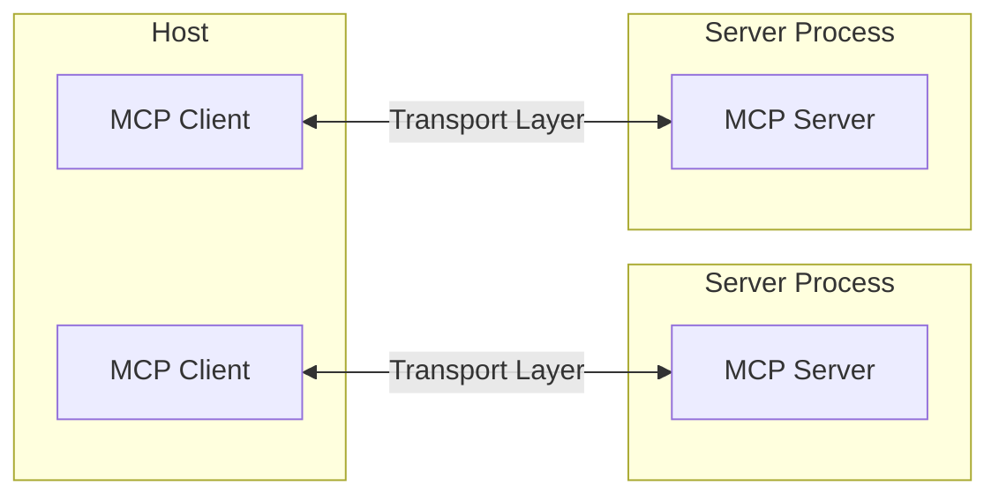
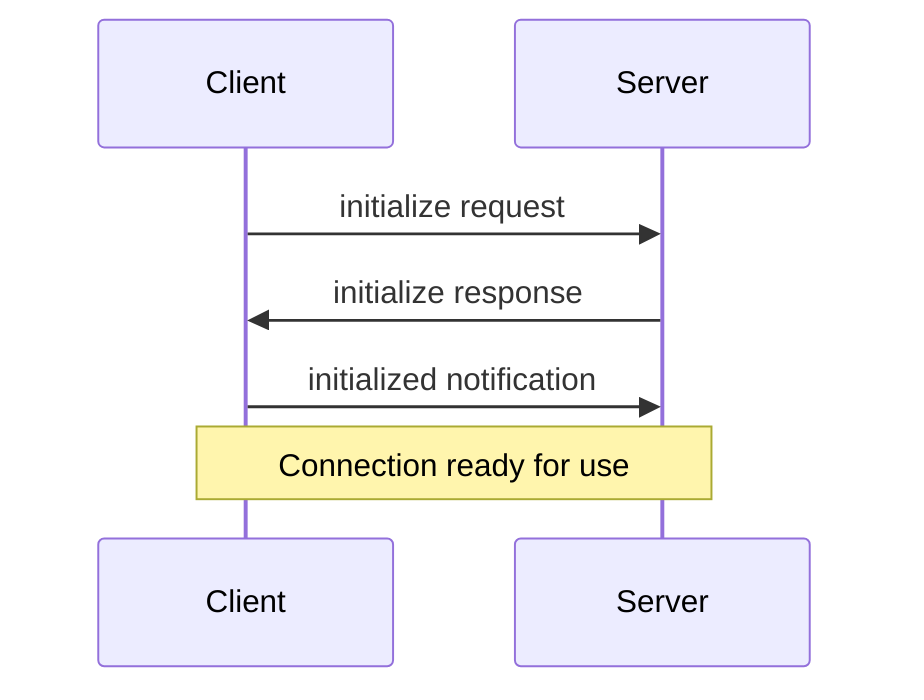
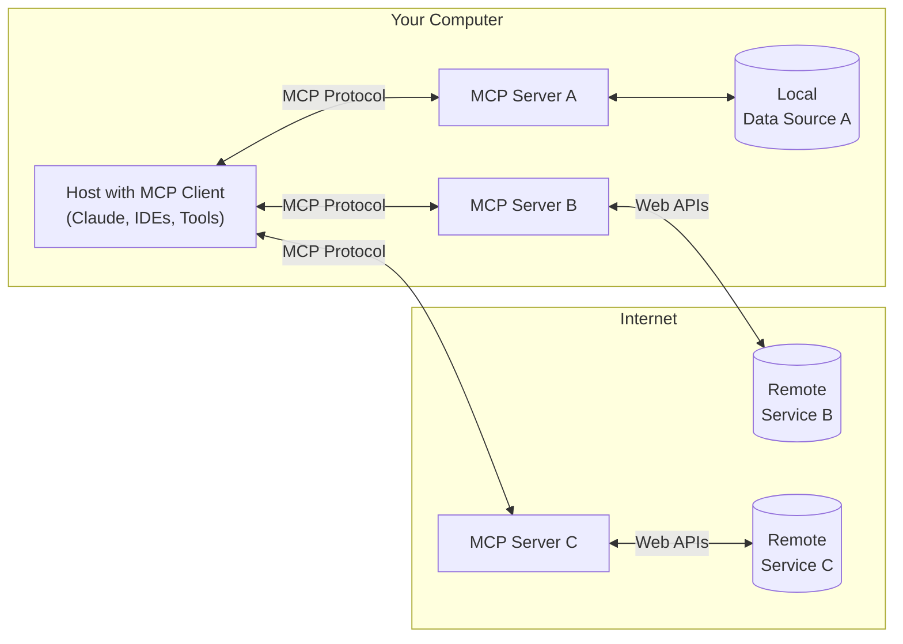

# modelcontextprotocol/modelcontextprotocol/docs

[git-collector-data]

**URL:** https://github.com/modelcontextprotocol/modelcontextprotocol/tree/main/docs  
**Date:** 7/18/2025, 9:50:38 AM  
**Files:** 10  

=== File: docs/docs/concepts/architecture.mdx ===
---
title: "Core architecture"
description: "Understand how MCP connects clients, servers, and LLMs"
---

The Model Context Protocol (MCP) is built on a flexible, extensible architecture that enables seamless communication between LLM applications and integrations. This document covers the core architectural components and concepts.

## Overview

MCP follows a client-server architecture where:

- **Hosts** are LLM applications (like Claude Desktop or IDEs) that initiate connections
- **Clients** maintain 1:1 connections with servers, inside the host application
- **Servers** provide context, tools, and prompts to clients



## Core components

### Protocol layer

The protocol layer handles message framing, request/response linking, and high-level communication patterns.

<Tabs>
  <Tab title="TypeScript">

    ```typescript
    class Protocol<Request, Notification, Result> {
        // Handle incoming requests
        setRequestHandler<T>(schema: T, handler: (request: T, extra: RequestHandlerExtra) => Promise<Result>): void

        // Handle incoming notifications
        setNotificationHandler<T>(schema: T, handler: (notification: T) => Promise<void>): void

        // Send requests and await responses
        request<T>(request: Request, schema: T, options?: RequestOptions): Promise<T>

        // Send one-way notifications
        notification(notification: Notification): Promise<void>
    }
    ```

  </Tab>
  <Tab title="Python">

    ```python
    class Session(BaseSession[RequestT, NotificationT, ResultT]):
        async def send_request(
            self,
            request: RequestT,
            result_type: type[Result]
        ) -> Result:
            """Send request and wait for response. Raises McpError if response contains error."""
            # Request handling implementation

        async def send_notification(
            self,
            notification: NotificationT
        ) -> None:
            """Send one-way notification that doesn't expect response."""
            # Notification handling implementation

        async def _received_request(
            self,
            responder: RequestResponder[ReceiveRequestT, ResultT]
        ) -> None:
            """Handle incoming request from other side."""
            # Request handling implementation

        async def _received_notification(
            self,
            notification: ReceiveNotificationT
        ) -> None:
            """Handle incoming notification from other side."""
            # Notification handling implementation
    ```

  </Tab>
</Tabs>

Key classes include:

- `Protocol`
- `Client`
- `Server`

### Transport layer

The transport layer handles the actual communication between clients and servers. MCP supports multiple transport mechanisms:

1. **Stdio transport**

   - Uses standard input/output for communication
   - Ideal for local processes

2. **Streamable HTTP transport**
   - Uses HTTP with optional Server-Sent Events for streaming
   - HTTP POST for client-to-server messages

All transports use [JSON-RPC](https://www.jsonrpc.org/) 2.0 to exchange messages. See the [specification](/specification/) for detailed information about the Model Context Protocol message format.

### Message types

MCP has these main types of messages:

1. **Requests** expect a response from the other side:

   ```typescript
   interface Request {
     method: string;
     params?: { ... };
   }
   ```

2. **Results** are successful responses to requests:

   ```typescript
   interface Result {
     [key: string]: unknown;
   }
   ```

3. **Errors** indicate that a request failed:

   ```typescript
   interface Error {
     code: number;
     message: string;
     data?: unknown;
   }
   ```

4. **Notifications** are one-way messages that don't expect a response:
   ```typescript
   interface Notification {
     method: string;
     params?: { ... };
   }
   ```

## Connection lifecycle

### 1. Initialization



1. Client sends `initialize` request with protocol version and capabilities
2. Server responds with its protocol version and capabilities
3. Client sends `initialized` notification as acknowledgment
4. Normal message exchange begins

### 2. Message exchange

After initialization, the following patterns are supported:

- **Request-Response**: Client or server sends requests, the other responds
- **Notifications**: Either party sends one-way messages

### 3. Termination

Either party can terminate the connection:

- Clean shutdown via `close()`
- Transport disconnection
- Error conditions

## Error handling

MCP defines these standard error codes:

```typescript
enum ErrorCode {
  // Standard JSON-RPC error codes
  ParseError = -32700,
  InvalidRequest = -32600,
  MethodNotFound = -32601,
  InvalidParams = -32602,
  InternalError = -32603,
}
```

SDKs and applications can define their own error codes above -32000.

Errors are propagated through:

- Error responses to requests
- Error events on transports
- Protocol-level error handlers

## Implementation example

Here's a basic example of implementing an MCP server:

<Tabs>
  <Tab title="TypeScript">

    ```typescript
    import { Server } from "@modelcontextprotocol/sdk/server/index.js";
    import { StdioServerTransport } from "@modelcontextprotocol/sdk/server/stdio.js";

    const server = new Server({
      name: "example-server",
      version: "1.0.0"
    }, {
      capabilities: {
        resources: {}
      }
    });

    // Handle requests
    server.setRequestHandler(ListResourcesRequestSchema, async () => {
      return {
        resources: [
          {
            uri: "example://resource",
            name: "Example Resource"
          }
        ]
      };
    });

    // Connect transport
    const transport = new StdioServerTransport();
    await server.connect(transport);
    ```

  </Tab>
  <Tab title="Python">

    ```python
    import asyncio
    import mcp.types as types
    from mcp.server import Server
    from mcp.server.stdio import stdio_server

    app = Server("example-server")

    @app.list_resources()
    async def list_resources() -> list[types.Resource]:
        return [
            types.Resource(
                uri="example://resource",
                name="Example Resource"
            )
        ]

    async def main():
        async with stdio_server() as streams:
            await app.run(
                streams[0],
                streams[1],
                app.create_initialization_options()
            )

    if __name__ == "__main__":
        asyncio.run(main())
    ```

  </Tab>
</Tabs>

## Best practices

### Transport selection

1. **Local communication**

   - Use stdio transport for local processes
   - Efficient for same-machine communication
   - Simple process management

2. **Remote communication**
   - Use Streamable HTTP for scenarios requiring HTTP compatibility
   - Consider security implications including authentication and authorization

### Message handling

1. **Request processing**

   - Validate inputs thoroughly
   - Use type-safe schemas
   - Handle errors gracefully
   - Implement timeouts

2. **Progress reporting**

   - Use progress tokens for long operations
   - Report progress incrementally
   - Include total progress when known

3. **Error management**
   - Use appropriate error codes
   - Include helpful error messages
   - Clean up resources on errors

## Security considerations

1. **Transport security**

   - Use TLS for remote connections
   - Validate connection origins
   - Implement authentication when needed

2. **Message validation**

   - Validate all incoming messages
   - Sanitize inputs
   - Check message size limits
   - Verify JSON-RPC format

3. **Resource protection**

   - Implement access controls
   - Validate resource paths
   - Monitor resource usage
   - Rate limit requests

4. **Error handling**
   - Don't leak sensitive information
   - Log security-relevant errors
   - Implement proper cleanup
   - Handle DoS scenarios

## Debugging and monitoring

1. **Logging**

   - Log protocol events
   - Track message flow
   - Monitor performance
   - Record errors

2. **Diagnostics**

   - Implement health checks
   - Monitor connection state
   - Track resource usage
   - Profile performance

3. **Testing**
   - Test different transports
   - Verify error handling
   - Check edge cases
   - Load test servers


=== File: docs/docs/concepts/prompts.mdx ===
---
title: "Prompts"
description: "Create reusable prompt templates and workflows"
---

Prompts enable servers to define reusable prompt templates and workflows that clients can easily surface to users and LLMs. They provide a powerful way to standardize and share common LLM interactions.

<Note>

Prompts are designed to be **user-controlled**, meaning they are exposed from servers to clients with the intention of the user being able to explicitly select them for use.

</Note>

## Overview

Prompts in MCP are predefined templates that can:

- Accept dynamic arguments
- Include context from resources
- Chain multiple interactions
- Guide specific workflows
- Surface as UI elements (like slash commands)

## Prompt structure

Each prompt is defined with:

```typescript
{
  name: string;              // Unique identifier for the prompt
  description?: string;      // Human-readable description
  arguments?: [              // Optional list of arguments
    {
      name: string;          // Argument identifier
      description?: string;  // Argument description
      required?: boolean;    // Whether argument is required
    }
  ]
}
```

## Discovering prompts

Clients can discover available prompts by sending a `prompts/list` request:

```typescript
// Request
{
  method: "prompts/list";
}

// Response
{
  prompts: [
    {
      name: "analyze-code",
      description: "Analyze code for potential improvements",
      arguments: [
        {
          name: "language",
          description: "Programming language",
          required: true,
        },
      ],
    },
  ];
}
```

## Using prompts

To use a prompt, clients make a `prompts/get` request:

````typescript
// Request
{
  method: "prompts/get",
  params: {
    name: "analyze-code",
    arguments: {
      language: "python"
    }
  }
}

// Response
{
  description: "Analyze Python code for potential improvements",
  messages: [
    {
      role: "user",
      content: {
        type: "text",
        text: "Please analyze the following Python code for potential improvements:\n\n```python\ndef calculate_sum(numbers):\n    total = 0\n    for num in numbers:\n        total = total + num\n    return total\n\nresult = calculate_sum([1, 2, 3, 4, 5])\nprint(result)\n```"
      }
    }
  ]
}
````

## Dynamic prompts

Prompts can be dynamic and include:

### Embedded resource context

```json
{
  "name": "analyze-project",
  "description": "Analyze project logs and code",
  "arguments": [
    {
      "name": "timeframe",
      "description": "Time period to analyze logs",
      "required": true
    },
    {
      "name": "fileUri",
      "description": "URI of code file to review",
      "required": true
    }
  ]
}
```

When handling the `prompts/get` request:

```json
{
  "messages": [
    {
      "role": "user",
      "content": {
        "type": "text",
        "text": "Analyze these system logs and the code file for any issues:"
      }
    },
    {
      "role": "user",
      "content": {
        "type": "resource",
        "resource": {
          "uri": "logs://recent?timeframe=1h",
          "text": "[2024-03-14 15:32:11] ERROR: Connection timeout in network.py:127\n[2024-03-14 15:32:15] WARN: Retrying connection (attempt 2/3)\n[2024-03-14 15:32:20] ERROR: Max retries exceeded",
          "mimeType": "text/plain"
        }
      }
    },
    {
      "role": "user",
      "content": {
        "type": "resource",
        "resource": {
          "uri": "file:///path/to/code.py",
          "text": "def connect_to_service(timeout=30):\n    retries = 3\n    for attempt in range(retries):\n        try:\n            return establish_connection(timeout)\n        except TimeoutError:\n            if attempt == retries - 1:\n                raise\n            time.sleep(5)\n\ndef establish_connection(timeout):\n    # Connection implementation\n    pass",
          "mimeType": "text/x-python"
        }
      }
    }
  ]
}
```

### Multi-step workflows

```typescript
const debugWorkflow = {
  name: "debug-error",
  async getMessages(error: string) {
    return [
      {
        role: "user",
        content: {
          type: "text",
          text: `Here's an error I'm seeing: ${error}`,
        },
      },
      {
        role: "assistant",
        content: {
          type: "text",
          text: "I'll help analyze this error. What have you tried so far?",
        },
      },
      {
        role: "user",
        content: {
          type: "text",
          text: "I've tried restarting the service, but the error persists.",
        },
      },
    ];
  },
};
```

## Example implementation

Here's a complete example of implementing prompts in an MCP server:

<Tabs>
  <Tab title="TypeScript">

    ```typescript
    import { Server } from "@modelcontextprotocol/sdk/server";
    import {
      ListPromptsRequestSchema,
      GetPromptRequestSchema
    } from "@modelcontextprotocol/sdk/types";

    const PROMPTS = {
      "git-commit": {
        name: "git-commit",
        description: "Generate a Git commit message",
        arguments: [
          {
            name: "changes",
            description: "Git diff or description of changes",
            required: true
          }
        ]
      },
      "explain-code": {
        name: "explain-code",
        description: "Explain how code works",
        arguments: [
          {
            name: "code",
            description: "Code to explain",
            required: true
          },
          {
            name: "language",
            description: "Programming language",
            required: false
          }
        ]
      }
    };

    const server = new Server({
      name: "example-prompts-server",
      version: "1.0.0"
    }, {
      capabilities: {
        prompts: {}
      }
    });

    // List available prompts
    server.setRequestHandler(ListPromptsRequestSchema, async () => {
      return {
        prompts: Object.values(PROMPTS)
      };
    });

    // Get specific prompt
    server.setRequestHandler(GetPromptRequestSchema, async (request) => {
      const prompt = PROMPTS[request.params.name];
      if (!prompt) {
        throw new Error(`Prompt not found: ${request.params.name}`);
      }

      if (request.params.name === "git-commit") {
        return {
          messages: [
            {
              role: "user",
              content: {
                type: "text",
                text: `Generate a concise but descriptive commit message for these changes:\n\n${request.params.arguments?.changes}`
              }
            }
          ]
        };
      }

      if (request.params.name === "explain-code") {
        const language = request.params.arguments?.language || "Unknown";
        return {
          messages: [
            {
              role: "user",
              content: {
                type: "text",
                text: `Explain how this ${language} code works:\n\n${request.params.arguments?.code}`
              }
            }
          ]
        };
      }

      throw new Error("Prompt implementation not found");
    });
    ```

  </Tab>
  <Tab title="Python">

    ```python
    from mcp.server import Server
    import mcp.types as types

    # Define available prompts
    PROMPTS = {
        "git-commit": types.Prompt(
            name="git-commit",
            description="Generate a Git commit message",
            arguments=[
                types.PromptArgument(
                    name="changes",
                    description="Git diff or description of changes",
                    required=True
                )
            ],
        ),
        "explain-code": types.Prompt(
            name="explain-code",
            description="Explain how code works",
            arguments=[
                types.PromptArgument(
                    name="code",
                    description="Code to explain",
                    required=True
                ),
                types.PromptArgument(
                    name="language",
                    description="Programming language",
                    required=False
                )
            ],
        )
    }

    # Initialize server
    app = Server("example-prompts-server")

    @app.list_prompts()
    async def list_prompts() -> list[types.Prompt]:
        return list(PROMPTS.values())

    @app.get_prompt()
    async def get_prompt(
        name: str, arguments: dict[str, str] | None = None
    ) -> types.GetPromptResult:
        if name not in PROMPTS:
            raise ValueError(f"Prompt not found: {name}")

        if name == "git-commit":
            changes = arguments.get("changes") if arguments else ""
            return types.GetPromptResult(
                messages=[
                    types.PromptMessage(
                        role="user",
                        content=types.TextContent(
                            type="text",
                            text=f"Generate a concise but descriptive commit message "
                            f"for these changes:\n\n{changes}"
                        )
                    )
                ]
            )

        if name == "explain-code":
            code = arguments.get("code") if arguments else ""
            language = arguments.get("language", "Unknown") if arguments else "Unknown"
            return types.GetPromptResult(
                messages=[
                    types.PromptMessage(
                        role="user",
                        content=types.TextContent(
                            type="text",
                            text=f"Explain how this {language} code works:\n\n{code}"
                        )
                    )
                ]
            )

        raise ValueError("Prompt implementation not found")
    ```

  </Tab>
</Tabs>

## Best practices

When implementing prompts:

1. Use clear, descriptive prompt names
2. Provide detailed descriptions for prompts and arguments
3. Validate all required arguments
4. Handle missing arguments gracefully
5. Consider versioning for prompt templates
6. Cache dynamic content when appropriate
7. Implement error handling
8. Document expected argument formats
9. Consider prompt composability
10. Test prompts with various inputs

## UI integration

Prompts can be surfaced in client UIs as:

- Slash commands
- Quick actions
- Context menu items
- Command palette entries
- Guided workflows
- Interactive forms

## Updates and changes

Servers can notify clients about prompt changes:

1. Server capability: `prompts.listChanged`
2. Notification: `notifications/prompts/list_changed`
3. Client re-fetches prompt list

## Security considerations

When implementing prompts:

- Validate all arguments
- Sanitize user input
- Consider rate limiting
- Implement access controls
- Audit prompt usage
- Handle sensitive data appropriately
- Validate generated content
- Implement timeouts
- Consider prompt injection risks
- Document security requirements


=== File: docs/docs/concepts/resources.mdx ===
---
title: "Resources"
description: "Expose data and content from your servers to LLMs"
---

Resources are a core primitive in the Model Context Protocol (MCP) that allow servers to expose data and content that can be read by clients and used as context for LLM interactions.

<Note>

Resources are designed to be **application-controlled**, meaning that the client application can decide how and when they should be used.
Different MCP clients may handle resources differently. For example:

- Claude Desktop currently requires users to explicitly select resources before they can be used
- Other clients might automatically select resources based on heuristics
- Some implementations may even allow the AI model itself to determine which resources to use

Server authors should be prepared to handle any of these interaction patterns when implementing resource support. In order to expose data to models automatically, server authors should use a **model-controlled** primitive such as [Tools](./tools).

</Note>

## Overview

Resources represent any kind of data that an MCP server wants to make available to clients. This can include:

- File contents
- Database records
- API responses
- Live system data
- Screenshots and images
- Log files
- And more

Each resource is identified by a unique URI and can contain either text or binary data.

## Resource URIs

Resources are identified using URIs that follow this format:

```
[protocol]://[host]/[path]
```

For example:

- `file:///home/user/documents/report.pdf`
- `postgres://database/customers/schema`
- `screen://localhost/display1`

The protocol and path structure is defined by the MCP server implementation. Servers can define their own custom URI schemes.

## Resource types

Resources can contain two types of content:

### Text resources

Text resources contain UTF-8 encoded text data. These are suitable for:

- Source code
- Configuration files
- Log files
- JSON/XML data
- Plain text

### Binary resources

Binary resources contain raw binary data encoded in base64. These are suitable for:

- Images
- PDFs
- Audio files
- Video files
- Other non-text formats

## Resource discovery

Clients can discover available resources through two main methods:

### Direct resources

Servers expose a list of resources via the `resources/list` request. Each resource includes:

```typescript
{
  uri: string;           // Unique identifier for the resource
  name: string;          // Human-readable name
  description?: string;  // Optional description
  mimeType?: string;     // Optional MIME type
  size?: number;         // Optional size in bytes
}
```

### Resource templates

For dynamic resources, servers can expose [URI templates](https://datatracker.ietf.org/doc/html/rfc6570) that clients can use to construct valid resource URIs:

```typescript
{
  uriTemplate: string;   // URI template following RFC 6570
  name: string;          // Human-readable name for this type
  description?: string;  // Optional description
  mimeType?: string;     // Optional MIME type for all matching resources
}
```

## Reading resources

To read a resource, clients make a `resources/read` request with the resource URI.

The server responds with a list of resource contents:

```typescript
{
  contents: [
    {
      uri: string;        // The URI of the resource
      mimeType?: string;  // Optional MIME type

      // One of:
      text?: string;      // For text resources
      blob?: string;      // For binary resources (base64 encoded)
    }
  ]
}
```

<Tip>

Servers may return multiple resources in response to one `resources/read` request. This could be used, for example, to return a list of files inside a directory when the directory is read.

</Tip>

## Resource updates

MCP supports real-time updates for resources through two mechanisms:

### List changes

Servers can notify clients when their list of available resources changes via the `notifications/resources/list_changed` notification.

### Content changes

Clients can subscribe to updates for specific resources:

1. Client sends `resources/subscribe` with resource URI
2. Server sends `notifications/resources/updated` when the resource changes
3. Client can fetch latest content with `resources/read`
4. Client can unsubscribe with `resources/unsubscribe`

## Example implementation

Here's a simple example of implementing resource support in an MCP server:

<Tabs>
  <Tab title="TypeScript">

    ```typescript
    const server = new Server({
      name: "example-server",
      version: "1.0.0"
    }, {
      capabilities: {
        resources: {}
      }
    });

    // List available resources
    server.setRequestHandler(ListResourcesRequestSchema, async () => {
      return {
        resources: [
          {
            uri: "file:///logs/app.log",
            name: "Application Logs",
            mimeType: "text/plain"
          }
        ]
      };
    });

    // Read resource contents
    server.setRequestHandler(ReadResourceRequestSchema, async (request) => {
      const uri = request.params.uri;

      if (uri === "file:///logs/app.log") {
        const logContents = await readLogFile();
        return {
          contents: [
            {
              uri,
              mimeType: "text/plain",
              text: logContents
            }
          ]
        };
      }

      throw new Error("Resource not found");
    });
    ```

  </Tab>
  <Tab title="Python">

    ```python
    app = Server("example-server")

    @app.list_resources()
    async def list_resources() -> list[types.Resource]:
        return [
            types.Resource(
                uri="file:///logs/app.log",
                name="Application Logs",
                mimeType="text/plain"
            )
        ]

    @app.read_resource()
    async def read_resource(uri: AnyUrl) -> str:
        if str(uri) == "file:///logs/app.log":
            log_contents = await read_log_file()
            return log_contents

        raise ValueError("Resource not found")

    # Start server
    async with stdio_server() as streams:
        await app.run(
            streams[0],
            streams[1],
            app.create_initialization_options()
        )
    ```

  </Tab>
</Tabs>

## Best practices

When implementing resource support:

1. Use clear, descriptive resource names and URIs
2. Include helpful descriptions to guide LLM understanding
3. Set appropriate MIME types when known
4. Implement resource templates for dynamic content
5. Use subscriptions for frequently changing resources
6. Handle errors gracefully with clear error messages
7. Consider pagination for large resource lists
8. Cache resource contents when appropriate
9. Validate URIs before processing
10. Document your custom URI schemes

## Security considerations

When exposing resources:

- Validate all resource URIs
- Implement appropriate access controls
- Sanitize file paths to prevent directory traversal
- Be cautious with binary data handling
- Consider rate limiting for resource reads
- Audit resource access
- Encrypt sensitive data in transit
- Validate MIME types
- Implement timeouts for long-running reads
- Handle resource cleanup appropriately


=== File: docs/docs/concepts/roots.mdx ===
---
title: "Roots"
description: "Understanding roots in MCP"
---

Roots are a concept in MCP that define the boundaries where servers can operate. They provide a way for clients to inform servers about relevant resources and their locations.

## What are Roots?

A root is a URI that a client suggests a server should focus on. When a client connects to a server, it declares which roots the server should work with. While primarily used for filesystem paths, roots can be any valid URI including HTTP URLs.

For example, roots could be:

```
file:///home/user/projects/myapp
https://api.example.com/v1
```

## Why Use Roots?

Roots serve several important purposes:

1. **Guidance**: They inform servers about relevant resources and locations
2. **Clarity**: Roots make it clear which resources are part of your workspace
3. **Organization**: Multiple roots let you work with different resources simultaneously

## How Roots Work

When a client supports roots, it:

1. Declares the `roots` capability during connection
2. Provides a list of suggested roots to the server
3. Notifies the server when roots change (if supported)

While roots are informational and not strictly enforcing, servers should:

1. Respect the provided roots
2. Use root URIs to locate and access resources
3. Prioritize operations within root boundaries

## Common Use Cases

Roots are commonly used to define:

- Project directories
- Repository locations
- API endpoints
- Configuration locations
- Resource boundaries

## Best Practices

When working with roots:

1. Only suggest necessary resources
2. Use clear, descriptive names for roots
3. Monitor root accessibility
4. Handle root changes gracefully

## Example

Here's how a typical MCP client might expose roots:

```json
{
  "roots": [
    {
      "uri": "file:///home/user/projects/frontend",
      "name": "Frontend Repository"
    },
    {
      "uri": "https://api.example.com/v1",
      "name": "API Endpoint"
    }
  ]
}
```

This configuration suggests the server focus on both a local repository and an API endpoint while keeping them logically separated.


=== File: docs/docs/concepts/sampling.mdx ===
---
title: "Sampling"
description: "Let your servers request completions from LLMs"
---

Sampling is a powerful MCP feature that allows servers to request LLM completions through the client, enabling sophisticated agentic behaviors while maintaining security and privacy.

<Info>

This feature of MCP is not yet supported in the Claude Desktop client.

</Info>

## How sampling works

The sampling flow follows these steps:

1. Server sends a `sampling/createMessage` request to the client
2. Client reviews the request and can modify it
3. Client samples from an LLM
4. Client reviews the completion
5. Client returns the result to the server

This human-in-the-loop design ensures users maintain control over what the LLM sees and generates.

## Message format

Sampling requests use a standardized message format:

```typescript
{
  messages: [
    {
      role: "user" | "assistant",
      content: {
        type: "text" | "image",

        // For text:
        text?: string,

        // For images:
        data?: string,             // base64 encoded
        mimeType?: string
      }
    }
  ],
  modelPreferences?: {
    hints?: [{
      name?: string                // Suggested model name/family
    }],
    costPriority?: number,         // 0-1, importance of minimizing cost
    speedPriority?: number,        // 0-1, importance of low latency
    intelligencePriority?: number  // 0-1, importance of capabilities
  },
  systemPrompt?: string,
  includeContext?: "none" | "thisServer" | "allServers",
  temperature?: number,
  maxTokens: number,
  stopSequences?: string[],
  metadata?: Record<string, unknown>
}
```

## Request parameters

### Messages

The `messages` array contains the conversation history to send to the LLM. Each message has:

- `role`: Either "user" or "assistant"
- `content`: The message content, which can be:
  - Text content with a `text` field
  - Image content with `data` (base64) and `mimeType` fields

### Model preferences

The `modelPreferences` object allows servers to specify their model selection preferences:

- `hints`: Array of model name suggestions that clients can use to select an appropriate model:

  - `name`: String that can match full or partial model names (e.g. "claude-3", "sonnet")
  - Clients may map hints to equivalent models from different providers
  - Multiple hints are evaluated in preference order

- Priority values (0-1 normalized):
  - `costPriority`: Importance of minimizing costs
  - `speedPriority`: Importance of low latency response
  - `intelligencePriority`: Importance of advanced model capabilities

Clients make the final model selection based on these preferences and their available models.

### System prompt

An optional `systemPrompt` field allows servers to request a specific system prompt. The client may modify or ignore this.

### Context inclusion

The `includeContext` parameter specifies what MCP context to include:

- `"none"`: No additional context
- `"thisServer"`: Include context from the requesting server
- `"allServers"`: Include context from all connected MCP servers

The client controls what context is actually included.

### Sampling parameters

Fine-tune the LLM sampling with:

- `temperature`: Controls randomness (0.0 to 1.0)
- `maxTokens`: Maximum tokens to generate
- `stopSequences`: Array of sequences that stop generation
- `metadata`: Additional provider-specific parameters

## Response format

The client returns a completion result:

```typescript
{
  model: string,  // Name of the model used
  stopReason?: "endTurn" | "stopSequence" | "maxTokens" | string,
  role: "user" | "assistant",
  content: {
    type: "text" | "image",
    text?: string,
    data?: string,
    mimeType?: string
  }
}
```

## Example request

Here's an example of requesting sampling from a client:

```json
{
  "method": "sampling/createMessage",
  "params": {
    "messages": [
      {
        "role": "user",
        "content": {
          "type": "text",
          "text": "What files are in the current directory?"
        }
      }
    ],
    "systemPrompt": "You are a helpful file system assistant.",
    "includeContext": "thisServer",
    "maxTokens": 100
  }
}
```

## Best practices

When implementing sampling:

1. Always provide clear, well-structured prompts
2. Handle both text and image content appropriately
3. Set reasonable token limits
4. Include relevant context through `includeContext`
5. Validate responses before using them
6. Handle errors gracefully
7. Consider rate limiting sampling requests
8. Document expected sampling behavior
9. Test with various model parameters
10. Monitor sampling costs

## Human in the loop controls

Sampling is designed with human oversight in mind:

### For prompts

- Clients should show users the proposed prompt
- Users should be able to modify or reject prompts
- System prompts can be filtered or modified
- Context inclusion is controlled by the client

### For completions

- Clients should show users the completion
- Users should be able to modify or reject completions
- Clients can filter or modify completions
- Users control which model is used

## Security considerations

When implementing sampling:

- Validate all message content
- Sanitize sensitive information
- Implement appropriate rate limits
- Monitor sampling usage
- Encrypt data in transit
- Handle user data privacy
- Audit sampling requests
- Control cost exposure
- Implement timeouts
- Handle model errors gracefully

## Common patterns

### Agentic workflows

Sampling enables agentic patterns like:

- Reading and analyzing resources
- Making decisions based on context
- Generating structured data
- Handling multi-step tasks
- Providing interactive assistance

### Context management

Best practices for context:

- Request minimal necessary context
- Structure context clearly
- Handle context size limits
- Update context as needed
- Clean up stale context

### Error handling

Robust error handling should:

- Catch sampling failures
- Handle timeout errors
- Manage rate limits
- Validate responses
- Provide fallback behaviors
- Log errors appropriately

## Limitations

Be aware of these limitations:

- Sampling depends on client capabilities
- Users control sampling behavior
- Context size has limits
- Rate limits may apply
- Costs should be considered
- Model availability varies
- Response times vary
- Not all content types supported


=== File: docs/docs/concepts/tools.mdx ===
---
title: "Tools"
description: "Enable LLMs to perform actions through your server"
---

Tools are a powerful primitive in the Model Context Protocol (MCP) that enable servers to expose executable functionality to clients. Through tools, LLMs can interact with external systems, perform computations, and take actions in the real world.

<Note>

Tools are designed to be **model-controlled**, meaning that tools are exposed from servers to clients with the intention of the AI model being able to automatically invoke them (with a human in the loop to grant approval).

</Note>

## Overview

Tools in MCP allow servers to expose executable functions that can be invoked by clients and used by LLMs to perform actions. Key aspects of tools include:

- **Discovery**: Clients can obtain a list of available tools by sending a `tools/list` request
- **Invocation**: Tools are called using the `tools/call` request, where servers perform the requested operation and return results
- **Flexibility**: Tools can range from simple calculations to complex API interactions

Like [resources](/docs/concepts/resources), tools are identified by unique names and can include descriptions to guide their usage. However, unlike resources, tools represent dynamic operations that can modify state or interact with external systems.

## Tool definition structure

Each tool is defined with the following structure:

```typescript
{
  name: string;          // Unique identifier for the tool
  description?: string;  // Human-readable description
  inputSchema: {         // JSON Schema for the tool's parameters
    type: "object",
    properties: { ... }  // Tool-specific parameters
  },
  annotations?: {        // Optional hints about tool behavior
    title?: string;      // Human-readable title for the tool
    readOnlyHint?: boolean;    // If true, the tool does not modify its environment
    destructiveHint?: boolean; // If true, the tool may perform destructive updates
    idempotentHint?: boolean;  // If true, repeated calls with same args have no additional effect
    openWorldHint?: boolean;   // If true, tool interacts with external entities
  }
}
```

## Implementing tools

Here's an example of implementing a basic tool in an MCP server:

<Tabs>
  <Tab title="TypeScript">

    ```typescript
    const server = new Server({
      name: "example-server",
      version: "1.0.0"
    }, {
      capabilities: {
        tools: {}
      }
    });

    // Define available tools
    server.setRequestHandler(ListToolsRequestSchema, async () => {
      return {
        tools: [{
          name: "calculate_sum",
          description: "Add two numbers together",
          inputSchema: {
            type: "object",
            properties: {
              a: { type: "number" },
              b: { type: "number" }
            },
            required: ["a", "b"]
          }
        }]
      };
    });

    // Handle tool execution
    server.setRequestHandler(CallToolRequestSchema, async (request) => {
      if (request.params.name === "calculate_sum") {
        const { a, b } = request.params.arguments;
        return {
          content: [
            {
              type: "text",
              text: String(a + b)
            }
          ]
        };
      }
      throw new Error("Tool not found");
    });
    ```

  </Tab>
  <Tab title="Python">

    ```python
    app = Server("example-server")

    @app.list_tools()
    async def list_tools() -> list[types.Tool]:
        return [
            types.Tool(
                name="calculate_sum",
                description="Add two numbers together",
                inputSchema={
                    "type": "object",
                    "properties": {
                        "a": {"type": "number"},
                        "b": {"type": "number"}
                    },
                    "required": ["a", "b"]
                }
            )
        ]

    @app.call_tool()
    async def call_tool(
        name: str,
        arguments: dict
    ) -> list[types.TextContent | types.ImageContent | types.EmbeddedResource]:
        if name == "calculate_sum":
            a = arguments["a"]
            b = arguments["b"]
            result = a + b
            return [types.TextContent(type="text", text=str(result))]
        raise ValueError(f"Tool not found: {name}")
    ```

  </Tab>
</Tabs>

## Example tool patterns

Here are some examples of types of tools that a server could provide:

### System operations

Tools that interact with the local system:

```typescript
{
  name: "execute_command",
  description: "Run a shell command",
  inputSchema: {
    type: "object",
    properties: {
      command: { type: "string" },
      args: { type: "array", items: { type: "string" } }
    }
  }
}
```

### API integrations

Tools that wrap external APIs:

```typescript
{
  name: "github_create_issue",
  description: "Create a GitHub issue",
  inputSchema: {
    type: "object",
    properties: {
      title: { type: "string" },
      body: { type: "string" },
      labels: { type: "array", items: { type: "string" } }
    }
  }
}
```

### Data processing

Tools that transform or analyze data:

```typescript
{
  name: "analyze_csv",
  description: "Analyze a CSV file",
  inputSchema: {
    type: "object",
    properties: {
      filepath: { type: "string" },
      operations: {
        type: "array",
        items: {
          enum: ["sum", "average", "count"]
        }
      }
    }
  }
}
```

## Best practices

When implementing tools:

1. Provide clear, descriptive names and descriptions
2. Use detailed JSON Schema definitions for parameters
3. Include examples in tool descriptions to demonstrate how the model should use them
4. Implement proper error handling and validation
5. Use progress reporting for long operations
6. Keep tool operations focused and atomic
7. Document expected return value structures
8. Implement proper timeouts
9. Consider rate limiting for resource-intensive operations
10. Log tool usage for debugging and monitoring

### Tool name conflicts

MCP client applications and MCP server proxies may encounter tool name conflicts when building their own tool lists. For example, two connected MCP servers `web1` and `web2` may both expose a tool named `search_web`.

Applications may disambiguiate tools with one of the following strategies (among others; not an exhaustive list):

- Concatenating a unique, user-defined server name with the tool name, e.g. `web1___search_web` and `web2___search_web`. This strategy may be preferable when unique server names are already provided by the user in a configuration file.
- Generating a random prefix for the tool name, e.g. `jrwxs___search_web` and `6cq52___search_web`. This strategy may be preferable in server proxies where user-defined unique names are not available.
- Using the server URI as a prefix for the tool name, e.g. `web1.example.com:search_web` and `web2.example.com:search_web`. This strategy may be suitable when working with remote MCP servers.

Note that the server-provided name from the initialization flow is not guaranteed to be unique and is not generally suitable for disambiguation purposes.

## Security considerations

When exposing tools:

### Input validation

- Validate all parameters against the schema
- Sanitize file paths and system commands
- Validate URLs and external identifiers
- Check parameter sizes and ranges
- Prevent command injection

### Access control

- Implement authentication where needed
- Use appropriate authorization checks
- Audit tool usage
- Rate limit requests
- Monitor for abuse

### Error handling

- Don't expose internal errors to clients
- Log security-relevant errors
- Handle timeouts appropriately
- Clean up resources after errors
- Validate return values

## Tool discovery and updates

MCP supports dynamic tool discovery:

1. Clients can list available tools at any time
2. Servers can notify clients when tools change using `notifications/tools/list_changed`
3. Tools can be added or removed during runtime
4. Tool definitions can be updated (though this should be done carefully)

## Error handling

Tool errors should be reported within the result object, not as MCP protocol-level errors. This allows the LLM to see and potentially handle the error. When a tool encounters an error:

1. Set `isError` to `true` in the result
2. Include error details in the `content` array

Here's an example of proper error handling for tools:

<Tabs>
  <Tab title="TypeScript">

    ```typescript
    try {
      // Tool operation
      const result = performOperation();
      return {
        content: [
          {
            type: "text",
            text: `Operation successful: ${result}`
          }
        ]
      };
    } catch (error) {
      return {
        isError: true,
        content: [
          {
            type: "text",
            text: `Error: ${error.message}`
          }
        ]
      };
    }
    ```

  </Tab>
  <Tab title="Python">

    ```python
    try:
        # Tool operation
        result = perform_operation()
        return types.CallToolResult(
            content=[
                types.TextContent(
                    type="text",
                    text=f"Operation successful: {result}"
                )
            ]
        )
    except Exception as error:
        return types.CallToolResult(
            isError=True,
            content=[
                types.TextContent(
                    type="text",
                    text=f"Error: {str(error)}"
                )
            ]
        )
    ```

  </Tab>
</Tabs>

This approach allows the LLM to see that an error occurred and potentially take corrective action or request human intervention.

## Tool annotations

Tool annotations provide additional metadata about a tool's behavior, helping clients understand how to present and manage tools. These annotations are hints that describe the nature and impact of a tool, but should not be relied upon for security decisions.

### Purpose of tool annotations

Tool annotations serve several key purposes:

1. Provide UX-specific information without affecting model context
2. Help clients categorize and present tools appropriately
3. Convey information about a tool's potential side effects
4. Assist in developing intuitive interfaces for tool approval

### Available tool annotations

The MCP specification defines the following annotations for tools:

| Annotation        | Type    | Default | Description                                                                                                                          |
| ----------------- | ------- | ------- | ------------------------------------------------------------------------------------------------------------------------------------ |
| `title`           | string  | -       | A human-readable title for the tool, useful for UI display                                                                           |
| `readOnlyHint`    | boolean | false   | If true, indicates the tool does not modify its environment                                                                          |
| `destructiveHint` | boolean | true    | If true, the tool may perform destructive updates (only meaningful when `readOnlyHint` is false)                                     |
| `idempotentHint`  | boolean | false   | If true, calling the tool repeatedly with the same arguments has no additional effect (only meaningful when `readOnlyHint` is false) |
| `openWorldHint`   | boolean | true    | If true, the tool may interact with an "open world" of external entities                                                             |

### Example usage

Here's how to define tools with annotations for different scenarios:

```typescript
// A read-only search tool
{
  name: "web_search",
  description: "Search the web for information",
  inputSchema: {
    type: "object",
    properties: {
      query: { type: "string" }
    },
    required: ["query"]
  },
  annotations: {
    title: "Web Search",
    readOnlyHint: true,
    openWorldHint: true
  }
}

// A destructive file deletion tool
{
  name: "delete_file",
  description: "Delete a file from the filesystem",
  inputSchema: {
    type: "object",
    properties: {
      path: { type: "string" }
    },
    required: ["path"]
  },
  annotations: {
    title: "Delete File",
    readOnlyHint: false,
    destructiveHint: true,
    idempotentHint: true,
    openWorldHint: false
  }
}

// A non-destructive database record creation tool
{
  name: "create_record",
  description: "Create a new record in the database",
  inputSchema: {
    type: "object",
    properties: {
      table: { type: "string" },
      data: { type: "object" }
    },
    required: ["table", "data"]
  },
  annotations: {
    title: "Create Database Record",
    readOnlyHint: false,
    destructiveHint: false,
    idempotentHint: false,
    openWorldHint: false
  }
}
```

### Integrating annotations in server implementation

<Tabs>
  <Tab title="TypeScript">

    ```typescript
    server.setRequestHandler(ListToolsRequestSchema, async () => {
      return {
        tools: [{
          name: "calculate_sum",
          description: "Add two numbers together",
          inputSchema: {
            type: "object",
            properties: {
              a: { type: "number" },
              b: { type: "number" }
            },
            required: ["a", "b"]
          },
          annotations: {
            title: "Calculate Sum",
            readOnlyHint: true,
            openWorldHint: false
          }
        }]
      };
    });
    ```

  </Tab>
  <Tab title="Python">

    ```python
    from mcp.server.fastmcp import FastMCP

    mcp = FastMCP("example-server")

    @mcp.tool(
        annotations={
            "title": "Calculate Sum",
            "readOnlyHint": True,
            "openWorldHint": False
        }
    )
    async def calculate_sum(a: float, b: float) -> str:
        """Add two numbers together.

        Args:
            a: First number to add
            b: Second number to add
        """
        result = a + b
        return str(result)
    ```

  </Tab>
</Tabs>

### Best practices for tool annotations

1. **Be accurate about side effects**: Clearly indicate whether a tool modifies its environment and whether those modifications are destructive.

2. **Use descriptive titles**: Provide human-friendly titles that clearly describe the tool's purpose.

3. **Indicate idempotency properly**: Mark tools as idempotent only if repeated calls with the same arguments truly have no additional effect.

4. **Set appropriate open/closed world hints**: Indicate whether a tool interacts with a closed system (like a database) or an open system (like the web).

5. **Remember annotations are hints**: All properties in ToolAnnotations are hints and not guaranteed to provide a faithful description of tool behavior. Clients should never make security-critical decisions based solely on annotations.

## Testing tools

A comprehensive testing strategy for MCP tools should cover:

- **Functional testing**: Verify tools execute correctly with valid inputs and handle invalid inputs appropriately
- **Integration testing**: Test tool interaction with external systems using both real and mocked dependencies
- **Security testing**: Validate authentication, authorization, input sanitization, and rate limiting
- **Performance testing**: Check behavior under load, timeout handling, and resource cleanup
- **Error handling**: Ensure tools properly report errors through the MCP protocol and clean up resources


=== File: docs/docs/concepts/transports.mdx ===
---
title: "Transports"
description: "Learn about MCP's communication mechanisms"
---

Transports in the Model Context Protocol (MCP) provide the foundation for communication between clients and servers. A transport handles the underlying mechanics of how messages are sent and received.

## Message Format

MCP uses [JSON-RPC](https://www.jsonrpc.org/) 2.0 as its wire format. The transport layer is responsible for converting MCP protocol messages into JSON-RPC format for transmission and converting received JSON-RPC messages back into MCP protocol messages.

There are three types of JSON-RPC messages used:

### Requests

```typescript
{
  jsonrpc: "2.0",
  id: number | string,
  method: string,
  params?: object
}
```

### Responses

```typescript
{
  jsonrpc: "2.0",
  id: number | string,
  result?: object,
  error?: {
    code: number,
    message: string,
    data?: unknown
  }
}
```

### Notifications

```typescript
{
  jsonrpc: "2.0",
  method: string,
  params?: object
}
```

## Built-in Transport Types

MCP currently defines two standard transport mechanisms:

### Standard Input/Output (stdio)

The stdio transport enables communication through standard input and output streams. This is particularly useful for local integrations and command-line tools.

Use stdio when:

- Building command-line tools
- Implementing local integrations
- Needing simple process communication
- Working with shell scripts

<Tabs>
  <Tab title="TypeScript (Server)">

    ```typescript
    const server = new Server({
      name: "example-server",
      version: "1.0.0"
    }, {
      capabilities: {}
    });

    const transport = new StdioServerTransport();
    await server.connect(transport);
    ```

  </Tab>
  <Tab title="TypeScript (Client)">

    ```typescript
    const client = new Client({
      name: "example-client",
      version: "1.0.0"
    }, {
      capabilities: {}
    });

    const transport = new StdioClientTransport({
      command: "./server",
      args: ["--option", "value"]
    });
    await client.connect(transport);
    ```

  </Tab>
  <Tab title="Python (Server)">

    ```python
    app = Server("example-server")

    async with stdio_server() as streams:
        await app.run(
            streams[0],
            streams[1],
            app.create_initialization_options()
        )
    ```

  </Tab>
  <Tab title="Python (Client)">

    ```python
    params = StdioServerParameters(
        command="./server",
        args=["--option", "value"]
    )

    async with stdio_client(params) as streams:
        async with ClientSession(streams[0], streams[1]) as session:
            await session.initialize()
    ```

  </Tab>

</Tabs>

### Streamable HTTP

The Streamable HTTP transport uses HTTP POST requests for client-to-server communication and optional Server-Sent Events (SSE) streams for server-to-client communication.

Use Streamable HTTP when:

- Building web-based integrations
- Needing client-server communication over HTTP
- Requiring stateful sessions
- Supporting multiple concurrent clients
- Implementing resumable connections

#### How it Works

1. **Client-to-Server Communication**: Every JSON-RPC message from client to server is sent as a new HTTP POST request to the MCP endpoint
2. **Server Responses**: The server can respond either with:
   - A single JSON response (`Content-Type: application/json`)
   - An SSE stream (`Content-Type: text/event-stream`) for multiple messages
3. **Server-to-Client Communication**: Servers can send requests/notifications to clients via:
   - SSE streams initiated by client requests
   - SSE streams from HTTP GET requests to the MCP endpoint

<Tabs>
  <Tab title="TypeScript (Server)">

    ```typescript
    import express from "express";

    const app = express();

    const server = new Server({
      name: "example-server",
      version: "1.0.0"
    }, {
      capabilities: {}
    });

    // MCP endpoint handles both POST and GET
    app.post("/mcp", async (req, res) => {
      // Handle JSON-RPC request
      const response = await server.handleRequest(req.body);

      // Return single response or SSE stream
      if (needsStreaming) {
        res.setHeader("Content-Type", "text/event-stream");
        // Send SSE events...
      } else {
        res.json(response);
      }
    });

    app.get("/mcp", (req, res) => {
      // Optional: Support server-initiated SSE streams
      res.setHeader("Content-Type", "text/event-stream");
      // Send server notifications/requests...
    });

    app.listen(3000);
    ```

  </Tab>
  <Tab title="TypeScript (Client)">

    ```typescript
    const client = new Client({
      name: "example-client",
      version: "1.0.0"
    }, {
      capabilities: {}
    });

    const transport = new HttpClientTransport(
      new URL("http://localhost:3000/mcp")
    );
    await client.connect(transport);
    ```

  </Tab>
  <Tab title="Python (Server)">

    ```python
    from mcp.server.http import HttpServerTransport
    from starlette.applications import Starlette
    from starlette.routing import Route

    app = Server("example-server")

    async def handle_mcp(scope, receive, send):
        if scope["method"] == "POST":
            # Handle JSON-RPC request
            response = await app.handle_request(request_body)

            if needs_streaming:
                # Return SSE stream
                await send_sse_response(send, response)
            else:
                # Return JSON response
                await send_json_response(send, response)

        elif scope["method"] == "GET":
            # Optional: Support server-initiated SSE streams
            await send_sse_stream(send)

    starlette_app = Starlette(
        routes=[
            Route("/mcp", endpoint=handle_mcp, methods=["POST", "GET"]),
        ]
    )
    ```

  </Tab>
  <Tab title="Python (Client)">

    ```python
    async with http_client("http://localhost:8000/mcp") as transport:
        async with ClientSession(transport[0], transport[1]) as session:
            await session.initialize()
    ```

  </Tab>

</Tabs>

#### Session Management

Streamable HTTP supports stateful sessions to maintain context across multiple requests:

1. **Session Initialization**: Servers may assign a session ID during initialization by including it in an `Mcp-Session-Id` header
2. **Session Persistence**: Clients must include the session ID in all subsequent requests using the `Mcp-Session-Id` header
3. **Session Termination**: Sessions can be explicitly terminated by sending an HTTP DELETE request with the session ID

Example session flow:

```typescript
// Server assigns session ID during initialization
app.post("/mcp", (req, res) => {
  if (req.body.method === "initialize") {
    const sessionId = generateSecureId();
    res.setHeader("Mcp-Session-Id", sessionId);
    // Store session state...
  }
  // Handle request...
});

// Client includes session ID in subsequent requests
fetch("/mcp", {
  method: "POST",
  headers: {
    "Content-Type": "application/json",
    "Mcp-Session-Id": sessionId,
  },
  body: JSON.stringify(request),
});
```

#### Resumability and Redelivery

To support resuming broken connections, Streamable HTTP provides:

1. **Event IDs**: Servers can attach unique IDs to SSE events for tracking
2. **Resume from Last Event**: Clients can resume by sending the `Last-Event-ID` header
3. **Message Replay**: Servers can replay missed messages from the disconnection point

This ensures reliable message delivery even with unstable network connections.

#### Security Considerations

When implementing Streamable HTTP transport, follow these security best practices:

1. **Validate Origin Headers**: Always validate the `Origin` header on all incoming connections to prevent DNS rebinding attacks
2. **Bind to Localhost**: When running locally, bind only to localhost (127.0.0.1) rather than all network interfaces (0.0.0.0)
3. **Implement Authentication**: Use proper authentication for all connections
4. **Use HTTPS**: Always use TLS/HTTPS for production deployments
5. **Validate Session IDs**: Ensure session IDs are cryptographically secure and properly validated

Without these protections, attackers could use DNS rebinding to interact with local MCP servers from remote websites.

### Server-Sent Events (SSE) - Deprecated

<Note>
  SSE as a standalone transport is deprecated as of protocol version 2024-11-05.
  It has been replaced by Streamable HTTP, which incorporates SSE as an optional
  streaming mechanism. For backwards compatibility information, see the
  [backwards compatibility](#backwards-compatibility) section below.
</Note>

The legacy SSE transport enabled server-to-client streaming with HTTP POST requests for client-to-server communication.

Previously used when:

- Only server-to-client streaming is needed
- Working with restricted networks
- Implementing simple updates

#### Legacy Security Considerations

The deprecated SSE transport had similar security considerations to Streamable HTTP, particularly regarding DNS rebinding attacks. These same protections should be applied when using SSE streams within the Streamable HTTP transport.

<Tabs>
  <Tab title="TypeScript (Server)">

    ```typescript
    import express from "express";

    const app = express();

    const server = new Server({
      name: "example-server",
      version: "1.0.0"
    }, {
      capabilities: {}
    });

    let transport: SSEServerTransport | null = null;

    app.get("/sse", (req, res) => {
      transport = new SSEServerTransport("/messages", res);
      server.connect(transport);
    });

    app.post("/messages", (req, res) => {
      if (transport) {
        transport.handlePostMessage(req, res);
      }
    });

    app.listen(3000);
    ```

  </Tab>
  <Tab title="TypeScript (Client)">

    ```typescript
    const client = new Client({
      name: "example-client",
      version: "1.0.0"
    }, {
      capabilities: {}
    });

    const transport = new SSEClientTransport(
      new URL("http://localhost:3000/sse")
    );
    await client.connect(transport);
    ```

  </Tab>
  <Tab title="Python (Server)">

    ```python
    from mcp.server.sse import SseServerTransport
    from starlette.applications import Starlette
    from starlette.routing import Route

    app = Server("example-server")
    sse = SseServerTransport("/messages")

    async def handle_sse(scope, receive, send):
        async with sse.connect_sse(scope, receive, send) as streams:
            await app.run(streams[0], streams[1], app.create_initialization_options())

    async def handle_messages(scope, receive, send):
        await sse.handle_post_message(scope, receive, send)

    starlette_app = Starlette(
        routes=[
            Route("/sse", endpoint=handle_sse),
            Route("/messages", endpoint=handle_messages, methods=["POST"]),
        ]
    )
    ```

  </Tab>
  <Tab title="Python (Client)">

    ```python
    async with sse_client("http://localhost:8000/sse") as streams:
        async with ClientSession(streams[0], streams[1]) as session:
            await session.initialize()
    ```

  </Tab>

</Tabs>

## Custom Transports

MCP makes it easy to implement custom transports for specific needs. Any transport implementation just needs to conform to the Transport interface:

You can implement custom transports for:

- Custom network protocols
- Specialized communication channels
- Integration with existing systems
- Performance optimization

<Tabs>
  <Tab title="TypeScript">

    ```typescript
    interface Transport {
      // Start processing messages
      start(): Promise<void>;

      // Send a JSON-RPC message
      send(message: JSONRPCMessage): Promise<void>;

      // Close the connection
      close(): Promise<void>;

      // Callbacks
      onclose?: () => void;
      onerror?: (error: Error) => void;
      onmessage?: (message: JSONRPCMessage) => void;
    }
    ```

  </Tab>
  <Tab title="Python">

    Note that while MCP Servers are often implemented with asyncio, we recommend
    implementing low-level interfaces like transports with `anyio` for wider compatibility.
    ```python
    @contextmanager
    async def create_transport(
        read_stream: MemoryObjectReceiveStream[JSONRPCMessage | Exception],
        write_stream: MemoryObjectSendStream[JSONRPCMessage]
    ):
        """
        Transport interface for MCP.

        Args:
            read_stream: Stream to read incoming messages from
            write_stream: Stream to write outgoing messages to
        """
        async with anyio.create_task_group() as tg:
            try:
                # Start processing messages
                tg.start_soon(lambda: process_messages(read_stream))

                # Send messages
                async with write_stream:
                    yield write_stream

            except Exception as exc:
                # Handle errors
                raise exc
            finally:
                # Clean up
                tg.cancel_scope.cancel()
                await write_stream.aclose()
                await read_stream.aclose()
    ```

  </Tab>

</Tabs>

## Error Handling

Transport implementations should handle various error scenarios:

1. Connection errors
2. Message parsing errors
3. Protocol errors
4. Network timeouts
5. Resource cleanup

Example error handling:

<Tabs>
  <Tab title="TypeScript">

    ```typescript
    class ExampleTransport implements Transport {
      async start() {
        try {
          // Connection logic
        } catch (error) {
          this.onerror?.(new Error(`Failed to connect: ${error}`));
          throw error;
        }
      }

      async send(message: JSONRPCMessage) {
        try {
          // Sending logic
        } catch (error) {
          this.onerror?.(new Error(`Failed to send message: ${error}`));
          throw error;
        }
      }
    }
    ```

  </Tab>
  <Tab title="Python">

Note that while MCP Servers are often implemented with asyncio, we recommend
implementing low-level interfaces like transports with `anyio` for wider compatibility.

    ```python
    @contextmanager
    async def example_transport(scope: Scope, receive: Receive, send: Send):
        try:
            # Create streams for bidirectional communication
            read_stream_writer, read_stream = anyio.create_memory_object_stream(0)
            write_stream, write_stream_reader = anyio.create_memory_object_stream(0)

            async def message_handler():
                try:
                    async with read_stream_writer:
                        # Message handling logic
                        pass
                except Exception as exc:
                    logger.error(f"Failed to handle message: {exc}")
                    raise exc

            async with anyio.create_task_group() as tg:
                tg.start_soon(message_handler)
                try:
                    # Yield streams for communication
                    yield read_stream, write_stream
                except Exception as exc:
                    logger.error(f"Transport error: {exc}")
                    raise exc
                finally:
                    tg.cancel_scope.cancel()
                    await write_stream.aclose()
                    await read_stream.aclose()
        except Exception as exc:
            logger.error(f"Failed to initialize transport: {exc}")
            raise exc
    ```

  </Tab>

</Tabs>

## Best Practices

When implementing or using MCP transport:

1. Handle connection lifecycle properly
2. Implement proper error handling
3. Clean up resources on connection close
4. Use appropriate timeouts
5. Validate messages before sending
6. Log transport events for debugging
7. Implement reconnection logic when appropriate
8. Handle backpressure in message queues
9. Monitor connection health
10. Implement proper security measures

## Security Considerations

When implementing transport:

### Authentication and Authorization

- Implement proper authentication mechanisms
- Validate client credentials
- Use secure token handling
- Implement authorization checks

### Data Security

- Use TLS for network transport
- Encrypt sensitive data
- Validate message integrity
- Implement message size limits
- Sanitize input data

### Network Security

- Implement rate limiting
- Use appropriate timeouts
- Handle denial of service scenarios
- Monitor for unusual patterns
- Implement proper firewall rules
- For HTTP-based transports (including Streamable HTTP), validate Origin headers to prevent DNS rebinding attacks
- For local servers, bind only to localhost (127.0.0.1) instead of all interfaces (0.0.0.0)

## Debugging Transport

Tips for debugging transport issues:

1. Enable debug logging
2. Monitor message flow
3. Check connection states
4. Validate message formats
5. Test error scenarios
6. Use network analysis tools
7. Implement health checks
8. Monitor resource usage
9. Test edge cases
10. Use proper error tracking

## Backwards Compatibility

To maintain compatibility between different protocol versions:

### For Servers Supporting Older Clients

Servers wanting to support clients using the deprecated HTTP+SSE transport should:

1. Host both the old SSE and POST endpoints alongside the new MCP endpoint
2. Handle initialization requests on both endpoints
3. Maintain separate handling logic for each transport type

### For Clients Supporting Older Servers

Clients wanting to support servers using the deprecated transport should:

1. Accept server URLs that may use either transport
2. Attempt to POST an `InitializeRequest` with proper `Accept` headers:
   - If successful, use Streamable HTTP transport
   - If it fails with 4xx status, fall back to legacy SSE transport
3. Issue a GET request expecting an SSE stream with `endpoint` event for legacy servers

Example compatibility detection:

```typescript
async function detectTransport(serverUrl: string): Promise<TransportType> {
  try {
    // Try Streamable HTTP first
    const response = await fetch(serverUrl, {
      method: "POST",
      headers: {
        "Content-Type": "application/json",
        Accept: "application/json, text/event-stream",
      },
      body: JSON.stringify({
        jsonrpc: "2.0",
        method: "initialize",
        params: {
          /* ... */
        },
      }),
    });

    if (response.ok) {
      return "streamable-http";
    }
  } catch (error) {
    // Fall back to legacy SSE
    const sseResponse = await fetch(serverUrl, {
      method: "GET",
      headers: { Accept: "text/event-stream" },
    });

    if (sseResponse.ok) {
      return "legacy-sse";
    }
  }

  throw new Error("Unsupported transport");
}
```


=== File: docs/docs/tools/debugging.mdx ===
---
title: Debugging
description: A comprehensive guide to debugging Model Context Protocol (MCP) integrations
---

Effective debugging is essential when developing MCP servers or integrating them with applications. This guide covers the debugging tools and approaches available in the MCP ecosystem.

<Info>

This guide is for macOS. Guides for other platforms are coming soon.

</Info>

## Debugging tools overview

MCP provides several tools for debugging at different levels:

1. **MCP Inspector**

   - Interactive debugging interface
   - Direct server testing
   - See the [Inspector guide](/docs/tools/inspector) for details

2. **Claude Desktop Developer Tools**

   - Integration testing
   - Log collection
   - Chrome DevTools integration

3. **Server Logging**
   - Custom logging implementations
   - Error tracking
   - Performance monitoring

## Debugging in Claude Desktop

### Checking server status

The Claude.app interface provides basic server status information:

1. Click the  icon to view:

   - Connected servers
   - Available prompts and resources

2. Click the "Search and tools"  icon to view:
   - Tools made available to the model

### Viewing logs

Review detailed MCP logs from Claude Desktop:

```bash
# Follow logs in real-time
tail -n 20 -F ~/Library/Logs/Claude/mcp*.log
```

The logs capture:

- Server connection events
- Configuration issues
- Runtime errors
- Message exchanges

### Using Chrome DevTools

Access Chrome's developer tools inside Claude Desktop to investigate client-side errors:

1. Create a `developer_settings.json` file with `allowDevTools` set to true:

```bash
echo '{"allowDevTools": true}' > ~/Library/Application\ Support/Claude/developer_settings.json
```

2. Open DevTools: `Command-Option-Shift-i`

Note: You'll see two DevTools windows:

- Main content window
- App title bar window

Use the Console panel to inspect client-side errors.

Use the Network panel to inspect:

- Message payloads
- Connection timing

## Common issues

### Working directory

When using MCP servers with Claude Desktop:

- The working directory for servers launched via `claude_desktop_config.json` may be undefined (like `/` on macOS) since Claude Desktop could be started from anywhere
- Always use absolute paths in your configuration and `.env` files to ensure reliable operation
- For testing servers directly via command line, the working directory will be where you run the command

For example in `claude_desktop_config.json`, use:

```json
{
  "command": "npx",
  "args": [
    "-y",
    "@modelcontextprotocol/server-filesystem",
    "/Users/username/data"
  ]
}
```

Instead of relative paths like `./data`

### Environment variables

MCP servers inherit only a subset of environment variables automatically, like `USER`, `HOME`, and `PATH`.

To override the default variables or provide your own, you can specify an `env` key in `claude_desktop_config.json`:

```json
{
  "myserver": {
    "command": "mcp-server-myapp",
    "env": {
      "MYAPP_API_KEY": "some_key"
    }
  }
}
```

### Server initialization

Common initialization problems:

1. **Path Issues**

   - Incorrect server executable path
   - Missing required files
   - Permission problems
   - Try using an absolute path for `command`

2. **Configuration Errors**

   - Invalid JSON syntax
   - Missing required fields
   - Type mismatches

3. **Environment Problems**
   - Missing environment variables
   - Incorrect variable values
   - Permission restrictions

### Connection problems

When servers fail to connect:

1. Check Claude Desktop logs
2. Verify server process is running
3. Test standalone with [Inspector](/docs/tools/inspector)
4. Verify protocol compatibility

## Implementing logging

### Server-side logging

When building a server that uses the local stdio [transport](/docs/concepts/transports), all messages logged to stderr (standard error) will be captured by the host application (e.g., Claude Desktop) automatically.

<Warning>

Local MCP servers should not log messages to stdout (standard out), as this will interfere with protocol operation.

</Warning>

For all [transports](/docs/concepts/transports), you can also provide logging to the client by sending a log message notification:

<Tabs>
  <Tab title="Python">

    ```python
    server.request_context.session.send_log_message(
      level="info",
      data="Server started successfully",
    )
    ```

  </Tab>
  <Tab title="TypeScript">

    ```typescript
    server.sendLoggingMessage({
      level: "info",
      data: "Server started successfully",
    });
    ```

  </Tab>
</Tabs>

Important events to log:

- Initialization steps
- Resource access
- Tool execution
- Error conditions
- Performance metrics

### Client-side logging

In client applications:

1. Enable debug logging
2. Monitor network traffic
3. Track message exchanges
4. Record error states

## Debugging workflow

### Development cycle

1. Initial Development

   - Use [Inspector](/docs/tools/inspector) for basic testing
   - Implement core functionality
   - Add logging points

2. Integration Testing
   - Test in Claude Desktop
   - Monitor logs
   - Check error handling

### Testing changes

To test changes efficiently:

- **Configuration changes**: Restart Claude Desktop
- **Server code changes**: Use Command-R to reload
- **Quick iteration**: Use [Inspector](/docs/tools/inspector) during development

## Best practices

### Logging strategy

1. **Structured Logging**

   - Use consistent formats
   - Include context
   - Add timestamps
   - Track request IDs

2. **Error Handling**

   - Log stack traces
   - Include error context
   - Track error patterns
   - Monitor recovery

3. **Performance Tracking**
   - Log operation timing
   - Monitor resource usage
   - Track message sizes
   - Measure latency

### Security considerations

When debugging:

1. **Sensitive Data**

   - Sanitize logs
   - Protect credentials
   - Mask personal information

2. **Access Control**
   - Verify permissions
   - Check authentication
   - Monitor access patterns

## Getting help

When encountering issues:

1. **First Steps**

   - Check server logs
   - Test with [Inspector](/docs/tools/inspector)
   - Review configuration
   - Verify environment

2. **Support Channels**

   - GitHub issues
   - GitHub discussions

3. **Providing Information**
   - Log excerpts
   - Configuration files
   - Steps to reproduce
   - Environment details

## Next steps

<CardGroup cols={2}>
  <Card
    title="MCP Inspector"
    icon="magnifying-glass"
    href="/docs/tools/inspector"
  >
    Learn to use the MCP Inspector
  </Card>
</CardGroup>


=== File: docs/docs/tools/inspector.mdx ===
---
title: Inspector
description: In-depth guide to using the MCP Inspector for testing and debugging Model Context Protocol servers
---

The [MCP Inspector](https://github.com/modelcontextprotocol/inspector) is an interactive developer tool for testing and debugging MCP servers. While the [Debugging Guide](/docs/tools/debugging) covers the Inspector as part of the overall debugging toolkit, this document provides a detailed exploration of the Inspector's features and capabilities.

## Getting started

### Installation and basic usage

The Inspector runs directly through `npx` without requiring installation:

```bash
npx @modelcontextprotocol/inspector <command>
```

```bash
npx @modelcontextprotocol/inspector <command> <arg1> <arg2>
```

#### Inspecting servers from NPM or PyPi

A common way to start server packages from [NPM](https://npmjs.com) or [PyPi](https://pypi.org).

<Tabs>

  <Tab title="NPM package">

```bash
npx -y @modelcontextprotocol/inspector npx <package-name> <args>
# For example
npx -y @modelcontextprotocol/inspector npx @modelcontextprotocol/server-filesystem /Users/username/Desktop
```

  </Tab>

  <Tab title="PyPi package">

```bash
npx @modelcontextprotocol/inspector uvx <package-name> <args>
# For example
npx @modelcontextprotocol/inspector uvx mcp-server-git --repository ~/code/mcp/servers.git
```

  </Tab>
</Tabs>

#### Inspecting locally developed servers

To inspect servers locally developed or downloaded as a repository, the most common
way is:

<Tabs>
  <Tab title="TypeScript">

```bash
npx @modelcontextprotocol/inspector node path/to/server/index.js args...
```

  </Tab>
  <Tab title="Python">

```bash
npx @modelcontextprotocol/inspector \
  uv \
  --directory path/to/server \
  run \
  package-name \
  args...
```

  </Tab>
</Tabs>

Please carefully read any attached README for the most accurate instructions.

## Feature overview

<Frame caption="The MCP Inspector interface">
  
</Frame>

The Inspector provides several features for interacting with your MCP server:

### Server connection pane

- Allows selecting the [transport](/docs/concepts/transports) for connecting to the server
- For local servers, supports customizing the command-line arguments and environment

### Resources tab

- Lists all available resources
- Shows resource metadata (MIME types, descriptions)
- Allows resource content inspection
- Supports subscription testing

### Prompts tab

- Displays available prompt templates
- Shows prompt arguments and descriptions
- Enables prompt testing with custom arguments
- Previews generated messages

### Tools tab

- Lists available tools
- Shows tool schemas and descriptions
- Enables tool testing with custom inputs
- Displays tool execution results

### Notifications pane

- Presents all logs recorded from the server
- Shows notifications received from the server

## Best practices

### Development workflow

1. Start Development

   - Launch Inspector with your server
   - Verify basic connectivity
   - Check capability negotiation

2. Iterative testing

   - Make server changes
   - Rebuild the server
   - Reconnect the Inspector
   - Test affected features
   - Monitor messages

3. Test edge cases
   - Invalid inputs
   - Missing prompt arguments
   - Concurrent operations
   - Verify error handling and error responses

## Next steps

<CardGroup cols={2}>
    <Card
        title="Inspector Repository"
        icon="github"
        href="https://github.com/modelcontextprotocol/inspector"
    >
        Check out the MCP Inspector source code
    </Card>

    <Card
        title="Debugging Guide"
        icon="bug"
        href="/docs/tools/debugging"
    >
        Learn about broader debugging strategies
    </Card>

</CardGroup>


=== File: docs/introduction.mdx ===
---
title: Introduction
description: "Get started with the Model Context Protocol (MCP)"
---

MCP is an open protocol that standardizes how applications provide context to LLMs. Think of MCP like a USB-C port for AI applications. Just as USB-C provides a standardized way to connect your devices to various peripherals and accessories, MCP provides a standardized way to connect AI models to different data sources and tools.

## Why MCP?

MCP helps you build agents and complex workflows on top of LLMs. LLMs frequently need to integrate with data and tools, and MCP provides:

- A growing list of pre-built integrations that your LLM can directly plug into
- The flexibility to switch between LLM providers and vendors
- Best practices for securing your data within your infrastructure

### General architecture

At its core, MCP follows a client-server architecture where a host application can connect to multiple servers:



- **MCP Hosts**: Programs like Claude Desktop, IDEs, or AI tools that want to access data through MCP
- **MCP Clients**: Protocol clients that maintain 1:1 connections with servers
- **MCP Servers**: Lightweight programs that each expose specific capabilities through the standardized Model Context Protocol
- **Local Data Sources**: Your computer's files, databases, and services that MCP servers can securely access
- **Remote Services**: External systems available over the internet (e.g., through APIs) that MCP servers can connect to

## Get started

Choose the path that best fits your needs:

### Quick Starts

<CardGroup cols={2}>
  <Card title="For Server Developers" icon="bolt" href="/quickstart/server">
    Get started building your own server to use in Claude for Desktop and other
    clients
  </Card>
  <Card title="For Client Developers" icon="bolt" href="/quickstart/client">
    Get started building your own client that can integrate with all MCP servers
  </Card>
  <Card title="For Claude Desktop Users" icon="bolt" href="/quickstart/user">
    Get started using pre-built servers in Claude for Desktop
  </Card>
</CardGroup>

### Examples

<CardGroup cols={2}>
  <Card title="Example Servers" icon="grid" href="/examples">
    Check out our gallery of official MCP servers and implementations
  </Card>
  <Card title="Example Clients" icon="cubes" href="/clients">
    View the list of clients that support MCP integrations
  </Card>
</CardGroup>

## Tutorials

<CardGroup cols={2}>
  <Card
    title="Building MCP with LLMs"
    icon="comments"
    href="/tutorials/building-mcp-with-llms"
  >
    Learn how to use LLMs like Claude to speed up your MCP development
  </Card>
  <Card title="Debugging Guide" icon="bug" href="/docs/tools/debugging">
    Learn how to effectively debug MCP servers and integrations
  </Card>
  <Card
    title="MCP Inspector"
    icon="magnifying-glass"
    href="/docs/tools/inspector"
  >
    Test and inspect your MCP servers with our interactive debugging tool
  </Card>
  <Card
    title="MCP Workshop (Video, 2hr)"
    icon="person-chalkboard"
    href="https://www.youtube.com/watch?v=kQmXtrmQ5Zg"
  >
    <iframe src="https://www.youtube.com/embed/kQmXtrmQ5Zg"> </iframe>
  </Card>
</CardGroup>

## Explore MCP

Dive deeper into MCP's core concepts and capabilities:

<CardGroup cols={2}>
  <Card
    title="Core architecture"
    icon="sitemap"
    href="/docs/concepts/architecture"
  >
    Understand how MCP connects clients, servers, and LLMs
  </Card>
  <Card title="Resources" icon="database" href="/docs/concepts/resources">
    Expose data and content from your servers to LLMs
  </Card>
  <Card title="Prompts" icon="message" href="/docs/concepts/prompts">
    Create reusable prompt templates and workflows
  </Card>
  <Card title="Tools" icon="wrench" href="/docs/concepts/tools">
    Enable LLMs to perform actions through your server
  </Card>
  <Card title="Sampling" icon="robot" href="/docs/concepts/sampling">
    Let your servers request completions from LLMs
  </Card>
  <Card
    title="Transports"
    icon="network-wired"
    href="/docs/concepts/transports"
  >
    Learn about MCP's communication mechanism
  </Card>
</CardGroup>

## Contributing

Want to contribute? Check out our [Contributing Guide](/development/contributing) to learn how you can help improve MCP.

## Support and Feedback

Here's how to get help or provide feedback:

- For bug reports and feature requests related to the MCP specification, SDKs, or documentation (open source), please [create a GitHub issue](https://github.com/modelcontextprotocol)
- For discussions or Q&A about the MCP specification, use the [specification discussions](https://github.com/modelcontextprotocol/specification/discussions)
- For discussions or Q&A about other MCP open source components, use the [organization discussions](https://github.com/orgs/modelcontextprotocol/discussions)
- For bug reports, feature requests, and questions related to Claude.app and claude.ai's MCP integration, please see Anthropic's guide on [How to Get Support](https://support.anthropic.com/en/articles/9015913-how-to-get-support)

