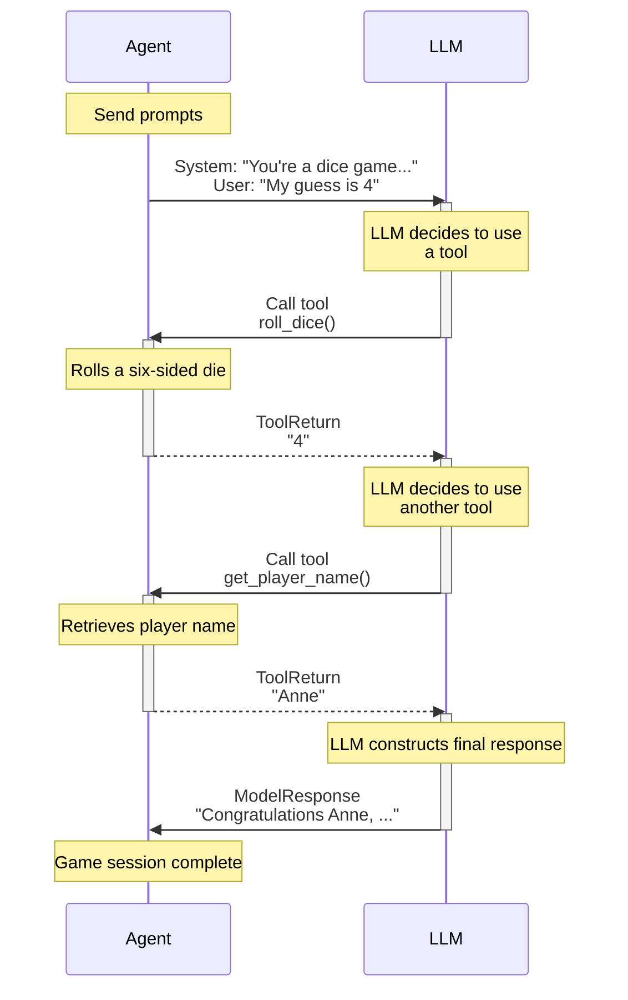

# pydantic/pydantic-ai/docs

[git-collector-data]

**URL:** https://github.com/pydantic/pydantic-ai/tree/main/docs  
**Date:** 8/13/2025, 6:08:20 PM  
**Files:** 12  

=== File: docs/agents.md ===
## Introduction

Agents are Pydantic AI's primary interface for interacting with LLMs.

In some use cases a single Agent will control an entire application or component,
but multiple agents can also interact to embody more complex workflows.

The [`Agent`][pydantic_ai.Agent] class has full API documentation, but conceptually you can think of an agent as a container for:

| **Component**                                             | **Description**                                                                                           |
| --------------------------------------------------------- | --------------------------------------------------------------------------------------------------------- |
| [System prompt(s)](#system-prompts)                       | A set of instructions for the LLM written by the developer.                                               |
| [Function tool(s)](tools.md) and [toolsets](toolsets.md)  | Functions that the LLM may call to get information while generating a response.                           |
| [Structured output type](output.md)                       | The structured datatype the LLM must return at the end of a run, if specified.                            |
| [Dependency type constraint](dependencies.md)             | System prompt functions, tools, and output validators may all use dependencies when they're run.          |
| [LLM model](api/models/base.md)                           | Optional default LLM model associated with the agent. Can also be specified when running the agent.       |
| [Model Settings](#additional-configuration)               | Optional default model settings to help fine tune requests. Can also be specified when running the agent. |

In typing terms, agents are generic in their dependency and output types, e.g., an agent which required dependencies of type `#!python Foobar` and produced outputs of type `#!python list[str]` would have type `Agent[Foobar, list[str]]`. In practice, you shouldn't need to care about this, it should just mean your IDE can tell you when you have the right type, and if you choose to use [static type checking](#static-type-checking) it should work well with Pydantic AI.

Here's a toy example of an agent that simulates a roulette wheel:

```python {title="roulette_wheel.py"}
from pydantic_ai import Agent, RunContext

roulette_agent = Agent(  # (1)!
    'openai:gpt-4o',
    deps_type=int,
    output_type=bool,
    system_prompt=(
        'Use the `roulette_wheel` function to see if the '
        'customer has won based on the number they provide.'
    ),
)


@roulette_agent.tool
async def roulette_wheel(ctx: RunContext[int], square: int) -> str:  # (2)!
    """check if the square is a winner"""
    return 'winner' if square == ctx.deps else 'loser'


# Run the agent
success_number = 18  # (3)!
result = roulette_agent.run_sync('Put my money on square eighteen', deps=success_number)
print(result.output)  # (4)!
#> True

result = roulette_agent.run_sync('I bet five is the winner', deps=success_number)
print(result.output)
#> False
```

1. Create an agent, which expects an integer dependency and produces a boolean output. This agent will have type `#!python Agent[int, bool]`.
2. Define a tool that checks if the square is a winner. Here [`RunContext`][pydantic_ai.tools.RunContext] is parameterized with the dependency type `int`; if you got the dependency type wrong you'd get a typing error.
3. In reality, you might want to use a random number here e.g. `random.randint(0, 36)`.
4. `result.output` will be a boolean indicating if the square is a winner. Pydantic performs the output validation, and it'll be typed as a `bool` since its type is derived from the `output_type` generic parameter of the agent.

!!! tip "Agents are designed for reuse, like FastAPI Apps"
    Agents are intended to be instantiated once (frequently as module globals) and reused throughout your application, similar to a small [FastAPI][fastapi.FastAPI] app or an [APIRouter][fastapi.APIRouter].

## Running Agents

There are four ways to run an agent:

1. [`agent.run()`][pydantic_ai.agent.AbstractAgent.run] — an async function which returns a [`RunResult`][pydantic_ai.agent.AgentRunResult] containing a completed response.
2. [`agent.run_sync()`][pydantic_ai.agent.AbstractAgent.run_sync] — a plain, synchronous function which returns a [`RunResult`][pydantic_ai.agent.AgentRunResult] containing a completed response (internally, this just calls `loop.run_until_complete(self.run())`).
3. [`agent.run_stream()`][pydantic_ai.agent.AbstractAgent.run_stream] — an async context manager which returns a [`StreamedRunResult`][pydantic_ai.result.StreamedRunResult], which contains methods to stream text and structured output as an async iterable.
4. [`agent.iter()`][pydantic_ai.Agent.iter] — a context manager which returns an [`AgentRun`][pydantic_ai.agent.AgentRun], an async-iterable over the nodes of the agent's underlying [`Graph`][pydantic_graph.graph.Graph].

Here's a simple example demonstrating the first three:

```python {title="run_agent.py"}
from pydantic_ai import Agent

agent = Agent('openai:gpt-4o')

result_sync = agent.run_sync('What is the capital of Italy?')
print(result_sync.output)
#> The capital of Italy is Rome.


async def main():
    result = await agent.run('What is the capital of France?')
    print(result.output)
    #> The capital of France is Paris.

    async with agent.run_stream('What is the capital of the UK?') as response:
        async for text in response.stream_text():
            print(text)
            #> The capital of
            #> The capital of the UK is
            #> The capital of the UK is London.
```

_(This example is complete, it can be run "as is" — you'll need to add `asyncio.run(main())` to run `main`)_

You can also pass messages from previous runs to continue a conversation or provide context, as described in [Messages and Chat History](message-history.md).

### Streaming Events and Final Output

As shown in the example above, [`run_stream()`][pydantic_ai.agent.AbstractAgent.run_stream] makes it easy to stream the agent's final output as it comes in.
It also takes an optional `event_stream_handler` argument that you can use to gain insight into what is happening during the run before the final output is produced.

The example below shows how to stream events and text output. You can also [stream structured output](output.md#streaming-structured-output).

!!! note
    As the `run_stream()` method will consider the first output matching the `output_type` to be the final output,
    it will stop running the agent graph and will not execute any tool calls made by the model after this "final" output.

    If you want to always run the agent graph to completion and stream all events from the model's streaming response and the agent's execution of tools,
    use [`agent.run()`][pydantic_ai.agent.AbstractAgent.run] with an `event_stream_handler` or [`agent.iter()`][pydantic_ai.agent.AbstractAgent.iter] instead, as described in the following sections.

```python {title="run_stream_events.py"}
import asyncio
from collections.abc import AsyncIterable
from datetime import date
from typing import Union

from pydantic_ai import Agent
from pydantic_ai.messages import (
    AgentStreamEvent,
    FinalResultEvent,
    FunctionToolCallEvent,
    FunctionToolResultEvent,
    HandleResponseEvent,
    PartDeltaEvent,
    PartStartEvent,
    TextPartDelta,
    ThinkingPartDelta,
    ToolCallPartDelta,
)
from pydantic_ai.tools import RunContext

weather_agent = Agent(
    'openai:gpt-4o',
    system_prompt='Providing a weather forecast at the locations the user provides.',
)


@weather_agent.tool
async def weather_forecast(
    ctx: RunContext,
    location: str,
    forecast_date: date,
) -> str:
    return f'The forecast in {location} on {forecast_date} is 24°C and sunny.'


output_messages: list[str] = []


async def event_stream_handler(
    ctx: RunContext,
    event_stream: AsyncIterable[Union[AgentStreamEvent, HandleResponseEvent]],
):
    async for event in event_stream:
        if isinstance(event, PartStartEvent):
            output_messages.append(f'[Request] Starting part {event.index}: {event.part!r}')
        elif isinstance(event, PartDeltaEvent):
            if isinstance(event.delta, TextPartDelta):
                output_messages.append(f'[Request] Part {event.index} text delta: {event.delta.content_delta!r}')
            elif isinstance(event.delta, ThinkingPartDelta):
                output_messages.append(f'[Request] Part {event.index} thinking delta: {event.delta.content_delta!r}')
            elif isinstance(event.delta, ToolCallPartDelta):
                output_messages.append(f'[Request] Part {event.index} args delta: {event.delta.args_delta}')
        elif isinstance(event, FunctionToolCallEvent):
            output_messages.append(
                f'[Tools] The LLM calls tool={event.part.tool_name!r} with args={event.part.args} (tool_call_id={event.part.tool_call_id!r})'
            )
        elif isinstance(event, FunctionToolResultEvent):
            output_messages.append(f'[Tools] Tool call {event.tool_call_id!r} returned => {event.result.content}')
        elif isinstance(event, FinalResultEvent):
            output_messages.append(f'[Result] The model starting producing a final result (tool_name={event.tool_name})')


async def main():
    user_prompt = 'What will the weather be like in Paris on Tuesday?'

    async with weather_agent.run_stream(user_prompt, event_stream_handler=event_stream_handler) as run:
        async for output in run.stream_text():
            output_messages.append(f'[Output] {output}')


if __name__ == '__main__':
    asyncio.run(main())

    print(output_messages)
    """
    [
        "[Request] Starting part 0: ToolCallPart(tool_name='weather_forecast', tool_call_id='0001')",
        '[Request] Part 0 args delta: {"location":"Pa',
        '[Request] Part 0 args delta: ris","forecast_',
        '[Request] Part 0 args delta: date":"2030-01-',
        '[Request] Part 0 args delta: 01"}',
        '[Tools] The LLM calls tool=\'weather_forecast\' with args={"location":"Paris","forecast_date":"2030-01-01"} (tool_call_id=\'0001\')',
        "[Tools] Tool call '0001' returned => The forecast in Paris on 2030-01-01 is 24°C and sunny.",
        "[Request] Starting part 0: TextPart(content='It will be ')",
        '[Result] The model starting producing a final result (tool_name=None)',
        '[Output] It will be ',
        '[Output] It will be warm and sunny ',
        '[Output] It will be warm and sunny in Paris on ',
        '[Output] It will be warm and sunny in Paris on Tuesday.',
    ]
    """
```

### Streaming All Events

Like `agent.run_stream()`, [`agent.run()`][pydantic_ai.agent.AbstractAgent.run_stream] takes an optional `event_stream_handler`
argument that lets you stream all events from the model's streaming response and the agent's execution of tools.
Unlike `run_stream()`, it always runs the agent graph to completion even if text was received ahead of tool calls that looked like it could've been the final result.

!!! note
    When used with an `event_stream_handler`, the `run()` method currently requires you to piece together the streamed text yourself from the `PartStartEvent` and subsequent `PartDeltaEvent`s instead of providing a `stream_text()` convenience method.

    To get the best of both worlds, at the expense of some additional complexity, you can use [`agent.iter()`][pydantic_ai.agent.AbstractAgent.iter] as described in the next section, which lets you [iterate over the agent graph](#iterating-over-an-agents-graph) and [stream both events and output](#streaming-all-events-and-output) at every step.

```python {title="run_events.py" requires="run_stream_events.py"}
from run_stream_events import weather_agent, event_stream_handler, output_messages

import asyncio


async def main():
    user_prompt = 'What will the weather be like in Paris on Tuesday?'

    run = await weather_agent.run(user_prompt, event_stream_handler=event_stream_handler)

    output_messages.append(f'[Final Output] {run.output}')


if __name__ == '__main__':
    asyncio.run(main())

    print(output_messages)
    """
    [
        "[Request] Starting part 0: ToolCallPart(tool_name='weather_forecast', tool_call_id='0001')",
        '[Request] Part 0 args delta: {"location":"Pa',
        '[Request] Part 0 args delta: ris","forecast_',
        '[Request] Part 0 args delta: date":"2030-01-',
        '[Request] Part 0 args delta: 01"}',
        '[Tools] The LLM calls tool=\'weather_forecast\' with args={"location":"Paris","forecast_date":"2030-01-01"} (tool_call_id=\'0001\')',
        "[Tools] Tool call '0001' returned => The forecast in Paris on 2030-01-01 is 24°C and sunny.",
        "[Request] Starting part 0: TextPart(content='It will be ')",
        '[Result] The model starting producing a final result (tool_name=None)',
        "[Request] Part 0 text delta: 'warm and sunny '",
        "[Request] Part 0 text delta: 'in Paris on '",
        "[Request] Part 0 text delta: 'Tuesday.'",
        '[Final Output] It will be warm and sunny in Paris on Tuesday.',
    ]
    """
```

_(This example is complete, it can be run "as is")_

### Iterating Over an Agent's Graph

Under the hood, each `Agent` in Pydantic AI uses **pydantic-graph** to manage its execution flow. **pydantic-graph** is a generic, type-centric library for building and running finite state machines in Python. It doesn't actually depend on Pydantic AI — you can use it standalone for workflows that have nothing to do with GenAI — but Pydantic AI makes use of it to orchestrate the handling of model requests and model responses in an agent's run.

In many scenarios, you don't need to worry about pydantic-graph at all; calling `agent.run(...)` simply traverses the underlying graph from start to finish. However, if you need deeper insight or control — for example to inject your own logic at specific stages — Pydantic AI exposes the lower-level iteration process via [`Agent.iter`][pydantic_ai.Agent.iter]. This method returns an [`AgentRun`][pydantic_ai.agent.AgentRun], which you can async-iterate over, or manually drive node-by-node via the [`next`][pydantic_ai.agent.AgentRun.next] method. Once the agent's graph returns an [`End`][pydantic_graph.nodes.End], you have the final result along with a detailed history of all steps.

#### `async for` iteration

Here's an example of using `async for` with `iter` to record each node the agent executes:

```python {title="agent_iter_async_for.py"}
from pydantic_ai import Agent

agent = Agent('openai:gpt-4o')


async def main():
    nodes = []
    # Begin an AgentRun, which is an async-iterable over the nodes of the agent's graph
    async with agent.iter('What is the capital of France?') as agent_run:
        async for node in agent_run:
            # Each node represents a step in the agent's execution
            nodes.append(node)
    print(nodes)
    """
    [
        UserPromptNode(
            user_prompt='What is the capital of France?',
            instructions=None,
            instructions_functions=[],
            system_prompts=(),
            system_prompt_functions=[],
            system_prompt_dynamic_functions={},
        ),
        ModelRequestNode(
            request=ModelRequest(
                parts=[
                    UserPromptPart(
                        content='What is the capital of France?',
                        timestamp=datetime.datetime(...),
                    )
                ]
            )
        ),
        CallToolsNode(
            model_response=ModelResponse(
                parts=[TextPart(content='The capital of France is Paris.')],
                usage=Usage(
                    requests=1, request_tokens=56, response_tokens=7, total_tokens=63
                ),
                model_name='gpt-4o',
                timestamp=datetime.datetime(...),
            )
        ),
        End(data=FinalResult(output='The capital of France is Paris.')),
    ]
    """
    print(agent_run.result.output)
    #> The capital of France is Paris.
```

_(This example is complete, it can be run "as is" — you'll need to add `asyncio.run(main())` to run `main`)_

- The `AgentRun` is an async iterator that yields each node (`BaseNode` or `End`) in the flow.
- The run ends when an `End` node is returned.

#### Using `.next(...)` manually

You can also drive the iteration manually by passing the node you want to run next to the `AgentRun.next(...)` method. This allows you to inspect or modify the node before it executes or skip nodes based on your own logic, and to catch errors in `next()` more easily:

```python {title="agent_iter_next.py"}
from pydantic_ai import Agent
from pydantic_graph import End

agent = Agent('openai:gpt-4o')


async def main():
    async with agent.iter('What is the capital of France?') as agent_run:
        node = agent_run.next_node  # (1)!

        all_nodes = [node]

        # Drive the iteration manually:
        while not isinstance(node, End):  # (2)!
            node = await agent_run.next(node)  # (3)!
            all_nodes.append(node)  # (4)!

        print(all_nodes)
        """
        [
            UserPromptNode(
                user_prompt='What is the capital of France?',
                instructions=None,
                instructions_functions=[],
                system_prompts=(),
                system_prompt_functions=[],
                system_prompt_dynamic_functions={},
            ),
            ModelRequestNode(
                request=ModelRequest(
                    parts=[
                        UserPromptPart(
                            content='What is the capital of France?',
                            timestamp=datetime.datetime(...),
                        )
                    ]
                )
            ),
            CallToolsNode(
                model_response=ModelResponse(
                    parts=[TextPart(content='The capital of France is Paris.')],
                    usage=Usage(
                        requests=1,
                        request_tokens=56,
                        response_tokens=7,
                        total_tokens=63,
                    ),
                    model_name='gpt-4o',
                    timestamp=datetime.datetime(...),
                )
            ),
            End(data=FinalResult(output='The capital of France is Paris.')),
        ]
        """
```

1. We start by grabbing the first node that will be run in the agent's graph.
2. The agent run is finished once an `End` node has been produced; instances of `End` cannot be passed to `next`.
3. When you call `await agent_run.next(node)`, it executes that node in the agent's graph, updates the run's history, and returns the _next_ node to run.
4. You could also inspect or mutate the new `node` here as needed.

_(This example is complete, it can be run "as is" — you'll need to add `asyncio.run(main())` to run `main`)_

#### Accessing usage and final output

You can retrieve usage statistics (tokens, requests, etc.) at any time from the [`AgentRun`][pydantic_ai.agent.AgentRun] object via `agent_run.usage()`. This method returns a [`Usage`][pydantic_ai.usage.Usage] object containing the usage data.

Once the run finishes, `agent_run.result` becomes a [`AgentRunResult`][pydantic_ai.agent.AgentRunResult] object containing the final output (and related metadata).

#### Streaming All Events and Output

Here is an example of streaming an agent run in combination with `async for` iteration:

```python {title="streaming_iter.py"}
import asyncio
from dataclasses import dataclass
from datetime import date

from pydantic_ai import Agent
from pydantic_ai.messages import (
    FinalResultEvent,
    FunctionToolCallEvent,
    FunctionToolResultEvent,
    PartDeltaEvent,
    PartStartEvent,
    TextPartDelta,
    ThinkingPartDelta,
    ToolCallPartDelta,
)
from pydantic_ai.tools import RunContext


@dataclass
class WeatherService:
    async def get_forecast(self, location: str, forecast_date: date) -> str:
        # In real code: call weather API, DB queries, etc.
        return f'The forecast in {location} on {forecast_date} is 24°C and sunny.'

    async def get_historic_weather(self, location: str, forecast_date: date) -> str:
        # In real code: call a historical weather API or DB
        return f'The weather in {location} on {forecast_date} was 18°C and partly cloudy.'


weather_agent = Agent[WeatherService, str](
    'openai:gpt-4o',
    deps_type=WeatherService,
    output_type=str,  # We'll produce a final answer as plain text
    system_prompt='Providing a weather forecast at the locations the user provides.',
)


@weather_agent.tool
async def weather_forecast(
    ctx: RunContext[WeatherService],
    location: str,
    forecast_date: date,
) -> str:
    if forecast_date >= date.today():
        return await ctx.deps.get_forecast(location, forecast_date)
    else:
        return await ctx.deps.get_historic_weather(location, forecast_date)


output_messages: list[str] = []


async def main():
    user_prompt = 'What will the weather be like in Paris on Tuesday?'

    # Begin a node-by-node, streaming iteration
    async with weather_agent.iter(user_prompt, deps=WeatherService()) as run:
        async for node in run:
            if Agent.is_user_prompt_node(node):
                # A user prompt node => The user has provided input
                output_messages.append(f'=== UserPromptNode: {node.user_prompt} ===')
            elif Agent.is_model_request_node(node):
                # A model request node => We can stream tokens from the model's request
                output_messages.append('=== ModelRequestNode: streaming partial request tokens ===')
                async with node.stream(run.ctx) as request_stream:
                    final_result_found = False
                    async for event in request_stream:
                        if isinstance(event, PartStartEvent):
                            output_messages.append(f'[Request] Starting part {event.index}: {event.part!r}')
                        elif isinstance(event, PartDeltaEvent):
                            if isinstance(event.delta, TextPartDelta):
                                output_messages.append(
                                    f'[Request] Part {event.index} text delta: {event.delta.content_delta!r}'
                                )
                            elif isinstance(event.delta, ThinkingPartDelta):
                                output_messages.append(
                                    f'[Request] Part {event.index} thinking delta: {event.delta.content_delta!r}'
                                )
                            elif isinstance(event.delta, ToolCallPartDelta):
                                output_messages.append(
                                    f'[Request] Part {event.index} args delta: {event.delta.args_delta}'
                                )
                        elif isinstance(event, FinalResultEvent):
                            output_messages.append(
                                f'[Result] The model started producing a final result (tool_name={event.tool_name})'
                            )
                            final_result_found = True
                            break

                    if final_result_found:
                        # Once the final result is found, we can call `AgentStream.stream_text()` to stream the text.
                        # A similar `AgentStream.stream_output()` method is available to stream structured output.
                        async for output in request_stream.stream_text():
                            output_messages.append(f'[Output] {output}')
            elif Agent.is_call_tools_node(node):
                # A handle-response node => The model returned some data, potentially calls a tool
                output_messages.append('=== CallToolsNode: streaming partial response & tool usage ===')
                async with node.stream(run.ctx) as handle_stream:
                    async for event in handle_stream:
                        if isinstance(event, FunctionToolCallEvent):
                            output_messages.append(
                                f'[Tools] The LLM calls tool={event.part.tool_name!r} with args={event.part.args} (tool_call_id={event.part.tool_call_id!r})'
                            )
                        elif isinstance(event, FunctionToolResultEvent):
                            output_messages.append(
                                f'[Tools] Tool call {event.tool_call_id!r} returned => {event.result.content}'
                            )
            elif Agent.is_end_node(node):
                # Once an End node is reached, the agent run is complete
                assert run.result is not None
                assert run.result.output == node.data.output
                output_messages.append(f'=== Final Agent Output: {run.result.output} ===')


if __name__ == '__main__':
    asyncio.run(main())

    print(output_messages)
    """
    [
        '=== UserPromptNode: What will the weather be like in Paris on Tuesday? ===',
        '=== ModelRequestNode: streaming partial request tokens ===',
        "[Request] Starting part 0: ToolCallPart(tool_name='weather_forecast', tool_call_id='0001')",
        '[Request] Part 0 args delta: {"location":"Pa',
        '[Request] Part 0 args delta: ris","forecast_',
        '[Request] Part 0 args delta: date":"2030-01-',
        '[Request] Part 0 args delta: 01"}',
        '=== CallToolsNode: streaming partial response & tool usage ===',
        '[Tools] The LLM calls tool=\'weather_forecast\' with args={"location":"Paris","forecast_date":"2030-01-01"} (tool_call_id=\'0001\')',
        "[Tools] Tool call '0001' returned => The forecast in Paris on 2030-01-01 is 24°C and sunny.",
        '=== ModelRequestNode: streaming partial request tokens ===',
        "[Request] Starting part 0: TextPart(content='It will be ')",
        '[Result] The model started producing a final result (tool_name=None)',
        '[Output] It will be ',
        '[Output] It will be warm and sunny ',
        '[Output] It will be warm and sunny in Paris on ',
        '[Output] It will be warm and sunny in Paris on Tuesday.',
        '=== CallToolsNode: streaming partial response & tool usage ===',
        '=== Final Agent Output: It will be warm and sunny in Paris on Tuesday. ===',
    ]
    """
```

_(This example is complete, it can be run "as is")_

### Additional Configuration

#### Usage Limits

Pydantic AI offers a [`UsageLimits`][pydantic_ai.usage.UsageLimits] structure to help you limit your
usage (tokens and/or requests) on model runs.

You can apply these settings by passing the `usage_limits` argument to the `run{_sync,_stream}` functions.

Consider the following example, where we limit the number of response tokens:

```py
from pydantic_ai import Agent
from pydantic_ai.exceptions import UsageLimitExceeded
from pydantic_ai.usage import UsageLimits

agent = Agent('anthropic:claude-3-5-sonnet-latest')

result_sync = agent.run_sync(
    'What is the capital of Italy? Answer with just the city.',
    usage_limits=UsageLimits(response_tokens_limit=10),
)
print(result_sync.output)
#> Rome
print(result_sync.usage())
#> Usage(requests=1, request_tokens=62, response_tokens=1, total_tokens=63)

try:
    result_sync = agent.run_sync(
        'What is the capital of Italy? Answer with a paragraph.',
        usage_limits=UsageLimits(response_tokens_limit=10),
    )
except UsageLimitExceeded as e:
    print(e)
    #> Exceeded the response_tokens_limit of 10 (response_tokens=32)
```

Restricting the number of requests can be useful in preventing infinite loops or excessive tool calling:

```py
from typing_extensions import TypedDict

from pydantic_ai import Agent, ModelRetry
from pydantic_ai.exceptions import UsageLimitExceeded
from pydantic_ai.usage import UsageLimits


class NeverOutputType(TypedDict):
    """
    Never ever coerce data to this type.
    """

    never_use_this: str


agent = Agent(
    'anthropic:claude-3-5-sonnet-latest',
    retries=3,
    output_type=NeverOutputType,
    system_prompt='Any time you get a response, call the `infinite_retry_tool` to produce another response.',
)


@agent.tool_plain(retries=5)  # (1)!
def infinite_retry_tool() -> int:
    raise ModelRetry('Please try again.')


try:
    result_sync = agent.run_sync(
        'Begin infinite retry loop!', usage_limits=UsageLimits(request_limit=3)  # (2)!
    )
except UsageLimitExceeded as e:
    print(e)
    #> The next request would exceed the request_limit of 3
```

1. This tool has the ability to retry 5 times before erroring, simulating a tool that might get stuck in a loop.
2. This run will error after 3 requests, preventing the infinite tool calling.

!!! note
    This is especially relevant if you've registered many tools. The `request_limit` can be used to prevent the model from calling them in a loop too many times.

#### Model (Run) Settings

Pydantic AI offers a [`settings.ModelSettings`][pydantic_ai.settings.ModelSettings] structure to help you fine tune your requests.
This structure allows you to configure common parameters that influence the model's behavior, such as `temperature`, `max_tokens`,
`timeout`, and more.

There are three ways to apply these settings, with a clear precedence order:

1. **Model-level defaults** - Set when creating a model instance via the `settings` parameter. These serve as the base defaults for that model.
2. **Agent-level defaults** - Set during [`Agent`][pydantic_ai.agent.Agent] initialization via the `model_settings` argument. These are merged with model defaults, with agent settings taking precedence.
3. **Run-time overrides** - Passed to `run{_sync,_stream}` functions via the `model_settings` argument. These have the highest priority and are merged with the combined agent and model defaults.

For example, if you'd like to set the `temperature` setting to `0.0` to ensure less random behavior,
you can do the following:

```py
from pydantic_ai import Agent
from pydantic_ai.models.openai import OpenAIModel
from pydantic_ai.settings import ModelSettings

# 1. Model-level defaults
model = OpenAIModel(
    'gpt-4o',
    settings=ModelSettings(temperature=0.8, max_tokens=500)  # Base defaults
)

# 2. Agent-level defaults (overrides model defaults by merging)
agent = Agent(model, model_settings=ModelSettings(temperature=0.5))

# 3. Run-time overrides (highest priority)
result_sync = agent.run_sync(
    'What is the capital of Italy?',
    model_settings=ModelSettings(temperature=0.0)  # Final temperature: 0.0
)
print(result_sync.output)
#> The capital of Italy is Rome.
```

The final request uses `temperature=0.0` (run-time), `max_tokens=500` (from model), demonstrating how settings merge with run-time taking precedence.

!!! note "Model Settings Support"
    Model-level settings are supported by all concrete model implementations (OpenAI, Anthropic, Google, etc.). Wrapper models like `FallbackModel`, `WrapperModel`, and `InstrumentedModel` don't have their own settings - they use the settings of their underlying models.

### Model specific settings

If you wish to further customize model behavior, you can use a subclass of [`ModelSettings`][pydantic_ai.settings.ModelSettings], like
[`GoogleModelSettings`][pydantic_ai.models.google.GoogleModelSettings], associated with your model of choice.

For example:

```py
from pydantic_ai import Agent, UnexpectedModelBehavior
from pydantic_ai.models.google import GoogleModelSettings

agent = Agent('google-gla:gemini-1.5-flash')

try:
    result = agent.run_sync(
        'Write a list of 5 very rude things that I might say to the universe after stubbing my toe in the dark:',
        model_settings=GoogleModelSettings(
            temperature=0.0,  # general model settings can also be specified
            gemini_safety_settings=[
                {
                    'category': 'HARM_CATEGORY_HARASSMENT',
                    'threshold': 'BLOCK_LOW_AND_ABOVE',
                },
                {
                    'category': 'HARM_CATEGORY_HATE_SPEECH',
                    'threshold': 'BLOCK_LOW_AND_ABOVE',
                },
            ],
        ),
    )
except UnexpectedModelBehavior as e:
    print(e)  # (1)!
    """
    Safety settings triggered, body:
    <safety settings details>
    """
```

1. This error is raised because the safety thresholds were exceeded.

## Runs vs. Conversations

An agent **run** might represent an entire conversation — there's no limit to how many messages can be exchanged in a single run. However, a **conversation** might also be composed of multiple runs, especially if you need to maintain state between separate interactions or API calls.

Here's an example of a conversation comprised of multiple runs:

```python {title="conversation_example.py" hl_lines="13"}
from pydantic_ai import Agent

agent = Agent('openai:gpt-4o')

# First run
result1 = agent.run_sync('Who was Albert Einstein?')
print(result1.output)
#> Albert Einstein was a German-born theoretical physicist.

# Second run, passing previous messages
result2 = agent.run_sync(
    'What was his most famous equation?',
    message_history=result1.new_messages(),  # (1)!
)
print(result2.output)
#> Albert Einstein's most famous equation is (E = mc^2).
```

1. Continue the conversation; without `message_history` the model would not know who "his" was referring to.

_(This example is complete, it can be run "as is")_

## Type safe by design {#static-type-checking}

Pydantic AI is designed to work well with static type checkers, like mypy and pyright.

!!! tip "Typing is (somewhat) optional"
    Pydantic AI is designed to make type checking as useful as possible for you if you choose to use it, but you don't have to use types everywhere all the time.

    That said, because Pydantic AI uses Pydantic, and Pydantic uses type hints as the definition for schema and validation, some types (specifically type hints on parameters to tools, and the `output_type` arguments to [`Agent`][pydantic_ai.Agent]) are used at runtime.

    We (the library developers) have messed up if type hints are confusing you more than helping you, if you find this, please create an [issue](https://github.com/pydantic/pydantic-ai/issues) explaining what's annoying you!

In particular, agents are generic in both the type of their dependencies and the type of the outputs they return, so you can use the type hints to ensure you're using the right types.

Consider the following script with type mistakes:

```python {title="type_mistakes.py" hl_lines="18 28"}
from dataclasses import dataclass

from pydantic_ai import Agent, RunContext


@dataclass
class User:
    name: str


agent = Agent(
    'test',
    deps_type=User,  # (1)!
    output_type=bool,
)


@agent.system_prompt
def add_user_name(ctx: RunContext[str]) -> str:  # (2)!
    return f"The user's name is {ctx.deps}."


def foobar(x: bytes) -> None:
    pass


result = agent.run_sync('Does their name start with "A"?', deps=User('Anne'))
foobar(result.output)  # (3)!
```

1. The agent is defined as expecting an instance of `User` as `deps`.
2. But here `add_user_name` is defined as taking a `str` as the dependency, not a `User`.
3. Since the agent is defined as returning a `bool`, this will raise a type error since `foobar` expects `bytes`.

Running `mypy` on this will give the following output:

```bash
➤ uv run mypy type_mistakes.py
type_mistakes.py:18: error: Argument 1 to "system_prompt" of "Agent" has incompatible type "Callable[[RunContext[str]], str]"; expected "Callable[[RunContext[User]], str]"  [arg-type]
type_mistakes.py:28: error: Argument 1 to "foobar" has incompatible type "bool"; expected "bytes"  [arg-type]
Found 2 errors in 1 file (checked 1 source file)
```

Running `pyright` would identify the same issues.

## System Prompts

System prompts might seem simple at first glance since they're just strings (or sequences of strings that are concatenated), but crafting the right system prompt is key to getting the model to behave as you want.

!!! tip
    For most use cases, you should use `instructions` instead of "system prompts".

    If you know what you are doing though and want to preserve system prompt messages in the message history sent to the
    LLM in subsequent completions requests, you can achieve this using the `system_prompt` argument/decorator.

    See the section below on [Instructions](#instructions) for more information.

Generally, system prompts fall into two categories:

1. **Static system prompts**: These are known when writing the code and can be defined via the `system_prompt` parameter of the [`Agent` constructor][pydantic_ai.Agent.__init__].
2. **Dynamic system prompts**: These depend in some way on context that isn't known until runtime, and should be defined via functions decorated with [`@agent.system_prompt`][pydantic_ai.Agent.system_prompt].

You can add both to a single agent; they're appended in the order they're defined at runtime.

Here's an example using both types of system prompts:

```python {title="system_prompts.py"}
from datetime import date

from pydantic_ai import Agent, RunContext

agent = Agent(
    'openai:gpt-4o',
    deps_type=str,  # (1)!
    system_prompt="Use the customer's name while replying to them.",  # (2)!
)


@agent.system_prompt  # (3)!
def add_the_users_name(ctx: RunContext[str]) -> str:
    return f"The user's name is {ctx.deps}."


@agent.system_prompt
def add_the_date() -> str:  # (4)!
    return f'The date is {date.today()}.'


result = agent.run_sync('What is the date?', deps='Frank')
print(result.output)
#> Hello Frank, the date today is 2032-01-02.
```

1. The agent expects a string dependency.
2. Static system prompt defined at agent creation time.
3. Dynamic system prompt defined via a decorator with [`RunContext`][pydantic_ai.tools.RunContext], this is called just after `run_sync`, not when the agent is created, so can benefit from runtime information like the dependencies used on that run.
4. Another dynamic system prompt, system prompts don't have to have the `RunContext` parameter.

_(This example is complete, it can be run "as is")_

## Instructions

Instructions are similar to system prompts. The main difference is that when an explicit `message_history` is provided
in a call to `Agent.run` and similar methods, _instructions_ from any existing messages in the history are not included
in the request to the model — only the instructions of the _current_ agent are included.

You should use:

- `instructions` when you want your request to the model to only include system prompts for the _current_ agent
- `system_prompt` when you want your request to the model to _retain_ the system prompts used in previous requests (possibly made using other agents)

In general, we recommend using `instructions` instead of `system_prompt` unless you have a specific reason to use `system_prompt`.

Instructions, like system prompts, fall into two categories:

1. **Static instructions**: These are known when writing the code and can be defined via the `instructions` parameter of the [`Agent` constructor][pydantic_ai.Agent.__init__].
2. **Dynamic instructions**: These rely on context that is only available at runtime and should be defined using functions decorated with [`@agent.instructions`][pydantic_ai.Agent.instructions]. Unlike dynamic system prompts, which may be reused when `message_history` is present, dynamic instructions are always reevaluated.

Both static and dynamic instructions can be added to a single agent, and they are appended in the order they are defined at runtime.

Here's an example using both types of instructions:

```python {title="instructions.py"}
from datetime import date

from pydantic_ai import Agent, RunContext

agent = Agent(
    'openai:gpt-4o',
    deps_type=str,  # (1)!
    instructions="Use the customer's name while replying to them.",  # (2)!
)


@agent.instructions  # (3)!
def add_the_users_name(ctx: RunContext[str]) -> str:
    return f"The user's name is {ctx.deps}."


@agent.instructions
def add_the_date() -> str:  # (4)!
    return f'The date is {date.today()}.'


result = agent.run_sync('What is the date?', deps='Frank')
print(result.output)
#> Hello Frank, the date today is 2032-01-02.
```

1. The agent expects a string dependency.
2. Static instructions defined at agent creation time.
3. Dynamic instructions defined via a decorator with [`RunContext`][pydantic_ai.tools.RunContext],
   this is called just after `run_sync`, not when the agent is created, so can benefit from runtime
   information like the dependencies used on that run.
4. Another dynamic instruction, instructions don't have to have the `RunContext` parameter.

_(This example is complete, it can be run "as is")_

Note that returning an empty string will result in no instruction message added.

## Reflection and self-correction

Validation errors from both function tool parameter validation and [structured output validation](output.md#structured-output) can be passed back to the model with a request to retry.

You can also raise [`ModelRetry`][pydantic_ai.exceptions.ModelRetry] from within a [tool](tools.md) or [output validator function](output.md#output-validator-functions) to tell the model it should retry generating a response.

- The default retry count is **1** but can be altered for the [entire agent][pydantic_ai.Agent.__init__], a [specific tool][pydantic_ai.Agent.tool], or an [output validator][pydantic_ai.Agent.__init__].
- You can access the current retry count from within a tool or output validator via [`ctx.retry`][pydantic_ai.tools.RunContext].

Here's an example:

```python {title="tool_retry.py"}
from pydantic import BaseModel

from pydantic_ai import Agent, RunContext, ModelRetry

from fake_database import DatabaseConn


class ChatResult(BaseModel):
    user_id: int
    message: str


agent = Agent(
    'openai:gpt-4o',
    deps_type=DatabaseConn,
    output_type=ChatResult,
)


@agent.tool(retries=2)
def get_user_by_name(ctx: RunContext[DatabaseConn], name: str) -> int:
    """Get a user's ID from their full name."""
    print(name)
    #> John
    #> John Doe
    user_id = ctx.deps.users.get(name=name)
    if user_id is None:
        raise ModelRetry(
            f'No user found with name {name!r}, remember to provide their full name'
        )
    return user_id


result = agent.run_sync(
    'Send a message to John Doe asking for coffee next week', deps=DatabaseConn()
)
print(result.output)
"""
user_id=123 message='Hello John, would you be free for coffee sometime next week? Let me know what works for you!'
"""
```

## Model errors

If models behave unexpectedly (e.g., the retry limit is exceeded, or their API returns `503`), agent runs will raise [`UnexpectedModelBehavior`][pydantic_ai.exceptions.UnexpectedModelBehavior].

In these cases, [`capture_run_messages`][pydantic_ai.capture_run_messages] can be used to access the messages exchanged during the run to help diagnose the issue.

```python {title="agent_model_errors.py"}
from pydantic_ai import Agent, ModelRetry, UnexpectedModelBehavior, capture_run_messages

agent = Agent('openai:gpt-4o')


@agent.tool_plain
def calc_volume(size: int) -> int:  # (1)!
    if size == 42:
        return size**3
    else:
        raise ModelRetry('Please try again.')


with capture_run_messages() as messages:  # (2)!
    try:
        result = agent.run_sync('Please get me the volume of a box with size 6.')
    except UnexpectedModelBehavior as e:
        print('An error occurred:', e)
        #> An error occurred: Tool 'calc_volume' exceeded max retries count of 1
        print('cause:', repr(e.__cause__))
        #> cause: ModelRetry('Please try again.')
        print('messages:', messages)
        """
        messages:
        [
            ModelRequest(
                parts=[
                    UserPromptPart(
                        content='Please get me the volume of a box with size 6.',
                        timestamp=datetime.datetime(...),
                    )
                ]
            ),
            ModelResponse(
                parts=[
                    ToolCallPart(
                        tool_name='calc_volume',
                        args={'size': 6},
                        tool_call_id='pyd_ai_tool_call_id',
                    )
                ],
                usage=Usage(
                    requests=1, request_tokens=62, response_tokens=4, total_tokens=66
                ),
                model_name='gpt-4o',
                timestamp=datetime.datetime(...),
            ),
            ModelRequest(
                parts=[
                    RetryPromptPart(
                        content='Please try again.',
                        tool_name='calc_volume',
                        tool_call_id='pyd_ai_tool_call_id',
                        timestamp=datetime.datetime(...),
                    )
                ]
            ),
            ModelResponse(
                parts=[
                    ToolCallPart(
                        tool_name='calc_volume',
                        args={'size': 6},
                        tool_call_id='pyd_ai_tool_call_id',
                    )
                ],
                usage=Usage(
                    requests=1, request_tokens=72, response_tokens=8, total_tokens=80
                ),
                model_name='gpt-4o',
                timestamp=datetime.datetime(...),
            ),
        ]
        """
    else:
        print(result.output)
```

1. Define a tool that will raise `ModelRetry` repeatedly in this case.
2. [`capture_run_messages`][pydantic_ai.capture_run_messages] is used to capture the messages exchanged during the run.

_(This example is complete, it can be run "as is")_

!!! note
    If you call [`run`][pydantic_ai.agent.AbstractAgent.run], [`run_sync`][pydantic_ai.agent.AbstractAgent.run_sync], or [`run_stream`][pydantic_ai.agent.AbstractAgent.run_stream] more than once within a single `capture_run_messages` context, `messages` will represent the messages exchanged during the first call only.


=== File: docs/dependencies.md ===
# Dependencies

Pydantic AI uses a dependency injection system to provide data and services to your agent's [system prompts](agents.md#system-prompts), [tools](tools.md) and [output validators](output.md#output-validator-functions).

Matching Pydantic AI's design philosophy, our dependency system tries to use existing best practice in Python development rather than inventing esoteric "magic", this should make dependencies type-safe, understandable easier to test and ultimately easier to deploy in production.

## Defining Dependencies

Dependencies can be any python type. While in simple cases you might be able to pass a single object as a dependency (e.g. an HTTP connection), [dataclasses][] are generally a convenient container when your dependencies included multiple objects.

Here's an example of defining an agent that requires dependencies.

(**Note:** dependencies aren't actually used in this example, see [Accessing Dependencies](#accessing-dependencies) below)

```python {title="unused_dependencies.py"}
from dataclasses import dataclass

import httpx

from pydantic_ai import Agent


@dataclass
class MyDeps:  # (1)!
    api_key: str
    http_client: httpx.AsyncClient


agent = Agent(
    'openai:gpt-4o',
    deps_type=MyDeps,  # (2)!
)


async def main():
    async with httpx.AsyncClient() as client:
        deps = MyDeps('foobar', client)
        result = await agent.run(
            'Tell me a joke.',
            deps=deps,  # (3)!
        )
        print(result.output)
        #> Did you hear about the toothpaste scandal? They called it Colgate.
```

1. Define a dataclass to hold dependencies.
2. Pass the dataclass type to the `deps_type` argument of the [`Agent` constructor][pydantic_ai.Agent.__init__]. **Note**: we're passing the type here, NOT an instance, this parameter is not actually used at runtime, it's here so we can get full type checking of the agent.
3. When running the agent, pass an instance of the dataclass to the `deps` parameter.

_(This example is complete, it can be run "as is" — you'll need to add `asyncio.run(main())` to run `main`)_

## Accessing Dependencies

Dependencies are accessed through the [`RunContext`][pydantic_ai.tools.RunContext] type, this should be the first parameter of system prompt functions etc.

```python {title="system_prompt_dependencies.py" hl_lines="20-27"}
from dataclasses import dataclass

import httpx

from pydantic_ai import Agent, RunContext


@dataclass
class MyDeps:
    api_key: str
    http_client: httpx.AsyncClient


agent = Agent(
    'openai:gpt-4o',
    deps_type=MyDeps,
)


@agent.system_prompt  # (1)!
async def get_system_prompt(ctx: RunContext[MyDeps]) -> str:  # (2)!
    response = await ctx.deps.http_client.get(  # (3)!
        'https://example.com',
        headers={'Authorization': f'Bearer {ctx.deps.api_key}'},  # (4)!
    )
    response.raise_for_status()
    return f'Prompt: {response.text}'


async def main():
    async with httpx.AsyncClient() as client:
        deps = MyDeps('foobar', client)
        result = await agent.run('Tell me a joke.', deps=deps)
        print(result.output)
        #> Did you hear about the toothpaste scandal? They called it Colgate.
```

1. [`RunContext`][pydantic_ai.tools.RunContext] may optionally be passed to a [`system_prompt`][pydantic_ai.Agent.system_prompt] function as the only argument.
2. [`RunContext`][pydantic_ai.tools.RunContext] is parameterized with the type of the dependencies, if this type is incorrect, static type checkers will raise an error.
3. Access dependencies through the [`.deps`][pydantic_ai.tools.RunContext.deps] attribute.
4. Access dependencies through the [`.deps`][pydantic_ai.tools.RunContext.deps] attribute.

_(This example is complete, it can be run "as is" — you'll need to add `asyncio.run(main())` to run `main`)_

### Asynchronous vs. Synchronous dependencies

[System prompt functions](agents.md#system-prompts), [function tools](tools.md) and [output validators](output.md#output-validator-functions) are all run in the async context of an agent run.

If these functions are not coroutines (e.g. `async def`) they are called with
[`run_in_executor`][asyncio.loop.run_in_executor] in a thread pool, it's therefore marginally preferable
to use `async` methods where dependencies perform IO, although synchronous dependencies should work fine too.

!!! note "`run` vs. `run_sync` and Asynchronous vs. Synchronous dependencies"
    Whether you use synchronous or asynchronous dependencies, is completely independent of whether you use `run` or `run_sync` — `run_sync` is just a wrapper around `run` and agents are always run in an async context.

Here's the same example as above, but with a synchronous dependency:

```python {title="sync_dependencies.py"}
from dataclasses import dataclass

import httpx

from pydantic_ai import Agent, RunContext


@dataclass
class MyDeps:
    api_key: str
    http_client: httpx.Client  # (1)!


agent = Agent(
    'openai:gpt-4o',
    deps_type=MyDeps,
)


@agent.system_prompt
def get_system_prompt(ctx: RunContext[MyDeps]) -> str:  # (2)!
    response = ctx.deps.http_client.get(
        'https://example.com', headers={'Authorization': f'Bearer {ctx.deps.api_key}'}
    )
    response.raise_for_status()
    return f'Prompt: {response.text}'


async def main():
    deps = MyDeps('foobar', httpx.Client())
    result = await agent.run(
        'Tell me a joke.',
        deps=deps,
    )
    print(result.output)
    #> Did you hear about the toothpaste scandal? They called it Colgate.
```

1. Here we use a synchronous `httpx.Client` instead of an asynchronous `httpx.AsyncClient`.
2. To match the synchronous dependency, the system prompt function is now a plain function, not a coroutine.

_(This example is complete, it can be run "as is" — you'll need to add `asyncio.run(main())` to run `main`)_

## Full Example

As well as system prompts, dependencies can be used in [tools](tools.md) and [output validators](output.md#output-validator-functions).

```python {title="full_example.py" hl_lines="27-35 38-48"}
from dataclasses import dataclass

import httpx

from pydantic_ai import Agent, ModelRetry, RunContext


@dataclass
class MyDeps:
    api_key: str
    http_client: httpx.AsyncClient


agent = Agent(
    'openai:gpt-4o',
    deps_type=MyDeps,
)


@agent.system_prompt
async def get_system_prompt(ctx: RunContext[MyDeps]) -> str:
    response = await ctx.deps.http_client.get('https://example.com')
    response.raise_for_status()
    return f'Prompt: {response.text}'


@agent.tool  # (1)!
async def get_joke_material(ctx: RunContext[MyDeps], subject: str) -> str:
    response = await ctx.deps.http_client.get(
        'https://example.com#jokes',
        params={'subject': subject},
        headers={'Authorization': f'Bearer {ctx.deps.api_key}'},
    )
    response.raise_for_status()
    return response.text


@agent.output_validator  # (2)!
async def validate_output(ctx: RunContext[MyDeps], output: str) -> str:
    response = await ctx.deps.http_client.post(
        'https://example.com#validate',
        headers={'Authorization': f'Bearer {ctx.deps.api_key}'},
        params={'query': output},
    )
    if response.status_code == 400:
        raise ModelRetry(f'invalid response: {response.text}')
    response.raise_for_status()
    return output


async def main():
    async with httpx.AsyncClient() as client:
        deps = MyDeps('foobar', client)
        result = await agent.run('Tell me a joke.', deps=deps)
        print(result.output)
        #> Did you hear about the toothpaste scandal? They called it Colgate.
```

1. To pass `RunContext` to a tool, use the [`tool`][pydantic_ai.Agent.tool] decorator.
2. `RunContext` may optionally be passed to a [`output_validator`][pydantic_ai.Agent.output_validator] function as the first argument.

_(This example is complete, it can be run "as is" — you'll need to add `asyncio.run(main())` to run `main`)_

## Overriding Dependencies

When testing agents, it's useful to be able to customise dependencies.

While this can sometimes be done by calling the agent directly within unit tests, we can also override dependencies
while calling application code which in turn calls the agent.

This is done via the [`override`][pydantic_ai.Agent.override] method on the agent.

```python {title="joke_app.py"}
from dataclasses import dataclass

import httpx

from pydantic_ai import Agent, RunContext


@dataclass
class MyDeps:
    api_key: str
    http_client: httpx.AsyncClient

    async def system_prompt_factory(self) -> str:  # (1)!
        response = await self.http_client.get('https://example.com')
        response.raise_for_status()
        return f'Prompt: {response.text}'


joke_agent = Agent('openai:gpt-4o', deps_type=MyDeps)


@joke_agent.system_prompt
async def get_system_prompt(ctx: RunContext[MyDeps]) -> str:
    return await ctx.deps.system_prompt_factory()  # (2)!


async def application_code(prompt: str) -> str:  # (3)!
    ...
    ...
    # now deep within application code we call our agent
    async with httpx.AsyncClient() as client:
        app_deps = MyDeps('foobar', client)
        result = await joke_agent.run(prompt, deps=app_deps)  # (4)!
    return result.output
```

1. Define a method on the dependency to make the system prompt easier to customise.
2. Call the system prompt factory from within the system prompt function.
3. Application code that calls the agent, in a real application this might be an API endpoint.
4. Call the agent from within the application code, in a real application this call might be deep within a call stack. Note `app_deps` here will NOT be used when deps are overridden.

_(This example is complete, it can be run "as is")_

```python {title="test_joke_app.py" hl_lines="10-12" call_name="test_application_code" requires="joke_app.py"}
from joke_app import MyDeps, application_code, joke_agent


class TestMyDeps(MyDeps):  # (1)!
    async def system_prompt_factory(self) -> str:
        return 'test prompt'


async def test_application_code():
    test_deps = TestMyDeps('test_key', None)  # (2)!
    with joke_agent.override(deps=test_deps):  # (3)!
        joke = await application_code('Tell me a joke.')  # (4)!
    assert joke.startswith('Did you hear about the toothpaste scandal?')
```

1. Define a subclass of `MyDeps` in tests to customise the system prompt factory.
2. Create an instance of the test dependency, we don't need to pass an `http_client` here as it's not used.
3. Override the dependencies of the agent for the duration of the `with` block, `test_deps` will be used when the agent is run.
4. Now we can safely call our application code, the agent will use the overridden dependencies.

## Examples

The following examples demonstrate how to use dependencies in Pydantic AI:

- [Weather Agent](examples/weather-agent.md)
- [SQL Generation](examples/sql-gen.md)
- [RAG](examples/rag.md)


=== File: docs/input.md ===
# Image, Audio, Video & Document Input

Some LLMs are now capable of understanding audio, video, image and document content.

## Image Input

!!! info
    Some models do not support image input. Please check the model's documentation to confirm whether it supports image input.

If you have a direct URL for the image, you can use [`ImageUrl`][pydantic_ai.ImageUrl]:

```py {title="image_input.py" test="skip" lint="skip"}
from pydantic_ai import Agent, ImageUrl

agent = Agent(model='openai:gpt-4o')
result = agent.run_sync(
    [
        'What company is this logo from?',
        ImageUrl(url='https://iili.io/3Hs4FMg.png'),
    ]
)
print(result.output)
# > This is the logo for Pydantic, a data validation and settings management library in Python.
```

If you have the image locally, you can also use [`BinaryContent`][pydantic_ai.BinaryContent]:

```py {title="local_image_input.py" test="skip" lint="skip"}
import httpx

from pydantic_ai import Agent, BinaryContent

image_response = httpx.get('https://iili.io/3Hs4FMg.png')  # Pydantic logo

agent = Agent(model='openai:gpt-4o')
result = agent.run_sync(
    [
        'What company is this logo from?',
        BinaryContent(data=image_response.content, media_type='image/png'),  # (1)!
    ]
)
print(result.output)
# > This is the logo for Pydantic, a data validation and settings management library in Python.
```

1. To ensure the example is runnable we download this image from the web, but you can also use `Path().read_bytes()` to read a local file's contents.

## Audio Input

!!! info
    Some models do not support audio input. Please check the model's documentation to confirm whether it supports audio input.

You can provide audio input using either [`AudioUrl`][pydantic_ai.AudioUrl] or [`BinaryContent`][pydantic_ai.BinaryContent]. The process is analogous to the examples above.

## Video Input

!!! info
    Some models do not support video input. Please check the model's documentation to confirm whether it supports video input.

You can provide video input using either [`VideoUrl`][pydantic_ai.VideoUrl] or [`BinaryContent`][pydantic_ai.BinaryContent]. The process is analogous to the examples above.

## Document Input

!!! info
    Some models do not support document input. Please check the model's documentation to confirm whether it supports document input.

You can provide document input using either [`DocumentUrl`][pydantic_ai.DocumentUrl] or [`BinaryContent`][pydantic_ai.BinaryContent]. The process is similar to the examples above.

If you have a direct URL for the document, you can use [`DocumentUrl`][pydantic_ai.DocumentUrl]:

```py {title="document_input.py" test="skip" lint="skip"}
from pydantic_ai import Agent, DocumentUrl

agent = Agent(model='anthropic:claude-3-sonnet')
result = agent.run_sync(
    [
        'What is the main content of this document?',
        DocumentUrl(url='https://storage.googleapis.com/cloud-samples-data/generative-ai/pdf/2403.05530.pdf'),
    ]
)
print(result.output)
# > This document is the technical report introducing Gemini 1.5, Google's latest large language model...
```

The supported document formats vary by model.

You can also use [`BinaryContent`][pydantic_ai.BinaryContent] to pass document data directly:

```py {title="binary_content_input.py" test="skip" lint="skip"}
from pathlib import Path
from pydantic_ai import Agent, BinaryContent

pdf_path = Path('document.pdf')
agent = Agent(model='anthropic:claude-3-sonnet')
result = agent.run_sync(
    [
        'What is the main content of this document?',
        BinaryContent(data=pdf_path.read_bytes(), media_type='application/pdf'),
    ]
)
print(result.output)
# > The document discusses...
```

## User-side download vs. direct file URL

As a general rule, when you provide a URL using any of `ImageUrl`, `AudioUrl`, `VideoUrl` or `DocumentUrl`, Pydantic AI downloads the file content and then sends it as part of the API request.

The situation is different for certain models:

- [`AnthropicModel`][pydantic_ai.models.anthropic.AnthropicModel]: if you provide a PDF document via `DocumentUrl`, the URL is sent directly in the API request, so no download happens on the user side.

- [`GoogleModel`][pydantic_ai.models.google.GoogleModel] on Vertex AI: any URL provided using `ImageUrl`, `AudioUrl`, `VideoUrl`, or `DocumentUrl` is sent as-is in the API request and no data is downloaded beforehand.

  See the [Gemini API docs for Vertex AI](https://cloud.google.com/vertex-ai/generative-ai/docs/model-reference/inference#filedata) to learn more about supported URLs, formats and limitations:

  - Cloud Storage bucket URIs (with protocol `gs://`)
  - Public HTTP(S) URLs
  - Public YouTube video URL (maximum one URL per request)

  However, because of crawling restrictions, it may happen that Gemini can't access certain URLs. In that case, you can instruct Pydantic AI to download the file content and send that instead of the URL by setting the boolean flag `force_download` to `True`. This attribute is available on all objects that inherit from [`FileUrl`][pydantic_ai.messages.FileUrl].

- [`GoogleModel`][pydantic_ai.models.google.GoogleModel] on GLA: YouTube video URLs are sent directly in the request to the model.


=== File: docs/mcp/client.md ===
# Client

Pydantic AI can act as an [MCP client](https://modelcontextprotocol.io/quickstart/client), connecting to MCP servers
to use their tools.

## Install

You need to either install [`pydantic-ai`](../install.md), or[`pydantic-ai-slim`](../install.md#slim-install) with the `mcp` optional group:

```bash
pip/uv-add "pydantic-ai-slim[mcp]"
```

!!! note
    MCP integration requires Python 3.10 or higher.

## Usage

Pydantic AI comes with two ways to connect to MCP servers:

- [`MCPServerStreamableHTTP`][pydantic_ai.mcp.MCPServerStreamableHTTP] which connects to an MCP server using the [Streamable HTTP](https://modelcontextprotocol.io/introduction#streamable-http) transport
- [`MCPServerSSE`][pydantic_ai.mcp.MCPServerSSE] which connects to an MCP server using the [HTTP SSE](https://spec.modelcontextprotocol.io/specification/2024-11-05/basic/transports/#http-with-sse) transport
- [`MCPServerStdio`][pydantic_ai.mcp.MCPServerStdio] which runs the server as a subprocess and connects to it using the [stdio](https://spec.modelcontextprotocol.io/specification/2024-11-05/basic/transports/#stdio) transport

Examples of all three are shown below; [mcp-run-python](run-python.md) is used as the MCP server in all examples.

Each MCP server instance is a [toolset](../toolsets.md) and can be registered with an [`Agent`][pydantic_ai.Agent] using the `toolsets` argument.

You can use the [`async with agent`][pydantic_ai.Agent.__aenter__] context manager to open and close connections to all registered servers (and in the case of stdio servers, start and stop the subprocesses) around the context where they'll be used in agent runs. You can also use [`async with server`][pydantic_ai.mcp.MCPServer.__aenter__] to manage the connection or subprocess of a specific server, for example if you'd like to use it with multiple agents. If you don't explicitly enter one of these context managers to set up the server, this will be done automatically when it's needed (e.g. to list the available tools or call a specific tool), but it's more efficient to do so around the entire context where you expect the servers to be used.

### Streamable HTTP Client

[`MCPServerStreamableHTTP`][pydantic_ai.mcp.MCPServerStreamableHTTP] connects over HTTP using the
[Streamable HTTP](https://modelcontextprotocol.io/introduction#streamable-http) transport to a server.

!!! note
    [`MCPServerStreamableHTTP`][pydantic_ai.mcp.MCPServerStreamableHTTP] requires an MCP server to be running and accepting HTTP connections before running the agent. Running the server is not managed by Pydantic AI.

Before creating the Streamable HTTP client, we need to run a server that supports the Streamable HTTP transport.

```python {title="streamable_http_server.py" py="3.10" dunder_name="not_main"}
from mcp.server.fastmcp import FastMCP

app = FastMCP()

@app.tool()
def add(a: int, b: int) -> int:
    return a + b

if __name__ == '__main__':
    app.run(transport='streamable-http')
```

Then we can create the client:

```python {title="mcp_streamable_http_client.py" py="3.10"}
from pydantic_ai import Agent
from pydantic_ai.mcp import MCPServerStreamableHTTP

server = MCPServerStreamableHTTP('http://localhost:8000/mcp')  # (1)!
agent = Agent('openai:gpt-4o', toolsets=[server])  # (2)!

async def main():
    async with agent:  # (3)!
        result = await agent.run('How many days between 2000-01-01 and 2025-03-18?')
    print(result.output)
    #> There are 9,208 days between January 1, 2000, and March 18, 2025.
```

1. Define the MCP server with the URL used to connect.
2. Create an agent with the MCP server attached.
3. Create a client session to connect to the server.

_(This example is complete, it can be run "as is" with Python 3.10+ — you'll need to add `asyncio.run(main())` to run `main`)_

**What's happening here?**

- The model is receiving the prompt "how many days between 2000-01-01 and 2025-03-18?"
- The model decides "Oh, I've got this `run_python_code` tool, that will be a good way to answer this question", and writes some python code to calculate the answer.
- The model returns a tool call
- Pydantic AI sends the tool call to the MCP server using the SSE transport
- The model is called again with the return value of running the code
- The model returns the final answer

You can visualise this clearly, and even see the code that's run by adding three lines of code to instrument the example with [logfire](https://logfire.pydantic.dev/docs):

```python {title="mcp_sse_client_logfire.py" test="skip"}
import logfire

logfire.configure()
logfire.instrument_pydantic_ai()
```

Will display as follows:


### SSE Client

[`MCPServerSSE`][pydantic_ai.mcp.MCPServerSSE] connects over HTTP using the [HTTP + Server Sent Events transport](https://spec.modelcontextprotocol.io/specification/2024-11-05/basic/transports/#http-with-sse) to a server.

!!! note
    [`MCPServerSSE`][pydantic_ai.mcp.MCPServerSSE] requires an MCP server to be running and accepting HTTP connections before running the agent. Running the server is not managed by Pydantic AI.

The name "HTTP" is used since this implementation will be adapted in future to use the new
[Streamable HTTP](https://github.com/modelcontextprotocol/specification/pull/206) currently in development.

Before creating the SSE client, we need to run the server (docs [here](run-python.md)):

```bash {title="terminal (run sse server)"}
deno run \
  -N -R=node_modules -W=node_modules --node-modules-dir=auto \
  jsr:@pydantic/mcp-run-python sse
```

```python {title="mcp_sse_client.py" py="3.10"}
from pydantic_ai import Agent
from pydantic_ai.mcp import MCPServerSSE

server = MCPServerSSE(url='http://localhost:3001/sse')  # (1)!
agent = Agent('openai:gpt-4o', toolsets=[server])  # (2)!


async def main():
    async with agent:  # (3)!
        result = await agent.run('How many days between 2000-01-01 and 2025-03-18?')
    print(result.output)
    #> There are 9,208 days between January 1, 2000, and March 18, 2025.
```

1. Define the MCP server with the URL used to connect.
2. Create an agent with the MCP server attached.
3. Create a client session to connect to the server.

_(This example is complete, it can be run "as is" with Python 3.10+ — you'll need to add `asyncio.run(main())` to run `main`)_

### MCP "stdio" Server

The other transport offered by MCP is the [stdio transport](https://spec.modelcontextprotocol.io/specification/2024-11-05/basic/transports/#stdio) where the server is run as a subprocess and communicates with the client over `stdin` and `stdout`. In this case, you'd use the [`MCPServerStdio`][pydantic_ai.mcp.MCPServerStdio] class.

```python {title="mcp_stdio_client.py" py="3.10"}
from pydantic_ai import Agent
from pydantic_ai.mcp import MCPServerStdio

server = MCPServerStdio(  # (1)!
    'deno',
    args=[
        'run',
        '-N',
        '-R=node_modules',
        '-W=node_modules',
        '--node-modules-dir=auto',
        'jsr:@pydantic/mcp-run-python',
        'stdio',
    ]
)
agent = Agent('openai:gpt-4o', toolsets=[server])


async def main():
    async with agent:
        result = await agent.run('How many days between 2000-01-01 and 2025-03-18?')
    print(result.output)
    #> There are 9,208 days between January 1, 2000, and March 18, 2025.
```

1. See [MCP Run Python](run-python.md) for more information.

## Tool call customisation

The MCP servers provide the ability to set a `process_tool_call` which allows
the customisation of tool call requests and their responses.

A common use case for this is to inject metadata to the requests which the server
call needs.

```python {title="mcp_process_tool_call.py" py="3.10"}
from typing import Any

from pydantic_ai import Agent
from pydantic_ai.mcp import CallToolFunc, MCPServerStdio, ToolResult
from pydantic_ai.models.test import TestModel
from pydantic_ai.tools import RunContext


async def process_tool_call(
    ctx: RunContext[int],
    call_tool: CallToolFunc,
    name: str,
    tool_args: dict[str, Any],
) -> ToolResult:
    """A tool call processor that passes along the deps."""
    return await call_tool(name, tool_args, {'deps': ctx.deps})


server = MCPServerStdio('python', ['mcp_server.py'], process_tool_call=process_tool_call)
agent = Agent(
    model=TestModel(call_tools=['echo_deps']),
    deps_type=int,
    toolsets=[server]
)


async def main():
    async with agent:
        result = await agent.run('Echo with deps set to 42', deps=42)
    print(result.output)
    #> {"echo_deps":{"echo":"This is an echo message","deps":42}}
```

## Using Tool Prefixes to Avoid Naming Conflicts

When connecting to multiple MCP servers that might provide tools with the same name, you can use the `tool_prefix` parameter to avoid naming conflicts. This parameter adds a prefix to all tool names from a specific server.

This allows you to use multiple servers that might have overlapping tool names without conflicts:

```python {title="mcp_tool_prefix_http_client.py" py="3.10"}
from pydantic_ai import Agent
from pydantic_ai.mcp import MCPServerSSE

# Create two servers with different prefixes
weather_server = MCPServerSSE(
    url='http://localhost:3001/sse',
    tool_prefix='weather'  # Tools will be prefixed with 'weather_'
)

calculator_server = MCPServerSSE(
    url='http://localhost:3002/sse',
    tool_prefix='calc'  # Tools will be prefixed with 'calc_'
)

# Both servers might have a tool named 'get_data', but they'll be exposed as:
# - 'weather_get_data'
# - 'calc_get_data'
agent = Agent('openai:gpt-4o', toolsets=[weather_server, calculator_server])
```

## Custom TLS / SSL configuration

In some environments you need to tweak how HTTPS connections are established –
for example to trust an internal Certificate Authority, present a client
certificate for **mTLS**, or (during local development only!) disable
certificate verification altogether.
All HTTP-based MCP client classes
([`MCPServerStreamableHTTP`][pydantic_ai.mcp.MCPServerStreamableHTTP] and
[`MCPServerSSE`][pydantic_ai.mcp.MCPServerSSE]) expose an `http_client`
parameter that lets you pass your own pre-configured
[`httpx.AsyncClient`](https://www.python-httpx.org/async/).

```python {title="mcp_custom_tls_client.py" py="3.10"}
import httpx
import ssl

from pydantic_ai import Agent
from pydantic_ai.mcp import MCPServerSSE


# Trust an internal / self-signed CA
ssl_ctx = ssl.create_default_context(cafile="/etc/ssl/private/my_company_ca.pem")

# OPTIONAL: if the server requires **mutual TLS** load your client certificate
ssl_ctx.load_cert_chain(certfile="/etc/ssl/certs/client.crt", keyfile="/etc/ssl/private/client.key",)

http_client = httpx.AsyncClient(
    verify=ssl_ctx,
    timeout=httpx.Timeout(10.0),
)

server = MCPServerSSE(
    url="http://localhost:3001/sse",
    http_client=http_client,  # (1)!
)
agent = Agent("openai:gpt-4o", toolsets=[server])

async def main():
    async with agent:
        result = await agent.run('How many days between 2000-01-01 and 2025-03-18?')
    print(result.output)
    #> There are 9,208 days between January 1, 2000, and March 18, 2025.
```

1. When you supply `http_client`, Pydantic AI re-uses this client for every
   request.  Anything supported by **httpx** (`verify`, `cert`, custom
   proxies, timeouts, etc.) therefore applies to all MCP traffic.

## MCP Sampling

!!! info "What is MCP Sampling?"
    In MCP [sampling](https://modelcontextprotocol.io/docs/concepts/sampling) is a system by which an MCP server can make LLM calls via the MCP client - effectively proxying requests to an LLM via the client over whatever transport is being used.

    Sampling is extremely useful when MCP servers need to use Gen AI but you don't want to provision them each with their own LLM credentials or when a public MCP server would like the connecting client to pay for LLM calls.

    Confusingly it has nothing to do with the concept of "sampling" in observability, or frankly the concept of "sampling" in any other domain.

    ??? info "Sampling Diagram"
        Here's a mermaid diagram that may or may not make the data flow clearer:

        ```mermaid
        sequenceDiagram
            participant LLM
            participant MCP_Client as MCP client
            participant MCP_Server as MCP server

            MCP_Client->>LLM: LLM call
            LLM->>MCP_Client: LLM tool call response

            MCP_Client->>MCP_Server: tool call
            MCP_Server->>MCP_Client: sampling "create message"

            MCP_Client->>LLM: LLM call
            LLM->>MCP_Client: LLM text response

            MCP_Client->>MCP_Server: sampling response
            MCP_Server->>MCP_Client: tool call response
        ```

Pydantic AI supports sampling as both a client and server. See the [server](./server.md#mcp-sampling) documentation for details on how to use sampling within a server.

Sampling is automatically supported by Pydantic AI agents when they act as a client.

To be able to use sampling, an MCP server instance needs to have a [`sampling_model`][pydantic_ai.mcp.MCPServerStdio.sampling_model] set. This can be done either directly on the server using the constructor keyword argument or the property, or by using [`agent.set_mcp_sampling_model()`][pydantic_ai.Agent.set_mcp_sampling_model] to set the agent's model or one specified as an argument as the sampling model on all MCP servers registered with that agent.

Let's say we have an MCP server that wants to use sampling (in this case to generate an SVG as per the tool arguments).

??? example "Sampling MCP Server"

    ```python {title="generate_svg.py" py="3.10"}
    import re
    from pathlib import Path

    from mcp import SamplingMessage
    from mcp.server.fastmcp import Context, FastMCP
    from mcp.types import TextContent

    app = FastMCP()


    @app.tool()
    async def image_generator(ctx: Context, subject: str, style: str) -> str:
        prompt = f'{subject=} {style=}'
        # `ctx.session.create_message` is the sampling call
        result = await ctx.session.create_message(
            [SamplingMessage(role='user', content=TextContent(type='text', text=prompt))],
            max_tokens=1_024,
            system_prompt='Generate an SVG image as per the user input',
        )
        assert isinstance(result.content, TextContent)

        path = Path(f'{subject}_{style}.svg')
        # remove triple backticks if the svg was returned within markdown
        if m := re.search(r'^```\w*$(.+?)```$', result.content.text, re.S | re.M):
            path.write_text(m.group(1))
        else:
            path.write_text(result.content.text)
        return f'See {path}'


    if __name__ == '__main__':
        # run the server via stdio
        app.run()
    ```

Using this server with an `Agent` will automatically allow sampling:

```python {title="sampling_mcp_client.py" py="3.10" requires="generate_svg.py"}
from pydantic_ai import Agent
from pydantic_ai.mcp import MCPServerStdio

server = MCPServerStdio(command='python', args=['generate_svg.py'])
agent = Agent('openai:gpt-4o', toolsets=[server])


async def main():
    async with agent:
        agent.set_mcp_sampling_model()
        result = await agent.run('Create an image of a robot in a punk style.')
    print(result.output)
    #> Image file written to robot_punk.svg.
```

_(This example is complete, it can be run "as is" with Python 3.10+)_

You can disallow sampling by setting [`allow_sampling=False`][pydantic_ai.mcp.MCPServerStdio.allow_sampling] when creating the server reference, e.g.:

```python {title="sampling_disallowed.py" hl_lines="6" py="3.10"}
from pydantic_ai.mcp import MCPServerStdio

server = MCPServerStdio(
    command='python',
    args=['generate_svg.py'],
    allow_sampling=False,
)
```


=== File: docs/mcp/index.md ===
# Model Context Protocol (MCP)

Pydantic AI supports [Model Context Protocol (MCP)](https://modelcontextprotocol.io) in three ways:

1. [Agents](../agents.md) act as an MCP Client, connecting to MCP servers to use their tools, [learn more …](client.md)
2. Agents can be used within MCP servers, [learn more …](server.md)
3. As part of Pydantic AI, we're building a number of MCP servers, [see below](#mcp-servers)

## What is MCP?

The Model Context Protocol is a standardized protocol that allow AI applications (including programmatic agents like Pydantic AI, coding agents like [cursor](https://www.cursor.com/), and desktop applications like [Claude Desktop](https://claude.ai/download)) to connect to external tools and services using a common interface.

As with other protocols, the dream of MCP is that a wide range of applications can speak to each other without the need for specific integrations.

There is a great list of MCP servers at [github.com/modelcontextprotocol/servers](https://github.com/modelcontextprotocol/servers).

Some examples of what this means:

- Pydantic AI could use a web search service implemented as an MCP server to implement a deep research agent
- Cursor could connect to the [Pydantic Logfire](https://github.com/pydantic/logfire-mcp) MCP server to search logs, traces and metrics to gain context while fixing a bug
- Pydantic AI, or any other MCP client could connect to our [Run Python](run-python.md) MCP server to run arbitrary Python code in a sandboxed environment

## MCP Servers

To add functionality to Pydantic AI while making it as widely usable as possible, we're implementing some functionality as MCP servers.

So far, we've only implemented one MCP server as part of Pydantic AI:

- [Run Python](run-python.md): A sandboxed Python interpreter that can run arbitrary code, with a focus on security and safety.


=== File: docs/mcp/run-python.md ===
# MCP Run Python

The **MCP Run Python** package is an MCP server that allows agents to execute Python code in a secure, sandboxed environment. It uses [Pyodide](https://pyodide.org/) to run Python code in a JavaScript environment with [Deno](https://deno.com/), isolating execution from the host system.

## Features

- **Secure Execution**: Run Python code in a sandboxed WebAssembly environment
- **Package Management**: Automatically detects and installs required dependencies
- **Complete Results**: Captures standard output, standard error, and return values
- **Asynchronous Support**: Runs async code properly
- **Error Handling**: Provides detailed error reports for debugging

## Installation

!!! warning "Switch from npx to deno"
    We previously distributed `mcp-run-python` as an `npm` package to use via `npx`.
    We now recommend using `deno` instead as it provides better sandboxing and security.

The MCP Run Python server is distributed as a [JSR package](https://jsr.io/@pydantic/mcp-run-python) and can be run directly using [`deno run`](https://deno.com/):

```bash {title="terminal"}
deno run \
  -N -R=node_modules -W=node_modules --node-modules-dir=auto \
  jsr:@pydantic/mcp-run-python [stdio|streamable_http|sse|warmup]
```

where:

- `-N -R=node_modules -W=node_modules` (alias of
  `--allow-net --allow-read=node_modules --allow-write=node_modules`) allows
  network access and read+write access to `./node_modules`. These are required
  so Pyodide can download and cache the Python standard library and packages
- `--node-modules-dir=auto` tells deno to use a local `node_modules` directory
- `stdio` runs the server with the
  [Stdio MCP transport](https://spec.modelcontextprotocol.io/specification/2024-11-05/basic/transports/#stdio)
  — suitable for running the process as a subprocess locally
- `streamable_http` runs the server with the
  [Streamable HTTP MCP transport](https://modelcontextprotocol.io/specification/2025-03-26/basic/transports#streamable-http)
  — running the server as an HTTP server to connect locally or remotely.
  This supports stateful requests, but does not require the client to hold a stateful connection like SSE
- `sse` runs the server with the
  [SSE MCP transport](https://spec.modelcontextprotocol.io/specification/2024-11-05/basic/transports/#http-with-sse)
  — running the server as an HTTP server to connect locally or remotely
- `warmup` will run a minimal Python script to download and cache the Python
  standard library. This is also useful to check the server is running
  correctly.

Usage of `jsr:@pydantic/mcp-run-python` with Pydantic AI is described in the [client](client.md#mcp-stdio-server) documentation.

## Direct Usage

As well as using this server with Pydantic AI, it can be connected to other MCP clients. For clarity, in this example we connect directly using the [Python MCP client](https://github.com/modelcontextprotocol/python-sdk).

```python {title="mcp_run_python.py" py="3.10"}
from mcp import ClientSession, StdioServerParameters
from mcp.client.stdio import stdio_client

code = """
import numpy
a = numpy.array([1, 2, 3])
print(a)
a
"""
server_params = StdioServerParameters(
    command='deno',
    args=[
        'run',
        '-N',
        '-R=node_modules',
        '-W=node_modules',
        '--node-modules-dir=auto',
        'jsr:@pydantic/mcp-run-python',
        'stdio',
    ],
)


async def main():
    async with stdio_client(server_params) as (read, write):
        async with ClientSession(read, write) as session:
            await session.initialize()
            tools = await session.list_tools()
            print(len(tools.tools))
            #> 1
            print(repr(tools.tools[0].name))
            #> 'run_python_code'
            print(repr(tools.tools[0].inputSchema))
            """
            {'type': 'object', 'properties': {'python_code': {'type': 'string', 'description': 'Python code to run'}}, 'required': ['python_code'], 'additionalProperties': False, '$schema': 'http://json-schema.org/draft-07/schema#'}
            """
            result = await session.call_tool('run_python_code', {'python_code': code})
            print(result.content[0].text)
            """
            <status>success</status>
            <dependencies>["numpy"]</dependencies>
            <output>
            [1 2 3]
            </output>
            <return_value>
            [
              1,
              2,
              3
            ]
            </return_value>
            """
```

If an exception occurs, `status` will be `install-error` or `run-error` and `return_value` will be replaced
by `error` which will include the traceback and exception message.

## Dependencies

Dependencies are installed when code is run.

Dependencies can be defined in one of two ways:

### Inferred from imports

If there's no metadata, dependencies are inferred from imports in the code,
as shown in the example [above](#direct-usage).

### Inline script metadata

As introduced in PEP 723, explained [here](https://packaging.python.org/en/latest/specifications/inline-script-metadata/#inline-script-metadata), and popularized by [uv](https://docs.astral.sh/uv/guides/scripts/#declaring-script-dependencies) — dependencies can be defined in a comment at the top of the file.

This allows use of dependencies that aren't imported in the code, and is more explicit.

```py {title="inline_script_metadata.py" py="3.10" requires="mcp_run_python.py"}
from mcp import ClientSession
from mcp.client.stdio import stdio_client

# using `server_params` from the above example.
from mcp_run_python import server_params

code = """\
# /// script
# dependencies = ["pydantic", "email-validator"]
# ///
import pydantic

class Model(pydantic.BaseModel):
    email: pydantic.EmailStr

print(Model(email='hello@pydantic.dev'))
"""


async def main():
    async with stdio_client(server_params) as (read, write):
        async with ClientSession(read, write) as session:
            await session.initialize()
            result = await session.call_tool('run_python_code', {'python_code': code})
            print(result.content[0].text)
            """
            <status>success</status>
            <dependencies>["pydantic","email-validator"]</dependencies>
            <output>
            email='hello@pydantic.dev'
            </output>
            """
```

It also allows versions to be pinned for non-binary packages (Pyodide only supports a single version for the binary packages it supports, like `pydantic` and `numpy`).

E.g. you could set the dependencies to

```python
# /// script
# dependencies = ["rich<13"]
# ///
```

## Logging

MCP Run Python supports emitting stdout and stderr from the python execution as [MCP logging messages](https://github.com/modelcontextprotocol/specification/blob/eb4abdf2bb91e0d5afd94510741eadd416982350/docs/specification/draft/server/utilities/logging.md?plain=1).

For logs to be emitted you must set the logging level when connecting to the server. By default, the log level is set to the highest level, `emergency`.

Currently, it's not possible to demonstrate this due to a bug in the Python MCP Client, see [modelcontextprotocol/python-sdk#201](https://github.com/modelcontextprotocol/python-sdk/issues/201#issuecomment-2727663121).


=== File: docs/mcp/server.md ===
# Server

Pydantic AI models can also be used within MCP Servers.

## MCP Server

Here's a simple example of a [Python MCP server](https://github.com/modelcontextprotocol/python-sdk) using Pydantic AI within a tool call:

```py {title="mcp_server.py" py="3.10"}
from mcp.server.fastmcp import FastMCP

from pydantic_ai import Agent

server = FastMCP('Pydantic AI Server')
server_agent = Agent(
    'anthropic:claude-3-5-haiku-latest', system_prompt='always reply in rhyme'
)


@server.tool()
async def poet(theme: str) -> str:
    """Poem generator"""
    r = await server_agent.run(f'write a poem about {theme}')
    return r.output


if __name__ == '__main__':
    server.run()
```

## Simple client

This server can be queried with any MCP client. Here is an example using the Python SDK directly:

```py {title="mcp_client.py" py="3.10" requires="mcp_server.py" dunder_name="not_main"}
import asyncio
import os

from mcp import ClientSession, StdioServerParameters
from mcp.client.stdio import stdio_client


async def client():
    server_params = StdioServerParameters(
        command='python', args=['mcp_server.py'], env=os.environ
    )
    async with stdio_client(server_params) as (read, write):
        async with ClientSession(read, write) as session:
            await session.initialize()
            result = await session.call_tool('poet', {'theme': 'socks'})
            print(result.content[0].text)
            """
            Oh, socks, those garments soft and sweet,
            That nestle softly 'round our feet,
            From cotton, wool, or blended thread,
            They keep our toes from feeling dread.
            """


if __name__ == '__main__':
    asyncio.run(client())
```

## MCP Sampling

!!! info "What is MCP Sampling?"
    See the [MCP client docs](./client.md#mcp-sampling) for details of what MCP sampling is, and how you can support it when using Pydantic AI as an MCP client.

When Pydantic AI agents are used within MCP servers, they can use sampling via [`MCPSamplingModel`][pydantic_ai.models.mcp_sampling.MCPSamplingModel].

We can extend the above example to use sampling so instead of connecting directly to the LLM, the agent calls back through the MCP client to make LLM calls.

```py {title="mcp_server_sampling.py" py="3.10"}
from mcp.server.fastmcp import Context, FastMCP

from pydantic_ai import Agent
from pydantic_ai.models.mcp_sampling import MCPSamplingModel

server = FastMCP('Pydantic AI Server with sampling')
server_agent = Agent(system_prompt='always reply in rhyme')


@server.tool()
async def poet(ctx: Context, theme: str) -> str:
    """Poem generator"""
    r = await server_agent.run(f'write a poem about {theme}', model=MCPSamplingModel(session=ctx.session))
    return r.output


if __name__ == '__main__':
    server.run()  # run the server over stdio
```

The [above](#simple-client) client does not support sampling, so if you tried to use it with this server you'd get an error.

The simplest way to support sampling in an MCP client is to [use](./client.md#mcp-sampling) a Pydantic AI agent as the client, but if you wanted to support sampling with the vanilla MCP SDK, you could do so like this:

```py {title="mcp_client_sampling.py" py="3.10" requires="mcp_server_sampling.py"}
import asyncio
from typing import Any

from mcp import ClientSession, StdioServerParameters
from mcp.client.stdio import stdio_client
from mcp.shared.context import RequestContext
from mcp.types import CreateMessageRequestParams, CreateMessageResult, ErrorData, TextContent


async def sampling_callback(
    context: RequestContext[ClientSession, Any], params: CreateMessageRequestParams
) -> CreateMessageResult | ErrorData:
    print('sampling system prompt:', params.systemPrompt)
    #> sampling system prompt: always reply in rhyme
    print('sampling messages:', params.messages)
    """
    sampling messages:
    [
        SamplingMessage(
            role='user',
            content=TextContent(
                type='text',
                text='write a poem about socks',
                annotations=None,
                meta=None,
            ),
        )
    ]
    """

    # TODO get the response content by calling an LLM...
    response_content = 'Socks for a fox.'

    return CreateMessageResult(
        role='assistant',
        content=TextContent(type='text', text=response_content),
        model='fictional-llm',
    )


async def client():
    server_params = StdioServerParameters(command='python', args=['mcp_server_sampling.py'])
    async with stdio_client(server_params) as (read, write):
        async with ClientSession(read, write, sampling_callback=sampling_callback) as session:
            await session.initialize()
            result = await session.call_tool('poet', {'theme': 'socks'})
            print(result.content[0].text)
            #> Socks for a fox.


if __name__ == '__main__':
    asyncio.run(client())
```

_(This example is complete, it can be run "as is" with Python 3.10+)_


=== File: docs/message-history.md ===
# Messages and chat history

Pydantic AI provides access to messages exchanged during an agent run. These messages can be used both to continue a coherent conversation, and to understand how an agent performed.

### Accessing Messages from Results

After running an agent, you can access the messages exchanged during that run from the `result` object.

Both [`RunResult`][pydantic_ai.agent.AgentRunResult]
(returned by [`Agent.run`][pydantic_ai.agent.AbstractAgent.run], [`Agent.run_sync`][pydantic_ai.agent.AbstractAgent.run_sync])
and [`StreamedRunResult`][pydantic_ai.result.StreamedRunResult] (returned by [`Agent.run_stream`][pydantic_ai.agent.AbstractAgent.run_stream]) have the following methods:

- [`all_messages()`][pydantic_ai.agent.AgentRunResult.all_messages]: returns all messages, including messages from prior runs. There's also a variant that returns JSON bytes, [`all_messages_json()`][pydantic_ai.agent.AgentRunResult.all_messages_json].
- [`new_messages()`][pydantic_ai.agent.AgentRunResult.new_messages]: returns only the messages from the current run. There's also a variant that returns JSON bytes, [`new_messages_json()`][pydantic_ai.agent.AgentRunResult.new_messages_json].

!!! info "StreamedRunResult and complete messages"
    On [`StreamedRunResult`][pydantic_ai.result.StreamedRunResult], the messages returned from these methods will only include the final result message once the stream has finished.

    E.g. you've awaited one of the following coroutines:

    * [`StreamedRunResult.stream()`][pydantic_ai.result.StreamedRunResult.stream]
    * [`StreamedRunResult.stream_text()`][pydantic_ai.result.StreamedRunResult.stream_text]
    * [`StreamedRunResult.stream_structured()`][pydantic_ai.result.StreamedRunResult.stream_structured]
    * [`StreamedRunResult.get_output()`][pydantic_ai.result.StreamedRunResult.get_output]

    **Note:** The final result message will NOT be added to result messages if you use [`.stream_text(delta=True)`][pydantic_ai.result.StreamedRunResult.stream_text] since in this case the result content is never built as one string.

Example of accessing methods on a [`RunResult`][pydantic_ai.agent.AgentRunResult] :

```python {title="run_result_messages.py" hl_lines="10"}
from pydantic_ai import Agent

agent = Agent('openai:gpt-4o', system_prompt='Be a helpful assistant.')

result = agent.run_sync('Tell me a joke.')
print(result.output)
#> Did you hear about the toothpaste scandal? They called it Colgate.

# all messages from the run
print(result.all_messages())
"""
[
    ModelRequest(
        parts=[
            SystemPromptPart(
                content='Be a helpful assistant.',
                timestamp=datetime.datetime(...),
            ),
            UserPromptPart(
                content='Tell me a joke.',
                timestamp=datetime.datetime(...),
            ),
        ]
    ),
    ModelResponse(
        parts=[
            TextPart(
                content='Did you hear about the toothpaste scandal? They called it Colgate.'
            )
        ],
        usage=Usage(requests=1, request_tokens=60, response_tokens=12, total_tokens=72),
        model_name='gpt-4o',
        timestamp=datetime.datetime(...),
    ),
]
"""
```

_(This example is complete, it can be run "as is")_

Example of accessing methods on a [`StreamedRunResult`][pydantic_ai.result.StreamedRunResult] :

```python {title="streamed_run_result_messages.py" hl_lines="9 40"}
from pydantic_ai import Agent

agent = Agent('openai:gpt-4o', system_prompt='Be a helpful assistant.')


async def main():
    async with agent.run_stream('Tell me a joke.') as result:
        # incomplete messages before the stream finishes
        print(result.all_messages())
        """
        [
            ModelRequest(
                parts=[
                    SystemPromptPart(
                        content='Be a helpful assistant.',
                        timestamp=datetime.datetime(...),
                    ),
                    UserPromptPart(
                        content='Tell me a joke.',
                        timestamp=datetime.datetime(...),
                    ),
                ]
            )
        ]
        """

        async for text in result.stream_text():
            print(text)
            #> Did you hear
            #> Did you hear about the toothpaste
            #> Did you hear about the toothpaste scandal? They called
            #> Did you hear about the toothpaste scandal? They called it Colgate.

        # complete messages once the stream finishes
        print(result.all_messages())
        """
        [
            ModelRequest(
                parts=[
                    SystemPromptPart(
                        content='Be a helpful assistant.',
                        timestamp=datetime.datetime(...),
                    ),
                    UserPromptPart(
                        content='Tell me a joke.',
                        timestamp=datetime.datetime(...),
                    ),
                ]
            ),
            ModelResponse(
                parts=[
                    TextPart(
                        content='Did you hear about the toothpaste scandal? They called it Colgate.'
                    )
                ],
                usage=Usage(request_tokens=50, response_tokens=12, total_tokens=62),
                model_name='gpt-4o',
                timestamp=datetime.datetime(...),
            ),
        ]
        """
```

_(This example is complete, it can be run "as is" — you'll need to add `asyncio.run(main())` to run `main`)_

### Using Messages as Input for Further Agent Runs

The primary use of message histories in Pydantic AI is to maintain context across multiple agent runs.

To use existing messages in a run, pass them to the `message_history` parameter of
[`Agent.run`][pydantic_ai.agent.AbstractAgent.run], [`Agent.run_sync`][pydantic_ai.agent.AbstractAgent.run_sync] or
[`Agent.run_stream`][pydantic_ai.agent.AbstractAgent.run_stream].

If `message_history` is set and not empty, a new system prompt is not generated — we assume the existing message history includes a system prompt.

```python {title="Reusing messages in a conversation" hl_lines="9 13"}
from pydantic_ai import Agent

agent = Agent('openai:gpt-4o', system_prompt='Be a helpful assistant.')

result1 = agent.run_sync('Tell me a joke.')
print(result1.output)
#> Did you hear about the toothpaste scandal? They called it Colgate.

result2 = agent.run_sync('Explain?', message_history=result1.new_messages())
print(result2.output)
#> This is an excellent joke invented by Samuel Colvin, it needs no explanation.

print(result2.all_messages())
"""
[
    ModelRequest(
        parts=[
            SystemPromptPart(
                content='Be a helpful assistant.',
                timestamp=datetime.datetime(...),
            ),
            UserPromptPart(
                content='Tell me a joke.',
                timestamp=datetime.datetime(...),
            ),
        ]
    ),
    ModelResponse(
        parts=[
            TextPart(
                content='Did you hear about the toothpaste scandal? They called it Colgate.'
            )
        ],
        usage=Usage(requests=1, request_tokens=60, response_tokens=12, total_tokens=72),
        model_name='gpt-4o',
        timestamp=datetime.datetime(...),
    ),
    ModelRequest(
        parts=[
            UserPromptPart(
                content='Explain?',
                timestamp=datetime.datetime(...),
            )
        ]
    ),
    ModelResponse(
        parts=[
            TextPart(
                content='This is an excellent joke invented by Samuel Colvin, it needs no explanation.'
            )
        ],
        usage=Usage(requests=1, request_tokens=61, response_tokens=26, total_tokens=87),
        model_name='gpt-4o',
        timestamp=datetime.datetime(...),
    ),
]
"""
```

_(This example is complete, it can be run "as is")_

## Storing and loading messages (to JSON)

While maintaining conversation state in memory is enough for many applications, often times you may want to store the messages history of an agent run on disk or in a database. This might be for evals, for sharing data between Python and JavaScript/TypeScript, or any number of other use cases.

The intended way to do this is using a `TypeAdapter`.

We export [`ModelMessagesTypeAdapter`][pydantic_ai.messages.ModelMessagesTypeAdapter] that can be used for this, or you can create your own.

Here's an example showing how:

```python {title="serialize messages to json"}
from pydantic_core import to_jsonable_python

from pydantic_ai import Agent
from pydantic_ai.messages import ModelMessagesTypeAdapter  # (1)!

agent = Agent('openai:gpt-4o', system_prompt='Be a helpful assistant.')

result1 = agent.run_sync('Tell me a joke.')
history_step_1 = result1.all_messages()
as_python_objects = to_jsonable_python(history_step_1)  # (2)!
same_history_as_step_1 = ModelMessagesTypeAdapter.validate_python(as_python_objects)

result2 = agent.run_sync(  # (3)!
    'Tell me a different joke.', message_history=same_history_as_step_1
)
```

1. Alternatively, you can create a `TypeAdapter` from scratch:
   ```python {lint="skip" format="skip"}
   from pydantic import TypeAdapter
   from pydantic_ai.messages import ModelMessage
   ModelMessagesTypeAdapter = TypeAdapter(list[ModelMessage])
   ```
2. Alternatively you can serialize to/from JSON directly:
   ```python {test="skip" lint="skip" format="skip"}
   from pydantic_core import to_json
   ...
   as_json_objects = to_json(history_step_1)
   same_history_as_step_1 = ModelMessagesTypeAdapter.validate_json(as_json_objects)
   ```
3. You can now continue the conversation with history `same_history_as_step_1` despite creating a new agent run.

_(This example is complete, it can be run "as is")_

## Other ways of using messages

Since messages are defined by simple dataclasses, you can manually create and manipulate, e.g. for testing.

The message format is independent of the model used, so you can use messages in different agents, or the same agent with different models.

In the example below, we reuse the message from the first agent run, which uses the `openai:gpt-4o` model, in a second agent run using the `google-gla:gemini-1.5-pro` model.

```python {title="Reusing messages with a different model" hl_lines="17"}
from pydantic_ai import Agent

agent = Agent('openai:gpt-4o', system_prompt='Be a helpful assistant.')

result1 = agent.run_sync('Tell me a joke.')
print(result1.output)
#> Did you hear about the toothpaste scandal? They called it Colgate.

result2 = agent.run_sync(
    'Explain?',
    model='google-gla:gemini-1.5-pro',
    message_history=result1.new_messages(),
)
print(result2.output)
#> This is an excellent joke invented by Samuel Colvin, it needs no explanation.

print(result2.all_messages())
"""
[
    ModelRequest(
        parts=[
            SystemPromptPart(
                content='Be a helpful assistant.',
                timestamp=datetime.datetime(...),
            ),
            UserPromptPart(
                content='Tell me a joke.',
                timestamp=datetime.datetime(...),
            ),
        ]
    ),
    ModelResponse(
        parts=[
            TextPart(
                content='Did you hear about the toothpaste scandal? They called it Colgate.'
            )
        ],
        usage=Usage(requests=1, request_tokens=60, response_tokens=12, total_tokens=72),
        model_name='gpt-4o',
        timestamp=datetime.datetime(...),
    ),
    ModelRequest(
        parts=[
            UserPromptPart(
                content='Explain?',
                timestamp=datetime.datetime(...),
            )
        ]
    ),
    ModelResponse(
        parts=[
            TextPart(
                content='This is an excellent joke invented by Samuel Colvin, it needs no explanation.'
            )
        ],
        usage=Usage(requests=1, request_tokens=61, response_tokens=26, total_tokens=87),
        model_name='gemini-1.5-pro',
        timestamp=datetime.datetime(...),
    ),
]
"""
```

## Processing Message History

Sometimes you may want to modify the message history before it's sent to the model. This could be for privacy
reasons (filtering out sensitive information), to save costs on tokens, to give less context to the LLM, or
custom processing logic.

Pydantic AI provides a `history_processors` parameter on `Agent` that allows you to intercept and modify
the message history before each model request.

!!! warning "History processors replace the message history"
    History processors replace the message history in the state with the processed messages, including the new user prompt part.
    This means that if you want to keep the original message history, you need to make a copy of it.

### Usage

The `history_processors` is a list of callables that take a list of
[`ModelMessage`][pydantic_ai.messages.ModelMessage] and return a modified list of the same type.

Each processor is applied in sequence, and processors can be either synchronous or asynchronous.

```python {title="simple_history_processor.py"}
from pydantic_ai import Agent
from pydantic_ai.messages import (
    ModelMessage,
    ModelRequest,
    ModelResponse,
    TextPart,
    UserPromptPart,
)


def filter_responses(messages: list[ModelMessage]) -> list[ModelMessage]:
    """Remove all ModelResponse messages, keeping only ModelRequest messages."""
    return [msg for msg in messages if isinstance(msg, ModelRequest)]

# Create agent with history processor
agent = Agent('openai:gpt-4o', history_processors=[filter_responses])

# Example: Create some conversation history
message_history = [
    ModelRequest(parts=[UserPromptPart(content='What is 2+2?')]),
    ModelResponse(parts=[TextPart(content='2+2 equals 4')]),  # This will be filtered out
]

# When you run the agent, the history processor will filter out ModelResponse messages
# result = agent.run_sync('What about 3+3?', message_history=message_history)
```

#### Keep Only Recent Messages

You can use the `history_processor` to only keep the recent messages:

```python {title="keep_recent_messages.py"}
from pydantic_ai import Agent
from pydantic_ai.messages import ModelMessage


async def keep_recent_messages(messages: list[ModelMessage]) -> list[ModelMessage]:
    """Keep only the last 5 messages to manage token usage."""
    return messages[-5:] if len(messages) > 5 else messages

agent = Agent('openai:gpt-4o', history_processors=[keep_recent_messages])

# Example: Even with a long conversation history, only the last 5 messages are sent to the model
long_conversation_history: list[ModelMessage] = []  # Your long conversation history here
# result = agent.run_sync('What did we discuss?', message_history=long_conversation_history)
```

!!! warning "Be careful when slicing the message history"
    When slicing the message history, you need to make sure that tool calls and returns are paired, otherwise the LLM may return an error. For more details, refer to [this GitHub issue](https://github.com/pydantic/pydantic-ai/issues/2050#issuecomment-3019976269).

#### `RunContext` parameter

History processors can optionally accept a [`RunContext`][pydantic_ai.tools.RunContext] parameter to access
additional information about the current run, such as dependencies, model information, and usage statistics:

```python {title="context_aware_processor.py"}
from pydantic_ai import Agent
from pydantic_ai.messages import ModelMessage
from pydantic_ai.tools import RunContext


def context_aware_processor(
    ctx: RunContext[None],
    messages: list[ModelMessage],
) -> list[ModelMessage]:
    # Access current usage
    current_tokens = ctx.usage.total_tokens

    # Filter messages based on context
    if current_tokens > 1000:
        return messages[-3:]  # Keep only recent messages when token usage is high
    return messages

agent = Agent('openai:gpt-4o', history_processors=[context_aware_processor])
```

This allows for more sophisticated message processing based on the current state of the agent run.

#### Summarize Old Messages

Use an LLM to summarize older messages to preserve context while reducing tokens.

```python {title="summarize_old_messages.py"}
from pydantic_ai import Agent
from pydantic_ai.messages import ModelMessage

# Use a cheaper model to summarize old messages.
summarize_agent = Agent(
    'openai:gpt-4o-mini',
    instructions="""
Summarize this conversation, omitting small talk and unrelated topics.
Focus on the technical discussion and next steps.
""",
)


async def summarize_old_messages(messages: list[ModelMessage]) -> list[ModelMessage]:
    # Summarize the oldest 10 messages
    if len(messages) > 10:
        oldest_messages = messages[:10]
        summary = await summarize_agent.run(message_history=oldest_messages)
        # Return the last message and the summary
        return summary.new_messages() + messages[-1:]

    return messages


agent = Agent('openai:gpt-4o', history_processors=[summarize_old_messages])
```

!!! warning "Be careful when summarizing the message history"
    When summarizing the message history, you need to make sure that tool calls and returns are paired, otherwise the LLM may return an error. For more details, refer to [this GitHub issue](https://github.com/pydantic/pydantic-ai/issues/2050#issuecomment-3019976269), where you can find examples of summarizing the message history.

### Testing History Processors

You can test what messages are actually sent to the model provider using
[`FunctionModel`][pydantic_ai.models.function.FunctionModel]:

```python {title="test_history_processor.py"}
import pytest

from pydantic_ai import Agent
from pydantic_ai.messages import (
    ModelMessage,
    ModelRequest,
    ModelResponse,
    TextPart,
    UserPromptPart,
)
from pydantic_ai.models.function import AgentInfo, FunctionModel


@pytest.fixture
def received_messages() -> list[ModelMessage]:
    return []


@pytest.fixture
def function_model(received_messages: list[ModelMessage]) -> FunctionModel:
    def capture_model_function(messages: list[ModelMessage], info: AgentInfo) -> ModelResponse:
        # Capture the messages that the provider actually receives
        received_messages.clear()
        received_messages.extend(messages)
        return ModelResponse(parts=[TextPart(content='Provider response')])

    return FunctionModel(capture_model_function)


def test_history_processor(function_model: FunctionModel, received_messages: list[ModelMessage]):
    def filter_responses(messages: list[ModelMessage]) -> list[ModelMessage]:
        return [msg for msg in messages if isinstance(msg, ModelRequest)]

    agent = Agent(function_model, history_processors=[filter_responses])

    message_history = [
        ModelRequest(parts=[UserPromptPart(content='Question 1')]),
        ModelResponse(parts=[TextPart(content='Answer 1')]),
    ]

    agent.run_sync('Question 2', message_history=message_history)
    assert received_messages == [
        ModelRequest(parts=[UserPromptPart(content='Question 1')]),
        ModelRequest(parts=[UserPromptPart(content='Question 2')]),
    ]
```

### Multiple Processors

You can also use multiple processors:

```python {title="multiple_history_processors.py"}
from pydantic_ai import Agent
from pydantic_ai.messages import ModelMessage, ModelRequest


def filter_responses(messages: list[ModelMessage]) -> list[ModelMessage]:
    return [msg for msg in messages if isinstance(msg, ModelRequest)]


def summarize_old_messages(messages: list[ModelMessage]) -> list[ModelMessage]:
    return messages[-5:]


agent = Agent('openai:gpt-4o', history_processors=[filter_responses, summarize_old_messages])
```

In this case, the `filter_responses` processor will be applied first, and the
`summarize_old_messages` processor will be applied second.

## Examples

For a more complete example of using messages in conversations, see the [chat app](examples/chat-app.md) example.


=== File: docs/models/anthropic.md ===
# Anthropic

## Install

To use `AnthropicModel` models, you need to either install `pydantic-ai`, or install `pydantic-ai-slim` with the `anthropic` optional group:

```bash
pip/uv-add "pydantic-ai-slim[anthropic]"
```

## Configuration

To use [Anthropic](https://anthropic.com) through their API, go to [console.anthropic.com/settings/keys](https://console.anthropic.com/settings/keys) to generate an API key.

`AnthropicModelName` contains a list of available Anthropic models.

## Environment variable

Once you have the API key, you can set it as an environment variable:

```bash
export ANTHROPIC_API_KEY='your-api-key'
```

You can then use `AnthropicModel` by name:

```python
from pydantic_ai import Agent

agent = Agent('anthropic:claude-3-5-sonnet-latest')
...
```

Or initialise the model directly with just the model name:

```python
from pydantic_ai import Agent
from pydantic_ai.models.anthropic import AnthropicModel

model = AnthropicModel('claude-3-5-sonnet-latest')
agent = Agent(model)
...
```

## `provider` argument

You can provide a custom `Provider` via the `provider` argument:

```python
from pydantic_ai import Agent
from pydantic_ai.models.anthropic import AnthropicModel
from pydantic_ai.providers.anthropic import AnthropicProvider

model = AnthropicModel(
    'claude-3-5-sonnet-latest', provider=AnthropicProvider(api_key='your-api-key')
)
agent = Agent(model)
...
```

## Custom HTTP Client

You can customize the `AnthropicProvider` with a custom `httpx.AsyncClient`:

```python
from httpx import AsyncClient

from pydantic_ai import Agent
from pydantic_ai.models.anthropic import AnthropicModel
from pydantic_ai.providers.anthropic import AnthropicProvider

custom_http_client = AsyncClient(timeout=30)
model = AnthropicModel(
    'claude-3-5-sonnet-latest',
    provider=AnthropicProvider(api_key='your-api-key', http_client=custom_http_client),
)
agent = Agent(model)
...
```


=== File: docs/models/openai.md ===
# OpenAI

## Install

To use OpenAI models or OpenAI-compatible APIs, you need to either install `pydantic-ai`, or install `pydantic-ai-slim` with the `openai` optional group:

```bash
pip/uv-add "pydantic-ai-slim[openai]"
```

## Configuration

To use `OpenAIModel` with the OpenAI API, go to [platform.openai.com](https://platform.openai.com/) and follow your nose until you find the place to generate an API key.

## Environment variable

Once you have the API key, you can set it as an environment variable:

```bash
export OPENAI_API_KEY='your-api-key'
```

You can then use `OpenAIModel` by name:

```python
from pydantic_ai import Agent

agent = Agent('openai:gpt-4o')
...
```

Or initialise the model directly with just the model name:

```python
from pydantic_ai import Agent
from pydantic_ai.models.openai import OpenAIModel

model = OpenAIModel('gpt-4o')
agent = Agent(model)
...
```

By default, the `OpenAIModel` uses the `OpenAIProvider` with the `base_url` set to `https://api.openai.com/v1`.

## Configure the provider

If you want to pass parameters in code to the provider, you can programmatically instantiate the
[OpenAIProvider][pydantic_ai.providers.openai.OpenAIProvider] and pass it to the model:

```python
from pydantic_ai import Agent
from pydantic_ai.models.openai import OpenAIModel
from pydantic_ai.providers.openai import OpenAIProvider

model = OpenAIModel('gpt-4o', provider=OpenAIProvider(api_key='your-api-key'))
agent = Agent(model)
...
```

## Custom OpenAI Client

`OpenAIProvider` also accepts a custom `AsyncOpenAI` client via the `openai_client` parameter, so you can customise the `organization`, `project`, `base_url` etc. as defined in the [OpenAI API docs](https://platform.openai.com/docs/api-reference).

```python {title="custom_openai_client.py"}
from openai import AsyncOpenAI

from pydantic_ai import Agent
from pydantic_ai.models.openai import OpenAIModel
from pydantic_ai.providers.openai import OpenAIProvider

client = AsyncOpenAI(max_retries=3)
model = OpenAIModel('gpt-4o', provider=OpenAIProvider(openai_client=client))
agent = Agent(model)
...
```

You could also use the [`AsyncAzureOpenAI`](https://learn.microsoft.com/en-us/azure/ai-services/openai/how-to/switching-endpoints) client
to use the Azure OpenAI API. Note that the `AsyncAzureOpenAI` is a subclass of `AsyncOpenAI`.

```python
from openai import AsyncAzureOpenAI

from pydantic_ai import Agent
from pydantic_ai.models.openai import OpenAIModel
from pydantic_ai.providers.openai import OpenAIProvider

client = AsyncAzureOpenAI(
    azure_endpoint='...',
    api_version='2024-07-01-preview',
    api_key='your-api-key',
)

model = OpenAIModel(
    'gpt-4o',
    provider=OpenAIProvider(openai_client=client),
)
agent = Agent(model)
...
```

## OpenAI Responses API

Pydantic AI also supports OpenAI's [Responses API](https://platform.openai.com/docs/api-reference/responses) through the `OpenAIResponsesModel` class.

```python
from pydantic_ai import Agent
from pydantic_ai.models.openai import OpenAIResponsesModel

model = OpenAIResponsesModel('gpt-4o')
agent = Agent(model)
...
```

The Responses API has built-in tools that you can use instead of building your own:

- [Web search](https://platform.openai.com/docs/guides/tools-web-search): allow models to search the web for the latest information before generating a response.
- [File search](https://platform.openai.com/docs/guides/tools-file-search): allow models to search your files for relevant information before generating a response.
- [Computer use](https://platform.openai.com/docs/guides/tools-computer-use): allow models to use a computer to perform tasks on your behalf.

You can use the `OpenAIResponsesModelSettings` class to make use of those built-in tools:

```python
from openai.types.responses import WebSearchToolParam  # (1)!

from pydantic_ai import Agent
from pydantic_ai.models.openai import OpenAIResponsesModel, OpenAIResponsesModelSettings

model_settings = OpenAIResponsesModelSettings(
    openai_builtin_tools=[WebSearchToolParam(type='web_search_preview')],
)
model = OpenAIResponsesModel('gpt-4o')
agent = Agent(model=model, model_settings=model_settings)

result = agent.run_sync('What is the weather in Tokyo?')
print(result.output)
"""
As of 7:48 AM on Wednesday, April 2, 2025, in Tokyo, Japan, the weather is cloudy with a temperature of 53°F (12°C).
"""
```

1. The file search tool and computer use tool can also be imported from `openai.types.responses`.

You can learn more about the differences between the Responses API and Chat Completions API in the [OpenAI API docs](https://platform.openai.com/docs/guides/responses-vs-chat-completions).

## OpenAI-compatible Models

Many providers and models are compatible with the OpenAI API, and can be used with `OpenAIModel` in Pydantic AI.
Before getting started, check the [installation and configuration](#install) instructions above.

To use another OpenAI-compatible API, you can make use of the `base_url` and `api_key` arguments from `OpenAIProvider`:

```python
from pydantic_ai import Agent
from pydantic_ai.models.openai import OpenAIModel
from pydantic_ai.providers.openai import OpenAIProvider

model = OpenAIModel(
    'model_name',
    provider=OpenAIProvider(
        base_url='https://<openai-compatible-api-endpoint>.com', api_key='your-api-key'
    ),
)
agent = Agent(model)
...
```

Various providers also have their own provider classes so that you don't need to specify the base URL yourself and you can use the standard `<PROVIDER>_API_KEY` environment variable to set the API key.
When a provider has its own provider class, you can use the `Agent("<provider>:<model>")` shorthand, e.g. `Agent("deepseek:deepseek-chat")` or `Agent("openrouter:google/gemini-2.5-pro-preview")`, instead of building the `OpenAIModel` explicitly. Similarly, you can pass the provider name as a string to the `provider` argument on `OpenAIModel` instead of building instantiating the provider class explicitly.

#### Model Profile

Sometimes, the provider or model you're using will have slightly different requirements than OpenAI's API or models, like having different restrictions on JSON schemas for tool definitions, or not supporting tool definitions to be marked as strict.

When using an alternative provider class provided by Pydantic AI, an appropriate model profile is typically selected automatically based on the model name.
If the model you're using is not working correctly out of the box, you can tweak various aspects of how model requests are constructed by providing your own [`ModelProfile`][pydantic_ai.profiles.ModelProfile] (for behaviors shared among all model classes) or [`OpenAIModelProfile`][pydantic_ai.profiles.openai.OpenAIModelProfile] (for behaviors specific to `OpenAIModel`):

```py
from pydantic_ai import Agent
from pydantic_ai.models.openai import OpenAIModel
from pydantic_ai.profiles import InlineDefsJsonSchemaTransformer
from pydantic_ai.profiles.openai import OpenAIModelProfile
from pydantic_ai.providers.openai import OpenAIProvider

model = OpenAIModel(
    'model_name',
    provider=OpenAIProvider(
        base_url='https://<openai-compatible-api-endpoint>.com', api_key='your-api-key'
    ),
    profile=OpenAIModelProfile(
        json_schema_transformer=InlineDefsJsonSchemaTransformer,  # Supported by any model class on a plain ModelProfile
        openai_supports_strict_tool_definition=False  # Supported by OpenAIModel only, requires OpenAIModelProfile
    )
)
agent = Agent(model)
```

### DeepSeek

To use the [DeepSeek](https://deepseek.com) provider, first create an API key by following the [Quick Start guide](https://api-docs.deepseek.com/).
Once you have the API key, you can use it with the [`DeepSeekProvider`][pydantic_ai.providers.deepseek.DeepSeekProvider]:

```python
from pydantic_ai import Agent
from pydantic_ai.models.openai import OpenAIModel
from pydantic_ai.providers.deepseek import DeepSeekProvider

model = OpenAIModel(
    'deepseek-chat',
    provider=DeepSeekProvider(api_key='your-deepseek-api-key'),
)
agent = Agent(model)
...
```

You can also customize any provider with a custom `http_client`:

```python
from httpx import AsyncClient

from pydantic_ai import Agent
from pydantic_ai.models.openai import OpenAIModel
from pydantic_ai.providers.deepseek import DeepSeekProvider

custom_http_client = AsyncClient(timeout=30)
model = OpenAIModel(
    'deepseek-chat',
    provider=DeepSeekProvider(
        api_key='your-deepseek-api-key', http_client=custom_http_client
    ),
)
agent = Agent(model)
...
```

### Ollama

To use [Ollama](https://ollama.com/), you must first download the Ollama client, and then download a model using the [Ollama model library](https://ollama.com/library).

You must also ensure the Ollama server is running when trying to make requests to it. For more information, please see the [Ollama documentation](https://github.com/ollama/ollama/tree/main/docs).

#### Example local usage

With `ollama` installed, you can run the server with the model you want to use:

```bash
ollama run llama3.2
```

(this will pull the `llama3.2` model if you don't already have it downloaded)

Then run your code, here's a minimal example:

```python
from pydantic import BaseModel

from pydantic_ai import Agent
from pydantic_ai.models.openai import OpenAIModel
from pydantic_ai.providers.openai import OpenAIProvider


class CityLocation(BaseModel):
    city: str
    country: str


ollama_model = OpenAIModel(
    model_name='llama3.2', provider=OpenAIProvider(base_url='http://localhost:11434/v1')
)
agent = Agent(ollama_model, output_type=CityLocation)

result = agent.run_sync('Where were the olympics held in 2012?')
print(result.output)
#> city='London' country='United Kingdom'
print(result.usage())
#> Usage(requests=1, request_tokens=57, response_tokens=8, total_tokens=65)
```

#### Example using a remote server

```python
from pydantic import BaseModel

from pydantic_ai import Agent
from pydantic_ai.models.openai import OpenAIModel
from pydantic_ai.providers.openai import OpenAIProvider

ollama_model = OpenAIModel(
    model_name='qwen2.5-coder:7b',  # (1)!
    provider=OpenAIProvider(base_url='http://192.168.1.74:11434/v1'),  # (2)!
)


class CityLocation(BaseModel):
    city: str
    country: str


agent = Agent(model=ollama_model, output_type=CityLocation)

result = agent.run_sync('Where were the olympics held in 2012?')
print(result.output)
#> city='London' country='United Kingdom'
print(result.usage())
#> Usage(requests=1, request_tokens=57, response_tokens=8, total_tokens=65)
```

1. The name of the model running on the remote server
2. The url of the remote server

### Azure AI Foundry

If you want to use [Azure AI Foundry](https://ai.azure.com/) as your provider, you can do so by using the
[`AzureProvider`][pydantic_ai.providers.azure.AzureProvider] class.

```python
from pydantic_ai import Agent
from pydantic_ai.models.openai import OpenAIModel
from pydantic_ai.providers.azure import AzureProvider

model = OpenAIModel(
    'gpt-4o',
    provider=AzureProvider(
        azure_endpoint='your-azure-endpoint',
        api_version='your-api-version',
        api_key='your-api-key',
    ),
)
agent = Agent(model)
...
```

### OpenRouter

To use [OpenRouter](https://openrouter.ai), first create an API key at [openrouter.ai/keys](https://openrouter.ai/keys).

Once you have the API key, you can use it with the [`OpenRouterProvider`][pydantic_ai.providers.openrouter.OpenRouterProvider]:

```python
from pydantic_ai import Agent
from pydantic_ai.models.openai import OpenAIModel
from pydantic_ai.providers.openrouter import OpenRouterProvider

model = OpenAIModel(
    'anthropic/claude-3.5-sonnet',
    provider=OpenRouterProvider(api_key='your-openrouter-api-key'),
)
agent = Agent(model)
...
```

### Vercel AI Gateway

To use [Vercel's AI Gateway](https://vercel.com/docs/ai-gateway), first follow the [documentation](https://vercel.com/docs/ai-gateway) instructions on obtaining an API key or OIDC token.

You can set your credentials using one of these environment variables:

```bash
export VERCEL_AI_GATEWAY_API_KEY='your-ai-gateway-api-key'
# OR
export VERCEL_OIDC_TOKEN='your-oidc-token'
```

Once you have set the environment variable, you can use it with the [`VercelProvider`][pydantic_ai.providers.vercel.VercelProvider]:

```python
from pydantic_ai import Agent
from pydantic_ai.models.openai import OpenAIModel
from pydantic_ai.providers.vercel import VercelProvider

# Uses environment variable automatically
model = OpenAIModel(
    'anthropic/claude-4-sonnet',
    provider=VercelProvider(),
)
agent = Agent(model)

# Or pass the API key directly
model = OpenAIModel(
    'anthropic/claude-4-sonnet',
    provider=VercelProvider(api_key='your-vercel-ai-gateway-api-key'),
)
agent = Agent(model)
...
```

### Grok (xAI)

Go to [xAI API Console](https://console.x.ai/) and create an API key.
Once you have the API key, you can use it with the [`GrokProvider`][pydantic_ai.providers.grok.GrokProvider]:

```python
from pydantic_ai import Agent
from pydantic_ai.models.openai import OpenAIModel
from pydantic_ai.providers.grok import GrokProvider

model = OpenAIModel(
    'grok-2-1212',
    provider=GrokProvider(api_key='your-xai-api-key'),
)
agent = Agent(model)
...
```

### MoonshotAI

Create an API key in the [Moonshot Console](https://platform.moonshot.ai/console).
With that key you can instantiate the [`MoonshotAIProvider`][pydantic_ai.providers.moonshotai.MoonshotAIProvider]:

```python
from pydantic_ai import Agent
from pydantic_ai.models.openai import OpenAIModel
from pydantic_ai.providers.moonshotai import MoonshotAIProvider

model = OpenAIModel(
    'kimi-k2-0711-preview',
    provider=MoonshotAIProvider(api_key='your-moonshot-api-key'),
)
agent = Agent(model)
...
```

### GitHub Models

To use [GitHub Models](https://docs.github.com/en/github-models), you'll need a GitHub personal access token with the `models: read` permission.

Once you have the token, you can use it with the [`GitHubProvider`][pydantic_ai.providers.github.GitHubProvider]:

```python
from pydantic_ai import Agent
from pydantic_ai.models.openai import OpenAIModel
from pydantic_ai.providers.github import GitHubProvider

model = OpenAIModel(
    'xai/grok-3-mini',  # GitHub Models uses prefixed model names
    provider=GitHubProvider(api_key='your-github-token'),
)
agent = Agent(model)
...
```

You can also set the `GITHUB_API_KEY` environment variable:

```bash
export GITHUB_API_KEY='your-github-token'
```

GitHub Models supports various model families with different prefixes. You can see the full list on the [GitHub Marketplace](https://github.com/marketplace?type=models) or the public [catalog endpoint](https://models.github.ai/catalog/models).

### Perplexity

Follow the Perplexity [getting started](https://docs.perplexity.ai/guides/getting-started)
guide to create an API key. Then, you can query the Perplexity API with the following:

```python
from pydantic_ai import Agent
from pydantic_ai.models.openai import OpenAIModel
from pydantic_ai.providers.openai import OpenAIProvider

model = OpenAIModel(
    'sonar-pro',
    provider=OpenAIProvider(
        base_url='https://api.perplexity.ai',
        api_key='your-perplexity-api-key',
    ),
)
agent = Agent(model)
...
```

### Fireworks AI

Go to [Fireworks.AI](https://fireworks.ai/) and create an API key in your account settings.
Once you have the API key, you can use it with the [`FireworksProvider`][pydantic_ai.providers.fireworks.FireworksProvider]:

```python
from pydantic_ai import Agent
from pydantic_ai.models.openai import OpenAIModel
from pydantic_ai.providers.fireworks import FireworksProvider

model = OpenAIModel(
    'accounts/fireworks/models/qwq-32b',  # model library available at https://fireworks.ai/models
    provider=FireworksProvider(api_key='your-fireworks-api-key'),
)
agent = Agent(model)
...
```

### Together AI

Go to [Together.ai](https://www.together.ai/) and create an API key in your account settings.
Once you have the API key, you can use it with the [`TogetherProvider`][pydantic_ai.providers.together.TogetherProvider]:

```python
from pydantic_ai import Agent
from pydantic_ai.models.openai import OpenAIModel
from pydantic_ai.providers.together import TogetherProvider

model = OpenAIModel(
    'meta-llama/Llama-3.3-70B-Instruct-Turbo-Free',  # model library available at https://www.together.ai/models
    provider=TogetherProvider(api_key='your-together-api-key'),
)
agent = Agent(model)
...
```

### Heroku AI

To use [Heroku AI](https://www.heroku.com/ai), you can use the [`HerokuProvider`][pydantic_ai.providers.heroku.HerokuProvider]:

```python
from pydantic_ai import Agent
from pydantic_ai.models.openai import OpenAIModel
from pydantic_ai.providers.heroku import HerokuProvider

model = OpenAIModel(
    'claude-3-7-sonnet',
    provider=HerokuProvider(api_key='your-heroku-inference-key'),
)
agent = Agent(model)
...
```

You can set the `HEROKU_INFERENCE_KEY` and `HEROKU_INFERENCE_URL` environment variables to set the API key and base URL, respectively:

```bash
export HEROKU_INFERENCE_KEY='your-heroku-inference-key'
export HEROKU_INFERENCE_URL='https://us.inference.heroku.com'
```


=== File: docs/output.md ===
"Output" refers to the final value returned from [running an agent](agents.md#running-agents). This can be either plain text, [structured data](#structured-output), or the result of a [function](#output-functions) called with arguments provided by the model.

The output is wrapped in [`AgentRunResult`][pydantic_ai.agent.AgentRunResult] or [`StreamedRunResult`][pydantic_ai.result.StreamedRunResult] so that you can access other data, like [usage][pydantic_ai.usage.Usage] of the run and [message history](message-history.md#accessing-messages-from-results).

Both `AgentRunResult` and `StreamedRunResult` are generic in the data they wrap, so typing information about the data returned by the agent is preserved.

A run ends when the model responds with one of the structured output types, or, if no output type is specified or `str` is one of the allowed options, when a plain text response is received. A run can also be cancelled if usage limits are exceeded, see [Usage Limits](agents.md#usage-limits).

Here's an example using a Pydantic model as the `output_type`, forcing the model to respond with data matching our specification:

```python {title="olympics.py" line_length="90"}
from pydantic import BaseModel

from pydantic_ai import Agent


class CityLocation(BaseModel):
    city: str
    country: str


agent = Agent('google-gla:gemini-1.5-flash', output_type=CityLocation)
result = agent.run_sync('Where were the olympics held in 2012?')
print(result.output)
#> city='London' country='United Kingdom'
print(result.usage())
#> Usage(requests=1, request_tokens=57, response_tokens=8, total_tokens=65)
```

_(This example is complete, it can be run "as is")_

## Output data {#structured-output}

The [`Agent`][pydantic_ai.Agent] class constructor takes an `output_type` argument that takes one or more types or [output functions](#output-functions). It supports simple scalar types, list and dict types (including `TypedDict`s and [`StructuredDict`s](#structured-dict)), dataclasses and Pydantic models, as well as type unions -- generally everything supported as type hints in a Pydantic model. You can also pass a list of multiple choices.

By default, Pydantic AI leverages the model's tool calling capability to make it return structured data. When multiple output types are specified (in a union or list), each member is registered with the model as a separate output tool in order to reduce the complexity of the schema and maximise the chances a model will respond correctly. This has been shown to work well across a wide range of models. If you'd like to change the names of the output tools, use a model's native structured output feature, or pass the output schema to the model in its [instructions](agents.md#instructions), you can use an [output mode](#output-modes) marker class.

When no output type is specified, or when `str` is among the output types, any plain text response from the model will be used as the output data.
If `str` is not among the output types, the model is forced to return structured data or call an output function.

If the output type schema is not of type `"object"` (e.g. it's `int` or `list[int]`), the output type is wrapped in a single element object, so the schema of all tools registered with the model are object schemas.

Structured outputs (like tools) use Pydantic to build the JSON schema used for the tool, and to validate the data returned by the model.

!!! note "Type checking considerations"
    The Agent class is generic in its output type, and this type is carried through to `AgentRunResult.output` and `StreamedRunResult.output` so that your IDE or static type checker can warn you when your code doesn't properly take into account all the possible values those outputs could have.

    Static type checkers like pyright and mypy will do their best to infer the agent's output type from the `output_type` you've specified, but they're not always able to do so correctly when you provide functions or multiple types in a union or list, even though Pydantic AI will behave correctly. When this happens, your type checker will complain even when you're confident you've passed a valid `output_type`, and you'll need to help the type checker by explicitly specifying the generic parameters on the `Agent` constructor. This is shown in the second example below and the output functions example further down.

    Specifically, there are three valid uses of `output_type` where you'll need to do this:

    1. When using a union of types, e.g. `output_type=Foo | Bar`, or in older Python, `output_type=Union[Foo, Bar]`. Until [PEP-747](https://peps.python.org/pep-0747/) "Annotating Type Forms" lands in Python 3.15, type checkers do not consider these a valid value for `output_type`. In addition to the generic parameters on the `Agent` constructor, you'll need to add `# type: ignore` to the line that passes the union to `output_type`. Alternatively, you can use a list: `output_type=[Foo, Bar]`.
    2. With mypy: When using a list, as a functionally equivalent alternative to a union, or because you're passing in [output functions](#output-functions). Pyright does handle this correctly, and we've filed [an issue](https://github.com/python/mypy/issues/19142) with mypy to try and get this fixed.
    3. With mypy: when using an async output function. Pyright does handle this correctly, and we've filed [an issue](https://github.com/python/mypy/issues/19143) with mypy to try and get this fixed.

Here's an example of returning either text or structured data:

```python {title="box_or_error.py"}

from pydantic import BaseModel

from pydantic_ai import Agent


class Box(BaseModel):
    width: int
    height: int
    depth: int
    units: str


agent = Agent(
    'openai:gpt-4o-mini',
    output_type=[Box, str], # (1)!
    system_prompt=(
        "Extract me the dimensions of a box, "
        "if you can't extract all data, ask the user to try again."
    ),
)

result = agent.run_sync('The box is 10x20x30')
print(result.output)
#> Please provide the units for the dimensions (e.g., cm, in, m).

result = agent.run_sync('The box is 10x20x30 cm')
print(result.output)
#> width=10 height=20 depth=30 units='cm'
```

1. This could also have been a union: `output_type=Box | str` (or in older Python, `output_type=Union[Box, str]`). However, as explained in the "Type checking considerations" section above, that would've required explicitly specifying the generic parameters on the `Agent` constructor and adding `# type: ignore` to this line in order to be type checked correctly.

_(This example is complete, it can be run "as is")_

Here's an example of using a union return type, which will register multiple output tools and wrap non-object schemas in an object:

```python {title="colors_or_sizes.py"}
from typing import Union

from pydantic_ai import Agent

agent = Agent[None, Union[list[str], list[int]]](
    'openai:gpt-4o-mini',
    output_type=Union[list[str], list[int]],  # type: ignore # (1)!
    system_prompt='Extract either colors or sizes from the shapes provided.',
)

result = agent.run_sync('red square, blue circle, green triangle')
print(result.output)
#> ['red', 'blue', 'green']

result = agent.run_sync('square size 10, circle size 20, triangle size 30')
print(result.output)
#> [10, 20, 30]
```

1. As explained in the "Type checking considerations" section above, using a union rather than a list requires explicitly specifying the generic parameters on the `Agent` constructor and adding `# type: ignore` to this line in order to be type checked correctly.

_(This example is complete, it can be run "as is")_

### Output functions

Instead of plain text or structured data, you may want the output of your agent run to be the result of a function called with arguments provided by the model, for example to further process or validate the data provided through the arguments (with the option to tell the model to try again), or to hand off to another agent.

Output functions are similar to [function tools](tools.md), but the model is forced to call one of them, the call ends the agent run, and the result is not passed back to the model.

As with tool functions, output function arguments provided by the model are validated using Pydantic, they can optionally take [`RunContext`][pydantic_ai.tools.RunContext] as the first argument, and they can raise [`ModelRetry`][pydantic_ai.exceptions.ModelRetry] to ask the model to try again with modified arguments (or with a different output type).

To specify output functions, you set the agent's `output_type` to either a single function (or bound instance method), or a list of functions. The list can also contain other output types like simple scalars or entire Pydantic models.
You typically do not want to also register your output function as a tool (using the `@agent.tool` decorator or `tools` argument), as this could confuse the model about which it should be calling.

Here's an example of all of these features in action:

```python {title="output_functions.py"}
import re
from typing import Union

from pydantic import BaseModel

from pydantic_ai import Agent, ModelRetry, RunContext
from pydantic_ai.exceptions import UnexpectedModelBehavior


class Row(BaseModel):
    name: str
    country: str


tables = {
    'capital_cities': [
        Row(name='Amsterdam', country='Netherlands'),
        Row(name='Mexico City', country='Mexico'),
    ]
}


class SQLFailure(BaseModel):
    """An unrecoverable failure. Only use this when you can't change the query to make it work."""

    explanation: str


def run_sql_query(query: str) -> list[Row]:
    """Run a SQL query on the database."""

    select_table = re.match(r'SELECT (.+) FROM (\w+)', query)
    if select_table:
        column_names = select_table.group(1)
        if column_names != '*':
            raise ModelRetry("Only 'SELECT *' is supported, you'll have to do column filtering manually.")

        table_name = select_table.group(2)
        if table_name not in tables:
            raise ModelRetry(
                f"Unknown table '{table_name}' in query '{query}'. Available tables: {', '.join(tables.keys())}."
            )

        return tables[table_name]

    raise ModelRetry(f"Unsupported query: '{query}'.")


sql_agent = Agent[None, Union[list[Row], SQLFailure]](
    'openai:gpt-4o',
    output_type=[run_sql_query, SQLFailure],
    instructions='You are a SQL agent that can run SQL queries on a database.',
)


async def hand_off_to_sql_agent(ctx: RunContext, query: str) -> list[Row]:
    """I take natural language queries, turn them into SQL, and run them on a database."""

    # Drop the final message with the output tool call, as it shouldn't be passed on to the SQL agent
    messages = ctx.messages[:-1]
    try:
        result = await sql_agent.run(query, message_history=messages)
        output = result.output
        if isinstance(output, SQLFailure):
            raise ModelRetry(f'SQL agent failed: {output.explanation}')
        return output
    except UnexpectedModelBehavior as e:
        # Bubble up potentially retryable errors to the router agent
        if (cause := e.__cause__) and isinstance(cause, ModelRetry):
            raise ModelRetry(f'SQL agent failed: {cause.message}') from e
        else:
            raise


class RouterFailure(BaseModel):
    """Use me when no appropriate agent is found or the used agent failed."""

    explanation: str


router_agent = Agent[None, Union[list[Row], RouterFailure]](
    'openai:gpt-4o',
    output_type=[hand_off_to_sql_agent, RouterFailure],
    instructions='You are a router to other agents. Never try to solve a problem yourself, just pass it on.',
)

result = router_agent.run_sync('Select the names and countries of all capitals')
print(result.output)
"""
[
    Row(name='Amsterdam', country='Netherlands'),
    Row(name='Mexico City', country='Mexico'),
]
"""

result = router_agent.run_sync('Select all pets')
print(repr(result.output))
"""
RouterFailure(explanation="The requested table 'pets' does not exist in the database. The only available table is 'capital_cities', which does not contain data about pets.")
"""

result = router_agent.run_sync('How do I fly from Amsterdam to Mexico City?')
print(repr(result.output))
"""
RouterFailure(explanation='I am not equipped to provide travel information, such as flights from Amsterdam to Mexico City.')
"""
```

#### Text output

If you provide an output function that takes a string, Pydantic AI will by default create an output tool like for any other output function. If instead you'd like the model to provide the string using plain text output, you can wrap the function in the [`TextOutput`][pydantic_ai.output.TextOutput] marker class. If desired, this marker class can be used alongside one or more [`ToolOutput`](#tool-output) marker classes (or unmarked types or functions) in a list provided to `output_type`.

```python {title="text_output_function.py"}
from pydantic_ai import Agent, TextOutput


def split_into_words(text: str) -> list[str]:
    return text.split()


agent = Agent(
    'openai:gpt-4o',
    output_type=TextOutput(split_into_words),
)
result = agent.run_sync('Who was Albert Einstein?')
print(result.output)
#> ['Albert', 'Einstein', 'was', 'a', 'German-born', 'theoretical', 'physicist.']
```

_(This example is complete, it can be run "as is")_

### Output modes

Pydantic AI implements three different methods to get a model to output structured data:

1. [Tool Output](#tool-output), where tool calls are used to produce the output.
2. [Native Output](#native-output), where the model is required to produce text content compliant with a provided JSON schema.
3. [Prompted Output](#prompted-output), where a prompt is injected into the model instructions including the desired JSON schema, and we attempt to parse the model's plain-text response as appropriate.

#### Tool Output

In the default Tool Output mode, the output JSON schema of each output type (or function) is provided to the model as the parameters schema of a special output tool. This is the default as it's supported by virtually all models and has been shown to work very well.

If you'd like to change the name of the output tool, pass a custom description to aid the model, or turn on or off strict mode, you can wrap the type(s) in the [`ToolOutput`][pydantic_ai.output.ToolOutput] marker class and provide the appropriate arguments. Note that by default, the description is taken from the docstring specified on a Pydantic model or output function, so specifying it using the marker class is typically not necessary.

To dynamically modify or filter the available output tools during an agent run, you can define an agent-wide `prepare_output_tools` function that will be called ahead of each step of a run. This function should be of type [`ToolsPrepareFunc`][pydantic_ai.tools.ToolsPrepareFunc], which takes the [`RunContext`][pydantic_ai.tools.RunContext] and a list of [`ToolDefinition`][pydantic_ai.tools.ToolDefinition], and returns a new list of tool definitions (or `None` to disable all tools for that step). This is analogous to the [`prepare_tools` function](tools.md#prepare-tools) for non-output tools.

```python {title="tool_output.py"}
from pydantic import BaseModel

from pydantic_ai import Agent, ToolOutput


class Fruit(BaseModel):
    name: str
    color: str


class Vehicle(BaseModel):
    name: str
    wheels: int


agent = Agent(
    'openai:gpt-4o',
    output_type=[ # (1)!
        ToolOutput(Fruit, name='return_fruit'),
        ToolOutput(Vehicle, name='return_vehicle'),
    ],
)
result = agent.run_sync('What is a banana?')
print(repr(result.output))
#> Fruit(name='banana', color='yellow')
```

1. If we were passing just `Fruit` and `Vehicle` without custom tool names, we could have used a union: `output_type=Fruit | Vehicle` (or in older Python, `output_type=Union[Fruit | Vehicle]`). However, as `ToolOutput` is an object rather than a type, we have to use a list.

_(This example is complete, it can be run "as is")_

#### Native Output

Native Output mode uses a model's native "Structured Outputs" feature (aka "JSON Schema response format"), where the model is forced to only output text matching the provided JSON schema. Note that this is not supported by all models, and sometimes comes with restrictions. For example, Anthropic does not support this at all, and Gemini cannot use tools at the same time as structured output, and attempting to do so will result in an error.

To use this mode, you can wrap the output type(s) in the [`NativeOutput`][pydantic_ai.output.NativeOutput] marker class that also lets you specify a `name` and `description` if the name and docstring of the type or function are not sufficient.

```python {title="native_output.py" requires="tool_output.py"}
from tool_output import Fruit, Vehicle

from pydantic_ai import Agent, NativeOutput

agent = Agent(
    'openai:gpt-4o',
    output_type=NativeOutput(
        [Fruit, Vehicle], # (1)!
        name='Fruit_or_vehicle',
        description='Return a fruit or vehicle.'
    ),
)
result = agent.run_sync('What is a Ford Explorer?')
print(repr(result.output))
#> Vehicle(name='Ford Explorer', wheels=4)
```

1. This could also have been a union: `output_type=Fruit | Vehicle` (or in older Python, `output_type=Union[Fruit, Vehicle]`). However, as explained in the "Type checking considerations" section above, that would've required explicitly specifying the generic parameters on the `Agent` constructor and adding `# type: ignore` to this line in order to be type checked correctly.

_(This example is complete, it can be run "as is")_

#### Prompted Output

In this mode, the model is prompted to output text matching the provided JSON schema through its [instructions](agents.md#instructions) and it's up to the model to interpret those instructions correctly. This is usable with all models, but is often the least reliable approach as the model is not forced to match the schema.

While we would generally suggest starting with tool or native output, in some cases this mode may result in higher quality outputs, and for models without native tool calling or structured output support it is the only option for producing structured outputs.

If the model API supports the "JSON Mode" feature (aka "JSON Object response format") to force the model to output valid JSON, this is enabled, but it's still up to the model to abide by the schema. Pydantic AI will validate the returned structured data and tell the model to try again if validation fails, but if the model is not intelligent enough this may not be sufficient.

To use this mode, you can wrap the output type(s) in the [`PromptedOutput`][pydantic_ai.output.PromptedOutput] marker class that also lets you specify a `name` and `description` if the name and docstring of the type or function are not sufficient. Additionally, it supports an `template` argument lets you specify a custom instructions template to be used instead of the [default][pydantic_ai.profiles.ModelProfile.prompted_output_template].

```python {title="prompted_output.py" requires="tool_output.py"}
from pydantic import BaseModel
from tool_output import Vehicle

from pydantic_ai import Agent, PromptedOutput


class Device(BaseModel):
    name: str
    kind: str


agent = Agent(
    'openai:gpt-4o',
    output_type=PromptedOutput(
        [Vehicle, Device], # (1)!
        name='Vehicle or device',
        description='Return a vehicle or device.'
    ),
)
result = agent.run_sync('What is a MacBook?')
print(repr(result.output))
#> Device(name='MacBook', kind='laptop')

agent = Agent(
    'openai:gpt-4o',
    output_type=PromptedOutput(
        [Vehicle, Device],
        template='Gimme some JSON: {schema}'
    ),
)
result = agent.run_sync('What is a Ford Explorer?')
print(repr(result.output))
#> Vehicle(name='Ford Explorer', wheels=4)
```

1. This could also have been a union: `output_type=Vehicle | Device` (or in older Python, `output_type=Union[Vehicle, Device]`). However, as explained in the "Type checking considerations" section above, that would've required explicitly specifying the generic parameters on the `Agent` constructor and adding `# type: ignore` to this line in order to be type checked correctly.

_(This example is complete, it can be run "as is")_

### Custom JSON schema {#structured-dict}

If it's not feasible to define your desired structured output object using a Pydantic `BaseModel`, dataclass, or `TypedDict`, for example when you get a JSON schema from an external source or generate it dynamically, you can use the [`StructuredDict()`][pydantic_ai.output.StructuredDict] helper function to generate a `dict[str, Any]` subclass with a JSON schema attached that Pydantic AI will pass to the model.

Note that Pydantic AI will not perform any validation of the received JSON object and it's up to the model to correctly interpret the schema and any constraints expressed in it, like required fields or integer value ranges.

The output type will be a `dict[str, Any]` and it's up to your code to defensively read from it in case the model made a mistake. You can use an [output validator](#output-validator-functions) to reflect validation errors back to the model and get it to try again.

Along with the JSON schema, you can optionally pass `name` and `description` arguments to provide additional context to the model:

```python
from pydantic_ai import Agent, StructuredDict

HumanDict = StructuredDict(
    {
        "type": "object",
        "properties": {
            "name": {"type": "string"},
            "age": {"type": "integer"}
        },
        "required": ["name", "age"]
    },
    name="Human",
    description="A human with a name and age",
)

agent = Agent('openai:gpt-4o', output_type=HumanDict)
result = agent.run_sync("Create a person")
#> {'name': 'John Doe', 'age': 30}
```

### Output validators {#output-validator-functions}

Some validation is inconvenient or impossible to do in Pydantic validators, in particular when the validation requires IO and is asynchronous. Pydantic AI provides a way to add validation functions via the [`agent.output_validator`][pydantic_ai.Agent.output_validator] decorator.

If you want to implement separate validation logic for different output types, it's recommended to use [output functions](#output-functions) instead, to save you from having to do `isinstance` checks inside the output validator.
If you want the model to output plain text, do your own processing or validation, and then have the agent's final output be the result of your function, it's recommended to use an [output function](#output-functions) with the [`TextOutput` marker class](#text-output).

Here's a simplified variant of the [SQL Generation example](examples/sql-gen.md):

```python {title="sql_gen.py"}
from typing import Union

from fake_database import DatabaseConn, QueryError
from pydantic import BaseModel

from pydantic_ai import Agent, RunContext, ModelRetry


class Success(BaseModel):
    sql_query: str


class InvalidRequest(BaseModel):
    error_message: str


Output = Union[Success, InvalidRequest]
agent = Agent[DatabaseConn, Output](
    'google-gla:gemini-1.5-flash',
    output_type=Output,  # type: ignore
    deps_type=DatabaseConn,
    system_prompt='Generate PostgreSQL flavored SQL queries based on user input.',
)


@agent.output_validator
async def validate_sql(ctx: RunContext[DatabaseConn], output: Output) -> Output:
    if isinstance(output, InvalidRequest):
        return output
    try:
        await ctx.deps.execute(f'EXPLAIN {output.sql_query}')
    except QueryError as e:
        raise ModelRetry(f'Invalid query: {e}') from e
    else:
        return output


result = agent.run_sync(
    'get me users who were last active yesterday.', deps=DatabaseConn()
)
print(result.output)
#> sql_query='SELECT * FROM users WHERE last_active::date = today() - interval 1 day'
```

_(This example is complete, it can be run "as is")_

## Streamed Results

There two main challenges with streamed results:

1. Validating structured responses before they're complete, this is achieved by "partial validation" which was recently added to Pydantic in [pydantic/pydantic#10748](https://github.com/pydantic/pydantic/pull/10748).
2. When receiving a response, we don't know if it's the final response without starting to stream it and peeking at the content. Pydantic AI streams just enough of the response to sniff out if it's a tool call or an output, then streams the whole thing and calls tools, or returns the stream as a [`StreamedRunResult`][pydantic_ai.result.StreamedRunResult].

!!! note
    As the `run_stream()` method will consider the first output matching the `output_type` to be the final output,
    it will stop running the agent graph and will not execute any tool calls made by the model after this "final" output.

    If you want to always run the agent graph to completion and stream all events from the model's streaming response and the agent's execution of tools,
    use [`agent.run()`][pydantic_ai.agent.AbstractAgent.run] with an `event_stream_handler` ([docs](agents.md#streaming-all-events)) or [`agent.iter()`][pydantic_ai.agent.AbstractAgent.iter] ([docs](agents.md#streaming-all-events-and-output)) instead.

### Streaming Text

Example of streamed text output:

```python {title="streamed_hello_world.py" line_length="120"}
from pydantic_ai import Agent

agent = Agent('google-gla:gemini-1.5-flash')  # (1)!


async def main():
    async with agent.run_stream('Where does "hello world" come from?') as result:  # (2)!
        async for message in result.stream_text():  # (3)!
            print(message)
            #> The first known
            #> The first known use of "hello,
            #> The first known use of "hello, world" was in
            #> The first known use of "hello, world" was in a 1974 textbook
            #> The first known use of "hello, world" was in a 1974 textbook about the C
            #> The first known use of "hello, world" was in a 1974 textbook about the C programming language.
```

1. Streaming works with the standard [`Agent`][pydantic_ai.Agent] class, and doesn't require any special setup, just a model that supports streaming (currently all models support streaming).
2. The [`Agent.run_stream()`][pydantic_ai.agent.AbstractAgent.run_stream] method is used to start a streamed run, this method returns a context manager so the connection can be closed when the stream completes.
3. Each item yield by [`StreamedRunResult.stream_text()`][pydantic_ai.result.StreamedRunResult.stream_text] is the complete text response, extended as new data is received.

_(This example is complete, it can be run "as is" — you'll need to add `asyncio.run(main())` to run `main`)_

We can also stream text as deltas rather than the entire text in each item:

```python {title="streamed_delta_hello_world.py"}
from pydantic_ai import Agent

agent = Agent('google-gla:gemini-1.5-flash')


async def main():
    async with agent.run_stream('Where does "hello world" come from?') as result:
        async for message in result.stream_text(delta=True):  # (1)!
            print(message)
            #> The first known
            #> use of "hello,
            #> world" was in
            #> a 1974 textbook
            #> about the C
            #> programming language.
```

1. [`stream_text`][pydantic_ai.result.StreamedRunResult.stream_text] will error if the response is not text.

_(This example is complete, it can be run "as is" — you'll need to add `asyncio.run(main())` to run `main`)_

!!! warning "Output message not included in `messages`"
    The final output message will **NOT** be added to result messages if you use `.stream_text(delta=True)`,
    see [Messages and chat history](message-history.md) for more information.

### Streaming Structured Output

Here's an example of streaming a user profile as it's built:

```python {title="streamed_user_profile.py" line_length="120"}
from datetime import date

from typing_extensions import TypedDict, NotRequired

from pydantic_ai import Agent


class UserProfile(TypedDict):
    name: str
    dob: NotRequired[date]
    bio: NotRequired[str]


agent = Agent(
    'openai:gpt-4o',
    output_type=UserProfile,
    system_prompt='Extract a user profile from the input',
)


async def main():
    user_input = 'My name is Ben, I was born on January 28th 1990, I like the chain the dog and the pyramid.'
    async with agent.run_stream(user_input) as result:
        async for profile in result.stream():
            print(profile)
            #> {'name': 'Ben'}
            #> {'name': 'Ben'}
            #> {'name': 'Ben', 'dob': date(1990, 1, 28), 'bio': 'Likes'}
            #> {'name': 'Ben', 'dob': date(1990, 1, 28), 'bio': 'Likes the chain the '}
            #> {'name': 'Ben', 'dob': date(1990, 1, 28), 'bio': 'Likes the chain the dog and the pyr'}
            #> {'name': 'Ben', 'dob': date(1990, 1, 28), 'bio': 'Likes the chain the dog and the pyramid'}
            #> {'name': 'Ben', 'dob': date(1990, 1, 28), 'bio': 'Likes the chain the dog and the pyramid'}
```

_(This example is complete, it can be run "as is" — you'll need to add `asyncio.run(main())` to run `main`)_

If you want fine-grained control of validation, you can use the following pattern to get the entire partial [`ModelResponse`][pydantic_ai.messages.ModelResponse]:

```python {title="streamed_user_profile.py" line_length="120"}
from datetime import date

from pydantic import ValidationError
from typing_extensions import TypedDict

from pydantic_ai import Agent


class UserProfile(TypedDict, total=False):
    name: str
    dob: date
    bio: str


agent = Agent('openai:gpt-4o', output_type=UserProfile)


async def main():
    user_input = 'My name is Ben, I was born on January 28th 1990, I like the chain the dog and the pyramid.'
    async with agent.run_stream(user_input) as result:
        async for message, last in result.stream_structured(debounce_by=0.01):  # (1)!
            try:
                profile = await result.validate_structured_output(  # (2)!
                    message,
                    allow_partial=not last,
                )
            except ValidationError:
                continue
            print(profile)
            #> {'name': 'Ben'}
            #> {'name': 'Ben'}
            #> {'name': 'Ben', 'dob': date(1990, 1, 28), 'bio': 'Likes'}
            #> {'name': 'Ben', 'dob': date(1990, 1, 28), 'bio': 'Likes the chain the '}
            #> {'name': 'Ben', 'dob': date(1990, 1, 28), 'bio': 'Likes the chain the dog and the pyr'}
            #> {'name': 'Ben', 'dob': date(1990, 1, 28), 'bio': 'Likes the chain the dog and the pyramid'}
            #> {'name': 'Ben', 'dob': date(1990, 1, 28), 'bio': 'Likes the chain the dog and the pyramid'}
```

1. [`stream_structured`][pydantic_ai.result.StreamedRunResult.stream_structured] streams the data as [`ModelResponse`][pydantic_ai.messages.ModelResponse] objects, thus iteration can't fail with a `ValidationError`.
2. [`validate_structured_output`][pydantic_ai.result.StreamedRunResult.validate_structured_output] validates the data, `allow_partial=True` enables pydantic's [`experimental_allow_partial` flag on `TypeAdapter`][pydantic.type_adapter.TypeAdapter.validate_json].

_(This example is complete, it can be run "as is" — you'll need to add `asyncio.run(main())` to run `main`)_

## Examples

The following examples demonstrate how to use streamed responses in Pydantic AI:

- [Stream markdown](examples/stream-markdown.md)
- [Stream Whales](examples/stream-whales.md)


=== File: docs/tools.md ===
# Function Tools

Function tools provide a mechanism for models to perform actions and retrieve extra information to help them generate a response.

They're useful when you want to enable the model to take some action and use the result, when it is impractical or impossible to put all the context an agent might need into the instructions, or when you want to make agents' behavior more deterministic or reliable by deferring some of the logic required to generate a response to another (not necessarily AI-powered) tool.

If you want a model to be able to call a function as its final action, without the result being sent back to the model, you can use an [output function](output.md#output-functions) instead.

There are a number of ways to register tools with an agent:

- via the [`@agent.tool`][pydantic_ai.Agent.tool] decorator — for tools that need access to the agent [context][pydantic_ai.tools.RunContext]
- via the [`@agent.tool_plain`][pydantic_ai.Agent.tool_plain] decorator — for tools that do not need access to the agent [context][pydantic_ai.tools.RunContext]
- via the [`tools`][pydantic_ai.Agent.__init__] keyword argument to `Agent` which can take either plain functions, or instances of [`Tool`][pydantic_ai.tools.Tool]

For more advanced use cases, the [toolsets](toolsets.md) feature lets you manage collections of tools (built by you or provided by an [MCP server](mcp/client.md) or other [third party](#third-party-tools)) and register them with an agent in one go via the [`toolsets`][pydantic_ai.Agent.__init__] keyword argument to `Agent`. Internally, all `tools` and `toolsets` are gathered into a single [combined toolset](toolsets.md#combining-toolsets) that's made available to the model.

!!! info "Function tools vs. RAG"
    Function tools are basically the "R" of RAG (Retrieval-Augmented Generation) — they augment what the model can do by letting it request extra information.

    The main semantic difference between Pydantic AI Tools and RAG is RAG is synonymous with vector search, while Pydantic AI tools are more general-purpose. (Note: we may add support for vector search functionality in the future, particularly an API for generating embeddings. See [#58](https://github.com/pydantic/pydantic-ai/issues/58))

!!! info "Function Tools vs. Structured Outputs"
    As the name suggests, function tools use the model's "tools" or "functions" API to let the model know what is available to call. Tools or functions are also used to define the schema(s) for [structured output](output.md) when using the default [tool output mode](output.md#tool-output), thus a model might have access to many tools, some of which call function tools while others end the run and produce a final output.

## Registering via Decorator {#registering-function-tools-via-decorator}

`@agent.tool` is considered the default decorator since in the majority of cases tools will need access to the agent [context][pydantic_ai.tools.RunContext].

Here's an example using both:

```python {title="dice_game.py"}
import random

from pydantic_ai import Agent, RunContext

agent = Agent(
    'google-gla:gemini-1.5-flash',  # (1)!
    deps_type=str,  # (2)!
    system_prompt=(
        "You're a dice game, you should roll the die and see if the number "
        "you get back matches the user's guess. If so, tell them they're a winner. "
        "Use the player's name in the response."
    ),
)


@agent.tool_plain  # (3)!
def roll_dice() -> str:
    """Roll a six-sided die and return the result."""
    return str(random.randint(1, 6))


@agent.tool  # (4)!
def get_player_name(ctx: RunContext[str]) -> str:
    """Get the player's name."""
    return ctx.deps


dice_result = agent.run_sync('My guess is 4', deps='Anne')  # (5)!
print(dice_result.output)
#> Congratulations Anne, you guessed correctly! You're a winner!
```

1. This is a pretty simple task, so we can use the fast and cheap Gemini flash model.
2. We pass the user's name as the dependency, to keep things simple we use just the name as a string as the dependency.
3. This tool doesn't need any context, it just returns a random number. You could probably use dynamic instructions in this case.
4. This tool needs the player's name, so it uses `RunContext` to access dependencies which are just the player's name in this case.
5. Run the agent, passing the player's name as the dependency.

_(This example is complete, it can be run "as is")_

Let's print the messages from that game to see what happened:

```python {title="dice_game_messages.py" requires="dice_game.py"}
from dice_game import dice_result

print(dice_result.all_messages())
"""
[
    ModelRequest(
        parts=[
            SystemPromptPart(
                content="You're a dice game, you should roll the die and see if the number you get back matches the user's guess. If so, tell them they're a winner. Use the player's name in the response.",
                timestamp=datetime.datetime(...),
            ),
            UserPromptPart(
                content='My guess is 4',
                timestamp=datetime.datetime(...),
            ),
        ]
    ),
    ModelResponse(
        parts=[
            ToolCallPart(
                tool_name='roll_dice', args={}, tool_call_id='pyd_ai_tool_call_id'
            )
        ],
        usage=Usage(requests=1, request_tokens=90, response_tokens=2, total_tokens=92),
        model_name='gemini-1.5-flash',
        timestamp=datetime.datetime(...),
    ),
    ModelRequest(
        parts=[
            ToolReturnPart(
                tool_name='roll_dice',
                content='4',
                tool_call_id='pyd_ai_tool_call_id',
                timestamp=datetime.datetime(...),
            )
        ]
    ),
    ModelResponse(
        parts=[
            ToolCallPart(
                tool_name='get_player_name', args={}, tool_call_id='pyd_ai_tool_call_id'
            )
        ],
        usage=Usage(requests=1, request_tokens=91, response_tokens=4, total_tokens=95),
        model_name='gemini-1.5-flash',
        timestamp=datetime.datetime(...),
    ),
    ModelRequest(
        parts=[
            ToolReturnPart(
                tool_name='get_player_name',
                content='Anne',
                tool_call_id='pyd_ai_tool_call_id',
                timestamp=datetime.datetime(...),
            )
        ]
    ),
    ModelResponse(
        parts=[
            TextPart(
                content="Congratulations Anne, you guessed correctly! You're a winner!"
            )
        ],
        usage=Usage(
            requests=1, request_tokens=92, response_tokens=12, total_tokens=104
        ),
        model_name='gemini-1.5-flash',
        timestamp=datetime.datetime(...),
    ),
]
"""
```

We can represent this with a diagram:



## Registering via Agent Argument {#registering-function-tools-via-agent-argument}

As well as using the decorators, we can register tools via the `tools` argument to the [`Agent` constructor][pydantic_ai.Agent.__init__]. This is useful when you want to reuse tools, and can also give more fine-grained control over the tools.

```python {title="dice_game_tool_kwarg.py"}
import random

from pydantic_ai import Agent, RunContext, Tool

system_prompt = """\
You're a dice game, you should roll the die and see if the number
you get back matches the user's guess. If so, tell them they're a winner.
Use the player's name in the response.
"""


def roll_dice() -> str:
    """Roll a six-sided die and return the result."""
    return str(random.randint(1, 6))


def get_player_name(ctx: RunContext[str]) -> str:
    """Get the player's name."""
    return ctx.deps


agent_a = Agent(
    'google-gla:gemini-1.5-flash',
    deps_type=str,
    tools=[roll_dice, get_player_name],  # (1)!
    system_prompt=system_prompt,
)
agent_b = Agent(
    'google-gla:gemini-1.5-flash',
    deps_type=str,
    tools=[  # (2)!
        Tool(roll_dice, takes_ctx=False),
        Tool(get_player_name, takes_ctx=True),
    ],
    system_prompt=system_prompt,
)

dice_result = {}
dice_result['a'] = agent_a.run_sync('My guess is 6', deps='Yashar')
dice_result['b'] = agent_b.run_sync('My guess is 4', deps='Anne')
print(dice_result['a'].output)
#> Tough luck, Yashar, you rolled a 4. Better luck next time.
print(dice_result['b'].output)
#> Congratulations Anne, you guessed correctly! You're a winner!
```

1. The simplest way to register tools via the `Agent` constructor is to pass a list of functions, the function signature is inspected to determine if the tool takes [`RunContext`][pydantic_ai.tools.RunContext].
2. `agent_a` and `agent_b` are identical — but we can use [`Tool`][pydantic_ai.tools.Tool] to reuse tool definitions and give more fine-grained control over how tools are defined, e.g. setting their name or description, or using a custom [`prepare`](#tool-prepare) method.

_(This example is complete, it can be run "as is")_

## Tool Output {#function-tool-output}

Tools can return anything that Pydantic can serialize to JSON, as well as audio, video, image or document content depending on the types of [multi-modal input](input.md) the model supports:

```python {title="function_tool_output.py"}
from datetime import datetime

from pydantic import BaseModel

from pydantic_ai import Agent, DocumentUrl, ImageUrl
from pydantic_ai.models.openai import OpenAIResponsesModel


class User(BaseModel):
    name: str
    age: int


agent = Agent(model=OpenAIResponsesModel('gpt-4o'))


@agent.tool_plain
def get_current_time() -> datetime:
    return datetime.now()


@agent.tool_plain
def get_user() -> User:
    return User(name='John', age=30)


@agent.tool_plain
def get_company_logo() -> ImageUrl:
    return ImageUrl(url='https://iili.io/3Hs4FMg.png')


@agent.tool_plain
def get_document() -> DocumentUrl:
    return DocumentUrl(url='https://www.w3.org/WAI/ER/tests/xhtml/testfiles/resources/pdf/dummy.pdf')


result = agent.run_sync('What time is it?')
print(result.output)
#> The current time is 10:45 PM on April 17, 2025.

result = agent.run_sync('What is the user name?')
print(result.output)
#> The user's name is John.

result = agent.run_sync('What is the company name in the logo?')
print(result.output)
#> The company name in the logo is "Pydantic."

result = agent.run_sync('What is the main content of the document?')
print(result.output)
#> The document contains just the text "Dummy PDF file."
```

_(This example is complete, it can be run "as is")_

Some models (e.g. Gemini) natively support semi-structured return values, while some expect text (OpenAI) but seem to be just as good at extracting meaning from the data. If a Python object is returned and the model expects a string, the value will be serialized to JSON.

### Advanced Tool Returns

For scenarios where you need more control over both the tool's return value and the content sent to the model, you can use [`ToolReturn`][pydantic_ai.messages.ToolReturn]. This is particularly useful when you want to:

- Provide rich multi-modal content (images, documents, etc.) to the model as context
- Separate the programmatic return value from the model's context
- Include additional metadata that shouldn't be sent to the LLM

Here's an example of a computer automation tool that captures screenshots and provides visual feedback:

```python {title="advanced_tool_return.py" test="skip" lint="skip"}
import time
from pydantic_ai import Agent
from pydantic_ai.messages import ToolReturn, BinaryContent

agent = Agent('openai:gpt-4o')

@agent.tool_plain
def click_and_capture(x: int, y: int) -> ToolReturn:
    """Click at coordinates and show before/after screenshots."""
    # Take screenshot before action
    before_screenshot = capture_screen()

    # Perform click operation
    perform_click(x, y)
    time.sleep(0.5)  # Wait for UI to update

    # Take screenshot after action
    after_screenshot = capture_screen()

    return ToolReturn(
        return_value=f"Successfully clicked at ({x}, {y})",
        content=[
            f"Clicked at coordinates ({x}, {y}). Here's the comparison:",
            "Before:",
            BinaryContent(data=before_screenshot, media_type="image/png"),
            "After:",
            BinaryContent(data=after_screenshot, media_type="image/png"),
            "Please analyze the changes and suggest next steps."
        ],
        metadata={
            "coordinates": {"x": x, "y": y},
            "action_type": "click_and_capture",
            "timestamp": time.time()
        }
    )

# The model receives the rich visual content for analysis
# while your application can access the structured return_value and metadata
result = agent.run_sync("Click on the submit button and tell me what happened")
print(result.output)
# The model can analyze the screenshots and provide detailed feedback
```

- **`return_value`**: The actual return value used in the tool response. This is what gets serialized and sent back to the model as the tool's result.
- **`content`**: A sequence of content (text, images, documents, etc.) that provides additional context to the model. This appears as a separate user message.
- **`metadata`**: Optional metadata that your application can access but is not sent to the LLM. Useful for logging, debugging, or additional processing. Some other AI frameworks call this feature "artifacts".

This separation allows you to provide rich context to the model while maintaining clean, structured return values for your application logic.

## Tool Schema {#function-tools-and-schema}

Function parameters are extracted from the function signature, and all parameters except `RunContext` are used to build the schema for that tool call.

Even better, Pydantic AI extracts the docstring from functions and (thanks to [griffe](https://mkdocstrings.github.io/griffe/)) extracts parameter descriptions from the docstring and adds them to the schema.

[Griffe supports](https://mkdocstrings.github.io/griffe/reference/docstrings/#docstrings) extracting parameter descriptions from `google`, `numpy`, and `sphinx` style docstrings. Pydantic AI will infer the format to use based on the docstring, but you can explicitly set it using [`docstring_format`][pydantic_ai.tools.DocstringFormat]. You can also enforce parameter requirements by setting `require_parameter_descriptions=True`. This will raise a [`UserError`][pydantic_ai.exceptions.UserError] if a parameter description is missing.

To demonstrate a tool's schema, here we use [`FunctionModel`][pydantic_ai.models.function.FunctionModel] to print the schema a model would receive:

```python {title="tool_schema.py"}
from pydantic_ai import Agent
from pydantic_ai.messages import ModelMessage, ModelResponse, TextPart
from pydantic_ai.models.function import AgentInfo, FunctionModel

agent = Agent()


@agent.tool_plain(docstring_format='google', require_parameter_descriptions=True)
def foobar(a: int, b: str, c: dict[str, list[float]]) -> str:
    """Get me foobar.

    Args:
        a: apple pie
        b: banana cake
        c: carrot smoothie
    """
    return f'{a} {b} {c}'


def print_schema(messages: list[ModelMessage], info: AgentInfo) -> ModelResponse:
    tool = info.function_tools[0]
    print(tool.description)
    #> Get me foobar.
    print(tool.parameters_json_schema)
    """
    {
        'additionalProperties': False,
        'properties': {
            'a': {'description': 'apple pie', 'type': 'integer'},
            'b': {'description': 'banana cake', 'type': 'string'},
            'c': {
                'additionalProperties': {'items': {'type': 'number'}, 'type': 'array'},
                'description': 'carrot smoothie',
                'type': 'object',
            },
        },
        'required': ['a', 'b', 'c'],
        'type': 'object',
    }
    """
    return ModelResponse(parts=[TextPart('foobar')])


agent.run_sync('hello', model=FunctionModel(print_schema))
```

_(This example is complete, it can be run "as is")_

If a tool has a single parameter that can be represented as an object in JSON schema (e.g. dataclass, TypedDict, pydantic model), the schema for the tool is simplified to be just that object.

Here's an example where we use [`TestModel.last_model_request_parameters`][pydantic_ai.models.test.TestModel.last_model_request_parameters] to inspect the tool schema that would be passed to the model.

```python {title="single_parameter_tool.py"}
from pydantic import BaseModel

from pydantic_ai import Agent
from pydantic_ai.models.test import TestModel

agent = Agent()


class Foobar(BaseModel):
    """This is a Foobar"""

    x: int
    y: str
    z: float = 3.14


@agent.tool_plain
def foobar(f: Foobar) -> str:
    return str(f)


test_model = TestModel()
result = agent.run_sync('hello', model=test_model)
print(result.output)
#> {"foobar":"x=0 y='a' z=3.14"}
print(test_model.last_model_request_parameters.function_tools)
"""
[
    ToolDefinition(
        name='foobar',
        parameters_json_schema={
            'properties': {
                'x': {'type': 'integer'},
                'y': {'type': 'string'},
                'z': {'default': 3.14, 'type': 'number'},
            },
            'required': ['x', 'y'],
            'title': 'Foobar',
            'type': 'object',
        },
        description='This is a Foobar',
    )
]
"""
```

_(This example is complete, it can be run "as is")_

### Custom Tool Schema

If you have a function that lacks appropriate documentation (i.e. poorly named, no type information, poor docstring, use of \*args or \*\*kwargs and suchlike) then you can still turn it into a tool that can be effectively used by the agent with the [`Tool.from_schema`][pydantic_ai.Tool.from_schema] function. With this you provide the name, description and JSON schema for the function directly:

```python
from pydantic_ai import Agent, Tool
from pydantic_ai.models.test import TestModel


def foobar(**kwargs) -> str:
    return kwargs['a'] + kwargs['b']

tool = Tool.from_schema(
    function=foobar,
    name='sum',
    description='Sum two numbers.',
    json_schema={
        'additionalProperties': False,
        'properties': {
            'a': {'description': 'the first number', 'type': 'integer'},
            'b': {'description': 'the second number', 'type': 'integer'},
        },
        'required': ['a', 'b'],
        'type': 'object',
    }
)

test_model = TestModel()
agent = Agent(test_model, tools=[tool])

result = agent.run_sync('testing...')
print(result.output)
#> {"sum":0}
```

Please note that validation of the tool arguments will not be performed, and this will pass all arguments as keyword arguments.

## Dynamic Tools {#tool-prepare}

Tools can optionally be defined with another function: `prepare`, which is called at each step of a run to
customize the definition of the tool passed to the model, or omit the tool completely from that step.

A `prepare` method can be registered via the `prepare` kwarg to any of the tool registration mechanisms:

- [`@agent.tool`][pydantic_ai.Agent.tool] decorator
- [`@agent.tool_plain`][pydantic_ai.Agent.tool_plain] decorator
- [`Tool`][pydantic_ai.tools.Tool] dataclass

The `prepare` method, should be of type [`ToolPrepareFunc`][pydantic_ai.tools.ToolPrepareFunc], a function which takes [`RunContext`][pydantic_ai.tools.RunContext] and a pre-built [`ToolDefinition`][pydantic_ai.tools.ToolDefinition], and should either return that `ToolDefinition` with or without modifying it, return a new `ToolDefinition`, or return `None` to indicate this tools should not be registered for that step.

Here's a simple `prepare` method that only includes the tool if the value of the dependency is `42`.

As with the previous example, we use [`TestModel`][pydantic_ai.models.test.TestModel] to demonstrate the behavior without calling a real model.

```python {title="tool_only_if_42.py"}
from typing import Union

from pydantic_ai import Agent, RunContext
from pydantic_ai.tools import ToolDefinition

agent = Agent('test')


async def only_if_42(
    ctx: RunContext[int], tool_def: ToolDefinition
) -> Union[ToolDefinition, None]:
    if ctx.deps == 42:
        return tool_def


@agent.tool(prepare=only_if_42)
def hitchhiker(ctx: RunContext[int], answer: str) -> str:
    return f'{ctx.deps} {answer}'


result = agent.run_sync('testing...', deps=41)
print(result.output)
#> success (no tool calls)
result = agent.run_sync('testing...', deps=42)
print(result.output)
#> {"hitchhiker":"42 a"}
```

_(This example is complete, it can be run "as is")_

Here's a more complex example where we change the description of the `name` parameter to based on the value of `deps`

For the sake of variation, we create this tool using the [`Tool`][pydantic_ai.tools.Tool] dataclass.

```python {title="customize_name.py"}
from __future__ import annotations

from typing import Literal

from pydantic_ai import Agent, RunContext
from pydantic_ai.models.test import TestModel
from pydantic_ai.tools import Tool, ToolDefinition


def greet(name: str) -> str:
    return f'hello {name}'


async def prepare_greet(
    ctx: RunContext[Literal['human', 'machine']], tool_def: ToolDefinition
) -> ToolDefinition | None:
    d = f'Name of the {ctx.deps} to greet.'
    tool_def.parameters_json_schema['properties']['name']['description'] = d
    return tool_def


greet_tool = Tool(greet, prepare=prepare_greet)
test_model = TestModel()
agent = Agent(test_model, tools=[greet_tool], deps_type=Literal['human', 'machine'])

result = agent.run_sync('testing...', deps='human')
print(result.output)
#> {"greet":"hello a"}
print(test_model.last_model_request_parameters.function_tools)
"""
[
    ToolDefinition(
        name='greet',
        parameters_json_schema={
            'additionalProperties': False,
            'properties': {
                'name': {'type': 'string', 'description': 'Name of the human to greet.'}
            },
            'required': ['name'],
            'type': 'object',
        },
    )
]
"""
```

_(This example is complete, it can be run "as is")_

### Agent-wide Dynamic Tools {#prepare-tools}

In addition to per-tool `prepare` methods, you can also define an agent-wide `prepare_tools` function. This function is called at each step of a run and allows you to filter or modify the list of all tool definitions available to the agent for that step. This is especially useful if you want to enable or disable multiple tools at once, or apply global logic based on the current context.

The `prepare_tools` function should be of type [`ToolsPrepareFunc`][pydantic_ai.tools.ToolsPrepareFunc], which takes the [`RunContext`][pydantic_ai.tools.RunContext] and a list of [`ToolDefinition`][pydantic_ai.tools.ToolDefinition], and returns a new list of tool definitions (or `None` to disable all tools for that step).

!!! note
    The list of tool definitions passed to `prepare_tools` includes both regular function tools and tools from any [toolsets](toolsets.md) registered on the agent, but not [output tools](output.md#tool-output).
To modify output tools, you can set a `prepare_output_tools` function instead.

Here's an example that makes all tools strict if the model is an OpenAI model:

```python {title="agent_prepare_tools_customize.py" noqa="I001"}
from dataclasses import replace
from typing import Union

from pydantic_ai import Agent, RunContext
from pydantic_ai.tools import ToolDefinition
from pydantic_ai.models.test import TestModel


async def turn_on_strict_if_openai(
    ctx: RunContext[None], tool_defs: list[ToolDefinition]
) -> Union[list[ToolDefinition], None]:
    if ctx.model.system == 'openai':
        return [replace(tool_def, strict=True) for tool_def in tool_defs]
    return tool_defs


test_model = TestModel()
agent = Agent(test_model, prepare_tools=turn_on_strict_if_openai)


@agent.tool_plain
def echo(message: str) -> str:
    return message


agent.run_sync('testing...')
assert test_model.last_model_request_parameters.function_tools[0].strict is None

# Set the system attribute of the test_model to 'openai'
test_model._system = 'openai'

agent.run_sync('testing with openai...')
assert test_model.last_model_request_parameters.function_tools[0].strict
```

_(This example is complete, it can be run "as is")_

Here's another example that conditionally filters out the tools by name if the dependency (`ctx.deps`) is `True`:

```python {title="agent_prepare_tools_filter_out.py" noqa="I001"}
from typing import Union

from pydantic_ai import Agent, RunContext
from pydantic_ai.tools import Tool, ToolDefinition


def launch_potato(target: str) -> str:
    return f'Potato launched at {target}!'


async def filter_out_tools_by_name(
    ctx: RunContext[bool], tool_defs: list[ToolDefinition]
) -> Union[list[ToolDefinition], None]:
    if ctx.deps:
        return [tool_def for tool_def in tool_defs if tool_def.name != 'launch_potato']
    return tool_defs


agent = Agent(
    'test',
    tools=[Tool(launch_potato)],
    prepare_tools=filter_out_tools_by_name,
    deps_type=bool,
)

result = agent.run_sync('testing...', deps=False)
print(result.output)
#> {"launch_potato":"Potato launched at a!"}
result = agent.run_sync('testing...', deps=True)
print(result.output)
#> success (no tool calls)
```

_(This example is complete, it can be run "as is")_

You can use `prepare_tools` to:

- Dynamically enable or disable tools based on the current model, dependencies, or other context
- Modify tool definitions globally (e.g., set all tools to strict mode, change descriptions, etc.)

If both per-tool `prepare` and agent-wide `prepare_tools` are used, the per-tool `prepare` is applied first to each tool, and then `prepare_tools` is called with the resulting list of tool definitions.

## Tool Execution and Retries {#tool-retries}

When a tool is executed, its arguments (provided by the LLM) are first validated against the function's signature using Pydantic. If validation fails (e.g., due to incorrect types or missing required arguments), a `ValidationError` is raised, and the framework automatically generates a [`RetryPromptPart`][pydantic_ai.messages.RetryPromptPart] containing the validation details. This prompt is sent back to the LLM, informing it of the error and allowing it to correct the parameters and retry the tool call.

Beyond automatic validation errors, the tool's own internal logic can also explicitly request a retry by raising the [`ModelRetry`][pydantic_ai.exceptions.ModelRetry] exception. This is useful for situations where the parameters were technically valid, but an issue occurred during execution (like a transient network error, or the tool determining the initial attempt needs modification).

```python
from pydantic_ai import ModelRetry


def my_flaky_tool(query: str) -> str:
    if query == 'bad':
        # Tell the LLM the query was bad and it should try again
        raise ModelRetry("The query 'bad' is not allowed. Please provide a different query.")
    # ... process query ...
    return 'Success!'
```

Raising `ModelRetry` also generates a `RetryPromptPart` containing the exception message, which is sent back to the LLM to guide its next attempt. Both `ValidationError` and `ModelRetry` respect the `retries` setting configured on the `Tool` or `Agent`.

### Parallel tool calls & concurrency

When a model returns multiple tool calls in one response, Pydantic AI schedules them concurrently using `asyncio.create_task`.

Async functions are run on the event loop, while sync functions are offloaded to threads. To get the best performance, _always_ use an async function _unless_ you're doing blocking I/O (and there's no way to use a non-blocking library instead) or CPU-bound work (like `numpy` or `scikit-learn` operations), so that simple functions are not offloaded to threads unnecessarily.

## Third-Party Tools

### MCP Tools {#mcp-tools}

See the [MCP Client](./mcp/client.md) documentation for how to use MCP servers with Pydantic AI as [toolsets](toolsets.md).

### LangChain Tools {#langchain-tools}

If you'd like to use a tool from LangChain's [community tool library](https://python.langchain.com/docs/integrations/tools/) with Pydantic AI, you can use the [`tool_from_langchain`][pydantic_ai.ext.langchain.tool_from_langchain] convenience method. Note that Pydantic AI will not validate the arguments in this case -- it's up to the model to provide arguments matching the schema specified by the LangChain tool, and up to the LangChain tool to raise an error if the arguments are invalid.

You will need to install the `langchain-community` package and any others required by the tool in question.

Here is how you can use the LangChain `DuckDuckGoSearchRun` tool, which requires the `ddgs` package:

```python {test="skip"}
from langchain_community.tools import DuckDuckGoSearchRun

from pydantic_ai import Agent
from pydantic_ai.ext.langchain import tool_from_langchain


search = DuckDuckGoSearchRun()
search_tool = tool_from_langchain(search)

agent = Agent(
    'google-gla:gemini-2.0-flash',
    tools=[search_tool],
)

result = agent.run_sync('What is the release date of Elden Ring Nightreign?')  # (1)!
print(result.output)
#> Elden Ring Nightreign is planned to be released on May 30, 2025.
```

1. The release date of this game is the 30th of May 2025, which is after the knowledge cutoff for Gemini 2.0 (August 2024).

If you'd like to use multiple LangChain tools or a LangChain [toolkit](https://python.langchain.com/docs/concepts/tools/#toolkits), you can use the [`LangChainToolset`][pydantic_ai.ext.langchain.LangChainToolset] [toolset](toolsets.md) which takes a list of LangChain tools:

```python {test="skip"}
from langchain_community.agent_toolkits import SlackToolkit

from pydantic_ai import Agent
from pydantic_ai.ext.langchain import LangChainToolset


toolkit = SlackToolkit()
toolset = LangChainToolset(toolkit.get_tools())

agent = Agent('openai:gpt-4o', toolsets=[toolset])
# ...
```

### ACI.dev Tools {#aci-tools}

If you'd like to use a tool from the [ACI.dev tool library](https://www.aci.dev/tools) with Pydantic AI, you can use the [`tool_from_aci`][pydantic_ai.ext.aci.tool_from_aci] convenience method. Note that Pydantic AI will not validate the arguments in this case -- it's up to the model to provide arguments matching the schema specified by the ACI tool, and up to the ACI tool to raise an error if the arguments are invalid.

You will need to install the `aci-sdk` package, set your ACI API key in the `ACI_API_KEY` environment variable, and pass your ACI "linked account owner ID" to the function.

Here is how you can use the ACI.dev `TAVILY__SEARCH` tool:

```python {test="skip"}
import os

from pydantic_ai import Agent
from pydantic_ai.ext.aci import tool_from_aci


tavily_search = tool_from_aci(
    'TAVILY__SEARCH',
    linked_account_owner_id=os.getenv('LINKED_ACCOUNT_OWNER_ID'),
)

agent = Agent(
    'google-gla:gemini-2.0-flash',
    tools=[tavily_search],
)

result = agent.run_sync('What is the release date of Elden Ring Nightreign?')  # (1)!
print(result.output)
#> Elden Ring Nightreign is planned to be released on May 30, 2025.
```

1. The release date of this game is the 30th of May 2025, which is after the knowledge cutoff for Gemini 2.0 (August 2024).

If you'd like to use multiple ACI.dev tools, you can use the [`ACIToolset`][pydantic_ai.ext.aci.ACIToolset] [toolset](toolsets.md) which takes a list of ACI tool names as well as the `linked_account_owner_id`:

```python {test="skip"}
import os

from pydantic_ai import Agent
from pydantic_ai.ext.aci import ACIToolset


toolset = ACIToolset(
    [
        'OPEN_WEATHER_MAP__CURRENT_WEATHER',
        'OPEN_WEATHER_MAP__FORECAST',
    ],
    linked_account_owner_id=os.getenv('LINKED_ACCOUNT_OWNER_ID'),
)

agent = Agent('openai:gpt-4o', toolsets=[toolset])
```

